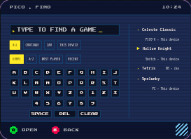
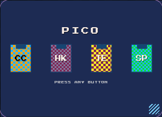
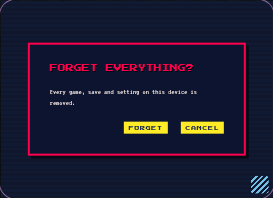

# Pico: Caliper page and interaction acceptance — 2026-09-06

## Scope and result

Completed the fixture-backed Caliper review slice: **49 discovered parts, five
live placed pages, eleven fixture sources and three configured panel sizes**.
No second component manifest was introduced. Discovery still comes from
`.part.tsx` files; review sources derive from shared fixture models.

This does **not** declare the full legacy conversion complete. No real korrid,
backend/native operations, persistent kiosk or new hardware deployment occurred.

## What now works

- Home, Find, Settings, Game Detail and Gameplay Overlay placements mount Pico's
  production controller, not static wrappers with no-op callbacks.
- Source changes republish models without replacing navigation/controller state.
  Explicit entry-view Inspector edits restart navigation. Source/input events
  target one device/page unless deliberately broadcast.
- Catalog error, Running, settings Saving/failure and overlay failure are
  reviewable alongside ready/loading/empty/busy/launch failure/overlay.
- Find typing, result-to-detail-to-Find, explicit launch locations, destructive
  confirmations, settings choices and overlay feedback use real surface flows.
  Host consequences remain explicitly labelled simulations.
- Smaller parts keep their authored data and generated prop inputs. Their inert
  source selector is suppressed using discovered layer metadata. This is a
  Caliper-only CSS compatibility rule: the current adapter API lacks a per-part
  source-filter hook. Device/page source controls remain available.

## Defects reproduced before correction

| Observed failure | Correction and verification |
| --- | --- |
| Back from a Find result lost the query destination | Clear detail before Find; unit and browser return-path checks. |
| Attract covered active local pages/questions | Restrict eligibility to idle Home; timer tests cover detail, Find, settings, confirmation and location selection. |
| Visible launch failure lost priority to hidden navigation | Rendering and Back both prioritize status; first Back dismisses failure and restores Settings underneath. |
| Wake pointer sequence could activate a covered cartridge | Consume wake gesture and its click; unit sequence and real Chromium pointer checks. |
| RG353M clipped the keyboard's first column | Preserve the keyboard's minimum content width; focus every enabled control at each panel size. |
| Provenance displaced search titles into ellipses | Let result content wrap; actual RG353M title-width assertion was observed failing first. |
| Attract loop had a mismatched repeat distance | Two equal, viewport-covering sets; measured old period 196px versus animated half-width 136px in a 272px frame. Restore legacy stepped motion. Verify geometry, actual animation and reduced-motion suppression. |
| Confirmation focus remained behind the scrim; title IDs collided | Unique IDs, active-surface-only Cancel focus, Tab wrapping, Escape and opener restoration. Verify independent previews and actual browser keyboard events. |
| Smaller parts advertised an ineffective source picker | Hide that selector without hiding generated inputs; browser checks Badge source absence, Tone editing and live page sources together. |

The shared-adapter scope test also rejected a deliberate removal of its scope
filter. The actual Caliper contract check rejected an incomplete adapter before
accepting Pico. Independent review's Back finding was fixed and re-reviewed;
no actionable code findings remained in the final pass.

## Evidence

| Check | Result |
| --- | --- |
| `nix run .#pico-check` | **319 pass, 0 fail; 824 expectations, 21 files; TypeScript clean** |
| Actual `/tmp/caliper` adapter contract | Incomplete-adapter tripwire rejected; Pico accepted |
| Chromium integration | All 49 placements; five live page flows; scoped events; Inspector prop/design inputs; no browser errors |
| HMR | Temporary source part and live page add/edit/remove without changing iframe time origin |
| Physical-size matrix | **147 captures; zero failing enabled-control name/bounds cases** |
| Portal regression | **244 pass**, TypeScript clean, production build succeeds |
| Shift regression | **57 pass**, TypeScript clean |

The review inspected contact sheets covering all 147 part/device captures, then
re-captured the full matrix after fixes. Focus checks intentionally scroll each
control into view: a decorative shelf extending beyond its viewport is not the
same as an unreachable action. Captures can include focus-scrolled states.

The generated [matrix report](pico-caliper-2026-09-06/report.json) records every
case. Its filenames refer to the verifier's output directory; three representative
RG353M images are preserved here rather than checking in all 147 PNGs:





Reproduce from the repository with the registered Caliper project running:

```sh
nix run .#pico-check
CALIPER_ROOT=/path/to/caliper node surfaces/pico/caliper/verify-contract.mjs
CHROMIUM=/path/to/chromium VERIFY_HMR=1 \
  PHYSICAL_REVIEW_DIR=/tmp/pico-review \
  node surfaces/pico/caliper/verify-browser.mjs
```

Default launcher: `http://127.0.0.1:3131`; override with `CALIPER_URL`. The run
changes workspace selection/preferences and may write `.lab/pico/state.json`.
Use a development workspace and preserve unrelated user edits when cleaning up.

## Boundaries

- Sizes are Caliper's configured **72×52, 132×76 and 156×85 mm** panels. These
  screenshots are browser simulations, not calibrated on-device readability.
  Isolated primitives are shown without their consumers' usual padding; Caliper
  frame chrome is not Pico product chrome.
- Accessibility review covered enabled-control naming/reachability, confirmation
  focus and unique labelling, scoped keyboard input and reduced motion. It is
  not an assistive-technology or WCAG certification, nor every possible data
  combination or interaction sequence.
- Gamepad/spatial navigation and settings text editing remain unfinished. Two
  existing product semantics were explicitly deferred: gameplay ranges only
  increment (`01M1W7E6TTWVS9ZYYCB6YQJ2JM`), and MOST PLAYED mixes playtime seconds
  with play counts (`01M1W7EGBJVH5E2TS6X8BAFVPZ`). This report does not accept those
  behaviors as correct. Broader legacy-design accounting remains separate.
- The earlier RG353M kiosk demo predates this work and is not evidence for it.
