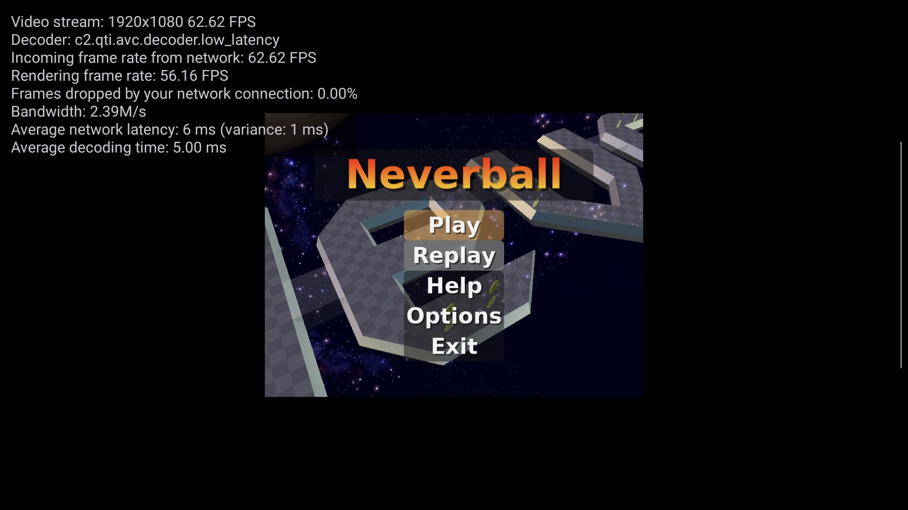
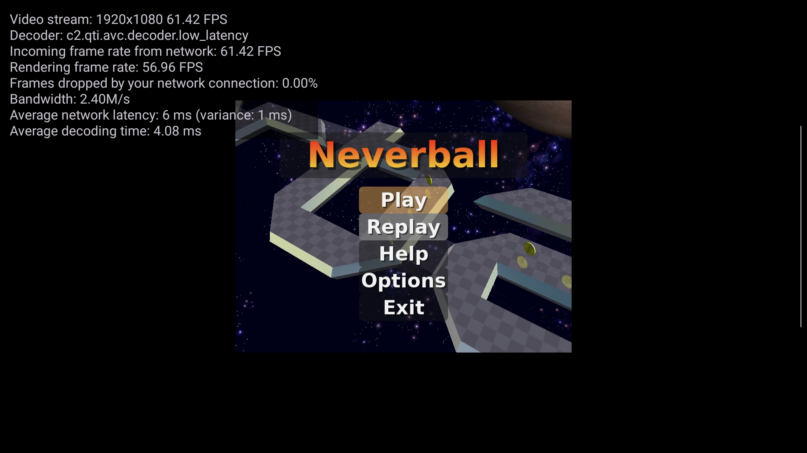

# Sunshine Korri Sway physical acceptance, 2026-09-02

## Scope

This record accepts the headless Sway stream on Zao. It includes a real Neverball stream and the persistent switch.

This record does not accept 1080p120, audio, pointer input, or a reboot test. Those items remain outside this work.

## Identities

- Korri commits: `faefbfca`, `44f0d443`, `6ba25785`, `19781905`, and `b56b7ef0`
- Mountainous commit: `5efbc6b`
- Final generation: `/nix/store/d62kzbx1g685f0fq6jm8qsqg4ghkblxw-nixos-system-zao-26.05.20260313.c06b4ae`
- Rollback generation: `/nix/store/1mcr6ss9qailqcmnfrfw8vv8b0rmxsr5-nixos-system-zao-26.05.20260313.c06b4ae`
- Final bundle: `/nix/store/92zlzz0q6gkh68j8hs8ivv46hs4785ig-korri-bundle-0.0.0`
- Rollback bundle: `/nix/store/ppvh8bblf301v5k98vvkabp5d1vhb01i-korri-bundle-0.0.0`
- Patch `0017` SHA-256: `a87aefc6eb5f71a4d413d751eefb87743745a2fab126dded5b66b23b949f66b2`
- Ordered twelve-patch digest: `81c4c0f0b160a64d88cc139725b4698d180d5620c44ebf252dfc621a4b0cda47`
- Sunshine private-state digest: `f8979ccb7cee28a943cb3d0361da5af1ff80044c72140e88cd94594e85a750bd`
- Client: Bandai, package `com.simonwjackson.korri.debug`

Nothing was pushed. No pull request was opened.

## Faults found during acceptance

The first physical SHM candidate rejected format `875710274`. This value is `DRM_FORMAT_BGR888`.

Sway supplied 24-bit BGR rows. Sunshine accepted only 32-bit XRGB and ARGB rows.

Patch `0017` now converts each BGR row to the BGRA byte order that the CUDA path consumes.

The first persistent switch kept the rollback bundle active. A NixOS generation switch did not replace the existing bundle selector.

The same restore attempt started InputPlumber before raw joystick restoration. The restore then stopped with `InputPlumber is still active during raw joystick restore`.

Commit `6ba25785` selects the bundle from each generation. It also restores raw joystick state before rollback activation starts InputPlumber.

Commit `b56b7ef0` keeps the restore path compatible with generations that have no bundle selector service.

## Temporary candidate acceptance

Candidate `/nix/store/xzzxw17q3696dxaldx7xj2ilrdb6nms3-nixos-system-zao-26.05.20260313.c06b4ae` passed the temporary candidate gates.

The Korrid catalog contained `Neverball (zao)` and the moving video gate. Korrid launched Neverball in one isolated game unit.

The game unit used Xwayland `:0`. The unit had no access to native Wayland, Sway control, or the compositor process.

Bandai showed moving Neverball frames with correct colors. The H.264 stream used 1920x1080 at approximately 60 FPS.

The temporary stream gate returned:

`nvenc-stream-gate=pass encoder=h264_nvenc strict=yes capture=wayland invocation=current`

The current Sunshine invocation contained no unsupported SHM format, capture failure, scaling failure, or X11 capture record.

The guarded rollback restored the exact rollback generation and rollback bundle. It also removed the attempt marker and lease.

## Persistent stream acceptance

The final persistent switch selected the final generation and final bundle. It did not reboot Zao.

Bandai launched `Neverball (zao)` through the portal. Korrid created game unit `korri-game-bed00face0a95876e003d63dfb47f57c.service`.

The strict stream gate returned:

`nvenc-stream-gate=pass encoder=h264_nvenc strict=yes capture=wayland invocation=current`

The isolation gate returned:

`game-compositor-gate=pass xwayland=visible wayland=hidden control=hidden procfs=isolated unit=one`

Bandai reported these samples:

| Sample | Incoming FPS | Rendered FPS | Network loss |
|---|---:|---:|---:|
| 5 seconds | 62.62 | 56.16 | 0.00% |
| 15 seconds | 61.42 | 56.96 | 0.00% |

The decoder was `c2.qti.avc.decoder.low_latency`. Network latency was 6 ms to 9 ms in the recorded samples.

Two final image comparisons changed 479,271 and 465,846 pixels. This result proves continuous moving output.

Sunshine used PID `2905377` during the accepted stream. It used 114,597,888 bytes after the stream gate.

The current Sunshine invocation contained no `Unsupported screencopy SHM format`, `Frame capture failed`, or `Couldn't scale frame` record.

## Compositor action

The module check runs the exact immutable `swaymsg` command against a floating Xwayland window in a real nested Sway compositor.

The final live Sway tree recorded the Neverball window at 800x600 with `fullscreen_mode=0` before the command.

The same window then had a 1920x1080 rectangle, focus, and `fullscreen_mode=1`. The exact configured command made this change.

The inputd dispatcher and action limits have automated coverage. This record does not claim a physical inputd chord through Neverball.

Neverball expects the older Linux joystick interface. This acceptance does not claim compatibility with the newer interface.

## Final state

The current generation and the system profile both use the final generation.

These system services are active:

- `inputplumber.service`
- `korri-inputd.service`
- `korrid.service`
- `korri-compositor.service`
- `sunshine.service`

`x11-headless.service` is inactive. No Korri game unit remains active.

The attempt marker is absent. The attempt lease is inactive.

The post-stream automated gates passed. The Sunshine private-state digest did not change.

Bandai returned to this baseline:

- resolution `1280x720`
- FPS `60`
- codec `auto`
- unlock-FPS `false`
- performance overlay `false`

No reboot occurred.
