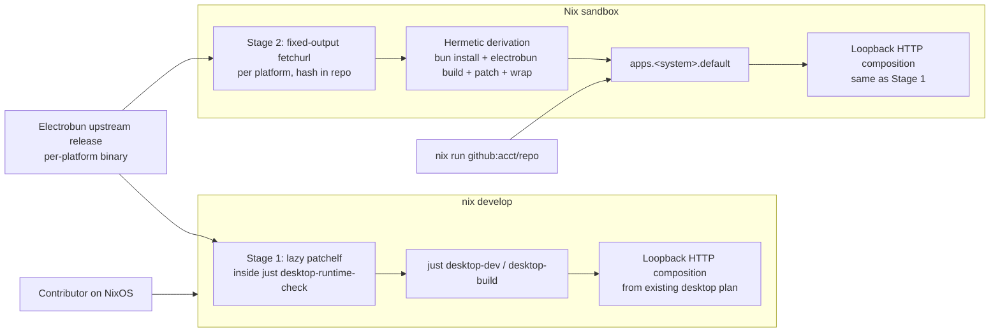

# Electrobun Nix-Native Build (Staged)

## Problem Frame

The Electrobun desktop wrapper landed via `docs/plans/2026-04-30-004-feat-electrobun-desktop-wrapper-plan.md`, but its NixOS story is currently a guardrail: `just desktop-runtime-check` detects the dynamic-linker stub and refuses to proceed. Local desktop development on the project's `nix develop` shell is broken, and there is no way to launch the desktop app from a remote flake. The flake should make Korri's desktop app feel native to Nix on Linux: `nix develop` produces a working `just desktop-dev`/`desktop-build`, and `nix run github:<acct>/<repo>` launches the desktop app on x86_64-linux and aarch64-linux without any developer setup.

This work extends the existing desktop plan; it does not replace its loopback HTTP composition, runtime check, or smoke tooling. The product behavior of the desktop app (single same-origin loopback, reused `honoApp`, SPA fallback, traversal protection) is unchanged.

## Shape

## Requirements

**Stage 1 — Nix dev loop**

- R1. Inside `nix develop` on Linux, `just desktop-dev` and `just desktop-build` run to completion against an unmodified upstream Electrobun release without the user enabling host-level `nix-ld`, configuring NixOS modules, or installing system packages outside the flake.
- R2. `just desktop-runtime-check` evolves from a fail-loud guardrail into a self-healing readiness step: when the prebuilt Electrobun binary cannot start under the NixOS dynamic linker, it auto-patches the binary in place using the flake's interpreter and library paths, then re-probes; if patching itself fails, it surfaces an actionable message instead of a Linux dynamic-linker stack trace.
- R3. The patch set covers both the Electrobun CLI binary at `node_modules/electrobun/bin/electrobun` and the per-build native artifacts Electrobun emits under `out/build/electrobun/**` so that the launched window actually opens, not just the CLI exiting cleanly.
- R4. Patching is idempotent and cached so the inner `electrobun dev` rebuild loop stays fast: re-runs over already-patched files are no-ops, and only newly emitted artifacts are touched.
- R5. Patching only runs as part of the desktop recipes. Web-only and API-only contributors who never invoke `just desktop-*` continue to work without any patchelf cost or behavior change.
- R6. Running `bun install` does not require a manual re-patch step: the next desktop recipe invocation detects the freshly extracted binaries and patches them automatically.

**Stage 2 — Hermetic Nix package**

- R7. The flake exposes `apps.<system>.default` (and a named alias `apps.<system>.korri-desktop`) so that `nix run github:<acct>/<repo>` launches the desktop app with no prior `nix develop`, no `just`, and no host-side build steps.
- R8. The package supports `x86_64-linux` and `aarch64-linux`. macOS and Windows are explicit non-goals for this brainstorm.
- R9. The package builds inside the Nix sandbox without network access at evaluation time. All inputs are either flake inputs, repo files, or fixed-output fetches keyed on hashes that live in the repo.
- R10. The packaged desktop app preserves the loopback HTTP composition from the existing desktop plan. The shipped binary serves both `/api/*` (delegating to the existing `honoApp`) and the built portal assets from one same-origin `127.0.0.1` HTTP server, exactly as the current `just desktop-build` artifact does.
- R11. The packaged binary is launchable on a clean NixOS host with only `nix` available — GTK, WebKitGTK, libayatana-appindicator, librsvg, and any other runtime libraries are part of the package's runtime closure or are baked into RPATH/`LD_LIBRARY_PATH` via wrapping.

**Verification and ongoing maintenance**

- R12. CI verifies remote-flake invocation: a job runs `nix run` against the trunk flake (and against the remote `github:<acct>/<repo>` URL on the merge commit) for both `x86_64-linux` and `aarch64-linux`, and fails the build if the desktop app cannot start.
- R13. CI verifies Stage 1: a job enters `nix develop` on Linux and runs `just desktop-runtime-check` plus `just desktop-smoke` to prove the dev loop still works.
- R14. The per-platform Electrobun binary is pinned by fixed-output hash in the repo. Bumping the Electrobun npm version requires a small, visible repo change (lockfile + per-platform hash entries), not silent network drift.

## Success Criteria

- `nix develop` followed by `just desktop-dev` opens a Korri desktop window on a fresh NixOS x86_64 box that has nothing but `nix` installed, with no host configuration changes.
- `nix run github:<acct>/<repo>` opens that same window on the same host, also with nothing but `nix` installed and no prior checkout.
- `nix run github:<acct>/<repo>` works equivalently on `aarch64-linux`.
- A web-only contributor running `just dev`, `just build`, or `just check` sees no new patchelf output, no new prerequisites, and no measurable runtime cost from this work.
- Bumping Electrobun to a new upstream version is a contained PR: lockfile change + per-platform hash updates + a green CI run, with no surprise network fetches at `nix build` time.

## Scope Boundaries

- **No host-level `nix-ld` requirement.** The flake must not assume the user enabled `programs.nix-ld` or any NixOS module. `nix-ld` may be documented as an alternative for users who prefer it, but the supported path is in-flake patchelf.
- **Linux only for Stage 2.** macOS and Windows are out of scope for `nix run`. Their app-bundle layouts and signing requirements are qualitatively different work and belong in a separate effort.
- **No CEF.** System webview only, matching the existing desktop plan. Bundling Chromium would introduce another large binary supply chain.
- **No code signing, notarization, app icons, AppImage, auto-update channels, or release hosting in this work.** These remain deferred from the existing desktop plan.
- **No replacement of Stage 1 by Stage 2.** Stage 1 is the fast inner dev loop; Stage 2 is the distribution surface. Both ship and stay maintained.
- **No change to product UI, RPC contracts, spatial navigation, or the loopback HTTP composition.** This brainstorm is about packaging and platform compatibility, not feature work.

## Key Decisions

- **Stage 1 strategy: auto-patchelf the prebuilt Electrobun binary** — the flake-shipped option, contained inside the repo, survives `bun install`, and works without user host configuration. Alternatives considered: documenting `nix-ld` as a host requirement (pushes setup outside the flake), wrapping every Electrobun invocation in `buildFHSEnv` (heavier per-invocation cost), and building Electrobun from source via Nix (deferred — ties us to Electrobun's internal build).
- **Stage 1 trigger: lazy, inside the desktop recipes** — patching runs as part of `just desktop-runtime-check`, which `desktop-dev` and `desktop-build` already depend on. Web/API-only contributors pay nothing. Alternatives considered: `postinstall` hook (taxes every contributor on every install), `shellHook` (runs every shell entry, doesn't survive `bun install`), and a combined approach (awkward conditional logic in `package.json`).
- **Stage 1 patch set: CLI + post-build artifacts, with cache** — patching only the CLI gives a half-working state where `electrobun --help` succeeds but the launched window crashes on its native launcher; patching only the post-build outputs misses the CLI itself. Cache (e.g., a marker file under `out/build/electrobun/.patched`) keeps the inner `electrobun dev` loop fast.
- **Stage 2 ambition: hermetic in-sandbox build** — the user requirement is `nix run github:<acct>/<repo>` working with nothing pre-installed, which forces the work into the derivation graph. Alternatives considered and rejected: CI-built release artifact + `fetchurl` (cleaner ongoing maintenance, but still adds a release pipeline as a deliverable, and the user explicitly chose hermetic), vendoring the prebuilt artifact in-repo (bloats git history, fragile), and `nix run` as a wrapper around `nix develop` (does not work for remote flakes).
- **Stage 2 platform scope: `x86_64-linux` + `aarch64-linux`** — covers NixOS desktops and ARM Linux without taking on Darwin's app-bundle layout in the same brainstorm.
- **Stage 1 and Stage 2 stay distinct deliverables.** Stage 1 ships first (fast inner loop), Stage 2 ships second (distribution). Stage 2 reuses Stage 1's loopback HTTP composition and patching logic where possible, but does not depend on a contributor having entered `nix develop` first.

## Dependencies / Assumptions

- The flake's existing Linux dev-shell prerequisites (`gtk3`, `webkitgtk_4_1`, `libayatana-appindicator`, `librsvg`, `pkg-config`, `cmake`, `gcc`, `patchelf`) cover the runtime libraries Electrobun needs. **Unverified** — the GTK/WebKit set may need additions like `glib`, `libsoup`, `at-spi2-core`, or font/icon themes once the patched binary actually launches; planning will confirm.
- Electrobun publishes per-platform release artifacts for `x86_64-linux` and `aarch64-linux` that can be `fetchurl`ed by SHA256. **Unverified** — planning will confirm against the upstream release page; if aarch64-linux is not published, R8 needs revisiting.
- `bun install` with `--ignore-scripts` against a locked `bun.lock` is reproducible enough to wrap as a fixed-output derivation. **Unverified** — bun's hermetic-install story in nixpkgs is still maturing; planning will pick the concrete mechanism (custom FOD wrapping `bun install`, third-party `bun2nix`, or `buildNpmPackage` consuming bun's npm-compatible lockfile).
- The existing `honoApp` and `createDesktopApp` composition can be invoked unchanged from a Nix-built bundle. The desktop plan's Stage-1-style loopback is the contract Stage 2 packages.
- The existing `just desktop-runtime-check` is the right place to slot in lazy patching. Its current contract (probe-only, fail-loud on NixOS) becomes patch-then-probe; tests under `tools/desktop/electrobun-runtime-check.test.ts` will need updating to reflect the new behavior.

## Outstanding Questions

### Resolve Before Planning

_(none — all product/scope decisions are made.)_

### Deferred to Planning

- [Affects R9][Technical][Needs research] Which hermetic-bun mechanism wins: a hand-rolled fixed-output derivation around `bun install --ignore-scripts`, a third-party tool such as `bun2nix`, or `buildNpmPackage` against bun's npm-compatible lockfile? The decision depends on Electrobun's postinstall behavior and how cleanly each option neutralizes its network fetch.
- [Affects R3, R11][Technical][Needs research] Confirm the full library closure that GTK3 + WebKitGTK 4.1 + libayatana-appindicator actually pulls in once a patched Electrobun window opens; extend the flake's Linux package list and the Stage 2 package's RPATH if anything is missing.
- [Affects R8, R14][Needs research] Confirm Electrobun publishes both `x86_64-linux` and `aarch64-linux` release artifacts at every version we want to track. If aarch64-linux lags, decide whether Stage 2 ships x86_64 first and adds aarch64 once upstream catches up.
- [Affects R2, R4][Technical] Patch-cache placement and invalidation: a marker file under `out/build/electrobun/.patched` is the obvious choice, but planning should confirm it survives `electrobun dev`'s rebuild and watch loops without being clobbered.
- [Affects R12][Technical] CI runner shape for `aarch64-linux` `nix run` verification: native ARM runners vs `qemu-user` emulation vs deferring aarch64 CI verification until ARM runners are available. Affects CI time and reliability, not the product.
- [Affects R7][Technical] Whether `apps.<system>.default` should also auto-build the portal (`bun run build`) inside the derivation, or whether the portal build is a separate `packages.<system>.korri-portal` input that `apps.<system>.default` consumes. Affects evaluation time and caching, not user-facing behavior.

## Next Steps

-> `/ce:plan` for structured implementation planning, in two stages so they can ship independently.
