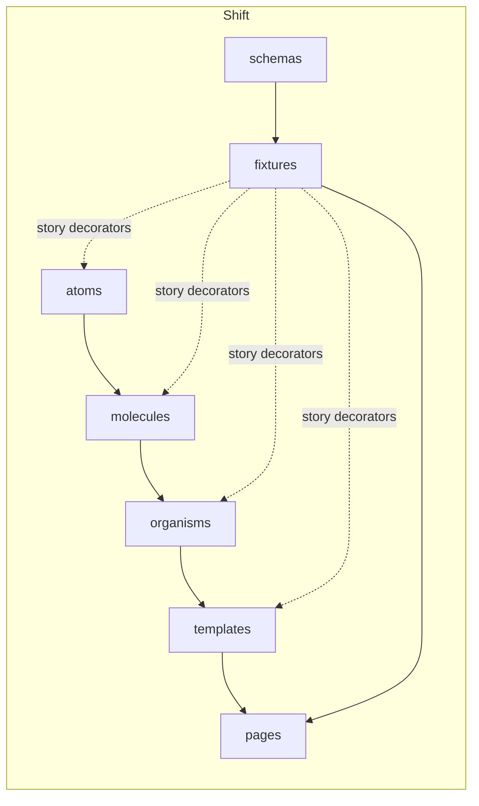

# feat: Port Shift as the first Korri theme using atomic design

## Overview

Port the components currently sitting in `old-ui/` into a new themeable design system under `korri/shared/themes/shift/`, organized via atomic design (atoms → molecules → organisms → templates → pages). Every level gets Storybook coverage that runs entirely off static fixtures — no live RPC, no contexts that fetch, no real data anywhere in Storybook. This is the first theme; the folder shape and conventions need to scale to N themes without a registry rewrite.

## Problem Frame

`old-ui/` holds a working "Shift" gaming UI written as flat components in `src/components/`. The starter currently has a placeholder `korri/shared/design-system/theme/styles.css` and one Storybook story. We need:

- A themable home for Shift such that future themes (other aesthetics, not just colour swaps) live next to it.
- A discipline that lets every component be developed and reviewed in Storybook without ever touching the RPC layer.
- A Effect-only stance: no `zod`, no runtime prop validation libs.
- Visible atomic-design layering so the team can build/replace pieces at the right level instead of dumping everything into one organism.

## Requirements Trace

- R1. Shift exists as a self-contained theme under `korri/shared/themes/shift/`, structured so additional themes can follow the same shape.
- R2. Every component renders meaningful Storybook stories that use only static, in-repo fixtures.
- R3. Atomic levels are explicit and reflected in folder layout, story titles, and the components' allowed responsibilities.
- R4. No `zod`. Schemas (where needed) are Effect Schema. No runtime prop validation on components.
- R5. New runtime dependencies are `lucide-react`, `framer-motion`, and `@noriginmedia/norigin-spatial-navigation`. No `zod`.
- R6. `just dev-storybook` renders Shift stories with the theme's CSS already loaded; light/dark mode is toggleable inside Storybook; spatial-nav is initialized so focusable components work in stories.
- R7. Component API parity: every old-ui component lands in Shift in some form (renamed, regrouped, or split). `GridView` ports as an organism with its `zod` prop schema removed; TS types are the boundary.

## Scope Boundaries

- No runtime theme registry / dynamic theme switching across themes (single theme today; folder shape is the abstraction).
- No gamepad input hooks (`useGamepadNavigation`, `useGamepadPaging`, `useDebugMenuToggle`). These are app/product plumbing, not theme code; they translate gamepad events into keyboard events that spatial-nav already consumes.
- No wiring of Shift into `korri/products/app`. The product still renders the existing Welcome page.
- No e2e/Playwright tests for theme components. Storybook is the visual surface; unit tests cover pure logic.
- No deletion of `old-ui/` in this plan. That happens once Shift is the source of truth and no one needs to reference the original.

### Deferred to Separate Tasks

- Gamepad-to-keyboard hooks (`useGamepadNavigation`, `useGamepadPaging`, `useDebugMenuToggle`): separate plan when a product needs gamepad input.
- Theme registry / runtime theme switching: separate plan when a second theme exists.
- Wiring Shift into a real product route: separate plan once we know which product will adopt it.
- Removing `old-ui/`: cleanup task after Shift fully lands.

## Context & Research

### Relevant Code and Patterns

- `old-ui/src/components/*` — source components to port (Header, Footer, FooterActions, Navigation, NavigationDots, FilterBar, GameFilterBar, GameCard, GameGrid, FeaturedGameGrid; **not** GridView).
- `old-ui/src/index.css` — source CSS variables, dark-mode setup, custom keyframes (`slide-in-right`, `slide-in-left`), and component-layer utilities. Becomes the basis for `shift.css`.
- `old-ui/src/contexts/ThemeContext.tsx`, `old-ui/src/contexts/ScaleContext.tsx`, `old-ui/src/hooks/useContainerSize.ts` — port as-is, relocated under the theme folder.
- `korri/shared/design-system/theme/styles.css` — current global typography baseline. Stays as theme-agnostic foundation.
- `korri/deploy/storybook/main.ts` — already globs `../../shared/**/*.stories.@(ts|tsx|mdx)`; theme stories will be picked up automatically.
- `korri/deploy/storybook/preview.ts` — currently imports the design-system stylesheet only; will need to also import Shift CSS and wire a dark-mode toolbar.
- `korri/products/app/features/welcome/Welcome.stories.tsx` — flat-file component+story convention to mirror.
- `AGENTS.md` style rules: `PascalCase.tsx` for components, `useFoo.ts` for hooks, no barrel exports, kebab-case folders.

### Institutional Learnings

- `docs/solutions/` does not yet exist in this repo. No prior learnings to apply.

### External References

- Brad Frost, "Atomic Design": atoms = single-purpose UI primitives, molecules = small clusters of atoms with light coordinating state, organisms = composed sections owning layout + interaction, templates = page-level layout shells with slot-shaped children, pages = templates + concrete data.

## Key Technical Decisions

- **Themes live at `korri/shared/themes/<theme>/`**. Themes are shared runtime code (multiple products might adopt one). Per `AGENTS.md`, that's `korri/shared/*`.
- **One theme = one folder, fully self-contained**: tokens, CSS, contexts, hooks, schemas, fixtures, atoms, molecules, organisms, templates, pages. A theme is a coherent unit you can read end-to-end.
- **Atomic levels are enforced by folder, not by base class**. The rule is procedural: the folder a file lives in dictates what it's allowed to do (state, composition, data). See "Atomic level rules" below.
- **No `index.ts` barrels** (per `AGENTS.md`). Cross-level imports are explicit relative paths within the theme.
- **Stories title format: `Themes/Shift/<Level>/<ComponentName>`**. This produces the atomic-design tree in Storybook's sidebar without configuration.
- **Storybook hermetic-data rule**: pages and templates accept data via props or a story-time decorator. If a real component currently calls a hook that fetches, the hook is split: data-fetching stays out of the component; the component takes shaped data as a prop.
- **Spatial-nav is initialized once in Storybook preview** (norigin's `init()` is global). Components using `useFocusable` work in stories without per-story setup. A `withSpatialNav` decorator is available for stories that want explicit focus restoration.
- **Effect Schema only where shapes need to be runtime-checked or where the same shape is shared between fixture + future RPC**. `GameRecord` qualifies. Component prop types stay TS-only — no runtime prop schemas.
- **Shift defaults to dark mode** (matches `old-ui` default) but Storybook exposes a toolbar toggle that adds/removes the `dark` class on the preview root.
- **`shift.css` is imported once in Storybook preview**. In real product use, the theme CSS will be imported by whichever product adopts Shift (out of scope here).
- **Light gating, not heavy abstraction**: we do not build a `useTheme()` component-resolver hook. When a second theme appears we'll plan that explicitly.

### Atomic level rules

| Level | May own state? | May compose | May fetch / use RPC | Typical examples |
|---|---|---|---|---|
| atom | No (visual props only) | None | No | `Card`, `NavTab`, `PageDot`, `GamepadHint`, `SearchInput`, `Select`, `StatusIcon`, `AvatarImage`, `ToggleIconButton` |
| molecule | Light coordination state only (e.g., open/closed, hover) | Atoms | No | `NavTabGroup`, `PageDots`, `GamepadHintGroup`, `ViewModeToggle`, `FilterChipBar`, `StatusBar` |
| organism | Yes (interaction state, pagination, layout-aware logic) | Atoms + molecules | No | `Header`, `Footer`, `FooterActions`, `Navigation`, `FilterBar`, `GameFilterBar`, `GameGrid`, `FeaturedGameGrid` |
| template | Layout state only (no domain state) | Organisms via slot props | No | `LibraryTemplate`, `FeaturedTemplate` |
| page | Yes — but Storybook stories must inject data via props or a decorator | Templates | Real product code may; Storybook stories may **not** | `LibraryPage`, `FeaturedPage` |

## Open Questions

### Resolved During Planning

- Themes location: `korri/shared/themes/<theme>/` (themes are shared runtime code per `AGENTS.md`).
- Runtime theme switching: deferred. Single theme means a runtime registry would be premature.
- `zod` in `GridView`: removed. `GridView` ports without runtime prop validation; TS types at the boundary are the contract.
- Component prop runtime validation in general: dropped. TS types at component boundaries are sufficient.
- Spatial-nav initialization in Storybook: call norigin's `init()` once in `preview.ts`. No per-story wiring needed.
- Renaming Game-prefixed components: kept as `GameCard`, `GameGrid`, `GameFilterBar`, `FeaturedGameGrid`. Shift is the gaming theme; game-shaped names are accurate. A future "Library" theme would have its own naming.
- Where does `AvatarImage` live? Atom — it's a single styled `` with a circular border.
- Where does the `Y / A / B` chip-button live? Atom (`GamepadHint`), then a molecule (`GamepadHintGroup`) for the row, then organisms (`Footer`, `FooterActions`) compose them.

### Deferred to Implementation

- Exact prop names where old-ui used loose strings (e.g., `viewMode`'s union may grow). Keep current API; tighten if a story demands it.
- Whether `useContainerSize` returns a callback ref vs a `RefObject` — keep current shape unless a consumer breaks.
- Whether stories use Storybook globals or a per-story decorator for dark mode — pick whichever is less wiring once the toolbar is in.
- Tailwind v3 vs v4 `@theme` block compatibility for Shift's CSS — current repo uses `@tailwindcss/vite`. Adapt the original `@theme` / `@layer` blocks during port; defer if any specific syntax breaks.

## Output Structure

    korri/shared/themes/shift/
      shift-tokens.ts
      shift.css
      context/
        ThemeModeContext.tsx
        ScaleContext.tsx
      hooks/
        useContainerSize.ts
      schemas/
        game.ts
      fixtures/
        games.ts
        nav.ts
      atoms/
        Card.tsx
        Card.stories.tsx
        NavTab.tsx
        NavTab.stories.tsx
        PageDot.tsx
        PageDot.stories.tsx
        GamepadHint.tsx
        GamepadHint.stories.tsx
        SearchInput.tsx
        SearchInput.stories.tsx
        Select.tsx
        Select.stories.tsx
        StatusIcon.tsx
        StatusIcon.stories.tsx
        AvatarImage.tsx
        AvatarImage.stories.tsx
        ToggleIconButton.tsx
        ToggleIconButton.stories.tsx
      molecules/
        NavTabGroup.tsx
        NavTabGroup.stories.tsx
        PageDots.tsx
        PageDots.stories.tsx
        GamepadHintGroup.tsx
        GamepadHintGroup.stories.tsx
        ViewModeToggle.tsx
        ViewModeToggle.stories.tsx
        FilterChipBar.tsx
        FilterChipBar.stories.tsx
        StatusBar.tsx
        StatusBar.stories.tsx
      organisms/
        Header.tsx
        Header.stories.tsx
        Footer.tsx
        Footer.stories.tsx
        FooterActions.tsx
        FooterActions.stories.tsx
        Navigation.tsx
        Navigation.stories.tsx
        FilterBar.tsx
        FilterBar.stories.tsx
        GameFilterBar.tsx
        GameFilterBar.stories.tsx
        GameGrid.tsx
        GameGrid.stories.tsx
        FeaturedGameGrid.tsx
        FeaturedGameGrid.stories.tsx
        GridView.tsx
        GridView.stories.tsx
      templates/
        LibraryTemplate.tsx
        LibraryTemplate.stories.tsx
        FeaturedTemplate.tsx
        FeaturedTemplate.stories.tsx
      pages/
        LibraryPage.tsx
        LibraryPage.stories.tsx
        FeaturedPage.tsx
        FeaturedPage.stories.tsx

## High-Level Technical Design

> *This illustrates the intended approach and is directional guidance for review, not implementation specification. The implementing agent should treat it as context, not code to reproduce.*

**Composition flow inside one theme:**

**Storybook data discipline:**

| Story level | How it gets data |
|---|---|
| atom | Inline literal props in the story file |
| molecule | Inline literal props in the story file |
| organism | Imported fixture passed as a prop |
| template | Imported fixture composed via slot props |
| page | Imported fixture passed via a decorator or directly as props — **never** a live RPC client |

**Naming map (old-ui → Shift atomic level):**

| Old-ui file | Shift level | New file |
|---|---|---|
| `GameCard.tsx` | atom | `atoms/Card.tsx` (no game-specific deps in atom) |
| chip button (extracted from `Footer`/`FooterActions`) | atom | `atoms/GamepadHint.tsx` |
| dot (extracted from `NavigationDots`/`FeaturedGameGrid`) | atom | `atoms/PageDot.tsx` |
| nav tab (extracted from `Navigation.tsx`) | atom | `atoms/NavTab.tsx` |
| icon button (extracted from `Header.tsx` theme toggle) | atom | `atoms/ToggleIconButton.tsx` |
| avatar (extracted from `Header.tsx`) | atom | `atoms/AvatarImage.tsx` |
| input (from `FilterBar.tsx`) | atom | `atoms/SearchInput.tsx` |
| select (from `FilterBar.tsx`) | atom | `atoms/Select.tsx` |
| `Wifi` / `Battery` icon wrappers | atom | `atoms/StatusIcon.tsx` |
| `NavigationDots.tsx` | molecule | `molecules/PageDots.tsx` |
| nav tab cluster | molecule | `molecules/NavTabGroup.tsx` |
| Y/A/B button row | molecule | `molecules/GamepadHintGroup.tsx` |
| view-mode toggle (from `FilterBar.tsx`) | molecule | `molecules/ViewModeToggle.tsx` |
| filter chip strip (from `GameFilterBar.tsx`) | molecule | `molecules/FilterChipBar.tsx` |
| status cluster (right side of `Header.tsx`) | molecule | `molecules/StatusBar.tsx` |
| `Header.tsx` | organism | `organisms/Header.tsx` |
| `Footer.tsx` | organism | `organisms/Footer.tsx` |
| `FooterActions.tsx` | organism | `organisms/FooterActions.tsx` |
| `Navigation.tsx` | organism | `organisms/Navigation.tsx` |
| `FilterBar.tsx` | organism | `organisms/FilterBar.tsx` |
| `GameFilterBar.tsx` | organism | `organisms/GameFilterBar.tsx` |
| `GameGrid.tsx` | organism | `organisms/GameGrid.tsx` |
| `FeaturedGameGrid.tsx` | organism | `organisms/FeaturedGameGrid.tsx` |
| `GridView.tsx` | organism | `organisms/GridView.tsx` (zod removed; TS types only) |

## Implementation Units

- [ ] **Unit 1: Theme foundation directory + Storybook plumbing**

**Goal:** Create `korri/shared/themes/shift/` skeleton, port the Shift CSS as `shift.css`, wire it into Storybook preview alongside a dark-mode toolbar, and add `lucide-react` as a runtime dependency.

**Requirements:** R1, R5, R6

**Dependencies:** None

**Files:**
- Create: `korri/shared/themes/shift/shift.css`
- Create: `korri/shared/themes/shift/shift-tokens.ts`
- Modify: `korri/deploy/storybook/preview.ts`
- Modify: `package.json` (add `lucide-react`, `framer-motion`, `@noriginmedia/norigin-spatial-navigation`)
- Modify: `bun.lock`

**Approach:**
- Adapt `old-ui/src/index.css` to current Tailwind setup. Preserve `--background`/`--foreground`/`--foreground-muted`/`--border` CSS vars, dark mode via `.dark` class, slide-in keyframes, and the `game-card` / `nav-tab` component utilities.
- `shift-tokens.ts` defines the token shape as Effect Schema and exports the concrete Shift values. This makes future themes type-aligned to the same shape and enables fixture decoders later.
- Storybook preview imports `@shared/themes/shift/shift.css`, registers a global toolbar item `theme` with `light` / `dark` options, and a decorator that toggles the `dark` class on the preview root.
- Storybook preview also calls norigin's `init()` once at module scope so any story using `useFocusable` works without per-story plumbing.
- Keep `korri/shared/design-system/theme/styles.css` for theme-agnostic foundations (font, base resets). Shift CSS layers on top.

**Patterns to follow:**
- `korri/deploy/storybook/preview.ts` (existing CSS import pattern)
- `old-ui/src/index.css` (token + utility structure)
- `AGENTS.md` rules on file naming and no barrels

**Test scenarios:**
- Integration: `just dev-storybook` boots without errors; the existing Welcome story renders with both Shift CSS and design-system CSS present.
- Integration: Storybook toolbar exposes a theme toggle; flipping it adds/removes the `dark` class on the preview root and visibly changes background colour using Shift tokens.
- Integration: norigin `init()` runs during preview load without errors; a tiny throwaway focusable element (or the existing Welcome story) renders cleanly.

**Verification:**
- `nix develop --command just dev-storybook` starts cleanly.
- Welcome story still renders.
- Theme toolbar visibly toggles dark mode.
- No console errors related to spatial-nav initialization.

---

- [ ] **Unit 2: Effect Schema for `GameRecord` + static fixtures**

**Goal:** Define `GameRecord` as Effect Schema, port static fixtures from `old-ui` (or invent a small static set) so every higher level can consume identical data without RPC.

**Requirements:** R2, R4

**Dependencies:** Unit 1

**Files:**
- Create: `korri/shared/themes/shift/schemas/game.ts`
- Create: `korri/shared/themes/shift/fixtures/games.ts`
- Create: `korri/shared/themes/shift/fixtures/nav.ts`
- Create: `korri/shared/themes/shift/schemas/game.test.ts`

**Approach:**
- Schema mirrors what the old-ui consumers actually read: `id`, `metadata.name`, `metadata.media[]` (with `type` discriminator + `uri`), `userData.lastPlayed` (optional Date).
- Fixtures: ~24 static `GameRecord` entries with placeholder image URIs, hand-curated names, and a few with `lastPlayed` set so featured-grid stories show "X minutes ago" etc.
- `nav.ts` exports static tab lists, filter chip lists, view modes — anything reused by molecule/organism stories.
- Fixture file decodes through the schema at module load to guarantee fixture validity.

**Patterns to follow:**
- `korri/shared/api/rpc/errors.ts` (Effect Schema usage in this repo)

**Test scenarios:**
- Happy path: schema accepts a fully-populated `GameRecord` with metadata + media + userData.
- Edge case: schema accepts a record with only `id` (everything else optional).
- Error path: schema rejects a record where `metadata.media[].type` is not in the allowed union.
- Integration: `fixtures/games.ts` decodes successfully through the schema at import; importing the module does not throw.

**Verification:**
- `bun test korri/shared/themes/shift/schemas/game.test.ts` passes.
- Importing `fixtures/games.ts` from a story file does not throw.

---

- [ ] **Unit 3: Theme contexts + container-size hook**

**Goal:** Port `ThemeContext` (renamed `ThemeModeContext` to free the word "Theme" for our theme architecture), `ScaleContext`, and `useContainerSize` into the Shift theme folder.

**Requirements:** R1, R7

**Dependencies:** Unit 1

**Files:**
- Create: `korri/shared/themes/shift/context/ThemeModeContext.tsx`
- Create: `korri/shared/themes/shift/context/ScaleContext.tsx`
- Create: `korri/shared/themes/shift/hooks/useContainerSize.ts`
- Create: `korri/shared/themes/shift/context/ThemeModeContext.test.tsx` (only if logic warrants — see test scenarios)

**Approach:**
- Rename `ThemeContext` → `ThemeModeContext` to prevent confusion between "the Shift theme" and "light/dark mode".
- Keep `localStorage`-backed persistence and `prefers-color-scheme` initial detection.
- `ScaleContext` keeps the four `SCALE_PRESETS` and cycle behaviour.
- `useContainerSize` keeps `ResizeObserver` behaviour.
- Stories that need these contexts use a Storybook decorator that wraps in the providers with a fixed initial value (so toggling has no live effect during the story).

**Patterns to follow:**
- `old-ui/src/contexts/ThemeContext.tsx`
- `old-ui/src/contexts/ScaleContext.tsx`
- `old-ui/src/hooks/useContainerSize.ts`

**Test scenarios:**
- `ThemeModeContext`: hook throws outside provider (error path).
- `ThemeModeContext`: toggle flips between `light` and `dark` and updates `localStorage` (happy path + integration with persistence).
- `ScaleContext`: `toggleScale` cycles through the four presets and wraps to the first (happy path + edge case at boundary).
- `useContainerSize`: pure logic test not warranted; ResizeObserver behaviour is exercised through the FeaturedGameGrid story.

**Verification:**
- `bun test` passes the new context tests.
- Stories that wrap with these providers render without errors.

---

- [ ] **Unit 4: Atoms + their stories**

**Goal:** Port nine atoms with one story file each. Atoms are presentational, stateless, no composition.

**Requirements:** R2, R3, R7

**Dependencies:** Units 1, 3

**Files:**
- Create: `korri/shared/themes/shift/atoms/Card.tsx`
- Create: `korri/shared/themes/shift/atoms/Card.stories.tsx`
- Create: `korri/shared/themes/shift/atoms/NavTab.tsx`
- Create: `korri/shared/themes/shift/atoms/NavTab.stories.tsx`
- Create: `korri/shared/themes/shift/atoms/PageDot.tsx`
- Create: `korri/shared/themes/shift/atoms/PageDot.stories.tsx`
- Create: `korri/shared/themes/shift/atoms/GamepadHint.tsx`
- Create: `korri/shared/themes/shift/atoms/GamepadHint.stories.tsx`
- Create: `korri/shared/themes/shift/atoms/SearchInput.tsx`
- Create: `korri/shared/themes/shift/atoms/SearchInput.stories.tsx`
- Create: `korri/shared/themes/shift/atoms/Select.tsx`
- Create: `korri/shared/themes/shift/atoms/Select.stories.tsx`
- Create: `korri/shared/themes/shift/atoms/StatusIcon.tsx`
- Create: `korri/shared/themes/shift/atoms/StatusIcon.stories.tsx`
- Create: `korri/shared/themes/shift/atoms/AvatarImage.tsx`
- Create: `korri/shared/themes/shift/atoms/AvatarImage.stories.tsx`
- Create: `korri/shared/themes/shift/atoms/ToggleIconButton.tsx`
- Create: `korri/shared/themes/shift/atoms/ToggleIconButton.stories.tsx`

**Approach:**
- `Card`: image-only rounded card with hover border. Generic — takes `imageUrl`, `alt`, optional `onClick`. Replaces `GameCard`.
- `NavTab`: pill button, props `{ label, active, onClick }`.
- `PageDot`: 8x8 round dot, props `{ active }`.
- `GamepadHint`: circular Y/A/B chip-button, props `{ glyph, label, onClick }`.
- `SearchInput`: styled `<input>` + magnifier SVG.
- `Select`: styled `<select>`.
- `StatusIcon`: thin wrapper over a lucide icon to enforce sizing/aria.
- `AvatarImage`: 24px circular image.
- `ToggleIconButton`: button that swaps a sun/moon (or any pair of) lucide icon based on a boolean.
- Story files: at minimum a `Default` story; for components with state variants, also `Active`, `Hover`, `WithLabel`, etc. Story `title` must follow `Themes/Shift/Atoms/<ComponentName>`.

**Patterns to follow:**
- `old-ui/src/components/GameCard.tsx` (Card atom)
- `old-ui/src/components/Navigation.tsx` (NavTab atom extraction)
- `old-ui/src/components/NavigationDots.tsx` (PageDot atom extraction)
- `old-ui/src/components/Footer.tsx` (GamepadHint atom extraction)
- `old-ui/src/components/Header.tsx` (StatusIcon, AvatarImage, ToggleIconButton extraction)
- `old-ui/src/components/FilterBar.tsx` (SearchInput, Select extraction)
- `korri/products/app/features/welcome/Welcome.stories.tsx` (story shape)

**Test scenarios:**
- Test expectation: none — atoms are visual; their behaviour is covered by stories. Click handlers fire is implicit through the `<button>`/`<select>` element. If a future bug demands a unit test, add it then.
- Story scenarios per component: `Default`; for `NavTab`, also `Active` and `Inactive`; for `PageDot`, also `Active`/`Inactive`; for `GamepadHint`, three glyph variants; for `ToggleIconButton`, both `On`/`Off`; for `SearchInput`, `Empty` and `WithValue`; for `Select`, with options.

**Verification:**
- All atom stories visible in Storybook under `Themes/Shift/Atoms/*`.
- Each story renders without console errors in Storybook.
- `just lint` and `just typecheck` pass.

---

- [ ] **Unit 5: Molecules + their stories**

**Goal:** Port six molecules. Molecules compose atoms with light coordinating state (selection, hover, layout-aware visuals).

**Requirements:** R2, R3, R7

**Dependencies:** Unit 4

**Files:**
- Create: `korri/shared/themes/shift/molecules/NavTabGroup.tsx`
- Create: `korri/shared/themes/shift/molecules/NavTabGroup.stories.tsx`
- Create: `korri/shared/themes/shift/molecules/PageDots.tsx`
- Create: `korri/shared/themes/shift/molecules/PageDots.stories.tsx`
- Create: `korri/shared/themes/shift/molecules/GamepadHintGroup.tsx`
- Create: `korri/shared/themes/shift/molecules/GamepadHintGroup.stories.tsx`
- Create: `korri/shared/themes/shift/molecules/ViewModeToggle.tsx`
- Create: `korri/shared/themes/shift/molecules/ViewModeToggle.stories.tsx`
- Create: `korri/shared/themes/shift/molecules/FilterChipBar.tsx`
- Create: `korri/shared/themes/shift/molecules/FilterChipBar.stories.tsx`
- Create: `korri/shared/themes/shift/molecules/StatusBar.tsx`
- Create: `korri/shared/themes/shift/molecules/StatusBar.stories.tsx`

**Approach:**
- `NavTabGroup`: takes `tabs: string[]`, `activeTab`, `onTabChange`. Composes `NavTab` atoms.
- `PageDots`: takes `total`, `active`, optional `onSelect`. Composes `PageDot` atoms. (Replaces both old-ui's `NavigationDots` and the inline pagination dots in `FeaturedGameGrid`.)
- `GamepadHintGroup`: takes an array of `{ glyph, label, onClick }`. Composes `GamepadHint` atoms.
- `ViewModeToggle`: takes `viewMode: 'grid' | 'list' | 'featured'`, `onViewModeChange`. Three icon buttons.
- `FilterChipBar`: horizontally scrollable list of `NavTab`-like chips with a leading and trailing icon button slot.
- `StatusBar`: time + `StatusIcon`s + `ToggleIconButton` + `AvatarImage`. The right side of `Header`.
- Story title format `Themes/Shift/Molecules/<ComponentName>`. Each gets `Default` plus one variant (e.g., `NavTabGroup.AllTabsHover`, `PageDots.SinglePage`, `ViewModeToggle.GridSelected`/`ListSelected`/`FeaturedSelected`).

**Patterns to follow:**
- `old-ui/src/components/Navigation.tsx`
- `old-ui/src/components/NavigationDots.tsx`
- `old-ui/src/components/Footer.tsx`
- `old-ui/src/components/FilterBar.tsx`
- `old-ui/src/components/GameFilterBar.tsx`
- `old-ui/src/components/Header.tsx`

**Test scenarios:**
- Test expectation: none — molecules are visual + minimal coordination. Coverage via stories. Add unit tests only if a bug requires it.
- Story scenarios per molecule cover: empty state (where applicable), populated state, every meaningful selection variant, and at least one dark-mode-explicit story.

**Verification:**
- All molecules visible in Storybook under `Themes/Shift/Molecules/*`.
- `just lint` / `just typecheck` pass.

---

- [ ] **Unit 6: Organisms + their stories**

**Goal:** Port the eight organisms (excluding `GridView`). Organisms compose atoms + molecules and may own meaningful interaction state.

**Requirements:** R2, R3, R7

**Dependencies:** Units 2, 3, 5

**Files:**
- Create: `korri/shared/themes/shift/organisms/Header.tsx`
- Create: `korri/shared/themes/shift/organisms/Header.stories.tsx`
- Create: `korri/shared/themes/shift/organisms/Footer.tsx`
- Create: `korri/shared/themes/shift/organisms/Footer.stories.tsx`
- Create: `korri/shared/themes/shift/organisms/FooterActions.tsx`
- Create: `korri/shared/themes/shift/organisms/FooterActions.stories.tsx`
- Create: `korri/shared/themes/shift/organisms/Navigation.tsx`
- Create: `korri/shared/themes/shift/organisms/Navigation.stories.tsx`
- Create: `korri/shared/themes/shift/organisms/FilterBar.tsx`
- Create: `korri/shared/themes/shift/organisms/FilterBar.stories.tsx`
- Create: `korri/shared/themes/shift/organisms/GameFilterBar.tsx`
- Create: `korri/shared/themes/shift/organisms/GameFilterBar.stories.tsx`
- Create: `korri/shared/themes/shift/organisms/GameGrid.tsx`
- Create: `korri/shared/themes/shift/organisms/GameGrid.stories.tsx`
- Create: `korri/shared/themes/shift/organisms/FeaturedGameGrid.tsx`
- Create: `korri/shared/themes/shift/organisms/FeaturedGameGrid.stories.tsx`
- Create: `korri/shared/themes/shift/organisms/FeaturedGameGrid.test.ts`

**Approach:**
- `Header`: composes `StatusBar` + a clock label. Takes `currentTime`, `isDark`, `onToggleTheme`.
- `Footer`: composes `GamepadHintGroup`. Takes optional click handlers.
- `FooterActions`: composes `GamepadHintGroup` with Y / B / A.
- `Navigation`: thin wrapper around `NavTabGroup` for now; keeps current API so a swap-in is trivial.
- `FilterBar`: composes `SearchInput` + two `Select`s + `ViewModeToggle`.
- `GameFilterBar`: composes `FilterChipBar` + `ViewModeToggle` + a header line with `gameCount`.
- `GameGrid`: takes `games: GameRecord[]` + `viewMode` + `onGameClick`. For `'list'`, renders a placeholder. For `'grid'`, renders a CSS grid of `Card` atoms. For `'featured'`, renders `FeaturedGameGrid`.
- `FeaturedGameGrid`: keeps the dynamic grid layout calculation and pagination logic from old-ui, but uses `Card` atom + `PageDots` molecule. Wraps with a story decorator that provides `ScaleContext` and a fixed container size.
- Story title format `Themes/Shift/Organisms/<ComponentName>`. Stories use fixtures from Unit 2.
- `FeaturedGameGrid.test.ts` covers the page-count / page-slice math by extracting the pagination calculation into a pure helper that the component calls. This is the only organism with logic that materially benefits from a unit test.

**Patterns to follow:**
- `old-ui/src/components/Header.tsx`
- `old-ui/src/components/Footer.tsx`
- `old-ui/src/components/FooterActions.tsx`
- `old-ui/src/components/Navigation.tsx`
- `old-ui/src/components/FilterBar.tsx`
- `old-ui/src/components/GameFilterBar.tsx`
- `old-ui/src/components/GameGrid.tsx`
- `old-ui/src/components/FeaturedGameGrid.tsx`

**Test scenarios:**
- `FeaturedGameGrid` pagination helper:
  - Happy path: 24 games, 4 columns × 2 rows, with featured: page 1 has featured + 5 games; page 2 has 8; total pages = 3.
  - Edge case: 0 games → 1 empty page, no featured.
  - Edge case: exactly enough games to fill one page including featured (5) → 1 page total, featured shown.
  - Edge case: container too small for featured (rows<2 or columns<2) → featured suppressed; pagination still consistent.
  - Edge case: games count not divisible by per-page count → final page has fewer cells, no overflow.
- Story scenarios per organism: `Default` with fixture data; `Empty` for grids; `WithFeatured`/`WithoutFeatured` for `FeaturedGameGrid`; `LightMode` and `DarkMode` decorators for `Header` and `Footer*`.

**Verification:**
- `bun test korri/shared/themes/shift/organisms/FeaturedGameGrid.test.ts` passes.
- All organism stories render with fixture data; no story imports any RPC client or hits the network.
- `just lint` / `just typecheck` pass.

---

- [ ] **Unit 7: `GridView` organism + spatial-nav decorator**

**Goal:** Port `GridView` as an organism, removing its `zod` prop schema in favour of TS types. Add a Storybook decorator that gives stories explicit focus-context isolation when needed.

**Requirements:** R3, R4, R5, R7

**Dependencies:** Units 1, 2, 4 (Card atom for grid items)

**Files:**
- Create: `korri/shared/themes/shift/organisms/GridView.tsx`
- Create: `korri/shared/themes/shift/organisms/GridView.stories.tsx`
- Create: `korri/shared/themes/shift/organisms/GridView.test.ts`
- Create: `korri/shared/themes/shift/organisms/grid-pagination.ts` (extracted pure helper for page-layout math)

**Approach:**
- Port `old-ui/src/components/GridView.tsx`, dropping the `GridViewPropsSchema = z.object(...)` block and the `GridViewPropsSchema.parse(props)` call. Replace with a TS `GridViewProps` interface; defaults move to destructuring defaults in the function signature.
- Use the `Card` atom for items where the focused/hover overlay can be expressed via the atom's existing surface; otherwise inline the focusable wrapper with a TODO note. Prefer using the atom unless layout breaks.
- Extract the page-building loop (column/row sizing → `pages: GridItem[][]`) into `grid-pagination.ts` as a pure function `paginateItems({ items, columns, rows, cycle })`. Component calls the helper from a `useMemo`.
- Keep `forwardRef` + `useImperativeHandle` API (`next`/`prev`/`goToPage`/`currentPage`/`totalPages`/`hasNext`/`hasPrev`) so future consumers can drive the grid externally (e.g., a deferred gamepad-paging hook).
- Stories use fixture items shaped to the local `GridItem` type. A dedicated `withSpatialNav` decorator (defined inline in the stories file or in a small `korri/shared/themes/shift/.storybook-decorators/` helper) ensures focus initialization is stable across story navigation.
- AnimatePresence and motion variants stay; expose `transitionType: 'fade' | 'slide'` and `gridFlow` as story controls.

**Patterns to follow:**
- `old-ui/src/components/GridView.tsx` (functional source — translate, then strip `zod`)
- `korri/shared/api/rpc/errors.ts` (Effect Schema usage where Effect is needed; for GridView, no schema is added)

**Test scenarios:**
- Pagination helper happy path: 12 items × span=1, 4 columns × 3 rows → 1 page of 12, total 1 page.
- Pagination helper happy path: 25 items × span=1, 4 columns × 3 rows → pages of 12, 12, 1.
- Pagination helper edge case: item with `span=2` placed where it fits (2×2 block); subsequent span-1 items fill around it.
- Pagination helper edge case: item with `span=3` in a 2×2 grid → span clamped to 2 (component already does `Math.min(span, min(cols, rows))`); test the clamped placement.
- Pagination helper edge case: empty `items` → `[[]]` with `totalPages = 1`.
- Pagination helper edge case: `columns = 0` or `rows = 0` (container hasn't measured yet) → `[[]]` with `totalPages = 1`, no throw.
- Cycle behaviour (component-level, can be exercised via story interaction or a small render test): with `cycle: true`, `next()` from last page → page 0; with `cycle: false`, `next()` from last page stays on last.
- Story scenarios: `Default` (mixed spans), `EmptyItems`, `ManyItems` (forces pagination), `CycleOff`, `FadeTransition`, `SlideTransition`, `FlowColumn` vs `FlowRow`.

**Verification:**
- `bun test korri/shared/themes/shift/organisms/grid-pagination.ts` (via the `.test.ts`) passes.
- `GridView` story renders mixed-span items in Storybook; arrow-key/keyboard focus moves between items; `Enter` fires `onItemClick`.
- No `zod` import remains in `GridView.tsx` (`grep -R "from \"zod\"" korri/shared/themes/shift` returns nothing).
- `just lint` / `just typecheck` pass.

---

- [ ] **Unit 8: Templates + their stories**

**Goal:** Two layout templates that compose organisms via slot props. No domain logic.

**Requirements:** R2, R3

**Dependencies:** Units 6, 7

**Files:**
- Create: `korri/shared/themes/shift/templates/LibraryTemplate.tsx`
- Create: `korri/shared/themes/shift/templates/LibraryTemplate.stories.tsx`
- Create: `korri/shared/themes/shift/templates/FeaturedTemplate.tsx`
- Create: `korri/shared/themes/shift/templates/FeaturedTemplate.stories.tsx`

**Approach:**
- `LibraryTemplate`: takes `header`, `navigation`, `filterBar`, `content`, `footer` slot props. Owns only the column flex layout that fills the viewport.
- `FeaturedTemplate`: similar but with a different content area (centred, taller, no list density).
- Stories pass real organism instances populated with fixtures into the slots.
- Story title format `Themes/Shift/Templates/<ComponentName>`.

**Patterns to follow:**
- The page composition in `old-ui/src/App.tsx` (if it exists) or `old-ui/src/routes/*` for the implied layout shape.

**Test scenarios:**
- Test expectation: none — pure layout composition. Visual coverage in stories.
- Story scenarios: each template renders with all slots populated, in light and dark mode.

**Verification:**
- Templates visible in Storybook under `Themes/Shift/Templates/*`.
- `just lint` / `just typecheck` pass.

---

- [ ] **Unit 9: Pages + their stories**

**Goal:** Two example pages — `LibraryPage` (grid view of games) and `FeaturedPage` (featured + tail). Pages compose templates and bind data. Stories must inject data via decorator, never via a live client.

**Requirements:** R2, R3

**Dependencies:** Unit 8

**Files:**
- Create: `korri/shared/themes/shift/pages/LibraryPage.tsx`
- Create: `korri/shared/themes/shift/pages/LibraryPage.stories.tsx`
- Create: `korri/shared/themes/shift/pages/FeaturedPage.tsx`
- Create: `korri/shared/themes/shift/pages/FeaturedPage.stories.tsx`

**Approach:**
- Each page accepts a `data` prop (fixture-shaped). The page component is the only level allowed to "know" what real product code would later inject.
- Stories supply the `data` prop directly from `fixtures/games.ts` + `fixtures/nav.ts`.
- A short comment block at the top of each page file states the rule: "Stories for this component must not call any data-fetching code. Pass props directly."

**Patterns to follow:**
- `korri/products/app/features/welcome/Welcome.stories.tsx` (story shape)
- `old-ui/src/App.tsx` or `old-ui/src/routes/*` for the page composition the original implied

**Test scenarios:**
- Test expectation: none — pages compose existing tested pieces. The discipline that matters is the no-RPC rule, enforced socially + by the comment marker. (A future lint rule could enforce this; not in scope.)
- Story scenarios: `Default`, `Empty` (zero games), `LargeLibrary` (full fixture set), `LightMode`/`DarkMode` toolbar variants.

**Verification:**
- `LibraryPage` and `FeaturedPage` stories render in Storybook with only fixture data.
- Grepping `korri/shared/themes/shift/**/*.stories.tsx` for any RPC/client import returns no matches.
- `just check` passes.

## System-Wide Impact

- **Interaction graph:** No runtime entry points change. Storybook preview gains a dark-mode toolbar.
- **Error propagation:** N/A for this plan (no API/data-fetching surface introduced).
- **State lifecycle risks:** None — themes are presentational. `localStorage` access in `ThemeModeContext` mirrors old-ui behaviour.
- **API surface parity:** Component prop APIs evolve from the `old-ui` shapes (atom/molecule extraction). Old-ui itself is untouched, so no consumer breakage. When a product later adopts Shift, that is a separate plan.
- **Integration coverage:** Shift CSS coexists with `korri/shared/design-system/theme/styles.css`; both load in Storybook preview. They must not conflict — Shift defines `--background`/etc; design-system handles font + base resets only. Verified via the Welcome story rendering before/after.
- **Unchanged invariants:**
  - The Welcome route, Welcome story, and existing Effect RPC plumbing are not touched.
  - `just dev`, `just test-e2e`, and HTTPS Playwright behaviour from prior commit remain functional.
  - `korri/shared/design-system/theme/styles.css` continues to define theme-agnostic baseline styles.
  - `old-ui/` is not modified; it remains the historical reference until a separate cleanup task removes it.

## Risks & Dependencies

| Risk | Mitigation |
|------|------------|
| Atomic-design folder rules drift over time (atoms creep into doing organism things). | Codify the rules in this plan + add a short note at the top of `korri/shared/themes/shift/` (e.g., a `SHIFT.md` is *out of scope*; a comment in `shift-tokens.ts` is acceptable). Future review enforces it. |
| Theme architecture proves wrong when a second theme arrives. | The plan explicitly avoids registry abstraction. We accept rework cost when the second theme appears; that cost is bounded (file moves + a resolver hook). |
| Storybook stories accidentally import the live RPC client. | Page-level comment marker; convention in this plan. A lint rule is a separate task. |
| `lucide-react` icon set drift across themes. | Atom-level wrappers (`StatusIcon`) localize the dependency. Other themes can swap to a different icon library without touching organisms. |
| `FeaturedGameGrid` pagination math regressions during port. | Extract the calculation into a pure helper with unit-test coverage (Unit 6). |
| `GridView` pagination + multi-span placement regressions during port. | Extract `paginateItems` as a pure helper with unit-test coverage (Unit 7). |
| Spatial-nav focus interactions break in Storybook (initial focus, focus loss across story navigation). | Initialize norigin once in preview; provide a `withSpatialNav` decorator for stories that need explicit focus restoration. Verify in `GridView` story. |
| `framer-motion` adds bundle weight (~50kb gzipped) for whichever product later adopts Shift. | Acknowledged. Bundle impact lands when a product opts into Shift, not in this plan. Tree-shaking + lazy loading at the product layer remain available. |
| Tailwind v3 `@layer components` syntax in Shift CSS may not match the project's current Tailwind version. | Adapt during Unit 1; if any specific block fails, drop it and rewrite using utilities. Listed as deferred-to-implementation. |

## Documentation / Operational Notes

- No external documentation impacts in this plan. README mentions of "Storybook" stay accurate.
- Once Shift is wired into a product (separate plan), the AGENTS.md style guide should grow a "Themes" section.

## Sources & References

- Source components: `old-ui/src/components/*.tsx`
- Source styles: `old-ui/src/index.css`
- Source contexts/hooks: `old-ui/src/contexts/*`, `old-ui/src/hooks/useContainerSize.ts`
- Existing Storybook config: `korri/deploy/storybook/main.ts`, `korri/deploy/storybook/preview.ts`
- Project conventions: `AGENTS.md`, `docs/development/standards.md`, `docs/development/style-guide.md`
- Brad Frost, "Atomic Design" (canonical reference for the level definitions used here)
