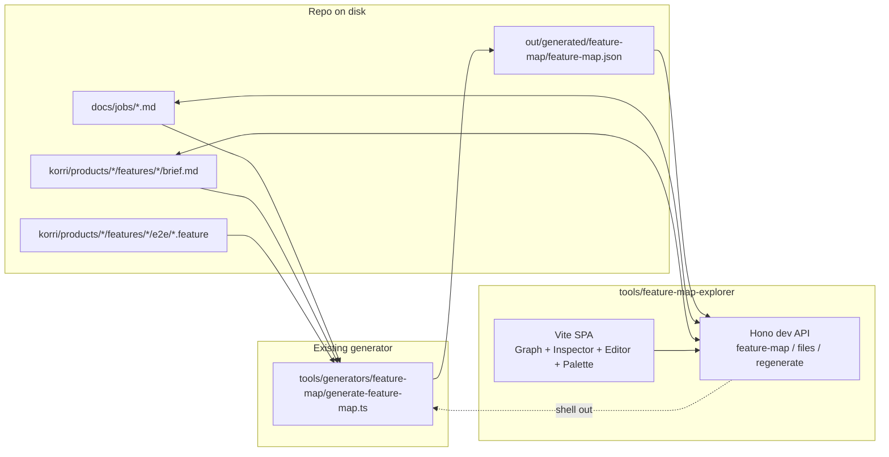
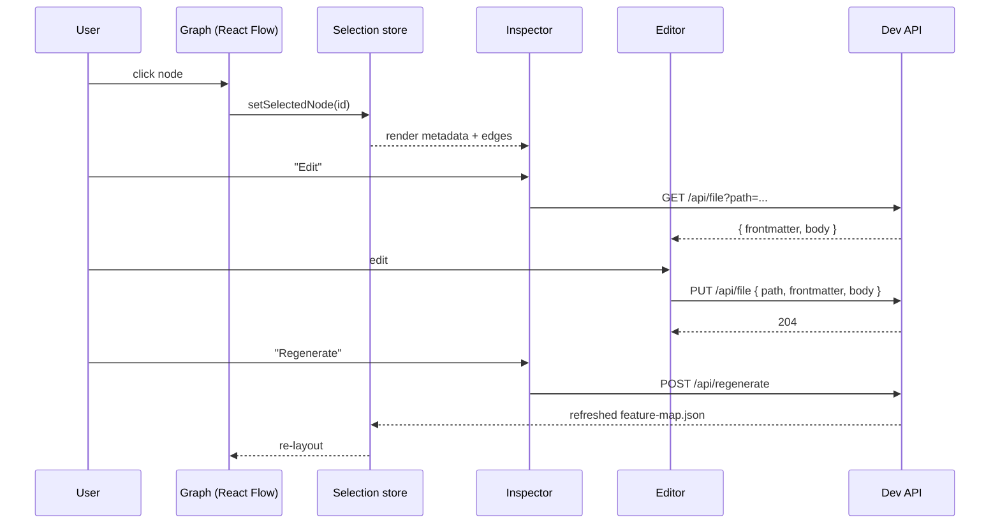

# feat: Feature Map Explorer dev tooling app

## Overview

Build a self-contained dev tooling app that visualizes the generated feature map (`out/generated/feature-map/feature-map.json`) and lets a developer (and eventually QA) see how Jobs, Briefs, Features, and BDD scenarios connect, click any node to inspect it, and edit the underlying Markdown source files in place. The app is a Vite + Hono single-process tool living entirely under `tools/feature-map-explorer/`. It is never shipped with `korri/products/*`. It reuses repo conventions (Tailwind v4, Geist, Lucide, Biome) but defines its own design tokens because it is a tool UI, not a Shift theme consumer.

The MVP is dev-only and aims at a calm, dense, Linear/Vercel/Raycast-quality aesthetic from day one.

## Problem Frame

We just generated a feature map JSON that ties Jobs → Briefs → Features → BDD. Today there is no way to *see* the relationships. Reviewers and QA cannot answer "what behavior is covered?", "which scenarios are pending?", or "what user job protects this scenario?" without grepping the repo. We also have no quick way to edit a job/brief without leaving the structure-aware view.

The fear is documentation drift and disconnect at scale (20+ vertical slices). A small, generated-aware UI that doubles as an editor closes that gap and makes the convention self-reinforcing.

## Requirements Trace

- R1. The explorer reads `out/generated/feature-map/feature-map.json` and surfaces all four node types (Job, Brief, Feature, BDD) with their connections.
- R2. The explorer is fully contained under `tools/feature-map-explorer/` — no code in `korri/products/*` or `korri/shared/*`, no impact on production builds.
- R3. Selecting a node shows metadata, status, diagnostics, and adjacent connections in an inspector.
- R4. Job and Brief markdown can be edited in the app and saved to the original file on disk.
- R5. The user can trigger `just generate-feature-map` from the UI and see updated data and diagnostics without restarting.
- R6. The dev write API is locked to allowlisted repo-relative paths and rejects any path traversal, absolute path, or unknown root.
- R7. A new `just dev-feature-map` recipe starts the explorer (UI + dev API) on a configurable port and is independent from `just dev`.
- R8. Visual quality bar: calm dark-by-default UI, Geist typography, Lucide icons, accessible Radix primitives, no AI-slop styling. Empty / loading / error / diagnostic states are first-class.
- R9. Keyboard-first interaction: `cmd+k` palette, arrow-key graph navigation, visible shortcut hints.

## Scope Boundaries

- No multi-user auth, sharing links, or persistence of UI state across users. Local dev tool only.
- No editing of `.feature` files or `e2e/generated/*` in this plan; Gherkin is read-only in the inspector.
- No graph editing (creating jobs/briefs/edges from the UI).
- No bundling the explorer into the deployed portal or API.
- No telemetry or analytics.
- No mobile/touch optimization. Desktop-class viewports only.
- No Storybook coverage for explorer components in this plan.

### Deferred to Separate Tasks

- Tiptap-based rich Markdown editing for jobs/briefs (Unit 8 lands the seam; the rich editor itself is deferred behind a feature toggle if it slips this slice).
- QA-facing build output (read-only static export, auth, share links): future iteration once the dev tool stabilizes.
- Wiring real Playwright/test status into BDD scenario nodes ("did this scenario pass last run?"): future iteration once test reporting lands in `out/`.
- Editing BDD `.feature` files in the explorer.
- Adding a graph viewer for the broader code/architecture (this is purely the feature-map domain).

## Context & Research

### Relevant Code and Patterns

- `tools/generators/feature-map/generate-feature-map.ts` — produces the JSON the explorer consumes; includes the diagnostic and edge schema. The explorer must not duplicate this logic; it is a viewer.
- `out/generated/feature-map/feature-map.json` — current output. Schema is defined inline in the generator (`FeatureMap`, `JobNode`, `FeatureNode`, `BriefNode`, `BddNode`, `GraphEdge`, `Diagnostic`).
- `tools/http/server.ts` and `korri/shared/api/http/hono-app.ts` — existing Hono pattern for a Node-side HTTP server. The explorer's dev server reuses the `@hono/node-server` adaptor pattern but does **not** mount on the product Hono app.
- `tools/scripts/generate-bdd-playwright-tests.ts` and `tools/generators/gates/generate-gate-registry.ts` — existing pattern for `bun run` Node scripts inside `tools/`.
- `tools/playwright/playwright.e2e.config.ts` — example of a tool that has its own config and runs without affecting the product build.
- `justfile` — recipe pattern for `dev-*` commands (`dev-web`, `dev-api`, `dev-storybook`, `dev-playwright`).
- `package.json` — root scripts already proxy `just *` recipes via `"generate:*"`; we add `"dev:feature-map"`.
- `korri/shared/themes/shift/shift.css` — token shape reference (CSS variables + Tailwind v4 `@theme`). The explorer mirrors the *shape* (CSS vars + Tailwind tokens) but uses its own neutral/accent palette tuned for dev tooling, not gaming.
- `tsconfig.json` — repo-wide config; the explorer will need its own `tsconfig.json` extending the root and scoping `include` to `tools/feature-map-explorer/**`.
- `AGENTS.md` — placement, naming, and convention rules; the explorer follows them (PascalCase components, kebab-case folders, no barrel exports, `@shared/logger` instead of `console.log` for any code that runs in node processes).

### Institutional Learnings

- The repo already encodes the convention "generated files are read-only" (`AGENTS.md` Testing section, BDD generator). The explorer respects this: it reads `feature-map.json`, never writes to it directly. Regeneration goes through `just generate-feature-map`.
- The repo strongly prefers Effect-only schema validation when validation is needed at module boundaries. The explorer's dev API is internal/dev-only and does not need Effect Schema, but if request validation is added later it should follow the Effect Schema convention used in `korri/shared/api/rpc/*`.

### External References

- React Flow (`@xyflow/react`) docs for custom node + edge components, controlled selection, and `onNodesChange` patterns.
- `dagre` graph layout for directed node placement.
- `cmdk` for a keyboard-first command palette.
- `gray-matter` for YAML frontmatter parsing/serialization (preserves block formatting in round-trip).
- `@codemirror/view` + `@codemirror/lang-markdown` for raw Markdown editing with reliable round-trip.
- `@tiptap/react` + `@tiptap/starter-kit` for rich Markdown editing (deferred / behind seam — see Risk table).
- Radix UI primitives (`@radix-ui/react-dialog`, `-dropdown-menu`, `-tooltip`, `-tabs`, `-scroll-area`) for accessible UI.

## Key Technical Decisions

- **Single-process Vite + Hono dev server.** One `bun run` command starts both the SPA (Vite middleware mode) and the dev API (Hono). This simplifies the developer story (`just dev-feature-map`) and avoids CORS gymnastics. The product API and Vite dev server are completely untouched.
- **Hard isolation under `tools/feature-map-explorer/`.** No imports out of `tools/feature-map-explorer/` into `korri/*`, and only one import direction inward: the server reads the generator's JSON output and may shell out to `bun run tools/generators/feature-map/generate-feature-map.ts`. No direct call into the generator's TypeScript module.
- **Explorer-local design tokens.** The explorer ships its own `tokens.css` (CSS variables) and Tailwind v4 `@theme` block. Tokens are inspired by Shift's structure but tuned for tooling: low-saturation neutrals, single accent, semantic status colors. Geist Variable + Geist Mono for typography. Lucide icons.
- **Read-only generated JSON; writes go through allowlist.** The dev API exposes file read/write only for these globs:
  - `docs/jobs/*.md`
  - `korri/products/*/features/*/brief.md`
  All other paths are rejected with HTTP 403, including absolute paths and any path containing `..` after normalization. `feature-map.json` is read-only.
- **Frontmatter-aware editor seam.** The editor splits the file with `gray-matter` into `{frontmatter, body}`. The MVP raw editor edits both as text via CodeMirror; Tiptap would later take over the body, with the frontmatter rendered as a structured form. Save serializes `gray-matter.stringify(body, frontmatter)` so frontmatter formatting is preserved by the parser.
- **Regeneration is shell-out, not a function call.** The `/api/regenerate` endpoint runs `bun run tools/generators/feature-map/generate-feature-map.ts` as a child process and returns stdout, stderr, exit code, and the refreshed JSON. This keeps the source of truth in one place (the existing generator) and makes regeneration behavior identical to CI.
- **Graph layout via dagre, not force-directed.** The graph is small (single-digit-to-low-double-digit nodes per slice). dagre gives reproducible left-to-right layered layouts that read like a flow chart, which suits Job → Brief → Feature → BDD better than a physics simulation.
- **Devtools deps as `devDependencies`.** `@xyflow/react`, `dagre`, `cmdk`, `gray-matter`, Radix primitives, CodeMirror, Tiptap, etc. all land in `devDependencies` because they are not used by `korri/products/*`. Production bundles stay unchanged.
- **Path safety implemented as a pure module with tests.** `tools/feature-map-explorer/server/paths.ts` exports `resolveRepoPath(input)` and `assertWritablePath(path)`. Both are unit-tested with explicit allow/deny cases. The route handlers use only these helpers — no inline path math.

## Open Questions

### Resolved During Planning

- **Where does the explorer live?** `tools/feature-map-explorer/` (sibling to `tools/generators/feature-map/`). Resolved by user instruction to keep the app contained within its tooling dir.
- **One process or two?** One. Vite middleware mode + Hono in the same `bun run` script.
- **Reuse Shift tokens or define new?** New, scoped to the tool. Shift is a gaming theme; the explorer is a dev tool.
- **Editing `.feature` files in this slice?** No. Read-only for MVP.
- **MVP graph layout?** dagre, not force-directed.
- **Regeneration strategy?** Shell out to the existing generator script.

### Deferred to Implementation

- **Exact Tailwind v4 `@theme` integration shape inside `tools/feature-map-explorer/`.** Needs a small spike against current Tailwind v4 behavior; mirror Shift's approach but scope CSS to the explorer root.
- **Whether to add a watch on `out/generated/feature-map/feature-map.json` and auto-refresh the UI**, or require explicit "Regenerate" clicks. Default is explicit; auto-refresh is a polish if cheap.
- **Tiptap Markdown round-trip fidelity for our specific frontmatter + tables + Gherkin-adjacent content.** Decision deferred until raw editor lands and we measure actual content shape across `docs/jobs/` and `korri/products/app/features/*/brief.md`.
- **Whether the regenerate endpoint should stream output progressively** or return only on completion. Default is "return on completion"; streaming is a polish.

## Output Structure

    tools/feature-map-explorer/
      README.md
      index.html
      vite.config.ts
      tsconfig.json
      package.json                  # only if a separate workspace turns out cleaner; default plan keeps deps in root
      src/
        main.tsx
        app.tsx
        types.ts
        styles/
          tokens.css
          app.css
        api/
          client.ts
          frontmatter.ts
        hooks/
          useFeatureMap.ts
          useFile.ts
          useRegenerate.ts
          useSelectedNode.ts
        layout/
          dagreLayout.ts
          dagreLayout.test.ts
        components/
          AppShell.tsx
          TopBar.tsx
          LeftRail.tsx
          Canvas.tsx
          Inspector.tsx
          Diagnostics.tsx
          CommandPalette.tsx
          graph/
            Graph.tsx
            nodes/
              JobNode.tsx
              BriefNode.tsx
              FeatureNode.tsx
              BddNode.tsx
            edges/
              MapEdge.tsx
          editor/
            Editor.tsx
            RawEditor.tsx
            FrontmatterForm.tsx
            RichEditor.tsx           # added in Unit 8 only
      server/
        server.ts
        paths.ts
        paths.test.ts
        routes/
          feature-map.route.ts
          files.route.ts
          regenerate.route.ts

## High-Level Technical Design

> *This illustrates the intended approach and is directional guidance for review, not implementation specification. The implementing agent should treat it as context, not code to reproduce.*

Selection lifecycle:

## Implementation Units

Phased delivery: Phase 1 (Units 1–4) lands the visible loop with read-only inspector. Phase 2 (Units 5–6) lands the graph and editing. Phase 3 (Units 7–8) lands polish (regenerate UX, command palette, optional Tiptap).

- [x] **Unit 1: Scaffold the explorer app shell**

**Goal:** Stand up `tools/feature-map-explorer/` with a Vite + React + TypeScript shell, Tailwind v4 wired, Geist + Lucide available, and a `just dev-feature-map` recipe that boots the SPA and a placeholder Hono server on configurable ports. No feature data yet — a styled "Hello, Feature Map" page proves the pipeline.

**Requirements:** R2, R7, R8

**Dependencies:** None.

**Files:**
- Create: `tools/feature-map-explorer/index.html`
- Create: `tools/feature-map-explorer/vite.config.ts`
- Create: `tools/feature-map-explorer/tsconfig.json`
- Create: `tools/feature-map-explorer/src/main.tsx`
- Create: `tools/feature-map-explorer/src/app.tsx`
- Create: `tools/feature-map-explorer/src/styles/tokens.css`
- Create: `tools/feature-map-explorer/src/styles/app.css`
- Create: `tools/feature-map-explorer/server/server.ts` (placeholder serving SPA + a `/api/health` endpoint)
- Create: `tools/feature-map-explorer/README.md`
- Modify: `justfile` (add `dev-feature-map`)
- Modify: `package.json` (devDependencies: `@xyflow/react`, `dagre`, `cmdk`, `gray-matter`, `@radix-ui/react-dialog`, `-dropdown-menu`, `-tooltip`, `-tabs`, `-scroll-area`, `@codemirror/view`, `@codemirror/state`, `@codemirror/lang-markdown`; script: `dev:feature-map`)
- Modify: `tsconfig.json` (no change expected; verify `tools/feature-map-explorer/**` is included via existing `tools/**/*` rule)
- Modify: `AGENTS.md` (one-line pointer to the explorer's role and how to run it)

**Approach:**
- Vite in middleware mode under Hono so a single `bun run` boots both SPA and API; alternatively, run Vite and Hono as two child processes from one script — pick the simpler of the two during implementation, document the choice in the README.
- Tailwind v4 plugin via `@tailwindcss/vite` (already in repo). Define a `@theme` block in `tokens.css` scoped to the explorer.
- Use `@fontsource-variable/geist` (already a dep) for typography.
- Configure Vite to root at `tools/feature-map-explorer/`.

**Patterns to follow:**
- `tools/http/server.ts` for the Hono server bootstrap shape.
- `korri/shared/themes/shift/shift.css` for token-shape conventions (CSS variables driving Tailwind tokens).

**Test scenarios:**
- Test expectation: none — scaffold-only unit; verification is "command boots and styled page renders".

**Verification:**
- `just dev-feature-map` boots without error and serves a styled page on the configured port.
- `just typecheck` and `just lint` pass on new files.
- No new files exist outside `tools/feature-map-explorer/` except the `justfile`, `package.json`, and `AGENTS.md` edits listed above.

- [x] **Unit 2: Design tokens and shell layout**

**Goal:** Define the explorer's design tokens (color, type, spacing, radius, motion) and implement the static shell: top bar, left rail, canvas area, inspector panel. The shell is content-empty but visually correct in light and dark mode.

**Requirements:** R8

**Dependencies:** Unit 1.

**Files:**
- Modify: `tools/feature-map-explorer/src/styles/tokens.css`
- Modify: `tools/feature-map-explorer/src/styles/app.css`
- Create: `tools/feature-map-explorer/src/components/AppShell.tsx`
- Create: `tools/feature-map-explorer/src/components/TopBar.tsx`
- Create: `tools/feature-map-explorer/src/components/LeftRail.tsx`
- Create: `tools/feature-map-explorer/src/components/Canvas.tsx`
- Create: `tools/feature-map-explorer/src/components/Inspector.tsx`
- Modify: `tools/feature-map-explorer/src/app.tsx`

**Approach:**
- Token sheet:
  - 6-step neutral scale (background, surface, surface-elevated, border, text-muted, text)
  - one accent + accent-muted
  - semantic statuses: `status-draft`, `status-planned`, `status-active`, `status-implemented`, `status-fixme`, `status-skip`, `status-error`, `status-warning`
- Type scale: 12 / 13 / 14 / 16 / 18 / 24
- Spacing scale: 4px increments
- Radii: 4 / 8 / 12; Shadows: single subtle elevation
- Motion: 120–200ms durations only; no layout-moving hovers
- Layout: CSS grid `top-bar | (left-rail | canvas | inspector)`; respect `prefers-reduced-motion`
- Use Lucide for any icons; never two type weights in one view; never more than three accent colors in one view

**Patterns to follow:**
- Aesthetic guardrails captured in the prior conversation summary; codify into a comment block at the top of `tokens.css`.

**Test scenarios:**
- Test expectation: none — pure presentational scaffold. Verification is visual and through `just lint`/`just typecheck`.

**Verification:**
- Light and dark variants both render without low-contrast text or missing tokens.
- Top bar, rail, canvas, and inspector occupy their expected grid cells at 1280×800 and degrade gracefully down to ~1024px width.
- No layout-shifting hover states. No drop shadows on flat content surfaces.

- [x] **Unit 3: Dev API server with allowlisted file I/O and regenerate**

**Goal:** Implement the Hono dev API exposing feature-map JSON, allowlisted file read/write for jobs and briefs, and a regenerate endpoint that shells out to the existing generator. Path safety lives in a tested pure module.

**Requirements:** R1, R4, R5, R6, R7

**Dependencies:** Unit 1.

**Files:**
- Create: `tools/feature-map-explorer/server/paths.ts`
- Create: `tools/feature-map-explorer/server/paths.test.ts`
- Create: `tools/feature-map-explorer/server/routes/feature-map.route.ts`
- Create: `tools/feature-map-explorer/server/routes/files.route.ts`
- Create: `tools/feature-map-explorer/server/routes/regenerate.route.ts`
- Modify: `tools/feature-map-explorer/server/server.ts`

**Approach:**
- `paths.ts` exports `resolveRepoPath(input)` which:
  - rejects absolute input paths
  - rejects paths containing `..` after normalization
  - resolves under repo root (calculated once from `import.meta.url`)
  - returns `{ absolutePath, repoRelativePath }` or throws a typed error
- `assertWritablePath(repoRelativePath)` checks the path matches one of:
  - `docs/jobs/*.md`
  - `korri/products/*/features/*/brief.md`
- `feature-map.route.ts`: `GET /api/feature-map` reads `out/generated/feature-map/feature-map.json` and returns JSON with `Cache-Control: no-store`.
- `files.route.ts`: `GET /api/file?path=...` reads file, parses with `gray-matter`, returns `{ path, frontmatter, body, raw }`. `PUT /api/file` accepts `{ path, frontmatter, body }`, runs `assertWritablePath`, serializes with `gray-matter.stringify`, writes atomically (`writeFile` to temp + rename), returns 204.
- `regenerate.route.ts`: `POST /api/regenerate` spawns `bun run tools/generators/feature-map/generate-feature-map.ts`, captures stdout/stderr/exit code, then returns `{ exitCode, stdout, stderr, map }` where `map` is the freshly read JSON.
- All routes use `@shared/logger` (or a local logger if importing across tools/ and shared/ creates cycles; prefer `pino` directly in that case).

**Patterns to follow:**
- `tools/http/server.ts` for Hono server bootstrap.
- `korri/shared/api/http/hono-app.ts` for route registration shape (without the RPC-specific helpers).

**Test scenarios:**
- Happy path: `resolveRepoPath("docs/jobs/safe-game-resume.md")` returns the expected absolute path under repo root.
- Edge case: `resolveRepoPath("docs/jobs/./safe-game-resume.md")` resolves identically to the un-dotted path.
- Error path: `resolveRepoPath("/etc/passwd")` throws (absolute path rejected).
- Error path: `resolveRepoPath("docs/jobs/../../etc/passwd")` throws (traversal rejected).
- Error path: `resolveRepoPath("../somefile")` throws (escape rejected).
- Happy path: `assertWritablePath("docs/jobs/foo.md")` passes; `assertWritablePath("korri/products/app/features/resume/brief.md")` passes.
- Error path: `assertWritablePath("docs/feature-map.md")` rejects; `assertWritablePath("korri/products/app/features/resume/e2e/safe-game-resume.feature")` rejects; `assertWritablePath("README.md")` rejects.
- Integration: `PUT /api/file` with a path outside the allowlist returns 403 and does not modify the filesystem (verify by file-mtime check on a fixture).

**Verification:**
- `just test-unit -- tools/feature-map-explorer/server/paths.test.ts` passes.
- A manual `curl` against `/api/feature-map`, `/api/file?path=docs/jobs/safe-game-resume.md`, and `POST /api/regenerate` returns the expected shapes against the real generated map.
- `POST /api/regenerate` updates the JSON on disk and the response carries the new `generatedAt`.

- [x] **Unit 4: Feature-map data hooks and inspector (read-only)**

**Goal:** Fetch the feature map, hold selection state, and render an inspector for any selected node showing frontmatter, status, edges, and diagnostics. No graph yet — the rail lists nodes by type and clicking a row selects it.

**Requirements:** R1, R3, R8

**Dependencies:** Units 1–3.

**Files:**
- Create: `tools/feature-map-explorer/src/types.ts` (mirrors the generator's emitted shapes; document this as a type-sync contract in a comment)
- Create: `tools/feature-map-explorer/src/api/client.ts`
- Create: `tools/feature-map-explorer/src/hooks/useFeatureMap.ts`
- Create: `tools/feature-map-explorer/src/hooks/useSelectedNode.ts`
- Modify: `tools/feature-map-explorer/src/components/LeftRail.tsx`
- Modify: `tools/feature-map-explorer/src/components/Inspector.tsx`
- Create: `tools/feature-map-explorer/src/components/Diagnostics.tsx`
- Modify: `tools/feature-map-explorer/src/app.tsx`

**Approach:**
- `client.ts` thin `fetch` wrapper with typed responses; no third-party query lib. State held with React state; lift to context if it grows.
- `useFeatureMap`: loads on mount, exposes `{ status: 'loading' | 'ready' | 'error', map, error, reload }`.
- `useSelectedNode`: a tuple `[selected, setSelected]` keyed by node `id` plus `kind` (`job | brief | feature | bdd`).
- LeftRail groups by kind with counts and a quick filter input. Clicking a row sets selection.
- Inspector shows: title, ID, status, file path (with copy button), frontmatter table, incoming/outgoing edges as clickable chips, BDD scenarios when applicable, diagnostics relevant to the node.
- Empty state for "no selection" is a first-class panel, not blank space.

**Patterns to follow:**
- Use Radix `ScrollArea` for the inspector and rail content.
- Lucide icons for status dots and edge labels.

**Test scenarios:**
- Test expectation: none for UI components in this unit. The generator already covers map shape; client.ts is a thin fetch wrapper. (If `useFeatureMap` grows non-trivial logic, add a dedicated test file.)

**Verification:**
- The current repo's two features (`app/welcome`, `app/resume`) plus one job (`safe-game-resume`) and one brief (`resume`) all appear in the rail with correct counts and statuses.
- Selecting any node shows the right metadata, edges, and any diagnostics.
- The two existing warnings (`app/welcome` has no brief; welcome BDD has no brief link) appear in the relevant nodes' Diagnostics section.

- [x] **Unit 5: Graph visualization with React Flow + dagre**

**Goal:** Replace the rail-driven canvas with a React Flow graph using dagre for layout. Custom node components per kind, edge styling per relationship type, click-to-select wired to the same `useSelectedNode` hook.

**Requirements:** R1, R3, R8, R9

**Dependencies:** Unit 4.

**Files:**
- Create: `tools/feature-map-explorer/src/layout/dagreLayout.ts`
- Create: `tools/feature-map-explorer/src/layout/dagreLayout.test.ts`
- Create: `tools/feature-map-explorer/src/components/graph/Graph.tsx`
- Create: `tools/feature-map-explorer/src/components/graph/nodes/JobNode.tsx`
- Create: `tools/feature-map-explorer/src/components/graph/nodes/BriefNode.tsx`
- Create: `tools/feature-map-explorer/src/components/graph/nodes/FeatureNode.tsx`
- Create: `tools/feature-map-explorer/src/components/graph/nodes/BddNode.tsx`
- Create: `tools/feature-map-explorer/src/components/graph/edges/MapEdge.tsx`
- Modify: `tools/feature-map-explorer/src/components/Canvas.tsx`

**Approach:**
- `dagreLayout.ts` exports `layout(nodes, edges, options)` that takes the feature-map nodes and edges, runs dagre with `rankdir: 'LR'`, fixed node dimensions per kind, and returns positioned React Flow node objects.
- Edge variants: `informs`, `specifies`, `verifies`, `contains`. Each has a distinct stroke style. Same-kind edges minimized; cross-kind edges emphasized.
- Node card content: title, status dot, secondary line (path or count), hover affordance, focused/selected ring.
- Arrow keys move selection to the nearest neighbor along the dominant edge direction; Enter opens the inspector edit affordance (later units).
- `prefers-reduced-motion` skips React Flow's default zoom/pan animations.

**Patterns to follow:**
- Keep node components pure presentational; selection wiring lives in `Graph.tsx`.
- Edge color tokens come from `tokens.css`; never hex-coded inline.

**Test scenarios:**
- Happy path: `layout` with a tiny graph (1 job, 1 brief, 1 feature, 1 BDD, all connected) returns nodes positioned left-to-right by rank with no overlapping bounding boxes.
- Edge case: `layout` with zero nodes returns empty nodes/edges arrays without throwing.
- Edge case: `layout` with a node that has no edges still places it on the canvas.

**Verification:**
- The current repo renders all four kinds in distinct visual columns.
- Clicking any node in the graph updates the inspector and the rail.
- Diagnostics chips render on the relevant nodes when present.

- [x] **Unit 6: Raw Markdown editor and save flow**

**Goal:** From the inspector, open an editor for a Job or Brief node. Show frontmatter as a structured form and body in CodeMirror. Save through the dev API. Track dirty state and prevent accidental discard.

**Requirements:** R3, R4, R6, R8

**Dependencies:** Units 3–5.

**Files:**
- Create: `tools/feature-map-explorer/src/api/frontmatter.ts`
- Create: `tools/feature-map-explorer/src/components/editor/Editor.tsx`
- Create: `tools/feature-map-explorer/src/components/editor/RawEditor.tsx`
- Create: `tools/feature-map-explorer/src/components/editor/FrontmatterForm.tsx`
- Create: `tools/feature-map-explorer/src/hooks/useFile.ts`
- Modify: `tools/feature-map-explorer/src/components/Inspector.tsx` (Edit button)

**Approach:**
- `useFile(path)` returns `{ status, file, error, save, reload, isDirty, setBody, setFrontmatter }`.
- FrontmatterForm renders structured fields for known frontmatter keys (`id`, `title`, `status`, `jobs`) using Radix primitives; unknown keys land in a "Raw" expandable section showing YAML.
- RawEditor uses CodeMirror 6 with the Markdown extension; tab size, theme, and font sized to match the app tokens.
- Save submits `{ path, frontmatter, body }` to `PUT /api/file`. On success: clear dirty state and prompt the user whether to regenerate.
- A confirmation dialog (Radix `Dialog`) interrupts close/navigation when dirty.

**Patterns to follow:**
- Use `gray-matter.stringify` exclusively on the server to preserve formatting; the client sends only structured frontmatter values, never the raw YAML string.
- All write actions go through `useFile.save`; never call `fetch` directly from a component.

**Test scenarios:**
- Happy path: editing a job and saving updates the file on disk; `useFeatureMap.reload` reflects updated frontmatter.
- Edge case: saving with no changes still succeeds and clears `isDirty`.
- Error path: server returns 403 (path not allowlisted) — UI surfaces a non-blocking error, file is not marked clean, retry is offered.
- Error path: server returns 5xx — UI surfaces the error and offers retry; dirty state preserved.

**Verification:**
- Editing `docs/jobs/safe-game-resume.md`'s `status` from `draft` to `active` and saving reflects on disk and in the rail without restart.
- Attempting to write a non-allowlisted path through any UI route is impossible.
- Closing or selecting a different node while dirty triggers the confirm dialog.

- [ ] **Unit 7: Regenerate flow and diagnostics surface**

**Goal:** Top bar gains a "Regenerate" action that calls the dev API. Diagnostics drawer/panel surfaces all warnings/errors with links to the relevant node. The UI handles loading, success, and failure clearly.

**Requirements:** R5, R8

**Dependencies:** Units 3–6.

**Files:**
- Create: `tools/feature-map-explorer/src/hooks/useRegenerate.ts`
- Modify: `tools/feature-map-explorer/src/components/TopBar.tsx`
- Modify: `tools/feature-map-explorer/src/components/Diagnostics.tsx`

**Approach:**
- `useRegenerate` exposes `{ run, status, lastResult }`. On success, replace map state with the response payload; do not re-fetch separately.
- TopBar shows the generated-at timestamp and a "Regenerate" button. While regenerating, the button shows a spinner; the rest of the UI is non-blocking.
- Diagnostics panel groups by severity, shows the message, the path, and a chip linking to the affected node.
- If regenerate exits non-zero, surface the stderr in a collapsible block within the diagnostics panel.

**Patterns to follow:**
- All toasts/inline messages use the same status tokens defined in Unit 2.

**Test scenarios:**
- Test expectation: none beyond integration verification — `useRegenerate` is a thin wrapper. (If logic accumulates, add a dedicated test.)

**Verification:**
- Triggering "Regenerate" in the UI runs the generator, refreshes the graph, and updates diagnostics.
- A deliberate error (e.g., temporarily renaming a brief's `id`) appears as an error diagnostic with the right path and is removed on the next successful regenerate.

- [ ] **Unit 8: Command palette, keyboard navigation, and optional Tiptap rich editor**

**Goal:** Add `cmd+k` palette via `cmdk` for jumping to any node, regenerating, toggling theme, and opening the editor. Wire arrow-key graph navigation. Land the Tiptap rich editor as an opt-in body editor behind a tab in the editor panel; keep raw editor as the always-available fallback.

**Requirements:** R8, R9

**Dependencies:** Unit 6 (editor) and Unit 7 (regenerate hook).

**Files:**
- Create: `tools/feature-map-explorer/src/components/CommandPalette.tsx`
- Create: `tools/feature-map-explorer/src/components/editor/RichEditor.tsx`
- Modify: `tools/feature-map-explorer/src/components/editor/Editor.tsx`
- Modify: `tools/feature-map-explorer/src/components/AppShell.tsx` (palette host + global hotkeys)
- Modify: `tools/feature-map-explorer/src/components/graph/Graph.tsx` (arrow-key nav)
- Modify: `package.json` (devDependencies: `@tiptap/react`, `@tiptap/starter-kit`, plus minimal Markdown serialization extensions as decided during implementation)

**Approach:**
- `cmdk` palette items: every node by title + ID, Regenerate, Toggle theme, Open inspector, Open editor.
- Keyboard nav: ArrowLeft/Right move selection along edges; Up/Down move within the same kind/column; Enter opens the editor.
- Rich editor toggle: the editor panel shows two tabs — `Raw` and `Rich`. `Rich` mounts Tiptap and warns on round-trip risk if the source contains constructs the configured Tiptap instance cannot losslessly round-trip (tables, fenced code blocks). The save path always serializes through the same client API as raw mode; if the rich editor cannot produce equivalent Markdown, the toggle is disabled and a hint explains why.
- If Tiptap fidelity proves fragile during implementation, ship Unit 8 *without* `RichEditor.tsx` and document it as deferred. Mark the seam (`Editor.tsx` tab structure) as ready.

**Patterns to follow:**
- Reuse status and accent tokens from Unit 2 inside the palette and editor chrome.

**Test scenarios:**
- Test expectation: none for palette and rich editor in this slice. Verification is interactive.

**Verification:**
- `cmd+k` opens the palette and can jump to every node type.
- Arrow keys move selection in the graph deterministically.
- Toggling Rich/Raw on a job or brief preserves the body content across the toggle for current real-world content in `docs/jobs/` and `korri/products/app/features/*/brief.md`.

## System-Wide Impact

- **Interaction graph:** The explorer is intentionally outside the product runtime. The only cross-cutting touchpoints are the `justfile`, `package.json`, and `AGENTS.md`. There is no impact on the product Hono app, RPC handlers, gates registry, theme system, BDD generator, or routes.
- **Error propagation:** Errors from the dev API surface in the UI with non-blocking banners; nothing in the product code path is affected. Path-safety errors are server-only and never surfaced as exception traces in the client.
- **State lifecycle risks:** The dev write path uses temp-file + rename to avoid leaving partial writes if the process is killed mid-save. The editor's dirty state must survive node selection changes via a confirm dialog to prevent silent loss.
- **API surface parity:** The dev API is internal and undocumented as an external contract. The server binds to `0.0.0.0` by default so the tool is reachable from any host or IP on the local network; set `FEATURE_MAP_API_HOST=127.0.0.1` (and/or `FEATURE_MAP_HOST=127.0.0.1`) to restrict to localhost. The dev API has no auth; once Unit 3 lands write routes, treat any network with access to this port as trusted. No CORS allowance to other origins.
- **Integration coverage:** The end-to-end loop (graph → inspector → editor → save → regenerate → graph) is verified manually for the MVP. We do not add Playwright coverage for the explorer in this plan.
- **Unchanged invariants:** The feature-map JSON schema, the generator's emitted shape, and the `just generate-feature-map` / `just check-feature-map` recipes are unchanged. The explorer reads the same JSON CI and humans read; it never produces or rewrites it.

## Risks & Dependencies

| Risk | Likelihood | Impact | Mitigation |
|------|-----------|--------|------------|
| Tiptap Markdown round-trip mangles real content (tables, fenced code, frontmatter spacing). | Medium | Medium | Land raw editor first (Unit 6). Treat Tiptap (Unit 8) as opt-in behind a tab. If fidelity fails, ship without it and reuse the seam later. |
| Vite middleware-mode setup with Hono is more involved than expected. | Medium | Low | Two-process fallback (Vite + Hono as separate child processes from one script) is acceptable; document the choice in the explorer README. |
| Path-safety bug allows writes outside allowlist. | Low | High | Pure-module path resolver with explicit allow/deny tests (Unit 3). All routes go through the helper; no inline path math. Server binds to 0.0.0.0 by default for cross-device convenience; restrict with `FEATURE_MAP_API_HOST=127.0.0.1` on untrusted networks. |
| Type drift between explorer's local types and generator's emitted shape. | Medium | Medium | Document the contract in `tools/feature-map-explorer/src/types.ts` with a comment pointing at the generator. Future improvement: codegen the types from the generator. |
| Devtool deps bloat the lockfile and slow CI. | Medium | Low | All explorer deps live under `devDependencies`. Production bundles are unchanged. CI does not need to install Tiptap unless explorer tests run. |
| New ports collide with existing dev services. | Low | Low | Default port via env var (`FEATURE_MAP_PORT`, mirroring `PORTAL_PORT`/`API_PORT` pattern); recipe documents the override. |
| Repo doc-edit conflicts when multiple sessions edit the same job/brief. | Low | Medium | Out of scope for MVP; rely on local git visibility. Future iteration may add a soft mtime check before save. |
| Reading `out/generated/feature-map/feature-map.json` before it has been generated produces a confusing empty state. | Medium | Low | If missing, the API returns a typed "not generated yet" response; UI shows an explicit "Generate now" CTA wired to the regenerate endpoint. |

## Documentation / Operational Notes

- `tools/feature-map-explorer/README.md` documents:
  - what the explorer is and is not
  - how to start it (`just dev-feature-map`)
  - what files it can edit (allowlist)
  - how to add a new node kind in the future
- `AGENTS.md` gains a one-line pointer to the explorer under the existing **Product Documentation Shape** section, so agents discover it as the canonical UI for the feature map.
- No deployment, CI, or infrastructure changes. The explorer is dev-only.

## Sources & References

- Generator: `tools/generators/feature-map/generate-feature-map.ts`
- Generated map: `out/generated/feature-map/feature-map.json`
- Convention reference: `AGENTS.md` (Product Documentation Shape section)
- Hono server pattern: `tools/http/server.ts`, `korri/shared/api/http/hono-app.ts`
- Token pattern reference: `korri/shared/themes/shift/shift.css`
- Existing tooling pattern reference: `tools/scripts/generate-bdd-playwright-tests.ts`, `tools/generators/gates/generate-gate-registry.ts`
- External: React Flow (`@xyflow/react`), `dagre`, `cmdk`, `gray-matter`, Radix UI primitives, CodeMirror 6, Tiptap
