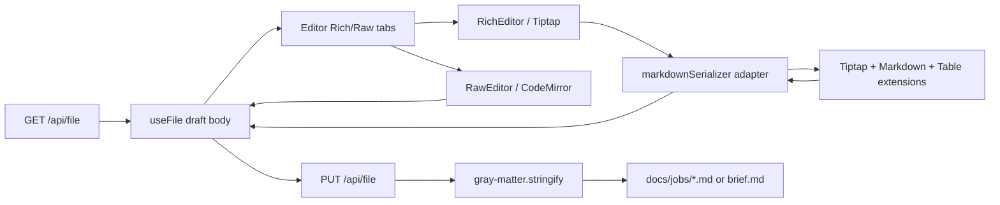

# feat: Add Tiptap Markdown editor

## Overview

Replace the Feature Map Explorer's current Rich-tab placeholder with a real Tiptap editor for Job and Brief Markdown bodies. Rich remains the default editor mode, Raw CodeMirror remains the always-available fallback, and saves continue through the existing frontmatter-aware file API.

The core of this plan is not just mounting Tiptap. It adds a tested Markdown adapter around Tiptap's official Markdown package so the editor can parse and serialize the Markdown constructs that already exist in the repo: headings, paragraphs, lists, blockquotes, bold/italic/code marks, horizontal rules, hard breaks, and the GFM table in `korri/products/app/features/resume/brief.md`.

## Problem Frame

The previous Feature Map Explorer plan intentionally deferred real Tiptap editing after discovering that live Brief content contains a GFM table. The current UI now defaults to a Rich tab, but that tab only explains the deferral. That mismatch is confusing: the intended default experience is rich editing, while the only functional editing surface is Raw Markdown.

The challenge is to ship full rich editing without creating silent Markdown churn or data loss. Tiptap is a ProseMirror editor, so it works with document structure rather than preserving every byte of Markdown syntax. The plan therefore treats Markdown parse/serialize behavior as a first-class domain boundary with golden tests and a clear stability contract.

## Requirements Trace

- R1. The Rich tab mounts a working Tiptap editor by default for editable Job and Brief bodies.
- R2. Rich editing supports all Markdown constructs present in the current editable corpus: `docs/jobs/safe-game-resume.md` and `korri/products/app/features/resume/brief.md`.
- R3. The GFM table in `korri/products/app/features/resume/brief.md` remains structurally editable in Rich mode, including cell text edits and basic row/column operations.
- R4. Markdown serialization is covered by tests that prove parse/serialize stability for the current corpus and targeted fixtures.
- R5. Opening Rich mode without making an edit must not mark the file dirty and must not cause a save-time rewrite.
- R6. Raw mode remains available and uses the existing CodeMirror editor unchanged.
- R7. Save, reload, revert, dirty-state, and discard-navigation behavior continue to flow through `useFile` and `PUT /api/file`; the dev API write allowlist does not change.
- R8. The implementation stays isolated to `tools/feature-map-explorer/` plus root dev dependencies; no production app bundle or `korri/products/*` runtime code is affected.

## Scope Boundaries

- No editing of `.feature` files.
- No changes to the generated feature-map schema or generator.
- No frontmatter editing inside Tiptap; `FrontmatterForm` remains the source of truth for frontmatter.
- No promise of byte-for-byte preservation for arbitrary Markdown syntax. The contract is: no no-op churn, semantic preservation for supported constructs, and stable canonical serialization after a real rich edit.
- No collaborative editing, comments, remote persistence, image uploads, embedded media, or slash-command authoring.
- No attempt to support unsupported Markdown extensions such as footnotes, definition lists, Mermaid fences, raw HTML editing, or MDX in this slice.

### Deferred to Separate Tasks

- Rich editing for BDD `.feature` files.
- A full Markdown diff preview before saving rich-mode changes.
- Advanced table UX such as drag-to-resize columns, merged cells, or table import/export controls.
- A future static QA-facing version of the explorer.

## Context & Research

### Relevant Code and Patterns

- `docs/plans/2026-04-29-002-feat-feature-map-explorer-plan.md` — origin plan. It deferred Tiptap because table round-trip fidelity had not been proven.
- `tools/feature-map-explorer/src/components/editor/Editor.tsx` — current editor shell. It already owns the Rich / Raw tab seam and defaults to Rich.
- `tools/feature-map-explorer/src/components/editor/RawEditor.tsx` — existing CodeMirror fallback; preserve it as the reliable raw Markdown path.
- `tools/feature-map-explorer/src/hooks/useFile.ts` — editor state machine for load, draft, dirty state, save, reload, and revert. Rich editing should only call `setBody(nextMarkdown)` after a real user edit.
- `tools/feature-map-explorer/server/routes/files.route.ts` — file read/write API. It parses frontmatter with `gray-matter` and serializes with `matter.stringify(body, frontmatter)`. This plan does not change the API contract.
- `tools/feature-map-explorer/server/routes/files.route.test.ts` — Hono route test pattern to follow for integration-level file route coverage if save behavior changes.
- `korri/shared/themes/shift/context/ThemeModeContext.test.tsx` — local example of React component tests using `@testing-library/react` under Bun/Happy DOM.
- `tools/feature-map-explorer/src/styles/app.css` — appropriate home for global third-party editor styling such as `.ProseMirror` focus, tables, selections, and reduced-motion guardrails.
- `AGENTS.md` and React skill guidance — React work should keep state in roots or local focused components, avoid boolean-subtree APIs, and avoid barrel exports.

### Current Editable Corpus

A quick content scan found:

- `docs/jobs/safe-game-resume.md`: headings, thematic breaks, bullet lists, ordered lists, blockquotes, bold text, hard line breaks.
- `korri/products/app/features/resume/brief.md`: headings, thematic breaks, bullet lists, inline code, bold text, hard line breaks, and a GFM table mapping `SGR-O1` through `SGR-O5`.

These two files are the minimum corpus Rich mode must support before it is considered real.

### Institutional Learnings

- Generated files are read-only across this repo. This plan keeps all writes restricted to existing editable source files and never writes `out/generated/feature-map/feature-map.json` directly.
- The Feature Map Explorer is dev tooling. Dependencies belong in root `devDependencies`, and implementation stays under `tools/feature-map-explorer/`.
- Previous implementation experience showed that staging plan updates can race with file writes in this harness. Executors should verify plan file line count before staging if they update this plan.

### External References

Web search was unavailable in this environment, but npm package metadata and package type definitions were available:

- `@tiptap/react` latest observed version: `3.22.5`; peer depends on React 17/18/19 plus `@tiptap/core` and `@tiptap/pm` at the same version family.
- `@tiptap/markdown` latest observed version: `3.22.5`; description: "markdown parser and serializer for tiptap". It exports `Markdown`, `MarkdownManager`, `editor.getMarkdown()`, and `contentType: "markdown"` support.
- `@tiptap/extension-markdown` does not exist in npm. The correct package for this plan is `@tiptap/markdown`.
- `@tiptap/extension-table`, `@tiptap/extension-table-row`, `@tiptap/extension-table-cell`, and `@tiptap/extension-table-header` latest observed version: `3.22.5`; table extension source includes Markdown parse/render hooks.
- `@tiptap/markdown` depends on `marked`, so GFM parsing behavior and table tokenization are part of the Markdown boundary to verify with tests.

## Key Technical Decisions

- **Use Tiptap v3 packages, not community Markdown wrappers.** The plan uses `@tiptap/markdown` because it is the official package and exposes editor-level Markdown APIs. Avoid ad hoc HTML-to-Markdown conversion and avoid nonexistent `@tiptap/extension-markdown`.
- **Keep Markdown conversion in a pure adapter module.** Create a small adapter that owns the extension list and exposes parse/serialize/stability helpers. UI components should not know the exact serializer setup.
- **Test the serializer before wiring UI.** The highest-risk behavior is Markdown round-trip. Start with pure tests against current corpus and targeted fixtures before mounting Tiptap in React.
- **Adopt a stable canonical Markdown contract after edits.** Tiptap cannot preserve every original Markdown byte. The product contract is: no dirty state on no-op mount, semantic preservation for supported constructs, and deterministic canonical Markdown after actual rich edits.
- **Raw fallback remains first-class.** Raw mode is not a temporary escape hatch; it is the way to edit unsupported syntax and inspect exact Markdown.
- **Do not change the file API.** The existing `{ path, frontmatter, body }` contract is correct. Rich mode should produce the next `body` string and let `useFile` / `files.route.ts` handle persistence.
- **Make unsupported content explicit.** If the adapter detects a construct outside the supported corpus, Rich mode should show a warning and direct the user to Raw rather than pretending the content can be safely round-tripped.

## Open Questions

### Resolved During Planning

- **Which Markdown package should be used?** Use `@tiptap/markdown`, not `@tiptap/extension-markdown`.
- **Should Rich mode replace Raw?** No. Rich is default, Raw remains available and unchanged.
- **Should the server own Tiptap serialization?** No. The editor body is already client-owned state. Keep server serialization limited to frontmatter + body via `gray-matter`.
- **Should byte-for-byte preservation be required after a rich edit?** No. It is not a realistic contract for a ProseMirror editor. Require no-op stability plus deterministic canonical Markdown after edits.

### Deferred to Implementation

- **Exact canonical table formatting.** Decide from serializer test output whether to accept Tiptap's default padded table rendering or add a custom table renderer to better match the repo's compact table style.
- **Unsupported syntax detection mechanism.** Implementation may start with a small regex/token scan for known unsupported constructs and grow only if tests reveal a need.
- **Component test depth.** Tiptap may be awkward under Happy DOM. If full editing transactions are brittle in component tests, keep UI tests to smoke/contract coverage and put the behavioral weight on pure serializer tests plus browser verification.

## Output Structure

    tools/feature-map-explorer/src/components/editor/
      Editor.tsx
      RawEditor.tsx
      RichEditor.tsx
      RichEditorToolbar.tsx
      RichEditor.test.tsx
      markdown/
        markdownSerializer.ts
        markdownSerializer.test.ts
        markdownSupport.ts
        markdownSupport.test.ts
        fixtures/
          job-body.md
          brief-body.md
          constructs.md
          unsupported.md

## High-Level Technical Design

> *This illustrates the intended approach and is directional guidance for review, not implementation specification. The implementing agent should treat it as context, not code to reproduce.*

The adapter is the only place that knows the Tiptap extension set. `RichEditor` receives Markdown body text and emits Markdown body text. `Editor.tsx` remains responsible for tab selection and for passing `file.setBody` down to the active editor.

## Implementation Units

- [x] **Unit 1: Add Tiptap dependencies and serializer test harness**

**Goal:** Add the Tiptap dependency set and create a pure Markdown adapter with tests before touching the editor UI.

**Requirements:** R2, R4, R8

**Dependencies:** None

**Files:**
- Modify: `package.json`
- Modify: `bun.lock`
- Create: `tools/feature-map-explorer/src/components/editor/markdown/markdownSerializer.ts`
- Create: `tools/feature-map-explorer/src/components/editor/markdown/markdownSerializer.test.ts`
- Create: `tools/feature-map-explorer/src/components/editor/markdown/fixtures/job-body.md`
- Create: `tools/feature-map-explorer/src/components/editor/markdown/fixtures/brief-body.md`
- Create: `tools/feature-map-explorer/src/components/editor/markdown/fixtures/constructs.md`

**Approach:**
- Add aligned Tiptap v3 dev dependencies: `@tiptap/react`, `@tiptap/core`, `@tiptap/pm`, `@tiptap/starter-kit`, `@tiptap/markdown`, table extensions, and `@tiptap/extension-link` if link support is included in the adapter.
- Build a serializer adapter that configures the same extension list Tiptap will use in the UI.
- Include table extensions in the adapter from the start because the current Brief corpus requires them.
- Fixtures should cover both copied real corpus bodies and focused constructs that are easy to reason about in failures.

**Execution note:** Implement test-first. The initial serializer tests should fail before the adapter is complete.

**Patterns to follow:**
- `tools/feature-map-explorer/src/layout/dagreLayout.test.ts` for pure TypeScript test shape.
- `tools/feature-map-explorer/src/components/editor/RawEditor.tsx` for keeping editor-specific infrastructure local to the editor folder.

**Test scenarios:**
- Happy path: parsing and serializing `fixtures/job-body.md` produces a non-empty Markdown body that reparses successfully.
- Happy path: parsing and serializing `fixtures/brief-body.md` preserves the `SGR-O1` through `SGR-O5` table rows semantically.
- Happy path: serializer supports headings, thematic breaks, bullet lists, ordered lists, blockquotes, bold, italic, inline code, hard breaks, and code blocks in `fixtures/constructs.md`.
- Edge case: empty body serializes to an empty or canonical blank document without throwing.
- Edge case: body with only whitespace does not produce phantom content.
- Stability: `markdown -> Tiptap JSON -> markdown -> Tiptap JSON -> markdown` reaches the same canonical Markdown after the first serialization.
- Regression: fixture output for the current Brief table is deterministic so future dependency upgrades show table-format changes in test diffs.

**Verification:**
- The adapter can round-trip the current editable corpus without dropping supported content.
- Tests document the canonical Markdown output that Rich mode will emit after actual edits.

- [ ] **Unit 2: Detect unsupported Markdown and protect Rich mode**

**Goal:** Add a small support-detection layer so Rich mode can warn or block when a body contains syntax outside the tested serializer contract.

**Requirements:** R2, R4, R6

**Dependencies:** Unit 1

**Files:**
- Create: `tools/feature-map-explorer/src/components/editor/markdown/markdownSupport.ts`
- Create: `tools/feature-map-explorer/src/components/editor/markdown/markdownSupport.test.ts`
- Create: `tools/feature-map-explorer/src/components/editor/markdown/fixtures/unsupported.md`

**Approach:**
- Define the supported construct set explicitly in code comments and tests.
- Detect obvious unsupported constructs before initializing Rich editing for the body: raw HTML blocks, MDX-like JSX, footnote definitions/references, definition lists, Mermaid fences, and image syntax.
- Return a structured result that UI can render: supported, warning-only, or raw-only with reasons.
- Keep the first implementation intentionally conservative. If the detector is unsure, prefer warning + Raw fallback over silent conversion.

**Patterns to follow:**
- `tools/feature-map-explorer/src/api/frontmatter.ts` for small pure helpers with direct unit tests.
- Existing diagnostic messaging style in `tools/feature-map-explorer/src/components/AppShell/components/AppShellDiagnostics.tsx` for concise user-facing reason text.

**Test scenarios:**
- Happy path: current `job-body.md` fixture is supported.
- Happy path: current `brief-body.md` fixture with table is supported.
- Error path: raw HTML block returns a raw-only or warning result with a specific reason.
- Error path: MDX-like JSX returns a raw-only result.
- Error path: Mermaid fenced block returns a raw-only or warning result.
- Edge case: ordinary fenced code block is supported if included in the serializer extension set.

**Verification:**
- The detector does not block the current editable corpus.
- Unsupported fixtures produce actionable messages that can be shown in the Rich tab.

- [ ] **Unit 3: Implement the RichEditor component and toolbar**

**Goal:** Replace the Rich-tab deferral panel with a working Tiptap editor that edits Markdown body text and emits serialized Markdown after real user changes.

**Requirements:** R1, R2, R3, R5, R6

**Dependencies:** Units 1 and 2

**Files:**
- Create: `tools/feature-map-explorer/src/components/editor/RichEditor.tsx`
- Create: `tools/feature-map-explorer/src/components/editor/RichEditorToolbar.tsx`
- Create: `tools/feature-map-explorer/src/components/editor/RichEditor.test.tsx`
- Modify: `tools/feature-map-explorer/src/components/editor/Editor.tsx`
- Modify: `tools/feature-map-explorer/src/styles/app.css`

**Approach:**
- `RichEditor` accepts `{ value, onChange }`, matching `RawEditor`'s body contract.
- Initialize Tiptap with `contentType: "markdown"` and the shared extension list from the serializer adapter.
- Avoid calling `onChange` during initial mount or when reconciling an external value from reload/revert. Only user-originated document updates should mark the `useFile` draft dirty.
- Add a compact toolbar for the constructs in scope: paragraph, heading levels, bold, italic, inline code, bullet list, ordered list, blockquote, horizontal rule, code block, insert table, add/delete row, add/delete column, and delete table.
- Render support warnings from `markdownSupport.ts`. If content is raw-only, show the reason and keep Raw available rather than mounting a destructive editor.
- Add `.ProseMirror` styling in `app.css` for typography, focus, tables, code, blockquotes, lists, and selection states using existing explorer tokens.

**Patterns to follow:**
- `tools/feature-map-explorer/src/components/editor/RawEditor.tsx` for controlled editor wrapper shape.
- `tools/feature-map-explorer/src/components/editor/Editor.tsx` for tab ownership and dirty-state integration.
- `korri/shared/themes/shift/context/ThemeModeContext.test.tsx` for Testing Library setup if component tests are feasible.

**Test scenarios:**
- Happy path: rendering `RichEditor` with a simple heading body displays editable content and does not call `onChange` on mount.
- Happy path: a text edit emits Markdown through `onChange` and includes the changed text.
- Happy path: rendering the Brief table fixture exposes table content without throwing.
- Edge case: changing the `value` prop to a reverted body updates editor content without emitting a user edit.
- Error path: raw-only unsupported content renders the warning/fallback panel instead of silently converting content.
- Integration: `Editor.tsx` defaults to the Rich tab and the Raw tab still renders `RawEditor` when selected.

**Verification:**
- Rich mode is functional for current Job and Brief bodies.
- Opening the editor and doing nothing leaves `file.isDirty` false.
- Raw fallback behavior is unchanged.

- [ ] **Unit 4: Wire save-flow safeguards and corpus regression coverage**

**Goal:** Ensure Rich editing integrates safely with existing save/reload/revert behavior and catches future serializer drift.

**Requirements:** R4, R5, R7

**Dependencies:** Units 1–3

**Files:**
- Modify: `tools/feature-map-explorer/src/hooks/useFile.ts` only if integration reveals a state-machine gap
- Modify: `tools/feature-map-explorer/src/components/editor/Editor.tsx`
- Modify: `tools/feature-map-explorer/src/components/editor/markdown/markdownSerializer.test.ts`
- Modify: `tools/feature-map-explorer/server/routes/files.route.test.ts` only if the API payload shape changes, which is not expected

**Approach:**
- Prefer no changes to `useFile`; Rich mode should fit the existing controlled body contract.
- Add a regression test that reads the live editable corpus (`docs/jobs/safe-game-resume.md` and `korri/products/app/features/resume/brief.md`) or mirrors it through fixtures, then asserts serializer stability. If live-file tests are too coupled, keep fixture copies and document that fixtures should be updated when corpus syntax expands.
- Verify that save payloads remain `{ path, frontmatter, body }` and that server-side `gray-matter.stringify` still owns full-file assembly.
- Keep dirty-state protection at the editor boundary: no `onChange` from initial parse or external prop reconciliation.

**Execution note:** Characterization-first. Capture current save/revert behavior in tests before changing `Editor.tsx` or `useFile.ts` if the implementation needs state-machine changes.

**Patterns to follow:**
- `tools/feature-map-explorer/src/hooks/useFile.ts` existing state machine and comments.
- `tools/feature-map-explorer/server/routes/files.route.test.ts` for file API integration coverage.

**Test scenarios:**
- Happy path: Rich edit -> `setBody` receives Markdown -> Save uses existing API contract.
- Edge case: reload after Rich edit replaces editor content and clears dirty state.
- Edge case: revert after Rich edit restores loaded Markdown and does not immediately re-dirty through Tiptap reconciliation.
- Regression: serializer stability tests fail if a Tiptap dependency upgrade changes table output unexpectedly.
- Integration: file route tests continue to pass without changing the allowlist or request body shape.

**Verification:**
- Existing raw save-flow tests still pass.
- New serializer regression tests protect the current corpus.
- No API route contract changes are required.

- [ ] **Unit 5: Update docs and interactive verification notes**

**Goal:** Document the final Rich/Raw editing contract and the known Markdown support boundary.

**Requirements:** R6, R8

**Dependencies:** Units 1–4

**Files:**
- Modify: `tools/feature-map-explorer/README.md`
- Modify: `docs/plans/2026-04-29-002-feat-feature-map-explorer-plan.md` only if keeping the origin plan's deferred note current is desired
- Modify: `docs/plans/2026-04-30-001-feat-tiptap-markdown-editor-plan.md`

**Approach:**
- Update README to say Rich is the default working editor and Raw is the fallback for exact Markdown or unsupported syntax.
- Document supported Markdown constructs and the stable-canonical-output policy after Rich edits.
- Keep the plan checkbox state updated during execution.

**Test scenarios:**
- Test expectation: none for documentation-only changes.

**Verification:**
- README accurately describes how to use Rich and Raw modes.
- The origin plan no longer misleadingly implies that Tiptap remains generally unimplemented once this follow-up lands.

## System-Wide Impact

- **Interaction graph:** Tiptap sits between `Editor.tsx` and `useFile.setBody`. It should not bypass `useFile`, the dirty-state guard, or the dev API.
- **Error propagation:** Serializer errors should surface in the Rich tab as user-facing warnings and should not throw the whole inspector. Save errors continue through `useFile.saveError`.
- **State lifecycle risks:** The main risk is accidental dirty state from Tiptap initialization or prop reconciliation. Guard against this explicitly in `RichEditor` and tests.
- **API surface parity:** Raw and Rich modes both produce Markdown body strings for the same save API. Raw remains the parity fallback for exact syntax.
- **Integration coverage:** Pure serializer tests prove the risky transformation layer; component smoke tests prove React wiring; manual browser verification proves editable table behavior and toolbar UX.
- **Unchanged invariants:** Write allowlist, generated map read-only behavior, frontmatter form ownership, and feature-map regeneration flow do not change.

## Risks & Dependencies

| Risk | Likelihood | Impact | Mitigation |
|------|------------|--------|------------|
| Tiptap Markdown serializer normalizes tables in a noisy way. | High | Medium | Add deterministic fixture tests; decide whether to accept canonical output or add a custom table renderer before wiring UI. |
| Rich editor marks files dirty on mount. | Medium | High | Test no-op mount and external prop reconciliation; suppress `onChange` outside user transactions. |
| Happy DOM cannot exercise ProseMirror editing reliably. | Medium | Medium | Put core behavior in pure serializer tests; keep component tests to smoke/contract coverage and require browser verification. |
| Unsupported Markdown is silently lost. | Medium | High | Add `markdownSupport.ts`; warn or force Raw for unsupported constructs. |
| Dependency family version mismatch between Tiptap packages. | Medium | Medium | Keep Tiptap packages aligned in `package.json`/`bun.lock`; serializer tests catch drift after upgrades. |
| Bundle size increases. | High | Low | Explorer is dev-only; keep dependencies in `devDependencies` and scoped to `tools/feature-map-explorer/`. |

## Documentation / Operational Notes

- `tools/feature-map-explorer/README.md` should explain that Rich mode produces stable canonical Markdown after edits, while Raw mode is available for exact source control.
- No rollout or feature flag is required because this is local dev tooling.
- Manual verification should include opening the explorer, editing the `SGR-O...` table cell text in Rich mode, saving, regenerating, and confirming diagnostics remain stable.

## Sources & References

- Origin plan: `docs/plans/2026-04-29-002-feat-feature-map-explorer-plan.md`
- Current editor shell: `tools/feature-map-explorer/src/components/editor/Editor.tsx`
- Raw editor fallback: `tools/feature-map-explorer/src/components/editor/RawEditor.tsx`
- File state machine: `tools/feature-map-explorer/src/hooks/useFile.ts`
- File API: `tools/feature-map-explorer/server/routes/files.route.ts`
- File API tests: `tools/feature-map-explorer/server/routes/files.route.test.ts`
- Real Job corpus: `docs/jobs/safe-game-resume.md`
- Real Brief corpus: `korri/products/app/features/resume/brief.md`
- External package metadata: `@tiptap/react@3.22.5`, `@tiptap/markdown@3.22.5`, `@tiptap/extension-table@3.22.5`
