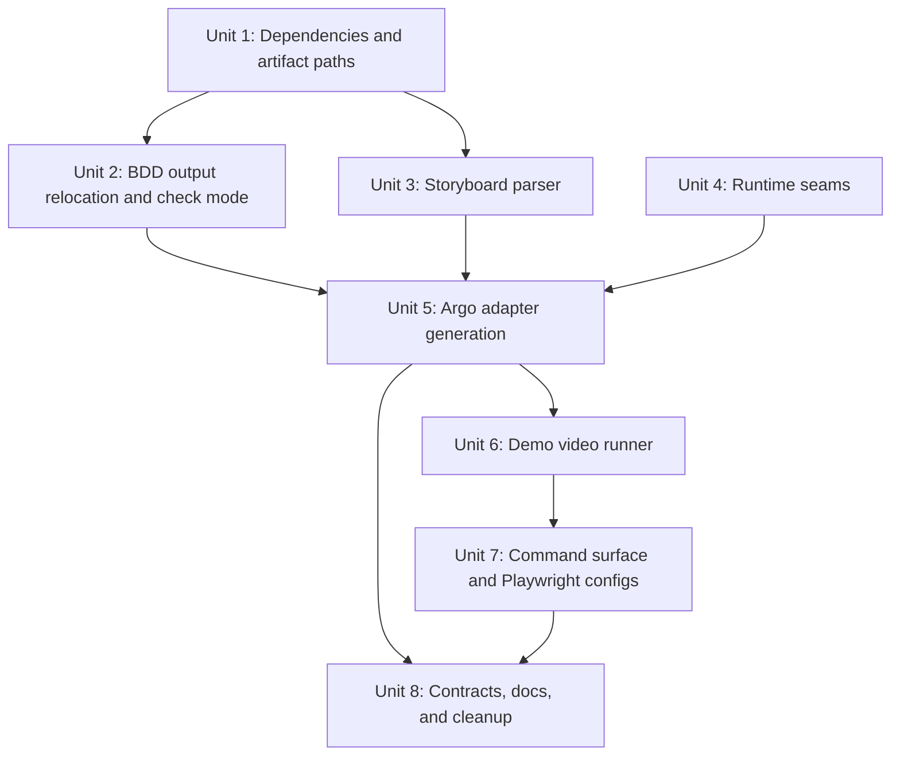
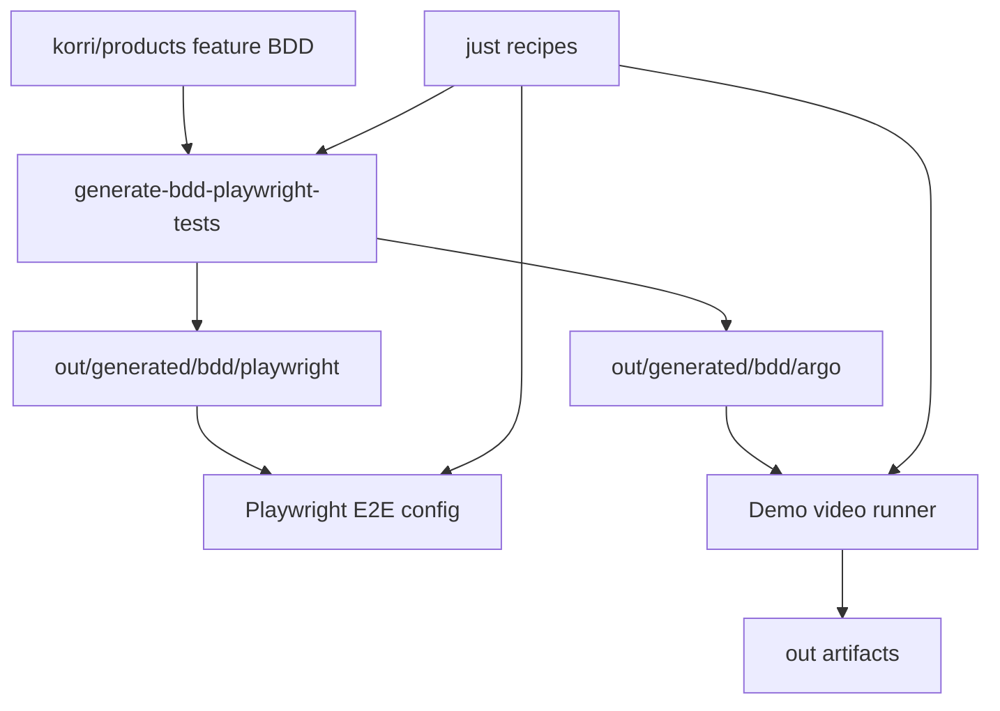

# feat: Port BDD Argo Playwright Demo Tooling

## Overview

Port the BDD, Argo, and Playwright demo-video infrastructure from the AmazeInsights `amaze-next` worktree into Korri. The port should preserve the useful architecture from the source repo while adapting it to Korri's smaller stack: Vite portal, Hono API, `just` recipes, generated feature-map conventions, and product BDD under `korri/products/*/features/**/e2e/`.

| Source capability | Korri target | Adaptation |
|---|---|---|
| Generated BDD wrappers move out of source | Generate wrappers under `out/generated/bdd/playwright/` | Keeps source features authored-only and aligns with existing `out/` artifact policy |
| `@demo(name)` scenarios emit Argo adapters | Generate Argo adapters under `out/generated/bdd/argo/` | BDD remains behavior source; storyboard YAML remains presentation-only |
| Argo demo video command via `amaze demo video` | `just demo-video` plus `tools/demo-video/smoke.ts` | Korri does not have a repo CLI; do not add one just for this port |
| Full-stack recording harness | Start or target Korri portal + API stack | No SQL/auth seed layer exists in Korri today, so keep stack orchestration lighter |
| Demo output and Argo cache separation | `.argo/` cache and `out/demo-videos/` final artifacts | Generated recordings stay out of git |
| Playwright executable fallback | Honor `PLAYWRIGHT_CHROMIUM_EXECUTABLE_PATH` across E2E/component/Argo configs | Keeps Nix/runtime browser path behavior consistent |

## Problem Frame

Korri currently has a basic BDD-to-Playwright generator that emits ignored wrappers inside each feature folder (`e2e/generated/*.e2e.ts`). The AmazeInsights worktree evolved that idea into a stronger architecture: generated BDD wrappers live under `out/generated`, generated Argo adapters can record BDD scenarios as narrated videos, storyboards provide presentation metadata without duplicating browser actions, and demo recording uses repo-owned Playwright configuration instead of raw Argo pipeline defaults.

The goal is to bring that whole testing/demo toolchain into Korri without importing Amaze-specific product assumptions such as SQL Edge, BetterAuth identities, or the `amaze` CLI. Korri should gain the infrastructure now, while deferring product-demo content until a non-`@fixme` product scenario is ready to record.

## Requirements Trace

- R1. Port BDD generator improvements from the source repo: generated wrappers under `out/generated/bdd/playwright/`, stale-output checking, and non-mutating `--check` mode.
- R2. Add BDD-driven Argo adapter generation for scenarios tagged `@demo(<name>)`.
- R3. Add YAML demo storyboards as presentation-only metadata and reject behavior-shaped YAML fields.
- R4. Add BDD runtime seams so generated Argo adapters execute existing step definitions on Argo's page without duplicating selectors or actions.
- R5. Add a Korri-owned demo-video runner that uses repo Playwright configuration, local-safe base URLs, `.argo/` work dirs, and `out/demo-videos/` final artifacts.
- R6. Update Playwright configs to honor `PLAYWRIGHT_CHROMIUM_EXECUTABLE_PATH` consistently and discover generated BDD wrappers from `out/generated`.
- R7. Keep product runtime code unchanged and keep generated/video artifacts out of git.
- R8. Preserve Korri conventions: repo-relative paths, `just` task surface, `out/` artifacts, no barrel exports, and BDD/brief traceability docs.
- R9. Do not invent a new Korri product demo scenario while the only product BDD feature remains `@fixme`; infrastructure tests should prove generation until product behavior is ready.
- R10. Adopt the source repo's flatter BDD authoring convention for feature step files (`e2e/*.steps.ts`) while preserving shared global steps from `tools/testing/bdd/shared-steps.ts`.

## Scope Boundaries

- No product UI, API, schema, or feature behavior changes.
- No migration of Amaze-specific SQL Edge, BetterAuth, seed-profile, or `amaze` CLI code.
- No cloud TTS configuration or production/customer data recording.
- No CI-required video rendering; video generation stays opt-in/manual.
- No authored behavior in `.demo.yaml`; storyboards may only describe scenes, narration, overlays, and recording hints.
- No generated Argo adapters or Playwright wrappers committed under `korri/products/*`.

### Deferred to Separate Tasks

- First real Korri product demo: add `@demo(<name>)` and a `.demo.yaml` storyboard when a product BDD scenario is executable instead of `@fixme`.
- Longer polished launch/resume walkthrough videos: depend on product behavior and seeded app state that do not exist yet.
- CI artifact publishing or PR demo-reel automation: defer until local demo generation is stable and useful.
- General-purpose repo CLI: continue using `just` and direct Bun scripts unless Korri separately adopts a CLI.

## Context & Research

### Relevant Code and Patterns

Current Korri repo:

- `tools/scripts/generate-bdd-playwright-tests.ts` scans `korri/products/*/features/**/e2e/*.feature` and emits generated wrappers under co-located `e2e/generated/` folders.
- `tools/testing/bdd/architecture.ts` defines current BDD source/generated boundaries, but does not yet mention flat `e2e/*.steps.ts` files, storyboards, or Argo adapters.
- `tools/testing/bdd/parser.ts`, `tools/testing/bdd/tags.ts`, `tools/testing/bdd/resolver.ts`, and `tools/testing/bdd/world.ts` already provide the BDD runtime foundation to extend.
- `tools/playwright/playwright.e2e.config.ts` currently runs generated wrappers from `korri/products` and starts the Vite portal plus Hono API when not using an existing stack.
- `tools/playwright/e2e-env.ts` centralizes dynamic portal/API ports and existing-stack behavior.
- `tools/artifacts/paths.ts` centralizes `out/` build/report/test-result paths and should own BDD/Argo/demo-video output paths too.
- `justfile` is Korri's command surface for generation, validation, E2E, Storybook, and dev tooling.
- `korri/products/app/features/resume/e2e/safe-game-resume.feature` is currently tagged `@fixme(Safe-game-resume-not-implemented-yet)`, so it should not become the first Argo product demo yet.

Source repo prior art, paths relative to the AmazeInsights source repo:

- `tools/testing/bdd/demo-storyboard.ts` parses and validates YAML storyboards.
- `tools/testing/bdd/architecture.ts` documents generated Playwright wrappers and generated Argo adapters as disposable outputs under `out/generated/bdd/`.
- `tools/testing/bdd/resolver.ts` adds `executeScenarioWithCallbacks` while preserving existing `executeScenario` behavior.
- `tools/testing/bdd/world.ts` adds `attachToPage` so BDD can run on Argo's runner-owned page.
- `tools/scripts/generate-bdd-playwright-tests.ts` emits both Playwright wrappers and Argo demo adapters, supports `--check`, validates stale storyboards, and cleans legacy generated outputs.
- `tools/demo-video/stack-runner.ts`, `tools/demo-video/playwright.argo.config.ts`, `tools/demo-video/narration-audio.ts`, and `tools/demo-video/smoke.ts` provide the recording/export pipeline.
- `tools/demo-video/demo-contract.test.ts` verifies generated scene/script parity, cursor visibility, and that generated demos do not own browser behavior.

### Institutional Learnings

- No `docs/solutions/` corpus exists in Korri yet, so there are no local institutional learnings to carry forward.
- The AmazeInsights plans from 2026-04-30 are the closest execution learnings: they established that raw Argo `pipeline` is less reliable than a repo-owned Playwright config, that generated demos must remain behavior-free adapters, and that local-safe artifact boundaries matter.

### External References

- External research is not needed for the planning decision. The source repo has a working implementation using `@argo-video/cli@0.34.0`, `@playwright/test@1.59.1`, and `yaml^2.8.0`.
- Dependency compatibility still matters during implementation: Korri currently uses `@playwright/test@1.58.2`, while the source repo upgraded to `1.59.1` for Argo peer compatibility.

## Key Technical Decisions

- **Use source repo design, not a literal copy.** Port architecture and tests, but replace Amaze-specific stack, CLI, auth, and database assumptions with Korri equivalents.
- **Move generated BDD wrappers to `out/generated/bdd/playwright/`.** Co-located generated wrappers are already ignored and read-only; moving them under `out/` makes the generated boundary explicit and matches the source repo's stronger pattern.
- **Flatten feature step definitions to `e2e/*.steps.ts`.** The source repo removed nested `step-definitions/` folders so authored BDD assets sit together. Korri should adopt that convention for future feature-specific steps while keeping shared global steps in `tools/testing/bdd/shared-steps.ts`.
- **Generate Argo adapters only from `@demo(<name>)` scenarios.** Product BDD remains the behavior source; no demo script should contain routes, locators, clicks, fills, or assertions outside step definitions.
- **Use `.demo.yaml` beside the feature file, not a separate demo folder.** Korri has shallow colocated feature slices; `e2e/<demo-name>.demo.yaml` keeps presentation metadata near the scenario without creating unnecessary nested folders.
- **Do not add a Korri CLI.** Source repo used `amaze demo video`; Korri should expose equivalent behavior through `just demo-video`, `just check-demo-video`, and direct `tools/demo-video/smoke.ts` entrypoints.
- **Use a lighter full-stack runner.** Korri's reproducible stack is portal + API, not SQL/auth/seeded identities. The runner should support existing-stack and self-started-stack modes without importing database concerns.
- **Keep video generation opt-in.** Unit tests and generation checks belong in normal validation; full Argo render should remain manual because it is heavier and depends on ffmpeg/browser availability.
- **No first product demo until product BDD is executable.** Infrastructure can land with tests and zero generated demos. A future product PR can add `@demo(...)` to an implemented scenario and provide narration.

## Open Questions

### Resolved During Planning

- Should Korri import the `amaze` CLI command structure? No. Korri uses `justfile` as its command surface.
- Should the existing `safe-game-resume` BDD scenario become a demo now? No. It is feature-level `@fixme`, so recording it would create a failing demo adapter.
- Should generated BDD wrappers remain co-located? No. Source repo experience favors `out/generated/bdd/playwright/`, and Korri already treats generated files as read-only.
- Should Argo run through raw `argo pipeline`? No. Use repo-owned Playwright config so Chromium executable fallback, timeouts, base URL, and artifacts are controlled.

### Deferred to Implementation

- Exact local TTS/export split: implementation should choose the smallest reliable boundary between Argo CLI calls and repo-owned audio muxing after verifying package behavior in Korri.
- Exact default demo command behavior when no demos exist: implementation should choose between a clear "no demos available" message and a dry-run-only validation mode, but must not fail normal repo checks because no product demo exists yet.
- Exact ffmpeg availability strategy: add documentation and prerequisite checks first; update Nix/dev-shell inputs only if the repo's current environment does not already provide ffmpeg.

## Output Structure

```text
tools/testing/bdd/
  AUTHORING.md
  architecture.ts
  demo-storyboard.ts
  demo-storyboard.test.ts
  resolver.ts
  resolver.test.ts
  world.ts
  world.test.ts

tools/scripts/
  generate-bdd-playwright-tests.ts
  generate-bdd-playwright-tests.test.ts

tools/demo-video/
  demo-contract.test.ts
  narration-audio.ts
  narration-audio.test.ts
  playwright.argo.config.ts
  smoke.ts
  stack-runner.ts
  stack-runner.test.ts

out/generated/bdd/playwright/
  korri/products/<product>/features/<feature>/e2e/<feature>.e2e.ts

out/generated/bdd/argo/
  <demo-name>.demo.ts
  <demo-name>.scenes.json

korri/products/<product>/features/<feature>/e2e/
  <feature>.feature
  <feature>.steps.ts
  <demo-name>.demo.yaml

out/demo-videos/
  <demo-name>.mp4
```

The tree shows expected output shape. Generated `out/` files and video artifacts stay disposable; authored source remains under `tools/` and `korri/products/*`.

## High-Level Technical Design

> *This illustrates the intended approach and is directional guidance for review, not implementation specification. The implementing agent should treat it as context, not code to reproduce.*

```mermaid
flowchart TB
  Feature[Authored .feature\noptional @demo(name)]
  Steps[Authored .steps.ts\nor shared steps]
  Storyboard[Optional .demo.yaml\npresentation only]
  Generator[BDD generator]
  BddOut[out/generated/bdd/playwright]
  ArgoOut[out/generated/bdd/argo]
  Runner[tools/demo-video runner]
  Stack[Korri portal + API]
  Video[out/demo-videos]

  Feature --> Generator
  Steps --> Generator
  Storyboard --> Generator
  Generator --> BddOut
  Generator --> ArgoOut
  ArgoOut --> Runner
  Stack --> Runner
  Runner --> Video
```

## Implementation Units



- [x] **Unit 1: Dependencies and artifact paths**

**Goal:** Add the external tooling and artifact-path foundations needed for BDD-generated Argo demos.

**Requirements:** R5, R6, R7, R8

**Dependencies:** None

**Files:**
- Modify: `package.json`
- Modify: `bun.lock`
- Modify: `.gitignore`
- Modify: `tools/artifacts/paths.ts`
- Modify: `tools/artifacts/paths.test.ts`

**Approach:**
- Add `@argo-video/cli` as a dev dependency.
- Add `yaml` as a direct dependency or dev dependency used by tooling; do not rely on transitive YAML packages.
- Upgrade `@playwright/test` to the Argo-compatible version used by the source repo unless implementation discovers a newer compatible repo-standard version.
- Add artifact path constants for `out/generated/bdd/playwright`, `out/generated/bdd/argo`, and `out/demo-videos`.
- Ignore `.argo/` as Argo's local cache/work directory while continuing to rely on existing `out/` ignore behavior for generated artifacts.

**Patterns to follow:**
- `tools/artifacts/paths.ts` for central artifact layout.
- Source repo `tools/artifacts/paths.ts` for naming of `demoVideoArtifactPath` and `generatedArtifactPaths`.

**Test scenarios:**
- Happy path: artifact layout includes BDD Playwright, BDD Argo, and demo-video paths under `out/`.
- Regression: existing build/report/test-result artifact path assertions remain unchanged.
- Integration: `@argo-video/cli` and `yaml` are not added to runtime product dependencies.
- Edge case: `.argo/` is ignored without changing source or docs ignore behavior.

**Verification:**
- Tooling dependencies are available to Bun scripts, and all new generated/video paths are represented in the canonical artifact layout.

- [x] **Unit 2: BDD output relocation and generation check mode**

**Goal:** Move generated BDD wrappers from feature source folders to `out/generated/bdd/playwright/`, adopt flat feature step files, and add a non-mutating stale-output check.

**Requirements:** R1, R6, R7, R8, R10

**Dependencies:** Unit 1

**Files:**
- Modify: `tools/testing/bdd/architecture.ts`
- Modify: `tools/scripts/generate-bdd-playwright-tests.ts`
- Create: `tools/scripts/generate-bdd-playwright-tests.test.ts`
- Modify: `tools/playwright/playwright.e2e.config.ts`
- Modify: `justfile`
- Modify: `AGENTS.md`

**Approach:**
- Update `BDD_FOLDER_CONVENTION` so generated wrappers target `out/generated/bdd/playwright/korri/products/...` rather than `korri/products/.../e2e/generated/`.
- Update step-definition discovery to prefer flat `e2e/*.steps.ts` files and avoid requiring nested `step-definitions/` folders.
- Preserve existing feature scanning and tag filtering semantics.
- Add `--check` to compute expected outputs, compare existing generated files, and report missing/changed/extra files without writing.
- Add `--clean` behavior that removes new generated outputs and legacy co-located generated wrappers when they are recognized as generator-owned.
- Update Playwright E2E config to discover wrappers from `out/generated/bdd/playwright/`.
- Update `just generate-bdd`, `just test-e2e`, and feature-map documentation expectations if they currently assume co-located generated wrappers.

**Execution note:** Add characterization coverage for current wrapper generation before moving output paths so the port preserves current BDD behavior.

**Patterns to follow:**
- Current `tools/scripts/generate-bdd-playwright-tests.ts` for parser/tag behavior.
- Source repo `tools/scripts/generate-bdd-playwright-tests.ts` for output-root and `--check` structure.

**Test scenarios:**
- Happy path: one feature file generates a wrapper under `out/generated/bdd/playwright/korri/products/...` with the same scenario titles and step imports as before.
- Happy path: `--check` passes when generated files are current and does not modify file timestamps or contents.
- Error path: `--check` reports missing generated files with a clear remediation message.
- Error path: `--check` reports changed generated files without rewriting them.
- Edge case: tag-filtered generation allows extra generated files that are unrelated to the filtered subset.
- Regression: legacy co-located generated wrappers with the generator header are cleaned; non-generated source files are never removed.
- Regression: flat `e2e/*.steps.ts` imports are discovered and registered for generated wrappers.
- Integration: `tools/playwright/playwright.e2e.config.ts` discovers wrappers from the new output root.

**Verification:**
- BDD generation no longer writes source-tree generated wrappers, and E2E runs consume generated wrappers from `out/generated/bdd/playwright/`.

- [x] **Unit 3: Storyboard YAML parser and validation**

**Goal:** Add typed parsing and validation for optional `.demo.yaml` storyboards co-located with feature E2E files.

**Requirements:** R2, R3, R7, R8

**Dependencies:** Unit 1

**Files:**
- Create: `tools/testing/bdd/demo-storyboard.ts`
- Create: `tools/testing/bdd/demo-storyboard.test.ts`
- Modify: `tools/testing/bdd/architecture.ts`

**Approach:**
- Port the source repo's narrow storyboard model: demo name, optional recording start anchor, and scenes keyed by `before-step-N`, `step-N`, or `after-step-N` anchors.
- Keep storyboards presentation-only: scene name, narration text, duration, and overlay metadata are allowed; actions/selectors/routes/assertions/steps are rejected.
- Return an empty/default storyboard when no YAML exists for a tagged demo so `@demo(...)` can start with safe generated defaults.
- Validate demo-name mismatch, malformed YAML, unknown fields, invalid anchors, duplicate scene names, and unsafe narration terms before any generated files are written.

**Patterns to follow:**
- Source repo `tools/testing/bdd/demo-storyboard.ts` and `tools/testing/bdd/demo-storyboard.test.ts`.
- Current `tools/testing/bdd/parser.ts` style for deterministic errors.

**Test scenarios:**
- Happy path: valid YAML with multiline narration, duration, and overlay metadata parses into a typed storyboard.
- Happy path: missing storyboard returns a default presentation model for the expected demo name.
- Error path: malformed YAML includes the storyboard path in the error.
- Error path: `demo:` value that does not match `@demo(<name>)` fails.
- Error path: behavior-shaped fields such as `steps`, `goto`, `click`, `selector`, `locator`, or `expect` are rejected at any nesting level.
- Edge case: invalid anchor keys and out-of-range anchor formats fail before adapter generation.
- Safety path: narration containing obvious secret/customer/tenant terms fails validation or is flagged according to the final safety policy.

**Verification:**
- Storyboard validation is pure and unit-testable without Playwright, Argo, Vite, or API processes.

- [x] **Unit 4: BDD runtime seams for Argo instrumentation**

**Goal:** Extend the BDD runtime so Argo adapters can run existing steps on Argo's page and mark scenes before/after steps.

**Requirements:** R2, R4, R7, R8

**Dependencies:** None, but Unit 5 depends on this seam.

**Files:**
- Modify: `tools/testing/bdd/world.ts`
- Modify: `tools/testing/bdd/resolver.ts`
- Create: `tools/testing/bdd/world.test.ts`
- Create: `tools/testing/bdd/resolver.test.ts`

**Approach:**
- Add `BddWorld.attachToPage` or equivalent so a world can use a runner-owned Playwright page/context without closing it during teardown.
- Track whether the world owns the browser context so normal E2E wrappers still close their own pages and contexts.
- Add `executeScenarioWithCallbacks` or equivalent step-level callback support while keeping `executeScenario(world, scenario)` behavior unchanged.
- Ensure before/after hooks preserve current ordering and after hooks run even when a step fails.

**Execution note:** Implement this with regression tests around existing `executeScenario` behavior before adding the new callback path.

**Patterns to follow:**
- Current `tools/testing/bdd/resolver.ts` for expression matching and hook ordering.
- Source repo `tools/testing/bdd/world.ts` and `tools/testing/bdd/resolver.ts` for the Argo page-attachment seam.

**Test scenarios:**
- Happy path: attaching a world to an existing page exposes `world.page`, `world.context`, and `world.baseUrl` without creating a new context.
- Happy path: teardown does not close an Argo-owned page/context.
- Regression: teardown still closes a context created by `world.setup(browser)`.
- Happy path: before-step and after-step callbacks run in step order with scenario, step, and index metadata.
- Error path: after-step receives the step error and the original error propagates.
- Integration: before hooks run before the first step and after hooks run after failure or success.
- Regression: existing `executeScenario` remains usable by generated Playwright wrappers without callbacks.

**Verification:**
- Normal BDD E2E wrappers keep their current behavior, while generated Argo adapters can instrument steps without owning browser behavior.

- [x] **Unit 5: BDD generator emits Argo demo adapters**

**Goal:** Extend BDD generation so `@demo(<name>)` scenarios produce generated Argo `.demo.ts` adapters and `.scenes.json` manifests under `out/generated/bdd/argo/`.

**Requirements:** R2, R3, R4, R7, R8, R9, R10

**Dependencies:** Units 2, 3, and 4

**Files:**
- Modify: `tools/scripts/generate-bdd-playwright-tests.ts`
- Modify: `tools/testing/bdd/architecture.ts`
- Create: `tools/testing/bdd/AUTHORING.md`
- Modify: `justfile`
- Test: `tools/scripts/generate-bdd-playwright-tests.test.ts`

**Approach:**
- Detect exactly one `@demo(<name>)` tag per scenario; reject duplicate demo names across all parsed scenarios.
- Resolve the optional storyboard path as `e2e/<demo-name>.demo.yaml` beside the source `.feature` file.
- Generate an Argo adapter that imports the same flat feature step definitions as the generated Playwright wrapper and executes the selected scenario through the BDD runtime callback seam.
- Generate a scenes manifest from the storyboard or safe defaults derived from scenario metadata.
- Keep generated adapters free of behavior: no direct page locators, routes, clicks, fills, or expectations.
- Support zero demos without failure so Korri can land infrastructure before product demo content.
- Document authored inputs (`.feature`, `.steps.ts`, `.demo.yaml`) versus generated outputs (`out/generated/bdd/playwright`, `out/generated/bdd/argo`).

**Patterns to follow:**
- Source repo `collectDemoScenarios`, `generateDemoAdapterSources`, stale storyboard validation, and generated header style.
- Current Korri generator's import-path logic, tag-filter behavior, and generated wrapper shape.

**Test scenarios:**
- Happy path: a fixture scenario tagged `@demo(library-smoke)` produces one `.demo.ts` and one `.scenes.json` in `out/generated/bdd/argo/`.
- Happy path: generated adapter imports parser, resolver callback helper, world, and flat feature step definitions using valid relative imports.
- Happy path: generated scene manifest reflects storyboard scene names, narration, durations, and overlays.
- Edge case: no `@demo(...)` scenarios produces zero Argo adapters without failing generation.
- Error path: duplicate `@demo(name)` tags across scenarios fail generation with both source paths named.
- Error path: multiple `@demo(...)` tags on one scenario fail generation.
- Error path: stale `.demo.yaml` without a matching `@demo(...)` scenario fails full generation but is ignored or handled intentionally under filtered generation.
- Regression: generated Playwright wrappers remain thin and contain no direct browser behavior.
- Regression: generated Argo adapters contain `executeScenarioWithCallbacks` and do not contain direct browser behavior patterns.

**Verification:**
- `just generate-bdd` can regenerate both Playwright and Argo outputs deterministically, and `just check-bdd` or equivalent can detect stale generated artifacts without mutation.

- [x] **Unit 6: Demo video runner and Argo Playwright config**

**Goal:** Add the local demo-video pipeline that records generated Argo adapters with Korri's Playwright settings and exports final videos under `out/demo-videos/`.

**Requirements:** R5, R6, R7, R8, R9

**Dependencies:** Units 1 and 5

**Files:**
- Create: `tools/demo-video/stack-runner.ts`
- Create: `tools/demo-video/stack-runner.test.ts`
- Create: `tools/demo-video/playwright.argo.config.ts`
- Create: `tools/demo-video/narration-audio.ts`
- Create: `tools/demo-video/narration-audio.test.ts`
- Create: `tools/demo-video/smoke.ts`
- Modify: `tools/playwright/e2e-env.ts` if shared env helpers are useful

**Approach:**
- Adapt the source repo runner to Korri's stack: portal port, API port, host, optional existing-stack base URL, and no database/auth seed environment.
- Validate demo names and require generated `out/generated/bdd/argo/<demo>.scenes.json` before recording.
- Reject non-local base URLs by default so demo recording stays on local/dev targets.
- Run `just generate-bdd` or the underlying Bun script before recording so generated adapters are fresh.
- Generate local TTS through Argo, run Playwright with `tools/demo-video/playwright.argo.config.ts`, align narration audio if needed, then export to `out/demo-videos/<demo>.mp4`.
- Support dry-run and prerequisite-only checks so normal validation can prove command planning without rendering a video.
- Preserve `PLAYWRIGHT_CHROMIUM_EXECUTABLE_PATH` in Argo Playwright config.

**Patterns to follow:**
- Source repo `tools/demo-video/stack-runner.ts`, `tools/demo-video/playwright.argo.config.ts`, and `tools/demo-video/narration-audio.ts`.
- Current `tools/playwright/playwright.e2e.config.ts` and `tools/playwright/e2e-env.ts` for Korri stack ports and existing-stack mode.
- `tools/scripts/serve-dev-stack.sh` for how Korri starts portal/API/Storybook in dev.

**Test scenarios:**
- Happy path: run-plan creation for demo `example-demo` yields `.argo/example-demo`, `out/generated/bdd/argo/example-demo.*`, and `out/demo-videos/example-demo.mp4` paths.
- Happy path: dry-run mode reports phases without starting portal/API or invoking Argo export.
- Happy path: existing-stack mode uses the provided local base URL and skips self-starting the stack.
- Error path: unknown demo names fail with available demo names or `none`.
- Error path: known `@demo` scenario with missing generated adapter reports that BDD generation is required.
- Error path: production-like HTTPS or public base URLs are rejected unless a deliberately named implementation-time override is added.
- Edge case: custom ports and host values propagate to portal/API/Playwright env without clobbering unrelated env.
- Integration: Argo Playwright config points at `out/generated/bdd/argo`, runs one worker, disables Playwright video, and honors Chromium executable fallback.
- Audio path: narration alignment handles empty narration manifests without producing a bogus audio file.

**Verification:**
- Demo recording has a deterministic plan and a local-safe execution boundary even when no product demo is currently authored.

- [x] **Unit 7: Command surface and Playwright config parity**

**Goal:** Expose the ported tooling through Korri's normal commands and bring Playwright config behavior in line with the source repo improvements.

**Requirements:** R1, R5, R6, R7, R8

**Dependencies:** Units 2 and 6

**Files:**
- Modify: `justfile`
- Modify: `package.json`
- Modify: `tools/playwright/playwright.e2e.config.ts`
- Modify: `tools/playwright/playwright.component.config.ts`
- Modify: `tools/playwright/cucumber.config.ts` if it references old generated locations
- Modify: `tools/scripts/serve-dev-stack.sh`

**Approach:**
- Add `just check-bdd` or equivalent that runs BDD generation in `--check` mode and include it in the appropriate validation suite if it is fast and deterministic.
- Add `just demo-video [demo]`, `just demo-video-smoke`, or similarly named recipes that call `tools/demo-video/smoke.ts`/runner without introducing a new CLI framework.
- Update `package.json` scripts to mirror new `just` recipes where useful.
- Update E2E and component Playwright configs to honor `PLAYWRIGHT_CHROMIUM_EXECUTABLE_PATH` consistently.
- Ensure E2E test config consumes generated wrappers from `out/generated/bdd/playwright/` and does not accidentally discover stale source-tree generated wrappers.
- Ensure dev-stack startup still regenerates BDD wrappers before Playwright UI starts.

**Patterns to follow:**
- Existing `justfile` recipe style and naming.
- Source repo Playwright config use of Chromium executable fallback.

**Test scenarios:**
- Happy path: BDD check recipe reports current generated artifacts without writing files.
- Happy path: demo-video dry-run recipe succeeds when a generated demo fixture exists or reports no demos clearly when none exist.
- Regression: `just test-e2e` still generates wrappers before running Playwright.
- Regression: component Playwright config still starts the app as before while accepting `PLAYWRIGHT_CHROMIUM_EXECUTABLE_PATH`.
- Edge case: old source-tree `e2e/generated` files are not discovered by E2E config after relocation.

**Verification:**
- Developers can discover and run the new BDD/Argo workflow from `just --list` and package scripts without memorizing low-level commands.

- [x] **Unit 8: Contracts, documentation, and cleanup**

**Goal:** Lock in the generated-file boundaries and document how future Korri product demos should be authored.

**Requirements:** R2, R3, R4, R7, R8, R9, R10

**Dependencies:** Units 1 through 7

**Files:**
- Create: `tools/demo-video/demo-contract.test.ts`
- Modify: `tools/artifacts/paths.test.ts`
- Create: `tools/testing/bdd/AUTHORING.md`
- Modify: `AGENTS.md`
- Modify: `docs/plans/2026-04-30-002-feat-bdd-argo-playwright-port-plan.md`

**Approach:**
- Add contract tests that regenerate BDD outputs, inspect generated Argo adapters, and assert scene/script parity and absence of browser behavior.
- Document the authoring contract: `.feature` owns behavior, flat `e2e/*.steps.ts` owns feature-specific automation, `.demo.yaml` owns presentation, shared steps stay in `tools/testing/bdd/shared-steps.ts`, and `out/generated/bdd/**` is disposable/read-only.
- Update AGENTS guidance from old co-located generated wrapper paths to the new `out/generated/bdd/playwright/` paths.
- Include a short note that the current `safe-game-resume` feature remains `@fixme` and should not be tagged as a demo until implemented.
- Remove any stale ignored source-tree generated wrapper directories as part of generation cleanup, but do not add generated `out/` files to git.

**Patterns to follow:**
- Source repo `tools/demo-video/demo-contract.test.ts`.
- Current Korri AGENTS product documentation and BDD guidance.

**Test scenarios:**
- Happy path: generated demos have matching scene names in adapter source and manifest.
- Happy path: generated demos enable cursor visibility or the chosen equivalent visual affordance.
- Error path: generated demos containing direct `page.goto`, locators, clicks, fills, or `expect(` fail the contract test.
- Safety path: generated narration text does not contain obvious secret/customer/tenant terms.
- Regression: no generated wrapper under `korri/products/*/features/**/e2e/generated/` is required for tests to pass.
- Documentation: authoring docs explain how to add a future product demo without moving behavior into YAML.

**Verification:**
- The port is self-documenting, generated boundaries are enforced by tests, and future product demos have a clear path once product scenarios are executable.

## System-Wide Impact



- **Interaction graph:** BDD feature files feed the generator; generated Playwright wrappers feed E2E; generated Argo adapters feed demo-video recording; `just` coordinates the workflows.
- **Error propagation:** Parser/storyboard/generator validation errors should fail before any browser or Argo process starts. Demo-runner prerequisite and local-URL errors should fail before stack startup.
- **State lifecycle risks:** Generated outputs are disposable under `out/`; `.argo/` is cache/work state; no product state or user data should be persisted by tooling.
- **API surface parity:** `just generate-bdd`, `just test-e2e`, package scripts, and Playwright config must all agree on the new generated wrapper location.
- **Integration coverage:** Unit tests cover pure parser/generator/runtime seams; dry-run/smoke coverage proves command planning and prerequisite checks without full video rendering.
- **Unchanged invariants:** Product runtime code, RPC contracts, feature briefs, and existing BDD scenario text remain unchanged unless a future product-demo task explicitly adds `@demo` to an executable scenario.

## Risks & Dependencies

| Risk | Mitigation |
|---|---|
| Argo peer dependency requires a Playwright version newer than Korri's current `1.58.2` | Upgrade Playwright in Unit 1 and verify existing Playwright configs/tests still pass |
| Generated-output relocation breaks E2E discovery | Update Playwright config and add generator/check tests before deleting reliance on source-tree wrappers |
| Storyboard YAML becomes a hidden behavior DSL | Strictly reject behavior-shaped fields and contract-test generated adapters for no direct browser behavior |
| No current executable product demo creates confusion | Make zero-demo state explicit in runner/help docs and defer first product demo to a separate product task |
| Full video rendering is slow or host-dependent | Keep render opt-in; normal checks use unit tests, generation checks, dry-run, and prerequisite smoke |
| Source repo code contains Amaze-specific assumptions | Port by behavior and tests, not by blind copy; adapt stack/env/command surfaces to Korri |
| `out/generated` cleanup removes unintended files | Only clean recognized generator-owned files under known generated roots; tests cover legacy cleanup behavior |

## Documentation / Operational Notes

- Update BDD authoring docs to mention `.demo.yaml`, `@demo(<name>)`, `out/generated/bdd/playwright/`, and `out/generated/bdd/argo/`.
- Update AGENTS BDD guidance so future agents do not edit generated wrappers under either old or new locations.
- Document that full demo rendering may require ffmpeg/ffprobe and local browser availability.
- Document safe local URL defaults and why production-like URLs are rejected.
- Do not commit generated wrappers, `.argo/` cache, or final videos.

## Sources & References

- Source repo commit range: AmazeInsights `amaze-next`, 2026-04-30 commits from `feat(demo-video): add Argo tooling groundwork` through `fix(demo-video): stabilize executive walkthrough smoke`.
- Source repo plan: `docs/plans/2026-04-30-001-feat-argo-demo-video-mvp-plan.md`.
- Source repo plan: `docs/plans/2026-04-30-002-feat-bdd-argo-demo-storyboards-plan.md`.
- Source repo plan: `docs/plans/2026-04-30-003-feat-executive-app-walkthrough-demo-plan.md`.
- Source repo code: `tools/scripts/generate-bdd-playwright-tests.ts`.
- Source repo code: `tools/testing/bdd/demo-storyboard.ts`.
- Source repo code: `tools/demo-video/stack-runner.ts`.
- Korri current generator: `tools/scripts/generate-bdd-playwright-tests.ts`.
- Korri current BDD architecture: `tools/testing/bdd/architecture.ts`.
- Korri current Playwright config: `tools/playwright/playwright.e2e.config.ts`.
