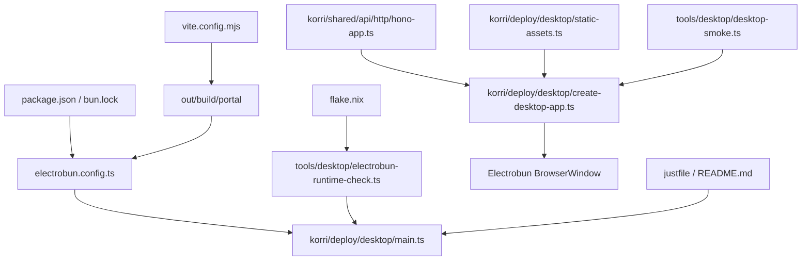

# feat: Add Electrobun desktop wrapper

## Overview

Add an Electrobun desktop target that packages the existing Korri web UI and runs the existing Effect RPC API locally inside the desktop app. The desktop build should not fork product UI or RPC contracts; it should reuse the Vite portal output and the Hono/Effect API surface so browser, E2E, and desktop behavior stay aligned.

## Problem Frame

The repo currently has a web deployment (`vite.config.mjs`, `korri/deploy/portal/*`) and a standalone Hono API entrypoint (`tools/http/server.ts`). Desktop support needs a native app shell that can load the web UI and satisfy the existing browser-side RPC client, which posts to `/api/rpc` via same-origin relative URLs. Loading the UI directly from `views://` would leave `/api/rpc` on the wrong scheme, so the desktop wrapper should expose one loopback HTTP origin that serves both static portal assets and `/api/*`.

## Requirements Trace

- R1. A desktop app can launch the existing Korri web UI in an Electrobun `BrowserWindow`.
- R2. The desktop runtime serves the existing Effect RPC API locally so existing relative `/api/rpc` calls work without changing client contracts.
- R3. The desktop target reuses current web/API source and build outputs; it must not create a forked desktop UI or duplicate RPC handlers.
- R4. Desktop build artifacts stay in the repo's generated-output namespace under `out/`.
- R5. Developer commands make desktop development and packaging discoverable without disrupting existing `just dev`, `just build`, or web/API checks.
- R6. Automated coverage proves the desktop HTTP composition serves API routes, portal assets, SPA fallback, and safe missing/path-traversal cases.
- R7. NixOS desktop development is treated as an explicit compatibility target with dev-shell prerequisites, binary-runtime risk called out, and a fast probe before native packaging is considered supported.

## Scope Boundaries

- Do not redesign the React app, router, spatial navigation, or RPC contracts.
- Do not add persistence, offline sync, auto-update flows, installers, or release hosting in this pass.
- Do not bundle CEF by default; use Electrobun's system webview path unless implementation proves the current UI needs Chromium-only behavior.
- Do not replace the existing web deployment or Node/Hono API entrypoint.

### Deferred to Separate Tasks

- Code signing, notarization, app icons, and branded installer assets: future release-hardening task.
- Auto-update channels and `release.baseUrl`: future distribution task once desktop packaging is validated.
- HMR-oriented desktop development: optional future improvement after the stable build-first loop works.
- A proper Nix package, AppImage, or patched distributable for NixOS users: future distribution task after local NixOS development is proven.

## Context & Research

### Relevant Code and Patterns

- `vite.config.mjs` builds the portal into `out/build/portal` and proxies `/api` to the API in web dev.
- `tools/http/server.ts` shows the current Hono server bootstrap and graceful shutdown pattern.
- `korri/shared/api/http/hono-app.ts` owns `/api`, `/api/health`, `/api/rpc`, body limits, compression, and dev-only CORS.
- `korri/shared/api/rpc/rx/client.ts` prepends `/api/rpc` to browser RPC requests, making same-origin desktop serving the lowest-contract-change path.
- `tools/artifacts/paths.ts` centralizes generated artifact paths and currently treats `out/` as the only supported generated-output namespace.
- `justfile` is the command surface for dev, build, checks, BDD generation, and artifact validation.
- Project placement rules put deployment/bootstrap entrypoints under `korri/deploy/*`, so desktop runtime code belongs under `korri/deploy/desktop/*`.
- `flake.nix` currently provides Bun, Node, Playwright browsers, Caddy, Hivemind, and general dev tools, but not Electrobun's Linux desktop runtime/build dependencies such as GTK/WebKitGTK/AppIndicator libraries.

### Institutional Learnings

- No `docs/solutions/` entry directly covers desktop packaging. The spatial navigation working agreement remains relevant only as an invariant: desktop wrapping must preserve native HTML focusability and should not introduce component-level navigation APIs.

### External References

- Electrobun npm package: latest stable `electrobun@1.16.0`; beta tag exists but should not be used for this plan.
- Electrobun README describes TypeScript main processes, tiny cross-platform bundles, system webviews by default, optional `bundleCEF`, and official platform support for macOS 14+, Windows 11+, and Ubuntu 22.04+.
- Electrobun quick start and build configuration docs show root `electrobun.config.ts`, `build.bun.entrypoint`, `build.copy`, `build.buildFolder`, `build.artifactFolder`, and `electrobun dev/build` CLI usage.
- Electrobun bundled-assets docs show `views://` maps copied files in `views/<name>/`, while `PATHS.VIEWS_FOLDER` can be used by the Bun main process when direct file access is needed.
- Electrobun compatibility docs note system webviews by platform and optional bundled CEF for consistency at a larger size cost.
- Electrobun Linux development docs are Ubuntu/FHS-oriented and list GTK/WebKitGTK/AppIndicator/librsvg-style system dependencies; on NixOS these need to be provided through the flake and may still require binary wrapping or `nix-ld` if downloaded Electrobun binaries expect standard dynamic linker paths.

## Key Technical Decisions

| Decision | Rationale | Tradeoff |
|---|---|---|
| Serve desktop UI and API from one loopback HTTP origin | Preserves existing `/api/rpc` relative client contract and avoids special-casing `views://` fetch behavior. | Adds a local HTTP server inside the desktop main process instead of loading `views://mainview/index.html` directly. |
| Import and compose the existing `honoApp` in the desktop runtime | Reuses Effect RPC handlers, middleware, body limits, and health routes without duplicating API wiring. | The desktop main bundle must be validated against the same path aliases and server-only dependencies as `tools/http/server.ts`. |
| Copy the Vite portal build into Electrobun `views/mainview` and serve those files over loopback | Lets Electrobun package static assets while the app still gets normal HTTP same-origin semantics. | Requires desktop commands to run the portal build before `electrobun dev/build`. |
| Keep Electrobun outputs under `out/build/electrobun` and `out/artifacts/electrobun` | Matches the repo's existing generated artifact policy and keeps cleanup predictable. | Requires explicit Electrobun config rather than relying on defaults (`build/`, `artifacts/`). |
| Default to system webviews, not bundled CEF | Keeps the first wrapper small and aligned with Electrobun defaults; CEF remains available if compatibility testing demands it. | Rendering may vary by platform until cross-platform verification proves acceptable. |
| Treat NixOS as a compatibility spike, not an assumed-supported Linux path | Electrobun's Linux docs target conventional distro library/linker layouts, while this repo develops under a Nix flake. | Adds flake and smoke-probe work before declaring desktop dev/build reliable on NixOS. |

## Open Questions

### Resolved During Planning

- Should the desktop wrapper start a separate API process? No. Run the API in the Electrobun Bun main process by composing `honoApp`; this avoids process supervision and keeps same-origin serving simple.
- Should the UI load via `views://` directly? No. Existing RPC fetches are rooted at `/api/rpc`, so a loopback HTTP origin is the safer contract-preserving entrypoint.
- Should Electrobun use the beta release? No. Use stable `electrobun@1.16.0` unless implementation hits a documented blocker.
- Will NixOS work out of the box? No assumption. The plan must add flake prerequisites and a desktop-runtime probe, then decide during implementation whether `nix-ld`, binary wrapping, or a later Nix package is needed.

### Deferred to Implementation

- Exact Electrobun shutdown/window event hooks: choose the current API shape while implementing `korri/deploy/desktop/main.ts`.
- Exact static file MIME map: keep the first implementation minimal but verify HTML, JS, CSS, and missing-file behavior.
- Whether Bun's bundler resolves all repo aliases in the Electrobun main bundle without extra configuration: verify during implementation and add the smallest config workaround if needed.

## Output Structure

    korri/deploy/desktop/
      create-desktop-app.ts
      create-desktop-app.test.ts
      main.ts
      static-assets.ts
      static-assets.test.ts
      window-options.ts
      window-options.test.ts
    tools/desktop/
      desktop-smoke.ts
      desktop-smoke.test.ts
    electrobun.config.ts

## High-Level Technical Design

> *This illustrates the intended approach and is directional guidance for review, not implementation specification. The implementing agent should treat it as context, not code to reproduce.*

```mermaid
flowchart TB
  BuildWeb[Vite build: out/build/portal] --> CopyViews[Electrobun copy: views/mainview]
  CopyViews --> Main[Electrobun Bun main process]
  HonoAPI[Existing honoApp /api/*] --> DesktopApp[Desktop Hono composition]
  Main --> DesktopApp
  DesktopApp --> Static[Portal static files + SPA fallback]
  DesktopApp --> API[/api, /api/health, /api/rpc]
  Main --> Window[BrowserWindow]
  Window --> Origin[http://127.0.0.1:<port>/]
  Origin --> Static
  Origin --> API
```

## Implementation Units

- [x] **Unit 1: Wire Electrobun build configuration and artifact paths**

**Goal:** Add Electrobun as a desktop packaging target with explicit output paths and portal asset copying.

**Requirements:** R1, R3, R4, R5

**Dependencies:** None

**Files:**
- Create: `electrobun.config.ts`
- Modify: `package.json`
- Modify: `bun.lock`
- Modify: `tools/artifacts/paths.ts`
- Test: `tools/artifacts/paths.test.ts`

**Approach:**
- Add stable `electrobun@1.16.0` as the desktop runtime dependency.
- Configure `app.name`, `app.identifier`, `app.version`, and `build.bun.entrypoint` explicitly.
- Set Electrobun `build.buildFolder` and `build.artifactFolder` under `out/` and reflect those paths in `tools/artifacts/paths.ts`.
- Configure `build.copy` from `out/build/portal/index.html` and `out/build/portal/assets` into `views/mainview` so packaged assets are available through Electrobun resources.
- Keep `bundleCEF: false` for macOS, Windows, and Linux in the first pass.
- Add `watchIgnore` for generated output so Electrobun watch mode does not loop on `out/` changes.

**Patterns to follow:**
- `tools/artifacts/paths.ts` for artifact namespace declarations.
- `tools/artifacts/paths.test.ts` for asserting canonical generated-output paths.
- Electrobun `templates/react-tailwind-vite/electrobun.config.ts` for Vite-output copying.

**Test scenarios:**
- Happy path: artifact layout includes desktop build and artifact paths under `out/` -> `supportedArtifactPaths` remains unique and entirely inside `out/`.
- Edge case: desktop artifact additions do not remove existing portal/API/report/generated paths -> existing artifact layout assertions still pass.
- Integration: Electrobun config references the same desktop entrypoint path planned for Unit 3 and the same portal output path produced by `vite.config.mjs`.

**Verification:**
- Desktop artifact paths are represented in the canonical artifact layout.
- Electrobun configuration is typecheckable and does not rely on default `build/` or `artifacts/` folders.

- [x] **Unit 2: Compose the desktop HTTP app from API and static portal assets**

**Goal:** Provide a same-origin loopback HTTP app that serves `/api/*`, built portal assets, and SPA fallback from packaged Electrobun resources.

**Requirements:** R2, R3, R6

**Dependencies:** Unit 1's asset layout decision

**Files:**
- Create: `korri/deploy/desktop/create-desktop-app.ts`
- Create: `korri/deploy/desktop/create-desktop-app.test.ts`
- Create: `korri/deploy/desktop/static-assets.ts`
- Create: `korri/deploy/desktop/static-assets.test.ts`
- Modify: `korri/shared/api/http/hono-app.ts` only if composition reveals an export seam is needed; prefer no change.

**Approach:**
- Build a small desktop Hono composition that delegates `/api/*` to the existing `honoApp` behavior and serves static portal files for non-API routes.
- Keep API middleware and RPC server ownership in `korri/shared/api/http/hono-app.ts`; the desktop layer should not reimplement body limits, compression, CORS, or RPC routing.
- Read static files from an injected asset root in tests and from Electrobun's resource/view path in the runtime.
- Serve `index.html` for application routes that are not real files so TanStack Router can handle deep links.
- Reject path traversal and return 404 for missing file-like asset requests rather than falling back to `index.html` for everything.

**Execution note:** Implement static and route-composition behavior test-first because this is the contract that keeps the desktop wrapper from diverging from the web app.

**Patterns to follow:**
- `korri/shared/api/http/hono-app.ts` for Hono route style.
- `tools/feature-map-explorer/server/routes/*.route.test.ts` for testing Hono apps through `app.fetch()` without binding a real port.
- `tools/feature-map-explorer/server/paths.ts` for path-safety thinking around repo-relative file access.

**Test scenarios:**
- Happy path: `GET /api/health` against the desktop app -> returns the same JSON shape as the shared API health route.
- Happy path: `GET /` with a fixture portal root containing `index.html` -> returns HTML with a text/html content type.
- Happy path: `GET /assets/app.js` with a fixture asset -> returns the asset body with a JavaScript-compatible content type.
- Edge case: `GET /games/123` where no file exists but `index.html` exists -> returns `index.html` for SPA routing.
- Edge case: `GET /assets/missing.js` -> returns 404 rather than `index.html`.
- Error path: `GET /../secret.txt` or encoded traversal input -> returns 400/404 and never reads outside the configured asset root.
- Integration: `POST /api/rpc` remains handled by the shared RPC app path rather than the static fallback.

**Verification:**
- A desktop Hono app can satisfy API and portal requests from one origin in unit tests.
- Static serving behavior is deterministic and safe for packaged assets.

- [x] **Unit 3: Add the Electrobun main process and window lifecycle**

**Goal:** Start the desktop HTTP app on loopback and open the web UI in an Electrobun native window.

**Requirements:** R1, R2, R3

**Dependencies:** Unit 2

**Files:**
- Create: `korri/deploy/desktop/main.ts`
- Create: `korri/deploy/desktop/window-options.ts`
- Test: `korri/deploy/desktop/window-options.test.ts`

**Approach:**
- In the Electrobun Bun main process, start the desktop HTTP app on `127.0.0.1` with an available port and build the BrowserWindow URL from that bound address.
- Keep native-window concerns in `main.ts`; keep pure URL/window-option decisions in `window-options.ts` so they can be unit tested without launching Electrobun.
- Set a conventional window title and initial frame that fit the current app without introducing custom chrome.
- Add an application edit menu or equivalent native roles if needed for copy/paste/select-all in inputs, following Electrobun's documented role-menu guidance.
- Ensure server cleanup is tied to app/window shutdown so the loopback port is not left open after exit.

**Patterns to follow:**
- `tools/http/server.ts` for startup logging and graceful shutdown shape.
- Electrobun `templates/react-tailwind-vite/src/bun/index.ts` for `BrowserWindow` startup shape.
- Electrobun `guides/creating-ui` for native edit menu roles when web inputs need keyboard shortcuts.

**Test scenarios:**
- Happy path: given host `127.0.0.1` and a bound port -> window URL is `http://127.0.0.1:<port>/` with no external hostname.
- Edge case: title/frame defaults are present when no overrides are provided -> BrowserWindow options remain deterministic.
- Error path: server startup failure is surfaced to the main-process logger and does not attempt to open a window against an undefined URL.

**Verification:**
- The main process has a minimal native boundary, with pure pieces covered by unit tests.
- Manual/native launch is expected to show the existing Korri UI loaded from a loopback URL.

- [x] **Unit 4: Add NixOS desktop compatibility guardrails**

**Goal:** Make local NixOS desktop development explicit, probe whether Electrobun's native binaries can run in the flake shell, and keep unsupported packaging paths out of default validation.

**Requirements:** R5, R7

**Dependencies:** Units 1-3

**Files:**
- Modify: `flake.nix`
- Create: `tools/desktop/electrobun-runtime-check.ts`
- Create: `tools/desktop/electrobun-runtime-check.test.ts`
- Modify: `justfile`
- Modify: `README.md`

**Approach:**
- Add Linux desktop prerequisites to the default dev shell, scoped to platforms where Nixpkgs exposes them: `pkg-config`, `cmake`, C/C++ build tools if missing, GTK3, WebKitGTK 4.1, AppIndicator/Ayatana libraries, librsvg, and `patchelf`/diagnostic tools useful for downloaded native binaries.
- Add an explicit runtime-check recipe that verifies the Electrobun CLI can resolve its installed package, reports the host platform, and performs the lightest safe native-binary probe available without launching the full app.
- Keep this probe separate from `just check` and `just build`; it is a desktop readiness check, not a universal repo invariant.
- Document the likely NixOS failure modes: missing dynamic linker path, missing WebKitGTK/GTK runtime libraries, and downloaded Electrobun binaries that may need `nix-ld`, wrapping, or a future Nix derivation.
- Do not enable CEF as a workaround by default; record it as a possible follow-up only if the system-webview path is blocked after the Nix shell is complete.

**Patterns to follow:**
- Existing `flake.nix` package grouping and shell hook style.
- Existing `justfile` explicit-tooling recipes rather than hiding platform-specific checks in `check`.
- `tools/demo-video/smoke.ts` for clear environment diagnostics and actionable failure messages.

**Test scenarios:**
- Happy path: runtime-check helper sees an installed Electrobun package and Linux desktop libraries are expected in the shell -> reports readiness without invoking native packaging.
- Edge case: runtime-check runs on non-Linux -> reports that NixOS-specific library probing is skipped while still checking Electrobun package availability.
- Error path: Electrobun package or native binary is missing -> returns an actionable failure naming the missing dependency and the desktop recipe to run after install.
- Error path: Linux probe detects a dynamic-linker/library failure signature -> output recommends `nix-ld`, wrapper/patchelf investigation, or deferring to a Nix packaging task rather than treating it as an app bug.

**Verification:**
- NixOS readiness is visible as an explicit command and documented caveat.
- Desktop packaging remains opt-in until the runtime-check and native launch prove reliable in the flake shell.

- [x] **Unit 5: Add desktop command surface and smoke verification**

**Goal:** Make desktop build/dev flows discoverable and provide a non-native smoke test that validates the packaged HTTP composition.

**Requirements:** R4, R5, R6, R7

**Dependencies:** Units 1-4

**Files:**
- Create: `tools/desktop/desktop-smoke.ts`
- Create: `tools/desktop/desktop-smoke.test.ts`
- Modify: `justfile`
- Modify: `package.json`
- Modify: `README.md`

**Approach:**
- Add `just desktop-dev` for the build-first local loop: build the portal, then run Electrobun dev against the desktop entrypoint.
- Add `just desktop-build` for packaging: build the portal, then run Electrobun build with the configured `out/` folders.
- Add `just desktop-runtime-check` or equivalent from Unit 4 so NixOS/native readiness can be checked independently before `desktop-dev` or `desktop-build`.
- Add a smoke script that starts the desktop Hono composition against `out/build/portal` and verifies `/`, a representative asset path when present, and `/api/health` without launching a native window.
- Wire the smoke check into an explicit desktop recipe rather than the default `just check` initially, because Electrobun native packaging can download platform binaries and may be unsuitable for every CI/dev machine.
- Document the new desktop commands in `README.md` alongside existing useful commands.

**Patterns to follow:**
- Existing `justfile` recipe style and naming.
- `tools/demo-video/smoke.ts` for a tool script that can run checks with clear failure output.
- `README.md` command list style.

**Test scenarios:**
- Happy path: smoke script receives a fixture portal build with `index.html` and an asset -> it fetches root, asset, and `/api/health` successfully.
- Edge case: smoke script runs when no representative asset exists -> it still verifies root and API health and reports the skipped asset check clearly.
- Error path: smoke script receives a missing portal build directory -> exits with an actionable failure instead of starting a broken server.
- Integration: `just desktop-smoke` or equivalent recipe depends on the web build output and exercises the same desktop app composition as Unit 2.

**Verification:**
- Developers can discover desktop commands from `just --list` and `README.md`.
- A non-native smoke path catches broken API/static integration before someone launches Electrobun.

- [x] **Unit 6: Validate cross-surface behavior and preserve existing contracts**

**Goal:** Ensure desktop support does not regress existing web/API behavior or generated-route/RPC contracts.

**Requirements:** R2, R3, R5, R6, R7

**Dependencies:** Units 1-5

**Files:**
- Modify only if needed: `tools/playwright/playwright.e2e.config.ts`
- Modify only if needed: `tools/scripts/serve-dev-stack.sh`
- Test: existing unit tests under `korri/shared/api/*`, `tools/artifacts/paths.test.ts`, and new tests from Units 1-5

**Approach:**
- Prefer no changes to Playwright, Storybook, or existing dev-stack scripts; desktop should be additive.
- Verify the existing browser app still talks to `/api/rpc` through the same client path.
- Keep desktop recipes out of `just check` unless they are pure/unit-level and do not download native Electrobun binaries.
- If implementation reveals a needed environment variable for desktop asset roots or ports, keep it desktop-scoped and document it near the desktop recipe rather than changing shared web behavior.

**Patterns to follow:**
- Existing `just check` composition for keeping standard validation stable.
- Existing Playwright configs for keeping web E2E against the web deployment, not the native shell.

**Test scenarios:**
- Integration: standard unit tests still pass with Electrobun dependency installed and desktop files included in TypeScript/Biome scope.
- Integration: existing API health and RPC tests remain unchanged; desktop composition delegates rather than forking behavior.
- Edge case: desktop-only environment variables are absent during normal web dev -> `just dev-web`, `just dev-api`, and E2E configuration remain unaffected.
- Error path: desktop smoke failure does not mask standard `just check` failures; command output points to desktop-specific diagnostics.

**Verification:**
- Existing web/API validation remains additive and stable.
- Desktop support can be validated independently without changing current CI expectations.

## System-Wide Impact



- **Interaction graph:** New entrypoints are additive: `electrobun.config.ts`, `korri/deploy/desktop/main.ts`, desktop recipes, and smoke tooling. Existing web, API, Storybook, Playwright, and generated BDD paths should not be repointed.
- **Error propagation:** Desktop startup failures should fail the main process visibly through `@shared/logger`; HTTP/static failures should become normal HTTP status codes; RPC errors should continue through the existing Effect RPC error serialization.
- **State lifecycle risks:** The main lifecycle risk is leaving a loopback server alive after the native window exits. Tie server cleanup to the Electrobun app/window lifecycle and keep unit-testable URL/server-option logic outside the native API boundary.
- **API surface parity:** `/api`, `/api/health`, and `/api/rpc` must behave the same under desktop and `tools/http/server.ts`; no desktop-only RPC contract should be introduced.
- **Integration coverage:** Unit tests cover Hono composition and static fallback; the desktop smoke script covers built assets plus API health; native packaging/launch remains a manual verification step until a reliable GUI automation path is added.
- **Unchanged invariants:** Product route files, generated TanStack route tree, Effect Schema RPC contracts, feature gate headers, and navigation architecture remain unchanged. The desktop wrapper is a deployment target, not a product fork.

## Risks & Dependencies

| Risk | Mitigation |
|------|------------|
| Electrobun build downloads platform binaries or requires OS-specific libraries during packaging. | Keep native packaging out of default `just check`; add explicit desktop recipes and document platform prerequisites. |
| NixOS cannot run downloaded Electrobun Linux binaries because of dynamic linker or library path expectations. | Add flake prerequisites and an explicit runtime-check recipe; if it fails, document `nix-ld`, wrapping/patchelf, or a future Nix package as the next step instead of blocking web/API work. |
| `views://` asset URLs conflict with same-origin `/api/rpc`. | Do not load the app directly from `views://`; serve packaged assets over loopback HTTP. |
| Static fallback accidentally serves `index.html` for missing JS/CSS assets, hiding broken builds. | Test missing file-like asset paths as 404 while preserving SPA fallback for route-like paths. |
| Path traversal in static serving exposes local files. | Centralize path normalization in `static-assets.ts` and cover encoded traversal cases. |
| Bun/Electrobun bundling cannot resolve repo aliases or server dependencies on first attempt. | Keep desktop server imports close to existing source patterns and verify via typecheck/build; if needed, add the smallest desktop-specific bundler config rather than changing app aliases. |
| System webviews differ across platforms. | Start with system webviews for size and simplicity; record any platform-specific rendering failures before deciding to enable bundled CEF. |
| Desktop commands disturb current web/API workflows. | Make recipes additive and keep standard `just dev`, `just build`, and `just check` semantics unchanged. |

## Documentation / Operational Notes

- Update `README.md` with desktop commands, expected build-first workflow, NixOS runtime-check guidance, and a note that native packaging may require Electrobun platform prerequisites.
- Keep release operations out of scope: no signing, notarization, auto-update host, installer publishing, or Nix package derivation yet.
- Desktop smoke verification should be documented as the quick non-native confidence check; native launch remains a separate manual step during this first integration.

## Sources & References

- Related code: `vite.config.mjs`
- Related code: `tools/http/server.ts`
- Related code: `korri/shared/api/http/hono-app.ts`
- Related code: `korri/shared/api/rpc/rx/client.ts`
- Related code: `tools/artifacts/paths.ts`
- Related code: `justfile`
- Related code: `flake.nix`
- External docs: `https://github.com/blackboardsh/electrobun`
- External docs: `https://docs.electrobunny.ai/electrobun/guides/quick-start`
- External docs: `https://docs.electrobunny.ai/electrobun/apis/cli/build-configuration`
- External docs: `https://docs.electrobunny.ai/electrobun/apis/bundled-assets`
- External docs: `https://docs.electrobunny.ai/electrobun/guides/compatability`
