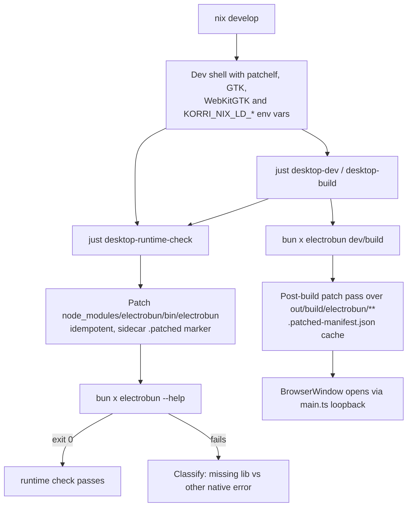

# feat: Electrobun Nix-native build (staged dev loop + hermetic nix run)

## Overview

Make Korri's desktop app feel native to Nix on Linux, in two stages that ship independently:

- **Stage 1 — Nix dev loop:** `nix develop` followed by `just desktop-dev` / `just desktop-build` works on NixOS without the user enabling `nix-ld` or installing host-level packages. Achieved by lazy, idempotent auto-patchelf inside `just desktop-runtime-check`, covering both the prebuilt Electrobun CLI and per-build native artifacts emitted under `out/build/electrobun/**`.
- **Stage 2 — Hermetic `nix run`:** `nix run github:<acct>/<repo>` launches the desktop app on `x86_64-linux` and `aarch64-linux` from a clean machine that has only `nix` available. Achieved by a fully sandboxed Nix derivation graph: hermetic `bun install` via fixed-output derivation, fixed-output fetches of the upstream Electrobun CLI + core tarballs per platform, in-sandbox `electrobun build` with the prebuilt binaries pre-staged, then patchelf + wrap of the launcher with GTK/WebKit RPATH/`LD_LIBRARY_PATH`.

This plan extends, and does not replace, the work landed in `docs/plans/2026-04-30-004-feat-electrobun-desktop-wrapper-plan.md`. The product behavior of the desktop app — same-origin loopback HTTP, reused `honoApp`, SPA fallback, traversal protection — is unchanged.

## Problem Frame

The Electrobun desktop wrapper landed previously, but its NixOS story is currently a guardrail: `tools/desktop/electrobun-runtime-check.ts` detects the dynamic-linker stub and refuses to proceed (see origin: `docs/brainstorms/2026-04-30-electrobun-nix-native-build-requirements.md`). Local desktop development on the project's `nix develop` shell is broken, and there is no way to launch the desktop app from a remote flake.

The request is two-staged: first restore the dev loop on NixOS in a contained, in-flake way (no host configuration changes); second produce a redistributable `nix run github:…` artifact for both common Linux architectures. Stage 1 unblocks contributors quickly; Stage 2 makes the desktop app installable by anyone with `nix` and nothing else.

## Requirements Trace

Stable IDs carried from `docs/brainstorms/2026-04-30-electrobun-nix-native-build-requirements.md` (R1–R14).

**Stage 1 — Nix dev loop**

- R1. `nix develop` + `just desktop-dev` / `just desktop-build` succeed on Linux against an unmodified upstream Electrobun release with no host-level `nix-ld`, NixOS module, or system package installs.
- R2. `just desktop-runtime-check` evolves from fail-loud into self-healing: patches the prebuilt Electrobun binary in place, then re-probes; if patching itself fails, surfaces actionable next steps instead of a Linux dynamic-linker stack trace.
- R3. The patch set covers both `node_modules/electrobun/bin/electrobun` and per-build artifacts under `out/build/electrobun/**` so the launched window opens, not just the CLI exiting cleanly.
- R4. Patching is idempotent and cached: re-runs over already-patched files are no-ops; only newly emitted artifacts are touched.
- R5. Patching only runs as part of the desktop recipes. Web-only and API-only contributors who never invoke `just desktop-*` see no change.
- R6. `bun install` does not require a manual re-patch step — the next desktop recipe invocation detects freshly extracted binaries and patches them.

**Stage 2 — Hermetic Nix package**

- R7. The flake exposes `apps.<system>.default` (and named alias `apps.<system>.korri-desktop`) so `nix run github:<acct>/<repo>` works with no fragment, no `nix develop`, no `just`.
- R8. The package supports `x86_64-linux` and `aarch64-linux`. macOS and Windows are explicit non-goals.
- R9. The package builds inside the Nix sandbox without network access at evaluation time. All inputs are flake inputs, repo files, or fixed-output fetches keyed on hashes that live in the repo.
- R10. The packaged binary preserves the loopback HTTP composition from the existing desktop plan: serves `/api/*` (delegating to `honoApp`) and the built portal assets from one same-origin `127.0.0.1` HTTP server.
- R11. The packaged binary is launchable on a clean NixOS host with only `nix` available — GTK, WebKitGTK, libayatana-appindicator, librsvg, and any other runtime libraries are part of the runtime closure or are baked into RPATH/`LD_LIBRARY_PATH` via wrapping.

**Verification and ongoing maintenance**

- R12. CI verifies remote-flake invocation: `nix run` against trunk and against `github:<acct>/<repo>` for both `x86_64-linux` and `aarch64-linux`. CI fails if the desktop app cannot start.
- R13. CI verifies Stage 1: enters `nix develop` on Linux and runs `just desktop-runtime-check` plus `just desktop-smoke`.
- R14. The per-platform Electrobun binary is pinned by fixed-output hash in the repo. Bumping the Electrobun npm version requires a small, visible repo change (lockfile + per-platform hash entries), not silent network drift.

## Scope Boundaries

- **No host-level `nix-ld` requirement.** The flake must not assume `programs.nix-ld.enable`. `nix-ld` may be mentioned as an alternative, but the supported path is in-flake patchelf.
- **Linux only for Stage 2.** macOS and Windows `nix run` is out of scope.
- **No CEF.** System webview only, matching the existing desktop plan.
- **No code signing, notarization, app icons, AppImage, auto-update channels, or release hosting** — same deferrals as the prior desktop plan.
- **No replacement of Stage 1 by Stage 2.** Stage 1 (fast inner dev loop) and Stage 2 (distribution) both ship and stay maintained.
- **No change to product UI, RPC contracts, spatial navigation, or the loopback HTTP composition.** This plan is platform/packaging work.
- **No change to `just dev`, `just build`, `just check`, web E2E, or BDD pipelines.** Their behavior and runtimes must be unaffected.

### Deferred to Separate Tasks

- Darwin `nix run` and macOS app-bundle wrapping: separate effort once Linux is stable.
- AppImage / standalone tarball distribution: separate distribution task; orthogonal to `nix run`.
- aarch64-linux CI runner adoption (native vs emulated) at the org level: tracked as an operational decision rather than a code deliverable, but the workflow is structured so the runner choice is one config swap.
- Bumping Electrobun across major versions if upstream breaks the `dist-${OS}-${ARCH}/` cache layout: future maintenance task; current plan assumes the contract holds.

## Context & Research

### Relevant Code and Patterns

- `flake.nix` — already declares Linux dev-shell deps `gtk3`, `webkitgtk_4_1`, `libayatana-appindicator`, `librsvg`, `pkg-config`, `cmake`, `gcc`, `patchelf`. Dev shell is the natural place to expose interpreter + library env vars for the Stage 1 patcher.
- `tools/desktop/electrobun-runtime-check.ts` and `…-runtime-check.test.ts` — current fail-loud guardrail; Unit 2 refactors it to patch-then-probe with the patcher module from Unit 1.
- `tools/desktop/desktop-smoke.ts` and `…-smoke.test.ts` — non-native HTTP smoke; reused by Stage 1 CI verification (R13). The `createDesktopApp` composition it exercises is the same composition Stage 2 ships.
- `electrobun.config.ts` — sets `mac.bundleCEF: false`, `linux.bundleCEF: false`, `win.bundleCEF: false`, `build.buildFolder: "out/build/electrobun"`, `build.artifactFolder: "out/artifacts/electrobun"`. The Stage 2 derivation reuses this same config.
- `tools/artifacts/paths.ts` — exposes `buildArtifactPaths.electrobun` (`out/build/electrobun`) and `desktopArtifactPath` (`out/artifacts/electrobun`). Stage 1 patch cache lives under `out/build/electrobun/.patched/`.
- `korri/deploy/desktop/main.ts` — Bun main process that runs `Bun.serve` on `127.0.0.1:0` and opens a `BrowserWindow` at the resulting URL. Stage 2's launcher is this same entrypoint, packaged.
- `korri/deploy/desktop/create-desktop-app.ts` — same-origin Hono composition. Both stages use it unchanged.
- `justfile` — `desktop-runtime-check`, `desktop-smoke`, `desktop-dev`, `desktop-build` are already defined. Stage 1 modifies `desktop-runtime-check`'s implementation only and adds a post-build patch step inside `desktop-dev`/`desktop-build`. Stage 2 adds no new justfile recipes; it's invoked via `nix run`.

### Institutional Learnings

- `docs/solutions/best-practices/electrobun-desktop-wrapper-loopback-2026-05-01.md` — locks in the loopback-HTTP same-origin invariant. Both stages must preserve it; the Stage 2 derivation packages exactly this composition.
- No existing `docs/solutions/` entry covers Nix-packaging of dynamically-linked vendored binaries. This plan is precedent-setting for the repo.

### External References

- Electrobun CLI shim `node_modules/electrobun/bin/electrobun.cjs` — confirms per-platform tarball URL pattern: `https://github.com/blackboardsh/electrobun/releases/download/v${version}/electrobun-cli-${platform}-${arch}.tar.gz`. Used directly by the Stage 2 fixed-output fetches.
- Electrobun CLI source `node_modules/electrobun/src/cli/index.ts` (function `ensureCoreDependencies`) — confirms `electrobun build` only fetches `electrobun-core-${platform}-${arch}.tar.gz` if `node_modules/electrobun/dist-${OS}-${ARCH}/` is missing required binaries (`bun`, `bsdiff`, `bspatch`, `libNativeWrapper.so` for Linux). Pre-staging the extracted core tree short-circuits all build-time network access.
- Electrobun GitHub Releases API (verified for `v1.16.0`): `electrobun-cli-linux-x64.tar.gz` (~39 MB), `electrobun-cli-linux-arm64.tar.gz` (~38 MB), `electrobun-core-linux-x64.tar.gz` (~54 MB), `electrobun-core-linux-arm64.tar.gz` (~53 MB) all exist. Resolves brainstorm Deferred-to-Planning question on aarch64 availability.

## Key Technical Decisions

| Decision | Rationale | Tradeoff |
|---|---|---|
| Stage 1 patches the Electrobun CLI in place via `patchelf` rather than wrapping invocations in `buildFHSEnv` | Avoids per-invocation wrapper overhead; survives across `bun install` without changing every desktop recipe. | Requires `patchelf` on `PATH` and Nix-store interpreter/library paths exposed via env vars; works only inside `nix develop`. |
| Stage 1 patcher is invoked lazily from `desktop-runtime-check`, with a separate idempotent post-build pass invoked from `desktop-dev`/`desktop-build` after `electrobun build`/`dev` runs | Web/API-only contributors pay nothing; the inner `electrobun dev` loop only re-patches new outputs. | The patch step is split across two trigger points (CLI vs build outputs); both must stay coherent. |
| Patch cache lives next to the artifact: a sidecar `.patched` marker file per ELF, plus `out/build/electrobun/.patched-manifest.json` for build outputs | Survives `electrobun dev`'s rebuild loop because Electrobun rewrites the binary content (mtime/sha changes) and the marker stores the patched file's hash; mismatch triggers re-patch. | Slightly more bookkeeping than a single global flag; chosen for correctness under live-rebuild. |
| Stage 1 runtime check evolves from probe-only into patch-then-probe; the existing `nix-ld` recommendation is preserved as fallback advice when patching itself fails | Existing tests document a contract; refactor preserves observable behavior on the success path while silently fixing what was previously a hard fail. | Test file under `tools/desktop/electrobun-runtime-check.test.ts` needs material rewriting; care needed to keep coverage of the non-NixOS-Linux failure modes. |
| Stage 2 hermetic build via fixed-output `bun install --ignore-scripts` + per-platform fixed-output fetches of upstream Electrobun CLI and core tarballs, pre-staged into `node_modules/electrobun/{bin,dist-${OS}-${ARCH}}/` before invoking `electrobun build` inside the sandbox | The Electrobun CLI's `ensureCoreDependencies` skips network fetch if the platform `dist-` tree exists; pre-staging neutralizes its network requirement without patching upstream code. | Three fixed-output fetches per supported platform (npm deps + CLI + core); each requires a hash entry in the repo. |
| Stage 2 expressed as a chain of small derivations: `bun-deps` (FOD) → `electrobun-binaries-<system>` (FOD per platform) → `korri-portal` (Vite build) → `korri-desktop` (composes them, runs `electrobun build`, patches, wraps) | Each step caches independently; portal rebuilds don't redo the npm fetch; bumping Electrobun only invalidates the binaries node. | More files in the flake than a single monolithic derivation. |
| Stage 2 wraps the launcher with `wrapProgram --prefix LD_LIBRARY_PATH` rather than only setting executable RPATH | WebKitGTK loads GIO modules and gdk-pixbuf loaders at runtime that RPATH alone does not cover; explicit `LD_LIBRARY_PATH` plus `XDG_DATA_DIRS` and `GIO_EXTRA_MODULES` is the established pattern for GTK apps in Nixpkgs. During implementation, setting RPATH on Electrobun/Bun executables caused a segfault; executables are patched with interpreter only, while shared objects receive RPATH. | Slightly larger runtime closure; correct GTK behavior end-to-end. |
| `apps.<system>.default` and `apps.<system>.korri-desktop` both point at the same wrapper, so `nix run github:<acct>/<repo>` works without a fragment | Smallest UX for users; the named alias supports future siblings (e.g., `feature-map-explorer`) without breaking the default. | Default alias adds a forward-compat constraint; if a future Korri default app diverges, this becomes a renaming task. |
| Hermetic Bun install via a hand-rolled FOD derivation around `bun install --ignore-scripts` keyed on `bun.lock`, rather than `bun2nix` or `buildNpmPackage` | No third-party dependency; Bun's frozen-lockfile install is reproducible enough; `--ignore-scripts` defeats Electrobun's network postinstall, which is solved separately by the binaries derivation. | If Bun's lockfile format or hashing semantics change, the FOD hash format must follow; documented in the bump runbook. |
| aarch64-linux verification in CI uses QEMU emulation by default with a self-hosted ARM runner as an opt-in upgrade | Lowest-friction path until org-level ARM runners exist; QEMU-emulated builds are slow but acceptable for a per-PR check. | Slower CI; future swap when ARM runners are available is a one-line change. |

## Open Questions

### Resolved During Planning

- **aarch64-linux upstream availability** (brainstorm-deferred): Verified — Electrobun publishes `electrobun-cli-linux-arm64.tar.gz` and `electrobun-core-linux-arm64.tar.gz` for v1.16.0. R8 stays in scope.
- **Hermetic Bun install mechanism** (brainstorm-deferred): hand-rolled FOD around `bun install --ignore-scripts` keyed on `bun.lock`, no third-party deps. Documented in Unit 5.
- **Patch cache placement and invalidation** (brainstorm-deferred): per-file `.patched` sidecar storing the file's SHA-256 at patch time; mismatch triggers re-patch. For build outputs, a single `out/build/electrobun/.patched-manifest.json` mapping relative path → SHA. Survives `electrobun dev`'s rewrites because the file content changes invalidate the recorded hash.
- **`apps.default` portal-build coupling** (brainstorm-deferred): chain `korri-portal` → `korri-desktop`. Portal is its own derivation; desktop consumes it as a build input.
- **Stage 2 supply-chain shape**: pre-stage CLI + core extracted trees into `node_modules/electrobun/{bin,dist-${OS}-${ARCH}}/` before `electrobun build`. Confirmed against Electrobun CLI source — no upstream patching required.

### Deferred to Implementation

- Exact runtime library closure for GTK3 + WebKitGTK 4.1 + libayatana-appindicator after a patched Electrobun window actually opens. Likely additions: `glib`, `libsoup_3`, `at-spi2-core`, `cairo`, `pango`, `gdk-pixbuf`, `gsettings-desktop-schemas`, fonts. Verification belongs in Unit 7 — extend the wrapping when the runtime probe surfaces a missing library.
- Exact env-var names exposed by `flake.nix` for the Stage 1 patcher. Working assumption: `KORRI_NIX_LD_INTERPRETER` and `KORRI_NIX_LD_LIBRARY_PATH`. Final names chosen during Unit 1 implementation.
- Whether Bun's lockfile hash needs `bun install --frozen-lockfile` vs `--no-save` for FOD reproducibility. Verified empirically during Unit 5 — the FOD must produce a byte-stable output tree.
- Whether `electrobun build` running inside the Nix sandbox tolerates `process.cwd()` being a fixed-output `nix store` path. If it writes outside the configured `buildFolder`, the derivation must redirect via env or `cd` into a writable scratch dir before invoking it.
- Whether `apps.default` should depend on the same-platform `korri-desktop` only, or expose richer cross-platform metadata. First cut: same-platform only; revisit if cross-compilation becomes a goal.
- Whether the QEMU-emulated aarch64 CI job runs `nix flake check` only, or also actually launches `nix run` under a virtual display. First cut: build verification (`nix build .#korri-desktop` for aarch64), not runtime launch — runtime launch under QEMU is unreliable for GUI apps.
- Whether to pin the nixpkgs revision via `flake.lock` more aggressively (e.g., to a release branch) once the build is reliable. Out of scope for first cut; current `nixpkgs-unstable` matches the existing flake.

## Output Structure

    flake.nix                                 # modified: Stage 1 env vars, Stage 2 packages/apps wiring
    nix/
      bun-deps.nix                            # new: hermetic node_modules FOD
      electrobun-binaries.nix                 # new: per-platform CLI + core fixed-output fetches and stage tree
      korri-portal.nix                        # new: Vite build derivation
      korri-desktop.nix                       # new: composes portal + electrobun-binaries, runs electrobun build, patches, wraps
      versions.nix                            # new: Electrobun version + per-platform tarball SHA256s; bumper output target
    tools/desktop/
      electrobun-patcher.ts                   # new: pure patch planner + io applier
      electrobun-patcher.test.ts              # new
      electrobun-post-build-patch.ts          # new: scans out/build/electrobun and patches new outputs
      electrobun-post-build-patch.test.ts     # new
      electrobun-runtime-check.ts             # modified: patch-then-probe
      electrobun-runtime-check.test.ts        # modified: new flow assertions
    tools/scripts/
      bump-electrobun.sh                      # new: refresh nix/versions.nix on Electrobun version bumps
    .github/workflows/
      desktop-stage1.yml                      # new: nix develop + just desktop-runtime-check + desktop-smoke
      desktop-stage2.yml                      # new: nix flake check + nix build .#korri-desktop for x86_64 + aarch64; nix run from github URL on trunk
    justfile                                  # modified: desktop-dev/desktop-build invoke post-build patch step

## High-Level Technical Design

> *This illustrates the intended approach and is directional guidance for review, not implementation specification. The implementing agent should treat it as context, not code to reproduce.*

### Stage 1 — dev-shell auto-patchelf flow



### Stage 2 — hermetic Nix derivation graph

```mermaid
flowchart LR
  Lockfile[bun.lock] --> BunDeps[nix/bun-deps.nix<br/>FOD: bun install --ignore-scripts]
  Versions[nix/versions.nix<br/>Electrobun version + sha256 per platform] --> Binaries[nix/electrobun-binaries.nix<br/>fetchurl CLI + core, extract<br/>per system]
  Repo[korri/products + korri/shared + Vite config] --> Portal[nix/korri-portal.nix<br/>Vite build]

  BunDeps --> Desktop[nix/korri-desktop.nix]
  Binaries --> Desktop
  Portal --> Desktop
  Desktop --> EbBuild[Pre-stage CLI + core into<br/>node_modules/electrobun/<br/>{bin, dist-OS-ARCH}, then<br/>bun x electrobun build]
  EbBuild --> Patch[patchelf interpreter + RPATH<br/>over emitted artifacts]
  Patch --> Wrap[wrapProgram bin/korri-desktop<br/>with LD_LIBRARY_PATH,<br/>XDG_DATA_DIRS, GIO_EXTRA_MODULES]

  Wrap --> AppDefault[apps.system.default<br/>apps.system.korri-desktop]
  AppDefault --> Run[nix run github:acct/repo]
```

## Implementation Units

- [x] **Unit 1: Stage 1 patcher module**

**Goal:** A pure-by-default patcher that knows how to make a downloaded ELF runnable under the Nix dev shell, with idempotent caching and clear failure classification. Building block for both the runtime check and the post-build pass.

**Requirements:** R1, R2, R3, R4

**Dependencies:** None.

**Files:**
- Create: `tools/desktop/electrobun-patcher.ts`
- Create: `tools/desktop/electrobun-patcher.test.ts`

**Approach:**
- Expose two layers: a pure `planPatch(input)` that takes `{ filePath, fileSha, interpreter, libraryPath, markerSha? }` and returns one of `skip` (already patched, hashes match), `patch` (with `setInterpreter`, `setRpath` args), `error` (env not configured, file not ELF, file missing).
- An `applyPatchPlan(plan, deps)` that invokes `patchelf` via `Bun.spawnSync` and writes the sidecar marker. `deps` injects spawn + fs so tests can run pure.
- Marker shape: a JSON sidecar `<file>.patched` containing `{ sha: <patched-sha>, patchedAt: <iso>, interpreter, rpath }`.
- Recognize file types: only attempt to patch ELFs (read first 4 bytes for `0x7f 'E' 'L' 'F'`); skip non-ELF inputs (e.g., the `.cjs` shim) with a deterministic reason.
- Read interpreter and library path from env: `KORRI_NIX_LD_INTERPRETER`, `KORRI_NIX_LD_LIBRARY_PATH`. Missing env → `error` with recommendation `"Run inside nix develop; the dev shell exposes patchelf inputs."`.
- No I/O in `planPatch`. `applyPatchPlan` is the only I/O surface.

**Execution note:** Implement test-first. The patcher is the foundation for two consumers and a deferred Stage 2 reuse; tests prevent regressions in classification and idempotence semantics.

**Patterns to follow:**
- `tools/desktop/electrobun-runtime-check.ts` — pure classifier + thin I/O wrapper pattern. Mirror it.
- `tools/desktop/desktop-smoke.ts` — `Bun.spawnSync` and structured report shape.

**Test scenarios:**
- Happy path: ELF exists, env vars set, no marker → returns `patch` plan with `setInterpreter` from env and `setRpath` from env; `applyPatchPlan` calls patchelf with both flags and writes a marker whose `sha` matches the post-patch file.
- Edge case: marker exists with `sha` matching current file → returns `skip` with reason `"already patched"`. Re-run is a no-op.
- Edge case: marker exists with `sha` mismatching current file (e.g., file was rewritten by `electrobun dev`) → returns `patch` with reason `"binary changed since last patch"`.
- Edge case: file is not ELF (first 4 bytes ≠ ELF magic) → returns `skip` with reason `"not an ELF file"`. The Node `.cjs` shim must hit this branch.
- Edge case: file path does not exist → returns `skip` with reason `"file not found"` (caller decides whether that is an error in their context).
- Error path: `KORRI_NIX_LD_INTERPRETER` env var unset → returns `error` with recommendation about entering `nix develop`. No spawn occurs.
- Error path: `applyPatchPlan` invokes patchelf but it exits non-zero → returns `error` carrying patchelf's stderr, plus recommendation to inspect Nix-store paths.
- Integration: full apply over a fixture ELF (use `bun` itself or a small generated sample) → after apply, file's interpreter and rpath are set as planned (verify by parsing patchelf `--print-interpreter` and `--print-rpath` output in the test, not by re-launching the file).

**Verification:**
- All test scenarios pass under `bun test`.
- The patcher refuses to mutate files outside the directory it was given a path inside, and never writes a marker for a `skip` or `error` outcome.

- [x] **Unit 2: Refactor `desktop-runtime-check` to patch-then-probe**

**Goal:** Replace the current fail-loud-on-NixOS branch with: (a) try CLI patch via Unit 1, (b) re-probe, (c) classify the new probe result. Preserve the existing non-NixOS-Linux failure paths and the non-Linux skip path.

**Requirements:** R1, R2, R6

**Dependencies:** Unit 1.

**Files:**
- Modify: `tools/desktop/electrobun-runtime-check.ts`
- Modify: `tools/desktop/electrobun-runtime-check.test.ts`

**Approach:**
- Keep the existing `classifyElectrobunRuntime` pure function but extend the `ElectrobunRuntimeInput` shape with an optional `cliPatchAttempt: { ok: boolean; messages: string[]; recommendations: string[] }`.
- The `runElectrobunRuntimeCheck` orchestrator: on a Linux probe failure that matches `hasNixDynamicLinkerFailure`, invoke `electrobun-patcher`'s `planPatch` + `applyPatchPlan` for the CLI binary, then re-run the native probe and pass both the patch outcome and the second probe result into the classifier.
- Preserve the `nix-ld` recommendation as fallback advice when the patch itself fails or when the env vars are missing — i.e., the patcher returns `error`.
- Existing tests for non-Linux skip, missing package, and dynamic-linker classification must still pass; new tests cover the patch-then-probe success and patch-then-probe-still-fails branches.

**Execution note:** Test-first. The semantics changed and are observable in CI output; locking the new contract in tests prevents drift.

**Patterns to follow:**
- The current pure-classifier + thin-wrapper structure of the file under test.

**Test scenarios:**
- Happy path: Linux + first probe fails with NixOS dynamic-linker error + patch returns `applied` + second probe exits 0 → report `ok=true, status="ready"`, messages mention auto-patch.
- Happy path: Linux + first probe exits 0 → no patch attempted, behavior unchanged.
- Edge case: Linux + first probe fails with a non-NixOS error (e.g., missing libwebkitgtk) → no patch attempted, report classifies as native runtime error with library-availability recommendation. Behavior unchanged from today.
- Edge case: non-Linux platform → unchanged skip path.
- Edge case: `node_modules/electrobun/package.json` absent → unchanged "not installed" failure; no patch attempted.
- Error path: Linux + first probe fails with NixOS dynamic-linker error + patcher returns `error` (env vars missing) → report `ok=false`, recommendation includes both the patcher's recommendation and the existing `nix-ld` fallback.
- Error path: Linux + first probe fails with NixOS dynamic-linker error + patch applied + second probe still fails (different error) → report surfaces the second probe's stderr as the actionable message.

**Verification:**
- `bun test tools/desktop/electrobun-runtime-check.test.ts` passes.
- `just desktop-runtime-check` exits 0 on a NixOS dev shell with patchelf and the GTK stack present, and exits non-zero with a clear message outside `nix develop`.

- [x] **Unit 3: Post-build patch pass and recipe wiring**

**Goal:** After `electrobun dev` or `electrobun build` emits artifacts under `out/build/electrobun/**`, walk that tree, patchelf any new or changed ELFs via Unit 1, and record results in a manifest so re-runs only patch what changed. Wire the pass into `just desktop-dev` and `just desktop-build`.

**Requirements:** R3, R4, R6

**Dependencies:** Unit 1.

**Files:**
- Create: `tools/desktop/electrobun-post-build-patch.ts`
- Create: `tools/desktop/electrobun-post-build-patch.test.ts`
- Modify: `justfile`

**Approach:**
- `runPostBuildPatch({ buildRoot })`: walks `buildRoot` (default `out/build/electrobun`), filters ELFs, looks up each in the `.patched-manifest.json` at `buildRoot/.patched-manifest.json`, and calls Unit 1's planner/applier accordingly. Updates the manifest atomically (write to temp, rename).
- For `electrobun dev`'s long-running watch loop, the post-build pass becomes a separate `just` step invoked after the dev process settles, OR a wrapper script that watches the build dir and patches new outputs in the background. First cut: invoke the patch pass once after `electrobun dev` exits, and once after `electrobun build` completes — a watch-mode patcher is deferred to a later iteration if developers find it necessary.
- Update justfile recipes:
  - `desktop-dev: build-web desktop-runtime-check` → run `electrobun dev`; on exit, run `bun run tools/desktop/electrobun-post-build-patch.ts`. Because `electrobun dev` is long-running, the post-pass mostly matters at startup of subsequent runs — meaning the *next* `desktop-dev` invocation will catch artifacts from the previous one. This is acceptable for a dev loop. Document the limitation.
  - `desktop-build: build-web desktop-runtime-check` → run `electrobun build`; then run the post-build patch pass; then a small smoke that the patched launcher is at least invokable as `--help`.

**Patterns to follow:**
- `tools/desktop/desktop-smoke.ts` — directory walk, structured report, exit code semantics.
- `tools/feature-map-explorer/server/paths.ts` — path-safety thinking for any I/O within a configured root.

**Test scenarios:**
- Happy path: `buildRoot` contains two new ELFs and one `.cjs` non-ELF → both ELFs are patched, manifest gets two entries with their post-patch SHAs, `.cjs` is skipped.
- Edge case: re-run with no changes → both manifest entries match → no patch, no manifest write.
- Edge case: one ELF is replaced by a new build (new SHA on disk) → manifest entry mismatches → re-patched, manifest entry updated.
- Edge case: `buildRoot` does not exist → returns `ok=true` with `"nothing to patch"` (treat as no-op rather than error so the recipe is safe to run before the first build).
- Error path: a single ELF fails to patch → report `ok=false` with the per-file error, but other ELFs in the same run are still attempted (do not abort on first failure).
- Integration: invoke through justfile's `desktop-build` recipe in a fixture where `electrobun build` produces a single dummy ELF → recipe exits 0, manifest is present.

**Verification:**
- `bun test tools/desktop/electrobun-post-build-patch.test.ts` passes.
- After `just desktop-build`, every ELF under `out/build/electrobun/**` has a corresponding manifest entry whose SHA matches the file on disk.
- Re-running `just desktop-build` immediately after a successful build does not re-invoke patchelf for already-patched outputs (verifiable via verbose logging).

- [x] **Unit 4: Flake env vars for Stage 1 patcher**

**Goal:** The dev shell exposes the interpreter and library paths the Stage 1 patcher needs, scoped to Linux, with no impact on macOS or CI shells.

**Requirements:** R1, R5

**Dependencies:** None (independent of Units 1–3 in code, but practically validated together).

**Files:**
- Modify: `flake.nix`

**Approach:**
- In `commonShellHook`, only on Linux, export:
  - `KORRI_NIX_LD_INTERPRETER` → the path to the dynamic loader from the dev-shell's `gcc` (or equivalent), e.g., the result of `${pkgs.stdenv.cc.bintools.dynamicLinker}` for the host system.
  - `KORRI_NIX_LD_LIBRARY_PATH` → `${pkgs.lib.makeLibraryPath [ gtk3 webkitgtk_4_1 libayatana-appindicator librsvg glib glibc ]}` plus any additions discovered during Unit 7.
- Keep the existing `commonPackages`, `pkg-config`, `cmake`, `gcc`, GTK, WebKitGTK, libayatana-appindicator, librsvg, `patchelf` deps. Do not change `devShells.ci` — CI shell does not need the desktop env vars (Stage 1 CI enters `devShells.default`).

**Patterns to follow:**
- The existing conditional `pkgs.lib.optionals pkgs.stdenv.isLinux` block in `flake.nix`.
- nixpkgs convention for `dynamicLinker` access via `stdenv.cc.bintools.dynamicLinker` (preferred over hard-coding `${pkgs.glibc}/lib/ld-linux-x86-64.so.2` so the same flake works for x86_64 and aarch64).

**Test scenarios:**
- Verification: `nix develop --command bash -c 'echo "$KORRI_NIX_LD_INTERPRETER"'` prints a non-empty Nix-store path on Linux.
- Verification: `nix develop --command bash -c 'echo "$KORRI_NIX_LD_LIBRARY_PATH"'` prints a colon-separated list including `gtk` and `webkitgtk`.
- Verification: on macOS, neither variable is set (or is set to empty) so the patcher's "not in nix dev shell" branch is unreachable in non-Linux contexts.
- Verification: `nix flake check` continues to evaluate cleanly.

**Verification:**
- Combined with Unit 1, `just desktop-runtime-check` resolves a NixOS dynamic-linker failure to "ready" inside `nix develop`.

- [x] **Unit 5: Hermetic `bun-deps` fixed-output derivation**

**Goal:** Produce `node_modules` reproducibly inside the Nix sandbox by running `bun install --ignore-scripts` against the locked `bun.lock`. `--ignore-scripts` neutralizes Electrobun's network postinstall; the binaries derivation (Unit 6) handles that separately.

**Requirements:** R9, R14

**Dependencies:** None.

**Files:**
- Create: `nix/bun-deps.nix`
- Modify: `flake.nix` (expose `packages.<system>.bun-deps`)

**Approach:**
- A `pkgs.stdenv.mkDerivation` with `outputHashMode = "recursive"`, `outputHash = lib.fakeHash` initially (developer fills in after first build), and `outputHashAlgo = "sha256"`. Inputs: `pkgs.bun`, `package.json`, `bun.lock`, `bun.lockb` if present.
- Build phase: copy lockfiles + `package.json` into `$TMPDIR`, run `bun install --frozen-lockfile --ignore-scripts`, then move the resulting `node_modules` to `$out`.
- Document the bump-runbook step: when `bun.lock` changes, set `outputHash = lib.fakeHash`, run `nix build .#bun-deps`, copy the printed correct hash back into the file.

**Test scenarios:**
- Verification: `nix build .#bun-deps` succeeds and `result/electrobun/package.json` exists.
- Verification: changing one byte of `bun.lock` and not updating the hash causes the build to fail with a hash mismatch — the developer must re-run with `lib.fakeHash` to discover the new hash.
- Verification: the resulting tree contains `result/electrobun/bin/electrobun.cjs` (the Node shim), but `result/electrobun/bin/electrobun` (the native binary that postinstall would have downloaded) is **absent** — confirming `--ignore-scripts` worked.

**Verification:**
- `nix build .#bun-deps` is reproducible across two clean machines (same hash).

- [x] **Unit 6: Fixed-output Electrobun CLI + core fetches and version pinning**

**Goal:** Per platform (`x86_64-linux`, `aarch64-linux`), fetch and extract the upstream CLI tarball and the core tarball as fixed-output derivations, plus a small bumper script that updates the pinned hashes when Electrobun is upgraded.

**Requirements:** R8, R9, R14

**Dependencies:** None.

**Files:**
- Create: `nix/versions.nix`
- Create: `nix/electrobun-binaries.nix`
- Create: `tools/scripts/bump-electrobun.sh`
- Modify: `flake.nix` (expose `packages.<system>.electrobun-cli` and `electrobun-core`)

**Approach:**
- `nix/versions.nix` exports a Nix attribute set: `{ version = "1.16.0"; cli = { x86_64-linux = "sha256-…"; aarch64-linux = "sha256-…"; }; core = { x86_64-linux = "sha256-…"; aarch64-linux = "sha256-…"; }; }`. Versions and hashes live here only.
- `nix/electrobun-binaries.nix` exposes `electrobunCli` and `electrobunCore` derivations per system: `pkgs.fetchurl { url = …; sha256 = …; }` then a small unpack derivation that produces the extracted tree and asserts the expected files exist (`bin/electrobun`, `bun`, `bsdiff`, `bspatch`, `libNativeWrapper.so`).
- `tools/scripts/bump-electrobun.sh` reads the new version (from arg or `package.json`), curls each tarball URL, runs `nix-prefetch-url`, and prints a diff against `nix/versions.nix`. Does not write the file; the developer pastes the result. This keeps the bump auditable in PR.

**Test scenarios:**
- Verification: `nix build .#electrobun-cli-x86_64-linux` succeeds and `result/bin/electrobun` is a Linux ELF.
- Verification: `nix build .#electrobun-core-x86_64-linux` succeeds and `result/bun`, `result/libNativeWrapper.so`, `result/bsdiff`, `result/bspatch` all exist.
- Verification: same checks on `aarch64-linux` (cross-evaluation passes; build under emulation or ARM runner).
- Edge case: `tools/scripts/bump-electrobun.sh 1.17.0` prints fresh hashes for all four assets and a diff against `nix/versions.nix`.
- Error path: an asset URL 404s (e.g., upstream removed a tarball) → script exits non-zero with the failing URL.

**Verification:**
- The four binary derivations build offline once their hashes are set.
- Bumping Electrobun is a single file diff in `nix/versions.nix` plus a `bun.lock` change.

- [x] **Unit 7: Hermetic `korri-portal` and `korri-desktop` derivations**

**Goal:** Compose the Vite portal build, the bun-deps tree, and the Electrobun CLI/core into a single derivation that produces a wrapped `bin/korri-desktop` launcher with all GTK/WebKit runtime libraries available.

**Requirements:** R7, R9, R10, R11

**Dependencies:** Unit 5, Unit 6.

**Files:**
- Create: `nix/korri-portal.nix`
- Create: `nix/korri-desktop.nix`
- Modify: `flake.nix` (expose `packages.<system>.korri-portal` and `packages.<system>.korri-desktop`)

**Approach:**
- `korri-portal` derivation: `pkgs.stdenv.mkDerivation` with `pkgs.bun` and `pkgs.nodejs` as build inputs and the bun-deps tree as a build input. Build phase: symlink `node_modules` from bun-deps into the source tree, run `bun run vite build --mode production`, copy `out/build/portal` to `$out`.
- `korri-desktop` derivation:
  - Build inputs: bun-deps, electrobun-cli (matching system), electrobun-core (matching system), korri-portal, plus the runtime libraries from Unit 4's set.
  - Build phase: assemble a writable scratch tree, copy bun-deps into `node_modules`, place the patched CLI at `node_modules/electrobun/bin/electrobun` (run patchelf here using the in-derivation interpreter and rpath), extract the core tree to `node_modules/electrobun/dist-${OS}-${ARCH}/`, copy the portal output to where `electrobun.config.ts` expects it, then run `bun x electrobun build`.
  - Post-build: walk the emitted `out/build/electrobun/**`, patchelf every ELF with the same interpreter and rpath as the CLI, then `wrapProgram` the launcher with `--prefix LD_LIBRARY_PATH : <library closure>`, `--prefix XDG_DATA_DIRS : <gtk schemas + icons>`, and `--prefix GIO_EXTRA_MODULES : <glib networking>`.
  - Output: `$out/bin/korri-desktop` is the wrapped launcher; `$out/share/korri-desktop/` holds the rest of the artifact tree.
- Library closure starts with `[ gtk3 webkitgtk_4_1 libayatana-appindicator librsvg glib glibc ]` and is extended by what runtime probing reveals (see Deferred to Implementation note).

**Patterns to follow:**
- Nixpkgs `electron`-derived applications (e.g., `vscode`, `slack`) for GTK app wrapping convention.
- Nixpkgs `wrapGAppsHook` for the GTK schema wiring; consider using it directly if it composes cleanly with `wrapProgram`.

**Test scenarios:**
- Verification: `nix build .#korri-desktop` on `x86_64-linux` produces `result/bin/korri-desktop`.
- Verification: `result/bin/korri-desktop` is the wrapper, and ELF files under `result/share/korri-desktop/` are either static launchers or patched with Nix-store interpreter/RPATH as appropriate (verifiable with `file` and `patchelf --print-interpreter` where an `.interp` section exists).
- Verification: same on `aarch64-linux` (build under emulation acceptable for CI).
- Edge case: bun-deps hash mismatched → derivation fails before reaching `electrobun build`, with a hash error rather than a runtime crash.
- Integration verification (manual or scripted): `nix run .#korri-desktop` on a NixOS host with a working GUI opens a window that loads `127.0.0.1:<port>/`, calls `/api/health`, and renders the Korri portal. Same-origin loopback invariant from `docs/solutions/best-practices/electrobun-desktop-wrapper-loopback-2026-05-01.md` holds inside the wrapped binary.

**Verification:**
- `nix build .#korri-desktop` succeeds for both supported systems.
- The wrapped launcher runs on a clean NixOS host with only `nix` installed.

- [x] **Unit 8: Flake `apps` outputs and named alias**

**Goal:** Expose `apps.<system>.default` and `apps.<system>.korri-desktop` so `nix run github:<acct>/<repo>` and `nix run github:<acct>/<repo>#korri-desktop` both launch the wrapped binary.

**Requirements:** R7, R8

**Dependencies:** Unit 7.

**Files:**
- Modify: `flake.nix`

**Approach:**
- For each supported system, set `apps.${system}.default = { type = "app"; program = "${self.packages.${system}.korri-desktop}/bin/korri-desktop"; };` and a parallel `apps.${system}.korri-desktop` pointing at the same program.
- Skip the desktop apps on unsupported systems by guarding with `pkgs.lib.optionalAttrs (pkgs.stdenv.isLinux && (system == "x86_64-linux" || system == "aarch64-linux"))`. Keep `devShells.default` available everywhere; only the desktop apps are platform-restricted.
- Re-export `packages.${system}.korri-desktop` and `packages.${system}.korri-portal` at top level so they remain `nix build`-able by name.

**Test scenarios:**
- Verification: `nix flake show` lists `apps.x86_64-linux.default`, `apps.x86_64-linux.korri-desktop`, `apps.aarch64-linux.default`, `apps.aarch64-linux.korri-desktop`.
- Verification: `nix flake show` does **not** list `apps.x86_64-darwin.korri-desktop` (or, if the flake template forces all systems, it lists a disabled placeholder with a clear "linux only" message).
- Verification: `nix flake check` passes.
- Integration: `nix run .` and `nix run .#korri-desktop` both open the same window on a NixOS host.

**Verification:**
- `nix run github:<acct>/<repo>` on a clean Linux box opens the desktop app once Stage 2 CI uploads/promotes the trunk commit.

- [x] **Unit 9: Stage 1 CI workflow**

**Goal:** Prove on every PR that the `nix develop` desktop dev loop works on Linux.

**Requirements:** R13

**Dependencies:** Units 1–4.

**Files:**
- Create: `.github/workflows/desktop-stage1.yml`

**Approach:**
- Job runs on `ubuntu-latest` with `cachix/install-nix-action` (or equivalent), then `nix develop --command bash -lc 'just desktop-runtime-check && just desktop-smoke'`.
- Cache the Nix store between runs to keep the job under a few minutes.
- Triggered on PRs and trunk pushes that touch `flake.nix`, `tools/desktop/**`, `korri/deploy/desktop/**`, `electrobun.config.ts`, `package.json`, `bun.lock`, `justfile`, or this workflow file.
- Failure surfaces both the patcher and runtime-check stderr so a NixOS dynamic-linker regression is immediately legible.

**Test scenarios:**
- Test expectation: none — CI workflow file. Verified by running once on a PR and observing green status.
- Verification: forcing `bun install` to run inside the same job, followed by `just desktop-runtime-check`, still succeeds (i.e., R6 — bun install does not require a manual re-patch step).

**Verification:**
- A PR touching nothing relevant skips the job (path filter); a PR touching desktop code runs it; both states are correct in CI.

- [x] **Unit 10: Stage 2 CI workflow**

**Goal:** Prove on every PR that `nix build .#korri-desktop` succeeds for both architectures, and on trunk that `nix run github:<acct>/<repo>` works for a remote consumer.

**Requirements:** R12

**Dependencies:** Units 5–8.

**Files:**
- Create: `.github/workflows/desktop-stage2.yml`

**Approach:**
- Two jobs:
  - **build-x86_64** on `ubuntu-latest`: `nix build .#korri-desktop` and `nix flake check`.
  - **build-aarch64** on `ubuntu-latest` with QEMU emulation enabled (`docker/setup-qemu-action` + `extra-platforms = aarch64-linux` in nix.conf): `nix build .#packages.aarch64-linux.korri-desktop`. Slow but acceptable for a per-PR check; opt-in upgrade to a self-hosted ARM runner is a one-line config swap when available.
  - **smoke-remote** on `push: trunk`: `nix run github:<acct>/<repo>#korri-desktop -- --version` (or equivalent fast-exit subcommand) under `xvfb` so the GUI launcher can initialize without a real display, then exit. Verifies a third-party machine can install and run the app via the remote flake URL.
- Cache the Nix store and the bun-deps FOD across runs.
- Path filter scope: same as Unit 9 plus `nix/**` and `flake.lock`.

**Test scenarios:**
- Test expectation: none — CI workflow file. Validated by:
  - First PR after Unit 8 lands turns this workflow green for both arches.
  - First trunk push after merge runs the remote-flake smoke job and exits cleanly.
- Edge case: changing `nix/versions.nix` to a non-existent Electrobun release → both build jobs fail with a fixed-output fetch error. (Implicit test of R14's "not silent network drift" property.)

**Verification:**
- Trunk shows two green Stage 2 jobs after merge.
- A clean external box (or a CI runner stripped of any Korri caches) running `nix run github:<acct>/<repo>` opens the app.

## System-Wide Impact

- **Interaction graph:** Stage 1 modifies `tools/desktop/electrobun-runtime-check.ts` and the `desktop-dev`/`desktop-build` recipes; the `createDesktopApp` HTTP composition, `honoApp`, and React app are untouched. Stage 2 introduces a parallel build path (`nix build`, `nix run`) that consumes the same `electrobun.config.ts`, `korri/deploy/desktop/main.ts`, and Vite portal output.
- **Error propagation:** Stage 1 patcher failures must surface the existing `nix-ld` recommendation as fallback so users outside `nix develop` are not left without a path forward. Stage 2 fixed-output mismatches must fail loudly at evaluation time, not silently fall through.
- **State lifecycle risks:** `electrobun dev`'s rebuild loop rewrites artifacts under `out/build/electrobun/**` while the desktop is potentially running; the `.patched-manifest.json` must update atomically (write-and-rename) and tolerate concurrent reads. The first-cut decision to patch on `electrobun dev` exit is a deliberate trade-off; the limitation is documented in Unit 3.
- **API surface parity:** None — neither stage changes `/api/*`, `/api/rpc`, or any client-facing surface.
- **Integration coverage:** Stage 2 cannot be fully validated by unit tests alone; CI in Unit 10 is the only honest signal that `nix run` works end-to-end. Stage 1 CI in Unit 9 covers the dev loop similarly.
- **Unchanged invariants:**
  - The same-origin loopback HTTP composition (`docs/solutions/best-practices/electrobun-desktop-wrapper-loopback-2026-05-01.md`) is preserved by both stages.
  - `just dev`, `just build`, `just check`, `just test-unit`, `just test-e2e` runtimes and behavior are unchanged.
  - The existing `desktop-runtime-check.test.ts` non-NixOS branches remain green.
  - `tools/artifacts/paths.ts` already includes `out/build/electrobun` and `out/artifacts/electrobun`; Stage 1's `.patched-manifest.json` lives within these existing namespaces — no new artifact roots.

## Risks & Dependencies

| Risk | Likelihood | Impact | Mitigation |
|------|-----------|--------|------------|
| Electrobun changes its `dist-${OS}-${ARCH}/` layout in a future version, breaking the pre-stage trick | Medium | High — Stage 2 build fails | `bump-electrobun.sh` checks for the expected files post-extraction; CI fails immediately on bump if the contract drifts. Maintenance task scoped in deferred-to-separate-tasks. |
| Patched binary still fails because the GTK/WebKit library closure is incomplete | Medium | Medium — visible at first launch | Library closure is set at one place per stage (`KORRI_NIX_LD_LIBRARY_PATH` for Stage 1; `wrapProgram --prefix LD_LIBRARY_PATH` for Stage 2). Manual GUI launch during Unit 7 implementation surfaces missing libs; extend in one place. |
| QEMU-emulated aarch64 CI is too slow or too flaky | Medium | Medium — slows PR turnaround | Build-only verification (no GUI launch under QEMU). Future swap to native ARM runner is a one-line CI change. |
| `bun install --frozen-lockfile` is not byte-stable across Bun versions | Low | High — invalidates FOD hash on Bun upgrade | Pin Bun version via `flake.nix`; document that bumping `pkgs.bun` requires re-pinning `bun-deps` hash. |
| `electrobun build` writes outside its configured `buildFolder` (e.g., to `node_modules/.cache`) and the sandbox refuses | Low | Medium — Stage 2 build fails | Run `electrobun build` from a writable scratch dir with the relevant subset of the source tree symlinked in; flagged in deferred-to-implementation. |
| `nix run github:<acct>/<repo>` on first invocation downloads gigabytes (full nixpkgs + GTK/WebKit closure) | Certain | Low — UX, not correctness | Document expected first-run download size in the README desktop section. Cachix or similar CDN out of scope here. |
| Bun version drift between `pkgs.bun` (used by the sandbox to run `electrobun build`) and the Bun runtime bundled inside the upstream core tarball (used to run the launched app) | Low | Medium — silent runtime API mismatch | Document the assumption in `nix/versions.nix` that both Bun versions must support the APIs `main.ts` and `electrobun build` use; surface a sanity check in the bumper script that prints both versions side-by-side. |
| Library version drift between dev shell and Stage 2 closure | Low | Medium — works in dev, fails in `nix run` (or vice versa) | Both stages source from the same `pkgs` import in `flake.nix`; the library set is defined once and reused. |
| Patcher races with `electrobun dev`'s active write of an artifact | Low | Medium — partial patch corrupts binary | First-cut: post-pass runs after `electrobun dev` exits, not while it runs. A watchful patch mode is deferred. |

## Phased Delivery

### Phase 1 — Stage 1 (Nix dev loop)

Lands first as an independently shippable change. Unblocks NixOS contributors immediately and produces no Stage 2 risk.

- Unit 1 (patcher) → Unit 2 (runtime check) → Unit 3 (post-build pass + recipes) → Unit 4 (flake env vars) → Unit 9 (Stage 1 CI).

After Phase 1 merges, `just desktop-dev` works on NixOS without host-level setup.

### Phase 2 — Stage 2 (hermetic Nix package)

Lands after Phase 1 is green and has been used by at least one contributor. Builds on Phase 1's patcher conceptually; reuses no Phase 1 runtime code (Stage 2 patches happen inside the derivation, not via the `tools/desktop` patcher — though the same `patchelf` flag set is reused).

- Unit 5 (bun-deps) → Unit 6 (binaries + bumper) → Unit 7 (portal + desktop derivations) → Unit 8 (apps wiring) → Unit 10 (Stage 2 CI).

After Phase 2 merges, `nix run github:<acct>/<repo>` works on a clean Linux machine for both architectures.

## Documentation / Operational Notes

- Update `README.md` desktop section after Phase 1 to describe the new self-healing dev loop and remove the `nix-ld` mention as primary advice (move it to a fallback note).
- Update `README.md` after Phase 2 with a `nix run github:<acct>/<repo>` quickstart and a note on first-run closure download size.
- Add a `docs/development/desktop-nix-runbook.md` covering: bumping Electrobun (run `tools/scripts/bump-electrobun.sh`, paste hashes into `nix/versions.nix`, regenerate `bun-deps` hash, open PR), library-closure debugging on missing-symbol errors, and CI runner swap when ARM runners arrive.
- After Phase 1 merges, consider running `/ce:compound` to capture the patcher pattern as a `docs/solutions/best-practices/` entry (especially if other tools in the repo end up needing similar in-flake patchelf treatment).

## Sources & References

- **Origin document:** `docs/brainstorms/2026-04-30-electrobun-nix-native-build-requirements.md`
- Prior plan (extended, not replaced): `docs/plans/2026-04-30-004-feat-electrobun-desktop-wrapper-plan.md`
- Related solution: `docs/solutions/best-practices/electrobun-desktop-wrapper-loopback-2026-05-01.md`
- Related code: `flake.nix`, `tools/desktop/electrobun-runtime-check.ts`, `tools/desktop/desktop-smoke.ts`, `korri/deploy/desktop/main.ts`, `korri/deploy/desktop/create-desktop-app.ts`, `electrobun.config.ts`, `tools/artifacts/paths.ts`, `justfile`
- Upstream contract: `node_modules/electrobun/bin/electrobun.cjs` (CLI download URL pattern), `node_modules/electrobun/src/cli/index.ts` `ensureCoreDependencies` (core download URL pattern, `dist-${OS}-${ARCH}/` cache layout)
- External docs: `https://github.com/blackboardsh/electrobun`, `https://github.com/blackboardsh/electrobun/releases`
- Nixpkgs reference patterns: `wrapGAppsHook`, `pkgs.stdenv.cc.bintools.dynamicLinker`, `pkgs.lib.makeLibraryPath`, GTK app wrapping examples in `nixpkgs/pkgs/applications/networking/instant-messengers/slack` and `nixpkgs/pkgs/applications/editors/vscode`
