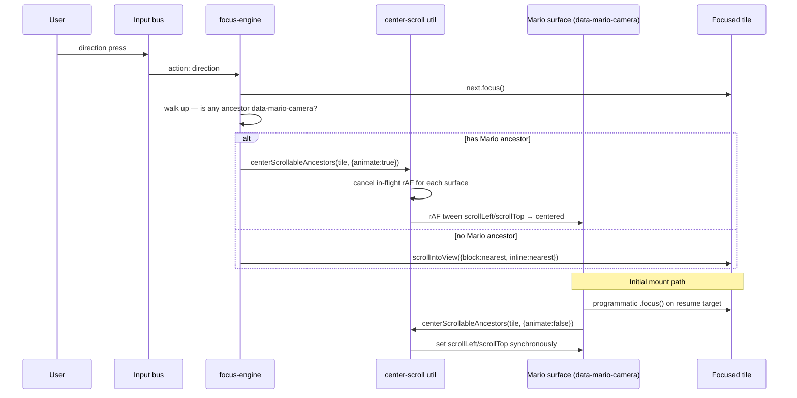

# feat: Mario-camera scrolling for overflowing tilegrids

## Overview

Replace the focus engine's edge-trigger `scrollIntoView({block:"nearest", inline:"nearest"})` with a centering scroll for tilegrids that overflow their scroll container. Focused tile lands at (and stays at) the scroll container's center on whichever axis is overflowing. Animation is snappy (~150ms ease-out, rAF-driven), cancellable, and skipped under `prefers-reduced-motion` and on initial focus.

The change is scoped to **opt-in surfaces**. `TilegridRailRoot` and `TilegridScrollRoot` declare themselves Mario-camera surfaces via a DOM attribute and add edge padding that lets the first and last tile each scroll until centered. Non-Mario scrollables in the app keep today's edge-trigger behavior.

## Problem Frame

`korri/shared/navigation/focus-engine.ts:79` calls `next.scrollIntoView({block:"nearest", inline:"nearest"})` after every directional focus move. `"nearest"` is an edge-trigger camera: nothing scrolls until the focused tile would clip the viewport, then the rail snaps just enough to bring the new focus flush with the leading edge. Sunlit-style tiles occupy roughly half the rail's visible width, so each "snap" shifts content by about half a rail.

A downstream consumer in `korri/shared/design-system/explorations/home-screens/HomeSunlit.stories.tsx` tracks the focused tile's x-position via `translateX(captionX)` to position the caption beneath it. Edge-trigger scrolling makes the focused tile's x-position vary across the rail, which means a long game title can have very little room before clipping the rail's right edge.

The desired behavior is the **Mario platformer camera**: the active tile stays centered, the world scrolls behind it, and consumers (like the caption) see a stable target x-position.

(see origin: `docs/brainstorms/2026-05-01-tilegrid-mario-camera-requirements.md`)

## Requirements Trace

- **R1**: Apply to `TilegridRailRoot` and `TilegridScrollRoot`. `TilegridPagedRoot` is out of scope.
- **R2**: Trigger on every focus move into a tile within an overflowing tilegrid (directional, mouse-hover, restored, initial).
- **R3**: Tilegrids whose content does not overflow do not scroll on focus moves.
- **R4–R6**: Center on whichever axis overflows; do not move on a non-overflowing axis.
- **R7–R8**: Items #1 and #N must reach the center; scroll content reserves leading/trailing space accordingly. Non-overflowing tilegrids may visually appear centered.
- **R9**: A tile larger than the container clamps to the nearest valid scroll position (no forced over-scroll).
- **R10–R11**: Snappy ~120–180ms ease-out animation, custom rAF tween (native smooth scroll is too slow), cancellable, no queueing.
- **R12**: `prefers-reduced-motion: reduce` → snap (no animation).
- **R13**: Initial focus on mount centers without animation.
- **R14**: Native scroll affordances (wheel, trackpad, touch drag, scrollbars) keep working.
- **R15**: Non-tilegrid scrollables in the app keep today's `nearest` behavior.

## Scope Boundaries

- **No look-ahead camera offset.** The focused tile centers; we do not nudge the camera in the direction of travel.
- **No deadzone / soft-zone centering.** Every focus move snaps the focused tile to center.
- **No frame-by-frame tracking of held input.** Each focus move is a discrete animated snap, not a continuous lerp.
- **No changes to `TilegridPagedRoot`.**
- **No changes to global `scrollIntoView` semantics for non-tilegrid surfaces.**
- **No touch-fling / momentum tweaks.** Native overflow scroll inertia is unchanged.
- **No new spatial-navigation API surface.** The data attribute is internal; consumers do not opt into Mario camera by composing new props.

## Context & Research

### Relevant Code and Patterns

- `korri/shared/navigation/focus-engine.ts` — owns the directional focus path and the current `scrollIntoView` call. The seam where Mario-camera scrolling integrates.
- `korri/shared/navigation/start.ts` — composition root for the focus engine. No changes expected, but verify the engine wiring still composes after adding new options.
- `korri/shared/navigation/focus-restore.ts` — already uses `requestAnimationFrame` to schedule restoration; pattern reference for rAF-scheduled DOM work.
- `korri/shared/design-system/components/Tilegrid/TilegridRailRoot.tsx` — outer scroll container is `overflowX:auto`, inner grid is `width: fit-content` with `gridAutoFlow: column`. Already publishes resolved cell-size pixels via `useResolvedCSSLength`.
- `korri/shared/design-system/components/Tilegrid/TilegridScrollRoot.tsx` — outer scroll container is `overflowY:auto`, inner grid uses `useContainerSize` to derive a column count. Already publishes resolved cell-size pixels and gap.
- `korri/shared/design-system/lib/useContainerSize.ts` — ResizeObserver helper used to measure scroll containers. Pattern for the new "natural content overflows?" measurement.
- `korri/shared/design-system/lib/useResolvedCSSLength.ts` — sentinel-based resolution of CSS lengths to pixels. Already wired in both Roots; we read `widthPx` / `heightPx` for centering math.
- `korri/shared/design-system/explorations/home-screens/HomeSunlit.stories.tsx` — first consumer; the existing `captionX` effect should become a constant after this lands. No code changes required, but it is the visual verification surface.

### Institutional Learnings

- `docs/solutions/best-practices/decoupled-spatial-navigation-2026-05-01.md` — components stay native HTML; navigation lives only in `korri/shared/navigation/*` and `korri/shared/input/*`. The new util belongs in `korri/shared/navigation/`. No component-level scroll APIs.
- `docs/solutions/best-practices/fluid-theme-tokens-and-container-queries-2026-05-01.md` — components respond to their container, not the viewport. Edge padding should use container query units (`cqi`, `cqb`) and `container-type` on the scroll container, not viewport units or hardcoded pixels.
- `docs/solutions/best-practices/css-length-props-with-sentinel-resolution-2026-05-01.md` — both Roots already follow the sentinel-resolution pattern for `cellSize`. Edge padding reuses the resolved pixel value rather than re-measuring.

### Slack Context

Slack tools detected. Ask me to search Slack for organizational context at any point, or include it in your next prompt.

## Key Technical Decisions

- **New utility lives in `korri/shared/navigation/` as a peer of `focus-engine.ts`.** Per the decoupled-spatial-nav learning, navigation code does not live in components. The util is a pure DOM helper — no React, no engine concept — so it is callable from any path that focuses elements.
- **Mario-camera surfaces opt in via a `data-mario-camera` DOM attribute.** Values: `"inline"` (rail), `"block"` (scroll), `"both"` (rare). The util walks up from the focused element and applies centering only to ancestors carrying this attribute. Non-tilegrid scrollables are untouched (R15). This avoids a runtime registry, keeps the engine context-free, and matches the project's "everything is on the live DOM" navigation posture.
- **Detection lives in the focus engine; behavior lives in the util.** The engine's `case "direction"` branch decides Mario-vs-`nearest` per focus move. The util owns the math, the rAF tween, the cancellation registry, and the reduced-motion check. This keeps the engine small and testable.
- **Pointer hover deliberately does NOT trigger Mario centering.** `korri/shared/input/pointer-adapter.ts` calls `focusable.focus({ preventScroll: true })` directly, bypassing the focus engine. That bypass is intentional and is the correct interaction with Mario: if hover-focus also centered the rail, the rail content would slide under a stationary cursor, immediately re-firing hover-focus on whatever tile was now under the cursor — a feedback loop. Mario centering only fires on engine-driven (direction) focus moves. Wheel-as-direction (`source: "wheel"`) does flow through the engine and *does* trigger centering, which is desired: each wheel-tick advances by one tile and centers it.
- **The engine's `.focus()` call passes `{ preventScroll: true }`.** Today the engine calls `next.focus()` then `next.scrollIntoView(...)` — relying on `scrollIntoView` to do the visible scroll. With the Mario branch, the rAF tween is the visible scroll; we don't want any default browser focus-scroll behavior racing with or layering over the tween. Passing `preventScroll: true` makes the engine the sole owner of post-focus scroll behavior on Mario surfaces, and is harmless for non-Mario surfaces (they continue to receive an explicit `scrollIntoView` call right after).
- **`data-mario-camera` and `data-pointer-wheel` coexist on the same element.** Both attributes will end up on the outer scroll container of a Tilegrid Root once wheel-as-direction is opted in (per `docs/plans/2026-05-01-001-feat-pointer-aware-spatial-navigation-plan.md` Unit 7). They are independent: one is read by `wheel-adapter.ts` to translate wheel into direction; the other is read by `center-scroll.ts` to decide where to center. Do not consolidate them.
- **Initial-focus centering is handled by the Roots, not the engine.** The engine's centering only fires on direction actions (animated). Roots that auto-focus a tile on mount (e.g. for resume targets) call the util directly with `{ animate: false }`, which keeps responsibility local and avoids flag-passing through the engine. This is consistent with the focus-restore pattern, which schedules its own rAF work.
- **Edge padding is measured, not always-on.** Always-on padding would cause every multi-tile rail (even ones whose tiles fit) to become scrollable, violating R3. Roots compare natural inner-grid size to scroll-container size via ResizeObserver and toggle the padding only when the natural content overflows.
- **Padding amount is computed in CSS using container query units.** When the toggle is on, the inner grid's leading/trailing padding becomes `max(0px, calc(50cqi - var(--mario-cell-size) / 2))` (rail) or the `cqb` analogue (scroll). This lets the padding react to container resize without a JS recalculation per frame, consistent with `fluid-theme-tokens-and-container-queries`. The cell-size custom property is the resolved pixel value already computed by the existing sentinel.
- **Animation is rAF-driven inside the util, not native `scroll-behavior: smooth`.** Native smooth scroll is ~300–400ms in Chromium with no duration knob (R10 says "snappy"). The util tweens `scrollLeft`/`scrollTop` directly with a ~150ms ease-out and stores the active rAF handle per scroll container so a new call mid-flight cancels the previous one (R11).
- **Multi-ancestor scroll handling: walk up and animate every Mario ancestor.** When a focused tile sits inside two nested Mario surfaces (e.g. a vertical Mario grid containing horizontal Mario rails — Apple-TV-shape), the util animates each ancestor along its overflowing axis in the same rAF tick. Non-Mario ancestors above the outermost Mario surface are not touched; if page-level scroll matters, consumers can still call native `scrollIntoView` themselves.
- **Reduced motion is a hard branch inside the util.** When `matchMedia("(prefers-reduced-motion: reduce)").matches`, the util sets the target `scrollLeft`/`scrollTop` synchronously and skips rAF entirely. No "slow animation" middle ground.

## Open Questions

### Resolved During Planning

- **Where the centering util lives.** `korri/shared/navigation/center-scroll.ts`, peer of `focus-engine.ts`.
- **How the engine identifies Mario surfaces.** `data-mario-camera` attribute on the scroll container, walked from the focused element. No registry, no React context.
- **How initial-focus centering is triggered.** Roots call the util directly with `{ animate: false }` after their internal `.focus()` call.
- **Edge-padding mechanism.** ResizeObserver toggles a CSS class or data attribute; padding is computed in CSS via container query units against the resolved cell-size custom property.
- **Multi-ancestor policy.** Walk up; animate every Mario-camera ancestor in one rAF pass.
- **Animation duration / curve.** ~150ms ease-out (cubic). One number, fixed; not a configurable prop. Can be tuned post-merge if it feels off.
- **Pointer hover and Mario centering.** Hover does not center; only direction-driven focus moves do. See the rationale in Key Technical Decisions. The one-time visual shift on the first direction action after pointer hover is a correct mode-transition consequence, not a bug.
- **Wheel-as-direction and Mario centering.** Wheel events inside an opted-in container emit `{type:"direction", source:"wheel"}`, which goes through the focus engine's direction branch and triggers Mario centering with animation. This is the desired behavior — each wheel tick advances and centers one tile.

### Deferred to Implementation

- **Exact ease-out function.** Whether a quadratic, cubic, or quart ease-out feels best is a polish-time decision; pick one that's snappy and uniform, change later if needed.
- **How nested Mario surfaces feel in practice.** Apple-TV-shape (vertical rail of horizontal rails) is plausible but not currently shipped. Verify the multi-ancestor animation looks right when such a composition exists; until then, the policy is "animate all, in parallel, same tick."
- **Whether Sunlit's existing `captionX` effect can be simplified.** The effect should now read a constant value (focused tile center == container center). Cleanup is verification-time and may become a follow-up commit, not part of this plan.
- **Non-tilegrid scrollable surfaces in the future.** If another widget wants Mario-camera behavior, it gets the data attribute and the centering util applies — no engine change. This is a feature of the design, not a deferred question.

## High-Level Technical Design

> *This illustrates the intended approach and is directional guidance for review, not implementation specification. The implementing agent should treat it as context, not code to reproduce.*



```text
Centering math, per overflowing axis, per Mario ancestor:

    delta_axis_to_center = (tile_center_in_axis - surface_center_in_axis)
    target_scroll        = clamp(surface_scroll + delta_axis_to_center, 0, max_scroll)

    where:
      tile_center_in_axis    = tile.getBoundingClientRect() midpoint along axis
      surface_center_in_axis = surface.getBoundingClientRect() midpoint along axis
      surface_scroll         = surface.scrollLeft or surface.scrollTop
      max_scroll             = scrollSize - clientSize on the axis
```

The "axis" is determined per ancestor: `data-mario-camera="inline"` centers on the inline axis; `"block"` on the block axis; `"both"` on both. Non-Mario ancestors above the outermost Mario ancestor are not touched.

## Implementation Units

- [ ] **Unit 1: `centerScrollableAncestors` utility**

**Goal:** A pure DOM helper that, given a target element, animates every Mario-camera scrollable ancestor so the target's center aligns with the ancestor's center on the ancestor's declared axis. Honors `prefers-reduced-motion`, supports `{ animate: boolean }`, and cancels in-flight animations cleanly.

**Requirements:** R4, R5, R6, R7, R9, R10, R11, R12, R13.

**Dependencies:** None.

**Files:**
- Create: `korri/shared/navigation/center-scroll.ts`
- Test: `korri/shared/navigation/center-scroll.test.ts`

**Approach:**
- Export `centerScrollableAncestors(target: HTMLElement, opts?: { animate?: boolean }): void`.
- Walk up from `target` collecting ancestors that carry `data-mario-camera`. Stop at `document.documentElement`.
- For each Mario ancestor, read its `data-mario-camera` value (`inline` | `block` | `both`) and the corresponding overflowing axis. Skip the axis if the ancestor isn't actually overflowing on it (`scrollSize <= clientSize`); this satisfies R3 as a defense-in-depth even if a Root's measurement disagrees.
- Compute `targetScrollLeft` / `targetScrollTop` using the formula in the technical design block. Clamp to `[0, scrollSize - clientSize]` (R9).
- Maintain a module-private `WeakMap<Element, number>` of in-flight rAF handles. On each call, cancel any handle for the surfaces being touched (R11).
- When `animate === false`, or when `matchMedia("(prefers-reduced-motion: reduce)").matches`, set `scrollLeft` / `scrollTop` synchronously (R12, R13).
- When animating, drive a rAF tween with a fixed duration constant (~150ms) and a single ease-out curve. Update all targeted surfaces from one rAF tick.
- Export the duration constant and the ease function (or a single ease-out helper) so tests can introspect.

**Patterns to follow:**
- `korri/shared/navigation/focus-restore.ts` — module-level helpers, schedule abstraction, opt-in `schedule` option for testability. The new util can take an optional `schedule?: (cb: FrameRequestCallback) => number` injection for the same reason.
- `korri/shared/design-system/lib/useContainerSize.ts` — ResizeObserver style isn't used here, but the file is a reference for the project's preferred shape of small DOM helpers.

**Test scenarios:**
- *Happy path:* Given a target inside a `data-mario-camera="inline"` ancestor whose `scrollWidth > clientWidth`, calling the util with `{ animate: false }` sets `scrollLeft` to the centered value (verify within 1px tolerance for rounding).
- *Happy path:* Same setup with `{ animate: true }` and an injected fake `schedule` — advance frames manually and verify the final `scrollLeft` matches the centered value.
- *Edge case:* Target is the first tile and centering would require `scrollLeft < 0` — the util clamps to `0`.
- *Edge case:* Target is the last tile and centering would require `scrollLeft > maxScrollLeft` — the util clamps to `maxScrollLeft`.
- *Edge case:* Target's own width exceeds the container width (R9) — the util still clamps and does not throw.
- *Edge case:* `data-mario-camera="block"` ancestor with vertical overflow — `scrollTop` is updated, `scrollLeft` is not.
- *Edge case:* `data-mario-camera="both"` ancestor — both axes update in one call.
- *Edge case:* Target inside two nested Mario ancestors — both ancestors' scroll positions update toward centered.
- *Edge case:* Target inside an ancestor that declares `data-mario-camera="inline"` but is not actually overflowing — the util does not change scrollLeft (R3 defense-in-depth).
- *Edge case:* No Mario ancestors above target — the util is a no-op (no exception, no scroll change).
- *Edge case:* `matchMedia("(prefers-reduced-motion: reduce)").matches === true` — even with `{ animate: true }`, scroll is set synchronously and no rAF is scheduled (R12).
- *Edge case:* Two calls in rapid succession on the same surface — the first rAF handle is cancelled and the second tween runs from the current scroll position (R11).
- *Integration:* In a JSDOM/HappyDOM environment, `scrollLeft` setter assignments are observable; verify the util writes the expected sequence of intermediate values during animation when frames are stepped manually.

**Verification:**
- Unit tests cover all enumerated scenarios.
- The util has no React imports and no project-internal couplings beyond DOM types.

---

- [ ] **Unit 2: Wire the focus engine to Mario-camera surfaces**

**Goal:** Branch the engine's directional path on whether the next focus target sits inside a `data-mario-camera` ancestor. For Mario surfaces, delegate to the util with `{ animate: true }`. For non-Mario surfaces, keep today's `scrollIntoView({block:"nearest", inline:"nearest"})` behavior. Non-direction actions (confirm, back, options, menu) are untouched.

**Requirements:** R2 (directional path), R10, R11, R15.

**Dependencies:** Unit 1.

**Files:**
- Modify: `korri/shared/navigation/focus-engine.ts`
- Modify: `korri/shared/navigation/focus-engine.test.ts`

**Approach:**
- Change `next.focus()` to `next.focus({ preventScroll: true })` so the browser's default focus-scroll cannot race with the rAF tween (Mario surfaces) or layer over the explicit `scrollIntoView` (non-Mario surfaces). This is safe for both branches; the engine has always been the sole owner of post-focus scroll behavior.
- After focusing, walk up from `next` checking for `data-mario-camera`. If found anywhere, call `centerScrollableAncestors(next, { animate: true })`. Otherwise, keep the existing `scrollIntoView({block:"nearest", inline:"nearest"})` call.
- Keep the engine's option surface unchanged; this is an internal refactor visible only via the `data-mario-camera` attribute. No new options.
- The walk-up check should short-circuit on the first match (the util walks the rest).
- Do not add any focusin / pointermove listener in the engine. Pointer-hover focus must continue to bypass the engine entirely — see Key Technical Decisions for the feedback-loop rationale.

**Patterns to follow:**
- Existing `case "direction"` block in `korri/shared/navigation/focus-engine.ts`. Keep the same structure (resolve scope, pick next, focus, scroll); only the scroll line forks.

**Test scenarios:**
- *Happy path:* Direction action where `next` is inside a stubbed `data-mario-camera` ancestor — verify the util is called with the focused element and `{ animate: true }`. Mock the util via a small injection seam, or check observable scrollLeft change in the integration test below.
- *Happy path:* Direction action where `next` has no Mario ancestor — verify `next.scrollIntoView` is called once with `{ block: "nearest", inline: "nearest" }` (the existing test pattern).
- *Edge case:* `next` is inside a Mario ancestor and `prefers-reduced-motion: reduce` — the util still gets called, and the engine does not also call `scrollIntoView` (no double-scroll).
- *Edge case:* `next` is null (no focus target) — no scroll is performed, mirroring today's behavior.
- *Edge case:* Direction handler calls `next.focus({ preventScroll: true })` — verify the option is passed (spy/mock the focus method). This prevents the browser's default focus-scroll from racing with the rAF tween.
- *Integration:* End-to-end through `focus-engine.ts` calling the real util — set up a `data-mario-camera="inline"` ancestor with overflow, fire a direction action, advance fake frames, assert `scrollLeft` lands at the centered value. This proves the engine→util seam works without mocks.
- *Integration:* A `direction` action with `source: "wheel"` fires the same Mario branch as a `source: "keyboard"` direction — verifies that wheel-as-direction (live in `korri/shared/input/wheel-adapter.ts`) correctly produces centered tiles per wheel tick.
- *Integration:* Pointer hover bypasses the engine — directly calling `tile.focus({ preventScroll: true })` on a Mario surface (simulating the live pointer adapter at `korri/shared/input/pointer-adapter.ts`) does NOT change `scrollLeft`. Proves Mario centering is engine-gated and hover does not slide content under a stationary cursor.

**Verification:**
- All existing focus-engine tests continue to pass.
- The new branch is exercised by the new tests.
- No new options on `FocusEngineOptions`; the change is invisible to `start.ts`.

---

- [ ] **Unit 3: `TilegridRailRoot` opts into Mario camera (inline axis)**

**Goal:** The horizontal rail declares itself a Mario surface, exposes the resolved cell width as a CSS custom property, sets `container-type: inline-size` on its scroll container, and conditionally adds inline edge padding on the inner grid when natural content overflows. On initial focus into the rail, snap to centered with no animation.

**Requirements:** R1, R3, R7, R8, R13, R14.

**Dependencies:** Unit 1.

**Files:**
- Modify: `korri/shared/design-system/components/Tilegrid/TilegridRailRoot.tsx`
- Modify: `korri/shared/design-system/components/Tilegrid/TilegridRailRoot.test.tsx`

**Approach:**
- On the outer scroll container, set `data-mario-camera="inline"`, `containerType: "inline-size"`, and a CSS custom property `--mario-cell-size` whose value is the resolved cell width (`widthCss`).
- On the inner grid, add a conditional `padding-inline: max(0px, calc(50cqi - var(--mario-cell-size) / 2))`. The conditional is a `data-mario-overflows="true"` attribute on the inner grid (or an explicit padding-inline value of `0` when not overflowing). Use a ResizeObserver — pattern adapted from `useContainerSize` — that compares the inner grid's natural scrollWidth (without the padding) against the outer container's clientWidth and toggles the attribute. Padding is the only style affected, so toggling does not cause layout thrash.
- Add a `useEffect` that, on mount and on subsequent changes to `data-mario-overflows`, calls `centerScrollableAncestors(currentlyFocusedTileWithinRail, { animate: false })` to honor R13. Use `document.activeElement` and verify it is inside the rail before calling.
- Preserve every existing rail behavior: `getKey`, `getSpan`, sentinel-based length resolution, `asChild` slot mode, `gridAutoFlow: column`. The Mario opt-in is additive.

**Patterns to follow:**
- `korri/shared/design-system/lib/useContainerSize.ts` — ResizeObserver wiring shape.
- `korri/shared/design-system/lib/useResolvedCSSLength.ts` — already publishes `widthPx` and `widthCss`; reuse `widthCss` for `--mario-cell-size`.
- `docs/solutions/best-practices/fluid-theme-tokens-and-container-queries-2026-05-01.md` — container-type + cqi pattern.

**Test scenarios:**
- *Happy path:* Renders with `data-mario-camera="inline"` on the outer scroll container.
- *Happy path:* The outer container has `container-type: inline-size`.
- *Happy path:* `--mario-cell-size` CSS custom property is set on the outer container with the resolved cell width.
- *Happy path:* Numeric `cellSize` of `120` produces `--mario-cell-size: 120px`; string `cellSize` produces the same string the sentinel resolves.
- *Edge case:* When natural content fits in the container (e.g. 2 tiles in a 1000px wide stub), the inner grid does NOT carry the overflow attribute and the inline padding resolves to `0`. Focusing tile #2 does not change `scrollLeft`. (R3.)
- *Edge case:* When natural content overflows (many tiles), the inner grid carries the overflow attribute and computed `padding-inline-start` is non-zero. (R8.)
- *Edge case:* `getSpan` returns a value that makes one tile wider than the container — that tile still renders, the rail still sets the attributes, and centering for that tile clamps (verified end-to-end in Unit 1's clamp scenario).
- *Integration:* With a mounted rail, an initial focus on a tile, and a stubbed `requestAnimationFrame`, scroll position lands at centered synchronously (R13: no animated swing).
- *Integration:* After mount, simulate a direction action via the engine — scroll position transitions from current to centered through animated frames (proves the Unit 2 + Unit 3 seam).

**Verification:**
- All existing `TilegridRailRoot` tests continue to pass.
- New tests cover the opt-in attributes and the conditional padding toggle.
- A quick visual pass on `HomeSunlit` storybook confirms the focused tile lands centered for tiles 1, middle, and N, and the caption x-position becomes effectively constant (no code change required to verify).

---

- [ ] **Unit 4: `TilegridScrollRoot` opts into Mario camera (block axis)**

**Goal:** The vertical scroll grid declares itself a Mario surface, exposes the resolved cell height as a CSS custom property, sets `container-type: size` (or `block-size`) on its scroll container, and conditionally adds block edge padding when the grid's natural height exceeds the container. Initial-focus snap mirrors Unit 3.

**Requirements:** R1, R3, R5, R7, R8, R13, R14.

**Dependencies:** Unit 1.

**Files:**
- Modify: `korri/shared/design-system/components/Tilegrid/TilegridScrollRoot.tsx`
- Modify: `korri/shared/design-system/components/Tilegrid/TilegridScrollRoot.test.tsx`

**Approach:**
- Set `data-mario-camera="block"` on the outer scroll container, plus `container-type: size` so both `cqi` and `cqb` resolve against the container (cqb is needed for block-axis padding; cqi may be useful in future column-counting work).
- Expose `--mario-cell-size` (cell height — for ScrollRoot, cell width and height are the same value) on the outer container.
- On the inner grid, add `padding-block: max(0px, calc(50cqb - var(--mario-cell-size) / 2))` gated by a `data-mario-overflows="true"` attribute toggled via ResizeObserver comparing inner-grid `scrollHeight` against outer `clientHeight`.
- Same initial-focus `useEffect` pattern as Unit 3.
- Preserve column derivation, `getSpan`, `dense` packing, sentinel resolution, and `asChild` slotting.

**Patterns to follow:**
- Same as Unit 3, applied to the block axis. Mirror the patch shape so future readers see a symmetric implementation across the two Roots.

**Test scenarios:**
- *Happy path:* Renders with `data-mario-camera="block"` on the outer scroll container.
- *Happy path:* `container-type: size` (or `block-size`) is set on the outer container.
- *Happy path:* `--mario-cell-size` is set on the outer container with the resolved cell size.
- *Edge case:* When the grid's natural height fits the container, the block padding resolves to `0` and focusing a tile in row 2 does not change `scrollTop` (R3).
- *Edge case:* When the grid's natural height overflows, padding is non-zero and the focused row centers (R8).
- *Edge case:* A grid that is wider than the column count allows still derives `columns >= 1` and renders; mario padding does not interfere with `gridTemplateColumns: repeat(columns, ...)`.
- *Edge case:* `overflow-x: hidden` on the scroll container is preserved — Mario only opts in on the block axis, the inline axis stays clipped.
- *Integration:* Mount a tall grid, set initial focus to a row deep in the grid, advance no frames — `scrollTop` lands centered synchronously (R13).

**Verification:**
- All existing `TilegridScrollRoot` tests continue to pass.
- New tests cover the opt-in attributes and the conditional block padding toggle.

---

- [ ] **Unit 5: Focus-restore integration with Mario surfaces**

**Goal:** When `focus-restore` returns focus to a previously captured target that lives inside a Mario surface, the surface also returns to its centered position for that target. Snap, no animation — restore is a teleport, not a camera move.

**Requirements:** R2 ("focus move into a tile within an overflowing tilegrid" includes restored focus), R13 (snap, no animation, applies to any non-direction-driven focus into a Mario surface).

**Dependencies:** Unit 1.

**Files:**
- Modify: `korri/shared/navigation/focus-restore.ts`
- Modify: `korri/shared/navigation/focus-restore.test.ts`

**Approach:**
- Inside `focus-restore`'s `restore(scopeKey)` scheduled callback, after resolving `target` via `findByIdentity`, change the focus call from `target?.focus()` to `target?.focus({ preventScroll: true })` and immediately follow with `if (target) centerScrollableAncestors(target, { animate: false })`.
- The centering util is a no-op when `target` has no `data-mario-camera` ancestor, so the change is safe for the common case (most restored targets are not inside Mario surfaces). No conditional check is needed in `focus-restore`.
- `preventScroll: true` is added for the same reason as in the engine (Unit 2): the browser's default focus-scroll must not race the snap-center.
- No change to the public `FocusRestore` interface. No new options. No new exports.

**Patterns to follow:**
- The same `.focus({preventScroll:true})` + `centerScrollableAncestors(..., {animate:false})` pattern used in Tilegrid Roots' initial-focus `useEffect` (Units 3 and 4). Restore is just another path that lands focus on a tile inside a Mario surface; it should look identical.

**Test scenarios:**
- *Happy path:* A target captured inside a `data-mario-camera="inline"` ancestor is restored — after the scheduled callback runs, `target` has focus and the ancestor's `scrollLeft` is at the centered value (within 1px tolerance). Verify by stubbing `scrollIntoView` is unnecessary (the util does direct scroll math).
- *Happy path:* Restore on a target outside any Mario surface still works exactly as today — `target.focus()` fires, scroll positions of any ancestors are unchanged. (Regression guard for the common case.)
- *Edge case:* `target.focus({ preventScroll: true })` is called with the option object, not a bare `target.focus()`. Verify by spying on the focus method and asserting the argument shape. Prevents browser default focus-scroll from interfering with the snap.
- *Edge case:* `findByIdentity` returns `null` (the captured element is no longer in the DOM after remount) — neither focus nor centering is called, no exception is thrown.
- *Edge case:* `prefers-reduced-motion: reduce` is irrelevant here because `{animate:false}` is unconditionally passed; verify that the scroll position is set synchronously inside the scheduled callback, not on a future rAF.
- *Integration:* End-to-end — capture focus on tile #5 of an overflowing rail, blow away and re-render the rail, call restore. After the rAF schedule fires, tile #5 is focused and the rail's `scrollLeft` is centered on tile #5. No visible mid-flight scrolling.

**Verification:**
- All existing `focus-restore` tests pass unchanged. The non-Mario regression-guard scenario above is the explicit proof.
- New scenarios cover the Mario-surface restore path.
- The matrix row in System-Wide Impact for "Focus restore" reads "Yes (snap, no animation)" and reflects this implementation.

---

- [ ] **Unit 6: Documentation update — Mario camera in the spatial-nav best-practice**

**Goal:** Capture the Mario-camera contract (the `data-mario-camera` attribute, the centering util, the initial-snap rule, the focus-restore integration) inside the existing decoupled-spatial-navigation best-practice so future readers find the convention without spelunking through the implementation.

**Requirements:** None directly, but supports R15 (the rule that non-tilegrid surfaces are unaffected) by making the opt-in mechanism discoverable.

**Dependencies:** Units 1–5.

**Files:**
- Modify: `docs/solutions/best-practices/decoupled-spatial-navigation-2026-05-01.md`

**Approach:**
- Add a short subsection covering: (1) the `data-mario-camera` attribute shape and values, (2) when to opt in (overflowing scrollables that should keep an active item centered), (3) the initial-focus snap rule and why it lives in the surface rather than the engine, (4) the multi-ancestor walk-up policy, (5) the focus-source matrix — which paths trigger centering and which deliberately do not (hover, ad-hoc programmatic `.focus()`).
- Cross-link to the new util file path and to `focus-restore.ts`. Do not include implementation code; reference paths and patterns only.
- Update `last_updated` frontmatter.

**Test scenarios:**
- Test expectation: none — pure documentation, no behavioral change.

**Verification:**
- The best-practice doc reads as a complete reference for someone building a new scrollable surface that wants Mario camera behavior, without requiring them to read source.

## System-Wide Impact

- **Interaction graph:** The focus engine grows one new branch in `case "direction"`. The Tilegrid Roots grow one ResizeObserver each and one initial-focus `useEffect`. No other entry points are affected.

### Coexistence with the live pointer + wheel adapters

The pointer-aware spatial navigation work (`docs/plans/2026-05-01-001-feat-pointer-aware-spatial-navigation-plan.md`) is **already shipped through Unit 6** — `korri/shared/input/pointer-adapter.ts`, `korri/shared/input/wheel-adapter.ts`, `korri/shared/navigation/input-mode.ts`, and the unified focus rule are all live. Only Unit 7 (opting tilegrids into `data-pointer-wheel`) is outstanding. Mario camera must integrate with this live behavior cleanly, with no regressions. The matrix below pins each interaction:

| Source of focus change | Path through code | Triggers Mario centering? | Notes |
|---|---|---|---|
| Keyboard arrow / gamepad d-pad | `*-adapter` → bus → `focus-engine.case "direction"` → `next.focus({preventScroll:true})` + `centerScrollableAncestors(next, {animate:true})` | **Yes (animated)** | The standard path. Cursor is hidden by `[data-input-mode="directional"]` so cursor-content mismatch is impossible. |
| Wheel inside `data-pointer-wheel` container | `wheel-adapter` → bus → `focus-engine.case "direction"` (action has `source:"wheel"`) → same as above | **Yes (animated)** | Cursor stays in pointer mode and stays where it was; rail slides under stationary cursor. Per pointer brainstorm R8, content-under-cursor motion does not re-fire hover-focus, so no feedback loop. Each wheel tick advances and centers one tile — desired. |
| Mouse hover (`pointermove`) | `pointer-adapter` → `focusable.focus({preventScroll:true})` directly. **Bus is notified for input-mode flip only; engine direction branch does NOT run.** | **No** | Deliberate. If hover triggered centering, the rail would slide under a stationary cursor and the now-under-cursor tile would re-hover-focus, looping. The cursor follows where the user pointed, not the other way around. |
| Right-click (`contextmenu` on focusable) | `pointer-adapter` → emits `{type:"options", source:"pointer"}`. No focus change. | **No** | Options is not a focus move. |
| Initial mount focus inside a Mario surface | Tilegrid Root calls `tile.focus()` then `centerScrollableAncestors(tile, {animate:false})` | **Yes (snap, no animation)** | Per R13. Independent of input mode. |
| Focus restore (`focus-restore.ts`) | `focus-restore.restore()` → `target.focus({preventScroll:true})` + `centerScrollableAncestors(target, {animate:false})` | **Yes (snap, no animation)** | Per Unit 5. Restore returns the user to where they were; the rail must also return to its centered position so the user does not see a one-frame jump on the next direction press. Snap (no animation) because restore is a teleport, not a camera move. |
| Programmatic `.focus()` from product code | Direct DOM call | **No** | Product code that wants centering imports and calls the util explicitly. The util is the public mechanism; ad-hoc `.focus()` calls do not opt in. |

**Mode-transition shift** (documented behavior, not a bug). When the user has been pointer-hovering through a rail (no centering, tiles wherever the cursor pointed) and then presses an arrow key or wheels, the next focused tile centers. The visible result is a one-time animated shift on the first direction action. This is the correct boundary between pointer mode (cursor-driven, no camera) and directional mode (centered camera) and matches how Switch and similar UIs behave when you pick up the controller after using a touch screen.

**Attribute coexistence.** `data-mario-camera`, `data-pointer-wheel`, and `container-type` will all end up on the outer scroll container of a Tilegrid Root once wheel-on-tilegrid lands. They are read by three different modules and do not conflict. Do not consolidate them into a single attribute.

**Touch input.** The pointer adapter ignores `pointerType === "touch"` and `"pen"`. Mario camera is unaffected by touch — touch-driven focus does not exist today, and when a future touch adapter lands it will emit `direction` actions through the same engine path that keyboard and wheel use, which means it will trigger Mario centering for free.
- **Error propagation:** The util is defensive — missing ancestor, non-overflowing axis, target-larger-than-container all degrade to no-op or clamp. No exceptions escape into the engine.
- **State lifecycle risks:** The rAF cancellation registry uses a module-private `WeakMap`. Surfaces that unmount while an animation is in flight are garbage-collected without leak. If a surface re-mounts, a new entry is created on first call. There is no global animation queue.
- **API surface parity:** Both `TilegridRailRoot` and `TilegridScrollRoot` get the same opt-in shape (`data-mario-camera`, `container-type`, `--mario-cell-size`, conditional padding, initial-focus snap). Symmetry across the two Roots is intentional so future readers can copy one to write the other. `TilegridPagedRoot` is explicitly excluded.
- **Integration coverage:** Cross-layer scenarios proven by integration tests in Units 2 and 3: engine direction → util → scroll surface → final scroll position. Unit tests alone (with mocked util) would not prove the seam.
- **Unchanged invariants:**
  - The focus engine's public option surface is unchanged. `start.ts` does not need to know about Mario surfaces.
  - The Tilegrid context contract (`TilegridBaseContext`) is unchanged. Mario opt-in is a DOM concern, not a context concern.
  - Non-tilegrid scrollable surfaces in the app continue to receive `scrollIntoView({block:"nearest", inline:"nearest"})` exactly as today.
  - `TilegridPagedRoot` and its tests are not touched.
  - Native scroll affordances (wheel, trackpad, touch drag, scrollbars) on Tilegrid scroll containers continue to work; Mario camera only intercepts focus moves, not user-driven scroll.

## Risks & Dependencies

| Risk | Mitigation |
|------|------------|
| Held-direction input produces stuttering animations because each new direction action cancels the in-flight tween mid-frame. | rAF cancellation restarts from current `scrollLeft`/`scrollTop` (not from origin), so the camera continues smoothly. Tested in Unit 1 "two calls in rapid succession". |
| Edge-padding measurement (ResizeObserver comparing natural width vs. container) fights the padding it conditionally adds — turning padding on grows scrollWidth, observer fires again. | Measurement compares natural grid size (cells + gaps, no padding) against container clientWidth — both values that don't change when the padding flag toggles. Compute the natural size from item count + cell-size + gap (already known from context), not from `scrollWidth`. |
| Pointer hover triggers Mario centering, sliding content under a stationary cursor and re-firing hover-focus on the now-under-cursor tile (feedback loop). | Mario centering is gated on the engine's direction branch. Pointer adapter calls `.focus({preventScroll:true})` directly, deliberately bypassing the engine. Two integration tests in Unit 1 explicitly assert that programmatic `.focus()` on a Mario surface does NOT change `scrollLeft`. Documented in Key Technical Decisions and System-Wide Impact. |
| Wheel-as-direction triggers Mario centering, but the cursor remains in pointer mode and stays where it was — user sees an apparent cursor-content mismatch on the first wheel after hovering. | Correct mode-transition behavior, not a bug. The wheel-emitted direction goes through the engine like any direction action; centering is the desired outcome. Pointer adapter's R8 ("content motion under stationary cursor does not re-fire hover-focus") prevents loops. Documented in System-Wide Impact > Mode-transition shift. |
| Browser default focus-scroll on `next.focus()` races the rAF tween or interferes with the explicit `scrollIntoView` for non-Mario surfaces. | Engine passes `{preventScroll:true}` on every direction-driven `.focus()` call (Unit 2). Engine becomes the sole owner of post-focus scroll. Tested by spying on `.focus()` calls in Unit 2. |
| `data-mario-camera` and `data-pointer-wheel` are conflated by an implementer who sees both attributes on the same element. | Both attributes are documented in System-Wide Impact > Attribute coexistence as deliberately independent. The wheel adapter and the centering util read different attributes; no shared state, no shared code path. |
| Container query units fail in older browser contexts (Electrobun WebView versions, embedded TV browsers). | Korri targets recent Chromium (Electrobun) and modern browsers. Container queries shipped in Chromium 105+. If a target is older, the `data-mario-overflows` flag still toggles correctly; padding just resolves to `0px` because the cqi expression returns no value. The fallback is "no centering, keeps today's behavior" — graceful, not broken. |
| `prefers-reduced-motion` query result is cached at module load, missing runtime changes. | Read `matchMedia(...).matches` at call time inside the util, not at module load. Each centering call re-evaluates. |
| Initial-focus snap fires before the tile's bounding rect is settled (e.g. fonts not yet loaded, async layout). | Roots schedule the snap inside `useEffect` (post-paint) and use the already-settled `getBoundingClientRect` at the time of the call. If a later layout shift moves the tile, the next focus event re-centers. We accept a one-frame visual seam at extreme cold-start; this is the same constraint the existing focus-restore handles. |
| Sunlit's `captionX` effect is now redundant (always returns the same value). | Verified post-merge. If true, remove the effect in a follow-up commit. Out of scope for this plan. |

## Documentation / Operational Notes

- Update `docs/solutions/best-practices/decoupled-spatial-navigation-2026-05-01.md` (Unit 6).
- No runbook changes, no rollout flags — this is a pure UX behavior change behind an internal opt-in attribute.
- Storybook story `HomeSunlit` is the visual smoke test. Run `just dev-storybook` and tab through the rail to confirm the focused tile stays centered and the caption position is stable.

## Sources & References

- **Origin document:** `docs/brainstorms/2026-05-01-tilegrid-mario-camera-requirements.md`
- Related code: `korri/shared/navigation/focus-engine.ts`, `korri/shared/navigation/focus-restore.ts`, `korri/shared/navigation/start.ts`
- Related code: `korri/shared/design-system/components/Tilegrid/TilegridRailRoot.tsx`, `korri/shared/design-system/components/Tilegrid/TilegridScrollRoot.tsx`
- Related code: `korri/shared/design-system/lib/useContainerSize.ts`, `korri/shared/design-system/lib/useResolvedCSSLength.ts`
- Related plan (concurrent work on the same engine): `docs/plans/2026-05-01-001-feat-pointer-aware-spatial-navigation-plan.md`
- Institutional learnings: `docs/solutions/best-practices/decoupled-spatial-navigation-2026-05-01.md`, `docs/solutions/best-practices/fluid-theme-tokens-and-container-queries-2026-05-01.md`, `docs/solutions/best-practices/css-length-props-with-sentinel-resolution-2026-05-01.md`
