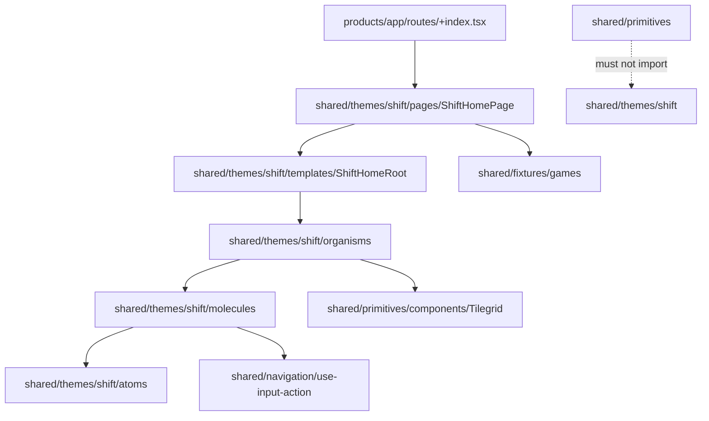
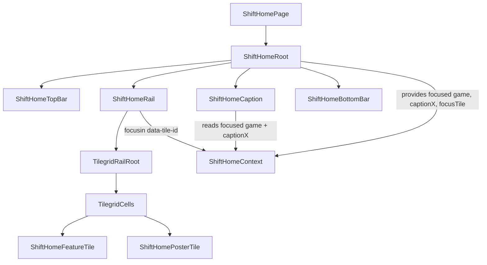

# feat: Establish Shift as an atomic theme and product home

## Overview

Graduate the settled Sunlit home exploration into the real **Shift** theme and product home page. The work has three connected outcomes:

1. Rename the theme-agnostic shared UI layer from `korri/shared/design-system/` to `korri/shared/primitives/`.
2. Create `korri/shared/themes/shift/` with Shift's full atomic structure: atoms, molecules, organisms, templates, and pages.
3. Replace the placeholder `korri/products/app/routes/+index.tsx` Tilegrid demo with the Shift home page, backed by a product feature brief and BDD coverage.

The plan preserves the lesson from commit `85ce4f5 chore(themes): drop the shift theme`: generic infra and fixtures must not drift back into the theme. `primitives/` owns theme-agnostic building blocks. `shared/fixtures/` owns game data. `themes/shift/` owns only Shift's identity-bearing UI and tokens.

## Problem Frame

The current Shift visual identity is trapped in `korri/shared/design-system/explorations/home-screens/HomeSunlit.stories.tsx`: an 872-line Storybook exploration containing tokens, layout, state, rail behavior, caption behavior, HUD chrome, and story metadata in one file. The exploration served its purpose: the visual voice is settled. Now the product needs a maintainable atomic hierarchy that lets contributors iterate on one layer at a time without re-reading a monolith.

The current route at `korri/products/app/routes/+index.tsx` is a placeholder grid demo and does not express the Safe Game Resume promise. The Shift home should become the actual app entry surface while keeping Hero and Mosaic parked as historical explorations.

(See origin: `docs/brainstorms/2026-05-01-shift-theme-atomic-decomposition-requirements.md`.)

## Requirements Trace

- R1. Rename `korri/shared/design-system/` to `korri/shared/primitives/`.
- R2. Preserve project-wide baseline CSS under `korri/shared/primitives/theme/styles.css`.
- R3. Introduce `korri/shared/themes/shift/` with only Shift identity-bearing concerns.
- R4. Organize Shift by atomic-design level.
- R5. Store Shift tokens in one `shift.css` file at the theme root.
- R6. Prefix theme components with `Shift*`, using `ShiftHome*` for home-surface components.
- R7. Treat the React skill's widget-folder shape as an internal fallback, not the theme's top-level organization.
- R8. Decompose the current `HomeSunlit.stories.tsx` into Shift tokens, atoms, molecules, organisms, templates, and pages.
- R9. Move focus/caption state into `ShiftHomeRoot` and expose it via `ShiftHome.context.tsx`.
- R10. Replace `HudButtons`' array-oriented shared exploration API with composed `ShiftHudButton` instances.
- R11. Keep `featureArtUrl()` and `formatRelative()` near their Shift home consumers.
- R12. Make `ShiftHomePage` the actual index route.
- R13. Add the home feature shape with brief and BDD.
- R14. Import Shift CSS in portal and Storybook entry points while keeping baseline primitive CSS separate.
- R15. Enforce one-way dependency: themes may import primitives; primitives never import themes.
- R16. Keep `themes/shift/` independent of `korri/products/app/`.
- R17. Keep generic infra in `primitives/theme/styles.css`, not Shift.
- R18. Keep fixtures in `korri/shared/fixtures/games/`, not Shift.

## Scope Boundaries

- No changes to Hero or Mosaic behavior. They move only because their parent folder is renamed to `korri/shared/primitives/explorations/home-screens/`.
- No second theme, runtime theme registry, `ThemeProvider`, or theme-switching abstraction.
- No Tilegrid API changes, game fixture/schema changes, resume domain model changes, or input-bus contract changes.
- No new visual-language decisions. The plan preserves the current Sunlit/Shift look.
- No search wiring, drawer overlay, library grid, settings, store, social, profile, install/update, or launch execution.
- No manual edits to generated BDD or feature-map artifacts. Generated outputs are regenerated by tooling only.

### Deferred to Separate Tasks

- Future library grid and drawer overlay.
- Launch/resume command behavior beyond presenting the resume target and requiring explicit activation.
- Runtime multi-theme support.

## Context & Research

### Relevant Code and Patterns

- `korri/shared/design-system/explorations/home-screens/HomeSunlit.stories.tsx` — source behavior and styles to graduate.
- `korri/shared/design-system/explorations/home-screens/HudButtons.tsx` and `HudButtons.test.tsx` — existing input-bus HUD behavior and tests to move/reshape into Shift.
- `korri/shared/design-system/components/Tilegrid/TilegridRailRoot.tsx` and `korri/shared/design-system/components/Tilegrid/components/TilegridCells.tsx` — rail primitive consumed unchanged by `ShiftHomeRail`.
- `korri/shared/design-system/theme/styles.css` — Tailwind v4 baseline with `@theme`, fluid spacing/type, global focus ring, and directional cursor handling. Moves to `korri/shared/primitives/theme/styles.css` with content unchanged.
- `korri/deploy/portal/main.tsx` and `korri/deploy/storybook/preview.tsx` — currently import the baseline stylesheet; both also need Shift CSS.
- `korri/products/app/routes/+index.tsx` — current placeholder route replaced by a thin `ShiftHomePage` composition.
- `korri/products/app/features/resume/brief.md` and `korri/products/app/features/resume/e2e/safe-game-resume.feature` — feature-document and BDD shape to mirror for the home feature.
- `tools/testing/bdd/AUTHORING.md` and `tools/testing/bdd/shared-steps.ts` — BDD authoring contract and shared Playwright steps.
- `components.json` — shadcn aliases and CSS path must follow the `design-system/` → `primitives/` rename.

### Institutional Learnings

- `docs/solutions/best-practices/fluid-theme-tokens-and-container-queries-2026-05-01.md` — Shift home must declare a container and keep type/spacing on the fluid token system.
- `docs/solutions/best-practices/decoupled-spatial-navigation-2026-05-01.md` — components remain native HTML and subscribe to semantic actions through `useInputAction`; product code must not reach into `window.__korriSpatialNav`.
- `docs/solutions/best-practices/evolving-shared-context-layout-primitives-2026-05-01.md` — consume Tilegrid additively and do not reshape the primitive for one theme.
- `docs/solutions/best-practices/attached-ui-snaps-not-slides-2026-05-01.md` — caption position snaps instantly to the focused tile; do not reintroduce transform transitions.
- `docs/solutions/ui-bugs/inset-outline-clipped-by-overflow-hidden-2026-05-01.md` — focus rings on overflow-hidden tiles use the pseudo-element border pattern, not negative-offset outlines.
- `docs/solutions/build-errors/backticks-in-scoped-css-template-literals-2026-05-01.md` — avoid backticks inside JSX style template literals. This plan moves most CSS into `shift.css`, reducing the risk.
- `docs/solutions/best-practices/control-driven-storybook-coverage-for-combinatorial-components-2026-05-01.md` — keep Storybook examples purposeful; do not create a story matrix unless independent axes need controls.

### External References

External research skipped. The relevant architecture, testing, navigation, and theming constraints are local and already documented in repo.

## Key Technical Decisions

- **Use `primitives/` as the shared layer name.** It is mechanically accurate for Tilegrid, `ui/Button`, hooks, and baseline theme CSS. `@shared/*` already maps to `korri/shared/*`, so imports become `@shared/primitives/...`; no TypeScript path alias is needed.
- **Perform the `design-system/` rename first.** A mechanical rename reduces confusion before adding `themes/shift/`. The only exception is deleted/graduated Sunlit files, which can be removed after their Shift equivalents exist.
- **Shift atom files are React components backed by CSS classes.** The current exploration uses CSS-class atoms (`.sunlit-pill`, `.sunlit-tile`, `.hud-glyph`). To satisfy the atomic-theme requirement and make atoms reviewable, create React atom components such as `ShiftTile` and `ShiftHudGlyph`, while keeping the visual contract in `shift.css` class hooks. This resolves the origin's atoms-as-components deferred question.
- **Use `--shift-*` token names.** Even though Shift is the only theme, prefixing theme CSS variables avoids collision with baseline variables like `--background`, `--foreground`, and future theme files. Tailwind utility aliases may map to these variables via `@theme inline` when useful.
- **Keep `ShiftHomeRoot` as the template state owner.** It owns `focusedId`, `captionX`, rail ref registration, and focus/scroll/resize effects. Children consume derived values and actions through `useShiftHome()`.
- **Expose domain-level context actions.** Prefer `focusTile(id)` and `setCaptionAnchorX(x)`/`measureCaptionAnchor()` style operations over raw setters. The exact helper names are implementation details, but the contract should not expose React state setters directly.
- **Move `HudButtons` behavior into `ShiftHudButton`.** The current component already has tests and working input-bus behavior. The Shift version should be a single-chip molecule composed by `ShiftHomeHudCluster`, not an array-driven generic exploration component.
- **Make the route thin.** `korri/products/app/routes/+index.tsx` should import and render `ShiftHomePage`; theme-owned page composition remains in `korri/shared/themes/shift/pages/`.
- **Author home BDD at the product feature layer.** Theme Storybook proves composition; BDD proves the actual product route exposes the promised home behavior.

## Open Questions

### Resolved During Planning

- **Atoms as React components or CSS classes?** Resolve as React atom components backed by CSS class hooks in `shift.css`.
- **Token split between Tailwind `@theme` and plain variables?** Use `@theme`/`@theme inline` only for tokens that need Tailwind utility access (`font-shift`, `color-shift-*`, perhaps `radius-shift-tile`). Keep one-off component internals as plain `--shift-*` variables.
- **Context shape?** Expose derived state and domain-level actions, not raw `setState` functions.
- **Placeholder route preservation?** Delete it. A future library route is a separate surface.
- **BDD scope?** Cover home entry behavior, not launch execution: visible resume target, initial focus/focusability, caption tracking, HUD presence, and no auto-launch.

### Deferred to Implementation

- Exact component prop names for the atom and molecule files.
- Exact split of small helper functions between component file and local module if implementation reveals repetition.
- Exact selector strategy inside `shift.css`; recommendation is `.shift-*` class hooks plus `[data-shift-home]` root scoping for layout-specific selectors.
- Whether a small `data-testid` or semantic attribute is needed for robust BDD caption-position assertions. Prefer semantic locators first; add a stable attribute only if necessary.

## Output Structure

    korri/shared/
      primitives/
        components/
          Tilegrid/
          ui/
        explorations/
          home-screens/
            HomeHero.stories.tsx
            HomeMosaic.stories.tsx
        lib/
        theme/
          styles.css

      themes/
        shift/
          shift.css
          atoms/
            ShiftAvatar.tsx
            ShiftHudGlyph.tsx
            ShiftPill.tsx
            ShiftStatusIcon.tsx
            ShiftTile.tsx
          molecules/
            ShiftHomeCaption.tsx
            ShiftHomeFeatureTile.tsx
            ShiftHomePosterTile.tsx
            ShiftHudButton.tsx
            ShiftHudButton.test.tsx
            ShiftHudChip.tsx
            ShiftMenuButton.tsx
            ShiftSearchPill.tsx
            ShiftStatusCluster.tsx
          organisms/
            ShiftHomeBottomBar.tsx
            ShiftHomeHudCluster.tsx
            ShiftHomeRail.tsx
            ShiftHomeTopBar.tsx
          templates/
            ShiftHome.context.tsx
            ShiftHomeRoot.tsx
          pages/
            ShiftHomePage.tsx
            ShiftHomePage.stories.tsx

    korri/products/app/
      features/
        home/
          brief.md
          e2e/
            home.feature
            home.steps.ts
      routes/
        +index.tsx

## High-Level Technical Design

> *This illustrates the intended approach and is directional guidance for review, not implementation specification. The implementing agent should treat it as context, not code to reproduce.*

### Layering and import direction



### Runtime composition



### CSS/token shape

```text
primitives/theme/styles.css
  Project-wide Tailwind baseline: fluid type, fluid spacing, global focus ring, directional cursor.

themes/shift/shift.css
  @theme / @theme inline entries for Shift utility tokens that need Tailwind access.
  :root and :root.dark define --shift-* values.
  .shift-* class hooks style atoms/molecules/organisms.
  [data-shift-home] scopes home-surface layout and overrides global focus where needed.
```

## Implementation Units

- [ ] **Unit 1: Rename `design-system` to `primitives` mechanically**

**Goal:** Move the shared theme-agnostic layer to its correct name before introducing the new theme.

**Requirements:** R1, R2, R15, R17.

**Dependencies:** None.

**Files:**
- Move: `korri/shared/design-system/` → `korri/shared/primitives/`
- Modify: `components.json`
- Modify: `korri/deploy/portal/main.tsx`
- Modify: `korri/deploy/storybook/preview.tsx`
- Modify: all source imports under `korri/`, `tools/`, and authored docs that point to current canonical paths
- Preserve: `korri/shared/primitives/theme/styles.css`

**Approach:**
- Rename the directory in one mechanical unit.
- Replace source imports from `@shared/design-system/...` to `@shared/primitives/...`.
- Update `components.json` aliases and CSS path to `korri/shared/primitives/...`.
- Do not add Vite or TypeScript aliases for `primitives`; existing `@shared/*` aliases in `tsconfig.json`, `vite.config.mjs`, and `korri/deploy/storybook/vite.config.mjs` already point at `korri/shared/*`.
- Keep the CSS contents of `korri/shared/primitives/theme/styles.css` unchanged.
- Do not edit generated files manually. If generated artifacts reference old paths, regenerate them through their owning tooling later.
- Treat older brainstorm/plan documents as historical unless they describe current canonical paths. Update `docs/solutions/` references that are intended as living guidance.

**Patterns to follow:**
- Existing `@shared/*` path alias in `tsconfig.json`; no new alias needed.
- `components.json` current alias shape.

**Test scenarios:**
- Test expectation: none — this is a mechanical rename with no behavior change.

**Verification:**
- TypeScript resolves all renamed imports.
- Storybook and portal still load the baseline stylesheet from `@shared/primitives/theme/styles.css`.
- Hero and Mosaic remain parked under `korri/shared/primitives/explorations/home-screens/`.

- [ ] **Unit 2: Add Shift CSS as the theme token and class-hook layer**

**Goal:** Extract Sunlit's scoped visual world into `korri/shared/themes/shift/shift.css` without reintroducing generic infra into the theme.

**Requirements:** R3, R5, R14, R17.

**Dependencies:** Unit 1.

**Files:**
- Create: `korri/shared/themes/shift/shift.css`
- Modify: `korri/deploy/portal/main.tsx`
- Modify: `korri/deploy/storybook/preview.tsx`
- Source reference: `korri/shared/primitives/explorations/home-screens/HomeSunlit.stories.tsx`

**Approach:**
- Move Shift-specific token values from `SunlitStyles` into `shift.css`.
- Rename `--surface`, `--ink`, `--focus-glow`, HUD, pill, and tile tokens to `--shift-*` names unless they intentionally map through Tailwind utility tokens.
- Use `:root` and `:root.dark` for Shift token values, matching the baseline CSS mode pattern.
- Keep project-wide baseline rules (global focus ring, cursor-none, `--spacing`, `--text-*`) in `primitives/theme/styles.css`; do not duplicate them.
- Convert story-local selectors from `[data-exploration="sunlit"]` and `.sunlit-*` to stable Shift selectors such as `[data-shift-home]` and `.shift-*`.
- Avoid JSX `<style>{`...`}</style>` for this theme CSS; moving to a CSS file also avoids the backtick-in-template foot-gun.

**Patterns to follow:**
- `korri/shared/primitives/theme/styles.css` for Tailwind v4 `@theme` / `@theme inline` syntax.
- `docs/solutions/best-practices/fluid-theme-tokens-and-container-queries-2026-05-01.md` for container and token discipline.
- `docs/solutions/ui-bugs/inset-outline-clipped-by-overflow-hidden-2026-05-01.md` for tile focus ring styling.

**Test scenarios:**
- Test expectation: none — CSS extraction is validated through component, Storybook, and route behavior in later units.

**Verification:**
- Portal and Storybook import both baseline primitive CSS and Shift CSS.
- No generic infra rules are copied into `shift.css`.
- `shift.css` contains no fixture or data assumptions.

- [ ] **Unit 3: Create Shift atoms and molecule primitives**

**Goal:** Establish the bottom two atomic layers that embody Shift's visual vocabulary and HUD behavior.

**Requirements:** R4, R6, R8, R10, R11, R15.

**Dependencies:** Units 1 and 2.

**Files:**
- Create: `korri/shared/themes/shift/atoms/ShiftAvatar.tsx`
- Create: `korri/shared/themes/shift/atoms/ShiftHudGlyph.tsx`
- Create: `korri/shared/themes/shift/atoms/ShiftPill.tsx`
- Create: `korri/shared/themes/shift/atoms/ShiftStatusIcon.tsx`
- Create: `korri/shared/themes/shift/atoms/ShiftTile.tsx`
- Create: `korri/shared/themes/shift/molecules/ShiftHudButton.tsx`
- Create: `korri/shared/themes/shift/molecules/ShiftHudButton.test.tsx`
- Create: `korri/shared/themes/shift/molecules/ShiftHudChip.tsx`
- Create: `korri/shared/themes/shift/molecules/ShiftMenuButton.tsx`
- Create: `korri/shared/themes/shift/molecules/ShiftSearchPill.tsx`
- Create: `korri/shared/themes/shift/molecules/ShiftStatusCluster.tsx`
- Source reference: `korri/shared/primitives/explorations/home-screens/HudButtons.tsx`
- Source reference: `korri/shared/primitives/explorations/home-screens/HudButtons.test.tsx`

**Approach:**
- Build atom components as thin native-HTML wrappers around stable `.shift-*` class hooks. Atoms should not fetch, subscribe to navigation, or know about games.
- Port the existing `HudButtons` semantic-action behavior into `ShiftHudButton` as a single-chip molecule. It may subscribe to one action at a time (`confirm`, `options`, etc.) and pulse only that chip.
- Keep `ShiftHudChip` presentational and `aria-hidden` for static chips such as `X Close`.
- Compose `ShiftMenuButton` from `ShiftHudGlyph` + label, but keep it focusable because the current home surface includes it in the spatial graph.
- Compose `ShiftSearchPill` from `ShiftPill` + search icon + placeholder; keep it focusable and no-op.
- Compose `ShiftStatusCluster` from status atoms and keep it `aria-hidden`.
- Do not create barrel exports. Consumers import direct file paths.

**Patterns to follow:**
- Existing `HudButtons.tsx` pulse timer and `useInputAction` behavior.
- Existing `HudButtons.test.tsx` test setup with `startSpatialNavigation({ keyboard: false, gamepad: false })`.
- Spatial navigation guidance: components stay native HTML; semantic actions use `useInputAction`.

**Test scenarios:**
- Happy path — `ShiftHudButton` renders one glyph and label for `action="confirm"`, e.g. `A Continue`, inside an aria-hidden HUD hint.
- Happy path — `ShiftHudButton` with `action="options"` and glyph `+` pulses when the input bus emits `{ type: "options" }`.
- Edge case — `ShiftHudButton` for `confirm` does not pulse when the bus emits `back` or `options`.
- Edge case — unmounting during an active pulse clears timers and does not throw.
- Happy path — `ShiftHudChip` renders static glyph + label and never subscribes to the input bus.

**Verification:**
- HUD behavior remains covered after deleting the old exploration-level `HudButtons`.
- Atoms/molecules import from `@shared/navigation` or `@shared/primitives` only when needed; nothing imports from `korri/products/app`.

- [ ] **Unit 4: Build Shift home organisms and template context**

**Goal:** Recompose the current home surface into organisms and a template Root while preserving focus, rail, caption, and HUD behavior.

**Requirements:** R4, R6, R8, R9, R11, R15, R18.

**Dependencies:** Units 1–3.

**Files:**
- Create: `korri/shared/themes/shift/molecules/ShiftHomeCaption.tsx`
- Create: `korri/shared/themes/shift/molecules/ShiftHomeFeatureTile.tsx`
- Create: `korri/shared/themes/shift/molecules/ShiftHomePosterTile.tsx`
- Create: `korri/shared/themes/shift/organisms/ShiftHomeBottomBar.tsx`
- Create: `korri/shared/themes/shift/organisms/ShiftHomeHudCluster.tsx`
- Create: `korri/shared/themes/shift/organisms/ShiftHomeRail.tsx`
- Create: `korri/shared/themes/shift/organisms/ShiftHomeTopBar.tsx`
- Create: `korri/shared/themes/shift/templates/ShiftHome.context.tsx`
- Create: `korri/shared/themes/shift/templates/ShiftHomeRoot.tsx`
- Source reference: `korri/shared/primitives/explorations/home-screens/HomeSunlit.stories.tsx`
- Use: `korri/shared/fixtures/games/game.ts`
- Use: `korri/shared/primitives/components/Tilegrid/TilegridRailRoot.tsx`
- Use: `korri/shared/primitives/components/Tilegrid/components/TilegridCells.tsx`

**Approach:**
- `ShiftHomeRoot` accepts the game list and resume target or derives the resume target from the first item, matching current behavior.
- `ShiftHomeRoot` owns focus state, caption x-position, rail ref, initial focus, and focus/scroll/resize effects.
- `ShiftHome.context.tsx` exposes derived home state and domain-level actions. Avoid raw React setters in the public context.
- `ShiftHomeRail` consumes `TilegridRailRoot` and `TilegridCells` unchanged. It renders `ShiftHomeFeatureTile` for the resume target and `ShiftHomePosterTile` for all others.
- Preserve the current constants unless visual parity requires tiny calibration: resume span, cell size, rail gap, initial focus on resume, and feature-art seed behavior.
- `ShiftHomeCaption` snaps position instantly using `captionX`; do not add transform transitions.
- `ShiftHomeFeatureTile` keeps `featureArtUrl()` local. `ShiftHomeCaption` keeps `formatRelative()` local.
- `ShiftHomeHudCluster` composes `ShiftHudButton` and `ShiftHudChip` in the current order: `+ Options`, `X Close`, `A Continue`.

**Patterns to follow:**
- Current `HomeSunlit.stories.tsx` focus/caption effects.
- `docs/solutions/best-practices/attached-ui-snaps-not-slides-2026-05-01.md` for caption timing.
- `docs/solutions/best-practices/evolving-shared-context-layout-primitives-2026-05-01.md` for consuming Tilegrid without changing it.

**Test scenarios:**
- Integration — opening the Shift home template with games focuses the resume target after mount.
- Integration — focusing a non-resume tile updates the context focused game and caption title.
- Integration — focusing the resume tile includes the relative last-played label in the caption.
- Edge case — if a focused game image URL is missing, poster tile falls back to the display name.
- Edge case — if the game list is empty, the template renders a stable empty state or documented no-op state rather than throwing. If implementation chooses not to support empty games because fixtures are guaranteed, document that invariant in the component props and tests.

**Verification:**
- The decomposed home looks and behaves like the current `HomeSunlit` story.
- Tilegrid Mario-camera behavior still applies through `TilegridRailRoot`; no theme code reimplements rail scrolling.

- [ ] **Unit 5: Add Shift home page, Storybook story, and route wiring**

**Goal:** Make the Shift home the product home while keeping Storybook parity for visual review.

**Requirements:** R8, R12, R14, R16, R18.

**Dependencies:** Units 1–4.

**Files:**
- Create: `korri/shared/themes/shift/pages/ShiftHomePage.tsx`
- Create: `korri/shared/themes/shift/pages/ShiftHomePage.stories.tsx`
- Modify: `korri/products/app/routes/+index.tsx`
- Use: `korri/shared/fixtures/games/games.ts`

**Approach:**
- `ShiftHomePage` imports fixture games from `korri/shared/fixtures/games/` and composes `ShiftHomeRoot` plus the organisms.
- The page is the single place that chooses the home data source for now.
- Storybook story title should make the theme hierarchy visible, e.g. `Themes/Shift/Pages/Home`.
- Keep viewport/color-mode parameters equivalent to the current Sunlit story so visual comparison is straightforward.
- Rewrite `routes/+index.tsx` to render only `ShiftHomePage` inside the TanStack route definition.
- Ensure the rendered route includes a semantic `main` or `[role="main"]` wrapper so existing BDD shared steps can wait for page readiness.

**Patterns to follow:**
- Current HomeSunlit Storybook metadata and viewport presets.
- `korri/products/app/routes/+index.tsx` TanStack route pattern.
- Storybook control guidance: one page story is enough; avoid creating a matrix of Sunlit/Shift variants.

**Test scenarios:**
- Happy path — Storybook `ShiftHomePage` renders the top bar, rail, caption, and bottom HUD.
- Happy path — product `/` route renders the same Shift home page.
- Integration — spatial navigation can focus the resume target on the product route.
- Edge case — color-mode toggle in Storybook switches the Shift light/dark token values without remounting the page.

**Verification:**
- `korri/products/app/routes/+index.tsx` is a thin route composition.
- The old placeholder grid demo is removed.
- Storybook and product route both render with Shift CSS loaded.

- [ ] **Unit 6: Add home feature brief and BDD coverage**

**Goal:** Give the new product home traceability and executable behavior checks.

**Requirements:** R13.

**Dependencies:** Unit 5.

**Files:**
- Create: `korri/products/app/features/home/brief.md`
- Create: `korri/products/app/features/home/e2e/home.feature`
- Create: `korri/products/app/features/home/e2e/home.steps.ts`
- Generated by tooling: `out/generated/bdd/playwright/korri/products/app/features/home/e2e/home.e2e.ts`
- Generated by tooling: `out/generated/feature-map/feature-map.json`

**Approach:**
- Keep the brief focused on the current home promise: visible resume target, explicit activation, focusable game rail, attached caption, and HUD affordances.
- Reference `docs/jobs/safe-game-resume.md` and `korri/products/app/features/resume/brief.md` where the home feature overlaps Safe Game Resume.
- Keep launch execution out of scope; tests should assert no auto-launch observable occurs, not actual launching.
- Author BDD scenarios against the product route `/`, not the Storybook story.
- Prefer shared BDD steps (`I open "/"`, `I should see "..."`) where sufficient. Add feature-specific steps for focus/caption assertions.

**Patterns to follow:**
- `korri/products/app/features/resume/brief.md` frontmatter and traceability shape.
- `korri/products/app/features/resume/e2e/safe-game-resume.feature` comment header shape.
- `tools/testing/bdd/AUTHORING.md` step definition contract.

**Test scenarios:**
- Happy path — Given the launcher has the fixture resume target, when I open `/`, then the resume target's game title is visible and no game auto-launches.
- Happy path — When I open `/`, then the resume target tile is focused or becomes the first directional focus anchor.
- Happy path — When I move focus to another visible tile, then the caption text changes to that tile's display name.
- Happy path — The HUD displays `Options`, `Close`, and `Continue` affordances in the expected order.
- Integration — The product route exposes a semantic main region so generated BDD wrappers can wait for readiness.

**Verification:**
- Authored BDD wrappers regenerate cleanly.
- Feature map generation includes the new home feature, brief, and scenarios.
- `check-bdd` and `check-feature-map` succeed after generation.

- [ ] **Unit 7: Delete graduated exploration files and complete rename cleanup**

**Goal:** Remove duplicate Sunlit/HudButtons sources once Shift owns the implementation, while keeping Hero and Mosaic parked.

**Requirements:** R1, R8, R10, R15, R18.

**Dependencies:** Units 1–6.

**Files:**
- Delete: `korri/shared/primitives/explorations/home-screens/HomeSunlit.stories.tsx`
- Delete: `korri/shared/primitives/explorations/home-screens/HudButtons.tsx`
- Delete: `korri/shared/primitives/explorations/home-screens/HudButtons.test.tsx`
- Preserve: `korri/shared/primitives/explorations/home-screens/HomeHero.stories.tsx`
- Preserve: `korri/shared/primitives/explorations/home-screens/HomeMosaic.stories.tsx`
- Modify: living docs under `docs/solutions/` that now reference canonical primitive paths

**Approach:**
- Delete the Sunlit story only after `ShiftHomePage.stories.tsx` exists and matches it visually.
- Delete `HudButtons` only after `ShiftHudButton.test.tsx` covers the carried behavior.
- Search for stale imports and references to deleted files.
- Update living institutional docs to point at `korri/shared/primitives/...` and `korri/shared/themes/shift/...` as appropriate. Historical brainstorms/plans may keep old paths if changing them would distort history.

**Patterns to follow:**
- Generated files remain untouched by hand.
- Project rule: no barrel exports.

**Test scenarios:**
- Test expectation: none — cleanup is validated by the test and typecheck suite from prior units.

**Verification:**
- No source import references `@shared/design-system`.
- No source import references deleted `HomeSunlit` or `HudButtons` files.
- Hero and Mosaic remain available as parked explorations under `primitives/explorations/home-screens/`.

## System-Wide Impact

- **Interaction graph:** Product `/` route now renders Shift home instead of a plain Tilegrid scroll demo. Spatial navigation still flows through native focusable elements and the shared navigation engine.
- **Error propagation:** No new RPC or API error paths. Empty/missing game data handling is local UI behavior only.
- **State lifecycle risks:** `ShiftHomeRoot` centralizes focus and caption state. Main risk is stale DOM measurement after rail scroll or resize; preserve the current focus/scroll/resize recompute triggers.
- **API surface parity:** `@shared/design-system/...` imports become `@shared/primitives/...`. This is a repo-wide import-surface rename.
- **Integration coverage:** BDD covers the product route; unit tests cover `ShiftHudButton` input-bus behavior; Storybook covers visual parity.
- **Unchanged invariants:** Tilegrid APIs, game fixture shape, input bus, semantic navigation contract, and baseline primitive CSS behavior remain unchanged.

## Risks & Dependencies

| Risk | Mitigation |
|------|------------|
| Mechanical rename breaks imports across many files | Land as the first unit; verify typecheck before layering theme changes. |
| Shift theme repeats the old mistake from commit `85ce4f5` by absorbing generic infra | Keep strict import direction and explicitly leave baseline CSS, fixtures, and primitives outside `themes/shift/`. |
| Atomic decomposition creates too many thin wrappers | Atoms are allowed because they are the requirement, but keep them native and thin; no barrels, no generic abstraction layer. |
| Visual parity drifts during decomposition | Build from the current HomeSunlit source, keep constants initially, and compare via Storybook before deleting the exploration. |
| Caption tracking regresses with Mario-camera rail movement | Preserve scroll/resize/focus recompute behavior and use product BDD or Storybook interaction checks around focus changes. |
| BDD becomes launch/resume-domain scope creep | Limit home BDD to observable home entry behavior; launch safety remains in the resume feature. |
| Documentation path churn leaves stale institutional docs | Update living `docs/solutions/` references during cleanup; leave historical brainstorm/plan paths only when they are clearly historical. |

## Documentation / Operational Notes

- Add `korri/products/app/features/home/brief.md` and BDD files as part of the feature graduation.
- Regenerate BDD wrappers and the feature map after authored BDD/brief changes.
- No production rollout switch is required; this replaces the existing placeholder route.
- No data migration, API deployment, or environment variable changes.

## Sources & References

- **Origin document:** `docs/brainstorms/2026-05-01-shift-theme-atomic-decomposition-requirements.md`
- Prior visual-language origin: `docs/brainstorms/2026-04-30-shift-home-screen-visual-language-requirements.md`
- Current exploration source: `korri/shared/design-system/explorations/home-screens/HomeSunlit.stories.tsx`
- Current HUD source: `korri/shared/design-system/explorations/home-screens/HudButtons.tsx`
- Prior shipped Sunlit plan: `docs/plans/2026-05-01-001-feat-home-sunlit-phase-1-plan.md`
- Obsolete earlier Shift port plan for historical context: `docs/plans/2026-04-29-001-feat-shift-theme-atomic-design-plan.md`
- Safe Game Resume brief: `korri/products/app/features/resume/brief.md`
- BDD authoring guide: `tools/testing/bdd/AUTHORING.md`
- Fluid token learning: `docs/solutions/best-practices/fluid-theme-tokens-and-container-queries-2026-05-01.md`
- Spatial navigation learning: `docs/solutions/best-practices/decoupled-spatial-navigation-2026-05-01.md`
- Caption snap learning: `docs/solutions/best-practices/attached-ui-snaps-not-slides-2026-05-01.md`
- Inset focus-ring learning: `docs/solutions/ui-bugs/inset-outline-clipped-by-overflow-hidden-2026-05-01.md`
