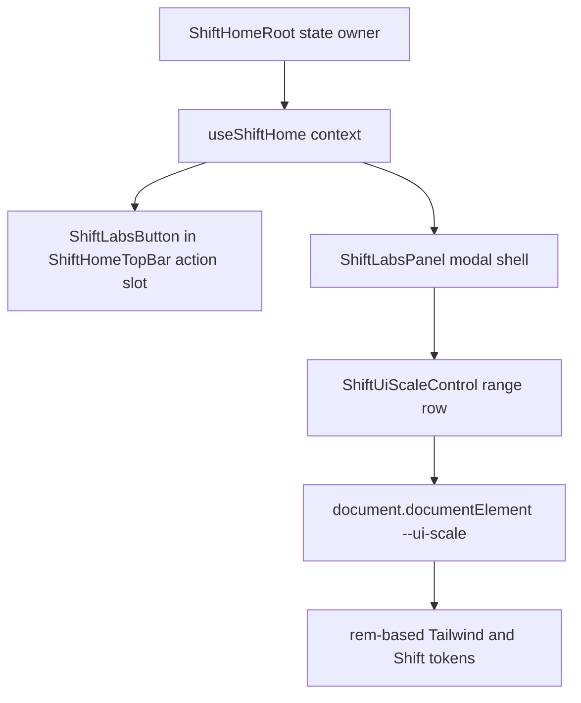

# feat: Add Shift Labs panel

## Overview

Add a Shift-themed Labs entry point to the home top bar. Activating it opens a modal Labs panel with a realtime UI scale slider backed by the existing `--ui-scale` root CSS variable. The panel should be composed so future dev-only controls can be added as additional rows without reworking the trigger, modal shell, or home layout.

## Problem Frame

The root-rem scaling experiment works well, but the current control is temporary and Storybook-specific. The next step is to make UI scale calibration available directly on the kiosk-style home surface through a theme-appropriate Labs affordance. This should feel like part of Shift, remain navigable via pointer, keyboard, and gamepad-style directional input, and avoid turning Labs into a generic settings system before there are multiple real controls.

## Requirements Trace

- R1. Add a Labs icon/button to the Shift home top bar.
- R2. Activating Labs opens a modal panel over the home surface.
- R3. The modal includes a Shift-themed UI scale slider that updates the whole UI in realtime through `--ui-scale`.
- R4. The Labs panel is composition-friendly: future dev controls can be added as additional rows/sections without changing the trigger or modal shell contract.
- R5. Existing home behavior remains intact: initial tile focus, caption tracking, launch confirm handling, HUD action feedback, and light/dark theme support.
- R6. Temporary Storybook-only slider scaffolding is removed or demoted so the in-surface Labs panel is the primary manual calibration path.

## Scope Boundaries

- No persistence yet. UI scale resets on reload unless a later task explicitly adds local preference storage.
- No production gating or authz. Labs is a visible Shift home affordance in this pass; hiding it by environment is a separate product decision.
- No generic app-wide settings framework, route, drawer, or registry.
- No controller glyph remapping, theme switching, or additional Labs controls beyond UI scale.
- No change to launch behavior or library data loading.

## Context & Research

### Relevant Code and Patterns

- `korri/shared/primitives/theme/styles.css` owns project-wide theme primitives, including `--spacing`, `--text-*`, and the experimental `--ui-scale` root font-size hook.
- `korri/shared/themes/shift/shift.css` owns Shift identity tokens and class-hook styles under `[data-shift-home]`.
- `korri/shared/themes/shift/templates/ShiftHomeRoot.tsx` is the state owner for the home surface and provides `useShiftHome()` context to child compounds.
- `korri/shared/themes/shift/organisms/ShiftHomeTopBar.tsx` composes the search pill and decorative status cluster.
- `korri/shared/themes/shift/molecules/ShiftMenuButton.tsx`, `ShiftHudButton.tsx`, and `ShiftHudChip.tsx` show the current Shift pattern for native focusable controls, glyph circles, and semantic-input feedback.
- `korri/shared/navigation/focus-engine.ts` keeps components native and drives directional focus through the DOM. `@bbc/tv-lrud-spatial` supports `.lrud-container`, `.lrud-ignore`, and `data-block-exit` DOM hints for overlays.
- `korri/deploy/storybook/preview.tsx` initializes spatial navigation inside Storybook and currently has the experimental `uiScale` global.
- `korri/shared/themes/shift/pages/ShiftHomePage.stories.tsx` currently has the temporary in-canvas UI scale range control from the scaling experiment.

### Institutional Learnings

- `docs/solutions/best-practices/decoupled-spatial-navigation-2026-05-01.md`: keep components as native HTML; use semantic input subscriptions and LRUD DOM hints rather than importing navigation library APIs into components.
- `docs/solutions/best-practices/control-driven-storybook-coverage-for-combinatorial-components-2026-05-01.md`: Storybook controls are useful for harness exploration, but durable UI controls should live at the composition seam they exercise.
- `docs/brainstorms/2026-05-01-shift-theme-atomic-decomposition-requirements.md`: Shift components are organized by atomic level, with `ShiftHomeRoot` as the state owner and `ShiftHome*` prefixes for home-specific surfaces.

### External References

- No external research needed. The repo already has direct local patterns for Radix via the runtime `radix-ui` package, native focusable controls, Storybook stories, and Shift theme decomposition.

## Key Technical Decisions

- **Use a Labs modal, not another Storybook toolbar/global.** The user wants realtime adjustment on the page; putting the control in the home surface also proves it works in the kiosk composition rather than only in Storybook chrome.
- **Keep `--ui-scale` as the scaling primitive.** The current root-rem approach has validated visually, and it aligns with the design-system-correct direction: theme tokens scale from rem rather than a visual transform.
- **Use a native range input for the slider.** It is focusable, works with pointer and keyboard, is ignored by the keyboard adapter as an editable `INPUT`, and can be styled by Shift CSS without introducing a custom slider state machine.
- **Use Radix Dialog from the existing `radix-ui` runtime dependency for the modal shell.** This provides accessible dialog semantics and focus management without adding a new dependency or hand-rolling modal behavior.
- **Use LRUD DOM hints inside the modal.** The dialog content should be an `.lrud-container` with `data-block-exit="up down left right"` so directional navigation does not leak back into the home while Labs is open.
- **Make the modal content compositional, not registry-driven.** Add a Labs shell plus a UI scale row now. Future controls can be explicit children/sections at the call site; do not introduce a config registry until repeated real controls justify it.

## Open Questions

### Resolved During Planning

- **Where does Labs state live?** In `ShiftHomeRoot`, because it is the home surface state owner. Labs trigger and panel children can read `openLabs`, `closeLabs`, `uiScale`, and `setUiScale` from `useShiftHome()` without prop-drilling through unrelated compounds.
- **Where does the Labs trigger render?** In the top bar between search and the status cluster, as an explicit trailing action slot. `ShiftHomeTopBar` should accept a ReactNode-style action slot rather than hardcoding every future action into the organism.
- **How should directional navigation stay inside the modal?** Use Radix focus management plus LRUD DOM hints on the dialog content. Validate with a Storybook E2E test before considering a navigation scope registry.

### Deferred to Implementation

- **Exact Labs icon.** Pick a Lucide icon that reads as Labs/experiments, likely `FlaskConical` or `Beaker`, during implementation and visual review.
- **Exact modal dimensions and slider track styling.** Calibrate in `shift.css` against the existing pill/HUD vocabulary and light/dark surfaces.
- **Whether the Storybook global `uiScale` toolbar remains.** Prefer removing duplicate experimental controls if they conflict, but if it remains useful as a cross-story harness override, keep it clearly separate from the in-surface Labs control.

## High-Level Technical Design

> *This illustrates the intended approach and is directional guidance for review, not implementation specification. The implementing agent should treat it as context, not code to reproduce.*

The key shape is: `ShiftHomeRoot` owns Labs open state and UI scale state; the top bar only provides a placement slot; the Labs panel is the reusable shell; the UI scale control is one composable row inside it.

## Implementation Units

- [x] **Unit 1: Stabilize UI scale primitives**

**Goal:** Make root-rem scaling a small project-wide primitive rather than a one-off Storybook experiment.

**Requirements:** R3, R5, R6

**Dependencies:** None

**Files:**
- Modify: `korri/shared/primitives/theme/styles.css`
- Modify: `korri/shared/themes/shift/shift.css`
- Create: `korri/shared/primitives/theme/ui-scale.ts`
- Test: `korri/shared/primitives/theme/ui-scale.test.ts`

**Approach:**
- Keep `--ui-scale` on `:root` and keep root `font-size` derived from it.
- Keep scalable project tokens expressed in `rem` where the current experiment already proved that scaling behaves correctly.
- Capture UI-scale constants and pure helpers in `ui-scale.ts`: default, min, max, step, clamp, percent label formatting, and CSS-variable serialization.
- Keep fixed hairline-class values fixed where comments already say they should not scale, such as tile focus-ring thickness and 1px-ish decorative edges.

**Patterns to follow:**
- Token ownership comments in `korri/shared/primitives/theme/styles.css` and `korri/shared/themes/shift/shift.css`.
- Pure-helper test style in existing `*.test.ts` files under `korri/shared/`.

**Test scenarios:**
- Happy path: input scale `1.15` -> clamp helper returns `1.15` and label helper returns `115%`.
- Edge case: input below min, such as `0.1` -> clamp helper returns configured min.
- Edge case: input above max, such as `5` -> clamp helper returns configured max.
- Edge case: invalid input, such as `NaN` or a non-numeric string after parsing -> helper falls back to default scale.

**Verification:**
- At default scale, Shift home visually matches the pre-Labs composition.
- Setting `--ui-scale` manually still scales type, spacing, and Shift rail geometry together.

- [x] **Unit 2: Add Labs trigger to the top bar composition**

**Goal:** Add a Shift-themed Labs icon/button to the home top bar without hardcoding a future registry of top-bar actions.

**Requirements:** R1, R4, R5

**Dependencies:** Unit 1

**Files:**
- Create: `korri/shared/themes/shift/molecules/ShiftLabsButton.tsx`
- Create: `korri/shared/themes/shift/molecules/ShiftLabsButton.stories.tsx`
- Test: `korri/shared/themes/shift/molecules/ShiftLabsButton.test.tsx`
- Modify: `korri/shared/themes/shift/organisms/ShiftHomeTopBar.tsx`
- Modify: `korri/shared/themes/shift/organisms/ShiftHomeTopBar.stories.tsx`
- Test: `korri/shared/themes/shift/organisms/ShiftHomeTopBar.test.tsx`
- Modify: `korri/shared/themes/shift/shift.css`

**Approach:**
- Implement `ShiftLabsButton` as a native `button`, using existing Shift pill/glyph vocabulary rather than custom focus behavior.
- Extend `ShiftHomeTopBar` with a composition slot for trailing actions near the status cluster.
- In the home composition, place `ShiftLabsButton` in that slot.
- Keep the status cluster decorative and `aria-hidden`; Labs is the new focusable action in the right side of the bar.

**Patterns to follow:**
- `korri/shared/themes/shift/atoms/ShiftPill.tsx` for native button pass-through.
- `korri/shared/themes/shift/molecules/ShiftMenuButton.tsx` for glyph + label focus styling.
- `korri/shared/themes/shift/organisms/ShiftHomeTopBar.stories.tsx` for Storybook composition coverage.

**Test scenarios:**
- Happy path: rendering `ShiftLabsButton` with an activation handler and clicking it calls the handler exactly once.
- Happy path: rendering `ShiftHomeTopBar` with a trailing Labs action places the Labs button before the decorative status cluster.
- Edge case: rendering `ShiftHomeTopBar` without trailing actions preserves the existing search + status layout.
- Accessibility: Labs button has an accessible name such as `Labs` and remains a native focusable button.

**Verification:**
- Top bar still aligns search, Labs, and status chrome at 1080p light and dark modes.
- Keyboard/gamepad directional focus can reach the Labs button without component-level navigation code.

- [x] **Unit 3: Add Labs state and modal shell**

**Goal:** Add an accessible Shift Labs modal that opens from the top-bar trigger and closes cleanly from explicit close, Escape/back, and outside modal lifecycle.

**Requirements:** R2, R4, R5

**Dependencies:** Unit 2

**Files:**
- Modify: `korri/shared/themes/shift/templates/ShiftHome.context.tsx`
- Modify: `korri/shared/themes/shift/templates/ShiftHomeRoot.tsx`
- Test: `korri/shared/themes/shift/templates/ShiftHomeRoot.test.tsx`
- Create: `korri/shared/themes/shift/organisms/ShiftLabsPanel.tsx`
- Create: `korri/shared/themes/shift/organisms/ShiftLabsPanel.stories.tsx`
- Test: `korri/shared/themes/shift/organisms/ShiftLabsPanel.test.tsx`
- Modify: `korri/shared/themes/shift/pages/ShiftHomeReadyBody.tsx`
- Modify: `korri/shared/themes/shift/shift.css`

**Approach:**
- Extend `ShiftHomeRoot` context with Labs modal state and domain-level mutations: open, close, and set UI scale.
- Render `ShiftLabsPanel` as part of the home composition under `ShiftHomeRoot`, not as a product route or global overlay.
- Use Radix `Dialog` from `radix-ui` for modal semantics and focus management.
- Style overlay/content in `shift.css` under Shift scope. If Radix portals outside the `data-shift-home` subtree, wrap the portal content in a Shift-scoped host so Shift variables and rules apply.
- Add `.lrud-container` and `data-block-exit="up down left right"` to dialog content so directional navigation remains inside Labs while open.
- Subscribe to semantic `back` with `useInputAction` inside the panel so gamepad/keyboard back closes the modal when it is open.

**Patterns to follow:**
- `korri/shared/themes/shift/templates/ShiftHomeRoot.tsx` for state ownership and domain mutations.
- `korri/shared/navigation/use-input-action.ts` for semantic `back` subscription.
- LRUD hints described in `docs/solutions/best-practices/decoupled-spatial-navigation-2026-05-01.md`.

**Test scenarios:**
- Happy path: calling the Labs open mutation renders the dialog with role/name content visible.
- Happy path: clicking the explicit close button closes the dialog.
- Integration: emitting semantic `back` while the dialog is open closes it and does not trigger launch behavior.
- Edge case: emitting semantic `back` while the dialog is closed does not change home state.
- Accessibility: the dialog has a title, description or equivalent labelling, and at least one focusable close/control element.

**Verification:**
- Labs opens over the home without moving or remounting the rail.
- Closing Labs returns the player to the home with the previous focused tile/caption still intact.

- [x] **Unit 4: Add the Shift UI scale slider row**

**Goal:** Put the realtime UI scale control inside the Labs modal with Shift-appropriate visual styling.

**Requirements:** R3, R4, R5

**Dependencies:** Units 1 and 3

**Files:**
- Create: `korri/shared/themes/shift/molecules/ShiftUiScaleControl.tsx`
- Create: `korri/shared/themes/shift/molecules/ShiftUiScaleControl.stories.tsx`
- Test: `korri/shared/themes/shift/molecules/ShiftUiScaleControl.test.tsx`
- Modify: `korri/shared/themes/shift/organisms/ShiftLabsPanel.tsx`
- Test: `korri/shared/themes/shift/organisms/ShiftLabsPanel.test.tsx`
- Modify: `korri/shared/themes/shift/templates/ShiftHomeRoot.tsx`
- Modify: `korri/shared/themes/shift/shift.css`

**Approach:**
- Implement the slider as a controlled native `input type="range"` with value, min, max, step, and label coming from the UI-scale helper constants.
- Display the current scale as a percent label and provide a small reset action if it fits the modal without adding clutter.
- Apply the CSS variable update in the home root or panel effect from the single `uiScale` state value; avoid each control writing global state independently.
- Style the track/thumb to match Shift: warm raised surface, lavender focus/active accent, rounded thumb, and light/dark variants.
- Keep the row as a reusable Labs section pattern: label, description, control, value.

**Patterns to follow:**
- `korri/shared/themes/shift/molecules/ShiftSearchPill.tsx` for focus-driven visual feedback with native controls.
- `korri/shared/themes/shift/molecules/ShiftLaunchFailureBanner.tsx` for compact row-like Shift surface styling.
- Existing token comments in `shift.css` for avoiding hardcoded component-local values.

**Test scenarios:**
- Happy path: changing the slider from `1` to `1.15` calls the provided change handler with `1.15` and updates the visible label to `115%`.
- Happy path: when composed in `ShiftLabsPanel`, moving the slider updates `document.documentElement`'s `--ui-scale` value.
- Edge case: slider receives an out-of-range value through props -> rendered value is clamped to the configured min/max.
- Accessibility: slider has an accessible label, exposes min/max/current value, and can be focused as a native input.

**Verification:**
- Moving the slider scales the top bar, rail, caption, bottom bar, and Labs panel in realtime.
- At min/default/max values, no top-bar clipping, modal clipping, or obvious focus-halo misalignment appears at the 1080p Storybook viewport.

- [x] **Unit 5: Integrate and retire temporary experiment controls**

**Goal:** Make the Shift Home story and page use the Labs panel as the durable in-surface control, and cover the interaction in Storybook E2E.

**Requirements:** R1, R2, R3, R5, R6

**Dependencies:** Units 1-4

**Files:**
- Modify: `korri/shared/themes/shift/pages/ShiftHomeReadyBody.tsx`
- Modify: `korri/shared/themes/shift/pages/ShiftHomePage.stories.tsx`
- Modify: `korri/deploy/storybook/preview.tsx`
- Create: `korri/shared/themes/shift/pages/ShiftHomePage.story.e2e.ts`
- Test: `korri/shared/themes/shift/pages/ShiftHomePage.story.e2e.ts`

**Approach:**
- Compose `ShiftLabsButton` into the `ShiftHomeTopBar` action slot and compose `ShiftLabsPanel` once under the home root.
- Remove the temporary story-local fixed-position slider from `ShiftHomePage.stories.tsx`.
- Decide whether to remove the Storybook `uiScale` global from `preview.tsx`; if retained, document it as a harness override and ensure it does not fight the Labs panel default.
- Add a Storybook E2E spec against `themes-shift-pages-home--default` that opens Labs, moves the slider, observes `--ui-scale`, verifies the dialog closes, and confirms home focus is still usable afterward.

**Patterns to follow:**
- Story E2E URL helpers in `korri/shared/primitives/components/Tilegrid/Tilegrid.story.e2e.ts`.
- Storybook layer setup in `korri/shared/themes/shift/pages/ShiftHomePage.stories.tsx`.
- Existing spatial-navigation tests that assert focus movement and activation through real DOM focus.

**Test scenarios:**
- Integration: open the Shift Home story, activate Labs from the top bar -> Labs dialog appears with the UI scale slider.
- Integration: adjust the slider to `1.15` -> root `--ui-scale` becomes `1.15` and the visible percentage reads `115%`.
- Integration: press Escape or semantic back while Labs is open -> dialog closes and focus returns to a meaningful home control.
- Integration: after closing Labs, directional navigation can still move from the home rail to another focusable element and confirm still launches/clicks the focused tile.
- Regression: the Default, Loading, Load Error, Empty, and Failed Launch stories still render without network calls or backend dependencies.

**Verification:**
- The user's URL renders with the Labs icon visible in the top bar and the slider usable in realtime.
- There is no second fixed-position test slider over the story canvas.
- Existing home tests and Storybook stories remain stable.

## System-Wide Impact

- **Interaction graph:** Labs adds a new top-bar activation path and a modal-local `back` handler. Confirm behavior for the rail remains owned by `ShiftHomeLaunchSurface`.
- **Error propagation:** UI scale updates are local DOM style updates and should not throw for normal numeric input. Invalid values are clamped/fallbacked before reaching the CSS variable.
- **State lifecycle risks:** Labs open state, UI scale state, focused tile state, and launch state must not reset each other. Closing Labs should not remount `ShiftHomeRoot` or recreate library layers.
- **API surface parity:** Storybook and portal should both import the same theme CSS and use the same Labs components. No product-specific imports enter `korri/shared/themes/shift/`.
- **Integration coverage:** Unit tests cover helpers/components; Storybook E2E proves modal opening, realtime scale changes, close behavior, and post-modal focus recovery in the actual visual harness.
- **Unchanged invariants:** Shared primitives still do not import Shift. Shift still does not import product routes or RPC transport. Components remain native focusables and do not import LRUD directly.

## Risks & Dependencies

| Risk | Mitigation |
|------|------------|
| Directional focus leaks out of the modal because LRUD does not account for z-index overlays. | Use `.lrud-container` plus `data-block-exit` on dialog content and prove it in Storybook E2E before adding broader navigation APIs. |
| Storybook `uiScale` global and Labs slider compete over `--ui-scale`. | Prefer removing the temporary toolbar global; if kept, make Labs initialize from the current CSS variable and treat Storybook global as a harness-only override. |
| Labs becomes a premature settings framework. | Keep this pass to a shell plus one explicitly composed UI scale row; do not introduce a registry or persistence. |
| Root font-size scaling misses px-based values. | Keep known intentionally-static pixels documented; convert only values intended to scale and test visible clipping at multiple slider values. |
| Modal CSS does not inherit Shift variables if Radix portals outside `[data-shift-home]`. | Wrap portal content in a Shift-scoped host or portal into a Shift-owned container so `shift.css` selectors and variables apply. |

## Documentation / Operational Notes

- No standalone documentation update is required for the first Labs control.
- If Labs persists or grows beyond dev-only controls later, create a separate requirements pass for visibility, persistence, and production gating.

## Sources & References

- Related code: `korri/shared/primitives/theme/styles.css`
- Related code: `korri/shared/themes/shift/shift.css`
- Related code: `korri/shared/themes/shift/templates/ShiftHomeRoot.tsx`
- Related code: `korri/shared/themes/shift/organisms/ShiftHomeTopBar.tsx`
- Related code: `korri/shared/themes/shift/pages/ShiftHomePage.stories.tsx`
- Related code: `korri/deploy/storybook/preview.tsx`
- Institutional learning: `docs/solutions/best-practices/decoupled-spatial-navigation-2026-05-01.md`
- Institutional learning: `docs/solutions/best-practices/control-driven-storybook-coverage-for-combinatorial-components-2026-05-01.md`
- Origin context from current session: root-rem scaling validated visually on the Shift Home Storybook page.
