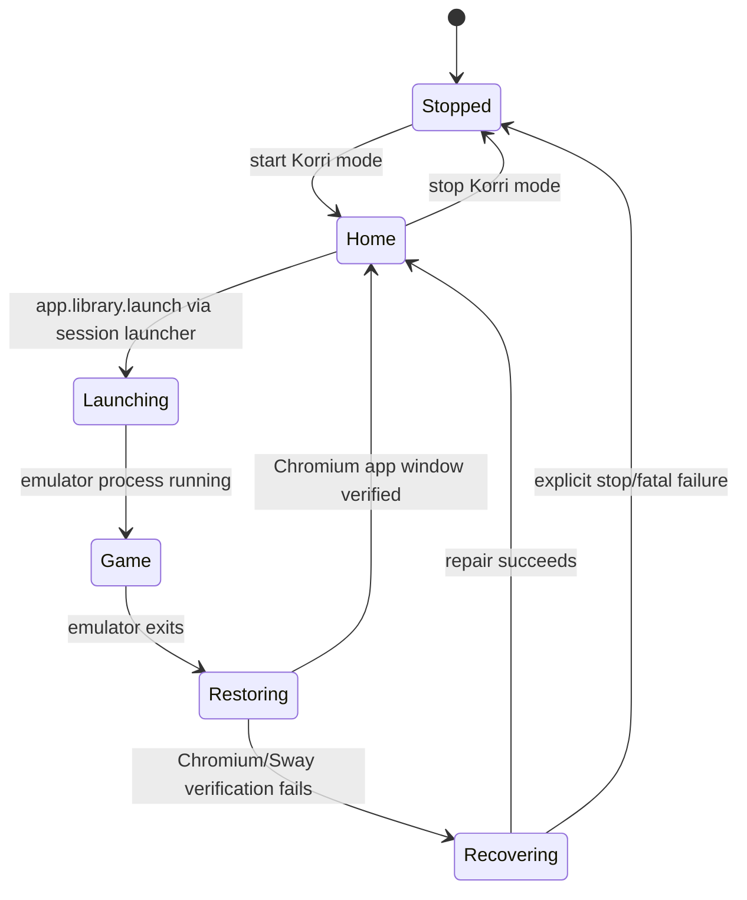
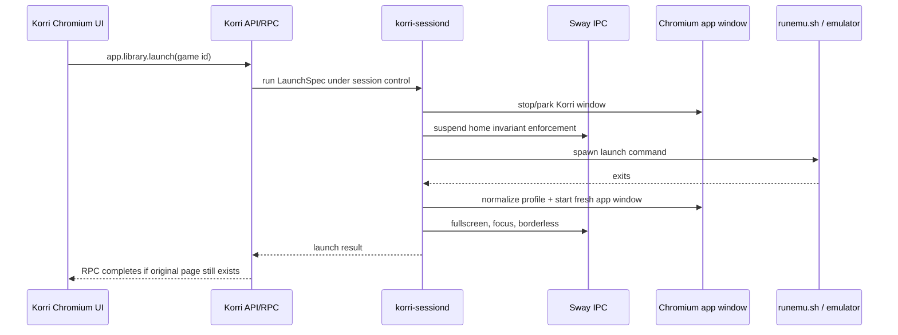
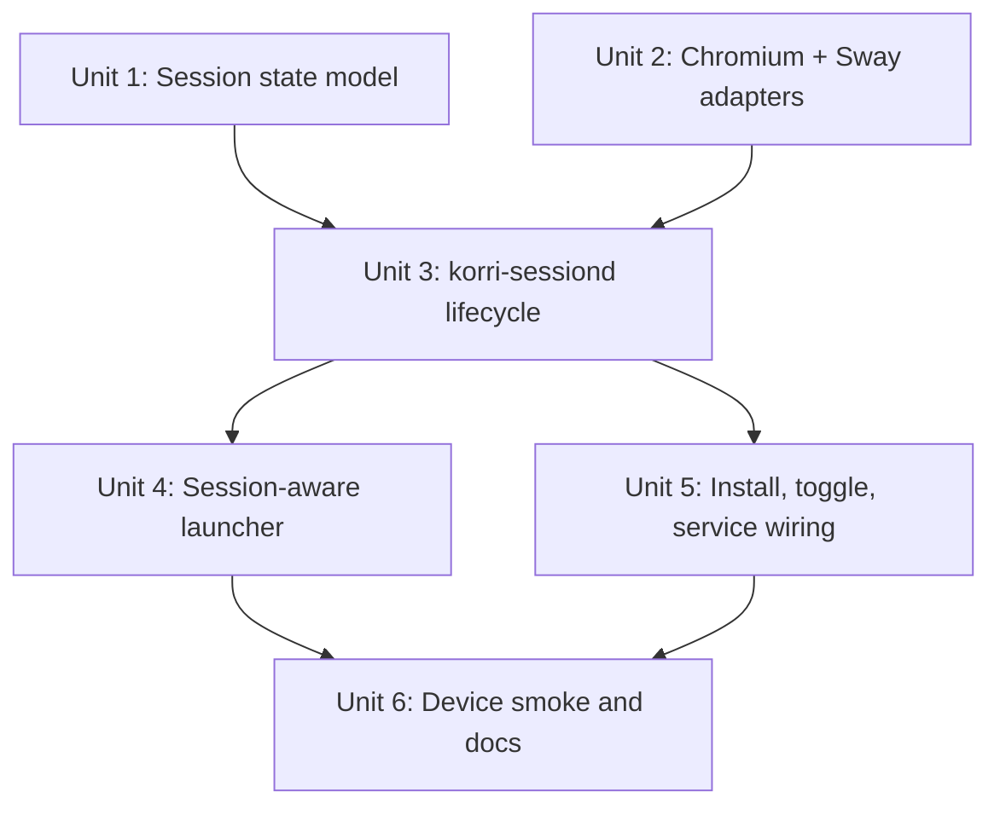

# feat: Add Odin Chromium session supervisor

## Overview

Korri needs GPU-accelerated rendering on the Odin. The current Electrobun/WebKit path can be made to load, but it reaches the GPU through a mixed Nix/WebKit/ROCKNIX Mesa stack and falls back to unstable or non-fluid rendering. Chromium kiosk already has the device-native GPU path, so the next native direction is to make Chromium the supported renderer and put a Korri-owned session supervisor around it.

The supervisor's job is not merely to launch Chromium with kiosk flags. It owns the Sway session while Korri mode is active and continuously enforces this invariant:

> When no game is running, exactly one Korri Chromium app window exists, it is focused, fullscreen, chromeless/app-mode, and pointed at the configured Korri URL.

The strongest guarantee comes from not trusting Chromium to preserve kiosk state across emulator handoffs. On every game launch, Korri's launcher delegates to a device-local session daemon. The daemon transitions to game mode, allows the emulator to own the screen, waits for the launch command to exit, then starts a fresh Chromium app-mode/kiosk window, clears crash-restore state, and reapplies Sway fullscreen/focus rules. EmulationStation remains runtime-masked during Korri mode and is only restored on an explicit Korri session stop.

## Problem Frame

Today the Chromium kiosk path can lose its chromeless/kiosk presentation after a game exits. That happens because Chromium is being treated as one process among several in the ROCKNIX desktop session: EmulationStation, Sway, Chromium, and the emulator all contend for focus and fullscreen state, and Chromium's own restore/session behavior can reappear after an external process takes over the screen.

A flag-only fix is insufficient. `--kiosk` and related Chromium flags are launch hints, not an invariant enforced across compositor focus changes, emulator exits, crashes, or profile restore state. The session owner must be Korri, not Chromium and not EmulationStation.

This plan keeps the parts that already work:

- ROCKNIX-native Chromium for GPU acceleration.
- The existing Korri API/RPC server and library source.
- The existing native input daemon and session-toggle chord.
- Runtime masking of `essway.service` as the reversible way to stop EmulationStation during Korri mode.

It replaces the current toggle script's direct Chromium launch with a supervised `korri-sessiond` process that owns Chromium, Sway reconciliation, and game-launch handoff.

## Requirements Trace

- R1. Korri's on-device renderer uses ROCKNIX-native Chromium, not Electrobun/WebKit, for the GPU-accelerated path.
- R2. Starting Korri mode stops/runtime-masks EmulationStation for the current session only; stopping Korri mode restores it.
- R3. In home mode, the compositor invariant is enforced: one Korri Chromium window, fullscreen, focused, borderless, and pointed at the configured Korri URL.
- R4. Game launch is session-aware: the process that launches the emulator also knows when the emulator exits and triggers Chromium restoration afterward.
- R5. Chromium is relaunched fresh after game exit instead of relying on its pre-game window to survive or preserve kiosk mode.
- R6. The Chromium profile is dedicated to Korri and is normalized before launch so crash/session-restore UI cannot steal the chromeless surface.
- R7. During game mode, the supervisor must not fight the emulator for focus or fullscreen.
- R8. If Chromium exits, loses focus, loses fullscreen, or spawns duplicate Korri windows while in home mode, the supervisor repairs the session without user input.
- R9. Existing input ownership remains intact: `korri-inputd` keeps owning system chords, `L3+R3+Start` toggles Korri mode, and `kill-current-game` still works through ROCKNIX's process-kill data.
- R10. Existing app/library RPC behavior remains unchanged for non-Odin and non-sessiond runs.
- R11. The implementation is reversible and `/storage`-owned; it does not modify the immutable ROCKNIX root filesystem or persistently alter `essway.service`.
- R12. Device smoke proves the full open Korri → launch fake/real game → game exits → Korri returns through the supervised Chromium app-mode/fullscreen path.
- R13. Sessiond's launch/control surface is protected from arbitrary local callers; only the installed toggle command and configured Korri API launcher can request process launches.

## Scope Boundaries

- **In scope:** session daemon, Sway window reconciliation, Chromium app/kiosk launcher, profile normalization, session-aware game launcher, service/toggle installation, and device smoke coverage.
- **Out:** continuing to optimize the Electrobun/WebKit/proot path for production smoothness.
- **Out:** rebuilding ROCKNIX or adding packages to the immutable root filesystem.
- **Out:** changing the product home UI, spatial-navigation architecture, library list RPC shape, or `LaunchSpec` structure.
- **Out:** public installer UX, update channels, and release packaging beyond the developer Odin loop.
- **Out:** guaranteeing kiosk mode when Korri is launched manually outside `korri-sessiond`. The guarantee applies to the supervised session only.

### Deferred to Separate Tasks

- A fully offline/on-device production web bundle server can follow this plan. The supervisor accepts a configured Korri URL first, so it works with today's forwarded/dev URL and a later local static server.
- A ROCKNIX image or package that preinstalls Korri services is separate from this `/storage`-owned implementation.

## Context & Research

### Relevant Code and Patterns

- `scripts/odin/install-korri-toggle.sh` currently installs `/storage/bin/korri-session-toggle`, directly masks `essway.service`, and launches Chromium. This is the seam to replace with supervisor control.
- `scripts/odin/install.sh` already installs Bun, syncs the project, harvests Wayland environment into `/storage/korri/.env`, installs the session toggle, and installs `korri-inputd.service`.
- `scripts/odin/run-inputd.sh`, `scripts/odin/install-inputd-service.sh`, `tools/odin/inputd.ts`, and `tools/odin/inputd-actions.ts` establish the pattern for a `/storage`-installed daemon controlled by systemd but implemented in repo TypeScript.
- `tools/http/server.ts` is the current Hono API server entrypoint used on the Odin.
- `korri/products/app/api/rpc-server.ts` wires `LauncherLayerLive`, and `korri/shared/library/launcher-layer-live.ts` currently delegates every launch to `createShellLauncher()`.
- `korri/shared/library/shell-launcher.ts` already treats `runemu.sh` as a blocking child that resolves only after game exit. The session-aware launcher should preserve that contract.
- `korri/shared/library/rocknix/rocknix-source.ts` composes launch specs from real ROCKNIX `es_systems.cfg` / `gamelist.xml`; do not move launch-command parsing into the supervisor.
- `justfile` keeps Odin operations explicit (`install-odin`, `dev-odin`, `check-odin`) and out of default validation.

### Institutional Learnings

- `docs/development/odin-iterative-loop.md` documents the current Level 2 loop: remote API/input daemon on the Odin, renderer elsewhere, and input ownership through `korri-inputd`.
- `docs/brainstorms/2026-05-03-native-input-bridge-requirements.md` requires the open → navigate → launch → exit → back to Korri loop to work under controller input alone.
- `docs/plans/2026-05-03-001-feat-odin-electrobun-build-plan.md` captured the reversible runtime-mask approach for `essway.service`, but runtime testing showed the Electrobun/WebKit path is not the right GPU baseline.
- `docs/solutions/integration-issues/odin-electrobun-webkit-runtime-white-screen-2026-05-04.md` records the WebKitGTK/EGL failure mode; this plan avoids that stack for the production renderer.

### External References

- Sway supports event-driven window supervision through `swaymsg -t subscribe '["window"]'`; use event reconciliation rather than relying only on polling.
- Chromium kiosk/app-mode deployments commonly combine dedicated profiles, app/kiosk flags, first-run suppression, and session-restore suppression. The plan treats those as necessary but not sufficient; compositor and process supervision enforce the invariant.

## Key Technical Decisions

| Decision | Rationale | Tradeoff |
|---|---|---|
| Use ROCKNIX Chromium as the production Odin renderer | It is the only path currently known to use the device's native GPU stack fluidly. | Korri's native bridge surface moves to loopback HTTP/session daemon rather than Electrobun IPC. |
| Introduce `korri-sessiond` as session owner | Kiosk state must be enforced across Sway, Chromium, and emulator lifecycles. | Adds one more daemon, but it replaces brittle toggle-script process choreography. |
| Relaunch Chromium after every game exit | Fresh app-mode launch plus profile normalization is stronger than hoping a pre-game window remains chromeless. | The home app cold-starts after each game; acceptable for correctness and can be optimized later. |
| Delegate launches through sessiond only on Odin | Non-Odin app/API tests and local desktop behavior keep the existing shell launcher. | Adds an environment-selected launcher layer seam. |
| Use Sway event subscription plus reconciliation | Event-driven repair is faster and less wasteful than pure polling; reconciliation still handles missed events. | Requires robust parsing of Sway tree/event JSON and configurable window selectors. |
| Keep EmulationStation restoration explicit | ES must not reclaim the screen during Korri mode, but users need a reversible way back. | Crashes require a recovery path; service install must include status/stop commands. |
| Own processes by PID/child handles, not broad `pkill -f` patterns | Prior SSH relaunch attempts killed their own shell/session. | Requires storing PID/status files and more careful process tracking. |
| Authenticate the sessiond control surface | Sessiond can launch arbitrary `LaunchSpec` commands, so loopback-only HTTP is not enough as a trust boundary. | Toggle/API wrappers must share a token or use an equivalent local-only capability file/socket. |

## Open Questions

### Resolved During Planning

- **Should we keep trying to force Electrobun/WebKit into GPU acceleration?** No for the production path. Runtime testing showed WebKit can be made to load only by compromising compositing, and native DRI attempts were unstable.
- **Can Chromium flags alone guarantee kiosk state?** No. They are launch configuration, not lifecycle enforcement after emulator handoff.
- **Should Korri leave EmulationStation running behind Chromium?** No. The established reversible approach is runtime-masking `essway.service` while Korri mode owns the session.
- **Should the supervisor steal focus while a game is running?** No. Game mode is an explicit state where focus enforcement is suspended until the launch process exits.

### Deferred to Implementation

- Exact Chromium window identity on the Odin (`app_id`, class, title) should be discovered and made configurable in tests/smoke rather than hard-coded from memory.
- Exact Chromium binary path remains configurable because the current install path is `/storage/apps/chromium/squashfs-root/AppRun`, but ROCKNIX image updates may move it.
- Whether the first production version serves the portal from a local static server or a forwarded dev URL is deferred; `korri-sessiond` should only require `KORRI_URL`.
- Whether Sway's IPC socket should be read from the harvested `.env` or discovered from `/run/*/sway-ipc.*.sock` is implementation-time device probing.

## Output Structure

```text
tools/odin/
  sessiond.ts
  sessiond-state.ts
  sessiond-chromium.ts
  sessiond-sway.ts
  sessiond-launcher-client.ts
  sessiond-smoke.ts
  sessiond*.test.ts
scripts/odin/
  run-sessiond.sh
  install-sessiond-service.sh
  smoke-sessiond.sh
korri/shared/library/
  session-launcher.ts
  session-launcher.test.ts
```

The tree shows the expected shape. The implementing agent may adjust file splits if implementation reveals a simpler layout, but the daemon, Sway/Chromium adapters, session-aware launcher, service scripts, and smoke test remain separate responsibilities.

## High-Level Technical Design

> *This illustrates the intended approach and is directional guidance for review, not implementation specification. The implementing agent should treat it as context, not code to reproduce.*





## Implementation Units



- [x] **Unit 1: Define the session state model and invariant contract**

**Goal:** Create the pure model that represents Korri session states, allowed transitions, and the home-mode window invariant before wiring processes or Sway.

**Requirements:** R2, R3, R4, R7, R8, R11.

**Dependencies:** None.

**Files:**
- Create: `tools/odin/sessiond-state.ts`
- Test: `tools/odin/sessiond-state.test.ts`

**Approach:**
- Model states such as stopped, starting, home, launching, game, restoring, and recovering.
- Encode which states enforce the Chromium home invariant and which explicitly suspend it.
- Represent reconciliation outcomes as structured decisions: no-op, focus/fullscreen repair, relaunch Chromium, stop duplicate windows, or fatal/session-stop.
- Keep process execution out of this unit; this is a deterministic state/reducer layer for tests and later daemon use.

**Patterns to follow:**
- `tools/desktop/odin-desktop-preflight.ts` for pure classifier/report logic separated from shell probing.
- `korri/shared/library/launch-state.ts` for explicit state tags and small transition helpers.

**Test scenarios:**
- Happy path: stopped -> starting -> home enables invariant enforcement.
- Happy path: home -> launching -> game suspends Chromium focus repair while a game owns the screen.
- Happy path: game -> restoring -> home re-enables invariant enforcement only after restoration succeeds.
- Edge case: duplicate Chromium windows in home -> reconciliation decision asks for duplicate cleanup and primary focus.
- Edge case: no Chromium window in home -> reconciliation decision asks for Chromium relaunch.
- Error path: repeated failed restore attempts -> state moves to recovering with an actionable failure reason.
- Error path: explicit stop from any state -> invariant enforcement stops and ES restoration is allowed.

**Verification:**
- State transitions are deterministic, test-covered, and do not depend on real Sway/Chromium processes.

- [x] **Unit 2: Add Chromium and Sway control adapters**

**Goal:** Provide testable adapters for launching/finding Chromium and enforcing compositor state without embedding process details directly in the daemon loop.

**Requirements:** R1, R3, R5, R6, R8, R11.

**Dependencies:** Unit 1 for invariant decisions.

**Files:**
- Create: `tools/odin/sessiond-chromium.ts`
- Test: `tools/odin/sessiond-chromium.test.ts`
- Create: `tools/odin/sessiond-sway.ts`
- Test: `tools/odin/sessiond-sway.test.ts`

**Approach:**
- Chromium adapter owns the Korri profile path, profile normalization, launch arguments, PID/status tracking, and graceful stop/relaunch behavior.
- Prefer Chromium app-mode plus kiosk/fullscreen flags rather than a normal browser URL, so tabs/toolbars are not part of the target surface.
- Normalize the dedicated profile before launch so crash/session-restore prompts do not appear after abrupt game or power events.
- Sway adapter parses `get_tree` output, identifies Korri Chromium windows via configurable selectors, applies fullscreen/focus/borderless repair, and subscribes to window events.
- Keep selectors and paths configurable through environment variables because ROCKNIX/Chromium packaging may change.
- Avoid broad process-kill patterns; use stored PIDs, child handles, and window identity from Sway wherever possible.

**Patterns to follow:**
- `scripts/odin/install-korri-toggle.sh` for current Chromium environment variables and profile location, but move direct launch logic out of the shell script.
- `tools/odin/inputd-actions.ts` for dependency-injected runners that make command behavior testable.

**Test scenarios:**
- Happy path: profile exists with normal exit metadata -> launch plan leaves it intact and starts Chromium with Korri URL.
- Happy path: profile contains crashed/restore metadata -> normalization removes or rewrites it before launch.
- Happy path: Sway tree has one matching Korri window not fullscreen -> adapter requests fullscreen/focus repair.
- Edge case: Sway tree has no matching Korri window -> adapter reports missing window.
- Edge case: Sway tree has multiple matching Korri windows -> adapter chooses a primary and reports duplicates for cleanup.
- Error path: Chromium binary missing -> adapter returns a blocked launch result with the configured path in the message.
- Error path: Sway IPC unavailable -> adapter reports degraded/fatal state without pretending kiosk is guaranteed.
- Integration: synthetic window event stream with focus/fullscreen changes causes the adapter to emit reconciliation triggers.

**Verification:**
- Adapter tests prove window detection and launch planning without requiring a live Odin.
- All device-specific paths/selectors are configurable and default to today's known Odin conventions.

- [x] **Unit 3: Implement `korri-sessiond` lifecycle supervisor**

**Goal:** Build the device-local daemon that owns Korri mode, coordinates Chromium/Sway repairs, and exposes a small local control surface for toggle and launch handoff.

**Requirements:** R2, R3, R4, R5, R7, R8, R11.

**Dependencies:** Units 1 and 2.

**Files:**
- Create: `tools/odin/sessiond.ts`
- Test: `tools/odin/sessiond.test.ts`
- Create: `tools/odin/sessiond-launcher-client.ts`
- Test: `tools/odin/sessiond-launcher-client.test.ts`

**Approach:**
- Run as a long-lived Bun process on the Odin, sourcing the same `/storage/korri/.env` environment via its shell wrapper.
- Expose a loopback-only control API for start, stop, status, reconcile, and launch-under-session-control.
- Require a local capability for control requests, such as a per-install/per-boot token file under `/storage/korri` or an equivalent protected Unix-socket mechanism. Treat unauthenticated launch requests as rejected, not best-effort.
- On start: runtime-mask/stop `essway.service`, start/verify Chromium, then enter home mode.
- In home mode: react to Sway events and periodic reconciliation ticks; repair or relaunch Chromium when the invariant is broken.
- On launch request: transition to launching/game, stop or park Chromium, run the supplied `LaunchSpec`, wait for exit, then restore Chromium and return a launch result matching the existing launcher contract.
- In game mode: do not focus Chromium, do not fullscreen Chromium, and do not unmask ES.
- On stop: stop Chromium, unmask/restart `essway.service`, and report stopped status.
- Persist a small status file under `/storage` so recovery/smoke tooling can tell whether Korri, game, or restore mode is active.

**Patterns to follow:**
- `tools/http/server.ts` for a small explicit process entrypoint with graceful shutdown.
- `tools/odin/inputd.ts` and `scripts/odin/run-inputd.sh` for Odin daemon conventions.
- `korri/shared/library/shell-launcher.ts` for preserving blocking launch semantics and stderr/exit behavior.

**Test scenarios:**
- Happy path: start request masks ES, launches Chromium, verifies Sway, and reports home.
- Happy path: launch request in home stops/parks Chromium, runs fake game, restores Chromium, and returns launched.
- Happy path: Sway focus event during home triggers repair when the Korri window loses focus.
- Edge case: duplicate Chromium windows appear in home -> daemon cleans duplicates and keeps one primary focused.
- Edge case: launch request arrives while already launching/game -> daemon rejects or queues according to a documented single-launch policy.
- Error path: unauthenticated control or launch request -> daemon rejects it without changing session state.
- Error path: game command exits non-zero -> daemon restores Chromium and returns failed with exit details.
- Error path: Chromium restoration fails after game exit -> daemon enters recovering and reports actionable status.
- Error path: daemon receives SIGTERM while in home -> Chromium stops and ES restoration is attempted.
- Error path: daemon receives SIGTERM while in game -> it does not kill the emulator unless explicitly configured; it records degraded status for recovery.

**Verification:**
- The daemon can be tested with fake process/Sway/Chromium adapters.
- The local control API never binds beyond loopback and rejects requests without the configured local capability.
- The launch result contract remains compatible with the existing app launcher expectations.

- [x] **Unit 4: Route Odin launch RPC through the session-aware launcher**

**Goal:** Make app-initiated game launches go through `korri-sessiond` on the Odin while preserving the existing shell launcher everywhere else.

**Requirements:** R4, R7, R9, R10, R12.

**Dependencies:** Unit 3 control API.

**Files:**
- Create: `korri/shared/library/session-launcher.ts`
- Test: `korri/shared/library/session-launcher.test.ts`
- Modify: `korri/shared/library/launcher-layer-live.ts`
- Test: `korri/products/app/api/library/launch.rpc-handler.test.ts`
- Test: `korri/products/app/features/home/library-rpc-layers.test.ts`

**Approach:**
- Add a launcher implementation that posts `LaunchSpec` to `korri-sessiond` when an explicit environment variable such as `KORRI_SESSIOND_URL` is configured.
- Read the sessiond capability from an explicit env/file path configured by the Odin launcher scripts; do not bake a static token into repo files or generated scripts.
- Keep `LauncherLayerLive` defaulting to `createShellLauncher()` when no session daemon URL is present.
- Preserve the existing `LaunchResult` shape so UI launch state does not need product changes.
- Treat sessiond connection failure as a launch failure that includes a concise diagnostic; do not silently fall back to direct shell launch on the Odin because that would bypass the kiosk guarantee.
- Keep this in `korri/shared/library/*` because it is launcher infrastructure and must not import product-specific code.

**Patterns to follow:**
- `korri/shared/library/shell-launcher.ts` for the launcher contract and failure mapping.
- `korri/products/app/features/home/launcher-layer-rpc.ts` for typed client-to-server launch delegation shape.
- `korri/products/app/api/library/launch.rpc-handler.ts` for error propagation expectations.

**Test scenarios:**
- Happy path: `KORRI_SESSIOND_URL` absent -> `LauncherLayerLive` uses the shell launcher behavior unchanged.
- Happy path: `KORRI_SESSIOND_URL` present and sessiond returns launched -> RPC returns `{ status: "launched" }`.
- Error path: sessiond returns failed with exit code/stderr -> RPC surfaces the existing launch-failure shape.
- Error path: sessiond unreachable -> launcher returns failed and does not attempt direct `runemu.sh` fallback.
- Error path: sessiond rejects an invalid/missing capability -> launcher returns failed and includes a concise configuration diagnostic.
- Integration: home feature RPC layer can launch through the production client/server path with a fake sessiond responder.

**Verification:**
- Non-Odin tests and local development keep passing without requiring sessiond.
- Odin launch path has a single route through the supervisor when configured.

- [x] **Unit 5: Replace direct Chromium toggle with sessiond service wiring**

**Goal:** Install and operate the supervisor through the existing Odin install/toggle conventions, with explicit start/stop/status controls and no persistent ROCKNIX root changes.

**Requirements:** R2, R3, R8, R9, R11.

**Dependencies:** Units 2 and 3.

**Files:**
- Create: `scripts/odin/run-sessiond.sh`
- Create: `scripts/odin/install-sessiond-service.sh`
- Modify: `scripts/odin/install.sh`
- Modify: `scripts/odin/install-korri-toggle.sh`
- Modify: `scripts/odin/dev.sh`
- Modify: `justfile`

**Approach:**
- Add a `run-sessiond.sh` wrapper that sources `/storage/korri/.env`, exports Odin defaults, and executes the Bun daemon.
- Add an install script that creates/updates a `/storage`-backed systemd service for `korri-sessiond`, mirroring the input daemon's reversible install/rollback posture.
- Change `/storage/bin/korri-session-toggle` so `start|stop|toggle|status` talk to `korri-sessiond` instead of launching Chromium directly.
- Keep `korri-inputd` as the owner of the L3+R3+Start chord; only the command it invokes changes behavior.
- Ensure `install-odin` installs/restarts sessiond after syncing code and before declaring the device ready.
- Add explicit recipes for session status/smoke if useful, but do not add device GUI checks to default `just check`.

**Patterns to follow:**
- `scripts/odin/install-inputd-service.sh` for service lifecycle and rollback style.
- `scripts/odin/run-inputd.sh` for environment sourcing.
- `scripts/odin/install-korri-toggle.sh` for preserving the existing user-facing toggle command contract.

**Test scenarios:**
- Happy path: generated toggle command sends start/stop/status to sessiond and preserves the existing CLI usage.
- Happy path: install script writes a service that starts `scripts/odin/run-sessiond.sh` with the configured project path.
- Edge case: sessiond is not running when toggle status is requested -> command reports unknown/stopped without launching Chromium directly.
- Error path: sessiond start fails -> install script reports log location and exits non-zero.
- Error path: rollback requested -> service is stopped/disabled and ES restoration is attempted.
- Integration: `install-odin` keeps installing `korri-inputd.service` and additionally installs sessiond without changing default web/API dev recipes.

**Verification:**
- The installed toggle chord starts/stops supervised Korri mode.
- Direct Chromium process launch code no longer lives in the toggle script.
- All service changes remain under `/storage` or runtime systemd state.

- [x] **Unit 6: Add supervised kiosk smoke coverage and update Odin docs**

**Goal:** Provide an explicit validation path for the guaranteed kiosk lifecycle and document the operational model for future work.

**Requirements:** R1, R2, R3, R4, R5, R8, R12.

**Dependencies:** Units 3, 4, and 5.

**Files:**
- Create: `tools/odin/sessiond-smoke.ts`
- Test: `tools/odin/sessiond-smoke.test.ts`
- Create: `scripts/odin/smoke-sessiond.sh`
- Modify: `scripts/odin/smoke.sh`
- Modify: `docs/development/odin-iterative-loop.md`

**Approach:**
- Add a smoke tool that checks sessiond status, starts Korri mode, validates Chromium/Sway invariant, triggers a fake short-running launch through the same RPC/sessiond path, waits for game exit, and validates that Chromium returns as a chromeless fullscreen app window.
- Keep real-game validation manual or opt-in; the default smoke should be safe and fast using the existing fake-game pattern where possible.
- Verify Sway state from compositor data rather than trusting process existence.
- Update docs to distinguish Level 2 dev loop, supervised Chromium Level 3, and deprecated Electrobun/WebKit experiment status.
- Include recovery commands for stopping sessiond and restoring EmulationStation.

**Patterns to follow:**
- `scripts/odin/smoke.sh` for on-device health checks and clear failure output.
- `tools/desktop/desktop-smoke.ts` for structured smoke assertions.
- `tools/testing/fake-game.sh` for a controllable launch target.

**Test scenarios:**
- Happy path: status says home with one matching Sway window -> smoke passes invariant check.
- Happy path: fake launch exits zero -> smoke observes game/restoring/home transitions and final app-mode/fullscreen Chromium.
- Edge case: Chromium window exists but is not focused/fullscreen -> smoke waits for reconciliation before passing.
- Error path: duplicate Korri windows remain after reconciliation -> smoke fails with window details.
- Error path: game exits non-zero -> smoke confirms Chromium restoration still happens, then reports launch failure.
- Error path: sessiond unavailable -> smoke fails with install/start guidance.

**Verification:**
- A developer can run one explicit Odin session smoke and see whether the kiosk guarantee holds.
- Documentation tells how to recover ES if the supervisor or smoke fails mid-session.

## System-Wide Impact

```mermaid
flowchart TB
    Input[korri-inputd chords] --> Toggle[/storage/bin/korri-session-toggle]
    Toggle --> SD[korri-sessiond]
    UI[Korri Chromium UI] --> API[Korri API / app.library.launch]
    API --> Launcher[Session-aware launcher]
    Launcher --> SD
    SD --> Chrome[Chromium app window]
    SD --> Sway[Sway IPC]
    SD --> Game[runemu.sh / emulator]
    SD --> ES[essway.service]
```

- **Interaction graph:** Input daemon triggers the toggle command; the toggle command controls sessiond; the app launch RPC delegates to sessiond; sessiond controls Chromium, Sway, emulator launch, and ES runtime masking.
- **Error propagation:** Sessiond launch failures map back into the existing `LaunchResult`/RPC failure path. Session-start failures surface through toggle/status/smoke logs, not UI-only alerts.
- **State lifecycle risks:** The hard boundary is home vs. game mode. Home mode repairs Chromium aggressively; game mode intentionally suspends repair to avoid stealing focus from the emulator.
- **API surface parity:** Non-Odin launch remains shell-based. Odin launch uses sessiond only when `KORRI_SESSIOND_URL` is configured.
- **Integration coverage:** Unit tests prove state/adapter behavior; device smoke proves Sway/Chromium/emulator handoff.
- **Unchanged invariants:** Existing RPC tags, `LaunchSpec`, library source parsing, spatial navigation, and input adapter contracts do not change.

## Risks & Dependencies

| Risk | Likelihood | Impact | Mitigation |
|---|---:|---:|---|
| Chromium still shows browser/session UI despite flags | Medium | High | Use app-mode/kiosk flags, dedicated profile normalization, and fresh relaunch after every game instead of preserving a possibly contaminated window. Smoke can verify the supervised app-mode/fullscreen launch path, but final visual toolbar absence remains a device-screen acceptance check. |
| Local process can abuse sessiond launch endpoint | Low | High | Bind only locally and require a protected capability/token for toggle/API launch requests. |
| Sway selectors fail after ROCKNIX/Chromium update | Medium | Medium | Make window selectors configurable and surface discovered windows in smoke failures. |
| Supervisor steals focus from emulator | Medium | High | Explicit game state suspends home invariant until the launch child exits. |
| Sessiond crash leaves ES masked | Medium | Medium | Provide stop/restore command, service restart behavior, status file, and smoke recovery guidance. |
| Launch RPC blocks while Chromium has been stopped | High | Low | This is acceptable: the game owns the screen. After exit, Chromium starts fresh; original page may not receive the response. |
| Fake-game smoke diverges from real emulator behavior | Medium | Medium | Use fake smoke for safe CI-like checks and keep a manual/opt-in real-game smoke for final confidence. |
| Broad process matching kills SSH/sessiond unexpectedly | Medium | High | Track child PIDs and Sway windows; avoid broad `pkill -f` except in explicit recovery scripts. |

## Documentation / Operational Notes

- Update `docs/development/odin-iterative-loop.md` with a Level 3 supervised Chromium section.
- Mark Electrobun/WebKit on Odin as experimental/non-production until a truly native GPU stack exists.
- Document recovery: stop Korri sessiond, unmask/restart `essway.service`, and check session status.
- Keep all commands explicit and local-device oriented; do not add supervised kiosk checks to default repo validation.

## Sources & References

- Related requirements: `docs/brainstorms/2026-05-03-native-input-bridge-requirements.md`
- Related plan: `docs/plans/2026-05-03-001-feat-odin-electrobun-build-plan.md`
- Related docs: `docs/development/odin-iterative-loop.md`
- Related code: `scripts/odin/install-korri-toggle.sh`
- Related code: `scripts/odin/install.sh`
- Related code: `tools/odin/inputd-actions.ts`
- Related code: `korri/shared/library/launcher-layer-live.ts`
- Related code: `korri/shared/library/shell-launcher.ts`
- External reference: Sway window event subscription via `swaymsg -t subscribe '["window"]'`
- External reference: Chromium kiosk/app-mode deployment flags and dedicated profile/session-restore suppression patterns
