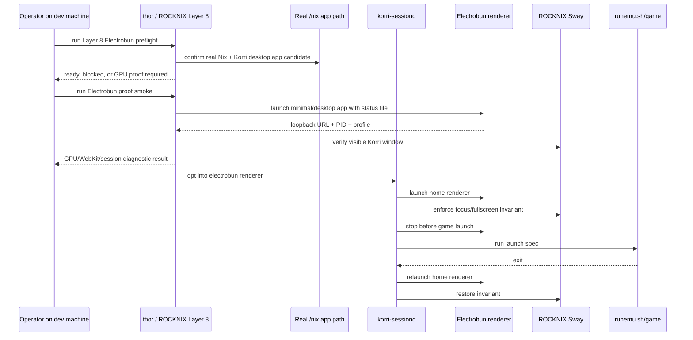
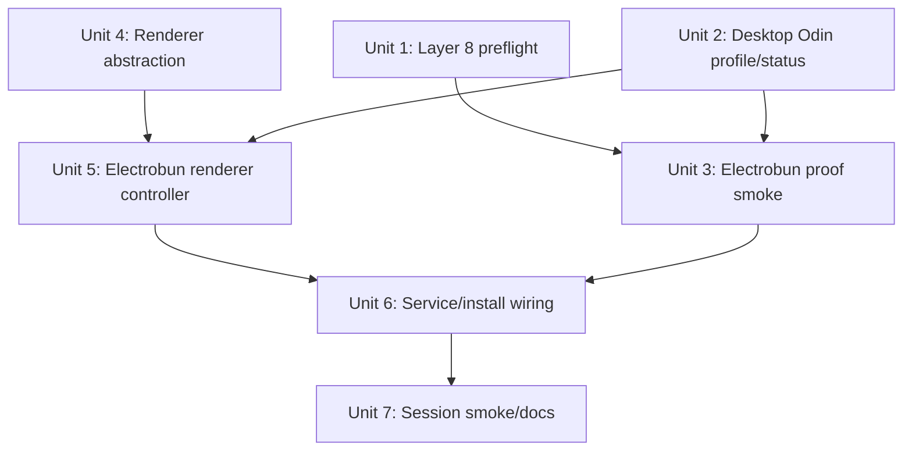
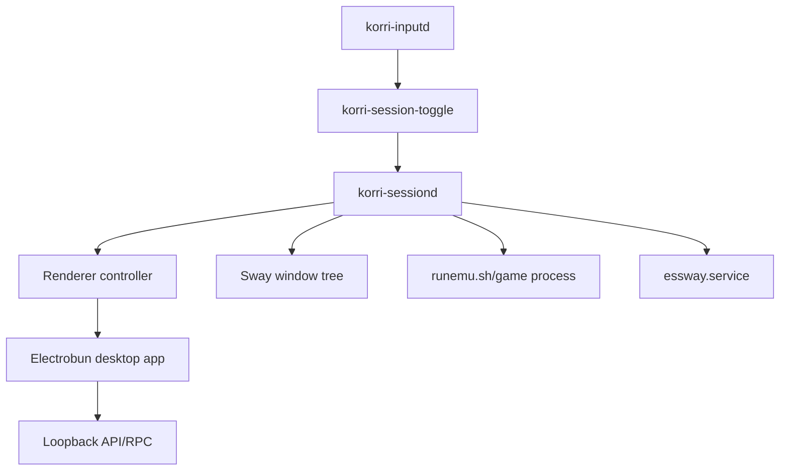

# feat: Promote Electrobun to a Layer 8 Odin renderer

**Target repos:** Primary implementation is in this Korri repo. ROCKNIX references are external prerequisites/adjacent-repo context; ROCKNIX paths are repo-relative to the ROCKNIX repo.

## Overview

Korri now has two important facts that change the Odin Electrobun strategy:

| Runtime substrate | What changed | Consequence for Korri |
|---|---|---|
| Old portable/proot Nix path | Required staged closures, `proot`, RPATH surgery, and conservative WebKit flags | Keep only as historical fallback/debug context; do not build new production work on it |
| ROCKNIX Layer 8 | Real `/nix`, standard Nix, Layer 7 app launchers, and optional daemon mode are validated on the device family | Treat Electrobun as a Nix-managed graphical app candidate instead of a relocated bundle |
| Korri Layer 3 sessiond | Chromium can already be supervised, restored after game exit, and kept fullscreen/focused | Reuse the session invariant; make the renderer swappable rather than inventing a second lifecycle |

This plan adds a Layer 8-aware Electrobun path for the Odin. The target is not merely "launch Electrobun." The target is a production-grade renderer candidate that uses real `/nix`, avoids the old portable/proot hacks, proves whether WebKitGTK can run with hardware acceleration under ROCKNIX Sway, and plugs into `korri-sessiond` behind the same game-launch/restore invariant that Chromium already uses.

Chromium remains the default production renderer until Electrobun passes the GPU acceptance gate on `thor`. Electrobun is introduced as an explicit opt-in renderer mode, with enough smoke coverage and diagnostics to distinguish Korri packaging failures from WebKitGTK/graphics-stack failures.

## Problem Frame

The earlier Odin Electrobun work proved that Korri's Electrobun bundle could open on the device, serve its loopback API, and render with WebKitGTK 2.44.3 when launched through a staged portable Nix store. It also proved that this was not good enough for the target experience: the working profile needed software-ish flags and felt less fluid than Chromium, while newer WebKitGTK builds hit EGL/DRI/GBM failures.

Layer 8 removes the most brittle substrate problem. Korri no longer has to pretend `/storage/.nix-portable/nix/store` is `/nix/store`; ROCKNIX can host real Nix and Nix-managed graphical apps. That means the next Electrobun attempt should be rebuilt around the Layer 7/8 model: install/launch the desktop package through real Nix, isolate app state under `/storage`, and let sessiond supervise it.

The remaining unknown is intentionally sharp: can the Nix-provided Electrobun/WebKitGTK runtime use ROCKNIX's Wayland/GPU stack well enough to replace Chromium? This plan makes that unknown testable without destabilizing the current Chromium path.

## Requirements Trace

- R1. Run Electrobun from a real Layer 8/Layer 7 Nix-managed app path; do not use `proot`, portable-store bind mounts, or staged closure relocation as the new supported path.
- R2. Preserve Korri's desktop loopback contract: the Electrobun app serves portal assets and `/api/*` from a same-origin loopback server.
- R3. Add an Odin/Electrobun runtime profile that is device-oriented but does not fork product UI, RPC contracts, or library behavior.
- R4. Prove a minimal Electrobun/WebKitGTK runtime before treating the full Korri app as supported.
- R5. Treat GPU acceleration as a hard acceptance gate: the supported Electrobun renderer must not rely on cairo rendering or WebKit compositing/DMABUF disabling flags.
- R6. Keep Chromium as the default sessiond renderer until Electrobun passes the device smoke and visual/performance acceptance checks.
- R7. Extend `korri-sessiond` so the renderer lifecycle is swappable while preserving the existing invariant: when no game is running, one Korri window is fullscreen, focused, and restored after game exit.
- R8. Keep the control API protected by the existing local capability token and avoid widening launch/control privileges.
- R9. Keep all ROCKNIX changes reversible and `/storage`-owned from Korri's side; do not mutate the immutable root or ROCKNIX-owned boot/session services beyond existing runtime `essway.service` masking.
- R10. Provide smoke diagnostics that clearly separate Nix substrate failure, Electrobun bundle failure, WebKit process failure, Sway window failure, and sessiond invariant failure.
- R11. Document the new Layer 8 Electrobun path and the fallback decision tree so future work does not reintroduce the old proot/RPATH path as production.

## Scope Boundaries

- **In scope:** Korri-side Layer 8 Electrobun preflight, Odin desktop profile/status reporting, renderer abstraction in sessiond, Electrobun renderer controller, opt-in installer/service wiring, smoke diagnostics, and documentation.
- **In scope:** Using `thor` as the validation target during implementation.
- **Out of scope:** Changing ROCKNIX's Layer 8 implementation, adding or repairing `nix-daemon`, or creating ROCKNIX build-system changes from this Korri plan.
- **Out of scope:** Making Electrobun the default renderer before GPU acceptance passes.
- **Out of scope:** Public installer UX, code signing, app updates, APK/Android packaging, or replacing EmulationStation at boot.
- **Out of scope:** Changing Korri product UI, RPC contracts, library source semantics, spatial navigation architecture, or emulator launch specs.

### Deferred to Separate Tasks

- If Nixpkgs WebKitGTK still cannot use ROCKNIX's GPU stack from real `/nix`, a separate ROCKNIX-side plan should package or patch a native WebKitGTK/WPE/Cog-compatible runtime. This Korri plan should record that failure, not paper over it with software-rendered flags.
- If Electrobun becomes the default after acceptance, a follow-up cleanup can remove obsolete Chromium-specific naming and deprecated portable/proot docs. This plan keeps compatibility while the renderer decision is still empirical.

## Context & Research

### Relevant Code and Patterns

- `nix/korri-desktop.nix` already packages the Electrobun desktop app for `aarch64-linux`, patches ELF artifacts, backfills the flat bundle, and wraps runtime libraries.
- `flake.nix` exposes `packages.aarch64-linux.korri-desktop` and `apps.aarch64-linux.korri-desktop`, with GTK/WebKitGTK runtime libraries in the package closure.
- `korri/deploy/desktop/main.ts` owns the Electrobun loopback server and window creation.
- `korri/deploy/desktop/window-options.ts` provides the existing place to add a device-oriented desktop/window profile.
- `tools/desktop/odin-desktop-preflight.ts` and `tools/desktop/odin-desktop-preflight.test.ts` already model Odin readiness checks and should evolve from portable-Nix assumptions to Layer 8 assumptions.
- `tools/odin/sessiond.ts`, `tools/odin/sessiond-state.ts`, `tools/odin/sessiond-chromium.ts`, and `tools/odin/sessiond-sway.ts` are the current Chromium-specific session supervisor seam.
- `scripts/odin/run-sessiond.sh` and `scripts/odin/install-sessiond-service.sh` install and configure sessiond, currently with Chromium-specific environment variables.
- `scripts/odin/smoke-sessiond.sh` and `tools/odin/sessiond-smoke.ts` already smoke the session invariant and can become renderer-aware.

### Institutional Learnings

- `docs/solutions/integration-issues/odin-electrobun-webkit-runtime-white-screen-2026-05-04.md` shows the old portable/proot path rendered only with conservative WebKit flags and that mixed Nix/ROCKNIX Mesa experiments were unstable.
- `docs/solutions/integration-issues/supervise-chromium-kiosk-session-after-game-exit-2026-05-04.md` establishes the sessiond invariant and why renderer launch/restore must be supervised rather than left to browser flags.
- `docs/solutions/integration-issues/runtime-mask-essway-to-stop-emulationstation-relaunching-during-odin-kiosk-sessions-2026-05-03.md` establishes runtime masking as the reversible EmulationStation interruption pattern.
- `docs/solutions/integration-issues/electrobun-linux-flat-bundle-2026-05-01.md` documents the required Electrobun bundle files that package/smoke checks must keep asserting.

### External / Adjacent Repo Context

- ROCKNIX Layer 7 documented a Nix-managed Chromium app launched through real `/nix`, isolated app state, and Sway-visible windows.
- ROCKNIX Layer 8 documented daemon mode as optional and explicitly gated. Korri should not require daemon mode for runtime unless the chosen install/build path does; Layer 4/7 real Nix app execution is the meaningful runtime dependency.
- Relevant ROCKNIX repo references: `docs/solutions/developer-experience/nix-layer-7-app-ui-experiments-rocknix-2026-05-05.md`, `docs/solutions/developer-experience/nix-layer-8-daemon-mode-rocknix-2026-05-05.md`, and `projects/ROCKNIX/packages/tools/nix-integration/scripts/nixctl`.

## Key Technical Decisions

| Decision | Rationale | Tradeoff |
|---|---|---|
| Use real `/nix` as the only supported new Electrobun substrate | Layer 8 removes the old store-path problem; continuing proot/RPATH work would preserve the worst failure mode | Devices without Layer 4+ Nix remain blocked for Electrobun and should use Chromium |
| Keep Chromium default while Electrobun is opt-in | Chromium has already passed the smooth GPU/session path; Electrobun still has a WebKitGTK GPU unknown | Installer/service wiring needs renderer mode switches during the transition |
| Generalize sessiond around a renderer controller instead of adding an Electrobun side daemon | The session invariant, token, game launch, and ES masking are renderer-agnostic; duplicating lifecycle code would increase recovery risk | Requires careful backwards-compatible refactor of Chromium-specific names/status |
| Add Electrobun status-file support in the desktop runtime | Electrobun binds an ephemeral loopback port; sessiond/smoke need a deterministic way to know the actual app URL | Adds small desktop runtime behavior, guarded by env so normal desktop stays unchanged |
| Make GPU acceptance fail closed | A software-rendered Electrobun path is known inferior to Chromium and should not become the production answer by accident | Implementation may end with a clear No-Go for Electrobun rather than a renderer switch |
| Separate proof smoke from sessiond integration smoke | Minimal WebKit failure should be diagnosable before sessiond/Sway/game-launch complexity is added | Adds one extra explicit validation surface |

## Open Questions

### Resolved During Planning

- **Should Korri use Layer 8 daemon mode directly?** Not as a runtime requirement. The important substrate is real `/nix` and Layer 7 app launching. Daemon mode may help installation/build workflows, but sessiond should launch a resolved app binary regardless of whether Nix was daemon-backed.
- **Should Electrobun replace Chromium immediately?** No. Chromium remains default until Electrobun passes accelerated WebKit and session restore acceptance on `thor`.
- **Should the old portable/proot path be kept as the implementation base?** No. It remains documented as a debugging artifact and fallback evidence, not a supported new path.
- **Should sessiond be duplicated for Electrobun?** No. Generalize the renderer lifecycle behind sessiond so launch/restore, token auth, and ES masking remain single-owner behavior.

### Deferred to Implementation

- The exact app binary path on `thor` after installing or building the Korri Electrobun package through Layer 8. The implementation should discover and configure it through preflight/status, not hard-code a developer-local path.
- Whether current Nixpkgs `webkitgtk_4_1` from this flake can pass the GPU acceptance gate on ROCKNIX. This is the central runtime discovery this plan is designed to expose.
- Whether an Electrobun window reports stable Sway identity through `app_id`, class, or title. The selector should be configurable and tightened after observing the real window tree.
- Whether dual-screen desktop work changes the Odin Electrobun profile. This plan should keep the single primary handheld surface first; dual-screen can layer on after the renderer works.

## Output Structure

```text
tools/desktop/
  odin-desktop-preflight.ts              # modified: Layer 8 readiness model
  odin-desktop-preflight.test.ts         # modified: Layer 8 scenarios

korri/deploy/desktop/
  main.ts                                # modified: status file/profile hook
  status-file.ts                         # new: desktop status writer
  status-file.test.ts                    # new
  window-options.ts                      # modified: Odin profile
  window-options.test.ts                 # modified

tools/odin/
  sessiond-renderer.ts                   # new: renderer lifecycle abstraction
  sessiond-renderer.test.ts              # new
  sessiond-electrobun.ts                 # new: Electrobun renderer controller
  sessiond-electrobun.test.ts            # new
  sessiond-service-config.ts             # new: renderer service env/config model
  sessiond-service-config.test.ts        # new
  electrobun-proof-smoke.ts              # new: minimal renderer proof evaluation
  electrobun-proof-smoke.test.ts         # new
  sessiond-smoke.ts                      # modified: renderer-aware invariant text
  sessiond-smoke.test.ts                 # modified

scripts/odin/
  run-sessiond.sh                        # modified: renderer env
  install-sessiond-service.sh            # modified: renderer config/status
  smoke-electrobun.sh                    # new: opt-in Electrobun proof smoke
  smoke-sessiond.sh                      # modified: renderer-aware smoke
```

## High-Level Technical Design

> *This illustrates the intended approach and is directional guidance for review, not implementation specification. The implementing agent should treat it as context, not code to reproduce.*



## Implementation Units



- [x] **Unit 1: Refresh Odin desktop preflight for Layer 8**

**Goal:** Replace stale portable/proot readiness assumptions with a Layer 8-aware readiness model that says whether `thor` can run Korri Electrobun as a real Nix-managed graphical app.

**Requirements:** R1, R5, R9, R10.

**Dependencies:** ROCKNIX Layer 4+/7+/8 is already available on the target device.

**Files:**
- Modify: `tools/desktop/odin-desktop-preflight.ts`
- Modify: `tools/desktop/odin-desktop-preflight.test.ts`
- Modify: `scripts/odin/desktop-preflight.sh`
- Modify: `justfile`

**Approach:**
- Reframe the preflight from "can this device host a staged Electrobun/Nix closure?" to "can this device launch a Nix-managed Korri desktop app candidate?".
- Treat a real `/nix` mount, a working Nix executable/profile, Sway session visibility, writable app state roots under `/storage`, and a resolvable or installable Korri Electrobun app candidate as the core readiness signals.
- Distinguish substrate readiness from launch readiness: a device can be Layer 8-ready but still need the Korri Electrobun app installed or built before renderer smoke can run.
- Report daemon mode separately as informational: useful if present, but not mandatory for launching an already-resolved Layer 7 app.
- Reject readiness when the only available path is portable/proot Nix; the recommendation should be to use Chromium or finish ROCKNIX Nix layers, not to stage closures manually.
- Keep the shell wrapper as a fact collector; classification stays pure and unit-tested.

**Execution note:** Update classifier tests before changing the shell wrapper so old portable-Nix assumptions cannot survive unnoticed.

**Patterns to follow:**
- `tools/desktop/electrobun-runtime-check.ts` for structured readiness reports and actionable recommendations.
- `tools/desktop/odin-desktop-preflight.ts` for existing report shape.
- ROCKNIX `nixctl status` output conventions from `projects/ROCKNIX/packages/tools/nix-integration/scripts/nixctl`.

**Test scenarios:**
- Happy path: real `/nix` is mounted, Nix exists, Sway is active, app state roots are writable, and a Korri desktop app binary resolves through `/nix/store` or the Nix profile -> report is launch-ready.
- Edge case: Layer 8 substrate is healthy but Korri desktop app is not installed yet -> report is substrate-ready and points to the install/build prerequisite rather than failing as a device blocker.
- Edge case: daemon mode is inactive but real Nix/profile app launching is available -> report is ready with informational daemon status.
- Error path: only `/storage/.nix-portable` is available -> report is blocked and explicitly rejects the old proot/staged-closure path.
- Error path: app binary resolves from `/usr`, `/bin`, or unrelated `/storage/bin` -> report is blocked because it is not a Layer 7 Nix app candidate.
- Error path: Sway session facts are missing -> report is blocked with recovery guidance to boot the normal ROCKNIX frontend session.
- Error path: app state root under `/storage` is not writable -> report is blocked before launch.

**Verification:**
- The preflight distinguishes Layer 8-ready, Chromium-fallback, and blocked states without modifying the device.

- [ ] **Unit 2: Add an Odin Electrobun desktop profile and status file**

**Goal:** Make the Electrobun desktop runtime observable and device-shaped without changing Korri product behavior.

**Requirements:** R2, R3, R10.

**Dependencies:** None.

**Files:**
- Modify: `korri/deploy/desktop/main.ts`
- Create: `korri/deploy/desktop/status-file.ts`
- Create: `korri/deploy/desktop/status-file.test.ts`
- Modify: `korri/deploy/desktop/window-options.ts`
- Modify: `korri/deploy/desktop/window-options.test.ts`
- Modify: `nix/korri-desktop.nix`
- Modify: `flake.nix`

**Approach:**
- Add an Odin desktop profile selected by environment. The profile should affect window shape/title/status behavior only; it must not choose different product routes, RPC handlers, or library layers.
- Add optional `KORRI_DESKTOP_STATUS_FILE` support that writes the bound loopback URL, PID, profile name, and timestamp after the server is ready.
- Add a Nix app/package alias for the Odin profile if needed so Layer 7 can install or resolve a clearly named app candidate without changing the default workstation package.
- Remove conservative WebKit flags from the Odin-profile supported path. If diagnostic fallbacks are needed, name them as diagnostics rather than defaulting them in the production wrapper.

**Patterns to follow:**
- `korri/deploy/desktop/main.ts` for loopback server lifecycle.
- `korri/deploy/desktop/window-options.ts` for bounded window option construction.
- `docs/solutions/integration-issues/electrobun-linux-flat-bundle-2026-05-01.md` for bundle completeness assertions.

**Test scenarios:**
- Happy path: default desktop profile -> existing window options and no-status behavior remain unchanged.
- Happy path: Odin profile -> window options use device-oriented title/window dimensions and hidden/chromeless intent while still loading the loopback URL.
- Happy path: status file env is set -> JSON contains URL, PID, profile, and timestamp after server bind.
- Edge case: status file env is absent -> no status file write is attempted.
- Error path: status file parent is unavailable or unwritable -> startup fails or reports the failure before smoke tooling can mistake it for a valid app.
- Integration: `korri-desktop` and any Odin alias still include the required Electrobun flat-bundle files.

**Verification:**
- Electrobun smoke tooling can discover the actual loopback URL through the status file instead of scraping logs or assuming a fixed port.

- [ ] **Unit 3: Add a minimal Electrobun/WebKit proof smoke**

**Goal:** Provide a narrow, opt-in smoke path that proves or rejects the real-Nix Electrobun/WebKit runtime before sessiond integration is blamed for failures.

**Requirements:** R4, R5, R10.

**Dependencies:** Unit 1 and Unit 2.

**Files:**
- Create: `tools/odin/electrobun-proof-smoke.ts`
- Create: `tools/odin/electrobun-proof-smoke.test.ts`
- Create: `scripts/odin/smoke-electrobun.sh`
- Modify: `justfile`

**Approach:**
- Evaluate a launched Electrobun candidate through observable facts: status file exists, loopback URL responds, `/api/health` responds, WebKit/native wrapper process survives long enough to load the page, and Sway reports a visible Korri window.
- Classify GPU acceptance separately from basic app liveness. Basic liveness may pass while GPU acceptance is still No-Go.
- Fail GPU acceptance if the launch environment uses known software/fallback flags such as cairo rendering or WebKit compositing/DMABUF disabling.
- Require positive acceptance evidence in addition to forbidden-flag checks: device-screen smoothness/chromeless observation and whatever implementation can reliably extract from WebKit/Sway logs without overfitting to one WebKit version.
- Keep this smoke opt-in and device-local. It should be safe to run on `thor`, but not part of default `just check`.

**Patterns to follow:**
- `tools/odin/sessiond-smoke.ts` for structured local-device smoke evaluation.
- `scripts/odin/smoke-sessiond.sh` for SSH wrapper style.
- `docs/solutions/integration-issues/odin-electrobun-webkit-runtime-white-screen-2026-05-04.md` for failure categories to distinguish.

**Test scenarios:**
- Happy path: status file, health endpoint, surviving WebKit process, visible Sway window, no forbidden GPU fallback flags, and positive device-screen/log evidence -> report is GPU-accepted.
- Edge case: health endpoint responds but no WebKit process/window exists -> report identifies a webview/rendering failure rather than API success.
- Error path: status file missing -> report identifies app startup/status failure.
- Error path: launch env includes forbidden GPU fallback flags -> report is liveness-only and GPU No-Go.
- Error path: Sway has a window but it is not focused/fullscreen-capable -> report identifies window-management failure.

**Verification:**
- A failure report points to one layer: Nix/app resolution, bundle/server, WebKit process, GPU acceptance, or Sway visibility.

- [ ] **Unit 4: Generalize sessiond around a renderer controller**

**Goal:** Make sessiond renderer-agnostic while preserving the current Chromium behavior and control API security.

**Requirements:** R6, R7, R8.

**Dependencies:** Existing sessiond implementation.

**Files:**
- Create: `tools/odin/sessiond-renderer.ts`
- Create: `tools/odin/sessiond-renderer.test.ts`
- Modify: `tools/odin/sessiond.ts`
- Modify: `tools/odin/sessiond.test.ts`
- Modify: `tools/odin/sessiond-chromium.ts`
- Modify: `tools/odin/sessiond-chromium.test.ts`
- Modify: `tools/odin/sessiond-state.ts`
- Modify: `tools/odin/sessiond-state.test.ts`

**Approach:**
- Introduce a small renderer controller contract with launch, stop, kind/name, and optional command/status metadata.
- Adapt the existing Chromium controller to that contract without changing its launch flags or profile normalization behavior.
- Rename status fields carefully or add backwards-compatible aliases so existing `chromiumPid` consumers do not break before service scripts are updated.
- Keep auth, launch-spec handling, ES masking, game launch, restore, and failure behavior unchanged.
- Keep home invariant logic renderer-neutral where possible, while allowing renderer-specific Sway selectors.

**Patterns to follow:**
- `tools/odin/sessiond-chromium.ts` for pure command construction and injected runners.
- `tools/odin/sessiond.test.ts` for service-manager/launcher injection.
- `tools/odin/sessiond-state.ts` for explicit mode transitions.

**Test scenarios:**
- Happy path: default renderer is Chromium and existing start/launch/restore/stop tests still pass.
- Happy path: injected non-Chromium renderer starts, stops before game launch, and relaunches after game exit.
- Error path: renderer launch fails during restore -> existing restore failure/recovering behavior still applies.
- Error path: unauthenticated requests remain rejected regardless of renderer kind.
- Integration: `/status` exposes renderer kind and PID/status without removing existing fields until callers are migrated.

**Verification:**
- Sessiond can run all existing Chromium lifecycle tests through the renderer abstraction with no regression in security or game-launch behavior.

- [ ] **Unit 5: Add the Electrobun renderer controller**

**Goal:** Let sessiond launch, stop, and identify Korri Electrobun as a supervised renderer candidate.

**Requirements:** R1, R3, R5, R7, R10.

**Dependencies:** Unit 2 and Unit 4.

**Files:**
- Create: `tools/odin/sessiond-electrobun.ts`
- Create: `tools/odin/sessiond-electrobun.test.ts`
- Modify: `tools/odin/sessiond-sway.ts`
- Modify: `tools/odin/sessiond-sway.test.ts`

**Approach:**
- Build an Electrobun command from environment/configuration: app binary path, status file path, state roots, desktop profile, Korri URL fallback, log path, and extra diagnostic args/env.
- Require the app binary to resolve from a Nix-managed origin according to the Unit 1 preflight model.
- Inject `KORRI_SESSIOND_URL` and token-file env into the Electrobun process so the bundled desktop API routes game launches back through sessiond instead of spawning games directly.
- Set state roots under `/storage` so Crashpad/WebKit/app state does not leak into unrelated profiles.
- Do not set the known GPU-disabling fallback flags in the supported launch profile. Allow a named diagnostic profile only if needed for failure reproduction.
- Extend Sway selector defaults or config handling so Electrobun windows can be discovered by title/class/app id after real observation.

**Patterns to follow:**
- `tools/odin/sessiond-chromium.ts` for command-building and testable process runner injection.
- ROCKNIX Layer 7 browser launcher guidance for isolated app state and binary-origin validation.
- `tools/odin/sessiond-sway.ts` for configurable selector patterns.

**Test scenarios:**
- Happy path: config with a Nix-origin app binary builds an Electrobun command with Odin profile, status file, isolated state roots, and sessiond launcher env.
- Edge case: optional diagnostic env is requested -> report/metadata marks the renderer diagnostic rather than production-ready.
- Error path: app binary is absent or non-Nix-origin -> controller refuses to launch.
- Error path: forbidden GPU fallback env appears in production profile -> controller refuses or marks GPU acceptance as failed.
- Happy path: stop by PID terminates only the supervised renderer process through the injected runner.
- Integration: Sway window discovery can identify an Electrobun Korri window using configured selector facts.

**Verification:**
- Sessiond can supervise Electrobun through the same renderer contract without weakening the Chromium path.

- [ ] **Unit 6: Wire renderer selection through Odin services and install scripts**

**Goal:** Make Electrobun selectable on `thor` without making it the default or breaking Chromium sessiond installs.

**Requirements:** R6, R8, R9, R10.

**Dependencies:** Unit 3 and Unit 5.

**Files:**
- Create: `tools/odin/sessiond-service-config.ts`
- Create: `tools/odin/sessiond-service-config.test.ts`
- Modify: `scripts/odin/run-sessiond.sh`
- Modify: `scripts/odin/install-sessiond-service.sh`
- Modify: `scripts/odin/install.sh`
- Modify: `scripts/odin/install-korri-toggle.sh`
- Modify: `scripts/odin/smoke-sessiond.sh`
- Modify: `justfile`

**Approach:**
- Add an explicit renderer mode environment variable, defaulting to Chromium.
- Put renderer service defaults and validation in a small pure config helper so shell scripts stay thin and testable.
- Thread renderer-specific paths and selectors through service installation without changing the token file or control endpoints.
- Surface status output that names the active renderer and the configured app binary/profile roots.
- Keep rollback renderer-neutral: stop sessiond, restore `essway.service`, and leave Layer 7 app/profile state intact unless a separate cleanup command is explicitly requested.
- Ensure toggle behavior remains identical from the user's perspective: it starts/stops Korri mode, while sessiond decides which renderer implements the home surface.

**Patterns to follow:**
- `scripts/odin/install-sessiond-service.sh` for persistent user-unit writing and rollback.
- `scripts/odin/run-sessiond.sh` for sourcing `$ODIN_PROJECT/.env` and exporting sessiond env.
- `scripts/odin/install-korri-toggle.sh` for token-protected control calls.

**Test scenarios:**
- Happy path: service config defaults to Chromium when no renderer mode is set.
- Happy path: Electrobun service config includes app binary, status file, state roots, and Sway selector env without changing token paths.
- Error path: unsupported renderer mode is rejected before service writing.
- Error path: Electrobun mode with missing app binary is rejected before service writing or session start.
- Integration: default install/start still configures Chromium.
- Integration: opt-in Electrobun install/start writes renderer env without changing token path or control API URL.
- Rollback: rollback restores ES and stops sessiond for either renderer mode.

**Verification:**
- Existing Chromium sessiond recipes still work by default, and Electrobun requires explicit opt-in configuration.

- [ ] **Unit 7: Update renderer-aware smoke coverage and documentation**

**Goal:** Make the new Layer 8 Electrobun path understandable, testable, and hard to confuse with the deprecated portable/proot path.

**Requirements:** R10, R11.

**Dependencies:** Units 1-6.

**Files:**
- Modify: `tools/odin/sessiond-smoke.ts`
- Modify: `tools/odin/sessiond-smoke.test.ts`
- Modify: `docs/development/odin-iterative-loop.md`
- Modify: `docs/solutions/integration-issues/odin-electrobun-webkit-runtime-white-screen-2026-05-04.md`

**Approach:**
- Make session smoke messages renderer-aware while preserving the same home invariant.
- Document the decision tree: Chromium production default; Electrobun Layer 8 opt-in; portable/proot path deprecated; ROCKNIX-native WebKitGTK plan required if GPU still fails.
- Capture the acceptance criteria in docs so a future software-rendered Electrobun launch is not mistaken for success.
- Update the existing white-screen solution with the planned Layer 8 direction. A new solution doc should be a separate explicit compounding step after implementation validates a meaningful new result.

**Patterns to follow:**
- `docs/development/odin-iterative-loop.md` for Level 2/Level 3 Odin operational docs.
- `docs/solutions/integration-issues/odin-electrobun-webkit-runtime-white-screen-2026-05-04.md` for evidence-driven failure documentation.
- `tools/odin/sessiond-smoke.ts` for invariant-based smoke checks.

**Test scenarios:**
- Happy path: smoke report for Chromium still says the home invariant holds.
- Happy path: smoke report for Electrobun says the renderer-specific home invariant holds when a matching focused/fullscreen window exists.
- Error path: smoke report identifies sessiond mode failure independently of renderer kind.
- Error path: smoke report identifies Sway invariant repair needs using renderer-neutral language.

**Verification:**
- Docs and smoke output make it clear whether Electrobun is production-ready, diagnostic-only, or blocked on the WebKit/graphics stack.

## System-Wide Impact



- **Interaction graph:** `korri-inputd` continues to trigger `korri-session-toggle`; `korri-sessiond` remains the owner of ES masking, renderer launch/stop, game launch, and restore; the renderer controller becomes the seam between Chromium and Electrobun.
- **Error propagation:** Renderer launch failures should return through sessiond control/status and logs, not through silent Sway failures. Proof smoke should classify failures before they are treated as product failures.
- **State lifecycle risks:** Electrobun/WebKit state, Crashpad state, status files, logs, and Nix profile app paths must stay isolated under `/storage` roots and not contaminate Chromium profiles. Electrobun is both renderer and desktop API process, so a launch request may intentionally kill the process that initiated the request after sessiond receives the launch spec; sessiond must own completion and restore independently.
- **API surface parity:** The launch RPC path remains unchanged; only `LauncherLayerLive`/sessiond integration decides whether the screen is restored through Chromium or Electrobun.
- **Integration coverage:** Unit tests cover command/status decisions; device smoke on `thor` is still required for GPU/WebKit/Sway truth.
- **Unchanged invariants:** The sessiond capability token, loopback-only control API, runtime ES masking pattern, and game launch sequencing remain unchanged.

## Dependencies / Prerequisites

- `thor` must be booted into the ROCKNIX image with Layer 4+/7+/8 Nix support healthy enough to resolve and launch Nix-managed apps.
- The Korri flake must be buildable or installable for `aarch64-linux` on or for the device.
- `korri-sessiond` Chromium mode should remain green before introducing Electrobun mode, so regressions can be isolated.
- Manual visual acceptance is required for toolbar/chromeless behavior and scroll fluidity; automated smoke cannot fully prove the perceived renderer quality.

## Risk Analysis & Mitigation

| Risk | Likelihood | Impact | Mitigation |
|---|---:|---:|---|
| Nixpkgs WebKitGTK still fails GPU/EGL/GBM on ROCKNIX | Medium | High | Add minimal proof smoke first; keep Chromium default; document a No-Go instead of enabling software fallback |
| Electrobun's bundled API is killed during a launch request | Medium | Medium | Route launches through sessiond before stopping the renderer; make sessiond own game completion and renderer restore without relying on the original HTTP caller surviving |
| Renderer abstraction breaks the known-good Chromium path | Medium | High | Refactor with existing Chromium tests first; keep backwards-compatible status fields during migration |
| Electrobun Sway identity differs from expectations | Medium | Medium | Make selectors configurable; observe on `thor` during implementation; keep smoke errors diagnostic |
| Service env makes Electrobun default prematurely | Low | High | Default renderer remains Chromium; Electrobun requires explicit env/config opt-in |
| Old proot/RPATH guidance gets reused as production | Medium | Medium | Update docs and preflight to reject portable/proot as supported new path |
| App state leaks into shared Chromium or root profiles | Low | Medium | Require isolated `/storage` state roots in controller and smoke checks |

## Alternative Approaches Considered

- **Keep using Chromium permanently:** Lowest risk and currently smooth, but leaves the Electrobun desktop package unvalidated on the now-capable Layer 8 substrate.
- **Revive the portable/proot Electrobun path:** Already known to render only under compromised flags and brittle library mixing; rejected as production direction.
- **Create a separate Electrobun daemon:** Avoids refactoring sessiond, but duplicates ES masking, token handling, game launch sequencing, and restore logic. Rejected in favor of a renderer controller seam.
- **Require ROCKNIX-native WebKitGTK before any Korri work:** May ultimately be necessary, but Korri can first prove whether real `/nix` fixes enough of the problem.

## Success Metrics

- Layer 8 preflight reports `thor` as ready only when the Electrobun candidate is real-Nix-backed and Sway/app-state prerequisites are satisfied.
- Electrobun proof smoke can distinguish API-only success from real WebKit window success.
- GPU acceptance fails if the old cairo/compositing-disabled flags are used.
- Chromium sessiond smoke remains passing after renderer abstraction.
- Electrobun sessiond mode can restore the Korri home renderer after a game exits in the same lifecycle model as Chromium.
- Documentation clearly states whether Electrobun is production-ready, diagnostic-only, or blocked on WebKit/graphics work.

## Documentation / Operational Notes

- Update `docs/development/odin-iterative-loop.md` to describe Chromium as the default Layer 3 production renderer and Electrobun as a Layer 8 opt-in renderer candidate.
- Keep the old white-screen solution as historical evidence; add/update docs only after the Layer 8 attempt produces new evidence.
- Service rollback should remain the operator safety net: stop sessiond, restore `essway.service`, and leave Nix/app state intact unless explicitly cleaned.
- The visual acceptance checklist for Electrobun must include no browser chrome, fullscreen/focus, scroll smoothness, and successful return after game exit.

## Sources & References

- Origin document: `docs/brainstorms/2026-04-30-electrobun-nix-native-build-requirements.md`
- Prior Odin Electrobun plan: `docs/plans/2026-05-03-001-feat-odin-electrobun-build-plan.md`
- Prior session supervisor plan: `docs/plans/2026-05-04-004-feat-odin-chromium-session-supervisor-plan.md`
- Related Korri solution: `docs/solutions/integration-issues/odin-electrobun-webkit-runtime-white-screen-2026-05-04.md`
- Related Korri solution: `docs/solutions/integration-issues/supervise-chromium-kiosk-session-after-game-exit-2026-05-04.md`
- Related Korri code: `tools/odin/sessiond.ts`
- Related Korri code: `tools/odin/sessiond-chromium.ts`
- Related Korri code: `korri/deploy/desktop/main.ts`
- Related Korri code: `nix/korri-desktop.nix`
- Related ROCKNIX doc: `docs/solutions/developer-experience/nix-layer-7-app-ui-experiments-rocknix-2026-05-05.md`
- Related ROCKNIX doc: `docs/solutions/developer-experience/nix-layer-8-daemon-mode-rocknix-2026-05-05.md`
