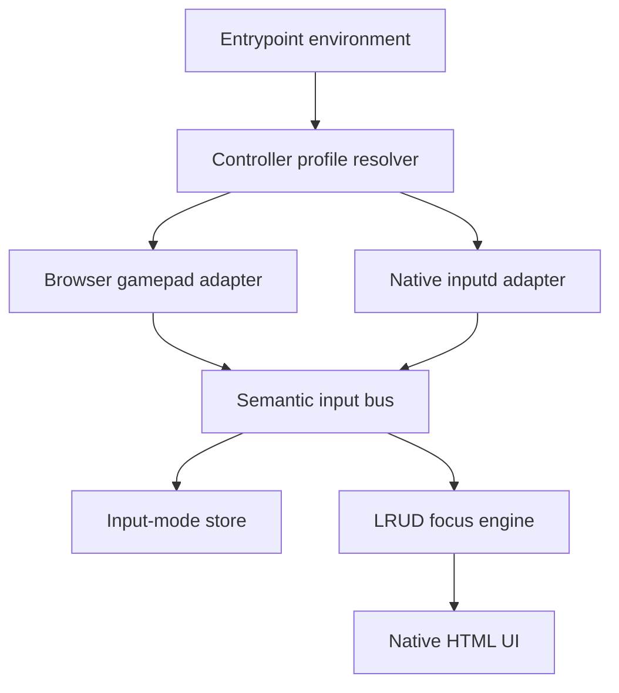

# refactor: Add controller input profiles

## Overview

Korri needs controller navigation to work in two legitimate environments:

| Environment | Controller backend | Keyboard nav | Pointer/wheel | Duplicate-controller risk |
|---|---|---|---|---|
| Dev machine / normal web | Browser Gamepad API via `navigator.getGamepads()` | Enabled | Enabled | Low if native bridge is absent |
| Odin / Electrobun | Native inputd WebSocket bridge | Enabled where present | Enabled where present | High if browser Gamepad API is also wired |
| Diagnostics | Explicitly selected native + web backends | Enabled | Enabled | Accepted only behind debug intent |

The plan is to keep the existing semantic input bus as the stable application contract and introduce a small controller-input profile layer that decides which controller backend(s) to attach. The app should default to browser gamepad on a dev machine, native inputd on the Odin when `VITE_KORRI_NATIVE_BRIDGE_URL` is present, and never run both controller backends unless a diagnostic profile explicitly asks for it.

## Problem Frame

The original native input bridge requirement explicitly called for coexistence: web `gamepad-adapter.ts` should remain useful for laptop/USB-controller development while the Odin uses native evdev input because ROCKNIX does not expose the controller through the web Gamepad API (see origin: `docs/brainstorms/2026-05-03-native-input-bridge-requirements.md`). During Odin stabilization, the portal and Storybook entrypoints were changed to disable the browser gamepad adapter unconditionally to avoid duplicate or noisy controller events on device. That solved the Odin path but regressed the dev-machine path: a normal browser session without inputd no longer has gamepad navigation.

The right model is not “delete web gamepad” or “always run both.” The right model is a single semantic controller concept with environment-specific backends selected at the composition root.

## Requirements Trace

- R1. Dev-machine web sessions without a native bridge must support browser Gamepad API controller navigation, while keeping keyboard, pointer, wheel, focus retention, and LRUD behavior unchanged.
- R2. Odin/Electrobun sessions with `VITE_KORRI_NATIVE_BRIDGE_URL` must use native inputd controller events and must not also wire browser Gamepad API by default.
- R3. A diagnostics-only mode may wire both native and web controller backends, but that mode must be explicit and visibly named so duplicate events are not accidental.
- R4. Product components, themes, and routes must continue to consume semantic `InputAction`s only; no component-level controller branching or navigation-library imports.
- R5. Existing low-level adapters remain independently testable: `gamepad` emits source `"gamepad"`, native emits source `"native"`, keyboard emits source `"keyboard"`.
- R6. Entrypoints should express intent in one place instead of coordinating separate `gamepad` and `native` booleans manually.
- R7. Tests must cover the controller profile matrix, including default web behavior, native URL behavior, explicit disabled behavior, and diagnostics/both behavior.

## Scope Boundaries

- No new semantic actions. This plan keeps `direction`, `confirm`, `back`, `options`, and `menu` unchanged.
- No changes to UI components or product route code. Components remain native HTML and unaware of input devices.
- No multi-controller arbitration. If multiple browser gamepads or native devices appear, existing adapter behavior remains the source of truth.
- No runtime probing fallback from native to web after connection failure in the default Odin profile. If a native bridge URL is configured, native is authoritative; reconnect behavior remains inside `native-adapter.ts`.
- No removal of browser Gamepad API support. The web adapter stays because it is the dev-machine backend.
- No cleanup of temporary native diagnostics in this plan unless the implementing agent chooses to do it as a separate follow-up. Diagnostics removal is related but not required for coexistence.

### Deferred to Separate Tasks

- Remove or gate temporary `/__korri/native-input-diagnostic` logging once controller profile coexistence is stable.
- Rename legacy `KORRI_INPUT_BRIDGE_*` environment variables to `KORRI_INPUTD_*` consistently after the profile model lands.
- Decide whether the old `tools/odin/input-bridge.ts` compatibility surface can be deleted after all scripts and docs point at inputd.

## Context & Research

### Relevant Code and Patterns

- `korri/shared/input/types.ts` defines the semantic `InputAction` contract and `InputSource` discriminator. This is the boundary that should stay stable.
- `korri/shared/input/gamepad-adapter.ts` maps browser Gamepad API state to semantic actions with source `"gamepad"` and remains the correct dev-machine backend.
- `korri/shared/input/native-adapter.ts` maps inputd WebSocket evdev frames to semantic actions with source `"native"` and remains the correct Odin backend.
- `korri/shared/navigation/start.ts` is the existing composition point for keyboard, gamepad, pointer, wheel, native, input-mode, focus engine, and focus retention. Profile selection belongs here or in a small helper called by this file.
- `korri/deploy/portal/main.tsx` and `korri/deploy/storybook/preview.tsx` currently disable `gamepad` unconditionally. They are the visible regression points for dev-machine controller navigation.
- `nix/korri-portal.nix` already injects `VITE_KORRI_NATIVE_BRIDGE_URL` for the Odin portal package, giving the profile resolver a reliable compile-time signal for native mode.
- `korri/shared/navigation/start.test.ts` already contains adapter wiring tests and is the natural home for integration-level profile assertions.

### Institutional Learnings

- `docs/solutions/best-practices/decoupled-spatial-navigation-2026-05-01.md`: input devices should be adapters behind a semantic bus; components must not import navigation libraries or device-specific hooks.
- `docs/brainstorms/2026-05-03-native-input-bridge-requirements.md`: the original native bridge scope explicitly preserved the web gamepad adapter for laptop-with-USB-controller dev and Storybook ergonomics.
- `docs/brainstorms/2026-05-01-pointer-aware-spatial-navigation-requirements.md`: input mode is last-input-wins and source-tag-driven; `keyboard`, `gamepad`, and `native` direction events all count as directional input.
- `docs/solutions/ui-bugs/spatial-focus-vacuum-retention-2026-05-04.md`: DOM focus remains the canonical active tile, so controller backend selection must not introduce parallel focus state.

### External References

- None. The repo already has direct local patterns for input adapters, environment-specific composition, and spatial-navigation wiring. External research would add little practical value.

## Key Technical Decisions

| Decision | Rationale |
|---|---|
| Add a controller profile layer instead of deleting or always enabling adapters | Preserves dev-machine web gamepad support while keeping Odin duplicate-free. |
| Default profile is `auto` | Normal dev sessions have no native bridge URL and should use web gamepad; Odin builds have a native bridge URL and should use native inputd. |
| Native URL means native is authoritative | If a session is built/configured for inputd, silently falling back to web gamepad can reintroduce duplicate or partial device behavior. |
| Keep `gamepad` and `native` as low-level adapter concepts | Existing tests and advanced callers can still disable or configure adapters directly while entrypoints use a higher-level profile. |
| Make `debug-both` explicit | Running both backends is valuable for diagnostics but dangerous as a default because both can emit the same semantic actions. |

## Open Questions

### Resolved During Planning

- Should browser Gamepad API support be removed? No. It is required for dev-machine controller navigation and was explicitly in scope in the native input bridge requirements.
- Should Odin and dev-machine behavior be modeled as separate app entrypoints? No. The behavior differs only at the controller backend selection layer; the semantic bus, focus engine, and UI should remain shared.
- Should keyboard navigation depend on the controller profile? No. Keyboard stays an independent adapter enabled by default unless tests or a specialized caller disable it.

### Deferred to Implementation

- Exact option names for the profile API: the plan names `auto`, `web`, `native`, and `debug-both` as the intended profile vocabulary, but the implementing agent can choose the final TypeScript shape that best fits `StartSpatialNavigationOptions`.
- Whether the profile resolver lives in `start.ts` or a separate helper file: prefer a separate pure helper if it keeps the matrix easy to test, but implementation can choose based on resulting simplicity.
- Whether entrypoint profile override comes from `VITE_KORRI_CONTROLLER_PROFILE` or a similarly named variable: implementation should pick the narrowest env surface and document it in code/tests.

## High-Level Technical Design

> *This illustrates the intended approach and is directional guidance for review, not implementation specification. The implementing agent should treat it as context, not code to reproduce.*

```text
                       startSpatialNavigation()
                                │
                                ▼
                    controller profile resolver
                                │
        ┌───────────────────────┼───────────────────────┐
        │                       │                       │
        ▼                       ▼                       ▼
   profile: web           profile: native       profile: debug-both
 browser gamepad          native inputd         browser + native
 source=gamepad           source=native         explicit diagnostics
        │                       │                       │
        └───────────────────────┴───────────────────────┘
                                │
                                ▼
                         semantic input bus
                                │
                  ┌─────────────┴─────────────┐
                  ▼                           ▼
          input-mode store               LRUD focus engine
```

Profile matrix:

| Inputs | Effective controller backend |
|---|---|
| No native URL, no override | Web gamepad |
| Native URL, no override | Native inputd |
| Override `web` | Web gamepad, even if native URL exists |
| Override `native` without URL | No controller backend and a diagnostic warning or test-visible no-op |
| Override `debug-both` with URL | Web gamepad + native inputd |
| Controller disabled | Neither web nor native controller backend |

## Implementation Units

- [ ] **Unit 1: Introduce a pure controller profile resolver**

**Goal:** Define the controller backend selection matrix independently of DOM, WebSocket, LRUD, and adapter lifecycle code.

**Requirements:** R1, R2, R3, R6, R7

**Dependencies:** None

**Files:**
- Create or modify: `korri/shared/navigation/controller-profile.ts`
- Test: `korri/shared/navigation/controller-profile.test.ts`

**Approach:**
- Model controller selection as a small pure decision: configured profile + optional native bridge URL -> adapter plan.
- Include at least these profile outcomes: web-only, native-only, both/debug, disabled.
- Keep this resolver free of browser globals so tests can exercise the full matrix without installing fake `navigator` or `WebSocket`.
- Prefer explicit names over clever inference. `debug-both` should look unsafe/diagnostic by name.

**Patterns to follow:**
- `korri/shared/navigation/input-mode.ts` for small navigation-owned state/helper modules.
- `korri/shared/navigation/start.test.ts` for matrix-style behavior assertions.

**Test scenarios:**
- Happy path: no native URL and default/auto profile -> resolver returns web gamepad only.
- Happy path: native URL and default/auto profile -> resolver returns native only with that URL.
- Happy path: explicit web profile with native URL -> resolver returns web only.
- Happy path: explicit debug-both profile with native URL -> resolver returns web and native.
- Edge case: controller disabled -> resolver returns no controller adapters regardless of native URL.
- Error path: explicit native profile without URL -> resolver returns no native adapter plus a warning/no-op signal rather than constructing an invalid native adapter.

**Verification:**
- The resolver documents the intended environment matrix and all branches are covered by unit tests.

- [ ] **Unit 2: Wire controller profiles into spatial navigation startup**

**Goal:** Let `startSpatialNavigation()` attach controller adapters through one high-level controller decision while preserving keyboard, pointer, wheel, input-mode, diagnostics, and focus-retention behavior.

**Requirements:** R1, R2, R3, R4, R5, R6, R7

**Dependencies:** Unit 1

**Files:**
- Modify: `korri/shared/navigation/start.ts`
- Test: `korri/shared/navigation/start.test.ts`

**Approach:**
- Add a high-level controller option to `StartSpatialNavigationOptions` that uses the resolver from Unit 1.
- Preserve existing low-level escape hatches only if they remain simple; the important outcome is that entrypoints no longer manually coordinate separate `gamepad` and `native` booleans.
- Ensure the default behavior restores dev-machine web gamepad when no native bridge URL/profile is provided.
- Ensure native mode attaches `createNativeInputAdapter()` and does not attach `createGamepadAdapter()`.
- Ensure debug-both mode attaches both adapters and remains opt-in.
- Keep input-mode dispatch unchanged: source `"gamepad"` and source `"native"` direction actions both set directional mode.

**Patterns to follow:**
- Existing adapter wiring in `korri/shared/navigation/start.ts`.
- Existing native adapter wiring tests in `korri/shared/navigation/start.test.ts`.

**Test scenarios:**
- Happy path: default startup with no native bridge config attaches browser gamepad, keyboard, pointer, and wheel.
- Happy path: startup with native bridge config attaches native and not browser gamepad.
- Happy path: explicit disabled controller profile attaches neither native nor browser gamepad while keyboard remains enabled.
- Happy path: debug-both attaches both native and browser gamepad.
- Integration: source `"gamepad"` and source `"native"` direction actions still both flip `data-input-mode` to `directional`.
- Regression: focus retention still installs/disposes exactly once and is not affected by controller profile selection.

**Verification:**
- `startSpatialNavigation()` has one controller selection path and tests prove the adapter lifecycle matrix.

- [ ] **Unit 3: Restore dev-machine controller behavior in app entrypoints**

**Goal:** Update runtime composition roots so normal dev-web and Storybook use web gamepad by default, while Odin/Electrobun uses native inputd when a native bridge URL is configured.

**Requirements:** R1, R2, R3, R6

**Dependencies:** Unit 2

**Files:**
- Modify: `korri/deploy/portal/main.tsx`
- Modify: `korri/deploy/storybook/preview.tsx`
- Modify if needed: `nix/korri-portal.nix`
- Test: `korri/shared/navigation/start.test.ts` or a focused entrypoint/config test if one already exists or is easy to add

**Approach:**
- Replace unconditional `gamepad: false` with the new controller profile configuration.
- Let portal default to `auto`: no `VITE_KORRI_NATIVE_BRIDGE_URL` means web gamepad; a bridge URL means native inputd.
- Let Storybook default to web gamepad unless `window.__korriStorybookNativeBridgeUrl` or an explicit debug profile is present.
- Keep the Odin Nix portal package injecting `VITE_KORRI_NATIVE_BRIDGE_URL=ws://127.0.0.1:3002`, so Odin remains native-only by default.
- Add an explicit diagnostic override only if needed; do not make both-backend mode reachable accidentally.

**Patterns to follow:**
- Current environment read in `korri/deploy/portal/main.tsx`.
- Storybook global handle lifecycle in `korri/deploy/storybook/preview.tsx`.
- Existing native bridge URL injection in `nix/korri-portal.nix`.

**Test scenarios:**
- Happy path: portal config without native bridge URL produces web controller backend.
- Happy path: portal config with native bridge URL produces native controller backend only.
- Happy path: Storybook without native bridge URL produces web controller backend.
- Edge case: Storybook with native bridge URL uses native controller backend only unless debug-both is explicitly configured.
- Regression: keyboard, pointer, wheel, diagnostics, and focus retention remain enabled by default in portal and Storybook.

**Verification:**
- A dev-machine browser session has controller navigation again without requiring inputd.
- An Odin portal build still connects to `ws://127.0.0.1:3002` and does not wire browser gamepad by default.

- [ ] **Unit 4: Preserve and clarify adapter-level tests**

**Goal:** Keep browser and native controller adapters independently tested so profile selection only decides which backend starts, not how each backend maps input.

**Requirements:** R5, R7

**Dependencies:** Unit 2

**Files:**
- Modify if needed: `korri/shared/input/gamepad-adapter.test.ts`
- Modify if needed: `korri/shared/input/native-adapter.test.ts`
- Modify if needed: `korri/shared/input/gamepad-adapter.ts`
- Modify if needed: `korri/shared/input/native-adapter.ts`

**Approach:**
- Avoid changing semantic mappings unless tests reveal a profile-related coupling.
- Keep browser Gamepad API tests focused on `source: "gamepad"`, d-pad, stick, buttons, repeat, and non-standard hat axes.
- Keep native adapter tests focused on `source: "native"`, evdev key/axis mapping, reconnect, stale release, and button mappings.
- If the profile work introduces shared configuration defaults, assert that adapter-specific defaults remain unchanged.

**Patterns to follow:**
- Existing test style in `korri/shared/input/gamepad-adapter.test.ts` and `korri/shared/input/native-adapter.test.ts`.

**Test scenarios:**
- Regression: web gamepad d-pad/stick directions still emit source `"gamepad"`.
- Regression: native d-pad/stick directions still emit source `"native"`.
- Regression: browser adapter remains a no-op when `navigator.getGamepads` is absent.
- Regression: native adapter remains a no-op/reconnect path when WebSocket is absent or unavailable, according to existing behavior.

**Verification:**
- Adapter behavior remains stable while controller-profile tests cover backend selection.

- [ ] **Unit 5: Document the environment model near the wiring**

**Goal:** Make the coexistence model obvious to future maintainers so a device-specific fix does not again disable dev-machine controller navigation globally.

**Requirements:** R1, R2, R3, R4, R6

**Dependencies:** Units 1-3

**Files:**
- Modify: `korri/shared/navigation/start.ts`
- Modify: `korri/deploy/portal/main.tsx`
- Modify: `korri/deploy/storybook/preview.tsx`
- Optional modify: `docs/solutions/best-practices/decoupled-spatial-navigation-2026-05-01.md`

**Approach:**
- Add concise comments where the profile is selected, not broad new documentation.
- If updating the solution doc, add a short “controller backend profiles” note explaining web/dev, native/Odin, and explicit debug-both.
- Avoid creating a new standalone report; the plan and in-code comments are enough unless implementation reveals a reusable gotcha worth documenting.

**Patterns to follow:**
- Existing short architecture comments in `korri/shared/navigation/start.ts` and entrypoints.
- Existing solution-doc style in `docs/solutions/best-practices/decoupled-spatial-navigation-2026-05-01.md` if a doc update is warranted.

**Test scenarios:**
- Test expectation: none -- this unit is explanatory documentation/comments only; behavior is covered by Units 1-4.

**Verification:**
- A reader can identify the default dev-machine and Odin controller paths from the startup code without tracing both adapter implementations.

## System-Wide Impact



- **Interaction graph:** The affected surfaces are entrypoint environment/config, `startSpatialNavigation()` adapter startup, browser gamepad adapter lifecycle, native adapter lifecycle, input-mode source dispatch, and LRUD focus movement.
- **Error propagation:** Invalid or unavailable native configuration should fail closed for native controller startup without breaking keyboard/pointer/wheel navigation. Existing native reconnect warnings should remain adapter-local.
- **State lifecycle risks:** Running both controller backends accidentally can duplicate held-direction repeats. The profile model mitigates this by making both-backend mode explicit and non-default.
- **API surface parity:** Dev-machine web, Storybook, and Odin/Electrobun should all reach the same semantic bus and focus engine. Only controller backend selection differs.
- **Integration coverage:** Unit tests should prove the adapter selection matrix; Storybook/dev manual verification should prove a real browser gamepad navigates again.
- **Unchanged invariants:** Product code continues to use `useInputAction`/semantic actions. Components remain native HTML. Keyboard, pointer, wheel, input-mode, and focus-retention semantics do not change.

## Risks & Dependencies

| Risk | Mitigation |
|------|------------|
| Duplicate controller actions on Odin | Native bridge URL + auto profile selects native only; debug-both is explicit. |
| Dev-machine controller remains disabled because entrypoints keep `gamepad: false` | Unit 3 removes unconditional disabling and covers portal/Storybook defaults. |
| API becomes confusing with both low-level `gamepad`/`native` and high-level controller profile options | Prefer one documented high-level path for entrypoints; keep low-level options only as test/advanced escape hatches if they remain simple. |
| Native URL configured on a non-Odin dev session disables web gamepad unexpectedly | This is intentional for `auto`; allow explicit web profile override for that diagnostic case. |
| Storybook HMR duplicates adapter listeners | Preserve existing `window.__korriSpatialNav?.dispose()` lifecycle before restarting navigation. |

## Documentation / Operational Notes

- The Odin Nix package should continue to inject `VITE_KORRI_NATIVE_BRIDGE_URL=ws://127.0.0.1:3002`; that is the production signal for native controller input.
- Local dev should not require inputd. A normal `just dev-web` session should use browser gamepad if the browser exposes one.
- If a diagnostic session needs to compare browser Gamepad API and native inputd side-by-side, it should opt into the explicit debug-both profile and expect duplicate semantic actions.

## Sources & References

- **Origin document:** [docs/brainstorms/2026-05-03-native-input-bridge-requirements.md](../brainstorms/2026-05-03-native-input-bridge-requirements.md)
- Related requirements: [docs/brainstorms/2026-05-01-pointer-aware-spatial-navigation-requirements.md](../brainstorms/2026-05-01-pointer-aware-spatial-navigation-requirements.md)
- Related architecture: [docs/solutions/best-practices/decoupled-spatial-navigation-2026-05-01.md](../solutions/best-practices/decoupled-spatial-navigation-2026-05-01.md)
- Related focus invariant: [docs/solutions/ui-bugs/spatial-focus-vacuum-retention-2026-05-04.md](../solutions/ui-bugs/spatial-focus-vacuum-retention-2026-05-04.md)
- Related code: `korri/shared/navigation/start.ts`
- Related code: `korri/shared/input/gamepad-adapter.ts`
- Related code: `korri/shared/input/native-adapter.ts`
- Related code: `korri/deploy/portal/main.tsx`
- Related code: `korri/deploy/storybook/preview.tsx`
