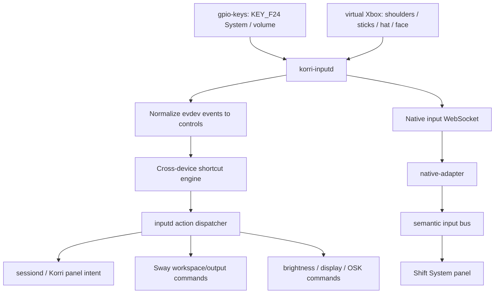
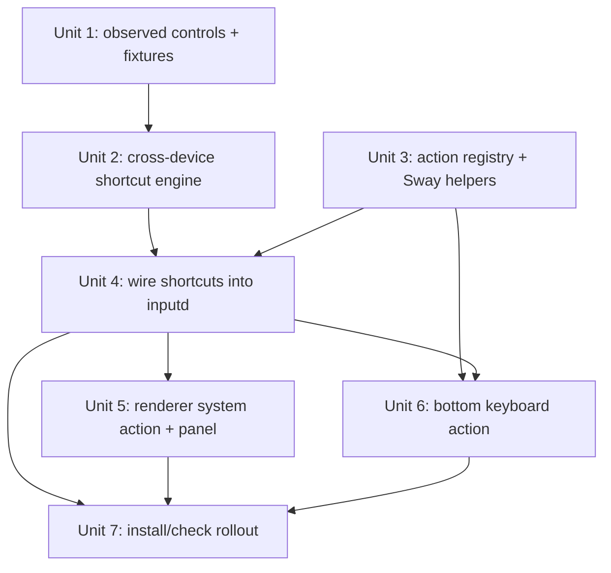
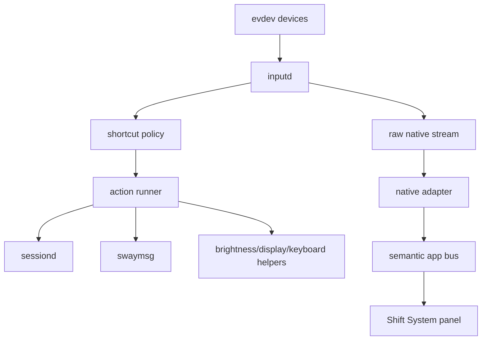

# feat: Add Odin System shortcut map

## Overview

Implement the Odin shortcut map around the physical **System** button: the AYN-labeled hardware button observed as `KEY_F24` / code `194` on the `gpio-keys` input device. The new map should keep existing proven lifecycle chords, replace the old kill/restart chord with `System + L1 + R1`, add Sway workspace/output controls, route brightness through `System + Volume Up/Down`, keep display switching on `System + Back`, and introduce a `System + X` hook for a bottom-screen on-screen keyboard.

The major technical shift is that shortcuts can no longer be represented as same-device gamepad button chords. `System` is emitted by `gpio-keys`, while gamepad shoulders, face buttons, sticks, and D-pad hat axes arrive through InputPlumber's virtual Xbox controller. Korri inputd therefore needs a normalized, cross-device shortcut layer above raw evdev parsing and below action dispatch.

## Problem Frame

Korri now owns Odin input policy through `korri-inputd`, and the session toggle path has been stabilized with Electrobun as the `sessiond` renderer. The remaining shortcut model still reflects the bridge era: destructive actions are gamepad-only chords, non-gamepad hardware keys are immediate one-key actions, and the app has no explicit semantic action for the physical AYN/System button.

Recent device probing established the important hardware distinction:

| Physical button | Observed source | Linux code | Intended semantic role |
|---|---|---:|---|
| AYN-labeled button | `gpio-keys` | `KEY_F24` / `194` | `System` modifier and tap action |
| Home/Guide button | virtual Xbox controller | `BTN_MODE` / `316` | Home/Guide/Menu, not the System modifier |

The requested user model is:

| Task | Shortcut |
|---|---|
| Open Korri system overlay / control panel | `System` |
| Toggle ES ↔ Korri | `L3 + R3 + Start` |
| Kill focused app / restart Korri | `System + L1 + R1` |
| Brightness up | `System + Volume Up` |
| Brightness down | `System + Volume Down` |
| Workspace previous | `System + D-pad Left` |
| Workspace next | `System + D-pad Right` |
| Send focused window to screen above | `System + D-pad Up` |
| Send focused window to screen below | `System + D-pad Down` |
| Display switch / external display toggle | `System + Back` |
| Toggle bottom-screen keyboard | `System + X` |

Volume keys alone should continue to behave as normal volume controls. The `System + Volume` chords layer brightness on top of the existing hardware volume buttons rather than deleting standalone volume behavior.

## Requirements Trace

- R1. Normalize the physical AYN button as `System` using the observed `KEY_F24` / `194` event, while keeping Home/Guide (`BTN_MODE` / `316`) separate.
- R2. Support cross-device shortcuts where `System` comes from `gpio-keys` and the paired controls come from gamepad, hat-axis, or other system-key devices.
- R3. Support tap-vs-chord semantics: a plain `System` press opens the Korri system panel only if no `System + ...` chord consumed that press.
- R4. Keep `L3 + R3 + Start` as the ES ↔ Korri session toggle.
- R5. Replace `L1 + R1 + Select + Start` as the primary kill/restart shortcut with `System + L1 + R1`; focused Korri restarts through `sessiond`, other focused windows use the existing focused-window PID policy.
- R6. Map `System + Volume Up/Down` to brightness up/down while preserving normal volume up/down behavior for the volume keys alone.
- R7. Map `System + D-pad Left/Right` to Sway workspace previous/next.
- R8. Map `System + D-pad Up/Down` to moving the focused Sway container to the output above/below.
- R9. Map `System + Back` to the existing display switch / external display toggle action.
- R10. Map `System + X` to a bottom-screen on-screen-keyboard toggle, with runtime fallback/no-op behavior when no supported keyboard tool is installed.
- R11. Preserve the renderer native input stream contract for existing app navigation: gamepad raw events continue to broadcast to subscribed renderer clients.
- R12. Keep product and theme components device-agnostic: React code subscribes to semantic actions via `useInputAction`, not raw evdev codes or inputd internals.
- R13. Keep Odin changes reversible and `/storage`-owned; do not require ROCKNIX root filesystem changes.

## Scope Boundaries

- Do not implement sleep, suspend, screenshot, mute/unmute, or direct volume shortcut combos.
- Do not disable native analog stick or D-pad passthrough to emulators.
- Do not grab evdev devices exclusively in this plan; shortcuts are observed by Korri inputd, not swallowed from foreground emulators.
- Do not change the session toggle chord or sessiond's ES ↔ Korri lifecycle model.
- Do not change the focused-window PID-only policy for non-Korri kill/restart targets in this plan.
- Do not build a full settings application. The System panel can start as a focused Korri control surface with minimal status/actions and grow later.

### Deferred to Separate Tasks

- Steam-specific root-process killing: Steam respawns `steamwebhelper` when only the focused helper PID is killed. That policy is intentionally separate from this shortcut-map implementation.
- Full emulator input swallowing/grabbing: avoiding D-pad/shoulder passthrough into emulators requires a larger input ownership decision.
- Rich bottom-screen keyboard placement polish: this plan adds the action seam and first viable output targeting; detailed keyboard UX can iterate once the installed OSK tool is known.

## Context & Research

### Relevant Code and Patterns

- `tools/odin/inputd.ts` currently owns evdev reading, WebSocket broadcasting, per-device chord matching, and system-key action dispatch.
- `korri/shared/input/native/chord-engine.ts` currently tracks chords per device and only handles key events. It is the pattern for pure shortcut logic but is too narrow for `System + gamepad` cross-device shortcuts.
- `korri/shared/input/native/button-codes.ts` centralizes Linux input codes for gamepad and system keys. It needs constants for `KEY_SYSTEM` / `KEY_F24` and any verified Back/display-switch controls.
- `tools/odin/inputd-actions.ts` centralizes daemon-side side effects and already supports injectable commands for deterministic tests.
- `scripts/odin/install-korri-toggle.sh` installs `/storage/bin/korri-session-toggle`, `/storage/bin/korri-kill-active-application`, and Electrobun control helpers. It is the current place where `/storage/bin` action helpers are deployed.
- `tools/odin/sessiond-sway.ts` demonstrates pure Sway command construction and runner injection. New workspace/output actions should follow this style rather than embedding ad hoc `swaymsg` strings throughout inputd.
- `korri/shared/input/native-adapter.ts` maps native input frames to semantic `InputAction`s. It is the right renderer-side seam for a new `system` semantic action when Korri is already connected to inputd.
- `korri/shared/navigation/use-input-action.ts` is the route/theme-safe subscription API for semantic app actions.
- `korri/shared/themes/shift/organisms/ShiftLabsPanel.tsx` and `ShiftHome.context.tsx` show the existing Shift modal/context pattern. The System panel should follow the same compound/context model without importing product-specific device code into shared theme layers.
- `docs/plans/2026-05-04-002-refactor-korri-input-daemon-plan.md` established inputd as the single device input policy owner.
- `docs/plans/2026-05-05-002-refactor-controller-input-profiles-plan.md` established native inputd as Odin's controller backend while preserving browser Gamepad API for dev machines.

### Institutional Learnings

- `docs/solutions/best-practices/decoupled-spatial-navigation-2026-05-01.md`: components stay native and subscribe to semantic input; raw device specifics belong in adapters/inputd.
- `docs/solutions/ui-bugs/spatial-focus-vacuum-retention-2026-05-04.md`: DOM focus remains the canonical active target; shortcut overlays must not create parallel focus state that fights LRUD/focus retention.
- `docs/development/standards.md`: tests use real implementations with deterministic configuration, not mock classes. This shapes action-runner and Sway-runner test seams.

### External References

- External research is intentionally skipped. The needed contracts are local and device-observed: Linux evdev codes, existing Korri inputd/sessiond code, Sway command behavior already used in the repo, and the current Odin ROCKNIX runtime.

## Key Technical Decisions

| Decision | Rationale |
|---|---|
| Treat `KEY_F24` as the normalized `System` control | It is the observed physical AYN button and avoids coupling UI semantics to the AYN brand name. |
| Keep Home/Guide as `menu`, not `system` | `BTN_MODE` / `316` is a controller Guide/Home button and should remain distinct from the AYN hardware modifier. |
| Add a normalized cross-device shortcut layer | Required because System and gamepad controls are emitted by different event devices. |
| Fire plain `System` on release when unconsumed | Avoids opening the panel when the user intended `System + D-pad`, `System + Volume`, or another chord. |
| Keep raw input broadcasting unchanged, add daemon policy events only where needed | Renderer navigation consumers still receive raw native input frames; Korri-owned System tap can also become a semantic app action. |
| Use Sway helpers for workspace/output actions | Keeps command construction testable and avoids scattering shell snippets in inputd. |
| Make the OSK action command-driven and fallback-safe | The exact keyboard tool available on ROCKNIX may vary; the shortcut should no-op with diagnostics rather than break inputd. |

## Open Questions

### Resolved During Planning

- **Can we distinguish AYN/System from Home/Guide?** Yes. AYN/System emits `KEY_F24` / `194` from `gpio-keys`; Home/Guide emits `BTN_MODE` / `316` from the virtual Xbox controller.
- **Should `System` be a vendor-specific app semantic named `ayn`?** No. Normalize to `system` so app code stays device-neutral.
- **Should brightness stay on D-pad?** No. Brightness belongs on `System + Volume Up/Down`, freeing D-pad for Sway workspace/output controls.
- **Should return-to-Korri and performance overlay stay as separate combos?** No. They collapse into the plain `System` control panel entry point.
- **Should kill/restart remain `L1 + R1 + Select + Start`?** No. Replace the primary shortcut with `System + L1 + R1` while keeping any temporary legacy chord only as an optional transition aid if implementation needs it.

### Deferred to Implementation

- **Exact Back/display-switch physical code:** The plan names `System + Back`, but implementation must verify whether the physical Back/display button arrives as `BTN_BACK`, `KEY_RECORD`, or another code on this Odin profile and then encode that in fixtures/tests.
- **Exact Volume Down source:** `KEY_VOLUMEUP` and `KEY_F24` were observed on `gpio-keys`; implementation should verify and fixture the Volume Down source before finalizing `System + Volume Down`.
- **Exact OSK tool:** Implementation should detect or configure the keyboard command at runtime. Candidate support should be command-driven rather than assumed in code.
- **First-press panel opening while Korri is not running:** To satisfy the merged “return to Korri + system panel” intent, inputd should be prepared to retain one pending `system-panel` intent until a renderer subscriber connects. Exact transport shape is implementation-owned but must be covered by tests.

## Output Structure

```text
korri/shared/input/native/
  button-codes.ts
  system-shortcut-engine.ts
  system-shortcut-engine.test.ts
  wire-schema.ts

tools/odin/
  inputd.ts
  inputd.test.ts
  inputd-actions.ts
  inputd-actions.test.ts
  sway-actions.ts
  sway-actions.test.ts
  bottom-keyboard.ts
  bottom-keyboard.test.ts

korri/shared/input/
  types.ts
  native-adapter.ts
  native-adapter.test.ts

korri/shared/themes/shift/organisms/
  ShiftSystemPanel.tsx
  ShiftSystemPanel.test.tsx

korri/shared/themes/shift/pages/
  ShiftHomeReadyBody.tsx
  ShiftHomePage.story.e2e.ts

scripts/odin/
  install-korri-toggle.sh
  install-inputd-service.sh
```

This tree shows the expected shape. The implementing agent may adjust file splits if a smaller local change preserves the same boundaries: pure shortcut logic in shared native input code, Odin side effects in `tools/odin/`, renderer semantics in shared input/navigation, and Shift UI in shared theme components.

## High-Level Technical Design

> *This illustrates the intended approach and is directional guidance for review, not implementation specification. The implementing agent should treat it as context, not code to reproduce.*



Shortcut dependency graph:



## Implementation Units

- [x] **Unit 1: Normalize observed Odin controls and fixtures**

**Goal:** Capture the physical controls used by the shortcut map as named constants and deterministic fixtures, including System, Home/Guide, volume, D-pad hat axes, shoulders, X, and Back/display-switch candidates.

**Requirements:** R1, R6, R9, R10

**Dependencies:** None

**Files:**
- Modify: `korri/shared/input/native/button-codes.ts`
- Modify: `korri/shared/input/native/discover-devices.ts`
- Test: `tools/odin/inputd.test.ts`
- Test fixture: `tools/testing/fixtures/proc/bus-input-devices-odin.txt`

**Approach:**
- Add a named constant for the normalized System button (`KEY_SYSTEM` mapped to Linux `KEY_F24` / `194`) and keep `BTN_MODE` as a separate Home/Guide constant.
- Add a narrow native input device class for `system` policy devices and classify the Odin `gpio-keys` device there when it exposes `KEY_F24`, volume, power, lid, or similar hardware controls. This is preferable to treating `gpio-keys` as a broad keyboard because the renderer can subscribe to System hardware without receiving unrelated keyboard-class input.
- Extend the Odin proc fixture to include the observed `gpio-keys` capabilities and the current virtual Xbox capabilities rather than relying only on older virtual-controller fixtures.
- Add explicit fixture coverage for the physical Back/display-switch source after implementation verifies the code.
- Keep constants named by semantic role where the Linux name is misleading: `KEY_SYSTEM` can alias `KEY_F24`; comments can record the Odin observation.

**Patterns to follow:**
- `korri/shared/input/native/button-codes.ts` for named Linux code constants.
- `korri/shared/input/native/discover-devices.ts` for capability-driven device classification.
- `tools/odin/inputd.test.ts` fixture-based tests for Odin-specific discovery behavior.

**Test scenarios:**
- Happy path: parsing an Odin proc fixture with `gpio-keys` exposes a device inputd can open for policy events.
- Happy path: the System control uses `KEY_F24` / `194` and does not collide with `BTN_MODE` / `316`.
- Edge case: Home/Guide (`BTN_MODE`) continues to map to the existing menu behavior and does not complete System shortcuts.
- Edge case: the virtual Xbox D-pad hat axes remain classified as gamepad input for renderer navigation.
- Integration: inputd opens the `gpio-keys` device for policy while preserving gamepad broadcasts for renderer subscribers.

**Verification:**
- The shortcut map has stable named constants for every physical control it references, and tests prove System and Home/Guide are distinct.

- [x] **Unit 2: Add a cross-device System shortcut engine**

**Goal:** Replace same-device-only button chord assumptions for system shortcuts with a pure engine that can combine controls across `gpio-keys`, gamepad buttons, hat axes, and system keys.

**Requirements:** R2, R3, R5, R6, R7, R8, R9, R10

**Dependencies:** Unit 1

**Files:**
- Create: `korri/shared/input/native/system-shortcut-engine.ts`
- Test: `korri/shared/input/native/system-shortcut-engine.test.ts`
- Modify: `korri/shared/input/native/chord-engine.ts` only if reuse is simpler than creating a focused engine
- Test: `korri/shared/input/native/chord-engine.test.ts` if the existing engine changes

**Approach:**
- Normalize raw evdev events into logical controls such as `system`, `l1`, `r1`, `start`, `l3`, `r3`, `volume-up`, `volume-down`, `dpad-left`, `dpad-right`, `dpad-up`, `dpad-down`, `back`, and `x`.
- Track pressed controls globally across devices for System shortcuts, while keeping legacy gamepad-only session toggle behavior safe.
- Support two shortcut kinds:
  - chord: fires once when required controls are pressed, then rearms after release;
  - tap: fires on release only if no chord involving that control fired during the press.
- Normalize ABS hat events into press/release transitions for D-pad controls: `ABS_HAT0X=-1/1/0`, `ABS_HAT0Y=-1/1/0`.
- Suppress plain `System` tap whenever another System chord consumed the same press.
- Keep exact-match behavior configurable. Use exact matching for destructive `System + L1 + R1`; allow non-destructive Sway/display/keyboard shortcuts to be explicit about whether extra controls should block them.

**Execution note:** Implement this unit test-first; tap-vs-chord and cross-device behavior are the safety-critical contracts.

**Patterns to follow:**
- `korri/shared/input/native/chord-engine.ts` for pure input-state logic.
- `korri/shared/input/native-adapter.ts` for ABS hat-to-direction normalization behavior.

**Test scenarios:**
- Happy path: `KEY_SYSTEM` on `gpio-keys`, then `BTN_TL` and `BTN_TR` on gamepad emits `kill-current-game` once.
- Happy path: `KEY_SYSTEM` down/up with no other controls emits `system-panel` on release.
- Edge case: `KEY_SYSTEM` down, `BTN_TL`, `BTN_TR`, release emits only `kill-current-game` and not `system-panel`.
- Happy path: `KEY_SYSTEM` plus `ABS_HAT0X=-1` emits `workspace-prev`; returning `ABS_HAT0X=0` rearms the shortcut.
- Happy path: `KEY_SYSTEM` plus `ABS_HAT0Y=1` emits `move-output-down`.
- Happy path: `KEY_SYSTEM` plus `KEY_VOLUMEUP` emits `brightness-up` without preventing standalone volume key handling when System is not held.
- Edge case: Home/Guide `BTN_MODE` plus L1/R1 does not emit System shortcuts.
- Edge case: repeated held events (`value 2`) do not repeat one-shot shortcuts.
- Edge case: device removal clears pressed controls for that device so stale System state cannot complete a later shortcut.

**Verification:**
- The complete requested shortcut map can be expressed as data and proven with pure event sequences before inputd side effects are involved.

- [x] **Unit 3: Add action ids and Sway/bottom-screen command builders**

**Goal:** Extend the inputd action registry with the requested system actions and centralize Sway/keyboard command construction behind testable helpers.

**Requirements:** R5, R6, R7, R8, R9, R10, R13

**Dependencies:** Unit 1

**Files:**
- Modify: `tools/odin/inputd-actions.ts`
- Test: `tools/odin/inputd-actions.test.ts`
- Create: `tools/odin/sway-actions.ts`
- Test: `tools/odin/sway-actions.test.ts`
- Create: `tools/odin/bottom-keyboard.ts`
- Test: `tools/odin/bottom-keyboard.test.ts`

**Approach:**
- Add action ids for `system-panel`, `workspace-prev`, `workspace-next`, `move-output-up`, `move-output-down`, and `toggle-bottom-keyboard`.
- Keep existing `brightness-up`, `brightness-down`, `screen-switch`, `kill-current-game`, and `korri-session-toggle` action ids, but route them from the new shortcut definitions.
- Build Sway actions with a small helper that returns command arguments for:
  - `workspace prev_on_output`;
  - `workspace next_on_output`;
  - `move container to output up`;
  - `move container to output down`.
- Reuse the existing Wayland/Sway environment setup convention from `korri-electrobun-control-lib` rather than assuming `SWAYSOCK` is always present in the service environment.
- Implement bottom-keyboard command selection as data/configuration:
  - honor an explicit env-configured command first;
  - detect supported installed tools if present;
  - no-op with a warning if no supported OSK exists.
- For bottom-output targeting, build from `swaymsg -t get_outputs` geometry by choosing the enabled output with the largest `rect.y` as the first approximation of “bottom screen.”

**Patterns to follow:**
- `tools/odin/inputd-actions.ts` for action ids and injectable runners.
- `tools/odin/sessiond-sway.ts` for pure Sway command construction and runner injection.
- `tools/odin/inputd-actions.test.ts` for deterministic action-runner assertions.

**Test scenarios:**
- Happy path: `workspace-prev` dispatch invokes the configured Sway command for previous workspace.
- Happy path: `workspace-next` dispatch invokes the configured Sway command for next workspace.
- Happy path: `move-output-up` dispatch invokes the configured Sway command to move the focused container up.
- Happy path: `move-output-down` dispatch invokes the configured Sway command to move the focused container down.
- Happy path: `system-panel` dispatch invokes the configured Korri/sessiond panel-intent command.
- Happy path: `toggle-bottom-keyboard` with an explicit configured command invokes that command.
- Edge case: bottom-keyboard helper with no installed/configured OSK returns a no-op result and logs a warning rather than throwing.
- Edge case: output geometry with one enabled output still produces a safe no-op or default placement rather than invalid Sway commands.
- Error path: Sway command runner failure is logged and does not crash inputd.

**Verification:**
- All requested non-renderer side effects are reachable through explicit action ids and deterministic command-building tests.

- [x] **Unit 4: Wire the new shortcut map into inputd**

**Goal:** Feed normalized controls into the System shortcut engine, dispatch the new action ids, preserve existing raw event broadcasting, and replace the old kill chord with `System + L1 + R1` as the primary configured shortcut.

**Requirements:** R2, R3, R4, R5, R6, R7, R8, R9, R10, R11

**Dependencies:** Units 1, 2, and 3

**Files:**
- Modify: `tools/odin/inputd.ts`
- Test: `tools/odin/inputd.test.ts`
- Modify: `korri/shared/input/native/wire-schema.ts` only if pending daemon action delivery requires a new frame type
- Test: `korri/shared/input/native/wire-schema.test.ts` if the schema changes

**Approach:**
- Keep raw evdev parsing and WebSocket broadcasting intact for existing renderer clients.
- Add a normalization step for policy shortcuts after parsing each event. This step should produce zero or more logical control transitions for the shortcut engine.
- Register the shortcut map as data:
  - `System` tap -> `system-panel`;
  - `System + L1 + R1` -> `kill-current-game`;
  - `L3 + R3 + Start` -> `korri-session-toggle`;
  - `System + Volume Up` -> `brightness-up`;
  - `System + Volume Down` -> `brightness-down`;
  - `System + D-pad Left` -> `workspace-prev`;
  - `System + D-pad Right` -> `workspace-next`;
  - `System + D-pad Up` -> `move-output-up`;
  - `System + D-pad Down` -> `move-output-down`;
  - `System + Back` -> `screen-switch`;
  - `System + X` -> `toggle-bottom-keyboard`.
- Preserve volume keys alone as immediate `volume-up` / `volume-down` system-key actions when System is not held.
- Avoid duplicate dispatch when a raw key both has standalone behavior and participates in a System chord. The shortcut engine result should have precedence while System is held.
- Keep the legacy `L1 + R1 + Select + Start` kill chord only if implementation needs a temporary compatibility transition, and make that decision explicit in tests/docs. Preferred end state: the primary configured kill chord is `System + L1 + R1`.
- For `system-panel`, support a pending intent if the renderer is not currently connected. The pending intent should be single-shot and should not queue unbounded repeated System taps.

**Patterns to follow:**
- Existing `handlePolicyEvent` and `dispatchAction` structure in `tools/odin/inputd.ts`.
- Existing stale-device removal behavior in `tools/odin/inputd.ts` so shortcut state clears on hotplug/remove.
- Existing inputd WebSocket tests that prove policy actions and raw input streaming coexist.

**Test scenarios:**
- Happy path: System on `gpio-keys` plus L1/R1 on gamepad dispatches `kill-current-game` exactly once and does not dispatch on repeated held events.
- Happy path: L3/R3/Start on gamepad still dispatches `korri-session-toggle`.
- Happy path: System tap down/up with no chord dispatches `system-panel`.
- Edge case: System tap followed by System+L1+R1 does not also dispatch `system-panel` on release.
- Happy path: System+Volume Up dispatches `brightness-up`; Volume Up alone dispatches `volume-up`.
- Happy path: System+Volume Down dispatches `brightness-down`; Volume Down alone dispatches `volume-down`.
- Happy path: System+D-pad hat left/right dispatch workspace prev/next.
- Happy path: System+D-pad hat up/down dispatch move-output up/down.
- Happy path: System+Back dispatches `screen-switch` using the verified Back/display code.
- Happy path: System+X dispatches `toggle-bottom-keyboard`.
- Integration: gamepad subscribers still receive raw input frames for the D-pad/shoulder events used in shortcuts.
- Edge case: removing either the `gpio-keys` or gamepad device clears partial shortcut state.

**Verification:**
- The shortcut map works as a daemon policy layer without regressing renderer navigation or session toggle behavior.

- [x] **Unit 5: Add renderer semantic `system` action and Korri System panel**

**Goal:** Let a plain System press open a Korri system overlay/control panel when the renderer is active, while keeping React components decoupled from raw evdev and inputd internals.

**Requirements:** R3, R11, R12

**Dependencies:** Units 1 and 4

**Files:**
- Modify: `korri/shared/input/types.ts`
- Modify: `korri/shared/input/native-adapter.ts`
- Test: `korri/shared/input/native-adapter.test.ts`
- Modify: `korri/shared/navigation/start.test.ts`
- Modify: `korri/deploy/portal/main.tsx`
- Modify: `korri/deploy/storybook/preview.tsx`
- Modify: `korri/shared/themes/shift/templates/ShiftHome.context.tsx`
- Modify: `korri/shared/themes/shift/templates/ShiftHomeRoot.tsx`
- Create: `korri/shared/themes/shift/organisms/ShiftSystemPanel.tsx`
- Test: `korri/shared/themes/shift/organisms/ShiftSystemPanel.test.tsx`
- Modify: `korri/shared/themes/shift/pages/ShiftHomeReadyBody.tsx`
- Test: `korri/shared/themes/shift/pages/ShiftHomePage.story.e2e.ts`

**Approach:**
- Add a semantic `system` input action only at the shared input boundary. Do not expose raw `KEY_F24` or Odin-specific names to components.
- Have Odin entrypoints subscribe the native adapter to both `gamepad` and the new `system` native device class. Dev-machine browser-gamepad profiles remain unchanged.
- Have the native adapter emit `system` from either:
  - raw System key events from `system` class devices when Korri is connected; or
  - an explicit inputd daemon-action frame if Unit 4 adds that frame for pending panel delivery.
- Keep `BTN_MODE` mapped to the existing `menu` semantic action so Home/Guide remains distinct.
- Add System panel state to `ShiftHomeRoot`/context using the same Root-owned state pattern as Labs.
- Create a `ShiftSystemPanel` shell with native dialog semantics, LRUD containment hints, and focus restore behavior modeled after `ShiftLabsPanel`.
- Wire `useInputAction("system", openSystemPanel)` at the Shift home page level, not inside low-level atoms/molecules.
- Keep the first panel content modest and device-neutral: status/description plus entry points that can later call product-specific actions. Do not import `@app/*` from shared theme code.
- If the panel needs product-specific actions later, route them through props/composition from `korri/products/app/routes/+index.tsx` or a product feature Root rather than importing product code into `korri/shared/themes/*`.

**Patterns to follow:**
- `korri/shared/themes/shift/organisms/ShiftLabsPanel.tsx` for dialog structure and back-to-close behavior.
- `korri/shared/themes/shift/templates/ShiftHome.context.tsx` and `ShiftHomeRoot.tsx` for Root-owned state and domain mutation methods.
- `korri/shared/navigation/use-input-action.ts` for semantic action subscription.
- `docs/development/style-guide.md` and the React skill: one component per file, Root owns state, no boolean prop forests.

**Test scenarios:**
- Happy path: the Odin portal native adapter subscribes to `gamepad` and `system` device classes while dev-machine web profile behavior remains unchanged.
- Happy path: native System input emits a semantic `system` action with source `native`.
- Edge case: Home/Guide input emits `menu`, not `system`.
- Happy path: emitting `system` on the spatial navigation bus opens the System panel on Shift home.
- Happy path: pressing `back` while the System panel is open closes it.
- Edge case: opening and closing the System panel restores focus to the trigger or prior meaningful focus target.
- Integration: Labs panel and System panel state do not conflict; opening one does not leave the other in an impossible focus state.
- Accessibility: the System panel renders as a named dialog and traps/blocks LRUD exit according to existing panel conventions.

**Verification:**
- Product/theme code responds to `System` through the semantic input bus only, and the panel can be opened without device-specific imports in React components.

- [x] **Unit 6: Implement bottom-screen keyboard toggle action**

**Goal:** Add the `System + X` action seam for toggling an on-screen keyboard on the bottom output, with safe fallback behavior when the target keyboard tool is absent.

**Requirements:** R10, R13

**Dependencies:** Units 3 and 4

**Files:**
- Modify: `tools/odin/bottom-keyboard.ts`
- Test: `tools/odin/bottom-keyboard.test.ts`
- Modify: `tools/odin/inputd-actions.ts`
- Test: `tools/odin/inputd-actions.test.ts`
- Modify: `scripts/odin/install-korri-toggle.sh` if a `/storage/bin` helper is installed
- Modify: `scripts/odin/install-inputd-service.sh` if environment defaults are needed

**Approach:**
- Implement the keyboard action as a command wrapper rather than hardcoding one OSK dependency into inputd.
- Detect the bottom output by parsing Sway output geometry and choosing the enabled output with the largest `rect.y`; allow env override for explicit output name.
- Support an env override such as a keyboard command and optional output argument template so the user can tune the installed ROCKNIX tool without changing code.
- If no supported keyboard command is available, log a clear warning and return success from the action dispatcher.
- Track/toggle process state using a PID file or exact `/proc/*/exe` checks, not broad `pkill -f` patterns.
- Keep focus restoration conservative: launching the keyboard should not permanently steal Korri focus if the keyboard tool supports non-focus-stealing behavior; exact behavior can be refined after device proof.

**Patterns to follow:**
- `scripts/odin/install-korri-toggle.sh` for `/storage/bin` helper installation and exact process checks.
- `tools/odin/sessiond-sway.ts` for pure parsing/command-building tests.
- Existing project preference to avoid broad `pkill -f` and `killall` for active app control paths.

**Test scenarios:**
- Happy path: with an explicit keyboard command configured and two output fixtures, the helper targets the output with the larger `y` coordinate.
- Happy path: invoking the action when the keyboard is not running starts the configured command.
- Happy path: invoking the action when the tracked keyboard process is running terminates that process through exact PID/exe checks.
- Edge case: no enabled bottom output falls back to the primary output or no-ops with a warning.
- Edge case: no keyboard command is configured or detected logs a warning and does not throw.
- Error path: command start failure is logged by the action dispatcher and does not crash inputd.

**Verification:**
- `System + X` has a safe first implementation path even before the final bottom-screen keyboard UX is polished.

- [x] **Unit 7: Deploy/install wiring and device validation**

**Goal:** Make the new shortcut map survive Odin install/sync cycles and provide enough smoke coverage to verify the map on device without relying on process/window liveness alone.

**Requirements:** R4, R5, R6, R7, R8, R9, R10, R13

**Dependencies:** Units 1 through 6

**Files:**
- Modify: `scripts/odin/install-korri-toggle.sh`
- Modify: `scripts/odin/install-inputd-service.sh`
- Modify: `scripts/odin/run-inputd.sh`
- Modify: `scripts/odin/smoke.sh`
- Modify: `scripts/odin/smoke-sessiond.sh` only if System panel intent touches sessiond status
- Modify: `justfile` only if existing check recipes need a named shortcut-map smoke target

**Approach:**
- Ensure any new `/storage/bin` helpers are installed by `install-korri-toggle.sh` or a more appropriately named action-helper installer.
- Ensure `korri-inputd.service` receives any required environment variables for Sway, keyboard command selection, or panel intent delivery.
- Preserve `sessiond.token` exclusions already added to sync/install; System panel intent must not reintroduce token loss.
- Add smoke output that reports:
  - inputd active and reading the live virtual Xbox event node;
  - `gpio-keys` / System device detected;
  - configured shortcut map version or action ids;
  - sessiond renderer still `electrobun`;
  - installed action helpers present and shell-syntax valid.
- Do not make smoke success depend on pressing every physical shortcut. Physical verification remains a manual device acceptance checklist, but the smoke should catch missing services, missing helpers, and stale device discovery.

**Patterns to follow:**
- `scripts/odin/install-inputd-service.sh` for conservative persistent service installation.
- `scripts/odin/smoke-sessiond.sh` for device status checks that print actionable diagnostics.
- `scripts/odin/sync.sh` token preservation pattern.

**Test scenarios:**
- Test expectation: shell scripts should pass syntax checks and existing TypeScript/unit coverage should cover behavior. Device-level physical chord acceptance remains manual because it depends on actual Odin hardware input.

**Verification:**
- After install, inputd/sessiond services remain active, `System` device detection is visible, and the documented shortcut map can be manually exercised on the Odin.

## System-Wide Impact

- **Interaction graph:** Raw evdev events now feed both renderer navigation and global System shortcut policy. The policy layer must not mutate the renderer broadcast payloads that native navigation already consumes.
- **Error propagation:** Shortcut action failures should log warnings and keep inputd alive. The only expected user-visible failure for optional actions such as keyboard is a no-op plus diagnostic log.
- **State lifecycle risks:** Cross-device pressed-state can get stuck if a device disappears while System is held. Device removal must clear all controls owned by that device.
- **API surface parity:** Adding a semantic `system` action changes the shared input action union; tests and subscribers must treat it as a new app-level action, not a navigation direction.
- **Integration coverage:** Unit tests can prove event sequences and command construction, but final acceptance needs physical Odin presses for System, Volume Down, Back/display, and X.
- **Unchanged invariants:** Components still use native HTML and `useInputAction`; `L3 + R3 + Start` still toggles ES/Korri; Electrobun remains the sessiond renderer; native analog input remains enabled.



## Risks & Dependencies

| Risk | Mitigation |
|---|---|
| D-pad/shoulder portions of System shortcuts still reach emulators | Accept for this plan; avoid destructive D-pad shortcuts and keep kill on System+L1+R1. Exclusive grabs are deferred. |
| Plain System tap fires as well as a chord | Fire tap on release only if no System chord consumed that press; cover with pure engine tests. |
| Stale device state completes a shortcut after hotplug/recycle | Track owning device for each pressed control and clear controls on device removal/stream recycle. |
| Back/display physical code differs from the current constant | Treat as an implementation verification item; add fixture/test for the observed code before wiring `System + Back`. |
| OSK tool is missing or cannot target an output | Make keyboard action command-driven and fallback-safe; log a warning instead of failing inputd. |
| System panel event is lost when Korri is not running | Use a single pending `system-panel` intent in inputd or sessiond so the next renderer connection can open the panel once. |
| New semantic `system` action leaks device specificity into components | Keep the semantic name device-neutral and only emit it from adapters/inputd; components never see `KEY_F24`. |
| Shared Shift theme imports product-specific actions | Keep product actions out of shared theme code; use props/composition if product-specific controls are added. |

## Documentation / Operational Notes

- Update any operator-facing Odin shortcut documentation only after implementation validates Back/display and Volume Down physical codes on device.
- Keep `/storage/korri-inputd.log` diagnostics useful while stabilizing the shortcut map, then consider gating raw-event spam later.
- The final manual acceptance checklist should include:
  - `System` opens Korri System panel;
  - `L3 + R3 + Start` toggles ES ↔ Korri;
  - `System + L1 + R1` restarts Korri when Korri is focused and kills the focused PID when a non-Korri window is focused;
  - `System + Volume Up/Down` changes brightness while volume keys alone still change volume;
  - `System + D-pad Left/Right` changes workspaces;
  - `System + D-pad Up/Down` moves focused window to output above/below where multiple outputs exist;
  - `System + Back` invokes display switch;
  - `System + X` toggles or safely no-ops the bottom keyboard action.

## Sources & References

- **Origin document:** [docs/brainstorms/2026-05-03-native-input-bridge-requirements.md](../brainstorms/2026-05-03-native-input-bridge-requirements.md)
- Related plan: [docs/plans/2026-05-04-002-refactor-korri-input-daemon-plan.md](2026-05-04-002-refactor-korri-input-daemon-plan.md)
- Related plan: [docs/plans/2026-05-05-002-refactor-controller-input-profiles-plan.md](2026-05-05-002-refactor-controller-input-profiles-plan.md)
- Related solution: [docs/solutions/best-practices/decoupled-spatial-navigation-2026-05-01.md](../solutions/best-practices/decoupled-spatial-navigation-2026-05-01.md)
- Related solution: [docs/solutions/ui-bugs/spatial-focus-vacuum-retention-2026-05-04.md](../solutions/ui-bugs/spatial-focus-vacuum-retention-2026-05-04.md)
- Related code: `tools/odin/inputd.ts`
- Related code: `tools/odin/inputd-actions.ts`
- Related code: `korri/shared/input/native/chord-engine.ts`
- Related code: `korri/shared/input/native-adapter.ts`
- Related code: `tools/odin/sessiond-sway.ts`
