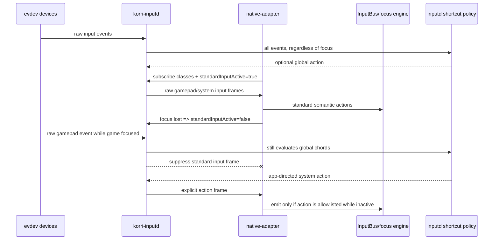

# feat: Gate native input by Korri focus

## Overview

Prevent a parked or unfocused Electrobun/Korri renderer from processing normal controller/navigation input while preserving explicit global chords and app-directed exceptions such as a System-panel action. The change adds focus/activity as part of the native input subscription contract: standard raw input is delivered to the renderer only while Korri is active, and the renderer also gates semantic emission as a defense-in-depth layer.

This plan does **not** change the current sessiond launch handoff that stops Electrobun before running a game. It creates the safe input-routing foundation needed for a later “park Electrobun instead of killing it” iteration.

## Problem Frame

Korri inputd currently reads evdev globally, broadcasts subscribed raw gamepad/system frames to every connected renderer client, and handles global shortcut policy in the same daemon. The Odin portal subscribes Electrobun to `gamepad` and `system` frames via `createNativeInputAdapter`. If Electrobun remains alive while another Sway window is active, raw gamepad events can still become semantic `direction`, `confirm`, `back`, `menu`, or `system` actions inside Korri.

The desired behavior is split:

- **Standard renderer input** should be active-window scoped. If Korri/Electrobun is not active or in focus, d-pad, analog stick, face buttons, Back/Menu, and other normal navigation actions must not drive the Korri focus engine or UI.
- **Global daemon chords** should remain global. Session toggle, kill-current-game, Sway workspace/output movement, brightness/display shortcuts, and similar policy actions are owned by inputd and should still work while a game or another app is focused.
- **App-directed exceptions** should be explicit. If a chord is intended to send a specific semantic message back to Korri, such as opening the System panel, it should travel as a narrow `action` frame rather than as raw input passthrough.

## Requirements Trace

- R1. Standard native input frames do not cause Korri semantic actions while the renderer is inactive or unfocused.
- R2. Inputd global shortcut policy continues to run regardless of renderer focus.
- R3. App-directed exceptions are explicit action frames or configured action allowlists, not accidental raw input leakage.
- R4. The native input wire contract remains backward compatible for existing clients that only send `{ classes }` subscriptions.
- R5. Odin portal and Storybook native-input configuration opt into focus-aware behavior without changing React components or shared theme atoms.
- R6. The implementation is testable without real Sway focus by injecting deterministic activity providers and real WebSocket clients.
- R7. The change preserves device-agnostic spatial navigation: components continue subscribing through `useInputAction`, and raw evdev details remain below the shared input boundary.

## Scope Boundaries

- Do not change `sessiond` launch sequencing or stop/park Electrobun in this plan.
- Do not add exclusive evdev grabs or try to prevent foreground emulators from receiving controller input.
- Do not move shortcut policy into React components or product routes.
- Do not introduce component-level focus APIs or boolean prop forests.
- Do not broaden the native input action vocabulary beyond the app-directed exceptions needed now.

### Deferred to Separate Tasks

- Parking Electrobun on a hidden workspace while games run: future sessiond/renderer lifecycle work after this input gate is proven.
- Daemon-side Sway focus discovery for non-browser clients: only needed if renderer focus/visibility events prove unreliable on the target Electrobun runtime.
- Rich in-game Korri overlay behavior: this plan only preserves the input-routing seam for app-directed exceptions.

## Context & Research

### Relevant Code and Patterns

- `tools/odin/inputd.ts` owns evdev reads, WebSocket subscriptions, raw input broadcast, global shortcut dispatch, and pending `system` action delivery.
- `korri/shared/input/native/wire-schema.ts` defines the schema-backed native input subscription and event wire contract.
- `korri/shared/input/native-adapter.ts` connects renderer clients to inputd, subscribes to device classes, maps gamepad frames into semantic `InputAction`s, and already handles `kind: "action"` frames for `system`.
- `korri/shared/input/types.ts` already includes the semantic `system` action; no product component should need raw System/KEY_F24 knowledge.
- `korri/deploy/portal/main.tsx` and `korri/deploy/storybook/preview.tsx` are the composition roots that choose the native input strategy and currently subscribe to `gamepad` and `system`.
- `korri/shared/navigation/start.ts` composes input adapters behind the semantic bus and focus engine.
- `tools/odin/inputd.test.ts` and `korri/shared/input/native-adapter.test.ts` already use real WebSocket/client-style seams that can cover subscription and focus-gating behavior.
- `docs/plans/2026-05-04-002-refactor-korri-input-daemon-plan.md` established inputd as the single device input policy owner.
- `docs/plans/2026-05-05-003-feat-odin-system-shortcuts-plan.md` established the distinction between global inputd shortcuts and the renderer semantic `system` action.

### Institutional Learnings

- `docs/solutions/best-practices/decoupled-spatial-navigation-2026-05-01.md`: input adapters emit semantic actions; components stay native and never import device or navigation-library internals.
- `docs/solutions/ui-bugs/electrobun-spatial-focus-active-attribute-2026-05-06.md`: Electrobun/WebKit can diverge from desktop browser behavior, so runtime-facing input/focus behavior needs direct tests and on-device smoke.
- `docs/solutions/ui-bugs/spatial-focus-vacuum-retention-2026-05-04.md`: DOM focus is the active UI source of truth; new input gating must not create a parallel selected state in components.

### External References

External research is intentionally skipped. The relevant contracts are local: Korri inputd, the schema-backed native input wire protocol, the native adapter, and Sway/Electrobun focus behavior already observed in the repo.

## Key Technical Decisions

- **Gate at both ends.** Inputd should suppress standard raw input frames to inactive clients, and the native adapter should independently avoid emitting semantic actions while inactive. This prevents processing on new servers and remains safe against older inputd instances.
- **Make activity part of the subscription contract.** Extend `NativeInputSubscription` with an optional `standardInputActive` field. Omitted means active for backward compatibility.
- **Keep device-added/removed independent of activity.** Clients may still need current device state after regaining focus. The activity gate only suppresses `kind: "input"` standard frames.
- **Treat action frames as explicit exceptions.** `kind: "action"` frames are not standard raw input. They may be delivered while inactive only when the native adapter is configured to accept that action while inactive.
- **Use renderer focus/visibility as the first activity source.** The renderer can observe `window` focus/blur and `document.visibilityState` without coupling product UI to Sway. The activity provider must be injectable so tests and future Sway/sessiond providers can replace it.
- **Configure exceptions at the composition root.** Odin portal can allow inactive `system` action delivery explicitly. Shared input code should not assume every app wants inactive action frames.
- **Do not put focus logic in Shift components.** React/theme code continues to react to semantic `system` through `useInputAction`; focus gating belongs in the native adapter and inputd subscription path.

## Open Questions

### Resolved During Planning

- **Should standard events be filtered in inputd or only in the renderer?** Both. Inputd suppression reduces delivery/processing when both sides are current; adapter suppression protects against stale daemons or unexpected server behavior.
- **Should global chords depend on renderer focus?** No. They are device policy actions owned by inputd and must remain global.
- **Should app-directed exceptions reuse raw input?** No. They should use explicit `kind: "action"` frames or a future schema-backed action literal.
- **Should this plan change the Electrobun kill-on-launch behavior?** No. This is an enabling input-routing change only.

### Deferred to Implementation

- **Exact Electrobun focus signal reliability on Thor/Odin:** Implement the renderer activity provider from browser focus/visibility first, then verify on device. If WebKit does not emit reliable focus/blur while parked, add a follow-up Sway/sessiond activity source without changing component code.
- **Additional inactive app actions beyond `system`:** Keep the first allowlist narrow. Add more action literals only when there is a concrete app behavior that must receive them while inactive.
- **Whether subscription updates should debounce focus churn:** Implementation can add a small debounce if focus/visibility fires rapidly in WebKit, but correctness should not depend on timing.

## High-Level Technical Design

> *This illustrates the intended approach and is directional guidance for review, not implementation specification. The implementing agent should treat it as context, not code to reproduce.*

## Implementation Units

- [x] **Unit 1: Extend the native input subscription contract with renderer activity**

**Goal:** Add a backward-compatible way for renderer clients to tell inputd whether they should receive standard raw input frames.

**Requirements:** R1, R3, R4, R6

**Dependencies:** None

**Files:**
- Modify: `korri/shared/input/native/wire-schema.ts`
- Test: `korri/shared/input/native/wire-schema.test.ts`
- Modify: `tools/odin/inputd.ts`
- Test: `tools/odin/inputd.test.ts`

**Approach:**
- Extend `NativeInputSubscription` with optional `standardInputActive`.
- Treat omitted `standardInputActive` as `true` so existing clients keep receiving input.
- Change inputd client state from a set of classes to a small subscription state containing subscribed classes and standard-input activity.
- Suppress only `kind: "input"` frames for inactive clients. Continue sending `device-added`, `device-removed`, and explicit `action` frames according to class subscription.
- Preserve the existing subscription message shape for clients that only send `{ classes: [...] }`.
- Keep malformed subscription behavior as warn-and-ignore.

**Patterns to follow:**
- `korri/shared/input/native/wire-schema.ts` for Effect Schema-backed wire changes.
- `tools/odin/inputd.ts` current `clients` map and `broadcast` flow.
- `tools/odin/inputd.test.ts` real WebSocket client pattern.

**Test scenarios:**
- Happy path: a client subscribing with `{ classes: ["gamepad"], standardInputActive: true }` receives raw gamepad input frames.
- Happy path: a client subscribing with `{ classes: ["gamepad"], standardInputActive: false }` receives `device-added` but does not receive subsequent `kind: "input"` frames.
- Backward compatibility: a client subscribing with only `{ classes: ["gamepad"] }` still receives input frames.
- Edge case: an inactive `system` subscriber still receives an explicit `kind: "action", action: "system"` frame.
- Integration: a client can send a second subscription message flipping `standardInputActive` from false to true and then receives later input frames without reconnecting.
- Error path: malformed subscription payloads are ignored without changing the previous client subscription state.

**Verification:**
- Inputd can distinguish standard raw input delivery from explicit app-directed action delivery while keeping old clients working.

- [x] **Unit 2: Add a renderer activity provider and adapter-side semantic gate**

**Goal:** Teach the native adapter to track renderer focus/visibility, update inputd subscriptions when activity changes, and suppress standard semantic emissions while inactive.

**Requirements:** R1, R3, R5, R6, R7

**Dependencies:** Unit 1

**Files:**
- Create: `korri/shared/input/native-activity.ts`
- Test: `korri/shared/input/native-activity.test.ts`
- Modify: `korri/shared/input/native-adapter.ts`
- Test: `korri/shared/input/native-adapter.test.ts`

**Approach:**
- Add a small activity provider abstraction that exposes current `standardInputActive` and notifies on changes.
- Default browser implementation should consider the renderer active when the document is visible and the window/document has focus. Keep the implementation injectable for tests and future Sway/sessiond providers.
- When the WebSocket opens, send the subscription with the current activity value.
- When activity changes, resend the subscription on the existing socket rather than reconnecting.
- In the adapter message handler, ignore standard `kind: "input"` frames while inactive even if they arrive from an older inputd.
- Keep hold state safe: when activity becomes inactive, stop any held directions, clear pressed buttons, and clear axes so a held d-pad/analog state cannot resume after refocus.
- Treat explicit `kind: "action"` frames separately from standard input. Only emit action frames while inactive if configured by an allowlist such as `inactiveActions: ["system"]`.

**Patterns to follow:**
- `korri/shared/input/native-adapter.ts` current reconnect and held-direction cleanup behavior.
- `korri/shared/input/native-adapter.test.ts` adapter tests with real WebSocket frames and deterministic timers.
- `korri/shared/navigation/start.ts` adapter composition; no component-level subscriptions beyond semantic actions.

**Test scenarios:**
- Happy path: active adapter receives gamepad input and emits the same semantic actions as before.
- Happy path: inactive adapter receives gamepad input and emits no `direction`, `confirm`, `back`, `menu`, or `options` actions.
- Edge case: transitioning from active to inactive clears an in-progress held direction and stops repeat emissions.
- Edge case: transitioning from inactive back to active sends an updated subscription and later input works normally.
- Backward compatibility: if an older inputd still sends raw frames while inactive, the adapter-side gate suppresses semantic emission.
- Exception path: inactive adapter with `inactiveActions: ["system"]` emits semantic `system` for an explicit action frame.
- Scope guard: inactive adapter without `inactiveActions` ignores the same `system` action frame.
- Error path: malformed frames are still ignored with warnings and do not corrupt activity or hold state.

**Verification:**
- The renderer cannot drive Korri navigation from standard native input while inactive, even if raw frames are delivered unexpectedly.

- [ ] **Unit 3: Wire focus-aware native input in portal and Storybook composition roots**

**Goal:** Configure the Odin portal and Storybook native-input setup to use focus-aware standard input and an explicit inactive action exception for the System-panel path.

**Requirements:** R3, R5, R7

**Dependencies:** Unit 2

**Files:**
- Modify: `korri/deploy/portal/main.tsx`
- Modify: `korri/deploy/storybook/preview.tsx`
- Test: `korri/shared/navigation/start.test.ts`
- Test: `korri/shared/input/native-adapter.test.ts`

**Approach:**
- Keep the existing `subscribe: ["gamepad", "system"]` configuration where a native bridge URL is present.
- Add native adapter options for focus-aware standard input using the default browser activity provider.
- Configure inactive action delivery explicitly for the app-directed `system` action if the intended Odin behavior is “System can bring information back to Korri even while not focused.”
- Preserve dev-machine behavior: when no native bridge URL exists, browser Gamepad API remains the controller path.
- Preserve Storybook HMR safety by disposing the previous spatial navigation handle before starting a new one.
- Avoid changing Shift atoms, route components, or theme-level device code.

**Patterns to follow:**
- `korri/deploy/portal/main.tsx` as the app composition root for controller profile selection.
- `korri/deploy/storybook/preview.tsx` HMR-safe global spatial navigation setup.
- React skill rules: composition roots choose strategy; components remain source-agnostic and do not receive boolean prop forests.

**Test scenarios:**
- Happy path: portal native configuration subscribes to `gamepad` and `system` and includes focus-aware activity options.
- Happy path: Storybook native configuration mirrors portal behavior only when `__korriStorybookNativeBridgeUrl` is set.
- Edge case: no native bridge URL leaves existing browser-gamepad behavior unchanged.
- Integration: `startSpatialNavigation` still composes the native adapter as a peer adapter; no product component reaches into inputd or raw evdev.

**Verification:**
- Runtime entrypoints select focus-aware native input at the boundary without leaking device policy into React components.

- [ ] **Unit 4: Preserve global shortcut behavior while inactive**

**Goal:** Ensure focus gating does not accidentally suppress inputd-owned global chords and does not turn normal raw input into app exceptions.

**Requirements:** R2, R3, R6

**Dependencies:** Units 1 and 2

**Files:**
- Modify: `tools/odin/inputd.ts`
- Test: `tools/odin/inputd.test.ts`
- Modify: `korri/shared/input/native/system-shortcut-engine.ts` only if tests reveal shortcut emission depends on broadcast state
- Test: `korri/shared/input/native/system-shortcut-engine.test.ts` if the engine changes

**Approach:**
- Keep `handlePolicyEvent` before client broadcast so global shortcuts are evaluated for all evdev events regardless of client activity.
- Confirm inactive clients do not affect action dispatch: `korri-session-toggle`, `kill-current-game`, brightness, Sway workspace/output actions, screen switch, and bottom-keyboard actions should still dispatch from inputd.
- Confirm app-directed action frames are generated only by explicit action dispatch such as `system-panel`, not by raw gamepad/system passthrough.
- Keep pending `system` action behavior for a later renderer subscriber, but ensure it is a single pending action rather than an unbounded queue.

**Patterns to follow:**
- `tools/odin/inputd.ts` current `handlePolicyEvent`, `dispatchAction`, `broadcastSystemAction`, and pending-system-action behavior.
- `docs/plans/2026-05-05-003-feat-odin-system-shortcuts-plan.md` distinction between global shortcuts and semantic `system` UI action.

**Test scenarios:**
- Happy path: inactive gamepad subscriber does not receive raw System+L1+R1 component frames, but inputd still dispatches `kill-current-game`.
- Happy path: inactive subscriber does not receive raw L3/R3/Start frames, but inputd still dispatches `korri-session-toggle`.
- Happy path: inactive `system` subscriber receives the explicit `system` action frame after a plain System tap when action delivery is intended.
- Edge case: multiple plain System taps while no client is connected result in one pending action, not an unbounded backlog.
- Scope guard: raw d-pad/face-button activity while inactive never becomes an action frame.

**Verification:**
- The focus gate narrows renderer standard input without weakening global device policy.

- [ ] **Unit 5: Add on-device smoke diagnostics and operator documentation**

**Goal:** Make the new behavior verifiable on Thor/Odin and document the active/inactive input ownership model.

**Requirements:** R1, R2, R3, R5, R6

**Dependencies:** Units 1 through 4

**Files:**
- Modify: `scripts/odin/smoke-input.ts`
- Modify: `scripts/odin/smoke.sh`
- Modify: `docs/odin-iterative-loop.md`
- Modify: `docs/desktop-nix-runbook.md` only if it describes Electrobun input behavior

**Approach:**
- Extend smoke diagnostics to report whether inputd supports `standardInputActive` subscriptions.
- Add a smoke path that connects as an inactive gamepad subscriber and verifies no standard input frames are delivered from a synthetic or observed event source when feasible.
- Add a smoke path that verifies explicit `system` action frames can still be delivered to a `system` subscriber.
- Document manual acceptance on Thor/Odin:
  - focus Korri and confirm d-pad moves UI;
  - focus another Sway app or launch a test game while Electrobun remains connected, then confirm d-pad does not move Korri;
  - trigger a global chord and confirm inputd action still fires;
  - trigger the app-directed System exception and confirm only the intended semantic action reaches Korri.
- Keep docs clear that current sessiond may still kill Electrobun on launch; this change is about safe input routing, not lifecycle parking.

**Patterns to follow:**
- `scripts/odin/smoke-input.ts` existing WebSocket subscription smoke pattern.
- `scripts/odin/smoke.sh` concise device diagnostics.
- `docs/desktop-nix-runbook.md` and `docs/odin-iterative-loop.md` operational style if relevant.

**Test scenarios:**
- Smoke: inputd accepts a subscription with `standardInputActive: false`.
- Smoke: inactive subscription does not receive standard input frames during the test window.
- Smoke: explicit `system` action delivery remains possible for a `system` subscriber.
- Manual device acceptance: focused Korri processes d-pad; unfocused Korri does not; global chords still dispatch.

**Verification:**
- A developer can prove the behavior on device without reading inputd internals or guessing whether WebKit focus events fired.

## System-Wide Impact

- **Interaction graph:** evdev input continues to feed inputd policy globally; inputd then routes raw frames to renderer clients based on per-client activity; native adapter converts accepted frames into the semantic bus; React components remain downstream of `useInputAction`.
- **Error propagation:** malformed subscriptions or frames remain warnings. Activity-provider failures should fail safe by treating standard input as inactive only if a deterministic inactive state is known; otherwise preserve compatibility and surface diagnostics.
- **State lifecycle risks:** held directional state must clear on inactivity, socket close, reconnect, and adapter disposal so stale holds cannot repeat after focus returns.
- **API surface parity:** native input subscription gets an optional field. Existing clients without that field keep current behavior.
- **Integration coverage:** schema/unit tests prove compatibility; inputd WebSocket tests prove server-side suppression; adapter tests prove defense-in-depth semantic suppression; device smoke proves Electrobun/WebKit focus behavior.
- **Unchanged invariants:** components stay native HTML; product/theme code sees semantic actions only; global inputd shortcut policy remains device-level and focus-independent.

## Risks & Dependencies

| Risk | Mitigation |
|---|---|
| Electrobun/WebKit focus or visibility events are unreliable when parked under Sway. | Make the activity provider injectable and add device smoke. If unreliable, add a Sway/sessiond activity provider without changing components or the wire contract. |
| Inactive action exceptions become a backdoor for normal navigation. | Only `kind: "action"` frames can bypass standard gating, and the adapter requires an explicit inactive-action allowlist. |
| Existing clients break due to subscription schema changes. | Make `standardInputActive` optional and default to active. Add backward-compatibility schema and WebSocket tests. |
| Held d-pad/analog input resumes after focus returns. | Clear holds, pressed buttons, and axes on inactive transition before accepting later active input. |
| Global kill/session chords stop working while renderer inactive. | Keep policy evaluation before broadcast and cover inactive-subscriber chord scenarios in inputd tests. |
| Smoke cannot synthesize physical evdev input on device safely. | Use contract-level WebSocket smoke where possible and keep physical-button verification as a manual acceptance checklist. |

## Documentation / Operational Notes

- Document the distinction between **global inputd shortcuts**, **standard renderer input**, and **app-directed action exceptions**.
- Keep operator language aligned with future parking work: “unfocused Korri does not process standard input” rather than “Electrobun is killed.”
- If on-device verification shows browser focus is unreliable in Electrobun, record that as a follow-up solution note before implementing the Sway/sessiond activity provider.

## Sources & References

- **Origin document:** [docs/brainstorms/2026-05-03-native-input-bridge-requirements.md](../brainstorms/2026-05-03-native-input-bridge-requirements.md)
- Related plan: [docs/plans/2026-05-04-002-refactor-korri-input-daemon-plan.md](2026-05-04-002-refactor-korri-input-daemon-plan.md)
- Related plan: [docs/plans/2026-05-05-003-feat-odin-system-shortcuts-plan.md](2026-05-05-003-feat-odin-system-shortcuts-plan.md)
- Related solution: [docs/solutions/best-practices/decoupled-spatial-navigation-2026-05-01.md](../solutions/best-practices/decoupled-spatial-navigation-2026-05-01.md)
- Related solution: [docs/solutions/ui-bugs/electrobun-spatial-focus-active-attribute-2026-05-06.md](../solutions/ui-bugs/electrobun-spatial-focus-active-attribute-2026-05-06.md)
- Related code: `tools/odin/inputd.ts`
- Related code: `korri/shared/input/native/wire-schema.ts`
- Related code: `korri/shared/input/native-adapter.ts`
- Related code: `korri/shared/navigation/start.ts`
- Related code: `korri/deploy/portal/main.tsx`
