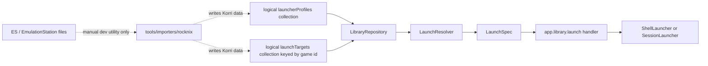
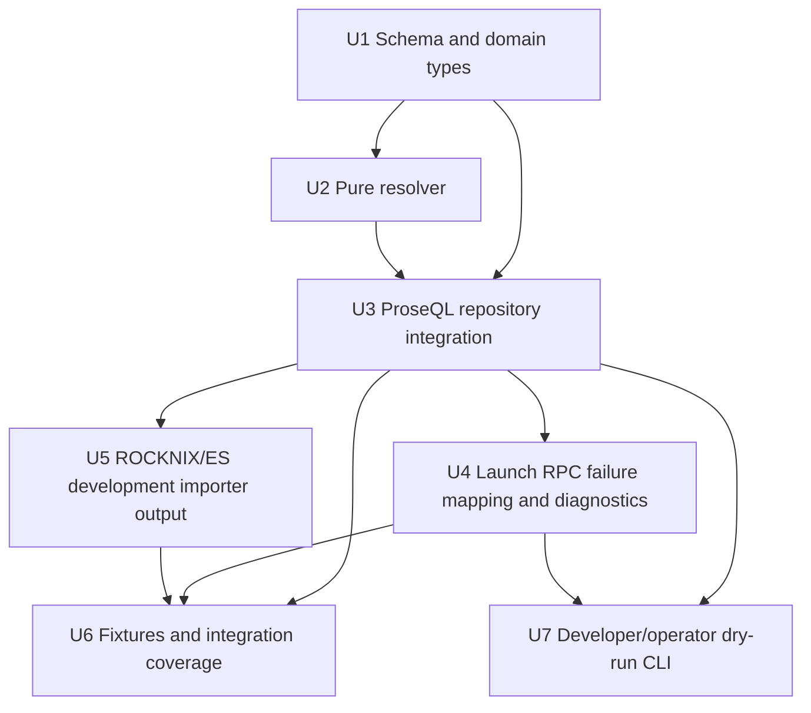

# feat: Add Korri launcher profile registry

## Summary

Add a Korri-owned launcher profile registry and flat per-game launch targets that resolve into the existing structured `LaunchSpec` seam. Runtime launch resolution reads only Korri library data; ES / EmulationStation parsing remains a manual development utility for bootstrap or recovery, not part of app startup, deploy convergence, or game launch.

---

## Problem Frame

Korri currently has a strong launcher execution seam (`LaunchSpec` -> `Launcher`) and a ProseQL-backed library direction, but launcher knowledge is still either stored as already-resolved specs or derived from ROCKNIX / ES configuration in transitional paths. The lost ES launcher script should not be rebuilt as another script or as a runtime dependency on ES files. Korri needs durable, inspectable launcher configuration that belongs to Korri and can still recover useful defaults from ES when a developer explicitly runs a utility.

---

## Requirements

- R1. Runtime launch resolution reads Korri-owned library data only; it must not read ES / EmulationStation files during app startup or game launch.
- R2. Launcher profiles define reusable baseline command templates, args, defaults, and optional env/cwd values.
- R3. Launch targets are keyed by stable Korri database game IDs, not content paths or file names.
- R4. Launch target v0 fields stay flat: `profile`, `contentPath`, optional `system`, `emulator`, `core`, `argsAppend`, `env`, and `cwd`.
- R5. Profile + target resolution compiles to the existing structured `LaunchSpec` (`command`, `args`, `env?`, `cwd?`) and never executes shell strings.
- R6. Resolver failures are detected before spawning and surface as structured launch failures rather than runtime crashes or raw schema defects.
- R7. ROCKNIX/ES import is a manual development utility that writes Korri-owned data; it is not a normal runtime workflow, deploy hook, or user-facing product flow.
- R8. v0 supports exactly one launch target per game. Alternate launch modes are deferred until the product has a selection surface.
- R9. Tests use real implementations: real ProseQL files in temp directories, real resolver code, and real launch handler paths where integration is tested.
- R10. Launcher profile storage is layout-neutral at the logical model level: profiles and targets are logical ProseQL collections, and v0 must support at least the default split-file layout and a shared single-file layout where ProseQL supports it.
- R11. Dry-run validation is a developer/operator CLI surface only in v0; it resolves launcher config to a `LaunchSpec` or diagnostic without spawning a process.

---

## Scope Boundaries

- Out: implementing multiple launch targets per game, launcher selection UI, or alternate/safe-mode launch choices.
- Out: nested launch input modeling for BIOS files, multi-disc sets, save directories, controller profiles, or native targets without a primary `contentPath`.
- Out: changing `ShellLauncher`, `SessionLauncher`, or sessiond's `/launch` contract. Sessiond receives the already-resolved `LaunchSpec`.
- Out: making ROCKNIX/ES import part of app startup, game launch, device convergence, or the normal user workflow.
- Out: turning the current ROCKNIX importer into a generic ES / EmulationStation importer. It may parse ES files, but its contract stays ROCKNIX snapshot import until another source proves the abstraction.
- Out: migrating existing resolved `launch-targets.yaml` records automatically into profile-backed targets. The resolved-spec format is lossy; profile-backed launch targets require explicit reset/re-import or manual authoring.
- Out: replacing the broader ProseQL library foundation plan. This plan builds on that direction and narrows only the launcher config shape.

### Deferred to Follow-Up Work

- Native or content-path-less launcher targets: add only after there is a concrete game/source that needs no `contentPath`.
- Multiple launch targets per game: add only when a UI or agent flow can choose between alternatives.
- Rich compatibility metadata such as BIOS requirements, controller profiles, and save-state policies.
- Arbitrary user-driven physical layout where one logical collection is split across many convention-discovered files, such as per-system files colocated with ROM folders.
- Generic ES / EmulationStation import independent of ROCKNIX device layout.
- Fallow boundary hardening that prevents runtime imports from `tools/importers/**`; useful after the runtime ROCKNIX branch is removed.

---

## Dependencies / Prerequisites

- The runtime source switch from live ROCKNIX reads to ProseQL-backed library data must land before profile-backed launch targets are considered runtime-complete. This plan does not remove the transitional ROCKNIX runtime branch; it depends on the ProseQL foundation work to do that.
- The selected ProseQL configuration must support logical launcher profile and launch target collections in the chosen physical layout. v0 should prove both the boring default layout and a shared single-file layout, but it does not need arbitrary multi-file collection discovery.

---

## Context & Research

### Relevant Code and Patterns

- `korri/shared/library/launcher.ts` defines `LaunchSpec`; `command` is non-empty, `args` is an array, and optional `env` / `cwd` already exist.
- `korri/shared/library/shell-launcher.ts` launches `[command, ...args]` through `Bun.spawn`, avoiding shell-string execution and preserving paths with spaces as argv elements.
- `korri/shared/library/session-launcher.ts` posts resolved `{ spec }` payloads to sessiond; profile resolution should stay API-side so sessiond remains a protected spawner, not a config resolver.
- `korri/shared/library/proseql/library-db.ts` already defines object-keyed ProseQL YAML collections with derived IDs and `KORRI_LIBRARY_SCHEMA_VERSION`.
- `korri/shared/library/proseql/library-repository.ts` is the right boundary for turning persisted library records into runtime `GameRecord[]` and `LaunchSpec` values.
- `korri/products/app/api/library/launch.rpc-handler.ts` already resolves the launch spec server-side through `LibrarySource.launchSpecFor(id)` before calling `Launcher.run(spec)`.
- `tools/importers/rocknix/rocknix-importer.ts` is the current development/import boundary for ES-shaped data. It should be extended as a manual utility, not pulled into runtime.
- `tools/importers/rocknix/es-systems.ts` and `tools/importers/rocknix/gamelist.ts` are pure parsing patterns to preserve under tooling.
- `tools/testing/library/with-temp-library.ts` shows the real-filesystem fixture posture, but it is ROCKNIX-shaped; profile-backed ProseQL fixtures should use a new helper.

### Institutional Learnings

- `docs/solutions/best-practices/proseql-canonical-library-with-derived-yaml-ids-2026-05-06.md` — ProseQL YAML should use object keys as IDs and keep ROCKNIX/ES as snapshot input, not live runtime ownership.
- `docs/solutions/best-practices/temporary-rocknix-sidecar-media-instead-of-es-gamelist-edits-2026-05-03.md` — temporary device-local data should stay Korri-owned and deletable; do not edit or depend on ES-owned metadata.
- `docs/solutions/best-practices/prefer-real-implementations-over-mocks-2026-05-02.md` — tests should use real temp files, real repositories, and configurable real implementations, not `Mock*` / `Stub*` / `Fake*` classes.
- `docs/solutions/integration-issues/supervise-chromium-kiosk-session-after-game-exit-2026-05-04.md` — sessiond owns home/game/restoring lifecycle; launcher config should describe what to run, not session cleanup behavior.

### External References

- EmulationStation / ES-DE ecosystems use per-system command templates with placeholders such as ROM/system/core/emulator values.
- LaunchBox and Steam ROM Manager provide prior-art for baseline launcher definitions plus per-game command overrides.
- Recalbox / EmuELEC-style configgen patterns support central launch resolution, but Korri should express that as data-to-`LaunchSpec` resolution rather than imperative runtime scripts.

---

## Key Technical Decisions

| Decision | Rationale |
|---|---|
| Store launcher profiles in Korri library data | Profiles are user/device library data, not ES-owned metadata and not product UI state. Keeping them beside games and launch targets makes backup/diff/reset behavior clear. |
| Treat physical YAML layout as configurable storage detail | The domain model is logical collections (`games`, `launcherProfiles`, `launchTargets`), not fixed file names. v0 should support the default split-file layout and a shared single-file layout where ProseQL supports multiple collections in one file. |
| Key launch targets by game ID | The database game ID is stable identity; content path is launch input and may change. This follows the key-derived YAML pattern already used in the ProseQL library. |
| Keep v0 launch target fields flat | The common case is one content path and a few launcher overrides. Nested `values.rom.path` style structures add ceremony before multi-input launchers exist. |
| Resolve profile-backed targets at the repository/source boundary | `LibrarySource.launchSpecFor(id)` remains the app seam. UI, atoms, RPC payloads, and sessiond do not learn about profiles. |
| Preserve the existing launch RPC response shape | Resolution failures can map to `status: "failed"` with a reserved pre-spawn exit code and diagnostic `stderrTail`. This avoids adding renderer state work before the launcher model is proven. |
| Use an argv-template profile model, not shell command strings | It matches `ShellLauncher`'s safety posture and keeps paths with spaces safe. `argsAppend` is an array, not a whitespace-split string. |
| Use Korri-style placeholders in authored profiles | Use `{contentPath}`, `{system}`, `{emulator}`, and `{core}` in Korri-authored YAML. ES placeholders remain importer input, not the canonical authored vocabulary. |
| ROCKNIX/ES import is manual tooling only | It may recover useful defaults and bootstrap data from the current ROCKNIX-shaped ES layout, but runtime code must not call it and deploy must not silently mutate launcher config by importing ES files. |
| Treat current resolved-spec launch targets as incompatible with profile-backed targets | Inferring profile IDs and flat fields from stored resolved argv is lossy. v0 should require an explicit reset/re-import/manual authoring path rather than a misleading automatic migration. |

---

## Open Questions

### Resolved During Planning

- Should game identity come from the file name? No. Launch target YAML keys are Korri database game IDs; `contentPath` is only launch input.
- Should launch target values be deeply nested? No for v0. Flat fields are clearer until real multi-input launchers exist.
- Should ES import be part of the standard workflow? No. The current importer remains a ROCKNIX-scoped development utility only.
- Should v0 support multiple launch targets per game? No. One game ID maps to one launch target.
- Should sessiond resolve launcher profiles? No. Sessiond keeps receiving resolved `LaunchSpec` values.
- Should the flat path field be named `romPath`? No. Use `contentPath` so the launcher target does not bake ROM-only language into Korri's core model.
- Should physical YAML layout flexibility be part of v0? Minimally, yes. Support logical collections with default split-file storage and shared single-file storage where ProseQL supports it; defer arbitrary convention-discovered splitting.
- Should dry-run validation be a player-facing feature? No. It is a developer/operator CLI only in v0.
- Should this plan make the importer generic ES? No. Keep it ROCKNIX-scoped until a second ES source shape proves a generic importer.
- Should the profile-backed launch target schema attempt to migrate existing resolved `spec` records automatically? No. Treat incompatible v1 records as launch/dry-run validation failures with an explicit reset/re-import diagnostic rather than deriving profile data from lossy argv. The library should still open and list games.
- How should resolver failures cross the service boundary? Through a configuration-oriented `LibraryError` diagnostic that the launch RPC maps to a failed launch result.

### Deferred to Implementation

- Exact reserved pre-spawn exit code for resolver failures. The plan recommends one documented code path, but the implementer should align with nearby launcher/sessiond conventions.
- Exact CLI flags for ES development import. The plan constrains the importer's role, not the final flag names.

---

## Output Structure

    korri/shared/library/launcher-config/
      launcher-profile.ts
      launcher-profile.test.ts
      launch-target.ts
      launch-target.test.ts
      launch-resolver.ts
      launch-resolver.test.ts
    korri/shared/library/proseql/
      library-db.ts
      library-repository.ts
      library-repository.test.ts
    tools/importers/rocknix/
      rocknix-importer.ts
      rocknix-importer.test.ts
      cli.ts
    tools/library/
      launcher-config-cli.ts
      launcher-config-cli.test.ts
    tools/testing/library/
      with-temp-proseql-library.ts
      with-temp-proseql-library.test.ts

---

## High-Level Technical Design

> *This illustrates the intended approach and is directional guidance for review, not implementation specification. The implementing agent should treat it as context, not code to reproduce.*



Directional single-file YAML shape. This illustrates one supported physical layout, not the only canonical storage layout:

```yaml
_version: 2

launcherProfiles:
  rocknix.retroarch.snes:
    command: /usr/bin/runemu.sh
    args:
      - "{contentPath}"
      - "-P{system}"
      - "--core={core}"
      - "--emulator={emulator}"
    defaults:
      system: snes
      emulator: retroarch
      core: snes9x

launchTargets:
  25afeac6-f68c-4d44-b42e-87ec4c0a436b:
    profile: rocknix.retroarch.snes
    contentPath: /storage/roms/snes/f-zero.smc
```

Resolution rules:

1. Load target by game ID.
2. Load profile by `target.profile`.
3. Build context from profile defaults overlaid by target fields.
4. Substitute only known placeholders in `command`, profile `args`, optional `env`, and optional `cwd`.
5. Append `target.argsAppend` as already-structured argv elements.
6. Reject unresolved placeholders, missing required values, empty commands, non-string env values, and disallowed command paths before spawning.
7. Return a decoded `LaunchSpec` or a resolver error that the launch RPC maps to a failed launch result.

---

## Implementation Units



### U1. Define launcher profile and flat launch target schemas

**Goal:** Introduce the domain records for launcher profiles and profile-backed launch targets without changing runtime behavior yet.

**Requirements:** R2, R3, R4, R5, R8, R10

**Dependencies:** None

**Files:**
- Create: `korri/shared/library/launcher-config/launcher-profile.ts`
- Create: `korri/shared/library/launcher-config/launcher-profile.test.ts`
- Create: `korri/shared/library/launcher-config/launch-target.ts`
- Create: `korri/shared/library/launcher-config/launch-target.test.ts`
- Modify: `korri/shared/library/proseql/library-db.ts`
- Test: `korri/shared/library/proseql/library-db.test.ts`

**Approach:**
- Define `LauncherProfile` as a schema-backed record with command template, argv template, optional defaults, optional env/cwd template fields, and a minimal command allow policy.
- Define `LaunchTarget` as a schema-backed record whose hydrated ID is the game ID and whose YAML payload contains `profile`, `contentPath`, and optional flat overrides.
- If ProseQL collection decoding would otherwise reject existing `spec`-backed records at database-open time, model the persisted launch target schema as a small legacy-or-profile-backed union and reject the legacy case inside resolution/dry-run instead. This preserves `listGames()` while making launches actionable.
- Keep `argsAppend` as an array of strings; do not accept a single shell-like string.
- Extend the ProseQL DB config with a `launcherProfiles` collection and update `launchTargets` toward profile-backed payloads keyed by game ID.
- Keep the domain model layout-neutral: code should talk about logical collections and collection config, not assume fixed physical filenames as domain concepts.
- Configure and test at least two physical layouts when ProseQL supports them: the default split-file layout and a shared single-file layout containing launcher profiles and launch targets.
- Keep IDs derived from YAML keys so stored YAML does not duplicate `gameId` inside each launch target payload.
- Define the profile-backed launch target shape so incompatible v1 `spec`-backed records fail only when launch resolution or dry-run validation touches them. Do not derive `profile` or `contentPath` from existing argv values, and do not make old launch-target rows prevent the library from opening or games from listing.

**Patterns to follow:**
- `korri/shared/library/proseql/library-db.ts` for `Schema.Struct`, `derivedFromKey`, versions, relationships, and migrations.
- `docs/solutions/best-practices/proseql-canonical-library-with-derived-yaml-ids-2026-05-06.md` for key-derived YAML IDs.
- `korri/shared/library/launcher.ts` for schema-backed launch data.

**Test scenarios:**
- Happy path: a launcher profile with command, args, and defaults decodes successfully.
- Happy path: a launch target keyed by a UUID game ID hydrates that key as the record game ID without duplicating it in YAML payload.
- Edge case: launch target with `argsAppend: []` decodes and preserves an empty append list.
- Edge case: ProseQL config can place launcher profiles and launch targets in one shared YAML file without changing the logical resolver behavior.
- Edge case: existing legacy `spec`-backed target data does not prevent the library from opening or games from listing.
- Error path: launch target with non-string `contentPath` is rejected.
- Error path: launch target with `argsAppend` as a string instead of an array is rejected.
- Error path: profile with empty command is rejected before it can compile to `LaunchSpec`.

**Verification:**
- The new schemas model the agreed YAML shape and reject shell-string append shortcuts.
- ProseQL DB config can represent games, launcher profiles, and launch targets without introducing product imports.

### U2. Add a pure launch resolver

**Goal:** Convert a `LauncherProfile` plus a flat `LaunchTarget` into either a valid `LaunchSpec` or a typed resolution failure.

**Requirements:** R5, R6

**Dependencies:** U1

**Files:**
- Create: `korri/shared/library/launcher-config/launch-resolver.ts`
- Create: `korri/shared/library/launcher-config/launch-resolver.test.ts`
- Modify: `korri/shared/library/launcher.ts` *(comments only if needed to link the authored config model to compiled `LaunchSpec`)*

**Approach:**
- Keep resolver logic pure and filesystem-free. It resolves values and validates command/args/env/cwd shape; it does not check whether ROM files exist.
- Use the v0 placeholder vocabulary: `{contentPath}`, `{system}`, `{emulator}`, `{core}`.
- Overlay target fields over profile defaults before substitution.
- Substitute placeholders in command, each profile arg, optional env values, and optional cwd.
- Append `argsAppend` after profile args without splitting.
- Fail if a required placeholder has no value, any placeholder remains unresolved, command resolves empty, env contains non-string values, or command violates policy.
- Return a typed resolution result rather than throwing.

**Technical design:** *(directional guidance, not implementation specification)*

```text
(profile, target)
  -> context = profile.defaults overlaid by target fields
  -> command = substitute(profile.command, context)
  -> args = substituteEach(profile.args, context) + target.argsAppend
  -> env = substituteEnv(profile.env) merged with target.env
  -> cwd = substitute(target.cwd ?? profile.cwd)
  -> validate command/args/env/cwd
  -> LaunchSpec | LaunchResolutionError
```

**Patterns to follow:**
- `korri/shared/library/rocknix/rocknix-source.ts` for the important safety property: content paths must become argv elements, not whitespace-split shell fragments.
- `korri/shared/library/launcher.ts` for the compiled output contract.

**Test scenarios:**
- Happy path: profile defaults plus target `contentPath` resolve to the expected `LaunchSpec` args.
- Happy path: target `core` overrides profile default `core`.
- Happy path: `argsAppend` appends one additional argv element after profile args.
- Edge case: content path containing spaces remains one argv element.
- Edge case: profile env plus target env merge with target values taking precedence.
- Error path: missing profile default for a placeholder used in args returns `MissingRequiredValue`.
- Error path: misspelled placeholder remains unresolved and returns `UnresolvedPlaceholder`.
- Error path: disallowed command returns `DisallowedCommand` and does not emit a `LaunchSpec`.
- Error path: empty resolved command returns an invalid-config error.

**Verification:**
- The resolver can be tested independently from ProseQL and launch execution.
- Every failure mode that would otherwise become a spawn/runtime error has a typed pre-spawn representation.

### U3. Integrate profiles and targets into the ProseQL repository

**Goal:** Make `LibraryRepository.launchSpecForGame(gameId)` resolve profile-backed launch targets into `LaunchSpec` while preserving `LibrarySource.launchSpecFor(id)` as the public runtime seam.

**Requirements:** R1, R3, R5, R6, R8

**Dependencies:** U1, U2

**Files:**
- Modify: `korri/shared/library/proseql/library-repository.ts`
- Modify: `korri/shared/library/proseql/library-repository.test.ts`
- Modify: `korri/shared/library/proseql/proseql-library-source.ts`
- Test: `korri/shared/library/proseql/proseql-library-source.test.ts`
- Modify: `korri/shared/library/library-services.ts`
- Modify: `korri/shared/library/library-source-layer-live.ts` *(only if needed to ensure ProseQL is the runtime path for this feature)*

**Approach:**
- Extend repository operations to read launcher profile and launch target records from ProseQL and call the pure resolver.
- Extend the repository write surface for profiles: add profile upsert support and update imported-game persistence so `(game, launcherProfile, launchTarget)` writes happen transactionally. The importer must not be able to leave a launch target referencing a missing profile if a write fails partway through.
- Represent resolver failures through `LibraryError` with a configuration-oriented discriminator/diagnostic that the launch handler can recognize. Missing target still maps to `undefined`; broken target/profile maps to the controlled resolver-failure path.
- Preserve one-launch-target-per-game by keeping a unique game ID boundary in `launchTargets`.
- Do not import `tools/importers/rocknix/**` or ES parsers from runtime repository code.
- Keep ProseQL reads scoped per call, matching the existing live layer pattern. YAML edits should be visible on the next launch call rather than requiring a process restart.
- Do not automatically import ES files when the DB is empty. Empty or misconfigured launcher data should fail clearly, not self-heal from ES.

**Patterns to follow:**
- `korri/shared/library/proseql/library-repository.ts` for repository shape and decoding at the boundary.
- `korri/shared/library/proseql/proseql-library-source.ts` for keeping the plain `LibrarySource` adapter thin.
- `korri/shared/library/library-source-layer-live.ts` for live ProseQL DB lifecycle.

**Test scenarios:**
- Happy path: repository seeded with one game, one profile, and one launch target returns the compiled `LaunchSpec` for the game ID.
- Happy path: `listGames()` behavior is unchanged by the presence of launcher profiles.
- Edge case: legacy `spec`-backed target data does not affect `listGames()` and fails only when `launchSpecForGame()` resolves that game.
- Edge case: missing launch target returns `undefined` so existing not-found behavior is preserved.
- Error path: launch target references a missing profile and repository exposes a resolution failure without throwing a defect.
- Error path: profile references missing `{core}` and repository exposes a resolution failure without spawning anything.
- Error path: imported `(game, profile, target)` persistence is atomic — if the profile is invalid, no game or target rows persist.
- Integration: no runtime repository/module import references `tools/importers/rocknix/**`.

**Verification:**
- Existing callers still ask `LibrarySource.launchSpecFor(id)` and receive a compiled `LaunchSpec` or a controlled failure.
- Runtime remains independent of ES files.

### U4. Map resolution failures through launch RPC diagnostics

**Goal:** Ensure profile/target misconfiguration appears as a structured launch failure instead of a crash, opaque RPC data error, or renderer defect.

**Requirements:** R6

**Dependencies:** U2, U3

**Files:**
- Modify: `korri/products/app/api/library/launch.rpc-handler.ts`
- Modify: `korri/products/app/api/library/launch.rpc-handler.test.ts`
- Modify: `korri/products/app/api/library/launch.rpc.ts` *(comments or schema documentation only unless implementation chooses a new response case)*
- Modify: `korri/shared/library/library-services.ts`

**Approach:**
- Preserve the current response union by mapping resolver failures to `status: "failed"`, a reserved pre-spawn exit code, and a diagnostic `stderrTail`.
- Extend `LibraryError` with a configuration-oriented reason/diagnostic for resolver failures. The launch handler matches that reason and maps it to the failed launch result; existing I/O/unavailable failures keep their current data-error behavior.
- Keep missing game/target behavior distinct from misconfiguration. Missing target remains not-found; broken target/profile becomes failed launch.
- Add structured logging with `gameId`, `profile`, command when available, and failure tag.
- Do not leak launch profiles to renderer state unless a new response case is intentionally introduced.

**Patterns to follow:**
- `korri/products/app/api/library/launch.rpc-handler.ts` for current not-found and launch-result mapping.
- `korri/shared/library/session-launcher.ts` for reserved local failure codes and diagnostic `stderrTail` style.
- `docs/solutions/integration-issues/effect-v4-rpc-schema-class-responses-2026-05-03.md` if response schemas/classes are changed.

**Test scenarios:**
- Happy path: valid profile-backed target still returns `status: "launched"` when the configured launcher exits successfully.
- Error path: missing launch target still returns the existing not-found RPC error.
- Error path: missing profile returns `status: "failed"` with the reserved pre-spawn exit code and a useful `stderrTail`.
- Error path: unresolved placeholder returns `status: "failed"` without invoking `Launcher.run`.
- Integration: a profile resolution failure does not surface as an unhandled defect or generic unavailable data error.

**Verification:**
- A broken YAML profile produces a diagnosable launch failure while keeping the player on the same launch surface.
- Existing renderer launch state remains compatible unless a deliberate response-schema change is made.

### U5. Update ROCKNIX/ES development importer to emit profile-backed data manually

**Goal:** Extend the ROCKNIX-scoped ES importer so a developer can manually bootstrap or recover Korri launcher profiles and launch targets from the current ROCKNIX layout, without making import part of runtime or deploy.

**Requirements:** R1, R2, R3, R4, R7, R8

**Dependencies:** U1, U3

**Files:**
- Modify: `tools/importers/rocknix/rocknix-importer.ts`
- Modify: `tools/importers/rocknix/rocknix-importer.test.ts`
- Modify: `tools/importers/rocknix/cli.ts`
- Modify: `tools/importers/rocknix/es-systems.ts` *(only if additional parsed fields are needed for profile generation)*

**Approach:**
- Keep the importer under `tools/importers/rocknix/`; do not move ES parsing into runtime shared modules and do not broaden this into a generic ES importer.
- Generate stable, human-readable profile IDs from ROCKNIX/ES system/emulator/core defaults where possible.
- Write launcher profiles once per discovered baseline and write launch targets keyed by generated Korri game IDs.
- Translate ES placeholders into Korri-authored placeholders in stored profiles. ES `%ROM%` becomes `{contentPath}`; ES `%SYSTEM%`, `%CORE%`, and `%EMULATOR%` become the matching Korri placeholders.
- Preserve the importer as an explicit manual command. Do not add startup hooks, automatic deploy import, or runtime fallback to ES files.
- Keep the existing empty-library import posture for game imports. If a profiles-only refresh is added, it should be explicit and should not overwrite game/target data silently.

**Patterns to follow:**
- `tools/importers/rocknix/rocknix-importer.ts` for explicit summary results, warnings, and empty-library guard.
- `tools/importers/rocknix/es-systems.ts` for pure ES system parsing.
- `docs/solutions/best-practices/temporary-rocknix-sidecar-media-instead-of-es-gamelist-edits-2026-05-03.md` for ownership boundaries around ES data.

**Test scenarios:**
- Happy path: importer reads an ES system and gamelist fixture, writes one launcher profile and one launch target keyed by a generated game ID.
- Happy path: two games in the same ES system reuse one generated profile.
- Edge case: duplicate external game identity still skips the duplicate and reports a warning.
- Error path: missing ES systems file produces a warning summary and no runtime fallback behavior.
- Error path: re-running a full game import into a non-empty library still fails instead of merging unreliable snapshots.
- Integration: importer output can be opened through the ProseQL repository and resolved to the expected `LaunchSpec`.

**Verification:**
- ROCKNIX/ES import can bootstrap Korri-owned launcher config manually.
- Runtime code remains clean of ES parser imports and importer calls.

### U6. Add profile-backed library fixtures and integration coverage

**Goal:** Provide reusable real-filesystem test fixtures and cross-layer coverage so future launcher profiles can be added without re-inventing setup.

**Requirements:** R9

**Dependencies:** U3, U4, U5

**Files:**
- Create: `tools/testing/library/with-temp-proseql-library.ts`
- Create: `tools/testing/library/with-temp-proseql-library.test.ts`
- Modify: `korri/products/app/api/library/launch.rpc-handler.test.ts`
- Modify: `korri/shared/library/proseql/library-repository.test.ts`
- Modify: `tools/importers/rocknix/rocknix-importer.test.ts`

**Approach:**
- Create a test helper that writes real ProseQL YAML files for games, launcher profiles, and launch targets in a temp directory.
- Use the helper in repository and launch handler tests rather than direct object stubs.
- Keep subprocess behavior tested through real controllable launch commands where existing tests already do so.
- Include at least one fixture with a content path containing spaces to guard argv behavior.
- Include one fixture with intentionally broken profile data for resolution failure coverage.

**Patterns to follow:**
- `tools/testing/library/with-temp-library.ts` for temp filesystem fixture style.
- `korri/shared/library/proseql/library-repository.test.ts` for real ProseQL repository testing.
- `korri/products/app/api/library/launch.rpc-handler.test.ts` for handler-level integration coverage.
- `docs/solutions/best-practices/prefer-real-implementations-over-mocks-2026-05-02.md` for avoiding faux test doubles.

**Test scenarios:**
- Happy path: temp ProseQL helper seeds profile-backed launch data and repository resolves it.
- Happy path: launch handler runs through real services and returns launched for a controllable command.
- Edge case: content path with spaces is passed as one argv element to the controllable command.
- Error path: broken profile fixture returns failed launch without calling the controllable command.
- Integration: importer-generated fixture data and manually-authored fixture data both resolve through the same repository path.

**Verification:**
- New launcher profile work has a reusable fixture harness.
- Cross-layer tests prove profile-backed YAML, repository resolution, RPC handler mapping, and launcher execution agree.

### U7. Add developer/operator dry-run validation CLI

**Goal:** Provide a non-spawning validation surface that resolves launcher config for a game ID and reports either the compiled `LaunchSpec` or resolver diagnostics.

**Requirements:** R6, R10, R11

**Dependencies:** U2, U3, U4

**Files:**
- Create: `tools/library/launcher-config-cli.ts`
- Create: `tools/library/launcher-config-cli.test.ts`
- Modify: `justfile` *(only if adding a convenience recipe is worth it)*

**Approach:**
- Keep dry-run validation as developer/operator tooling, not a renderer UI or RPC endpoint.
- Accept a library root and game ID, open the ProseQL library using the same repository/resolver path as runtime, and print either the resolved `LaunchSpec` or a structured diagnostic.
- Do not spawn the resolved command.
- Include enough diagnostic detail for reset/re-authoring: game ID, profile ID when present, failure tag, and missing/unresolved placeholder when relevant.
- Exercise both default split-file layout and shared single-file layout through the CLI tests where ProseQL supports both.

**Patterns to follow:**
- `tools/importers/rocknix/cli.ts` for tool entrypoint shape and summary output posture.
- `korri/shared/library/proseql/library-repository.ts` for opening and resolving through the real repository path.
- `korri/shared/library/launcher-config/launch-resolver.ts` for diagnostics; the CLI should not duplicate resolution logic.

**Test scenarios:**
- Happy path: CLI resolves a valid game ID and reports the expected `LaunchSpec` without spawning.
- Edge case: shared single-file layout resolves the same target as the default layout.
- Error path: old/incompatible resolved-spec launch target reports the reset/re-import diagnostic.
- Error path: missing profile reports a profile diagnostic with the requested game ID.
- Error path: unresolved placeholder reports the placeholder and does not emit a partial launch command.

**Verification:**
- Operators have a safe way to validate profile-backed launch config and inspect compiled launch specs before pressing launch.
- Dry-run behavior matches runtime resolver behavior because both use the same repository/resolver path.

---

## System-Wide Impact

- **Interaction graph:** `app.library.launch` remains the player-facing launch entry point. Resolution moves deeper into `LibraryRepository` / `LibrarySource`, while `Launcher` implementations remain unchanged.
- **Error propagation:** Resolver failures must become controlled launch failures with diagnostics. They should not become Effect defects, generic data-unavailable errors, or spawned process failures.
- **State lifecycle risks:** Hand-edited YAML should be read on the next repository call, matching the current scoped ProseQL access pattern. No long-lived runtime cache should hide launcher config edits.
- **API surface parity:** No new browser data strategy is introduced. If the launch RPC response union changes, `launch-state.ts` and launch controller state modeling must be updated in the same unit; this plan prefers avoiding that change. Dry-run validation is a CLI/tooling contract, not a renderer or RPC contract in v0.
- **Integration coverage:** Unit tests alone are not enough; repository + RPC handler integration must prove that persisted YAML resolves to what the launcher receives.
- **Unchanged invariants:** UI code does not inspect `LaunchSpec`, ES files remain outside runtime, sessiond receives resolved specs, and shell execution remains argv-based.

---

## Risks & Dependencies

| Risk | Mitigation |
|------|------------|
| Existing `launch-targets.yaml` data is incompatible with profile-backed targets | Treat this as an explicit reset/re-import/manual authoring boundary; do not attempt lossy automatic migration from resolved argv. |
| ROCKNIX/ES import accidentally becomes a normal workflow | Keep importer under `tools/importers/rocknix/`, do not call it from runtime or deploy scripts, and test/runtime-search for importer imports outside tooling. |
| Placeholder grammar grows too quickly | Limit v0 to `{contentPath}`, `{system}`, `{emulator}`, and `{core}`. Defer BIOS/multi-disc/save-dir inputs. |
| Physical layout flexibility expands into storage architecture | Support only default split-file and shared single-file layouts in v0. Defer arbitrary convention-discovered splitting across ROM folders or per-system files. |
| Broken YAML becomes a poor user experience | Map resolver failures to structured failed launch results with diagnostic `stderrTail` and structured logs, and expose the same diagnostics through the dry-run CLI. |
| Runtime still uses the transitional ROCKNIX source on device runtimes | Treat ProseQL runtime-source cleanup as a prerequisite. Until that lands, profile-backed launch config applies only to the ProseQL runtime path. |
| Human-readable profile IDs can be renamed accidentally | Use stable, deliberate profile IDs and document that renaming profiles requires updating referencing launch targets. |

---

## Documentation / Operational Notes

- Update developer docs or importer help text to state that ROCKNIX/ES import is manual bootstrap/recovery tooling only.
- Document the v0 placeholder grammar near the resolver or launcher config schema.
- Document the reset/re-import requirement for moving from resolved launch targets to profile-backed targets.
- Document the supported v0 storage layouts: default split-file layout and shared single-file layout where ProseQL supports it.
- Document the dry-run CLI as the safe way to validate launcher config and inspect compiled launch specs.
- Do not add an automatic deploy or device-convergence import step; operators should run the importer intentionally when they want to regenerate launcher config.

---

## Sources & References

- Related plan: `docs/plans/2026-05-06-001-feat-proseql-library-foundation-plan.md`
- Related requirements: `docs/brainstorms/2026-05-02-personal-mvp-scope-requirements.md`
- Related code: `korri/shared/library/launcher.ts`
- Related code: `korri/shared/library/shell-launcher.ts`
- Related code: `korri/shared/library/session-launcher.ts`
- Related code: `korri/shared/library/proseql/library-db.ts`
- Related code: `korri/shared/library/proseql/library-repository.ts`
- Related code: `korri/products/app/api/library/launch.rpc-handler.ts`
- Related tooling: `tools/importers/rocknix/rocknix-importer.ts`
- Institutional learning: `docs/solutions/best-practices/proseql-canonical-library-with-derived-yaml-ids-2026-05-06.md`
- Institutional learning: `docs/solutions/best-practices/temporary-rocknix-sidecar-media-instead-of-es-gamelist-edits-2026-05-03.md`
- Institutional learning: `docs/solutions/best-practices/prefer-real-implementations-over-mocks-2026-05-02.md`
- Institutional learning: `docs/solutions/integration-issues/supervise-chromium-kiosk-session-after-game-exit-2026-05-04.md`
