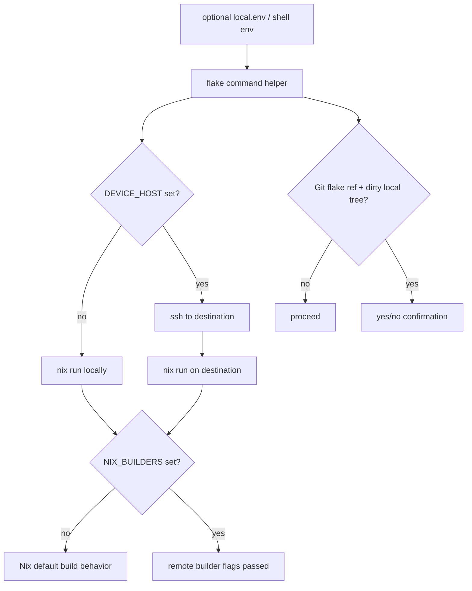

# Refactor Device Tooling Around Optional Flake Runs

## Summary

Replace Korri's mutable device-deploy tooling with a small optional-env Nix flake runner for testing the current Korri version on another machine. Korri will own only the operator command surface; the device/guest flake remains responsible for durable upgrades, services, rollback, Sway/session/input policy, and host-specific modules.

---

## Problem Frame

After the DEVICE rename, Korri still has tooling that assumes Korri deploys itself by rsyncing a repo checkout to the target, installing Bun on the target, and running TypeScript from `/storage/.guest/korri/app`. That is the wrong ownership boundary for the new direction: the device has its own Nix flake and modules for real runtime lifecycle. Korri only needs a reliable way to run or build a selected Korri flake output on a chosen machine for real-device testing.

---

## Requirements

### Topology and Configuration

- R1. Remove hard-coded machine topology from committed Korri tooling: destination host, source host/path/ref, and any per-run raw builder override must come from optional environment only.
- R2. Make `local.env` and `local.*.env` optional, ignored convenience files; absence of those files must not fail local commands.
- R3. Default to local behavior when topology values are omitted: no destination host means run on the current machine, no builder override means let Nix use its own configuration, and no explicit flake ref means infer the current checkout (`.` locally, `git+ssh://<source-host><repo-root>` for remote destinations).

### Safety

- R4. Add an explicit yes/no operator confirmation when a Git flake ref would omit uncommitted local worktree changes; non-interactive use must fail closed unless explicitly allowed.

### Ownership Boundary

- R5. Hard-cut old Korri-owned rsync/Bun-checkout device recipes and scripts; do not keep compatibility aliases or wrappers for the old deployment path.
- R6. Keep Korri runtime tooling host-agnostic: no command path should depend on ROCKNIX, EmulationStation, `essway`, ROCKNIX service names, or `/storage/.guest/korri/app`.
- R7. Leave durable device upgrades, rollback, service definitions, session/display/input policy, and host-specific modules to the device/guest flake.

### Verification

- R8. Preserve operator feedback: commands should make it clear whether they are running locally or over SSH, which flake/app they selected, and which optional Nix builder flags were applied.

---

## Scope Boundaries

- No backwards-compatible `bootstrap-device`, `sync-device`, old env aliases, or shim scripts.
- No committed default values for real hostnames such as Bandai, Zao, Fuji, Sobo, Thor, or generic `sm8550` targets.
- No new ROCKNIX-specific runtime abstraction in Korri.
- No Korri-owned NixOS service/module redesign for inputd/sessiond/API in this plan.
- No Korri-owned real upgrade or rollback workflow for the target device.
- No dirty-working-tree transport for `git+ssh://` refs in the first cut; the plan only surfaces that uncommitted changes will be omitted and lets the operator choose.
- No product UI or launcher registry changes.

### Deferred to Follow-Up Work

- Device/guest flake integration: `../rocknix-nix-guest` can consume Korri outputs and define durable services/upgrades in its own plan or PR.
- Full dirty working-tree remote transport for uncommitted changes: a future tool can add tarball or `path:`-copy workflows if needed.
- Binary cache/substituter setup: this plan accepts standard Nix remote builder behavior.
- Historical solution-doc cleanup: this plan updates active docs and runbooks only.

---

## Context & Research

### Relevant Code and Patterns

- `justfile` currently exports `DEVICE_HOST`, `DEVICE_APP_ROOT`, `DEVICE_API_PORT`, and `DEVICE_INPUT_BRIDGE_PORT` with committed defaults, then calls scripts such as `scripts/device/install.sh`, `scripts/device/deploy.sh`, `scripts/device/sync.sh`, and `scripts/device/dev.sh`.
- `scripts/device/install.sh` installs Bun, rsyncs the repo to `DEVICE_APP_ROOT`, runs `bun install` on the target, harvests Wayland/DBus env from the host session, installs helper scripts, writes systemd units, and masks host input services.
- `scripts/device/deploy.sh` combines rsync, on-target Nix profile install, service refresh, and smoke checks. The Nix part is the direction to keep; the rsync/service ownership parts are not Korri's responsibility in this plan.
- `flake.nix` already exposes `korri-desktop-device` as a package/app, which is enough for a minimal `nix run`-driven real-device test path.
- `nix/modules/korri-frontend.nix` is intentionally narrow today; this plan does not expand it because durable device services belong in the device/guest flake.

### Institutional Learnings

- `docs/solutions/integration-issues/one-command-odin-electrobun-deploy-needs-device-nix-and-session-env-2026-05-06.md`: the old deploy flow mixed package state, service state, and host session env. This plan avoids preserving that ownership mix in Korri.
- `docs/solutions/integration-issues/odin-electrobun-webkit-runtime-white-screen-2026-05-04.md`: keep the Nix-managed Electrobun runtime path and do not revive portable/proot or renderer fallback flags as the passing path.
- `docs/solutions/best-practices/product-owned-composition-keeps-shared-layers-reusable-2026-05-03.md`: shared/runtime layers should not smuggle one host's assumptions under generic names.

### External References

- Not used. Repo patterns and Nix flake behavior are sufficient for this bounded tooling refactor.

---

## Key Technical Decisions

- **Use `local.env` as optional topology input, not required configuration:** `just` can load `local.env` when present, and operators can use `just --dotenv-path local.<target>.env ...` for named targets. The committed `justfile` carries behavior, not local topology.
- **Use direct environment values as the public command contract:** the main knobs are `DEVICE_HOST`, `DEVICE_SSH_OPTS`, `KORRI_FLAKE_REF`, `KORRI_SOURCE_HOST`, `KORRI_APP`, optional raw `NIX_BUILDERS` / `NIX_MAX_JOBS`, and `KORRI_ALLOW_DIRTY_FLAKE_RUN`.
- **Let Nix own the builder matrix:** the helper passes no builder flags by default, so Nix uses the machine/user's configured builders. Korri does not invent a builder mini-language. Advanced callers can still provide raw `NIX_BUILDERS` and `NIX_MAX_JOBS` for a one-off override.
- **Infer the current checkout when flake ref is omitted:** when `KORRI_FLAKE_REF` is unset and `DEVICE_HOST` is unset, commands use `.`. When `KORRI_FLAKE_REF` is unset and `DEVICE_HOST` is set, the helper infers `git+ssh://<source-host><repo-root>` from the current Git checkout, using `KORRI_SOURCE_HOST` when set and otherwise the local hostname.
- **Destination host changes where the command runs, not what Korri owns:** when `DEVICE_HOST` is set, Korri shells into that destination and asks Nix there to run the selected flake/app. The destination machine's Nix configuration owns builder selection for that run; persistent service lifecycle remains outside Korri's command surface.
- **Dirty tree prompt lives in tooling, not runtime:** runtime packages should not know about Git. The command helper checks local Git state before remote execution and prompts or fails closed for Git-backed refs that omit local changes; the first cut warns honestly rather than transporting uncommitted edits.
- **Hard delete old mutable deployment surfaces:** old scripts and recipes that exist only to sync source, install Bun on the target, harvest host session env, or run from `DEVICE_APP_ROOT` are removed rather than preserved as aliases.

---

## Open Questions

### Resolved During Planning

- **Should missing topology values fail?** No, except unrecoverable inference failures. Missing optional values should fall back to local/default Nix behavior, infer the source flake ref from the current checkout for remote runs, or produce a clear diagnostic if the repo root/hostname cannot be inferred.
- **Should old recipes remain for compatibility?** No. The cut removes old aliases and wrappers.
- **Should Korri runtime know whether ROCKNIX is the host?** No. ROCKNIX-specific concerns move to the guest repo or importer tooling.
- **Should Korri own real device upgrades/rollback?** No. The device/guest flake owns real upgrades, modules, services, rollback, and host policy.
- **Should users be warned about uncommitted changes omitted by Git flake refs?** Yes. Provide an explicit yes/no selector and fail closed in non-interactive mode unless an opt-in env override is set.

### Deferred to Implementation

- **Exact helper implementation style:** the helper may be a TypeScript CLI or small shell wrapper, but tests should cover command construction without real SSH/Nix execution.
- **Whether to expose `device-build` in addition to `device-run`:** implementation may include a build-only dry path if useful, but `device-run` is the minimum required surface.

---

## Output Structure

    local.env.example
    tools/device/
      flake-command.ts
      flake-command.test.ts
    docs/device-flake-run.md

The tree shows expected new files only. Existing files listed in implementation units remain authoritative.

---

## High-Level Technical Design

> *This illustrates the intended approach and is directional guidance for review, not implementation specification. The implementing agent should treat it as context, not code to reproduce.*

The helper builds a command from optional env values. It does not encode hostnames, ROCKNIX state, target service policy, or upgrade/rollback semantics.

---

## Implementation Units

### U1. Add optional local topology env contract

**Goal:** Establish a committed example and ignored local env convention without requiring local env files for normal local runs.

**Requirements:** R1, R2, R3

**Dependencies:** None

**Files:**
- Modify: `.gitignore`
- Modify: `justfile`
- Create: `local.env.example`

**Approach:**
- Configure `justfile` to load `local.env` when present, while continuing successfully when it is absent.
- Remove committed default machine names from top-level `DEVICE_*` exports.
- Add `local.env.example` with commented placeholder examples for destination host, SSH options, optional source-host override, optional explicit flake ref, app name, raw builder escape hatch, max jobs, and the dirty-flake-run override.
- Add only the ignore patterns `local.env` and `local.*.env`, while keeping `local.env.example` committed.
- Avoid putting real hostnames in the example.

**Patterns to follow:**
- Existing `.env` / `.env.example` ignore pattern in `.gitignore`.
- Current justfile recipe style: thin recipes delegate behavior to tools.

**Test scenarios:**
- Test expectation: none -- this unit establishes dotenv/gitignore scaffolding; U2 covers command behavior once the helper exists.

**Verification:**
- `just --list` works without `local.env`.
- Static search of `justfile` finds no committed real host defaults.
- `local.env` stays ignored and `local.env.example` is committed.

---

### U2. Build the optional-topology flake run helper

**Goal:** Provide the small reusable command surface that can run a selected Korri flake app locally or on a destination host with optional remote builders.

**Requirements:** R1, R3, R8

**Dependencies:** U1

**Files:**
- Create: `tools/device/flake-command.ts`
- Create: `tools/device/flake-command.test.ts`
- Modify: `justfile`

**Approach:**
- Implement a pure command-construction layer with inputs for flake ref, source host, app, destination host, SSH options, optional raw builders, and max jobs.
- Use `KORRI_FLAKE_REF` when set.
- When `KORRI_FLAKE_REF` is unset and `DEVICE_HOST` is unset, use `.`.
- When `KORRI_FLAKE_REF` is unset and `DEVICE_HOST` is set, infer `git+ssh://<source-host><repo-root>` from `git rev-parse --show-toplevel` and `KORRI_SOURCE_HOST` or the local hostname.
- Use `KORRI_APP` when set; otherwise default to `korri-desktop-device`.
- When `DEVICE_HOST` is unset, execute `nix run` on the current machine.
- When `DEVICE_HOST` is set, execute the generated `nix run` on that destination over SSH; the destination's Nix config owns builder selection unless raw builder override env is explicitly provided.
- If raw `NIX_BUILDERS` is set, pass it through exactly once.
- Include `--builders` and `--max-jobs` only when their raw env values are present.
- Keep SSH option handling shell-safe so spaces in `DEVICE_SSH_OPTS` or builder strings do not corrupt the command.
- Surface a dry-run/print mode if useful for operator confidence, but keep `device-run` as the primary recipe.

**Technical design:** Directional command matrix:

| Input state | Outcome |
|---|---|
| no `DEVICE_HOST`, no builders | local `nix run .#korri-desktop-device` with no builder flags |
| `DEVICE_HOST` set, no explicit flake ref | infer `git+ssh://<source-host><repo-root>` and run it on the destination |
| `DEVICE_HOST` set, explicit flake ref | SSH destination runs `nix run <ref>#<app>` using destination's Nix defaults |
| raw `NIX_BUILDERS` set | generated Nix command passes raw builders exactly once |
| no raw builder override | generated Nix command omits `--builders`; for remote runs, the destination's Nix configuration decides |
| `NIX_MAX_JOBS` unset | generated Nix command omits `--max-jobs` |
| `KORRI_FLAKE_REF` set | command uses that ref instead of inference |

**Patterns to follow:**
- Existing pure helper plus CLI test style in `tools/library/launcher-config-cli.ts` and `tools/library/launcher-config-cli.test.ts`.
- Existing device tools under `tools/device/*.test.ts` that separate command construction from execution.

**Test scenarios:**
- Happy path: no topology env yields a local `nix run` command against `.` and the default app.
- Happy path: destination host env wraps the Nix command in SSH and preserves the flake/app target.
- Happy path: no builder env omits `--builders` so Nix configuration owns builder selection.
- Happy path: raw `NIX_BUILDERS` and `NIX_MAX_JOBS` env add their corresponding Nix flags.
- Edge case: empty-string env values are treated as absent.
- Edge case: custom `KORRI_APP` changes only the app selector, not the flake ref.
- Edge case: `DEVICE_HOST` set with no explicit flake ref infers a Git SSH ref from the local checkout and source host.
- Error path: remote run without explicit flake ref fails clearly if the current repo root or source host cannot be inferred.
- Error path: unsafe or unparsable SSH options produce a clear diagnostic rather than an incorrectly quoted command.
- Integration: the `device-run` just recipe delegates to this helper and works without top-level hard-coded env exports.

**Verification:**
- Unit tests cover command matrices without making real SSH or Nix calls.
- `device-run` can be inspected in dry-run/print mode, if implemented, to show local vs SSH execution and optional flags.

---

### U3. Add dirty Git flake confirmation

**Goal:** Prevent operators from accidentally running stale committed code when a Git flake ref will not include local uncommitted changes.

**Requirements:** R4

**Dependencies:** U2

**Files:**
- Modify: `tools/device/flake-command.ts`
- Test: `tools/device/flake-command.test.ts`
- Modify: `local.env.example`

**Approach:**
- Detect whether the selected or inferred flake ref is Git-backed and committed-state based, such as `git+ssh://`, `git+https://`, or `github:`.
- Check the local Korri worktree for dirty tracked or untracked changes.
- If the ref is Git-backed and the tree is dirty, prompt with a yes/no selector in interactive mode.
- Treat `process.stdin.isTTY === false` as non-interactive; in non-interactive mode, abort unless `KORRI_ALLOW_DIRTY_FLAKE_RUN=1` is set.
- Do not prompt when the flake ref is `.` or a local path ref intended to include current working-tree contents.
- Keep the dirty check advisory and tooling-only; runtime packages do not learn about Git.

**Patterns to follow:**
- Existing CLI diagnostic style in `tools/library/launcher-config-cli.ts`.
- Repository rule that surprising shared-state changes require confirmation.

**Test scenarios:**
- Happy path: clean tree plus Git flake ref proceeds without prompt.
- Happy path: dirty tree plus local path ref proceeds without prompt.
- Edge case: untracked files count as dirty for Git flake refs.
- Edge case: staged but uncommitted changes count as dirty.
- Error path: dirty tree plus Git flake ref with `stdin` not attached to a TTY aborts with a message explaining that local changes will be omitted.
- Error path: dirty tree plus Git flake ref with explicit override proceeds and records that the operator bypassed the prompt.
- Integration: the prompt path can be answered yes/no without executing Nix in tests.

**Verification:**
- Tests prove the dirty gate fires only for refs that omit local changes.
- Operator-facing docs explain why committing or switching to a local path ref changes behavior.

---

### U4. Hard-delete old Korri-owned mutable device deploy surface

**Goal:** Remove old Korri recipes and scripts that imply Korri owns target checkout deployment, target Bun installation, host session harvesting, or durable service lifecycle.

**Requirements:** R5, R6, R7

**Dependencies:** U2, U3

**Files:**
- Modify: `justfile`
- Delete: `scripts/device/install.sh`
- Delete: `scripts/device/deploy.sh`
- Delete: `scripts/device/sync.sh`
- Delete: `scripts/device/dev.sh`
- Delete: `scripts/device/run-api.sh`
- Delete: `scripts/device/run-inputd.sh`
- Delete: `scripts/device/run-sessiond.sh`
- Delete: `scripts/device/run-input-bridge.sh`
- Delete: `scripts/device/install-inputd-service.sh`
- Delete: `scripts/device/install-sessiond-service.sh`
- Delete: `scripts/device/install-korri-toggle.sh`
- Delete: `scripts/device/install-sway-layout.sh`
- Delete: `scripts/device/desktop-preflight.sh`
- Delete: `scripts/device/smoke.sh`
- Delete: `scripts/device/smoke-sessiond.sh`
- Delete: `scripts/device/smoke-electrobun.sh`
- Delete: `scripts/device/smoke-input.ts`
- Delete: `scripts/device/smoke-rpc.ts`
- Delete or relocate: `scripts/device/bin/*`
- Modify: `.fallowrc.json`

**Approach:**
- Remove `install-device`, `deploy-device`, `sync-device`, `dev-device`, `check-device`, `check-device-sessiond`, `check-device-electrobun`, `device-sessiond-status`, `device-desktop-preflight`, and `bootstrap-device`.
- Replace the surviving Korri-owned device surface with `device-run` and, if implementation finds it useful, `device-build` or `device-print-run-command`.
- Delete scripts whose purpose is mutable checkout deployment, target Bun installation, host session harvesting, or service installation.
- Do not move durable service or toggle behavior into Korri in this plan; that belongs to the device/guest flake if it is still needed.
- Update Fallow/Biome inputs only if removed script paths were explicitly listed.

**Patterns to follow:**
- Current justfile's thin recipe style.
- Hard-cut rename precedent from the DEVICE naming refactor.

**Test scenarios:**
- Happy path: `just --list` exposes the new flake-run recipe and no old compatibility aliases.
- Edge case: running `device-run` with no env uses local/default Nix behavior rather than requiring `DEVICE_HOST`.
- Error path: attempts to call removed recipes fail because the recipe no longer exists, not because a wrapper prints a deprecation message.
- Integration: static search finds no `/storage/.guest/korri/app`, `/storage/bin/bun`, or `DEVICE_APP_ROOT` dependency in active Korri tooling.

**Verification:**
- Old scripts are deleted from Korri.
- `just lint`, typecheck, and unit tests pass after recipe/script removal.
- Korri no longer contains active tooling that writes target systemd units, masks host services, or harvests host session env.

---

### U5. Update active docs for the flake-run boundary

**Goal:** Document the new optional-env flake workflow and make the ownership boundary clear for future agents/operators.

**Requirements:** R1, R2, R4, R6, R7, R8

**Dependencies:** U1, U2, U3, U4

**Files:**
- Create: `docs/device-flake-run.md`
- Modify: `AGENTS.md`
- Delete: `docs/device-iterative-loop.md`

**Approach:**
- Replace docs that describe rsync/Bun checkout deployment with the flake run workflow.
- Explain optional `local.env` usage and show placeholder examples only.
- Document dirty Git flake behavior and the explicit override for non-interactive automation.
- State that the Korri repo only owns run/build/test commands for selected Korri flake outputs.
- State that the device/guest flake owns real upgrades, rollback, services, Sway/session/input policy, and host-specific modules.
- Delete `docs/device-iterative-loop.md` rather than preserving an iteration-loop document whose premise was the synced checkout.

**Patterns to follow:**
- Existing concise operational style in `docs/device-iterative-loop.md`, while replacing its synced-checkout premise.
- Current AGENTS device tooling command section.

**Test scenarios:**
- Test expectation: none for prose docs.
- Integration: static search fails or is manually checked if old recipe names, host defaults, or checked-out app paths return to active docs/tooling.

**Verification:**
- Active docs explain how to run locally, run on a destination, and use optional remote builders without hard-coded values.
- Docs clearly say that durable device lifecycle belongs to the device/guest flake, not this Korri command surface.

---

## System-Wide Impact

- **Interaction graph:** `justfile` becomes a thin command surface over the flake command helper; Nix flake outputs remain the runtime source of truth; the device/guest flake remains the owner of durable system policy.
- **Error propagation:** dirty tree, unreachable SSH, unavailable builders, missing Nix, and command failures should surface as operator-facing command errors.
- **State lifecycle risks:** removing old scripts may leave stale files on existing targets, but Korri no longer owns cleanup of durable device state; docs should direct operators to the device/guest flake for real upgrade/recovery.
- **API surface parity:** local runs, destination-host runs, and remote-builder runs all use the same helper and env contract.
- **Integration coverage:** unit tests cover command construction and dirty gating; static search/docs checks cover removal of old mutable deployment assumptions.
- **Unchanged invariants:** `korri-desktop-device` remains the default device app selector for this command surface; ProseQL and launcher registry behavior are unchanged.

---

## Risks & Dependencies

| Risk | Mitigation |
|------|------------|
| The plan removes old scripts before the device/guest flake has an equivalent durable lifecycle. | This is intentional ownership separation: Korri stops claiming that lifecycle. Document that durable lifecycle belongs to the device/guest flake. |
| Operator runs against stale remote Git ref and misses local changes. | Dirty gate prompts for Git-backed refs whenever local worktree changes exist. |
| Dirty-tree prompt blocks automation. | Provide an explicit env override for non-interactive use and document it in `local.env.example` / docs. |
| Remote builders are unavailable or misconfigured. | Omit builder flags unless explicitly set; let Nix defaults work locally; errors name the builder config source. |
| Runtime/tooling accidentally preserves ROCKNIX coupling. | U4 deletes host-probing scripts; U5 documents the boundary; static search verifies no active Korri tooling depends on host-specific names or checked-out app paths. |

---

## Documentation / Operational Notes

- Add `local.env.example` with placeholders and comments, not real topology.
- Document these example flows: local run with no env, destination run with inferred `git+ssh://<source-host><repo-root>`, destination run using explicit `KORRI_FLAKE_REF=git+ssh://...`, destination-owned Nix-configured builders with no Korri builder env, and advanced one-off builder override with raw `NIX_BUILDERS`.
- Document that Git flake refs see committed Git state; uncommitted local changes require committing, using a local path ref for local-only runs, or explicitly confirming stale-ref execution.
- Document that the device/guest flake owns real upgrades, rollback, service declarations, Sway/session/input policy, and any host-specific substrate handling.

---

## Sources & References

- Related plan: `docs/plans/2026-05-13-002-refactor-device-runtime-naming-plan.md`
- Related code: `justfile`
- Related code: `flake.nix`
- Related code: `nix/korri-desktop.nix`
- Related code: `nix/modules/korri-frontend.nix`
- Related code: `scripts/device/install.sh`
- Related code: `scripts/device/deploy.sh`
- Institutional learning: `docs/solutions/integration-issues/one-command-odin-electrobun-deploy-needs-device-nix-and-session-env-2026-05-06.md`
- Institutional learning: `docs/solutions/integration-issues/odin-electrobun-webkit-runtime-white-screen-2026-05-04.md`
- Institutional learning: `docs/solutions/best-practices/product-owned-composition-keeps-shared-layers-reusable-2026-05-03.md`
