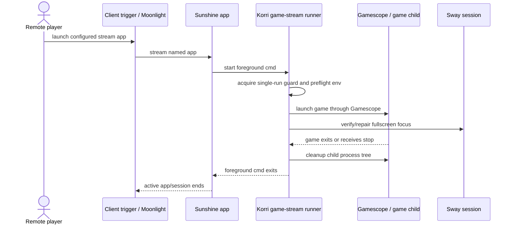

# Add Headless Game Stream Runner

## Summary

Add a reusable Korri headless-game-stream runner and NixOS module that let Sunshine launch one configured non-Steam game as a foreground app command. The implementation uses the existing structured-launch and Sway command-runner posture, defaults to Gamescope for fullscreen reliability, and leaves host-specific `aka` wiring to the consuming NixOS configuration.

---

## Problem Frame

The origin requirements define a minimal proof: a remote player should start one streamed game without manually operating the remote desktop, and exiting the game should end the active stream/session. Planning must preserve that narrow scope while choosing an implementation shape that fits Korri's existing Nix, launcher, and Sway/session patterns.

---

## Requirements

- R1. Support exactly one configured validation game.
- R2. Use a simple non-Steam Nix package as the default validation target; recommend Neverball unless implementation finds a better small package.
- R3. Keep the validation surface script-friendly and usable outside the Korri app.
- R4. Export reusable Korri package/module pieces for an external NixOS host config to consume.
- R5. Starting the flow must launch the configured game and make a remote stream connection possible without requiring the user to manually operate the remote desktop.
- R6. Make the launched game fill the stream target, using Gamescope by default and Sway focus/fullscreen repair as the verification/repair layer.
- R7. When the game exits or the foreground app is stopped, clean up child processes and let the active Sunshine app/session end without stopping the Sunshine service.
- R8. After success, failure, or termination, leave the runner ready for another validation attempt.
- R9. Do not launch Steam games.
- R10. Do not invoke Steam gamepad/fullscreen UI.
- R11. Do not add stream quality, latency, bitrate, resolution, FPS, or adaptive profile optimization.
- R12. Gamescope may be used if it helps make fullscreen or session behavior reliable; this plan makes it the supported v1 validation path.

**Origin actors:** A1 (Remote player), A2 (Client trigger), A3 (Headless gaming server), A4 (Streaming client/session)
**Origin flows:** F1 (Start a one-game remote play session), F2 (End a one-game remote play session)
**Origin acceptance examples:** AE1 (launch/connect/fullscreen), AE2 (exit stops session and rerun works), AE3 (no Steam), AE4 (no stream optimization)

---

## Scope Boundaries

- No Korri app UI integration.
- No whole-library or multi-game remote launch.
- No Steam launching or Steam UI behavior beyond enforcing the non-Steam boundary.
- No stream optimization or adaptive profile work.
- No host-specific `mountainous` or `aka` config changes in this repo.
- No refactor of the existing Odin/Electrobun `sessiond` into a generic framework.
- No Sunshine service stop/restart as the normal session cleanup path.

### Deferred to Follow-Up Work

- External host wiring: the `mountainous` `aka` host should consume the Korri flake package/module in its own repo.
- Client-device script installation: Odin Portal 2 / Thor can add a launchable Moonlight script after the server-side Sunshine app name and host address are validated.
- Multi-game launch registry integration: future work can bridge this runner to Korri library entries once the one-game lifecycle is proven.

---

## Context & Research

### Relevant Code and Patterns

- `korri/shared/library/launcher.ts` and `korri/shared/library/shell-launcher.ts` already model launch specs as structured argv and resolve when the child process exits. The new runner should preserve that posture rather than shelling through arbitrary strings.
- `tools/device/sessiond.ts` and `tools/device/sessiond-state.ts` provide prior art for explicit session modes, foreground launch handoff, and restore/cleanup after game exit. The new runner should borrow the state-machine idea without inheriting Odin/Electrobun assumptions.
- `tools/device/sessiond-sway.ts` and `tools/device/sessiond-sway.test.ts` show how to parse `swaymsg -t get_tree`, select windows by app id/title/class, and build focus/fullscreen/border repair commands through an injected runner.
- `nix/korri-inputd.nix`, `nix/modules/korri-inputd.nix`, and `flake.nix` define the current pattern for a Bun-built Linux package, NixOS module options under `services.korri.*`, package/app exports, and `nixosModules` exports.
- `tools/device/flake-command.ts` demonstrates command construction as data, remote process-group cleanup, and tests around shell command rendering.

### Institutional Learnings

- `docs/solutions/integration-issues/supervise-chromium-kiosk-session-after-game-exit-2026-05-04.md`: fullscreen/session state should be treated as a lifecycle invariant, not a one-shot launch flag; avoid broad `pkill -f` cleanup and prefer child handles or stored process ownership.
- `docs/solutions/integration-issues/one-command-odin-electrobun-deploy-needs-device-nix-and-session-env-2026-05-06.md`: systemd-launched graphical/session code needs explicit `DISPLAY`, `XDG_RUNTIME_DIR`, `WAYLAND_DISPLAY`, and `SWAYSOCK` handling rather than assuming an interactive shell environment.
- `docs/solutions/best-practices/product-owned-composition-keeps-shared-layers-reusable-2026-05-03.md`: reusable Korri layers must remain host-agnostic; concrete host policy belongs in the consuming NixOS configuration.

### External References

- Sunshine app lifecycle docs and examples: `cmd` is lifecycle-tracked, `detached` is not; app shutdown ends the stream except for detached apps. Use `auto-detach = false` and keep the runner in the foreground.
- Moonlight Qt CLI supports launching a named Sunshine app with `moonlight stream <host> <app>` and stopping with `moonlight quit <host>`; Moonlight remains client-side and should not become a server module dependency.
- Gamescope supports fullscreen/borderless wrapping and exits with the primary child, making it a good v1 containment helper.
- Sway supports runtime `fullscreen enable`, focus commands, criteria matching, and `swaymsg -t get_tree` inspection.
- NixOS `services.sunshine.applications` can declaratively contribute Sunshine apps; when used, Nix config becomes authoritative for those apps.

---

## Key Technical Decisions

- Sunshine owns the stream-app lifecycle: Moonlight should start one named Sunshine app, Sunshine should run the Korri runner as that app's foreground `cmd`, and runner exit should let Sunshine end the active app/session.
- The runner owns the game child lifecycle through a managed-child seam: it should spawn one configured command, expose the child identity while running, repair fullscreen before the child exits, handle termination by cleaning its child process tree, and report enough state for validation.
- Gamescope is the default fullscreen containment strategy: it is allowed by the origin requirements and reduces v1 risk; Sway repair remains a belt-and-suspenders layer.
- Use realized package paths or module-provided binaries, not dynamic `nix run` during session startup: this avoids turning Nix evaluation, network, or cache misses into false stream-orchestration failures.
- When Sunshine app contribution is enabled, the NixOS module configures exactly one Sunshine application but does not stop Sunshine itself after a game exits: stopping the service risks pairing/session disruption and is unnecessary for the v1 lifecycle.
- Duplicate starts are rejected with a host/session-scoped guard: only one active run is allowed even if Sunshine starts two runner processes, so multiple triggers cannot compete for Sway focus, input, audio, or cleanup ownership.
- No arbitrary remote command surface: the client trigger starts the configured Sunshine app through Sunshine's existing pairing/authentication model; the module must not add a new unauthenticated listener and must not accept arbitrary commands from the client.
- Runner/game execution is non-root: the runner should execute as the Sunshine/session user and refuse to run as uid 0 unless an explicit unsafe debug override is configured.
- Sunshine API control is prohibited in the active v1 plan: if early validation proves foreground app exit does not close the active session, pause and revise the plan with a credential strategy instead of improvising token handling.

---

## Open Questions

### Resolved During Planning

- **Which streaming lifecycle should v1 use?** Use Sunshine's foreground app command lifecycle rather than building a separate stream manager.
- **Should normal cleanup stop the Sunshine service?** No. End only the active app/session and leave the service available for pairing and later runs.
- **Should Gamescope be included?** Yes. Gamescope is the supported v1 validation path; a plain-Sway path is not part of the acceptance burden unless target validation proves Gamescope unsuitable.
- **Should the game be launched with dynamic `nix run` at session time?** No. The module should provide a realized package/binary command to the runner.
- **Should the implementation call Sunshine's API to close sessions?** No for the active v1 plan. Validate the foreground `cmd` lifecycle first; if it fails to close the active session, revise the plan before adding API credentials.

### Deferred to Implementation

- **Exact validation game:** Use Neverball unless implementation finds a more reliable small non-Steam package during packaging/testing.
- **Exact Sway selector values:** Validate the real Gamescope/game `app_id`, title, or class on the target session and keep selectors configurable.
- **Exact Moonlight client packaging:** The plan defines the command contract, but installing a client-device script remains host/client repo work.

---

## Output Structure

    tools/device/
      game-stream-runner.ts
      game-stream-runner.test.ts
      game-stream-state.ts
      game-stream-state.test.ts
      game-stream-fullscreen.ts
      game-stream-fullscreen.test.ts
    nix/
      korri-game-stream-runner.nix
      modules/korri-game-stream.nix

This tree shows the expected new files. Existing files listed in implementation units remain authoritative, and the implementer may adjust names if implementation reveals a clearer layout while preserving the package/module boundary.

---

## High-Level Technical Design

> *This illustrates the intended approach and is directional guidance for review, not implementation specification. The implementing agent should treat it as context, not code to reproduce.*

The runner is the foreground application from Sunshine's perspective. It does not start Sunshine, tune stream settings, or expose an arbitrary launcher; it owns only the configured game process and fullscreen/session cleanup.

---

## Implementation Units

### U1. Add the game-stream lifecycle core

**Goal:** Create a minimal, testable lifecycle model for one active headless game-stream run.

**Requirements:** R1, R7, R8, F2, AE2

**Dependencies:** None

**Files:**
- Create: `tools/device/game-stream-state.ts`
- Create: `tools/device/game-stream-state.test.ts`
- Create: `tools/device/game-stream-runner.ts`
- Create: `tools/device/game-stream-runner.test.ts`

**Approach:**
- Model the runner as explicit states such as idle, starting, running, stopping, exited, and failed rather than booleans.
- Accept one configured launch command from server-side configuration and run it as a foreground child process.
- Add a host/session-scoped cross-process lock so a second runner process fails or no-ops without launching another game.
- Use a managed-child/process-supervisor seam that exposes child identity, exit observation, and process-tree termination separately from the existing await-to-completion launcher contract.
- Handle success, non-zero child exit, spawn failure, and termination signals through the same cleanup path.
- Keep child process cleanup PID/process-group aware; do not use broad process-name killing.
- Preflight that the runner is not executing as root unless an explicit unsafe debug override is configured.
- Emit structured lifecycle logs and a small status snapshot suitable for smoke validation.

**Execution note:** Implement the pure state transitions test-first before wiring real subprocess behavior.

**Patterns to follow:**
- `tools/device/sessiond-state.ts` for explicit lifecycle transitions.
- `korri/shared/library/shell-launcher.ts` for structured argv and foreground lifecycle intent, while adding a runner-local managed-child seam because fullscreen repair must happen before child exit.
- `tools/device/flake-command.ts` for process-group cleanup posture.

**Test scenarios:**
- Happy path: idle runner starts one configured command, enters running, exposes child identity for fullscreen repair, observes child exit, records exited, and returns to rerunnable state.
- Edge case: two independent runner processes contend for the same host/session lock; the second exits without spawning a child.
- Edge case: a stale lock whose process is no longer alive is recovered and does not permanently block reruns.
- Error path: missing or failing command records failure, runs cleanup, and leaves the runner rerunnable.
- Error path: non-zero game exit records the failure while still completing cleanup and rerun readiness.
- Integration: terminating the runner while the child is active terminates the child process tree before the runner exits.
- Integration: a child that forks or ignores SIGTERM is still cleaned up through the selected process-ownership strategy.
- Boundary: a configured non-Steam command is preserved as structured argv and is not interpreted as shell text.

**Verification:**
- Lifecycle tests cover every state transition and failure cleanup path.
- Runner tests demonstrate that success, failure, and termination all leave the runner able to start again.

---

### U2. Add fullscreen and Sway repair helpers

**Goal:** Ensure the game fills the streamed surface using Gamescope by default and Sway repair when needed.

**Requirements:** R6, R8, R12, F1, AE1

**Dependencies:** U1

**Files:**
- Create: `tools/device/game-stream-fullscreen.ts`
- Create: `tools/device/game-stream-fullscreen.test.ts`
- Modify: `tools/device/game-stream-runner.ts`
- Test: `tools/device/game-stream-runner.test.ts`

**Approach:**
- Add a small launch-composition helper that can wrap the configured game command in Gamescope when enabled.
- Treat Gamescope as the supported v1 validation path and wrap the configured game command with it.
- Add Sway target selection and repair around the Gamescope stream surface.
- Wait for the stream-surface window to appear before applying repair; an empty tree during startup is pending, while timeout is failure.
- Reuse the injected-runner pattern from existing Sway helpers so tests assert command construction without requiring a live compositor.
- Preflight the graphical session environment needed for Sway/Gamescope access and fail cleanly when required values are missing.
- Prefer parsed Sway container ids for repair commands so titles/classes are never interpolated into executable Sway criteria.

**Patterns to follow:**
- `tools/device/sessiond-sway.ts` for Sway tree parsing, selector matching, and repair command construction.
- `tools/device/sessiond-sway.test.ts` for injected Sway runner tests.
- `docs/solutions/integration-issues/one-command-odin-electrobun-deploy-needs-device-nix-and-session-env-2026-05-06.md` for explicit session env handling.

**Test scenarios:**
- Happy path: configured game command is wrapped with Gamescope for the v1 validation path.
- Happy path: Sway repair waits for, focuses, and fullscreens the selected Gamescope stream-surface window.
- Edge case: if the target window is not present on the first Sway tree read, the helper keeps waiting until timeout rather than failing immediately.
- Edge case: if the target window is already focused/fullscreen, repair emits no unnecessary commands.
- Edge case: titles/classes containing quotes, brackets, or semicolons cannot inject Sway commands because repair targets parsed container ids.
- Error path: missing Sway/Wayland environment fails before launching the game and leaves the runner rerunnable.
- Error path: fullscreen repair timeout/failure records a validation failure and still cleans up the child process.
- Integration: Covers AE1. A simulated Gamescope window appears not-fullscreen; runner applies repair and records fullscreen success.

**Verification:**
- Unit tests prove Gamescope command composition is data-driven and does not shell through a single string.
- Sway tests prove focus/fullscreen repair commands target the selected window only.

---

### U3. Package the runner as a Korri flake output

**Goal:** Build the runner as a Linux package/app that external hosts can consume from Korri's flake.

**Requirements:** R3, R4, R5

**Dependencies:** U1, U2

**Files:**
- Create: `nix/korri-game-stream-runner.nix`
- Modify: `flake.nix`

**Approach:**
- Follow the `korri-inputd` package pattern: build the TypeScript runner with Bun, install it under a stable binary name, and expose a Linux-only package/app from `flake.nix`.
- Include runtime tools through the wrapper or module path rather than assuming global binaries.
- Keep the package generic: it should run the configured one-game session but not encode `aka`, real hostnames, Moonlight pairing, or host-specific display topology.
- Ensure the package is available for the same Linux systems as existing device/runtime packages.

**Patterns to follow:**
- `nix/korri-inputd.nix` for Bun CLI packaging.
- `flake.nix` for Linux-only package/app exports.
- `docs/plans/2026-05-13-003-refactor-flake-device-run-tooling-plan.md` for host-agnostic flake-output ownership boundaries.

**Test scenarios:**
- Test expectation: none -- packaging is primarily Nix integration; behavior is covered by U1 and U2 tests.

**Verification:**
- The flake exposes a `korri-game-stream-runner` package and app on Linux systems.
- A Nix build of the new package succeeds in the project environment.

---

### U4. Add the reusable NixOS module and Sunshine app integration

**Goal:** Let an external NixOS host enable the runner and declaratively contribute one Sunshine app without host-specific Korri code.

**Requirements:** R1, R2, R4, R5, R7, R9, R10, R11, AE3, AE4

**Dependencies:** U3

**Files:**
- Create: `nix/modules/korri-game-stream.nix`
- Modify: `flake.nix`

**Approach:**
- Add `services.korri.gameStream` options for enabling the module, selecting the runner package, selecting the game package/command, configuring Gamescope/Sway paths, configuring session-environment discovery, and optionally contributing a Sunshine application.
- Default the validation game to a small non-Steam package such as Neverball, while allowing the host to override the package/command.
- Configure the Sunshine application to run the Korri runner as the tracked foreground command, not as a detached process.
- Preserve Sunshine service availability: do not make normal game exit stop or restart the Sunshine service.
- Add module-level path/environment options following the `korri-inputd` module pattern, but do not rely only on static socket values; support a host-supplied runtime env file or resolver command and validate socket existence/ownership at launch.
- Make Sunshine app contribution opt-in/configurable so hosts that already manage `services.sunshine.applications` can install the runner without Korri overwriting app configuration.
- State the trust boundary in module options: the runner is launched through Sunshine's authenticated/pairing model, the module adds no unauthenticated TCP listener, and Sunshine exposure should be limited to trusted networks or VPN.
- Export the module through `nixosModules` and include it in the aggregate `korri` module.

**Patterns to follow:**
- `nix/modules/korri-inputd.nix` for `services.korri.*` option style, package override, environment, path, and systemd integration patterns.
- External Sunshine docs for foreground `cmd`, `auto-detach = false`, and `wait-all` lifecycle behavior.
- `docs/solutions/best-practices/product-owned-composition-keeps-shared-layers-reusable-2026-05-03.md` for keeping host-specific policy outside reusable modules.

**Test scenarios:**
- Happy path: module evaluation with Sunshine app contribution enabled produces one Sunshine app whose command is the Korri runner and whose game is non-Steam.
- Happy path: module evaluation with a custom game command uses the configured package/command without accepting client-provided arbitrary commands.
- Edge case: disabling Sunshine app contribution still exposes/installs the runner for hosts that want to wire Sunshine themselves.
- Edge case: runtime environment can be supplied through the configured discovery seam rather than hardcoded Sway socket values.
- Boundary: module-generated app config does not include Steam commands or stream optimization settings.
- Boundary: module default behavior does not stop or restart `services.sunshine` after game exit.

**Verification:**
- Nix module evaluation succeeds with defaults and with an overridden game command.
- The module is available from `nixosModules.korri-game-stream` and the aggregate `nixosModules.korri`.

---

### U5. Add end-to-end validation seams and operator feedback

**Goal:** Make the one-game proof diagnosable and safe to run repeatedly from a client-triggered Sunshine session.

**Requirements:** R3, R5, R7, R8, AE1, AE2, AE3, AE4

**Dependencies:** U1, U2, U3, U4

**Files:**
- Modify: `tools/device/game-stream-runner.ts`
- Test: `tools/device/game-stream-runner.test.ts`
- Test: `tools/device/game-stream-fullscreen.test.ts`

**Approach:**
- Keep the v1 status/report surface local: structured logs/stdout and/or a runtime status file with restrictive permissions, not a TCP server, RPC endpoint, or UI.
- Record current lifecycle state, child process identity when active, last failure, and fullscreen repair outcome while redacting environment values and secrets.
- Make startup preflight failures explicit so the operator can distinguish missing game, missing Gamescope, missing Sway env, and Sway repair failure.
- Add cleanup behavior for partial starts: if Gamescope launches but the game fails, or if fullscreen repair fails after launch, the child process tree is terminated and the run becomes retryable.
- Define the script-friendly client contract without installing client scripts in this repo: the client starts the configured Sunshine app with Moonlight, and game exit or client stop should terminate the runner/game lifecycle.
- Add early real-host validation gates for Sunshine's foreground app lifecycle and the Gamescope default path: a trivial app exits and closes the active app/session, then the configured demo game appears fullscreen through Gamescope. If either gate fails, revise the plan before adding Sunshine API control or making plain Sway a supported fallback.

**Patterns to follow:**
- `tools/device/sessiond.test.ts` for lifecycle events captured in a deterministic harness.
- `docs/solutions/integration-issues/supervise-chromium-kiosk-session-after-game-exit-2026-05-04.md` for explicit smoke validation of a session invariant.

**Test scenarios:**
- Integration: Covers AE1. A configured run launches, reports running, applies fullscreen repair, and remains foreground until the child exits.
- Integration: Covers AE2. Game exit causes runner exit/cleanup and another run succeeds afterward.
- Integration: client/session stop signal terminates the child process tree and leaves the runner retryable.
- Integration: a real-host Sunshine/Moonlight smoke proves foreground app exit closes the active app/session and the Gamescope-wrapped demo game appears fullscreen before U5 is considered complete.
- Error path: Gamescope starts but the game command fails; cleanup terminates the wrapper and records the failure.
- Error path: Sway repair fails; cleanup runs and status identifies fullscreen repair as the failing stage.
- Boundary: Covers AE3 and AE4. Status/config inspection shows no Steam command and no stream optimization settings are part of the v1 path.
- Boundary: status output does not expose tokens, full environment values, or a network listener.

**Verification:**
- Unit and integration-style Bun tests prove the runner is foreground, retryable, and diagnosable across success and failure paths.
- Manual validation on the target host can be performed by launching the configured Sunshine app from Moonlight and confirming game-visible fullscreen output plus active-session cleanup after exit.

---

## System-Wide Impact

- **Interaction graph:** Adds a new device/runtime runner and NixOS module; does not change app RPCs, React UI, library list/launch behavior, or existing `sessiond` endpoints.
- **Error propagation:** Runner failures should be visible through logs/status and process exit, allowing Sunshine to end the app session rather than leaving a silent detached process.
- **State lifecycle risks:** Partial startup and duplicate triggers are the main risks; the plan addresses them with a cross-process single-active-run guard, foreground child ownership, and cleanup after every terminal path.
- **API surface parity:** No product RPC/API parity work is introduced. The public surface is the flake package/app and NixOS module options.
- **Integration coverage:** Unit tests cover process and Sway behavior with injected runners; the final acceptance still requires a real target-host Moonlight/Sunshine validation pass.
- **Unchanged invariants:** Shared runtime code remains product-agnostic; host-specific `aka` configuration remains outside this repo.

---

## Risks & Dependencies

| Risk | Mitigation |
|------|------------|
| Sunshine app config behaves differently than expected when managed declaratively | Use Sunshine's foreground `cmd` lifecycle, avoid detached commands, and validate the lifecycle with a trivial real Moonlight client test before relying on it. |
| The runner lacks current Sway session environment when launched by Sunshine | Add runtime env discovery support plus preflight checks for display/Sway variables and socket existence. |
| Gamescope window selectors differ on the real host | Keep selectors configurable and validate actual `swaymsg -t get_tree` output during target-host validation. |
| Dynamic Nix evaluation slows or breaks session startup | Use realized package/store paths or module-provided binaries instead of `nix run` in the hot path. |
| Cleanup kills the wrong process or leaves grandchildren alive | Track child handles/process groups, test forked/TERM-resistant children, and avoid broad process-name kills. |
| Module overwrites host-specific Sunshine app configuration unexpectedly | Make Sunshine app contribution explicit and documented in module options; host config owns whether to enable it. |

---

## Documentation / Operational Notes

- No standalone documentation file is required for this implementation. The NixOS module options and plan should be enough for the first implementation pass.
- The script-friendly client contract for validation is: launch the configured Sunshine app by name from Moonlight, e.g. `moonlight stream <host> <app-name>`, then exit the game or stop the Moonlight session and verify runner cleanup.
- The consuming `mountainous` host should wire this module separately and can add a client-device Moonlight script once the Sunshine app name and server address are confirmed.
- Manual target validation should use a real Moonlight client because process-only tests cannot prove the stream is visible and playable.

---

## Sources & References

- **Origin document:** [docs/brainstorms/2026-05-18-headless-game-stream-orchestration-requirements.md](../brainstorms/2026-05-18-headless-game-stream-orchestration-requirements.md)
- Related code: `korri/shared/library/launcher.ts`
- Related code: `korri/shared/library/shell-launcher.ts`
- Related code: `tools/device/sessiond.ts`
- Related code: `tools/device/sessiond-state.ts`
- Related code: `tools/device/sessiond-sway.ts`
- Related code: `nix/korri-inputd.nix`
- Related code: `nix/modules/korri-inputd.nix`
- Related code: `flake.nix`
- Related learning: `docs/solutions/integration-issues/supervise-chromium-kiosk-session-after-game-exit-2026-05-04.md`
- Related learning: `docs/solutions/integration-issues/one-command-odin-electrobun-deploy-needs-device-nix-and-session-env-2026-05-06.md`
- Related learning: `docs/solutions/best-practices/product-owned-composition-keeps-shared-layers-reusable-2026-05-03.md`
- External docs: Sunshine app configuration and app examples
- External docs: Moonlight Qt CLI command behavior
- External docs: Gamescope options
- External docs: Sway command and criteria reference
