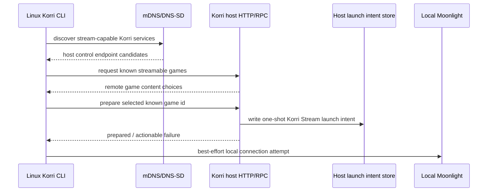

# Korri LAN Stream Discovery

## Summary

Implement the LAN stream-discovery prototype by extending Korri's existing CLI, library, RPC/API, stream-intent, and Nix packaging patterns. Use a Bun-compatible pure TypeScript/JavaScript mDNS/DNS-SD prototype for discovery, existing library RPC plus a new explicit stream-prepare control surface for remote actions, and a manual-host fallback while preserving the existing `Korri Stream` runner contract.

---

## Problem Frame

Korri already has a local CLI flow that stages a known library game for the stable `Korri Stream` app, but the user still has to know which machine is the stream host and run preparation from that host. The origin requirements define a Linux-first debug prototype that proves the network loop without moving the product toward host-first browsing or Android implementation work.

---

## Requirements

- R1. Target Linux clients only for this prototype; Android/Odin implementation remains out of scope.
- R2. Discover streamable Korri hosts on the same LAN with zero or near-zero configuration, with a manual-host fallback.
- R3. Keep the user-facing CLI content-first: remote games are selectable content rows, not a host-browser workflow.
- R4. List remote games from the host's known Korri library content.
- R5. Prepare remote streams only by known game id and never by arbitrary raw remote command.
- R6. Preserve the existing one-shot launch-intent and stable `Korri Stream` runner/Sunshine contract.
- R7. Attempt local Moonlight after remote staging succeeds, while keeping staging success visible if Moonlight launch fails.
- R8. Leave room for future capabilities such as stream-enabled status, session state, latency, bandwidth, file sharing, and multiplayer without implementing them in this slice.

**Origin actors:** A1 Linux client user, A2 Korri discovery client, A3 streamable Korri host, A4 existing stream runner/app, A5 local Moonlight client.
**Origin flows:** F1 discover streamable hosts, F2 choose remote content and prepare a stream, F3 attempt local Moonlight connection.
**Origin acceptance examples:** AE1 discovery/manual fallback, AE2 content-first remote game choices, AE3 known-game prepare safety, AE4 Moonlight best-effort launch, AE5 future capability fit.

---

## Scope Boundaries

- No Android/Odin implementation, packaging, or validation.
- No main Korri app UI integration.
- No local+remote library merging or duplicate-game overlay behavior.
- No file sharing or multiplayer implementation.
- No latency, bandwidth, or connection-quality measurement beyond extensible capability metadata.
- No strong pairing/auth/authz in this prototype; trusted LAN remains the accepted product stance from the origin doc.
- No replacement of Moonlight/Sunshine or the stable `Korri Stream` app model.
- No arbitrary unauthenticated remote command execution.

### Deferred to Follow-Up Work

- Avahi hardening path: keep Avahi/system mDNS as a follow-up if the pure JS/Bun-compatible prototype proves flaky on NixOS/Linux networks.
- App UI source overlay: consume the same conceptual source/capability model later in the product UI.
- Stronger trust model: pairing, tokens, or approval flows belong in a later security-focused iteration.

---

## Context & Research

### Relevant Code and Patterns

- `tools/cli/korri-cli.ts` defines the existing Effect CLI command tree and should host the new debug commands under the existing `korri stream` family.
- `tools/cli/stream-launch.ts` provides the result/exit-code/output style for stream-preparation commands.
- `tools/cli/game-picker.ts` provides the existing terminal picker pattern for content selection.
- `tools/device/game-stream-launch-intent.ts` owns one-shot launch intent creation, trust checks, and default XDG runtime path behavior.
- `korri/products/app/api/hono-app.ts` hosts product HTTP routes and the `/api/rpc` endpoint.
- `korri/products/app/api/app-rpc-group.ts` and `korri/products/app/api/handlers.ts` register Effect RPC routes.
- `korri/products/app/api/library/list.rpc.ts` and `korri/products/app/api/library/list.rpc-handler.ts` show the existing library list RPC pattern.
- `korri/products/app/api/library/launch.rpc.ts` and `korri/products/app/api/library/launch.rpc-handler.ts` show the immediate-launch RPC that this feature should not reuse for remote stream prepare semantics.
- `korri/shared/library/library-services.ts` and `korri/shared/library/library-source-layer-live.ts` provide the live `LibrarySource` used to list games and resolve launch specs.
- `tools/testing/library/with-rpc-server.ts` and `tools/testing/library/with-temp-proseql-library.ts` support real in-process API/library integration tests.
- `nix/korri-cli.nix`, `nix/versions.nix`, `nix/bun-deps.nix`, and `flake.nix` define CLI packaging and dependency hash surfaces.

### Institutional Learnings

- `docs/solutions/workflow-issues/generic-game-stream-runner-validation-contract-2026-05-19.md`: remote prepare must preserve the stable Sunshine app and fresh one-shot launch-intent contract; do not create a raw remote command listener.
- `docs/solutions/best-practices/proseql-canonical-library-with-derived-yaml-ids-2026-05-06.md`: remote catalogs should come through Korri library seams, not a parallel catalog format.
- `docs/solutions/best-practices/product-owned-composition-keeps-shared-layers-reusable-2026-05-03.md`: product API composition belongs under `korri/products/app/api`; shared code must stay reusable and product-agnostic.
- `docs/solutions/integration-issues/one-command-odin-electrobun-deploy-needs-device-nix-and-session-env-2026-05-06.md`: runtime/session paths and Nix command availability must be validated in the actual user/session context.
- `docs/solutions/integration-issues/effect-rpc-json-dates-need-decodable-schemas-2026-05-03.md` and `docs/solutions/integration-issues/effect-v4-rpc-schema-class-responses-2026-05-03.md`: new RPCs need real schema round-trip tests and class-instance responses where applicable.

### External References

- `bonjour-service`: first prototype dependency for Bun-compatible pure TypeScript/JavaScript mDNS/DNS-SD publish and browse behavior.
- `multicast-dns`: underlying pure JS mDNS layer used by `bonjour-service`; keep in mind if lower-level behavior needs debugging.
- Avahi tools (`avahi-publish-service`, `avahi-browse`) and NixOS `services.avahi`: later Linux hardening path if system-managed mDNS becomes necessary.

---

## Key Technical Decisions

- Use `bonjour-service` for the first mDNS/DNS-SD prototype: It is not Bun-native, but it is a pure JS/TS Node-ecosystem package that should run through Bun's Node compatibility without native addons. This keeps the first iteration inside Korri's TypeScript/Bun packaging model while leaving Avahi as a production-hardening fallback.
- Keep mDNS/DNS-SD as discovery only: The advertised service should identify a Korri stream-capable HTTP/RPC control endpoint; catalog and prepare actions travel over HTTP/RPC.
- Add a remote stream prepare surface distinct from immediate launch: The existing launch RPC starts a game now; LAN stream discovery needs known-game staging for the existing `Korri Stream` runner.
- Reuse the existing library list RPC for the prototype catalog: A separate stream catalog RPC is deferred until stream-specific filtering or readiness metadata earns a distinct contract.
- Constrain remote prepare to game ids: The host resolves ids through `LibrarySource` and writes the launch intent locally, preserving the no-arbitrary-remote-command boundary.
- Require explicit host-control mode: The unauthenticated trusted-LAN prepare surface must fail closed unless the host is intentionally running in stream-host/debug control mode; discovery must not advertise disabled control endpoints.
- Keep CLI presentation content-first: Discovery may internally group by host, but the user-facing debug command should present remote games as content choices with source indication.
- Make Moonlight launch best-effort: Preparing the remote stream is the core success; local Moonlight command failure should be reported as a follow-up connection issue, not as failed staging.

---

## Open Questions

### Resolved During Planning

- Which TypeScript/Bun-compatible discovery mechanism should the first prototype use? Use `bonjour-service` as a Bun-compatible pure JS/TS prototype dependency; keep Avahi as a later hardening path.
- What should the manual-host fallback do? It should let the CLI bypass mDNS discovery and contact a specific Korri control base URL directly for debug/reliability.
- Should the prototype add a new catalog RPC? No. Reuse the existing library list RPC for remote game listing and add only the stream-prepare RPC for new behavior.
- How should host control be enabled? Require an explicit stream-host/debug control mode so prepare is not an always-on public app API behavior.
- Should remote prepare reuse the immediate launch RPC? No. Add a narrow stream-prepare surface that stages known game ids for the existing runner.
- How should Moonlight launch failure affect the flow? Treat Moonlight as best-effort after successful remote staging.

### Deferred to Implementation

- Exact mDNS TXT keys and service metadata: decide during implementation while keeping them small, versioned, and capability-oriented. Do not trust TXT metadata as an arbitrary control URL.
- Exact CLI command spelling: choose the clearest Effect CLI shape under the existing `korri stream` command family while preserving room for future non-debug UX.
- Exact local Moonlight command resolution: implementation should try the installed `moonlight` command first, then a system Nix fallback when `nix` is available, and report clearly when neither path can start. The CLI package does not need to include Moonlight in its closure for this prototype.

---

## Output Structure

    tools/cli/
      lan-stream-discovery.ts
      lan-stream-discovery.test.ts
      remote-stream-control-client.ts
      remote-stream-control-client.test.ts
      moonlight-launcher.ts
      moonlight-launcher.test.ts
    tools/device/
      lan-stream-advertise.ts
      lan-stream-advertise.test.ts
    korri/products/app/api/stream/
      prepare.rpc.ts
      prepare.rpc-handler.ts
      prepare.rpc-handler.test.ts

The exact file names may be adjusted during implementation if a nearby local convention makes a different grouping clearer; the key boundary is shared/device discovery primitives, product-owned API composition, and CLI orchestration.

---

## High-Level Technical Design

> *This illustrates the intended approach and is directional guidance for review, not implementation specification. The implementing agent should treat it as context, not code to reproduce.*

---

## Implementation Units

### U1. Discovery domain and mDNS/manual-host implementations

**Goal:** Create a small LAN stream discovery layer that normalizes automatic mDNS results and manual-host fallback into the same host candidate model.

**Requirements:** R1, R2, R4, R8; origin F1, AE1, AE5.

**Dependencies:** None.

**Files:**
- Create: `tools/cli/lan-stream-discovery.ts`
- Create: `tools/cli/lan-stream-discovery.test.ts`
- Create: `tools/device/lan-stream-advertise.ts`
- Create: `tools/device/lan-stream-advertise.test.ts`
- Modify: `package.json`
- Modify: `bun.lock`
- Modify: `nix/versions.nix`
- Modify: `nix/bun-deps.nix` if dependency hash flow requires updates

**Approach:**
- Define a narrow discovery model for stream-capable Korri hosts with host identity, control endpoint, online status, and capability metadata.
- Add a `bonjour-service` browser/publisher seam for the first prototype.
- Add a manual-host path that bypasses mDNS and yields the same candidate model from an explicit base URL.
- Derive the automatic control endpoint from the resolved service address and port where possible; do not trust TXT metadata as an arbitrary URL.
- Keep the discovery metadata small and future-capability oriented; do not encode catalogs or launch requests in mDNS.
- Ensure any long-running publisher/browser has explicit cleanup so tests and CLI runs do not leak sockets.

**Patterns to follow:**
- Result-oriented helper style in `tools/cli/stream-launch.ts`.
- Environment/default helpers in `tools/device/game-stream-launch-intent.ts`.
- Testable seams with injected behavior rather than hard process/network coupling.

**Test scenarios:**
- Happy path: a discovered mDNS service with a private/link-local address and port becomes one host candidate with online status and stream capability.
- Happy path: a manual host URL produces the same host candidate shape as automatic discovery.
- Edge case: duplicate automatic results for the same host/control URL collapse or remain deterministic rather than producing confusing duplicate content.
- Error path: malformed service metadata is ignored or reported without crashing discovery.
- Security regression: TXT metadata cannot redirect the CLI to an arbitrary control URL unrelated to the resolved service address/port.
- Error path: mDNS timeout with no manual host returns a clear no-hosts result.
- Integration: a short-lived publisher and browser can find a uniquely named local service when UDP multicast works in the test environment; keep this test isolated or skippable if CI networking cannot support multicast.

**Verification:**
- The CLI layer can ask for stream host candidates without knowing whether they came from mDNS or manual fallback.

---

### U2. Host stream prepare RPC and explicit host-control mode

**Goal:** Add a product-owned host control surface that stages a selected known game id for `Korri Stream` while reusing the existing library list RPC for catalog data.

**Requirements:** R4, R5, R6; origin F2, AE2, AE3.

**Dependencies:** U1 for the host-control mode and advertised endpoint shape.

**Files:**
- Create: `korri/products/app/api/stream/prepare.rpc.ts`
- Create: `korri/products/app/api/stream/prepare.rpc-handler.ts`
- Create: `korri/products/app/api/stream/prepare.rpc-handler.test.ts`
- Modify: `korri/products/app/api/app-rpc-group.ts`
- Modify: `korri/products/app/api/handlers.ts`
- Modify: `korri/products/app/api/rpc-server.ts` if the live layer needs the intent-store dependency

**Approach:**
- Reuse `app.library.list` for remote game catalog in the prototype.
- Add a prepare RPC that accepts a game id, resolves it through `LibrarySource.launchSpecFor(id)`, and writes a local one-shot launch intent through the existing trusted intent store.
- Keep this separate from `app.library.launch`, because that RPC launches immediately while this feature stages a stream intent.
- Fail closed unless explicit stream-host/debug control mode is enabled, so the unauthenticated trusted-LAN surface is not accidentally always-on.
- Treat the stream intent path/user contract as part of enabling host-control mode; the handler must not report enabled unless it writes to the same trusted intent location consumed by the stream runner.
- Return categorized failures that let the CLI distinguish disabled host control, no such game, library/config failure, and intent preparation failure.
- Do not accept raw command, argv, environment, cwd, or resolved `LaunchSpec` from the LAN client.

**Patterns to follow:**
- RPC schema/handler structure in `korri/products/app/api/library/list.rpc.ts` and `korri/products/app/api/library/list.rpc-handler.ts`.
- Handler registration in `korri/products/app/api/app-rpc-group.ts` and `korri/products/app/api/handlers.ts`.
- Intent-store semantics in `tools/device/game-stream-launch-intent.ts`.
- Error mapping style in `tools/cli/stream-launch.ts` and library RPC handlers.

**Test scenarios:**
- Happy path: existing library list RPC returns games from a temp ProseQL library through a real server round trip.
- Happy path: prepare RPC writes a one-shot intent for a known game id and returns prepared status when host-control mode is enabled.
- Error path: prepare RPC fails closed and writes no intent when host-control mode is disabled or lacks a valid stream intent location.
- Error path: unknown game id returns a not-found/category failure and does not write an intent.
- Error path: a game with invalid launch configuration returns a config/category failure and does not write an intent.
- Security regression: prepare payload cannot carry raw command/env/cwd as the effective launch source; the host always resolves the known game id locally.
- Integration: the new prepare RPC tag is registered in `appRpcGroup` and works through a real Hono/RPC round trip.

**Verification:**
- A LAN client can list and prepare known games without invoking immediate local process launch on the host, and prepare is unavailable unless explicitly enabled.

---

### U3. Remote stream control client

**Goal:** Add a CLI-side remote control client that talks to a discovered or manually supplied Korri host for catalog and prepare actions.

**Requirements:** R2, R3, R4, R5, R6; origin F1, F2, AE1, AE2, AE3.

**Dependencies:** U2.

**Files:**
- Create: `tools/cli/remote-stream-control-client.ts`
- Create: `tools/cli/remote-stream-control-client.test.ts`
- Modify: `korri/shared/api/rpc/client.ts` only if reusable base-URL support is needed without disrupting renderer clients

**Approach:**
- Build a small client abstraction around the existing library list RPC plus the new stream prepare RPC.
- Allow the caller to provide a host control base URL from discovery/manual fallback.
- Keep response mapping in CLI terms: remote games, prepared, no such game, host unavailable, prepare failed.
- Avoid coupling this client to browser-local assumptions in the existing renderer RPC layer.

**Patterns to follow:**
- `korri/products/app/features/home/library-source-layer-rpc.ts` and `korri/products/app/features/home/launcher-layer-rpc.ts` for Effect RPC client usage.
- `tools/testing/library/with-rpc-server.ts` for real server integration.

**Test scenarios:**
- Happy path: given a real in-process Hono/RPC server with temp library data, the client lists remote games through the existing library list RPC.
- Happy path: preparing a known remote game through the client writes the host intent.
- Error path: host unavailable or non-2xx/RPC failure becomes a categorized CLI-safe failure.
- Error path: unknown game id maps to no-such-game rather than generic failure.
- Edge case: base URLs with and without trailing slashes resolve to the same RPC endpoint behavior.

**Verification:**
- CLI orchestration can treat host control as a typed capability instead of issuing raw fetches or shell commands.

---

### U4. Content-first remote CLI command

**Goal:** Add the user-facing Linux debug command that discovers a host, fetches remote games, presents them as content choices, and prepares the selected game.

**Requirements:** R1, R2, R3, R4, R5, R6; origin F1, F2, AE1, AE2, AE3.

**Dependencies:** U1, U3.

**Files:**
- Modify: `tools/cli/korri-cli.ts`
- Create: `tools/cli/remote-stream-launch.ts`
- Create: `tools/cli/remote-stream-launch.test.ts`
- Modify: `tools/cli/game-picker.ts` if a remote-source label needs to reuse the picker model
- Modify: `tools/cli/korri-cli.test.ts`

**Approach:**
- Add a command under the existing `korri stream` family for remote/discovered stream launch preparation.
- Support automatic discovery as the default and manual host input as a fallback/debug path.
- Render remote games as content choices with enough source indication to satisfy the content-first requirement.
- Reuse or extend the existing picker pattern so interactive selection remains consistent with local `stream launch`.
- Preserve stable, categorized exits and actionable output like the existing CLI command.

**Patterns to follow:**
- Command tree and Effect CLI usage in `tools/cli/korri-cli.ts`.
- Interactive picker behavior in `tools/cli/game-picker.ts`.
- Failure category and output discipline in `tools/cli/stream-launch.ts`.

**Test scenarios:**
- Happy path: with a fake discovery result and fake remote client, the command lists remote games, selected game prepares successfully, and output reports the host/source.
- Happy path: manual-host fallback skips automatic discovery and still prepares a selected remote game.
- Error path: no discovered hosts returns a clear discovery failure without prompting for games.
- Error path: discovered host with empty catalog reports no remote games.
- Error path: prepare failure after selection does not attempt Moonlight.
- Edge case: non-interactive execution without explicit selection path fails with usage guidance rather than hanging.
- Regression: root help and `korri stream launch --help` continue to work.

**Verification:**
- A Linux user can run a CLI/debug flow that feels content-first even though the implementation discovered a host first.

---

### U5. Best-effort Moonlight launch seam

**Goal:** Attempt local Moonlight after successful remote staging while preserving remote staging success when local Moonlight cannot start.

**Requirements:** R7; origin F3, AE4.

**Dependencies:** U4.

**Files:**
- Create: `tools/cli/moonlight-launcher.ts`
- Create: `tools/cli/moonlight-launcher.test.ts`
- Modify: `tools/cli/remote-stream-launch.ts`
- Modify: `tools/cli/remote-stream-launch.test.ts`

**Approach:**
- Add an injectable process-runner seam for local Moonlight attempts.
- Prefer the installed `moonlight` command; if unavailable, attempt the requested system Nix fallback when a `nix` command is available.
- Treat Moonlight launch as post-staging best effort: successful remote prepare remains successful even if local launch fails.
- Make output distinguish prepared-vs-connected/attempted so users understand what did and did not happen.

**Patterns to follow:**
- Process-spawn wrappers and controlled child tests in `tools/device/game-stream-runner.ts` / `tools/device/game-stream-runner.test.ts`.
- CLI output/failure separation in `tools/cli/stream-launch.ts`.

**Test scenarios:**
- Happy path: installed Moonlight command is attempted after remote prepare succeeds.
- Happy path: missing installed command falls back to the system Nix Moonlight command when `nix` is available.
- Error path: both Moonlight attempts fail, but the command reports remote staging success and an actionable Moonlight failure.
- Error path: remote prepare failure does not attempt Moonlight.
- Edge case: command runner timeout or spawn error is reported without crashing the CLI process.

**Verification:**
- The end-to-end CLI can prove discovery-to-connection-attempt without making local Moonlight availability a prerequisite for staging.

---

### U6. Packaging, host advertisement wiring, and validation

**Goal:** Package the new CLI dependency and provide a runnable host advertisement/control path for Linux/Nix validation.

**Requirements:** R1, R2, R6, R8; origin AE1, AE3, AE5.

**Dependencies:** U1, U2, U4, U5.

**Files:**
- Modify: `nix/korri-cli.nix`
- Modify: `nix/versions.nix`
- Modify: `flake.nix` if new app/package exposure is needed
- Modify: `nix/modules/korri-game-stream.nix` if host advertisement belongs with the stream host module
- Create or modify tests around package/build behavior where local patterns exist

**Approach:**
- Ensure the CLI package includes the new discovery dependency and still builds with Bun/Nix.
- Provide an explicit debug/host-control entrypoint that can publish the mDNS service only when the trusted-LAN control surface is intentionally enabled.
- Keep NixOS module/service integration as a follow-up unless the real validation loop needs it for a stable host process.
- Keep Avahi out of the first package path unless implementation proves `bonjour-service` unusable in the target environment.
- Validate that the host-side prepare path runs with the same user/session/runtime assumptions required by the stream runner.

**Patterns to follow:**
- Existing CLI derivation in `nix/korri-cli.nix`.
- Existing stream runner derivation/module in `nix/korri-game-stream-runner.nix` and `nix/modules/korri-game-stream.nix`.
- Recent XDG/runtime path behavior in `tools/device/game-stream-launch-intent.ts` and `tools/device/game-stream-runner.ts`.

**Test scenarios:**
- Build: `korri-cli` Nix package builds with the added dependency.
- Integration/manual validation: host advertises, Linux client discovers or uses manual host fallback, remote games list, selected game stages, Moonlight attempt starts or reports actionable failure.
- Regression: existing local `korri stream launch` still prepares local intents.
- Failure path: missing host runtime intent location fails clearly and does not report a false prepared state.

**Verification:**
- The prototype is runnable from packaged Korri CLI on Linux and can be validated against a real stream host.

---

## System-Wide Impact

- **Interaction graph:** New flow crosses CLI discovery, host HTTP/RPC, library resolution, launch-intent writing, and local Moonlight process launch.
- **Error propagation:** Discovery, catalog, disabled host control, prepare, and Moonlight failures must stay distinct so staging success is not masked by local connection failure.
- **State lifecycle risks:** The only durable/meaningful host state should be the existing one-shot launch intent; failed remote prepare must not leave stale intents.
- **API surface parity:** The main app's library list/launch RPCs remain unchanged; this adds stream-prepare semantics rather than altering immediate launch semantics.
- **Integration coverage:** Unit tests should cover pure mapping and failure categories; real Hono/RPC tests should cover schema and handler integration; one manual or scripted real-LAN validation should cover mDNS/runtime behavior.
- **Unchanged invariants:** Sunshine still exposes one stable `Korri Stream` app; launch target choice stays outside Sunshine config; remote clients do not send raw commands.

---

## Risks & Dependencies

| Risk | Mitigation |
|------|------------|
| Bun UDP/mDNS behavior differs from Node or flakes on target LAN | Keep manual-host fallback; isolate discovery behind a seam; keep Avahi as a follow-up hardening path. |
| New trusted-LAN prepare surface accidentally becomes arbitrary remote execution | Accept only known game ids, resolve launch specs on the host, require explicit host-control mode, and add security regression tests. |
| Host API writes intents into the wrong runtime/user context | Make the intent path/user contract part of explicit host-control enablement, reuse existing intent path helpers, and validate under the same stream-runner user/session assumptions. |
| Moonlight availability varies across Linux clients | Make Moonlight launch best-effort with installed-command and system-Nix fallback attempts; keep staging result distinct and do not require Moonlight in the CLI package closure. |
| Dependency/package hash churn blocks Nix builds | Update dependency lock/hash surfaces in the same unit and verify `nix build .#korri-cli --no-link`. |
| mDNS service presence is mistaken for stream readiness | First prototype only claims online presence; richer readiness/status remains future capability metadata. |
| Spoofed mDNS service points the CLI at an unintended control URL | Derive the control URL from the resolved service address/port where possible, require local/private address scope, label identity as unverified, and reserve a future pairing seam. |

---

## Documentation / Operational Notes

- Update user-facing or device docs only if implementation adds a stable command worth documenting; otherwise keep notes in the plan/PR until the debug prototype hardens.
- Manual validation should record: host command/process used to advertise, client command used to discover/prepare, whether Moonlight launched, and the stream runner status after connection attempt.
- If Avahi becomes necessary, document that as a follow-up decision rather than silently replacing the first prototype dependency.

---

## Sources & References

- **Origin document:** [docs/brainstorms/2026-05-19-korri-lan-stream-discovery-requirements.md](../brainstorms/2026-05-19-korri-lan-stream-discovery-requirements.md)
- **Existing CLI:** `tools/cli/korri-cli.ts`, `tools/cli/stream-launch.ts`, `tools/cli/game-picker.ts`
- **Existing stream intent/runner:** `tools/device/game-stream-launch-intent.ts`, `tools/device/game-stream-runner.ts`
- **Existing API/RPC:** `korri/products/app/api/hono-app.ts`, `korri/products/app/api/app-rpc-group.ts`, `korri/products/app/api/handlers.ts`, `korri/products/app/api/library/list.rpc.ts`, `korri/products/app/api/library/launch.rpc.ts`
- **Testing helpers:** `tools/testing/library/with-rpc-server.ts`, `tools/testing/library/with-temp-proseql-library.ts`
- **Packaging:** `nix/korri-cli.nix`, `nix/modules/korri-game-stream.nix`, `flake.nix`, `nix/versions.nix`
- **Learning:** `docs/solutions/workflow-issues/generic-game-stream-runner-validation-contract-2026-05-19.md`
- **Learning:** `docs/solutions/best-practices/proseql-canonical-library-with-derived-yaml-ids-2026-05-06.md`
- **Learning:** `docs/solutions/best-practices/product-owned-composition-keeps-shared-layers-reusable-2026-05-03.md`
