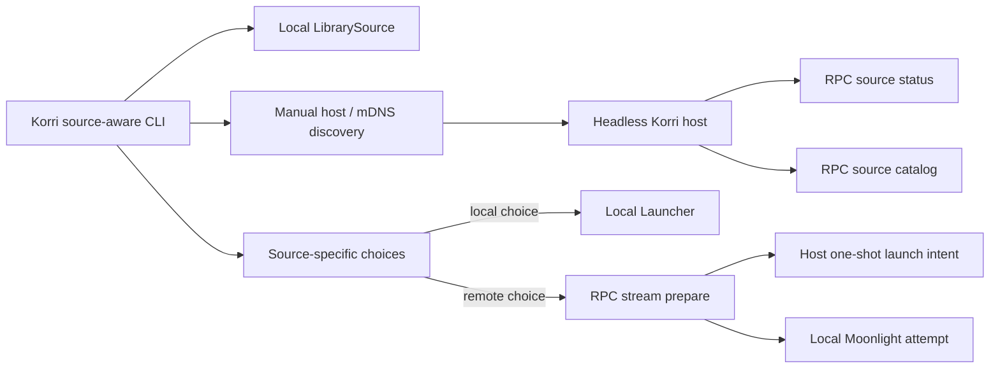

# Korri Headless Source-Aware Server

## Summary

Implement the first headless Korri server slice by extending the existing CLI, library, launcher, stream-prep, and Effect RPC patterns. The plan adds a source-aware CLI/debug path, RPC-only remote catalog/status contracts, local-vs-remote action routing, and tests for partial availability without introducing REST resources or duplicate merging.

---

## Problem Frame

Korri already has a stable stream runtime: known games can be staged for the `Korri Stream` Sunshine app, and a remote client can prepare a host game before attempting Moonlight. That proves the stream-control loop, but it is still not the desired remote play appliance experience. The player needs one surface that answers what can be played locally or remotely, then routes to the correct action.

The existing remote-only CLI is close to the remote half of the desired behavior, but it does not aggregate local entries, does not isolate local and remote source failures symmetrically, and does not provide side-effect-free remote readiness before selection. The implementation should reuse these seams rather than create a parallel server style.

---

## Requirements

- R1. Provide a CLI/debug surface that lists local and remote game entries together (origin R1).
- R2. Preserve source identity and allow local and remote instances of the same game to appear separately in v1 (origin R2, R3).
- R3. Source remote catalog entries from a headless Korri host's known library content, not from client-authored commands (origin R4).
- R4. Include basic remote status so the client can report reachable, unavailable, and stream-unavailable sources clearly (origin R5, R12).
- R5. Route local selections to local launch, not local stream staging (origin R6).
- R6. Route remote selections to remote stream staging and the existing Moonlight/Sunshine stream path (origin R7).
- R7. Keep source failures isolated so local entries can remain usable when remotes fail and remote entries can remain usable when local source setup fails (origin R8).
- R8. Keep remote actions constrained to known host game ids; do not expose arbitrary remote command execution (origin R9).
- R9. Use Korri Effect RPC for host catalog, status, and prepare behavior; do not add REST-style product endpoints for this feature (origin R10, R11).
- R10. Defer duplicate merging, save/state management, file transfer, and thin UI clients while preserving room for them later (origin R13, R14).

---

## Scope Boundaries

- Duplicate detection, merge overlays, and one-row local/remote action menus are out of scope for v1.
- Save sync, emulator state sync, and file/content transfer are out of scope.
- Web/native thin-client UI integration is out of scope.
- A full client/server rewrite of Korri app behavior is out of scope.
- Replacing Sunshine/Moonlight or the existing `Korri Stream` runner is out of scope.
- Introducing a parallel REST product API for headless host catalog/status/control is out of scope.

### Deferred to Follow-Up Work

- Harden the trust model with pairing, tokens, or user approval once trusted-LAN behavior proves useful.
- Add richer stream/session diagnostics such as latency, bandwidth, controller readiness, or Sunshine pairing status.
- Add source merging and duplicate overlays when the product needs one game row with multiple actions.
- Add save/state and file/content transfer on top of the same source-aware model.
- Promote the CLI-proven source model into the main Korri UI or native thin clients.

---

## Context & Research

### Relevant Code and Patterns

- `tools/cli/korri-cli.ts` owns the existing Effect CLI command tree and runtime layer composition.
- `tools/cli/stream-launch.ts` stages local known games for `Korri Stream`; this is not the local-launch behavior needed for source-aware local entries, but it provides result/exit-code/output patterns.
- `tools/cli/remote-stream-launch.ts` already performs remote-only discovery, remote catalog listing, remote prepare, picker selection, and Moonlight attempt.
- `tools/cli/remote-stream-control-client.ts` already wraps Effect RPC calls to remote Korri hosts and should remain the remote client seam.
- `tools/cli/lan-stream-discovery.ts` and `tools/device/lan-stream-advertise.ts` provide mDNS/manual-host discovery primitives.
- `tools/cli/game-picker.ts` is the existing terminal content picker.
- `korri/shared/library/library-services.ts` defines `LibrarySource` and `Launcher` services. Local launch should resolve a local `LaunchSpec` through `LibrarySource` and run it through `Launcher`.
- `korri/shared/library/launcher-layer-live.ts` provides the live launcher layer used by the product launch RPC.
- `korri/products/app/api/library/list.rpc.ts` and `korri/products/app/api/library/launch.rpc.ts` show current library RPC patterns.
- `korri/products/app/api/stream/prepare.rpc.ts` is the existing remote stream staging surface and should remain the prepare path for remote entries.
- `korri/products/app/api/app-rpc-group.ts` and `korri/products/app/api/handlers.ts` are the registration points for new RPCs.
- `tools/device/game-stream-state.ts` and `tools/device/game-stream-runner.ts` provide runner status concepts and optional `status.json` output for stream runtime status.
- `tools/testing/library/with-rpc-server.ts` and `tools/testing/library/with-temp-proseql-library.ts` support real in-process RPC/library tests.

### Institutional Learnings

- `docs/solutions/workflow-issues/generic-game-stream-runner-validation-contract-2026-05-19.md`: preserve the fresh one-shot launch intent, stable `Korri Stream` app, and no-arbitrary-remote-command boundary.
- `docs/solutions/best-practices/proseql-canonical-library-with-derived-yaml-ids-2026-05-06.md`: remote catalog should come through Korri's canonical library seams, not live external catalog formats.
- `docs/solutions/integration-issues/effect-v4-rpc-schema-class-responses-2026-05-03.md`: new RPC success schemas that use `Schema.Class` must return class instances and should be tested through the real RPC client/server boundary.
- `docs/solutions/integration-issues/effect-rpc-json-dates-need-decodable-schemas-2026-05-03.md`: RPC schemas must decode JSON wire values across the real serialization boundary.
- `docs/solutions/best-practices/product-owned-composition-keeps-shared-layers-reusable-2026-05-03.md`: concrete product RPC composition belongs under `korri/products/app/api`; shared layers should stay reusable.
- `docs/solutions/best-practices/prefer-real-implementations-over-mocks-2026-05-02.md`: favor temp ProseQL libraries, real RPC servers, and real intent files over deep mocks for integration behavior.

### External References

- No new external research is required. The work extends existing Effect RPC, Bun CLI, and Korri stream patterns already present in the repo.

---

## Key Technical Decisions

- Add RPC-only host source contracts: Remote catalog/status for the source-aware feature should be exposed through Effect RPC, not new REST endpoints, so the headless server follows Korri's existing API direction.
- Gate catalog/control while keeping status observable: The source-aware host catalog and prepare surfaces should fail closed unless the host is intentionally in stream-host/control mode, while status may return a disabled/stream-unavailable state so clients can distinguish a reachable disabled host from an unreachable one.
- Avoid legacy catalog bypass in headless exposure: Do not break existing app-local `app.library.list` behavior, but ensure the LAN-exposed headless surface cannot use legacy catalog RPCs to bypass the source-aware gate.
- Add side-effect-free status: The client should not have to attempt prepare to discover that a host is unavailable or stream control is disabled.
- Minimize remote catalog data: The source-aware catalog should return only the fields needed for display and selection, not full host-local library records, raw launch specs, play history, or local media paths.
- Use structured source entries: Represent local and remote choices as structured source/game pairs internally, with display labels derived from them, so duplicate game ids remain separate without delimiter parsing.
- Launch local entries locally: Source-aware local choices use the local launcher service, not the local `Korri Stream` intent-preparation command.
- Preserve existing remote prepare/Moonlight behavior: Remote choices stage a known host game id through the existing stream prepare flow, then attempt Moonlight while keeping staging success visible if Moonlight fails.
- Treat v1 remote prepare conflicts as last-write-wins: The current one-shot intent store has one pending launch intent. The plan accepts that behavior for v1 and tests/documentation should not imply queueing.
- Keep source-aware v1 interactive-first: Scriptable source-specific selection can follow once the structured source-entry model settles; non-interactive invocation without an explicit future selection contract should fail clearly.

---

## Open Questions

### Resolved During Planning

- Should local source entries launch locally or stage for local streaming? Resolve as local launch through `Launcher`, because the origin explicitly says “launch the game locally.”
- Should status be inferred from prepare failures? No. Add a side-effect-free RPC status surface.
- Should source-aware remote catalog reuse existing ungated library list directly? No. Add a gated source-aware catalog surface while leaving existing app library RPC behavior stable.
- Should v1 merge duplicate local/remote games? No. Preserve source-specific entries.
- Should headless host catalog/status be REST? No. Use Effect RPC.

### Deferred to Implementation

- Exact CLI command spelling and copy: The plan assumes a new source-aware play command, but implementation may adjust wording to fit Effect CLI help conventions while preserving behavior and tests.
- Exact optional runner status fields: The status RPC should at minimum distinguish stream control enabled vs disabled and catalog availability; optional runner details should be limited to reliably decoded existing runner state such as mode. Absence of runner status should not make the whole host unavailable.
- Exact per-host timeout value: Choose a short default that keeps one bad host from blocking the CLI, with tests covering timeout behavior through injected clients.

---

## Output Structure

    korri/products/app/api/source/
      list.rpc.ts
      list.rpc-handler.ts
      list.rpc-handler.test.ts
      status.rpc.ts
      status.rpc-handler.ts
      status.rpc-handler.test.ts
    tools/cli/
      source-aware-play.ts
      source-aware-play.test.ts
      source-aware-games.ts
      source-aware-games.test.ts

Existing files modified for registration, CLI wiring, remote client behavior, and runtime layer composition are listed in the implementation units below.

---

## High-Level Technical Design

> *This illustrates the intended approach and is directional guidance for review, not implementation specification. The implementing agent should treat it as context, not code to reproduce.*

The source-aware CLI should build a list of entries from independent sources. Local source failure should not prevent remote entries from being shown, and remote source failure should not prevent local entries from being shown. Each entry carries a source identity and the original game id for that source; display labels may include source names, but action routing must use the structured entry rather than parsing display ids.

---

## Implementation Units

### U1. Add gated headless source status and catalog RPCs

**Goal:** Give headless hosts side-effect-free, RPC-only status and catalog surfaces for source-aware clients.

**Requirements:** R3, R4, R8, R9

**Dependencies:** None

**Files:**
- Create: `korri/products/app/api/source/status.rpc.ts`
- Create: `korri/products/app/api/source/status.rpc-handler.ts`
- Create: `korri/products/app/api/source/status.rpc-handler.test.ts`
- Create: `korri/products/app/api/source/list.rpc.ts`
- Create: `korri/products/app/api/source/list.rpc-handler.ts`
- Create: `korri/products/app/api/source/list.rpc-handler.test.ts`
- Modify: `korri/products/app/api/app-rpc-group.ts`
- Modify: `korri/products/app/api/handlers.ts`

**Approach:**
- Add a small source status RPC that can answer even when stream control is disabled, returning disabled/stream-unavailable status rather than forcing clients to infer that state from failed prepare attempts.
- Add a source catalog RPC that returns selectable host games only when source/stream control mode is enabled.
- Reuse `LibrarySource` for catalog data, but project records into a minimal source-catalog shape that carries display/selection information only. Do not return raw launch specs, host-local paths, play history, or unnecessary metadata.
- Treat games without a resolvable launch target as not streamable for this source-aware catalog, or return them with an explicit unavailable diagnostic; do not present them as normally playable remote entries.
- Keep status side-effect-free. It must not create launch intents, probe game launch specs by starting work, or attempt Moonlight/Sunshine actions.
- Ensure the remotely exposed headless surface cannot use legacy catalog RPCs to bypass the new source catalog gate; implementation may use a reduced headless RPC group, host binding, or equivalent composition choice.

**Patterns to follow:**
- `korri/products/app/api/stream/prepare.rpc.ts`
- `korri/products/app/api/stream/prepare.rpc-handler.ts`
- `korri/products/app/api/library/list.rpc.ts`
- `korri/products/app/api/library/list.rpc-handler.ts`
- `docs/solutions/integration-issues/effect-v4-rpc-schema-class-responses-2026-05-03.md`

**Test scenarios:**
- Happy path: enabled host status reports stream-capable/source-available state.
- Happy path: enabled source catalog returns minimal source-catalog game records from a temp ProseQL library.
- Error path: disabled source status reports stream unavailable without throwing an implementation leak.
- Error path: disabled source catalog fails closed and does not expose library games.
- Error path: legacy catalog bypass is unavailable on the LAN-exposed headless surface when stream control is disabled.
- Edge case: a known game without a launch target is filtered out or marked unavailable rather than presented as a normally playable remote entry.
- Error path: invalid or unreadable library data maps to typed RPC data errors.
- Integration: both RPC tags are registered in the app RPC group and handlers layer.
- Integration: schema-class responses round-trip through the real RPC server/client boundary where practical.

**Verification:**
- Source-aware remote clients can obtain status and catalog over `/api/rpc` without any new REST endpoint.

---

### U2. Extend the remote stream control client for status, gated catalog, and timeouts

**Goal:** Make remote hosts consumable as source-aware entries with explicit status and isolated failures.

**Requirements:** R3, R4, R7, R8, R9

**Dependencies:** U1

**Files:**
- Modify: `tools/cli/remote-stream-control-client.ts`
- Modify: `tools/cli/remote-stream-control-client.test.ts`
- Modify: `tools/cli/lan-stream-discovery.ts`
- Modify: `tools/cli/lan-stream-discovery.test.ts`

**Approach:**
- Add remote-client methods for source status and source catalog using the new RPCs.
- Keep prepare behavior on the existing stream prepare RPC.
- Add a per-host timeout seam so slow or unreachable hosts become unavailable sources instead of hanging the whole command.
- Preserve the distinction between display host identity and the host/address used for Moonlight connection.
- Keep manual-host fallback working and deterministic; exact same-host normalization may dedupe candidates by normalized control URL/source id, but must not merge local/remote game entries or create one-row action overlays.

**Patterns to follow:**
- Existing `createRemoteStreamControlClient` Effect RPC layer composition.
- Existing manual-host URL normalization in `tools/cli/lan-stream-discovery.ts`.
- Existing remote prepare failure categorization.

**Test scenarios:**
- Happy path: status and gated catalog are fetched through Effect RPC and decoded.
- Error path: host unavailable maps to a source-unavailable result rather than throwing through the aggregator.
- Error path: stream control disabled maps to stream-unavailable status before prepare is attempted.
- Edge case: a remote game listed under a source preserves the original host game id for prepare.
- Edge case: source catalog uses minimized game data and does not expose host-local paths, launch specs, or play history.
- Edge case: manual host URL normalization still accepts hostnames, host:port, and explicit http/https URLs.
- Integration: remote prepare still sends only the host's original game id and not a composite display id.

**Verification:**
- Remote host status/catalog/prepare all use RPC, and remote-source failures can be represented as data for the CLI.

---

### U3. Add a source-aware game aggregation model

**Goal:** Build a reusable CLI-level model that combines local and remote source entries without duplicate merging.

**Requirements:** R1, R2, R3, R4, R7, R10

**Dependencies:** U2

**Files:**
- Create: `tools/cli/source-aware-games.ts`
- Create: `tools/cli/source-aware-games.test.ts`

**Approach:**
- Model local and remote entries as structured source/game pairs rather than delimiter-joined ids.
- Aggregate local library results and remote host results independently so each source can succeed or fail on its own.
- Preserve duplicate local/remote games as separate entries with source-specific labels.
- Return source diagnostics alongside playable entries so the CLI can explain partial failures.
- Keep this model in CLI tooling for v1; do not prematurely promote it into shared runtime library contracts until the app UI also needs it.

**Patterns to follow:**
- `tools/cli/remote-stream-launch.ts` source-label behavior, but replace delimiter-coupled ids with structured entries.
- `tools/cli/stream-launch.ts` result types and failure-category style.

**Test scenarios:**
- Happy path: local and remote games appear in one deterministic list.
- Edge case: same game id/name local and remote appears as two separate entries.
- Edge case: two remote hosts with overlapping game ids appear as separate source entries.
- Error path: remote timeout leaves local entries usable and records a remote-source diagnostic.
- Error path: local library failure leaves reachable remote entries usable and records a local-source diagnostic.
- Empty state: no local games and no usable remote games yields a clear no-playable-sources result.

**Verification:**
- The source-aware model can drive a picker without losing original local or remote game ids.

---

### U4. Add source-aware action routing for local launch and remote stream

**Goal:** Route the selected source entry to the correct action while preserving existing launch and stream semantics.

**Requirements:** R5, R6, R7, R8

**Dependencies:** U3

**Files:**
- Create: `tools/cli/source-aware-play.ts`
- Create: `tools/cli/source-aware-play.test.ts`
- Modify: `tools/cli/moonlight-launcher.ts`
- Modify: `tools/cli/moonlight-launcher.test.ts`

**Approach:**
- For local entries, resolve the local launch spec through the local library source and run it through the local launcher service.
- For remote entries, prepare the host game id through the remote stream control client, then attempt Moonlight using the connection target associated with the remote source.
- Keep remote staging success visible when Moonlight launch cannot start; this is a successful staging result with a warning/manual next step, not the same class as prepare failure.
- Treat stale remote catalog entries as prepare failures: do not attempt Moonlight when the host reports the game no longer exists.
- Preserve current one-shot/last-write-wins stream intent behavior; do not add queueing in this slice.

**Patterns to follow:**
- `korri/products/app/api/library/launch.rpc-handler.ts` for local launch semantics.
- `tools/cli/remote-stream-launch.ts` for remote prepare plus Moonlight behavior.
- `tools/cli/moonlight-launcher.ts` for best-effort command attempt behavior.

**Test scenarios:**
- Happy path: selecting a local entry invokes local launch and does not call remote prepare or Moonlight.
- Happy path: selecting a remote entry calls remote prepare with the original remote game id and attempts Moonlight after prepare succeeds.
- Error path: local launch spec missing produces a local launch failure without remote side effects.
- Error path: remote no-such-game after listing reports a stale/unavailable entry and skips Moonlight.
- Error path: remote prepare succeeds but Moonlight cannot start; command still reports staging success with manual connection guidance and should not classify the prepare as failed.
- Edge case: remote prepare conflicts remain last-write-wins; output must not imply multi-game queueing.

**Verification:**
- A single selected entry deterministically routes to either local launch or remote stream based on its structured source kind.

---

### U5. Wire the CLI command and runtime layers

**Goal:** Expose the source-aware behavior through the Korri CLI while keeping existing stream commands available.

**Requirements:** R1, R2, R5, R6, R9

**Dependencies:** U4

**Files:**
- Modify: `tools/cli/korri-cli.ts`
- Modify: `tools/cli/korri-cli.test.ts`
- Modify: `nix/korri-cli.nix` if packaging inputs need adjustment

**Approach:**
- Add a CLI/debug command for source-aware play that can take manual remote host input and otherwise use discovery where available.
- Keep source-aware v1 interactive-first: the user selects from structured local/remote entries in the picker, and scriptable source-specific selection is deferred until a stable flag/argument contract is worth adding.
- Keep `korri stream launch` and `korri stream remote-launch` behavior stable unless the implementation intentionally reuses the new source-aware core behind the scenes.
- Provide the live launcher layer in the CLI runtime so local entries can launch locally.
- Keep non-interactive behavior explicit: when selection requires a terminal and no scriptable source-specific choice exists, return a usage-style failure rather than hanging.
- Make command help describe local launch vs remote stream clearly.

**Patterns to follow:**
- Existing Effect CLI command definition in `tools/cli/korri-cli.ts`.
- Existing CLI help tests in `tools/cli/korri-cli.test.ts`.
- Existing runtime layer composition with Bun services and library source live layer.

**Test scenarios:**
- CLI help includes the new source-aware command without regressing existing stream command help.
- Non-interactive invocation without a supported source-specific selection contract returns a usage failure.
- Manual-host option flows into the source-aware remote discovery/client path.
- Existing `korri stream launch` tests still pass.
- Existing `korri stream remote-launch` tests still pass or are intentionally updated to share the new remote client semantics.

**Verification:**
- The packaged `korri-cli` can resolve all imported source-aware modules and launcher dependencies.

---

### U6. Define and wire the headless host runtime contract

**Goal:** Ensure the API process and stream runner agree on library, intent, and status paths when a host is operated as a headless source.

**Requirements:** R3, R4, R6, R8, R9

**Dependencies:** U1, U5

**Files:**
- Modify: `nix/modules/korri-game-stream.nix`
- Modify: `tools/device/game-stream-runner.ts` only if status-path helper extraction is needed
- Test: `tools/device/game-stream-runner.test.ts` or a new module-focused test if the implementation adds reusable path helpers

**Approach:**
- Make the runtime contract explicit: a headless source host must run the API with stream control enabled, the configured Korri library source/root, and intent/status paths that match the Sunshine runner wrapper.
- Prefer sharing derived runtime-path logic rather than duplicating path formulas across the API process, CLI, and runner.
- If full NixOS service wiring is too large for this slice, add a concrete generated environment contract and validation path so a host like `aka` can run the API and runner against the same launch-intent/status files.
- Keep the API side default-off; enabling headless source control should be an explicit operator choice.

**Patterns to follow:**
- Existing runtime path handling in `nix/modules/korri-game-stream.nix`.
- Existing default intent path helper in `tools/device/game-stream-launch-intent.ts`.
- Existing optional runner status path handling in `tools/device/game-stream-runner.ts`.

**Test scenarios:**
- Happy path: configured API and runner paths point at the same runtime intent/status locations.
- Error path: missing explicit stream-control enablement keeps headless source control unavailable.
- Error path: missing or mismatched intent/status env is reported as host configuration failure, not as a successful prepare.
- Integration: remote prepare writes an intent path the Sunshine runner will consume in the same host runtime contract.

**Verification:**
- A deployed headless host can run the API and the generic `Korri Stream` runner against the same one-shot intent/status state.

---

### U7. Add end-to-end source-aware RPC/CLI coverage

**Goal:** Prove the cross-layer behavior with real local library data, real in-process RPC, and isolated source failures.

**Requirements:** R1, R2, R4, R7, R9, R10

**Dependencies:** U1, U2, U3, U4, U5, U6

**Files:**
- Extend: `tools/cli/source-aware-play.test.ts`
- Extend: `tools/cli/remote-stream-control-client.test.ts`
- Extend: `korri/products/app/api/source/status.rpc-handler.test.ts`
- Extend: `korri/products/app/api/source/list.rpc-handler.test.ts`

**Approach:**
- Keep this as a thin cross-layer integration set; leave unit and edge-case coverage in U1–U5.
- Use temp ProseQL libraries and in-process RPC servers for remote-host scenarios.
- Use injected local library/launcher seams for local launch without starting real games.
- Cover partial failure from both directions: remote down with local usable, and local unavailable with remote usable.
- Add regression coverage that source-aware host control uses RPC and does not introduce REST routes.
- Keep tests deterministic by injecting discovery, clients, launcher, Moonlight runner, and timeouts.

**Patterns to follow:**
- `tools/testing/library/with-rpc-server.ts`
- `tools/testing/library/with-temp-proseql-library.ts`
- `tools/cli/remote-stream-launch.test.ts`
- `tools/cli/stream-launch.test.ts`

**Test scenarios:**
- Integration: combined local+remote list with duplicate game ids shows separate entries.
- Integration: remote source status disabled prevents normal remote stream action before prepare.
- Integration: source-aware remote catalog/status/prepare all round-trip through Effect RPC.
- Error path: one timed-out remote does not fail the entire command when local entries exist.
- Error path: prepare payload cannot carry arbitrary command data and host resolves launch from its own known library id.
- Regression: no new REST route is required for catalog/status/control behavior.

**Verification:**
- The standard validation suite and CLI Nix build pass with the source-aware feature included.

---

## System-Wide Impact

- **Interaction graph:** The new CLI path touches local `LibrarySource`, local `Launcher`, remote discovery, remote RPC client, remote source catalog/status RPCs, existing stream prepare RPC, the shared host runtime intent/status contract, and Moonlight launch attempt.
- **Error propagation:** Source-specific failures should become diagnostics attached to a local or remote source. Whole-command failure should be reserved for no usable entries, invalid usage, cancelled selection, local launch failure, or remote prepare failure. Successful remote staging followed by Moonlight launch failure is a partial-success warning/manual-next-step state.
- **State lifecycle risks:** Remote prepare still writes a single one-shot host intent. Last-write-wins is accepted for v1; do not imply queueing or durable reservations.
- **API surface parity:** Host catalog/status/control for this feature must be RPC-only. Existing app library RPCs remain available for current app-local behavior, but the LAN-exposed headless surface must not allow them to bypass source gating.
- **Integration coverage:** Unit tests for aggregation are not enough; real RPC round-trip tests are needed for status/catalog/prepare and schema behavior.
- **Unchanged invariants:** Stable `Korri Stream` Sunshine app, existing launch-intent trust checks, no arbitrary remote command execution, and no duplicate merging remain unchanged.

---

## Risks & Dependencies

| Risk | Mitigation |
|------|------------|
| Source-aware host catalog accidentally exposes the library whenever the app API is running | Add a gated source catalog RPC and ensure the LAN-exposed headless surface cannot bypass it through legacy catalog RPCs. |
| Full game records expose host-local paths, media URIs, or play history | Return a minimized source-catalog game shape with only display/selection/action-readiness data. |
| API and Sunshine runner disagree on intent/status paths | Add an explicit host runtime contract so both processes use the same library, launch-intent, and status paths. |
| Local launch accidentally stages a local stream intent instead of launching the local game | Route local entries through `Launcher` and add explicit tests that remote prepare/Moonlight are not called. |
| One unreachable host makes the CLI feel hung | Add per-host timeout handling and source-level unavailable diagnostics. |
| Composite display ids leak into remote prepare | Use structured source entries and test that prepare receives the original host game id. |
| Runner status is missing or stale | Treat runner status as optional/basic; stream-control enabled and RPC reachability are enough for v1 readiness reporting. |
| The plan grows into full client/server architecture | Keep v1 in CLI tooling and product RPC composition only; defer UI, saves, files, and duplicate overlays. |

---

## Documentation / Operational Notes

- Update CLI help/tests so users can distinguish local launch, local stream staging, and remote stream behavior.
- Capture the required headless host environment contract where operators will see it: stream control opt-in, library root/source, shared intent path, and shared status path.
- If the feature changes how aka or another host should be run as a headless source beyond the Korri module, carry that into a follow-up deployment plan rather than burying it in code comments.
- Do not add new Markdown docs beyond this plan unless implementation reveals an operational setup step that needs durable documentation.

---

## Sources & References

- **Origin document:** `docs/brainstorms/2026-05-20-korri-headless-source-aware-server-requirements.md`
- Related requirements: `docs/brainstorms/2026-05-19-korri-lan-stream-discovery-requirements.md`
- Related plan: `docs/plans/2026-05-19-003-feat-korri-lan-stream-discovery-plan.md`
- Related code: `tools/cli/remote-stream-launch.ts`
- Related code: `tools/cli/remote-stream-control-client.ts`
- Related code: `tools/cli/korri-cli.ts`
- Related code: `korri/products/app/api/stream/prepare.rpc-handler.ts`
- Related learning: `docs/solutions/workflow-issues/generic-game-stream-runner-validation-contract-2026-05-19.md`
- Related learning: `docs/solutions/integration-issues/effect-v4-rpc-schema-class-responses-2026-05-03.md`
