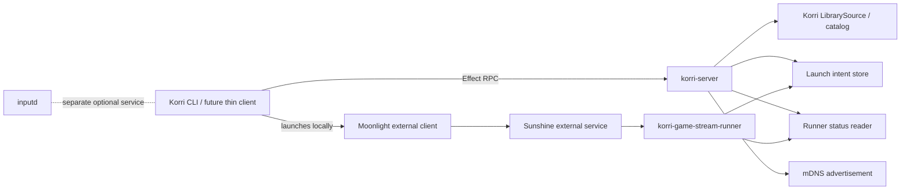
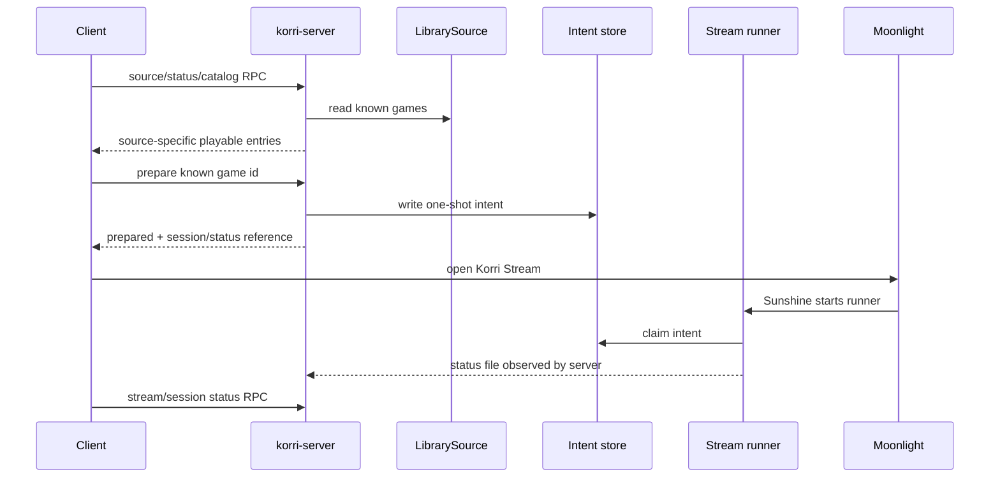

# Refactor Korri Server Control Plane

## Summary

Refactor the headless host work into a clearer client/server architecture: one always-on Korri server runtime owns the Korri API/control plane for catalog, source identity, orchestration, stream prepare/status, and optional LAN advertisement. Sunshine, Moonlight, the Sunshine-launched stream runner, and inputd remain separate external or companion runtimes rather than being bundled into the server process.

---

## Problem Frame

The current implementation proves the source-aware remote play path, but its deployable shape still exposes internal pieces as peers: `korri-game-stream`, `korri-headless-source`, a separate API service, and a separate LAN advertiser. That makes `aka`-style hosts feel assembled from implementation details instead of enabled as a Korri server.

The desired architecture is a headless Korri host: clients talk to a single Korri control-plane API, and that API coordinates Korri-owned catalog/orchestration state while delegating streaming transport to Sunshine/Moonlight and session execution to the generic stream runner.

---

## Requirements

- R1. Provide one headless Korri server runtime/API surface for cataloging, source identity, orchestration, stream prepare/status, and discovery-advertisement coordination.
- R2. Preserve the source-aware behavior from the origin plan: local and remote entries stay source-specific, remote actions use known host game ids, and duplicate merging remains out of scope.
- R3. Keep external services separate: do not bundle Sunshine, Moonlight, or inputd into the Korri server runtime.
- R4. Keep the Sunshine-launched game stream runner as a narrow session executable that consumes trusted launch intents; do not fold it into the always-on server process.
- R5. Expose a reduced headless RPC surface for LAN clients so full library listing and local-launch RPCs are not reachable through the headless server by default.
- R6. Make stream-host deployment a product-level Nix module, not a host-local service assembly.
- R7. Share runtime contracts between server and runner explicitly: intent path, status path, runtime directory, stream app name, source identity, and control-mode settings must agree.
- R8. Keep trusted-LAN control explicit and disabled unless the server/stream-host module opts in.
- R9. Preserve compatibility for the existing app/dev API and CLI while steering new headless clients to the server/source RPC contract.
- R10. Validate the server shape with real RPC, filesystem, and Nix package/module coverage rather than only handler-level tests.
- R11. Keep the LAN-facing API data-minimized: do not return host-local intent/status paths, raw launch specs, private filesystem paths, or detailed internal error strings to clients.

**Origin actors:** A1 Player/operator, A2 Source-aware Korri client, A3 Local Korri source, A4 Headless Korri host, A5 Stream runtime
**Origin flows:** F1 Browse local and remote games, F2 Launch a local game, F3 Stream a remote game, F4 Handle unavailable sources
**Origin acceptance examples:** AE1 source-aware listing, AE2 local launch, AE3 remote RPC prepare, AE4 partial availability, AE5 future source model compatibility

---

## Scope Boundaries

- Strong pairing/authentication remains out of scope for this refactor; the server must keep trusted-LAN opt-in explicit and document the temporary trust model.
- Duplicate merging, source overlays, save sync, state transfer, and content transfer remain out of scope.
- Replacing Sunshine/Moonlight is out of scope.
- Managing inputd is out of scope for the headless server. Inputd remains a separate module/runtime.
- Building a thin UI client is out of scope; this refactor prepares the server boundary that future clients can use.
- Converting every existing app RPC into a server capability is out of scope. The first server surface should stay intentionally reduced.

### Deferred to Follow-Up Work

- Add pairing/token authorization before exposing the server beyond trusted LAN/VPN.
- Add central multi-host aggregation if Korri later needs one server to coordinate several leaf hosts. V1 treats each headless host as its own Korri server.
- Promote source-aware server status into the main UI once the CLI/debug path and Nix deployment shape are stable.
- Deprecate any compatibility aliases after downstream hosts migrate to `services.korri.server`.

---

## Context & Research

### Relevant Code and Patterns

- `tools/http/server.ts` is the current Bun/Node HTTP entrypoint for the Korri API.
- `korri/products/app/api/hono-app.ts` builds the current Hono app and mounts `/api/rpc`.
- `korri/products/app/api/rpc-server.ts` turns `appRpcGroup` into an HTTP Effect RPC handler with live layers.
- `korri/products/app/api/app-rpc-group.ts` currently includes app-local library RPCs, source RPCs, and stream prepare RPC in one group.
- `korri/products/app/api/handlers.ts` binds all current app RPC tags to handlers.
- `korri/products/app/api/source/list.rpc.ts` and `korri/products/app/api/source/status.rpc.ts` are the current minimized source-aware host contract.
- `korri/products/app/api/stream/prepare.rpc.ts` is the constrained known-game stream staging RPC.
- `korri/products/app/api/stream/control-mode.ts` contains the current environment-gated control mode helpers.
- `tools/device/game-stream-launch-intent.ts` owns the trusted one-shot launch-intent file contract.
- `tools/device/game-stream-state.ts` owns the current runner state model.
- `tools/device/game-stream-runner.ts` is the Sunshine-launched foreground/session runner and should remain a separate executable.
- `tools/device/lan-stream-advertise.ts` and `tools/device/lan-stream-advertise-cli.ts` own the current mDNS advertisement primitive/entrypoint.
- `tools/cli/source-aware-play.ts`, `tools/cli/source-aware-games.ts`, and `tools/cli/remote-stream-control-client.ts` are the current client-side source-aware path.
- `nix/korri-headless-tools.nix`, `nix/korri-game-stream-runner.nix`, and `nix/korri-cli.nix` show Bun-built tool packaging patterns.
- `nix/modules/korri-headless-source.nix` and `nix/modules/korri-game-stream.nix` are the current leaf NixOS modules that should be composed behind a server/stream-host module.
- `tools/testing/library/with-rpc-server.ts` and `tools/testing/library/with-temp-proseql-library.ts` support real RPC/library integration tests.

### Institutional Learnings

- `docs/solutions/workflow-issues/generic-game-stream-runner-validation-contract-2026-05-19.md`: keep one stable `Korri Stream` Sunshine app, a fresh one-shot launch intent, and no arbitrary remote command listener.
- `docs/solutions/best-practices/product-owned-composition-keeps-shared-layers-reusable-2026-05-03.md`: endpoint and handler composition belongs under the product API boundary; shared layers should remain reusable primitives.
- `docs/solutions/best-practices/proseql-canonical-library-with-derived-yaml-ids-2026-05-06.md`: serve runtime catalog data from Korri-owned library seams rather than leaking external source formats into the product contract.
- `docs/solutions/integration-issues/effect-v4-rpc-schema-class-responses-2026-05-03.md`: validate RPC schemas through the real server/client boundary, not only direct handler calls.
- `docs/solutions/best-practices/prefer-real-implementations-over-mocks-2026-05-02.md`: prefer temp filesystem/catalogs, real RPC servers, and controlled real process/file behavior over deep mocks.

### External References

- No external research was needed. This refactor is primarily about aligning existing Korri modules, RPC composition, and packaging with the product architecture already chosen.

---

## Key Technical Decisions

- Introduce `korri-server` as the product/control-plane concept: The server is the always-on Korri runtime that owns API composition, source/catalog orchestration, stream prepare/status, and optional discovery advertisement.
- Keep the runner separate: `korri-game-stream-runner` remains the Sunshine app executable because Sunshine needs a foreground app/session process, not the always-on server.
- Fold LAN advertisement into the server runtime where practical: Discovery is part of server presence, so the default deployment should run one `korri-server.service` instead of separate `korri-api.service` and `korri-lan-stream-advertise.service`. The lower-level advertisement primitive can remain reusable.
- Add a reduced headless RPC composition: The headless server should expose source/status/prepare capabilities without exposing app-local full library listing or local launch RPCs by default.
- Treat each headless host as its own server for v1: Central aggregation is deferred; current clients can still discover multiple hosts and call each host's server API.
- Make `services.korri.server` the Nix-facing product module: `gameStream` and lower-level source/discovery pieces may remain implementation modules, but hosts should enable a server/stream-host capability instead of assembling internals.
- Use compatibility aliases sparingly: Keep recently added `headlessSource` behavior working during the transition if low-cost, but document `services.korri.server` as the intended interface.
- Keep trusted-LAN opt-in explicit: The server should default to loopback/control-disabled behavior, and LAN exposure should require explicit bind/open-firewall choices. Where practical, firewall exposure should support interface, CIDR, or VPN-scoped deployment rather than only “open this port globally.”
- Sanitize public prepare/status responses: LAN clients need opaque session/status identifiers and user-facing diagnostics, not host-local intent paths or raw filesystem errors.

---

## Open Questions

### Resolved During Planning

- Should the server be a central multi-host aggregator in v1? No. Each headless host is its own Korri server; central aggregation is deferred.
- Should Sunshine, Moonlight, or inputd run inside `korri-server`? No. The server coordinates Korri state and reports diagnostics; external transport/input services stay separate.
- Should the Sunshine stream runner be folded into `korri-server`? No. It has a different lifecycle and is launched by Sunshine as the foreground stream app.
- Should LAN clients reach the full `appRpcGroup`? No. Headless server mode needs a reduced RPC composition.

### Deferred to Implementation

- Exact backwards-compatibility shape for `services.korri.headlessSource`: Implementation should choose between an alias module, deprecation warning, or direct migration if no downstream public consumer exists yet.
- Exact names for session/status RPC tags: The plan specifies the capability and shape; implementation should fit existing Effect RPC naming conventions.
- Exact server process flags/environment names: The implementation should choose names that keep existing `HOST`/`PORT` behavior stable where practical.

---

## Output Structure

    korri/products/app/api/server/
      rpc-group.ts
      rpc-server.ts
      status.rpc.ts
      status.rpc-handler.ts
      status.rpc-handler.test.ts
      prepare.rpc.ts
      prepare.rpc-handler.ts
      prepare.rpc-handler.test.ts
    tools/http/
      server.ts
    tools/device/
      korri-server.ts
      korri-server.test.ts
    nix/
      korri-server.nix
    nix/modules/
      korri-server.nix

This structure is directional. If implementation finds a cleaner product-api location for the reduced RPC group or server entrypoint, keep the same boundary decisions and update tests accordingly.

---

## High-Level Technical Design

> *This illustrates the intended approach and is directional guidance for review, not implementation specification. The implementing agent should treat it as context, not code to reproduce.*

The important boundary is that clients talk to `korri-server` for Korri decisions. The server may configure or coordinate with the launch-intent/status files that the runner uses, but it does not become the Sunshine foreground app and does not own Moonlight or inputd.

---

## Implementation Units

### U1. Define the Korri server contract and reduced RPC surface

**Goal:** Establish an explicit headless server API boundary that separates client/server control-plane RPCs from app-local RPCs.

**Requirements:** R1, R2, R5, R8, R9, R10, R11

**Dependencies:** None

**Files:**
- Create: `korri/products/app/api/server/rpc-group.ts`
- Create: `korri/products/app/api/server/rpc-server.ts`
- Create: `korri/products/app/api/server/rpc-server.test.ts`
- Create: `korri/products/app/api/server/prepare.rpc.ts`
- Create: `korri/products/app/api/server/prepare.rpc-handler.ts`
- Create: `korri/products/app/api/server/prepare.rpc-handler.test.ts`
- Modify: `korri/products/app/api/rpc-server.ts`
- Modify: `korri/products/app/api/app-rpc-group.ts`
- Modify: `korri/products/app/api/handlers.ts`
- Modify: `korri/products/app/api/hono-app.ts`

**Approach:**
- Add a headless/server RPC group that includes only the LAN-safe control-plane contract for v1: hello/health if useful, source status, minimized source catalog, stream prepare, and new server/session status from later units.
- Add a separate LAN-facing server prepare RPC/schema or adapter rather than reusing the app-local `app.stream.prepare` response directly. The existing app-local prepare response may keep implementation diagnostics such as `intentPath`, but LAN-facing server responses should return opaque session/status ids and safe messages.
- Keep the existing full `appRpcGroup` for app/dev use so web/desktop behavior does not regress.
- Make Hono/RPC server composition choose the intended RPC group explicitly, rather than relying only on handler-level `KORRI_HEADLESS_SOURCE_ONLY` guards.
- Preserve the current `/api/rpc` URL so clients do not need a transport rewrite.
- Keep typed API errors and `Schema.Class` response construction across both compositions.

**Patterns to follow:**
- `korri/products/app/api/app-rpc-group.ts`
- `korri/products/app/api/handlers.ts`
- `korri/products/app/api/rpc-server.ts`
- `docs/solutions/best-practices/product-owned-composition-keeps-shared-layers-reusable-2026-05-03.md`
- `docs/solutions/integration-issues/effect-v4-rpc-schema-class-responses-2026-05-03.md`

**Test scenarios:**
- Happy path: full app mode still registers existing app library/source/stream RPCs.
- Happy path: headless server mode registers source status, source list, and stream prepare RPCs.
- Error path: headless server mode rejects or lacks `app.library.launch` so LAN clients cannot invoke local launch remotely.
- Error path: headless server mode rejects or lacks legacy full `app.library.list` unless an explicit compatibility path is chosen and tested.
- Integration: a real RPC client/server round-trip succeeds for the allowed headless RPCs.
- Integration: a real RPC client/server call to a disallowed app-local RPC fails with an RPC-level missing-method or equivalent typed failure, not a handler message leak.
- Security: LAN-facing stream prepare does not return `intentPath`, raw launch specs, private filesystem paths, or internal stack/error details.

**Verification:**
- The product has two explicit RPC compositions: full app/dev and reduced headless server. Headless mode no longer depends solely on legacy handler gates for LAN safety.

---

### U2. Model server identity, capabilities, and stream/session status

**Goal:** Give clients one control-plane status contract that describes the Korri server, source catalog, stream control, and runner/session state without probing prepare side effects.

**Requirements:** R1, R2, R7, R8, R10

**Dependencies:** U1

**Files:**
- Create: `korri/products/app/api/server/status.rpc.ts`
- Create: `korri/products/app/api/server/status.rpc-handler.ts`
- Create: `korri/products/app/api/server/status.rpc-handler.test.ts`
- Modify: `korri/products/app/api/source/status.rpc.ts`
- Modify: `korri/products/app/api/source/status.rpc-handler.ts`
- Modify: `korri/products/app/api/server/rpc-group.ts`
- Modify: `korri/products/app/api/server/rpc-server.ts`
- Modify: `korri/products/app/api/stream/prepare.rpc.ts`
- Modify: `korri/products/app/api/stream/prepare.rpc-handler.ts`
- Modify: `tools/device/game-stream-state.ts`
- Modify: `tools/device/game-stream-state.test.ts`
- Modify: `tools/device/game-stream-launch-intent.ts`
- Modify: `tools/device/game-stream-launch-intent.test.ts`
- Modify: `tools/device/game-stream-runner.ts`
- Modify: `tools/device/game-stream-runner.test.ts`

**Approach:**
- Add a server/status RPC that returns stable server/source identity, protocol/capability version, catalog availability, stream-control enablement, and a minimal stream/session status projection.
- Keep the first server status vocabulary aligned with what the CLI needs now: reachable server, catalog available/unavailable, stream control enabled/disabled, runner mode when fresh, and unknown/stale when status cannot be trusted.
- Extend runner status data with timestamp or observed/staleness information so stale files do not look current.
- Treat richer states such as `prepared`, `expired`, and `superseded` as optional only if implementation adds a reliable source of truth through the intent/prepare path. Do not infer them from runner state alone.
- Keep `app.source.status` as a source-focused compatibility view if useful, but make the new server/status contract the preferred client/server entrypoint.
- Do not report Sunshine/Moonlight/inputd as owned by Korri. At most include optional diagnostics that say external stream transport readiness is unknown or outside Korri's control.

**Patterns to follow:**
- `tools/device/game-stream-state.ts`
- `korri/products/app/api/source/status.rpc-handler.ts`
- `tools/device/game-stream-runner.ts`

**Test scenarios:**
- Happy path: enabled server status reports identity, capabilities, catalog availability, stream control enabled, and non-stale runner mode.
- Happy path: disabled stream control reports reachable server but stream actions unavailable.
- Edge case: missing runner status file produces `unknown` or absent runner detail without making the whole server unreachable.
- Edge case: stale runner status is reported as stale/unknown rather than current running state.
- Edge case: if prepared/expired/superseded states are exposed, they come from explicit prepare/intent metadata rather than being guessed from the runner status file.
- Error path: corrupt runner status maps to a typed data/read diagnostic without exposing filesystem internals beyond an actionable message.
- Integration: server/status response round-trips through the reduced headless RPC group.

**Verification:**
- A client can decide whether to list, prepare, or explain unavailability from server/status without attempting to prepare a game.

---

### U3. Consolidate API and LAN advertisement into a `korri-server` runtime

**Goal:** Replace the separate `korri-api` + `korri-lan-stream-advertise` deployment shape with one Korri server process that starts the API and optional discovery advertisement together.

**Requirements:** R1, R3, R6, R8, R9

**Dependencies:** U1, U2

**Files:**
- Create: `tools/device/korri-server.ts`
- Create: `tools/device/korri-server.test.ts`
- Modify: `tools/http/server.ts`
- Modify: `tools/device/lan-stream-advertise.ts`
- Modify: `tools/device/lan-stream-advertise.test.ts`
- Modify: `tools/device/lan-stream-advertise-cli.ts`
- Modify: `nix/korri-headless-tools.nix`
- Create: `nix/korri-server.nix`
- Modify: `flake.nix`

**Approach:**
- Add a `korri-server` entrypoint that starts the Hono/Effect RPC API in headless server mode and, when enabled by environment/config, starts mDNS advertisement in the same process lifecycle.
- Treat `tools/http/server.ts` as a reusable app-server starter or compatibility entrypoint, not a second headless product runtime. The deployed headless product concept should be `korri-server`.
- Keep the LAN advertisement primitive and CLI available for focused tests/manual debugging, but make `korri-server` the default package binary for headless hosts.
- Rename or supersede `korri-headless-tools` with `korri-server` packaging while preserving package aliases if useful during transition.
- Ensure graceful shutdown stops both HTTP server and advertisement.
- Keep host/port/library/control/discovery configuration environment-driven initially, matching the current Nix module style.

**Patterns to follow:**
- `tools/http/server.ts`
- `tools/device/lan-stream-advertise.ts`
- `nix/korri-headless-tools.nix`
- `nix/korri-cli.nix`

**Test scenarios:**
- Happy path: server entrypoint starts an HTTP API and publishes advertisement when discovery is enabled.
- Happy path: server entrypoint starts only HTTP API when discovery is disabled.
- Error path: invalid advertisement port fails before publishing and closes any started resources.
- Error path: HTTP server startup failure stops advertisement before exiting.
- Error path: mDNS advertisement failure either degrades with a clear warning or fails startup according to explicit configuration; it should not accidentally leave a half-advertised server.
- Integration: packaged `korri-server` binary exists and can be built by Nix.
- Integration: existing standalone advertiser CLI still works or is intentionally removed with tests updated accordingly.

**Verification:**
- A headless deployment needs one Korri server process for API/control/discovery, not two peer user services.

---

### U4. Add the product-level `services.korri.server` NixOS module

**Goal:** Let a headless host enable Korri's server/stream-host product capability through one module interface instead of assembling internal services.

**Requirements:** R3, R4, R6, R7, R8

**Dependencies:** U3

**Files:**
- Create: `nix/modules/korri-server.nix`
- Modify: `nix/modules/korri-headless-source.nix`
- Modify: `nix/modules/korri-game-stream.nix`
- Modify: `flake.nix`
- Test: `nix/modules/korri-server.nix` via Nix evaluation/build coverage

**Approach:**
- Introduce `services.korri.server` as the intended NixOS interface for headless Korri hosts.
- Include options for bind host, port, library source/root, source identity, trusted-LAN/control enablement, open firewall, discovery advertisement, and stream-host integration.
- Default the server bind to loopback unless the operator explicitly opts into LAN exposure. If practical within the repo's module style, expose firewall interface/CIDR/VPN scoping rather than only an all-interfaces port toggle.
- Run the server as the same user/session owner that writes and consumes stream launch intents, or define an equally explicit trusted ownership model. Avoid a root/system server writing intent files that a user-session runner refuses to claim.
- Internally wire the generic Sunshine app/runner configuration when `streamHost.enable` is true, while keeping Sunshine itself an external NixOS service the host must enable/configure.
- Make server and runner share runtime directory, intent path, status path, app name, and max intent age by construction.
- Add clear option descriptions that `inputd` is not part of server enablement.
- Decide and implement a transition path for `services.korri.headlessSource`: alias to `services.korri.server` where possible, emit a warning, or keep as an advanced leaf module but document it as lower-level.
- Keep the aggregate `nixosModules.korri` importing all Korri modules without enabling them; downstream hosts should still opt in to `services.korri.server.enable` explicitly.

**Patterns to follow:**
- `nix/modules/korri-game-stream.nix`
- `nix/modules/korri-headless-source.nix`
- `nix/modules/korri-inputd.nix`
- `flake.nix` `nixosModules` export block

**Test scenarios:**
- Happy path: enabling `services.korri.server` produces one `korri-server.service` with an explicit user/session ownership model and wires expected environment values.
- Happy path: `streamHost.enable` wires the generic Sunshine `Korri Stream` app and runner paths to the same intent/status paths used by the server.
- Edge case: `streamHost.enable = false` runs the API/catalog server without configuring the Sunshine app runner.
- Edge case: `advertise.enable = false` keeps the server up without mDNS and does not open UDP 5353.
- Error path: server/control remains disabled unless explicitly enabled; LAN bind/open firewall only occurs when requested.
- Security: firewall exposure can be constrained to the intended trusted interface/CIDR/VPN when the module supports such scoping.
- Integration: Nix evaluation proves the module can be imported via `nixosModules.korri-server` and the aggregate `nixosModules.korri`.

**Verification:**
- A host configuration can express the headless product as `services.korri.server.enable = true` with stream-host options, without host-local service definitions for Korri API or advertiser.

---

### U5. Move CLI clients onto the server/control-plane contract

**Goal:** Ensure client commands target the Korri server API rather than legacy host-local library RPCs or implementation-specific assumptions.

**Requirements:** R1, R2, R5, R9, R10, R11

**Dependencies:** U1, U2, U3

**Files:**
- Modify: `tools/cli/remote-stream-control-client.ts`
- Modify: `tools/cli/remote-stream-control-client.test.ts`
- Modify: `tools/cli/source-aware-games.ts`
- Modify: `tools/cli/source-aware-games.test.ts`
- Modify: `tools/cli/source-aware-play.ts`
- Modify: `tools/cli/source-aware-play.test.ts`
- Modify: `tools/cli/remote-stream-launch.ts`
- Modify: `tools/cli/remote-stream-launch.test.ts`
- Modify: `tools/cli/korri-cli.ts`
- Modify: `tools/cli/korri-cli.test.ts`

**Approach:**
- Make the remote client perform server/status or capability negotiation before catalog/prepare so incompatible or older hosts fail clearly.
- Prefer `app.source.*` / server-control RPCs and stop using legacy `app.library.list` for remote LAN/headless launch flows.
- Either update `stream remote-launch` to use the server/source contract or mark it as a compatibility wrapper around `korri play --host` behavior.
- Categorize remote errors using typed RPC errors where available rather than message substring matching.
- Preserve partial availability: local games remain usable when server discovery/status/catalog fails.
- Keep Moonlight launch best-effort and client-local.

**Patterns to follow:**
- `tools/cli/source-aware-play.ts`
- `tools/cli/source-aware-games.ts`
- `tools/cli/remote-stream-control-client.ts`
- `tools/cli/lan-stream-discovery.ts`

**Test scenarios:**
- Happy path: `korri play --host <server>` lists source entries from the server contract and prepares the selected remote game.
- Happy path: `stream remote-launch` no longer fails against a headless source-only server because it does not call legacy library list.
- Error path: incompatible server/protocol maps to an actionable incompatible-source diagnostic.
- Error path: remote server reachable but stream control disabled reports a disabled stream source without hiding local entries.
- Error path: no-such-game after stale catalog prevents Moonlight launch and reports the game is no longer available.
- Error path: prepare success returns an opaque session/status reference rather than host-local intent paths when using the server contract.
- Edge case: typed `NotFoundError`, `ValidationError`, and `DataError` map to stable client categories without message string matching.
- Integration: real RPC server tests cover source/status/catalog/prepare flow through the reduced server RPC group.

**Verification:**
- Client commands treat the remote as a Korri server and no longer require full app-local library RPC exposure.

---

### U6. Add deployment and compatibility validation

**Goal:** Finalize export names, compatibility aliases, and validation gates so downstream hosts can consume the server module without relying on implementation-package names.

**Requirements:** R6, R7, R8, R10

**Dependencies:** U3, U4, U5

**Files:**
- Modify: `flake.nix`
- Modify: `nix/korri-headless-tools.nix`
- Modify: `nix/korri-server.nix`
- Modify: `nix/modules/korri-server.nix`
- Modify: `nix/modules/korri-headless-source.nix`
- Modify: `nix/modules/korri-game-stream.nix`
- Test: `nix/modules/korri-server.nix` via Nix evaluation/build coverage

**Approach:**
- Ensure flake outputs expose clear names: `packages.korri-server`, `apps.korri-server`, and `nixosModules.korri-server`.
- Keep compatibility outputs for `korri-headless-tools` / `korri-headless-source` only as aliases or documented lower-level surfaces if removing them would disrupt immediate downstream use.
- Validate that `nixosModules.korri` imports the server module but does not enable inputd/frontend/server implicitly.
- Add or update tests/evaluation checks so server module configuration can be inspected without a host-local downstream derivation.
- Add a configured NixOS module evaluation/check that enables `services.korri.server` with stream-host support and asserts that the generated server service and Sunshine runner share the same runtime directory, intent path, status path, and ownership model.
- Document the intended downstream shape in option descriptions rather than adding standalone docs unless explicitly requested.

**Patterns to follow:**
- Existing flake package/app exports for `korri-cli`, `korri-inputd`, and `korri-game-stream-runner`.
- Existing module option descriptions in `nix/modules/korri-game-stream.nix`.

**Test scenarios:**
- Happy path: `nix build .#korri-server --no-link` succeeds.
- Happy path: `nix eval .#nixosModules.korri-server` succeeds.
- Happy path: aggregate `nixosModules.korri` includes server options without enabling unrelated services.
- Edge case: compatibility alias/package still points to the intended server tools or fails with an intentional deprecation path.
- Integration: configured module values produce a shared intent/status path contract between server and runner.
- Integration: a NixOS module evaluation with `services.korri.server.streamHost.enable = true` proves the server service and Sunshine runner wrapper use the same runtime directory, intent path, status path, and service user/ownership model.

**Verification:**
- Downstream host repositories can consume Korri's server module directly and only set product-level options.

---

## System-Wide Impact

- **Interaction graph:** The server becomes the always-on API/control-plane entrypoint; the runner remains Sunshine-launched and file-contract-driven; the CLI becomes a server client; mDNS becomes server presence rather than a peer service.
- **Error propagation:** Headless RPC clients should receive typed unavailable, disabled, incompatible, no-such-game, and host-misconfigured categories instead of implementation message parsing.
- **State lifecycle risks:** Prepare success can be false if server and runner paths diverge; the server module must wire shared runtime paths and status paths by construction.
- **API surface parity:** Full app/dev RPC and reduced headless server RPC must remain intentionally different. Tests should prove both surfaces rather than assuming one group fits all modes.
- **Integration coverage:** Real RPC round-trips, temp ProseQL libraries, real intent/status files, and Nix builds/evaluations are needed to prove the refactor.
- **Unchanged invariants:** Remote prepare remains known-game-id only; Sunshine exposes one stable app; Moonlight launch remains best-effort and client-local; inputd remains separate.

---

## Risks & Dependencies

| Risk | Mitigation |
|------|------------|
| Reduced headless RPC group accidentally breaks app/dev RPC behavior | Keep full `appRpcGroup` and headless/server group separate, with tests for both. |
| Server says prepared but runner consumes a different path | Centralize runtime path options in `services.korri.server.streamHost` and verify shared env/path values in tests. |
| Refactor grows into a full client/server rewrite | Keep v1 scoped to catalog/status/prepare/source identity/discovery and explicitly defer saves, file transfer, and thin UI. |
| LAN API exposes too much before auth exists | Use reduced RPC group, loopback/default-disabled posture, explicit LAN bind/open-firewall options, firewall scoping where practical, and trusted-LAN wording. |
| Package/module rename disrupts immediate `aka` setup | Provide compatibility aliases or a clear migration path for `korri-headless-tools` / `headlessSource`. |
| Folding advertiser into server makes mDNS failure take down API | Make advertisement optional and ensure startup/shutdown error handling can degrade or fail according to explicit configuration. |
| LAN clients learn host filesystem layout from prepare/errors | Return opaque session/status identifiers and safe public errors; log detailed paths/errors only server-side. |

---

## Documentation / Operational Notes

- Nix option descriptions should describe `services.korri.server` as the preferred headless host interface.
- Downstream host guidance should be: enable Sunshine externally, enable `services.korri.server`, enable stream host options, configure library root/source, and open firewall only on trusted LAN/VPN.
- If this lands, consider capturing a `docs/solutions/` learning about treating `korri-server` as the control plane while keeping Sunshine/Moonlight/inputd as external runtime boundaries.

---

## Sources & References

- **Origin document:** [docs/brainstorms/2026-05-20-korri-headless-source-aware-server-requirements.md](../brainstorms/2026-05-20-korri-headless-source-aware-server-requirements.md)
- Prior plan: [docs/plans/2026-05-20-001-feat-headless-source-aware-server-plan.md](2026-05-20-001-feat-headless-source-aware-server-plan.md)
- Related code: `korri/products/app/api/app-rpc-group.ts`
- Related code: `korri/products/app/api/rpc-server.ts`
- Related code: `tools/http/server.ts`
- Related code: `tools/device/game-stream-runner.ts`
- Related code: `tools/device/lan-stream-advertise.ts`
- Related code: `nix/modules/korri-headless-source.nix`
- Related code: `nix/modules/korri-game-stream.nix`
- Related learning: `docs/solutions/workflow-issues/generic-game-stream-runner-validation-contract-2026-05-19.md`
