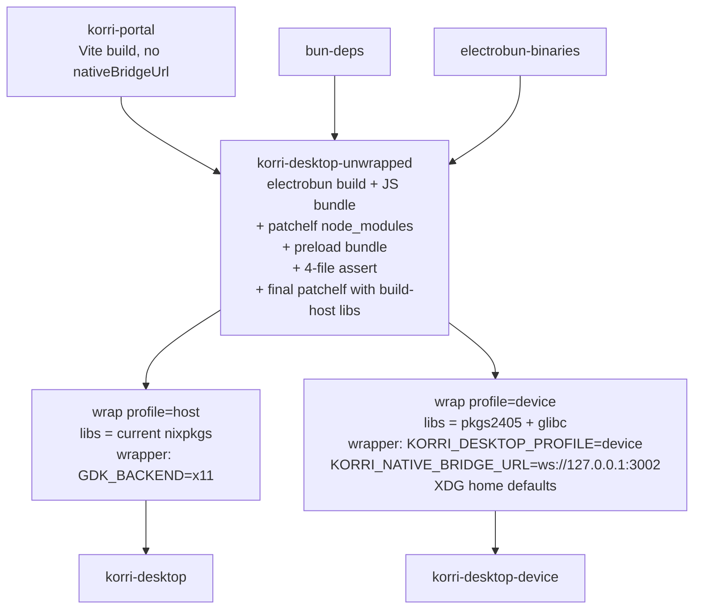
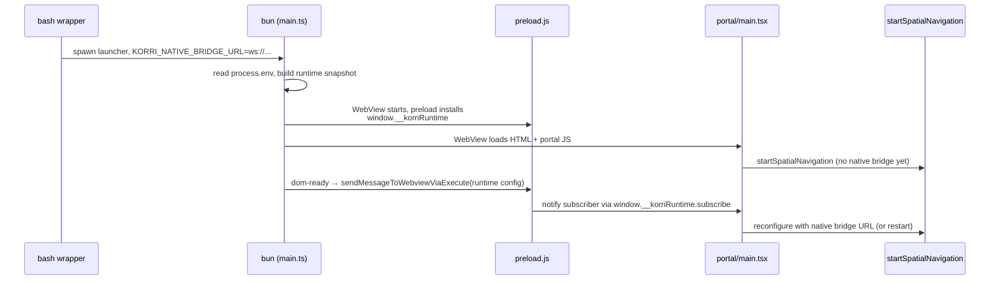

# refactor: Split korri-desktop into unwrapped+wrap and unify the portal

## Summary

Refactor `nix/korri-desktop.nix` into the canonical nixpkgs **unwrapped + wrap** split — one heavy `korri-desktop-unwrapped` derivation that runs the electrobun build, JS bundling, and `node_modules` patchelf, and a thin `wrap` function called per variant for RPATH retargeting and wrapper-script writing. In parallel, unify `korriPortal` and `korriPortalDevice` by moving `VITE_KORRI_NATIVE_BRIDGE_URL` from a Vite-baked constant to a runtime value pushed from bun through the existing preload bridge channel.

---

## Problem Frame

Today the desktop has two parallel build pipelines per variant: `korriPortal` vs `korriPortalDevice` differ only by one Vite env var, and `korriDesktop` vs `korriDesktopDevice` both call the same heavy `nix/korri-desktop.nix` derivation function with different library inputs — duplicating the electrobun build, the JS bundle, and the patchelf pass. The duplication has no architectural payoff: the only per-variant difference that matters is the runtime library closure baked into RPATH (current nixpkgs vs `pkgs2405`) and the inputd bridge URL. Adding a new variant — Steamdeck, debug, kiosk — currently requires copy-pasting the entire `korriDesktop[Device]` block in `flake.nix` and the entire Vite portal build. This refactor collapses the duplication to the canonical nixpkgs idiom (`firefox-unwrapped` + `firefox`, `signal-desktop-unwrapped` + `signal-desktop`): heavy work runs once, variants are five-line callPackage invocations.

---

## Requirements

- R1. `nix build .#korri-desktop` produces a host-variant store path with the same behavior as today's `korri-desktop` (current nixpkgs WebKit, `GDK_BACKEND=x11` default).
- R2. `nix build .#korri-desktop-device` produces a device-variant store path with the same behavior as today's `korri-desktop-device` (pkgs2405 closure in RPATH, `KORRI_DESKTOP_PROFILE=device`, XDG-home defaulting, inputd bridge active).
- R3. The host and device store paths share the same `korri-desktop-unwrapped` derivation in the build graph — verified by `nix eval` against the flake outputs, not by reading store text.
- R4. Exactly one `korri-portal` derivation builds the Vite portal bundle; `korriPortalDevice` is deleted from `flake.nix`.
- R5. The portal's choice of controller backend (Gamepad API vs inputd over WebSocket) is driven at runtime by a value pushed from bun through the existing `window.__korriConnection`-style preload bridge mechanism, not by `import.meta.env.VITE_KORRI_NATIVE_BRIDGE_URL`.
- R6. `nix/modules/korri-client.nix` continues to default to `packages.${system}.korri-desktop` with no change required at the module level or in downstream consumers (e.g. `mountainous/hosts/sobo`).
- R7. `flake.nix` exposes `lib.wrapKorriDesktop` as a public callable so downstream repos can build new variants without forking the build logic.
- R8. End-to-end behavior verified on sobo (device, aarch64 NixOS) and on host x86_64 Linux: app launches, connects to AKA, mDNS browse fires, controller input works.

---

## Scope Boundaries

- No re-evaluation of the `pkgs2405` pin itself — it stays as the device closure.
- No change to the inputd bridge URL value (`ws://127.0.0.1:3002`) or to the controller-input architecture downstream of `startSpatialNavigation`.
- No new variants added (no Steamdeck, debug, kiosk). The refactor enables them; adding them is follow-up.
- No changes to electrobun internals, `bun-deps` mechanics, or the launcher binary itself.
- No changes to `nix/korri-headless-source.nix`, `nix/korri-game-stream.nix`, `nix/korri-server.nix`, or other sibling derivations.

### Deferred to Follow-Up Work

- Pushing the existing 5 unpushed commits on `korri/trunk` (`2a63c3e` … `9793d99`) and the mountainous commit (`bb3227b`): user action, separate from this refactor.
- Updating `mountainous/hosts/sobo` to drop the `--override-input korri path:...` shim after korri pushes: separate PR in mountainous repo.

---

## Context & Research

### Relevant Code and Patterns

- `nix/korri-desktop.nix` — current single derivation. Build phases: unpack → node_modules + bunDeps + electrobun binaries staging → patchelf node_modules ELFs → `electrobun build` (with fallback) → bundle backfill (`Resources/app/bun/index.js`, `version.json`, `build.json`) → preload bundling via `bun build --target=browser` → patchelf `out/build/electrobun` → install → write wrapper script.
- `nix/korri-portal.nix` — current Vite portal builder. Single optional parameter `nativeBridgeUrl` becomes `VITE_KORRI_NATIVE_BRIDGE_URL` env var fed to `vite build`.
- `flake.nix:184-198` — current `korriPortal` / `korriPortalDevice` declaration site.
- `flake.nix:222-248` — current `korriDesktop` / `korriDesktopDevice` declaration site (single function called twice).
- `korri/deploy/desktop/preload.ts` — exemplar pattern: `installConnectionStateBridge(window)` installs `window.__korriConnection` with `getState()` and `subscribe()`, overrides `window.__electrobun.receiveMessageFromBun` to fan out validated state. Mirror this exactly for `installRuntimeBridge(window)` → `window.__korriRuntime`.
- `korri/deploy/desktop/connection-state-bridge.ts` — exemplar contract module: cross-context type + `isConnectionStateBridgeState` guard. Mirror this exactly for the runtime config payload.
- `korri/deploy/desktop/preload-entry.ts` — browser-bundled preload entry. Single call to `installConnectionStateBridge`; extend to also call `installRuntimeBridge`.
- `korri/deploy/desktop/main.ts:185-200` — exemplar push pattern: `dom-ready` handler calls `window.webview.sendMessageToWebviewViaExecute(toBridgeState(snapshot))` to close the renderer-vs-bun startup race. Mirror this for runtime config push.
- `korri/deploy/desktop/window-options.ts:38` — `desktopProfileFromEnv()` reads `process.env.KORRI_DESKTOP_PROFILE`. Sibling read of `process.env.KORRI_NATIVE_BRIDGE_URL` belongs in the same module.
- `korri/deploy/portal/main.tsx:32-44` — current `VITE_KORRI_NATIVE_BRIDGE_URL` consumer; the single read site for the env var.
- `tools/testing/nix/korri-server-module-eval.fixture.nix` + `…test.ts` — exemplar `nix eval`-driven test for module evaluation. Mirror this shape for verifying unwrapped-derivation sharing.
- `nix/modules/korri-client.nix` — consumes `packages.${system}.korri-desktop` by default; the host wrapper output name must not change.
- `electrobun.config.ts` — `copy:` block lists `out/build/desktop-preload/preload.js` → `views/mainview/preload.js`. The preload is built and copied as part of the heavy build; lives with the unwrapped derivation.

### Institutional Learnings

- `docs/solutions/integration-issues/odin-electrobun-webkit-runtime-white-screen-2026-05-04.md` (with 2026-05-20 update) — establishes that the `pkgs2405` closure is cohesive (WebKitGTK 2.44.3 + matching GTK/Pango/libsoup/glib/cairo/gdk-pixbuf/libayatana-appindicator, plus current-nixpkgs glibc/gcc-lib for ABI with bun) and now baked into RPATH for the device variant. `XDG_DATA_DIRS` and `GIO_EXTRA_MODULES` must stay in the wrapper — they are runtime-discovery paths, not library-search paths.
- `docs/solutions/integration-issues/electrobun-linux-flat-bundle-2026-05-01.md` — establishes the bundle backfill pattern (`Resources/app/bun/index.js`, `version.json`, `build.json`, preload bundle) and the four-file postcondition. These belong on the unwrapped output, not the wrapper.
- `docs/solutions/best-practices/electrobun-desktop-wrapper-loopback-2026-05-01.md` — establishes the "one origin, no second application mode" principle. Two portal builds per device contradicts this; unifying via runtime config restores it.
- `docs/solutions/architecture-patterns/boot-scoped-control-plane-with-session-scoped-runner-2026-05-19.md` — establishes the repo's `nix eval`-driven testing posture for Nix package and module changes.

---

## Key Technical Decisions

- **Unwrapped vs wrap seam goes below the heavy work.** Unwrapped owns: unpack, bunDeps + electrobun staging, patchelf of `node_modules` ELFs, `electrobun build` with fallback, bundle backfill, preload bundling, the final patchelf pass over `out/build/electrobun`, and the four-file postcondition assert. Wrap owns: re-RPATH of every ELF with the variant's library set, wrapper script with variant env vars (`XDG_DATA_DIRS`, `GIO_EXTRA_MODULES`, `KORRI_DESKTOP_PROFILE`, `GDK_BACKEND`, `KORRI_NATIVE_BRIDGE_URL`, XDG-home defaulting). Rationale: heavy work runs once; bundle assertion lives on a sealed artifact; variants are cheap.
- **Wrap step preserves the file-type-branched patchelf loop from today's `patch_elf_tree`.** Iterate every ELF; shared objects get `--set-rpath`, executables (bun, launcher) keep getting only `--set-interpreter` (which is already correct from the unwrapped step — so for executables, the wrap pass is a no-op). Rationale: the current code intentionally does NOT add RPATH to executables; the device variant has been validated on sobo with this exact shape. Unconditionally RPATHing executables is a behavioral change that bypasses bun's own glibc/libstdc++/libcurl resolution chain and creates a hard-to-debug surface area. The host wrap is functionally a no-op on the unwrapped's RPATH (same paths); the device wrap re-targets shared-object RPATHs to the pkgs2405 closure. Verification (U6): after build, `patchelf --print-rpath` on `bin/bun` should return empty (or unchanged from unwrapped); on `libNativeWrapper.so` it should contain the pkgs2405 paths for the device variant.
- **Runtime config flows env var → bun → push channel → preload bridge → window.** Wrap step exports `KORRI_NATIVE_BRIDGE_URL=ws://127.0.0.1:3002` for the device variant. The host wrapper omits the export. The bun side reads `process.env.KORRI_NATIVE_BRIDGE_URL` at startup, includes it in the runtime config snapshot, and pushes it to webviews via `sendMessageToWebviewViaExecute` on `dom-ready`. Rationale: zero new mechanisms; mirrors `connection-state-bridge.ts` exactly; the dom-ready re-push already closes the renderer-vs-bun startup race.
- **Runtime bridge is a separate `window.__korriRuntime`, not a field on `__korriConnection`.** Rationale: different lifecycles (connection state is reactive over the session; runtime config is set-once at startup), different concerns (connectivity vs configuration), different test surfaces. Co-locating them on one bridge couples unrelated changes.
- **Host wrapper output name stays `korri-desktop`.** Not renamed to `korri-desktop-host`. Rationale: `nix/modules/korri-client.nix` defaults to `packages.${system}.korri-desktop`; renaming forces a coordinated downstream change without architectural benefit.
- **`lib.wrapKorriDesktop` is exposed at the flake top level.** Downstream consumers (mountainous, future device profiles) can call it directly without vendoring build logic. Rationale: this is the entire payoff of the unwrapped/wrap split — variants become a public extension point.
- **Library set for each variant is passed as named `callPackage` arguments (`webkitgtk_4_1`, `gtk3`, `libsoup_3`, …), not as a list.** Rationale: enables `.override { gtk3 = pkgs2405.gtk3; }` for ad-hoc variants and reads as the canonical nixpkgs idiom for this exact pattern.

---

## Open Questions

### Resolved During Planning

- **How does the renderer avoid the race between bun's push and `startSpatialNavigation` running synchronously at portal startup?** Two viable approaches: (a) defer `startSpatialNavigation` until the first runtime push or a short timeout (~200ms) for non-desktop deploys; (b) start spatial nav immediately with `native: undefined`, then reconfigure when the push arrives if `startSpatialNavigation` exposes a setter. Approach (a) is simpler if the spatial-nav module is not yet reconfigurable; approach (b) is cleaner if it is. The implementer picks based on inspecting `startSpatialNavigation`'s current API in `@shared/navigation/start` — both are acceptable per R5.
- **Does the unwrapped derivation need to assert the bundle-completeness postcondition?** Yes. The four-file assert (`Resources/app/bun/index.js`, `Resources/version.json`, `Resources/build.json`, `Resources/app/views/mainview/preload.js`) lives on the unwrapped output. Wrappers inherit a sealed bundle and don't re-assert.
- **What if `electrobun build` itself adjusts ELF RPATHs in `out/build/electrobun` post-patchelf?** The current code calls `patch_elf_tree out/build/electrobun` *after* `electrobun build`, so its RPATH already overrides whatever electrobun set. The unwrapped's final patchelf pass uses the build-host library set (current nixpkgs); the wrap pass overrides RPATH again per variant. Verified by reading `nix/korri-desktop.nix:106` (current patch_elf_tree call site).

### Deferred to Implementation

- The exact bash shell pattern for the wrap step's `find … | while read … | patchelf` loop (mirrors today's `patch_elf_tree`, but the implementer may simplify since the wrap pass only needs `--set-rpath` and not `--set-interpreter`).
- Whether to expose `installRuntimeBridge` and `installConnectionStateBridge` from a single barrel `preload.ts` or keep them in separate modules — depends on how the implementer chooses to organize after writing the test.

---

## Output Structure

```
nix/
  korri-desktop/                          ← NEW directory
    unwrapped.nix                         ← NEW: heavy build (was nix/korri-desktop.nix)
    wrap.nix                              ← NEW: per-variant rpath + wrapper
  korri-desktop.nix                       ← DELETED (replaced by directory)
  korri-portal.nix                        ← MODIFIED: drop nativeBridgeUrl param
korri/deploy/desktop/
  runtime-config-bridge.ts                ← NEW: cross-context contract
  runtime-config-bridge.test.ts           ← NEW
  preload.ts                              ← MODIFIED: add installRuntimeBridge
  preload.test.ts                         ← MODIFIED: cover installRuntimeBridge
  preload-entry.ts                        ← MODIFIED: call installRuntimeBridge
  main.ts                                 ← MODIFIED: read env, push runtime config
  main.test.ts (or to-bridge-state.test.ts) ← MODIFIED: cover runtime config push
korri/deploy/portal/
  main.tsx                                ← MODIFIED: read from window.__korriRuntime
tools/testing/nix/
  korri-desktop-build-graph.fixture.nix   ← NEW: nix eval fixture
  korri-desktop-build-graph.test.ts       ← NEW: assertions
flake.nix                                 ← MODIFIED: single portal, unwrapped+wrap calls, lib.wrapKorriDesktop
```

---

## High-Level Technical Design

> *This illustrates the intended approach and is directional guidance for review, not implementation specification. The implementing agent should treat it as context, not code to reproduce.*

### Build graph (after refactor)



### Runtime config flow (device variant)



### Bridge contract shape

```typescript
// runtime-config-bridge.ts
export interface RuntimeConfigBridgeState {
  readonly nativeBridgeUrl: string | null
}

export function isRuntimeConfigBridgeState(value: unknown): value is RuntimeConfigBridgeState

// window.__korriRuntime — same shape as __korriConnection
interface KorriRuntimeBridge {
  getState(): RuntimeConfigBridgeState
  subscribe(listener: (state: RuntimeConfigBridgeState) => void): () => void
}
```

---

## Implementation Units

### U1. Add runtime-config bridge contract module

**Goal:** Create the cross-context type for the runtime config push payload.

**Requirements:** R5

**Dependencies:** none

**Files:**
- Create: `korri/deploy/desktop/runtime-config-bridge.ts`
- Test: `korri/deploy/desktop/runtime-config-bridge.test.ts`

**Approach:**
- Mirror `korri/deploy/desktop/connection-state-bridge.ts` exactly: pure type definition + type guard, no runtime imports.
- Initial payload shape: `{ nativeBridgeUrl: string | null }`. Designed to be extended later without contract churn.

**Patterns to follow:**
- `korri/deploy/desktop/connection-state-bridge.ts` (file structure, JSDoc style, exported type guard, sub-helpers like `isString`)

**Test scenarios:**
- Happy path: `isRuntimeConfigBridgeState({ nativeBridgeUrl: "ws://127.0.0.1:3002" })` returns true.
- Happy path: `isRuntimeConfigBridgeState({ nativeBridgeUrl: null })` returns true.
- Edge case: missing field → returns false.
- Edge case: wrong type (number, undefined, object) for `nativeBridgeUrl` → returns false.
- Edge case: extra fields are tolerated (type guard is structural, not exact).

**Verification:**
- `bun test korri/deploy/desktop/runtime-config-bridge.test.ts` passes.
- No imports of React, Effect, electrobun, or any runtime-specific module.

---

### U2. Extend preload to install runtime bridge

**Goal:** Install `window.__korriRuntime` alongside `window.__korriConnection`, listening for the bun-side push.

**Requirements:** R5

**Dependencies:** U1

**Files:**
- Modify: `korri/deploy/desktop/preload.ts`
- Modify: `korri/deploy/desktop/preload.test.ts`
- Modify: `korri/deploy/desktop/preload-entry.ts`

**Approach:**
- Add `installRuntimeBridge(target)` next to `installConnectionStateBridge`. Same shape: install bridge on target, override `target.__electrobun.receiveMessageFromBun` to fan out to BOTH the connection-state listeners AND the runtime listeners (dispatch by payload shape using both type guards).
- Alternative: add a per-message-type discriminator on the wire (e.g., `{ kind: "connection" | "runtime", payload }`) so each bridge stays single-purpose. The implementer picks based on `to-bridge-state.ts`'s current shape.
- `preload-entry.ts` calls both installers.

**Patterns to follow:**
- `korri/deploy/desktop/preload.ts` — `installConnectionStateBridge` function shape.
- The existing `target.__electrobun.receiveMessageFromBun` override convention.

**Test scenarios:**
- Happy path: `installRuntimeBridge(fakeWindow)` installs `__korriRuntime` with initial state `{ nativeBridgeUrl: null }`.
- Happy path: subscribe → bun pushes `{ nativeBridgeUrl: "ws://..." }` → subscriber called with new state.
- Edge case: unsubscribe → subscriber not called on subsequent pushes.
- Edge case: invalid payload (e.g., `{ nativeBridgeUrl: 42 }`) → bridge ignores, listeners not notified.
- Integration: both `installConnectionStateBridge` and `installRuntimeBridge` installed on the same window; connection-state push reaches connection subscribers only; runtime push reaches runtime subscribers only. Cross-contamination must be impossible.
- Edge case: `target.__electrobun` does not exist → installer creates it.

**Verification:**
- `bun test korri/deploy/desktop/preload.test.ts` passes including the new scenarios.
- `preload-entry.ts` calls both installers; the existing connection-state behavior is unchanged.

---

### U3. Bun side pushes runtime config; portal consumes from bridge

**Goal:** Wire the bun-side env-var read → push → portal consumption end-to-end. After this unit, the device variant's portal still gets the bridge URL via the new path; the old `VITE_KORRI_NATIVE_BRIDGE_URL` mechanism is no longer the source of truth.

**Requirements:** R5, R8

**Dependencies:** U2

**Files:**
- Modify: `korri/deploy/desktop/main.ts` (read env, push on dom-ready, push on transition if needed)
- Modify: `korri/deploy/desktop/to-bridge-state.ts` or sibling — choose where the runtime-config snapshot is constructed.
- Modify: `korri/deploy/portal/main.tsx` — replace `import.meta.env.VITE_KORRI_NATIVE_BRIDGE_URL` read with a read off `window.__korriRuntime`, reconfigure or defer `startSpatialNavigation`.
- Modify: existing test files covering `main.ts` push behavior (e.g., `to-bridge-state.test.ts` or a new sibling test).

**Approach:**
- bun reads `process.env.KORRI_NATIVE_BRIDGE_URL` at startup (next to `desktopProfileFromEnv()` in `window-options.ts` or in `main.ts` directly — whichever module-boundary fits the existing layering).
- bun constructs a `RuntimeConfigBridgeState` snapshot (`{ nativeBridgeUrl: envValue ?? null }`) and pushes via `sendMessageToWebviewViaExecute` on `dom-ready` for each window. The same close-the-race pattern that `connection-state` uses.
- Portal `main.tsx` reads `window.__korriRuntime?.getState()` synchronously. If the initial state's `nativeBridgeUrl` is null, subscribe and reconfigure when the push arrives.
- Implementer chooses the race-handling approach by first auditing callers of `getInputBus()`, `getSpatialNavigation()`, and `subscribeSpatialNavigation()` in `korri/products/app/` and `korri/shared/`. The current `startSpatialNavigation` (`korri/shared/navigation/start.ts:142-218`) supports re-call via `currentHandle?.dispose()` which tears down `bus`, `inputMode`, `focusRetention`, and `activeFocusAttribute`. If any caller captures a bus/handle reference across the initial render, prefer the timeout-deferred approach (start spatial nav exactly once after the runtime push or a ~200ms timeout for non-desktop deploys). If no callers capture across renders, start with `native: undefined` and reconfigure on push — simpler, but creates a brief gamepad-only window at startup.

**Patterns to follow:**
- `korri/deploy/desktop/main.ts:185-200` — `dom-ready` handler that re-pushes a snapshot.
- `korri/deploy/desktop/window-options.ts:38` — `desktopProfileFromEnv()` env-var read shape.

**Test scenarios:**
- Happy path: with `KORRI_NATIVE_BRIDGE_URL=ws://127.0.0.1:3002` set, bun's runtime config snapshot reads `{ nativeBridgeUrl: "ws://127.0.0.1:3002" }`.
- Happy path: with the env var unset, snapshot reads `{ nativeBridgeUrl: null }`.
- Happy path: dom-ready handler calls `sendMessageToWebviewViaExecute` with the runtime config payload exactly once per window.
- Edge case: empty-string env var (`KORRI_NATIVE_BRIDGE_URL=""`) treated as null/unset, not as a bridge URL.
- Integration (portal-side, unit-tested via window mock): portal reads from `window.__korriRuntime.getState()` and configures spatial nav with `native: undefined` when state is null.
- Integration: portal reconfigures (or initializes) spatial nav with `native: { url: ws://..., subscribe: [...] }` when push arrives.
- Integration: dev/web deploy (no preload, `window.__korriRuntime` absent) — portal falls back to Gamepad API without throwing.

**Verification:**
- All updated bun-side tests pass.
- A device-variant smoke launch on sobo (after U7 lands) shows inputd still receives controller events; a host-variant launch shows Gamepad API still works.

---

### U4. Unify korri-portal — drop the nativeBridgeUrl parameter

**Goal:** Delete the second Vite build configuration. `korri-portal` is now exactly one derivation.

**Requirements:** R4, R5

**Dependencies:** U3

**Files:**
- Modify: `nix/korri-portal.nix` (drop `nativeBridgeUrl` parameter and the `VITE_KORRI_NATIVE_BRIDGE_URL` env-export block)
- Modify: `flake.nix` (delete `korriPortalDevice` declaration; both desktop wrappers consume `korriPortal`)

**Approach:**
- The portal no longer reads `import.meta.env.VITE_KORRI_NATIVE_BRIDGE_URL` after U3 lands, so the Vite-side env-var injection serves no purpose.
- Verify the change with `nix build .#korri-portal` and confirm the output bundle matches the previous host-variant bundle by store-hash comparison (or by content inspection of `main.js`).

**Patterns to follow:**
- The simpler form of `nix/korri-portal.nix` is just the existing file minus the `nativeBridgeUrl` parameter and the `optionalString` block.

**Test scenarios:**
- Test expectation: none — pure derivation simplification with no new behavior. Coverage flows through U3's portal-side tests and U8's end-to-end hardware verification.

**Verification:**
- `nix flake check` passes.
- `nix build .#korri-portal` succeeds.
- `grep -rn "korriPortalDevice\|VITE_KORRI_NATIVE_BRIDGE_URL" .` finds no remaining references.

---

### U5. Create unwrapped derivation

**Goal:** Move the heavy build (electrobun + JS bundle + node_modules patchelf + bundle backfill + preload bundle + final patchelf) into `nix/korri-desktop/unwrapped.nix`. Library-agnostic except for the build-time library set used by the build-host patchelf pass.

**Requirements:** R3, R6

**Dependencies:** U4 (so the unwrapped consumes the unified `korri-portal`)

**Files:**
- Create: `nix/korri-desktop/unwrapped.nix`

**Approach:**
- Take parameters: `stdenv, lib, bash, bun, nodejs_20, patchelf, file, makeWrapper, src, system, bunDeps, electrobunBinaries, portal, buildtimeLibraries`.
- Body is the current `nix/korri-desktop.nix` minus the wrapper-writing block in `installPhase` and minus the per-variant parameters (`profile`, `desktopDataDirs`, `gioExtraModules` — those move to wrap).
- `pname = "korri-desktop-unwrapped"`.
- `installPhase` produces `$out/share/korri-desktop/` only — no `$out/bin/`.
- Preserve the four-file postcondition assert from the original. Add an explicit assertion loop if not already there: `Resources/app/bun/index.js`, `Resources/version.json`, `Resources/build.json`, `Resources/app/views/mainview/preload.js`.
- Keep the `electrobun build` fallback (the `|| { … continuing with the unpacked desktop bundle … }` block) per the `electrobun-linux-flat-bundle` learning.
- The final `patch_elf_tree out/build/electrobun` uses `buildtimeLibraries` (current nixpkgs); the wrap step will override RPATH per variant.

**Patterns to follow:**
- `nix/korri-desktop.nix` — direct lift, then strip the variant-specific suffix.

**Test scenarios:**
- Test expectation: none for this unit in isolation — coverage flows through U7 (`nix build .#korri-desktop` and `.#korri-desktop-device` both succeed and reach the wrapper step) and U8 (`nix eval` confirms host+device share the unwrapped store path).

**Verification:**
- `nix build .#korri-desktop-unwrapped` produces a store path containing `share/korri-desktop/.../Korri-dev/{bin/launcher,bin/bun,bin/libNativeWrapper.so,Resources/app/bun/index.js,Resources/version.json,Resources/build.json,Resources/app/views/mainview/preload.js}`.
- The output has no `$out/bin/` directory.

---

### U6. Create wrap derivation

**Goal:** Per-variant function that takes an unwrapped derivation + a library set + a profile and produces a complete `korri-desktop` or `korri-desktop-device` package.

**Requirements:** R1, R2, R5, R7

**Dependencies:** U3, U5

**Files:**
- Create: `nix/korri-desktop/wrap.nix`

**Approach:**
- callPackage-style signature: each library is a named parameter (`webkitgtk_4_1, gtk3, libsoup_3, glib, gdk-pixbuf, cairo, pango, libayatana-appindicator, librsvg, at-spi2-core, glib-networking, gsettings-desktop-schemas, glibc, stdenvCcLib`) plus `korri-desktop-unwrapped, profile ? "host"`. The library set mirrors today's `deviceDesktopRuntimeLibraries` in `flake.nix` — see Key Technical Decisions for the cross-check rule.
- `dontUnpack = true; dontBuild = true;`. `installPhase` only: `cp -R ${unwrapped}/share/korri-desktop/. $out/share/korri-desktop/`, chmod, then iterate every ELF using the same file-type branching as today's `patch_elf_tree`: shared objects get `patchelf --set-rpath "$ORIGIN:${libraryPath}"`; executables (interpreter set) get NO modification in the wrap pass (their interpreter was already set in the unwrapped step). Rationale: matches the validated-on-sobo behavior; avoids adding RPATH to bun/launcher binaries.
- Write the wrapper script at `$out/bin/${binName}` where `binName = if profile == "device" then "korri-desktop-device" else "korri-desktop"`. Wrapper sets `XDG_DATA_DIRS`, `GIO_EXTRA_MODULES`, and conditionally `GDK_BACKEND=x11` (host) or the device profile block (`KORRI_DESKTOP_PROFILE=device`, XDG home defaults, `KORRI_NATIVE_BRIDGE_URL=ws://127.0.0.1:3002`).
- Set `passthru.unwrapped = korri-desktop-unwrapped` per nixpkgs convention.

**Patterns to follow:**
- The wrapper-writing block in today's `nix/korri-desktop.nix:131-167`.
- The patchelf loop in today's `patch_elf_tree` function.

**Test scenarios:**
- Test expectation: none for this unit in isolation — coverage flows through U7 (host and device variants both build) and U8 (nix-eval verifies device wrapper's libNativeWrapper.so RPATH contains pkgs2405 store paths).

**Verification:**
- `passthru.unwrapped` resolves to the unwrapped derivation via `nix eval .#korri-desktop.passthru.unwrapped.drvPath`.
- Host wrapper's `bin/korri-desktop` exports only `XDG_DATA_DIRS`, `GIO_EXTRA_MODULES`, and `GDK_BACKEND` (no `KORRI_NATIVE_BRIDGE_URL`).
- Device wrapper's `bin/korri-desktop-device` exports `KORRI_NATIVE_BRIDGE_URL=ws://127.0.0.1:3002`.
- `patchelf --print-rpath $out/.../bin/bun` returns the same RPATH as the unwrapped output (no per-variant divergence on executables).
- `patchelf --print-rpath $out/.../bin/libNativeWrapper.so` on the device variant contains pkgs2405 store paths (e.g. `webkitgtk-2.44.3`).

---

### U7. Update flake.nix to consume unwrapped + wrap

**Goal:** Replace the two `import ./nix/korri-desktop.nix { ... }` call sites with one `callPackage ./nix/korri-desktop/unwrapped.nix { ... }` and two `callPackage ./nix/korri-desktop/wrap.nix { ... }` calls. Expose `lib.wrapKorriDesktop` at the flake top level.

**Requirements:** R1, R2, R3, R7

**Dependencies:** U5, U6

**Files:**
- Modify: `flake.nix`

**Approach:**
- Replace `korriDesktop` and `korriDesktopDevice` declarations with:
  - `korriDesktopUnwrapped = pkgs.callPackage ./nix/korri-desktop/unwrapped.nix { inherit src system bunDeps electrobunBinaries; portal = korriPortal; buildtimeLibraries = linuxDesktopRuntimeLibraries; }`
  - `korriDesktop = pkgs.callPackage ./nix/korri-desktop/wrap.nix { korri-desktop-unwrapped = korriDesktopUnwrapped; stdenvCcLib = pkgs.stdenv.cc.cc.lib; profile = "host"; }`
  - `korriDesktopDevice = pkgs.callPackage ./nix/korri-desktop/wrap.nix { korri-desktop-unwrapped = korriDesktopUnwrapped; webkitgtk_4_1 = pkgs2405.webkitgtk_4_1; gtk3 = pkgs2405.gtk3; libsoup_3 = pkgs2405.libsoup_3; glib = pkgs2405.glib; gdk-pixbuf = pkgs2405.gdk-pixbuf; cairo = pkgs2405.cairo; pango = pkgs2405.pango; libayatana-appindicator = pkgs2405.libayatana-appindicator; librsvg = pkgs2405.librsvg; at-spi2-core = pkgs2405.at-spi2-core; glib-networking = pkgs2405.glib-networking; gsettings-desktop-schemas = pkgs2405.gsettings-desktop-schemas; stdenvCcLib = pkgs.stdenv.cc.cc.lib; profile = "device"; }`
- **Every pkgs2405 entry in today's `deviceDesktopRuntimeLibraries` must appear as an override.** Today's list is the cohesive closure that has been validated on sobo: `webkitgtk_4_1, gtk3, libayatana-appindicator, librsvg, libsoup_3, glib, gdk-pixbuf, at-spi2-core, pango, cairo, glib-networking` plus host `glibc` and `stdenv.cc.cc.lib`. **Cross-check before U7 lands**: `grep 'pkgs2405\.' flake.nix` must produce a set that is a subset of the device wrap's callPackage overrides. Missing entries cause silent ABI drift — `callPackage` auto-fills from current nixpkgs.
- Add `korri-desktop-unwrapped` to `packages` set so downstream consumers can substitute the cached unwrapped without rebuilding.
- Expose `lib.wrapKorriDesktop = args: pkgs.callPackage ./nix/korri-desktop/wrap.nix args` at the per-system outputs level (or under `outputs.lib` if the existing flake has that shape).

**Patterns to follow:**
- The existing call-site structure at `flake.nix:222-248`.
- `pkgs.callPackage` is the canonical idiom; today's `import ./nix/korri-desktop.nix { ... }` is the non-canonical form being replaced.

**Test scenarios:**
- Test expectation: none for this unit in isolation — coverage flows through U8.

**Verification:**
- `nix flake check` passes.
- `nix build .#korri-desktop .#korri-desktop-device .#korri-desktop-unwrapped` all succeed on x86_64-linux.
- `nix eval .#packages.x86_64-linux.korri-desktop.passthru.unwrapped.drvPath` returns the unwrapped derivation's drv path.
- Device variant built on fuji (aarch64) and pushed to sobo launches and connects to AKA (smoke validation against R8).

---

### U8. Add nix-eval test and delete the legacy korri-desktop.nix

**Goal:** Lock in the unwrapped-sharing and device-RPATH invariants with a programmatic test, then remove the dead legacy file.

**Requirements:** R3, R6

**Dependencies:** U7

**Files:**
- Create: `tools/testing/nix/korri-desktop-build-graph.fixture.nix`
- Create: `tools/testing/nix/korri-desktop-build-graph.test.ts`
- Delete: `nix/korri-desktop.nix`

**Approach:**
- Fixture evaluates `flake.outputs.packages.x86_64-linux.{korri-desktop, korri-desktop-device, korri-desktop-unwrapped}` and extracts:
  - `korri-desktop.passthru.unwrapped.drvPath`
  - `korri-desktop-device.passthru.unwrapped.drvPath`
  - `korri-desktop-unwrapped.drvPath`
  - `korri-desktop-device`'s wrapper script content (read from the derivation via fixture-side `builtins.readFile`-equivalent or by listing the buildCommand) — to confirm pkgs2405 store paths appear.
- Test asserts:
  - All three drv paths agree (host.passthru.unwrapped == device.passthru.unwrapped == korri-desktop-unwrapped).
  - The device wrapper's RPATH-bearing inputs include `vh7a3p4ylaphnfpklnhp5mk6hhv22al6-webkitgtk-2.44.3+abi=4.1` and `x4cz12bnhc3znyjl2my6wdz65dnvfzxx-gtk+3-3.24.43` (or, less brittle, asserts the device wrapper depends on `pkgs2405.webkitgtk_4_1` by name evaluation, not exact hash).
  - The host wrapper's RPATH-bearing inputs do NOT include any pkgs2405 store paths.
- Delete `nix/korri-desktop.nix` after verifying nothing imports it.

**Patterns to follow:**
- `tools/testing/nix/korri-server-module-eval.fixture.nix` + `.test.ts` — same structure (fixture exposes evaluation results as a JSON-ish set; test invokes `nix eval --json` and asserts on the parsed result).

**Test scenarios:**
- Happy path: `host.passthru.unwrapped.drvPath === device.passthru.unwrapped.drvPath` (build-graph sharing invariant).
- Happy path: `host.passthru.unwrapped.drvPath === korri-desktop-unwrapped.drvPath` (the unwrapped is a real shared input, not a private one-off).
- Happy path: device variant's library inputs include pkgs2405.webkitgtk_4_1, pkgs2405.gtk3, pkgs2405.libsoup_3 (sample check — full list belongs in the wrap.nix call site, not the test).
- Edge case: host variant's library inputs do NOT include any pkgs2405 store paths (anti-regression: prevent accidental pin leak into host).
- Edge case: `korri-desktop` and `korri-desktop-device` produce distinct out paths (variants are not accidentally identical despite shared unwrapped).
- Edge case: `nix flake show` lists `korri-desktop-unwrapped` as a public package.

**Verification:**
- `bun test tools/testing/nix/korri-desktop-build-graph.test.ts` passes.
- `grep -rn "korri-desktop.nix" .` finds no references outside docs.
- Final smoke on sobo (device variant) and x86 (host variant): both launch, render, connect — R8 satisfied.

---

## System-Wide Impact

- **Interaction graph:** `nix/modules/korri-client.nix` consumes `packages.${system}.korri-desktop`; mountainous `services.korri.client.package = packages.korri-desktop-device` consumes the device variant. Both API surfaces stay unchanged. `flake.nix` exposes a new `korri-desktop-unwrapped` package and a new `lib.wrapKorriDesktop` callable.
- **Error propagation:** Bun-side push uses the existing `sendMessageToWebviewViaExecute` channel with the existing `try/catch` + `logger.warn` pattern. A missing or malformed runtime push falls back to `{ nativeBridgeUrl: null }` → Gamepad API. No new failure modes.
- **State lifecycle risks:** The renderer's `startSpatialNavigation` reconfiguration path (if used) must idempotently swap the controller backend. If it cannot, the implementer falls back to the timeout-deferred approach. Either way, repeated runtime pushes are safe — `nativeBridgeUrl` is set-once at startup and does not transition during the session.
- **API surface parity:** Today's `import.meta.env.VITE_KORRI_CONTROLLER_PROFILE` read in `portal/main.tsx` is left alone (it's read but never set in either build). If it ever needs to be variant-specific, the same runtime-config channel absorbs it without further refactor.
- **Integration coverage:** End-to-end coverage on real hardware is the only way to validate the controller backend swap. Unit tests cover the bridge mechanics; sobo smoke covers the inputd connection.
- **Unchanged invariants:** `KORRI_DESKTOP_PROFILE`, `KORRI_DESKTOP_DUAL_SCREEN`, `KORRI_DESKTOP_STATUS_FILE`, `KORRI_LIBRARY_ROOT`, `KORRI_DEVICE_STATE_ROOT`, `CHROME_CONFIG_HOME` env vars all stay in place. The connection-state bridge (`window.__korriConnection`) is not modified. The `pkgs2405` closure stays as the device library pin. `XDG_DATA_DIRS` and `GIO_EXTRA_MODULES` continue to be wrapper exports (not RPATH).

---

## Risks & Dependencies

| Risk | Mitigation |
|------|------------|
| The `wrap` step's RPATH-only patchelf accidentally drops `--set-interpreter` and breaks the launcher's exec on sobo | Unwrapped's final patchelf already sets the interpreter; the wrap step only sets RPATH. Verify by inspecting the device wrapper's `libNativeWrapper.so` interpreter via `patchelf --print-interpreter` after build. |
| `startSpatialNavigation` has no setter for the controller backend, forcing the timeout-deferred approach which delays input on slow renderers | Acceptable: 200ms timeout is below human perception threshold for input readiness. If push-then-reconfigure is preferred and the API doesn't support it, add a tiny setter as a sibling change inside U3. |
| The portal/renderer race breaks on sobo specifically (slow GPU init, late dom-ready) | The dom-ready push is already what connection-state uses and it has been stable on sobo for the duration of `docs/plans/2026-05-20-004`. Same mechanism, same expected behavior. |
| Renaming/removing `korri-desktop.nix` breaks an editor/IDE/agent reference embedded in a doc that links to the old path | The relevant docs (`docs/solutions/integration-issues/odin-electrobun-webkit-runtime-white-screen-2026-05-04.md`, `docs/solutions/integration-issues/electrobun-linux-flat-bundle-2026-05-01.md`) refer to `nix/korri-desktop.nix` as the file where the heavy build lives. After this refactor, the file is `nix/korri-desktop/unwrapped.nix`. Append an "Update YYYY-MM-DD — file moved to nix/korri-desktop/unwrapped.nix" note to those two docs as part of U8 (or as a follow-up commit). |
| `pkgs.callPackage` auto-fills library arguments from `pkgs`, but `glibc` and `stdenv.cc.cc.lib` need to come from the host nixpkgs even in the device variant — accidentally getting `pkgs2405.glibc` would break bun ABI | The device-variant `callPackage` invocation explicitly overrides every library that needs `pkgs2405`; `glibc` is NOT in that override list, so it inherits from `pkgs` (host nixpkgs). `stdenvCcLib` is passed explicitly as `pkgs.stdenv.cc.cc.lib`. Test U8 anti-regression: device variant's runtime closure does NOT contain `pkgs2405.glibc`. |
| The build-time `electrobun build` step inside the unwrapped derivation needs a working patchelf pass over `node_modules/electrobun` ELFs to execute on the build host; if the build-time library set is wrong, the build fails before any wrap step runs | This is exactly what `linuxDesktopRuntimeLibraries` (current nixpkgs) is for; the unwrapped takes it as `buildtimeLibraries`. The pre-electrobun-build `patch_elf_tree node_modules/electrobun/bin` and `patch_elf_tree node_modules/electrobun/dist-...` calls are preserved verbatim. |

---

## Sources & References

- Related code: `nix/korri-desktop.nix`, `nix/korri-portal.nix`, `flake.nix`, `korri/deploy/desktop/preload.ts`, `korri/deploy/desktop/connection-state-bridge.ts`, `korri/deploy/desktop/main.ts`, `korri/deploy/portal/main.tsx`, `tools/testing/nix/korri-server-module-eval.fixture.nix`, `nix/modules/korri-client.nix`.
- Related learnings: `docs/solutions/integration-issues/odin-electrobun-webkit-runtime-white-screen-2026-05-04.md`, `docs/solutions/integration-issues/electrobun-linux-flat-bundle-2026-05-01.md`, `docs/solutions/best-practices/electrobun-desktop-wrapper-loopback-2026-05-01.md`, `docs/solutions/architecture-patterns/boot-scoped-control-plane-with-session-scoped-runner-2026-05-19.md`.
- Related prior plan: `docs/plans/2026-05-20-004-refactor-desktop-as-server-client-plan.md` (introduced the `window.__korriConnection` preload bridge precedent this plan extends).
- nixpkgs unwrapped/wrapped exemplars: `firefox-unwrapped` + `firefox`, `signal-desktop-unwrapped` + `signal-desktop`, `vscode`, `obsidian`.
