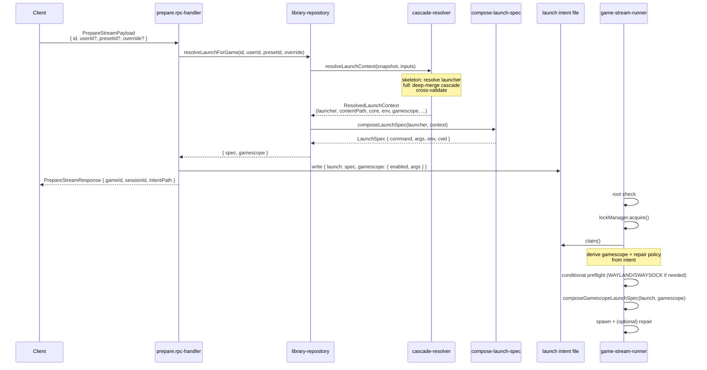

# Korri Config Cascade and Per-Game Gamescope Policy

## Summary

Replace `launch-target` + `launcher-profile` with five map-keyed top-level
collections plus a singleton (`games`, `users`, `systems`, `launchers`,
`collections`, and a singleton `config`) under a new
`korri/shared/library/config/` module. Presets are nested under their
owning record, not a top-level collection. A pure two-pass cascade
resolver (skeleton launcher resolution → full field-level merge with
preset-chain deep-merge) assembles each launch payload. Per-game
gamescope policy is the first feature riding on this model: policy is
resolved server-side at `prepare.rpc` time, carried in the launch
intent, and wrapped at runner execution time. Eight `KORRI_GAME_STREAM_*`
env vars are deleted; only `RUNTIME_DIR` survives. ProseQL 0.13.2's new
`documents` source variant delivers the brief's "files don't matter"
promise literally — any `*.yaml` file in the library root contributes
to any declared collection via top-level keys. Brand-new app posture
— no backcompat, no legacy detection, no migration transforms. On
schema-breaking changes the library root is wiped and re-imported.

---

## Problem Frame

Gamescope is currently gated by a single global env-var
(`KORRI_GAME_STREAM_USE_GAMESCOPE`) wired by the Nix module. That env-var
is invisible to the user, can't differ per game, and has no place in the
YAML config the user actually edits. Sibling policy concerns (CPU
governor, hooks) are coming next and need the same per-layer story. The
existing `launch-target` schema is a join-table abstraction that doesn't
map onto the conceptual hierarchy users think in
(`global → user → system → launcher → game → preset`).

A separate audit of `KORRI_GAME_STREAM_*` env vars revealed that eight
of nine are cargo-cult: four are runtime policy toggles that the
cascade replaces, three are filesystem paths derivable from a single
runtime directory, and one is an intent-staleness tuning knob nothing
actually tunes.

See origin: `docs/briefs/2026-05-21-korri-config-cascade-brief.md`.

---

## Requirements

- R1. Per-game gamescope policy resolves across the seven-layer cascade
  (`global → user → system → launcher → game → preset → ephemeral
  override`) with deep-merge for objects, list-concat for lists,
  map-merge for maps, and an `inherit: false` escape hatch at any layer.
- R2. A game with zero defined presets and zero direct policy fields
  launches via pure inheritance from less-specific layers.
- R3. Identity fields (`system`, `contentPath`) live only at the game
  layer and cannot be set by presets or ephemeral overrides; romhacks
  and derivative content land as separate `games:` rows.
- R4. Presets are the full behavior layer: they CAN set any inheritable
  field including `launcher` and launcher-keyed config under
  `byLauncher.<launcherId>.*`. The only fields presets cannot set are
  identity fields (`system`, `contentPath`) and nested presets.
- R5. Same-name presets across layers form a deep-merge chain. The
  more-specific layer extends/replaces the less-specific one field by
  field; `inherit: false` on any link truncates the chain at that point.
- R6. Prepare RPC accepts optional `userId`, `presetId`, and `override`
  fields. Server re-resolves the launch payload on each request. Omitted
  `userId` means no user-layer contribution (no implicit `default`
  user); named `userId` that doesn't exist returns `UserNotFound`.
- R7. Adding CPU or hooks policy in a follow-up requires only schema
  additions to the inheritable-field whitelist; the cascade merge rules
  do not change. (Hooks may grow ordering/failure-policy concerns of
  their own; that's a separate extensibility surface.)
- R8. `users` ships as a first-class top-level collection. It can be
  empty on a fresh device; no rows are seeded.
- R9. `collections` ships as a first-class top-level collection with
  title/description and manual membership (the game side declares
  `collections: [...]`). No collection-derived deltas are written by
  the v1 importer.
- R10. Global-layer fields (root `launcher`, `gamescope`, `env`, global
  presets, future `cpu`/`hooks`) persist in a singleton `config`
  collection whose only valid key is `global`.
- R11. All record schemas are strict whitelists. Unknown keys fail
  decode with a file-and-path-attributed error. Forward-compat for new
  fields is handled by adding them to the whitelist, not by accepting
  arbitrary unknowns.
- R12. Eight of nine `KORRI_GAME_STREAM_*` env vars are deleted from
  code and Nix; only `RUNTIME_DIR` survives. Tool availability
  (`gamescope`, `swaymsg`) comes from PATH (Nix populates it). Other
  paths (intent file, lock, status) derive from `RUNTIME_DIR` inline.
- R13. The runner reads gamescope policy from the launch intent; Sway
  repair is implicit (active when resolved gamescope is enabled). The
  runner's flow is reordered to claim the intent before policy-derived
  preflight.
- R14. The legacy `launcher-config/` module and all its consumers are
  deleted. No backcompat shim. Brand-new app posture: schema-breaking
  changes are a clean library reset and re-import.
- R15. ROCKNIX importer writes the new shape; no legacy
  `launch-targets.yaml` / `launcher-profiles.yaml` written.
- R16. Tests for the cascade, RPC payload, intent, and runner exercise
  real ProseQL temp libraries, real RPC client/server, and real
  launch-intent files. No `Mock*`/`Stub*`/`Fake*` prefixed doubles.

---

## Scope Boundaries

- CPU and hooks schemas — coming next; same cascade applies. Not v1.
- Collection-level policy contributions, nested collections, smart
  (filter-based) membership, `basedOn` on collections — future.
- Multi-user UX (picker, library subset by user, controller mapping,
  save-data namespacing, auth) — v1 ships an empty `users` collection;
  named users are added by the user when they want them.
- `SDL_VIDEODRIVER=x11` as an automatic default for streamed SDL games —
  per-launcher env workaround stands.
- Storybook stories that exercise cascade resolution — no UI surface
  changes; library renderer keeps reading through atoms.
- Effect Schema `Schema.Class` return-instance correctness — already
  covered by an existing learning; the new RPC handler follows it but
  this plan does not re-establish it.

### Deferred to Follow-Up Work

- **Renderer atoms surfacing preset menus, ephemeral-override UI, user
  picker:** server-side cascade resolution ships in v1, but the
  user-facing UI for selecting presets, building overrides, and
  choosing a user is a follow-up plan. Today the renderer calls
  `prepare.rpc` with `{ id }` and resolves "no user, no preset, no
  override" implicitly; v1 keeps that calling shape working.
- **Renaming the `KORRI_GAME_STREAM_*` env-var cluster:** the
  surviving `KORRI_GAME_STREAM_RUNTIME_DIR` could become
  `KORRI_RUNTIME_DIR` in a future cleanup. Not in scope here; this
  plan only deletes vars, doesn't rename them.
- **Sweep of other env-var clusters:** `KORRI_FAKE_GAME_EXIT`,
  `KORRI_NIX_LD_*`, `KORRI_DESKTOP_*`, `KORRI_ELECTROBUN_*` — likely
  also need audits but belong to other features.

---

## Context & Research

### Relevant Code and Patterns

- `korri/shared/library/launcher-config/launch-target.ts` — current
  union of `ProfileBackedLaunchTargetRecord` + `LegacyLaunchTargetRecord`.
  Deleted in U4.
- `korri/shared/library/launcher-config/launcher-profile.ts` —
  `LauncherProfileRecord` with `defaults.{contentPath,system,emulator,core}`.
  Replaced by a slimmer `launcher` record (per-launcher default system
  goes away; systems become a flat list of supported ids; per-system
  core lookup moves into the system record).
- `korri/shared/library/launcher-config/launch-resolver.ts` —
  placeholder substitution (`{contentPath}`, `{core}`, `{system}`,
  `{emulator}`) and env/cwd/policy resolution. Substitution logic is
  preserved and moved to U3; profile+target interface is replaced.
- `korri/shared/library/proseql/library-db.ts` — current collections
  (`games`, `launcherProfiles`, `launchTargets`) with
  `id: { kind: "derivedFromKey", field: "id" }`. Template for U4's six
  collection declarations.
- `korri/shared/library/proseql/library-repository.ts` — `listGames`,
  `upsertImportedGame`, `launchSpecForGame`. Rewritten in U4.
- `korri/products/app/api/stream/prepare.rpc.ts` +
  `prepare.rpc-handler.ts` — `PrepareStreamPayload { id: string }`. U5
  extends payload with optional `userId`, `presetId`, `override`;
  handler calls the cascade resolver.
- `tools/device/game-stream-runner.ts` + `game-stream-fullscreen.ts` —
  reads `KORRI_GAME_STREAM_USE_GAMESCOPE`, calls
  `composeGamescopeLaunchSpec`. U6 reorders the runner flow: claim
  intent first, derive policy from intent, then preflight, then spawn.
- `nix/modules/korri-game-stream.nix` — declares
  `services.korri.gameStream.gamescope.enable` and `.sway.repair`
  options plus eight `KORRI_GAME_STREAM_*` env-var exports. U7 deletes
  most of it; relocates `gamescope.package` and `sway.package` to
  top-level `korri.*` options; consolidates path env vars into a single
  `RUNTIME_DIR`.
- `tools/importers/rocknix/rocknix-importer.ts` — `composeImportedRecord`
  produces `{ game, launcherProfile, launchTarget }`. U4 rewrites to
  produce the new shape.
- `tools/testing/library/with-temp-proseql-library.ts` — real ProseQL
  temp library harness. Extended in U4 to seed the new collections.

### Institutional Learnings

- `docs/solutions/best-practices/proseql-canonical-library-with-derived-yaml-ids-2026-05-06.md` —
  ProseQL YAML uses object-keyed storage with key-derived ids. The
  pattern is preserved across all six new collections; the doc's
  `launchTargets` example is superseded but the durable rule stands.
- `docs/solutions/best-practices/prefer-real-implementations-over-mocks-2026-05-02.md` —
  all U2/U3/U4/U5/U6 tests run against real implementations with
  configurable behavior; no `Mock*`/`Stub*`/`Fake*` prefixes.
- `docs/solutions/integration-issues/effect-v4-rpc-schema-class-responses-2026-05-03.md` —
  `prepare.rpc` response uses `Schema.Class`; the handler returns
  constructed class instances. Carried forward in U5.
- `docs/solutions/integration-issues/effect-rpc-json-dates-need-decodable-schemas-2026-05-03.md` —
  RPC schemas must decode the encoded representation. Applied in U5
  for the new `override` shape.
- `docs/solutions/workflow-issues/generic-game-stream-runner-validation-contract-2026-05-19.md` —
  per-game display backend hints belong in the launch intent, not in
  Sunshine app definitions. Reinforces U5/U6's "intent carries policy,
  runner consumes" division.
- `docs/solutions/architecture-patterns/boot-scoped-control-plane-with-session-scoped-runner-2026-05-19.md` —
  Nix derives runtime/intent/lock/status paths from one explicit module
  choice. Reinforces U7's path-consolidation around `RUNTIME_DIR`.

### External References

- None — research found no external best-practice patterns that
  materially shape this plan beyond what's covered in the brief and the
  institutional learnings.

---

## Key Technical Decisions

- **New module: `korri/shared/library/config/` (not in-place edit of
  `launcher-config/`).** Cleaner mental model; old folder deleted as
  part of U4's atomic swap.
- **Presets are nested under their owning record, not a top-level
  collection.** Each owner record (`global`, `user`, `system`,
  `launcher`, `game`) carries a `presets?: Record<presetName,
  PresetPayload>` field. Top-level `presets.yaml` does not exist.
  Scope of a preset is structurally its location; orphans are
  impossible by construction.
- **Global-layer fields live in a singleton `config` collection.**
  Collection `config` has exactly one valid key (`global`) whose value
  is a `GlobalConfigRecord` carrying root-level `launcher`, `gamescope`,
  `env`, future `cpu`/`hooks`, and global presets.
- **Identity-field boundary is in the schema, not in convention.**
  `PresetPayload` and `EphemeralOverride` schemas explicitly omit
  `system` and `contentPath` and decode in strict whitelist mode. A
  payload that includes them fails decode with a file-and-path-
  attributed error. `system` and `contentPath` are defined on
  `GamePayload` and `GameRecord` only.
- **Presets ARE the full behavior layer.** Presets can set every
  inheritable field, including `launcher`. Launcher-keyed
  config (`retroarch.argsAppend`, `dolphin.configDir`, etc.) is set
  via a `byLauncher: Record<launcherId, LauncherKeyedPayload>` sub-map
  to avoid namespace collision with future top-level inheritable
  fields. This sub-map exists on every layer that can carry
  inheritable fields.
- **Cascade resolver is split into pure functions with a skeleton
  pre-pass.** `enumerateApplicablePresets(snapshot, gameId, userId)`
  returns the preset menu, organized as a chain per preset name.
  `resolveLaunchContext(snapshot, { gameId, userId, presetId, override })`
  runs a skeleton pass to resolve `launcher` (scanning override → chosen
  preset chain → game → system → user → global for the first non-null
  `launcher`), then walks the full cascade with the resolved launcher.
  Cross-validation surfaces `LauncherUnresolvable`, `CoreNotConfigured`,
  `UserNotFound`, `GameNotFound`, `PresetNotFound`.
- **Same-name presets across layers form a deep-merge chain.**
  `enumerateApplicablePresets` returns `Map<presetName,
  ResolvedPreset[]>` ordered least-specific → most-specific.
  Pass-2 deep-merges the chain in that order; the selected preset
  contributes the entire chain to the cascade as the "preset layer."
  `inherit: false` on any link truncates the chain at that point.
- **Launcher-layer presets are menu-visible only when their launcher
  is the current default.** Pass-1 enumeration computes a skeleton
  launcher `L₀` from non-preset record fields and exposes
  `launchers[L₀].presets` alongside always-visible presets at
  global/user/system/game. Presets that switch launchers are nested at
  `global`, `user`, `system`, or `game` where they're always visible.
- **Placeholder substitution stays separate.** A third pure step,
  `composeLaunchSpec(launcher, context)`, fills `{contentPath}`,
  `{core}`, `{system}`, `{emulator}` from the resolved context into the
  launcher's command/args template. Mirrors the split between "what
  should be set" (cascade) and "how the chosen launcher uses it"
  (substitution).
- **Gamescope wrap stays runner-side; the launch intent carries
  policy.** The intent grows a `gamescope: { enabled, args }` field
  alongside `launch: LaunchSpec`. The runner reorders its flow: claim
  intent first, derive gamescope/repair policy from intent, run
  gamescope-conditional preflight, spawn. No intent version field —
  brand-new app posture means schema breaks reset the runtime.
- **Brand-new-app hard cut for schema changes.** No `LegacyFormatDetected`
  typed error. No migration transforms. No version bump narrative. If
  the schema changes, the user wipes `~/.local/share/korri/library/`
  and re-imports. Documented in the importer's user-facing message and
  release notes.
- **ProseQL uses the `documents` source variant** (≥ 0.13.2). A single
  `documents` source rooted at the library directory globs `**/*.yaml`
  and parses each matching file as `{ <collectionName>: { <id>:
  <payload> } }`. Records merge across files by `(collection, id)`;
  duplicates fail loudly; unknown collection keys fail by default
  (`unknownCollections: "error"`). The brief's "files don't matter"
  promise is delivered literally — users can split or consolidate
  however they want, and the importer's outbox handles new records
  produced at runtime.
- **Tool paths come from PATH, not env vars.** `gamescope` and
  `swaymsg` are bundled into Nix's `systemPackages` (always available
  for any cascade policy that opts in); the runner resolves them by
  name. `KORRI_GAME_STREAM_GAMESCOPE` and `KORRI_GAME_STREAM_SWAYMSG`
  env vars are deleted.
- **Nix module API: gamescope and sway are top-level korri concerns,
  not streaming-specific.** `korri.gamescope.package` and
  `korri.sway.package` are top-level options; the game-stream module
  consumes them. `cfg.gamescope.enable` and `cfg.sway.repair` are
  deleted (cascade owns runtime policy; nix owns availability, which
  is now unconditional).
- **One env var for runtime coordination, not eight.** Only
  `KORRI_GAME_STREAM_RUNTIME_DIR` survives; intent path, lock path,
  status path, and intent max-age are derived inline. Handlers and
  the runner take `runtimeDir` as injected config; tests pass it
  directly instead of overriding env vars.
- **`inherit: false` is a per-record boolean** on any layer-bearing
  record (global config, user, system, launcher, game, preset). Means
  "ignore all less-specific layers' contributions to this record's
  fields." Future per-field surgical replace can grow into
  `inherit: false | string[]` additively without breaking v1.

---

## Open Questions

### Resolved During Planning

- **Where does the gamescope wrap happen?** Runner-side, reading from
  the launch intent. (See Key Technical Decisions.)
- **Preset model: nested under owners or top-level collection?** Nested
  under owners. Scope is structural.
- **Where do global-layer fields live?** Singleton `config` collection
  with key `global`.
- **Does proseql support cross-file collection merge?** Yes, as of
  ProseQL 0.13.2's `documents` source variant. U4 uses it directly.
- **What happens to existing user library data on upgrade?** Clean
  break. Delete the library root, re-import. No detection, no
  migration. Brand-new app posture.
- **Where do per-system core defaults live?** In the system record's
  `cores: { <launcherId>: <coreString> }` map.
- **Can presets set `launcher`?** Yes. Presets are the full behavior
  layer; only identity fields (`system`, `contentPath`) are excluded.
- **How do same-name presets across layers combine?** Deep-merge chain;
  `inherit: false` truncates.
- **Default-user behavior?** No `default` row. Omitted `userId` = no
  user-layer contribution. Named `userId` that doesn't exist returns
  `UserNotFound`.
- **How are identity-field-bypass attempts caught?** Strict whitelist
  decode mode on all record schemas. Unknown keys fail loudly with
  file-and-path attribution.
- **Which env vars survive?** Only `KORRI_GAME_STREAM_RUNTIME_DIR`.
  Eight others deleted; paths derived inline.
- **Where does `gamescope.package` live in Nix?** Top-level
  `korri.gamescope.package`. Bundled by default into systemPackages.

### Deferred to Implementation

- **Exact set of fields that move from launcher's existing `defaults:`
  block to per-system entries.** `core` is clear; `contentPath` is
  game-only; `system` is game-only; `emulator` may move per-system or
  may be dropped if the placeholder uses the system record's id
  directly. Decided at U1 schema-write time once the cascade
  resolver's required inputs are concrete.
- **Whether the per-launcher entries inside `systems.<id>.cores` are
  themselves inheritable** (e.g. global `cores` defaulting per
  launcher). Default assumption: not inheritable in v1; lives in the
  system record only.
- **How to expose validation errors to the user.** Cascade resolver
  produces typed errors (`UserNotFound`, `GameNotFound`,
  `PresetNotFound`, `LauncherUnresolvable`, `CoreNotConfigured`,
  identity-field rejection). RPC client surfacing is part of U5's
  response error union; the renderer's display shape is follow-up.

---

## High-Level Technical Design

> *This illustrates the intended approach and is directional guidance
> for review, not implementation specification. The implementing agent
> should treat it as context, not code to reproduce.*

### Module layout

```text
korri/shared/library/config/
├── records/
│   ├── global.ts              # GlobalConfigRecord + GlobalConfigPayload (singleton)
│   ├── user.ts                # UserRecord + UserPayload
│   ├── system.ts              # SystemRecord + SystemPayload (incl. cores map)
│   ├── launcher.ts            # LauncherRecord + LauncherPayload
│   ├── collection.ts          # CollectionRecord + CollectionPayload
│   ├── game.ts                # GameRecord + GamePayload (only place for identity)
│   └── preset.ts              # PresetPayload (nested in owner records, no top-level)
├── inheritable-fields.ts      # GamescopePolicy + InheritableLayer + byLauncher shape
├── resolved-launch-context.ts # ResolvedLaunchContext shape (cascade output)
├── ephemeral-override.ts      # EphemeralOverride payload (RPC field; strict schema)
├── cascade-resolver.ts        # enumerateApplicablePresets + resolveLaunchContext
├── compose-launch-spec.ts     # placeholder substitution (was launch-resolver.ts)
└── errors.ts                  # CascadeError union

korri/shared/library/proseql/
├── library-db.ts              # six collections (5 + config singleton)
├── library-repository.ts      # listGames, listPresetsForGame, resolveLaunchForGame
└── proseql-library-source.ts  # LibrarySource adapter
```

### End-to-end launch flow



### Cascade resolver — skeleton pass + full cascade

```text
Pass 0 (skeleton): resolve launcher L
  scan in priority order, first non-null wins:
    override.launcher
    chosen preset chain (most-specific → least-specific): p.launcher
    game.launcher
    system.launcher
    user.launcher
    global.launcher
  if all null → LauncherUnresolvable

Pass 1: enumerateApplicablePresets(snapshot, gameId, userId)
  collect always-visible presets from records on the path:
    global.presets
    users[userId].presets (if userId provided)
    systems[game.system].presets
    games[gameId].presets
  collect conditional presets:
    launchers[L₀].presets where L₀ = skeleton launcher from non-preset record fields
  for each preset name, build a chain ordered least-specific → most-specific
  apply inherit:false truncation
  return: Map<presetName, ResolvedPreset[]>  (the user-visible preset menu)

Pass 2: resolveLaunchContext(snapshot, { gameId, userId, presetId, override })
  uses launcher L from Pass 0
  layers (least → most specific):
    1. global              ← snapshot.config.global
    2. user                ← snapshot.users[userId] OR no-op if userId omitted
    3. system              ← snapshot.systems[game.system]
    4. launcher            ← snapshot.launchers[L]
    5. game                ← snapshot.games[gameId] (excluding identity fields from merge)
    6. preset chain        ← selected preset's chain from Pass 1, deep-merged in order
    7. override            ← ephemeral payload
  merge:
    objects   → deep merge
    lists     → concat in inheritance order
    maps      → key-by-key merge, more-specific wins
    scalars   → most-specific wins; explicit false/0 overrides inherited
    absent    → no opinion
    null      → equivalent to absent
    byLauncher[L] → merged in at each layer that has it
  escape hatch:
    any layer with `inherit: false` truncates merge — that layer
    starts from a clean slate (less-specific contributions ignored)
  cross-validation:
    if game requires core for L and system.cores[L] absent → CoreNotConfigured
  identity fields:
    game.system and game.contentPath bypass the cascade entirely
  return:
    ResolvedLaunchContext OR typed CascadeError
```

### Inheritable field merge rules (sketch)

```text
field                       merge rule        example
─────                       ──────────        ───────
gamescope.enabled           scalar (last wins)  global=false, preset=true → true
gamescope.args              list concat         global=["-F","fsr"], preset=["-W","1920"] → both
env                         map merge per key   global.LANG + preset.LANG → preset.LANG
argsAppend                  list concat         system=["-A"], preset=["-B"] → ["-A","-B"]
cwd                         scalar              most-specific path wins
launcher                    scalar              system=retroarch, game=snes9x → snes9x
byLauncher.retroarch.*      merged when L=retroarch; ignored when L=dolphin
```

---

## Output Structure

```text
korri/shared/library/config/                      # NEW
├── records/
│   ├── global.ts                                 # singleton; root inheritable fields + global.presets
│   ├── user.ts
│   ├── system.ts                                 # incl. cores map
│   ├── launcher.ts
│   ├── collection.ts
│   ├── game.ts                                   # only place for system/contentPath
│   └── preset.ts                                 # PresetPayload type; no top-level collection
├── inheritable-fields.ts                         # whitelist + byLauncher shape
├── resolved-launch-context.ts
├── ephemeral-override.ts                         # strict schema; rejects identity fields
├── cascade-resolver.ts
├── cascade-resolver.test.ts
├── compose-launch-spec.ts
├── compose-launch-spec.test.ts
├── errors.ts
└── records/*.test.ts (per-record invariant tests)

korri/shared/library/launcher-config/             # DELETED (in U4)
├── launch-target.ts
├── launch-target.test.ts
├── launcher-profile.ts
├── launcher-profile.test.ts
├── launch-resolver.ts
└── launch-resolver.test.ts

korri/shared/library/proseql/                     # MODIFIED (in U4)
├── library-db.ts                                 # six collections
├── library-db.test.ts                            # rewritten
├── library-repository.ts                         # new methods, no legacy
├── library-repository.test.ts                    # rewritten
└── proseql-library-source.ts                     # adapted

korri/products/app/api/stream/                    # MODIFIED (in U5)
├── prepare.rpc.ts                                # payload extension
├── prepare.rpc-handler.ts                        # cascade integration, runtimeDir injected
└── prepare.rpc-handler.test.ts                   # extended; no env override

korri/products/app/api/source/                    # MODIFIED (in U7)
└── status.rpc-handler.ts                         # runtimeDir injected; no STATUS_PATH env read

korri/products/app/api/server/                    # MODIFIED (in U7)
├── prepare.rpc-handler.ts                        # runtimeDir injected
└── status.rpc-handler.ts                         # runtimeDir injected

tools/device/                                     # MODIFIED (in U6, U7)
├── game-stream-runner.ts                         # reordered flow; PATH-resolved tools; runtimeDir injected
├── game-stream-runner.test.ts                    # updated
├── game-stream-launch-intent.ts                  # +gamescope field; no version field
└── game-stream-launch-intent.test.ts             # updated

nix/modules/korri-game-stream.nix                 # HEAVILY MODIFIED (in U7)
nix/modules/                                      # NEW top-level (in U7)
└── korri-tools.nix (or similar)                  # korri.gamescope.package, korri.sway.package

tools/importers/rocknix/rocknix-importer.ts       # REWRITTEN (in U4)
tools/importers/rocknix/rocknix-importer.test.ts  # REWRITTEN (in U4)

tools/testing/library/with-temp-proseql-library.ts # MODIFIED (in U4)
```

---

## Implementation Units

### U1. New config record schemas

**Goal:** Define every record + inheritable-field Effect Schema for the
new config model under `korri/shared/library/config/`. Pure data; no
resolution logic. All schemas decode in strict whitelist mode.

**Requirements:** R1, R3, R4, R7, R10, R11

**Dependencies:** none

**Files:**
- Create: `korri/shared/library/config/inheritable-fields.ts`
- Create: `korri/shared/library/config/records/global.ts`
- Create: `korri/shared/library/config/records/user.ts`
- Create: `korri/shared/library/config/records/system.ts`
- Create: `korri/shared/library/config/records/launcher.ts`
- Create: `korri/shared/library/config/records/collection.ts`
- Create: `korri/shared/library/config/records/game.ts`
- Create: `korri/shared/library/config/records/preset.ts`
- Create: `korri/shared/library/config/resolved-launch-context.ts`
- Create: `korri/shared/library/config/ephemeral-override.ts`
- Create: `korri/shared/library/config/errors.ts`
- Test: `korri/shared/library/config/records/*.test.ts` (one per record;
  invariant-focused rather than exhaustive)
- Test: `korri/shared/library/config/inheritable-fields.test.ts`

**Approach:**
- Mirror the existing `Schema.Struct` + payload-record + runtime-record
  pattern from `launcher-config/`. Each record file exports both
  `XxxPayloadRecord` (object-keyed YAML payload, no `id`) and
  `XxxRecord` (runtime form with `id` hydrated).
- All record schemas use strict whitelist decoding mode (Effect Schema's
  `extra: "forbid"` or equivalent). Unknown keys produce decode errors
  attributed to the file and key path.
- `inheritable-fields.ts` defines `GamescopePolicy`, the `InheritableLayer`
  whitelist (`gamescope`, `env`, `cwd`, `argsAppend`, future-reserved
  `cpu`/`hooks`), the `byLauncher` shape (`Record<launcherId,
  LauncherKeyedPayload>` where `LauncherKeyedPayload` is itself a
  whitelist of inheritable fields), and the `inherit?: boolean` escape
  hatch.
- `GlobalConfigPayloadRecord` (singleton) carries the inheritable
  whitelist + `launcher?: LauncherId` + `presets?: Record<string,
  PresetPayload>` + `byLauncher?`. Persisted under key `global`.
- `UserPayloadRecord`, `SystemPayloadRecord`, `LauncherPayloadRecord`,
  `GamePayloadRecord` each carry the inheritable whitelist appropriate
  for their layer + `presets?: Record<string, PresetPayload>` +
  `byLauncher?`.
- `GamePayloadRecord` is the only schema with `system` and `contentPath`
  fields. It also carries `collections?: readonly string[]` for
  collection membership.
- `SystemPayloadRecord` carries `cores?: Record<launcherId, coreString>`.
- `LauncherPayloadRecord` carries `command: string`, `args: readonly
  string[]`, `systems: readonly string[]`, plus the inheritable
  whitelist.
- `CollectionPayloadRecord` carries `title?`, `description?`, plus
  layer-bearing fields (mainly `presets?`, future-reserved for policy).
- `PresetPayloadRecord` carries `name?`, `description?`, `launcher?`,
  the inheritable whitelist, `byLauncher?`, `inherit?`. Does NOT
  carry `system`, `contentPath`, or `presets` (no nested presets-in-
  presets).
- `EphemeralOverride` schema is the same as `PresetPayloadRecord` but
  without `name`/`description`. Strict mode rejects identity-field
  attempts loudly.
- `errors.ts` exports a tagged union for cascade errors:
  `GameNotFound`, `UserNotFound`, `PresetNotFound`, `LauncherUnresolvable`,
  `CoreNotConfigured`, `MissingRequiredValue`, `UnresolvedPlaceholder`,
  `DisallowedCommand`.
- `resolved-launch-context.ts` defines `ResolvedLaunchContext` — the
  output of pass 2. Includes resolved `launcher`, `contentPath`,
  `core`, `system`, `emulator`, resolved `env`, resolved `cwd`,
  resolved `argsAppend`, and `gamescope`.

**Patterns to follow:**
- `korri/shared/library/launcher-config/launcher-profile.ts` for the
  payload-record + runtime-record pattern.
- `korri/shared/library/launcher.ts` for `LaunchSpec` shape.
- `docs/solutions/best-practices/proseql-canonical-library-with-derived-yaml-ids-2026-05-06.md`
  for the derived-id approach.

**Test scenarios (invariant-focused):**
- Per-record: minimal payload decodes; full whitelist decodes; round-trip
  preserves shape; id derives from key (key-derived-id pattern).
- `inherit: false` decodes on every layer-bearing record.
- `PresetPayload` rejects a payload containing `system` (loud decode
  error attributed to the offending key).
- `PresetPayload` rejects a payload containing `contentPath`.
- `PresetPayload` rejects nested `presets:`.
- `PresetPayload` ACCEPTS `launcher`.
- `PresetPayload` ACCEPTS `byLauncher.retroarch.argsAppend`.
- `EphemeralOverride` rejects `system` and `contentPath`.
- `GlobalConfigPayloadRecord` decodes a minimal `{}` payload (empty
  global config is valid).
- Unknown top-level key in any record (typo like `gamescpoe`) fails
  decode with the key path in the error.
- `inheritable-fields.ts`: `byLauncher` keys are validated as launcher
  ids; arbitrary keys at the top-level of `byLauncher` are accepted
  (resolver checks reference validity at runtime).

**Verification:**
- `just typecheck` passes for the new module.
- `bun test korri/shared/library/config/` runs and passes.

---

### U2. Cascade resolver (skeleton pass + full cascade, pure)

**Goal:** Implement `enumerateApplicablePresets` (pass 1, returns the
preset menu as deep-merge chains) and `resolveLaunchContext` (skeleton
pass for launcher + full cascade walk). Pure functions over a loaded
config snapshot; no I/O.

**Requirements:** R1, R2, R3, R4, R5, R6, R7, R8

**Dependencies:** U1

**Files:**
- Create: `korri/shared/library/config/cascade-resolver.ts`
- Test: `korri/shared/library/config/cascade-resolver.test.ts`

**Approach:**
- Resolver takes a `ConfigSnapshot` (in-memory shape: maps of records
  by id, plus the singleton global; parallel to the proseql collections)
  and the launch inputs (`gameId`, optional `userId`, optional
  `presetId`, optional `override`). Returns
  `Effect<ResolvedLaunchContext, CascadeError>` (or the project's
  equivalent tagged-union shape).
- **Skeleton pass (launcher resolution):** scan in order, first non-null
  wins:
  1. `override.launcher`
  2. selected preset chain, most-specific → least-specific:
     `p.launcher`
  3. `game.launcher`
  4. `system.launcher`
  5. `user.launcher` (if userId provided)
  6. `global.launcher`
  If none set → `LauncherUnresolvable`.
- **Pass 1 (`enumerateApplicablePresets`):** for each owner record on
  the game's path (`global`, optional `user`, `system`, `game`, and
  `launchers[L₀]` where `L₀` is the skeleton launcher computed from
  non-preset record fields only), gather the records' nested `presets:`
  maps. For each preset name, build a list of contributing presets
  ordered least-specific → most-specific. Apply `inherit: false`
  truncation: if any link sets `inherit: false`, drop links less
  specific than it. Return `Map<presetName, ResolvedPreset[]>`.
- **Pass 2 (`resolveLaunchContext`):** uses launcher `L` from the
  skeleton pass. Builds the layer stack in inheritance order: global,
  user (if provided), system, launchers[L], game, preset chain (deep-
  merged in chain order as one logical "preset layer"), override.
  Folds via merge rules. `byLauncher[L]` at each layer is merged into
  the layer's contribution. Identity fields (`game.system`,
  `game.contentPath`) come straight from the game record and bypass
  the fold.
- **Cross-validation:** after the fold, if the resolved game requires
  a core (and the launcher's template references `{core}`) and
  `system.cores[L]` is absent and `game.core` is absent → return
  `CoreNotConfigured`.
- **Userless flow:** when `userId` is omitted, the user layer simply
  contributes nothing (no `UserNotFound`). When `userId` is provided
  but not found → `UserNotFound`.

**Execution note:** Test-first. Cascade behavior is fiddly; write the
test scenarios below before the implementation.

**Patterns to follow:**
- `korri/shared/library/launcher-config/launch-resolver.ts` for the
  tagged-result shape and typed error union.
- `docs/solutions/best-practices/prefer-real-implementations-over-mocks-2026-05-02.md` —
  resolver tests use real `ConfigSnapshot` fixtures, not mocked
  inputs.

**Test scenarios:**
- Happy path: pure inheritance with zero presets and zero direct
  game-level policy resolves `gamescope` from global, `launcher` from
  system, `core` from `system.cores.<launcher>`.
- Happy path: game-level `gamescope.enabled = true` overrides global
  `false`.
- Happy path: deep-merge — global `gamescope = { enabled: true, args:
  ["-F", "fsr"] }` + preset `gamescope = { args: ["-W", "1920"] }`
  resolves to `{ enabled: true, args: ["-F", "fsr", "-W", "1920"] }`.
- Happy path: list concat — `argsAppend` at system + launcher + preset
  concatenates in inheritance order.
- Happy path: env map merge — `env.LANG` set at global, system, and
  preset → preset wins for LANG; other keys merged.
- Happy path: ephemeral override applied as the most-specific layer
  and produces the final merged result.
- Edge case: explicit `false` at a more-specific layer overrides
  inherited `true`.
- Edge case: absent key ≡ key set to `null` ≡ "no opinion."
- Happy path: same-name preset CHAIN — global `max-quality` sets
  `gamescope.enabled=true` + `cpu.governor=performance`; system
  `max-quality` sets `gamescope.args=[...]`; resolved chain has all
  three.
- Edge case: `inherit: false` on a system-level preset truncates the
  chain; global preset contributions are dropped from that chain.
- Edge case: `inherit: false` on a system → all games of that system
  resolve from system layer onward only; global/user contributions
  ignored.
- Happy path: game with `system: snes`, no game-level `launcher`,
  inherits `launcher` from `systems.snes.launcher`.
- Happy path: game-level explicit `launcher: snes9x` wins over
  `systems.snes.launcher: retroarch`.
- Happy path: preset that sets `launcher` switches the resolved launcher
  (under D); the launcher layer for the new launcher contributes.
- Edge case: preset that selects a launcher with no `system.cores[L]`
  configured returns `CoreNotConfigured`.
- Happy path: `byLauncher.retroarch.argsAppend` at preset layer is
  included when L=retroarch; ignored when L=dolphin.
- Happy path: `enumerateApplicablePresets` returns an empty menu for a
  game with no presets at any layer.
- Edge case: `enumerateApplicablePresets` shows
  `launchers[L₀].presets` only when L₀ is the launcher resolved from
  non-preset record fields (skeleton).
- Edge case: omitted `userId` → user layer contributes nothing; no
  error.
- Error path: provided `userId` doesn't exist → `UserNotFound`.
- Error path: unknown `gameId` → `GameNotFound`.
- Error path: `presetId` references a preset not in the enumerated
  set → `PresetNotFound`.
- Error path: no `launcher` set at any layer → `LauncherUnresolvable`.
- Integration scenario: end-to-end resolution from a fixture
  ConfigSnapshot through to a complete `ResolvedLaunchContext` with
  all fields populated — verifies that no field path is silently
  dropped by the fold.

**Verification:**
- `just test-unit` passes for `cascade-resolver.test.ts` with every
  scenario above covered.
- Type signatures expose `Effect<ResolvedLaunchContext, CascadeError>`
  — no `unknown` or untyped escapes.

---

### U3. Launch-spec composition (placeholder substitution adapter)

**Goal:** Take a `ResolvedLaunchContext` plus the chosen launcher's
template (`command`, `args`) and produce a `LaunchSpec` — fills
placeholders, merges env, applies `argsAppend`. Pure.

**Requirements:** R1, R2

**Dependencies:** U1, U2

**Files:**
- Create: `korri/shared/library/config/compose-launch-spec.ts`
- Test: `korri/shared/library/config/compose-launch-spec.test.ts`

**Approach:**
- Mirror the placeholder logic in the existing
  `launcher-config/launch-resolver.ts` — same supported placeholders
  (`contentPath`, `system`, `emulator`, `core`), same error union
  (`MissingRequiredValue`, `UnresolvedPlaceholder`).
- Inputs: the `LauncherRecord` (provides `command` + `args` template +
  optional `policy.allowedCommands`) and the `ResolvedLaunchContext`
  (provides the values).
- Output: `LaunchSpec` (from `korri/shared/library/launcher.ts`) — the
  existing shape; no new fields.
- Preserve the `policy.allowedCommands` check.
- This is *not* where gamescope wrapping happens. Gamescope policy
  rides separately on the launch intent (see U5).

**Patterns to follow:**
- `korri/shared/library/launcher-config/launch-resolver.ts` — copy
  the substitution and command-policy logic; adapt input/output shape.

**Test scenarios:**
- Happy path: `{contentPath}` and `{core}` placeholders substitute
  from the resolved context.
- Happy path: `argsAppend` from the resolved context appends to the
  launcher's template `args`.
- Happy path: resolved `env` is included in the output `LaunchSpec.env`.
- Happy path: resolved `cwd` is included in the output `LaunchSpec.cwd`.
- Edge case: launcher template has no placeholders — `command`/`args`
  pass through unchanged.
- Error path: a referenced placeholder is missing from the resolved
  context (`{core}` for a game that didn't resolve a core) returns
  `MissingRequiredValue`.
- Error path: an unknown placeholder (`{foo}`) returns
  `UnresolvedPlaceholder`.
- Error path: launcher's resolved `command` is not in
  `policy.allowedCommands` returns `DisallowedCommand`.

**Verification:**
- `just test-unit` passes for `compose-launch-spec.test.ts`.

---

### U4. Library swap (atomic integration unit)

**Goal:** Replace the legacy collections, repository, and importer with
the new shape in one atomic commit. After this unit, the entire library
side speaks the new model: six proseql collections, new repository
methods, new importer, no `launcher-config/` folder.

This unit is intentionally large because the changes are tightly coupled
— the schema rewrite, repository rewrite, importer rewrite, and folder
deletion must all land together to satisfy `just typecheck` between
units. To make review tractable, the task list below is split into five
labeled phases; all phases land in one commit.

**Requirements:** R8, R9, R10, R11, R14, R15

**Dependencies:** U1, U2, U3

**Files:**
- **Phase A — library-db swap:**
  - Modify: `korri/shared/library/proseql/library-db.ts`
  - Modify: `korri/shared/library/proseql/library-db.test.ts`
- **Phase B — testing harness:**
  - Modify: `tools/testing/library/with-temp-proseql-library.ts`
  - Modify: `tools/testing/library/with-temp-proseql-library.test.ts`
- **Phase C — repository read methods:**
  - Modify: `korri/shared/library/proseql/library-repository.ts`
  - Modify: `korri/shared/library/proseql/library-repository.test.ts`
  - Modify: `korri/shared/library/proseql/proseql-library-source.ts`
  - Modify: `korri/shared/library/proseql/proseql-library-source.test.ts`
- **Phase D — repository write methods + importer:**
  - Rewrite: `tools/importers/rocknix/rocknix-importer.ts`
  - Rewrite: `tools/importers/rocknix/rocknix-importer.test.ts`
- **Phase E — delete legacy:**
  - Delete: `korri/shared/library/launcher-config/launch-target.ts`
  - Delete: `korri/shared/library/launcher-config/launch-target.test.ts`
  - Delete: `korri/shared/library/launcher-config/launcher-profile.ts`
  - Delete: `korri/shared/library/launcher-config/launcher-profile.test.ts`
  - Delete: `korri/shared/library/launcher-config/launch-resolver.ts`
  - Delete: `korri/shared/library/launcher-config/launch-resolver.test.ts`
  - Delete: the `launcher-config/` folder itself (empty after the
    above)
- Modify: any remaining references found by `just typecheck`.

**Approach:**

**Phase A — library-db swap:**
- Replace `makeKorriLibraryDbConfig` with the new source-oriented
  ProseQL 0.13.2 config shape: `{ collections, sources }`.
- `collections` declares six entries — `config`, `users`, `systems`,
  `launchers`, `games`, `collections` — each with its payload schema
  from U1 and `id: { kind: "derivedFromKey", field: "id" }`.
- `sources` declares a single `documents` source:
  ```ts
  sources: [{
    id: "library",
    kind: "documents",
    root: libRoot,
    include: "**/*.yaml",
    format: "yaml",
    collections: "all",
    outbox: "library.yaml",
  }]
  ```
- `outbox: "library.yaml"` is the default file new records land in if
  they have no origin file. Users can split content across
  arbitrarily-named files; all matching files contribute to all six
  collections via top-level keys.
- The naming collision between proseql's config key `collections` and
  korri's domain collection literally named `collections` is
  acknowledged. In the proseql config the outer `collections` is the
  schema declaration map; in user YAML the top-level key `collections:`
  contributes records to the korri-domain `collections` collection. The
  brief accepted this naming overload during shaping.
- `config` is a singleton: the schema, query layer, and any helpers
  assume exactly one valid key (`global`). A test asserts that
  unexpected keys (inside the `config:` top-level section of any file)
  fail loudly.
- No legacy detection mechanism, no migration transform, no
  `LegacyFormatDetected` error. Brand-new app posture: if proseql trips
  on incompatible data, the user wipes the library root and re-imports.
- All write paths (`db.<collection>.create/update/delete`) must be
  followed by `await db.flush()` (or rely on the scope finalizer) at
  process/CLI exit. The importer's transactional upsert and the
  prepare-RPC handler's intent write both need to ensure durability.
- No version bump narrative. Schema version is whatever proseql defaults
  to.

**Phase B — testing harness:**
- `with-temp-proseql-library.ts` gets new seed functions:
  `seedGlobalConfig`, `seedUser`, `seedSystem`, `seedLauncher`,
  `seedCollection`, `seedGame`. (No `seedPreset` — presets are nested
  via the owner-record seed functions; e.g. `seedGame({ id, presets:
  {...} })`.) The old `seedLauncherProfile` and `seedLaunchTarget`
  helpers are removed.

**Phase C — repository read methods:**
- New `listGames(): Effect<readonly GameRecord[]>` — carry forward
  today's behavior (lastPlayed-desc sort).
- New `resolveLaunchForGame(gameId, userId?, presetId?, override?):
  Effect<{ spec: LaunchSpec; gamescope: GamescopePolicy }, CascadeError>` —
  loads the full ConfigSnapshot, calls `resolveLaunchContext`, then
  `composeLaunchSpec`, returns both the unwrapped `LaunchSpec` and the
  resolved gamescope policy (separately — wrapping happens in the
  runner).
- `enumerateApplicablePresets` is exposed indirectly: a private helper
  inside `resolveLaunchForGame` uses it for preset selection.
  Listing presets for UI consumption is deferred to follow-up plans
  (no v1 consumer for `listPresetsForGame`).
- Delete the legacy `launchSpecForGame` method's profile+target body.
  The interface name disappears entirely; callers are updated to use
  `resolveLaunchForGame`.
- `proseql-library-source.ts` (the `LibrarySource` adapter) gets a
  `resolveLaunchForGame` method exposed on the runtime contract for
  the prepare RPC.

**Phase D — repository write methods + importer:**
- `upsertImportedGame({ game, launcher, systemDelta })` writes the new
  shape transactionally: game upsert + launcher upsert-with-merge +
  system upsert-with-merge.
- `composeImportedRecord(gamelistEntry, esSystem, options)` produces
  `{ game, launcher, systemDelta }`:
  - `game`: GameRecord with `system` and `contentPath`; optionally
    game-level `core` if the gamelist entry has one.
  - `launcher`: LauncherRecord (`command`, `args` template, `systems:
    [<system>]`) — if a launcher with this id already exists, the
    upsert merges supported systems.
  - `systemDelta`: a partial SystemRecord contribution — at minimum
    declares `systems[<systemId>].cores[<launcherId>] = <coreString>`.
- No `collectionDeltas`: v1 importer derives no collection memberships.
  When a real consumer emerges, the importer grows that output.
- The importer never writes presets; every imported game launches via
  inheritance.
- The importer's "refuse on non-empty library" guard is preserved (this
  is a double-import safety, not a legacy concern).

**Phase E — delete legacy:**
- Remove the `launcher-config/` folder.
- All imports of `LaunchTargetRecord`, `LauncherProfileRecord`,
  `resolveLaunchSpec`, `isProfileBackedLaunchTarget`,
  `isLegacyLaunchTarget` are removed.
- `tools/testing/library/with-temp-proseql-library.ts` is verified to
  have no references to the deleted symbols.

**Patterns to follow:**
- `korri/shared/library/proseql/library-db.ts` current shape for
  collection declarations.
- `docs/solutions/best-practices/proseql-canonical-library-with-derived-yaml-ids-2026-05-06.md`
  for the derived-id pattern and importer-as-snapshot posture.
- `korri/shared/library/proseql/library-repository.ts` current shape
  for query + transactional upsert + Effect-based error handling.
- `docs/solutions/best-practices/prefer-real-implementations-over-mocks-2026-05-02.md`
  for testing posture.

**Test scenarios:**
- Phase A: open an empty config root → six empty collections; the
  `config` collection accepts a single `global` key.
- Phase A: persist + reopen — each collection round-trips through YAML
  with `id` derived from the key.
- Phase A: object-keyed YAML omits nested `id` for each new collection.
- Phase A: a YAML file with an unexpected top-level key (e.g.,
  `launchTargets:`) fails loudly with `unknownCollections: "error"`.
- Phase A: a `config:` section containing any key other than `global`
  fails loudly.
- Phase A (multi-file): one file `library.yaml` containing top-level
  `games:` AND `systems:` AND `launchers:` sections persists and reads
  back correctly, with each section's entries routed to the right
  collection.
- Phase A (multi-file): two files in the library root
  (`my-snes.yaml` with `games:` SNES entries and `systems:` snes,
  `my-psx.yaml` with `games:` PSX entries and `systems:` psx) merge
  into `db.games` and `db.systems` correctly.
- Phase A (duplicates): two files declaring the same `(collection, id)`
  pair fail loudly at open time.
- Phase A (outbox): a new record created via `db.games.create(...)`
  followed by `db.flush()` is written to `library.yaml` (the outbox)
  when the record has no origin file; updates rewrite the origin file.
- Phase A (deletes): deleting a record removes it from its origin
  file; an empty file after delete is left in place.
- Phase B: seed helpers round-trip through real disk, real proseql,
  real reopen.
- Phase C: seed two games via the harness → `listGames` returns both
  sorted by lastPlayed.
- Phase C: `resolveLaunchForGame` with no preset and no override for an
  inheritance-only game produces a `LaunchSpec` from the inherited
  `launcher` template with `{contentPath}` filled.
- Phase C: `resolveLaunchForGame` with `presetId` applies the preset's
  contributions in the resolved spec.
- Phase C: `resolveLaunchForGame` with `override` honors the ephemeral
  layer.
- Phase C: `resolveLaunchForGame` with omitted `userId` succeeds (no
  user-layer contribution).
- Phase C: `resolveLaunchForGame` with a provided-but-unknown `userId`
  → `UserNotFound`.
- Phase C: missing game → `GameNotFound`.
- Phase D: importing a gamelist of three SNES games produces three
  `GameRecord` rows, one `LauncherRecord` (e.g., retroarch) with
  `systems: [snes]`, and one `SystemRecord` (`snes`) with
  `cores.retroarch = snes9x_libretro.so`.
- Phase D: importing a mixed gamelist (SNES + PSX via retroarch)
  produces one `LauncherRecord` with `systems: [snes, psx]` and two
  `SystemRecord` rows.
- Phase D: importing games whose ROCKNIX entries declare a game-level
  core override writes `core` directly on the GameRecord.
- Phase D: imported games launch via the cascade end-to-end (real
  ProseQL + real cascade + real `composeLaunchSpec`) and produce a
  valid `LaunchSpec`.
- Phase D: importing into a non-empty new-shape library fails fast.
- Phase D: zero `launch-targets.yaml` / `launcher-profiles.yaml` files
  written; only the six new files exist in the library root.
- Phase E: no remaining references to legacy symbols (grep returns
  zero).

**Verification:**
- `just typecheck` passes.
- `just test-unit` passes.
- `just lint` passes.
- `just fallow-audit` reports no new dead-code findings.

---

### U5. Prepare RPC + launch intent extension

**Goal:** Extend `prepare.rpc` payload with optional `userId`,
`presetId`, `override`. Extend the launch intent schema to carry
resolved gamescope policy alongside the `LaunchSpec`. Wire the handler
through `resolveLaunchForGame`. Refactor handlers to take `runtimeDir`
as injected config instead of reading per-path env vars.

**Requirements:** R6, R11, R12, R13, R16

**Dependencies:** U4

**Files:**
- Modify: `korri/products/app/api/stream/prepare.rpc.ts`
- Modify: `korri/products/app/api/stream/prepare.rpc-handler.ts`
- Modify: `korri/products/app/api/stream/prepare.rpc-handler.test.ts`
- Modify: `tools/device/game-stream-launch-intent.ts`
- Modify: `tools/device/game-stream-launch-intent.test.ts`
- Modify: `korri/products/app/api/server/prepare.rpc-handler.ts`
- Modify: `korri/products/app/api/server/prepare.rpc-handler.test.ts`
- Modify: `tools/cli/korri-cli.test.ts` (env-override cleanup)
- Modify: `tools/cli/remote-stream-control-client.test.ts` (env-override
  cleanup)

**Approach:**
- `PrepareStreamPayload` adds optional `userId: string`, `presetId:
  string | null`, `override: EphemeralOverride` (from U1).
- Backwards-compatible call shape for renderer/desktop bridge: today's
  `{ id }` call works (all new fields default to absent → "no user,
  no preset, no override").
- `handlePrepareStream` calls `librarySource.resolveLaunchForGame(...)`,
  gets back `{ spec, gamescope }`, and writes an intent that carries
  both.
- `LaunchIntent` schema gains `gamescope?: GamescopePolicy`. No version
  field; absent `gamescope` means "no opinion" (runner does not wrap).
- Cascade error union flows into the RPC response error type per
  `effect-v4-rpc-schema-class-responses` discipline.
- **Path refactor:** handlers stop reading `KORRI_GAME_STREAM_INTENT_PATH`
  and `KORRI_GAME_STREAM_STATUS_PATH` from `process.env`. They take a
  `runtimeDir: string` config (injected by the application bootstrap)
  and derive paths inline: `path.join(runtimeDir, "next-launch.json")`,
  `path.join(runtimeDir, "status.json")`.
- Test files that previously override env vars (`KORRI_GAME_STREAM_INTENT_PATH`,
  `KORRI_GAME_STREAM_STATUS_PATH`) now construct handlers with a
  `runtimeDir` pointing at a temp directory.
- The desktop bridge in `korri/deploy/desktop/launch-bridge.ts` is
  *not* re-wired here; it carries the game id, which is still the
  default-everything case.

**Patterns to follow:**
- `korri/products/app/api/stream/prepare.rpc.ts` for `Schema.Class`
  payload/response shape.
- `docs/solutions/integration-issues/effect-v4-rpc-schema-class-responses-2026-05-03.md`
  for returning class instances from handlers.
- `docs/solutions/integration-issues/effect-rpc-json-dates-need-decodable-schemas-2026-05-03.md`
  for ensuring the new `override` payload survives JSON round-trip.

**Test scenarios:**
- Legacy `{ id }` payload still works (defaults to no user, no preset,
  no override).
- `{ id, userId, presetId, override }` payload causes the cascade
  resolver to produce a different `LaunchSpec` + gamescope policy than
  the default call would.
- Written launch intent file contains both `launch: LaunchSpec` and
  `gamescope: { enabled, args }`.
- `gamescope.enabled = false` in the resolved policy is written as an
  explicit `false` in the intent.
- `gamescope.enabled = null` (or absent) in the resolved policy results
  in the intent's `gamescope` field being absent.
- Ephemeral `override` omitted → intent's gamescope policy comes from
  the cascade alone.
- Error: unknown `gameId` → RPC returns a typed error.
- Error: provided `userId` doesn't exist → RPC returns `UserNotFound`.
- Error: `presetId` not in the applicable preset set → typed error.
- Handler constructed with a temp `runtimeDir` writes intent to
  `<runtimeDir>/next-launch.json`; no env var read.
- Real RPC client/server roundtrip with the extended payload, asserting
  the round-tripped response decodes correctly.
- Real launch-intent file written by the handler is read by
  `parseLaunchIntent` and round-trips both fields.

**Verification:**
- `just test-unit` passes for `prepare.rpc-handler.test.ts`,
  `game-stream-launch-intent.test.ts`, and the server-side handler test.

---

### U6. Game-stream runner: intent-driven preflight + gamescope

**Goal:** Reorder the runner flow so intent is claimed before
policy-derived preflight. Drop static `KORRI_GAME_STREAM_USE_GAMESCOPE`
and `KORRI_GAME_STREAM_SWAY_REPAIR` env reads. Read gamescope policy
from intent; Sway repair is implicit when gamescope is enabled.
Resolve `gamescope` and `swaymsg` from PATH. Take `runtimeDir` as
injected config.

**Requirements:** R12, R13, R16

**Dependencies:** U5

**Files:**
- Modify: `tools/device/game-stream-runner.ts`
- Modify: `tools/device/game-stream-runner.test.ts`
- Modify: `tools/device/game-stream-fullscreen.test.ts` (if it reads
  deleted env vars under test)

**Approach:**
- **New flow order:**
  1. `beginGameStreamStart`
  2. Root check (intent-independent, fails fast)
  3. `lockManager.acquire()`
  4. `launchIntentStore.claim()` — if no intent, release lock and exit
     cleanly
  5. Derive policy from intent: `gamescopeEnabled = intent.gamescope?.enabled
     === true`; `repairEnabled = gamescopeEnabled`; gamescope args from
     intent
  6. Full preflight with derived flags (WAYLAND_DISPLAY / SWAYSOCK only
     checked when needed)
  7. `snapshotStreamSurfaceIds` (if repair enabled)
  8. `composeGamescopeLaunchSpec(launch, { enabled, args })` — `command`
     omitted (defaults to `"gamescope"`, PATH-resolved)
  9. `spawner.spawn(spec)`
  10. `repairStreamSurface` (if repair enabled)
- Delete `process.env.KORRI_GAME_STREAM_USE_GAMESCOPE`,
  `KORRI_GAME_STREAM_SWAY_REPAIR`, `KORRI_GAME_STREAM_GAMESCOPE`,
  `KORRI_GAME_STREAM_SWAYMSG` reads.
- `createSwayCommandRunner()` is called without a command argument
  (defaults to `"swaymsg"`, PATH-resolved).
- `composeGamescopeLaunchSpec`'s existing default `"gamescope"`
  handles the binary path; no env-derived `command` passed.
- **Path refactor:** runner takes `runtimeDir` as injected config (via
  options) instead of reading `KORRI_GAME_STREAM_LOCK_PATH` and
  `KORRI_GAME_STREAM_STATUS_PATH` from env. Lock and status paths
  derived inline.
- `INTENT_MAX_AGE_MS` becomes a constant in the runner (probably 30
  seconds). The env read is removed.

**Patterns to follow:**
- `tools/device/game-stream-fullscreen.ts:composeGamescopeLaunchSpec`
  current signature.
- `tools/device/game-stream-runner.test.ts` real subprocess + temp
  files testing posture.

**Test scenarios:**
- Intent with `gamescope: { enabled: true, args: [...] }` wraps the
  LaunchSpec via `composeGamescopeLaunchSpec`.
- Intent with `gamescope: { enabled: false }` does not wrap.
- Intent with no `gamescope` field (or `null`) does not wrap.
- `KORRI_GAME_STREAM_USE_GAMESCOPE` set in env is ignored — runner
  behavior is determined by the intent only.
- `KORRI_GAME_STREAM_SWAY_REPAIR=0` set in env is ignored — Sway
  repair status is driven by resolved gamescope only.
- Sway preflight (`SWAYSOCK` required) runs only when resolved
  gamescope is enabled.
- No pending intent: runner releases the lock and exits cleanly
  without doing gamescope preflight.
- Runner spawns `gamescope` by name (no env-pinned absolute path).
- Runner constructed with a temp `runtimeDir` derives lock and status
  paths from it; no env read.
- Integration scenario: end-to-end through a real launch intent file
  produced by U5's handler + real runner subprocess exit code path.

**Verification:**
- `just test-unit` passes for `game-stream-runner.test.ts` with
  scenarios above.

---

### U7. Nix module cleanup + tool relocation + env-var deletion

**Goal:** Delete eight `KORRI_GAME_STREAM_*` env vars and several module
options. Relocate `gamescope.package` and `sway.package` to top-level
`korri.*` options. Bundle both into systemPackages unconditionally so
they're available on PATH for any cascade policy that opts in.

**Requirements:** R12

**Dependencies:** U6

**Files:**
- Modify (heavily): `nix/modules/korri-game-stream.nix`
- Create or modify: a top-level `korri.*` module providing
  `korri.gamescope.package` and `korri.sway.package` (location to be
  determined at implementation — either a new `nix/modules/korri-tools.nix`
  or extension of an existing top-level module)
- Modify: `nix/modules/korri-server.nix` (the env-var exports it
  shares with `korri-game-stream`)
- Modify: `tools/testing/nix/korri-server-module-eval.fixture.nix`
  (drops deleted options)
- Modify: `tools/testing/nix/korri-server-module-eval.test.ts`
  (asserts deleted env vars are not exported; asserts new top-level
  options resolve)

**Approach:**
- **Delete from nix module:**
  - Option `services.korri.gameStream.gamescope.enable`
  - Option `services.korri.gameStream.sway.repair`
  - Option `services.korri.gameStream.intentMaxAgeSeconds`
  - Options for individual paths (intent, status, lock) if any are
    declared
  - Env-var exports: `KORRI_GAME_STREAM_USE_GAMESCOPE`,
    `KORRI_GAME_STREAM_SWAY_REPAIR`, `KORRI_GAME_STREAM_GAMESCOPE`,
    `KORRI_GAME_STREAM_SWAYMSG`, `KORRI_GAME_STREAM_INTENT_PATH`,
    `KORRI_GAME_STREAM_LOCK_PATH`, `KORRI_GAME_STREAM_STATUS_PATH`,
    `KORRI_GAME_STREAM_INTENT_MAX_AGE_MS`
- **Keep:**
  - Env-var export `KORRI_GAME_STREAM_RUNTIME_DIR` (the one
    legitimate coordination point)
  - `services.korri.gameStream.enable` (top-level on/off for the
    game-stream feature)
  - `cfg.path` (additional PATH packages for the wrapper)
  - `services.korri.gameStream.sessionEnvFile` and other session
    integration concerns unrelated to this plan
- **Relocate:**
  - `services.korri.gameStream.gamescope.package` →
    `korri.gamescope.package` (top-level)
  - `services.korri.gameStream.sway.package` → `korri.sway.package`
    (top-level)
- **Bundle unconditionally:**
  - Both `korri.gamescope.package` and `korri.sway.package` are added
    to the game-stream wrapper's PATH via `cfg.path` extension (or
    directly in the wrapper script). They're also added to
    `environment.systemPackages` so other consumers can reach them too.
  - No `enable` toggle on gamescope; if you're running the game-stream
    feature, gamescope is on the device. Per-game policy decides
    runtime usage.
- **Korri-server module:** the entries at
  `nix/modules/korri-server.nix:73-75` that re-export
  `KORRI_GAME_STREAM_INTENT_PATH` and `KORRI_GAME_STREAM_STATUS_PATH`
  are deleted. Only `KORRI_GAME_STREAM_RUNTIME_DIR` survives.

**Patterns to follow:**
- `nix/modules/korri-game-stream.nix` current structure for the wrapper
  + options + env-var wiring (most of which goes away).
- `docs/solutions/architecture-patterns/boot-scoped-control-plane-with-session-scoped-runner-2026-05-19.md`
  for one-explicit-module-choice posture (now refined to one variable
  thing: `RUNTIME_DIR`).

**Test scenarios:**
- Module evaluation succeeds without the deleted options.
- Env vars that were deleted are not exported (asserted via the
  module-eval test).
- `KORRI_GAME_STREAM_RUNTIME_DIR` is exported.
- `korri.gamescope.package` and `korri.sway.package` resolve to the
  expected default packages.
- `environment.systemPackages` includes both packages unconditionally
  when `services.korri.gameStream.enable = true`.

**Verification:**
- Manual or scripted: a fresh module evaluation does not export the
  eight deleted env vars.
- `tools/testing/nix/korri-server-module-eval.test.ts` passes with the
  fixture and assertion updates.
- `nix flake check` (or repo equivalent) succeeds.

---

## Phased Delivery

### Phase 1: Foundation (U1, U2, U3)

Pure data and pure logic. Lands the new schemas, the cascade resolver,
and the launch-spec composer with full unit coverage. No runtime
behavior change end-to-end — old code paths still run.

### Phase 2: Library swap (U4)

Atomic integration unit: ProseQL collections, repository (read +
write), importer, and legacy folder deletion all land together. After
this unit, the library side speaks the new model end-to-end. Old
on-disk library data trips proseql's own validation; the developer
wipes the library root and re-imports.

### Phase 3: Runtime + wiring (U5, U6)

Prepare RPC payload extension + launch intent extension + runner
reordering. After this phase, per-game gamescope policy flows from
YAML → cascade → intent → runner. `process.env.KORRI_GAME_STREAM_*`
reads are gone from runtime TS code.

### Phase 4: Nix cleanup (U7)

Delete eight env vars and several module options. Relocate
`gamescope.package` and `sway.package` to top-level `korri.*`. The
deployed system stops exporting the deleted env vars; only
`RUNTIME_DIR` survives.

---

## System-Wide Impact

- **Interaction graph:** `prepare.rpc-handler → library-repository →
  cascade-resolver → compose-launch-spec → launch intent file →
  game-stream-runner → composeGamescopeLaunchSpec`. The chain stays
  linear but each link's contract changes. Two callers of `prepare.rpc`
  exist (the web/desktop client and the desktop bridge); both still
  work with the legacy `{ id }` shape because every new field is
  optional.
- **Error propagation:** cascade resolver errors are a tagged union
  (per `errors.ts` in U1). They flow through the Effect repository
  layer and surface as RPC-typed errors at the handler boundary,
  consistent with existing `@shared/api/rpc/errors` patterns.
- **State lifecycle risks:** the launch intent file is the contract
  between server (prepare RPC) and runner. U5 and U6 must ship together
  or close to each other; phased delivery sequences them adjacent.
- **API surface parity:** `prepare.rpc` is called by both the client-
  side renderer (via `runRpc`) and the desktop bridge. Both continue
  working with the legacy `{ id }` shape. No client changes required
  for v1.
- **Env-var contract:** before U7, eight `KORRI_GAME_STREAM_*` env vars
  are part of the deployment contract. After U7, only
  `KORRI_GAME_STREAM_RUNTIME_DIR` survives. Nix users who pinned any
  of the deleted options remove those lines from their config.
- **Integration coverage:** real RPC client/server roundtrip in U5;
  real launch intent file roundtrip across U5/U6; real cascade
  resolution against real YAML in U2/U4. Per
  `prefer-real-implementations-over-mocks-2026-05-02`, no `Mock*`
  prefixes appear.
- **Unchanged invariants:**
  - `GameRecord`'s metadata/userData shape is preserved.
  - `LaunchSpec` shape (`command`, `args`, `env`, `cwd`) is preserved.
  - `LibrarySource` interface keeps `listGames`; gains
    `resolveLaunchForGame` but does not lose methods that have other
    callers.
  - ProseQL's `derivedFromKey` pattern preserved across all six new
    collections.
  - `composeGamescopeLaunchSpec`'s signature is unchanged.
  - Sunshine app configuration: the runner's role and the launch
    intent file as the trusted controller's hand-off remain the
    contract per `generic-game-stream-runner-validation-contract-2026-05-19`.

---

## Risks & Dependencies

| Risk | Mitigation |
| --- | --- |
| Cascade resolver merge rules are fiddly; subtle bugs (absent vs null vs false; list-concat order; same-name shadowing; chain truncation; skeleton pass interaction with override) ship to production unnoticed. | U2 is test-first per execution note. Test scenarios enumerate each merge rule explicitly. Resolver is pure → fully unit-testable without runtime context. |
| The U4 integration unit is large; reviewer fatigue can let bugs slip. | Phase A–E labels in the unit's task list make it reviewable as five logical sub-steps in one commit. Each phase has its own test scenarios. The mechanical nature of the changes (replace this collection access with that, replace this signature with that) is favorable for review. |
| Cross-phase intent-shape mismatch — server (U5) writes new intent before runner (U6) is updated; runner reads new file with old code and silently skips gamescope. | Sequence U5 and U6 adjacent in Phase 3. Land both before any deployment to a device. Type-level link via shared intent schema in `tools/device/game-stream-launch-intent.ts` catches divergence at compile time. |
| Loading the full `ConfigSnapshot` on every prepare-RPC call grows latency with library size. | Acceptable for v1 (single-user, library size ≪ 10k records). If real measurements show a problem, follow-up adds a narrower `LaunchResolutionSnapshot` (selected game + system + launcher + applicable users + global). |
| Forgetting `await db.flush()` after a mutation leaves writes pending in memory and lost on process exit. | All importer paths (transactional upsert) and the prepare-RPC handler (intent file write) flush explicitly before returning. Scope finalizers cover normal Effect-managed paths. Phase D tests assert post-import re-open sees the written records. |
| Origin-file attribution drift if users hand-edit YAML files in ways that change which file a record lives in. | Acceptable for v1 — proseql treats hand-moves as delete-then-create on next reload via the watcher. No special handling needed. |
| Two callers of `prepare.rpc` (renderer + desktop bridge) — extension breaks either silently. | Every new field is optional; legacy `{ id }` call shape continues to work. RPC client/server roundtrip test in U5 covers both shapes. |
| Effect Schema `Schema.Class` regressions in the new RPC payload/response shape. | Carry forward `effect-v4-rpc-schema-class-responses-2026-05-03`'s discipline — return class instances from handlers. Real RPC client tests in U5 catch missed cases. |
| Test surface scope — many existing tests reference deleted schemas/symbols and env-var overrides. | Phased delivery: U1-U3 land schemas first; U4 mega-swap updates all repository/importer tests in one go; U5/U6/U7 update their respective handler/runner/module tests as part of each unit. `just typecheck` is the integration gate at each unit boundary. |
| Nix-config-breaking changes (deleted options) require users to update their nix configs. | Single-user posture: only one device's nix config to update. Release notes spell out the deleted options. |

---

## Documentation / Operational Notes

- **`docs/solutions/best-practices/proseql-canonical-library-with-derived-yaml-ids-2026-05-06.md`** —
  the `launch-targets` example becomes superseded by the new
  collections. The durable lesson (key-derived ids, payload-vs-runtime
  schema split) stands and applies to the new collections. Update
  *only if explicitly requested*; per project AGENTS.md, no drive-by
  docs.
- **`AGENTS.md`** does not need changes; cascade and config layout
  are internal architecture, and the alias / RPC / Nix-module rules
  already covered apply unchanged.
- **User-facing migration note** — there is no migration. Schema-
  breaking changes are clean cuts: wipe `~/.local/share/korri/library/`
  and re-run the ROCKNIX importer. The brief established this hard
  cut and the plan honors it literally.
- **Env-var removal note** — eight `KORRI_GAME_STREAM_*` env vars are
  deleted from the deployment contract in U7. Any nix config that
  references them gets a single-line removal per option. The release
  note enumerates them for visibility.
- **No new `docs/solutions/` entries** are created by this plan unless
  explicitly requested by the user after merge. Per AGENTS.md.

---

## Sources & References

- **Origin brief:** [docs/briefs/2026-05-21-korri-config-cascade-brief.md](docs/briefs/2026-05-21-korri-config-cascade-brief.md)
- **ProseQL 0.13.2 release** with `documents` source variant — resolves the brief's "files don't matter" promise. Original handoff lived at `/tmp/handoff-wXVLGO.md` (no longer needed).
- **ProseQL canonical-storage learning:** [docs/solutions/best-practices/proseql-canonical-library-with-derived-yaml-ids-2026-05-06.md](docs/solutions/best-practices/proseql-canonical-library-with-derived-yaml-ids-2026-05-06.md)
- **Effect v4 RPC class-instance learning:** [docs/solutions/integration-issues/effect-v4-rpc-schema-class-responses-2026-05-03.md](docs/solutions/integration-issues/effect-v4-rpc-schema-class-responses-2026-05-03.md)
- **Effect RPC JSON dates learning:** [docs/solutions/integration-issues/effect-rpc-json-dates-need-decodable-schemas-2026-05-03.md](docs/solutions/integration-issues/effect-rpc-json-dates-need-decodable-schemas-2026-05-03.md)
- **Real implementations over mocks:** [docs/solutions/best-practices/prefer-real-implementations-over-mocks-2026-05-02.md](docs/solutions/best-practices/prefer-real-implementations-over-mocks-2026-05-02.md)
- **Generic runner validation contract:** [docs/solutions/workflow-issues/generic-game-stream-runner-validation-contract-2026-05-19.md](docs/solutions/workflow-issues/generic-game-stream-runner-validation-contract-2026-05-19.md)
- **Boot-scoped control plane with session runner:** [docs/solutions/architecture-patterns/boot-scoped-control-plane-with-session-scoped-runner-2026-05-19.md](docs/solutions/architecture-patterns/boot-scoped-control-plane-with-session-scoped-runner-2026-05-19.md)
- **Relevant code (today):**
  - `korri/shared/library/launcher-config/` (to be deleted in U4)
  - `korri/shared/library/proseql/library-db.ts`,
    `library-repository.ts`, `proseql-library-source.ts`
  - `korri/products/app/api/stream/prepare.rpc.ts`,
    `prepare.rpc-handler.ts`
  - `tools/device/game-stream-runner.ts`,
    `game-stream-fullscreen.ts`, `game-stream-launch-intent.ts`
  - `nix/modules/korri-game-stream.nix`, `nix/modules/korri-server.nix`
  - `tools/importers/rocknix/rocknix-importer.ts`
  - `tools/testing/library/with-temp-proseql-library.ts`
