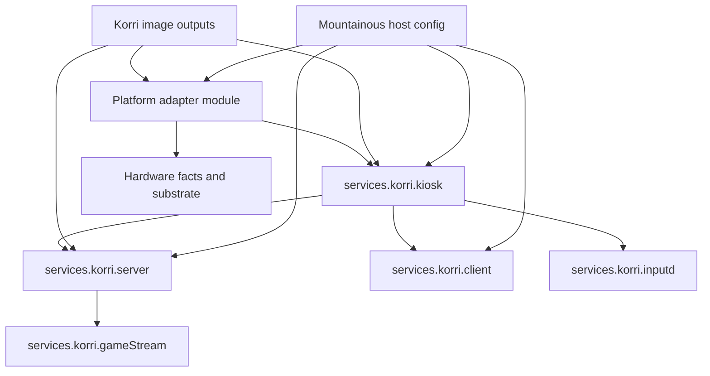

# Refactor Korri Kiosk Modules and Images

## Summary

This plan makes `services.korri.server`, `services.korri.client`, and `services.korri.kiosk` the product-facing Korri roles, then uses those roles to produce Korri-owned image outputs. Phase 1 extracts the current Sobo-backed appliance behavior into Korri modules without moving Snapdragon/RockNix hardware quirks into Korri; Phase 2 adds image outputs that compose Korri product modules with platform adapters.

---

## Problem Frame

Korri currently has pieces of the target architecture: `services.korri.server` is a real NixOS module, `services.korri.client` installs the desktop package, `services.korri.inputd` runs the product input bridge, and `services.korri.gameStream` wires the generic stream runner. The actual appliance kiosk behavior for Sobo is still spread across the RockNix guest profile and Mountainous host composition, so the product boundary is unclear: hardware/platform modules and personal deployment config currently carry product session responsibilities that should belong to Korri.

The desired end state is that Korri owns the product deliverables — headless server and full appliance kiosk — while Snapdragon/RockNix repositories own hardware/platform enablement and Mountainous only composes those modules for personal machines.

---

## Requirements

- R1. Korri exposes the product-facing NixOS module roles `services.korri.server`, `services.korri.client`, and `services.korri.kiosk`.
- R2. `services.korri.server` remains usable as a headless/control-plane role without a GUI.
- R3. `services.korri.client` remains usable as the Korri GUI app role without implying kiosk/session ownership.
- R4. `services.korri.kiosk` owns the product appliance session: compositor/session orchestration, Korri client autostart, and client/server/input lifecycle coordination.
- R5. `inputd` and InputPlumber integration are treated as product-critical for appliance kiosk behavior across processors.
- R6. Korri owns generic input lifecycle/contract integration, while platform adapters own device-specific InputPlumber maps, event names, uinput/container quirks, and hardware commands.
- R7. Snapdragon/RockNix details — display transforms, touchscreen calibration, SM8550/AYN input maps, audio UCM, nspawn/rootfs substrate, and boot/flashing quirks — remain outside core Korri product modules.
- R8. Phase 1 provides Sobo parity at the Korri module boundary while moving product-owned kiosk responsibilities into Korri modules; live Mountainous/RockNix cutover is a coordinated follow-up unless explicitly included in the implementation session.
- R9. Phase 2 adds Korri-owned image outputs for baseline headless and kiosk products by composing platform adapters instead of embedding hardware facts in Korri.
- R10. Korri provides and documents the module surface that lets Mountainous become composition-only for this concern: Mountainous imports the Odin hardware quirks module and Korri modules, then supplies personal deployment settings such as secrets, builders, and package inputs.

---

## Scope Boundaries

- Do not move Snapdragon/RockNix low-level enablement into Korri product modules.
- Do not replace Sway with another compositor as part of this plan.
- Do not redesign Korri's app UX, spatial navigation model, or game-launcher flows except where module boundaries require configuration seams.
- Do not make Mountainous the permanent source of truth for Korri kiosk behavior.
- Do not hard-code local builder hosts, personal Tailscale names, or Simon-specific secrets into Korri.
- Do not remove lower-level `services.korri.inputd` or `services.korri.gameStream`; they remain reusable implementation surfaces beneath the product roles.

### Deferred to Follow-Up Work

- Robust OTA/update/rollback UX for flashable images: Phase 2 should produce buildable/installable artifacts and document manual install expectations; sophisticated update management is separate work.
- Real AYN/RockNix adapter implementation and fixed external-platform image outputs: add after the adapter seam is proven and the platform input can be consumed without dependency cycles.
- Replacing or abstracting away Sway: keep the first kiosk module Sway-based and revisit compositor abstraction only if another target requires it.
- Capturing a new `docs/solutions/` learning for Korri-owned image output patterns: do after implementation proves the pattern.

---

## Context & Research

### Relevant Code and Patterns

- `flake.nix` exposes current packages, apps, `nixosModules.korri-client`, `korri-inputd`, `korri-game-stream`, `korri-headless-source`, `korri-server`, and aggregate `korri`.
- `nix/modules/korri-server.nix` is the strongest existing module pattern: explicit service mode, derived runtime paths, assertions, warnings, firewall scoping, and real NixOS eval tests.
- `nix/modules/korri-client.nix` currently only installs the desktop package. It is the right place for client package/runtime contract, but not kiosk/session lifecycle.
- `nix/modules/korri-inputd.nix` already exposes generic integration hooks: extra environment, PATH packages, and systemd ordering options.
- `nix/modules/korri-game-stream.nix` owns generic Sunshine runner/uinput/display-compat wiring and is already pulled in by `services.korri.server.streamHost.enable`.
- `nix/korri-desktop/wrap.nix` and `nix/korri-desktop/unwrapped.nix` implement the desktop wrapping split that kiosk/client modules should consume rather than duplicate.
- `tools/testing/nix/korri-server-module-eval.fixture.nix` and `tools/testing/nix/korri-server-module-eval.test.ts` are the model for real NixOS module eval tests.
- `tools/testing/nix/korri-desktop-build-graph.fixture.nix` and `tools/testing/nix/korri-desktop-build-graph.test.ts` are the model for package/build graph assertions.
- `tools/device/sessiond.ts`, `tools/device/sessiond-sway.ts`, `tools/device/sessiond-electrobun.ts`, and related tests document the existing runtime session invariants that the kiosk module must not fight.
- `docs/device-flake-run.md` currently reflects an older boundary where durable device services/images lived outside Korri; this plan intentionally supersedes that boundary for Korri product modules and product image deliverables.

### Institutional Learnings

- `docs/solutions/architecture-patterns/boot-scoped-control-plane-with-session-scoped-runner-2026-05-19.md`: keep lifecycle scope explicit, derive paths/ownership/env from it, and verify generated systemd/tmpfiles shape with real Nix eval tests.
- `docs/solutions/integration-issues/odin-electrobun-webkit-runtime-white-screen-2026-05-04.md`: desktop success depends on a coherent native runtime closure; modules should consume wrapped Korri desktop packages rather than reconstruct runtime library assumptions.
- `docs/solutions/integration-issues/supervise-chromium-kiosk-session-after-game-exit-2026-05-04.md`: kiosk behavior is a session invariant, not a launch flag; the product should own restore/focus/fullscreen expectations while platforms provide substrate hooks.
- `docs/solutions/best-practices/decoupled-spatial-navigation-2026-05-01.md`: input should flow into semantic actions; hardware-specific event codes and maps must not leak into product UI contracts.
- `docs/solutions/best-practices/proseql-canonical-library-with-derived-yaml-ids-2026-05-06.md`: external platform data is a source/adapter, not durable product identity; apply the same boundary to image/platform composition.

### External References

- External research skipped. The relevant work is dominated by local Nix module boundaries, existing Korri package/module patterns, and repo-specific RockNix integration constraints.

---

## Key Technical Decisions

- Keep `server`, `client`, and `kiosk` as the public product nouns: this matches the user's preferred naming and avoids over-branding or leaking implementation details into the top-level role names.
- Treat `inputd` and `gameStream` as lower-level Korri modules used by product roles, not replacement product roles: this preserves existing surfaces while giving users simpler entry points.
- Define `kiosk` as the product session owner, not the client installer: the stable public contract should expose product-level choices such as selected client package, kiosk user/session lifecycle, local-vs-remote server posture, input provider declaration, session extension points, and state roots; raw Sway/systemd/input knobs should be advanced extension points.
- Keep `client` package/runtime-only: autostart, compositor, fullscreen/session repair, and appliance behavior belong to `kiosk`.
- Add `kiosk` as a Sway-based module first: current Sobo and x86 targets are Sway-shaped, and compositor generalization would add carrying cost before another compositor is required. Keep Sway-specific options nested so the top-level `kiosk` noun can survive a future compositor backend if one becomes necessary.
- Keep local server behavior explicit: the kiosk module should be able to coordinate a colocated `services.korri.server`, but image/profile composition decides whether local server is enabled by default. Full-appliance images default local server on with loopback/conservative firewall posture; Sobo-style remote-client compositions opt out without forking the kiosk module.
- Use adapter/import hooks for hardware facts: platform repositories provide device modules, maps, and image substrate; Korri product modules expose seams and assertions but do not import AYN/SM8550 facts directly.
- Make Phase 1 parity-first: use Sobo as the proving composition, but keep Sobo-specific values out of Korri by injecting them through module options or downstream platform modules.
- Make Phase 2 composition-first for image outputs: expose reusable NixOS system/image composition helpers and baseline configurations before polished flash tooling, because the project has no existing Korri-owned image-output pattern. Concrete package outputs should be thin aliases only to build artifacts that are proven for that target; do not commit the public contract to a full flashing/update story or image-builder dependency before the primitive is validated.

---

## Open Questions

### Resolved During Planning

- Should `services.korri.client` autostart Korri? No. It installs/configures the client role; `services.korri.kiosk` owns autostart and session policy.
- Should Korri own InputPlumber end-to-end? No. Korri owns the generic appliance input contract and ordering; platform modules own device-specific maps and quirks.
- Should Phase 1 include image outputs? No. Phase 1 should preserve Sobo behavior through module extraction; image outputs are Phase 2.
- Should Korri image outputs embed Snapdragon facts? No. They compose platform adapters and keep hardware facts outside Korri product modules.

### Deferred to Implementation

- Exact option names under `services.korri.kiosk.*`: finalize while implementing the module, but preserve the public `server/client/kiosk` nouns and the boundaries in this plan.
- Exact location of the generic InputPlumber extension seam: choose the smallest Nix option surface that lets platform modules supply service ordering, package/data paths, and health/assertion signals without hard-coding device maps in Korri.
- Exact Phase 2 package attribute names: choose stable flake attribute names during implementation, but preserve the plan-level shape of reusable NixOS composition helpers first, with thin package aliases only for selected build artifacts once the artifact primitive is proven.
- Exact Sobo downstream diff: identify the minimal Mountainous/nix-on-rocks edits during Phase 1 cutover after the Korri module eval tests pass.

---

## Output Structure

    nix/modules/korri-kiosk.nix
    nix/images/common.nix
    nix/images/headless.nix
    nix/images/kiosk.nix
    nix/images/platforms/x86.nix
    tools/testing/nix/korri-kiosk-module-eval.fixture.nix
    tools/testing/nix/korri-kiosk-module-eval.test.ts
    tools/testing/nix/korri-image-outputs-eval.fixture.nix
    tools/testing/nix/korri-image-outputs-eval.test.ts

The tree is directional. The implementing agent may adjust names or grouping if the existing Nix flake shape suggests a cleaner layout, but should preserve the same module/image/test responsibilities. A real RockNix/AYN adapter implementation is intentionally not listed here; it belongs in the platform repository. Korri may add only a composition seam or eval fixture that consumes externally supplied platform modules.

---

## High-Level Technical Design

> *This illustrates the intended approach and is directional guidance for review, not implementation specification. The implementing agent should treat it as context, not code to reproduce.*

The key invariant is one-way composition: Korri product modules expose product roles and adapter seams; platform modules feed in hardware/substrate facts; downstream deployments compose both. Korri product modules should not import device modules or know target-specific display/audio/input constants.

### Dependency Direction Rules

| Layer | May depend on | Must not depend on |
|-------|---------------|--------------------|
| Generic Korri modules (`nix/modules/*`) | Korri packages and lower-level Korri modules | Platform repos, AYN/SM8550 facts, personal deployment config |
| Platform adapter modules | Korri options, hardware packages/maps, substrate services | Mountainous secrets/builders/personal host state |
| Korri image outputs | Korri product modules and explicitly supplied platform adapters | Hard-coded personal deployment config or hidden platform imports in generic modules |
| Mountainous deployments | Korri modules, platform modules, personal secrets/builders | Product kiosk behavior definitions |

---

## Phased Delivery

### Phase 1 — Sobo-backed module extraction

Move product-owned client/server/kiosk/input coordination into Korri modules and prove the resulting composition can preserve the current Sobo behavior. Split the phase into two explicit gates:

- **Phase 1A — Korri module-boundary parity:** land Korri modules, eval fixtures, and docs that prove Sobo-shaped composition without embedding RockNix/Odin facts in generic Korri modules.
- **Phase 1B — live Sobo cutover:** adopt the Korri kiosk module in Mountainous/RockNix composition, disable the old product session/autostart ownership, and smoke-test the device. Phase 1A can land independently, but deployed Sobo parity is not complete until Phase 1B passes.

The primary code lives in Korri, but Phase 1B is intentionally a coordinated downstream migration step.

### Phase 2 — Korri-owned product images

Add Korri image outputs for the headless server and appliance kiosk products. The first fixed outputs should be x86 headless and x86 kiosk; AYN/RockNix kiosk support should enter through an explicit platform-adapter composition seam, becoming fixed Korri outputs only if the adapter can be consumed without a flake dependency cycle.

---

## Implementation Units

### U1. Formalize product module map and aggregate exports

**Goal:** Establish the public Korri module surface around `server`, `client`, and the new `kiosk` role while preserving existing lower-level modules.

**Requirements:** R1, R2, R3, R4

**Dependencies:** None

**Files:**
- Modify: `flake.nix`
- Modify: `nix/modules/korri-client.nix`
- Create: `nix/modules/korri-kiosk.nix`
- Test: `tools/testing/nix/korri-kiosk-module-eval.fixture.nix`
- Test: `tools/testing/nix/korri-kiosk-module-eval.test.ts`

**Approach:**
- Add `nixosModules.korri-kiosk` and include it in the aggregate `nixosModules.korri` export.
- Keep `korri-client`, `korri-inputd`, `korri-game-stream`, and `korri-server` individually importable.
- Treat `headlessSource` as legacy/superseded by `server` in documentation or warnings, without removing it in this plan.
- Keep `client` focused on package/runtime app selection and shared client defaults; do not add session/autostart behavior there.

**Patterns to follow:**
- `nix/modules/korri-server.nix` for explicit options and eval-time safeguards.
- `tools/testing/nix/korri-server-module-eval.test.ts` for fixture-driven NixOS module assertions.

**Test scenarios:**
- Integration: importing aggregate `nixosModules.korri` exposes `services.korri.server`, `services.korri.client`, `services.korri.inputd`, and `services.korri.kiosk` without requiring downstream consumers to import each module manually.
- Happy path: enabling only `services.korri.client` installs the selected desktop package and does not emit a kiosk/session service.
- Edge case: enabling `services.korri.kiosk` without explicitly enabling `services.korri.client` uses safe `mkDefault`-style client enablement rather than requiring duplicate boilerplate.
- Error path: unsupported systems still produce actionable evaluation errors through the relevant package defaults rather than obscure missing attribute failures.

**Verification:**
- Nix eval tests prove the aggregate module surface and role separation.
- Existing server module tests still pass without public option regressions.

---

### U2. Define the Sway-based Korri kiosk session module

**Goal:** Make `services.korri.kiosk` own the generic appliance session lifecycle while leaving platform-specific display/input/audio substrate to adapter modules.

**Requirements:** R4, R7, R8

**Dependencies:** U1

**Files:**
- Modify: `nix/modules/korri-kiosk.nix`
- Test: `tools/testing/nix/korri-kiosk-module-eval.fixture.nix`
- Test: `tools/testing/nix/korri-kiosk-module-eval.test.ts`

**Approach:**
- Implement Phase 1 as a system-managed Sway kiosk service because that is the lifecycle shape needed for current Sobo parity; user-service/greetd variants are out of scope until a concrete target requires them.
- Keep the kiosk user configurable. Default toward a non-root configured user for normal NixOS hosts, while allowing a platform adapter to choose `root` for constrained nspawn guests such as current Sobo.
- Let Korri own generic session runtime defaults needed by its product session (`XDG_RUNTIME_DIR`, D-Bus address, HOME/XDG state roots, client autostart, restart policy), while platform modules own device permissions, seat/logind/nspawn constraints, display devices, and any substrate-specific service ordering.
- Launch the selected `services.korri.client.package` as the product client from the kiosk session.
- Expose adapter hooks for compositor/session config, extra PATH packages, extra environment, and platform-provided Sway config fragments.
- Keep hardware facts out of defaults: no AYN names, SM8550 strings, DSI output names, touchscreen calibration, UCM package paths, or nspawn-specific service names in the generic module.
- Do not extract or package `tools/device/sessiond.ts` in Phase 1. Treat Phase 1 kiosk as the NixOS/Sway appliance service and autostart contract needed for parity; a future sessiond-backed supervisor can replace or deepen that runtime once the module boundary is stable.

**Patterns to follow:**
- `nix/modules/korri-server.nix` for lifecycle-mode-driven derived defaults and assertions.
- `tools/device/sessiond-sway.ts` and `tools/device/sessiond-sway.test.ts` for Sway/session invariant expectations.
- `docs/solutions/integration-issues/supervise-chromium-kiosk-session-after-game-exit-2026-05-04.md` for treating kiosk state as an invariant.

**Test scenarios:**
- Happy path: enabling kiosk emits exactly one generic Korri kiosk session service and configures it to launch the selected client package.
- Integration: injected platform Sway config fragments appear in the generated Sway config while generic Korri autostart remains product-owned.
- Edge case: kiosk can be enabled with a custom client package such as a device desktop wrapper without changing generic module defaults.
- Error path: invalid user/session combinations fail or warn at evaluation with a clear Korri-specific message.
- Regression: generated generic kiosk config contains no platform-specific strings such as `SM8550`, `AYN`, `Odin`, `DSI-1`, `DSI-2`, or audio UCM paths by default.

**Verification:**
- Nix eval fixture reads the generated unit/config shape and confirms role separation, package selection, and absence of hardware facts.

---

### U3. Add generic appliance input integration and InputPlumber adapter contract

**Goal:** Treat inputd and normalized input as product-critical while giving platform modules a clean way to provide hardware-specific InputPlumber behavior.

**Requirements:** R5, R6, R7

**Dependencies:** U1, U2

**Files:**
- Modify: `nix/modules/korri-kiosk.nix`
- Modify: `nix/modules/korri-inputd.nix`
- Test: `tools/testing/nix/korri-kiosk-module-eval.fixture.nix`
- Test: `tools/testing/nix/korri-kiosk-module-eval.test.ts`

**Approach:**
- Have kiosk enable/order `services.korri.inputd` by default for appliance mode.
- Reuse the existing `korri-inputd` hooks (`environment`, `path`, `wants`, `after`, `before`) for Phase 1 instead of inventing a full InputPlumber configuration framework.
- Add the minimum provider declaration needed for kiosk input safety: a platform can declare that it supplies normalized input, name the service(s) that must order before the kiosk, and optionally opt out for non-interactive/headless variants.
- Keep `services.korri.inputd.environment` available for platform-specific command paths, but treat free-form environment as an escape hatch rather than the primary long-term adapter API.
- Add an evaluation assertion for kiosk configurations that declare appliance input required but provide neither a platform input provider nor an explicit opt-out. Sobo/full appliance profiles should default input to required; dev, headless, or non-interactive variants must opt out deliberately if they do not provide normalized input.
- Avoid making legacy renderer-facing bridge environment variables part of the new kiosk contract if the desktop input broker plan removes them.

**Patterns to follow:**
- `nix/modules/korri-inputd.nix` existing `environment`, `path`, `wants`, `after`, and `before` options.
- `docs/solutions/best-practices/decoupled-spatial-navigation-2026-05-01.md` for semantic input boundaries.
- `tools/device/inputd.ts` and `tools/device/inputd-actions.ts` for product-owned input bridge behavior.

**Test scenarios:**
- Happy path: enabling kiosk enables inputd and orders it before the kiosk session where required.
- Integration: platform-provided input dependencies are reflected in generated systemd `wants`/`after`/`before` relationships without hard-coding platform service names by default.
- Edge case: a headless server-only configuration does not enable kiosk input services.
- Error path: appliance kiosk with required input but no declared provider or explicit opt-out fails evaluation with a clear Korri-specific assertion.
- Regression: device-specific input maps and event names are not present in generic Korri module defaults.

**Verification:**
- Nix eval tests prove default appliance input wiring, opt-out behavior, and platform extension seams.

---

### U4. Prove Sobo parity and define the downstream cutover

**Goal:** Verify that the new Korri modules can represent the current Sobo appliance behavior when composed with RockNix/Odin platform modules, then make the live cutover criteria explicit.

**Requirements:** R6, R7, R8, R10

**Dependencies:** U1, U2, U3

**Files:**
- Create or modify: `tools/testing/nix/korri-kiosk-module-eval.fixture.nix`
- Modify: `tools/testing/nix/korri-kiosk-module-eval.test.ts`
- Modify: `docs/device-flake-run.md`

**Approach:**
- Add a fixture mode that mimics the Sobo composition at the module boundary: Korri kiosk/client/inputd modules plus injected platform display/input/audio/session fragments.
- Assert the Korri side selects or accepts the device desktop package, emits product-owned autostart, orders inputd, and leaves hardware facts to the injected platform module.
- Document the migration direction for Mountainous: import hardware quirks modules and Korri modules; remove direct product kiosk autostart/service mutations once the new module is available.
- Treat Sobo migration as a deliberate switchover, not a compatibility window: platform substrate services and fragments stay in RockNix/Odin modules, while old product session/autostart ownership is disabled in the same downstream change that enables `services.korri.kiosk`.
- If the implementation session cannot modify Mountainous/RockNix, mark only Phase 1A complete and create an explicit Phase 1B follow-up; do not claim deployed Sobo parity from fixtures alone.
- Document rollback for Phase 1B: use NixOS generation rollback as the primary recovery path, and keep the old RockNix product-session configuration revertable until Korri kiosk passes on-device smoke.

**Patterns to follow:**
- `tools/testing/nix/korri-server-module-eval.fixture.nix` for override-driven eval scenarios.
- `docs/device-flake-run.md` for documenting the revised boundary and superseding older device-flake assumptions.

**Test scenarios:**
- Integration: Sobo-style fixture enables Korri kiosk with a device desktop package and platform Sway config fragment without changing generic Korri defaults.
- Happy path: fixture shows Korri-owned autostart of the selected client and product-owned inputd lifecycle.
- Regression: fixture keeps platform hardware strings in the injected adapter section, not in generic `korri-kiosk.nix` defaults.
- Error path: duplicate ownership of kiosk/client autostart or inputd ordering is detectable via evaluation warnings/assertions where possible, and otherwise covered by the Phase 1B migration checklist.

**Verification:**
- Phase 1A verification: the fixture demonstrates module-level Sobo parity before downstream deployment changes.
- Phase 1B verification: live Sobo cutover confirms exactly one product kiosk/session owner is active, Korri launches through the new module, input works, display/touch/audio remain correct, no failed units appear, and rollback to the previous generation or old product-session config remains available until smoke passes.
- Documentation clearly states which responsibilities move out of Mountainous and which stay in platform repos.

---

### U5. Introduce image composition primitives for product roles

**Goal:** Add reusable Korri image composition helpers that can build headless and kiosk product systems without embedding platform-specific facts.

**Requirements:** R2, R4, R7, R9

**Dependencies:** U1, U2, U3, and Phase 1A verification from U4

**Files:**
- Create: `nix/images/common.nix`
- Create: `nix/images/headless.nix`
- Create: `nix/images/kiosk.nix`
- Create: `tools/testing/nix/korri-image-outputs-eval.fixture.nix`
- Create: `tools/testing/nix/korri-image-outputs-eval.test.ts`
- Modify: `flake.nix`

**Approach:**
- Create shared image composition modules for Korri product defaults, not for hardware/platform specifics.
- Define a headless product composition that enables `services.korri.server` without GUI/client/kiosk services.
- Define a kiosk product composition that enables `services.korri.kiosk`, `services.korri.client`, local `services.korri.server` with loopback/conservative firewall defaults, and appliance input defaults for the baseline full-appliance image role.
- Keep persistent state roots configurable so platform images can mount or bind state appropriately.
- Start with reusable NixOS config/eval compositions. Add package aliases only for concrete artifacts whose builder has been validated for the target; defer polished flashing/update UX.

**Patterns to follow:**
- `nix/modules/korri-server.nix` for conservative networking/firewall defaults.
- Existing flake package/module export style in `flake.nix`.
- `tools/testing/nix/korri-server-module-eval.test.ts` for inspecting evaluated config rather than relying on string checks alone.

**Test scenarios:**
- Happy path: headless image config enables server and does not enable client/kiosk/input appliance services.
- Happy path: kiosk image config enables kiosk/client/input integration plus local server mode without opening LAN firewall by default.
- Edge case: image compositions accept a platform adapter module list without requiring the Korri product module to import target-specific files.
- Regression: common image modules contain no AYN/SM8550/RockNix display/audio/input constants.
- Error path: unsupported system/target combinations fail with actionable image-output messages.

**Verification:**
- Image eval tests prove the product role split and absence of platform-specific facts in common image modules.

---

### U6. Expose baseline image outputs and platform adapter seams

**Goal:** Publish initial Korri-owned x86 image outputs and establish the seam for AYN/RockNix kiosk compositions without implementing platform adapters in Korri.

**Requirements:** R7, R9, R10

**Dependencies:** U5

**Files:**
- Modify: `flake.nix`
- Create: `nix/images/platforms/x86.nix`
- Modify: `tools/testing/nix/korri-image-outputs-eval.fixture.nix`
- Modify: `tools/testing/nix/korri-image-outputs-eval.test.ts`

**Approach:**
- Add named flake outputs for baseline x86 headless and x86 kiosk compositions. Expose direct image/package outputs only for artifacts whose builder has been validated.
- Keep Korri-owned platform files limited to x86 defaults and generic composition helpers. Do not implement RockNix/AYN adapter modules in Korri.
- Add fixed AYN/RockNix outputs only after the platform adapter can be consumed without creating a flake dependency cycle; otherwise expose a `lib` helper or documented composition entry point that an external release flake can call.
- Keep builder selection local to the developer/operator; do not commit machine-specific remote builders.
- Treat exact final package attribute names as implementation-time details, but do not make unproven image package attrs part of the public contract.
- Prefer eval/buildable compositions first; document manual flashing/install expectations for any concrete artifacts rather than implementing a full updater.

**Patterns to follow:**
- `flake.nix` package/app/module export conventions.
- RockNix guest rootfs packaging pattern as an adapter dependency, not as product-module code.

**Test scenarios:**
- Happy path: x86 headless output evaluates with `services.korri.server` enabled and no kiosk service.
- Happy path: x86 kiosk output evaluates with `services.korri.kiosk`, `services.korri.client`, and local `services.korri.server` enabled under conservative network defaults.
- Integration: a synthetic or externally supplied AYN/RockNix composition uses platform adapter modules at the image boundary; real platform adapter implementation is not authored in Korri.
- Regression: RockNix adapter imports never appear in generic Korri modules or x86 outputs; they enter only through an explicit platform-image composition boundary.
- Error path: requesting an external-platform composition without supplying the adapter produces an actionable message instead of a silent partial image.

**Verification:**
- `flake.nix` exposes discoverable product image outputs.
- Image eval tests prove target-specific facts enter only through platform adapter composition.

---

### U7. Document the new ownership boundary and migration path

**Goal:** Make the Korri/server/client/kiosk and platform-adapter ownership model visible to future implementers and downstream repos.

**Requirements:** R1, R6, R7, R8, R9, R10

**Dependencies:** U1, U2, U3, U4, U5, U6

**Files:**
- Modify: `docs/device-flake-run.md`
- Modify: `README.md`
- Modify or create: `docs/deployment/korri-nixos-modules.md`
- Modify or create: `docs/deployment/korri-images.md`

**Approach:**
- Update old documentation that placed durable device services outside Korri, clarifying that Korri now owns product modules and product image deliverables while hardware/platform repos still own substrate.
- Document the three public nouns: `server`, `client`, and `kiosk`.
- Document lower-level modules (`inputd`, `gameStream`, legacy `headlessSource`) as advanced/internal composition surfaces.
- Include a migration note for Mountainous/Sobo: import Odin hardware quirks plus Korri modules; remove hand-owned product kiosk autostart once the new module is adopted.
- Include image output expectations and the explicit non-goal of embedding Snapdragon/RockNix hardware facts in Korri product modules.

**Patterns to follow:**
- Existing concise docs style in `README.md`.
- `docs/device-flake-run.md` for device-oriented operator context.
- `docs/solutions/architecture-patterns/boot-scoped-control-plane-with-session-scoped-runner-2026-05-19.md` for cross-linking the server lifecycle pattern.

**Test scenarios:**
- Test expectation: none -- documentation-only unit. Review should verify docs match the module names, role boundaries, and final flake output names introduced by implementation.

**Verification:**
- Docs give a downstream maintainer enough information to choose server/client/kiosk roles and understand where hardware quirks belong.
- Mountainous/Sobo migration guidance no longer points future work toward hand-editing product kiosk behavior in personal host config.

---

## System-Wide Impact

- **Interaction graph:** `services.korri.kiosk` will compose existing `client`, `server`, `inputd`, and possibly `gameStream` modules; this adds a product-level entry point above existing lower-level surfaces.
- **Error propagation:** Evaluation-time assertions and warnings should catch unsafe lifecycle/path/input ownership combinations before deployment. Kiosk service failures should be visible through generated systemd units without hiding server/inputd failures behind the client process.
- **State lifecycle risks:** Image outputs need explicit product state roots, but this plan only declares/propagates those paths. Partition layout, migration scripts, OTA, rollback, and platform mount policy remain outside scope. Distinguish persistent product state (library/config/server identity), ephemeral runtime state (sockets/intents/status/log streams), and operator/platform secrets.
- **API surface parity:** Existing module outputs remain available; the new `kiosk` role should not break direct users of `server`, `client`, `inputd`, or `gameStream`.
- **Integration coverage:** Nix eval fixtures must cover role composition and platform-adapter boundaries; runtime smoke on Sobo remains necessary before declaring downstream cutover complete.
- **Unchanged invariants:** Korri UI remains device-agnostic and consumes semantic input; hardware-specific input event codes stay outside product UI and generic product modules.

---

## Risks & Dependencies

| Risk | Mitigation |
|------|------------|
| Korri product modules accidentally absorb Snapdragon/RockNix facts | Add eval tests and review checks that generic modules do not contain AYN/SM8550/display/audio/input constants; route those through platform adapters. |
| Kiosk/client/server naming gets muddied by lower-level modules | Keep public docs centered on `server`, `client`, and `kiosk`; label `inputd`, `gameStream`, and `headlessSource` as lower-level or legacy where appropriate. |
| Sobo regresses during cutover | Use a Sobo-style eval fixture before downstream deployment changes and keep Phase 1 parity-first. |
| Image output work expands into full distro/update management | Scope Phase 2 to buildable/installable artifacts, composition helpers, and documentation; defer partitioning policy, OTA, rollback UX, and platform-specific mount layouts. |
| Existing config-cascade or input-broker work changes relevant env surfaces | During implementation, read active plans and current diffs before stabilizing kiosk option names or bridge env contracts. |
| Cross-repo dependencies make implementation hard to land atomically | Land Korri modules/eval fixtures first, then handle Mountainous/RockNix cutover as a small follow-up once the product module surface exists. For Phase 2, avoid adding a mandatory RockNix flake input to generic Korri evaluation if it would create a dependency cycle. |

---

## Documentation / Operational Notes

- Update docs before downstream cutover so future agents know the new ownership boundary.
- Treat `docs/device-flake-run.md` as superseded in the narrow area of Korri product module/image ownership, not as entirely obsolete.
- For Sobo deployment, retain a manual smoke checklist outside this plan's code units: build/eval, boot to kiosk, controller navigation, server connection, launch/return, display orientation, touch mapping, audio, no duplicate kiosk/session owner, no failed units, and rollback path confirmed.
- Builder selection for AYN/aarch64 image builds remains local operator configuration, not committed Korri flake state.

---

## Sources & References

- Related code: `flake.nix`
- Related code: `nix/modules/korri-server.nix`
- Related code: `nix/modules/korri-client.nix`
- Related code: `nix/modules/korri-inputd.nix`
- Related code: `nix/modules/korri-game-stream.nix`
- Related code: `nix/korri-desktop/wrap.nix`
- Related tests: `tools/testing/nix/korri-server-module-eval.test.ts`
- Related tests: `tools/testing/nix/korri-desktop-build-graph.test.ts`
- Related runtime: `tools/device/sessiond.ts`
- Related runtime: `tools/device/sessiond-sway.ts`
- Related docs: `docs/device-flake-run.md`
- Related plan: `docs/plans/2026-05-21-001-feat-korri-config-cascade-plan.md`
- Related plan: `docs/plans/2026-05-21-002-refactor-desktop-input-broker-plan.md`
- Related learning: `docs/solutions/architecture-patterns/boot-scoped-control-plane-with-session-scoped-runner-2026-05-19.md`
- Related learning: `docs/solutions/integration-issues/odin-electrobun-webkit-runtime-white-screen-2026-05-04.md`
- Related learning: `docs/solutions/integration-issues/supervise-chromium-kiosk-session-after-game-exit-2026-05-04.md`
- Related learning: `docs/solutions/best-practices/decoupled-spatial-navigation-2026-05-01.md`
- Related learning: `docs/solutions/best-practices/proseql-canonical-library-with-derived-yaml-ids-2026-05-06.md`
