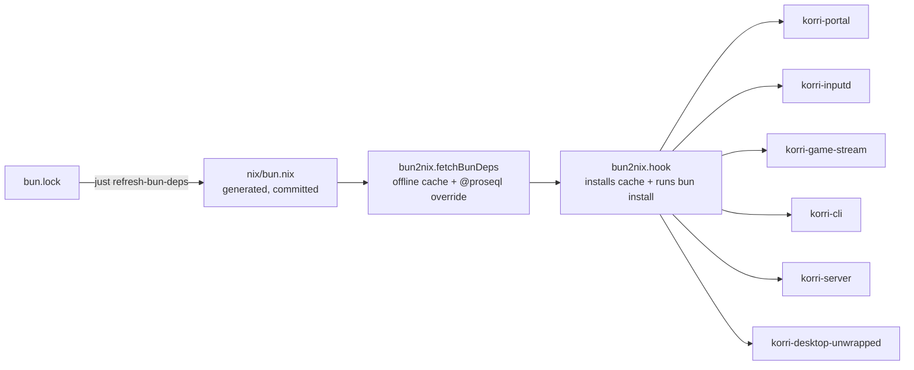

# refactor: Migrate bun packaging from FOD to bun2nix lockfile-derived deps

## Summary

Replace the hand-maintained per-arch `bunDepsHash` fixed-output derivation with `nix-community/bun2nix`, so `bun.lock` becomes the single source of truth for `node_modules` integrity. A committed `nix/bun.nix` (regenerated from `bun.lock` via `just refresh-bun-deps`) feeds `bun2nix.fetchBunDeps` to materialize an offline Bun cache; each of the six bun-consuming derivations switches to `bun2nix.hook`, which runs `bun install --frozen-lockfile --ignore-scripts` against that cache during its own build. The current per-arch `bunDepsHash.{x86_64-linux,aarch64-linux}` entries in `nix/versions.nix` disappear entirely.

---

## Problem Frame

`nix/bun-deps.nix` is a fixed-output derivation (FOD) keyed by a per-system hash in `nix/versions.nix` (`bunDepsHash.x86_64-linux`, `bunDepsHash.aarch64-linux`). Whenever `bun.lock` changes, both hashes must be refreshed by running a build with `lib.fakeHash` and pasting the reported `got:` value back — once per architecture, per the `docs/desktop-nix-runbook.md` runbook step 4–5. In practice the aarch64 hash lags behind the x86 hash because it requires either a remote ARM builder or QEMU emulation, and the lag silently breaks deploys to aarch64 device hosts (notably sobo) when downstream consumers (mountainous) reference the Korri checkout via a flake override. The `mountainous/switch-sobo-overrides.sh` script has accrued a self-healing retry loop as a workaround. The root cause is the per-arch FOD topology itself: `bun install` resolves platform-specific optional native deps (rollup, tailwind oxide, biome) into a per-arch tree, so a single FOD hash cannot cover both archs, and `bun.lock` — which already contains SRI integrity hashes for every resolved tarball — is not being used as the source of truth.

---

## Requirements

- R1. `nix/versions.nix:bunDepsHash` is removed; no manual hash-paste step exists for bun deps in either arch.
- R2. `bun.lock` is the sole source of truth for bun dep integrity; regenerating `nix/bun.nix` is a deterministic function of `bun.lock`.
- R3. All six current consumers (`korri-portal`, `korri-inputd`, `korri-game-stream`, `korri-cli`, `korri-server`, `korri-desktop-unwrapped`) build successfully on `x86_64-linux` and `aarch64-linux` after the migration.
- R4. The existing electrobun staging behavior in `nix/korri-desktop/unwrapped.nix` (binary cli + core copied into `node_modules/electrobun/`) is preserved — lifecycle scripts remain disabled so Electrobun's network postinstall does not run.
- R5. The existing electrobun-pruning behavior in `nix/korri-server.nix` (`installPhase` strips `electrobun` from the server's own `node_modules`, `installCheckPhase` asserts it's gone, no dangling `.bin` symlinks) still passes.
- R6. The existing `@proseql/core` codec import patch (`hjson`, `json5`, `jsonc` codecs rewritten from `import pkg from` to `import * as pkg from`) is applied to the materialized `node_modules` tree.
- R7. A developer-facing regeneration workflow exists (`just refresh-bun-deps`) and the desktop-nix-runbook reflects it.
- R8. Bumping `electrobun` via `tools/scripts/bump-electrobun.sh` no longer requires a manual hash refresh as a separate step.

---

## Scope Boundaries

- The `nix-community/bun2nix` flake input is consumed as a versioned dependency — no in-house lockfile-to-Nix generator is written. The committed `bun.nix` is a generated artifact, regenerated via the upstream CLI.
- Electrobun binary handling (`nix/electrobun-binaries.nix`) is not touched. It already uses per-arch `fetchurl` with pinned hashes, which is the same pattern bun2nix uses for everything else.
- Bun is not replaced or upgraded as runtime / package manager.
- The hoisted-linker posture is preserved (`--linker=hoisted` per `bun2nix.hook` defaults on Linux); isolated installs are not introduced.

### Deferred to Follow-Up Work

- Cleaning up `mountainous/switch-sobo-overrides.sh`'s self-healing retry loop and `nix/versions.nix` hash-bump references in mountainous: separate repo, separate PR.
- Optional CI freshness check that asserts `nix/bun.nix` is in sync with `bun.lock`: not required for correctness (drift surfaces as build failure with a clear message), worth adding later if drift becomes a recurring annoyance.
- Capturing this as an institutional learning under `docs/solutions/`: only on explicit request per the project's documentation policy.

---

## Context & Research

### Relevant Code and Patterns

- `nix/bun-deps.nix` — current FOD derivation. Removed in U4.
- `nix/versions.nix` — current per-arch hash table. `bunDepsHash` block removed in U4; Electrobun cli/core hash tables stay.
- `flake.nix` (`outputs.let` block lines ~167–183) — current `bunDeps = import ./nix/bun-deps.nix {...}` wiring and `packages.<system>.bun-deps` output. Rewired in U2 / removed in U4.
- `nix/korri-portal.nix`, `nix/korri-inputd.nix`, `nix/korri-game-stream.nix`, `nix/korri-cli.nix`, `nix/korri-server.nix`, `nix/korri-desktop/unwrapped.nix` — the six consumers, all sharing the same 4-line `rm -rf node_modules; mkdir; cp -R ${bunDeps}; chmod -R u+w` pattern. Each replaced in U3.
- `nix/korri-desktop/unwrapped.nix` (the `for codec in hjson json5 jsonc` block) — current inline `@proseql/core` codec patch. Migrated to a `fetchBunDeps` override in U2 and removed from the consumer in U3.
- `nix/korri-server.nix` (`installPhase` / `installCheckPhase` electrobun pruning) — independent of `bunDeps` topology, left untouched. The hook still produces a regular `node_modules` tree that the existing `rm -rf` operates on.
- `nix/electrobun-binaries.nix` — pattern reference. Already uses lockfile-style per-platform `fetchurl` + manual SHA pins. Conceptually adjacent to what bun2nix does, but for upstream tarballs rather than registry deps.
- `docs/desktop-nix-runbook.md` — current runbook with manual hash-paste steps 4–5. Rewritten in U5.
- `tools/scripts/bump-electrobun.sh` — current bumper that delegates the bun-deps hash refresh to a manual runbook step. Updated in U5.
- `docs/plans/2026-04-30-006-feat-electrobun-nix-native-build-plan.md` — origin plan that introduced the FOD pattern; this plan supersedes that decision now that operational pain has surfaced.

### Institutional Learnings

No existing `docs/solutions/` entries cover this surface. The migration itself is a candidate for a future learning doc, but writing one is deferred per project doc policy.

### External References

- `nix-community/bun2nix` v2.1.0 — <https://github.com/nix-community/bun2nix>. Documentation site: <https://nix-community.github.io/bun2nix/>.
- `bun2nix.hook` (the setup hook plugged into `stdenv.mkDerivation`'s `nativeBuildInputs`): <https://nix-community.github.io/bun2nix/building-packages/hook.html>.
- `bun2nix.fetchBunDeps` (cache builder + overrides API): <https://nix-community.github.io/bun2nix/building-packages/fetchBunDeps.html>.
- Nicolas Mattia, "Lockfile trick: Package an npm project with Nix in 20 lines" — <https://nmattia.com/posts/2022-12-18-lockfile-trick-package-npm-project-with-nix>. Underlying technique: each lockfile entry already has a URL and integrity hash; use them as `fetchurl` arguments.
- Upstream nixpkgs `buildBunPackage` request, NixOS/nixpkgs#255890 — open; no first-party Bun builder exists today. Community consensus has consolidated on `bun2nix`.

---

## Key Technical Decisions

- **Adopt `bun2nix` rather than rolling our own lockfile-to-Nix generator.** The format-stability and edge-case work (Bun's wyhash-based cache layout, the Zig cache-entry-creator binary, catalog protocol handling, workspace resolution, lifecycle script seam) is already done and maintained. Forking later if upstream stalls is straightforward — the meat of the technique is "lockfile entries become `fetchurl` calls."
- **Per-derivation `bun2nix.hook` (Option Beta) over a shared `node_modules` tree (Option Alpha).** The hook is the idiomatic upstream pattern. It removes the question of whether a pre-built `node_modules` tree is byte-reproducible across machines, and `bun install --frozen-lockfile --ignore-scripts --linker=hoisted` against an offline cache is fast enough that paying it six times is not a meaningful cost. The shared-cache derivation (`fetchBunDeps` output) is itself referenced once and content-addressed by the lockfile, so the actual tarball fetches happen once.
- **Lifecycle scripts stay off.** Pass `dontRunLifecycleScripts = true` to every consumer. Electrobun's postinstall would attempt a network fetch; we already stage cli + core binaries from `nix/electrobun-binaries.nix`. Other deps (rollup, tailwind oxide, biome) ship native binaries via `optionalDependencies` that Bun resolves by platform without a lifecycle script. The current `--ignore-scripts` posture in `nix/bun-deps.nix` is preserved exactly.
- **The `@proseql/core` codec patch moves from inline `sed` in `nix/korri-desktop/unwrapped.nix` into a `fetchBunDeps` override.** The override applies once at cache time rather than once per consumer. The current sed lives in only one consumer (the desktop unwrapped derivation), but the patched files are present in every consumer's `node_modules`; centralizing the patch keeps the patched form consistent and removes a piece of source-of-truth ambiguity.
- **Commit the generated `nix/bun.nix`.** Same posture as `Cargo.lock` + an autogenerated `Cargo.nix`: humans don't hand-edit it, the regen workflow is explicit (`just refresh-bun-deps`), and PR diffs make registry changes visible.
- **Pin `bun2nix` to a tagged release and add the `nix-community.cachix.org` substitutor.** Pin `bun2nix.url = "github:nix-community/bun2nix?ref=2.1.0"` (matches the upstream template). Add the cache to avoid building bun2nix's Rust + Zig components from source on every fresh checkout.
- **`bun2nix` is consumed via its flake overlay**, not by hand-importing the package. Matches the upstream template and gives downstream Korri consumers a stable accessor.

---

## Open Questions

### Resolved During Planning

- *Per-derivation hook vs. shared node_modules derivation?* → Per-derivation hook (see Key Technical Decisions).
- *Where does the `@proseql/core` patch live?* → `fetchBunDeps` override, applied once at cache time.
- *How are platform-specific native deps handled?* → They're handled by `bun install`'s built-in OS/arch filter at install time; both archs use the same `bun.nix` because `bun.lock` lists every platform's tarball and `bun install` selects the matching one.
- *Cache for `bun2nix`?* → Add `nix-community.cachix.org` as a substitutor in `flake.nix`'s `nixConfig`.

### Deferred to Implementation

- *Exact `bunInstallFlags` override, if any.* The hook defaults to `--linker=isolated` on Linux; the Korri build expects hoisted layout (current FOD uses Bun's default hoisted). Confirm during U3 whether the default works for the existing `bun build` / `vite build` invocations or whether `bunInstallFlags = ["--linker=hoisted"]` is needed. The Bun docs section linked in the hook reference indicates hoisted is the safer choice for tooling that expects classic node_modules layout.
- *Whether the test fixture `tools/testing/nix/korri-desktop-build-graph.fixture.nix` references `bunDeps` shape in a way that breaks.* Inspect during U3; adjust the fixture if needed.

---

## High-Level Technical Design

> *This illustrates the intended approach and is directional guidance for review, not implementation specification. The implementing agent should treat it as context, not code to reproduce.*

Dependency flow after the migration:



Per-consumer derivation shape (sketch — not the literal code to write):

```nix
# Before
stdenv.mkDerivation {
  # ...
  buildPhase = ''
    rm -rf node_modules
    mkdir -p node_modules
    cp -R ${bunDeps}/. node_modules/
    chmod -R u+w node_modules
    # consumer-specific work
  '';
}

# After
stdenv.mkDerivation {
  # ...
  nativeBuildInputs = [ bun2nix.hook /* + existing inputs */ ];
  bunDeps = bunCache;
  dontRunLifecycleScripts = true;
  buildPhase = ''
    # consumer-specific work (node_modules already installed by hook)
  '';
}
```

---

## Implementation Units

### U1. Add `bun2nix` as a flake input and configure substituters

**Goal:** Make `bun2nix` accessible from `flake.nix` and ensure its prebuilt CLI is fetched from the community cache rather than rebuilt locally.

**Requirements:** R2

**Dependencies:** None

**Files:**
- Modify: `flake.nix`

**Approach:**
- Add `bun2nix.url = "github:nix-community/bun2nix?ref=2.1.0"` plus `bun2nix.inputs.nixpkgs.follows = "nixpkgs"` to the `inputs` block. Pin to a tag, not a branch.
- Add `nix-community.cachix.org` and the matching `nix-community.cachix.org-1:...` public key to `nixConfig.extra-substituters` / `extra-trusted-public-keys`. If the project already has a `nixConfig` block, extend it; otherwise add one.
- Apply the bun2nix overlay to both the `pkgs` and `pkgs2405` imports so `pkgs.bun2nix` and its passthru attributes (`pkgs.bun2nix.hook`, `pkgs.bun2nix.fetchBunDeps`) are available throughout the existing `let` block. Mirror the layout in the upstream template (`templates/default/flake.nix` on the bun2nix repo).
- Add `bun2nix` to `commonPackages` so the CLI lands in `nix develop` shells — that's how `just refresh-bun-deps` (U5) reaches it.

**Patterns to follow:**
- The upstream `nix-community/bun2nix/templates/default/flake.nix` example for input pinning, overlay application, and `nixConfig` substituters.
- Existing `inputs` block in `flake.nix` for `nixpkgs.follows` style.

**Test scenarios:**
- Happy path: `nix flake metadata` resolves the new input cleanly.
- Happy path: `nix develop -c bun2nix --help` runs the CLI inside the dev shell.
- Edge case: `nix flake check --no-build` does not report new errors introduced by the input addition.

**Verification:**
- `nix flake check --no-build` passes on `x86_64-linux`.
- `nix develop -c bun2nix --version` reports a 2.x version.

---

### U2. Generate `nix/bun.nix` and create the `bunCache` derivation with the `@proseql/core` override

**Goal:** Produce the committed, lockfile-derived `nix/bun.nix` and wire up the shared offline bun cache that all consumers will reference, with the `@proseql/core` codec patch baked into the cache.

**Requirements:** R2, R6

**Dependencies:** U1

**Files:**
- Create: `nix/bun.nix` (generated; committed)
- Modify: `flake.nix`

**Approach:**
- In the dev shell (post-U1), run `bun x bun2nix -o nix/bun.nix` (or `bun2nix -o nix/bun.nix`). Commit the result as a generated artifact.
- In `flake.nix`'s `let` block, replace the current `bunDeps = import ./nix/bun-deps.nix {...}` line with a new `bunCache = pkgs.bun2nix.fetchBunDeps { bunNix = ./nix/bun.nix; overrides = {...}; }`. The override block patches `@proseql/core@<version>` by copying it to a writable location and running the existing `sed` over `dist/serializers/codecs/{hjson,json5,jsonc}.js`. The exact version key matches what `bun.nix` emits (likely `"@proseql/core@0.11.0"` based on current `bun.lock`).
- Keep the variable name `bunDeps` in `flake.nix` as an alias to `bunCache` so U3's per-consumer changes stay surgical — or rename to `bunCache` and update the six call sites in U3. Pick one and apply consistently. (Recommendation: rename to `bunCache`; the new noun reflects the new shape — a Bun-format cache rather than a node_modules tree.)
- Remove the `packages.<system>.bun-deps` flake output. It existed to support the manual `nix build .#bun-deps --no-link` hash-paste workflow, which is gone after this migration. The output is referenced only by `docs/desktop-nix-runbook.md` step 5 today, which is rewritten in U5. No external consumer references it (confirmed via grep of the Korri repo).

**Patterns to follow:**
- `nix-community/bun2nix` docs for `fetchBunDeps` override shape: `overrides = { "<pkg>@<version>" = pkg: runCommandLocal "patched-name" {} ''...''; };`.
- The existing `for codec in hjson json5 jsonc` sed loop in `nix/korri-desktop/unwrapped.nix` (current) — that's the body to lift into the override.

**Test scenarios:**
- Happy path: `nix build .#bun-cache --no-link` (or whichever name lands on the flake output) succeeds on `x86_64-linux` and `aarch64-linux`.
- Integration: The override actually applies — after building `bunCache`, the patched files in the `@proseql/core` tarball show `import * as pkg from` rather than `import pkg from`. Verify by inspecting the cache contents under `result/share/bun-cache/`.
- Edge case: Re-running `bun x bun2nix -o nix/bun.nix` against an unchanged `bun.lock` produces a byte-identical `nix/bun.nix` (deterministic regeneration).
- Edge case: `nix/bun.nix` round-trips through `git diff` cleanly — no nondeterministic ordering, no host-specific paths.

**Verification:**
- `nix/bun.nix` is committed and references real registry URLs with `sha512-...` hashes for every package in `bun.lock`.
- `nix build .#bunCache --no-link` (name as exposed) succeeds on both archs.
- The patched `@proseql/core` codec files appear in the cache output with the rewritten import form.

---

### U3. Convert the six bun-consuming derivations to `bun2nix.hook`

**Goal:** Replace the manual `rm -rf node_modules; cp -R ${bunDeps}` block in each consumer with the `bun2nix.hook` lifecycle. Remove the inline `@proseql/core` sed from `nix/korri-desktop/unwrapped.nix` since it now lives in the cache.

**Requirements:** R3, R4, R5, R6

**Dependencies:** U2

**Files:**
- Modify: `nix/korri-portal.nix`
- Modify: `nix/korri-inputd.nix`
- Modify: `nix/korri-game-stream.nix`
- Modify: `nix/korri-cli.nix`
- Modify: `nix/korri-server.nix`
- Modify: `nix/korri-desktop/unwrapped.nix`
- Modify: `flake.nix` (to pass `bunCache` and remove the now-unused `bunDeps` import argument from the six `import ./nix/korri-*.nix { ... }` call sites if the rename was applied in U2)

**Approach:**
- For each consumer:
  - Add `bun2nix.hook` to `nativeBuildInputs`.
  - Add a top-level `bunDeps = bunCache;` attribute (the hook's required arg, even though we kept the name `bunCache` for the cache itself in U2 — the hook attribute is named `bunDeps` upstream).
  - Add `dontRunLifecycleScripts = true;`.
  - Remove the 4-line block: `rm -rf node_modules; mkdir -p node_modules; cp -R ${bunDeps}/. node_modules/; chmod -R u+w node_modules`.
  - Keep all other build/install phase logic identical.
- For `nix/korri-desktop/unwrapped.nix` specifically: also remove the `for codec in hjson json5 jsonc` sed loop (now in the cache override from U2). The electrobun cli + core staging block (the `mkdir -p node_modules/electrobun/bin; cp ${electrobunBinaries.cli}/...` portion) stays unchanged — it operates on the post-install `node_modules` and is orthogonal to where the deps came from.
- For `nix/korri-server.nix`: the `installPhase` electrobun-pruning and `installCheckPhase` dangling-symlink check stay unchanged — they operate on the server's own `node_modules` after build.
- During implementation, confirm whether the hook's default `bunInstallFlags` works or whether `bunInstallFlags = [ "--linker=hoisted" ]` is needed for the existing `bun build` / `vite build` invocations. The current FOD produces a hoisted layout; if the hook defaults to isolated on Linux (per upstream docs, `--linker=isolated` is the default on non-Darwin), set the flag explicitly.
- Sanity-check `tools/testing/nix/korri-desktop-build-graph.fixture.nix` and `.test.ts` — if they assert anything about `bunDeps` shape that changes, update the assertions.

**Patterns to follow:**
- `bun2nix.hook` documented usage shape: `nativeBuildInputs = [ bun2nix.hook ]; bunDeps = bun2nix.fetchBunDeps {...}; buildPhase = ''...'';`.
- Existing consumer shape (the six current `.nix` files) for everything outside the deps section — preserve their build/install phases verbatim.

**Test scenarios:**
- Happy path (per consumer): `nix build .#korri-portal --no-link`, `nix build .#korri-inputd --no-link`, `nix build .#korri-game-stream --no-link`, `nix build .#korri-cli --no-link`, `nix build .#korri-server --no-link`, `nix build .#korri-desktop-unwrapped --no-link` all succeed on `x86_64-linux`.
- Happy path (aarch64): the same six builds succeed on `aarch64-linux` (via emulation or remote builder).
- Integration: `nix build .#korri-server` produces an output whose `share/korri-server/node_modules/` contains no `electrobun/` directory and no dangling `.bin` symlinks (the existing `installCheckPhase` enforces this).
- Integration: `nix build .#korri-desktop-unwrapped` produces an output where `node_modules/@proseql/core/dist/serializers/codecs/hjson.js` has been patched to `import * as pkg from` (verifiable via grep of the build's `node_modules` snapshot before `electrobun build` runs, or by inspecting the resulting bundled `Resources/app/bun/index.js`).
- Edge case: `bun install --frozen-lockfile --ignore-scripts` inside the sandbox makes zero network calls (the cache is the only source). Confirmed by the existing Nix sandbox (no network access by default) — a network attempt would fail the build.
- Integration: `nix build .#korri-desktop` (the wrapped variant, depending transitively on `korri-desktop-unwrapped`) still succeeds and emits the expected `Resources/app/bun/index.js`, `Resources/version.json`, `Resources/build.json`, `Resources/app/views/mainview/preload.js` (the postcondition asserts in `unwrapped.nix` are unchanged).

**Verification:**
- All six consumer derivations build on both archs.
- `nix build .#korri-desktop --no-link` and `nix build .#korri-desktop-device --no-link` both succeed.
- Existing `tools/testing/nix/korri-desktop-build-graph.test.ts` passes (run via `just test-unit`).

---

### U4. Remove the legacy FOD plumbing

**Goal:** Delete `nix/bun-deps.nix` and the `bunDepsHash` block in `nix/versions.nix`; remove the `bunDeps = import ./nix/bun-deps.nix {...}` wiring and the `packages.bun-deps` flake output if it wasn't already cleaned up in U2.

**Requirements:** R1

**Dependencies:** U3

**Files:**
- Delete: `nix/bun-deps.nix`
- Modify: `nix/versions.nix`
- Modify: `flake.nix`

**Approach:**
- Delete `nix/bun-deps.nix`.
- Remove the entire `bunDepsHash = { x86_64-linux = "..."; aarch64-linux = "..."; };` attribute from `nix/versions.nix`. Leave the `electrobun` block (it still pins cli + core hashes via `nix/electrobun-binaries.nix`).
- Remove the `bunDeps = import ./nix/bun-deps.nix {...}` block in `flake.nix` if U2 left it in place as an alias.
- Grep the repo for any remaining `bunDepsHash` or `bun-deps.nix` references and clean them up. (`packages.<system>.bun-deps` was already removed in U2.)

**Test scenarios:**
- Happy path: `nix flake check --no-build` passes.
- Happy path: All six consumer builds still succeed on both archs.
- Edge case: `grep -rn bunDepsHash` and `grep -rn bun-deps.nix` over the repo return only docs-update territory (handled in U5) or zero matches.

**Verification:**
- `nix/bun-deps.nix` does not exist.
- `nix/versions.nix` contains no `bunDepsHash` attribute.
- The full flake still evaluates and builds on both archs.

---

### U5. Add `just refresh-bun-deps` and update docs + bumper

**Goal:** Make `bun.nix` regeneration a first-class developer workflow and remove all references to the manual hash-paste from docs and tooling.

**Requirements:** R7, R8

**Dependencies:** U4

**Files:**
- Modify: `justfile`
- Modify: `docs/desktop-nix-runbook.md`
- Modify: `tools/scripts/bump-electrobun.sh`

**Approach:**
- Add a `refresh-bun-deps` recipe to `justfile` that runs `bun x bun2nix -o nix/bun.nix` (or `bun2nix -o nix/bun.nix` if the dev shell exposes it directly). Document it in the recipe's comment so `just --list` shows the intent.
- Rewrite `docs/desktop-nix-runbook.md` "Electrobun version bumps" section: keep step 1 ("Update `electrobun` in `package.json` and refresh `bun.lock`"), keep step 2 (`tools/scripts/bump-electrobun.sh <version>`), keep step 3 (paste cli + core hashes), replace steps 4–5 with a single step that says `just refresh-bun-deps` (or fold it into the bumper from the next bullet), keep the final verify step (`nix build .#korri-desktop --no-link`).
- Update `tools/scripts/bump-electrobun.sh` so that after it prints the new cli + core hashes (or after the user pastes them), it calls `just refresh-bun-deps` automatically — or at minimum, prints a clear instruction to run it. The current bumper leaves bun-deps refresh as an out-of-band manual step (`docs/desktop-nix-runbook.md` steps 4–5); collapse that into one workflow.

**Patterns to follow:**
- Existing `justfile` recipe style (one-line comment above each recipe, `bun x` invocation pattern for tool-prefixed commands).
- Existing `docs/desktop-nix-runbook.md` numbered-step format.

**Test scenarios:**
- Happy path: `just refresh-bun-deps` regenerates `nix/bun.nix` and the output is identical to the committed file when `bun.lock` hasn't changed.
- Happy path: After bumping `electrobun` to a new version and running `tools/scripts/bump-electrobun.sh`, the resulting `nix/bun.nix` matches what `bun x bun2nix -o nix/bun.nix` would produce.
- Edge case: Running `just refresh-bun-deps` against a clean checkout (no local mutations) produces no diff in `nix/bun.nix`.

**Verification:**
- `just --list` shows `refresh-bun-deps` with a descriptive one-liner.
- `docs/desktop-nix-runbook.md` contains no mention of `lib.fakeHash`, `bunDepsHash`, or hash-paste workflows.
- `tools/scripts/bump-electrobun.sh` either invokes `just refresh-bun-deps` directly or prints a clear instruction to run it as the final step.

---

## System-Wide Impact

- **Interaction graph:** The migration touches the entire Nix build seam for bun-consuming derivations. Every package that imports `bunDeps` (six derivations + their two desktop wrap variants `korri-desktop` and `korri-desktop-device`) is on the affected path.
- **Error propagation:** Build failures shift category from "hash mismatch on FOD" to "missing entry in `nix/bun.nix`" or "stale `bun.nix` vs. `bun.lock`." The latter is a clearer error than the former because the user sees a `bun install` failure citing the actual missing package rather than a 44-character base64 hash mismatch.
- **State lifecycle risks:** `nix/bun.nix` drift against `bun.lock` is the new failure mode. Mitigated by `just refresh-bun-deps` being a one-shot regen. Optional CI freshness check deferred.
- **API surface parity:** Downstream consumers of the Korri flake (mountainous, future device profiles) reference `inputs.korri.packages.<system>.korri-desktop` (and similar) — those output paths are unchanged. Removing `packages.<system>.bun-deps` is a breaking change for anything that referenced it as a public output; per current grep, only the local runbook does.
- **Integration coverage:** The existing `tools/testing/nix/korri-desktop-build-graph.test.ts` and the CI `desktop-stage2.yml` cross-arch builds remain the integration gate. No new integration scaffolding required.
- **Unchanged invariants:**
  - `nix/electrobun-binaries.nix` cli + core hash pinning is untouched.
  - `nix/korri-server.nix` electrobun-pruning in `installPhase` and `installCheckPhase` remains identical.
  - `nix/korri-desktop/unwrapped.nix` electrobun staging (cli + core into `node_modules/electrobun/`) remains identical.
  - The hoisted node_modules layout is preserved.
  - `--ignore-scripts` posture is preserved.

---

## Risks & Dependencies

| Risk | Mitigation |
|------|------------|
| `bun2nix` 2.1.0 has a latent bug with the specific dep graph in `bun.lock` (e.g., a quirky tarball URL with `@` symbols — there's an open upstream issue #84 about this). | Validate by building all six derivations on x86 immediately after U3; if a specific dep trips the issue, either pin to a newer release with the fix or open a fork-and-patch. |
| The `--linker=isolated` default in `bun2nix.hook` on Linux conflicts with the existing hoisted-layout expectations of `bun build` / `vite build`. | Pass `bunInstallFlags = [ "--linker=hoisted" ]` explicitly in each consumer (U3). The cost is minimal and removes ambiguity. |
| The `@proseql/core` override key in `nix/bun.nix` uses a different format than expected (e.g., `@proseql/core@0.11.0` vs. a Bun-internal cache-name format). | Inspect the generated `nix/bun.nix` after U2 to confirm the exact key. The overrides API documentation says "each override attribute name must be a key that exists in your `bun.nix` file." |
| Upstream `bun2nix` stalls or breaks. | The technique is a thin layer over `fetchurl` + a small cache-layout shim. The lockfile-trick fallback (~20 lines of Nix per Nicolas Mattia) plus a hand-written shim is a viable fork point if needed. Risk is low for now (active project, recent release). |
| QEMU-emulated aarch64 build in CI surfaces a bun2nix-specific issue not present on x86. | The existing CI `build-aarch64` job catches this on PR. If it triggers, run the build under emulation locally to debug. |
| `nix/bun.nix` becomes large (~1500 packages × a `fetchurl` block each = thousands of lines). | Accept it. The file is generated; humans don't read it linearly. PR diffs are still meaningful when individual deps change. |

---

## Documentation / Operational Notes

- `docs/desktop-nix-runbook.md` is rewritten in U5.
- `tools/scripts/bump-electrobun.sh` is updated in U5.
- No `docs/solutions/` entry is created (deferred per project doc policy).
- The mountainous-side `switch-sobo-overrides.sh` self-healing retry loop becomes dead code naturally after this lands — no action required in this plan; a follow-up PR in the mountainous repo can remove it.

---

## Sources & References

- Related code: `nix/bun-deps.nix`, `nix/versions.nix`, `flake.nix`, `nix/korri-portal.nix`, `nix/korri-inputd.nix`, `nix/korri-game-stream.nix`, `nix/korri-cli.nix`, `nix/korri-server.nix`, `nix/korri-desktop/unwrapped.nix`, `nix/electrobun-binaries.nix`, `docs/desktop-nix-runbook.md`, `tools/scripts/bump-electrobun.sh`, `justfile`
- Related prior plan: `docs/plans/2026-04-30-006-feat-electrobun-nix-native-build-plan.md` (introduced the FOD pattern this plan supersedes)
- External: `nix-community/bun2nix` — <https://github.com/nix-community/bun2nix>
- External: `bun2nix` docs — <https://nix-community.github.io/bun2nix/>
- External: NixOS/nixpkgs#255890 — `buildBunModule` upstream request (still open)
- External: Nicolas Mattia, "Lockfile trick" — <https://nmattia.com/posts/2022-12-18-lockfile-trick-package-npm-project-with-nix>
