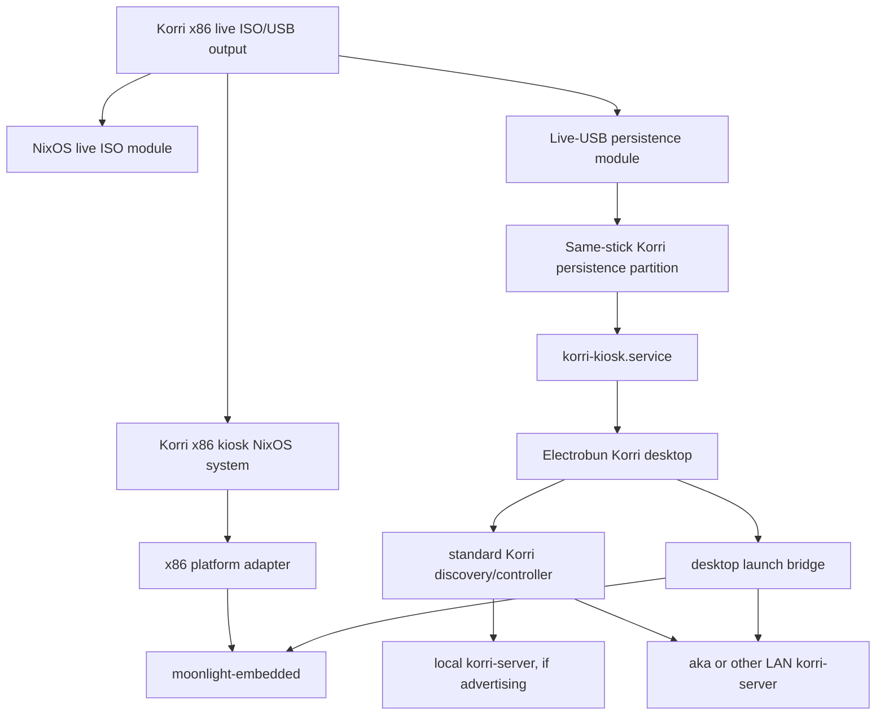

# feat: Add x86 Live USB Korri Kiosk

## Summary

This plan adds a Korri-owned x86 live USB image by extending the existing kiosk NixOS composition with NixOS live ISO machinery, same-stick USB persistence, moonlight-embedded in the appliance closure, and no-internal-disk safety checks. Discovery stays the standard Electrobun/Korri app path; the launch path preserves prepare-before-launch but uses packaged moonlight-embedded instead of Moonlight Qt or runtime `nix run` fallback in the appliance.

---

## Problem Frame

Korri already has a reusable x86 kiosk NixOS system closure, desktop discovery behavior, and remote stream-launch bridge. What is missing is a bootable live USB appliance artifact that can run those pieces on the NUC safely, without an installer or internal-disk mutation. See origin: `docs/brainstorms/2026-05-23-001-x86-live-usb-kiosk-requirements.md`.

---

## Requirements

- R1. Expose a bootable x86_64 live USB/ISO artifact for the Korri kiosk, not just a NixOS toplevel closure. *(origin R1, R2, R5)*
- R2. Preserve the no-installer/no-internal-disk guarantee with explicit image configuration and verification. *(origin R3, AE1)*
- R3. Keep the x86 kiosk NUC-first but generic: no aka special treatment, no NUC-specific product behavior, and no USB-specific server discovery logic. *(origin R4, R8, R9, AE3)*
- R4. Use the same standard Electrobun/Korri app discovery and connection behavior already used by normal desktop clients. Today, when the local server and aka both advertise normally, they should be discoverable by that standard path. *(origin R8, R10, R11)*
- R5. Require Ethernet, keyboard fallback, and an XInput-compatible wired USB controller for v1 acceptance. *(origin R6, R7, AE2)*
- R6. Persist client settings on the USB media, including Korri desktop config and moonlight-embedded client state, without depending on the NUC internal disk. *(origin R16, R17, AE6)*
- R7. Use moonlight-embedded for local stream launch; do not rely on Moonlight Qt or a runtime `nix run` fallback in the appliance path. *(origin R15, R18, AE5)*
- R8. Keep remote launch constrained to known library games prepared by the discovered server before local Moonlight launch. *(origin R12, R14, R15, AE4, AE5)*
- R9. Improve failure reporting enough that boot/input, Ethernet/discovery, server/catalog/prepare, and Moonlight launch failures are distinguishable for the NUC proof. *(origin R18, R19, AE7)*

**Origin actors:** A1 (Player/operator), A2 (x86 live USB kiosk), A3 (Discovered Korri server), A4 (Stream runtime)
**Origin flows:** F1 (Boot into Korri kiosk), F2 (Discover server content), F3 (Launch a remote stream), F4 (Persist client settings)
**Origin acceptance examples:** AE1 (R1, R2, R3, R5), AE2 (R6, R7), AE3 (R8, R9, R10, R11), AE4 (R12, R13), AE5 (R14, R15, R18), AE6 (R16, R17), AE7 (R18, R19)

---

## Scope Boundaries

- No internal-disk installer, repartitioning, bootloader install, or managed install flow.
- No Wi-Fi setup path.
- No Bluetooth controller setup or controller-pairing polish.
- No Moonlight/Sunshine pairing UX; valid pairing is a prerequisite.
- No aka host pinning, preference, naming, address fallback, or special handling.
- No new USB-specific server-discovery behavior; the live kiosk must use the standard Electrobun/Korri discovery and connection path.
- No new multi-server picker or federation UI.
- No local game launch acceptance requirement. A local catalog may exist later, but remote server content is the useful v1 catalog.
- No broad x86 release hardening beyond a NUC-first proof and avoiding obvious generic-UEFI blockers.
- No large redesign of the React home surface, RPC model, or library domain.

In this plan, “local server” means the existing local Korri server if it advertises through the same standard mechanism as any other server. It does not imply a required local NUC game catalog or local game launch acceptance.

### Deferred to Follow-Up Work

- Wi-Fi and Bluetooth setup UX for a fully portable living-room appliance.
- Multi-server picker/federation UI if standard discovery behavior becomes insufficient.
- Local NUC game catalog and local launch support.
- Broader x86 hardware compatibility matrix and release-candidate publishing workflow.
- Human-friendly Moonlight/Sunshine pairing flow.
- Required QEMU boot smoke in CI as a release gate; v1 may include optional/local QEMU smoke, but should not make it a release-candidate pipeline.

---

## Context & Research

### Relevant Code and Patterns

- `nix/images/common.nix` composes Korri product NixOS systems through `mkKioskSystem`; current output is a system closure, not a bootable image.
- `nix/images/kiosk.nix` enables the Korri kiosk product role with client, inputd, and loopback server defaults.
- `nix/images/platforms/x86.nix` provides the existing x86 platform adapter: seatd, input/render/seat/video groups, and normalized input provider declaration.
- `nix/modules/korri-kiosk.nix` owns the Sway kiosk session, client autostart, XDG roots, environment, service ordering, and input-provider assertions.
- `flake.nix` currently exposes `packages.x86_64-linux.korri-kiosk-system`; a live USB plan should add a sibling bootable artifact rather than changing the existing toplevel meaning.
- `korri/deploy/desktop/connection.ts` is the standard Electrobun/Korri discovery/connection controller. It already implements remembered-server preference, first-healthy fallback, and no picker UI.
- `tools/cli/lan-stream-discovery.ts` is the standard mDNS discovery primitive for `_korri-stream._tcp`; it is generic and does not special-case aka.
- `korri/deploy/desktop/launch-bridge.ts` implements the standard prepare-then-local-Moonlight bridge.
- `korri/products/app/stream/moonlight-launcher.ts` currently tries `moonlight`, then falls back to `nix run nixpkgs#moonlight-qt`; the appliance path should disable that fallback and rely on packaged moonlight-embedded.
- `nix/korri-desktop/wrap.nix` currently defaults the desktop wrapper to Moonlight Qt; the live appliance needs an explicit moonlight-embedded command/package policy.
- `nix/images/platforms/rocknix-sm8550.nix` is an example of adding `moonlight-embedded` to a kiosk platform path without moving platform facts into generic Korri modules.
- `tools/testing/nix/korri-image-outputs-eval.test.ts` and fixture are the pattern for asserting image/module composition through real Nix eval.
- `korri/deploy/desktop/connection.test.ts`, `korri/deploy/desktop/launch-bridge.test.ts`, and `tools/cli/moonlight-launcher.test.ts` cover the client-side discovery and stream-launch seams.

### Institutional Learnings

- `docs/solutions/architecture-patterns/boot-scoped-control-plane-with-session-scoped-runner-2026-05-19.md`: lifecycle scope, runtime paths, and eval-time safeguards should be explicit and verified with real Nix eval.
- `docs/solutions/workflow-issues/generic-game-stream-runner-validation-contract-2026-05-19.md`: stream sessions should prepare a fresh known-game launch intent first, then launch Moonlight second.
- `docs/solutions/integration-issues/supervise-chromium-kiosk-session-after-game-exit-2026-05-04.md`: kiosk behavior is a session invariant; the system should own returning to the kiosk surface after the stream exits.
- `docs/solutions/best-practices/decoupled-spatial-navigation-2026-05-01.md`: gamepad/keyboard handling should stay in shared input/navigation adapters, not component-level device branching.
- `docs/solutions/best-practices/electrobun-desktop-wrapper-loopback-2026-05-01.md`: preserve the same-origin/loopback desktop composition; do not invent a kiosk-only transport.

### External References

- NixOS manual, “Building a NixOS Live ISO”: use `config.system.build.isoImage` for a live ISO artifact.
- NixOS manual, “Booting from USB”: hybrid ISO artifacts can be written directly to USB media.
- Nixpkgs `nixos/modules/installer/cd-dvd/iso-image.nix`: core live ISO machinery with read-only squashfs store and tmpfs writable overlay.
- Nixpkgs `nixos/modules/installer/cd-dvd/installation-cd-base.nix`: reference for EFI/USB boot options; avoid importing the full installer profile unless installer behavior is wanted.

---

## Key Technical Decisions

- **Create a live ISO/USB artifact, not a raw disk appliance first.** The NixOS ISO path gives a reversible live system and maps cleanly to the no-installer requirement. Raw disk/repart images are deferred until a more permanent appliance story exists.
- **Use same-stick persistence as a first-class part of the live USB contract.** The v1 contract is an ISO-written USB plus a Korri persistence partition on the same physical USB device. The live system must resolve the boot ISO device, mount only a sibling persistence partition with the Korri-specific identity, and fall back to tmpfs/non-persistent mode with visible warning if that partition is absent.
- **Do not mount persistence by generic label alone.** A same-label internal disk must not satisfy the persistence contract. Safety checks should verify that persistence is tied to the boot USB identity.
- **Import ISO machinery directly for the kiosk variant.** The live kiosk should use the core NixOS ISO module and explicitly choose EFI/USB boot behavior, rather than inheriting full installer-oriented defaults.
- **Persist only Korri/Moonlight client state.** The root filesystem and Nix store overlay remain live/ephemeral; Korri desktop config, kiosk XDG roots, and moonlight-embedded client state live on the USB persistence partition. Include moonlight-embedded's pairing/key directory explicitly, such as persisted `HOME/.cache/moonlight` or an equivalent configured keydir/cache path.
- **No special discovery work.** The live USB must run the normal Electrobun/Korri discovery path. If both a local server and aka are advertising today, both should be discoverable through that standard path; selection remains existing remembered-first/first-healthy behavior.
- **Use moonlight-embedded as the appliance client.** The x86 live kiosk includes moonlight-embedded in the closure and the appliance launch path should not invoke Moonlight Qt or `nix run` fallback. Normal host/CLI fallback behavior may remain unless intentionally removed by a separate requirement.
- **Add an explicit Moonlight launcher policy seam.** The live appliance should be wired to an absolute moonlight-embedded executable with fallback disabled, while non-appliance desktop/CLI behavior can keep its current fallback unless tests prove it should change.
- **Use the connected server's reachable stream target for Moonlight.** Keep `hostId` as identity, but avoid requiring host-name resolution when discovery already yielded a reachable LAN address. This is not discovery special-casing; it is using the standard discovered connection data for stream launch.
- **Keep x86 platform facts at the platform boundary.** Generic kiosk modules stay hardware-neutral; x86 live USB details land in `nix/images/platforms/x86.nix` or a live-USB-only image module.
- **React changes stay compositional and minimal.** If failure UI needs adjustment, extend the existing connection/launch components without adding boolean-subtree props or device-specific branches.
- **Acceptance targets XInput-compatible wired USB gamepads.** Other controllers are best effort for v1.

---

## Open Questions

### Resolved During Planning

- Live image format: use a NixOS live ISO/USB artifact first.
- Persistence shape: use a same-stick Korri persistence partition tied to the boot USB identity, not internal disks or generic labels.
- Server discovery: do not add USB-specific or aka-specific discovery; use the standard Electrobun/Korri app behavior.
- Moonlight implementation: use moonlight-embedded for the appliance path.
- Network scope: Ethernet only.
- Controller acceptance: keyboard plus XInput-compatible wired USB controller.
- Pairing: assume Moonlight/Sunshine pairing already exists and persist relevant client state on USB.

### Deferred to Implementation

- Exact same-stick persistence implementation details: implementation should use a runtime resolver contract that starts from the mounted boot ISO device, derives its parent block device, and accepts only a sibling Korri persistence partition. The precise script/module shape can be finalized during implementation, but the sibling-of-boot-device invariant is not optional.
- Exact moonlight-embedded package source on x86: use nixpkgs if available for the target system, otherwise add the minimal package input needed without coupling generic Korri modules to RockNix.
- Exact Moonlight launch success heuristic: implementation should improve over spawn-only where possible, but final observation window and stderr parsing depend on moonlight-embedded behavior in practice.
- Exact physical NUC smoke procedure: use QEMU for repeatable local confidence where practical and the physical NUC for final acceptance.

---

## High-Level Technical Design

> *This illustrates the intended approach and is directional guidance for review, not implementation specification. The implementing agent should treat it as context, not code to reproduce.*

The key invariant is that the live USB image changes packaging, persistence, and appliance dependencies. It does not fork the product's discovery model: the same Electrobun desktop connection controller decides what servers are available.

### Kiosk-visible status vocabulary

This table is directional guidance for failure presentation, not a requirement for exact type names.

| Situation | User-facing distinction needed | Primary surface |
|-----------|-------------------------------|-----------------|
| No Ethernet or no usable network | Network is not ready for LAN discovery | Connection/searching state |
| Discovering, no server found yet | Korri is searching normally | Connection/searching state |
| Remembered server unreachable | Remembered server is not currently reachable; discovery continues | Connection/reconnecting state |
| Connected but catalog empty | Server is reachable but exposes no playable remote games | Home/library state |
| Catalog load failed | Server was found, but content could not load | Home/library state |
| Prepare failed | Selected game could not be prepared on the server | Launch failure banner |
| Moonlight missing | Local appliance cannot start moonlight-embedded | Launch failure banner |
| Moonlight connection/pairing failed early | Stream handoff reached Moonlight but did not connect | Launch failure banner |

---

## Implementation Units

### U1. Add a live x86 kiosk image output

**Goal:** Produce a bootable x86_64 live ISO/USB artifact for the existing Korri kiosk product composition.

**Requirements:** R1, R2, R3

**Dependencies:** None

**Files:**
- Modify: `flake.nix`
- Modify: `nix/images/common.nix`
- Create: `nix/images/live-usb.nix`
- Modify: `docs/deployment/korri-images.md`
- Modify: `tools/testing/nix/korri-image-outputs-eval.fixture.nix`
- Modify: `tools/testing/nix/korri-image-outputs-eval.test.ts`

**Approach:**
- Add a live USB image composition that starts from the existing kiosk product system and imports the core NixOS ISO image machinery.
- Expose a discoverable package attribute such as `korri-kiosk-live-iso` while preserving the existing `korri-kiosk-system` toplevel output.
- Configure the image for modern UEFI USB boot and remove installer-oriented affordances from the product contract.
- Keep live-image options separate from generic `mkKioskSystem` so normal system-closure consumers are not forced into ISO behavior.

**Execution note:** Start with failing Nix eval coverage that proves the live ISO package attr exists and points at an ISO image derivation.

**Patterns to follow:**
- `nix/images/common.nix` for product-system composition helpers.
- `tools/testing/nix/korri-image-outputs-eval.test.ts` for Nix eval tests.
- `docs/deployment/korri-images.md` for product image docs.

**Test scenarios:**
- Happy path: evaluating package attrs on `x86_64-linux` includes both `korri-kiosk-system` and the new live ISO artifact.
- Happy path: the live image evaluation has kiosk, client, and inputd roles enabled, and any inherited local server role remains incidental rather than a v1 catalog/launch acceptance gate.
- Edge case: generic image modules remain free of RockNix/AYN/aka/NUC-specific facts.
- Integration: a dry Nix build/eval of the live ISO derivation succeeds without building a full unrelated release pipeline.
- Covers AE1. Bootable artifact exists as a live image rather than an installer output.

**Verification:**
- The new package attr evaluates on x86_64-linux.
- The existing kiosk system attr still evaluates and keeps its previous meaning.
- Documentation names the live ISO as a USB/live artifact, not an installer.

---

### U2. Add same-stick USB persistence and no-disk safety

**Goal:** Persist Korri and Moonlight client state across live USB boots while proving the live image does not use the NUC internal disk for state.

**Requirements:** R2, R6, R9

**Dependencies:** U1

**Files:**
- Modify: `nix/images/live-usb.nix`
- Create: `tools/testing/nix/korri-live-usb-safety-eval.fixture.nix`
- Create: `tools/testing/nix/korri-live-usb-safety-eval.test.ts`
- Modify: `tools/testing/nix/korri-image-outputs-eval.fixture.nix`
- Modify: `tools/testing/nix/korri-image-outputs-eval.test.ts`
- Modify: `docs/deployment/korri-images.md`

**Approach:**
- Define the v1 persistence contract as a same-stick writable partition associated with the boot USB media, not an arbitrary label anywhere in the machine.
- Add a small runtime resolver contract for persistence: inspect the mounted boot ISO device, derive the parent USB block device, and accept only a sibling partition with the Korri persistence identity. A same-label internal disk must be rejected.
- Mount only the Korri client state roots from that persistence area: kiosk home/XDG config/data/state and moonlight-embedded client state, including moonlight-embedded's pairing/key cache directory (`HOME/.cache/moonlight` or an equivalent configured keydir/cache path).
- Do not put live-USB persistence behavior in the generic x86 platform adapter; it belongs in `nix/images/live-usb.nix` or a module imported only by the live ISO output.
- Disable or avoid installer, repartition, bootloader install, swap discovery, generic disk automount, and other internal-disk mutation surfaces in the live image.
- If persistence is missing, fall back to tmpfs/non-persistent mode with a visible warning and logs; do not search internal disks for a replacement.

**Execution note:** Add safety/eval checks before implementing mount wiring.

**Patterns to follow:**
- `nix/modules/korri-kiosk.nix` for XDG root configuration.
- `korri/deploy/desktop/desktop-config.ts` for desktop config path expectations.
- `docs/solutions/best-practices/electrobun-desktop-wrapper-loopback-2026-05-01.md` for explicit Korri-owned state locations.

**Test scenarios:**
- Happy path: live image kiosk XDG config/data/state roots resolve under the live USB persistence root.
- Happy path: desktop config, kiosk XDG roots, and moonlight-embedded key/cache state are under persisted client state.
- Error path: missing persistence uses tmpfs/non-persistent mode and does not fall back to internal-disk locations.
- Safety: image config has no internal-disk filesystem mounts, swap devices, installer units, repartition services, automount services, or bootloader install behavior.
- Negative safety: a QEMU/internal-disk fixture with a tempting same-label partition is not accepted as persistence because the runtime resolver requires a sibling partition of the boot ISO device.
- Regression: `korri-kiosk-system` does not inherit live-USB persistence behavior.
- Covers AE6. Persisted settings survive by design on USB-scoped state.

**Verification:**
- Nix eval tests prove persistence paths and absence of internal disk mutation surfaces.
- Physical acceptance verifies a sentinel internal disk remains unchanged after boot and reboot.

---

### U3. Package the x86 kiosk appliance runtime with moonlight-embedded and appliance input

**Goal:** Ensure the live x86 kiosk image contains the runtime dependencies required for keyboard, XInput-compatible wired gamepad navigation, and moonlight-embedded stream launch.

**Requirements:** R5, R7

**Dependencies:** U1

**Files:**
- Modify: `nix/images/platforms/x86.nix`
- Modify: `nix/korri-desktop/wrap.nix`
- Modify: `tools/testing/nix/korri-image-outputs-eval.fixture.nix`
- Modify: `tools/testing/nix/korri-image-outputs-eval.test.ts`
- Modify: `tools/testing/nix/korri-desktop-build-graph.fixture.nix`
- Modify: `tools/testing/nix/korri-desktop-build-graph.test.ts`
- Modify: `docs/deployment/korri-images.md`

**Approach:**
- Select an appliance-capable desktop package for the live x86 kiosk, such as the device wrapper or a dedicated x86 kiosk wrapper profile, so inputd is active in the desktop runtime.
- Ensure the kiosk service provides the environment variable expected by the Electrobun desktop input bridge, not only legacy/native bridge names.
- Add moonlight-embedded to the x86 kiosk appliance closure and PATH available to the kiosk/desktop launch path.
- Update the desktop wrapper's Moonlight dependency assumptions so the appliance variant uses moonlight-embedded instead of Moonlight Qt.
- Keep keyboard and XInput-compatible wired gamepad scope at the platform adapter/input layer; do not add controller-specific branches to React components.
- Preserve the existing normalized input provider contract through seatd/inputd.

**Execution note:** Use eval/build-graph tests to prove the package closure and input-bridge environment changes before runtime smoke.

**Patterns to follow:**
- `nix/images/platforms/rocknix-sm8550.nix` for adding moonlight-embedded to a kiosk platform runtime.
- `tools/testing/nix/korri-rocknix-image-eval.test.ts` for asserting Moonlight-like packages appear in appliance outputs.
- `docs/solutions/best-practices/decoupled-spatial-navigation-2026-05-01.md` for keeping device input outside components.

**Test scenarios:**
- Happy path: x86 live kiosk image summary includes a Moonlight package matching moonlight-embedded, not Moonlight Qt.
- Happy path: the desktop appliance wrapper PATH includes the selected Moonlight executable source.
- Happy path: kiosk user remains in `input`, `render`, `seat`, and `video` groups.
- Happy path: live image environment enables the desktop input bridge URL expected by the Electrobun runtime.
- Edge case: no RockNix substrate package is required for x86 moonlight-embedded.
- Covers AE2. Input groups, service ordering, and desktop runtime env support keyboard/gamepad acceptance.

**Verification:**
- Nix eval/build-graph tests show moonlight-embedded is included and Moonlight Qt is not required for the appliance path.
- Existing input-provider assertions continue to pass.
- Desktop runtime configuration can see inputd in the live kiosk path.

---

### U4. Keep standard discovery behavior unchanged in the live kiosk

**Goal:** Prove the live USB kiosk uses the same Electrobun/Korri discovery and connection behavior as the normal desktop app, including local-server and aka discovery when both advertise normally.

**Requirements:** R3, R4

**Dependencies:** U1

**Files:**
- Modify: `korri/deploy/desktop/connection.test.ts`
- Modify: `tools/cli/lan-stream-discovery.test.ts`
- Modify: `tools/testing/nix/korri-image-outputs-eval.fixture.nix`
- Modify: `tools/testing/nix/korri-image-outputs-eval.test.ts`
- Modify: `docs/deployment/korri-images.md`

**Approach:**
- Do not add new discovery APIs, host-name pinning, aka preference, USB-specific selection, or server picker UI.
- Add regression tests that describe the standard behavior the live kiosk relies on: with no remembered server, the first healthy discovered server connects; with a remembered server, the existing remembered-first behavior remains; with multiple normal mDNS candidates, candidates are handled generically and no host name receives special priority.
- Configure live-image network plumbing required for standard mDNS client discovery, such as allowing UDP 5353 receive or enabling the chosen mDNS stack, without opening the Korri server RPC surface beyond existing product intent.
- Verify the live image composes the same desktop package and connection machinery as the standard Electrobun app.
- Document that local server and aka discovery are environment outcomes of normal advertising, not image-specific special cases.

**Patterns to follow:**
- `korri/deploy/desktop/connection.ts` for connection behavior.
- `tools/cli/lan-stream-discovery.ts` for mDNS candidate semantics.
- `docs/plans/2026-05-20-004-refactor-desktop-as-server-client-plan.md` for the established desktop-as-server-client decisions.

**Test scenarios:**
- Happy path: two generic compatible server candidates emitted by the watcher are both valid standard candidates; the controller uses its existing selection rules without name-based special cases.
- Happy path: no remembered server plus two healthy candidates selects the first healthy candidate according to current controller behavior.
- Happy path: remembered server remains preferred through the existing remembered-first path.
- Edge case: an aka-named candidate receives no special priority when it is not the remembered server.
- Network plumbing: live image permits mDNS browsing required by the standard discovery primitive while preserving conservative server exposure.
- Covers AE3. Discovery remains generic and standard.

**Verification:**
- Connection/discovery tests pass without introducing USB-only discovery branches.
- Grep/review shows no aka-specific matching in discovery or image modules.
- Live image eval shows client-side mDNS browsing is not blocked by baseline firewall configuration.

---

### U5. Make the Moonlight launch path appliance-safe with moonlight-embedded

**Goal:** Ensure remote stream launch prepares a known game on the discovered server, then starts moonlight-embedded locally with clear failure reporting.

**Requirements:** R7, R8, R9

**Dependencies:** U3

**Files:**
- Modify: `korri/products/app/stream/moonlight-launcher.ts`
- Modify: `tools/cli/moonlight-launcher.test.ts`
- Modify: `korri/deploy/desktop/launch-bridge.ts`
- Modify: `korri/deploy/desktop/launch-bridge.test.ts`
- Modify: `tools/cli/remote-stream-launch.test.ts`
- Modify: `tools/cli/source-aware-play.test.ts`

**Approach:**
- Add an explicit Moonlight command/policy seam so the live appliance can use the packaged moonlight-embedded executable with fallback disabled.
- Preserve normal desktop/CLI fallback behavior unless the implementation intentionally changes it with matching tests; the v1 requirement is appliance-path no-fallback.
- Preserve prepare-before-launch: the server must prepare a known library game before local Moonlight is attempted.
- Keep host selection tied to the standard connected server record. Do not add aka-specific target rewriting or USB-specific discovery behavior.
- Pass a reachable stream target to Moonlight when the standard discovered connection provides one, instead of assuming `hostId` is DNS-resolvable.
- Improve failure categories for the launch bridge so “prepared but Moonlight could not start/connect” is not reported as a generic launch success.
- If moonlight-embedded allows a bounded early observation window, use it to distinguish immediate pairing/connection failure from a successfully handed-off stream attempt. Avoid brittle long-running stream supervision in v1.

**Execution note:** Start with failing tests for appliance no-fallback command behavior, reachable stream target selection, and bridge failure categories.

**Patterns to follow:**
- `korri/deploy/desktop/launch-bridge.ts` for dependency-injected prepare and launch seams.
- `docs/solutions/workflow-issues/generic-game-stream-runner-validation-contract-2026-05-19.md` for fresh launch intent before Moonlight connect.

**Test scenarios:**
- Happy path: launch bridge calls prepare with the connected server control URL before invoking Moonlight.
- Happy path: appliance policy uses the packaged moonlight-embedded command and returns a started/attempted result.
- Happy path: prepare uses `controlUrl`, while Moonlight receives a reachable stream host from the standard connected server data.
- Error path: appliance policy missing Moonlight executable returns a clear Moonlight failure without trying `nix run`.
- Error path: non-appliance policy can retain existing fallback behavior if preserved by implementation.
- Error path: prepare failure prevents any Moonlight invocation.
- Error path: early Moonlight connection/pairing failure maps to a stream/Moonlight failure category rather than `launched`.
- Covers AE5. Prepared known game leads to local moonlight-embedded launch.
- Covers AE7. Missing pairing/connection is reported as a stream step failure.

**Verification:**
- Launch tests prove no Moonlight Qt or runtime `nix run` fallback is used in the appliance path.
- Manual/NUC smoke can verify a paired stream reaches playable output.

---

### U6. Tighten kiosk-visible failure states without redesigning the app

**Goal:** Make the existing connection, catalog, and launch surfaces clear enough for TV/kiosk operation while preserving React composition rules and avoiding a larger home UI redesign.

**Requirements:** R9

**Dependencies:** U5

**Files:**
- Modify: `korri/products/app/features/connection/SearchingState.tsx`
- Modify: `korri/products/app/features/connection/SearchingState.test.tsx`
- Modify: `korri/products/app/features/connection/ConnectionGate.test.tsx`
- Modify: `korri/shared/library/use-library-launch-controller.test.tsx`
- Modify: `korri/shared/library/library-list-state.test.ts`
- Modify: `korri/shared/themes/shift/molecules/ShiftLaunchFailureBanner.tsx`
- Modify: `korri/shared/themes/shift/molecules/ShiftLaunchFailureBanner.test.tsx`

**Approach:**
- Keep UI changes minimal: clarify existing searching/reconnecting/help states for Ethernet/server discovery, catalog empty/load-error states, and launch failure states for prepare/Moonlight failures.
- Carry failure-kind/status data through existing state seams rather than mapping everything through exit codes or booleans.
- Do not introduce boolean props that switch subtrees. If a distinct failure presentation is needed, compose a distinct component or pass domain status data that the component renders consistently.
- Keep components native and spatial-navigation-friendly; do not add device-level input logic to React components.
- Treat exact copy and visual polish as implementation detail; v1 needs clear diagnosis, not a full diagnostics suite.

**Execution note:** Apply the React skill rules: avoid boolean-subtree props, keep state in roots/providers, and compose variants deliberately.

**Patterns to follow:**
- `korri/products/app/features/connection/SearchingState.tsx` for existing pre-connected UI.
- `korri/shared/themes/shift/molecules/ShiftLaunchFailureBanner.tsx` for existing launch failure presentation.
- `docs/solutions/best-practices/decoupled-spatial-navigation-2026-05-01.md` for native controls and semantic input.

**Test scenarios:**
- Happy path: searching state clearly points the operator at Ethernet/LAN/server availability without naming aka.
- Happy path: reconnecting state still reflects a remembered server through existing connection behavior.
- Happy path: connected server with empty playable catalog is distinct from discovery failure.
- Error path: catalog load failure is distinct from empty catalog and from Moonlight failure.
- Error path: prepare failures and Moonlight failures produce distinguishable failure presentations.
- Input/navigation: keyboard and normalized XInput actions can navigate home, activate a game, focus retry after launch failure, and retry without mouse input.
- Edge case: UI still renders when no local catalog exists and remote content is loaded by the connected server.
- Covers AE4. Missing local catalog does not block remote content.
- Covers AE7. The user can distinguish discovery/catalog/prepare/Moonlight failure classes at the kiosk surface.

**Verification:**
- React tests cover the new visible states and focusable retry path.
- No component-level gamepad/keyboard special cases are introduced.

---

### U7. Add live USB build, smoke, and operator documentation

**Goal:** Give implementers and operators a repeatable way to build, flash, smoke-test, and physically validate the live USB kiosk without turning v1 into a release pipeline.

**Requirements:** R1, R2, R5, R6, R7, R9

**Dependencies:** U1, U2, U3, U4, U5, U6

**Files:**
- Modify: `docs/deployment/korri-images.md`
- Create: `tools/testing/nix/korri-live-usb-smoke.test.ts`
- Modify: `justfile`

**Approach:**
- Document the build artifact, how to identify the ISO, how to write it to USB, how to create/verify the same-stick persistence partition, and what the live image does and does not modify.
- Add a smoke path that can run locally without requiring the physical NUC where practical: ISO eval/build gate, metadata inspection, and optional QEMU UEFI boot smoke.
- Keep physical NUC acceptance as an operator step: boot from USB, Ethernet connected, XInput wired controller connected, at least one compatible Korri server advertising normally, Moonlight already paired, select remote game, stream reaches playable output.
- Include an optional diagnostic note for current home networks: if multiple compatible servers advertise normally, including a local server and aka, standard discovery should observe generic candidates without name-based priority.
- Record enough physical acceptance evidence to disambiguate failures: block-device inventory before/after, internal disk sentinel/hash, persistence partition identity and mount paths, reboot-to-reboot Korri/Moonlight state survival, selected connected server, moonlight-embedded executable path/version, paired-host verification, and stream launch result.
- Add CI only for feasible build/eval gates if cheap enough; do not require physical hardware, production deployment, or a release-candidate QEMU lane in v1.

**Patterns to follow:**
- `justfile` for repo task surfaces.
- `docs/deployment/korri-images.md` for existing image-output docs.

**Test scenarios:**
- Happy path: live ISO derivation builds or dry-builds on x86_64-linux in the intended validation lane.
- Safety: smoke inspection confirms image metadata is live USB/ISO, not installer-to-disk documentation.
- Integration: optional QEMU UEFI boot reaches a systemd/kiosk-ready checkpoint when supported locally.
- Manual acceptance: physical NUC boots, uses keyboard/XInput controller, discovers one compatible server via standard discovery, persists settings, and launches a paired moonlight-embedded stream.
- Manual multi-server diagnostic: with two compatible servers advertising, standard discovery evidence shows both as normal candidates or documents why the existing app selected one.
- Covers AE1, AE2, AE3, AE4, AE5, AE6, AE7. Documentation and smoke steps map each acceptance example to evidence.

**Verification:**
- Docs provide a clear operator path without production deploy steps.
- Local smoke covers the buildable artifact and safety invariants; physical NUC validation remains explicitly manual.

---

## System-Wide Impact

- **Interaction graph:** Nix image outputs gain a bootable live artifact; kiosk service still launches the standard Electrobun client; standard discovery/connection continues to drive server selection; launch bridge still prepares remote game before local Moonlight.
- **Error propagation:** Discovery/searching errors remain in the connection surface; catalog errors stay in the library/home surface; prepare errors remain launch failures; Moonlight executable/pairing/connect failures become stream-step failures instead of generic success.
- **State lifecycle risks:** Live root is ephemeral, so desktop config, kiosk XDG roots, and moonlight-embedded key/cache state must be routed to same-stick USB persistence before the kiosk starts. Missing or full persistence should fail clear and not spill to internal disk.
- **API surface parity:** No RPC schema or new discovery API is planned. Existing server/library/stream RPC behavior is consumed as-is.
- **Integration coverage:** Unit/eval tests cover seams; QEMU/physical NUC smoke covers boot/session/persistence/Moonlight realities that unit tests cannot prove.
- **Unchanged invariants:** No aka special casing, no installer behavior, no new multi-server UI, no component-level input branching.

---

## Risks & Dependencies

| Risk | Mitigation |
|------|------------|
| ISO-first image loses settings because ISO root is tmpfs | Define same-stick persistence as part of U2; route kiosk XDG roots and moonlight-embedded key/cache state to that mount. |
| Persistence accidentally mounts an internal disk with a matching label | Tie persistence to the boot USB identity; add negative test/acceptance with tempting internal disk label. |
| Accidental internal-disk mutation through mounts, swap, installer units, or automount | Add safety checks for fileSystems/swap/installer/repartition/automount surfaces and physical sentinel-disk acceptance. |
| x86 kiosk uses host desktop wrapper and misses inputd | Select appliance-capable desktop wrapper/profile and set the desktop input bridge URL in live image. |
| mDNS is blocked by live image firewall | Treat client mDNS browsing as network plumbing; permit required UDP/mDNS behavior without opening server RPC exposure. |
| moonlight-embedded package availability differs from Moonlight Qt | Resolve package source during implementation; keep dependency at x86 platform/image boundary. |
| Existing launch code treats process spawn as stream success | Add bounded early failure handling where practical and surface Moonlight failures distinctly. |
| Multiple discovered servers make acceptance nondeterministic | Treat this as existing app behavior; test and document current remembered-first/first-healthy semantics rather than adding new selection UI. |
| XInput controller behavior depends on kernel/userspace mapping | Scope acceptance to XInput-compatible wired USB and keep keyboard fallback mandatory. |
| ISO build is too heavy for every CI lane | Put full build/smoke in an optional/local or appropriate Nix validation lane; keep cheaper eval tests in normal unit validation. |

---

## Documentation / Operational Notes

- Update `docs/deployment/korri-images.md` with the new live ISO output, live-vs-installer distinction, persistence partition expectations, and physical NUC acceptance checklist.
- Document that pairing is assumed and must be provisioned or created outside v1 pairing UX.
- Document that local server and aka are discovered only when they advertise through the standard Korri discovery mechanism; there is no aka-specific fallback.
- Add or update just recipes only if they reduce operator error for build/smoke; avoid turning this into a release workflow.

---

## Sources & References

- **Origin document:** [docs/brainstorms/2026-05-23-001-x86-live-usb-kiosk-requirements.md](../brainstorms/2026-05-23-001-x86-live-usb-kiosk-requirements.md)
- Existing image docs: `docs/deployment/korri-images.md`
- Existing kiosk module: `nix/modules/korri-kiosk.nix`
- Existing x86 platform adapter: `nix/images/platforms/x86.nix`
- Existing discovery controller: `korri/deploy/desktop/connection.ts`
- Existing mDNS discovery primitive: `tools/cli/lan-stream-discovery.ts`
- Existing launch bridge: `korri/deploy/desktop/launch-bridge.ts`
- Existing Moonlight launcher: `korri/products/app/stream/moonlight-launcher.ts`
- NixOS live ISO documentation: https://nixos.org/manual/nixos/stable/#sec-building-image
- NixOS USB boot documentation: https://nixos.org/manual/nixos/stable/#sec-booting-from-usb
