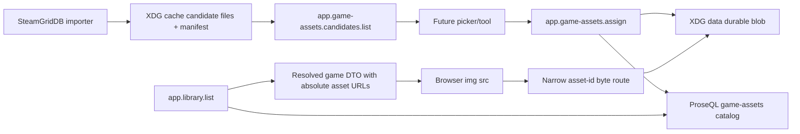

# feat: Add game-assets pipeline

## Summary

Build a clean-break game-assets system that stores scraper candidates in XDG cache, promotes selected images into durable XDG data blobs, records game-to-asset assignments as ProseQL domain data, and returns fully resolved absolute image URLs from RPC responses. The implementation removes the old assumption that `library.yaml` stores display-ready media delivery URIs.

---

## Problem Frame

Korri now has curated games and a SteamGridDB candidate scraper, but the current media model mixes game metadata with delivery URLs such as `/api/media/...`. That makes the library YAML less portable, makes remote-server rendering ambiguous, and turns an HTTP byte-serving path into domain truth.

---

## Requirements

- R1. Use `game-assets` as the domain language for scraper candidates, durable assets, and game-to-role assignments.
- R2. Store disposable scraper candidates under XDG cache, not XDG data.
- R3. Store promoted durable game-asset bytes under XDG data.
- R4. Store game-assets catalog records and assignments as ProseQL library domain data, honoring the configured library root.
- R5. Do not persist Korri delivery URLs in `library.yaml`, game records, or game-assets catalog records.
- R6. Persist durable asset identity, content type, byte size, decoded dimensions/pixel bounds, storage strategy metadata, and sanitized source/provenance metadata.
- R7. Persist one active game-to-asset assignment per `gameId + role`, separately from game identity/config records.
- R8. Keep domain behavior RPC-owned: candidate listing, assignment/promotion, unassignment, and resolved game assets are Effect RPC contracts.
- R9. Return fully resolved absolute asset URLs at runtime because the server may be remote.
- R10. Make a clean break from the old `metadata.media.uri` model; no backwards compatibility bridge is required.
- R11. Treat candidate manifests and downloaded images as untrusted input: validate paths, image bytes, MIME, and size before promotion.
- R12. Keep the full image-selection UI, immediate aka data migration, perfect SteamGridDB matching, committed image binaries, and production auth hardening out of this slice.

---

## Scope Boundaries

- No full UI for browsing/choosing candidates; RPC and storage behavior only.
- No production auth system in this slice. Write RPCs are early-stage trusted operations, fail closed by default, and require explicit trusted-write opt-in so later auth is mechanical.
- No remote human-facing game-assets writes until auth/authorization lands. In this slice, trusted writes are intended for local/test/trusted-control deployments only.
- No attempt to migrate the current aka media cache into durable assignments except through tests/fixtures or manual follow-up.
- No perfect SteamGridDB matching/ranking heuristics; the existing importer output is an input candidate source.
- No image binaries committed to the repo.
- No compatibility layer for old persisted `/api/media/...` game metadata.
- No candidate-cache files served over HTTP.

### Deferred to Follow-Up Work

- Auth and permission boundaries for remote write RPCs, including actor identity, game-assets mutation permission, CSRF/session handling if browser credentials are used, authoritative audit trails, and CORS/origin policy.
- Human-facing candidate picker UI.
- Automated migration from existing scraper cache into curated game-assets assignments.
- Better SteamGridDB matching, scoring, rate-limit handling, and provider-specific scraper orchestration.
- Garbage collection for unreferenced durable asset files after unassignment/replacement.
- Trusted proxy/forwarded-header support for public URL generation.

---

## Context & Research

### Relevant Code and Patterns

- `korri/shared/config/xdg-paths.ts` already provides `korriCachePath` and `korriDataPath`; use these instead of ad hoc `~/.cache` / `~/.local/share` concatenation in runtime code.
- `korri/shared/library/proseql/library-db.ts` defines the canonical ProseQL YAML collections with key-derived ids. Game-assets catalog data should extend this model and respect the configured library root.
- `korri/shared/library/proseql/library-repository.ts` is the repository seam for library reads/writes; game-assets should get a parallel repository/service seam instead of overloading game records.
- `korri/products/app/api/app-rpc-group.ts`, `korri/products/app/api/handlers.ts`, and `korri/products/app/api/server/rpc-server.ts` compose app/server RPC surfaces. New game-assets RPCs belong in product-owned API composition.
- `korri/products/app/api/library/list.rpc.ts` and `korri/products/app/api/library/list.rpc-handler.ts` currently return raw `GameRecord[]`; this should become a resolved library DTO with resolved media URLs.
- `korri/shared/api/http/media-assets.ts` currently serves arbitrary paths under a configured media root. The new byte-serving route should be narrowed to durable game-asset ids.
- `tools/importers/steamgriddb/fetch-korri-steamgriddb-art` is the current candidate-cache precursor. It should remain tooling, but its output location/manifest shape should align with the runtime candidate reader.

### Institutional Learnings

- `docs/solutions/best-practices/temporary-rocknix-sidecar-media-instead-of-es-gamelist-edits-2026-05-03.md`: keep Korri-owned media separate from external source metadata; treat the old sidecar `/api/media` URI approach as temporary evidence, not the architecture to expand.
- `docs/solutions/best-practices/proseql-canonical-library-with-derived-yaml-ids-2026-05-06.md`: persistence schemas should be human-reviewable, key-derived, and separate from computed runtime fields.
- `docs/solutions/best-practices/product-owned-composition-keeps-shared-layers-reusable-2026-05-03.md`: shared layers provide reusable primitives; app-specific RPC/route composition belongs under `korri/products/app/api`.
- `docs/solutions/integration-issues/effect-v4-rpc-schema-class-responses-2026-05-03.md`: RPC handlers using `Schema.Class` responses must return class instances, and real RPC roundtrip tests should cover new contracts.
- `docs/solutions/best-practices/prefer-real-implementations-over-mocks-2026-05-02.md`: test filesystem, ProseQL, and RPC behavior with real tempdir-backed implementations rather than mocks.

### External References

- External research skipped. The relevant architecture is dominated by existing Korri/XDG/ProseQL/Effect RPC patterns, and SteamGridDB specifics are already isolated to the importer precursor.

---

## Key Technical Decisions

- **Catalog data lives in the configured ProseQL library root; binary blobs live under XDG data:** `game-assets` and `game-asset-assignments` are library domain records, while promoted image bytes are durable application data. Runtime code must not bypass ProseQL by hand-editing YAML in a separate data path.
- **Use XDG cache for candidates and XDG data for durable blobs:** Candidates are disposable and rebuildable; promoted game-asset bytes must survive cache eviction.
- **Persist asset ids, not delivery URLs or local absolute paths:** Game-assets YAML stores asset records and game-role assignments. Runtime RPC resolves asset ids into absolute URLs.
- **Use content-addressed durable asset ids:** Promoted assets use immutable ids such as `sha256:<hex>`, making replacement create a new URL and keeping browser cache behavior simple.
- **Role belongs to assignments and resolved views, not immutable asset records:** The same bytes can be reused in more than one role without contradictory asset metadata.
- **Use one normalized assignment per `gameId + role`:** Replacement is an upsert of one assignment record; unassignment deletes one assignment record; unrelated roles are preserved.
- **Candidate file paths never cross the RPC boundary:** Runtime services may resolve manifest paths internally, but RPC payloads and responses use opaque `candidateId` / `assetId` values and sanitized metadata.
- **Return resolved view models from library RPC:** `app.library.list` should return a display-oriented DTO that includes resolved absolute media URLs, not raw persisted game records.
- **Keep byte serving narrow and subordinate:** Browser image loading still needs an HTTP URL, but the HTTP surface is only a byte-serving implementation detail for durable asset ids discovered through RPC.
- **Use explicit public API base URL configuration for remote/server deployments:** Do not derive image URLs from `Host` or forwarded headers in this slice. Local fallback is acceptable only for deterministic local development/test composition.
- **Treat write RPCs as trusted early-stage operations with an explicit fail-closed policy seam:** Assignment and unassignment can exist now without auth only when explicit trusted-write config is enabled. Remote-safe writes are deferred and the code should make that future boundary obvious.
- **Design for safe orphans, not impossible orphans:** Filesystem promotion and ProseQL writes are not one ACID transaction. The invariant is no dangling assignments; unassigned durable files are tolerated until later garbage collection.
- **Classify read surfaces as trusted-network readable for now:** Library listing, candidate listing, and byte URLs can expose game library and provenance metadata. They are acceptable for early trusted deployments, but public internet exposure is deferred until auth and privacy posture are defined.
- **Require HTTPS for non-loopback public base URLs:** Remote/server public API base URLs should use HTTPS except for localhost/loopback development and tests.

---

## Persistent State Invariants

- A game-asset assignment must reference an existing game id and an existing durable asset record.
- A durable asset record must identify bytes by asset id and validated content metadata; any stored path-like value must be relative, canonical, and under the durable game-assets root.
- Candidate cache entries are disposable and must never be treated as durable truth.
- Persisted YAML must not contain local absolute paths, Korri delivery URLs, API keys, or source URLs with credentials/tokens.
- Durable files may exist without assignments; this is a safe orphan state.
- Asset records may remain after unassignment; this is a safe unreferenced catalog state.
- Assignments must never point to missing asset records; this is an unsafe dangling reference.
- Runtime library responses must never return a URL for a missing, unreadable, unsupported, or corrupt durable asset.
- Byte-serving routes must serve only known durable game-assets by asset id, never arbitrary relative paths.

---

## Open Questions

### Resolved During Planning

- Should compatibility with old `metadata.media.uri` be preserved? No. This is a clean break.
- Should write RPCs block on a full auth implementation? No. Early-stage trusted writes are acceptable, but they need an explicit trusted-write policy seam.
- Should candidate cache live under XDG data? No. Disposable scraper candidates belong under XDG cache.
- Should game-assets catalog YAML live outside the ProseQL library root? No. Catalog records are library domain data and must honor the configured library root.
- Should library YAML store image URLs? No. It stores game identity/config only; game-assets stores asset identity and assignment data.
- Should runtime call SteamGridDB directly in this slice? No. Runtime consumes cache manifests; the importer remains separate tooling.

### Deferred to Implementation

- Exact provider manifest parsing tolerances: implementation should adapt to the current SteamGridDB script output and tighten as tests reveal edge cases.
- Exact image dimension validation mechanism: the plan requires byte/content validation; implementation can pick the smallest dependable image-probing approach available in the current toolchain.
- Exact local-dev public base URL fallback: choose the smallest implementation that keeps tests deterministic and remote deployments explicit.

---

## Output Structure

    korri/shared/library/game-assets/
      candidate-cache.ts
      game-assets-repository.ts
      game-assets-service.ts
      game-assets-service.test.ts
    korri/shared/library/config/records/
      game-asset.ts
      game-asset-assignment.ts
    korri/products/app/api/game-assets/
      list-candidates.rpc.ts
      list-candidates.rpc-handler.ts
      assign.rpc.ts
      assign.rpc-handler.ts
      unassign.rpc.ts
      unassign.rpc-handler.ts
    korri/shared/api/http/
      game-asset-bytes.ts
      game-asset-bytes.test.ts
    tools/importers/steamgriddb/
      fetch-korri-steamgriddb-art

---

## High-Level Technical Design

> *This illustrates the intended approach and is directional guidance for review, not implementation specification. The implementing agent should treat it as context, not code to reproduce.*



Persisted catalog shape should be conceptually like:

```yaml
game-assets:
  sha256:...:
    type: image
    mimeType: image/jpeg
    extension: jpg
    width: 512
    height: 512
    source:
      provider: steamgriddb
      id: "624901"
    byteSize: 184233
    pixelCount: 262144
    storage:
      strategy: content-addressed

game-asset-assignments:
  nix/supertuxkart:tile:
    gameId: nix/supertuxkart
    role: tile
    assetId: sha256:...
  nix/supertuxkart:banner:
    gameId: nix/supertuxkart
    role: banner
    assetId: sha256:...
```

Runtime responses should resolve absolute URLs from this catalog rather than persisting those URLs.

---

## Implementation Units

### U1. Define persisted game-assets schemas and collections

**Goal:** Add strict persisted schemas for durable game assets and game-to-role assignments, and remove the old delivery-URI media model from persisted game records.

**Requirements:** R1, R4, R5, R6, R7, R10

**Dependencies:** None

**Files:**
- Create: `korri/shared/library/config/records/game-asset.ts`
- Create: `korri/shared/library/config/records/game-asset-assignment.ts`
- Modify: `korri/shared/library/config/records/game.ts`
- Modify: `korri/shared/library/proseql/library-db.ts`
- Test: `korri/shared/library/config/records/game-asset.test.ts`
- Test: `korri/shared/fixtures/games/game.test.ts`

**Approach:**
- Define explicit game-asset roles (`tile`, `banner`, `poster`, `hero`, `logo`, `screenshot`) for assignments and resolved DTOs.
- Model durable assets as key-derived records keyed by immutable ids such as `sha256:<hex>`.
- Persist validated content metadata on assets: type, MIME/content type, extension, byte size, decoded dimensions/pixel count, storage strategy, and sanitized source/provenance metadata.
- Model assignments as normalized records keyed by `gameId + role`, referencing both game id and asset id.
- Remove display media entries from persisted `GamePayload`; resolved media belongs to RPC view models, not persisted game records.
- Extend the ProseQL database config with new game-assets collections while keeping game identity/config collections focused on launch/library data.

**Execution note:** Start with schema tests that reject delivery URLs in persisted game records and accept asset records/assignments.

**Patterns to follow:**
- `korri/shared/library/config/records/game.ts`
- `korri/shared/library/proseql/library-db.ts`
- `docs/solutions/best-practices/proseql-canonical-library-with-derived-yaml-ids-2026-05-06.md`

**Test scenarios:**
- Happy path: decoding a durable game asset with type, MIME, extension, width, height, byte size, and SteamGridDB source metadata succeeds.
- Happy path: decoding a normalized assignment keyed by `gameId + role` with game id, role, and asset id succeeds.
- Error path: a persisted game record containing `metadata.media.uri` or a Korri delivery URL fails strict decoding.
- Error path: an assignment with an unknown role fails strict decoding.
- Error path: an asset with an unsupported MIME type, invalid extension, impossible decoded dimensions, unsafe storage metadata, or invalid asset id fails strict decoding.
- Integration: a temp ProseQL library can open and query `game-assets` and `game-asset-assignments` records from YAML contributions.

**Verification:**
- ProseQL can open a temp library containing game-assets YAML contributions.
- Persisted game records no longer contain or validate display-ready image URLs.
- The configured ProseQL library root is the catalog source of truth.

---

### U2. Add game-assets storage and candidate cache services

**Goal:** Centralize path resolution, candidate-manifest reading, byte validation, durable promotion, and assignment persistence behind a game-assets service/repository seam.

**Requirements:** R1, R2, R3, R4, R6, R7, R8, R11

**Dependencies:** U1

**Files:**
- Create: `korri/shared/library/game-assets/candidate-cache.ts`
- Create: `korri/shared/library/game-assets/game-assets-repository.ts`
- Create: `korri/shared/library/game-assets/game-assets-service.ts`
- Test: `korri/shared/library/game-assets/game-assets-service.test.ts`
- Modify: `korri/shared/config/xdg-paths.ts` only if a named helper improves clarity

**Approach:**
- Use `korriCachePath(env, "game-assets", "candidates", ...)` for candidate files/manifests.
- Use `korriDataPath(env, "game-assets", "blobs", ...)` or equivalent for durable promoted image bytes.
- Use the configured ProseQL library root for durable asset records and assignments.
- Read candidate metadata from cache manifests produced by provider importers; do not call SteamGridDB from runtime in this first slice.
- Treat candidate manifests as untrusted: candidate paths stay internal, must be relative/canonicalized under the cache root, and must not be exposed through RPC.
- Promotion flow resolves a candidate id, verifies cache-root containment, rejects escaping symlinks, stages bytes under the durable asset filesystem, validates non-empty supported raster image bytes from magic bytes, enforces maximum byte size and decoded dimensions/pixel count, computes the content hash from staged bytes, atomically renames into the content-addressed durable location, then writes the asset record and assignment.
- Write asset record and assignment in one ProseQL transaction and flush before returning success when writes are debounced.
- If catalog persistence fails after file promotion, cleanup is best-effort; leftover durable files are allowed safe orphans.
- Assignment is one active asset per `gameId + role`; assigning a new asset for a role replaces that assignment without deleting the old durable file or unrelated role assignments.

**Execution note:** Implement with real temp XDG cache/data directories and real temp ProseQL libraries in tests, not mocks.

**Patterns to follow:**
- `korri/shared/config/xdg-paths.ts`
- `korri/shared/library/proseql/library-repository.ts`
- `docs/solutions/best-practices/prefer-real-implementations-over-mocks-2026-05-02.md`

**Test scenarios:**
- Happy path: a SteamGridDB manifest entry under XDG cache appears as a candidate with opaque candidate id, role, dimensions, source id, and sanitized source metadata.
- Happy path: assigning a valid candidate promotes it into XDG data, writes a durable asset record, and assigns it to the requested game role.
- Happy path: assigning `tile`, then assigning `banner`, preserves both role assignments.
- Happy path: assigning a second candidate to the same `gameId + role` replaces only that assignment and leaves the old durable file untouched.
- Edge case: an empty or missing candidate manifest returns an empty candidate list rather than failing the entire service.
- Error path: assigning a missing candidate returns a typed not-found error and writes no assignment.
- Error path: manifest path traversal, absolute paths, and symlink escapes are rejected.
- Error path: candidate bytes with a misleading extension but unsupported/HTML/SVG/unknown content are rejected before catalog writes.
- Error path: oversized, over-large decoded dimensions/pixel count, or empty candidate files are rejected before catalog writes.
- Error path: a filesystem write failure returns a typed data error and does not leave a persisted assignment pointing at a missing file.
- Integration: after a successful assignment, reopening the temp ProseQL library from disk still shows the asset record and assignment, and the durable file still exists.

**Verification:**
- Candidate files are only read from XDG cache.
- Promoted bytes are only written under XDG data.
- Catalog records are only written through ProseQL under the configured library root.
- No successful assignment can point at a missing asset record.

---

### U3. Align the SteamGridDB importer with candidate-cache conventions

**Goal:** Make the existing ephemeral SteamGridDB script a reusable candidate producer for the game-assets service.

**Requirements:** R1, R2, R6, R11, R12

**Dependencies:** U2

**Files:**
- Modify: `tools/importers/steamgriddb/fetch-korri-steamgriddb-art`
- Test expectation: none -- this is an ephemeral shell importer precursor; service tests in U2 validate the manifest contract it must produce.

**Approach:**
- Keep the script under `tools/importers/steamgriddb/` as tooling, not runtime app code.
- Default output to the same XDG cache candidate root used by the game-assets candidate service.
- Ensure `manifest.jsonl` carries enough data for runtime candidate listing: game id, provider, provider asset id, intended role/ratio, dimensions, source URL, and a cache-relative file reference.
- Do not write durable game-assets catalog YAML from the importer; promotion/assignment belongs to RPC/service behavior.
- Do not embed API keys, machine-local absolute paths, or durable delivery URLs.
- Strip or avoid persisting source URL credentials/query tokens in manifest data that will flow into durable provenance.

**Patterns to follow:**
- `tools/importers/rocknix/` for importer/tooling placement.
- `korri/shared/config/xdg-paths.ts` path semantics, mirrored carefully in shell.

**Test scenarios:**
- Test expectation: none -- shell execution depends on an external SteamGridDB API key. The stable contract is covered by U2 candidate-manifest fixture tests.

**Verification:**
- A script-generated manifest can be consumed by the candidate service without transformation.
- The script defaults to XDG cache, not XDG data.
- Manifest file references are not absolute machine paths.

---

### U4. Add game-assets RPC contracts and trusted write handlers

**Goal:** Expose candidate listing, assignment/promotion, and unassignment through Effect RPC under product-owned API composition.

**Requirements:** R1, R8, R11, R12

**Dependencies:** U1, U2

**Files:**
- Create: `korri/products/app/api/game-assets/list-candidates.rpc.ts`
- Create: `korri/products/app/api/game-assets/list-candidates.rpc-handler.ts`
- Create: `korri/products/app/api/game-assets/assign.rpc.ts`
- Create: `korri/products/app/api/game-assets/assign.rpc-handler.ts`
- Create: `korri/products/app/api/game-assets/unassign.rpc.ts`
- Create: `korri/products/app/api/game-assets/unassign.rpc-handler.ts`
- Modify: `korri/products/app/api/app-rpc-group.ts`
- Modify: `korri/products/app/api/handlers.ts`
- Modify: `korri/products/app/api/server/rpc-group.ts`
- Modify: `korri/products/app/api/server/rpc-server.ts`
- Modify: `korri/products/app/api/rpc-server.ts`
- Test: `korri/products/app/api/game-assets/game-assets.rpc-handler.test.ts`
- Test: `korri/products/app/api/server/rpc-server.test.ts`

**Approach:**
- Use RPC tags that keep the domain obvious, e.g. `app.game-assets.candidates.list`, `app.game-assets.assign`, and `app.game-assets.unassign`.
- Use Effect Schema as the source of truth for payloads, responses, and typed errors.
- Return `Schema.Class` response instances from handlers.
- Map missing game/candidate/asset to `NotFoundError`, validation failures to `ValidationError`, and filesystem/YAML failures to `DataError`.
- Candidate responses expose opaque candidate ids, role, dimensions, and sanitized source metadata; they do not expose server-local file paths.
- Assignment payloads accept existing game id, supported role, and opaque candidate id only in this slice. They do not accept raw paths, raw URLs, durable asset ids from clients, or file bytes.
- Add an explicit trusted-write policy seam that is disabled by default and enabled only by explicit local/test/trusted-control configuration. Read RPCs can remain available when trusted writes are disabled; assign/unassign remain registered and return a typed trusted-write-disabled error.
- Include read/write RPCs in both relevant app/server groups only under the trusted-write exposure policy for the current deployment model. The remote/server surface must not allow writes unless trusted-write config is explicitly enabled.
- Add minimal structured operational logging for assign/unassign events without local paths, API keys, or full sensitive source URLs; authoritative audit trails remain deferred to auth work.

**Execution note:** Include at least one real RPC client/server roundtrip test so schema class response issues are caught at the wire boundary.

**Patterns to follow:**
- `korri/products/app/api/library/list.rpc.ts`
- `korri/products/app/api/library/list.rpc-handler.ts`
- `korri/products/app/api/server/rpc-server.test.ts`
- `docs/solutions/integration-issues/effect-v4-rpc-schema-class-responses-2026-05-03.md`

**Test scenarios:**
- Happy path: `app.game-assets.candidates.list` returns candidates for a game and role from a temp XDG cache manifest without local filesystem paths.
- Happy path: `app.game-assets.assign` promotes a candidate and returns the assigned durable asset metadata.
- Edge case: candidate/source URLs with credentials or token-like query parameters are sanitized before persistence or response.
- Happy path: `app.game-assets.unassign` removes the active assignment for `gameId + role` without deleting the durable asset file.
- Edge case: read RPCs still work when trusted writes are disabled.
- Error path: assign/unassign is rejected when trusted writes are disabled.
- Error path: assigning a nonexistent game or candidate returns `NotFoundError`.
- Error path: assigning an unsupported role, raw path, raw URL, traversal text, or oversized string returns `ValidationError`.
- Integration: a real RPC request/response roundtrip decodes the response classes and typed errors correctly.

**Verification:**
- RPC tags appear in the expected app/server RPC groups according to the trusted-write policy.
- Direct handler tests and real RPC roundtrip tests both pass.

---

### U5. Replace arbitrary media serving with narrow game-asset byte serving

**Goal:** Serve promoted durable game-assets by opaque asset identity while preventing arbitrary path-shaped media access.

**Requirements:** R3, R5, R9, R10, R11

**Dependencies:** U1, U2

**Files:**
- Create: `korri/shared/api/http/game-asset-bytes.ts`
- Modify: `korri/products/app/api/hono-app.ts`
- Delete or rewrite: `korri/shared/api/http/media-assets.ts`
- Test: `korri/shared/api/http/game-asset-bytes.test.ts`
- Test: `korri/products/app/api/server/rpc-server.test.ts`

**Approach:**
- Replace the path-shaped `/api/media/*` route with a narrow byte-serving route that accepts only a canonical durable asset id representation.
- Allow only `GET` and `HEAD`; reject mutation methods.
- Resolve the asset id through game-assets metadata before reading bytes; do not allow URL path traversal to choose arbitrary files under a media root.
- Derive the durable file path from the asset id and validated metadata rather than trusting request paths or unvalidated YAML paths.
- Serve only supported, validated raster image MIME types recorded at promotion time.
- Include `X-Content-Type-Options: nosniff` and immutable/cache-friendly headers for content-addressed assets.
- Enforce maximum byte size and decoded pixel/dimension limits before an asset can be considered valid.
- Keep this route out of the domain model: clients discover URLs from RPC responses, not by constructing routes themselves.

**Execution note:** Start with traversal, malformed-id, unsupported-MIME, and missing-file tests before replacing the existing helper.

**Patterns to follow:**
- `korri/shared/api/http/media-assets.ts`
- `korri/shared/api/http/media-assets.test.ts`
- `docs/solutions/best-practices/product-owned-composition-keeps-shared-layers-reusable-2026-05-03.md`

**Test scenarios:**
- Happy path: requesting a valid durable asset id returns the file body with the validated content type.
- Happy path: `HEAD` for a valid durable asset id returns headers without a body.
- Edge case: unknown asset id returns 404.
- Error path: malformed digest, slash, encoded slash, traversal, NUL, and extra suffix inputs return 400 and never read outside the durable asset root.
- Error path: an asset record whose file is missing returns 404.
- Error path: an asset record with unsupported MIME is not served.
- Error path: mutation methods against the byte route are rejected.
- Integration: an absolute URL returned by `app.library.list` can be fetched from the Hono app and returns the promoted image bytes.

**Verification:**
- Arbitrary relative file paths are no longer part of the public media-serving contract.
- Byte serving works only for known durable game-assets.
- Responses include `nosniff` and content type from validated asset metadata.

---

### U6. Resolve game-assets into absolute URLs for library responses

**Goal:** Change library listing to return display-ready game view models with resolved absolute game-asset URLs while keeping persisted YAML URL-free.

**Requirements:** R5, R6, R7, R9, R10

**Dependencies:** U1, U2, U5

**Files:**
- Modify: `korri/products/app/api/library/list.rpc.ts`
- Modify: `korri/products/app/api/library/list.rpc-handler.ts`
- Modify: `korri/products/app/stream/remote-stream-client.ts`
- Modify: `korri/products/app/features/home/library-source-layer-rpc.ts`
- Modify: `korri/shared/library/library-services.ts`
- Modify: `korri/shared/library/library-atoms.ts`
- Modify: `korri/shared/library/library-list-state.ts`
- Modify: `korri/shared/fixtures/games/game.ts`
- Modify: `korri/shared/library/rocknix/rocknix-source.ts`
- Modify: `tools/importers/rocknix/rocknix-importer.ts`
- Test: `korri/products/app/api/library/list.rpc-handler.test.ts`
- Test: `korri/shared/fixtures/games/game.test.ts`
- Test: `korri/shared/library/rocknix/rocknix-source.test.ts`
- Test: `korri/products/app/features/home/library-rpc-layers.test.ts`
- Test: `korri/shared/library/library-list-state.test.ts`
- Test: `tools/importers/rocknix/rocknix-importer.test.ts`

**Approach:**
- Introduce a resolved library/game DTO for RPC responses rather than returning persisted `GameRecord` directly, and carry that type through the RPC library source layer, atoms, list state, and UI helper seam.
- The resolved DTO includes media entries with role, type, width, height, source metadata, asset id, and an absolute URL.
- Resolve absolute URLs from a configured public API base URL and the narrow game-asset byte-serving route.
- Validate public base URL configuration: `https://` for non-loopback remote/server bases, `http://` only for loopback/local development, no credentials, no query/fragment, deterministic trailing slash/base path behavior, and no forwarded-header derivation in this slice.
- Server/remote deployments should require explicit public API base URL configuration; local development may use a deterministic loopback/test fallback.
- Update fixture helpers to consume resolved media URLs by explicit role, not by filename inference.
- Remove Rocknix source and importer generation of `/api/media/games/...` URIs. In this slice, game-assets are canonical ProseQL library data; Rocknix sidecar media should not create a second assignment model.
- Missing or unavailable optional assets should not break library listing. Omit broken media entries and surface diagnostics through logs or asset-specific RPCs; never return a broken URL.

**Execution note:** Add characterization coverage for the current helper behavior before replacing it with role-based resolved-media behavior.

**Patterns to follow:**
- `korri/products/app/api/library/list.rpc.ts`
- `korri/products/app/stream/remote-stream-client.ts`
- `korri/shared/fixtures/games/game.ts`

**Test scenarios:**
- Happy path: listing the library with assigned tile/banner/poster assets returns absolute URLs for each role.
- Happy path: remote client code consumes the new resolved DTO without requiring access to persisted YAML internals.
- Edge case: a game with no assignments returns an empty media list or omitted media field without failing the whole library list.
- Error path: assignment references a missing asset record; library list omits that media entry and does not return a broken URL.
- Error path: asset record references a missing file; library list omits that media entry and the byte route returns 404.
- Error path: remote/server-like config without a public API base URL fails deterministically rather than returning `localhost` URLs.
- Error path: public base URL with credentials, query, fragment, unsupported scheme, non-loopback HTTP, or unsafe characters is rejected.

**Verification:**
- No persisted game YAML field is needed to render image URLs.
- Resolved URLs are absolute in RPC responses.
- Library launch/stream flows still work for games without assets.

---

### U7. Update tests, fixtures, and generated expectations for the clean break

**Goal:** Remove remaining assumptions that game records carry display-ready media URIs and ensure the new game-assets flow is covered end-to-end.

**Requirements:** R5, R8, R9, R10, R11, R12

**Dependencies:** U1, U2, U4, U5, U6

**Files:**
- Modify: `korri/shared/fixtures/games/game.test.ts`
- Modify: `korri/shared/library/rocknix/rocknix-source.test.ts`
- Modify: `korri/products/app/api/server/rpc-server.test.ts`
- Modify: affected fixture YAML or test helpers under `tools/testing/` as discovered during implementation
- Test: `korri/products/app/api/game-assets/game-assets.integration.test.ts`

**Approach:**
- Replace filename-inference helper tests with explicit role-based resolved-media tests.
- Ensure test fixtures use `game-assets` and `game-asset-assignments` rather than `metadata.media.uri`.
- Cover the end-to-end path from candidate manifest to assignment to resolved library response to byte fetch using real temp directories and real RPC/Hono handlers.
- Add direct catalog consistency assertions in tests without creating a reusable repair/GC surface in this slice.
- Keep immediate aka data migration out of this unit; fixtures/tests can be updated freely because no backwards compatibility is required.

**Patterns to follow:**
- `tools/testing/library/with-temp-proseql-library.ts`
- `korri/products/app/api/server/rpc-server.test.ts`
- `docs/solutions/best-practices/prefer-real-implementations-over-mocks-2026-05-02.md`

**Test scenarios:**
- Integration: temp cache candidate + temp library game + assign RPC creates a durable asset assignment and resolved library response URL.
- Integration: resolved URL from library response fetches image bytes from the app.
- Integration: after assign, close/reopen the temp library and verify asset record, assignment, durable file, and resolved URL remain valid.
- Error path: persisted legacy `metadata.media.uri` fixtures fail schema validation or are removed from test data.
- Error path: catalog consistency detects assignment references to missing games/assets and asset metadata that would escape the durable root.
- Edge case: game without assets still lists and launches normally.

**Verification:**
- The unit/integration suite no longer depends on old URI-bearing media records.
- All game-assets behavior is proven through public contracts and real temp storage.

---

## System-Wide Impact

- **Interaction graph:** SteamGridDB importer writes cache candidates; game-assets RPC reads candidates and writes durable blobs/catalog assignments; library RPC joins game records with game-assets assignments; byte serving reads only promoted durable assets by asset id.
- **Error propagation:** Candidate/asset/assignment errors should map to `ApiError` variants. Library listing should not fail an entire library because one optional asset is missing unless the game-assets catalog itself is unreadable/invalid.
- **State lifecycle risks:** Promotion crosses filesystem and ProseQL writes; implement temp-file/rename ordering, ProseQL transaction boundaries, flush-before-success, and best-effort cleanup to avoid dangling assignments. Safe orphan files are accepted.
- **API surface parity:** App and server RPC groups should expose read behavior required by desktop-as-server-client flows. Write RPC exposure is controlled by the trusted-write policy and must be revisited when auth lands.
- **Integration coverage:** Unit tests alone are insufficient; include at least one real RPC/Hono flow from assignment through resolved URL fetch and at least one reopen-from-disk persistence test.
- **Unchanged invariants:** Game identity (`system`, `contentPath`) remains on game records; launcher/stream preparation should not depend on game-assets being present.

---

## Risks & Dependencies

| Risk | Mitigation |
|------|------------|
| Trusted write RPCs mutate files/YAML without auth | Add an explicit fail-closed trusted-write policy seam now; keep production-safe auth deferred but visible; reject writes when the policy is disabled and limit enabled writes to local/test/trusted-control deployments. |
| Remote URL generation points clients at the wrong host | Require explicit public API base URL in remote/server mode; require HTTPS outside loopback; reject unsafe base URLs; do not trust forwarded headers in this slice. |
| Filesystem promotion and YAML persistence diverge | Promote bytes before assignment, write asset record + assignment in one ProseQL transaction, flush before success, and allow only safe orphan files after failures. |
| Assignments become dangling references | Verify game and asset existence during assignment; consistency tests assert assignments never point at missing records. |
| Candidate cache path traversal or symlink escape | Resolve candidates by opaque id, canonicalize under the cache root, reject escaping paths/symlinks, and never expose local paths via RPC. |
| Untrusted image bytes are promoted or served | Validate MIME/content from bytes, reject unsupported/SVG/HTML/oversized files, store validated metadata, and serve with `nosniff`. |
| Browser caches stale image bytes after replacement | Use content-addressed asset ids so replacement creates a new URL. |
| Orphan durable files accumulate after failed writes/replacements/unassignment | Accept as safe in this slice; defer GC with a future dry-run/report-first cleanup tool. |
| No backwards compatibility breaks fixtures or existing UI helpers | Treat this as intended; update tests/helpers and resolved DTO consumers in the same slice. |

---

## Documentation / Operational Notes

- Note the new XDG candidate cache location in importer usage text near `tools/importers/steamgriddb/fetch-korri-steamgriddb-art`.
- Note that game-assets catalog records live in the configured ProseQL library root, while durable bytes live under XDG data.
- Server deployments that need remote clients should set the public API base URL once that config name is introduced.
- Do not document API keys or commit scraped images.
- Do not describe trusted write RPCs as production-safe until auth/authorization lands.

---

## Sources & References

- Related code: `korri/shared/config/xdg-paths.ts`
- Related code: `korri/shared/library/proseql/library-db.ts`
- Related code: `korri/shared/library/proseql/library-repository.ts`
- Related code: `korri/products/app/api/app-rpc-group.ts`
- Related code: `korri/products/app/api/library/list.rpc.ts`
- Related code: `korri/products/app/api/library/list.rpc-handler.ts`
- Related code: `korri/shared/api/http/media-assets.ts`
- Related tool: `tools/importers/steamgriddb/fetch-korri-steamgriddb-art`
- Institutional learning: `docs/solutions/best-practices/temporary-rocknix-sidecar-media-instead-of-es-gamelist-edits-2026-05-03.md`
- Institutional learning: `docs/solutions/best-practices/proseql-canonical-library-with-derived-yaml-ids-2026-05-06.md`
- Institutional learning: `docs/solutions/best-practices/product-owned-composition-keeps-shared-layers-reusable-2026-05-03.md`
- Institutional learning: `docs/solutions/integration-issues/effect-v4-rpc-schema-class-responses-2026-05-03.md`
- Institutional learning: `docs/solutions/best-practices/prefer-real-implementations-over-mocks-2026-05-02.md`
