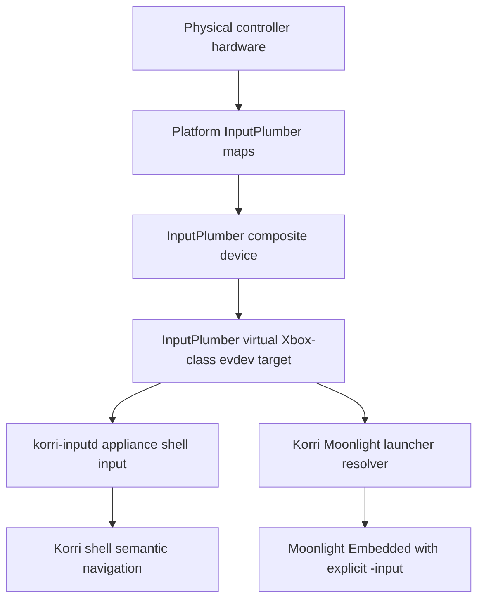
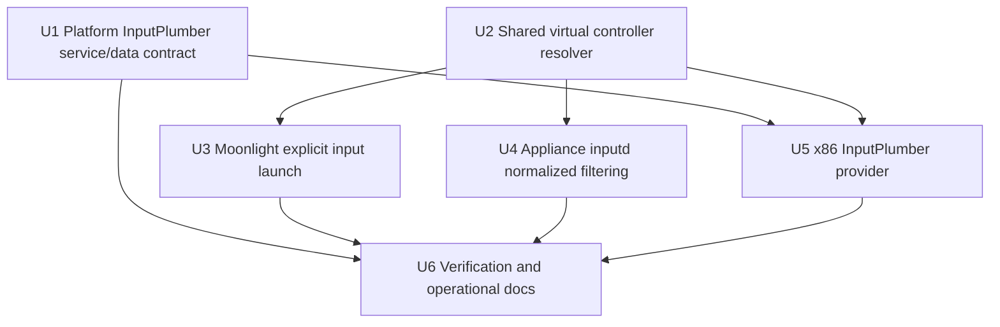
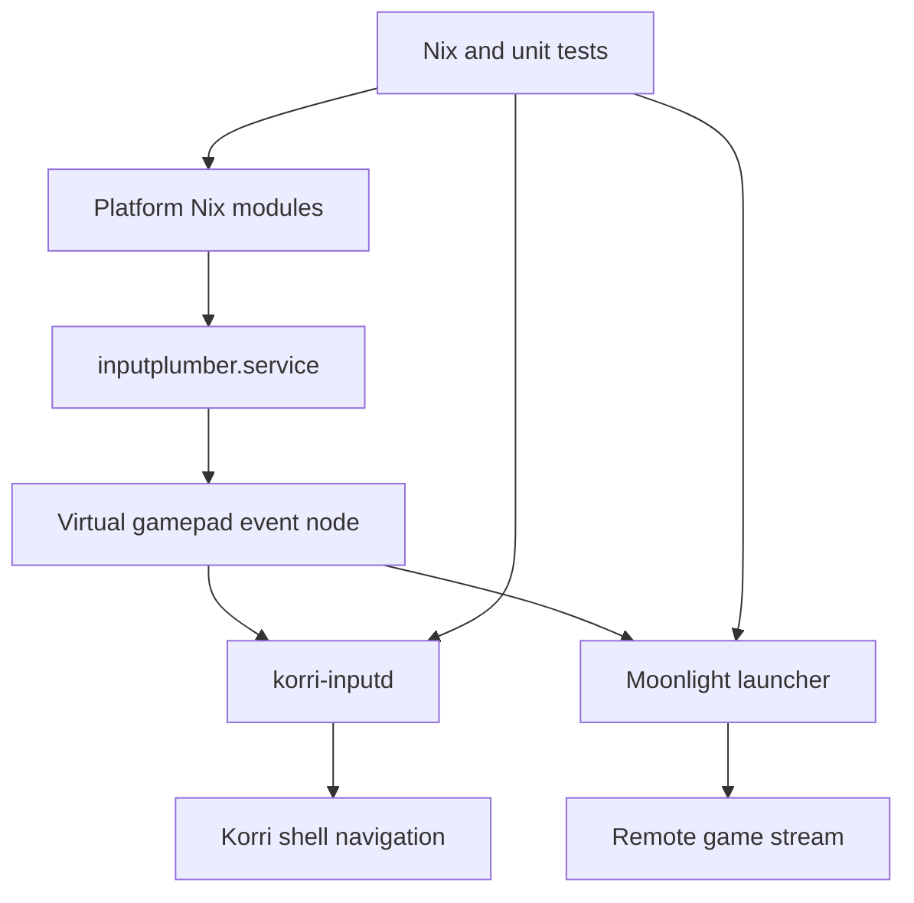

# refactor: Normalize kiosk controller input through InputPlumber

## Summary

Make InputPlumber the controller-normalization boundary for Korri appliance kiosks and Moonlight launches across RockNix handhelds and x86 devices. Platform modules will own hardware maps and service readiness, while shared Korri launch/input code consumes only InputPlumber virtual controllers and fails closed rather than falling back to raw hardware.

---

## Problem Frame

Sobo proved that “Moonlight launches” is not enough: Moonlight Embedded can start and stream while still seeing the raw handheld controller path, or fail before stream startup when the normalized InputPlumber target is missing. The current Sobo failure is not a reason to add another Odin/Sobo mapping to Moonlight; it is evidence that the appliance input contract is incomplete. Korri needs a single normalized controller surface that works for Thor, Odin/Sobo, and off-the-shelf x86 kiosks without pushing device-specific quirks into product code.

---

## Requirements

- R1. InputPlumber is the only controller-normalization layer for Korri appliance kiosk control and Moonlight stream input on supported appliance targets.
- R2. Moonlight must receive an explicit InputPlumber virtual gamepad input device; it must not auto-enumerate raw physical controller devices during appliance stream launches.
- R3. Hardware-specific facts belong in platform/InputPlumber packaging: device maps, target selection, service environment, uinput/device access, and constrained guest quirks.
- R4. Shared Korri TypeScript must stay device-agnostic: no Odin, Sobo, Thor, AYN, or raw hardware mapping allowlists in Moonlight launch or product UI code.
- R5. The generic Moonlight mapping DB may be used only to map the normalized virtual controller shape, not as a raw-device escape hatch.
- R6. Kiosk shell input must require InputPlumber virtual controllers in appliance-required mode so raw physical devices do not create duplicate or divergent navigation behavior; raw-capable discovery is limited to non-appliance development or diagnostics.
- R7. x86 kiosks must have a real InputPlumber provider path before being labeled as normalized by InputPlumber; `seatd` may remain compositor/seat plumbing but is not the controller-normalization provider.
- R8. The implementation must fail clearly when InputPlumber is active but not producing the expected virtual controller, when zero virtual controllers are found, or when multiple ambiguous virtual gamepads are present.
- R9. Tests and Nix evaluation coverage must protect the normalized-input contract across RockNix SM8550/Sobo/Odin, Thor, and x86 appliance targets.

---

## Scope Boundaries

- Do not add per-device Moonlight mappings for raw Odin/Sobo/Thor hardware controllers.
- Do not tune Moonlight video codec, bitrate, resolution, decoder, or latency behavior in this plan.
- Do not add Moonlight/Sunshine pairing UX.
- Do not redesign Korri spatial navigation or React component-level input APIs.
- Do not remove the web gamepad adapter for non-appliance development surfaces; this plan is about appliance kiosk and Moonlight launch paths.
- Do not introduce product-code controller profiles keyed by vendor, product, device name, or handheld model.
- Do not claim x86 is InputPlumber-normalized until InputPlumber actually creates the virtual controller target and Korri/Moonlight consume it.

### Deferred to Follow-Up Work

- Stream performance benchmarking and tuning can follow once the input path is deterministic.
- Rich user-facing diagnostics/settings UI for controller state can follow after the appliance preflight and typed failures exist.
- Multi-controller player assignment and multiplayer ownership policy can be planned separately if the product needs it.
- Upstreaming new or corrected InputPlumber device maps to nix-on-rocks/InputPlumber can happen after Korri’s local appliance contract is proven.

---

## Context & Research

### Relevant Code and Patterns

- `docs/deployment/korri-nixos-modules.md` defines the boundary: Korri modules own generic product behavior and normalized input ordering; platform adapters own hardware facts such as InputPlumber maps, event names, and uinput quirks.
- `nix/modules/korri-kiosk.nix` already has `services.korri.kiosk.input.provider` with required provider assertions and systemd ordering for platform input services.
- `nix/images/platforms/rocknix-sm8550.nix` already declares `inputplumber.service` as the kiosk input provider and configures Moonlight Embedded plus `KORRI_MOONLIGHT_MAPPING_FILE`.
- `nix/images/platforms/x86.nix` currently declares `x86-seat-input` backed by `seatd.service`, which is not a controller-normalization layer.
- `korri/products/app/stream/moonlight-launcher.ts` is the product-owned launch seam used by `korri/deploy/desktop/launch-bridge.ts` and the CLI shim. It already supports `KORRI_MOONLIGHT_MAPPING_FILE` but not explicit virtual input selection.
- `korri/shared/input/native/discover-devices.ts` parses `/proc/bus/input/devices`, classifies evdev devices, and already has tests recognizing an InputPlumber virtual Xbox controller fixture.
- `tools/device/inputd.ts` discovers all evdev devices and streams native input to the renderer/broker; appliance mode needs to prevent raw and virtual gamepads from both controlling the shell.
- `tools/testing/nix/korri-kiosk-module-eval.test.ts` and `tools/testing/nix/korri-rocknix-image-eval.test.ts` are existing Nix contract tests for kiosk input provider wiring.

### Institutional Learnings

- `docs/solutions/integration-issues/one-command-odin-electrobun-deploy-needs-device-nix-and-session-env-2026-05-06.md`: an installed device service is not enough; package paths, service environment, session state, and real smoke checks must converge.
- `docs/solutions/workflow-issues/generic-game-stream-runner-validation-contract-2026-05-19.md`: keep Moonlight/Sunshine generic and avoid accumulating per-game or per-device launch hacks above the runner boundary.
- `docs/solutions/architecture-patterns/boot-scoped-control-plane-with-session-scoped-runner-2026-05-19.md`: make lifecycle and path contracts explicit module seams, derive environment from those seams, and fail closed at evaluation when possible.
- `docs/solutions/best-practices/decoupled-spatial-navigation-2026-05-01.md`: input adapters normalize device-specific details into semantic actions; components and navigation must remain device-agnostic.
- `docs/solutions/integration-issues/supervise-chromium-kiosk-session-after-game-exit-2026-05-04.md`: process presence is not a runtime invariant; appliance sessions need supervised readiness and clear recovery paths.

### External References

- InputPlumber docs describe source devices, composite devices, and virtual target devices: https://shadowblip.github.io/InputPlumber/
- InputPlumber 0.75.x resolves its base data path via XDG data dirs plus the `inputplumber` prefix, so the service must see a share root that contains `share/inputplumber`.
- InputPlumber target IDs include Xbox-class virtual targets such as `xb360` and `xbox-series`.
- Moonlight Embedded supports `-input <device>` to restrict enabled evdev inputs and `-mapping <file>` for a controller mapping DB: https://github.com/moonlight-stream/moonlight-embedded/wiki/Usage
- Linux uinput and evdev are the correct kernel surfaces for userspace virtual controller creation and event consumption: https://docs.kernel.org/input/uinput.html and https://docs.kernel.org/input/input.html

---

## Key Technical Decisions

- Use InputPlumber virtual controllers as the app-facing contract: physical controller quirks terminate in InputPlumber maps, and Korri/Moonlight consume a virtual Xbox-class evdev device.
- Treat `inputplumber.service` being active as insufficient: readiness means the service loaded its data/maps and produced the expected virtual target device.
- Resolve the virtual controller at launch time instead of persisting `/dev/input/eventN`: event numbers change across boot, hotplug, and InputPlumber restarts.
- Make normalized-input enforcement an explicit appliance contract: kiosk/device builds should require the resolver and fail closed, while non-appliance development/diagnostic flows may keep the current raw-capable behavior.
- Fail fast when the normalized controller is unavailable: omitting Moonlight `-input` would re-enable raw-device auto-enumeration and violate the core requirement.
- Keep `KORRI_MOONLIGHT_MAPPING_FILE` as a generic virtual-controller compatibility input only: it can help Moonlight Embedded map the InputPlumber virtual gamepad, but it must not become a raw hardware mapping file.
- Make the canonical target policy platform-owned but product-code generic: current RockNix validation may use an `xb360` virtual target for Moonlight Embedded compatibility, while the shared resolver should identify InputPlumber virtual Xbox-class targets without knowing Odin/Sobo/Thor hardware.
- Keep `seatd` separate from normalized controller input on x86: it can remain necessary for compositor/session access, but the input provider name should not imply controller normalization until InputPlumber is configured.

---

## Open Questions

### Resolved During Planning

- Should Korri solve Sobo by adding a raw Odin/Sobo mapping to Moonlight? No. That would move hardware quirks above the normalization boundary and repeat the same problem on the next device.
- Should Moonlight fall back to auto-enumerating all inputs if the InputPlumber virtual target is missing? No. Appliance launches should fail clearly rather than silently consuming raw devices.
- Is a generic Moonlight `gamecontrollerdb.txt` mapping still allowed? Yes, but only for the InputPlumber virtual controller shape; it is not a device-specific raw-controller mapping strategy.
- Should x86 continue to advertise `x86-seat-input` as the normalized appliance provider? No. `seatd` is infrastructure, not normalization; x86 needs an InputPlumber-backed provider path.

### Deferred to Implementation

- Exact InputPlumber target name policy: implementation should choose the smallest stable policy that passes current Sobo/Odin, Thor, and x86 validation, with `xb360` acceptable where Moonlight Embedded mapping compatibility requires it.
- Exact readiness primitive: implementation may use `/proc/bus/input/devices`, InputPlumber CLI/DBus, a generated stable udev symlink, or a combination, as long as it verifies the virtual target rather than only service liveness. Nix eval can prove wiring and paths, but only runtime smoke can prove the target exists on real hardware.
- Exact x86 InputPlumber map breadth: implementation should start with common wired USB gamepads and avoid global manage-all if it risks matching InputPlumber’s own virtual targets.
- Exact user-facing wording for launch failures: implementation should produce actionable errors without requiring this plan to pre-write product copy.

---

## High-Level Technical Design

> *This illustrates the intended approach and is directional guidance for review, not implementation specification. The implementing agent should treat it as context, not code to reproduce.*

The invariant is that `Virtual` is the only controller input surface visible to Korri shell control and Moonlight stream launches in appliance mode. Platform code may differ by device; product launch and UI code should not.

---

## Implementation Units

### U1. Define the platform InputPlumber service and data contract

**Goal:** Make platform adapters responsible for a working InputPlumber service that can load maps/data and create the normalized virtual controller target.

**Requirements:** R1, R3, R5, R8, R9

**Dependencies:** None

**Files:**
- Modify: `nix/images/platforms/rocknix-sm8550.nix`
- Modify: `tools/testing/nix/korri-rocknix-image-eval.fixture.nix`
- Modify: `tools/testing/nix/korri-rocknix-image-eval.test.ts`
- Modify: `tools/testing/nix/korri-kiosk-module-eval.test.ts`

**Approach:**
- Ensure RockNix SM8550/Sobo/Odin and Thor image composition makes InputPlumber’s package data available through the service’s XDG data root, not only through an assumed `/run/current-system/sw/share` link.
- Keep hardware maps and target-device policy in platform/substrate packaging, not generic Korri modules.
- Require the platform provider contract to mean more than service ordering: the service must have the map data needed to produce the virtual target.
- Preserve the existing generic kiosk input provider seam in `nix/modules/korri-kiosk.nix`; extend tests around platform composition rather than embedding RockNix facts in the generic module.

**Patterns to follow:**
- `docs/deployment/korri-nixos-modules.md` for the Korri-vs-platform ownership boundary.
- Existing provider assertions in `nix/modules/korri-kiosk.nix`.
- Existing RockNix image assertions in `tools/testing/nix/korri-rocknix-image-eval.test.ts`.

**Test scenarios:**
- Happy path: RockNix Sobo/Odin and Thor eval summaries include `inputProviderName = "inputplumber"`, `inputplumber.service`, and the service/package data path needed for `share/inputplumber` maps.
- Edge case: a platform declaring `inputplumber.service` without a visible InputPlumber data root fails an eval assertion or is surfaced by a focused eval test.
- Error path: generic Korri modules remain free of RockNix/AYN/Thor hardware strings after the platform contract is strengthened.
- Integration: RockNix image eval confirms Moonlight Embedded mapping DB and InputPlumber provider configuration are both present for the same appliance target.

**Verification:**
- Nix eval coverage proves the RockNix platform has a named normalized provider and a service environment/package shape capable of loading InputPlumber maps.
- Generic Korri kiosk module behavior remains device-agnostic and still rejects missing providers when input is required.

---

### U2. Add a shared resolver for the normalized InputPlumber virtual gamepad

**Goal:** Provide one reusable way to identify the current InputPlumber virtual controller event node and reject raw or ambiguous controller surfaces.

**Requirements:** R2, R4, R6, R8, R9

**Dependencies:** None

**Files:**
- Modify: `korri/shared/input/native/discover-devices.ts`
- Create or modify: `korri/shared/input/native/inputplumber-virtual-gamepad.ts`
- Modify: `korri/shared/input/native/discover-devices.test.ts`
- Create or modify: `korri/shared/input/native/inputplumber-virtual-gamepad.test.ts`
- Create: `tools/testing/fixtures/proc/bus-input-devices-inputplumber-virtual.txt`
- Create: `tools/testing/fixtures/proc/bus-input-devices-inputplumber-raw-only.txt`
- Create: `tools/testing/fixtures/proc/bus-input-devices-inputplumber-ambiguous.txt`
- Create: `tools/testing/fixtures/proc/bus-input-devices-inputplumber-renumbered.txt`
- Create: `tools/testing/fixtures/proc/bus-input-devices-inputplumber-malformed.txt`

**Approach:**
- Reuse the existing `/proc/bus/input/devices` parser rather than shelling out to grep event nodes or persisting `/dev/input/eventN`.
- Add or preserve resolver-relevant metadata in the parsed device shape so selection can use stable `uniq`, `phys`, and known virtual target evidence without matching primarily on display name.
- Return the selected device metadata plus a concrete `/dev/input/event*` path so `inputd` and Moonlight launch do not duplicate resolver logic or lose axis/device context.
- Use scenario-specific proc fixtures for single-virtual, raw-only, ambiguous, event-renumbered, and malformed cases instead of overloading the existing shared fixture.
- Ensure raw hardware gamepads are visible to diagnostics but are not accepted as the normalized target.

**Execution note:** Implement this helper test-first because it defines the core cross-device contract that the launcher and input daemon will share.

**Patterns to follow:**
- `korri/shared/input/native/discover-devices.ts` for parser style and capability-based classification.
- `korri/shared/input/native/discover-devices.test.ts` for fixture-backed parser tests.
- Existing `InputPlumber Virtual Xbox 360 Controller` fixture expectations.

**Test scenarios:**
- Happy path: a fixture containing one InputPlumber virtual Xbox 360 controller resolves to `/dev/input/eventN` and reports it as the normalized virtual target.
- Happy path: a fixture containing the chosen Xbox-class target name for the current platform policy resolves without matching the raw physical controller.
- Edge case: event numbering changes in the fixture and the resolver still returns the current event node from parsed content.
- Error path: a fixture containing only raw AYN/Odin-like gamepad devices returns a “normalized virtual gamepad not found” result rather than selecting a raw device.
- Error path: a fixture containing two matching InputPlumber virtual gamepads returns an ambiguity result rather than choosing one silently.
- Error path: malformed or empty `/proc/bus/input/devices` content returns a structured missing-target result without throwing.

**Verification:**
- Shared resolver tests prove raw devices cannot satisfy the normalized InputPlumber contract.
- Consumers can use the resolver without knowing platform model names or fixed event numbers.

---

### U3. Launch Moonlight with only the resolved InputPlumber virtual input

**Goal:** Ensure Korri stream launches pass Moonlight an explicit normalized virtual controller input and never silently fall back to all raw inputs.

**Requirements:** R1, R2, R4, R5, R8, R9

**Dependencies:** U2

**Files:**
- Modify: `korri/products/app/stream/moonlight-launcher.ts`
- Modify: `tools/cli/moonlight-launcher.test.ts`
- Modify: `korri/deploy/desktop/launch-bridge.ts`
- Modify: `korri/deploy/desktop/launch-bridge.test.ts`
- Modify: `korri/products/app/features/home/launcher-layer-bridge.ts`
- Modify: `korri/products/app/features/home/launcher-layer-bridge.test.ts`
- Modify: `korri/shared/library/launcher.ts`

**Approach:**
- Extend the Moonlight launcher seam to accept or resolve a normalized input device path and include a single `-input` argument when appliance normalized-input mode is enabled.
- Carry the appliance-required mode explicitly through platform/kiosk configuration so device builds fail closed while non-appliance CLI/dev flows do not unexpectedly require InputPlumber.
- Validate or force a Moonlight platform path that supports explicit evdev `-input`; do not add `-input` under a Moonlight platform mode that auto-consumes all controllers.
- Keep `-mapping` support as a generic mapping DB for the virtual controller, especially where Moonlight Embedded requires a database file.
- When appliance normalized-input mode is required and the resolver fails, return a structured launch failure before allowing Moonlight to auto-enumerate all devices.
- Add a local normalized-input preflight in the launch bridge before remote stream preparation, then still handle a final resolver/spawn failure at Moonlight launch time.

**Execution note:** Add launcher tests before changing launch behavior so the no-raw-fallback invariant is captured explicitly.

**Patterns to follow:**
- Existing `CommandRunner` injection in `korri/products/app/stream/moonlight-launcher.ts` and `tools/cli/moonlight-launcher.test.ts`.
- Existing launch bridge dependency injection in `korri/deploy/desktop/launch-bridge.test.ts`.
- Current `KORRI_MOONLIGHT_MAPPING_FILE` handling as the sibling pattern for env/config-driven launch arguments.

**Test scenarios:**
- Happy path: with a resolved InputPlumber virtual event path and mapping DB, Moonlight args include exactly one `-input /dev/input/eventN`, include `-mapping`, include any required evdev-capable Moonlight platform selection, include the Korri stream app name, and include the host.
- Happy path: an explicit configured normalized input device path is passed through without adding any raw-device mapping behavior.
- Error path: when normalized input is required and no virtual gamepad is found, `launchMoonlight` returns a failed result and does not call the runner with a Moonlight command.
- Error path: when an explicit input path is supplied in appliance-required mode but does not verify as the resolver-selected InputPlumber virtual target, launch fails instead of trusting the override.
- Error path: when the configured Moonlight platform cannot honor explicit evdev input selection, launch fails before spawning Moonlight.
- Error path: when multiple virtual targets are found, `launchMoonlight` returns an ambiguity failure and does not choose one silently.
- Integration: launch bridge runs local normalized-input preflight before remote preparation and does not call `prepareGame` when the virtual controller is missing or ambiguous.
- Integration: local input preflight failures map through `LaunchBridgeResponse`, `LauncherLayerBridge`, and `LaunchFailureKind` without being reported as `prepared-no-moonlight`.
- Integration: appliance-required mode is enabled for kiosk/device environments but existing non-appliance launcher tests keep current raw-capable behavior unless explicitly opted in.
- Regression: existing no-host, fallback-to-nix, command env, mapping env, and early-exit launcher behaviors remain intact.

**Verification:**
- Unit tests prove Moonlight receives only the normalized virtual input path in appliance launch mode.
- A missing InputPlumber virtual controller produces an actionable local launch failure instead of a raw-input fallback.

---

### U4. Filter appliance shell input to normalized InputPlumber controllers

**Goal:** Keep Korri kiosk navigation aligned with the same normalized-controller contract used by Moonlight, avoiding duplicate raw and virtual gamepad input in appliance mode.

**Requirements:** R1, R4, R6, R8, R9

**Dependencies:** U2

**Files:**
- Modify: `tools/device/inputd.ts`
- Modify: `tools/device/inputd.test.ts`
- Modify: `nix/modules/korri-inputd.nix`
- Modify: `nix/modules/korri-kiosk.nix`
- Modify: `tools/testing/nix/korri-kiosk-module-eval.fixture.nix`
- Modify: `tools/testing/nix/korri-kiosk-module-eval.test.ts`

**Approach:**
- Add an appliance-mode input policy that requires normalized InputPlumber virtual gamepads for gamepad-class shell control.
- Preserve non-gamepad system controls that are genuinely separate appliance policy devices, while ensuring raw controller-derived gamepad/navigation input is not accepted alongside the virtual controller.
- Define required-mode failure semantics explicitly: inputd should either wait/retry with a health/readiness failure or exit non-zero until the normalized target appears, rather than silently starting with raw fallback.
- Propagate provider ordering/readiness into `services.korri.inputd` as well as `services.korri.kiosk` if inputd itself depends on the provider being present.
- Keep broader evdev discovery available for development or diagnostics where the appliance provider is not declared.
- Ensure inputd hotplug handling remains robust when InputPlumber restarts and recreates virtual event nodes.
- Avoid product UI changes; the output remains the same semantic native input stream and shortcut action surface.

**Patterns to follow:**
- Existing `tools/device/inputd.ts` polling, device removal, and stream recycling behavior.
- Existing `services.korri.kiosk.input.provider` environment and ordering seam.
- `docs/solutions/best-practices/decoupled-spatial-navigation-2026-05-01.md` for preserving semantic input boundaries.

**Test scenarios:**
- Happy path: in appliance normalized-input mode, inputd opens the InputPlumber virtual gamepad stream and ignores a simultaneous raw physical gamepad in the same proc fixture.
- Happy path: required system-key or switch devices that are not controller duplicates remain available for appliance shortcuts when the platform still needs them.
- Happy path: in non-appliance/dev mode, inputd can still discover ordinary gamepads for development ergonomics.
- Edge case: when the virtual event node disappears and returns with a different event number, inputd closes stale streams, clears shortcut state, and opens the new virtual node.
- Error path: when appliance mode is required and no InputPlumber virtual gamepad exists, inputd reports a readiness failure or exits according to the chosen required-mode behavior without substituting a raw gamepad.
- Integration: kiosk module eval shows the normalized input provider policy is passed to inputd when appliance input is required.

**Verification:**
- Shell navigation and native shortcut input are driven by the same normalized virtual controller contract as Moonlight.
- Raw physical gamepads cannot accidentally produce duplicate appliance navigation while InputPlumber virtual targets are present.

---

### U5. Bring x86 kiosks onto the same InputPlumber provider model

**Goal:** Make off-the-shelf x86 kiosk targets participate in the same normalized-controller architecture instead of treating seat infrastructure as input normalization.

**Requirements:** R1, R3, R6, R7, R8, R9

**Dependencies:** U1, U2, U3, U4

**Files:**
- Modify: `nix/images/platforms/x86.nix`
- Create: `nix/images/inputplumber/x86-controller-map.nix`
- Modify: `nix/images/live-usb-runtime.nix`
- Modify: `nix/tests/korri-live-usb-config-check.nix`
- Modify: `nix/tests/korri-live-usb-vm-smoke.nix`
- Modify: `tools/testing/nix/korri-live-usb-safety-eval.test.ts`
- Modify: `tools/testing/nix/korri-kiosk-module-eval.test.ts`

**Approach:**
- Enable an x86 InputPlumber-backed controller provider for appliance images while keeping `seatd.service` for compositor/seat needs.
- First audit the bundled InputPlumber profiles/maps available through the selected package, then either use them intentionally or wrap/curate the package data root so the appliance gets the conservative x86 map it expects.
- Package or configure a conservative x86 InputPlumber map that creates one virtual Xbox-class target for common wired USB gamepads without using broad global manage-all behavior that could match its own virtual target.
- Ensure the kiosk user, InputPlumber service, Moonlight process, `/dev/uinput`, and `/dev/input` access line up under NixOS.
- Update x86 eval checks so the platform is not considered normalized unless `inputplumber.service` is part of the provider path.
- Keep VM smoke viable with a test-only fixture/opt-out or VM-created virtual input provider; this must not satisfy production x86 normalized-provider assertions.

**Patterns to follow:**
- Existing x86 live USB config in `nix/images/platforms/x86.nix` and `nix/images/live-usb-runtime.nix`.
- Existing live USB config checks in `nix/tests/korri-live-usb-config-check.nix`.
- RockNix platform ownership model from `nix/images/platforms/rocknix-sm8550.nix`, without importing RockNix facts into x86.

**Test scenarios:**
- Happy path: x86 kiosk eval reports `inputplumber` as the normalized input provider and still orders any required seat/compositor services correctly.
- Happy path: live USB config check includes InputPlumber service/provider wiring, appliance-required launcher/inputd mode, and any required evdev-capable Moonlight platform selection while preserving Moonlight command and persisted Moonlight state behavior.
- Edge case: x86 config does not use a global manage-all setting that would risk re-consuming InputPlumber’s virtual controller as a source.
- Error path: a config that marks input required but lacks the InputPlumber provider still fails the existing normalized-provider assertion.
- Integration: x86 Moonlight launcher environment and inputd policy line up with the same resolver used on RockNix devices.

**Verification:**
- x86 appliance images no longer claim normalized controller input through `seatd` alone.
- Off-the-shelf x86 gamepads reach Korri/Moonlight through InputPlumber virtual controller output when the appliance target enables normalized input.

---

### U6. Add static verification, rollout evidence, and operational documentation for the normalized input contract

**Goal:** Make the architecture observable enough that future device work catches missing maps, stale event nodes, or raw-input fallback before a user starts a stream, and make physical target verification explicit rather than implied by static tests.

**Requirements:** R8, R9

**Dependencies:** U3, U4, U5

**Files:**
- Modify: `docs/deployment/korri-images.md`
- Modify: `docs/deployment/korri-nixos-modules.md`
- Modify: `tools/testing/nix/korri-rocknix-image-eval.test.ts`
- Modify: `nix/tests/korri-live-usb-config-check.nix`

**Approach:**
- Document the appliance invariant: physical controller → InputPlumber composite → InputPlumber virtual Xbox-class target → Korri inputd and Moonlight explicit `-input`.
- Add focused verification guidance that checks service liveness, map/data visibility, virtual target presence, inputd selection, and Moonlight launch arguments.
- Keep commands/checks descriptive in docs; implementation may later automate them, but the plan’s main goal is preserving the invariant across targets.
- Make on-device smoke expectations explicit for Sobo/Odin, Thor, and x86 so successful streaming is not confused with correct controller routing.
- Record per-target smoke evidence or an explicit unverified/blocking status for Sobo/Odin, Thor, and x86; completing static docs alone should not imply physical rollout readiness.

**Patterns to follow:**
- `docs/deployment/korri-images.md` for image/device operational notes.
- `docs/deployment/korri-nixos-modules.md` for module ownership boundaries.
- The institutional learning that service presence must be paired with runtime smoke checks.

**Test scenarios:**
- Happy path: documentation states that a valid appliance has InputPlumber active, map data loaded, exactly one expected virtual gamepad target, inputd consuming the virtual target, and Moonlight launched with explicit `-input`.
- Error path: documentation distinguishes “Moonlight cannot find mapping DB” from “InputPlumber virtual controller not present” from “Moonlight was allowed to auto-enumerate raw inputs.”
- Integration: eval/config checks cover the static parts of the invariant and docs cover the runtime smoke checks that Nix eval cannot prove.

**Verification:**
- A future implementer or operator can validate the controller path without relying on event numbers or hardware-specific raw controller names.
- The docs make clear that raw hardware mapping fixes are outside the intended architecture.

---

## Runtime Go/No-Go Invariants

- InputPlumber service is active and can see the package data root that contains `share/inputplumber`.
- Exactly one expected InputPlumber virtual Xbox-class gamepad exists for single-controller appliance mode.
- Raw physical gamepads may be visible to diagnostics but are not selected by Korri inputd or Moonlight in appliance mode.
- Moonlight launches with exactly one explicit virtual controller input when appliance normalized-input mode is required.
- Moonlight does not launch when the normalized controller is missing or ambiguous.
- Kiosk navigation and Moonlight stream input both use the same normalized virtual-controller contract.
- Restarting InputPlumber or hotplugging the controller does not leave stale event-node state.
- x86 is not labeled normalized unless InputPlumber, not seatd, creates the virtual controller.

---

## System-Wide Impact

- **Interaction graph:** Platform Nix modules, InputPlumber, `korri-inputd`, Moonlight launcher, desktop launch bridge, and live USB/RockNix image tests all participate in one normalized-input contract.
- **Error propagation:** Missing map data, missing virtual controllers, and ambiguous virtual controllers should surface as local input-preflight failures, not generic Moonlight failures or remote host preparation failures.
- **State lifecycle risks:** Event nodes can change across boot, hotplug, and service restart. Resolver and inputd behavior must use current discovery data and clear stale per-device state.
- **API surface parity:** CLI and desktop launch bridge should share the same launcher behavior because `tools/cli/moonlight-launcher.ts` re-exports the product launcher, but appliance-required enforcement must be explicit so dev/diagnostic flows are not accidentally broken.
- **Integration coverage:** Unit tests can prove argument construction and fixture parsing; Nix eval can prove platform wiring; on-device smoke is still required to prove InputPlumber creates the virtual target on real hardware.
- **Unchanged invariants:** React components, `useInputAction`, spatial navigation component APIs, server discovery, remote library composition, and Moonlight pairing state are not changed by this plan.

---

## Alternative Approaches Considered

- Raw Moonlight controller mappings per device: rejected because it makes Moonlight product launch code responsible for every handheld’s quirks and directly conflicts with the InputPlumber normalization goal.
- Let Moonlight auto-enumerate and hope InputPlumber hides raw devices: rejected because hiding can fail on constrained/read-only systems and omission of `-input` reopens the raw-device path.
- Static `KORRI_MOONLIGHT_INPUT_DEVICE=/dev/input/eventN`: rejected as the primary mechanism because event numbers are unstable; an explicit path may be useful for diagnostics, but launch-time resolution must be the durable path.
- Global InputPlumber manage-all on every platform: risky because it can match too broadly and potentially consume virtual targets; explicit appliance maps with auto-manage are the safer default.
- Keep x86 on seatd/raw evdev while only RockNix uses InputPlumber: rejected because the user explicitly wants the same normalized input architecture regardless of device.

---

## Risks & Dependencies

| Risk | Mitigation |
|------|------------|
| InputPlumber package data is not visible to the service even though the unit is active. | Treat data-path visibility and virtual target creation as part of the platform provider contract; add eval checks and on-device smoke steps. |
| Moonlight Embedded target compatibility differs between `xbox-series` and `xb360`. | Keep target policy platform-owned and validate against the generic Moonlight mapping DB; use the virtual target that works without adding raw hardware mappings. |
| Moonlight platform selection rejects explicit `-input`. | Make appliance mode validate or set an evdev-capable Moonlight platform before adding `-input`, and fail closed if the selected platform would auto-consume controllers. |
| x86 generic maps accidentally match too much or re-consume virtual devices. | Avoid broad manage-all defaults; start with conservative explicit maps and add focused x86 validation. |
| InputPlumber raw-device hiding fails on read-only or constrained filesystems. | Do not rely solely on hiding; pass explicit Moonlight `-input` and filter inputd appliance mode to the virtual target. |
| Rollback crosses both code and image configuration. | Treat rollback as the previous known-good image/generation, not only an app commit; verify kiosk navigation and stream launch after rollback. |
| Physical target coverage is incomplete. | Block rollout for a target until that target has device-side smoke evidence, or explicitly mark it unverified rather than assuming parity. |
| Multiple virtual gamepads appear in future multi-controller setups. | Fail as ambiguous for this slice; plan multi-controller ownership separately. |
| Launch preflight sequencing prepares the remote host before discovering local input failure. | Move normalized-input preflight early enough in the launch bridge to avoid unnecessary remote stream preparation. |

---

## Documentation / Operational Notes

- Update `docs/deployment/korri-nixos-modules.md` with the long-term module/provider ownership contract.
- Update `docs/deployment/korri-images.md` with operator-facing device smoke, rollout gates, and rollback expectations.
- Add explicit smoke expectations for Sobo/Odin, Thor, and x86: service active, data path loaded, virtual target present, inputd using virtual target, Moonlight launched with one `-input` pointing at that target.
- Use a rollout matrix: Sobo/Odin physical smoke first, Thor physical smoke separately, x86 live USB smoke with the first supported wired controller set, and negative x86 smoke for unsupported/no-map controllers.
- Treat any raw-input fallback, missing virtual target after readiness, ambiguous virtual target in single-controller mode, or Moonlight launch without explicit virtual input as a stop-rollout condition.
- Capture evidence per target: image/generation identifier, InputPlumber version, virtual target type, Moonlight Embedded version, mapping DB identity, kiosk navigation result, stream input result, and raw devices observed/ignored.
- When this work lands, capture the Sobo “active InputPlumber with zero composite devices due to missing data path” bug as a reusable `docs/solutions/` learning if the user requests compounding.

---

## Sources & References

- Related requirements: `docs/brainstorms/2026-05-03-native-input-bridge-requirements.md`
- Related requirements: `docs/brainstorms/2026-05-23-001-x86-live-usb-kiosk-requirements.md`
- Related deployment docs: `docs/deployment/korri-nixos-modules.md`
- Related code: `nix/modules/korri-kiosk.nix`
- Related code: `nix/images/platforms/rocknix-sm8550.nix`
- Related code: `nix/images/platforms/x86.nix`
- Related code: `korri/products/app/stream/moonlight-launcher.ts`
- Related code: `korri/shared/input/native/discover-devices.ts`
- Related code: `tools/device/inputd.ts`
- Institutional learning: `docs/solutions/integration-issues/one-command-odin-electrobun-deploy-needs-device-nix-and-session-env-2026-05-06.md`
- Institutional learning: `docs/solutions/workflow-issues/generic-game-stream-runner-validation-contract-2026-05-19.md`
- Institutional learning: `docs/solutions/architecture-patterns/boot-scoped-control-plane-with-session-scoped-runner-2026-05-19.md`
- Institutional learning: `docs/solutions/best-practices/decoupled-spatial-navigation-2026-05-01.md`
- Institutional learning: `docs/solutions/integration-issues/supervise-chromium-kiosk-session-after-game-exit-2026-05-04.md`
- InputPlumber docs: https://shadowblip.github.io/InputPlumber/
- Moonlight Embedded usage: https://github.com/moonlight-stream/moonlight-embedded/wiki/Usage
- Linux uinput docs: https://docs.kernel.org/input/uinput.html
- Linux evdev/input docs: https://docs.kernel.org/input/input.html
