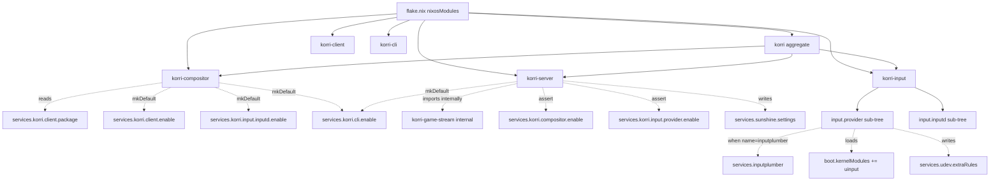

# refactor: Korri NixOS module boundary

## Summary

Collapse the current grab-bag of top-level Korri NixOS modules
(`services.korri.{kiosk, inputd, gameStream, headlessSource, client, server,
cli}`) into one product-level public namespace `services.korri.{client, cli,
compositor, input, server}`, where `compositor` owns the Sway/Wayland
substrate, `compositor.kiosk` is the optional local GUI surface, `input.provider`
+ `input.inputd` are an orthogonal peer sub-tree, and `server.streaming`
replaces `server.streamHost` and gains explicit assertions on compositor +
input.provider. Clean break in one PR: rename in place, update all in-tree
callers and eval fixtures, then update out-of-tree `mountainous/hosts/aka` so
it stops carrying host-local Sway boilerplate and InputPlumber tweaks.

---

## Problem Frame

`mountainous/hosts/aka` currently writes its own `korriSwayStartup` shell
script, a Sway config fragment, a `systemd.tmpfiles` entry, and an inline
Sunshine app registration — all of which is "graphical session substrate"
that `services.korri.kiosk` already owns, but does not expose without also
forcing a local GUI. The runtime symptom that surfaced this drift was aka's
Sunshine session failing with `Gamepad ds5 is disabled due to Permission
denied` because no host-side InputPlumber existed and `/dev/uhid` was
locked. The product-level question is bigger than the bug: aka is meant to
be a Korri-managed appliance, not a manually-tuned desktop host. The current
module boundary doesn't let it be one (see origin: `docs/briefs/2026-05-25-korri-nixos-module-boundary-brief.md`).

---

## Requirements

- R1. One public top-level namespace: `services.korri`. Sub-trees are
  `{client, cli, compositor, input, server}`. Nothing else exposed.
- R2. `services.korri.compositor` owns the Sway/Wayland substrate
  independently of any local GUI surface, so `compositor.enable = true` is
  valid with `compositor.kiosk.enable = false` (the aka shape).
- R3. `services.korri.compositor.kiosk.enable = true` auto-enables
  `services.korri.client.enable` and `services.korri.input.inputd.enable`
  via `mkDefault`, and asserts `services.korri.compositor.enable = true`.
- R4. `services.korri.input` is orthogonal to the compositor. It exposes
  `input.provider.{enable, name, package}` and `input.inputd.{enable, package, ...}`
  as peer options.
- R5. `services.korri.input.provider.{enable = true; name = "inputplumber";}`
  enables `services.inputplumber`, loads the `uinput` kernel module, applies
  udev rules for `/dev/uinput`, and orders downstream consumers after the
  provider service. `uhid` is **not** loaded by default.
- R6. `services.korri.server.streaming` replaces `services.korri.server.streamHost`
  with identical sub-option shapes. `server.streaming.enable = true` asserts
  both `compositor.enable = true` and `input.provider.enable = true`. It does
  **not** touch `input.inputd`.
- R7. `server.streaming` writes a Sunshine config fragment that selects the
  Xbox 360 / `uinput` gamepad backend so InputPlumber-normalized controllers
  are the supported streaming path.
- R8. `services.korri.client` stays as today (standalone install). Sole
  required usage is on its own — no compositor or server needed.
- R9. `services.korri.headlessSource` is deleted; `nix/images/headless.nix`
  uses `services.korri.server` directly (already true in tree).
- R10. `services.korri.gameStream` is removed from the public option surface;
  its option shape is consumed only by `server.streaming` internally.
- R11. The new systemd unit name is `korri-compositor.service` (replacing
  `korri-kiosk.service`). `live-usb-runtime.nix` and any other direct unit
  references are updated.
- R12. Eval-test fixtures are updated to the new option paths. Sobo and
  live-USB effective-config snapshots (Sway config text, systemd unit env,
  udev rules, Sunshine apps, environment.systemPackages) are unchanged
  before/after the refactor.
- R13. `mountainous/hosts/aka` deletes `korriSwayStartup`, the
  `home-manager.users.simonwjackson.xdg.configFile."sway/config"` block, the
  inline `services.sunshine.applications.apps` entry that was acting as a
  Sway-startup hook, and the host-local `systemd.tmpfiles.settings`
  entry for `korriStateRoot`. The final config expresses everything via
  `services.korri.*` declarations only.
- R14. aka boots a Korri-managed Sway session, runs Sunshine with the Korri
  Stream app, normalizes streamed controller input via InputPlumber to
  Xbox 360 over `/dev/uinput`, and streams a known-working game to Moonlight.

---

## Scope Boundaries

- Not introducing backwards-compatible aliases or forwarders. Clean break in
  one PR (see origin: brief Constraints).
- Not owning the upstream Sunshine NixOS service. Korri configures Sunshine's
  `applications` and `settings`; `services.sunshine.enable` stays caller-owned.
- Not introducing a general "compositor adapter" framework. Sway is still
  the only wired backend; `compositor.package` exists for a future swap.
- Not wiring additional `input.provider.name` values today. Only
  `"inputplumber"` is accepted; other names are an assertion target for later.
- Not rewriting `gameStream` or `inputd` runtime code (TypeScript runners,
  shell wrappers, Bun packages). Only the NixOS option surface moves.
- Not touching Sobo Gamescope/runtime work currently in flight on this
  branch (the modified `nix/images/platforms/rocknix-sm8550.nix`,
  `nix/tests/korri-rocknix-sm8550-config-check.nix`, and the
  rocknix-image-eval test fixtures stay as-is for option-path renames only).
- Not changing `server.serviceMode` semantics. The boot-scoped control plane
  pattern documented in `docs/solutions/architecture-patterns/boot-scoped-control-plane-with-session-scoped-runner-2026-05-19.md`
  carries forward unchanged.

### Deferred to Follow-Up Work

- Second `input.provider.name` value (e.g. `"external"`) for hosts that
  supply controller normalization via something other than InputPlumber:
  future follow-up when a second provider appears.
- Renaming `compositor.sway.*` to `compositor.config` (compositor-agnostic):
  defer until a second compositor (Hyprland, niri, etc.) is actually wired.
- Removing the legacy `KORRI_DESKTOP_INPUTD_URL` env var in favor of a
  single `KORRI_NATIVE_BRIDGE_URL`: out of scope; both stay for now.
- Updating any non-aka downstream hosts that consume the old option paths:
  if discovered later, they migrate in follow-up PRs once aka proves the
  shape.

---

## Context & Research

### Relevant Code and Patterns

- `nix/modules/korri-kiosk.nix` — current top-level module that owns the
  Sway substrate + local client surface + input bridge wiring. Splits into
  `korri-compositor.nix` (substrate) and a `compositor.kiosk` sub-tree.
- `nix/modules/korri-server.nix` — current `server` + `server.streamHost`
  module. `streamHost` renames to `streaming`; add new assertions and
  Sunshine config writes.
- `nix/modules/korri-inputd.nix` — current `services.korri.inputd` module.
  Folds into `nix/modules/korri-input.nix` as the `input.inputd` sub-tree.
- `nix/modules/korri-game-stream.nix` — internal-only module already; only
  its consumer (`server.streamHost` block in `korri-server.nix`) is renamed.
- `nix/modules/korri-headless-source.nix` — deleted (already superseded by
  `services.korri.server`, with a warning in place today).
- `nix/modules/korri-client.nix`, `nix/modules/korri-cli.nix` — unchanged
  shape; only the consumers (compositor.kiosk reading `client.package`)
  change.
- `nix/images/kiosk.nix`, `headless.nix`, `live-usb-runtime.nix`,
  `platforms/x86.nix`, `platforms/rocknix-sm8550.nix` — in-tree callers
  that all reference `services.korri.{kiosk,inputd,server.streamHost}.*`
  paths and need to be updated.
- `tools/testing/nix/korri-kiosk-module-eval.{fixture.nix,test.ts}` —
  current eval-test pair for the kiosk module; renames to
  `korri-compositor-module-eval.*` and gains coverage for the
  compositor + kiosk split + `input.inputd` auto-enable + assertion shapes.
- `tools/testing/nix/korri-server-module-eval.{fixture.nix,test.ts}` —
  current eval-test pair for server module; refactor in place to track
  `streamHost` → `streaming` rename and new assertion shapes.
- `tools/testing/nix/korri-rocknix-image-eval.{fixture.nix,test.ts}` —
  rocknix platform image eval. Touches `kiosk.gamescope.package` and
  `kiosk.sway.*`; remaps to `compositor.gamescope.package` and
  `compositor.sway.*` only.
- `nix/tests/korri-rocknix-sm8550-config-check.nix` — config check that
  references option paths; remaps to `compositor.*`.
- `flake.nix` (`nixosModules` block, lines ~647–670) — module export list
  is the public flake API. Add `korri-compositor`, `korri-input`. Remove
  `korri-kiosk`, `korri-inputd`, `korri-headless-source`. Aggregate `korri`
  composes compositor + input + server.
- `mountainous/hosts/aka/default.nix` — out-of-tree consumer; the
  `korriSwayStartup` script, the `home-manager` Sway config block, the
  inline Sunshine app entry, and the `systemd.tmpfiles` entry all get
  deleted. Final shape expresses only `services.korri.*` and
  `mountainous.features.*` toggles.

### Institutional Learnings

- `docs/solutions/architecture-patterns/boot-scoped-control-plane-with-session-scoped-runner-2026-05-19.md`
  — `server.serviceMode` pattern is unchanged. The new
  `server.streaming` still uses the same `system` vs `user` mode and the
  derived runtime path rules.
- `docs/solutions/architecture-patterns/kiosk-foreground-app-policy-over-gamescope-overlay-2026-05-24.md`
  — Foreground app policy lives in the session (now `compositor`), not in
  Gamescope. `compositor.sway.extraConfig` is the contract platform modules
  use to inject device-specific Sway fragments; the new module preserves
  that exact contract.
- `docs/solutions/best-practices/product-owned-composition-keeps-shared-layers-reusable-2026-05-03.md`
  — `gameStream` becoming an internal-only implementation module
  consumed by `server.streaming` is consistent with shared/product boundary
  discipline. Public option surface stays narrow.
- `docs/solutions/workflow-issues/generic-game-stream-runner-validation-contract-2026-05-19.md`
  — Runtime stream-runner validation contract is unchanged; only the NixOS
  options that feed it are renamed.

### External References

- nixpkgs `services.inputplumber` module — implementation must inspect
  upstream before wiring (see Open Questions). The current `pkgs.inputplumber`
  exists in nixpkgs; whether a `services.inputplumber` module exists or
  needs hand-rolling is verified at U3 implementation time.

---

## Key Technical Decisions

- **One public namespace, four product sub-trees.** `services.korri.{client,
  cli, compositor, input, server}`. `gameStream` and `headlessSource` are
  removed from the public surface entirely. (See origin: brief Chosen Shape.)
- **`compositor` as the role name.** Replaces the earlier `session` candidate
  (rejected during shaping for collision with systemd-logind/D-Bus session).
  Names the abstract role; swap-friendly. (See origin: brief Candidate Shapes.)
- **Input is orthogonal.** `input.provider` and `input.inputd` are peer
  sub-options of a top-level `services.korri.input`, not nested under
  `compositor`. (See origin: brief Key Decisions; user correction in
  shaping session.)
- **Clean break migration, no aliases.** All callers update in lockstep in
  one PR. (See origin: brief Constraints.)
- **Sunshine default = Xbox 360 over /dev/uinput.** `server.streaming` writes
  a Sunshine config fragment merging into `services.sunshine.settings` via
  `lib.recursiveUpdate` from inside the module. (See origin: brief
  Sunshine gamepad decision.)
- **`uhid` is NOT loaded by default.** `input.provider` with
  `name = "inputplumber"` loads `uinput` only. A future opt-in could add
  uhid; not in this PR.
- **Composition rules:** assertions for cross-tree preconditions (kiosk →
  compositor, streaming → compositor, streaming → input.provider);
  `mkDefault` for in-tree auto-enable (kiosk → client, kiosk → inputd,
  kiosk → cli, server → cli). Streaming does **not** touch `input.inputd`.
- **New systemd unit name: `korri-compositor.service`.** Replaces
  `korri-kiosk.service`. More accurate for both kiosk and headless aka
  shapes. `live-usb-runtime.nix` `systemd.services."korri-kiosk"` direct
  reference is renamed.
- **New module file layout.**
  - Create: `nix/modules/korri-compositor.nix`,
    `nix/modules/korri-input.nix`.
  - Delete: `nix/modules/korri-kiosk.nix`,
    `nix/modules/korri-inputd.nix`,
    `nix/modules/korri-headless-source.nix`.
  - Refactor in place: `nix/modules/korri-server.nix`,
    `nix/modules/korri-game-stream.nix`,
    `nix/modules/korri-client.nix`,
    `nix/modules/korri-cli.nix`.
- **flake.nix `nixosModules` exports.** Add `korri-compositor`,
  `korri-input`. Remove `korri-kiosk`, `korri-inputd`, `korri-headless-source`.
  Aggregate `korri` imports compositor + input + server (which in turn
  imports cli + client + gameStream-as-internal).
- **`gameStream.nix` stays but becomes internal.** Imported by
  `korri-server.nix` when `server.streaming.enable = true`. Not exported
  from `flake.nix` `nixosModules`. Options remain inside (`uinput.enable`,
  `displayCompat.*`, etc.) and are accessible to advanced consumers, but
  the public path is via `server.streaming.*`.
- **`compositor.sway.*` sub-namespace preserved.** No rename to
  `compositor.config`. Platform Sway fragments still arrive via
  `compositor.sway.extraConfig`; matches the pattern documented in the
  foreground-policy learning.
- **Eval-test fixture strategy:**
  - Rename: `korri-kiosk-module-eval` → `korri-compositor-module-eval`
    (covers compositor + compositor.kiosk + auto-enable + assertions).
  - Refactor in place: `korri-server-module-eval` (tracks `streamHost`
    → `streaming` rename and new cross-module assertions).
  - Add: `korri-input-module-eval` (covers provider full-wiring,
    inputd defaults, name = "inputplumber" behavior).
  - Existing snapshot expectations preserved bit-for-bit for Sobo + live-USB
    shapes (R12).

---

## Open Questions

### Resolved During Planning

- **Where do new module files live?** `nix/modules/korri-compositor.nix`
  and `nix/modules/korri-input.nix`. Old files (`korri-kiosk.nix`,
  `korri-inputd.nix`, `korri-headless-source.nix`) are deleted.
- **flake.nix `nixosModules` export names?** Add `korri-compositor`,
  `korri-input`. Remove the three deleted ones. Aggregate `korri` composes
  compositor + input + server.
- **Does `compositor.sway.*` stay?** Yes. Don't rename until a second
  compositor is actually wired in.
- **Eval-fixture rename strategy?** Kiosk fixture renames to compositor;
  server fixture refactors in place; new input fixture added.
- **Does the systemd unit name change?** Yes. `korri-kiosk.service` →
  `korri-compositor.service`. `live-usb-runtime.nix` updates accordingly.

### Deferred to Implementation

- **Exact `services.inputplumber.*` option shape in current nixpkgs.** The
  implementer at U3 inspects the upstream nixpkgs module. If a usable
  upstream module exists, set `services.inputplumber.enable = true`
  through that. If absent or insufficient (e.g. missing required udev
  rules, missing systemd unit), hand-roll `systemd.services.inputplumber`
  with the `pkgs.inputplumber` binary; document the gap in a comment so it
  can be replaced when nixpkgs catches up. Either path must be covered by
  the `korri-input-module-eval` fixture.
- **Exact Sunshine `settings` key for gamepad backend.** The implementer at
  U4 reads upstream Sunshine docs and the existing
  `services.sunshine.settings` plumbing in nixpkgs; selects the key that
  sets the backend to xbox/uinput. The fixture asserts the resulting
  effective `services.sunshine.settings` value.
- **Whether `input.provider` should expose a `package` knob for selecting a
  non-default `pkgs.inputplumber` build.** Default assumption: yes, follow
  the same convention as other modules (`package = pkgs.inputplumber`).
  Confirmed at U3 implementation.
- **Whether `input.provider.services` (the existing list of platform-owned
  service units) keeps its current shape.** Default assumption: yes — when
  `name = "inputplumber"`, the module manages services itself and the list
  is empty by default; when `name` is something else (future), platforms
  can still declare ordered services.

---

## High-Level Technical Design

> *This illustrates the intended approach and is directional guidance for review, not implementation specification. The implementing agent should treat it as context, not code to reproduce.*

### Module composition graph



### Three concrete consumer shapes

| Consumer | `compositor.enable` | `compositor.kiosk.enable` | `client.enable` | `input.provider.enable` | `input.inputd.enable` | `server.enable` | `server.streaming.enable` |
|---|---|---|---|---|---|---|---|
| Sobo handheld | true | true (auto-enables client + inputd) | true (auto) | true | true (auto) | true | true |
| aka headless | true | false | false | true | false | true | true |
| Desktop install | false | false | true | false | false | false | false |

### Assertion / mkDefault matrix

| Trigger | Assertion | mkDefault auto-enable |
|---|---|---|
| `compositor.kiosk.enable = true` | `compositor.enable = true` | `client.enable`, `input.inputd.enable`, `cli.enable` |
| `server.streaming.enable = true` | `compositor.enable = true` and `input.provider.enable = true` | — (no auto-enable; explicit user intent) |
| `server.enable = true` | — | `cli.enable` |
| `input.provider.enable = true` + `name = "inputplumber"` | `name == "inputplumber"` for now | `services.inputplumber.enable`; `boot.kernelModules += uinput`; udev rules; orders consumers |

---

## Implementation Units

### U1. Eval-test scaffolding for new shape (red tests as spec)

**Goal:** Add new eval-test fixtures that exercise the target option paths
and composition rules. These red tests act as the implementation spec for
U2–U4. Existing passing tests are preserved in place; new tests cover the
new shape.

**Requirements:** R1, R2, R3, R4, R5, R6, R7, R12.

**Dependencies:** None.

**Files:**
- Create: `tools/testing/nix/korri-compositor-module-eval.fixture.nix`
- Create: `tools/testing/nix/korri-compositor-module-eval.test.ts`
- Create: `tools/testing/nix/korri-input-module-eval.fixture.nix`
- Create: `tools/testing/nix/korri-input-module-eval.test.ts`
- Modify: `tools/testing/nix/korri-server-module-eval.fixture.nix`
- Modify: `tools/testing/nix/korri-server-module-eval.test.ts`

**Approach:**
- Mirror the `evaluateWith` helper shape used in
  `korri-kiosk-module-eval.fixture.nix` and `korri-server-module-eval.fixture.nix`.
- Each fixture returns scenarios named after the user-visible config shape
  (`baseline`, `kioskEnabled`, `streamingEnabled`, `providerInputplumber`,
  `streamingWithoutProvider`, `kioskWithoutCompositor`, etc.) so the
  bun test file can assert per-scenario.
- Tests are red until U2–U4 land. Mark with `it.todo()` or use
  `expect(scenario.optionSurface.compositor).toBe(true)` against the
  current build (which will fail) — pick whichever the existing fixture
  style supports without adding new test infrastructure.
- Update `korri-server-module-eval` test names to refer to `streaming`
  instead of `streamHost`. Add scenarios that exercise the new assertion
  shapes (streaming without compositor enabled → assertion failure;
  streaming without provider enabled → assertion failure).
- New `korri-input-module-eval` covers: provider disabled by default;
  enabling with `name = "inputplumber"` turns on `services.inputplumber`,
  adds `uinput` to `boot.kernelModules`, writes udev rules; inputd
  defaults to loopback; inputd's `before` list is empty by default and gets
  `korri-compositor.service` when triggered from compositor.kiosk (verified
  in the compositor fixture, not here).

**Execution note:** Add tests first so U2–U4 can be implemented red→green.

**Patterns to follow:**
- `tools/testing/nix/korri-kiosk-module-eval.fixture.nix` (`evaluateWith`,
  scenario attrset shape, assertion message harvest)
- `tools/testing/nix/korri-server-module-eval.test.ts` (`describe` /
  `it` shape, snapshot-style asserts)

**Test scenarios:**
- Happy path — Compositor enabled with kiosk disabled (aka shape) emits a
  `korri-compositor.service` unit, does not enable inputd, does not enable
  client.
- Happy path — Compositor + kiosk enabled emits `korri-compositor.service`
  and mkDefaults `client.enable`, `input.inputd.enable`, `cli.enable`.
  Sway config text includes the client launcher exec line.
- Happy path — Server.streaming.enable with compositor + provider enabled
  emits Sunshine app entry + Sunshine settings with the xbox gamepad backend
  + uinput udev rules (the last via the provider, not the server).
- Happy path — Input.provider with `name = "inputplumber"` enables
  `services.inputplumber.enable = true`, includes `uinput` in
  `boot.kernelModules`, and writes the documented udev rule for `/dev/uinput`.
- Error path — Compositor.kiosk.enable = true with compositor.enable = false
  fails an assertion mentioning compositor.
- Error path — Server.streaming.enable = true with compositor.enable = false
  fails an assertion mentioning compositor.
- Error path — Server.streaming.enable = true with input.provider.enable =
  false fails an assertion mentioning input.provider.
- Integration — Server.streaming does **not** enable input.inputd
  (inputd.enable stays false in a server-only-with-streaming config).
- Integration — Client.enable = true alone (general desktop install) does
  not start a compositor unit, does not require input.provider, does not
  require a server.
- Edge case — `uhid` is **not** in `boot.kernelModules` when provider is
  enabled with name = "inputplumber".
- Covers R12: snapshot Sobo shape (compositor + kiosk + provider + server +
  streaming) and live-USB shape effective config; assert systemd unit env,
  Sway config text, udev rules, Sunshine apps, and environment.systemPackages
  match the pre-refactor baseline byte-for-byte (modulo unit rename `korri-kiosk`
  → `korri-compositor`).

**Verification:**
- New fixtures evaluate without crashing.
- New TS test file runs (red) under `just test-unit` — every new scenario
  is wired to an expectation, not left as `.todo`.

---

### U2. New `korri-compositor.nix` module

**Goal:** Extract the Sway/Wayland substrate from
`nix/modules/korri-kiosk.nix` into a new `services.korri.compositor` module
with a nested `compositor.kiosk` sub-tree for the local GUI surface.

**Requirements:** R1, R2, R3, R11.

**Dependencies:** U1.

**Files:**
- Create: `nix/modules/korri-compositor.nix`
- Test (consumed): `tools/testing/nix/korri-compositor-module-eval.fixture.nix`,
  `tools/testing/nix/korri-compositor-module-eval.test.ts`

**Approach:**
- Lift everything from `korri-kiosk.nix` that owns substrate concerns
  (user, group, createUser, home, runtimeDir, stateHome, dataHome,
  configHome, environment, path, gamescope.package, sessionBus.{mode,
  address, services}, wants, after, sway.{package, extraPackages,
  extraConfig, configFile}) to `services.korri.compositor.*`.
- Move the per-client launch options (current `kiosk.client.launcher`,
  `kiosk.client.command`) to `services.korri.compositor.kiosk.{launcher,
  command}`.
- Sub-tree `services.korri.compositor.kiosk.enable` is the on-switch for
  the local Korri GUI surface as the default Sway exec.
- The generated systemd unit name is `korri-compositor.service`. It still
  carries the same `wantedBy = [ "multi-user.target" ]`, dbus-run-session
  vs direct-Sway logic, restart policy, and runtime-directory ownership.
- The Sway config is still generated by the module. When
  `compositor.kiosk.enable = true`, the Sway config exec-lines include the
  client launcher; when false, the Sway config still gets `default_border
  none` + extraConfig but no client exec.
- Assertions:
  - `compositor.enable` requires `compositor.user != ""`.
  - `compositor.runtimeDir` must be absolute and live under `/run/`.
  - `compositor.createUser && compositor.user == "root"` is rejected
    (same rule as today's kiosk module).
  - `compositor.sessionBus.mode == "existing"` requires `sessionBus.address`.
  - `compositor.kiosk.enable` asserts `compositor.enable = true`.
- mkDefaults from `compositor.kiosk.enable = true`:
  - `services.korri.client.enable = lib.mkDefault true;`
  - `services.korri.input.inputd.enable = lib.mkDefault true;`
  - `services.korri.cli.enable = lib.mkDefault true;`
- Read `services.korri.client.package` to derive the launcher command
  (same shape as today's `kiosk.client.command` default = `lib.getExe
  config.services.korri.client.package`).
- Import `korri-cli.nix` internally (same stable-key pattern already in
  use; multiple imports of cli.nix dedupe via `_file` + `key`).
- The compositor's session environment includes the `KORRI_DESKTOP_INPUTD_URL`
  and `KORRI_NATIVE_BRIDGE_URL` env vars (today set by kiosk) **only when**
  `compositor.kiosk.enable = true`. When kiosk is off (aka), those env vars
  are omitted because no local Korri client is launched.

**Patterns to follow:**
- `nix/modules/korri-kiosk.nix` (existing option shapes, assertions, sway
  config generation, runtime directory handling, sessionBus modes)
- `nix/modules/korri-cli.nix` (`_file`/`key` stable-key pattern for safe
  multi-import)

**Test scenarios:** (covered by U1 fixtures)
- Happy path — Compositor only (aka): unit exists, sway config has no
  client exec line, env has no `KORRI_DESKTOP_INPUTD_URL`.
- Happy path — Compositor + kiosk (Sobo): unit exists, sway config has
  client exec line, env has `KORRI_DESKTOP_INPUTD_URL`.
- Happy path — `compositor.sway.extraConfig` lines appear verbatim after
  the generated defaults.
- Happy path — `compositor.kiosk.enable = true` mkDefaults
  `client.enable`, `input.inputd.enable`, `cli.enable`.
- Edge case — Creating a managed root compositor user is rejected.
- Edge case — Existing-mode session bus without address is rejected.
- Edge case — Compositor.kiosk.enable with compositor.enable = false is
  rejected.
- Edge case — `compositor.client.command` accepts arguments and they
  appear in the generated launcher script.

**Verification:**
- All U1 compositor scenarios pass.
- Effective Sway config text and systemd unit env for the Sobo and
  live-USB shapes match the pre-refactor baseline (modulo `korri-kiosk` →
  `korri-compositor` unit name).

---

### U3. New `korri-input.nix` module

**Goal:** Create a single module that exposes `services.korri.input.provider.*`
(currently nested under `kiosk.input.provider`) and `services.korri.input.inputd.*`
(currently top-level `services.korri.inputd`). When `provider.name = "inputplumber"`,
the module fully wires InputPlumber.

**Requirements:** R4, R5.

**Dependencies:** U1.

**Files:**
- Create: `nix/modules/korri-input.nix`
- Test (consumed): `tools/testing/nix/korri-input-module-eval.fixture.nix`,
  `tools/testing/nix/korri-input-module-eval.test.ts`

**Approach:**
- Two peer sub-trees inside `services.korri.input`:
  - `provider.{enable, name, services, package?}`
  - `inputd.{enable, package, port, hostname, environment, path, wants,
    after, before}`
- Provider behavior when `enable && name == "inputplumber"`:
  - Set `services.inputplumber.enable = true` if the upstream nixpkgs
    module supports it. Otherwise hand-roll a `systemd.services.inputplumber`
    unit using `pkgs.inputplumber`. **Implementer decision at U3 time**
    based on upstream inspection.
  - Add `"uinput"` to `boot.kernelModules`.
  - Append a documented udev rule for `/dev/uinput` to
    `services.udev.extraRules` (matches the current rule shape in
    `korri-game-stream.nix`).
  - Do **not** touch `uhid`. Document the omission with a comment.
- Provider's `services` list keeps the existing semantics from kiosk:
  callers can list ordered systemd units that downstream consumers should
  wait for. When `name = "inputplumber"`, the module appends
  `inputplumber.service` to the implicit downstream-ordering list.
- Inputd preserves the existing module shape from `korri-inputd.nix` exactly.
  Only the option path changes (`services.korri.inputd.*` →
  `services.korri.input.inputd.*`). Both `KORRI_INPUT_BRIDGE_PORT` and
  `KORRI_INPUT_BRIDGE_HOSTNAME` env vars on the inputd unit are preserved.
- Assertions:
  - `provider.enable && provider.name == null` is rejected.
  - `provider.enable && provider.name != "inputplumber"` emits a warning
    (today's only supported name); allowed to evaluate so callers can
    declare a contract-only provider, but the module will not wire
    anything for unknown names.
- Cross-module wiring (encoded in the compositor and server modules,
  not here):
  - `compositor.kiosk.enable = true` → `input.inputd.enable = mkDefault true`,
    and the compositor unit gets `wants` / `requires` / `after` entries
    for `korri-inputd.service` plus any `input.provider.services`.
  - `server.streaming.enable = true` → asserts `input.provider.enable = true`
    and orders the streaming-affected units after the provider service.

**Patterns to follow:**
- `nix/modules/korri-inputd.nix` (entire unit; options + systemd service
  shape carried forward unchanged)
- The udev rules block in `nix/modules/korri-game-stream.nix` (lines
  around `KERNEL=="uinput"`) for the canonical uinput rule shape
- The provider option shape currently in `nix/modules/korri-kiosk.nix`
  under `kiosk.input.provider` (just lifted, not redesigned)

**Test scenarios:** (covered by U1 fixtures)
- Happy path — `input.provider.enable = false`: no `services.inputplumber`,
  no `boot.kernelModules` change, no udev rule.
- Happy path — `input.provider.enable = true` + `name = "inputplumber"`
  enables `services.inputplumber` (or the hand-rolled systemd service if
  upstream lacks the option), adds `uinput` to `boot.kernelModules`,
  writes the documented udev rule.
- Happy path — `input.inputd.enable = true` emits the `korri-inputd.service`
  unit on `127.0.0.1:3002` by default, with the documented env vars.
- Edge case — `provider.enable = true` with `name = null` fails an assertion.
- Edge case — `provider.enable = true` with `name = "something-else"`
  emits a warning but evaluates.
- Edge case — `uhid` is **not** added to `boot.kernelModules` when
  provider is enabled with name = "inputplumber".
- Integration — When `input.provider.services` is non-empty (e.g.
  platform-owned ordered units), the list is preserved for consumers to
  reference.

**Verification:**
- All U1 input scenarios pass.
- Manually inspect the upstream nixpkgs `services.inputplumber` module
  shape at implementation time; document the choice (use upstream vs hand-roll)
  in a comment block at the top of `korri-input.nix`.

---

### U4. Rewire `korri-server.nix`: streamHost → streaming + assertions + Sunshine gamepad config

**Goal:** Rename `server.streamHost` to `server.streaming`. Add hard
assertions that `server.streaming.enable = true` requires both
`compositor.enable = true` and `input.provider.enable = true`. Make
`server.streaming` write a Sunshine config fragment that selects the
Xbox 360 / `/dev/uinput` gamepad backend.

**Requirements:** R6, R7.

**Dependencies:** U2, U3.

**Files:**
- Modify: `nix/modules/korri-server.nix`
- Modify: `nix/modules/korri-game-stream.nix` (only if internal-only marking
  needs a comment / `_file` change; no API change otherwise)
- Test (consumed): `tools/testing/nix/korri-server-module-eval.fixture.nix`,
  `tools/testing/nix/korri-server-module-eval.test.ts`

**Approach:**
- Rename `services.korri.server.streamHost` → `services.korri.server.streaming`
  in option declarations + all internal references.
- Sub-options carried forward unchanged: `enable`, `appName`, `runtimeDir`,
  `intentPath`, `statusPath`.
- New assertions on `server.streaming.enable`:
  - `services.korri.compositor.enable == true`. Message references
    `services.korri.compositor.enable` and explains streaming needs a
    managed graphical session.
  - `services.korri.input.provider.enable == true`. Message references
    `services.korri.input.provider.enable` and explains streaming needs
    normalized host-side input.
- Sunshine config write: from inside `mkIf cfg.streaming.enable`, set
  `services.sunshine.settings = lib.recursiveUpdate (config.services.sunshine.settings or {}) { <key> = "xbox"; }`
  where `<key>` is the upstream Sunshine setting that selects the gamepad
  backend (implementer verifies the exact key at impl time — see Deferred
  to Implementation). The merge order ensures explicit host-config values
  still win.
- The existing warning about `headlessSource + server` colliding on a port
  is deleted (`headlessSource` is gone in U5).
- The existing services.korri.gameStream wiring (when `streamHost.enable`)
  becomes `when streaming.enable`. No shape change in `korri-game-stream.nix`.
- Remove from this module's option set anything that referenced `streamHost`.
- `server.enable` continues to `mkDefault` `services.korri.cli.enable`.

**Patterns to follow:**
- `nix/modules/korri-server.nix` (current `streamHost` option block + the
  wiring into `services.korri.gameStream` + the `serviceMode`-derived
  runtime path logic — all preserved)
- `lib.recursiveUpdate` use as the canonical NixOS settings merge

**Test scenarios:** (covered by U1 fixtures, mostly via the refactored
`korri-server-module-eval` test)
- Happy path — `server.streaming.enable = true` with `compositor.enable =
  true` and `input.provider.enable = true` evaluates with no failed
  assertions, generates `services.sunshine.applications.apps` with the
  Korri Stream entry, and sets the gamepad backend key in
  `services.sunshine.settings` to xbox.
- Error path — `server.streaming.enable = true` without
  `compositor.enable` fails an assertion that names compositor.
- Error path — `server.streaming.enable = true` without
  `input.provider.enable` fails an assertion that names input.provider.
- Happy path — `server.streaming.runtimeDir`, `intentPath`, and
  `statusPath` defaults behave identically to the current `streamHost.*`
  defaults (system mode → `/run/korri-game-stream`; user mode →
  `%t/korri-game-stream`).
- Edge case — Host config can still override the gamepad backend by
  setting `services.sunshine.settings.<key>` itself; the
  `lib.recursiveUpdate` ordering preserves the override.
- Integration — `server.streaming.enable` does **not** enable
  `input.inputd.enable`. (Verified by checking `services.korri.input.inputd.enable`
  stays at its default `false` in a server-only-with-streaming scenario.)

**Verification:**
- Refactored `korri-server-module-eval` test passes green.
- Effective `services.sunshine.applications.apps` and `services.sunshine.settings`
  match the documented Sobo + aka baselines.

---

### U5. Delete obsolete modules + update `flake.nix` exports

**Goal:** Complete the clean break by deleting `korri-kiosk.nix`,
`korri-inputd.nix`, and `korri-headless-source.nix`. Update `flake.nix`
`nixosModules` exports to add `korri-compositor` and `korri-input`, remove
the deleted modules, and re-aggregate `korri` to compose compositor +
input + server.

**Requirements:** R1, R9, R10.

**Dependencies:** U2, U3, U4.

**Files:**
- Delete: `nix/modules/korri-kiosk.nix`
- Delete: `nix/modules/korri-inputd.nix`
- Delete: `nix/modules/korri-headless-source.nix`
- Modify: `flake.nix` (the `nixosModules = rec { ... }` block around lines 647–670)

**Approach:**
- Update `flake.nix nixosModules`:
  - Add: `korri-compositor = import ./nix/modules/korri-compositor.nix { korri = self; };`
  - Add: `korri-input = import ./nix/modules/korri-input.nix { korri = self; };`
  - Remove: `korri-kiosk`, `korri-inputd`, `korri-headless-source` entries.
  - Update aggregate `korri`:
    ```
    korri = {
      imports = [
        korri-compositor
        korri-input
        korri-server
      ];
    };
    ```
  - `korri-server` continues to import `korri-game-stream` and `korri-cli`
    internally (no change to that pattern).
  - `korri-compositor` imports `korri-client` and `korri-cli` internally.
  - `korri-input` imports `korri-cli` internally (to keep CLI auto-enabled
    when input.inputd.enable is set, matching today's `korri-inputd.nix`
    behavior).
- The default = korri export stays.
- Delete the entire `korri-kiosk.nix`, `korri-inputd.nix`,
  `korri-headless-source.nix` files. Nothing in tree should still
  reference them after U6.

**Patterns to follow:**
- `flake.nix` `nixosModules` block (current rec attrset shape)

**Test scenarios:**
- (Not feature-bearing in itself; the U6 + U7 + module-eval suites prove
  the deletions don't break anything.)
- Test expectation: none — module deletion + flake export update is
  structural plumbing covered by U7's pre/post snapshot comparison and
  the fixture-driven scenarios in U1.

**Verification:**
- `nix flake show .` succeeds.
- `nix flake check` (or `just check`) does not report missing modules.
- `git grep -nE "services\.korri\.(kiosk|inputd|server\.streamHost|headlessSource)"` returns nothing inside `nix/modules/` or `flake.nix`.

---

### U6. Update in-tree image and platform callers

**Goal:** Rewrite every in-tree caller of the old option paths
(`services.korri.{kiosk, inputd, server.streamHost, headlessSource}.*`)
to the new paths (`compositor`, `input.{provider, inputd}`,
`server.streaming`).

**Requirements:** R1–R7, R11.

**Dependencies:** U5.

**Files:**
- Modify: `nix/images/kiosk.nix` (`services.korri.kiosk` → compositor +
  compositor.kiosk; `kiosk.input.required` → `input.provider.enable +
  name`)
- Modify: `nix/images/headless.nix` (no rename here — it already uses
  `services.korri.server.*` — but add `compositor.enable` + `input.provider`
  when the image is intended to host streaming; verify against existing
  use)
- Modify: `nix/images/live-usb-runtime.nix` (all `services.korri.kiosk.*`
  → `services.korri.compositor.*` plus the systemd unit reference
  `systemd.services."korri-kiosk"` → `systemd.services."korri-compositor"`)
- Modify: `nix/images/platforms/x86.nix` (any `services.korri.kiosk.*`,
  `services.korri.inputd.*` references)
- Modify: `nix/images/platforms/rocknix-sm8550.nix` (`kiosk.gamescope.package`
  → `compositor.gamescope.package`; `kiosk.sway.*` → `compositor.sway.*`;
  the existing assertions about the sm8550 Gamescope package update to
  the new path)
- Modify: `nix/tests/korri-rocknix-sm8550-config-check.nix` (option-path
  rename only — same assertions, new paths)
- Modify: `nix/tests/korri-live-usb-config-check.nix` (option-path rename
  only, if it references old paths)

**Approach:**
- Pure path rename. Behavior preserved.
- `nix/images/kiosk.nix` becomes:
  ```nix
  imports = [ ./headless.nix ];
  services.korri.client.enable = lib.mkDefault true;
  services.korri.compositor = {
    enable = true;
    kiosk.enable = true;
  };
  services.korri.input.provider = {
    enable = lib.mkDefault true;
    name = lib.mkDefault "inputplumber";
  };
  ```
  (replacing the current `services.korri.kiosk.input.required = lib.mkDefault true`
  pattern — the new shape declares the provider directly, which is also
  how aka declares it.)
- `nix/images/headless.nix` is already aligned with the new shape (no
  kiosk references). Verify and adjust only if needed for `compositor` /
  `input` semantics when used as a base for stream-host appliances.
- `nix/images/live-usb-runtime.nix` keeps its `systemd.services.<unit>`
  override semantics, but renames the unit key from `"korri-kiosk"` to
  `"korri-compositor"`. The override sets `wantedBy = lib.mkForce [ ]` so
  greetd's session can be the entry point; behavior unchanged.

**Patterns to follow:**
- Existing in-tree image composition (small mkIf blocks over
  `services.korri.*`)

**Test scenarios:** (covered by U7's effective-config snapshot comparison)
- Test expectation: none for this unit in isolation — the test gate is
  U7's snapshot comparison (live-USB, Sobo, rocknix sm8550). Any caller
  that fails to migrate produces an evaluation error caught by `just check`.

**Verification:**
- `just check` passes against trunk after all callers are updated.
- `git grep -nE "services\.korri\.(kiosk|inputd|server\.streamHost|headlessSource)"`
  returns zero matches across `nix/` and `tools/`.
- `nix/images/kiosk.nix` evaluates the Sobo shape.
- `nix/images/headless.nix` evaluates the headless server shape.
- `nix/images/live-usb-runtime.nix` evaluates the live-USB shape; the new
  `korri-compositor.service` unit is wired to greetd correctly.

---

### U7. Update eval-test fixture call sites + confirm snapshot parity

**Goal:** Update every existing fixture that references old option paths
to use new ones, and assert that Sobo + live-USB + rocknix sm8550
effective config snapshots are byte-for-byte identical to pre-refactor
baselines (modulo the `korri-kiosk` → `korri-compositor` unit name and the
new sunshine settings key).

**Requirements:** R12.

**Dependencies:** U6.

**Files:**
- Delete: `tools/testing/nix/korri-kiosk-module-eval.fixture.nix` (replaced
  by `korri-compositor-module-eval.fixture.nix` from U1)
- Delete: `tools/testing/nix/korri-kiosk-module-eval.test.ts` (replaced)
- Modify: `tools/testing/nix/korri-server-module-eval.fixture.nix` (already
  modified in U1 to track `streaming` rename; U7 confirms it covers the
  full pre-refactor snapshot)
- Modify: `tools/testing/nix/korri-rocknix-image-eval.fixture.nix` (option
  paths only — already in the working tree as modified; keep aligned with
  the new paths)
- Modify: `tools/testing/nix/korri-rocknix-image-eval.test.ts` (option
  paths only)
- Read (no change): the existing `nix/tests/korri-live-usb-vm-smoke.nix`
  to verify the live-USB unit boots after the rename. Update only if it
  references the old unit name.

**Approach:**
- Run the existing eval fixtures **before** the refactor lands and capture
  the effective-config outputs for Sobo, live-USB, and rocknix sm8550 as
  expected-baseline JSON snapshots (one-time capture; commit alongside).
- After the refactor lands, the same fixtures rebuilt against the new
  module paths should produce byte-identical outputs except for:
  - Unit key rename `korri-kiosk` → `korri-compositor`.
  - New `services.sunshine.settings.<gamepadBackendKey>` = `"xbox"`.
- Where divergence is found, decide:
  - If divergence is in scope (gamepad backend, unit name) — update the
    expected snapshot.
  - If divergence is out of scope (Sway config text, env vars, udev rules)
    — fix the module, do not update the snapshot.
- Delete old kiosk fixture + test pair last, after the new compositor
  pair fully covers all current behaviors plus the new shape.

**Patterns to follow:**
- The two existing eval-fixture test files use snapshot-style assertions
  already; just keep them aligned to new option paths.

**Test scenarios:**
- Happy path — Sobo full-shape (compositor + kiosk + input.provider +
  server + streaming): the merged effective config snapshot is identical
  to the pre-refactor baseline modulo the unit rename and sunshine
  gamepad backend.
- Happy path — Live-USB shape (greetd-driven compositor with kiosk on)
  matches its baseline modulo the unit rename.
- Happy path — rocknix sm8550 shape (`compositor.gamescope.package`
  pinned, `compositor.sway.*` fragments) matches its baseline.
- Edge case — Running `just test-unit` on a tree with `services.korri.kiosk`
  references still present in any caller produces an explicit evaluation
  error that names the file.

**Verification:**
- `just test-unit` is green.
- Old kiosk fixture/test files are deleted from the working tree.
- Snapshot diff for Sobo + live-USB + sm8550 is empty other than the
  documented unit-rename and gamepad-backend deltas.

---

### U8. Update `mountainous/hosts/aka` (out-of-tree)

**Goal:** Express aka's full streaming-appliance shape via
`services.korri.*` only. Delete the host-local Sway script, the Sway
config fragment in `home-manager`, the inline Sunshine app entry, and
the host-local `systemd.tmpfiles` block.

**Requirements:** R13.

**Dependencies:** U5–U7 landed in the Korri flake; aka pins the updated
Korri input.

**Target repo:** `mountainous` (out-of-tree from this Korri repo).

**Files (in the `mountainous` repo, not this one):**
- Modify: `hosts/aka/default.nix`

**Approach:**
- Delete:
  - The `korriSwayStartup = pkgs.writeShellScript ...` block.
  - The `home-manager.users.simonwjackson.xdg.configFile."sway/config"`
    block (with the `exec_always ${korriSwayStartup}` line). Korri's
    `compositor.sway.extraConfig` is the replacement seam for any
    fragments that genuinely belong on aka (likely none — aka uses
    upstream Sway defaults).
  - The inline `services.sunshine.applications.apps` list entry that was
    serving as the "start sunshine from sway" hook. Sunshine on aka is
    now managed by the user manager started under the Korri compositor.
  - The `systemd.tmpfiles.settings."10-korri-game-stream"` block — the
    Korri server module already manages its runtime dir via
    `RuntimeDirectory` + tmpfiles when in `serviceMode = "system"`.
  - The `mountainous.features.gaming.enable = false` line stays as-is;
    Korri appliance posture supersedes the mountainous gaming preset.
- Replace with:
  ```nix
  services.korri = {
    client.enable = false;                    # aka is headless
    compositor.enable = true;
    compositor.kiosk.enable = false;
    input.provider = {
      enable = true;
      name = "inputplumber";
    };
    server = {
      enable = true;
      serviceMode = "system";
      user = "simonwjackson";
      group = "users";
      host = "0.0.0.0";
      port = korriApiPort;                    # existing local var
      serverId = "aka";
      library.root = korriLibraryRoot;
      publicApiBaseUrl = "http://192.168.1.117:${toString korriApiPort}";
      streamControl.enable = true;
      openFirewall = true;
      advertise = {
        enable = true;
        name = "Korri Stream on aka";
      };
      streaming = {
        enable = true;
        appName = "Korri Stream";
      };
    };
  };
  ```
- `services.sunshine.enable = true; autoStart = false;` stays at the host
  level — Korri does not own the Sunshine module itself, only its
  `applications.apps` entry and `settings.<gamepadBackendKey>`.
- The Sway/greetd login/sway-package configuration on aka should remain
  caller-owned (it's mountainous's responsibility to provide the Sway
  package and login mechanism). The Korri compositor module accepts the
  same Sway package via `compositor.sway.package`.
- `programs.sway.enable = true;` stays — aka's user-login shell still
  needs Sway available, though the Korri-managed `korri-compositor.service`
  is the one that hosts the streaming surface.

**Patterns to follow:**
- The aka mapping example in the brief (Mapping example — aka headless).
- The existing minimal kiosk image (`nix/images/kiosk.nix`) is the in-tree
  reference for the Sobo shape; aka is the headless variant.

**Test scenarios:**
- Test expectation: none in isolation. aka is out-of-tree; verification
  is the boot-and-stream check in U9.

**Verification:**
- `nixos-rebuild build --flake .#aka` on the mountainous host succeeds.
- `git grep` in mountainous for `korriSwayStartup` returns nothing.
- The aka host config file gets visibly shorter (the deletions are
  significant: ~70 lines of host-local Sway/Sunshine glue replaced by
  ~20 lines of Korri options).

---

### U9. Boot-and-stream verification on aka

**Goal:** Confirm the original runtime symptom (Sunshine gamepad failure
on aka) is resolved end-to-end with the new Korri-managed shape.

**Requirements:** R14.

**Dependencies:** U8 deployed to aka.

**Files:** None (operational verification, not code).

**Approach:**
- `nixos-rebuild switch --flake .#aka` against mountainous.
- Verify on aka:
  - `systemctl status korri-compositor.service` — active and running Sway.
  - `systemctl status korri-server.service` — active.
  - `systemctl --user status sunshine.service` — active (started by the
    user manager under the Korri-launched compositor).
  - `systemctl status inputplumber.service` (or the hand-rolled equivalent
    chosen at U3) — active.
  - `lsmod | grep uinput` — `uinput` loaded.
  - `lsmod | grep uhid` — `uhid` **not** loaded by Korri (may be present
    if the kernel auto-loaded it, but Korri doesn't add it).
  - `ls -l /dev/uinput` — accessible to Sunshine's user via the udev rule.
  - Sunshine log on first stream start no longer says
    `Gamepad ds5 is disabled due to Permission denied`. The Xbox 360
    virtual controller appears in `evtest`-style listings.
- From Sobo (the original test client): pair Moonlight to aka, launch the
  Korri Stream app, launch a known-working game (e.g. Neverball), and
  press buttons; verify input reaches the game.

**Test scenarios:**
- Happy path — Moonlight client on Sobo connects to aka, the Korri Stream
  app launches, a controller button press in Moonlight reaches the game
  and produces in-game action.
- Edge case — Restart `korri-compositor.service` while a stream is active:
  the runner cleanup contract behaves as documented in
  `docs/solutions/architecture-patterns/boot-scoped-control-plane-with-session-scoped-runner-2026-05-19.md`.
- Edge case — Reboot aka. After boot:
  - `korri-server.service` is active before login.
  - On user login (or greetd default-session if configured),
    `korri-compositor.service` becomes active.
  - Sunshine pairing and prior library state survive the reboot.

**Verification:**
- Manual confirmation by streaming a game from aka to Sobo and observing
  controller input.
- aka's `journalctl -u korri-server -u korri-compositor -u inputplumber`
  shows no error-level entries for a fresh stream session.

---

## System-Wide Impact

- **Interaction graph:**
  - `services.sunshine.applications.apps` and `services.sunshine.settings`
    are now written by `server.streaming`. Hosts that also wrote those
    fields directly may need a one-line check (`lib.recursiveUpdate`
    preserves their values, but the precedence should be tested).
  - `services.udev.extraRules` gains uinput rules from `input.provider`;
    `services.korri.gameStream`'s existing uinput rules are still present
    (today's module behavior). Two sources writing the same rule format
    is acceptable to udev but the duplicate should be reviewed at U3
    implementation time.
  - `boot.kernelModules` gains `"uinput"` from `input.provider`;
    `services.korri.gameStream.uinput.enable = true` also adds it today.
    Duplication in the list is harmless but consider deduplication.
  - `systemd.services.korri-kiosk` (any external watcher / monitoring /
    log-shipping rule keyed on this unit name) becomes `korri-compositor`.
    Out-of-tree consumers are responsible for updating monitoring keys.
- **Error propagation:** Cross-tree assertions surface at evaluation
  time. Misconfigured hosts (e.g. enabling `server.streaming` without
  `input.provider`) fail `nixos-rebuild` with a Korri-specific message,
  not a runtime stream failure.
- **State lifecycle risks:**
  - The systemd unit rename `korri-kiosk` → `korri-compositor` means
    existing enabled-state symlinks on already-deployed hosts will not
    auto-rename. `nixos-rebuild switch` handles this on activation but a
    documented note should mention "running `systemctl daemon-reload`
    and `systemctl enable korri-compositor.service` may be needed on
    first switch if the old `korri-kiosk.service` had been masked or
    overridden via host-local drop-ins."
  - Sunshine pairing state lives in `~/.config/sunshine` and is
    unaffected.
- **API surface parity:** No RPC, no API, no schema changes. Only NixOS
  option paths change. Generated TypeScript and Effect schemas are
  untouched.
- **Integration coverage:** The U7 snapshot-parity gate is the integration
  test. U9 is the runtime end-to-end gate (aka actually streams to Sobo).
- **Unchanged invariants:**
  - `services.korri.server.serviceMode` semantics (user vs system) and
    the path-derivation rules from the boot-scoped-control-plane learning.
  - The `korri-game-stream-runner` runtime contract — same intent / status
    / lock-file shape; only the NixOS options that feed it are renamed.
  - The Sway extraConfig contract for platform Sway fragments — same
    string-concat into the generated Sway config, just moved from
    `kiosk.sway.extraConfig` to `compositor.sway.extraConfig`.
  - The `korri-inputd` daemon's WebSocket contract and the
    `KORRI_DESKTOP_INPUTD_URL` / `KORRI_NATIVE_BRIDGE_URL` env vars
    consumed by the desktop client are unchanged.
  - The `services.korri.client.package` override seam used by
    `nix/images/platforms/rocknix-sm8550.nix` is unchanged.

---

## Risks & Dependencies

| Risk | Mitigation |
|------|------------|
| Upstream nixpkgs `services.inputplumber` module is absent or has an unfamiliar option shape | U3 inspects upstream first; falls back to a hand-rolled systemd unit if needed. Either path covered by the new eval fixture. Documented in a comment at the top of `korri-input.nix`. |
| Sunshine settings key for gamepad backend selection is not the assumed name | U4 confirms the exact key via upstream Sunshine docs and the nixpkgs Sunshine module options at implementation time. The eval fixture asserts the resulting `services.sunshine.settings` value, catching any mismatch before it reaches aka. |
| Snapshot drift in U7 caused by inadvertent module-level behavior change | Capture pre-refactor baselines first (commit them alongside U1). Any divergence is reviewed by category (in-scope rename/sunshine-key vs out-of-scope). Out-of-scope divergence forces a module fix, not a snapshot update. |
| The systemd unit rename `korri-kiosk` → `korri-compositor` causes activation issues on already-deployed live-USB or Sobo hosts | Documented operational note in U6/U7 verification. Single `nixos-rebuild switch` handles it on healthy hosts; live-USB writes are fresh on every boot so non-issue there. |
| Duplicate `boot.kernelModules += "uinput"` and duplicate uinput udev rules between `input.provider` and `korri-game-stream.nix` | At U3, audit and deduplicate. Either move uinput ownership entirely to `input.provider` (with `gameStream.uinput.enable` becoming a no-op or removed) or document the duplication is harmless. Decision deferred to implementation. |
| aka's existing Sunshine pairing and library data are disrupted by the unit rename or path changes | aka's library root and Sunshine config home are user-scoped paths (`/home/simonwjackson/.config/sunshine`, `/home/simonwjackson/.local/share/korri/library`) — unchanged by this refactor. Verified at U9. |
| Out-of-tree consumers beyond aka exist that we don't know about | Acceptable risk — the brief and migration strategy explicitly accept the clean break. Any discovered downstream consumer is a separate follow-up PR. The flake export removal makes the break loud (eval-time error pointing at the missing module), not silent. |

---

## Phased Delivery

### Phase 1 — Spec + new modules + assertions

- U1: Eval-test scaffolding (red tests as spec).
- U2: `korri-compositor.nix`.
- U3: `korri-input.nix`.
- U4: `korri-server.nix` rewire (streamHost → streaming + assertions +
  Sunshine settings).

End-of-phase gate: U1 fixtures all green; `just test-unit` passes;
`nix flake show .` still lists `korri-kiosk` etc. as exports
(deletion comes in Phase 2).

### Phase 2 — Clean-break callers

- U5: Delete obsolete modules + update `flake.nix`.
- U6: In-tree image and platform caller updates.
- U7: Eval-test caller updates + snapshot parity.

End-of-phase gate: `just check` and `just test-unit` green; no in-tree
references to the old option paths; in-tree Sobo, live-USB, and sm8550
snapshots match the pre-refactor baselines.

### Phase 3 — Out-of-tree + runtime verification

- U8: `mountainous/hosts/aka` rewrite.
- U9: Boot-and-stream verification on aka.

End-of-phase gate: aka streams to Sobo with working controller input.

---

## Alternative Approaches Considered

- **Backwards-compatible aliases with deprecation warnings.** Rejected
  during shaping: doubles the option surface temporarily, lets aka
  migrate on its own clock, but hides the migration intent in a
  warning that's easy to ignore. The clean-break version is louder and
  catches all migration debt at once.
- **Phased migration: rename `streamHost` → `streaming` first, defer
  the kiosk split.** Rejected during shaping: the headless aka shape
  needs the compositor/kiosk split to be a Korri-managed appliance,
  so deferring the kiosk split also defers the aka unblock.
- **`services.korri.session` instead of `services.korri.compositor`.**
  Rejected during shaping: `session` is heavily overloaded in NixOS
  (systemd-logind session, D-Bus session) and doesn't convey "this
  owns the graphical substrate."
- **`role = "kiosk" | "stream-host" | "client"` enum.** Rejected
  during shaping: closed enum is an anti-pattern; real deployments mix
  capabilities (Sobo is both kiosk and stream-host); a mode switch
  hides composition rather than expressing it.
- **Keep `services.korri.kiosk.input.provider` nested inside kiosk.**
  Rejected by the user's correction during shaping: input is
  orthogonal to the compositor, and the streaming path needs the
  provider without the kiosk surface.
- **DS5 / `/dev/uhid` as the default Sunshine gamepad backend.**
  Rejected: aka's failure was specifically a `/dev/uhid` permission
  issue, and InputPlumber normalization to Xbox 360 / uinput is the
  validated working path. uhid stays available as an explicit opt-in
  follow-up if a host actually needs DualSense passthrough.

---

## Documentation / Operational Notes

- Update `flake.nix` `nixosModules` rec block doc comments to reflect
  the new public surface.
- The brief at `docs/briefs/2026-05-25-korri-nixos-module-boundary-brief.md`
  remains the authoritative origin doc; this plan is the implementation
  contract.
- A follow-up institutional learning under `docs/solutions/` is **not**
  requested as part of this plan. If U9 surfaces a non-obvious gotcha
  (e.g. duplicate udev sources, InputPlumber upstream module quirks),
  capture it via `se-compound` post-merge — not pre-emptively here.
- After U9, the original runtime bug ticket / handoff for "Sobo → aka
  Neverball input failure" can be closed.

---

## Sources & References

- **Origin document:** [docs/briefs/2026-05-25-korri-nixos-module-boundary-brief.md](../briefs/2026-05-25-korri-nixos-module-boundary-brief.md)
- Related code:
  - `nix/modules/korri-kiosk.nix`
  - `nix/modules/korri-server.nix`
  - `nix/modules/korri-inputd.nix`
  - `nix/modules/korri-game-stream.nix`
  - `nix/modules/korri-headless-source.nix`
  - `nix/modules/korri-client.nix`
  - `nix/modules/korri-cli.nix`
  - `flake.nix` `nixosModules` block (~lines 647–670)
  - `nix/images/{kiosk.nix, headless.nix, live-usb-runtime.nix}`
  - `nix/images/platforms/{x86.nix, rocknix-sm8550.nix}`
  - `tools/testing/nix/korri-{kiosk,server,rocknix-image}-module-eval.*`
- Related institutional learnings:
  - `docs/solutions/architecture-patterns/boot-scoped-control-plane-with-session-scoped-runner-2026-05-19.md`
  - `docs/solutions/architecture-patterns/kiosk-foreground-app-policy-over-gamescope-overlay-2026-05-24.md`
  - `docs/solutions/best-practices/product-owned-composition-keeps-shared-layers-reusable-2026-05-03.md`
  - `docs/solutions/workflow-issues/generic-game-stream-runner-validation-contract-2026-05-19.md`
- Related prior plans:
  - `docs/plans/2026-05-20-002-refactor-korri-server-control-plane-plan.md`
  - `docs/plans/2026-05-20-003-refactor-korri-server-system-service-plan.md`
- Out-of-tree consumer:
  - `mountainous/hosts/aka/default.nix` (path on the maintainer's machine:
    `/home/simonwjackson/code/github/simonwjackson/mountainous/hosts/aka/default.nix`)
