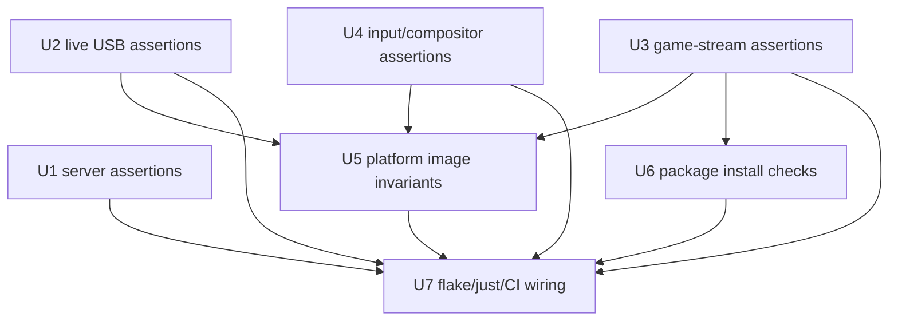
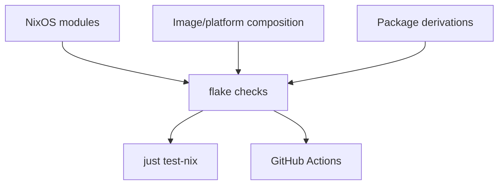

# refactor: Expand native Nix assertion coverage

## Summary

Add the remaining high-value Nix assertion and native-check coverage across Korri's NixOS modules, image/platform compositions, package derivations, and flake validation wiring. The plan keeps invalid configuration failures close to the owning Nix module, verifies composed image/package outputs through native Nix checks, and preserves the post-migration boundary where Bun owns TypeScript tests only.

---

## Problem Frame

The Nix test-runner boundary is now clean, but the assertion catalogue is uneven. Some modules fail closed at evaluation time and have strong `nix/tests/*-check.nix` coverage; other documented contracts still live only in option descriptions, package build assumptions, or composed-image expectations that can drift until runtime or device validation.

The next hardening pass should turn the inventory into a consistent ownership model: module assertions for invalid option shapes, native config checks for composed image/platform invariants, derivation install checks for shipped package contents, and explicit flake/`just` wiring so every intended native check is actually exercised.

---

## Requirements

- R1. Invalid or unsafe NixOS option combinations must fail through the owning module's `assertions` when the module can know the contract at evaluation time.
- R2. Native Nix checks must cover every new assertion with both valid configurations and negative configurations that pin the intended failure message or failure class.
- R3. Composed image/platform invariants for x86 kiosk, live USB, and RockNix/SM8550 must be asserted against evaluated systems, not inferred from individual module defaults alone.
- R4. Package derivations that ship wrappers or generated assets must fail during build/install checks when required binaries, bundled assets, runtime wrappers, or closure expectations are missing.
- R5. Flake check wiring and local/CI orchestration must make the intended native validation set explicit and prevent silent check-file drift.
- R6. The Bun/Nix runner boundary must remain intact: Bun standards tests may inspect repo text, but Nix module/config/build assertions continue to live in `nix/tests/` or derivation checks.
- R7. The hardening pass must not change product runtime behavior except to reject configurations that already violate documented or relied-upon contracts.
- R8. Each assertion/check added by the plan must have an explicit owner classification: module assertion, composed-system check, package install check, flake wiring check, or deeper/manual target build gate.

---

## Scope Boundaries

- Do not add broad Nix abstractions or a shared test framework unless implementation reveals unavoidable duplication that makes checks harder to maintain.
- Do not make physical device validation or QEMU/VM/manual acceptance part of every developer's default fast path unless the target is already part of `just test-nix` and bounded.
- Do not require actual aarch64 RockNix package builds in the always-on x86 validation path unless the repo already has a reliable builder path for that gate; keep target-build coverage explicit if it remains a deeper/manual check.
- Do not revisit product behavior, option names, or module topology unless an assertion exposes a direct contradiction in the current contract.
- Do not create new `docs/solutions/` learning documents as part of this plan; capture that after implementation only if explicitly requested.

### Deferred to Follow-Up Work

- Capture a `docs/solutions/` learning for the native Nix assertion taxonomy once the hardening pass lands and the final ownership boundaries are proven.
- Add real aarch64/RockNix package build gates when local or CI builder capacity is available and the cost is acceptable.
- Broaden runtime foreground-session validation for launched applications; this plan only asserts configuration and packaging prerequisites.

---

## Context & Research

### Relevant Code and Patterns

- `nix/modules/korri-server.nix` already has strong system-mode path, user, runtime-dir, and streaming cross-tree assertions; `publicApiBaseUrl` has a detailed documented security contract but no equivalent assertion catalogue yet.
- `nix/modules/korri-compositor.nix` asserts kiosk/compositor enablement, runtime directory shape, root-user creation safety, and existing session-bus address requirements; nearby path/home and ignored-session-bus combinations are still candidates for hardening.
- `nix/modules/korri-input.nix` asserts provider enablement requires a provider name and wires InputPlumber/uinput behavior; the effective provider-service contract and service-name shape need clearer assertions/tests.
- `nix/modules/korri-game-stream.nix` owns the Sunshine app wrapper and runtime/intent/status path environment; it currently documents several path modes but has no dedicated native module check.
- `nix/images/live-usb-runtime.nix` owns persistence roots, markers, product allowlists, debug SSH, greetd composition, and persistence service environment; this is the most safety-sensitive image module and should fail closed on malformed persistence configuration.
- `nix/images/platforms/x86.nix` and `nix/images/platforms/rocknix-sm8550.nix` encode platform facts and kiosk assumptions that should stay local to platform modules and be verified through composed-system checks.
- `nix/korri-cli.nix` and `nix/korri-server.nix` already use `doInstallCheck` to prevent shipping `node_modules` and to smoke wrapper behavior; `nix/korri-inputd.nix`, `nix/korri-game-stream.nix`, and `nix/korri-portal.nix` have weaker package-output checks.
- `nix/korri-desktop/unwrapped.nix`, `nix/korri-desktop/wrap.nix`, and `nix/tests/korri-desktop-build-graph-check.nix` are the existing pattern for defensive Electrobun output validation and wrapper graph assertions.
- `nix/tests/korri-compositor-module-check.nix`, `nix/tests/korri-input-module-check.nix`, and `nix/tests/korri-server-module-check.nix` are the preferred native module-check pattern: evaluate real NixOS modules, inspect `config.assertions` for expected failures, assert emitted unit shape, then return a small `pkgs.runCommand` success derivation.
- `nix/tests/korri-image-outputs-check.nix`, `nix/tests/korri-live-usb-config-check.nix`, and `nix/tests/korri-rocknix-sm8550-config-check.nix` are the preferred composed-image checks.
- `flake.nix`, `justfile`, and `.github/workflows/desktop-stage2.yml` own the native validation target set after the Bun/Nix runner split.

### Institutional Learnings

- `docs/solutions/architecture-patterns/boot-scoped-control-plane-with-session-scoped-runner-2026-05-19.md` establishes the fail-closed NixOS module posture: unsafe path/user/runtime-dir shapes should fail during evaluation, while intentionally risky exposure may remain a warning.
- `docs/solutions/workflow-issues/generic-game-stream-runner-validation-contract-2026-05-19.md` reinforces that the stream runner's runtime, intent, and status paths must converge around one trusted runtime directory.
- `docs/solutions/architecture-patterns/kiosk-foreground-app-policy-over-gamescope-overlay-2026-05-24.md` reinforces that platform modules should preserve a clean split between session foreground policy and Gamescope/app launch policy.
- `docs/solutions/integration-issues/electrobun-linux-flat-bundle-2026-05-01.md` and related Electrobun learnings justify defensive derivation checks: third-party build tools can report success while omitting required runtime files.
- `docs/solutions/best-practices/prefer-real-implementations-over-mocks-2026-05-02.md` supports native Nix evaluation/build checks over mocked or wrapper-owned assertions.

### External References

- External research was not needed. The repo already has current native Nix check patterns and the work is a project-internal hardening/refactor.

---

## Key Technical Decisions

| Decision | Rationale |
|---|---|
| Put invalid option-shape protection in module `assertions`. | Module consumers should fail at evaluation time even outside this repo's flake checks. |
| Put composed-system invariants in `nix/tests/*-check.nix`. | Platform/image contracts often emerge only after modules are composed; native checks can evaluate final systems without changing module behavior. |
| Put package-output contracts in derivation `installCheckPhase` where feasible. | Missing wrapper binaries, bundled assets, or accidental `node_modules` copies should fail the package build itself. |
| Prefer one Standard native gate over duplicated target lists. | `flake.nix`, `just test-nix`, and CI should not each maintain independent check lists; a native aggregate gate keeps the default validation set explicit while reducing drift. |
| Use the right Nix evaluation depth for negative cases. | `config.assertions` inspection is right for assertion-message tests; forced toplevel evaluation is needed for option type errors, defaults that `throw`, or platform selection failures that do not materialize as assertion records. |
| Treat default validation and deep target builds separately. | x86 eval/config checks should stay always-on; expensive ISO or aarch64 target builds can be explicit deeper gates unless the repo already runs them reliably. |

---

## Open Questions

### Resolved During Planning

- Should this be one plan or separate plans per module? One cohesive refactor plan, because the assertion ownership taxonomy and check wiring need to land together.
- Should the plan reintroduce Bun tests for Nix check inventory? No. Any check inventory that reasons about Nix checks should be native Nix or repo-text-only standards coverage that does not execute Nix through Bun.
- Should all invalid configurations be module assertions? Yes when the owning module can know the invalid shape; composed image expectations remain native checks.
- Should actual aarch64 RockNix builds be required by default? No unless implementation confirms a reliable local/CI builder path; eval/config coverage remains in scope and target-build coverage stays explicit.
- Should negative native checks always inspect `config.assertions`? No. Use `config.assertions` for module assertions, but force toplevel evaluation for type/default/platform failures that only appear when Nix realizes the system derivation.

### Deferred to Implementation

- Exact helper shape for URL classification in `nix/modules/korri-server.nix`; implementation should choose the simplest Nix expression that keeps assertion messages readable.
- Whether `productAllowlist` should become a consumed resolver contract is deferred. Current hardening should not claim custom allowlist runtime safety unless implementation also serializes it into the resolver contract with resolver behavior tests.
- Whether package smoke checks can safely execute `--version`/`--help` flags for `korri-inputd` and `korri-game-stream`; if not, assert wrapper and bundled-file shape without starting long-running daemons.
- Final always-on `just test-nix` target set after implementation measures package/check cost locally.

---

## High-Level Technical Design

> *This illustrates the intended approach and is directional guidance for review, not implementation specification. The implementing agent should treat it as context, not code to reproduce.*

Use an assertion ownership matrix so each invariant has one primary home and one verification path:

| Invariant kind | Primary owner | Verification path |
|---|---|---|
| Single-module invalid option shape | Owning `nix/modules/*.nix` assertion | Module check under `nix/tests/` |
| Cross-module prerequisite | Module assertion closest to the enabling option | Module check plus composed image check when platform-specific |
| Platform/image final shape | `nix/tests/*image*` or platform config check | Flake check built by `just test-nix` / CI |
| Package output / wrapper contract | Derivation `installCheckPhase` | Package build or package-output native check |
| Flake/check target drift | Single native Standard gate plus boundary standards coverage | `just test-nix` and CI invoke the same gate |
| Expensive target buildability | Explicit deep/manual Nix build gate | Follow-up or non-default validation target |

Implementation dependencies:

---

## Implementation Units

### U1. Server URL and exposure contract assertions

**Goal:** Enforce the documented `services.korri.server.publicApiBaseUrl` contract and related exposure warnings at Nix evaluation time.

**Requirements:** R1, R2, R6, R7

**Dependencies:** None

**Files:**
- Modify: `nix/modules/korri-server.nix`
- Test: `nix/tests/korri-server-module-check.nix`

**Approach:**
- Add module assertions for `publicApiBaseUrl` only when it is set.
- Mirror the existing runtime validator and tests in `korri/products/app/api/library/list.rpc-handler.ts` rather than inventing a parallel URL policy in Nix.
- Enforce the documented shared shape: absolute HTTP(S) URL, no whitespace, no credentials, no query, no fragment, and HTTPS required outside the host classes the runtime already accepts for HTTP.
- Do not expand trusted HTTP host classes in this refactor; if Tailscale/CGNAT, IPv6 ULA, or other VPN ranges need HTTP support, update runtime and Nix parity tests together.
- Keep the existing firewall/global-exposure warning posture unless a combination is already documented as invalid.
- Keep error messages option-specific and value-specific enough for native checks to pin the contract.

**Execution note:** Add negative assertion cases before changing the module so the missing contract is visible first.

**Patterns to follow:**
- `nix/modules/korri-server.nix` existing path and system-mode assertions.
- `korri/products/app/api/library/list.rpc-handler.ts` runtime `publicApiBaseUrl` validation behavior.
- `nix/tests/korri-server-module-check.nix` existing `korriFailedAssertions` and expected-message scenarios.

**Test scenarios:**
- Happy path: `publicApiBaseUrl = null` keeps existing valid server configs assertion-clean.
- Happy path: loopback HTTP, runtime-accepted private/link-local HTTP, `.local` HTTP, `.lan` HTTP, and public HTTPS URLs pass.
- Error path: public HTTP URL fails with a message that public hosts require HTTPS.
- Error path: URL with username/password fails with a message that credentials are not allowed.
- Error path: URL with query string or fragment fails with a message that query/fragment data is not allowed.
- Edge case: malformed URL-like strings and URLs with leading/trailing whitespace fail clearly rather than silently becoming environment variables.
- Integration: system-mode and user-mode server units only expose `KORRI_PUBLIC_API_BASE_URL` when the asserted URL is valid.

**Verification:**
- Valid server module scenarios still have no failed Korri assertions.
- Invalid URL scenarios fail through `config.assertions` with intentional messages.
- Existing server streaming, tmpfiles, and firewall warning tests still pass unchanged.

---

### U2. Live USB persistence safety assertions

**Goal:** Fail closed on malformed live USB persistence roots, markers, scopes, and currently consumed persistence configuration.

**Requirements:** R1, R2, R3, R6, R7

**Dependencies:** None

**Files:**
- Modify: `nix/images/live-usb-runtime.nix`
- Test: `nix/tests/korri-live-usb-config-check.nix`
- Test: `nix/tests/korri-live-usb-invalid-artifact-check.nix`
- Create or modify: `nix/tests/korri-live-usb-persistence-config-check.nix`
**Approach:**
- Add assertions for absolute `root` and `bootMountPoint` paths.
- Assert persistence markers are non-empty relative names, not absolute paths or traversal paths.
- Assert derived `scope` remains consistent with `artifact`: product uses the allowlist scope, developer uses broad scope.
- Treat `productAllowlist` carefully: verify the internally generated product entries remain safe and consistent, but do not claim user-supplied allowlist entries protect runtime behavior unless implementation also wires the allowlist into the resolver contract.
- Choose the negative-check depth intentionally: assertion-message cases can inspect `config.assertions`, while invalid enum/type/default cases should force the evaluated system far enough to prove the failure actually triggers.
- Keep resolver behavior checks in `nix/tests/korri-live-usb-persistence-resolver-check.nix`; this unit focuses on NixOS configuration shape unless the allowlist is explicitly made part of the resolver input.

**Execution note:** Start from negative NixOS evaluations for each malformed persistence input.

**Patterns to follow:**
- `nix/tests/korri-live-usb-invalid-artifact-check.nix` for invalid live USB configuration evaluation.
- `nix/tests/korri-live-usb-config-check.nix` for final service environment and image composition assertions.

**Test scenarios:**
- Happy path: product live USB config has `product-allowlist` scope, absolute persistence root, generated safe product entries, and no failed assertions.
- Happy path: developer live USB config has `developer-broad` scope and no failed assertions.
- Error path: relative persistence root fails.
- Error path: relative boot mount point fails.
- Error path: absolute marker path, empty marker, or marker containing traversal fails.
- Error path: custom product allowlist entries are not treated as runtime safety coverage unless the resolver consumes them; if implementation keeps the allowlist internal, tests should pin the generated entries instead of adding false user-entry coverage.
- Error path: unsupported artifact/scope combinations fail at the correct evaluation depth.
- Integration: persistence service environment still matches the artifact/scope contract after assertions are added.

**Verification:**
- Live USB valid product/developer checks pass.
- Each invalid persistence shape fails during native Nix evaluation with a focused assertion message.
- Resolver shell behavior checks remain owned by the existing resolver check.

---

### U3. Game-stream module path and Sunshine app assertions

**Goal:** Add a dedicated native assertion catalogue for `services.korri.gameStream` so runtime, intent, status, session environment, and Sunshine app wiring cannot drift silently.

**Requirements:** R1, R2, R6, R7

**Dependencies:** None

**Files:**
- Modify: `nix/modules/korri-game-stream.nix`
- Create: `nix/tests/korri-game-stream-module-check.nix`

**Approach:**
- Add assertions for non-empty `appName`, supported path forms, and explicit runtime/intent/status path convergence.
- Decide whether `%h` is supported for `sessionEnvFile`; if not supported by the wrapper, assert against it or update the documentation to avoid promising it.
- Assert explicit `intentPath` and `statusPath` live under `runtimeDir` when both are set to concrete paths.
- Assert the emitted Sunshine app points at the generated wrapper from the same module evaluation, not an externally stale command.
- Keep root-user runtime refusal in the wrapper as runtime defense; do not try to model the runtime user in pure Nix unless the module owns it.

**Execution note:** Characterize current emitted Sunshine app shape first, then add negative assertions for unsupported path forms.

**Patterns to follow:**
- `nix/tests/korri-server-module-check.nix` streaming path assertions.
- `docs/solutions/workflow-issues/generic-game-stream-runner-validation-contract-2026-05-19.md` path-convergence guidance.

**Test scenarios:**
- Happy path: default enabled game stream emits one Sunshine application with the expected app name and wrapper command.
- Happy path: concrete absolute runtime/intent/status paths under the same runtime directory pass.
- Happy path: supported user-runtime specifier forms pass in user/session contexts if the wrapper supports them.
- Error path: empty `appName` fails.
- Error path: unsupported placeholder forms fail with messages naming the offending option.
- Error path: explicit intent path outside explicit runtime directory fails.
- Error path: explicit status path outside explicit runtime directory fails.
- Integration: disabling `sunshine.enableApp` suppresses the Sunshine application without disabling package installation or wrapper generation assumptions that remain valid.

**Verification:**
- New `korri-game-stream-module` flake check passes.
- Server streaming checks still pass when they enable `services.korri.gameStream` through `services.korri.server.streaming`.
- Invalid game-stream configs fail through native Nix assertions.

---

### U4. Input and compositor cross-tree assertion cleanup

**Goal:** Make input provider ordering, compositor path shape, and session-bus ownership assumptions explicit in module assertions and native checks.

**Requirements:** R1, R2, R6, R7

**Dependencies:** None

**Files:**
- Modify: `nix/modules/korri-input.nix`
- Modify: `nix/modules/korri-compositor.nix`
- Test: `nix/tests/korri-input-module-check.nix`
- Test: `nix/tests/korri-compositor-module-check.nix`

**Approach:**
- Assert and document the current provider-service contract without reworking topology: `provider.services` remains caller-supplied platform ordering, and platform modules may continue listing `inputplumber.service` where the compositor must wait for it.
- Add assertions or warnings for malformed provider service names, choosing assertion when an invalid service name cannot work and warning when it is merely unusual.
- Add compositor assertions for absolute `home`, `configHome`, `dataHome`, and `stateHome` paths when the compositor is enabled.
- Add a non-empty kiosk command assertion when the kiosk surface is enabled.
- Add an assertion or warning for `sessionBus.address` being set while `sessionBus.mode = "private"`, depending on whether ignored values should be rejected or treated as suspicious but allowed.
- Defer centralizing implicit InputPlumber ordering unless implementation first proves the current duplicated platform declarations contradict the module contract.

**Execution note:** Use existing module-check scenarios rather than introducing platform images for pure module contracts.

**Patterns to follow:**
- `nix/modules/korri-compositor.nix` existing kiosk cross-tree assertion outside the `cfg.enable` gate.
- `nix/modules/korri-input.nix` provider/inputd peer-subtree structure.
- `nix/tests/korri-input-module-check.nix` and `nix/tests/korri-compositor-module-check.nix` emitted unit shape checks.

**Test scenarios:**
- Happy path: InputPlumber provider configs keep inputd ordering and platform-declared compositor ordering intact.
- Happy path: external provider service configs still forward platform-owned services to downstream consumers.
- Error path: provider services with unsupported service-unit shape fail or warn according to the chosen ownership rule.
- Error path: compositor enabled with relative home/config/data/state paths fails.
- Error path: kiosk enabled with empty kiosk command fails.
- Edge case: private session bus with no address remains valid.
- Edge case: existing session bus still requires a non-empty address and keeps platform service ordering.
- Integration: x86 and RockNix platform checks still see the expected provider/compositor ordering without requiring an ordering refactor.

**Verification:**
- Input and compositor module checks pass with expanded positive/negative scenarios.
- Platform ordering remains explicit and verified unless implementation proves a safe internal effective-service seam is needed and in scope.
- Existing server streaming cross-tree assertions remain intact.

---

### U5. Platform and image invariant checks

**Goal:** Strengthen x86 kiosk, live USB, and RockNix/SM8550 composed-system checks so platform-specific assumptions stay local and fail loudly.

**Requirements:** R2, R3, R5, R6, R7

**Dependencies:** U2, U3, U4

**Files:**
- Modify: `nix/images/platforms/x86.nix`
- Modify: `nix/images/platforms/rocknix-sm8550.nix`
- Test: `nix/tests/korri-image-outputs-check.nix`
- Test: `nix/tests/korri-live-usb-config-check.nix`
- Test: `nix/tests/korri-rocknix-sm8550-config-check.nix`

**Approach:**
- Keep hardware facts in platform modules, and extend existing hardware-fact hygiene checks so generic image modules stay device-agnostic.
- For x86 kiosk compositions, verify seat/input/video/render group expectations, seatd/InputPlumber defaults, Moonlight environment defaults, and mDNS/firewall expectations where already part of the contract.
- For RockNix/SM8550, assert the evaluated target system/platform shape, root-owned compositor contract, `/storage` state/cache/data ownership assumptions, `/run/user/0` runtime/session-bus contract, SM8550 Gamescope version/package contract, and Moonlight/InputPlumber package choices.
- Preserve the existing x86-hosted evaluation gate for RockNix configs; do not assert that the local check runner is aarch64.
- Keep actual aarch64 package buildability as an explicit deeper gate unless implementation confirms the repo can run it reliably in the default validation environment.
- In the check output or comments, distinguish always-on x86 eval coverage from any optional target-build coverage so a passing default check is not mistaken for proof that SM8550 packages were built.

**Execution note:** Prefer composed-system checks first; only add platform-module assertions for documented platform contracts. Defer new invalid-override behavior unless the override already contradicts an explicit platform invariant.

**Patterns to follow:**
- `nix/tests/korri-image-outputs-check.nix` image summary and hardware-fact checks.
- `nix/tests/korri-rocknix-sm8550-config-check.nix` SM8550 environment, package, target, and alias checks.
- `docs/solutions/architecture-patterns/kiosk-foreground-app-policy-over-gamescope-overlay-2026-05-24.md` session-vs-Gamescope boundary.

**Test scenarios:**
- Happy path: x86 kiosk image has compositor, client, input provider, inputd, seatd, and expected Moonlight defaults.
- Happy path: live USB product/developer images retain persistence and kiosk expectations after U2 assertions.
- Happy path: RockNix Thor, Odin2 Portal, and compatible-selected systems retain root compositor, `/storage` homes, `/run/user/0` runtime, existing session bus, SM8550 Gamescope, and v4l2m2m Moonlight environment.
- Edge case: x86-hosted checks can still evaluate RockNix config while proving the evaluated target system remains aarch64.
- Error path: documented RockNix platform contract violations fail only when tied to an explicit platform invariant, not merely because an override differs from today's defaults.
- Integration: generic image source files remain free of RockNix/SM8550 hardware facts.
- Integration: package/app/check aliases expected by downstream image consumers remain present.

**Verification:**
- Existing image output, live USB, and RockNix checks pass with expanded assertion coverage.
- Platform-specific contract violations fail in native checks with clear messages.
- No generic module or image file gains SM8550/x86 hardware facts outside the platform layer.

---

### U6. Package derivation install and output checks

**Goal:** Bring package-output validation for `korri-inputd`, `korri-game-stream`, and `korri-portal` closer to the defensive checks already used by CLI, server, and desktop packaging.

**Requirements:** R2, R4, R5, R6, R7

**Dependencies:** U3

**Files:**
- Modify: `nix/korri-inputd.nix`
- Modify: `nix/korri-game-stream.nix`
- Modify: `nix/korri-portal.nix`
- Create or modify: `nix/tests/korri-package-outputs-check.nix`

**Approach:**
- Add `doInstallCheck` coverage where a derivation can cheaply prove its output contract.
- For Bun-bundled daemon packages, assert expected `bin/` wrappers and bundled JS files exist and `node_modules` is not shipped in `$out`.
- For portal output, assert `index.html` plus expected built asset categories exist so a broken Vite build cannot ship an empty portal.
- Keep desktop derivation changes out of this unit unless implementation discovers a concrete missing desktop package-output assertion; existing desktop checks should remain as verification and pattern references.
- Avoid executing long-running daemons in install checks unless a safe module-load or version/help path exists.
- Treat negative package-output coverage differently from module assertions: install checks are mandatory guards on the real derivation, while intentionally broken package fixtures are optional and should only be added if they prove the real guard without creating brittle fake packages.

**Execution note:** Add package-output checks one derivation at a time to keep failures attributable.

**Patterns to follow:**
- `nix/korri-cli.nix` and `nix/korri-server.nix` `doInstallCheck` style.
- `nix/korri-desktop/unwrapped.nix` required-artifact postcondition loop.
- `nix/electrobun-binaries.nix` tarball content assertions.

**Test scenarios:**
- Happy path: `korri-inputd` output contains the inputd wrapper and bundled JS and does not ship `node_modules`.
- Happy path: `korri-game-stream` output contains runner and enqueue wrappers, bundled JS, and no `node_modules`.
- Happy path: `korri-portal` output contains `index.html` and built assets expected by desktop packaging.
- Happy path: existing desktop host/device/x86-kiosk wrapper checks still pass without expanding desktop package scope.
- Error path: real derivation install checks fail with package-specific messages if required outputs are absent; intentionally broken fixtures are optional and should not replace real derivation guards.
- Integration: package-output flake check depends on actual package derivations, not mocked filesystem trees.

**Verification:**
- Package builds fail when required outputs are absent.
- New package-output native check passes in `just test-nix`.
- Existing desktop build graph check remains green and continues to guard host/device/x86-kiosk variant boundaries.

---

### U7. Native Standard gate, flake wiring, and CI/local orchestration

**Goal:** Make the native validation target set explicit through one Standard native gate so local and CI commands exercise the same intended boundary without duplicated check lists.

**Requirements:** R2, R5, R6, R7, R8

**Dependencies:** U1, U2, U3, U4, U5, U6

**Files:**
- Modify: `flake.nix`
- Modify: `justfile`
- Modify: `.github/workflows/desktop-stage2.yml`
- Modify: `tools/testing/standards/test-suite-partitioning.test.ts`
- Create: `nix/tests/korri-standard-native-check.nix`

**Approach:**
- Wire every new native check through `checks.x86_64-linux` or the appropriate system-specific check set.
- Add a native Standard aggregate check that depends on the intended default validation derivations directly; avoid recursively proving success by inspecting only check attr existence.
- Keep a small owner matrix inside the aggregate check inputs or comments so every included check is classified as module, composed-system, package-output, flake-wiring, or deeper/manual coverage.
- Keep `just test-nix` as the local native Nix validation entrypoint and make it invoke the Standard aggregate gate rather than duplicating the individual target list.
- Keep expensive/deeper gates explicit if they require ISO builds, VM boot, or target/aarch64 builds beyond the default validation budget.
- Update CI to invoke the same Standard native gate that local validation relies on.
- Keep the TypeScript standards test focused on repo test-suite partitioning and package-script boundaries; do not make Bun execute or own Nix assertions.

**Execution note:** Wire after the producing checks exist so `flake.nix` can point at real files and `just test-nix` failures are attributable.

**Patterns to follow:**
- Existing `flake.nix` `checks` blocks for module and x86-only checks.
- Existing `justfile` `test-nix` boundary from the native Nix migration.
- `tools/testing/standards/test-suite-partitioning.test.ts` runner-boundary assertions.

**Test scenarios:**
- Happy path: all new native checks are exposed under the intended flake check set and included in the Standard aggregate when they are part of default validation.
- Happy path: `just test-nix` invokes the Standard native gate without invoking Bun.
- Happy path: CI workflow invokes the same Standard native gate for Nix assertions.
- Error path: removing an expected default check from the Standard aggregate fails the aggregate or its owner-matrix assertion.
- Error path: reintroducing `bun test tools/testing/nix` in `justfile`, package scripts, or CI is caught by standards coverage.
- Edge case: system-specific checks do not evaluate unsupported package/platform combinations on systems where the packages are intentionally unavailable.

**Verification:**
- `just test-nix` runs the Standard native gate and passes.
- `just test-unit` remains TypeScript-only and passes.
- CI workflow mirrors the native boundary without stale Bun-wrapped Nix commands.
- Every new check file has an intentional flake exposure, aggregate-gate inclusion, or a documented reason it is a deeper/manual target.

---

## System-Wide Impact

- **Interaction graph:** NixOS modules own option-shape validity; image checks own final composed-system invariants; derivations own shipped output contracts; flake/`just`/CI own validation orchestration.
- **Error propagation:** Invalid configurations should fail during Nix evaluation with clear module assertion messages; missing package outputs should fail during derivation build/install checks; wiring drift should fail as a native flake check or standards test.
- **State lifecycle risks:** Live USB persistence and game-stream runtime paths are the stateful surfaces most likely to cause destructive or trust-boundary failures if malformed; these receive dedicated negative checks.
- **API surface parity:** `nixosModules`, package aliases, app outputs, and check names that downstream users consume should be verified before cleanup removes or renames them.
- **Integration coverage:** Module checks prove isolated contracts; image checks prove composed contracts; package checks prove installed artifacts. No single layer is treated as sufficient for all invariants.
- **Unchanged invariants:** Bun remains the TypeScript test runner only; native Nix remains responsible for Nix module/config/build assertions. Product UI/API behavior should not change.

---

## Risks & Dependencies

| Risk | Mitigation |
|---|---|
| Assertion hardening rejects a configuration that was intentionally supported but undocumented. | Add negative checks only for documented or relied-upon contracts; route ambiguous cases to warnings or implementation-deferred decisions. |
| `just test-nix` becomes too slow if package/image builds are added indiscriminately. | Classify Standard versus deep targets and keep expensive/aarch64/ISO gates explicit unless already bounded. |
| The Standard gate becomes another drift-prone list instead of reducing drift. | Make `just test-nix` and CI invoke the aggregate gate directly, and keep deeper/manual targets explicitly outside that default set. |
| Negative checks pass because Nix did not force the failing expression deeply enough. | Match check strategy to failure type: inspect assertion records for module assertions and force toplevel derivation evaluation for type/default/platform errors. |
| Platform assertions duplicate facts that should live in shared modules. | Keep hardware facts in `nix/images/platforms/*` and use image checks for composed outcomes. |
| Package install checks accidentally start long-running daemons. | Prefer filesystem/wrapper assertions; only run safe `--version`/`--help` smokes where known. |
| URL validation in Nix becomes too clever or brittle. | Keep validation scoped to the documented contract and cover representative valid/invalid examples in module checks. |

---

## Documentation / Operational Notes

- No user-facing documentation change is required for the assertion hardening itself.
- If implementation changes `just test-nix` target cost materially, update nearby recipe comments so developers understand the Standard versus deeper validation split.
- After the work lands, consider a separate `se-compound` pass to document the assertion taxonomy and native Nix check boundary.

---

## Sources & References

- Related plan: `docs/plans/2026-05-25-002-refactor-native-nix-test-boundary-plan.md`
- Related code: `nix/modules/korri-server.nix`
- Related code: `nix/modules/korri-compositor.nix`
- Related code: `nix/modules/korri-input.nix`
- Related code: `nix/modules/korri-game-stream.nix`
- Related code: `nix/images/live-usb-runtime.nix`
- Related code: `nix/images/platforms/x86.nix`
- Related code: `nix/images/platforms/rocknix-sm8550.nix`
- Related code: `nix/tests/korri-server-module-check.nix`
- Related code: `nix/tests/korri-image-outputs-check.nix`
- Related code: `nix/tests/korri-rocknix-sm8550-config-check.nix`
- Institutional learning: `docs/solutions/architecture-patterns/boot-scoped-control-plane-with-session-scoped-runner-2026-05-19.md`
- Institutional learning: `docs/solutions/workflow-issues/generic-game-stream-runner-validation-contract-2026-05-19.md`
- Institutional learning: `docs/solutions/architecture-patterns/kiosk-foreground-app-policy-over-gamescope-overlay-2026-05-24.md`
- Institutional learning: `docs/solutions/best-practices/prefer-real-implementations-over-mocks-2026-05-02.md`
