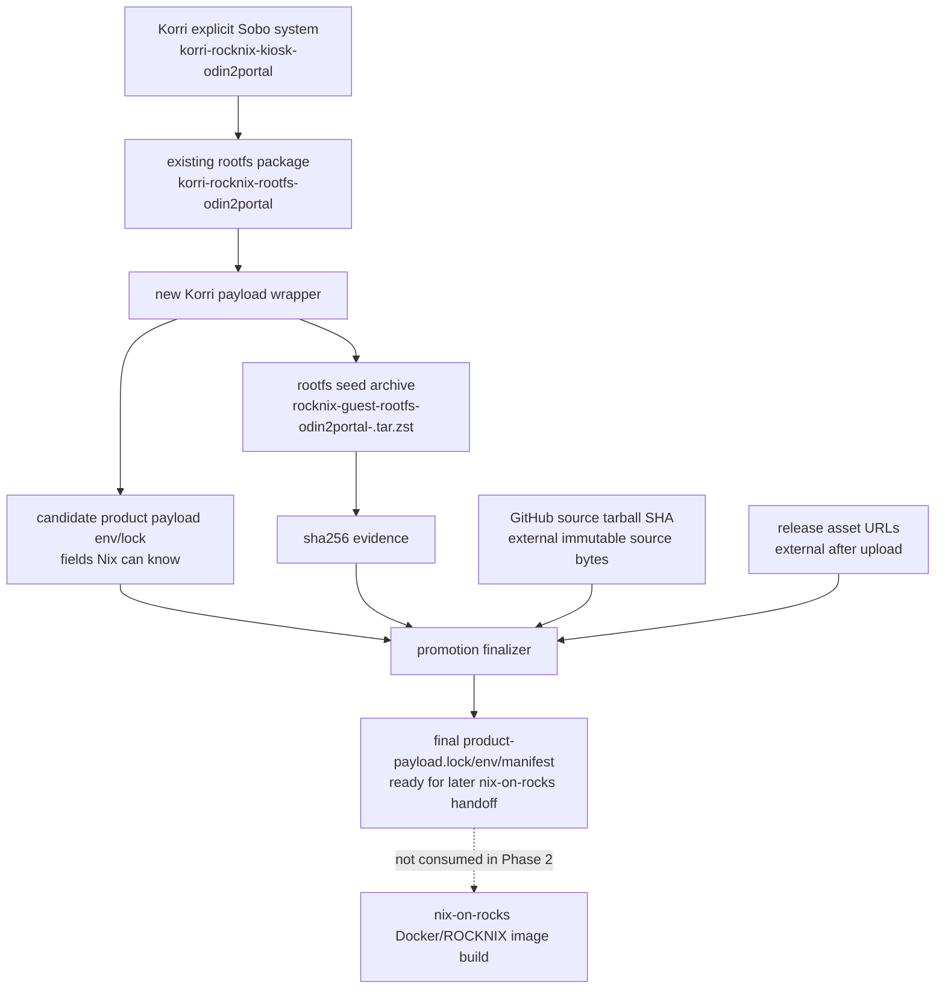

# refactor: Emit RockNix product payloads from Korri

## Summary

Add an additive Korri-owned product-payload artifact for the Odin2Portal/Sobo RockNix appliance. Korri will wrap its existing RockNix rootfs output into the generic payload vocabulary introduced by nix-on-rocks Phase 1, while leaving Docker/ROCKNIX image builds and nix-on-rocks consumption unchanged until a later phase.

---

## Problem Frame

The dependency inversion established Korri as the product/appliance authority and nix-on-rocks as the SM8550 substrate. Phase 1 in nix-on-rocks added a product-neutral payload characterization seam, but Korri still only exposes raw `korri-rocknix-rootfs-*` packages; it does not yet emit the lock/env/manifest bundle or device-named rootfs seed archive that a product-blind image build can consume later.

---

## Requirements

- R1. Korri must emit an Odin2Portal/Sobo product payload bundle using the generic `PRODUCT_*` vocabulary from the nix-on-rocks Phase 1 contract. (origin R1, R2, R9, R10)
- R2. The bundle must wrap the existing Korri-owned RockNix rootfs output without renaming or removing existing `korri-rocknix-rootfs-*` aliases. (origin R13, R14)
- R3. The rootfs seed archive must use a device/revision name suitable for the ROCKNIX seed contract, rather than the generic inner `mkGuestRootfs` tarball name.
- R4. The bundle must make checksum, device id, compatible string, Korri source revision, build target, and nix-on-rocks substrate revision explicit and machine-checkable.
- R5. Phase 2 must not make nix-on-rocks image builds consume the new payload, update nix-on-rocks package pins, or dispatch full/image-only SM8550 Docker builds.
- R6. Values that pure Nix cannot know reliably, especially the GitHub source tarball SHA and final release asset URLs, must be handled by a promotion/finalization seam rather than faked inside a derivation.
- R7. Cheap Korri-side checks must prove payload shape and field consistency before any rootfs build or external handoff is considered valid.
- R8. Phase 2 must target an actual Phase 1 payload contract: either Korri pins a nix-on-rocks revision that contains the generic payload files, or Korri carries a checked fixture of that field vocabulary until the input is bumped.

**Origin actors:** A1 Korri product maintainer; A2 nix-on-rocks substrate maintainer; A3 Sobo deploy operator; A4 future implementation agent; A5 Fuji/aarch64 verifier.

**Origin flows:** F2 additive Korri-side replacement; F3 deploy cutover preparation; F4 nix-on-rocks cleanup preparation.

**Origin acceptance examples:** AE2 Korri replacement target builds on aarch64; AE4 no deploy no-go window; AE5 substrate/product split remains reviewable.

---

## Scope Boundaries

- Do not replace Docker/ROCKNIX image builds with Nix image builds.
- Do not modify nix-on-rocks `package.mk`, `product-payload.lock`, Docker workflows, or image artifact generation as part of this Korri phase.
- Do not dispatch `build-sm8550.yml`, `build-image-only.yml`, or any other SM8550 image-producing workflow for Phase 2 acceptance.
- Do not emit a `by-compatible` rootfs seed artifact; `by-compatible` remains an on-device promotion target, not an off-device seed identity.
- Do not add Thor payload publishing in the first slice. Odin2Portal/Sobo is the first supported artifact; Thor can follow once the handoff shape is proven.
- Do not redesign Moonlight, InputPlumber, or Cemu runtime behavior in this phase. The payload should reflect the existing Korri appliance composition.
- Do not publish release assets automatically unless an implementation already has a safe operator-approved release flow. Candidate artifacts are sufficient for Phase 2.

### Deferred to Follow-Up Work

- Phase 3: update the nix-on-rocks image-only lane to consume a Korri-supplied generic payload and validate it with a known-good base artifact.
- Phase 3 or release hardening: teach nix-on-rocks to accept Korri release asset API URLs, or define an equivalent artifact download input, before using Korri-produced payloads in Docker builds.
- Later explicit-device expansion: add Thor product-payload artifacts as a separate explicit device output.
- Later customization: add boot logo, splash/branding assets, product metadata, and additional Moonlight defaults once the generic payload is the active image input.

---

## Context & Research

### Relevant Code and Patterns

- `flake.nix` already exposes `korri-rocknix-kiosk-system-odin2portal` and `korri-rocknix-rootfs-odin2portal`; the new payload should wrap these rather than replacing them.
- `nix/images/platforms/rocknix-sm8550.nix` is the SM8550 platform adapter. It imports nix-on-rocks substrate modules and device profiles, selects Korri's downstream Moonlight package, and sets the current Sobo/Odin2Portal runtime environment.
- `nix/tests/korri-rocknix-sm8550-config-check.nix` is the existing native Nix check for RockNix appliance invariants and should remain focused on system composition; a separate payload contract check keeps artifact packaging concerns navigable.
- `nix/tests/korri-image-outputs-check.nix` and other `nix/tests/*-check.nix` files use the local check-record pattern: collect assertions, throw with clear messages, and return a tiny success derivation.
- `docs/deployment/korri-images.md` documents the current RockNix-backed targets and should be extended to explain the new candidate payload artifact and its non-image-build boundary.
- nix-on-rocks Phase 1 added a sourceable `product-payload.lock`, `scripts/render-product-payload`, and `scripts/verify-product-payload`. In Phase 1, those characterize the current hardcoded package variables but are not yet active image inputs.
- nix-on-rocks `lib.mkGuestRootfs` currently emits an inner tarball named like `rocknix-layer10b-guest-rootfs-aarch64-linux.tar.zst`; Korri needs a wrapper archive name like `rocknix-guest-rootfs-odin2portal-<shortKorriRev>.tar.zst` for the seed handoff.

### Institutional Learnings

- `docs/brainstorms/2026-05-22-001-korri-dependency-direction-inversion-requirements.md` defines the ownership rule: Korri is the product/appliance layer; nix-on-rocks is the substrate.
- `docs/plans/2026-05-22-002-refactor-korri-dependency-inversion-plan.md` established that explicit per-device RockNix outputs are the build/review gates and `by-compatible` is impure on-device convenience.
- `docs/plans/2026-05-25-002-refactor-native-nix-test-boundary-plan.md` moved Nix assertions into native Nix checks; payload validation should follow that boundary instead of routing Nix facts through Bun.
- nix-on-rocks `docs/ci/fast-builds.md` warns that product-payload changes should not use image-only against stale base artifacts; this phase should stop at Korri artifact emission and cheap contract checks.

### External References

- External research was skipped. This is a repo-specific Nix artifact and cross-repo handoff plan with strong local patterns.

---

## Key Technical Decisions

- **Odin2Portal first:** Phase 2 emits the Sobo/Odin2Portal payload first because it is the primary deployment target and current operator focus. Thor remains a follow-up explicit-device artifact.
- **Wrap, do not rename existing outputs:** Existing rootfs aliases remain stable. The new payload package copies/renames the inner rootfs tarball into the seed contract shape.
- **Candidate payload vs final promotion lock:** The Nix derivation can emit rootfs bytes, checksum, device metadata, and a candidate lock. A final lock with GitHub source tarball SHA, clean Korri revision, and release asset URLs requires a promotion/finalization step after immutable source/release assets exist.
- **Phase 1 contract must be real, not assumed:** Implementation must either bump Korri's `nix-on-rocks` input to a revision containing the Phase 1 payload contract or check in a small fixture/spec of that contract. The finalizer must not be validated against a contract that only exists in a sibling worktree.
- **Avoid duplicate multi-GB rootfs copies by default:** The wrapper should prefer a cheap named reference/symlink plus upload-time staging, or a direct named archive path if the packaging helper supports it. If implementation must copy the tarball, the manual lane must explicitly budget disk/artifact size and keep normal CI on evaluation-only gates.
- **Machine-readable shell contract stays primary:** Use sourceable shell env/lock files for compatibility with nix-on-rocks Phase 1. A Markdown manifest is a human summary generated from the same facts, not the source of truth.
- **No image consumption yet:** Phase 2 proves Korri can produce a payload in the right vocabulary. It does not make Docker/ROCKNIX consume the payload or claim device acceptance.
- **Native Nix checks for Nix facts, script tests for promotion logic:** Nix checks cover flake outputs, device metadata, archive naming, and derivation shape. Script tests cover finalizer behavior that depends on external values.

---

## Open Questions

### Resolved During Planning

- Which device should Phase 2 target first? Odin2Portal/Sobo first; Thor is deferred.
- Should Phase 2 build SM8550 images? No. It emits/verifies the Korri payload only.
- Should `by-compatible` be published as a rootfs seed artifact? No. Explicit devices are artifact identities; `by-compatible` remains a promotion build target.
- Can pure Nix fill `PRODUCT_SOURCE_SHA256` and final `PRODUCT_ROOTFS_SEED_URLS`? No. Those depend on GitHub tarball/release asset bytes and belong to a finalization seam.
- Can local/path flake evaluation provide the final clean Korri revision? No. Final payloads require an immutable revision from CI/release context or an explicit input to the finalizer; local candidates must be marked non-final when no clean revision exists.

### Deferred to Implementation

- Exact short revision length in seed archive names: implementation may choose a stable length, but the same value must appear in archive name, metadata, and checks.
- Exact rootfs staging strategy: implementation should avoid duplicating multi-GB tarballs inside always-built Nix outputs when possible; if duplication is unavoidable, document the disk budget in the manual workflow.
- Exact split between candidate and final lock filenames: implementation may refine names, but the difference must be obvious to operators and tests.
- Exact release publication mechanism: Phase 2 can stop at candidate artifacts; final release asset URLs may be filled manually or by a later release workflow.
- Whether the manual payload workflow builds the full rootfs in GitHub or only evaluates/dry-runs by default depends on available aarch64 builder capacity.

---

## Output Structure

```text
nix/
  korri-rocknix-product-payload.nix
  tests/
    korri-rocknix-product-payload-check.nix
tools/
  artifacts/
    rocknix-product-payload-finalize.ts
    rocknix-product-payload-finalize.test.ts
.github/
  workflows/
    rocknix-product-payload.yml        # optional/manual workflow if implementation keeps CI emission in scope
```

The tree is the expected shape. The implementer may adjust filenames if a nearby existing convention is a better fit, but the plan should still keep Nix packaging, Nix checks, and finalization tooling separated.

---

## High-Level Technical Design

> *This illustrates the intended approach and is directional guidance for review, not implementation specification. The implementing agent should treat it as context, not code to reproduce.*



---

## Implementation Units

### U1. Add the Odin2Portal product-payload wrapper derivation

**Goal:** Create an additive Nix package that wraps `korri-rocknix-rootfs-odin2portal` into a device-named product payload candidate.

**Requirements:** R1, R2, R3, R4, R5

**Dependencies:** None

**Files:**
- Create: `nix/korri-rocknix-product-payload.nix`
- Modify: `flake.nix`
- Reference: `nix/images/platforms/rocknix-sm8550.nix`

**Approach:**
- Define a wrapper derivation that accepts the existing Odin2Portal rootfs package, device metadata, product revision metadata available from the flake context, and the promotion build target string.
- Expose the inner rootfs tarball under a seed-contract filename for Odin2Portal/Sobo. Prefer a cheap named reference/symlink or direct helper output over a second Nix-store copy; if a real copy is necessary, keep that cost in the manual payload lane rather than normal checks.
- Emit checksum evidence for the named archive and a machine-readable candidate env/lock containing fields Nix can know: authority repo, source subdir, build target, seed device id, compatible string, seed archive name, seed SHA256, and substrate input revision. Treat product revision as candidate-only unless a clean immutable revision is supplied by the caller.
- Keep final source tarball SHA and release asset URL fields unset, marked as pending, or omitted from the candidate file according to the finalized contract. Do not invent fake values.
- Expose a package alias such as `korri-rocknix-product-payload-odin2portal` without changing `korri-rocknix-rootfs-odin2portal`.

**Patterns to follow:**
- `flake.nix` package alias style for `korri-rocknix-rootfs-odin2portal`.
- Plain key/value manifests under `nix-support/*/manifest.txt` in package outputs.
- nix-on-rocks Phase 1 `product-payload.lock` field vocabulary.

**Test scenarios:**
- Happy path: the package output contains a renamed Odin2Portal rootfs seed archive and a matching SHA256 evidence file.
- Happy path: candidate metadata records `device=odin2portal` and `compatible=ayn,odin2portal`.
- Edge case: the package does not emit or imply a `by-compatible` rootfs seed archive.
- Error path: if the wrapped rootfs package does not expose the expected inner tarball location, the wrapper fails with an actionable message.
- Integration: existing `korri-rocknix-rootfs-odin2portal` remains exposed and unchanged.

**Verification:**
- The new package exists as an additive flake output.
- The original rootfs aliases and system aliases remain stable.

---

### U2. Add a promotion finalizer for externally known payload fields

**Goal:** Provide a deterministic tool that combines the Korri-built candidate payload with externally known immutable source/release facts to produce the final generic payload lock/env/manifest.

**Requirements:** R1, R4, R6, R7

**Dependencies:** U1

**Files:**
- Create: `tools/artifacts/rocknix-product-payload-finalize.ts`
- Create: `tools/artifacts/rocknix-product-payload-finalize.test.ts`
- Reference: `tools/artifacts/paths.ts`

**Approach:**
- Implement a small repository tooling entrypoint that reads candidate payload metadata plus caller-supplied source tarball SHA and seed asset URL(s).
- Emit sourceable final files compatible with the real nix-on-rocks Phase 1 vocabulary, including the fields needed to render `PKG_NIX_GUEST_*` and `PKG_NIX_GUEST_ROOTFS_SEED_*` values.
- Require an explicit clean Korri revision for final payloads. Reject finalization when only a dirty/local candidate revision is available.
- Treat URL ordering as part of the contract. For a single asset, emit one URL; if split assets are ever supplied, preserve caller order and record enough evidence for later concatenation verification.
- Reject finalization when required external values are missing, placeholder-like, malformed, or inconsistent with the candidate archive/checksum.
- Keep the finalizer independent from Docker/ROCKNIX image builds.

**Patterns to follow:**
- `tools/artifacts/paths.ts` for repo output path conventions.
- Existing TypeScript tooling tests under `tools/**` when the behavior is local tooling rather than Nix evaluation.
- nix-on-rocks `scripts/render-product-payload` field names for final shell output.

**Test scenarios:**
- Happy path: given fixture candidate metadata, source SHA, and one Korri release asset URL, the finalizer emits a sourceable lock/env with the expected `PRODUCT_*` fields.
- Edge case: ordered multiple seed URLs are preserved exactly in the rendered field.
- Error path: missing source tarball SHA or missing clean Korri revision rejects finalization and does not write partial output.
- Error path: a seed archive name whose device does not match `odin2portal` is rejected.
- Error path: a release URL from an unsupported repository is rejected or clearly flagged according to the chosen Phase 2 policy.
- Integration: finalizer output can be sourced by a shell syntax check without executing arbitrary commands.

**Verification:**
- Final lock generation is deterministic from candidate metadata plus explicit external facts.
- No pure Nix output pretends to know GitHub tarball or release asset values it cannot know.

---

### U3. Add native payload contract checks

**Goal:** Prove the new package and metadata shape with cheap native checks before any heavy rootfs or image workflow is trusted.

**Requirements:** R1, R2, R3, R4, R7

**Dependencies:** U1, U2

**Files:**
- Create: `nix/tests/korri-rocknix-product-payload-check.nix`
- Modify: `flake.nix`
- Reference: `nix/tests/korri-rocknix-sm8550-config-check.nix`
- Reference: `nix/tests/korri-image-outputs-check.nix`

**Approach:**
- Add a native Nix check that receives the new payload package and relevant existing RockNix package/config values from `flake.nix`.
- Add a cheap assertion that the expected Phase 1 payload contract is present, either via the pinned `nix-on-rocks` input or a checked fixture, so Korri does not build finalizer logic against an absent interface.
- Assert the package attr exists on Linux, targets Odin2Portal explicitly, uses the expected build target string, and does not replace existing rootfs/system package aliases.
- Assert the metadata vocabulary stays aligned with the nix-on-rocks Phase 1 field set where Nix can check it cheaply.
- Keep checks that require archive bytes as package postconditions or targeted build-time checks, not as always-on full rootfs builds, unless implementation confirms the cost is acceptable.

**Patterns to follow:**
- `nix/tests/korri-rocknix-sm8550-config-check.nix` for RockNix-specific Nix assertions.
- `nix/tests/korri-package-outputs-check.nix` for package discovery assertions.

**Test scenarios:**
- Happy path: the Nix check passes when the product payload package is exposed, existing rootfs aliases still exist, and the Phase 1 contract fixture/input is present.
- Edge case: `by-compatible` remains absent from product-payload seed package outputs.
- Error path: changing candidate metadata to Thor while exporting the Odin2Portal package fails with a clear device mismatch.
- Error path: removing `korri-rocknix-rootfs-odin2portal` fails because the payload wrapper must remain additive.
- Integration: the check participates in the native Nix check set without routing through Bun.

**Verification:**
- Payload contract regressions fail through Nix-owned checks.
- Existing RockNix SM8550 config checks remain focused on system composition.

---

### U4. Add a manual candidate payload emission lane

**Goal:** Provide an operator/CI path to produce and collect the Korri product payload candidate without making it part of normal PR checks or any SM8550 image build.

**Requirements:** R1, R4, R5, R6

**Dependencies:** U1, U2, U3

**Files:**
- Create: `.github/workflows/rocknix-product-payload.yml`
- Modify: `.github/workflows/desktop-stage2.yml`
- Reference: `flake.nix`

**Approach:**
- Add only cheap discovery/evaluation of the new payload package/check to existing Stage 2 CI, similar to current RockNix rootfs `drvPath` evaluation.
- If a new workflow is added, make it manual (`workflow_dispatch`) and clearly label it as candidate payload emission, not image building or device acceptance.
- The manual lane may build the payload where a suitable aarch64 builder is available, upload the candidate bundle as a workflow artifact, and optionally run the finalizer when the caller provides source SHA and release URL inputs.
- Do not add this heavy payload build to default PR/push workflows unless build capacity is explicitly available.

**Patterns to follow:**
- `.github/workflows/desktop-stage2.yml` for cheap RockNix evaluation gates.
- nix-on-rocks `docs/ci/fast-builds.md` boundary: product-payload/rootfs changes are not image-only-safe until the base/image relationship is stamped in a later phase.

**Test scenarios:**
- Happy path: standard Stage 2 evaluates the payload package/check without building an SM8550 image.
- Happy path: manual workflow uploads a candidate payload artifact when run on a capable builder.
- Error path: manual workflow failure in payload build does not imply a failed Docker/ROCKNIX image because no image build is part of the lane.
- Edge case: a PR that only changes docs does not accidentally trigger heavy rootfs payload emission.

**Verification:**
- Maintainers have an explicit way to obtain candidate payload artifacts.
- Normal CI still avoids the multi-hour Docker/ROCKNIX image path.

---

### U5. Document the Korri-to-nix-on-rocks payload handoff boundary

**Goal:** Explain what Korri emits in Phase 2, what remains unconsumed until later phases, and how operators should reason about candidate versus final payload metadata.

**Requirements:** R1, R4, R5, R6

**Dependencies:** U1, U2, U3, U4

**Files:**
- Modify: `docs/deployment/korri-images.md`
- Reference: `docs/plans/2026-05-22-002-refactor-korri-dependency-inversion-plan.md`

**Approach:**
- Extend the RockNix-backed kiosk appliance section to describe the Odin2Portal product-payload artifact and its relationship to `korri-rocknix-rootfs-odin2portal`.
- State explicitly that Phase 2 candidate payloads are not SM8550 update images and do not prove device boot, seed staging, or Docker/ROCKNIX image compatibility.
- Document candidate metadata versus final promotion metadata: candidate comes from Nix-built payload facts; final promotion requires immutable source tarball SHA and release asset URLs.
- Preserve the product/substrate boundary: Korri emits payloads; nix-on-rocks remains the image builder until a later phase wires consumption.

**Patterns to follow:**
- Existing `docs/deployment/korri-images.md` validation-tier language.
- Existing docs distinction between x86 live USB images and RockNix rootfs/system artifacts.

**Test scenarios:**
- Happy path: docs make it clear which artifact is a rootfs seed candidate and which artifacts are actual boot/update images.
- Edge case: docs do not instruct operators to use `by-compatible` as an off-device seed identity.
- Error path: documentation review catches any claim that Phase 2 payloads are already consumed by nix-on-rocks image builds.

**Verification:**
- A future maintainer can identify the package to build, the metadata to inspect, and the later phase needed before flashing or updating a device.

---

## System-Wide Impact

- **Interaction graph:** Korri rootfs package feeds the new payload wrapper; the wrapper emits candidate seed bytes and metadata; the finalizer combines candidate facts with external source/release facts; later nix-on-rocks phases may consume the final payload.
- **Error propagation:** metadata mismatches should fail in native checks or finalizer tests before any Docker/ROCKNIX build or device operation begins.
- **State lifecycle risks:** rootfs bytes, source revision, release URLs, and checksums can drift if generated separately. The finalizer and checks must make partial updates visible.
- **API surface parity:** explicit per-device outputs remain the build/review surface. `by-compatible` remains on-device convenience only.
- **Integration coverage:** Phase 2 proves artifact shape and metadata consistency. It does not prove update-tar contents, seed staging, recovery boot, or Sobo runtime behavior.
- **Unchanged invariants:** Docker remains owned by nix-on-rocks; existing Korri system/rootfs aliases remain; RockNix hardware facts stay in `nix/images/platforms/rocknix-sm8550.nix`; generic image helpers remain hardware-fact-free.

---

## Risks & Dependencies

| Risk | Mitigation |
|------|------------|
| Pure Nix metadata pretends to know GitHub tarball, clean revision, or release asset bytes | Split candidate payload generation from final promotion lock generation and require explicit finalization inputs. |
| Payload archive is mislabeled for the wrong device | Encode Odin2Portal device/compatible checks in wrapper metadata and native checks. |
| Existing rootfs aliases are broken while adding the wrapper | Keep wrapper additive and assert existing aliases remain exposed. |
| Phase 2 is mistaken for an image acceptance path | Document the boundary and keep Docker/ROCKNIX workflows unchanged. |
| Heavy payload builds slow normal CI | Add cheap evaluation/check gates to normal CI and keep rootfs payload emission manual unless builder capacity is explicit. |
| Multi-GB rootfs wrapper duplicates store/artifact bytes | Prefer named references/symlinks or direct named output; otherwise document disk budget and keep copies out of always-on checks. |
| Korri validates against a Phase 1 contract not present in its pinned input | Bump the nix-on-rocks input or add a checked fixture/spec before finalizer validation is considered complete. |
| nix-on-rocks Phase 1 verifier rejects Korri release asset URLs | Treat verifier URL acceptance as Phase 3/release-hardening work before image consumption. |
| Candidate and final metadata diverge | Generate final lock/env/manifest from candidate metadata plus explicit external inputs, not by hand-copying fields. |

---

## Documentation / Operational Notes

- Phase 2 acceptance should stop at Korri payload package exposure, candidate metadata checks, finalizer tests, and documentation. It should not produce a ROCKNIX update tar or mark any device image accepted.
- The first payload target is Odin2Portal/Sobo. If Thor becomes urgent, add it as a separate explicit-device output after the Sobo path lands.
- A later image-integration phase must decide whether nix-on-rocks consumes Korri release assets by URL or downloads a workflow/release artifact directly.

---

## Sources & References

- **Origin document:** [docs/brainstorms/2026-05-22-001-korri-dependency-direction-inversion-requirements.md](../brainstorms/2026-05-22-001-korri-dependency-direction-inversion-requirements.md)
- Related Korri plan: [docs/plans/2026-05-22-002-refactor-korri-dependency-inversion-plan.md](2026-05-22-002-refactor-korri-dependency-inversion-plan.md)
- Related Korri docs: [docs/deployment/korri-images.md](../deployment/korri-images.md)
- Related Korri code: `flake.nix`, `nix/images/platforms/rocknix-sm8550.nix`, `nix/tests/korri-rocknix-sm8550-config-check.nix`
- Related nix-on-rocks Phase 1 plan: nix-on-rocks repo `docs/plans/2026-05-26-001-refactor-product-payload-contract-plan.md`
- Related nix-on-rocks Phase 1 contract files: nix-on-rocks repo `product-payload.lock`, `scripts/render-product-payload`, `scripts/verify-product-payload`
