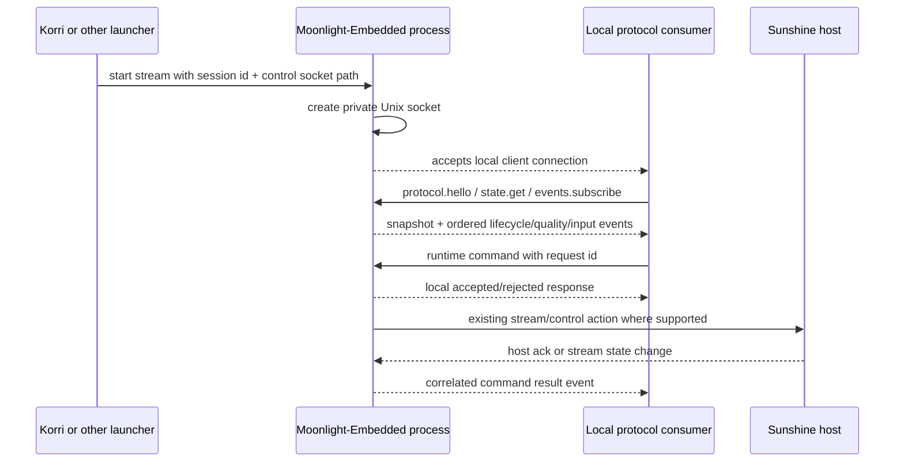

# feat: Add Moonlight local control and observability protocol

## Summary

This plan adds a generic Moonlight-Embedded local control and observability surface for a running stream process. The implementation introduces a versioned local IPC protocol with structured state snapshots, event streams, and narrow runtime commands, while keeping Korri as the first consumer rather than the owner of the protocol.

---

## Problem Frame

Korri currently starts Moonlight-Embedded as a child process and mostly loses visibility after launch: stdout/stderr are ignored, runtime quality is inferred from logs or ad hoc env-triggered experiments, and control is limited to command-line flags plus the experimental Sunshine runtime-settings packet path. That makes adaptation, debugging, agent tooling, and third-party launcher integration brittle.

The desired direction is not a Korri-only API. Moonlight-Embedded should expose its own generic, local, observable session surface so Korri and other launchers can attach to a running stream, understand what is happening, and send only explicitly supported commands.

---

## Requirements

- R1. Expose a Moonlight-Embedded-native protocol, not a Korri-private log-scraping or env-var interface.
- R2. Make the first transport local-only IPC for a running Moonlight stream process.
- R3. Support structured observability across three shallow categories: session lifecycle, stream quality/adaptation, and input/control status.
- R4. Provide a current state snapshot for late attachers, not only transient events.
- R5. Provide ordered events with enough sequencing metadata for consumers to detect gaps and resync.
- R6. Provide narrow runtime commands only for supported active-session operations; do not expose arbitrary shell or launcher commands.
- R7. Preserve clear command semantics: local accept/reject is distinct from host-applied runtime outcomes.
- R8. Design the protocol for consumers beyond Korri through versioning, capabilities, stable event names, and additive schema evolution.
- R9. Keep LAN/remote control outside Moonlight-Embedded v1; remote access should be bridged intentionally by a launcher or daemon later.
- R10. Integrate Korri as the first consumer through launch-time socket discovery/configuration without coupling product UI code to Moonlight internals.
- R11. Validate the protocol with real local IPC/schema tests and Nix patch invariants; do not rely only on log markers.
- R12. Separate read-only observability from command authority, with observability enabled first and mutation commands requiring explicit opt-in capability.
- R13. Bound and throttle all command values before dispatching anything to Sunshine or Moonlight internals.

---

## Scope Boundaries

- No public LAN, HTTP, mDNS, Tailscale, or browser-facing Moonlight API in this slice.
- No pairing, host discovery, app listing, launch orchestration, or reconnect policy inside the Moonlight control protocol.
- No product UI for telemetry inspection.
- No raw high-frequency input event stream in v1.
- No arbitrary command execution or shell command transport.
- No promise that every runtime command is supported on every host, codec, decoder, or Sunshine version.
- No broad adaptation policy; the protocol can expose facts and narrow commands, but policy remains a separate consumer concern.

### Deferred to Follow-Up Work

- Korri LAN bridge from the local Moonlight socket to a remote authenticated API.
- Agent/MCP adapter over the local protocol for richer tool workflows.
- Product telemetry dashboard or developer overlay.
- Rich QoS telemetry such as per-frame decode timing, render timing, jitter buffers, and dropped-frame histograms.
- Upstreaming discussion with Moonlight-Embedded after the downstream protocol proves useful and stable.

---

## Context & Research

### Relevant Code and Patterns

- `packages/moonlight-embedded-korri/README.md` documents the current downstream Moonlight patches and experimental runtime settings env controls.
- `packages/moonlight-embedded-korri/package.nix` layers Korri-owned patches on top of nix-on-rocks' Moonlight-Embedded package.
- `packages/moonlight-embedded-korri/patches/0005-add-sunshine-runtime-settings-mvp.patch` contains the current one-shot runtime settings sender, adaptation hook, and ack logging.
- `packages/sunshine-korri/patches/0001-runtime-bitrate-restart-mvp.patch` defines the downstream Sunshine `0x5504` / `0x5505` runtime-settings request/ack behavior that Moonlight commands can reuse where applicable.
- `korri/products/app/stream/moonlight-launcher.ts` is Korri's current Moonlight launch seam; it builds command arguments, starts the child, observes early exit, and currently discards stdout/stderr.
- `korri/deploy/desktop/launch-bridge.ts` is the desktop bridge that can consume richer launch results without putting protocol details directly in React UI.
- `tools/device/game-stream-state.ts` models tagged lifecycle states and pure transitions for the existing stream runner.
- `tools/device/game-stream-runner.test.ts` demonstrates the preferred test style: real temp files, controlled child process seams, and assertions over durable status state.
- `korri/shared/input/native/wire-schema.ts` and `korri/shared/input/desktop-bridge-wire.ts` are examples of shared wire contracts with TypeScript-side validation.
- `nix/tests/korri-sunshine-runtime-bitrate-patch-check.nix` is the current native patch invariant check pattern for downstream streaming patches.
- `docs/acceptance/sunshine-korri-runtime-bitrate-restart-2026-05-25.md` and `docs/acceptance/sunshine-korri-runtime-resolution-2026-05-26.md` record the current runtime-settings evidence and the limits of support claims.

### Institutional Learnings

- `docs/solutions/architecture-patterns/boot-scoped-control-plane-with-session-scoped-runner-2026-05-19.md`: shared local control surfaces should use explicit runtime paths, private ownership, and fail-closed path/ownership validation.
- `docs/solutions/workflow-issues/generic-game-stream-runner-validation-contract-2026-05-19.md`: keep the stream runner generic and narrow; treat durable status as a primary diagnostic artifact rather than relying on logs.
- `docs/solutions/architecture-patterns/kiosk-foreground-app-policy-over-gamescope-overlay-2026-05-24.md`: keep session lifecycle policy separate from app adapter details.
- `docs/solutions/integration-issues/supervise-chromium-kiosk-session-after-game-exit-2026-05-04.md`: local control endpoints still need a capability/security model; loopback/local alone is not enough when commands can affect a session.
- `docs/solutions/best-practices/prefer-real-implementations-over-mocks-2026-05-02.md`: test IPC and process seams with real temp runtime directories and controllable implementations where possible.

### External References

- Linux `unix(7)`: pathname Unix-domain sockets support local IPC and can be protected by filesystem directory/socket permissions; abstract sockets do not provide filesystem permission checks.
- Linux `SO_PEERCRED`: local socket servers can verify connecting process credentials on Linux.
- JSON-RPC 2.0: request IDs, responses, notifications, and error objects provide familiar command semantics.
- JSON Lines / NDJSON: newline-delimited UTF-8 JSON is simple to stream, tail, and parse incrementally.
- mpv JSON IPC: a practical prior art example for local JSON-over-socket process control.

---

## Key Technical Decisions

- Use filesystem Unix-domain sockets for v1: this keeps the first transport local-only, permissionable, scriptable, and lighter than D-Bus or gRPC for a C-native downstream patch.
- Make Linux peer-credential checks mandatory for v1: a connecting peer must match the expected Moonlight/launcher UID before the server reads protocol frames, and root behavior must be explicit rather than implicit.
- Separate observer and controller authority: read-only observability is the default; mutation commands require an explicitly enabled controller capability and must not be accidentally granted by subscribing to events.
- Use newline-delimited JSON framing: stream sockets are byte streams, so every request, response, and event must be newline-framed and bounded by maximum message size.
- Use a JSON-RPC-compatible command envelope plus event notifications: request IDs and typed errors are useful for commands, while events can interleave with responses without ambiguity.
- Make `protocol.hello`, `state.get`, and event subscription foundational: consumers need discovery, capability negotiation, and late-attach state before relying on events.
- Treat command responses as local protocol results: host-applied outcomes arrive later as correlated events when the underlying Moonlight/Sunshine path produces an ack or timeout.
- Keep v1 event coverage shallow: expose lifecycle, quality/adaptation status, and input/control capability/status facts without high-volume frame or raw input streams.
- Require launcher-provided socket identity for first consumer integration: Korri should generate a session/stream ID and socket path, pass them to Moonlight, and return that handle to consumers.
- Keep the native patch small and generic: the Moonlight patch owns socket creation, event emission, snapshots, and command dispatch; Korri owns client libraries, launch integration, and any later bridge/policy.
- Use `json-c` for native JSON parsing rather than a hand-rolled parser: it is a small C library available in Nixpkgs, keeps malformed input handling library-backed, and makes the CMake/Nix dependency explicit for review.
- Use a platform-neutral IPC service loop: do not depend on Moonlight's embedded-only loop path; the socket server needs its own thread or equivalent neutral mechanism with synchronized state/event queues.
- Prefer additive schema evolution: consumers must ignore unknown fields/events, and Moonlight should advertise capabilities rather than requiring consumers to infer behavior from version strings.

---

## Open Questions

### Resolved During Planning

- Should v1 be local IPC or LAN remote control? Local IPC first. LAN access is a launcher/daemon bridge concern and is deferred.
- Should Moonlight become a pre-stream daemon? No. v1 focuses on the running `moonlight stream ...` process.
- Should Korri own the protocol? No. Korri is the first consumer, but message names and behavior should be Moonlight/session-oriented rather than Korri-specific.
- Should v1 include all internals deeply? No. Cover lifecycle, quality/adaptation, and input/control shallowly first, then deepen specific telemetry once consumers prove demand.

### Deferred to Implementation

- Exact native source files in the Moonlight-Embedded patch: implementation should patch the smallest set of files needed after inspecting the nix-on-rocks-patched source tree.
- Exact thread/locking primitive names for the platform-neutral IPC service loop: the plan requires a neutral loop and synchronized state/event queues, but implementation may choose the smallest safe primitives after inspecting the patched source.
- Exact event names for decoder/renderer internals: choose stable names during implementation after confirming which internal callbacks reliably see the facts.
- Whether `runtime.setResolution` is exposed by default or advertised as experimental-only: keep it capability-gated until client render/decode evidence is stronger.

---

## Output Structure

    packages/moonlight-embedded-korri/
      patches/
        0006-add-local-control-observability-ipc.patch
      README.md
    korri/shared/stream/
      moonlight-control-protocol.ts
      moonlight-control-client.ts
      moonlight-control-protocol.test.ts
      moonlight-control-client.test.ts
    tools/cli/
      moonlight-control.ts
      moonlight-control.test.ts
    nix/tests/
      korri-moonlight-control-protocol-patch-check.nix
    docs/acceptance/
      moonlight-embedded-local-control-protocol-2026-05-26.md

The final file layout may shift during implementation, but the core separation should hold: native Moonlight patch under `packages/moonlight-embedded-korri/`, reusable TypeScript protocol/client code under shared runtime code, CLI diagnostics under `tools/cli/`, and Nix patch invariants under `nix/tests/`.

---

## High-Level Technical Design

> *This illustrates the intended approach and is directional guidance for review, not implementation specification. The implementing agent should treat it as context, not code to reproduce.*

Recommended message families:

| Family | Purpose | Examples |
|---|---|---|
| Protocol | Discovery and compatibility | hello, capabilities, protocol version |
| Snapshot | Late attach and resync | session state, stream facts, last applied settings, input route status |
| Event | Ordered observability | lifecycle, control-ready, network quality, decoder/renderer, runtime ack, input route |
| Command | Narrow local control | request IDR, set bitrate, set FPS, experimental set resolution |
| Error | Machine-readable failures | invalid, unsupported, not streaming, disabled, conflict, timed out |

---

## Implementation Units

### U1. Define the protocol contract and TypeScript schemas

**Goal:** Establish the versioned message model before patching native Moonlight code so all consumers have one shared contract.

**Requirements:** R1, R3, R4, R5, R7, R8, R11, R12, R13

**Dependencies:** None

**Files:**
- Create: `korri/shared/stream/moonlight-control-protocol.ts`
- Create: `korri/shared/stream/moonlight-control-protocol.test.ts`
- Modify: `packages/moonlight-embedded-korri/README.md`

**Approach:**
- Define a small v1 contract with protocol metadata, state snapshots, ordered events, command requests, command responses, typed errors, authority levels, and value bounds.
- Use discriminated/tagged shapes and explicit units such as `bitrateKbps`, `fps`, `width`, `height`, and `seq`.
- Include capability lists so consumers can discover supported commands, event families, and whether the connection is read-only or command-capable.
- Define strict command bounds for bitrate, FPS, resolution shape, request size, one-in-flight mutation behavior, and rate-limit/backoff semantics before native dispatch exists.
- Specify additive evolution rules: unknown fields/events are ignored, unknown required capabilities fail clearly, and breaking changes require a protocol major version.
- Document that v1 is Linux/local IPC only and that remote bridging is out of scope.

**Execution note:** Start test-first with schema/decoder fixtures for representative valid and invalid messages.

**Patterns to follow:**
- `korri/shared/input/native/wire-schema.ts`
- `korri/shared/input/desktop-bridge-wire.ts`
- `tools/device/game-stream-state.ts`

**Test scenarios:**
- Happy path: decoding a `protocol.hello` response with v1 capabilities succeeds and preserves unknown additive fields.
- Happy path: decoding a snapshot with lifecycle, stream quality, runtime settings, and input route facts succeeds.
- Happy path: decoding ordered event envelopes with increasing `seq` succeeds.
- Edge case: an event with an unknown event name decodes as an unknown-but-preserved event rather than failing the whole stream.
- Error path: a command response without a request ID is rejected.
- Error path: a message with an invalid protocol version or malformed discriminator returns a structured decode failure.
- Error path: command values outside the v1 bounds are rejected by schema validation before any native dispatch path exists.

**Verification:**
- The protocol can be validated independently of Moonlight native code.
- The README describes the protocol as generic Moonlight local control, not a Korri-only contract.

---

### U2. Add native Moonlight local IPC server scaffolding

**Goal:** Patch Moonlight-Embedded to optionally create a secure local Unix socket for an active stream process and serve basic protocol methods.

**Requirements:** R1, R2, R4, R5, R8, R9, R11, R12

**Dependencies:** U1

**Files:**
- Create: `packages/moonlight-embedded-korri/patches/0006-add-local-control-observability-ipc.patch`
- Modify: `packages/moonlight-embedded-korri/package.nix`
- Modify: `packages/moonlight-embedded-korri/README.md`
- Create: `nix/tests/korri-moonlight-control-protocol-patch-check.nix`
- Modify: `flake.nix`

**Approach:**
- Add opt-in observer and controller socket settings for Moonlight-Embedded, preferably via neutral env/flag names that do not mention Korri.
- Use filesystem Unix-domain sockets under a launcher-provided private runtime directory; avoid abstract sockets and public `/tmp` defaults.
- Add `json-c` through `packages/moonlight-embedded-korri/package.nix` and the downstream CMake patch rather than hand-rolling general JSON parsing.
- Use a platform-neutral IPC thread or equivalent service loop, not the embedded-only Moonlight loop path, with synchronized state snapshots and event queues.
- Enforce bounded line length, bounded client count, close-on-exec, nonblocking or isolated I/O, mandatory Linux peer-credential checks, and safe stale-socket cleanup.
- Serve initial read-only methods such as hello, state snapshot, and event subscription before adding command dispatch.
- Ensure socket setup failure is observable but does not silently masquerade as a healthy observability session.

**Execution note:** Add Nix string invariant checks before or alongside the patch to lock in security-sensitive markers such as AF_UNIX, bounded frames, and non-Korri protocol naming.

**Patterns to follow:**
- `packages/moonlight-embedded-korri/patches/0005-add-sunshine-runtime-settings-mvp.patch`
- `nix/tests/korri-sunshine-runtime-bitrate-patch-check.nix`
- `docs/solutions/architecture-patterns/boot-scoped-control-plane-with-session-scoped-runner-2026-05-19.md`

**Test scenarios:**
- Happy path: patched package builds and contains the new local IPC protocol markers.
- Happy path: when a socket path is configured, Moonlight creates the socket and responds to hello/state methods in a controlled smoke harness.
- Edge case: a stale socket path is removed only when it is safe to replace and does not point outside the expected runtime directory.
- Error path: missing or unsafe socket path disables the IPC server with an explicit unsupported/unavailable state rather than crashing the stream.
- Error path: malformed JSON, blank frames, and oversized frames are rejected without terminating Moonlight.
- Error path: unauthorized peer credentials or unsafe permissions are rejected before protocol frames are read.

**Verification:**
- `moonlight-embedded-korri` builds with the new patch.
- The Nix patch check proves the expected IPC/security/protocol invariants exist.
- CI coverage is allowed to stop at package/schema/client tests until a reliable host-backed native smoke harness exists; live socket evidence should be recorded separately when a paired host is available.

---

### U3. Emit shallow lifecycle, quality, and input/control state

**Goal:** Populate the snapshot and event stream with the first useful observability facts without attempting deep telemetry.

**Requirements:** R3, R4, R5, R8, R11

**Dependencies:** U1, U2

**Files:**
- Modify: `packages/moonlight-embedded-korri/patches/0006-add-local-control-observability-ipc.patch`
- Modify: `nix/tests/korri-moonlight-control-protocol-patch-check.nix`
- Modify: `packages/moonlight-embedded-korri/README.md`
- Create: `docs/acceptance/moonlight-embedded-local-control-protocol-2026-05-26.md`

**Approach:**
- Emit lifecycle events for process start, stream connecting/connected, control-ready, streaming, disconnecting, exited, and failed where Moonlight has reliable hooks.
- Emit quality/adaptation events only for facts already available or already proven: connection quality transitions, runtime settings requested/sent/ack statuses, and current applied bitrate/FPS/resolution when known.
- Emit input/control status events for selected input route/capability state, not raw button/touch movement streams.
- Include monotonic sequence numbers and a current snapshot so consumers can attach after the stream starts and still understand current state.
- Emit an event gap marker or require resnapshot when buffered event history cannot satisfy a late subscriber.

**Execution note:** Characterize existing runtime-settings log/ack behavior before moving facts behind the structured event surface so the new protocol preserves current evidence.

**Patterns to follow:**
- `tools/device/game-stream-state.ts`
- `docs/acceptance/sunshine-korri-runtime-bitrate-restart-2026-05-25.md`
- `docs/acceptance/sunshine-korri-runtime-resolution-2026-05-26.md`

**Test scenarios:**
- Happy path: a subscriber receives an initial snapshot followed by lifecycle events in increasing sequence order.
- Happy path: a runtime bitrate/FPS ack produces a structured event with the same applied/invalid/unsupported/disabled semantics already documented for the experimental path.
- Happy path: a connection-quality transition produces a shallow quality event without claiming unsupported metrics.
- Edge case: a late subscriber receives a current snapshot even if it missed earlier process-start events.
- Edge case: event sequence gaps are detectable and force consumers to call state snapshot again.
- Error path: a stream failure emits a terminal failed/exited state where Moonlight has enough information before the socket closes.
- Error path: input route information is unavailable and represented as unknown/unavailable rather than omitted in a way consumers confuse for healthy input.

**Verification:**
- Acceptance evidence shows a client connecting to the socket and receiving lifecycle, quality/adaptation, and input/control status facts during a real or controlled stream.
- Docs clearly distinguish shallow v1 facts from deferred deep telemetry.

---

### U4. Add narrow local command dispatch

**Goal:** Allow local consumers to send explicitly supported runtime commands over the IPC protocol with clear local-vs-host outcome semantics.

**Requirements:** R1, R6, R7, R8, R11, R12, R13

**Dependencies:** U1, U2, U3

**Files:**
- Modify: `packages/moonlight-embedded-korri/patches/0006-add-local-control-observability-ipc.patch`
- Modify: `packages/moonlight-embedded-korri/patches/0005-add-sunshine-runtime-settings-mvp.patch` if shared command-sending helpers need to be extracted from the env-triggered path
- Modify: `nix/tests/korri-moonlight-control-protocol-patch-check.nix`
- Modify: `packages/moonlight-embedded-korri/README.md`
- Modify: `docs/acceptance/moonlight-embedded-local-control-protocol-2026-05-26.md`

**Approach:**
- Start with commands that map to already-known active-session operations: request IDR if a safe Moonlight hook exists, set bitrate, set FPS, and capability-gated experimental set resolution.
- Require command-capable authority before dispatch; read-only observer connections must receive a permission/unsupported response for mutation methods.
- Apply strict native bounds and throttling before sending anything to Sunshine: accepted numeric ranges, resolution policy, one in-flight mutation per command family, and cooldown/backoff for repeated requests.
- Return immediate protocol responses for local validation outcomes such as accepted, invalid, unauthorized, unsupported, not streaming, disabled, or conflict.
- Extend the Moonlight-common integration with typed runtime-settings ack callbacks or an equivalent non-log-scraping native event path, then emit later command-result events when the command is sent to Sunshine and when a host ack, timeout, or stream-state result arrives.
- Preserve the existing runtime-settings status semantics rather than inventing a second meaning for applied/invalid/unsupported/disabled.
- Reject commands before control stream readiness and avoid queueing unbounded runtime mutations.

**Execution note:** Implement command correlation against U1 protocol fixtures and native patch invariants before wiring live Moonlight hooks; U5 should add reusable client coverage after the command surface exists. Avoid log scraping for final command-result events.

**Patterns to follow:**
- `packages/moonlight-embedded-korri/patches/0005-add-sunshine-runtime-settings-mvp.patch`
- `packages/sunshine-korri/patches/0001-runtime-bitrate-restart-mvp.patch`
- `docs/acceptance/sunshine-korri-runtime-bitrate-restart-2026-05-25.md`

**Test scenarios:**
- Happy path: `runtime.setBitrate` receives a local accepted response, then a correlated applied event when Sunshine acks success.
- Happy path: `runtime.setFps` follows the same command/result correlation path.
- Edge case: `runtime.setResolution` is absent from capabilities or returns unsupported when resolution support is not proven for the active path.
- Error path: an observer-only connection attempts `runtime.setBitrate` and receives an authorization/unsupported response without dispatch.
- Error path: an invalid value returns a local invalid response without sending a Sunshine control packet.
- Error path: a command sent before control readiness returns not streaming or conflict.
- Error path: a host ack with unsupported/invalid/disabled is surfaced as a command-result event rather than being collapsed into transport success.
- Error path: host no-ack or stream disconnect produces a timed-out/failed command-result event with the original request ID.

**Verification:**
- Consumers can distinguish local protocol acceptance from actual runtime setting application.
- Existing env-triggered bitrate/FPS experiments continue to work or are intentionally documented as superseded by the IPC command path.

---

### U5. Build a reusable TypeScript client and Korri launcher integration

**Goal:** Make Korri the first consumer through a reusable client/launch handle while keeping the protocol available to other launchers and tools.

**Requirements:** R1, R2, R4, R5, R6, R7, R8, R10, R11, R12, R13

**Dependencies:** U1, U2; command-capable CLI behavior depends on U4

**Files:**
- Create: `korri/shared/stream/moonlight-control-client.ts`
- Create: `korri/shared/stream/moonlight-control-client.test.ts`
- Modify: `korri/products/app/stream/moonlight-launcher.ts`
- Modify: tests covering `korri/products/app/stream/moonlight-launcher.ts` if present, or add colocated tests following the existing test layout
- Modify: `korri/deploy/desktop/launch-bridge.ts` if launch results need to carry the control handle
- Create: `tools/cli/moonlight-control.ts`
- Create: `tools/cli/moonlight-control.test.ts`

**Approach:**
- Implement a generic local client that can connect to a Unix socket, send request/response commands, subscribe to events, decode snapshots, enforce frame-size limits, and detect sequence gaps.
- Have Korri generate a session ID and private socket path at launch time, pass that path into Moonlight, and include the observability handle in the launch result.
- Preserve current launch behavior when observability is not requested or the Moonlight build lacks the feature.
- Add a small diagnostic CLI that can call hello/state/subscribe immediately; command issuing should appear only when U4's command-capable socket/authority path exists.
- Keep UI/product code consuming the launcher result or client abstraction, not native protocol internals.

**Execution note:** Use real Unix socket tests where possible; fall back only where the test environment lacks AF_UNIX support.

**Patterns to follow:**
- `korri/products/app/stream/moonlight-launcher.ts`
- `tools/device/game-stream-runner.test.ts`
- `tools/cli/lan-stream-discovery.ts`
- `korri/shared/input/desktop-bridge-wire.ts`

**Test scenarios:**
- Happy path: client connects to a temp Unix socket test server, sends hello/state requests, and decodes responses.
- Happy path: client subscribes to events, preserves request/response correlation while events interleave, and surfaces ordered events.
- Happy path: `launchMoonlight` returns a control socket handle when observability is enabled and passes the socket path to the spawned command.
- Edge case: missing socket file returns an unavailable result that callers can display or log without failing unrelated launch state.
- Edge case: sequence gap triggers resnapshot behavior in the client.
- Error path: malformed frames, blank frames, oversized frames, protocol-version mismatch, EOF, and connection refused produce typed client errors.
- Error path: launcher startup succeeds but IPC never appears; launch result preserves stream-start information while marking observability unavailable.

**Verification:**
- Korri can launch Moonlight with a generated local-control handle without hard-coding Korri-specific names into the native protocol.
- The CLI can inspect a running controlled Moonlight process with no product UI changes.

---

### U6. Package, document, and validate the end-to-end slice

**Goal:** Make the carried downstream protocol reviewable and prove the supported path without overclaiming remote control or deep telemetry.

**Requirements:** R8, R9, R10, R11

**Dependencies:** U1, U2, U3, U4, U5

**Files:**
- Modify: `flake.nix`
- Modify: `nix/tests/korri-standard-native-check.nix` if the new check belongs in the standard native suite
- Modify: `packages/moonlight-embedded-korri/README.md`
- Modify: `docs/acceptance/moonlight-embedded-local-control-protocol-2026-05-26.md`
- Modify: `docs/acceptance/sunshine-korri-runtime-bitrate-restart-2026-05-25.md` if runtime command semantics need cross-reference
- Modify: `docs/acceptance/sunshine-korri-runtime-resolution-2026-05-26.md` if resolution remains experimental through the new command path

**Approach:**
- Wire the new native patch invariant check into the flake and standard native validation where appropriate.
- Update package docs with protocol enablement, socket security model, capabilities, known unsupported commands, and removal/upstreaming posture.
- Record acceptance evidence from a controlled local IPC session and, if feasible, one live Sunshine/Moonlight session showing lifecycle events plus bitrate/FPS command-result correlation.
- Explicitly document that LAN exposure, remote auth, rich telemetry, and product UI are deferred.
- Keep resolution support claims aligned with existing acceptance evidence: server-side resolution apply may be observable, but client decode/render support is not product-supported until proven.

**Execution note:** Treat docs/evidence as part of the implementation; do not ship a native control surface whose security and support boundaries are only implicit in code.

**Patterns to follow:**
- `nix/tests/korri-standard-native-check.nix`
- `packages/moonlight-embedded-korri/README.md`
- `docs/acceptance/sunshine-korri-runtime-bitrate-restart-2026-05-25.md`
- `docs/acceptance/sunshine-korri-runtime-resolution-2026-05-26.md`

**Test scenarios:**
- Happy path: flake check builds the patched Moonlight package and validates protocol/security markers.
- Happy path: CLI smoke captures hello, snapshot, lifecycle events, and one command-result event from the same running process.
- Edge case: observability disabled or unsupported is documented and represented as unavailable rather than failure of the stream itself.
- Error path: malformed client input is covered by either native smoke evidence or patch invariant checks plus TypeScript client tests.
- Integration: Korri launch path can start Moonlight with IPC enabled and then connect with the reusable client using the returned handle.

**Verification:**
- Reviewers can understand the protocol, security boundary, supported commands, and evidence level from repo docs.
- Standard validation includes the new downstream patch invariants.
- Acceptance docs avoid claiming remote control or deep telemetry as shipped behavior.

---

## System-Wide Impact

- **Interaction graph:** Moonlight-Embedded gains a local socket server inside the stream process; Korri launcher gains a launch-time control handle; optional CLI/tooling can attach to the same local socket.
- **Error propagation:** IPC setup failure should become an explicit observability-unavailable state, not an early stream failure unless the user explicitly requires observability.
- **State lifecycle risks:** Late attachers need snapshots; slow clients need bounded queues; stream exit should close sockets cleanly; stale sockets must not route commands to the wrong process.
- **API surface parity:** Protocol methods and events need parity between native Moonlight emission, TypeScript schemas, client behavior, CLI diagnostics, and README documentation.
- **Integration coverage:** Unit tests can validate schema/framing, but at least one controlled IPC smoke is needed to prove real socket behavior, and live stream evidence is needed before claiming command paths over Sunshine.
- **Unchanged invariants:** Korri's existing launch-intent runner contract remains separate; Sunshine pairing and app selection remain unchanged; existing bitrate/FPS runtime-settings status meanings remain stable.

---

## Risks & Dependencies

| Risk | Mitigation |
|------|------------|
| Local socket becomes an accidental remote-control API | Use filesystem Unix socket only, private runtime dir, restrictive permissions, mandatory same-user peer-credential checks on Linux, read-only observer default, explicit command-capable authority, and no LAN listener in v1. |
| Protocol becomes Korri-specific and blocks other launchers | Keep names Moonlight/session-oriented, publish the contract in `packages/moonlight-embedded-korri/README.md`, and place reusable client code outside product UI. |
| Event stream overclaims internal visibility | Start with shallow facts only and document unknown/unavailable states explicitly. |
| Command response semantics mislead consumers | Separate immediate local response from later command-result events tied to host acks/timeouts. |
| Native C patch grows too large and fragile | Land in thin units: socket scaffolding, events, then commands; lock key invariants with Nix checks. |
| Slow clients block streaming | Use bounded queues/backpressure and disconnect slow observers rather than blocking Moonlight's stream path. |
| Native JSON parsing expands patch risk | Add `json-c` through Nix/CMake and test malformed inputs instead of hand-rolling a parser. |
| SDL/x86 builds silently miss IPC servicing | Use a platform-neutral IPC service loop rather than an embedded-only loop hook, and verify the patched package variants build. |
| Multiple sessions or stale sockets confuse clients | Launcher-generated session IDs/socket paths and safe stale cleanup; clients should verify session ID in hello/snapshot. |
| Non-Linux portability concerns | Declare v1 Linux AF_UNIX only; other platforms can report unsupported until a transport abstraction exists. |

---

## Documentation / Operational Notes

- The protocol should be documented as experimental downstream Moonlight-Embedded functionality until proven enough to upstream or stabilize.
- Socket paths and trust assumptions should be visible in package docs and launch integration docs.
- Acceptance evidence should separate controlled local IPC proof, live stream proof, and any fake-platform-only proof.
- Avoid secrets in events, snapshots, socket paths, or status artifacts.
- Later remote access should be an explicit bridge with its own authentication and threat model, not a flag that changes Moonlight's local socket into a network listener.

---

## Alternative Approaches Considered

- **TCP loopback or LAN HTTP directly in Moonlight:** Rejected for v1 because it creates network exposure and authentication questions before the local contract is proven.
- **D-Bus:** Deferred because it fits desktop/session integration but adds bus policy and platform assumptions that are unnecessary for the first private stream-process protocol.
- **gRPC/protobuf:** Deferred because generated contracts and streaming RPCs are attractive later, but the native patch/toolchain burden is higher than needed for a downstream C-native slice.
- **stdio protocol:** Rejected as the primary surface because Korri currently ignores stdout/stderr, late attach and multiple consumers are awkward, and logs should remain separate from machine control.
- **Korri-only Effect RPC wrapper:** Rejected as the core protocol because it would make Moonlight observable only through Korri and would exclude other launchers.

---

## Success Metrics

- A local tool can attach to a running Moonlight-Embedded stream and receive a valid hello response, snapshot, and ordered events.
- Read-only observers can inspect state without receiving mutation authority.
- Korri can launch Moonlight with a generated control handle and connect through the reusable client.
- At least one runtime command path demonstrates local accepted response plus correlated final result event.
- Observability-unavailable states are explicit and do not require log scraping to diagnose.
- The protocol docs are generic enough that a non-Korri launcher could implement a client from the README and schema tests.

---

## Sources & References

- Related package docs: `packages/moonlight-embedded-korri/README.md`
- Related native package: `packages/moonlight-embedded-korri/package.nix`
- Related Moonlight patch: `packages/moonlight-embedded-korri/patches/0005-add-sunshine-runtime-settings-mvp.patch`
- Related Sunshine patch: `packages/sunshine-korri/patches/0001-runtime-bitrate-restart-mvp.patch`
- Korri launch seam: `korri/products/app/stream/moonlight-launcher.ts`
- Launcher bridge: `korri/deploy/desktop/launch-bridge.ts`
- Existing stream state model: `tools/device/game-stream-state.ts`
- Existing runner tests: `tools/device/game-stream-runner.test.ts`
- Native patch check pattern: `nix/tests/korri-sunshine-runtime-bitrate-patch-check.nix`
- Runtime bitrate/FPS evidence: `docs/acceptance/sunshine-korri-runtime-bitrate-restart-2026-05-25.md`
- Runtime resolution evidence: `docs/acceptance/sunshine-korri-runtime-resolution-2026-05-26.md`
- Institutional learning: `docs/solutions/architecture-patterns/boot-scoped-control-plane-with-session-scoped-runner-2026-05-19.md`
- Institutional learning: `docs/solutions/workflow-issues/generic-game-stream-runner-validation-contract-2026-05-19.md`
- Institutional learning: `docs/solutions/architecture-patterns/kiosk-foreground-app-policy-over-gamescope-overlay-2026-05-24.md`
- External docs: Linux `unix(7)`, JSON-RPC 2.0, JSON Lines / NDJSON, mpv JSON IPC
