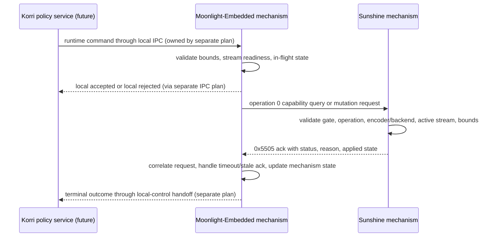

# feat: Harden Moonlight/Sunshine runtime settings mechanisms

## Summary

This plan hardens the Moonlight-Embedded and Sunshine mechanisms that a future Korri-owned adaptation service will call. It keeps policy out of both forks and focuses only on the native runtime-settings mechanism: capability probing, bounded command lifecycle, failure reasons, restore baselines, and proof gates for bitrate, FPS, and resolution changes.

---

## Problem Frame

Korri now has experimental runtime settings primitives across `moonlight-embedded-korri` and `sunshine-korri`, but they are still shaped like validation spikes: env-triggered one-shot sends, coarse Sunshine statuses, log-heavy evidence, and no formal host capability handshake. A separate Moonlight observability/local IPC effort owns the socket, schemas, and event transport; this plan covers the native Moonlight/Sunshine mechanism work that transport can eventually invoke.

---

## Requirements

- R1. Keep adaptive decision policy out of Moonlight-Embedded and Sunshine; both forks should expose mechanisms, facts, and bounded commands only.
- R2. Preserve the existing runtime settings packet IDs and operation IDs for bitrate, FPS, and resolution.
- R3. Add a formal capability/probe path so Moonlight can distinguish local command readiness from host/Sunshine operation support before mutation.
- R4. Make command lifecycle outcomes explicit inside the Moonlight runtime-settings mechanism: local reject, local accept, sent, host applied, host rejected, timed out, stale/late ack observed, and stream ended.
- R5. Add machine-readable failure reasons that are more specific than Sunshine's current broad numeric status values.
- R6. Bound and validate runtime setting values in Moonlight before sending and in Sunshine before applying.
- R7. Support explicit restore-to-baseline behavior without adding fork-owned auto-recovery policy.
- R8. Keep runtime resolution proof-gated; a Sunshine ack alone must not advertise production resolution support.
- R9. Maintain or improve Nix patch-invariant coverage for every wire/status/capability decision.
- R10. Preserve existing proven bitrate/FPS behavior on `h264_vaapi` and unsupported/invalid/disabled behavior on unproven paths.

---

## Scope Boundaries

- No Korri adaptation service, policy loop, product UI, telemetry dashboard, or profile system in this plan.
- No new Moonlight local IPC transport design, TypeScript protocol schema, local control client, or IPC event semantics; `docs/plans/2026-05-26-003-feat-moonlight-local-control-protocol-plan.md` owns that work.
- No LAN, HTTP, mDNS, Tailscale, or browser-facing control surface.
- No automatic quality adaptation inside Moonlight or Sunshine.
- No claim that runtime resolution is supported on Sobo/SM8550 until same-session decode/render proof exists.
- No broad backend support beyond paths that are explicitly proven and capability-advertised.
- No codec, HDR, preset, audio, encoder-selection, or app-launch renegotiation.

### Deferred to Follow-Up Work

- Korri-owned adaptation policy: consume Moonlight telemetry, decide when to change settings, and call the Moonlight command surface.
- Rich QoS telemetry and local IPC transport/schema details beyond the native mechanism hooks described here.
- SM8550 runtime resolution enablement after device-side decode/render evidence is captured.
- Upstreaming or redesign of the downstream packets once the mechanism proves durable.

---

## Context & Research

### Relevant Code and Patterns

- `packages/sunshine-korri/patches/0001-runtime-bitrate-restart-mvp.patch` carries the Sunshine `0x5504` request / `0x5505` ack implementation, operations `1` bitrate, `2` FPS, and `3` resolution.
- `packages/moonlight-embedded-korri/patches/0005-add-sunshine-runtime-settings-mvp.patch` carries the Moonlight one-shot sender, ack logging, and spike-era connection-status adaptation envs.
- `packages/moonlight-embedded-korri/patches/0006-add-local-control-observability-ipc.patch` is a related boundary only. This plan should not change its transport, TypeScript schema, command advertisement, or event model unless the local-control plan is updated in the same change.
- `packages/sunshine-korri/README.md` and `packages/moonlight-embedded-korri/README.md` document downstream patch scope and experimental status.
- `nix/tests/korri-sunshine-runtime-bitrate-patch-check.nix` is the current invariant check for Sunshine/Moonlight runtime settings patches and patched package builds.
- `docs/acceptance/sunshine-korri-runtime-bitrate-restart-2026-05-25.md` records proven bitrate/FPS behavior and status semantics.
- `docs/acceptance/sunshine-korri-runtime-resolution-2026-05-26.md` records that operation `3` is server/fake-client proven only and must not be overclaimed.
- `docs/brainstorms/2026-05-25-002-sunshine-live-settings-extension-spikes.md` identifies the active control stream as the safest live-settings extension seam.
- `docs/plans/2026-05-26-003-feat-moonlight-local-control-protocol-plan.md` defines the separate local observability/IPC work that should consume these hardened mechanisms.

### Institutional Learnings

- `docs/solutions/architecture-patterns/boot-scoped-control-plane-with-session-scoped-runner-2026-05-19.md`: keep control-plane seams explicit, private, permissioned, and session-scoped where runtime state is involved.
- `docs/solutions/workflow-issues/generic-game-stream-runner-validation-contract-2026-05-19.md`: validate streaming contracts through durable status/evidence rather than relying on ad hoc logs.
- `docs/solutions/architecture-patterns/kiosk-foreground-app-policy-over-gamescope-overlay-2026-05-24.md`: session policy belongs to the session/control owner, not to adapter flags.
- `docs/solutions/best-practices/prefer-real-implementations-over-mocks-2026-05-02.md`: prefer real package builds, real runtime dirs, and controllable process seams for stream validation.

### External References

- No additional external research is required for this plan. The work extends already-carried downstream Sunshine/Moonlight patches and repo-local validation patterns.

---

## Key Technical Decisions

- Keep the forks policy-free: Moonlight may translate commands and observe outcomes; Sunshine may validate/apply/reject; Korri decides when to act.
- Preserve existing packet and operation IDs: `0x5504`, `0x5505`, operation `1` bitrate, `2` FPS, and `3` resolution remain stable so existing evidence and tests stay meaningful.
- Add operation `0` as a runtime-settings capability query: use the existing request packet with a prefix-only payload, do not mutate media state, and return a `0x5505` capability ack.
- Keep capability results conservative: report only operations supported for the active session/backend/gate state; runtime resolution remains experimental/proof-gated even if Sunshine can apply it server-side.
- Extend settings acks additively with a reason field: Moonlight should parse both current no-reason acks and new reason-bearing acks during the transition; Sunshine should emit reason-bearing acks after both package patches are updated.
- Treat local command acceptance as non-terminal: a command is only successful after Sunshine applies or after Moonlight proves the relevant client-side outcome where needed.
- Use reason codes in addition to broad status: policy needs to distinguish invalid bounds, disabled gate, unsupported encoder/backend, apply failure, no ack, control-not-ready, conflict, stale ack, and proof-gated resolution.
- Keep restore explicit: Moonlight exposes launch baselines and lets Korri request normal set commands back to those values; Moonlight/Sunshine do not auto-restore based on their own network thresholds.
- Quarantine spike-era Moonlight adaptation envs: one-shot validation envs can remain for manual proof, but connection-status env adaptation should be documented and guarded as spike-only rather than a product path.

---

## Open Questions

### Resolved During Planning

- Should adaptation policy live in the forks? No. This plan explicitly keeps policy in Korri and limits the forks to mechanisms and outcomes.
- Should this duplicate the local IPC/observability work? No. The local socket, schemas, and generic event stream are owned by `docs/plans/2026-05-26-003-feat-moonlight-local-control-protocol-plan.md`.
- Should restore be a named fork-owned policy action? No. The mechanism should expose baselines and accept explicit set commands back to baseline values.
- Should resolution become a normal advertised capability now? No. It remains proof-gated until real client render/decode evidence exists.
- What wire shape should capability probing use? Operation `0` over the existing runtime-settings request/ack packet family, with a capability-specific ack payload.

### Deferred to Implementation

- Exact native helper names and patch hunk layout: implementation should minimize churn after inspecting the patched upstream source trees.
- Exact struct names and field order for capability/reason payloads: implementation should follow the operation `0` query and additive reason-bearing ack design, while choosing the smallest source layout that keeps Nix assertions clear.
- Exact timeout duration: choose a conservative default during implementation and document it in README/evidence.
- Whether existing env adaptation is removed immediately or guarded/deprecated first: prefer the smallest safe step that prevents product paths from depending on it.

---

## High-Level Technical Design

> *This illustrates the intended approach and is directional guidance for review, not implementation specification. The implementing agent should treat it as context, not code to reproduce.*

The important boundary is that Moonlight and Sunshine do not inspect network conditions or decide quality trade-offs. They make each requested mutation observable, bounded, and reversible enough for Korri to own those decisions later.

### Canonical mechanism vocabulary

| Category | Values | Notes |
|---|---|---|
| Broad Sunshine status | `applied`, `failed`, `invalid`, `disabled` | Maps to existing numeric statuses `0`, `1`, `2`, `3`; `failed` includes unsupported unless the reason clarifies it. |
| Reason code | `none`, `gate-disabled`, `invalid-bounds`, `invalid-payload`, `unsupported-encoder`, `unsupported-backend`, `unsupported-operation`, `apply-failed`, `control-not-ready`, `no-ack`, `conflict`, `stale-ack`, `stream-ended`, `proof-gated` | Used by Moonlight/Sunshine mechanism logs and command state. Local IPC can map these into its existing status vocabulary unless the separate local-control plan expands the schema. |
| Internal lifecycle | `locally-rejected`, `accepted`, `sent`, `host-applied`, `host-rejected`, `timed-out`, `stale-ack-observed`, `stream-ended` | Internal mechanism lifecycle, not necessarily public IPC statuses. |
| Capability operation | `query-capabilities` | Wire operation `0`; does not mutate media state. |
| Mutation operations | `set-bitrate`, `set-fps`, `set-resolution` | Existing wire operations `1`, `2`, and `3`. Resolution remains proof-gated. |

---

## Implementation Units

### U1. Document the runtime settings capability and reason-code contract

**Goal:** Turn the current spike-era status contract into a reviewable mechanism contract that can support policy outside the forks.

**Requirements:** R1, R2, R3, R4, R5, R8, R9

**Dependencies:** None

**Files:**
- Modify: `packages/sunshine-korri/README.md`
- Modify: `packages/moonlight-embedded-korri/README.md`
- Modify: `nix/tests/korri-sunshine-runtime-bitrate-patch-check.nix`

**Approach:**
- Document the distinction between local Moonlight readiness, host/Sunshine runtime-settings capability, and target-client proof.
- Document operation `0` as the non-mutating capability query while preserving operations `1`, `2`, and `3`.
- Document the canonical broad statuses, reason codes, and internal lifecycle vocabulary.
- Add documentation-level invariant checks that can pass in this unit; add native patch assertions in the units that implement each behavior.

**Execution note:** Start test-first by adding Nix assertions for documented contract markers, then update package READMEs to make those assertions pass.

**Patterns to follow:**
- `nix/tests/korri-sunshine-runtime-bitrate-patch-check.nix`
- `packages/sunshine-korri/README.md`
- `packages/moonlight-embedded-korri/README.md`

**Test scenarios:**
- Happy path: documentation/check invariants require existing packet IDs and operation IDs to remain unchanged.
- Happy path: documentation/check invariants require operation `0` capability query language and the canonical reason-code vocabulary.
- Edge case: patch invariants reject adding a new resolution adaptation env or advertising resolution as generally supported.
- Error path: patch invariants fail if the READMEs describe policy decisions inside Moonlight or Sunshine rather than Korri-owned policy.

**Verification:**
- The downstream READMEs and Nix checks describe one consistent mechanism contract before code relies on it.

---

### U2. Add Sunshine capability/probe and richer ack reasons

**Goal:** Add the Sunshine-side capability and reason payloads that Moonlight will parse in U3 to determine active-session support without scraping Sunshine logs.

**Requirements:** R2, R3, R5, R6, R8, R9, R10

**Dependencies:** U1

**Files:**
- Modify: `packages/sunshine-korri/patches/0001-runtime-bitrate-restart-mvp.patch`
- Modify: `packages/sunshine-korri/README.md`
- Modify: `nix/tests/korri-sunshine-runtime-bitrate-patch-check.nix`

**Approach:**
- Add operation `0` as a prefix-only runtime-settings capability query over the existing Sunshine control-stream extension seam.
- Return a `0x5505` capability ack for operation `0` with broad status, reason, supported operation list or bitset, current gate state, applied bitrate/FPS/resolution, conservative bounds, and encoder/backend support where practical.
- Add a machine-readable reason alongside broad ack status for both synchronous rejections and async apply results.
- Preserve current applied values on invalid/disabled/unsupported responses.
- Keep resolution marked experimental/proof-gated even when Sunshine can rebuild the encoder session.

**Execution note:** Add failing patch-check assertions first for operation `0`, capability ack markers, reason-code markers, and current-applied-value preservation.

**Patterns to follow:**
- Existing `RUNTIME_SETTINGS_*` constants in `packages/sunshine-korri/patches/0001-runtime-bitrate-restart-mvp.patch`
- Existing `queued=1` versus final `status=...` logging distinction
- Existing applied-dimension tracking for runtime resolution

**Test scenarios:**
- Happy path: operation `0` capability/probe on `h264_vaapi` reports bitrate and FPS as supported with current applied values.
- Happy path: operation `0` does not report production runtime resolution support without target-client proof.
- Edge case: disabled gate reports disabled capability/reason without queueing an apply request.
- Edge case: unsupported HEVC path reports unsupported encoder/backend reason and preserves current applied values.
- Error path: malformed/runt capability or settings payload returns invalid reason without mutating state.
- Error path: async encoder restart failure returns apply-failed reason and the previous applied state.

**Verification:**
- Sunshine emits a capability/reason contract that Moonlight can consume in U3.
- Existing bitrate/FPS live-smoke behavior remains unchanged on the proven `h264_vaapi` path.

---

### U3. Harden Moonlight runtime-settings command lifecycle and timeout handling

**Goal:** Convert Moonlight from an env-triggered sender/logger into a bounded native command mechanism that can later be driven by local IPC without owning adaptation policy.

**Requirements:** R1, R3, R4, R5, R6, R9, R10

**Dependencies:** U1, U2

**Files:**
- Modify: `packages/moonlight-embedded-korri/patches/0005-add-sunshine-runtime-settings-mvp.patch`
- Modify: `packages/moonlight-embedded-korri/README.md`
- Modify: `nix/tests/korri-sunshine-runtime-bitrate-patch-check.nix`

**Approach:**
- Introduce one internal Moonlight runtime-settings command helper that one-shot env validation can call now and local IPC dispatch can call later through the boundary owned by the local-control plan.
- Track request IDs, operation family, in-flight command state, sent time, and terminal outcome inside the runtime-settings mechanism.
- Reject commands locally when the stream/control channel is not ready, values are out of bounds, a same-family command is already in flight, or the command is not advertised by host capabilities.
- Record terminal outcomes for applied, invalid, disabled, unsupported, failed, timed-out/no-ack, stale-ack-observed, conflict, and stream-ended.
- Parse Sunshine operation `0` capability acks and reason-bearing settings acks, while retaining compatibility with current no-reason acks during the transition.
- Keep one-shot envs for manual validation, but mark connection-status env adaptation as spike-only and prevent new work from extending it into product policy.

**Execution note:** Write invariant checks for timeout/conflict/spike-only adaptation before changing behavior.

**Patterns to follow:**
- `packages/moonlight-embedded-korri/patches/0005-add-sunshine-runtime-settings-mvp.patch`
- Command response boundary described by `docs/plans/2026-05-26-003-feat-moonlight-local-control-protocol-plan.md`

**Test scenarios:**
- Happy path: a valid bitrate command is accepted locally, sent to Sunshine, correlated with an applied ack, and records a terminal applied outcome.
- Happy path: a valid FPS command follows the same lifecycle without interfering with bitrate state.
- Edge case: two same-family commands before the first terminal outcome return conflict for the second command.
- Edge case: a late ack after timeout is classified as `stale-ack-observed`, logged/recorded diagnostically, and does not overwrite the timed-out terminal outcome.
- Error path: command before control stream readiness returns control-not-ready without sending a Sunshine packet.
- Error path: command value outside Moonlight bounds is rejected locally without sending a Sunshine packet.
- Error path: unpatched/no-ack host produces a timed-out outcome with the original command correlation ID.
- Integration: one-shot validation envs still work for manual smoke tests after the shared command helper is introduced.

**Verification:**
- Moonlight can act as a deterministic command bridge for a future Korri policy service without embedding network-quality thresholds or adaptation decisions.

---

### U4. Add explicit baseline/restore mechanism support

**Goal:** Ensure future Korri policy can safely recover from downshifts by restoring launch-time bitrate, FPS, and resolution through explicit commands.

**Requirements:** R1, R4, R6, R7, R8, R9, R10

**Dependencies:** U2, U3

**Files:**
- Modify: `packages/moonlight-embedded-korri/patches/0005-add-sunshine-runtime-settings-mvp.patch`
- Modify: `packages/sunshine-korri/patches/0001-runtime-bitrate-restart-mvp.patch`
- Modify: `packages/moonlight-embedded-korri/README.md`
- Modify: `packages/sunshine-korri/README.md`
- Modify: `nix/tests/korri-sunshine-runtime-bitrate-patch-check.nix`

**Approach:**
- Track launch baseline values separately from current applied values in both mechanisms where needed.
- Expose baseline values to the Moonlight command helper so a future Korri policy can send normal set commands back to baseline.
- Avoid adding automatic restore behavior based on network status inside either fork.
- Ensure bitrate and FPS restore are covered first; resolution restore remains experimental and proof-gated like any other runtime resolution command.
- Request or preserve keyframe/IDR behavior after runtime changes where it is already required for visible recovery.

**Execution note:** Add characterization checks for current applied versus launch baseline before modifying restore-related state.

**Patterns to follow:**
- Existing `session->config.monitor.*` launch settings in the Sunshine patch
- Existing current applied resolution tracking in the Sunshine patch
- Existing runtime settings snapshot language in `packages/moonlight-embedded-korri/README.md`

**Test scenarios:**
- Happy path: after a bitrate downshift, an explicit set-to-launch-bitrate command restores the launch bitrate and records applied status.
- Happy path: after an FPS downshift, an explicit set-to-launch-FPS command restores the launch FPS and records applied status.
- Edge case: restore command when already at baseline returns applied or no-op-equivalent success without mutating unrelated settings.
- Edge case: restore resolution is not advertised as generally supported until the resolution proof gate is satisfied.
- Error path: unsupported encoder restore returns unsupported reason with current applied values.
- Integration: baseline values remain stable even after multiple current-applied updates.

**Verification:**
- A future Korri policy service can implement recovery without relying on hidden fork state or fork-owned auto-policy.

---

### U5. Enforce runtime resolution proof gates on the mechanism

**Goal:** Prevent runtime resolution from being treated as a supported adaptive operation until Moonlight proves the target client survived it.

**Requirements:** R1, R3, R5, R6, R8, R9, R10

**Dependencies:** U1, U2, U3

**Files:**
- Modify: `packages/moonlight-embedded-korri/patches/0005-add-sunshine-runtime-settings-mvp.patch`
- Modify: `packages/sunshine-korri/patches/0001-runtime-bitrate-restart-mvp.patch`
- Modify: `packages/moonlight-embedded-korri/README.md`
- Modify: `packages/sunshine-korri/README.md`
- Modify: `nix/tests/korri-sunshine-runtime-bitrate-patch-check.nix`
- Modify: `docs/acceptance/sunshine-korri-runtime-resolution-2026-05-26.md`

**Approach:**
- Keep Sunshine's ability to reject/apply operation `3` on the narrow proven server path, but do not allow that alone to advertise production support.
- In Moonlight, treat resolution command exposure as experimental/proof-gated unless a separate observability or device-validation effort has already produced same-session client proof for the target path.
- Require operation `3` outcomes and documentation to distinguish Sunshine-applied from client-proven so Korri cannot mistake server ack for end-to-end success.
- Preserve conservative validation: even dimensions, same aspect ratio, same-or-smaller than launch, current applied dimensions in failure acks, and backend support gating.

**Execution note:** Start with failing checks that reject general runtime resolution capability advertisement without explicit experimental/proof-gated language.

**Patterns to follow:**
- `docs/acceptance/sunshine-korri-runtime-resolution-2026-05-26.md`
- Current operation `3` validation and applied-dimension tracking in `packages/sunshine-korri/patches/0001-runtime-bitrate-restart-mvp.patch`

**Test scenarios:**
- Happy path: fake-client Sunshine-applied resolution still reports server-applied but remains experimental/not client-proven.
- Edge case: odd dimensions, aspect mismatch, and upshift beyond launch return invalid with current applied dimensions.
- Edge case: disabled gate returns disabled with current applied dimensions.
- Error path: unsupported encoder returns unsupported reason with current applied dimensions.
- Integration: without a pre-existing proof-positive same-session result, runtime resolution remains experimental/proof-gated even when Sunshine reports applied.

**Verification:**
- Documentation and patch checks prevent accidental product claims that runtime resolution is supported before Sobo/SM8550 evidence exists.

---

### U6. Refresh package checks, evidence, and downstream patch documentation

**Goal:** Make the hardened mechanism reviewable and shippable as carried downstream patches.

**Requirements:** R2, R5, R8, R9, R10

**Dependencies:** U1, U2, U3, U4, U5

**Files:**
- Modify: `packages/sunshine-korri/README.md`
- Modify: `packages/moonlight-embedded-korri/README.md`
- Modify: `nix/tests/korri-sunshine-runtime-bitrate-patch-check.nix`
- Modify: `docs/acceptance/sunshine-korri-runtime-bitrate-restart-2026-05-25.md`
- Modify: `docs/acceptance/sunshine-korri-runtime-resolution-2026-05-26.md`

**Approach:**
- Update READMEs so reviewers can understand which behavior is supported, experimental, spike-only, or deferred.
- Update Nix patch checks to assert capability query, reason, timeout, conflict, baseline, and proof-gate invariants.
- Extend acceptance evidence with any new live smoke runs for `h264_vaapi` bitrate/FPS and negative cases.
- Keep evidence wording precise: local command accepted, Sunshine acked, Sunshine applied, and client-side proof are separate claims.

**Execution note:** Treat Nix invariant checks as the primary regression suite for the downstream native patches; do not replace them with Bun-only tests.

**Patterns to follow:**
- `docs/acceptance/sunshine-korri-runtime-bitrate-restart-2026-05-25.md`
- `docs/acceptance/sunshine-korri-runtime-resolution-2026-05-26.md`
- `nix/tests/korri-sunshine-runtime-bitrate-patch-check.nix`

**Test scenarios:**
- Happy path: patched `sunshine-korri` and `moonlight-embedded-korri` packages build through the relevant Nix checks.
- Happy path: `h264_vaapi` bitrate and FPS smoke evidence still reaches applied status.
- Edge case: disabled, invalid, unsupported, timeout, and conflict outcomes are covered by checks or documented smoke evidence.
- Error path: evidence docs do not claim runtime resolution support without client-side proof.

**Verification:**
- The branch has native package/build evidence plus acceptance documentation for every supported or intentionally unsupported outcome.

---

## System-Wide Impact

- **Interaction graph:** Future Korri policy calls Moonlight local control; Moonlight translates to Sunshine runtime settings packets; Sunshine applies or rejects; Moonlight correlates the result through the native handoff owned by the local-control plan. This plan hardens the Moonlight/Sunshine middle of that graph only.
- **Error propagation:** Local validation failures should not reach Sunshine. Sunshine failures should return broad status plus reason and current applied values. Moonlight timeouts should become terminal command outcomes; stale acks should be explicitly classified as stale diagnostics and must not overwrite terminal state.
- **State lifecycle risks:** In-flight command tracking, late acks, stream teardown, and baseline/current-applied drift can create false policy inputs if not modeled explicitly.
- **API surface parity:** One-shot env validation and future local IPC command dispatch should share the same Moonlight runtime-settings command helper, but IPC schema/transport changes remain in the local-control plan.
- **Integration coverage:** Nix patch invariants prove source-level contracts; live smoke is still needed for `h264_vaapi` bitrate/FPS and any future resolution support claim.
- **Unchanged invariants:** Existing packet IDs, operation IDs `1`/`2`/`3`, numeric broad statuses, and `h264_vaapi` support gate remain stable. Sunshine remains the enforcement point; Moonlight remains the client command bridge; Korri remains the policy owner.

---

## Risks & Dependencies

| Risk | Mitigation |
|------|------------|
| Capability/probe additions accidentally break existing applied acks | Preserve packet IDs and mutation operation IDs; add operation `0` for capability; make reason-bearing acks additive and keep Moonlight able to parse current no-reason acks during transition. |
| Fork-owned adaptation policy grows through the existing connection-status env hook | Mark the hook spike-only, avoid adding new thresholds, and require local IPC/Korri correlation for future product adaptation. |
| Reason codes drift between Sunshine and Moonlight | Define the reason vocabulary in both READMEs and assert constants/mappings in Nix patch checks. |
| In-flight commands race with stream teardown or late acks | Model terminal states and stale acks in Moonlight before exposing commands to Korri policy. |
| Restore mutates the wrong baseline after multiple runtime changes | Track launch baseline separately from current applied values and test downshift-then-restore flows. |
| Runtime resolution is overclaimed because Sunshine returns status `0` | Keep capability proof-gated and require client-side decoded/rendered-frame evidence before production advertisement. |
| Patch complexity becomes hard to review | Keep units atomic, update READMEs with removal/upstream policy, and prefer source invariant checks for key contracts. |

---

## Documentation / Operational Notes

- Update package READMEs before or alongside native patch changes so reviewers understand which behavior is supported versus experimental.
- Acceptance docs must distinguish four layers of truth: local command accepted, Sunshine acked, Sunshine applied, and Moonlight/client proved survival.
- Runtime resolution evidence remains separate from bitrate/FPS evidence because its proof burden is higher.
- Any live smoke should clean up ephemeral Sunshine processes and leave the normal Sunshine service active.

---

## Sources & References

- Related source: `docs/brainstorms/2026-05-25-002-sunshine-live-settings-extension-spikes.md`
- Related plan: `docs/plans/2026-05-26-003-feat-moonlight-local-control-protocol-plan.md`
- Related code: `packages/sunshine-korri/patches/0001-runtime-bitrate-restart-mvp.patch`
- Related code: `packages/moonlight-embedded-korri/patches/0005-add-sunshine-runtime-settings-mvp.patch`
- Related boundary: `packages/moonlight-embedded-korri/patches/0006-add-local-control-observability-ipc.patch`
- Related tests: `nix/tests/korri-sunshine-runtime-bitrate-patch-check.nix`
- Evidence: `docs/acceptance/sunshine-korri-runtime-bitrate-restart-2026-05-25.md`
- Evidence: `docs/acceptance/sunshine-korri-runtime-resolution-2026-05-26.md`
