# feat: Add libretro-fake-08 derivation to Korri kiosk closure

> **Deviation (2026-05-27)** — this plan's mechanism (`pkgs.retroarch-bare.passthru.wrapper { cores = [ libretro-fake-08 ]; }`) was superseded during implementation. The nixpkgs wrapper silently prepends `-L <coredir> --appendconfig=<cfg>` to every retroarch invocation, which broke Korri's launcher contract (the launcher passes its own `-L <core> <content>` and expects an unmodified argv). RetroArch saw two `-L` flags, fell back to extension-based routing, and loaded the built-in `image display` core for `.p8.png` carts. Replaced with `pkgs.symlinkJoin { paths = [ pkgs.retroarch-bare pkgs.libretro-fake-08 ]; passthru = { cores = ...; unwrapped = ...; }; }` in commit `778845d`. The constraints R5 ("exactly one libretro core") and R6 ("single seam at `nix/images/kiosk.nix`") still hold; the closure-shape assertion at line 107 is now answered by the symlinkJoin's `passthru.cores`/`passthru.unwrapped` propagation. See [runtime-errors/retroarch-bare-passthru-wrapper-injects-l-coredir-2026-05-27](../solutions/runtime-errors/retroarch-bare-passthru-wrapper-injects-l-coredir-2026-05-27.md) for the trap detail and the corrected nix expression.

## Summary

Package the fake-08 libretro core as a new Korri-downstream Nix derivation at `packages/libretro-fake-08/`, sourced via a new `fake-08-src` flake input threaded through the existing `korri-packages` overlay. Add a minimal RetroArch wrapper carrying only this core to the shared kiosk product module so every Korri kiosk image (Sobo, Thor, x86, live USB) gains the runtime needed to launch a PICO-8 cart. The package's evaluation test is colocated at `packages/libretro-fake-08/check.nix` — a new convention this plan establishes. RetroArch is constructed via `retroarch-bare`'s wrapper with an explicit single-core list so no incidental cores leak into the closure, and the closure-shape constraint is enforced by an assertion in the existing system-level checks.

---

## Problem Frame

Korri's kiosk images need a PICO-8 runtime that runs in the Nix-on-rocks guest, not on the ROCKNIX host. ROCKNIX ships fake-08 and the standalone pico-8 binary on the host, but Korri launches everything from inside the guest closure, so the host packaging is unreachable. Nothing in `packages/`, the overlay, or any kiosk image currently provides a libretro runtime, and `pkgs.retroarch-bare` plus `pkgs.libretro.*` from nixpkgs is the natural seam. fake-08 is not in nixpkgs, so a fresh derivation is required.

A secondary concern: `pkgs.retroarch` and `pkgs.retroarch-full` bundle a default core set that would meaningfully grow the guest closure on every image. Whatever this plan wires in must be explicitly single-core and remain so under future churn.

---

## Requirements

- R1. `libretro-fake-08` is buildable as a flake output on `aarch64-linux` and `x86_64-linux`.
- R2. Source is pinned via a new flake input (`fake-08-src`) and consumed through the existing `korri-packages` overlay, mirroring how `nix-on-rocks` is threaded today.
- R3. The package lives at `packages/libretro-fake-08/` and follows the structural shape of `packages/sunshine-korri/` and `packages/moonlight-embedded-korri/` (own `package.nix`, own `README.md`).
- R4. The package's evaluation check is colocated at `packages/libretro-fake-08/check.nix` and wired into `self.checks.${system}` from `flake.nix`. The existing `nix/tests/` files are not migrated.
- R5. Every Korri kiosk image (Sobo SM8550, Thor, x86, live USB) ships a RetroArch closure that contains **exactly one** libretro core: `libretro-fake-08`. The constraint is enforced by an assertion in the existing system-level checks, not by convention alone.
- R6. The shared kiosk product module (`nix/images/kiosk.nix`) is the single seam adding RetroArch + fake-08 to compositor PATH — no per-platform duplication.
- R7. `nix flake check` passes on the system where this work lands; the colocated check and the kiosk closure assertion both fire.

---

## Scope Boundaries

- Korri cascade YAML entries (system `pico-8`, launcher record, core mapping, gamelist importer behavior) — separate cascade-side plan.
- Any libretro core other than fake-08 (snes9x, picodrive, mGBA, etc.).
- The licensed standalone `pico8_64` binary, its wrapper script, or any path that requires the Lexaloffle license.
- PICOLOVE, LIKO-12, TIC-80, zepto8, or any other PICO-8-flavored runtime.
- ROCKNIX host changes (the host already ships fake08-lr; Korri doesn't reach into it).
- Cart placement at `/storage/roms/pico-8/` on the device (operator step).
- Migrating existing `nix/tests/korri-*-check.nix` files to colocated layout (new convention starts with this package only).
- Per-platform Sway window-class rules for RetroArch. The generic foreground-session policy added in the foreground-session phase 1-3 work is the canonical foreground owner; the cascade-side plan activates it for RetroArch when the launcher record lands.
- Audio/inputd plumbing changes (RetroArch's defaults sit cleanly atop the existing PipeWire and inputplumber configuration).

### Deferred to Follow-Up Work

- Korri cascade preset wiring for PICO-8: separate cascade plan. The package and runtime are necessary preconditions; the cascade plan supplies the system/launcher/core records that resolve a `.p8` cart to `retroarch -L fake08_libretro.so <cart>`.

---

## Context & Research

### Relevant Code and Patterns

- `packages/moonlight-embedded-korri/package.nix` — fresh `stdenv.mkDerivation`, takes a flake input as a named argument, imports an upstream manifest to reuse source/cmakeFlags/patches, writes a provenance manifest into `$out/nix-support/`. Direct template for the new derivation, minus the manifest-import detail (fake-08 has no upstream Nix manifest to reuse — source comes straight from the flake input).
- `packages/sunshine-korri/package.nix` — `overrideAttrs` style; less applicable here because fake-08 has no nixpkgs base to override.
- `nix/overlays/korri-packages.nix` — closes over `{ nix-on-rocks }` and returns `final: prev: { ... }`. The new input `fake-08-src` is threaded the same way; the overlay grows one new attribute, `libretro-fake-08`.
- `flake.nix` — threads `nix-on-rocks` into the overlay at four sites (per-system, korriImages, rocknixImages, nixosModule wrapper). `self.checks.${system}` is composed from several `optionalAttrs` blocks gated by `isX86Linux` / `pkgs.stdenv.isLinux`. Downstream packages are exposed at flake top level as `sunshine-korri` and `moonlight-embedded-korri`; `libretro-fake-08` follows the same pattern.
- `nix/tests/korri-sunshine-runtime-bitrate-patch-check.nix` and `nix/tests/korri-moonlight-control-protocol-patch-check.nix` — shape for an evaluation-time check: function takes `pkgs` and explicit paths, builds a `checks` list of `{ message; assertion; }` records, throws on first failure, otherwise emits a `runCommand` that also runs `test -x .../bin/...`. The colocated `packages/libretro-fake-08/check.nix` follows the same function shape but its file argument is the produced derivation, not patch paths.
- `nix/images/kiosk.nix` — currently zero package additions; only flips `services.korri.*` flags. All kiosk images (SM8550 Sobo/Thor, x86, live USB) flow through `mkKioskSystem` → `kiosk.nix`. A hardware-fact regex guard prohibits SM8550/RockNix strings here, so the addition must be device-neutral.
- `nix/modules/korri-compositor.nix` — defines `services.korri.compositor.path` (sway unit PATH; this is where Sobo currently injects `moonlight-embedded` and `cemu`). The minimal RetroArch goes through the same seam from `kiosk.nix`.
- `nix/tests/korri-rocknix-sm8550-config-check.nix` (and Thor / x86 / live-USB analogues) — already asserts package presence in evaluated systems. The closure-shape assertion extends these.
- `pkgs.retroarch-bare.passthru.wrapper { cores = [ ... ]; settings = { ... }; }` — canonical entrypoint in nixpkgs-unstable for building a RetroArch with an exact, declared core set. Avoids `pkgs.retroarch` (omnibus) and avoids `pkgs.retroarch.withCores (cores: [ ... ])` which selects from the upstream bundled set rather than naming arbitrary derivations.
- fake-08 upstream build: `make -C platform/libretro` produces `platform/libretro/fake08_libretro.so` and `fake08_libretro.info`. The package.mk in `~/code/sandbox/rocknix/projects/ROCKNIX/packages/emulators/libretro/fake08-lr/` is a faithful reference for the install step (copies both files to a target lib dir).

### Institutional Learnings

- `docs/solutions/architecture-patterns/kiosk-foreground-app-policy-over-gamescope-overlay-2026-05-24.md` — explicitly argues against `for_window [class="RetroArch"] fullscreen enable`. The generic kiosk/session foreground policy is the owner; new launchable surfaces ride that policy. This plan honors the principle by not adding any per-app Sway rule.
- `docs/solutions/integration-issues/odin-electrobun-webkit-runtime-white-screen-2026-05-04.md` — precedent for cohesive-input pinning: new flake inputs become inputs threaded through the overlay, with cross-platform availability proven by an explicit aarch64 build. Direct template for `fake-08-src`.
- `docs/solutions/workflow-issues/generic-game-stream-runner-validation-contract-2026-05-19.md` — warns against per-package Justfile recipes; the existing generic `--override-input` plumbing covers any future input swap.

### External References

- fake-08 upstream README: `https://github.com/jtothebell/fake-08` — describes the libretro build target, the .so/.info pair, and notes its dependency lineage (z8lua, ported audio from zepto8).
- nixpkgs `retroarch-bare` and `libretro.mkLibretroCore`: in `pkgs/applications/emulators/retroarch/` of the pinned nixpkgs-unstable.

---

## Key Technical Decisions

- **Source via a `fake-08-src` flake input, `flake = false`.** Threaded through `nix/overlays/korri-packages.nix` the same way `nix-on-rocks` is today. Rationale: matches the established Korri pattern, gives reproducible pinning, sidesteps `fetchFromGitHub` hash churn at the call site, and aligns with the `--override-input` validation contract for downstream consumers.
- **Attribute name is `libretro-fake-08`, no `-korri` suffix.** Rationale: the `-korri` suffix in `moonlight-embedded-korri` / `sunshine-korri` denotes downstream patches against an upstream that nixpkgs already provides. fake-08 has no nixpkgs base; this is a vendored core derivation, not a downstream fork.
- **Minimal RetroArch via `retroarch-bare`'s `passthru.wrapper { cores = [ libretro-fake-08 ]; }`.** Rationale: `pkgs.retroarch` and `pkgs.retroarch.withCores` both default to bundled cores; only `retroarch-bare` ships zero cores and accepts an arbitrary derivation list. The wrapper consumes each core's `passthru.libretroCore` (a string path — `"/lib/retroarch/cores"`) to compose `-L` flags and reads `passthru.core` for identification; U2 sets both attributes per the nixpkgs `mkLibretroCore` contract.
- **Place the RetroArch + core injection in `nix/images/kiosk.nix`, not in any platform file.** Rationale: every kiosk image flows through `mkKioskSystem` → `kiosk.nix`, so one addition reaches Sobo, Thor, x86, and live USB. Per-platform additions would invite drift.
- **Inject via `services.korri.compositor.path`, not `environment.systemPackages`.** Rationale: the compositor unit's PATH is the seam Korri's launch flow consults; moonlight-embedded and cemu already use it. System-wide PATH inclusion would expose RetroArch to non-Korri consumers without purpose and grow the system closure unnecessarily.
- **Colocated check at `packages/libretro-fake-08/check.nix` for the package itself; closure-shape assertion in existing `nix/tests/*-config-check.nix` files.** Rationale: the package's "is the .so built and well-formed" question belongs next to the package; the "RetroArch in this kiosk system contains exactly one core" question is a system composition question and belongs with the existing system-level checks that already assert package presence per platform. This split preserves the existing centralized-check convention for system-level concerns while introducing colocation only where it pulls its weight.
- **No migration of `nix/tests/` to colocated layout.** Rationale: this plan is the first colocated check; migrating sixteen existing files is an unrelated scope expansion. The convention starts here and may expand later via a separate doc/plan if it earns its keep.

---

## Open Questions

### Resolved During Planning

- "Where do RetroArch and the core get wired in?" — `services.korri.compositor.path` in `nix/images/kiosk.nix`. Resolved by reading `nix/images/platforms/rocknix-sm8550.nix` (uses compositor.path for moonlight-embedded and cemu).
- "Does the closure need a Sway window-class rule for RetroArch?" — No. The foreground-session phase 1–3 work landed a generic foreground policy; per-app Sway rules contradict `docs/solutions/architecture-patterns/kiosk-foreground-app-policy-over-gamescope-overlay-2026-05-24.md`. The cascade-side plan activates the generic policy for RetroArch when the launcher record lands.
- "Will the colocation convention conflict with the existing `nix/tests/` discovery in `flake.nix`?" — No. Checks are exposed as `self.checks.${system}.<name>`; the file location is a sourcing detail. `flake.nix` will import `./packages/libretro-fake-08/check.nix` alongside the existing `./nix/tests/*` imports.
- "Should `retroarch-bare` be exposed as a flake output too?" — No. It's a composition detail of the kiosk module, not a Korri-downstream package. Exposing it would invite drift between the flake output and the kiosk closure.

### Deferred to Implementation

- Exact upstream commit for `fake-08-src.url` — pick the latest stable upstream tag/commit when implementing; verify the libretro build target produces both `.so` and `.info` on a clean checkout. Document the picked rev in the package README.
- Whether the RetroArch wrapper needs a `settings = { ... }` override (e.g., for default core directory or input driver). Likely no — retroarch-bare's defaults plus the single-core list is sufficient — but determinable only by running `retroarch -L fake08_libretro.so` against a sample cart during implementation smoke-testing.
- Exact form of the closure-shape assertion: `lib.length (cores in wrapper)` against the wrapper's `passthru.cores`, vs a derivation-name regex over the closure. The first is cleaner if `retroarch-bare`'s wrapper exposes `cores` via `passthru`; the second is a safe fallback. Confirmed during U5.

---

## High-Level Technical Design

> *This illustrates the intended dependency shape and is directional guidance for review, not implementation specification. The implementing agent should treat it as context, not code to reproduce.*

```mermaid
flowchart TB
  subgraph inputs[Flake inputs]
    A[fake-08-src<br/>flake=false]
    B[nix-on-rocks]
  end

  subgraph overlay[nix/overlays/korri-packages.nix]
    O1[libretro-fake-08]
    O2[moonlight-embedded]
    O3[sunshine]
  end

  subgraph pkg[packages/libretro-fake-08/]
    P1[package.nix]
    P2[check.nix]
    P3[README.md]
  end

  subgraph kiosk[nix/images/kiosk.nix]
    K1["services.korri.compositor.path<br/>+= retroarch-bare.wrapper { cores = [ fake-08 ] }"]
  end

  subgraph checks["self.checks.&#36;{system}"]
    C1[libretro-fake-08-check<br/>colocated]
    C2[korri-rocknix-sm8550-config<br/>covers Sobo + Thor<br/>+ closure-shape assertion]
    C3[korri-image-outputs-check<br/>covers x86 kiosk<br/>+ closure-shape assertion]
    C4[korri-live-usb-config<br/>+ closure-shape assertion]
  end

  A --> O1
  B --> O2
  P1 --> O1
  O1 --> K1
  K1 --> C2
  K1 --> C3
  K1 --> C4
  P1 --> C1
  P2 --> C1
```

---

## Implementation Units

### U1. Add `fake-08-src` flake input and thread it into the overlay

**Goal:** Bring the fake-08 upstream source into the flake's dependency graph and make it available to derivations through the existing overlay closure.

**Requirements:** R2

**Dependencies:** None

**Files:**
- Modify: `flake.nix`
- Modify: `flake.lock` (auto-updated by `nix flake lock`)
- Modify: `nix/overlays/korri-packages.nix`

**Approach:**
- Add `inputs.fake-08-src.url = "github:jtothebell/fake-08?ref=<pinned-tag-or-rev>";` and `inputs.fake-08-src.flake = false;` to `flake.nix`. The exact ref is picked during implementation (see Open Questions — Deferred). Do **not** ship the default-branch form; that violates the pin-policy in Risks.
- Add `fake-08-src` to the destructured `outputs = { self, nixpkgs, ..., nix-on-rocks, fake-08-src, ... }: ...` argument list.
- Thread `fake-08-src` into the `import ./nix/overlays/korri-packages.nix { nix-on-rocks; fake-08-src; }` call at all four sites (per-system pkgs, korriImages helper, rocknixImages helper, nixosModule wrapper). Match the existing `nix-on-rocks` threading pattern site-for-site.
- In `nix/overlays/korri-packages.nix`, add `fake-08-src` to the top-level `{ nix-on-rocks, fake-08-src }:` argument and add a new `libretro-fake-08 = final.callPackage ../../packages/libretro-fake-08/package.nix { inherit fake-08-src; };` attribute alongside the existing `moonlight-embedded` and `sunshine` substitutions.

**Patterns to follow:**
- `nix-on-rocks` threading through `flake.nix` → `korri-packages.nix` is the direct template.

**Test scenarios:**
- Happy path: `nix flake metadata` shows the new `fake-08-src` input pinned with a `lastModified` and `narHash`.
- Happy path: `nix eval .#legacyPackages.${system}.libretro-fake-08.outPath` resolves (even if the derivation isn't built yet) — proves the overlay attribute exists and the `callPackage` wiring is well-formed.
- Edge case: every site in `flake.nix` that previously called `import ./nix/overlays/korri-packages.nix` now passes `fake-08-src`. Missing one breaks one of the four image build paths silently; the test for this lives in U5 (closure-shape checks per image).

**Verification:**
- `nix flake check` does not regress.
- `nix flake metadata --json | jq '.locks.nodes | keys'` includes `fake-08-src`.

---

### U2. Create `packages/libretro-fake-08/package.nix`

**Goal:** Build the fake-08 libretro core (`.so` and `.info`) as a Nix derivation from the `fake-08-src` flake input.

**Requirements:** R1, R3

**Dependencies:** U1

**Files:**
- Create: `packages/libretro-fake-08/package.nix`

**Approach:**
- `stdenv.mkDerivation` style, taking `{ lib, stdenv, fake-08-src }:` as arguments (mirroring how `moonlight-embedded-korri/package.nix` takes `nix-on-rocks`).
- `src = fake-08-src;`.
- Version derived from `fake-08-src.shortRev` (or `lastModifiedDate` fallback for branch-tracking pins).
- `buildPhase` runs `make -C platform/libretro` (matches upstream and ROCKNIX's package.mk). The libretro Makefile's `platform=unix` branch is dependency-light (gcc/g++ and `-lm`); no SDL, pkg-config, or devkitpro headers required — stdenv alone suffices.
- `installPhase` copies the **built** `platform/libretro/fake08_libretro.so` (build output) **and** the **source-tree** `platform/libretro/fake08_libretro.info` (checked-in, not produced by the Makefile) to `$out/lib/retroarch/cores/` — the canonical path consumed by `retroarch-bare`'s wrapper.
- Set `passthru = { libretroCore = "/lib/retroarch/cores"; core = "fake08"; };` matching the nixpkgs libretro core contract (see `pkgs/by-name/re/retroarch-bare/wrapper.nix` and `pkgs/applications/emulators/libretro/mkLibretroCore.nix`). `libretroCore` is the **string path** consumed by the wrapper's `coresPath` lookup; `core` is the identifier the wrapper's `longDescription` and U5's assertion read. Boolean `libretroCore` or `coreName` attributes will not satisfy the wrapper.
- Write a `$out/nix-support/libretro-fake-08/manifest.txt` provenance file naming the upstream commit, mirroring the moonlight-embedded-korri pattern.
- `meta` includes upstream URL, MIT license, and `platforms = lib.platforms.linux`.

**Patterns to follow:**
- `packages/moonlight-embedded-korri/package.nix` for the overall shape (fresh derivation, manifest file, `meta` block). The `nix-on-rocks` manifest import has no analogue here — version comes from the flake input directly.

**Test scenarios:**
- Happy path: `nix build .#libretro-fake-08` succeeds on `x86_64-linux`; output contains `lib/retroarch/cores/fake08_libretro.so` and `fake08_libretro.info`.
- Happy path: `nix build .#packages.aarch64-linux.libretro-fake-08` succeeds on a host with aarch64-linux available (extra-platforms or remote builder). Covers R1.
- Happy path: the `.so` is non-empty and `file $out/lib/retroarch/cores/fake08_libretro.so` reports an ELF shared object for the target architecture.
- Edge case: the manifest provenance file exists and contains the pinned commit.

**Verification:**
- Both architecture builds land in the store.
- `nix-store --query --references $out` shows no leakage of build-only deps into runtime.

---

### U3. Create colocated check and wire into flake `checks`

**Goal:** Establish the colocated `check.nix` convention. Assert that the produced `libretro-fake-08` derivation is well-formed: `.so` and `.info` present, manifest provenance present, ELF magic on the `.so`.

**Requirements:** R4, R7

**Dependencies:** U2

**Files:**
- Create: `packages/libretro-fake-08/check.nix`
- Modify: `flake.nix` (extend `self.checks.${system}` with the new check)

**Approach:**
- Function shape: `{ pkgs, libretroFake08Package }: pkgs.runCommand "libretro-fake-08-check" { ... } "...";` — matches the shape of `nix/tests/korri-sunshine-runtime-bitrate-patch-check.nix` but takes the produced derivation as the artifact under test rather than a patch file.
- Inside the runCommand: `test -f ${libretroFake08Package}/lib/retroarch/cores/fake08_libretro.so`, `test -f .../fake08_libretro.info`, `test -f ${libretroFake08Package}/nix-support/libretro-fake-08/manifest.txt`, plus an ELF magic check on the `.so` via `head -c4`.
- In `flake.nix`, add `libretro-fake-08-check = import ./packages/libretro-fake-08/check.nix { pkgs = ...; libretroFake08Package = self.packages.${system}.libretro-fake-08; };` to the `self.checks.${system}` block. Use the same `optionalAttrs` gating used by sibling checks if the package isn't buildable on a given system (none expected, but follow the convention).
- Mirror the `ownerMatrix` tagging used by `nix/tests/korri-standard-native-check.nix` if that umbrella check exists — tag this entry as `package-output`.

**Patterns to follow:**
- `nix/tests/korri-sunshine-runtime-bitrate-patch-check.nix` and `nix/tests/korri-moonlight-control-protocol-patch-check.nix` for the function-returning-derivation shape.

**Test scenarios:**
- Happy path: `nix flake check` runs `libretro-fake-08-check` and it passes.
- Error path: a deliberately broken `package.nix` (e.g., installPhase that omits the `.info` file) causes `libretro-fake-08-check` to fail with a clear assertion message. Verify during implementation by temporarily breaking `installPhase`, then revert.
- Integration: the check shows up in the per-system flake check listing alongside `korri-sunshine-runtime-bitrate-patch-check` and the others.

**Verification:**
- `nix flake check` exit code 0.
- The check artifact is reachable as `.#checks.${system}.libretro-fake-08-check`.

---

### U4. Add minimal RetroArch + fake-08 to the shared kiosk module

**Goal:** Wire a RetroArch built from `retroarch-bare` with `cores = [ libretro-fake-08 ]` only into `services.korri.compositor.path` from `nix/images/kiosk.nix`, so every kiosk image inherits it.

**Requirements:** R5, R6

**Dependencies:** U1, U2

**Files:**
- Modify: `nix/images/kiosk.nix`

**Approach:**
- `nix/images/kiosk.nix` currently takes `{ lib, ... }` only — add `pkgs,` to the argument list so the wrapper can be constructed in this module. Trivial signature change; no callers break because module arguments are auto-supplied.
- In `nix/images/kiosk.nix`, construct `retroarchKioskClosure = pkgs.retroarch-bare.passthru.wrapper { cores = [ pkgs.libretro-fake-08 ]; };` (the canonical entrypoint per the wrapper's `passthru.wrapper` attribute in `pkgs/by-name/re/retroarch-bare/`).
- Append `retroarchKioskClosure` to `services.korri.compositor.path` via `lib.mkAfter` or the module's existing append idiom — match the patterns used by `nix/images/platforms/rocknix-sm8550.nix` for `moonlight-embedded` and `cemu`, which use plain list-extension since `path` is a list option.
- Add a brief Nix-level comment naming the closure-minimization constraint: "Single-core RetroArch by design; closure-shape assertion in nix/tests/korri-*-config-check.nix guards against accidental core additions."
- Do **not** add per-app Sway rules. Foreground promotion rides on the generic foreground-session policy already in place; see `docs/solutions/architecture-patterns/kiosk-foreground-app-policy-over-gamescope-overlay-2026-05-24.md`.
- Do **not** introduce hardware-fact strings (no "sm8550", "rocknix", etc.) — kiosk.nix is device-neutral and has a regex guard against those.

**Patterns to follow:**
- `nix/images/platforms/rocknix-sm8550.nix` use of `services.korri.compositor.path` for `cemu` and `moonlight-embedded`. Same seam, lifted to the shared module.

**Test scenarios:**
- Test expectation: none — verification is in U5's closure-shape assertion. This unit's correctness is purely about composition.

**Verification:**
- `nix eval .#nixosConfigurations.korri-rocknix-kiosk-odin2portal.config.services.korri.compositor.path` includes a RetroArch-derived path.
- The closure-shape check in U5 passes.

---

### U5. Extend system-level config checks with the RetroArch closure-shape assertion

**Goal:** Enforce R5 — every Korri kiosk system's RetroArch closure contains exactly one libretro core (`libretro-fake-08`) — by extending the existing per-platform config checks. Stops accidental core bloat at evaluation time.

**Requirements:** R5, R7

**Dependencies:** U4

**Files:**
- Modify: `nix/tests/korri-rocknix-sm8550-config-check.nix` — already evaluates both Sobo (`soboSystem`) and Thor (`thorSystem`) in the same file; the assertion runs twice via the existing per-system loop.
- Modify: `nix/tests/korri-image-outputs-check.nix` — x86 kiosk closure assertion.
- Modify: `nix/tests/korri-live-usb-config-check.nix` — live USB closure assertion.
- Modify (possibly): `flake.nix` only if a new per-system check needs registering. Existing checks already wire into `self.checks.${system}` and this unit extends them in place; no new registration expected.

**Approach:**
- For each kiosk image's config check, extract the RetroArch wrapper derivation from `config.services.korri.compositor.path` (matching by `pname == "retroarch"` or a derivation-name prefix).
- `retroarch-bare`'s wrapper exposes `passthru.cores` directly (see `pkgs/by-name/re/retroarch-bare/wrapper.nix`: `passthru = { inherit cores; unwrapped = retroarch-bare; withCores = … };`). Assert `lib.length wrapper.passthru.cores == 1` and `(builtins.head wrapper.passthru.cores).core == "fake08"`.
- Emit a clear assertion message: `"Kiosk RetroArch closure must contain exactly one libretro core (libretro-fake-08); found N: <list of core attrs>"`.

**Patterns to follow:**
- The existing `checks = [ (check "message" assertion) ... ]` list-of-records pattern in `nix/tests/korri-sunshine-runtime-bitrate-patch-check.nix`. The new assertions slot into the same list inside each affected file.

**Test scenarios:**
- Happy path: with `cores = [ libretro-fake-08 ]`, the assertion in every modified check passes.
- Error path (verify during implementation): temporarily modify `nix/images/kiosk.nix` to add a second core (e.g., `pkgs.libretro.snes9x` if available in the pinned nixpkgs); rebuild — the assertion fires with the expected message; revert.
- Edge case: zero cores (empty `cores` list) also fails the assertion with the same message — defends against a future refactor that drops the core inadvertently.
- Integration: the per-platform config checks continue to pass for their existing assertions (no regression).

**Verification:**
- `nix flake check` exit code 0 with the new assertions firing in every kiosk config check.
- Manual injection test confirms the assertion catches a second core.

---

### U6. Package README

**Goal:** Document the package's purpose, upstream source, version pinning policy, and the closure-minimization decision so future contributors don't accidentally add cores.

**Requirements:** R3

**Dependencies:** U2

**Files:**
- Create: `packages/libretro-fake-08/README.md`

**Approach:**
- Following the shape of `packages/moonlight-embedded-korri/README.md` and `packages/sunshine-korri/README.md`.
- Sections: purpose ("PICO-8 libretro core for Korri kiosk images"); upstream source and license (MIT, jtothebell/fake-08); version pin policy (flake input, bump via `nix flake update fake-08-src`); the single-core constraint and where it's enforced (the U5 assertions); a pointer to the future cascade-side plan that wires it into a launcher record.

**Patterns to follow:**
- `packages/moonlight-embedded-korri/README.md` for structure and tone.

**Test scenarios:**
- Test expectation: none — pure documentation. No behavioral change, no test scaffolding warranted.

**Verification:**
- README renders cleanly; cross-links to docs/solutions and the future cascade plan exist (use placeholder link for the cascade plan; mark it as TBD until that plan is filed).

---

## System-Wide Impact

- **Interaction graph:** every kiosk image (Sobo SM8550, Thor, x86, live USB) gains a new compositor PATH entry. No new systemd units, no new ports, no new file paths under `/storage` or `/run`.
- **Error propagation:** if the new flake input or its build fails, every kiosk image fails to evaluate — visible at `nix flake check` time, not at runtime. This is the desired fail-fast posture.
- **State lifecycle risks:** none — RetroArch is a stateless launcher; the cores are pure read-only store paths; no save state migration concerns at this layer (save states are runtime, owned by RetroArch's config dir, not the closure).
- **API surface parity:** no Korri RPC, no Effect Service, no UI surface touched. This plan is purely substrate-side.
- **Integration coverage:** U5's closure-shape assertion is the cross-layer guard. The package check (U3) and the closure shape check (U5) together cover both "is the artifact correct" and "is the composition correct."
- **Unchanged invariants:** the foreground-session policy, the inputplumber input chain, the PipeWire audio routing, the Korri server/client RPC surface, and every existing kiosk image's per-platform fact (display, Sway extras, hardware-specific Gamescope) are all untouched. The kiosk module gains one new compositor-path entry; nothing else.

---

## Risks & Dependencies

| Risk | Mitigation |
|------|------------|
| `retroarch-bare`'s `passthru.wrapper` API in pinned nixpkgs differs from the documented shape (e.g., `withCores` vs explicit list). | Verify the exact entrypoint by `nix eval nixpkgs#retroarch-bare.passthru` during U4. Fall back to constructing the wrapper directly from `retroarch-bare` + a manual cores directory if needed. |
| aarch64 cross-build fails on a host without remote builder configured. | Run aarch64 build via the existing remote-builder path documented in `docs/solutions/integration-issues/odin-electrobun-webkit-runtime-white-screen-2026-05-04.md` (it covers `--option extra-platforms aarch64-linux` and the per-system flake outputs). Accept that local x86_64 contributors may need a remote builder for the aarch64 leg. |
| Future contributor adds a second core through ignorance of the constraint. | U5's assertion fires immediately at flake check time; U6's README documents the constraint. Closure-minimization decision lands in `docs/solutions/best-practices/` as a follow-up institutional learning when this plan completes. |
| Flake input pinning at a moving branch (e.g., `master`) causes silent core API drift. | Use a tag or commit ref in `fake-08-src.url` (e.g., `?ref=v1.0.1.39` or `?rev=<sha>`), not the default branch. Documented in U6's README. |

---

## Documentation / Operational Notes

- Add the new package + module touchpoints to the `applies_when` list in `docs/solutions/architecture-patterns/kiosk-foreground-app-policy-over-gamescope-overlay-2026-05-24.md` once this plan lands, so the next emulator added to the kiosk closure trips the same checklist.
- Capture the closure-minimization decision (RetroArch shipped without bundled cores; explicit single-core list) as a new `docs/solutions/best-practices/` entry after this plan completes. The institutional-learnings search flagged this as currently unwritten guidance.
- The colocated `check.nix` convention is documented inline in U6's README. If the convention proves out, a separate `docs/solutions/architecture-patterns/` entry can codify it across the repo — out of scope for this plan.
- Operational rollout: this is a build-time-only change. No device migration, no runtime state migration. First Sobo build after merge ships the new closure; nothing else needs to happen on the device.

---

## Sources & References

- Related code: `packages/moonlight-embedded-korri/package.nix`, `packages/sunshine-korri/package.nix`, `nix/overlays/korri-packages.nix`, `nix/images/kiosk.nix`, `nix/tests/korri-sunshine-runtime-bitrate-patch-check.nix`, `nix/tests/korri-rocknix-sm8550-config-check.nix`
- Related upstream: `https://github.com/jtothebell/fake-08`
- Related institutional learnings: `docs/solutions/architecture-patterns/kiosk-foreground-app-policy-over-gamescope-overlay-2026-05-24.md`, `docs/solutions/integration-issues/odin-electrobun-webkit-runtime-white-screen-2026-05-04.md`, `docs/solutions/workflow-issues/generic-game-stream-runner-validation-contract-2026-05-19.md`
- Conversation context: `~/code/sandbox/rocknix/projects/ROCKNIX/packages/emulators/libretro/fake08-lr/package.mk` (host-side reference for the libretro build target; not consumed by this plan)
