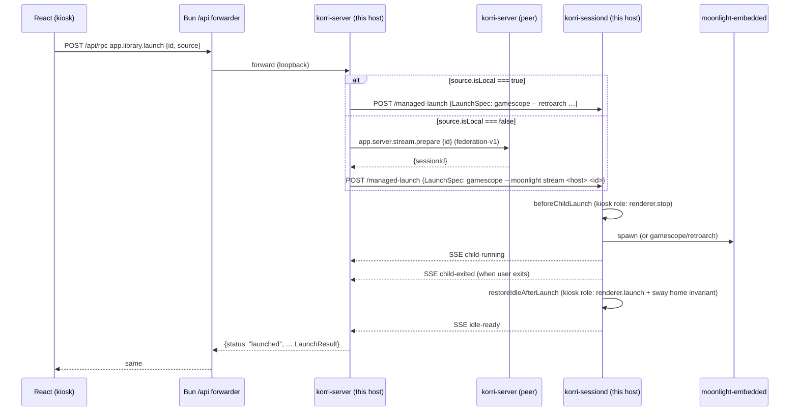

# refactor: Delete the bun launch-bridge; move Moonlight ownership to server + sessiond

## Summary

Delete `korri/deploy/desktop/launch-bridge.ts` (765 lines) and its tendrils. Move remote-source (Moonlight) launch ownership out of the desktop bun process: the server's `app.library.launch` handler dispatches Moonlight launches the same way it already dispatches local launches — through the `Launcher` service and `ForegroundSessionHost`, terminating in sessiond's `POST /managed-launch`. The bun process stops owning any launch behavior: no `/__korri/desktop/rpc` route, no foreground-session-owner, no sway surface verification, no Moonlight preflight. It retains only what's structurally bun-shaped: electrobun runtime, `/api/*` forwarder, native input bridge, runtime-config injection, status read, trace sink.

---

## Problem Frame

`launch-bridge.ts` exists because of path dependence, not architecture. It was created when bun was the kiosk's only supervisor, kept when sessiond appeared because federation v1 hadn't yet decided server-vs-sessiond ownership for remote streams, and survived Phase 4 because Phase 4 was about renderer ownership, not Moonlight ownership. The big-swing commit `98c751a` (this session) routed local-source launches through `app.library.launch` and demonstrated that the bridge wasn't needed for the local path. The bridge currently survives as the home of: federation source resolution for remote launches, the foreground-session-owner instance that gates Moonlight presses, `app.server.stream.prepare` invocation against the peer, the `launchMoonlight` spawn call, sway surface snapshot/repair/verification, and the readiness poll. Every one of these has a cleaner home in either korri-server (federation + dispatch) or korri-sessiond (foreground lifecycle ownership). Removing the bridge removes the third parallel instance of `createForegroundSessionOwner` running on the device (bun owner, server owner, sessiond `KorriSessionState`) and collapses the launch path to one architectural shape regardless of source.

Federation v1 (`docs/plans/2026-05-27-001-feat-korri-library-federation-plan.md`, R11) already states the server is the dispatch authority: "server reads source tag and routes locally or via `app.server.stream.prepare`". This plan closes that loop.

---

## Requirements

- R1. `app.library.launch` accepts `source.isLocal === false` payloads and dispatches a Moonlight launch through the same `Launcher`/`ForegroundSessionHost` seam used by local launches. The `host-unavailable` typed deferral at `launch.rpc-handler.ts:35-53` is replaced with real dispatch.
- R2. The server constructs a Moonlight `LaunchSpec` (analogous to `composeGamescopeLaunchSpec` for local launches) by calling `app.server.stream.prepare` on the peer's `controlUrl` and composing a Gamescope-wrapped `moonlight stream <host> <gameId>` command. The Gamescope policy is the kiosk's local moonlight policy resolved from `services.korri.gamescope` (already resolved server-side for local launches).
- R3. Sessiond's existing `POST /managed-launch` accepts the Moonlight `LaunchSpec` without protocol changes. Sessiond's kiosk role's existing `beforeChildLaunch` (renderer.stop) and `restoreIdleAfterLaunch` (renderer.launch + sway home invariant) gates the Moonlight launch the same way they gate Gamescope/RetroArch launches. The bridge's polling-based `verifyReady` (process-gone + surface-absence + compositor probe) is dropped — sessiond's role-driven `idle-ready`/`home-ready` SSE event is the readiness contract.
- R4. The kiosk-side `LauncherLayerBridge` is deleted. Both kiosk and non-kiosk composition roots use `LauncherLayerRpc` over `/api/rpc`. The composition selector at `korri/deploy/portal/select-launcher-layer.ts` collapses to a single layer.
- R5. The `/__korri/desktop/rpc` Hono route is deleted from `create-desktop-app.ts`. The `desktop-smoke.ts` 503 fallback assertion is deleted (the route no longer exists in any state).
- R6. `korri/deploy/desktop/launch-bridge.ts` and `launch-bridge.test.ts` are deleted. All Moonlight wiring in `korri/deploy/desktop/main.ts` is deleted: `createLaunchBridgeForegroundSessionOwner`, `launchMoonlight` wiring, `preflightMoonlightInput`, `createLocalMoonlightForegroundRepair`, `resolveLocalMoonlightGamescopePolicy`, `diagnosticMoonlightRunner`, the `launchBridge` option on `DesktopAppConfig`, and the `getConnection` legacy plumbing.
- R7. `korri/products/app/stream/local-stream-launch-client.ts`, `local-stream-launch-rpc.ts`, and their tests are deleted. Dead types — `ConnectionServerRecord`, `MoonlightForegroundRepair`, `MoonlightInputPreflightResult`, `LaunchBridgeOptions`, `LaunchBridgeForegroundSessionOwner` — are deleted with their declarations.
- R8. Wire failure shapes for remote launches use the existing `LaunchFailureKind` union from `@shared/library/launcher`. No new failure kinds are introduced. `prepared-no-moonlight` semantics collapse into `moonlight-failed` (planning-time decision; see Key Technical Decisions).
- R9. The renderer (`korri/products/app/features/home/**`) sees no observable wire-shape change. The same `launchAtom` → `Launcher.run(spec, { source })` call resolves to a `LaunchResult` shape it already understands. Federation source threading (`GameRecord.source` → `LaunchInput.source`) is unchanged.
- R10. The desktop bun's `/__korri/desktop/trace` POST sink, `/api/*` forwarder, native input bridge mount, runtime-config injection, and foreground-session-status read endpoint are preserved unchanged. Bun owns the renderer runtime and input plumbing only.
- R11. Sobo device verification at the inflection point: a remote-source launch from a peer (Sobo→AKA or AKA→Sobo) completes end-to-end. Moonlight comes up via sessiond, exits cleanly, and Electrobun returns to foreground via sessiond's `restoreIdleAfterLaunch`. Local-source launches continue to work as commit `98c751a` left them.
- R12. The verify gate (`just typecheck && just test-unit && just lint`) stays green at every U-step. Server-side new behavior is covered by real-implementation tests under `korri/products/app/api/library/launch.rpc-handler.test.ts` using configurable in-memory peer-prepare and in-memory launcher seams.

---

## Scope Boundaries

- This plan does not modify sessiond's wire protocol. `lifecycle: "foreground"` (default) is used for Moonlight launches — same as local Gamescope launches. The Phase 003 `lifecycle: "session"` shape is unrelated.
- This plan does not modify the renderer's launch flow (`launchAtom`, `useLibraryLaunchController`, `LaunchInput`, `LaunchResult` shape). The wire payload is unchanged.
- This plan does not introduce new `LaunchFailureKind` values. `prepared-no-moonlight` collapses to `moonlight-failed`; if operator visibility into "peer prepared but our Moonlight failed" is needed later, add a structured sub-field (deferred).
- This plan does not modify `app.server.stream.prepare`. Its non-idempotent intent-file write is unchanged; the server replaces the bridge as the caller. Idempotency hardening is a follow-up.
- This plan does not migrate `preflightMoonlightInput` (inputplumber visibility check) into a new home. The check is dropped: sessiond's kiosk-role `beforeChildLaunch` already releases device focus, and the native input bridge (still bun-owned) is the focus authority. The bridge's preflight was a paranoia check from the era when bun didn't trust sessiond.
- This plan does not modify the kiosk renderer-ownership migration in `docs/plans/2026-05-27-004-feat-kiosk-renderer-ownership-sessiond-plan.md`. That plan's work is a prerequisite for sessiond to be the renderer supervisor at all; this plan assumes it has landed on the target images (or lands in parallel).
- This plan does not touch `korri-server` Nix wiring. `KORRI_SESSIOND_URL` / `KORRI_SESSIOND_TOKEN_FILE` already point server to sessiond on kiosk images (per plan 004's C1 commit).
- This plan does not modify `@app/stream/moonlight-launcher.ts`'s in-process spawn helper. The helper still exists (cli/diagnostic use), but production launches go through the server → sessiond path instead of invoking it directly.
- This plan does not modify the `/__korri/desktop/trace` route, `/api/*` forwarder, input bridge mount, runtime-config endpoint, or status-read endpoint.

### Deferred to Follow-Up Work

- Operator distinction between "peer prepared, our Moonlight failed" vs. "peer prepare failed": add a structured `failedAt: "peer-prepare" | "local-spawn"` sub-field to `LaunchResult.failed` if/when needed.
- Idempotency on `app.server.stream.prepare` (currently rewrites the intent file on every call).
- Removing `@app/stream/moonlight-launcher.ts` entirely once the CLI/diagnostic callers also route through sessiond.
- Removing `ConnectionServerRecord` and other federation-v0 plumbing from `tools/device/*` if any references remain.

---

## Context & Research

### Relevant Code and Patterns

- `korri/products/app/api/library/launch.rpc-handler.ts` — current handler. Lines 35-53 hold the `host-unavailable` typed deferral that this plan replaces with real dispatch. Lines 55-134 hold the local-launch dispatch pattern to mirror.
- `korri/products/app/api/library/local-foreground-launch-adapter.ts` — the server-side `createForegroundSessionOwner` instance that gates local launches. The remote-source dispatch reuses this owner (same instance) — Moonlight launches are still foreground launches on the same host.
- `korri/products/app/api/library/launch.rpc-handler.test.ts` — current test surface. Test 125 explicitly asserts the typed `host-unavailable` deferral; rewrite it in U1.
- `tools/device/game-stream-fullscreen.ts` `composeGamescopeLaunchSpec` — the helper that wraps a `LaunchSpec` in `gamescope --` arguments for kiosk fullscreen. The Moonlight LaunchSpec composer in U2 mirrors this pattern.
- `korri/products/app/stream/moonlight-launcher.ts:205-214` `moonlightCommandSpec` — already builds a Gamescope-wrapped Moonlight `LaunchSpec`. U2 extracts a server-callable variant of this (no in-process spawn, no inputplumber preflight, no `moonlightControl` env coupling).
- `korri/products/app/stream/remote-stream-client.ts:249-272` — federation-v1 server-to-server `RemoteStreamControlClient.prepareGame` call. Already used by the bridge; in U1 the server calls it directly.
- `korri/shared/library/launcher.ts:46-58` `LaunchFailureKind` — already enumerates every kind the bridge surfaces: `moonlight-failed`, `input-unavailable`, `input-ambiguous`, `host-control-disabled`, `session-busy`. No new kinds needed.
- `tools/device/sessiond.ts:255-417` `runManagedLaunch` — sessiond's dispatch path. `beforeChildLaunch` (kiosk: renderer.stop) → spawn → `child-running` event → `afterChildRunning` → await child exit → `restoreIdleAfterLaunch` → `idle-ready`/`home-ready`. Accepts any `LaunchSpec` shape; no protocol change for Moonlight.
- `korri/shared/library/sessiond-managed-launch-protocol.ts` — current wire protocol. `lifecycle: "foreground"` (default) is what Moonlight launches use.
- `korri/products/app/features/home/launcher-layer-bridge.ts` — the kiosk-side launcher layer being deleted. After deletion, `korri/products/app/features/home/launcher-layer-rpc.ts` (existing portal-side layer) is the only `Launcher` layer in the kiosk composition.
- `korri/deploy/portal/select-launcher-layer.ts` — current selector. After this plan, the selector collapses to "always `LauncherLayerRpc`".
- `tools/desktop/desktop-smoke.ts:272-289` — current smoke pins the 503 fallback for `/__korri/desktop/rpc`. Must be deleted in U5.

### Institutional Learnings

- `docs/solutions/architecture-patterns/kiosk-renderer-ownership-by-sessiond-2026-05-27.md` — the template for this work. Documents the nine empirical gaps that broke the analogous renderer-ownership migration. Most relevant here: sessiond's `ProtectSystem=strict` may need `ReadWritePaths` for Moonlight state dirs; `SWAYSOCK` must stay runtime-discovered (commit `4679ac3` already does this); `moonlight` binary must be on sessiond's PATH (currently inherited from `services.korri.client.package` which transitively depends on `moonlight-embedded-korri`).
- `docs/solutions/architecture-patterns/kiosk-foreground-app-policy-over-gamescope-overlay-2026-05-24.md` — names `launch-bridge.ts` explicitly as the bypass to remove. Prescribes the exact target: `home → launching → foreground-app → restoring-home` through sessiond's state machine. After this plan, that target is satisfied for every launch class.
- `docs/solutions/runtime-errors/effect-rpc-server-headers-concat-undefined-crash-2026-05-27.md` — RPC pipeline crash from a malformed payload kills the whole process. After this plan, `app.library.launch` is the only dispatch path for remote-source games; any shape bug crashes federation. `envelope-guard.ts` middleware must cover the route — verify in U1.
- `docs/solutions/integration-issues/supervise-chromium-kiosk-session-after-game-exit-2026-05-04.md` — the original motivation for sessiond. The kiosk invariant ("exactly one Korri Chromium app window, focused, fullscreen, on the configured URL") after game exit is sessiond's `restoreIdleAfterLaunch` job. The bridge's `verifyReady` polling was a workaround for not trusting sessiond. After this plan, the invariant is sessiond's alone — verify on Sobo at U5/U6.
- `docs/solutions/architecture-patterns/boot-scoped-control-plane-with-session-scoped-runner-2026-05-19.md` — the peer-side trust contract for `app.server.stream.prepare`'s intent file. Server-to-server federation calls run as the same user on both ends; the trust contract is unchanged when the caller is the server instead of bun.

### External References

None — this work is entirely contained in the repo's existing architecture.

---

## Key Technical Decisions

- **Server dispatches Moonlight as a foreground launch via the existing seam.** The handler builds a Moonlight `LaunchSpec`, calls `launchLocalForegroundSession(foregroundSessionHost.owner, { id, spec, spawn })` exactly as it does for local launches. The function name remains `launchLocalForegroundSession` despite the spec sometimes being Moonlight — Moonlight launches are still local foreground launches from this host's perspective; the "local" in the name refers to *this host owning the foreground*, not *the game being local-source*. Renaming is out of scope.
- **Sessiond's kiosk role is the readiness gate.** The bridge's three-part `verifyReady` (process-gone + surface-absence + compositor probe) is dropped. Sessiond owns the spawn, awaits exit directly, runs `restoreIdleAfterLaunch` (which evaluates the sway home invariant), then emits `idle-ready`/`home-ready`. The renderer waits for that SSE event same as it does for local launches today. Rationale: the bridge's poll-based gate existed because the bridge didn't own the process; once sessiond owns the process, the role's idle-restore *is* the gate. Two gates running in series is duplicate code.
- **`prepared-no-moonlight` collapses to `moonlight-failed`.** The bridge surfaced this distinct kind when peer prep succeeded but local Moonlight failed to start. The renderer/UI doesn't currently distinguish the two cases visually. If operator visibility is needed later, add a structured sub-field instead of a separate kind. Rationale: zero-backcompat reduction — fewer kinds means fewer branches to maintain.
- **`preflightMoonlightInput` is dropped, not migrated.** The native input bridge (bun-owned) is the device-focus authority for the renderer side; sessiond's kiosk role's `beforeChildLaunch` is the device-focus authority for the launched-process side. Inputplumber visibility from Moonlight's perspective is verified by Moonlight at spawn time (it'll fail if no input device); no preflight is needed.
- **Federation source resolution moves entirely server-side.** The bridge's `resolveLaunchConnection` (which preferred `payload.source` over a `getConnection()` legacy fallback) collapses to "use `payload.source.controlUrl`". The legacy `getConnection` plumbing in `main.ts:139` is dead — delete it.
- **`select-launcher-layer.ts` collapses to a single layer.** Both desktop and portal composition roots use `LauncherLayerRpc`. The selector becomes a one-line function (or is deleted in favor of direct import). Rationale: the selector existed to choose between bridge (desktop) and RPC (portal); after deletion there's nothing to select.
- **Bundle inspection target is `Resources/main.js`.** The handoff referenced `Resources/app/bun/index.js`, but the actual electrobun bundle layout is `out/build/electrobun/<env>-linux-x64/Korri[-dev]/Resources/main.js`. Post-deletion bundle grep target is updated.

---

## Open Questions

### Resolved During Planning

- *Where does the Moonlight readiness gate live after deletion?* — Sessiond's existing `restoreIdleAfterLaunch` (kiosk role). The bridge's polling-based gate is dropped, not migrated. See Key Technical Decisions.
- *Does the `LauncherLayerLive` server-side path already route to sessiond?* — Yes, when `KORRI_SESSIOND_URL` is set (it is, on kiosk images per plan 004 C1). No new wiring needed.
- *Does sessiond need a new "moonlight" launch shape on the wire?* — No. `LaunchSpec` is shape-agnostic; sessiond runs whatever `command` + `args` it's given. The `lifecycle: "foreground"` default is correct.
- *Does the input preflight need to migrate?* — No. Dropped. See Key Technical Decisions.

### Deferred to Implementation

- *Whether the Moonlight LaunchSpec composer needs to live in `@app/api/stream/*` or stay in `@app/stream/*`.* — Decide at U2 based on import boundaries (server handlers cannot import from `@app/stream/*` if that path pulls in renderer code). Probable target: a new `@app/api/stream/compose-moonlight-launch-spec.ts` that imports the LaunchSpec shape only.
- *Whether the server's `app.library.launch` handler should call the peer's `app.server.stream.prepare` directly or via a shared helper.* — Probable target: a small `prepareRemoteStreamForLaunch(controlUrl, gameId)` helper that wraps `RemoteStreamControlClient.prepareGame` with a 5s timeout (matching `main.ts:152` today). Place it next to the handler.
- *Whether the legacy `app.stream.prepare` fallback in `RemoteStreamControlClient.prepareGame` is still needed.* — Probable: yes, until all peers run a federation-v1 server. Keep the fallback; do not introduce new dependencies on it.
- *Whether to delete `MoonlightControlLaunchHandle`/`moonlightControlEnv` plumbing in `@app/stream/moonlight-launcher.ts`.* — Probable: no, that's a separate refactor (the CLI/diagnostic uses still need it). Leave for the deferred follow-up.

---

## High-Level Technical Design

> *This illustrates the intended approach and is directional guidance for review, not implementation specification. The implementing agent should treat it as context, not code to reproduce.*



The diagram shows the post-deletion flow. Every box between `R` and `D` is one shape regardless of source. The bun process appears only as a transparent forwarder; the `/__korri/desktop/rpc` route, the bridge owner, the inline spawn — all gone.

---

## Implementation Units

### U1. Server's `app.library.launch` dispatches remote-source via sessiond

**Goal:** Replace the `host-unavailable` typed deferral at `launch.rpc-handler.ts:35-53` with real Moonlight dispatch through `ForegroundSessionHost` + `Launcher`. The handler builds a Moonlight `LaunchSpec` (via U2's composer), calls the peer's `app.server.stream.prepare` first, then dispatches.

**Requirements:** R1, R2, R3, R8, R9, R12

**Dependencies:** U2 (LaunchSpec composer must exist).

**Files:**
- Modify: `korri/products/app/api/library/launch.rpc-handler.ts`
- Modify: `korri/products/app/api/library/launch.rpc-handler.test.ts`
- Create: `korri/products/app/api/library/prepare-remote-stream-for-launch.ts` (small helper that wraps `RemoteStreamControlClient.prepareGame` with a timeout)
- Create: `korri/products/app/api/library/prepare-remote-stream-for-launch.test.ts`

**Approach:**
- Replace lines 35-53. New branch: when `payload.source && payload.source.isLocal === false`:
  1. Call `prepareRemoteStreamForLaunch(payload.source.controlUrl, payload.id)` → resolves to `{ status: "ok", sessionId }` or `{ status: "failed", failureKind: "host-unavailable" | "host-control-disabled" }`.
  2. Compose Moonlight `LaunchSpec` via U2's `composeMoonlightLaunchSpec(host, payload.id, gamescopePolicy)`. Host is `URL(payload.source.controlUrl).hostname` (with IPv6 bracket stripping mirroring `moonlightHostForConnection` in `launch-bridge.ts:617`).
  3. Resolve gamescope policy from `normalizeGamescopePolicy(launcher: "moonlight", config: services.korri.gamescope)` — same shape used by local launches.
  4. Dispatch via `launchLocalForegroundSession(foregroundSessionHost.owner, { id, spec, spawn })` — identical seam to the local path.
  5. Return the `LaunchResult` from the foreground-session owner directly.
- Failure mapping: peer prepare failures → `host-unavailable` or `host-control-disabled` (existing kinds). Sessiond dispatch failures → existing `launchLocalForegroundSession` failure shape (already includes `moonlight-failed`, `session-busy`).
- Confirm the new path goes through `envelope-guard.ts` middleware (per learning ref'd in Context). The `app.library.launch` route already uses the standard middleware stack; no additional wiring should be needed.

**Execution note:** Test-first. The behavior contract is well-defined; write the failing tests before the implementation.

**Technical design:** *(optional — directional guidance only)*

```
handleLaunchLibrary(payload):
  if payload.source?.isLocal === false:
    prep = await prepareRemoteStreamForLaunch(payload.source.controlUrl, payload.id)
    if prep.status === "failed": return failed(prep.failureKind)
    spec = composeMoonlightLaunchSpec(host(payload.source.controlUrl), payload.id, gamescopePolicy)
    return launchLocalForegroundSession(owner, { id, spec, spawn })
  // existing local-source path unchanged
```

**Patterns to follow:**
- The existing local-source dispatch flow at `launch.rpc-handler.ts:55-134` — same `Launcher`/`ForegroundSessionHost`/`launchLocalForegroundSession` calls.
- `RemoteStreamControlClient.prepareGame` at `korri/products/app/stream/remote-stream-client.ts:249-272` — wrap with a 5s timeout matching `main.ts:152`.
- Test setup in `launch.rpc-handler.test.ts` — uses `makeInMemoryLauncherLayer` and configurable `ForegroundSessionState`. Mirror this for the remote-source tests with a configurable in-memory peer-prepare seam.

**Test scenarios:**
- *Happy path:* remote-source LaunchInput with valid peer `controlUrl` → handler calls peer's `app.server.stream.prepare` once, builds a Moonlight `LaunchSpec` with `command: "gamescope"` and args containing `["--", "moonlight", "stream", "<peer-host>", "<gameId>"]`, dispatches via `launchLocalForegroundSession`, returns `{ status: "launched", gameId, sessionId, … }` from the foreground owner.
- *Happy path:* IPv6 peer `controlUrl` (`http://[::1]:3001`) → composed Moonlight args contain the unbracketed host (`::1` becomes the moonlight `<host>` arg).
- *Error path:* peer prepare returns a network error → handler returns `{ status: "failed", failureKind: "host-unavailable", … }` without dispatching to sessiond.
- *Error path:* peer prepare returns `ValidationError` (stream control disabled on peer) → handler returns `{ status: "failed", failureKind: "host-control-disabled", … }` without dispatching.
- *Error path:* peer prepare exceeds 5s timeout → handler returns `{ status: "failed", failureKind: "host-unavailable", stderrTail: "peer prepare timed out" }`.
- *Error path:* sessiond dispatch fails (`launchLocalForegroundSession` rejects with `session-busy`) → handler propagates `{ status: "failed", failureKind: "session-busy", … }` from the foreground owner unchanged.
- *Edge case:* `payload.source.isLocal === false` AND `payload.source.controlUrl` is undefined/empty → handler returns `{ status: "failed", failureKind: "host-unavailable", stderrTail: "missing peer controlUrl" }` without making any peer call.
- *Edge case:* `payload.source.isLocal === true` (already covered by existing tests) → local-source path is unchanged; existing tests pass byte-for-byte.
- *Integration:* the existing `it("returns a typed host-unavailable v1 deferral for remote-source payloads")` test at line 125 is **rewritten** to assert the new dispatch behavior. The old typed deferral is gone.

**Verification:**
- `just typecheck && just test-unit && just lint` clean.
- The rewritten test for remote-source dispatch passes.
- Manual smoke deferred to U6.

---

### U2. Moonlight `LaunchSpec` composer (server-callable)

**Goal:** Build a server-side helper `composeMoonlightLaunchSpec(host, gameId, gamescopePolicy?)` that returns a `LaunchSpec` for `gamescope -- moonlight stream <host> <gameId>`. Mirrors `composeGamescopeLaunchSpec` for local launches.

**Requirements:** R2

**Dependencies:** None.

**Files:**
- Create: `korri/products/app/api/stream/compose-moonlight-launch-spec.ts`
- Create: `korri/products/app/api/stream/compose-moonlight-launch-spec.test.ts`

**Approach:**
- The function builds a `LaunchSpec` (`{ command, args, env?, cwd? }`) where:
  - When `gamescopePolicy === "enabled"`: `command = "gamescope"`, args wrap `["--", moonlightCommand, ...moonlightArgs(host, gameId)]` with the kiosk's standard gamescope flags. Use the same flag set `composeGamescopeLaunchSpec` produces for local launches.
  - When `gamescopePolicy === "disabled"`: `command = moonlightCommand`, args = `moonlightArgs(host, gameId)`.
- `moonlightCommand` resolution: read from process env (`KORRI_MOONLIGHT_COMMAND`) with fallback `"moonlight"` — same pattern as `moonlightCommandFromEnv` in `@app/stream/moonlight-launcher.ts:216-220`. Do **not** import from `@app/stream/*` if that path transitively pulls in renderer code; copy the small env helper into `@app/api/stream/` instead. The helper must remain shared-layer-safe (no product cross-imports).
- `moonlightArgs(host, gameId)` produces `["stream", host, gameId]` — the simplest possible argv. The bridge's current invocation is `moonlight stream <host> <gameId>`; mirror it.
- No `moonlightControl` env coupling. No `--mapping`. No `--platform` flag. The function intentionally produces a minimal LaunchSpec; if specific kiosk deployments need additional flags, that's an extension via env (KORRI_MOONLIGHT_EXTRA_ARGS) or a future shaped option, not embedded here.

**Execution note:** Test-first. The function is pure given env; tests can configure env per-case.

**Patterns to follow:**
- `tools/device/game-stream-fullscreen.ts:79` `composeGamescopeLaunchSpec` — the local-launch counterpart. Same gamescope-wrap structure, same `LaunchSpec` return type.
- `korri/products/app/stream/moonlight-launcher.ts:205-214` `moonlightCommandSpec` — the existing client-side helper. Reuse its conceptual shape; do not import (it has too many in-process spawn coupling concerns).

**Test scenarios:**
- *Happy path:* `composeMoonlightLaunchSpec("192.168.1.10", "abc123", "enabled")` returns `{ command: "gamescope", args: [<gamescope flags>, "--", "moonlight", "stream", "192.168.1.10", "abc123"], env? }`.
- *Happy path:* `composeMoonlightLaunchSpec("aka.local", "abc123", "disabled")` returns `{ command: "moonlight", args: ["stream", "aka.local", "abc123"] }` (no gamescope wrap).
- *Edge case:* `KORRI_MOONLIGHT_COMMAND` env set to an absolute path → uses that command verbatim.
- *Edge case:* `host` is an empty string → throws/returns a typed error (decide which based on caller convenience; recommend `Effect.fail(new ValidationError)` since the handler runs in an Effect context).
- *Edge case:* `host` contains `:` (IPv6) → passes through unchanged; bracket-stripping is the caller's responsibility.

**Verification:**
- `just typecheck && just test-unit && just lint` clean.
- Unit tests pass.

---

### U3. Kiosk composition root collapses to `LauncherLayerRpc`

**Goal:** Switch the kiosk composition from `LauncherLayerBridge` to `LauncherLayerRpc`. Delete the kiosk-specific layer and its selector branch.

**Requirements:** R4, R9

**Dependencies:** U1 (server must accept remote-source before kiosk stops routing remote-source through the bridge).

**Files:**
- Modify: `korri/deploy/portal/select-launcher-layer.ts`
- Modify: `korri/deploy/portal/select-launcher-layer.test.ts`
- Modify: `korri/products/app/features/home/HomeRuntimeLayersRoot.tsx`
- Delete: `korri/products/app/features/home/launcher-layer-bridge.ts`
- Delete: `korri/products/app/features/home/launcher-layer-bridge.test.ts`
- Delete: `korri/products/app/stream/local-stream-launch-client.ts`
- Delete: `korri/products/app/stream/local-stream-launch-rpc.ts`
- Delete: `korri/products/app/stream/local-stream-launch-rpc.test.ts`

**Approach:**
- `select-launcher-layer.ts`: collapse to either a single-line function that returns `LauncherLayerRpc`, or delete the selector entirely and have `HomeRuntimeLayersRoot.tsx` import `LauncherLayerRpc` directly. Decide based on whether the selector still serves any non-trivial routing (after this plan, it doesn't).
- `HomeRuntimeLayersRoot.tsx`: remove the `runtimeConfig.desktopInput` branch on the `Launcher` layer. The renderer continues to read other runtime-config keys; only the launcher-layer choice collapses.
- Delete the three stream-launch-rpc files outright. They have no callers outside of `launcher-layer-bridge.ts` (verified by recon §E).
- Confirm via grep that no other consumer remains for `LocalStreamLaunchResponse`, `LocalStreamLaunchClient`, `LocalStreamLaunchInput`, `LocalStreamLaunchPayload`, `localStreamLaunchRpcGroup`, `LocalStreamLaunchResponseSchema`.

**Patterns to follow:**
- `korri/products/app/features/home/launcher-layer-rpc.ts` (existing) — the layer that remains. Its `run(spec, options)` already accepts the optional `source` field and forwards it to `appClient["app.library.launch"]({ id, source })`. No changes needed here.

**Test scenarios:**
- *Happy path:* `select-launcher-layer.test.ts` is updated to assert it returns `LauncherLayerRpc` for any input (or the test is deleted if the selector itself is deleted).
- *Integration:* (manual) the kiosk renderer's launch flow continues to work for local-source after the layer switch — verified by U6's Sobo smoke. No new unit test needed; the existing `LauncherLayerRpc` unit tests cover the layer's behavior.

**Verification:**
- `just typecheck && just test-unit && just lint` clean.
- `grep -r "LauncherLayerBridge\|local-stream-launch" korri/` returns no hits in production code (test fixtures and this plan doc may match).

---

### U4. Delete the `/__korri/desktop/rpc` route and `launchBridge` desktop-config option

**Goal:** Remove the bridge mount point from `create-desktop-app.ts`. Update `desktop-smoke.ts` to drop the 503 assertions. The bun process no longer has a launch-related route.

**Requirements:** R5, R10

**Dependencies:** U3 (no kiosk callers of the route remain).

**Files:**
- Modify: `korri/deploy/desktop/create-desktop-app.ts`
- Modify: `korri/deploy/desktop/create-desktop-app.test.ts` (if it covers the route — verify)
- Modify: `korri/deploy/desktop/desktop-config.ts`
- Modify: `tools/desktop/desktop-smoke.ts`
- Modify: `tools/desktop/desktop-smoke.test.ts`

**Approach:**
- `create-desktop-app.ts`: delete the `if (options.launchBridge) { … }` block at lines 108-122 and the related imports (`createLocalStreamLaunchRpcHandler`, the schema imports). Confirm the trace endpoint, `/api/*` forwarder, input-bridge mount, status-read endpoint, and runtime-config endpoint remain untouched.
- `desktop-config.ts`: delete the `launchBridge` option from `DesktopAppOptions`/`DesktopAppConfig`. Confirm no test or main caller relies on it.
- `desktop-smoke.ts`: delete lines 272-289 (the 503 assertions for `/__korri/desktop/rpc`). The smoke continues to cover trace, forwarder, status, and config endpoints.
- `desktop-smoke.test.ts`: delete lines 114, 123 (or rewrite if they cover the smoke's harness rather than the route itself).

**Patterns to follow:**
- Existing route registrations in `create-desktop-app.ts` (trace, forwarder, status) — they're the "legitimate" routes that remain.

**Test scenarios:**
- *Integration:* `desktop-smoke.ts` runs against the post-deletion bundle and passes. No 503 assertion remains; the smoke covers only routes that exist.
- *Negative:* a request to `POST /__korri/desktop/rpc` against the post-deletion bun returns Hono's default 404, not 503. (No need to assert this in a test — the absence of the route is the contract; the test only covers what's there.)

**Verification:**
- `just typecheck && just test-unit && just lint` clean.
- `just desktop-smoke` passes (the desktop smoke is the operator-driven gate for this U-step).

---

### U5. Delete `launch-bridge.ts` and its main.ts wiring

**Goal:** Delete the bridge source, its test, and all related wiring from `main.ts`. Bun no longer imports anything Moonlight-related.

**Requirements:** R6, R7, R10

**Dependencies:** U3, U4 (no callers of the bridge code remain).

**Files:**
- Delete: `korri/deploy/desktop/launch-bridge.ts`
- Delete: `korri/deploy/desktop/launch-bridge.test.ts`
- Modify: `korri/deploy/desktop/main.ts`

**Approach:**
- Delete the two bridge files outright.
- In `main.ts`, delete the following (line ranges from recon):
  - `createLaunchBridgeForegroundSessionOwner` import and usage (lines 33-36, 59, 143, 166-170).
  - `launchMoonlight` import and wiring.
  - `preflightMoonlightInput` import.
  - `createLocalMoonlightForegroundRepair` (lines 226-266) — the factory that built `MoonlightForegroundRepair` from sway helpers.
  - `resolveLocalMoonlightGamescopePolicy` (lines 204-225).
  - `diagnosticMoonlightRunner` and any helpers it pulls in.
  - `getConnection` legacy plumbing (line 139) — `() => undefined` is dead since federation v1.
  - The `process.on("exit")` and `SIGINT/SIGTERM` handlers that called `terminateActiveSession()` on the bridge owner (lines 91-104). Bun no longer owns any session; sessiond is the session owner.
- Confirm `main.ts` still wires: the `/api/*` forwarder, native input bridge, runtime-config injection, trace sink, status-read endpoint, electrobun startup.
- The `desktop-config.ts` `launchBridge` option deletion happens in U4; this unit may need to drop one more reference if main.ts still mentions the option.

**Patterns to follow:**
- The post-deletion `main.ts` should read as: "boot Electrobun, mount Hono with non-launch routes, connect to inputd, exit cleanly on signals." Roughly half its current size.

**Test scenarios:**
- *Test expectation: none — pure deletion of dead code after U3/U4.* The behavior covered by the deleted bridge tests is verified by U1's server-side tests and the device smoke in U6.
- *Integration:* the bun process boots, serves the remaining routes, and shuts down cleanly. Covered by `just desktop-smoke` (already in U4).

**Verification:**
- `just typecheck && just test-unit && just lint` clean.
- `grep -rn "launch-bridge\|LaunchBridge\|createLocalStreamLaunchRpcHandler\|routeAndPerformLocalStreamLaunch\|moonlight" korri/deploy/desktop/` returns no production hits (test files for unrelated routes may match `moonlight` incidentally in fixtures — inspect manually).
- Bundle inspection: build the desktop bundle (`just desktop-build`) and grep `out/build/electrobun/dev-linux-x64/Korri-dev/Resources/main.js` for `routeAndPerformLocalStreamLaunch`, `LauncherLayerBridge`, `createLaunchBridgeForegroundSessionOwner`. All three must be absent.

---

### U6. Sobo device verification + dead-type cleanup

**Goal:** Deploy the post-deletion build to Sobo, verify a local-source launch and a remote-source launch (Sobo→AKA or AKA→Sobo, whichever is operationally available), then sweep any remaining dead types.

**Requirements:** R11

**Dependencies:** U5.

**Files:**
- Modify (if remaining references): `korri/deploy/desktop/*` for `ConnectionServerRecord`, `MoonlightForegroundRepair`, `MoonlightInputPreflightResult` declarations that survived the bridge deletion.
- Modify (if remaining references): any `tools/device/*` that imports the same dead types.

**Approach:**
- Build and deploy via the existing `deploy-sobo-federation.sh` workflow (per handoff): `nixos-rebuild boot` via fuji builder → import generation on host → warm-restart `rocknix-guest.service`.
- On Sobo, verify:
  1. `journalctl -u korri-server` shows the new dispatch path on a local launch (no `/__korri/desktop/rpc` POST in `journalctl -u korri-sessiond` either, since that route is gone).
  2. Local-source launch: click a PICO-8 game in the renderer → game runs in gamescope → exit → Electrobun returns. Same behavior as commit 98c751a left it.
  3. Remote-source launch: from Sobo, click a game whose `GameRecord.source.isLocal === false` and resolves to AKA's controlUrl (or another peer if available). Server logs show `app.library.launch` calling AKA's `app.server.stream.prepare`, then `POST /managed-launch` on sessiond. Moonlight comes up on Sobo, streams AKA's game, exits cleanly when the user quits, Electrobun returns.
  4. `cat /storage/.local/state/korri/electrobun.log` shows no errors from the deleted code paths.
- Sweep: `grep -rn "ConnectionServerRecord\|MoonlightForegroundRepair\|MoonlightInputPreflightResult\|LaunchBridgeOptions\|LaunchBridgeForegroundSessionOwner" korri/ tools/` — delete any surviving declarations or import sites. They should already be unused after U5.
- Final bundle inspection (per `just desktop-build` output): the post-deletion `Resources/main.js` should be measurably smaller. Capture the size delta in the commit message.

**Patterns to follow:**
- The Sobo verification workflow used by recent commits (`98c751a`, `7437082`, `4679ac3`).
- The kiosk-renderer-ownership migration's verification approach: boot → ExecStartPost → renderer visible → launch → exit → renderer returns.

**Test scenarios:**
- *Test expectation: none — operator-driven device verification.* No automated test gate added here. Sobo logs are the artifact; the commit message records what was observed.
- *Integration (manual):* local-source launch on Sobo behaves identically to pre-deletion behavior.
- *Integration (manual):* remote-source launch on Sobo (Sobo→AKA or AKA→Sobo) completes the full cycle: prep → spawn → game running → exit → renderer returns.
- *Operator gate:* if remote-source launch fails with `moonlight-failed`, capture the `journalctl -u korri-sessiond` output and the sway invariant state (`swaymsg -t get_tree`) before iterating. The cause is almost certainly an env/PATH gap in the sessiond unit (matches gaps #1–#9 in the kiosk-renderer-ownership solution doc).

**Verification:**
- `just typecheck && just test-unit && just lint` clean.
- Sobo: local-source launch + return-to-idle works.
- Sobo: remote-source launch + return-to-idle works.
- `grep -rn "launch-bridge\|LauncherLayerBridge\|local-stream-launch\|routeAndPerformLocalStreamLaunch" korri/ tools/` returns zero production hits.

---

## System-Wide Impact

- **Interaction graph:** Three files lose all callers: `launch-bridge.ts`, `launcher-layer-bridge.ts`, `local-stream-launch-*.ts`. One file gains a remote-source branch: `launch.rpc-handler.ts`. The `LauncherLayerLive`-to-sessiond seam (via `KORRI_SESSIOND_URL`) becomes the only production launch path.
- **Error propagation:** `LaunchFailureKind` is unchanged. Every kind the bridge surfaced today (`moonlight-failed`, `input-unavailable`, `input-ambiguous`, `host-control-disabled`, `session-busy`, `host-unavailable`) survives. The new server-side handler maps peer-prepare errors to existing kinds.
- **State lifecycle risks:** Three parallel `createForegroundSessionOwner` instances on the device drop to two (server-side owner + sessiond's `KorriSessionState`). Bun no longer owns any foreground session state. There is no risk of the bun owner and the server owner racing because the bun owner is deleted, not duplicated.
- **API surface parity:** The renderer's `Launcher.run(spec, options)` contract is unchanged. The wire shape of `app.library.launch` is unchanged. The `app.desktop.launch` RPC tag and the `/__korri/desktop/rpc` route are removed entirely (no backcompat).
- **Integration coverage:** U1's tests cover server-handler-to-launcher-to-peer-prepare interactions in isolation. U6's Sobo device verification covers the full path including sessiond's existing kiosk-role behavior. The `desktop-smoke.ts` covers the bun routes that remain.
- **Unchanged invariants:** `app.server.stream.prepare`'s wire contract and intent-file write behavior are unchanged. Sessiond's managed-launch wire protocol is unchanged. `LaunchFailureKind` is unchanged. The native input bridge contract (gamepad → preload → WebView) is unchanged. The federation source threading (`GameRecord.source` → `LaunchInput.source`) is unchanged. The renderer's `useLibraryLaunchController` and `launchAtom` shapes are unchanged.

---

## Risks & Dependencies

| Risk | Mitigation |
|------|------------|
| Sessiond's existing `restoreIdleAfterLaunch` doesn't actually handle Moonlight surfaces correctly (the bridge's polling-based gate exists for a reason). | Verify on Sobo at U6 before considering the work done. If the role's idle-restore drops the renderer, sessiond's kiosk role gains a Moonlight-aware sway invariant — fold into U6 or open a follow-up plan. Symptom would match the "sway up with black screen, brief flash every ~10s" pattern from learning 1a. |
| `app.server.stream.prepare` is not idempotent; a retry from the server races on the peer's intent file. | The bridge has the same property today; no regression. Idempotency is a deferred follow-up. If it becomes user-visible, add an opaque `launchAttemptToken` to the prepare payload. |
| `envelope-guard.ts` does not cover the new dispatch path correctly; a malformed remote-source payload crashes the RPC pipeline (per learning 2a). | Verify in U1 that the route is wrapped by `envelope-guard.ts`. The `app.library.launch` tag already uses the standard middleware stack, but explicitly grep for `app.library.launch` in `envelope-guard.ts` to confirm coverage. |
| The kiosk image's sessiond unit doesn't have `moonlight` on its PATH because `services.korri.client.package` transitively depends on `moonlight-embedded-korri` only when bun was the launcher. | Verify on Sobo at U6: `journalctl -u korri-sessiond` after a remote-source launch attempt. If `moonlight: command not found`, add `pkgs.moonlight-embedded-korri` to the sessiond unit's `path` in `nix/images/kiosk.nix` (mirroring plan 004's PATH augmentation pattern). |
| `LauncherLayerRpc` doesn't correctly thread `source` for remote-source payloads — the existing layer was written before federation v1 sourced launches. | Verify by inspection in U3 that `LauncherLayerRpc.run` forwards `options.source` to `appClient["app.library.launch"]({ id, source })`. The big-swing commit `98c751a` should have addressed this; confirm. |
| The desktop smoke 503 assertion deletion accidentally loosens coverage for the routes that remain. | Verify in U4 that `desktop-smoke.ts` still covers `/__korri/desktop/trace`, `/api/*` forwarder, status-read, and runtime-config routes. Only the bridge-specific 503 assertion is removed. |
| Phase 4 (kiosk renderer ownership) hasn't fully landed on the target Sobo image; sessiond's `restoreIdleAfterLaunch` may not bring Electrobun back. | Plan 004 is in flight in parallel. If U6 verification reveals 004 hasn't shipped to Sobo yet, complete 004 first (U6 blocks on 004 being deployed). Coordinate at U6 deploy time. |

---

## Documentation / Operational Notes

- After U5, the post-deletion bundle size should be measurably smaller (~765 lines of TS + their bundled dependencies). Capture the byte delta in the U5 commit message for posterity.
- After U6, capture a Sobo journal trace of a remote-source launch in the commit message — operator evidence that the new path works end-to-end.
- No NixOS module changes are required by this plan unless U6 reveals a PATH gap (see Risks). If a PATH gap appears, the fix lands in `nix/images/kiosk.nix` per plan 004's pattern.
- Capture a `docs/solutions/architecture-patterns/launch-ownership-collapsed-to-server-and-sessiond-2026-05-27.md` learning **only if the user explicitly requests it** (per project AGENTS.md: "Never create documentation, report, or summary Markdown files unless explicitly requested"). The pattern is already documented in adjacent solutions; a new doc may be redundant.

---

## Sources & References

- Handoff document: `/tmp/handoff-SOixGA.md` (this session)
- Prior big-swing commit: `98c751a fix(library): route local-source launches via app.library.launch instead of bun bridge`
- Related plans:
  - `docs/plans/2026-05-27-001-feat-korri-library-federation-plan.md` (completed) — R11 sets the dispatch contract this plan implements
  - `docs/plans/2026-05-27-003-feat-sessiond-session-lifecycle-unification-plan.md` (completed) — sessiond protocol extensibility
  - `docs/plans/2026-05-27-004-feat-kiosk-renderer-ownership-sessiond-plan.md` (active) — provides the sessiond-owns-renderer prerequisite
- Related solutions:
  - `docs/solutions/architecture-patterns/kiosk-renderer-ownership-by-sessiond-2026-05-27.md` — template for the migration; nine empirical gaps to verify against
  - `docs/solutions/architecture-patterns/kiosk-foreground-app-policy-over-gamescope-overlay-2026-05-24.md` — names `launch-bridge.ts` as the bypass
  - `docs/solutions/runtime-errors/effect-rpc-server-headers-concat-undefined-crash-2026-05-27.md` — `envelope-guard.ts` coverage requirement
  - `docs/solutions/integration-issues/supervise-chromium-kiosk-session-after-game-exit-2026-05-04.md` — original sessiond motivation; kiosk invariant after game exit
- Code references:
  - `korri/deploy/desktop/launch-bridge.ts` (file under deletion)
  - `korri/products/app/api/library/launch.rpc-handler.ts:35-53` (the `host-unavailable` typed deferral being replaced)
  - `korri/products/app/stream/remote-stream-client.ts:249-272` (peer-prepare client to reuse)
  - `tools/device/sessiond.ts:255-417` (`runManagedLaunch` — sessiond's dispatch path)
  - `korri/products/app/api/library/local-foreground-launch-adapter.ts` (the server-side foreground owner reused by the new path)
