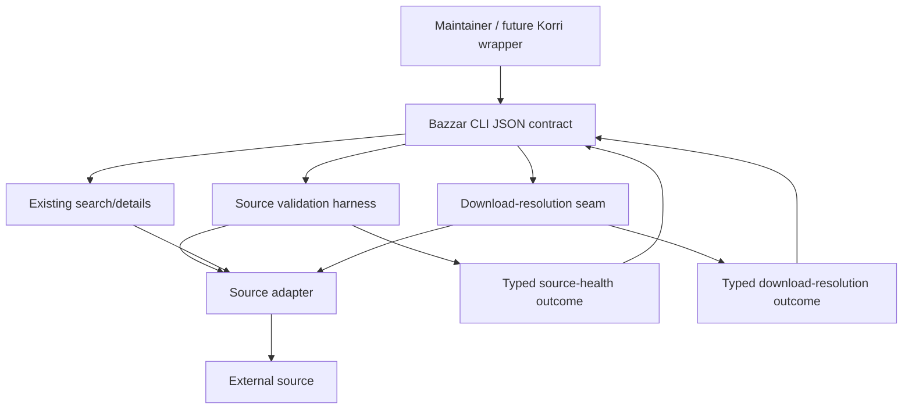

# feat: Harden Bazzar source validation and download resolution

**Target repo:** `bazzar` during implementation. This plan is stored in Korri because it preserves the future Korri/Bazzar boundary; Bazzar file paths below are relative to the Bazzar repo unless explicitly labeled as Korri references.

## Summary

Harden Bazzar before Korri depends on it by repairing the baseline validation surface, introducing explicit source-health and download-resolution outcomes, and exposing those outcomes through a stable CLI-shaped contract. Korri integration stays deferred; this work leaves Korri's `LibrarySource` model untouched and gives a future wrapper a narrow command/output seam to consume.

---

## Problem Frame

Bazzar can search and inspect several external sources, but the prototype currently conflates details pages, interstitial handoffs, and final downloadable artifacts behind `GameFile.url`. Its local health is also not trustworthy enough to freeze as a Korri dependency: the test suite has known failures, `just typecheck` currently calls a missing bare `tsc`, and at least one source masks live credential failure with fallback/mock behavior.

The risk is not just flaky downloads. If Korri consumes the current shape too early, Korri either inherits source-specific quirks or presents unresolved external candidates as if they were known playable library entries. The implementation should therefore make Bazzar's source behavior observable and typed first, then expose a stable command boundary that Korri can wrap later without importing adapter internals.

---

## Requirements

- R1. Provide a repeatable Bazzar validation path that checks supported source adapters without requiring Korri to import Bazzar internals.
- R2. Report source health with explicit healthy, degraded, unsupported, unavailable, or defective states; silent fallback success must not count as healthy.
- R3. Cover search and details behavior for every source Bazzar claims to support.
- R4. Hide source-specific mechanics behind a stable Bazzar-facing contract.
- R5. Separate game/details lookup from download resolution.
- R6. Classify download-resolution outcomes as final artifact, interstitial/provisional, blocked/unavailable, unsupported, source defect, or caller/configuration error.
- R7. Carry observable artifact facts when an artifact is resolved: source identity, candidate title, artifact name/kind/size when known, and whether the URL is final.
- R8. Use legal/free/homebrew/public-domain-style validation probes where available, and record when no safe probe is known.
- R9. Keep Bazzar in its own repo during this hardening phase.
- R10. Preserve a future thin `korri bazzar` wrapper over Bazzar's stable contract rather than duplicating source code in Korri.
- R11. Keep external Bazzar results out of Korri's known-playable `LibrarySource` model until a later explicit import/acquisition flow exists.
- R12. Make the first consumable boundary command output and exit status, not direct library imports.
- R13. Do not mask live source failures with mock or fallback data in health checks, download resolution, or future Korri-facing output.
- R14. Report missing, rejected, or invalid source credentials explicitly by source, credential name, and failure category; never emit credential values in CLI output, logs, validation reports, or contract examples.
- R15. Let one failed source report its own failure without preventing other sources from reporting useful outcomes.
- R16. Make validation legal/safety posture visible enough to avoid unsafe default probes.

**Origin actors:** A1 Korri maintainer/operator, A2 Bazzar source adapter, A3 Bazzar validation harness, A4 future Korri wrapper, A5 Korri library.

**Origin flows:** F1 Validate source adapter health, F2 Resolve a candidate download, F3 Future Korri wrapper delegates to Bazzar.

**Origin acceptance examples:** AE1 covers R1/R2/R3/R15; AE2 covers R5/R6/R7; AE3 covers R6/R13/R14; AE4 covers R8/R16; AE5 covers R9/R10/R11/R12.

---

## Scope Boundaries

- Do not add `korri bazzar` in this plan.
- Do not move Bazzar into Korri.
- Do not duplicate Bazzar source adapter code inside Korri.
- Do not port Bazzar's UI or API service into Korri.
- Do not treat discovered or resolved Bazzar candidates as Korri `LibrarySource` entries.
- Do not build the later content import/acquisition flow.
- Do not require SteamGridDB/artwork enrichment to be healthy for the first hardening pass.
- Do not try to settle the legal status of every external source; the requirement is safe validation defaults and visible uncertainty.

### Deferred to Follow-Up Work

- Future Korri wrapper: a separate Korri plan/PR should add the thin `korri bazzar` command only after Bazzar's CLI contract is stable.
- Artifact import/acquisition: a later Korri/Bazzar design should define how a resolved artifact becomes a known playable Korri library entry.
- Long-term packaging: pinning Bazzar in Korri via Nix, flake input, vendored release, or installed command belongs after the command contract exists.
- Batch/daemon integration: the first contract assumes operator-scale CLI invocations; JSONL streaming, daemon sockets, or bulk resolver modes should be considered only if future Korri usage proves process-per-call overhead is a real bottleneck.
- Bazzar UI/API redesign: any Lattice-aligned UI/API surface should be planned separately if it becomes product-relevant.

---

## Context & Research

### Relevant Code and Patterns

- Bazzar CLI entrypoint: `apps/cli/src/bazzar.ts` already centralizes `search`, `details`, and `plugins` commands with Commander and Effect runtime execution.
- Bazzar plugin contract: `shared/core/src/types/plugin-types.d.ts` defines `Plugin`, `GameResult`, `GameDetails`, and `GameFile`; this is where the current `GameFile.url` ambiguity is visible.
- Bazzar plugin loading/runtime: `shared/core/src/plugin-loader.ts` and `shared/core/src/plugin-runtime.ts` already provide Effect-oriented seams for loading plugins and creating contexts.
- Bazzar partial failure precedent: `apps/api/src/services/search.ts` and streaming search utilities use all-settled/partial-failure behavior rather than collapsing all sources on one failure.
- Korri CLI diagnostics precedent: `tools/cli/source-aware-games.ts` and `tools/cli/source-aware-games.test.ts` show a closer future-wrapper shape: successful entries and per-source diagnostics travel together without one failed source erasing useful output.
- Korri CLI exit-code precedent: existing CLI helpers map typed internal results to explicit process outcomes; Bazzar should document a parallel table once validation/resolution states are stable.
- Bazzar plugin tests: `shared/core/src/plugins/*.test.ts`, `plugin-runtime.test.ts`, and CLI tests under `apps/cli/src/__tests__/` are the natural places to extend coverage once the baseline is made trustworthy.
- Korri future wrapper reference: `tools/cli/korri-cli.ts` and `tools/cli/korri-cli.test.ts` show the Korri CLI shape but should not be changed by this Bazzar hardening plan.
- Korri library boundary reference: `korri/shared/library/library-source.ts`, `korri/shared/library/library-services.ts`, and `korri/shared/library/library-source-layer-live.ts` define known-playable library semantics that Bazzar discovery must not blur.

### Institutional Learnings

- Bedrock/Lattice posture favors typed seams, explicit errors, and stable contracts over broad internal imports. This plan follows that by modeling health/resolution outcomes first and keeping the first Korri boundary CLI-shaped.
- Existing Korri source-aware requirements distinguish external source discovery from known playable library membership; this plan preserves that lifecycle split.

### External References

- No additional external API documentation is required for the plan. Source-specific behavior should be characterized from Bazzar's live adapters and safe validation probes during implementation.

---

## Key Technical Decisions

- Baseline repair comes first: the existing failing suite and broken `just typecheck` must be stabilized before new health outcomes are trusted as regression coverage.
- Model outcomes as discriminated states with runtime validation at trust boundaries: source health and download resolution should be explicit serializable results rather than booleans, nullable URLs, or thrown-only control flow. Because adapters are `.mjs` modules returning runtime objects, the shared seam must validate adapter-produced shapes before emitting CLI JSON.
- Keep validation separate from normal search: validation needs bounded probes, safe legal posture, and per-source health reporting; ordinary search should remain a user query operation.
- Keep details separate from resolution: `details` may expose candidate files, but only the resolution seam can claim a final artifact is available.
- CLI contract first: future Korri integration should consume versioned, schema-described JSON output and exit status before considering direct library imports. The contract must also guarantee credential redaction and safe encoding of source-supplied strings so wrappers can parse output without trusting external sites.
- Quarantine credential-backed/mock-backed success: SteamGridDB-style behavior must report configuration failure or unsupported status in live validation unless real credentials and live responses are available.

---

## Open Questions

### Resolved During Planning

- Should the plan modify Korri now? No. The active implementation stays in Bazzar; Korri paths are references for boundary preservation only.
- Should validation precede the CLI contract? Yes. The contract should expose proven health/resolution states rather than freezing today's ambiguous `GameFile.url` behavior.
- Should Bazzar sources become Korri `LibrarySource` entries? No. That conversion requires a later import/acquisition flow.

### Deferred to Implementation

- Exact command names and flag spelling: choose names that fit the existing Commander structure after touching the CLI, while preserving the command/output semantics in this plan.
- Exact safe probe catalog contents: use the already validated legal/free/homebrew/public-domain-style candidates where they remain reliable, and mark unknowns explicitly rather than inventing unsafe probes.
- Exact source-specific resolver mechanics: characterize each adapter while implementing, especially WoWROMs interstitial handling and sources that already return final archive URLs.
- Exact exit-code mapping: define after the typed outcome set lands, but preserve the invariant that configuration/caller errors are distinguishable from partial source degradation.

---

## Output Structure

    apps/cli/src/bazzar.ts
    apps/cli/src/__tests__/cli.test.ts
    shared/core/src/types/plugin-types.d.ts
    shared/core/src/types/source-health-types.ts
    shared/core/src/types/download-resolution-types.ts
    shared/core/src/types/source-outcome-codecs.ts
    shared/core/src/types/source-outcome-codecs.test.ts
    shared/core/src/security/credential-redaction.ts
    shared/core/src/security/credential-redaction.test.ts
    shared/core/src/validation/source-validation.ts
    shared/core/src/validation/source-validation.test.ts
    shared/core/src/download-resolution/download-resolution.ts
    shared/core/src/download-resolution/download-resolution.test.ts
    shared/core/src/download-resolution/url-policy.ts
    shared/core/src/download-resolution/url-policy.test.ts
    shared/core/src/cli/output-contract.ts
    shared/core/src/cli/output-contract.test.ts
    shared/core/src/plugins/*.mjs
    shared/core/src/plugins/*.test.ts
    specs/source-adapter-contract.md

This structure is directional. The implementer may adjust names or split modules if the existing Bazzar conventions make a different layout clearer, but the resulting design should preserve the same boundaries: shared typed contracts, validation harness, download-resolution seam, source-specific adapter behavior, and CLI exposure.

---

## High-Level Technical Design

> *This illustrates the intended approach and is directional guidance for review, not implementation specification. The implementing agent should treat it as context, not code to reproduce.*

Outcome families:

| Surface | Success-like states | Non-success states | Trust invariant |
|---|---|---|---|
| Source validation | healthy, degraded | unsupported, unavailable, defective, config/caller error | A source reports its own state without hiding behind mocks or failing every other source. |
| Download resolution | final artifact, interstitial/provisional | blocked/unavailable, unsupported, source defect, config/caller error | Only final artifact states may be treated as directly downloadable. |
| Future Korri wrapper | delegated Bazzar JSON result | delegated Bazzar error/status | Korri presents Bazzar outcomes; it does not reinterpret unresolved candidates as library entries. |

---

## Implementation Units

### U1. Stabilize Bazzar baseline checks

**Goal:** Make Bazzar's existing local validation surface reliable enough that new source-health and resolver tests can serve as regression coverage.

**Requirements:** R1, R2, R13, R14

**Dependencies:** None

**Files:**
- Modify: `Justfile`
- Modify: `package.json`
- Modify: `tsconfig.json`
- Modify: `shared/core/src/types/plugin-types.d.ts`
- Modify: `shared/core/src/plugins/steamgriddb.mjs`
- Modify: `shared/core/src/plugins/steamgriddb.test.ts`
- Modify: `apps/cli/src/__tests__/integration.test.ts`
- Create: `specs/baseline-test-triage.md`
- Test: existing failing tests under `shared/core/src/**/*.test.ts` and `apps/cli/src/__tests__/*.test.ts`

**Approach:**
- Fix the broken typecheck recipe by using the repo's installed TypeScript path through Bun rather than assuming a global `tsc` binary.
- Characterize the current failing tests before changing behavior; separate stale test expectations from real runtime defects in a short baseline triage artifact.
- Fix SteamGridDB's credential source before judging live behavior: read the configured environment variable, then remove or quarantine live-path mock/fallback success so missing or invalid credentials produce an explicit configuration/auth failure in tests and live validation.
- Keep any `plugin-types.d.ts` edits in this unit to the minimum needed for baseline type/test repair; leave `GameFile.url` and resolver contract semantics to U2/U4.
- Keep this unit focused on restoring trust in the harness; do not introduce the new validation CLI contract until the baseline can prove failures honestly.
- Set a clear U1 exit criterion: typecheck/lint must run from the Bazzar repo, and any remaining test failures must be classified as unrelated follow-up defects or explicitly blocking before U2 proceeds.

**Execution note:** Characterization-first. Capture the failing test categories before editing behavior so accidental broad rewrites do not hide regressions.

**Patterns to follow:**
- `Justfile` recipes for `test`, `lint`, and `ci`.
- Existing Effect error classes in `shared/core/src/errors.ts`.
- Existing plugin tests beside each adapter.

**Test scenarios:**
- Happy path: running the typecheck recipe in a clean dev shell uses the repo dependency and no longer fails because `tsc` is missing globally.
- Error path: SteamGridDB with a missing or rejected API key reports a configuration/auth failure, not mock success.
- Error path: plugin load or metadata failures remain visible instead of being silently classified as healthy.
- Integration: the existing `just ci` validation surface is capable of running typecheck, lint, and tests after baseline repair.
- Integration: existing CLI integration test failures are either repaired or explicitly classified in baseline triage before U5 depends on them.
- Exit gate: the Bazzar repo can run its baseline validation from the Bazzar working directory; this plan intentionally has no Korri-root `verify_command` because implementation is cross-repo.

**Verification:**
- Baseline commands are meaningful and no longer fail for environment-tooling reasons.
- Known live-source credential failures are represented explicitly in tests.
- The remaining test failures, if any, are documented as real follow-up defects rather than accidental harness breakage.

---

### U2. Define typed source-health and download-resolution contracts

**Goal:** Add stable shared types for source validation and download resolution without forcing Korri to import Bazzar internals.

**Requirements:** R2, R4, R5, R6, R7, R12, R13, R14

**Dependencies:** U1

**Files:**
- Create: `shared/core/src/types/source-health-types.ts`
- Create: `shared/core/src/types/download-resolution-types.ts`
- Create: `shared/core/src/types/source-outcome-codecs.ts`
- Modify: `shared/core/src/types/plugin-types.d.ts`
- Test: `shared/core/src/types/source-outcome-codecs.test.ts`

**Approach:**
- Define discriminated outcome families for source health and download resolution as JSON-safe contracts with runtime codecs or validators at adapter/CLI trust boundaries.
- Keep existing `GameResult` and `GameDetails` compatible where possible, but stop treating `GameFile.url` as proof of a final artifact.
- Include fields needed by downstream callers to reason about provenance and artifact confidence: source identity, candidate title, artifact name/kind/size when known, final-vs-provisional status, and typed failure reason.
- Treat configuration/caller errors as first-class outcomes distinct from source unavailability or source defects.

**Execution note:** Contract-first. Lock the state vocabulary and runtime validation behavior before source adapters start producing these outcomes.

**Patterns to follow:**
- Existing type files under `shared/core/src/types/`.
- Existing Effect error and success typing style in `shared/core/src/errors.ts` and plugin runtime code.

**Test scenarios:**
- Happy path: runtime validation accepts a well-formed final artifact outcome and preserves source/candidate/artifact facts.
- Happy path: runtime validation accepts an interstitial/provisional outcome without treating it as a final artifact.
- Error path: runtime validation rejects legacy or malformed adapter output rather than passing it through to CLI JSON.
- Error path: missing credentials classify as configuration/caller error rather than unavailable or defective, and credential values are not represented in the outcome payload.
- Error path: adapter-not-implemented classifies as unsupported.

**Verification:**
- Outcome states are represented by typed discriminants, not booleans or nullable fields.
- Existing search/details types remain usable while making the new resolution seam explicit.
- The new types can be serialized to JSON without leaking runtime-only objects.

---

### U3. Build the source validation harness

**Goal:** Provide repeatable per-source validation that reports typed health while allowing partial failures across sources.

**Requirements:** R1, R2, R3, R8, R13, R14, R15, R16; AE1, AE3, AE4

**Dependencies:** U1, U2

**Files:**
- Create: `shared/core/src/validation/source-validation.ts`
- Create: `shared/core/src/validation/source-validation.test.ts`
- Create: `shared/core/src/security/credential-redaction.ts`
- Create: `shared/core/src/security/credential-redaction.test.ts`
- Modify: `shared/core/src/plugin-loader.ts`
- Modify: `shared/core/src/plugin-runtime.ts`
- Modify: `shared/core/src/plugins/*.test.ts`
- Create: `specs/source-adapter-contract.md`

**Approach:**
- Add a validation harness that loads selected or all source adapters, runs bounded search/details probes, and records one health outcome per source.
- Use per-source safe probe metadata where available; when no safe probe is known, report that limitation rather than substituting arbitrary commercial examples.
- Keep validation bounded: per-request timeout, redirect-depth cap, maximum response body size for parsed pages, and no artifact body downloads during probe execution. Live probes should be available as an operator validation path but should not become mandatory for deterministic CI unless explicitly isolated from normal tests.
- Preserve partial-failure behavior: one unavailable or defective source should not prevent other sources from reporting their own state.
- Document the adapter contract in Bazzar so future Korri work can depend on the command/output behavior instead of reverse-engineering plugin internals.

**Execution note:** Start with failing tests for AE1, AE3, and AE4 before wiring live adapter behavior into the harness.

**Patterns to follow:**
- Existing `loadPlugins` and `PluginRuntime.createContext` seams.
- Existing streaming search partial-failure behavior in `apps/api/src/services/search.ts` and `shared/core/src/utils/streaming.ts`.
- Korri `tools/cli/source-aware-games.ts` diagnostics shape for returning successful entries alongside per-source diagnostics.

**Test scenarios:**
- Covers AE1. Integration: with multiple adapters selected and one unavailable adapter, validation returns unavailable/degraded for that adapter while healthy adapters still report.
- Covers AE3. Error path: a credential-backed source with an invalid key reports configuration/auth failure and no mock success.
- Covers AE4. Happy path: a source with a configured safe public-domain/homebrew/freeware-style probe uses that probe for validation.
- Edge case: a source with no known safe probe reports unsupported or unvalidated-safe-probe status without being marked healthy by default.
- Error path: a malformed details response classifies as defective rather than crashing the whole validation run.
- Error path: an unresponsive or oversized source response is bounded by timeout/body-size limits and does not hang the whole validation run.
- Integration: AE1/AE3/AE4 validation scenarios prove the real validation path can run with safe probes in an opt-in live mode; normal CI should retain deterministic fixture-backed coverage so source drift does not create false regressions.
- Error path: given auth failure with a known test credential, captured validation output and logs do not contain the credential value.

**Verification:**
- Maintainers can run a repeatable validation path in Bazzar and inspect per-source typed health.
- The harness reports both search and details coverage status for claimed sources.
- Validation output makes safe-probe posture visible.
- Probe execution is bounded and never fetches or buffers artifact bodies.

---

### U4. Add the download-resolution seam and adapter outcomes

**Goal:** Separate details lookup from artifact resolution and teach adapters to report final, provisional, unsupported, blocked, defective, or configuration-error outcomes.

**Requirements:** R4, R5, R6, R7, R13, R14; AE2, AE3

**Dependencies:** U2

**Files:**
- Create: `shared/core/src/download-resolution/download-resolution.ts`
- Create: `shared/core/src/download-resolution/download-resolution.test.ts`
- Create: `shared/core/src/download-resolution/url-policy.ts`
- Create: `shared/core/src/download-resolution/url-policy.test.ts`
- Modify: `shared/core/src/types/plugin-types.d.ts`
- Modify: `shared/core/src/plugins/coolrom.mjs`
- Modify: `shared/core/src/plugins/retrostic.mjs`
- Modify: `shared/core/src/plugins/romhustler.mjs`
- Modify: `shared/core/src/plugins/wowroms.mjs`
- Modify: `shared/core/src/plugins/steamgriddb.mjs`
- Test: `shared/core/src/plugins/coolrom.test.ts`
- Test: `shared/core/src/plugins/retrostic.test.ts`
- Test: `shared/core/src/plugins/romhustler.test.ts`
- Test: `shared/core/src/plugins/wowroms.test.ts`
- Test: `shared/core/src/plugins/steamgriddb.test.ts`

**Approach:**
- Add a resolver seam that accepts a source-owned candidate from details/search and asks the owning adapter to resolve it.
- Preserve adapters that can already identify direct archive URLs as final artifact producers.
- Make WoWROMs-style HTML handoffs the proof case for interstitial/provisional behavior; anchor the characterization in the observed current behavior where details fall through to an HTML handoff rather than a final archive.
- Constrain resolver-followed URLs before any outbound request: accepted schemes only, IPv4/IPv6 loopback and private-address rejection, DNS-rebinding-aware host/IP checks where practical, and per-adapter expected-host allowlists for interstitial follow-ups.
- Do not rely on runtime default redirect behavior for safety-sensitive follow-ups; resolver-owned redirect handling should inspect each hop before following it.
- Keep resolution bounded: per-request timeout, redirect-depth cap, maximum parsed response body size, and no artifact body downloads; infer finality from URL/header/redirect/HTML evidence rather than fetching archive contents.
- Mark sources that do not implement resolution as unsupported rather than defective.
- Keep SteamGridDB/artwork behavior outside the first artifact-resolution success path unless live credentials and artifact semantics are valid.

**Execution note:** Add adapter-level tests before changing each source, using current successful manual validation examples as characterization inputs where legally safe.

**Patterns to follow:**
- Existing adapter-local parsing helpers in `shared/core/src/plugins/*.mjs`.
- Existing plugin `parse` and `details` ownership model.

**Test scenarios:**
- Covers AE2. Error/edge path: a source returning an HTML handoff page produces interstitial/provisional resolution, not final artifact.
- Happy path: a direct archive URL from CoolROM/Retrostic/RomHustler-style adapters produces a final artifact outcome with source and artifact facts.
- Error path: a blocked or unavailable source page produces blocked/unavailable, not source defect.
- Error path: parser mismatch or unexpected DOM shape produces source defect with adapter identity.
- Covers AE3. Error path: a credential-backed source failure reports configuration/auth failure and captured resolver output/logs do not contain the credential value.
- Error path: a source without artifact semantics reports unsupported.
- Error path: an interstitial points to a disallowed scheme, private address, IPv6 loopback/private target, DNS-rebound target, or unexpected host and resolution reports a safe failure without making the follow-up request.
- Error path: an interstitial redirect loop or oversized HTML body is bounded and classified without hanging validation.
- Edge case: a candidate with unknown file size can still resolve final if the URL confidence is final and other metadata is present.

**Verification:**
- Details lookup can still return candidate data without claiming direct downloadability.
- Only resolver final-artifact outcomes are eligible for direct download handling.
- Source-specific quirks remain behind adapters and do not leak as caller-required branching.
- Resolution determines artifact status without fetching or buffering artifact bodies.

---

### U5. Expose stable CLI output and exit behavior

**Goal:** Add Bazzar CLI commands/options that expose validation and resolution outcomes as stable machine-readable output for maintainers and future Korri wrappers.

**Requirements:** R1, R6, R7, R9, R10, R12, R13, R15; AE1, AE2, AE5

**Dependencies:** U3, U4

**Files:**
- Modify: `apps/cli/src/bazzar.ts`
- Create: `shared/core/src/cli/output-contract.ts`
- Create: `shared/core/src/cli/output-contract.test.ts`
- Test: `apps/cli/src/__tests__/cli.test.ts`
- Test: `apps/cli/src/__tests__/integration.test.ts`
- Modify: `specs/source-adapter-contract.md`

**Approach:**
- Extend the existing Commander CLI rather than adding a separate executable.
- Provide JSON output that carries typed health/resolution outcomes without requiring callers to parse logs.
- Define exit behavior that distinguishes complete success, partial source degradation, and caller/configuration errors while still returning useful per-source payloads when possible; document this as a typed-outcome-to-exit-category table in the contract spec.
- Add an explicit contract version and schema/codec-backed round-trip test for machine-readable output so future Korri wrappers can reject incompatible payloads instead of parsing on faith.
- Keep human-readable output optional or secondary; the stable contract for Korri should be JSON-first.
- Ensure logs do not contaminate machine-readable stdout unless explicitly requested.
- Redact credential values from all configuration-error payloads; reporting the source, category, and credential name is enough.
- Normalize source-supplied strings before JSON emission so control characters, embedded newlines, null bytes, or ANSI escape sequences cannot corrupt machine-readable output or terminal logs.

**Execution note:** Start with CLI contract tests that assert output shape and exit categories before wiring the commands to live harness code.

**Patterns to follow:**
- Existing `search`, `details`, and `plugins` command definitions in `apps/cli/src/bazzar.ts`.
- Existing CLI tests under `apps/cli/src/__tests__/`.
- Existing `--format` and `--log-json` options, while tightening stdout/stderr separation for machine consumption.

**Test scenarios:**
- Covers AE1. Integration: validation JSON includes one entry per selected source and preserves partial-failure source outcomes.
- Covers AE2. Happy/edge path: resolving a candidate that produces an interstitial emits a provisional/interstitial JSON outcome.
- Covers AE5. Integration: a future wrapper can consume source, state, artifact facts, and failure categories from stdout without importing Bazzar code.
- Error path: invalid source selection or invalid input reports caller/configuration error and a distinct non-success exit category.
- Error path: configuration-error output names the source and credential category without emitting credential values.
- Edge case: source-supplied titles/artifact names containing control characters or terminal escapes are safely encoded or normalized in JSON output.
- Integration: CLI JSON includes a contract version and round-trips through the published output validator.
- Edge case: log output at debug/info levels does not corrupt JSON stdout.

**Verification:**
- Maintainers can invoke Bazzar from the CLI and receive stable JSON for validation and resolution.
- CLI behavior is documented enough for Korri to plan a thin wrapper later.
- Partial source degradation remains inspectable and does not erase successful source outcomes.
- Machine-readable stdout remains valid JSON under verbose logging and source-supplied unusual string values.
- Future consumers have a versioned schema/codec to validate before trusting Bazzar subprocess output.

---

### U6. Preserve Korri boundary and document handoff contract

**Goal:** Make the transitional Bazzar/Korri boundary explicit so future implementation does not import Bazzar wholesale or bend Korri's library model.

**Requirements:** R9, R10, R11, R12, R16; AE5

**Dependencies:** U5

**Files:**
- Modify: `specs/source-adapter-contract.md`

**Approach:**
- Document the CLI contract as the first supported integration boundary: command purpose, contract version, schema/codec location, stable JSON fields at the decision level, source-health states, resolution states, stdout/stderr expectations, string-encoding guarantees, credential-redaction guarantees, adapter URL-safety responsibilities, and high-level exit categories.
- Record the explicit non-goal that Bazzar discovery/resolution results are not Korri `LibrarySource` entries.
- Include future-wrapper notes that tell Korri to delegate to Bazzar and present typed outcomes, not copy adapter code; the future wrapper must still validate Bazzar subprocess output against the published schema before trusting any field.
- Include the separate-repo local development posture for future Korri work, including a local override-input style handoff rather than hard-coding a builder or copying Bazzar into Korri.
- Avoid editing Korri in this unit unless a reviewer explicitly asks for a cross-repo reference update later; the implementation artifact should live with Bazzar's contract.

**Patterns to follow:**
- Existing Bazzar `specs/` documentation placement.
- Existing Korri CLI and library code only as reference material, not active implementation targets: `tools/cli/korri-cli.ts`, `tools/cli/korri-cli.test.ts`, `korri/shared/library/library-source.ts`, and `korri/shared/library/library-services.ts`.

**Test scenarios:**
- Test expectation: none for Korri code -- this unit documents the boundary and should not alter Korri behavior.
- Documentation check: the contract document names command shape, contract version, JSON schema/codec location, source-health states, resolution states, CLI JSON/stdout expectations, exit categories, credential-redaction rules, string-encoding guarantees, URL-safety responsibilities, explicit Korri non-goals, and future wrapper validation responsibilities.
- Review scenario: a future Korri implementer can identify that `LibrarySource` is out of scope for search/resolve results until an import/acquisition flow exists.

**Verification:**
- Bazzar owns the hardened adapter and resolver contract.
- The contract document satisfies the U6 documentation checklist: command shape, contract version, schema/codec location, outcome states, exit categories, stdout/stderr expectations, redaction rules, encoding guarantees, URL-safety responsibilities, Korri non-goals, and future wrapper validation responsibilities.
- No Korri code has been changed to consume Bazzar prematurely.

---

## System-Wide Impact

- **Interaction graph:** Bazzar CLI calls shared validation/resolution services, which call plugin adapters through existing runtime/context seams. Korri is only a future external process caller, not a direct library consumer in this plan. When that future wrapper exists, it should treat Bazzar subprocess output as untrusted until validated against the published contract schema.
- **Error propagation:** Source-specific failures become typed per-source outcomes. Caller/configuration errors remain distinguishable from unavailable sources and defective adapters; credential values must never appear in those outcomes.
- **State lifecycle risks:** The plan does not persist downloaded content or mutate Korri library state. Validation probes may touch network sources but should not create durable library records, fetch artifact bodies, or buffer archive contents in memory.
- **API surface parity:** Bazzar's API/UI are not brought to parity in this slice. If they remain in active use later, they should consume the same shared validation/resolution services in a follow-up.
- **Integration coverage:** CLI contract tests are required because future Korri integration depends on command output, not just in-process unit tests.
- **Unchanged invariants:** Korri `LibrarySource` continues to mean known playable content. Bazzar external results remain discovery/acquisition candidates only.

---

## Risks & Dependencies

| Risk | Mitigation |
|------|------------|
| External source drift breaks validation unpredictably | Use bounded safe probes, typed unavailable/degraded states, and per-source partial-failure reporting. |
| Resolver-followed URLs create SSRF exposure | Validate schemes, reject IPv4/IPv6 loopback and private-address targets, guard against DNS rebinding where practical, and enforce per-adapter expected-host allowlists before any follow-up request. |
| Per-adapter URL allowlists stale as sources change CDN/handoff hosts | Return an explicit URL-policy-blocked subreason so maintainers can distinguish stale policy from source outage or parser defect. |
| Slow sources, redirect loops, or oversized HTML hang validation | Enforce per-request timeouts, redirect-depth caps through resolver-owned redirects, response body limits, and bounded whole-run behavior. |
| Mock/fallback behavior hides live failures | Baseline SteamGridDB/config work must fail explicitly before validation output can be trusted. |
| CLI output freezes too early around poor names | Treat exact command/flag spelling as implementation-time, but freeze state semantics and JSON-first posture in this plan. |
| Legal/safety ambiguity around validation probes | Use known free/homebrew/public-domain-style probes where available and report unknown safe-probe status instead of defaulting to commercial examples. |
| Korri wrapper work sneaks into this hardening slice | Keep Korri paths reference-only and defer wrapper implementation to a follow-up plan. |
| CLI output leaks secrets or untrusted terminal/control content | Redact credential values and normalize source-supplied strings before emitting machine-readable JSON or logs. |
| Existing Bazzar test failures consume more effort than expected | U1 isolates baseline repair; if unrelated failures remain, classify them explicitly before proceeding rather than blending them into new contract work. |

---

## Documentation / Operational Notes

- Update Bazzar's `specs/source-adapter-contract.md` or equivalent to document the supported source-health and download-resolution states.
- Record safe validation probes and unknown-safe-probe status in Bazzar, not Korri.
- Future Korri documentation should reference the Bazzar CLI contract only after U5/U6 land.
- Do not publish command examples that download commercial copyrighted content as validation proof.
- Do not include credential values in examples, logs, captured validation reports, or CLI JSON.
- Validation and resolution examples should prove URL classification and metadata handling without downloading artifact bodies.
- Bazzar's contract doc should carry enough rationale for Bazzar contributors to understand why Korri is consuming a CLI contract first, even if they do not read this Korri-hosted plan.

---

## Success Metrics

- A maintainer can run one Bazzar validation command and see typed per-source health, including partial failures.
- Download resolution clearly distinguishes final artifact URLs from interstitial/provisional handoffs.
- Invalid or missing credentials are reported explicitly and never converted into mock success.
- A future Korri wrapper can validate versioned, secret-redacted JSON stdout and exit categories without importing Bazzar source adapter code.
- No Korri library code changes are required for this hardening slice.

---

## Dependencies / Prerequisites

- Access to the Bazzar repo and its Bun/Nix development environment. Baseline and completion commands must be run from the Bazzar working directory, not the Korri repo that stores this plan.
- Safe validation candidates for at least the sources where such candidates are known: CoolROM, Retrostic, RomHustler, and WoWROMs from prior manual validation.
- Valid SteamGridDB credentials only if SteamGridDB is expected to report healthy; otherwise it should report configuration/auth failure or unsupported status.

---

## Alternative Approaches Considered

- Import Bazzar into Korri now: rejected because Bazzar's contract and tests are not stable, and importing it would force Korri to absorb source-specific quirks.
- Implement `korri bazzar` first and harden behind it: rejected because the wrapper would either duplicate adapter behavior or freeze ambiguous source outcomes too early.
- Treat Bazzar results as `LibrarySource` entries: rejected because discovery/resolution is not the same lifecycle stage as known playable library membership.
- Keep using `GameFile.url` as the artifact contract: rejected because it cannot distinguish final archives from details pages, HTML handoffs, blocked pages, or unsupported resolver behavior.

---

## Phased Delivery

### Phase 1: Trustworthy baseline

- U1 repairs typecheck/test trust and removes live-path mock success.

### Phase 2: Typed contracts and harness

- U2 defines the outcome vocabulary.
- U3 builds source-health validation.
- U4 separates download resolution from details lookup.

### Phase 3: External boundary

- U5 exposes stable CLI JSON/exit behavior.
- U6 documents the Korri handoff and keeps wrapper implementation deferred.

---

## Sources & References

- **Origin document:** [docs/brainstorms/2026-06-01-001-bazzar-source-adapter-download-resolution-requirements.md](../brainstorms/2026-06-01-001-bazzar-source-adapter-download-resolution-requirements.md)
- Bazzar CLI: `apps/cli/src/bazzar.ts`
- Bazzar plugin contract: `shared/core/src/types/plugin-types.d.ts`
- Bazzar plugin loading/runtime: `shared/core/src/plugin-loader.ts`, `shared/core/src/plugin-runtime.ts`
- Bazzar API search partial-failure precedent: `apps/api/src/services/search.ts`
- Korri CLI reference: `tools/cli/korri-cli.ts`, `tools/cli/korri-cli.test.ts`
- Korri library boundary reference: `korri/shared/library/library-source.ts`, `korri/shared/library/library-services.ts`, `korri/shared/library/library-source-layer-live.ts`
- Related brainstorm: [docs/brainstorms/2026-05-20-korri-headless-source-aware-server-requirements.md](../brainstorms/2026-05-20-korri-headless-source-aware-server-requirements.md)
- Related MVP source seam context: [docs/brainstorms/2026-05-02-personal-mvp-scope-requirements.md](../brainstorms/2026-05-02-personal-mvp-scope-requirements.md)
