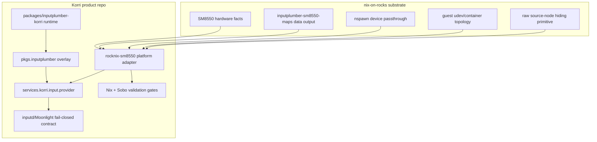

# refactor: Move InputPlumber runtime ownership into Korri

## Summary

Move Korri's InputPlumber runtime/package ownership into Korri while keeping physical controller maps and Snapdragon/SM8550 device plumbing in nix-on-rocks. The split is explicit: nix-on-rocks publishes a named data-only SM8550 maps output, Korri owns the InputPlumber runtime package and normalized-input product contract, and the Korri SM8550 platform adapter composes both through `XDG_DATA_DIRS`.

---

## Problem Frame

Task 025 originally framed the choice as either splitting product-specific controller maps out of nix-on-rocks or moving the whole InputPlumber package into Korri. A challenge pass refined the boundary: InputPlumber is vital to Korri's product runtime, but the AYN/AYANEO map files describe physical controller hardware, closer to display transforms, audio UCM, touchscreen calibration, and device passthrough than to Korri product behavior. The plan therefore moves runtime ownership to Korri without pretending hardware maps are product policy.

---

## Requirements

- R1. Korri owns the InputPlumber runtime package used by official Korri images, including source/version/hash, build expression, package metadata, flake output, and overlay substitution.
- R2. nix-on-rocks owns the SM8550/handheld InputPlumber controller maps as hardware data and exposes them through a named, data-only package output.
- R3. Korri composes the Korri InputPlumber runtime package with the substrate maps output in the SM8550 platform adapter, preferring `XDG_DATA_DIRS` multi-root loading.
- R4. SM8550 Korri image evaluation fails when the named maps output is unavailable; missing hardware maps are an integration error, not a runtime surprise.
- R5. Existing normalized-input behavior is preserved: `services.korri.input.provider.name = "inputplumber"` enables InputPlumber, loads `uinput`, orders `korri-inputd`, and makes inputd/Moonlight fail closed without the virtual gamepad.
- R6. Verification is split by owner: nix-on-rocks tests exact map content and the `xb360` adjustment; Korri tests package/runtime ownership, maps-output composition, and Sobo/Odin hardware behavior.
- R7. The migration lands in three additive steps: publish the maps output in nix-on-rocks, switch Korri to its runtime package plus the maps output, then clean up the old nix-on-rocks package coupling.
- R8. The existing raw-gamepad hider remains untouched in the Korri-first runtime switch but must be tracked as a sister-repo cleanup item so product-shaped service-name ordering is not forgotten.
- R9. Sobo/Odin hardware smoke is the blocking hardware gate before closing task 025; Thor/Bandai confidence follows from the shared map-output contract unless separate validation is requested.

---

## Scope Boundaries

- Do not move AYN/AYANEO physical controller maps into Korri.
- Do not move SM8550 kernel, container, device-passthrough, udev topology, raw-device hiding, or hardware-button facts into generic Korri modules.
- Do not make nix-on-rocks import Korri or know about `services.korri.*` as part of the durable substrate contract.
- Do not redesign TypeScript native input bridge, `korri-inputd`, or Moonlight launcher semantics beyond package ownership fallout.
- Do not solve touch passthrough, `-input` retirement, or full guest-owned udev sequencing in this slice unless the runtime/maps composition directly requires a small fix.
- Do not add version-compatibility metadata between the maps output and the Korri runtime package in this plan; compatibility is gated by Sobo/Odin smoke.

### Deferred to Follow-Up Work

- Full SM8550 guest-owned input topology cleanup from `docs/brainstorms/2026-05-25-001-sm8550-guest-owned-input-boundary-requirements.md`, including host-side udev staging decommission and any `MoveSourceDevice` hardening not required for this runtime ownership move.
- Raw-gamepad hider product-blind cleanup through task 032's unit-name contract. This is tracked both in U6 and in `backlog/task-032 - parameterize-substrate-kiosk-coupling-and-write-product-blind-contract.md`.
- Removing all historical nix-on-rocks InputPlumber package compatibility aliases after Korri consumes the runtime/maps split and any downstream non-Korri consumers have either migrated or accepted removal.
- Rich user-facing controller diagnostics/settings UI.

---

## Context & Research

### Relevant Code and Patterns

- `packages/moonlight-embedded-korri/package.nix` and `packages/sunshine-korri/package.nix` show the Korri downstream package pattern: package-specific directory, package-owned modifications, overlay registration, and named flake outputs.
- `nix/overlays/korri-packages.nix` is the central substitution point for Korri-owned downstream packages.
- `nix/modules/korri-input.nix` already treats `inputplumber` as the canonical provider and self-wires `services.inputplumber`, `uinput`, udev rules, and inputd fail-closed environment.
- `nix/images/platforms/rocknix-sm8550.nix` currently wraps `substratePackages.inputplumber` with a Korri-specific YAML substitution and forces it into `services.inputplumber.package`.
- `nix/images/platforms/x86.nix` already expects an InputPlumber-backed provider for kiosk images and forces `XDG_DATA_DIRS` so the service can find package data.
- `nix/tests/korri-input-module-check.nix`, `nix/tests/korri-rocknix-sm8550-config-check.nix`, `nix/tests/korri-live-usb-config-check.nix`, and `nix/tests/korri-image-outputs-check.nix` are the existing Nix contract tests for provider wiring.
- In the sister repo, `packages/inputplumber/default.nix` builds InputPlumber v0.75.2 and copies per-product maps into `share/inputplumber`.
- In the sister repo, `guest/modules/input.nix` currently installs that package, enables `services.inputplumber`, prepares `/dev/uinput` and `/dev/inputplumber`, and defines `rocknix-guest-hide-raw-gamepad`.

### Institutional Learnings

- `docs/plans/2026-05-29-002-refactor-sm8550-substrate-capability-boundary-plan.md`: nix-on-rocks owns neutral SM8550 substrate capabilities; Korri maps those capabilities into product policy.
- `docs/solutions/architecture-patterns/architectural-posture-as-nix-image-default-2026-05-27.md`: opinionated product posture belongs in image/platform composition, not conservative generic modules.
- `docs/solutions/best-practices/product-owned-composition-keeps-shared-layers-reusable-2026-05-03.md`: product-owned choices should not leak into shared/reusable layers.
- `docs/solutions/workflow-issues/rocknix-guest-only-nix-deploy-2026-05-27.md`: SM8550 guest deploys and validation target the NixOS guest store, not the ROCKNIX host.
- `docs/solutions/tooling-decisions/align-flake-nixpkgs-to-downstream-pin-for-cache-coherence-2026-05-27.md`: adding packages to the SM8550 closure must account for nixpkgs pin/cache coherence.

### External References

External research was skipped. This is a repo-specific Nix ownership and boundary refactor with strong local patterns and documented device evidence.

---

## Itemized Boundary: A/B Repo Split

### Korri owns

| Logical responsibility | Why Korri owns it |
|------------------------|-------------------|
| InputPlumber runtime package used by official Korri images | Korri depends on the runtime version/package shape for kiosk input, Moonlight input, and Sunshine/uinput behavior. |
| `pkgs.inputplumber` substitution in Korri builds | Official Korri images should consistently resolve to the Korri-controlled runtime package. |
| `services.korri.input.provider` product contract | Provider selection, inputd fail-closed behavior, Moonlight fail-closed behavior, and Sunshine/uinput expectation are Korri product policy. |
| SM8550 composition of runtime + substrate maps | The Korri platform adapter chooses how the product image consumes substrate capabilities. |
| Korri Nix checks and docs for normalized input | Korri must prove its image includes the runtime, map data root, and fail-closed product wiring it requires. |
| Sobo/Odin product-path hardware smoke | Korri owns closing the product behavior loop, even when the maps are substrate-owned. |

### nix-on-rocks / Snapdragon substrate owns

| Logical responsibility | Why it stays in nix-on-rocks |
|------------------------|------------------------------|
| AYN/AYANEO InputPlumber map files | They describe physical controller/MCU hardware, not Korri product behavior. |
| `inputplumber-sm8550-maps` data-only package output | This is the public substrate contract for hardware maps: `$out/share/inputplumber/...`. |
| `xb360` target adjustment in the AYN map | It is part of the validated hardware-normalization map output consumed before Korri sees the virtual controller. |
| SM8550 device profiles and hardware facts | Display, audio, physical button, and controller facts belong to the platform/device-profile layer. |
| nspawn/container device passthrough | `/dev/input`, `/dev/uinput`, `/dev/inputplumber`, and any needed `/dev/hidraw*` are kernel/container topology. |
| Guest udev viability/topology | Writable `/run/udev`, udevd under nspawn, and device database seeding are substrate/container capabilities. |
| Raw source-node hiding primitive | Hiding or moving raw physical gamepad nodes is substrate/hardware namespace behavior. |
| Host recovery/safety-net mechanics | Recovery plane belongs to the substrate/recovery repo. |

### SM8550-specific Korri platform items to preserve

| Item | File | Why it remains platform-specific |
|------|------|----------------------------------|
| Forced `XDG_DATA_DIRS` for `inputplumber.service` | `nix/images/platforms/rocknix-sm8550.nix` | The nspawn guest environment needs explicit package and maps data visibility. |
| `KORRI_INPUTD_POWER_SUSPEND`, `KORRI_INPUTD_LID_*`, `KORRI_INPUTD_VOLUME_*` inhibitors | `nix/images/platforms/rocknix-sm8550.nix` | SM8550 main-space hardware-button handler owns bare safety semantics. |
| Ordering assertions involving `rocknix-guest-hide-raw-gamepad` | `nix/tests/korri-rocknix-sm8550-config-check.nix` | The service is substrate/hardware-specific but must still precede Korri consumers while it exists. |
| Gamescope and Moonlight platform/audio environment derived from neutral SM8550 capabilities | `nix/images/platforms/rocknix-sm8550.nix` | Korri maps substrate facts into product launch policy here, not in generic modules. |

---

## Key Technical Decisions

- Move the Korri-used InputPlumber runtime package into Korri, but keep physical controller maps in nix-on-rocks.
- Require nix-on-rocks to expose a named, data-only maps package/output such as `inputplumber-sm8550-maps`; Korri must not reach into sister-repo source paths or old package internals.
- Prefer `XDG_DATA_DIRS` multi-root loading: `${config.services.inputplumber.package}/share`, `${substratePackages.inputplumber-sm8550-maps}/share`, and `/run/current-system/sw/share`.
- Use a composed package only as an implementation-time fallback if InputPlumber does not merge map roots correctly through `XDG_DATA_DIRS`.
- Land the migration in three steps: additive maps output in nix-on-rocks, Korri runtime/composition switch, then nix-on-rocks cleanup.
- Put the AYN `xbox-series` to `xb360` target adjustment in the nix-on-rocks maps output, not in Korri's platform adapter.
- Split verification by owner: nix-on-rocks checks exact map files/content; Korri checks composition and runtime result.
- Do not add maps/runtime version compatibility metadata in this slice; rely on Sobo/Odin smoke for the runtime-map compatibility gate.
- Fail SM8550 Korri evaluation when the named maps output is missing.

---

## Open Questions

### Resolved During Planning

- Should maps move to Korri? No. They are hardware facts and stay in nix-on-rocks as a named maps output.
- Should Korri still move InputPlumber over? Yes, but the residue is runtime/package ownership and product contract ownership, not physical maps.
- Should Korri consume arbitrary source paths from nix-on-rocks? No. Korri consumes only a named public maps package/output.
- Should x86 receive SM8550 maps through the global overlay? No. The global overlay replaces the runtime package, while the SM8550 maps output is composed only by the SM8550 platform adapter.
- Should the raw-gamepad hider be neutralized in the first Korri PR? No. Leave behavior untouched first, but track the cleanup explicitly in U6 and task 032.
- Is Thor/Bandai hardware smoke required before closing task 025? No. Sobo/Odin is the blocking smoke; Thor/Bandai can follow if separately requested.

### Deferred to Implementation

- Exact name of the sister repo maps output. The plan uses `inputplumber-sm8550-maps` as the expected name; implementation can adjust if the sister repo has a stronger naming convention.
- Exact Korri package source strategy. Implementation should copy source/version/hash directly into Korri rather than importing the old package output, but final helper names are implementation details.
- Whether `XDG_DATA_DIRS` multi-root discovery is sufficient. If not, use the explicit composed-package fallback described in U4.
- Whether `/dev/hidraw*` passthrough is needed by the maps remains a hardware/substrate validation point, not a reason to move maps into Korri.

---

## Output Structure

Expected Korri package shape:

```text
packages/inputplumber-korri/
  package.nix
  check.nix
  README.md
```

Expected nix-on-rocks maps output shape:

```text
packages/inputplumber-sm8550-maps/
  package.nix
  maps/
    capability_maps/
      ayaneo_mcu_japanese.yaml
      ayaneo_mcu_xbox.yaml
      ayn_mcu.yaml
    devices/
      01-ayaneo-controller-japanese.yaml
      01-ayaneo-controller.yaml
      02-ayn-controller.yaml
```

The public output contract is:

```text
$out/share/inputplumber/
  capability_maps/...
  devices/...
```

---

## High-Level Technical Design

> *This illustrates the intended approach and is directional guidance for review, not implementation specification. The implementing agent should treat it as context, not code to reproduce.*



---

## Implementation Units

### U1. Publish data-only SM8550 InputPlumber maps from nix-on-rocks

**Goal:** Add a public substrate maps output that contains only hardware map data and no InputPlumber binary.

**Requirements:** R2, R4, R6, R7

**Dependencies:** None

**Target repo:** nix-on-rocks

**Files:**
- Create: `packages/inputplumber-sm8550-maps/package.nix`
- Move or copy: `packages/inputplumber-sm8550-maps/maps/capability_maps/ayaneo_mcu_japanese.yaml`
- Move or copy: `packages/inputplumber-sm8550-maps/maps/capability_maps/ayaneo_mcu_xbox.yaml`
- Move or copy: `packages/inputplumber-sm8550-maps/maps/capability_maps/ayn_mcu.yaml`
- Move or copy: `packages/inputplumber-sm8550-maps/maps/devices/01-ayaneo-controller-japanese.yaml`
- Move or copy: `packages/inputplumber-sm8550-maps/maps/devices/01-ayaneo-controller.yaml`
- Move or copy: `packages/inputplumber-sm8550-maps/maps/devices/02-ayn-controller.yaml`
- Modify: `flake.nix`
- Test: `nix/tests/guest-profile-contract.nix` or a new focused maps-output check
- Test: `scripts/static-checks.sh`

**Approach:**
- Publish a named package output whose public contract is `$out/share/inputplumber/...`.
- Ensure the output is data-only: no `bin/inputplumber`, no Rust build, and no dependency on the old InputPlumber package output.
- Apply the AYN `xb360` target adjustment in the map data itself, because it is the validated hardware-normalization policy for the map output.
- Keep the old bundled InputPlumber package temporarily if needed for compatibility; this unit only adds the public data output.

**Patterns to follow:**
- Sister repo package-output conventions in `flake.nix`.
- Existing map tree under `packages/inputplumber/maps/`.
- Existing static-check style in `scripts/static-checks.sh`.

**Test scenarios:**
- Happy path: `packages.${system}.inputplumber-sm8550-maps` exists and builds.
- Happy path: output contains the six expected map files under `$out/share/inputplumber/...`.
- Regression: output does not contain `bin/inputplumber` or build the InputPlumber runtime.
- Regression: AYN map content contains the validated `xb360` target policy.
- Boundary: checks fail if future edits re-bundle the maps exclusively inside the runtime package with no public maps output.

**Verification:**
- nix-on-rocks exposes a stable data-only map contract that Korri can consume without depending on package internals.

---

### U2. Create the Korri InputPlumber runtime package

**Goal:** Add a Korri-owned InputPlumber runtime package without SM8550-specific hardware maps.

**Requirements:** R1, R5

**Dependencies:** None

**Files:**
- Create: `packages/inputplumber-korri/package.nix`
- Create: `packages/inputplumber-korri/check.nix`
- Create: `packages/inputplumber-korri/README.md`
- Test: `nix/tests/korri-package-outputs-check.nix`

**Approach:**
- Copy the currently validated InputPlumber source/version/hash/cargo hash directly into Korri rather than importing the sister repo package output.
- Preserve upstream InputPlumber runtime data that belongs with the program, but do not copy AYN/AYANEO SM8550 maps into this package.
- Name the derivation with `pname = "inputplumber-korri"` so store paths carry the same discriminating ownership marker used by other Korri downstream packages, while preserving `meta.mainProgram = "inputplumber"`.
- Use the `inputplumber-korri` store-path marker as the Nix-check ownership signal so checks can distinguish it from upstream/substrate packages.

**Execution note:** Characterize the current runtime package output before switching image composition; the first Korri package should be behavior-preserving except for removing substrate-owned SM8550 maps.

**Patterns to follow:**
- `packages/moonlight-embedded-korri/package.nix`
- `packages/sunshine-korri/package.nix`
- Sister repo `packages/inputplumber/default.nix` as migration source/provenance only

**Test scenarios:**
- Happy path: package output contains `bin/inputplumber` and the runtime data required by the service.
- Happy path: package metadata/store path is distinguishably Korri-owned.
- Regression: package check fails if SM8550 map files are accidentally copied into `inputplumber-korri`.
- Boundary: package README states that SM8550 controller maps come from `inputplumber-sm8550-maps`, not this runtime package.

**Verification:**
- Korri has a buildable InputPlumber runtime package independent of the sister repo's runtime package output.

---

### U3. Expose InputPlumber through Korri overlays and flake outputs

**Goal:** Make Korri's runtime package available as `pkgs.inputplumber` in Korri builds and as a named flake package.

**Requirements:** R1, R5

**Dependencies:** U2

**Files:**
- Modify: `nix/overlays/korri-packages.nix`
- Modify: `flake.nix`
- Modify: `nix/tests/korri-package-outputs-check.nix`

**Approach:**
- Add the Korri InputPlumber runtime package to the existing Korri package overlay alongside `moonlight-embedded`, `sunshine`, and `libretro-fake-08`.
- Expose a named `inputplumber-korri` flake package output, mirroring `moonlight-embedded-korri` and `sunshine-korri`.
- Keep `services.korri.input.provider.package` overrideable; official Korri builds use the overlay default, downstream consumers can still set a different provider package deliberately.

**Patterns to follow:**
- `nix/overlays/korri-packages.nix`
- `flake.nix` package outputs for `moonlight-embedded-korri` and `sunshine-korri`
- `nix/tests/korri-package-outputs-check.nix`

**Test scenarios:**
- Happy path: `packages.inputplumber-korri` is present on supported Linux systems.
- Happy path: the Korri overlay makes `pkgs.inputplumber` resolve to the Korri runtime package in Korri builds.
- Regression: package output checks fail if the executable or ownership marker disappears.
- Boundary: explicit module override of `services.korri.input.provider.package` remains possible.

**Verification:**
- Downstream Korri builds can request either the named package output or `pkgs.inputplumber` through the overlay and receive the Korri-owned runtime package.

---

### U4. Compose Korri runtime with substrate maps in the SM8550 platform adapter

**Goal:** Switch Korri's SM8550 image composition from the old substrate runtime wrapper to Korri runtime plus substrate maps.

**Requirements:** R3, R4, R5, R6, R7

**Dependencies:** U1, U3

**Files:**
- Modify: `nix/images/platforms/rocknix-sm8550.nix`
- Modify: `nix/tests/korri-rocknix-sm8550-config-check.nix`
- Modify: `nix/tests/korri-image-outputs-check.nix`

**Approach:**
- Delete the SM8550 `runCommand` wrapper that copies `substratePackages.inputplumber` and patches a YAML file in place.
- Require `nix-on-rocks.packages.${system}.inputplumber-sm8550-maps` for SM8550 Korri image evaluation; fail clearly if it is absent.
- Implement the missing-maps guard as a NixOS assertion using `builtins.hasAttr "inputplumber-sm8550-maps" substratePackages`, so existing `failedNixosAssertions`-style config checks can exercise the failure path without a custom stripped-flake fixture.
- Compose InputPlumber data roots through `XDG_DATA_DIRS`, preferring separate roots for runtime package data and substrate map data.
- Preserve SM8550-specific `XDG_DATA_DIRS` forcing because service data discovery under nspawn remains a platform concern.
- Preserve provider fail-closed contract and existing environment propagation for sessiond and `korri-server`.
- Add a source-level regression guard that fails if `nix/images/platforms/rocknix-sm8550.nix` reintroduces `substratePackages.inputplumber` or the old `korri-rocknix-inputplumber-xb360` wrapper.
- If implementation proves InputPlumber does not merge `XDG_DATA_DIRS` roots correctly, replace only the SM8550 platform composition with a composed package that layers the maps output into the Korri runtime package.

**Patterns to follow:**
- Current `nix/images/platforms/rocknix-sm8550.nix` capability mapping pattern for video/audio.
- Existing InputPlumber assertions in `nix/tests/korri-rocknix-sm8550-config-check.nix`.
- Existing image-output checks in `nix/tests/korri-image-outputs-check.nix`.

**Test scenarios:**
- Happy path: SM8550 Thor and Odin configs use `services.korri.input.provider.name = "inputplumber"` and resolve a runtime package whose store path contains `inputplumber-korri`.
- Happy path: `inputplumber.service` sees both runtime package data and the substrate maps output through `XDG_DATA_DIRS`.
- Error path: SM8550 evaluation surfaces a NixOS assertion failure with a clear message if `inputplumber-sm8550-maps` is absent.
- Regression: SM8550 config check fails if `rocknix-sm8550.nix` still references `substratePackages.inputplumber` or the old wrapper name.
- Regression: live product image checks still prove InputPlumber provider wiring, inputd fail-closed env, and Moonlight fail-closed env.
- Boundary: SM8550 hardware-button inhibitor env remains in the SM8550 platform adapter and does not move into `nix/modules/korri-input.nix`.

**Verification:**
- Korri Nix image evaluations prove the official SM8550 composition consumes Korri's runtime package plus the substrate maps output without losing normalized-input behavior.

---

### U5. Encode the revised ownership boundary in Korri docs and backlog

**Goal:** Make the challenged runtime/maps split durable so future work does not re-litigate task 025.

**Requirements:** R1, R2, R3, R6, R8

**Dependencies:** U4

**Files:**
- Modify: `docs/deployment/korri-nixos-modules.md`
- Modify: `docs/deployment/korri-images.md`
- Modify: `backlog/task-025 - relocate-inputplumber-product-controller-maps.md`

**Approach:**
- Update docs to state the final boundary: Korri owns InputPlumber runtime/package selection and product fail-closed contract; nix-on-rocks owns SM8550 controller maps and device/container plumbing.
- Include the logical A/B split in durable prose so reviewers can distinguish runtime ownership from hardware-map ownership.
- Update task 025 to record the challenged decision: not "move maps into Korri," but "runtime into Korri, maps exposed from substrate as a named data output."
- Link task 032 as the follow-up for raw-gamepad hider product-blind service-name cleanup.

**Patterns to follow:**
- `docs/deployment/korri-nixos-modules.md` ownership boundary section.
- `docs/deployment/korri-images.md` normalized controller validation section.
- Existing backlog item format in `backlog/task-025 - relocate-inputplumber-product-controller-maps.md`.

**Test scenarios:**
- Documentation expectation: docs explicitly distinguish Korri-owned runtime/package selection from substrate-owned hardware maps.
- Documentation expectation: task 025 no longer recommends moving AYN/AYANEO maps into Korri.
- Boundary: generic input module documentation remains free of Odin, Thor, AYN, AYANEO, SM8550, and nix-on-rocks-specific assumptions.

**Verification:**
- A reviewer can answer "what moved?" and "what stayed in nix-on-rocks?" from repo docs and backlog state, without relying on chat history.

---

### U6. Clean up old nix-on-rocks runtime/map coupling after Korri switches

**Goal:** Remove or deprecate the old sister-repo InputPlumber package coupling after Korri consumes the new runtime/maps split.

**Requirements:** R2, R6, R7, R8

**Dependencies:** U1, U4, U5

**Target repo:** nix-on-rocks

**Files:**
- Modify or remove: `packages/inputplumber/default.nix`
- Modify: `guest/modules/input.nix`
- Modify: `profiles/rocknix-guest-base.nix`
- Modify: `README.md`
- Test: `nix/tests/guest-profile-contract.nix`
- Test: `nix/tests/audio-input-systemd-contract.nix`
- Test: `scripts/static-checks.sh`

**Approach:**
- Remove or deprecate the sister repo runtime package after Korri no longer consumes it.
- Ensure `guest/modules/input.nix` no longer installs a Korri-shaped InputPlumber runtime package by default.
- Keep substrate-only pieces: `/dev/uinput` and `/dev/inputplumber` availability, guest udev/container readiness, map data output, and any raw device namespace primitive needed by SM8550 hardware.
- Leave the raw-gamepad hider behavior untouched during the Korri runtime switch, but make this cleanup consume task 032's product-blind unit options or explicitly list the hider as a known blocking violation.
- Remove any references that require nix-on-rocks to know `korri-compositor.service`, `korri-inputd.service`, or other product service names after the cleanup window.

**Patterns to follow:**
- Sister repo `profiles/rocknix-guest-base.nix` product-blind substrate contract.
- `backlog/task-032 - parameterize-substrate-kiosk-coupling-and-write-product-blind-contract.md`.
- Korri `docs/plans/2026-05-29-002-refactor-sm8550-substrate-capability-boundary-plan.md` boundary model.

**Test scenarios:**
- Happy path: nix-on-rocks still exposes `inputplumber-sm8550-maps` and substrate device/container capabilities without shipping a Korri-shaped runtime package.
- Regression: sister repo checks fail if AYN/AYANEO maps are only available by building the old runtime package.
- Regression: sister repo checks fail if product service names such as `korri-compositor.service` are baked into substrate modules after the cleanup window.
- Follow-up lock: the raw-gamepad hider either consumes product-blind unit options from task 032 or is listed as a known blocking violation that prevents closing the migration.
- Boundary: device passthrough and udev topology checks remain present because those are substrate responsibilities.

**Verification:**
- nix-on-rocks can be updated independently without importing Korri, while Korri images continue to build against the substrate profile, Korri runtime package, and public maps output.

---

### U7. Validate Sobo/Odin normalized input after the split

**Goal:** Prove the runtime/maps split preserved observable normalized-input behavior on the primary SM8550 device.

**Requirements:** R5, R6, R9

**Dependencies:** U4, U5, U6 where applicable

**Files:**
- Modify: `docs/deployment/korri-images.md` if new validation evidence changes the documented gate
- Test: `nix/tests/korri-rocknix-sm8550-config-check.nix`
- Test: `nix/tests/korri-live-usb-config-check.nix`

**Approach:**
- Keep static Nix checks as the first gate, then require Sobo/Odin hardware smoke before closing task 025.
- Validate that `inputplumber.service` is active, sees the Korri runtime package data root and substrate maps data root, and emits exactly one expected virtual Xbox-class gamepad for a single-controller target.
- Validate that `korri-inputd` and Moonlight consume the virtual device and do not fall back to raw physical gamepads.
- Treat Thor/Bandai as confidence by shared map-output contract rather than a blocking gate for this migration.
- Run existing TypeScript resolver/inputd/Moonlight tests as regression coverage, but do not edit them unless the package/runtime split reveals a real behavioral contract drift.

**Patterns to follow:**
- `docs/deployment/korri-images.md` normalized controller validation section.
- Existing proc fixtures under `tools/testing/fixtures/proc/`.
- Existing fail-closed tests in `tools/device/inputd.test.ts` and `tools/cli/moonlight-launcher.test.ts`.

**Test scenarios:**
- Happy path: Sobo/Odin smoke shows one InputPlumber virtual Xbox-class gamepad and no raw-gamepad fallback in inputd/Moonlight.
- Happy path: SM8550 config proves both Korri runtime package data and substrate maps data are visible to `inputplumber.service`.
- Error path: missing maps output fails SM8550 evaluation before build/deploy.
- Regression run: raw-only `/proc/bus/input/devices` fixture still makes inputd and Moonlight fail closed.
- Regression run: ambiguous virtual gamepad fixture still rejects launch rather than selecting an arbitrary device.
- Integration: restarting InputPlumber or renumbering event nodes does not leave stale event-node state in inputd or Moonlight launch selection.

**Verification:**
- The migration is complete only when Nix checks pass and Sobo/Odin device evidence proves the split runtime/maps composition produces the expected normalized input surface.

---

## System-Wide Impact

- **Interaction graph:** The migration touches nix-on-rocks package outputs, Korri package overlays, SM8550 platform composition, `services.inputplumber`, `korri-inputd`, sessiond/Moonlight launch environment, and hardware validation docs.
- **Error propagation:** Missing maps output fails SM8550 evaluation; missing virtual gamepads continue to fail closed at inputd/Moonlight runtime gates.
- **State lifecycle risks:** Event node numbers remain unstable; runtime code must continue resolving the virtual controller at use time rather than caching `/dev/input/eventN`.
- **API surface parity:** Korri flake consumers can use `inputplumber-korri` directly or get it through the default overlay; substrate consumers can use `inputplumber-sm8550-maps` as data.
- **Integration coverage:** Unit tests prove resolver behavior; Nix eval proves wiring; Sobo/Odin smoke proves InputPlumber actually loads maps and emits the expected virtual controller.
- **Unchanged invariants:** Generic Korri modules stay product-agnostic; nix-on-rocks remains product-blind and does not import Korri; SM8550 platform facts stay outside shared TypeScript.

---

## Risks & Dependencies

| Risk | Mitigation |
|------|------------|
| InputPlumber does not merge maps across multiple `XDG_DATA_DIRS` roots | Prefer multi-root composition but keep a composed-package fallback scoped to the SM8550 platform adapter. |
| Maps/runtime version drift breaks hardware behavior | No version metadata in this slice; Sobo/Odin smoke is the blocking compatibility gate. |
| Korri accidentally consumes sister-repo source paths instead of a public maps output | Require a named data-only `inputplumber-sm8550-maps` package and source-level guards against old package internals. |
| x86 images accidentally depend on SM8550 maps | Global overlay changes the runtime only; SM8550 maps are composed only in `rocknix-sm8550.nix`. |
| Sister repo cleanup removes a substrate primitive Korri still needs | Stage cleanup after Korri checks pass and keep the A/B boundary explicit. |
| Raw-gamepad hider product-name coupling is forgotten | Track it in U6 and task 032; do not close the migration while it is an unacknowledged product-blindness violation. |
| Adding package ownership changes aarch64 closure/cache behavior | Check nixpkgs pin alignment and treat closure changes as PR-visible review material. |

---

## Documentation / Operational Notes

- Update task 025 after this plan lands: the design decision is no longer "move maps into Korri"; it is "Korri owns InputPlumber runtime, nix-on-rocks exposes SM8550 maps as data."
- PR descriptions should include the A/B split or link to this plan so reviewers can audit Snapdragon/nix-on-rocks responsibilities explicitly.
- Device validation should target the NixOS guest generation on Sobo/Odin, not the ROCKNIX host recovery plane.
- Do not close the backlog item on Nix eval alone; close it after a clean Sobo/Odin product-path hardware smoke validates the new runtime/maps composition.

---

## Sources & References

- Related backlog: `backlog/task-025 - relocate-inputplumber-product-controller-maps.md`
- Related backlog: `backlog/task-032 - parameterize-substrate-kiosk-coupling-and-write-product-blind-contract.md`
- Related requirements: `docs/brainstorms/2026-05-25-001-sm8550-guest-owned-input-boundary-requirements.md`
- Related plan: `docs/plans/2026-05-24-003-refactor-inputplumber-normalized-input-plan.md`
- Related plan: `docs/plans/2026-05-29-002-refactor-sm8550-substrate-capability-boundary-plan.md`
- Korri package pattern: `packages/moonlight-embedded-korri/package.nix`
- Korri overlay: `nix/overlays/korri-packages.nix`
- Korri input module: `nix/modules/korri-input.nix`
- SM8550 platform adapter: `nix/images/platforms/rocknix-sm8550.nix`
- Sister repo package source: `packages/inputplumber/default.nix`
- Sister repo input module: `guest/modules/input.nix`
