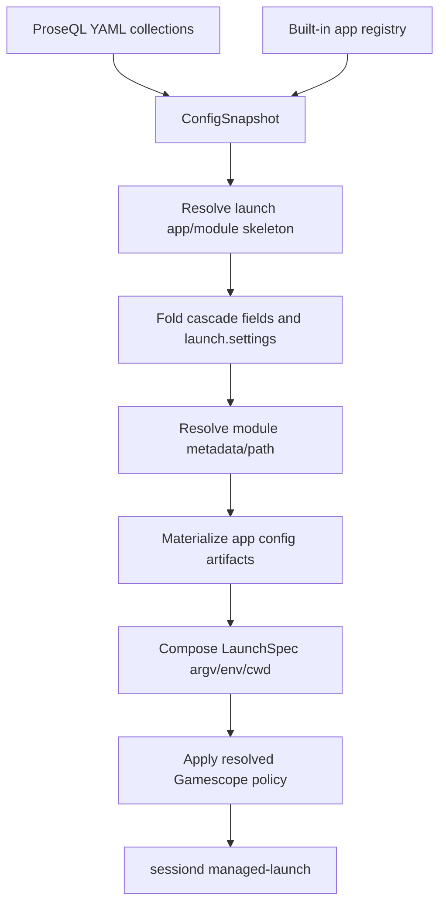

# refactor: Normalize launch config around apps and modules

## Summary

Replace the remaining launcher/profile-shaped authoring model with a launch config model centered on built-in apps, top-level modules, and cascade-owned `launch` blocks. Korri will compile human-authored `launch.app`, optional `launch.module`, and `launch.settings` into app-specific config artifacts and the existing structured `LaunchSpec`, preserving sessiond as the foreground lifecycle owner.

---

## Problem Frame

Korri’s current launch cascade is powerful but still exposes implementation-era terms: `launchers`, `cores`, argv templates, and by-launcher overrides. The desired authoring model is closer to the product language validated in discussion: Dolphin, MAME, Solarus, and RetroArch are apps; fake08 and snes9x are modules; systems and games declare how they launch without restating known app boilerplate.

---

## Requirements

- R1. Public YAML authoring supports `systems.<id>.launch`, `games.<id>.launch`, and preset `launch` blocks with `app`, optional `module`, `settings`, and launch-local args/env/cwd contributions.
- R2. Built-in app ids such as `retroarch`, `mame`, `dolphin`, and `solarus` are known by Korri/image without requiring users to restate `type: retroarch` or `command: retroarch` boilerplate.
- R3. Optional `apps.<id>` records override built-in app defaults, especially app-level `settings`, without redefining the app identity unless a custom app is being added.
- R4. Top-level `modules` records model loadable artifacts such as libretro cores independently from apps; app/module compatibility is validated by the app integration, not by nesting modules under apps.
- R5. Settings merge through the existing cascade, with the app/legacy-launcher layer baseline formed from built-in app defaults overridden by optional `apps.<id>.settings`; that combined app baseline then participates at the launcher/app-layer position (`global → user → system → app/legacy-launcher → game → preset chain → ephemeral override`), with more-specific keys winning and `inherit: false` truncating the cascade-layer portion as a whole.
- R6. App-specific config files are materialized before spawn and then referenced by the generated argv/env; sessiond continues to receive only the existing `LaunchSpec` shape.
- R7. The refactor preserves existing safety invariants: strict schema decoding, key-derived YAML ids, argv arrays instead of shell strings, explicit placeholder failures, and typed configuration diagnostics before spawning.
- R8. Existing libraries using `launchers`, `launcher`, `cores`, `core`, and `byLauncher` keep working during the migration window; the new model is additive-first and provides diagnostics/migration guidance rather than a hard schema break.
- R9. Nix/image wiring provides app binaries and stable module paths as deployment capabilities while avoiding accidental closure bloat in product images.

---

## Scope Boundaries

- This plan does not implement a launcher/app selection UI; it changes the authoring and resolution model that such a UI could use later.
- This plan does not change sessiond’s managed-launch wire contract or make sessiond resolve YAML/config directly.
- This plan does not require adding every MAME/Dolphin/Solarus package to every product image by default; app availability remains an image capability.
- This plan does not define rich emulator-specific schemas for every possible setting key. v1 settings values are typed scalars with app-specific serialization, known-key warnings where app integrations can provide them, and targeted validation.
- This plan does not migrate user YAML automatically in-place. It keeps compatibility aliases and adds dry-run/migration documentation.
- This plan does not solve multi-disc, BIOS dependency graphs, controller profiles, save-management policy, or emulator-specific UI for choosing alternate modules.

### Deferred to Follow-Up Work

- Rich app-specific typed settings schemas beyond scalar settings maps.
- A UI for selecting alternate apps/modules/presets at launch time.
- Automated YAML migration that rewrites legacy `launcher`/`core` fields into `launch` blocks.
- Import-time content-extension normalization/warnings for RetroArch `.png`/core collisions, beyond targeted validation hooks introduced here.
- Package opt-in UX for broad emulator sets on product vs. developer images.

---

## Context & Research

### Relevant Code and Patterns

- `korri/shared/library/config/cascade-resolver.ts` implements the current skeleton pass, preset enumeration, and seven-layer fold. The new model should extend this resolver rather than create a second resolution path.
- `korri/shared/library/config/inheritable-fields.ts` defines the field whitelist and merge rules. New `launch`/`settings` behavior should follow this explicit cascade-field pattern.
- `korri/shared/library/config/records/launcher.ts`, `records/system.ts`, `records/game.ts`, `records/preset.ts`, `records/global.ts`, and `config/ephemeral-override.ts` show the strict Effect Schema pattern that must be updated additively.
- `korri/shared/library/config/compose-launch-spec.ts` is the mechanical argv-template substitution seam. It should remain separate from cascade resolution and from process execution.
- `korri/shared/library/proseql/library-db.ts` registers map-keyed YAML collections with id-derived keys; `modules` and optional `apps` belong in the same pattern.
- `korri/shared/library/proseql/library-repository.ts` loads snapshots and resolves launches. It is the right boundary for app/module lookup and materialization before returning a `LaunchSpec`.
- `korri/products/app/api/library/launch.rpc-handler.ts` already maps configuration failures to pre-spawn launch failures and wraps resolved specs with Gamescope before sessiond submission.
- `nix/images/kiosk.nix` already packages RetroArch/fake08 with `symlinkJoin` and exposes `/etc/korri/cores/fake08_libretro.so` as a stable module path.
- `nix/modules/korri-sessiond.nix` owns the PATH that sessiond-spawned foreground apps inherit; app package availability belongs here or in image modules, not in user YAML.
- `tools/library/launcher-config-cli.ts` is the existing dry-run validation surface; it should grow to show app/module/settings/materialized config output.

### Institutional Learnings

- `docs/solutions/design-patterns/explicit-cascade-folded-policy-over-incidental-signal-heuristics-2026-05-27.md`: emulator config intent must be explicit cascade data, not inferred from argv/env or generated config files after the fact.
- `docs/solutions/best-practices/proseql-canonical-library-with-derived-yaml-ids-2026-05-06.md`: ProseQL payloads should use key-derived ids and keep persistence payloads separate from runtime contracts.
- `docs/solutions/runtime-errors/retroarch-bare-passthru-wrapper-injects-l-coredir-2026-05-27.md`: do not use upstream wrappers that silently inject RetroArch `-L`/config flags when Korri must control the argv contract.
- `docs/solutions/runtime-errors/retroarch-png-extension-routes-to-image-display-core-2026-05-27.md`: RetroArch content-extension routing can silently override intent when the CLI is ambiguous; explicit single-core argv and stable core paths are required.
- `docs/solutions/architecture-patterns/sessiond-operator-model-2026-05-29.md`: sessiond owns foreground lifecycle truth; generated config files are launch artifacts, not new protocol fields.
- `docs/solutions/architecture-patterns/kiosk-foreground-app-policy-over-gamescope-overlay-2026-05-24.md`: Gamescope policy remains separate from app config and foreground-session ownership.

### External References

- RetroArch CLI documentation: `retroarch --config <path> -L <core.so> <content>` supports per-launch config replacement.
- MAME command-line reference: `-inipath`, `-noreadconfig`, and path override flags support isolated per-launch configuration.
- Dolphin command-line documentation: `--user <path>`, `--exec <file>`, `--batch`, and `-C` provide a clean isolated user/config directory pattern.
- Solarus CLI/source research: `solarus-run <quest>` is straightforward, but write-dir isolation may require environment-level `HOME`/XDG handling rather than a first-class CLI flag.

---

## Key Technical Decisions

| Decision | Rationale |
|---|---|
| Use `launch` as the public block name | It reads naturally at system/game/preset layers and avoids making users choose between “runtime,” “profile,” “player,” or “launcher.” |
| Treat apps as built-in registry entries plus optional YAML overrides | Built-ins remove redundant `type: retroarch` / `command: retroarch` boilerplate while still letting users override settings or define custom apps. The implementation should normalize built-ins and app overrides into the same descriptor shape before composition, not bypass the existing safety checks. |
| Keep top-level `modules` independent from apps | fake08 is a libretro module, not a child owned by RetroArch. Compatibility belongs in the app integration/materializer. |
| Keep legacy `launchers`/`launcher`/`core`/`cores` as aliases during v1 | The current schemas are strict; hard removal would make existing libraries fail to load. Additive compatibility gives users a migration window. Compatibility is field-level, not record-level: an `apps.retroarch.settings` override must not accidentally drop legacy `launchers.retroarch.policy` or presets. |
| Keep `byLauncher` as the scoped override key for now | Renaming it to `byApp` would break six layer-bearing schemas. App ids are valid `byLauncher` keys until a later migration can rename safely. |
| Materialize config before composing the final `LaunchSpec` | Generated config paths must appear in argv/env before process spawn. Doing this before composition preserves the immutable `LaunchSpec` boundary to sessiond. The materializer returns artifact paths/settings inputs; final command allowlist enforcement still runs through the same composition/safety path. |
| Add a small closed placeholder extension only if needed | Existing placeholders stay small and fail fast. A new config-artifact placeholder should be introduced only for generated config paths, not as a general templating language. |
| Store settings as typed scalar maps in v1 | `string | number | boolean` covers common emulator settings without committing to full per-app schema taxonomies before usage proves them. |
| Use app integrations as internal compilers, not public `scaffold:` config | Korri needs code that knows RetroArch/MAME/Dolphin/Solarus config formats, but users should not author `scaffold` or restate the app type. Integration code owns compatibility checks, known-setting warnings, and app-specific artifact serialization. |
| Keep Nix packaging capability separate from YAML selection | YAML can name `app: dolphin`, but the image must provide Dolphin on sessiond’s PATH. Nix tests should catch product image capabilities without forcing broad emulator packages into every closure. Materialized artifacts must live outside `/tmp` because sessiond uses `PrivateTmp`; the shared path must be tmpfiles-managed and visible to both korri-server and sessiond-spawned children. |

---

## Open Questions

### Resolved During Planning

- Should PICO-8 be modeled as a launcher/app? No. PICO-8 is a content system; `fake08` is a module; `retroarch` is the app.
- Should Dolphin be modeled as a launcher/app? Yes. Dolphin is an app because it is the runnable program/control surface for Wii/GameCube content.
- Should modules be nested under apps? No. Modules are top-level loadable artifacts, and compatibility is validated by the app integration.
- Should `scaffold` be a public YAML field? No. App integrations are internal compiler/materializer code; public config names apps/modules/launch/settings.
- Should users need `apps.retroarch.type = retroarch` and `command = retroarch` for built-ins? No. Built-in app identities supply those defaults.
- Should app-level settings be configurable? Yes. `apps.<id>.settings` supplies app-wide defaults/overrides, then system/game/preset `launch.settings` can narrow them.

### Deferred to Implementation

- Exact directory names for materialized launch artifacts: the plan constrains ownership, readability, and lifecycle, but implementation should align with existing runtime-dir helpers and Nix service users. The chosen path must not be `/tmp` because sessiond uses `PrivateTmp`; it must be outside private tmp boundaries and exposed through a shared env var (`KORRI_LAUNCH_ARTIFACTS_DIR`) wired by Nix to both the materializing service and sessiond-spawned children.
- Exact built-in defaults for MAME, Dolphin, and Solarus: the plan defines integration seams and isolation strategies; final flags should be confirmed against the packaged binaries during implementation.
- Exact migration-warning mechanism for legacy fields: implementation can choose logs, CLI diagnostics, or repository diagnostics as long as launch/dry-run output is actionable.

---

## Output Structure

    korri/shared/library/config/
      app-integrations.ts
      app-integrations.test.ts
      app-materializer.ts
      app-materializer.test.ts
      launch-block.ts
      launch-block.test.ts
      module-resolution.ts
      module-resolution.test.ts
      records/app.ts
      records/app.test.ts
      records/module.ts
      records/module.test.ts
    korri/shared/library/proseql/
      library-db.ts
      library-repository.ts
      library-repository.test.ts
    tools/library/
      launcher-config-cli.ts
      launcher-config-cli.test.ts
    nix/modules/
      korri-server.nix
      korri-sessiond.nix
    nix/images/
      kiosk.nix
    nix/tests/
      korri-rocknix-sm8550-config-check.nix
      korri-image-outputs-check.nix

---

## High-Level Technical Design

> *This illustrates the intended approach and is directional guidance for review, not implementation specification. The implementing agent should treat it as context, not code to reproduce.*

### Authoring model sketch

```yaml
version: 1

apps:
  retroarch:
    settings:
      video_driver: glcore
      audio_driver: pulse
      input_joypad_driver: udev
      menu_driver: rgui
      config_save_on_exit: false
      video_fullscreen: true

modules:
  fake08:
    kind: libretro-core
    path: /etc/korri/cores/fake08_libretro.so
  snes9x:
    kind: libretro-core
    path: /etc/korri/cores/snes9x_libretro.so

systems:
  pico8:
    name: PICO-8
    extensions: [.p8, .png]
    launch:
      app: retroarch
      module: fake08
      settings:
        video_scale_integer: true

  snes:
    name: Super Nintendo
    extensions: [.sfc, .smc]
    launch:
      app: retroarch
      module: snes9x
      settings:
        rewind_enable: true

  arcade:
    name: Arcade
    extensions: [.zip, .7z]
    launch:
      app: mame
      settings:
        video: opengl
        joystick: true
        skip_gameinfo: true

  wii:
    name: Nintendo Wii
    extensions: [.rvz, .iso, .wbfs]
    launch:
      app: dolphin
      settings:
        video_backend: Vulkan
        internal_resolution: 2x-native

  solarus:
    name: Solarus
    extensions: [.solarus, .zip]
    launch:
      app: solarus
      settings:
        fullscreen: true

games:
  porklike:
    system: pico8
    contentPath: /storage/roms/pico8/porklike.p8
    metadata:
      name: Porklike
    launch:
      settings:
        video_scale_integer: false
      args:
        - --verbose
```

Note: the apps share the same authoring shape, but their isolation guarantees differ. RetroArch, MAME, and Dolphin have explicit per-launch config/user-dir mechanisms; Solarus v1-style write isolation may require environment redirection and should remain visible in diagnostics.

### Resolution flow



### Compatibility mapping

| Legacy field | New meaning during migration | Precedence |
|---|---|---|
| `launchers.<id>` | Legacy app definition / command template | Field-level fallback for command/args/policy/presets until migrated |
| `apps.<id>` with legacy `launchers.<id>` | New app settings/overrides plus legacy fields | New settings override; legacy policy/presets remain unless explicitly replaced |
| `launcher` | Alias for `launch.app` | Loses to `launch.app` on the same layer and emits a conflict diagnostic in dry-run |
| `core` | Alias for `launch.module` or direct core path | Loses to `launch.module` on the same layer |
| `systems.<id>.cores.<app>` | Alias for system default module/core for that app | Loses to `systems.<id>.launch.module` |
| `byLauncher.<id>` | Scoped contributions for resolved app id | Kept unchanged in v1; unmatched legacy keys produce dry-run migration diagnostics |

---

## Implementation Units

### U1. Add launch/app/module schemas with compatibility aliases

**Goal:** Introduce the public record vocabulary (`apps`, `modules`, nested `launch` blocks) while keeping legacy launch fields decodable and diagnosable.

**Requirements:** R1, R3, R4, R7, R8

**Dependencies:** None

**Files:**
- Create: `korri/shared/library/config/launch-block.ts`
- Create: `korri/shared/library/config/launch-block.test.ts`
- Create: `korri/shared/library/config/records/app.ts`
- Create: `korri/shared/library/config/records/app.test.ts`
- Create: `korri/shared/library/config/records/module.ts`
- Create: `korri/shared/library/config/records/module.test.ts`
- Modify: `korri/shared/library/config/records/global.ts`
- Modify: `korri/shared/library/config/records/user.ts`
- Modify: `korri/shared/library/config/records/system.ts`
- Modify: `korri/shared/library/config/records/game.ts`
- Modify: `korri/shared/library/config/records/preset.ts`
- Modify: `korri/shared/library/config/records/launcher.ts`
- Modify: `korri/shared/library/config/ephemeral-override.ts`
- Modify: `korri/shared/library/config/inheritable-fields.ts`
- Modify: `korri/shared/library/config/errors.ts`
- Test: `korri/shared/library/config/launch-block.test.ts`
- Test: `korri/shared/library/config/records/app.test.ts`
- Test: `korri/shared/library/config/records/module.test.ts`
- Test: `korri/shared/library/config/inheritable-fields.test.ts`
- Test: `korri/shared/library/config/ephemeral-override.test.ts`

**Approach:**
- Define a strict nested `launch` payload with optional `app`, `module`, scalar `settings`, and launch-local contributions that mirror the existing safe fields (`argsAppend`, `env`, `cwd`) where needed.
- Define `AppPayload` for optional user overrides of built-in app defaults. The minimal v1 surface is settings plus optional command/args/policy for custom apps; built-ins do not require boilerplate records.
- Define `ModulePayload` with a kind such as `libretro-core` and a stable path. The module record is independent from app records. For v1, module paths should be absolute and kind-compatible paths should fail before spawn when missing or malformed.
- Keep existing `launcher`, `core`, `cores`, `launchers`, and `byLauncher` fields during the migration window. Add explicit comments and diagnostics so implementers do not silently delete them. Same-layer alias conflicts should produce a structured warning that dry-run can display while still using the new `launch.*` value as the winner.
- Add typed error variants for missing app, custom app missing command, missing module, missing module path, incompatible module, and app-config materialization/configuration failures.

**Execution note:** Add schema characterization tests before changing resolver behavior so strict-decoding failures are easy to localize.

**Patterns to follow:**
- Strict schema helpers in `korri/shared/library/config/records/game.ts`.
- Existing `GamescopePolicy` merge/whitelist pattern in `korri/shared/library/config/inheritable-fields.ts`.

**Test scenarios:**
- Happy path: decoding a system with `launch: { app: retroarch, module: fake08, settings: { video_scale_integer: true } }` succeeds and preserves boolean settings.
- Happy path: decoding `modules.fake08` with `kind: libretro-core` and a stable path succeeds with id derived from the YAML key.
- Happy path: decoding `apps.retroarch.settings` succeeds without requiring `type` or `command`.
- Edge case: decoding legacy `launcher`, `core`, and `systems.cores` still succeeds.
- Error path: typo keys under `launch` or `modules` fail strict decoding rather than being ignored.
- Error path: non-scalar and `null` settings values fail or are rejected by the v1 schema with an actionable path.
- Error path: conflicting same-layer `launcher` and `launch.app` decodes, `launch.app` wins, and a conflict diagnostic is available to dry-run/validation output.

**Verification:**
- The schema layer accepts the new public shape, preserves legacy shape compatibility, and rejects malformed launch/module/app payloads before resolution.

---

### U2. Register built-in apps and app integration contracts

**Goal:** Add an internal app registry that makes built-in app ids usable without YAML boilerplate and defines how each app compiles settings/module/content into artifacts and argv.

**Requirements:** R2, R4, R6, R7, R9

**Dependencies:** U1

**Files:**
- Create: `korri/shared/library/config/app-integrations.ts`
- Create: `korri/shared/library/config/app-integrations.test.ts`
- Modify: `korri/shared/library/config/records/app.ts`
- Test: `korri/shared/library/config/app-integrations.test.ts`

**Approach:**
- Define a built-in registry for `retroarch`, `mame`, `dolphin`, and `solarus` with default command names and integration capabilities. Users can override defaults through `apps.<id>` records, but built-in ids work without records. Normalize built-ins, app overrides, and legacy launcher records into one app descriptor shape so later resolution/composition does not need to guess which source supplied the app.
- Keep public config free of `scaffold:` or `type:` for built-ins. Integration type is internal and selected by the app id.
- Encode module compatibility inside the app integration. For v1, RetroArch accepts `libretro-core`; direct apps such as MAME, Dolphin, and Solarus reject modules unless a later integration explicitly supports them.
- Define app-level default settings and merge hooks without hardcoding broad emulator packages into product image closures. App integrations may declare known setting keys so dry-run can warn about likely typos inside the intentionally-open settings map.

**Patterns to follow:**
- Explicit policy-over-heuristic guidance in `docs/solutions/design-patterns/explicit-cascade-folded-policy-over-incidental-signal-heuristics-2026-05-27.md`.
- Existing command-policy validation in `korri/shared/library/config/compose-launch-spec.ts`.

**Test scenarios:**
- Happy path: resolving built-in `retroarch` returns a command/template without an `apps.retroarch` YAML record.
- Happy path: `apps.retroarch.settings` overrides built-in RetroArch defaults while preserving the built-in integration.
- Happy path: a custom app record with command/args can be resolved as a generic process app.
- Error path: `launch.module: fake08` with `app: dolphin` fails compatibility validation.
- Error path: unknown `launch.app` fails with the new typed app-not-found diagnostic.
- Error path: custom `apps.my-runner` without a command/template fails with a custom-app-missing-command diagnostic.
- Edge case: a user app override can tighten `policy.allowedCommands` without replacing settings.

**Verification:**
- Built-in app ids are usable by resolution tests without duplicative YAML; custom apps remain possible through explicit app records.

---

### U3. Extend cascade resolution for `launch` blocks and modules

**Goal:** Teach the cascade resolver and repository snapshot to resolve app id, module id/path, and merged settings using the existing skeleton/fold architecture.

**Requirements:** R1, R4, R5, R7, R8

**Dependencies:** U1, U2

**Files:**
- Modify: `korri/shared/library/config/cascade-resolver.ts`
- Modify: `korri/shared/library/config/resolved-launch-context.ts`
- Modify: `korri/shared/library/config/compose-launch-spec.ts`
- Create: `korri/shared/library/config/module-resolution.ts`
- Create: `korri/shared/library/config/module-resolution.test.ts`
- Modify: `korri/shared/library/proseql/library-db.ts`
- Modify: `korri/shared/library/proseql/library-repository.ts`
- Test: `korri/shared/library/config/cascade-resolver.test.ts`
- Test: `korri/shared/library/config/compose-launch-spec.test.ts`
- Test: `korri/shared/library/proseql/library-repository.test.ts`

**Approach:**
- Extend `ConfigSnapshot` with `apps` and `modules` maps while retaining legacy `launchers`. Define the built-in-app calling convention explicitly: built-ins and YAML app overrides become app descriptors, while legacy launcher records supply fallback command/args/policy/presets fields during migration.
- Update the skeleton pass to resolve `launch.app` first and fall back to legacy `launcher` fields. Preserve existing preset visibility semantics by anchoring them to the resolved app id.
- Update module resolution so `launch.module` wins over legacy `core`, and legacy `systems.cores[appId]` remains a fallback for existing data. Module resolution should validate absolute path shape and existence before materialization when the module kind requires a file path.
- Merge settings as a map where more-specific keys win. Preserve explicit false/zero values as opinions, not absence; reject null values at decode time; and document that `inherit: false` resets the entire inherited settings map rather than deleting individual keys.
- Keep `byLauncher[resolvedAppId]` behavior unchanged for v1, while collecting diagnostics for `byLauncher` keys that no resolved app/legacy launcher id can match.
- Extend composition only as needed to consume materialization outputs and resolved module paths while preserving argv arrays and fail-fast placeholder errors.

**Technical design:** Directional resolver precedence:

```text
app = override.launch.app
   ?? preset.launch.app
   ?? game.launch.app
   ?? game.launcher
   ?? system.launch.app
   ?? system.launcher
   ?? user.launch.app
   ?? user.launcher
   ?? global.launch.app
   ?? global.launcher

module = override.launch.module
      ?? preset.launch.module
      ?? game.launch.module
      ?? game.core
      ?? system.launch.module
      ?? system.cores[app]
```

**Patterns to follow:**
- Current `resolveLauncherId`, `foldLayers`, and `foldGamescope` patterns in `korri/shared/library/config/cascade-resolver.ts`.
- Current ProseQL snapshot loading in `korri/shared/library/proseql/library-repository.ts`.

**Test scenarios:**
- Happy path: a PICO-8 game inherits `app: retroarch` and `module: fake08` from its system and resolves to a module path.
- Happy path: a game-level `launch.settings.video_scale_integer = false` overrides an app/system true value while preserving unrelated settings.
- Happy path: legacy `systems.snes.launcher` and `systems.snes.cores.retroarch` still resolve when no `launch` block exists.
- Edge case: explicit `false`/`0` settings values override broader truthy/nonzero values.
- Edge case: `inherit: false` truncates inherited launch settings and args just as it does existing fields.
- Error path: `launch.module` references an unknown module id and fails before spawn.
- Error path: module exists but has a kind incompatible with the resolved app.
- Error path: module path is missing on disk and fails with a pre-spawn module-path diagnostic.
- Error path: malformed `apps`/`modules` records surface collection/key/field context in the diagnostic rather than an opaque IO error.
- Integration: repository loads apps/modules/games/systems from real temp ProseQL YAML and resolves a complete launch context.

**Verification:**
- The resolver can produce a complete app/module/settings context for new YAML and equivalent output for supported legacy YAML.

---

### U4. Materialize app-specific config artifacts before LaunchSpec composition

**Goal:** Add a launch-artifact materialization layer that writes app-specific config files/directories and returns paths/env/args inputs for `LaunchSpec` composition.

**Requirements:** R5, R6, R7

**Dependencies:** U2, U3

**Files:**
- Create: `korri/shared/library/config/app-materializer.ts`
- Create: `korri/shared/library/config/app-materializer.test.ts`
- Modify: `korri/shared/library/config/compose-launch-spec.ts`
- Modify: `korri/shared/library/proseql/library-repository.ts`
- Test: `korri/shared/library/config/app-materializer.test.ts`
- Test: `korri/shared/library/config/compose-launch-spec.test.ts`
- Test: `korri/shared/library/proseql/library-repository.test.ts`

**Approach:**
- Add a materialization step after cascade/module resolution and before returning the final `LaunchSpec`.
- Materialized artifacts live under an explicit Korri-owned runtime/config root, are written atomically, and are readable by the service account that sessiond will use to spawn children. The root must not be `/tmp` because sessiond has `PrivateTmp = true`; it should be a tmpfiles-managed launch-config directory that both korri-server and korri-sessiond can access through their systemd sandbox settings. The materializer discovers this path through a single env var, `KORRI_LAUNCH_ARTIFACTS_DIR`, so TypeScript and Nix cannot drift on the directory contract.
- Use a per-invocation unique artifact subdirectory so concurrent dry-runs/launch requests for the same game cannot overwrite each other. Atomic writes prevent torn files; unique directories prevent caller-level races.
- Define cleanup ownership and retention: artifacts from launches rejected before sessiond spawn should be removed by the caller; launched-session artifacts should be retained at least until process exit and then cleaned by a next-launch eviction sweep for per-invocation directories older than a documented retention window. This gives crash-safe garbage collection without making sessiond learn about app config internals.
- RetroArch v1 writes a flat `retroarch.cfg` and launches with exactly one explicit `-L <module path>` plus `--config <generated cfg>`.
- MAME v1 uses an isolated `mame.ini` directory and/or `-noreadconfig` path overrides, avoiding reads from global `$HOME/.mame` where feasible.
- Dolphin v1 uses an isolated user directory via `--user`/`--exec`/`--batch`, with scalar settings translated through supported CLI/config override mechanisms.
- Solarus v1 treats quest path as content and documents/write-isolates via env only where safe; unresolved write-dir behavior remains visible in diagnostics.
- Do not let Gamescope or any wrapper infer settings from generated config. Resolved settings remain explicit launch policy.

**Patterns to follow:**
- RetroArch `symlinkJoin` rationale and stable core path approach in `nix/images/kiosk.nix`.
- Atomic file-writing and temp-real-files test posture from existing repository and tooling tests.

**Test scenarios:**
- Happy path: RetroArch settings materialize to a config file containing scalar key/value lines and a LaunchSpec referencing that file and module path.
- Happy path: MAME materialization produces an isolated config directory/argv shape without relying on global MAME config discovery.
- Happy path: Dolphin materialization returns a user-directory path and argv/env additions for an isolated launch.
- Happy path: Solarus materialization returns a direct quest launch spec and any required environment override only when configured.
- Edge case: empty settings still produce a valid app launch for apps that do not require a config file.
- Error path: materialization root is unwritable and the launch fails with an actionable pre-spawn diagnostic.
- Error path: two concurrent launch resolutions for the same game produce distinct artifact paths and do not overwrite each other.
- Error path: sessiond/preflight rejection after materialization triggers caller-owned cleanup for the rejected launch artifacts.
- Integration: next-launch garbage collection removes stale per-invocation artifact directories older than the retention window while preserving fresh or active-launch directories.
- Error path: a setting value type unsupported by an app serializer fails before spawn.
- Integration: repository resolution plus materialization in a temp ProseQL library returns a LaunchSpec without spawning any emulator.

**Verification:**
- Generated app config artifacts are created before spawn, are referenced by the LaunchSpec, and failure paths never reach sessiond.

---

### U5. Wire launch RPC, dry-run validation, and diagnostics through the new model

**Goal:** Make normal app launches and developer validation use the same resolver/materializer path, with diagnostics clear enough to fix YAML without device guessing.

**Requirements:** R6, R7, R8

**Dependencies:** U3, U4

**Files:**
- Modify: `korri/shared/library/library-services.ts`
- Modify: `korri/shared/library/library-source-layer-live.ts`
- Modify: `korri/products/app/api/library/launch.rpc-handler.ts`
- Modify: `tools/library/launcher-config-cli.ts`
- Modify: `tools/library/launcher-config-cli.test.ts`
- Test: `korri/products/app/api/library/launch.rpc-handler.test.ts`
- Test: `tools/library/launcher-config-cli.test.ts`

**Approach:**
- Preserve the public launch RPC shape while enriching internal diagnostics for app/module/materialization failures.
- Ensure `LibrarySource.resolveLaunchForGame` returns the same high-level resolved launch object shape, now backed by the new app/module/materializer model.
- Extend the dry-run CLI to show resolved app id, module id/path, settings summary, materialized artifact paths, compatibility warnings, LaunchSpec, and Gamescope policy without spawning. Preserve the existing resolved/spec surface and add richer details in a nested field or verbose mode so existing callers are not broken unnecessarily.
- Keep legacy compatibility diagnostics visible in dry-run output so users can migrate YAML voluntarily.

**Patterns to follow:**
- Existing `LibraryError { reason: "config" }` mapping in `korri/shared/library/library-source-layer-live.ts` and `korri/products/app/api/library/launch.rpc-handler.ts`.
- Existing `launcher-config-cli` real-ProseQL test style.

**Test scenarios:**
- Happy path: `app.library.launch` for a local PICO-8 game resolves through app/module/materialization and calls the launcher with the expected LaunchSpec.
- Error path: unknown app returns a configuration failure response rather than throwing or posting to sessiond.
- Error path: unknown module returns a configuration failure response with the module id visible in the diagnostic.
- Error path: materialization I/O failure returns a launch failure before sessiond is invoked.
- Integration: dry-run validation against a temp library prints or returns app/module/settings/materialized artifact information for RetroArch.
- Integration: dry-run displays alias-conflict, unmatched `byLauncher`, unknown-setting, and legacy-field migration diagnostics without blocking otherwise-valid launches.
- Integration: legacy YAML dry-run still resolves and reports migration guidance rather than failing schema load.

**Verification:**
- Runtime launch and dry-run validation agree on resolved app/module/settings and expose actionable pre-spawn diagnostics for invalid config.

---

### U6. Add Nix/image capability wiring for built-in apps and stable modules

**Goal:** Align built-in app ids with image-provided binaries and stable module paths while protecting product image closure size.

**Requirements:** R2, R4, R9

**Dependencies:** U2, U4

**Files:**
- Modify: `nix/images/kiosk.nix`
- Modify: `nix/modules/korri-sessiond.nix`
- Modify: `nix/modules/korri-server.nix`
- Modify: `nix/tests/korri-rocknix-sm8550-config-check.nix`
- Modify: `nix/tests/korri-image-outputs-check.nix`
- Modify: `packages/libretro-fake-08/README.md`
- Test: `nix/tests/korri-rocknix-sm8550-config-check.nix`
- Test: `nix/tests/korri-image-outputs-check.nix`

**Approach:**
- Keep RetroArch/fake08 as the initial product-kiosk built-in capability using the existing `symlinkJoin` and `/etc/korri/cores/fake08_libretro.so` pattern.
- Add Nix module/image affordances for enabling additional built-in apps such as MAME, Dolphin, and Solarus without adding them to every product closure by default.
- Ensure sessiond’s PATH includes only the enabled app packages for a given image, and that dry-run/diagnostics can report when YAML names an app the image has not enabled. Add a Nix option/env contract for `KORRI_LAUNCH_ARTIFACTS_DIR`, and add the shared launch-config directory to the relevant `ReadWritePaths`/sandbox allowances for both `korri-server` and sessiond-spawned children.
- Keep Nix checks focused on capability contracts: no RetroArch wrapper flag injection, stable module paths exist, enabled app commands are on sessiond PATH, disabled broad apps do not bloat product images.

**Patterns to follow:**
- RetroArch closure-shape tests in `nix/tests/korri-rocknix-sm8550-config-check.nix`.
- Sessiond PATH option documentation in `nix/modules/korri-sessiond.nix`.

**Test scenarios:**
- Happy path: product kiosk keeps exactly one RetroArch/fake08 capability and exposes `/etc/korri/cores/fake08_libretro.so`.
- Happy path: enabling an additional built-in app adds its package to sessiond PATH in Nix eval.
- Edge case: broad emulator packages are not added to product images unless explicitly enabled.
- Error path: a misconfigured image that declares a built-in app without a command package fails Nix eval or produces an explicit check failure.
- Error path: materialization root is not visible to sessiond because of sandboxing/`PrivateTmp`; Nix checks catch missing shared-path wiring.
- Regression: RetroArch remains a composed binary/package path, not the nixpkgs `passthru.wrapper` that injects `-L` flags.

**Verification:**
- Nix checks prove image capabilities match the app registry assumptions without forcing broad emulator closure growth.

---

### U7. Document the new authoring model and migration posture

**Goal:** Make the new config API understandable and make old-to-new migration explicit without relying on code archaeology.

**Requirements:** R1, R2, R3, R4, R8, R9

**Dependencies:** U1, U2, U3, U4, U5, U6

**Files:**
- Modify: `docs/deployment/korri-images.md`
- Modify: `docs/deployment/korri-nixos-modules.md`
- Create: `docs/deployment/korri-launch-config.md`
- Modify: `packages/libretro-fake-08/README.md`
- Test: `tools/library/launcher-config-cli.test.ts`

**Approach:**
- Document the public model with the same vocabulary validated in discussion: systems/content, apps, modules, launch, settings.
- Include a complete example with RetroArch/fake08, MAME, Dolphin, and Solarus in one file.
- Explain that built-in app ids are known by Korri/image, while `apps.<id>` is optional and primarily for settings/default overrides or custom apps.
- Document the migration mapping from legacy `launcher`/`core`/`cores`/`launchers` to new `launch`/`modules`/`apps` terminology, including alias precedence, `inherit: false` whole-map truncation, and the fact that unmatched `byLauncher.<legacy-id>` keys need manual migration.
- Document operational boundaries: app packages are image capabilities, sessiond still owns lifecycle, generated config artifacts are per-launch/app materialization outputs.

**Patterns to follow:**
- Existing deployment docs style in `docs/deployment/korri-images.md`.
- Ankane-style concise package README additions in `packages/libretro-fake-08/README.md`.

**Test scenarios:**
- Integration: CLI dry-run fixture mirrors the documented YAML example and resolves at least the RetroArch/fake08 path.
- Documentation expectation: no separate behavioral tests beyond keeping the documented example covered by the dry-run fixture.

**Verification:**
- A reader can author a minimal PICO-8/RetroArch config, understand how MAME/Dolphin/Solarus fit the same model, and identify whether a failure is YAML, missing image capability, module path, or materialization.

---

## System-Wide Impact

- **Interaction graph:** ProseQL schemas feed the cascade resolver; resolver output feeds materialization; materialization feeds LaunchSpec composition; launch RPC wraps with Gamescope and submits unchanged specs to sessiond.
- **Error propagation:** App/module/settings/materialization failures should become typed config or IO diagnostics at the repository/source seam and must map to pre-spawn launch failures.
- **State lifecycle risks:** Generated config artifacts must not be written under global emulator homes, `/etc`, or `/tmp`; they need deterministic ownership/readability, per-invocation paths, cleanup/retention policy, and sandbox visibility to sessiond-spawned children.
- **API surface parity:** Runtime launch, dry-run CLI, importer output, and docs must all use the same `launch.app` / `launch.module` / `launch.settings` vocabulary.
- **Integration coverage:** Tests need both pure resolver coverage and real temp-ProseQL repository coverage because schema, snapshot loading, and materialization cross layers.
- **Unchanged invariants:** `LaunchSpec` remains structured argv/env/cwd; sessiond remains lifecycle truth; Gamescope policy remains separate from app-specific settings.

---

## Risks & Dependencies

| Risk | Mitigation |
|------|------------|
| Terminology churn breaks existing YAML | Keep legacy fields as aliases during v1, add dry-run migration diagnostics, and avoid hard collection removal. |
| Materialized config files introduce filesystem races, leaks, or permissions failures | Use `KORRI_LAUNCH_ARTIFACTS_DIR` pointing to a non-`/tmp` tmpfiles-managed shared root, per-invocation directories, atomic writes, rejected-launch cleanup, next-launch stale-directory eviction, and Nix sandbox checks. |
| Built-in app registry diverges from image packages | Normalize built-in/app/legacy records into one descriptor shape, add Nix capability checks, and surface diagnostics when YAML references an app unavailable in the current image. |
| App settings become an untyped dumping ground | Limit v1 values to scalar settings, reject null/nested values, warn on unknown keys where app integrations know the allowed set, and defer rich typed schemas until usage proves them. |
| RetroArch wrapper regression reintroduces duplicate `-L` flags | Keep existing `symlinkJoin` pattern and Nix closure-shape tests; document the trap in the new launch-config docs. |
| Broad emulator packages bloat product images | Make additional app packages opt-in at image/module level while keeping registry definitions available. |
| Solarus write-dir isolation is weaker than other apps | Treat Solarus as a direct app with explicit docs/diagnostics; do not pretend it has the same config isolation guarantees as Dolphin/MAME. |

---

## Documentation / Operational Notes

- The new docs should call out that `apps:` is optional for built-ins; most users start with `modules`, `systems`, and `games`.
- Dry-run validation becomes the operator tool for “why did this YAML not launch?” and should be recommended before device smoke. It should include compatibility and migration warnings, not just the final argv.
- Materialized launch artifacts are runtime outputs, not durable user data; operators should expect stale directories to be evicted by the launch path according to the documented retention window.
- Sobo/Odin device validation should cover at least the RetroArch/fake08 path because that is the currently packaged product capability.
- MAME/Dolphin/Solarus app examples should be documented as model examples unless their packages are explicitly enabled in the tested image.

---

## Sources & References

- Prior superseded plan: `docs/plans/2026-05-13-001-feat-korri-launcher-profile-registry-plan.md`
- Cascade brief: `docs/briefs/2026-05-21-korri-config-cascade-brief.md`
- Related requirement: `docs/brainstorms/2026-05-24-002-default-gamescope-foreground-launch-policy-requirements.md`
- Related code: `korri/shared/library/config/cascade-resolver.ts`
- Related code: `korri/shared/library/config/inheritable-fields.ts`
- Related code: `korri/shared/library/config/compose-launch-spec.ts`
- Related code: `korri/shared/library/proseql/library-db.ts`
- Related code: `korri/shared/library/proseql/library-repository.ts`
- Related code: `korri/products/app/api/library/launch.rpc-handler.ts`
- Related code: `nix/images/kiosk.nix`
- Related learning: `docs/solutions/design-patterns/explicit-cascade-folded-policy-over-incidental-signal-heuristics-2026-05-27.md`
- Related learning: `docs/solutions/runtime-errors/retroarch-bare-passthru-wrapper-injects-l-coredir-2026-05-27.md`
- Related learning: `docs/solutions/architecture-patterns/sessiond-operator-model-2026-05-29.md`
- External docs: RetroArch CLI documentation, MAME command-line reference, Dolphin command-line documentation, Solarus documentation/source notes.
