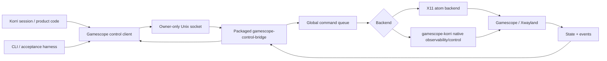

# Complete Gamescope Runtime Control

## Summary

Complete the Gamescope runtime-control effort by turning the validated v1 bridge into a guaranteed `gamescope-korri` control surface with a broad API contract, native Gamescope observability where needed, resilient local IPC, Korri session integration, repeatable Bandai validation, and reproducible Nix packaging.

---

## Problem Frame

Korri has already proven live Gamescope FSR, sharpness, and Xwayland/internal mode changes on Bandai, and a v1 Unix-socket bridge exists for the proven X11 atom path. The remaining risk is productizing that spike into a complete runtime-control system: a stable contract, observable command results, reliable events, deterministic lifecycle wiring, and packaging/validation strong enough that all Gamescope follow-up backlog items can close.

---

## Requirements

- R1. Complete the current Gamescope backlog scope: `task-068`, `task-089`, `task-090`, `task-101`, `task-102`, `task-103`, `task-105`, `task-106`, `task-107`, `task-108`, `task-109`, and `task-110`.
- R2. Define a broad v1 API contract for the full known Gamescope control surface, not only the currently proven mode/filter/sharpness subset.
- R3. Guarantee the full contract for `gamescope-korri`; stock Gamescope support is best-effort only when capabilities say it is available.
- R4. Keep the public control interface local-only, owner-only by default, and based on individual controls rather than high-level quality-profile commands.
- R5. Queue commands one at a time across the bridge, fail unsupported commands clearly, fail fast on timeouts, and fail clearly on readback mismatch without automatic rollback.
- R6. Require real readback whenever possible before reporting command success; required `state.get` fields fail the whole state call when unreadable.
- R7. Include v1 events and maximize observability; patch Gamescope early when the bridge cannot provide strong state or event truth.
- R8. Accept any positive internal resolution request at the API layer, while leaving stream-quality policy decisions to Korri session/scaling policy.
- R9. Cover the API contract with unit and mocked tests; use hardware validation for visual/product claims rather than as a prerequisite for every API coverage row.
- R10. Wire Gamescope control into Korri sessions as a separate packaged bridge process with deterministic socket lifecycle and cleanup ordering.
- R11. Preserve stock `pkgs.gamescope`; use the additive `gamescope-korri` package lane for guarantees and native control patches.
- R12. Produce repeatable Bandai acceptance coverage for FSR, sharpness, live inner-resolution changes, Moonlight nested-resolution behavior, and scaling policy decisions.

---

## Scope Boundaries

- This plan includes Gamescope runtime-control completion only; unrelated backlog items remain out of scope.
- This plan does not add a network-exposed Gamescope API; remote operators should use SSH or a wrapper around the local socket.
- This plan does not introduce a high-level atomic quality-profile command; individual controls remain the public surface for this effort.
- This plan does not guarantee arbitrary stock Gamescope builds satisfy the full contract.
- This plan does not rework unrelated Moonlight or Sunshine runtime-resolution patches except where Gamescope scaling policy and session integration require explicit coordination.

### Deferred to Follow-Up Work

- Broader runtime quality ladders that combine Moonlight bitrate/FPS, Sunshine capture settings, and Gamescope controls are deferred to the existing runtime-quality backlog once the Gamescope control plane is complete.
- Upstreaming native Gamescope patches is deferred until the `gamescope-korri` patches have proven stable in Korri validation.

---

## Context & Research

### Relevant Code and Patterns

- `korri/shared/gamescope-control/gamescope-control-protocol.ts` currently defines the v1 JSON-RPC protocol for hello, state, mode, filter, and sharpness.
- `korri/shared/gamescope-control/gamescope-control-bridge.ts` currently hosts the Unix-socket NDJSON bridge but lacks a global command queue, socket permission hardening, and event subscription.
- `korri/shared/gamescope-control/x11-gamescope-control-backend.ts` currently implements the proven X11 atom backend and already bounds xprop/xrandr readback calls.
- `korri/shared/gamescope-control/gamescope-control-client.ts` currently provides the TypeScript client and must learn to route both request responses and server-pushed event frames.
- `tools/cli/gamescope-control.ts` and `tools/cli/gamescope-control-bridge.ts` provide operator entry points and should become packaged session/runtime tools.
- `packages/gamescope-korri/package.nix` is the additive Gamescope package lane and currently has no native patches.
- `korri/shared/stream/moonlight-control-protocol.ts` is the closest local reference for protocol metadata, events, capabilities, result statuses, and wire evolution.
- `korri/products/app/stream/moonlight-launcher.ts` is the local pattern for runtime-dir/socket-path setup around a streaming client.
- `tools/device/sessiond.ts`, `tools/device/sessiond-state.ts`, and `tools/device/sessiond-gamescope-reaper.ts` define the foreground lifecycle and reaper boundaries that the bridge must respect.
- `tools/device/game-stream-fullscreen.ts` and `korri/products/app/api/stream/compose-moonlight-launch-spec.ts` are the launch-spec and Gamescope/Moonlight policy seams.
- `nix/overlays/korri-packages.nix`, `flake.nix`, `nix/modules/korri-compositor.nix`, `nix/modules/korri-game-stream.nix`, and `nix/modules/korri-sessiond.nix` are the packaging and runtime dependency surfaces.

### Institutional Learnings

- `docs/solutions/runtime-errors/gamescope-backend-auto-fights-sway-for-drm-master-2026-05-27.md`: nested Gamescope invocations must pin `--backend wayland`; never rely on `auto` inside Sway.
- `docs/solutions/design-patterns/explicit-cascade-folded-policy-over-incidental-signal-heuristics-2026-05-27.md`: add explicit cascade-folded policy fields instead of inferring Gamescope behavior from child argv/env.
- `docs/solutions/architecture-patterns/sessiond-operator-model-2026-05-29.md`: sessiond is the foreground lifecycle operator; use additive wire evolution and capability flags.
- `docs/solutions/architecture-patterns/physical-host-foreground-lifecycle-truth-is-sessiond-2026-05-29.md`: Gamescope control must not create a parallel lifecycle truth source.
- `docs/solutions/architecture-patterns/kiosk-foreground-app-policy-over-gamescope-overlay-2026-05-24.md`: Gamescope is a presentation adapter, not the foreground policy owner.
- `docs/solutions/workflow-issues/generic-game-stream-runner-validation-contract-2026-05-19.md`: hardware/stream validation must re-enqueue fresh launch intent and use status files for diagnostics.
- `docs/solutions/tooling-decisions/align-flake-nixpkgs-to-downstream-pin-for-cache-coherence-2026-05-27.md`: Gamescope package work on SM8550 must respect pinned nixpkgs/cache alignment.
- `docs/solutions/architecture-patterns/boot-scoped-control-plane-with-session-scoped-runner-2026-05-19.md`: derive runtime paths from service/session mode; avoid ad-hoc absolute paths.

### External References

- External web research was not needed for this plan. The repository already contains the v1 implementation, Moonlight control precedent, Gamescope investigation results, and Bandai validation history needed to plan the work.

---

## Key Technical Decisions

- Guarantee the full control contract only through `gamescope-korri`: this lets the plan patch Gamescope for observability instead of shrinking the API around stock limitations.
- Keep raw X atoms as an implementation backend, not the public API: callers interact with typed local IPC and receive structured results/events.
- Treat planned-but-unimplemented methods as valid protocol methods that return an `unsupported` command result; reserve JSON-RPC unknown-method errors for truly unknown method names.
- Define `accepted` as async-pending only if retained at all; readback divergence must use an explicit mismatch/readback-failed result rather than overloading `accepted`.
- Model server-pushed events as first-class wire messages, not as command responses; the event push method name should be fixed as `gamescope.event` unless the contract unit chooses a stronger name before implementation starts.
- Represent backend unavailable with a dedicated wire shape chosen in the contract, with a bias toward a dedicated JSON-RPC error code plus hello/capability status so callers can distinguish it from invalid input and ordinary command failure.
- Use a separate packaged bridge process for Korri sessions: the control plane is long-lived, has external tool dependencies, and benefits from process isolation and operator visibility.
- Queue all bridge commands globally: Gamescope root atoms and native compositor controls are shared state, so per-client queues would still race.
- Follow the Moonlight control model for event shape and capabilities where practical: it is the local precedent for protocol hello, event subscription, sequence numbers, and additive evolution.
- Prefer native Gamescope patches when readback/events are weak: maximum observability is a requirement, and `gamescope-korri` is the guaranteed target.
- Treat Bandai hardware proof as acceptance for visual claims, not as the only measure of API coverage: unit and mocked tests define API coverage; DSI-2 proof validates perceptual/runtime behavior.
- Keep Moonlight/Sunshine coordination in policy/session layers: Gamescope should expose controls and state, while Korri decides when to use them for stream-quality behavior.

---

## Open Questions

### Resolved During Planning

- Should the session bridge run in-process or as a child process? Separate packaged process, so packaging/CI becomes a prerequisite for product session wiring.
- Should the API expose quality profiles? No; use individual controls only.
- Should unsupported commands be hidden or no-op? No; fail clearly as unsupported.
- Should arbitrary internal resolutions be restricted to a ladder? No; accept any positive width and height at the API layer.
- Should state return partial data? No; required state failures fail the whole call.

### Deferred to Implementation

- Exact Gamescope patch boundaries for observability: implementation will determine which controls can be read reliably through existing protocols and which need native `gamescope-korri` patches.
- Exact per-feature event payload fields: the contract unit defines the event taxonomy and push envelope before implementation; implementation may refine field detail only within that contract.
- Whether filter/sharpness readback needs settle-polling: Bandai evidence suggests synchronous behavior, but backend hardening should add polling only if tests or acceptance harnesses prove stale reads.
- Exact Moonlight behavior for live nested-resolution changes under product streaming: this requires the planned Bandai/Moonlight spike and feeds the scaling policy.

---

## Output Structure

    docs/acceptance/
      gamescope-control-api-coverage-contract.md
      gamescope-control-bandai-<date>.md
      gamescope-scaling-policy.md
    docs/solutions/
      architecture-patterns/gamescope-runtime-control-contract-<date>.md
      runtime-errors-or-design-patterns/<gamescope-spike-finding>.md
    korri/shared/gamescope-control/
      gamescope-control-protocol.ts
      gamescope-control-protocol.test.ts
      gamescope-control-bridge.ts
      gamescope-control-bridge.test.ts
      gamescope-control-client.ts
      x11-gamescope-control-backend.ts
      x11-gamescope-control-backend.test.ts
    packages/gamescope-korri/
      package.nix
      patches/
        README.md
        0001-*.patch
    tools/cli/
      gamescope-control.ts
      gamescope-control.test.ts
      gamescope-control-bridge.ts
      gamescope-control-bridge.test.ts
    tools/scripts/
      gamescope-control-bandai-acceptance.ts
    nix/
      korri-gamescope-control-bridge.nix

---

## High-Level Technical Design

> *This illustrates the intended approach and is directional guidance for review, not implementation specification. The implementing agent should treat it as context, not code to reproduce.*

The public API is the Unix-socket protocol. X11 atoms remain a backend for currently proven controls. Native `gamescope-korri` patches fill observability gaps for the broad contract, especially event emission, reliable state, and controls not safely represented by the existing atom surface.

---

## Phased Delivery

### Phase 1 — Contract and observability map

Define the complete contract and coverage matrix before expanding implementation.

### Phase 2 — Protocol, events, and tests

Make the TypeScript protocol/bridge/client/CLI match the contract with mocked/unit coverage.

### Phase 3 — Native Gamescope observability and backend hardening

Patch `gamescope-korri` where needed and harden X11/native backend behavior around the new contract. This phase includes U3 and U4; X11 hardening can proceed in parallel with native patch work once U2 has finalized the protocol vocabulary.

### Phase 4 — Packaging and session lifecycle integration

Ship the bridge as a packaged process, close Nix/CI coverage, and wire the bridge into Korri session lifecycle. This phase includes U5 and U6; U5 is a prerequisite for U6 because product sessions use a separate packaged process.

### Phase 5 — Hardware validation, scaling policy, and backlog closure

Run Bandai/Moonlight validation, finalize scaling policy, document evidence, and close the Gamescope backlog items. This phase includes U7, U9, and U8.

---

## Implementation Units

### U1. Define the full Gamescope control contract

**Goal:** Create the durable contract and coverage matrix that defines what the completed Gamescope effort promises and how each promise is verified.

**Requirements:** R1, R2, R3, R4, R5, R6, R7, R8, R9, R10, R12

**Dependencies:** None

**Files:**
- Create: `docs/acceptance/gamescope-control-api-coverage-contract.md`
- Create: `docs/solutions/architecture-patterns/gamescope-runtime-control-contract-2026-06-02.md`
- Modify: `backlog/task-105 - define-gamescope-api-coverage-contract.md`
- Reference: `korri/shared/gamescope-control/gamescope-control-protocol.ts`
- Reference: `korri/shared/stream/moonlight-control-protocol.ts`

**Approach:**
- Define the v1 method families for protocol/state/events, mode, scaling/filter/scaler, sharpness, FPS/refresh, HDR, VRR/adaptive sync, tearing, low latency, screenshots, display sleep/wake, repaint/debug controls, and future capability slots.
- Define required result semantics: applied, unsupported, failed, timed-out, invalid, pending/accepted if retained for true async-pending work, and explicit readback-mismatch/readback-failed states for divergent or unreadable post-command state.
- Define that planned-but-unimplemented controls are valid protocol methods returning unsupported results, while truly unknown method names remain JSON-RPC method errors.
- Define required state categories and which fields are required for `gamescope-korri` versus capability-gated optional fields; required state readback failure must fail the whole state call.
- Define backend-unavailable as a single canonical wire representation and include hello/capability status so callers can distinguish unavailable backend from invalid input and ordinary command failure.
- Define the full event taxonomy, the server-push envelope, the event push method name, sequence semantics, command-result correlation, and whether each event must be native-notified, readback-derived, or command-result-derived.
- Define socket ownership, owner-only runtime directory and socket permissions, local-only transport, global command queue semantics, bridge close/drain-or-abort behavior, and session socket path convention as contract constraints for U6.
- Map every method/event/error row to unit/mocked tests, hardware acceptance only where visual/product evidence is needed, and the backlog item(s) it closes as contract constraints for U7/U8.

**Execution note:** Start with the contract matrix before changing protocol code so subsequent units can implement against explicit rows.

**Patterns to follow:**
- `korri/shared/stream/moonlight-control-protocol.ts` for protocol metadata, capabilities, event subscription, and additive wire evolution.
- `backlog/task-105 - define-gamescope-api-coverage-contract.md` for interview decisions.

**Test scenarios:**
- Test expectation: none for this unit's document creation; verification is document completeness and traceability rather than executable behavior.

**Verification:**
- The contract explicitly covers all Gamescope backlog items listed in R1.
- The contract names every supported, unsupported, and capability-gated command family.
- Later implementation units can point to rows in the matrix without inventing semantics.

---

### U2. Expand protocol, client, bridge, and CLI coverage to the contract

**Goal:** Bring the TypeScript API surface, client, bridge, and CLI up to the contract with exhaustive unit and mocked tests.

**Requirements:** R2, R4, R5, R6, R7, R9

**Dependencies:** U1

**Files:**
- Modify: `korri/shared/gamescope-control/gamescope-control-protocol.ts`
- Modify: `korri/shared/gamescope-control/gamescope-control-protocol.test.ts`
- Modify: `korri/shared/gamescope-control/gamescope-control-client.ts`
- Modify: `korri/shared/gamescope-control/gamescope-control-bridge.ts`
- Modify: `korri/shared/gamescope-control/gamescope-control-bridge.test.ts`
- Modify: `tools/cli/gamescope-control.ts`
- Modify: `tools/cli/gamescope-control.test.ts`
- Modify: `tools/cli/gamescope-control-bridge.ts`
- Create: `tools/cli/gamescope-control-bridge.test.ts`

**Approach:**
- Add contract-defined methods, final result-status vocabulary, detailed capabilities, unsupported results, backend-unavailable behavior, and event subscription support.
- Split protocol methods from command methods so capabilities distinguish queueable commands from protocol/state methods.
- Add request identifiers to command results/events so subscribers can correlate command-result events with original requests.
- Move wire-boundary decoding toward schema validation with additive fields, following the Moonlight protocol pattern, so malformed responses and future minor-version additions are handled deliberately.
- Add event sequence handling patterned after Moonlight control: subscription acknowledgement, monotonic sequence, a `gamescope.event`-style server-push envelope, state/event payloads, and bounded framing.
- Add a bridge-level subscriber registry and teach the client to route unsolicited event frames separately from request/response frames.
- Refactor bridge dispatch around a global FIFO queue created at bridge startup; socket handlers enqueue work items and a single executor awaits each backend mutation before starting the next.
- Harden Unix socket creation by creating the parent runtime directory with owner-only permissions and applying owner-only socket permissions after listen.
- Make the CLI cover all contract-visible command families, including explicit unsupported responses for controls not yet implemented by a backend.
- Preserve JSON-RPC/NDJSON framing and local-only socket assumptions.

**Patterns to follow:**
- Existing `gamescope-control` IO injection in `tools/cli/gamescope-control.ts`.
- Existing bridge/client test style in `korri/shared/gamescope-control/gamescope-control-bridge.test.ts`.
- Moonlight event and capability vocabulary in `korri/shared/stream/moonlight-control-protocol.ts`.

**Test scenarios:**
- Happy path: `protocol.hello` returns protocol metadata, detailed capabilities with reasons, limits, supported events, and command list that excludes non-command protocol/state methods.
- Happy path: `events.subscribe` returns a subscription acknowledgement and receives command/state events in increasing sequence order.
- Happy path: client A subscribes, client B dispatches a command, and client A receives a `gamescope.event` command-result event with the originating request id.
- Happy path: mode/filter/sharpness commands dispatch through the client and CLI and return contract-shaped results.
- Happy path: broad-but-unimplemented controls return a clear unsupported result without touching the backend.
- Happy path: mode validation accepts positive values such as 1x1 at the API layer; backend capability determines whether the request is applied, unsupported, or failed.
- Edge case: two clients send commands concurrently; deterministic latch-based tests prove backend call 2 starts only after backend call 1 resolves.
- Edge case: stale socket file exists before bridge start; bridge removes it, listens, and sets owner-only permissions.
- Edge case: partial NDJSON frame does not dispatch until newline.
- Error path: malformed JSON returns parse error and leaves the socket usable.
- Error path: invalid params for mode, filter, sharpness, and future controls return stable errors or invalid results per contract.
- Error path: frame larger than maxFrameBytes returns an error and destroys the socket.
- Error path: client disconnects mid-request; bridge does not crash and queued commands continue for other clients.
- CLI: missing socket, missing arguments, invalid dimensions, unknown filter/control, connect failure, JSON-RPC error, and success output all return expected exit codes and readable messages.

**Verification:**
- Unit and mocked tests cover every non-hardware row in the contract for protocol, client, bridge, and CLI.
- Socket permissions and queue behavior are covered by tests, not only by code inspection.

---

### U3. Patch `gamescope-korri` for native observability and full-surface controls

**Goal:** Add native `gamescope-korri` support where the X11 bridge cannot provide strong readback, events, or controls for the broad contract.

**Requirements:** R2, R3, R6, R7, R11

**Dependencies:** U1, U2

**Files:**
- Modify: `packages/gamescope-korri/package.nix`
- Modify: `packages/gamescope-korri/patches/README.md`
- Create: `packages/gamescope-korri/patches/0001-*.patch`
- Create/modify as needed: `korri/shared/gamescope-control/*native*backend*.ts`
- Test: `korri/shared/gamescope-control/*native*backend*.test.ts`
- Reference: `packages/gamescope-korri/patches/README.md`

**Approach:**
- Use the contract's observability map to decide which controls require native Gamescope patches rather than X11 atom wrappers.
- Prefer native events/readback for full-surface controls and for any control whose X11 readback is ambiguous.
- Select backends at bridge/process configuration time: `gamescope-korri` sessions use the native backend for guaranteed behavior, while the X11 backend remains a debug/stock best-effort fallback for proven controls.
- If a composite path is needed, keep it inside the backend implementation rather than making product callers choose per command.
- Update the package manifest to list active Korri patches and the native control/observability capabilities.
- Keep patch boundaries small and explain each patch in the package README.

**Patterns to follow:**
- Additive package-lane pattern in `packages/gamescope-korri/package.nix`.
- Prior patch-stack convention in `packages/moonlight-embedded-korri/patches/` and `packages/sunshine-korri/patches/`.
- Gamescope protocol investigation files referenced by the existing backlog items.

**Test scenarios:**
- Happy path: native backend reports required state fields from a controlled runner/readback fixture.
- Happy path: native backend emits or surfaces events for a command result and state change.
- Happy path: unsupported capability from native Gamescope is reported as unsupported with a reason.
- Error path: native control transport unavailable returns backend-unavailable or failed result per contract.
- Error path: native readback mismatch returns the contract's mismatch/failure result and does not claim applied.
- Packaging: manifest lists active Korri patches and native control capabilities.

**Verification:**
- Every contract row that cannot be strongly observed through X11 has either a native patch path or a documented unsupported capability.
- `gamescope-korri` remains additive and stock `pkgs.gamescope` is not replaced.

---

### U4. Harden backend state and error semantics

**Goal:** Make backend behavior impossible to misread: no silent partial state, no ambiguous accepted status, and no unbounded hangs.

**Requirements:** R5, R6, R7, R9

**Dependencies:** Required: U1, U2. Optional: U3, needed only for native backend paths that land before final hardening.

**Files:**
- Modify: `korri/shared/gamescope-control/x11-gamescope-control-backend.ts`
- Modify: `korri/shared/gamescope-control/x11-gamescope-control-backend.test.ts`
- Modify as needed: `korri/shared/gamescope-control/*native*backend*.ts`
- Modify as needed: `korri/shared/gamescope-control/*native*backend*.test.ts`

**Approach:**
- Stop swallowing post-mutation state errors; surface failed readback as a structured command result using the final U2 status vocabulary, not as silent `{}` and not as an untyped bridge exception.
- Distinguish write failure, write success with matching readback, write success with divergent readback, and write success with unreadable readback.
- Replace ambiguous `accepted` behavior with explicit contract language for pending, unsupported, failed, timed-out, or readback mismatch states.
- Make backend-unavailable distinguishable from invalid commands and ordinary command failure using the U1/U2 wire representation.
- Make display selection explicit for session-wired bridges rather than silently defaulting to the wrong X display.
- Preserve bounded command timeouts for xprop/xrandr/native readbacks.
- Add settle/poll behavior only where contract tests or Bandai harness show single-read readback can be stale.

**Patterns to follow:**
- Existing injected runner tests in `korri/shared/gamescope-control/x11-gamescope-control-backend.test.ts`.
- Existing timeout fix from the v1 bridge branch.

**Test scenarios:**
- Happy path: `state.get` returns all required state fields when xrandr/xprop/native readback succeeds.
- Happy path: `mode.set` reports applied only after readback matches requested width/height.
- Happy path: filter/sharpness report applied only when readback matches requested value.
- Edge case: requested mode equals current mode; result is applied without unnecessary instability.
- Edge case: any positive mode value accepted by protocol validation, while backend may return unsupported/failed based on actual capability.
- Error path: xrandr/xprop command timeout returns a bounded timeout result and bridge remains alive.
- Error path: xprop write exits nonzero; command fails clearly and does not report applied.
- Error path: readback after mutation fails; result identifies readback failure and requested/applied state accurately.
- Error path: write succeeds but filter/sharpness readback returns a different value; result reports readback mismatch instead of applied or async accepted.
- Error path: readback mismatch reports mismatch/failure and does not auto-rollback.
- Error path: Gamescope/Xwayland/native transport absent produces backend-unavailable behavior per contract.

**Verification:**
- Backend tests prove state/readback/timeout/mismatch semantics for X11 and any native backend paths.
- Bridge tests prove serialized execution across clients.

---

### U5. Package the bridge and close Nix/CI coverage

**Goal:** Make the Gamescope control bridge and CLI reproducible device artifacts and ensure `gamescope-korri` packaging is verified without replacing stock Gamescope.

**Requirements:** R3, R4, R10, R11

**Dependencies:** Required: U1, U2. Optional: U3, because U5 can begin before native patches complete but final validation must incorporate U3 manifest updates.

**Files:**
- Create: `nix/korri-gamescope-control-bridge.nix`
- Modify: `flake.nix`
- Modify: `nix/overlays/korri-packages.nix`
- Modify: `nix/modules/korri-sessiond.nix`
- Modify as needed: `nix/modules/korri-compositor.nix`
- Modify as needed: `nix/modules/korri-game-stream.nix`
- Modify: `packages/gamescope-korri/package.nix`
- Modify: `packages/gamescope-korri/patches/README.md`
- Test/modify: `nix/tests/korri-package-outputs-check.nix`

**Approach:**
- Bundle `gamescope-control` and `gamescope-control-bridge` with the repo's Bun CLI packaging pattern under a consistent `korri-gamescope-control-bridge` package attribute.
- Include runtime dependencies for X11 backend operation, especially `xprop` and `xrandr`, in the wrapper or owning service path.
- Expose package attributes in the flake and overlay without changing the default `pkgs.gamescope` behavior.
- Add CI/eval checks for `gamescope-korri` manifest, bridge binary availability, and package dependency closure assumptions.
- Respect SM8550/nixpkgs pinning constraints to avoid aarch64 cache-split rebuild surprises.

**Patterns to follow:**
- `nix/korri-cli.nix` and `nix/korri-sessiond.nix` for Bun CLI packaging.
- `nix/tests/korri-package-outputs-check.nix` for package output checks.
- `docs/solutions/tooling-decisions/align-flake-nixpkgs-to-downstream-pin-for-cache-coherence-2026-05-27.md` for pin/cache constraints.

**Test scenarios:**
- Packaging: flake exposes `gamescope-korri` and `korri-gamescope-control-bridge` package attributes.
- Packaging: bridge binary and control CLI binary exist in the package output.
- Packaging: `gamescope-korri` manifest exists and lists current patch/control capability state.
- Packaging: service/module path includes the tools required by the selected backend.
- Error path: package checks fail if stock `pkgs.gamescope` is accidentally replaced by `gamescope-korri`.

**Verification:**
- Nix checks/evals prove the additive package lane and bridge package are available.
- The bridge process can be launched from a store path in a session module.

---

### U6. Wire Gamescope control into Korri session lifecycle

**Goal:** Integrate the packaged bridge into Korri sessions without making Gamescope control a second lifecycle source of truth.

**Requirements:** R4, R5, R10

**Dependencies:** Required: U1, U2, U4, U5. Optional: U3 if the session bridge selects the native backend before U6 lands.

**Files:**
- Modify: `korri/products/app/stream/moonlight-launcher.ts`
- Modify: `tools/device/sessiond.ts`
- Modify: `tools/device/sessiond-state.ts`
- Modify: `tools/device/sessiond-gamescope-reaper.ts`
- Test: corresponding `*.test.ts` files for modified TypeScript modules

**Approach:**
- Add a deterministic Gamescope control runtime directory and socket path convention mirroring the Moonlight local-control pattern.
- Start the packaged bridge process per Gamescope session with explicit display/backend configuration and owner-only runtime directory permissions.
- Insert bridge startup after `launcher.spawn(spec)` returns a running child and before `child-running` / `role.afterChildRunning` lifecycle work, so the bridge observes the active Gamescope display without becoming a lifecycle source of truth.
- Expose socket path and capability/readiness state to product code without making the renderer talk directly to sessiond.
- Stop or abort the bridge during `beginKorriRestore` handling before the existing `reaper({ pgid })` call, and define whether queued commands drain or abort during close.
- Wire filter/sharpness and state visibility first; product use of live `mode.set` remains gated on the Moonlight/nested-resolution spike outcome and the scaling-policy unit.

**Patterns to follow:**
- Moonlight control runtime-dir/socket pattern in `korri/products/app/stream/moonlight-launcher.ts`.
- Sessiond operator boundaries from `tools/device/sessiond.ts` and `docs/solutions/architecture-patterns/sessiond-operator-model-2026-05-29.md`.

**Test scenarios:**
- Happy path: launching a session creates a Gamescope control runtime directory with owner-only permissions and starts the packaged bridge process.
- Happy path: product/session code receives or can resolve the Gamescope control socket path for the active session.
- Happy path: bridge lifecycle starts after the primary Gamescope-wrapped child is observed running and stops before the restore reaper is invoked.
- Edge case: bridge process fails to start; session reports a control-plane failure without creating a second lifecycle truth source.
- Edge case: Gamescope exits while bridge is running; session cleanup still completes and bridge failure is categorized in the existing failure vocabulary.
- Error path: missing bridge package path or missing xprop/xrandr dependencies fails clearly in module/config tests.

**Verification:**
- Korri sessions own bridge lifecycle deterministically.
- Sessiond remains the lifecycle source of truth.

---

### U7. Build repeatable Bandai acceptance and spike harnesses

**Goal:** Turn manual Bandai proof into repeatable validation for visual claims, FSR behavior, live inner-resolution changes, and Moonlight nested-resolution behavior.

**Requirements:** R1, R8, R9, R12

**Dependencies:** U1, U2, U4, U5; U6 for full product-session validation, though local native-redraw validation can begin earlier

**Files:**
- Create: `tools/scripts/gamescope-control-bandai-acceptance.ts`
- Create: `docs/acceptance/gamescope-control-bandai-2026-06-02.md`
- Create/modify as results warrant: `docs/solutions/runtime-errors/*.md`
- Create/modify as results warrant: `docs/solutions/design-patterns/*.md`
- Reference: `tools/cli/gamescope-control.ts`
- Reference: `tools/cli/gamescope-control-bridge.ts`
- Reference: `docs/acceptance/gamescope-control-api-coverage-contract.md`

**Approach:**
- Script the native-redraw/local Gamescope validation: bridge start, state, filter, sharpness, mode swaps, process liveness, and DSI-2 capture collection.
- Script the Moonlight/nested-resolution validation path separately so streaming behavior does not obscure local Gamescope control proof.
- Record commands, API responses, xrandr/xwininfo/xprop/native-state readback, process liveness, and capture paths in an acceptance note.
- Keep generated captures out of normal commits unless intentionally archived.
- Use the harness to close FSR evidence, inner-resolution spike, nested-resolution prototype, and scaling-policy backlog items.

**Patterns to follow:**
- Existing Bandai capture and probe conventions from `docs/handoffs/live-runtime-resolution-journey.md`.
- Generic stream runner validation contract in `docs/solutions/workflow-issues/generic-game-stream-runner-validation-contract-2026-05-19.md`.

**Test scenarios:**
- Happy path: local native-redraw app survives `640x360 -> 960x540 -> 1280x720 -> 640x360`, and captures show the app-reported resolution changes.
- Happy path: FSR toggles `linear -> fsr -> linear`, FSR feedback changes, and DSI-2 captures show visible scaler differences.
- Happy path: sharpness toggles while FSR stays active and the same Gamescope/app processes remain alive.
- Happy path: Moonlight nested-resolution validation shows whether live Gamescope mode changes affect the running stream without reconnect/restart.
- Edge case: Gamescope/Xwayland unavailable; harness records clear failure and does not hang.
- Edge case: capture command cannot access DSI-2; harness reports capture failure separately from API failure.
- Error path: bridge timeout or backend-unavailable result is recorded with enough context for debugging.

**Verification:**
- Acceptance docs contain reproducible steps and summarized evidence for each visual/product claim.
- `task-068`, `task-089`, `task-090`, and `task-102` have enough evidence to close or explicitly mark unsupported behavior.

---

### U9. Finalize Gamescope scaling policy and Moonlight nested-resolution behavior

**Goal:** Convert Bandai spike results into product policy for how Gamescope, Moonlight, and stream runtime changes share scaling and internal-resolution responsibilities.

**Requirements:** R1, R8, R10, R12

**Dependencies:** U1, U2, U4, U6, U7

**Files:**
- Create/modify: `docs/acceptance/gamescope-scaling-policy.md`
- Modify as needed: `korri/products/app/api/stream/compose-moonlight-launch-spec.ts`
- Modify as needed: `tools/device/game-stream-fullscreen.ts`
- Modify as needed: `korri/shared/library/config/inheritable-fields.ts`
- Modify as needed: `korri/shared/library/config/cascade-resolver.ts`
- Test: corresponding `*.test.ts` files for modified TypeScript modules

**Approach:**
- Use U7 evidence to decide when Gamescope owns upscale, when Moonlight owns SDL/presenter scaling, and when live `mode.set` is product-safe.
- Add explicit cascade-folded Gamescope policy fields only after the policy is settled; avoid child argv/env sniffing.
- Update launch-spec composition to express policy through named fields such as backend, exposeWayland, inner/outer size, filter, and sharpness only where those fields are validated.
- Document unsupported or risky combinations rather than silently accepting them in product launch paths.

**Patterns to follow:**
- `docs/solutions/design-patterns/explicit-cascade-folded-policy-over-incidental-signal-heuristics-2026-05-27.md`.
- `tools/device/game-stream-fullscreen.ts` for Gamescope launch-spec composition.

**Test scenarios:**
- Happy path: validated policy fields produce expected Gamescope launch arguments without inspecting child argv/env.
- Happy path: launch-spec tests cover Gamescope-owned upscale with smaller inner size and larger outer output.
- Edge case: unresolved or unsupported mode-control combinations remain unavailable in product policy even if the raw API accepts positive dimensions.
- Integration: Moonlight launch-spec composition preserves existing behavior when no Gamescope runtime-control policy is configured.

**Verification:**
- `task-090` has a documented policy outcome and launch-spec/config changes align with that policy.
- Product wiring uses explicit policy fields rather than incidental signal heuristics.

---

### U8. Close documentation, backlog, and operational handoff

**Goal:** Convert implementation results into durable docs and remove completed Gamescope backlog items once the work lands.

**Requirements:** R1, R9, R11, R12

**Dependencies:** U1, U2, U3, U4, U5, U6, U7, U9

**Files:**
- Modify: `docs/acceptance/gamescope-control-api-coverage-contract.md`
- Modify: `docs/acceptance/gamescope-control-bandai-2026-06-02.md`
- Modify: `packages/gamescope-korri/patches/README.md`
- Modify/remove: `backlog/task-068 - prototype-live-gamescope-nested-resolution-control-for-moonl.md`
- Modify/remove: `backlog/task-089 - validate-gamescope-fsr-with-reliable-evidence.md`
- Modify/remove: `backlog/task-090 - design-gamescope-scaling-policy-for-runtime-stream-changes.md`
- Modify/remove: `backlog/task-101 - implement-gamescope-live-ipc-control-plane.md`
- Modify/remove: `backlog/task-102 - spike-gamescope-live-fsr-and-inner-resolution-changes.md`
- Modify/remove: `backlog/task-103 - build-full-gamescope-rpc-control-api.md`
- Modify/remove: `backlog/task-105 - define-gamescope-api-coverage-contract.md`
- Modify/remove: `backlog/task-106 - complete-gamescope-protocol-bridge-and-cli-test-coverage.md`
- Modify/remove: `backlog/task-107 - harden-gamescope-x11-backend-sequencing-and-resilience.md`
- Modify/remove: `backlog/task-108 - wire-gamescope-control-bridge-into-korri-sessions.md`
- Modify/remove: `backlog/task-109 - build-bandai-gamescope-control-acceptance-harness.md`
- Modify/remove: `backlog/task-110 - close-gamescope-control-packaging-and-ci-coverage.md`

**Approach:**
- Update acceptance and package docs with the final state of supported controls, native patches, events, known limitations, and validation evidence.
- Promote reusable learnings from Bandai/Gamescope work into `docs/solutions/` before removing backlog files.
- Remove completed backlog items only after corresponding PRs land and evidence/docs are in place.
- If any Gamescope backlog item remains incomplete because the behavior is unsupported or intentionally deferred, replace it with a narrower follow-up rather than leaving the broad item open.
- Treat U9 policy outcomes as a prerequisite for closing scaling-policy and nested-resolution backlog items.

**Patterns to follow:**
- Backlog lifecycle rules: remove completed items, do not archive them in backlog status.
- `docs/solutions/` pattern for durable knowledge before backlog removal.

**Test scenarios:**
- Test expectation: none for backlog/doc cleanup; verification is traceability and completed acceptance evidence.

**Verification:**
- Every Gamescope-labelled backlog item named in R1 is either removed as landed/verified or replaced by a narrower follow-up with clear rationale.
- Durable knowledge exists in docs before backlog files are removed.

---

## System-Wide Impact

- **Interaction graph:** Korri product/session code, sessiond, Gamescope, Xwayland, Moonlight, CLI tooling, Nix packaging, and Bandai harnesses all interact through the bridge contract.
- **Error propagation:** Backend unavailable, unsupported, timeout, invalid input, readback mismatch, and process lifecycle failures must surface as distinct operator-readable states.
- **State lifecycle risks:** Session startup and restore can race bridge availability; the plan requires deterministic socket paths, command queueing, explicit display selection, and teardown before reaper cleanup.
- **API surface parity:** CLI, shared TypeScript client, bridge protocol, native backend, X11 backend, and acceptance harness must share the same contract vocabulary.
- **Integration coverage:** Unit/mocked tests cover API behavior; Bandai validation covers visual Gamescope behavior and Moonlight nested-resolution claims.
- **Unchanged invariants:** Stock `pkgs.gamescope` remains available; sessiond remains the foreground lifecycle source of truth; raw X atoms do not become product API; no network control surface is introduced.

---

## Risks & Dependencies

| Risk | Mitigation |
|------|------------|
| Native Gamescope patches expand beyond a single clean patch | Use the contract observability map to justify each patch; keep patches small and document each in `packages/gamescope-korri/patches/README.md`. |
| Full known control surface is broader than currently proven behavior | Implement unsupported/capability-gated results first, then patch only where `gamescope-korri` needs guaranteed behavior. |
| Bridge command queue slows rapid operator commands | Queueing is accepted for v1 safety; future optimization can classify read-only operations separately after stability. |
| Session wiring creates a second lifecycle source | Keep sessiond as the owner; bridge reports control state only and is cleaned up by session lifecycle. |
| Bandai validation becomes flaky due to display/capture state | Separate local native-redraw proof from Moonlight streaming proof; log API/readback/process state alongside captures. |
| Nix packaging causes aarch64 rebuild surprises | Respect existing Gamescope pinning and cache-coherence guidance; add eval/package checks before product deployment. |
| Broad state failing as a whole makes UI less tolerant | Detailed capabilities and backend-unavailable results give product code clear recovery paths without guessing from partial state. |

---

## Documentation / Operational Notes

- `docs/acceptance/gamescope-control-api-coverage-contract.md` is the main source of truth for API coverage and should be referenced by PRs implementing U2–U7.
- `docs/acceptance/gamescope-control-bandai-2026-06-02.md` records physical validation; generated images should stay outside normal commits unless explicitly archived.
- `docs/acceptance/gamescope-scaling-policy.md` records the final Moonlight/Gamescope scaling policy after Bandai evidence.
- `packages/gamescope-korri/patches/README.md` must remain current as native patches are added.
- Any sessiond-facing fields must follow additive wire-evolution rules and avoid exposing unredacted absolute paths.
- The final cleanup should remove completed backlog items only after durable docs/learnings exist.

---

## Alternative Approaches Considered

- **Keep bridge-only and avoid Gamescope patches:** rejected because the user explicitly prioritized maximum observability and the full guarantee applies to `gamescope-korri`.
- **Run the bridge in-process inside Korri sessions:** rejected after planning discussion; a separate packaged process gives better isolation, packaging clarity, and operational visibility.
- **Limit v1 to proven controls only:** rejected because the user wants the broad known Gamescope control surface in the v1 contract, with unsupported results where implementation is not available yet.
- **Use hardware validation as the definition of API coverage:** rejected because the user chose unit and mocked tests as sufficient for API coverage; hardware remains required for visual/product claims.

---

## Success Metrics

- All Gamescope-labelled backlog items named in R1 are complete, removed, or replaced by narrower follow-ups based on explicit evidence.
- `gamescope-korri` exposes the guaranteed control surface with documented capabilities and observability.
- Unit/mocked tests cover every API contract row that does not require physical visual evidence.
- Korri sessions can launch and clean up the packaged Gamescope bridge deterministically.
- Bandai acceptance docs prove FSR, sharpness, and live inner-resolution behavior, and document Moonlight/scaling policy outcomes.

---

## Sources & References

- Backlog: `backlog/task-068 - prototype-live-gamescope-nested-resolution-control-for-moonl.md`
- Backlog: `backlog/task-089 - validate-gamescope-fsr-with-reliable-evidence.md`
- Backlog: `backlog/task-090 - design-gamescope-scaling-policy-for-runtime-stream-changes.md`
- Backlog: `backlog/task-101 - implement-gamescope-live-ipc-control-plane.md`
- Backlog: `backlog/task-102 - spike-gamescope-live-fsr-and-inner-resolution-changes.md`
- Backlog: `backlog/task-103 - build-full-gamescope-rpc-control-api.md`
- Backlog: `backlog/task-105 - define-gamescope-api-coverage-contract.md`
- Backlog: `backlog/task-106 - complete-gamescope-protocol-bridge-and-cli-test-coverage.md`
- Backlog: `backlog/task-107 - harden-gamescope-x11-backend-sequencing-and-resilience.md`
- Backlog: `backlog/task-108 - wire-gamescope-control-bridge-into-korri-sessions.md`
- Backlog: `backlog/task-109 - build-bandai-gamescope-control-acceptance-harness.md`
- Backlog: `backlog/task-110 - close-gamescope-control-packaging-and-ci-coverage.md`
- Related code: `korri/shared/gamescope-control/gamescope-control-protocol.ts`
- Related code: `korri/shared/gamescope-control/gamescope-control-bridge.ts`
- Related code: `korri/shared/gamescope-control/x11-gamescope-control-backend.ts`
- Related code: `tools/cli/gamescope-control.ts`
- Related code: `tools/cli/gamescope-control-bridge.ts`
- Related code: `packages/gamescope-korri/package.nix`
- Related pattern: `korri/shared/stream/moonlight-control-protocol.ts`
- Related pattern: `korri/products/app/stream/moonlight-launcher.ts`
- Learning: `docs/solutions/runtime-errors/gamescope-backend-auto-fights-sway-for-drm-master-2026-05-27.md`
- Learning: `docs/solutions/design-patterns/explicit-cascade-folded-policy-over-incidental-signal-heuristics-2026-05-27.md`
- Learning: `docs/solutions/architecture-patterns/sessiond-operator-model-2026-05-29.md`
- Learning: `docs/solutions/architecture-patterns/physical-host-foreground-lifecycle-truth-is-sessiond-2026-05-29.md`
