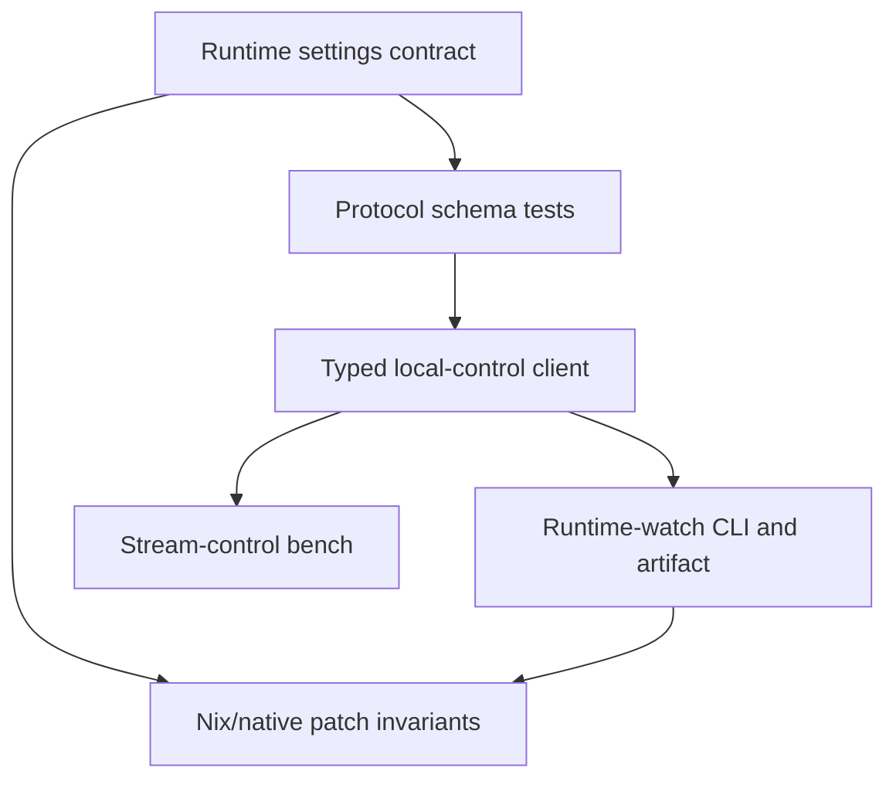
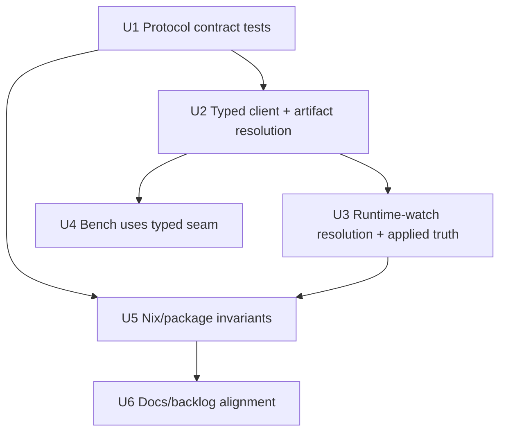

# feat: Add runtime settings contract regression coverage

## Summary

Expand `task-061` from bitrate-only regression work into contract coverage for the runtime-settings surface defined in `docs/acceptance/runtime-settings-protocol-contract.md`. The implementation should make the TypeScript protocol/client/tooling and Nix patch invariants agree that bitrate, FPS, and resolution are individual normal operations; `accepted` is non-terminal; product/tooling paths fail closed without capability; and `applied` requires observable applied truth.

---

## Problem Frame

The runtime-settings contract is now explicit, but current automated coverage still encodes older assumptions in several places: resolution is missing from typed client/watch paths, some tests still assume artificial protocol bounds, and the stream-control bench can send resolution through a raw local-control frame that treats the first response as success. If we integrate product controls before locking these rules down, later work can accidentally rebuild stale proof-gate, quality-profile, or false-success behavior.

---

## Requirements

- R1. Runtime-settings coverage treats bitrate, FPS, and resolution as first-class individual operations.
- R2. Protocol and tooling validation enforces positive-only runtime setting values at the local-control/TypeScript seam.
- R3. Local-control tooling preserves the distinction between immediate `accepted` and terminal `applied` outcomes.
- R4. `applied` outcomes are only reported after observable applied state matches the requested setting.
- R5. Mutation attempts fail closed when the active session lacks controller authority or advertised command capability.
- R6. Automated coverage rejects high-level quality-profile command drift.
- R7. Nix/source invariants prove the patched Sunshine/Moonlight package surfaces still include the expected runtime-settings machinery and do not reintroduce reconnect/restart fallbacks.
- R8. The work remains a regression-coverage and contract-alignment slice; it does not implement product UI, adaptation policy, hardware soak, or recovery fallback.

**Contract source:** `docs/acceptance/runtime-settings-protocol-contract.md`
**Secondary runtime-watch source:** `docs/brainstorms/2026-05-26-001-korri-runtime-change-watch-tool-requirements.md`
**Runtime-watch actors:** A1 Operator/agent, A2 Korri stream/runtime layer, A3 Moonlight session, A4 Device or stream target
**Runtime-watch flows:** F1 One-change watch run, F2 Future-testable scenario run
**Runtime-watch acceptance examples:** AE1-AE4 remain relevant to the CLI/artifact units.

---

## Scope Boundaries

- No product UI or telemetry surface changes.
- No quality-profile command or compound runtime-settings protocol method.
- No autonomous quality ladder, hysteresis, or adaptation policy.
- No protocol-level auto-rollback; recovery remains explicit follow-up work.
- No hardware soak or Bandai physical gate in this task; physical proof remains for later validation tasks.
- No broad native patch consolidation beyond invariants/docs needed to align with the runtime-settings contract.
- No remote/LAN/browser-facing Moonlight control API.

### Deferred to Follow-Up Work

- `task-058`: product launch integration for runtime controls.
- `task-091`: product/debug UI for applied state and command results.
- `task-100`: explicit recovery fallback and revert orchestration.
- `task-067` / `task-086`: product quality ladder policy over individual runtime setting commands.
- `task-087` / `task-088`: autonomous and soak hardware validation.

---

## Context & Research

### Relevant Code and Patterns

- `docs/acceptance/runtime-settings-protocol-contract.md` is the source of truth for this plan's contract vocabulary.
- `korri/shared/stream/moonlight-control-protocol.ts` defines Effect Schema wire contracts for local-control commands, events, snapshots, statuses, and protocol limits.
- `korri/shared/stream/moonlight-control-protocol.test.ts` already covers additive fields, snapshots, events, malformed protocol data, and some command bounds.
- `korri/shared/stream/moonlight-control-client.ts` and `korri/shared/stream/moonlight-control-client.test.ts` use a real temporary Unix socket server with configurable behavior knobs.
- `korri/shared/stream/moonlight-runtime-watch-artifact.ts` and `.test.ts` define the machine-readable evidence artifact used by the attach-only runtime-watch flow.
- `tools/cli/moonlight-runtime-watch.ts` and `.test.ts` are the best existing public-contract harness for one-command runtime mutation scenarios.
- `tools/cli/stream-control-bench.ts` and `.test.ts` are the recent disposable operator bench; it currently has a raw resolution send path that should stop bypassing the typed local-control seam.
- `nix/tests/korri-sunshine-runtime-bitrate-patch-check.nix` and `nix/tests/korri-moonlight-control-protocol-patch-check.nix` are the source/package invariant checks for native patches.
- `packages/sunshine-korri/README.md` and `packages/moonlight-embedded-korri/README.md` still contain some proof-gated resolution language that must not remain contradictory after contract alignment.

### Institutional Learnings

- `docs/solutions/architecture-patterns/gamescope-runtime-control-contract-2026-06-02.md`: individual controls, explicit unsupported states, serialized mutations, and `applied` only after observable truth are the control-plane pattern to mirror.
- `docs/solutions/best-practices/prefer-real-implementations-over-mocks-2026-05-02.md`: tests should use real temp sockets and configurable behavior, not mock/stub classes.
- `docs/solutions/architecture-patterns/sessiond-operator-model-2026-05-29.md`: protocol evolution is additive, capability-driven, and must support mixed-version/rollback windows.
- `docs/solutions/architecture-patterns/boot-scoped-control-plane-with-session-scoped-runner-2026-05-19.md`: local control sockets derive from explicit runtime paths and ownership boundaries; tests should not hard-code global paths.
- `docs/solutions/tooling-decisions/bun-coverage-via-separate-config-2026-05-29.md`: do not add bare `bun test --coverage`; use the existing coverage recipe/config if measuring coverage.

### External References

- Not used. The codebase has direct protocol, CLI, Nix, and Gamescope-contract patterns for this work.

---

## Key Technical Decisions

- Treat `task-061` as runtime-settings contract coverage, not live-bitrate-only coverage: the new contract explicitly covers bitrate, FPS, and resolution.
- Extend the existing Moonlight local-control client/artifact/runtime-watch seams instead of adding a parallel resolution-only harness.
- Preserve positive-only protocol bounds at the TypeScript/local-control seam; product ladders and validated support matrices remain separate policy constraints.
- Make mutation watch scenarios fetch/compare applied state before reporting terminal `applied`, rather than treating a command-result status alone as sufficient.
- Keep `accepted` as an intermediate command response or event state only; it maps to pending/no-terminal-outcome behavior, not success.
- Use real socket fixtures with `behavior` options for tests, following existing local-control client and runtime-watch test patterns.
- Align Nix/source invariants with the contract vocabulary and current user decision that resolution is a normal proven operation for the validated Korri profile.
- Do not add a quality-profile method; test coverage should make accidental method drift visible.

---

## Open Questions

### Resolved During Planning

- Should task-061 remain bitrate-only? No. It should become runtime-settings contract regression coverage.
- Should resolution remain proof-gated in the TypeScript/tooling contract? No. It is a normal runtime-settings operation for the validated Korri profile.
- Should the runtime-watch CLI be allowed to claim applied from a host status alone? No. The contract requires observable applied truth.
- Should the stream-control bench keep a raw resolution shortcut? No. It should use the same typed local-control seam as bitrate/FPS or otherwise prove equivalent semantics.

### Deferred to Implementation

- Exact assertion wording in Nix checks: implementation should choose stable source markers after reading the final patch text, but the invariant intent is fixed by this plan.
- Exact timeout duration in new runtime-watch tests: keep tests deterministic and bounded, matching existing runtime-watch patterns.
- Exact README edits for stale proof-gate language: update only the contract-relevant statements, not broad native patch history.

---

## High-Level Technical Design

> *This illustrates the intended approach and is directional guidance for review, not implementation specification. The implementing agent should treat it as context, not code to reproduce.*

The test surface should line up with the contract layers:

The implementation units are intentionally ordered so protocol/schema alignment lands before caller surfaces depend on it.

---

## Implementation Units

### U1. Align protocol schemas and tests with the contract

**Goal:** Make the shared Moonlight local-control protocol contract testable for all runtime settings operations, statuses, and positive-only bounds.

**Requirements:** R1, R2, R3, R6

**Dependencies:** None

**Files:**
- Modify: `korri/shared/stream/moonlight-control-protocol.ts`
- Modify: `korri/shared/stream/moonlight-control-protocol.test.ts`

**Approach:**
- Update protocol-level limits and schema validation so bitrate, FPS, and resolution width/height reject zero/negative values without imposing product-policy maxima. If the schema still needs a technical numeric ceiling for safe integer decoding, use a representation ceiling rather than a product-policy max, and remove tests that assert the old policy maxima are invalid.
- Keep additive schema behavior for future fields/events.
- Add test coverage for all three command request types, including valid positive values and invalid zero/negative values.
- Add response/event tests for terminal statuses and for `accepted` as a non-terminal status.
- Add coverage showing `protocol.hello` can advertise all three individual runtime commands and does not expose a quality-profile command.
- Add snapshot coverage for applied bitrate, applied FPS, applied resolution, and `lastCommand` statuses.

**Execution note:** Start test-first against the contract document; implementation should make the schema match the failing tests.

**Patterns to follow:**
- Existing `decodeMoonlightControlResponse`, `decodeMoonlightControlMessage`, and `decodeMoonlightControlCommandRequest` tests in `korri/shared/stream/moonlight-control-protocol.test.ts`.
- Effect Schema additive-field pattern in `korri/shared/stream/moonlight-control-protocol.ts`.

**Test scenarios:**
- Happy path: `runtime.setBitrate`, `runtime.setFps`, and `runtime.setResolution` command requests decode with positive values.
- Edge case: bitrate/FPS/width/height value `1` decodes successfully where the protocol accepts positive values.
- Error path: zero and negative bitrate/FPS/width/height are rejected before native dispatch.
- Happy path: `protocol.hello` with `runtime.setBitrate`, `runtime.setFps`, and `runtime.setResolution` in `capabilities.commands` decodes successfully.
- Error path: a quality-profile command name is not accepted as a known command method.
- Happy path: state snapshots decode applied bitrate, applied FPS, applied resolution, and last command metadata.
- Edge case: `runtime.commandResult` events decode for `applied`, `failed`, `invalid`, `disabled`, `unsupported`, `timed-out`, `not-streaming`, `unauthorized`, `conflict`, and `accepted`.

**Verification:**
- Protocol tests prove the contract vocabulary and bounds without depending on native patches or a live stream.

---

### U2. Add typed resolution support to local-control client and artifacts

**Goal:** Put resolution on the same typed local-control path as bitrate and FPS.

**Requirements:** R1, R3, R5

**Dependencies:** U1

**Files:**
- Modify: `korri/shared/stream/moonlight-control-client.ts`
- Modify: `korri/shared/stream/moonlight-control-client.test.ts`
- Modify: `korri/shared/stream/moonlight-runtime-watch-artifact.ts`
- Modify: `korri/shared/stream/moonlight-runtime-watch-artifact.test.ts`

**Approach:**
- Add a typed `runtime.setResolution` client operation mirroring the existing bitrate/FPS methods.
- Extend the runtime-watch artifact scenario union to include `set-resolution` with positive width and height.
- Convert the existing artifact rejection case for `set-resolution` into positive coverage and add explicit malformed resolution cases.
- Preserve the current artifact shape and additive-field behavior so existing artifacts remain decodable.

**Execution note:** Implement test-first; the current artifact test already documents the stale negative behavior that should flip.

**Patterns to follow:**
- `setBitrate` and `setFps` in `korri/shared/stream/moonlight-control-client.ts`.
- Real Unix socket fixture in `korri/shared/stream/moonlight-control-client.test.ts`.
- Artifact round-trip tests in `korri/shared/stream/moonlight-runtime-watch-artifact.test.ts`.

**Test scenarios:**
- Happy path: the client sends `runtime.setResolution` with width/height and decodes a `command.accepted` response.
- Integration: interleaved event frames do not break resolution command response correlation.
- Error path: client close still rejects later requests as a typed socket/protocol error.
- Happy path: a `set-resolution` runtime-watch artifact decodes with command response, observed terminal event, and terminal result.
- Error path: malformed resolution artifacts with zero or negative dimensions are rejected.
- Regression: existing bitrate/FPS/probe artifacts still decode unchanged.

**Verification:**
- Resolution has a typed client and durable artifact representation equivalent to bitrate/FPS.

---

### U3. Extend runtime-watch to validate and observe resolution mutations

**Goal:** Make the attach-only runtime-watch CLI exercise resolution through the same capability gate, terminal outcome, and artifact path as bitrate/FPS.

**Requirements:** R1, R2, R3, R4, R5, R6

**Dependencies:** U1, U2

**Files:**
- Modify: `tools/cli/moonlight-runtime-watch.ts`
- Modify: `tools/cli/moonlight-runtime-watch.test.ts`

**Approach:**
- Add `set-resolution` parsing and validation using positive width/height values.
- Route resolution mutations through the typed local-control client.
- Ensure `validateMutation` rejects observer-only sessions and sessions missing the requested command capability before sending any mutation.
- Add the resolution case anywhere the CLI maps a scenario to a command name, including the command extraction path used by capability validation and event correlation.
- Implementation change: for all mutation scenarios, collect applied state after a terminal command result and compare requested value with `runtimeSettings.applied*` before returning terminal `applied`.
- Test coverage: make the socket fixture expose scenario-specific post-command applied state so existing bitrate/FPS tests and new resolution tests prove the applied-truth path rather than relying on stale fixture values.
- Preserve the current timeout/no-terminal-outcome and sequence-gap resync paths, but make them explicit for resolution as well.
- Keep quality-profile scenarios unsupported at the CLI level.

**Execution note:** Start with failing runtime-watch tests that drive the public CLI function and decode the emitted artifact.

**Patterns to follow:**
- Existing `runMoonlightRuntimeWatchCommand` tests in `tools/cli/moonlight-runtime-watch.test.ts`.
- Existing `withRuntimeWatchSocket` real socket fixture and behavior knobs.
- Runtime-watch requirements in `docs/brainstorms/2026-05-26-001-korri-runtime-change-watch-tool-requirements.md`.

**Test scenarios:**
- Covers AE1. Happy path: `set-resolution --width 1280 --height 720` sends `runtime.setResolution`, observes correlated terminal `applied`, confirms post-snapshot applied resolution matches, writes an artifact, and exits success.
- Covers AE2. Error path: missing socket still reports `attach-failed` and does not attempt launch/session orchestration.
- Covers AE3. Error path: command receives `accepted` but no terminal applied truth; artifact reports sent/no-terminal-outcome rather than success.
- Error path: command-result status `applied` with mismatched or missing post-snapshot applied value does not report terminal applied.
- Error path: observer authority rejects bitrate/FPS/resolution locally without sending the mutation.
- Error path: missing `runtime.setResolution` capability rejects locally without sending the resolution command.
- Edge case: sequence gap followed by matching last-command state resynchronizes; sequence gap without matching state remains inconclusive.
- Regression: unknown `set-quality-profile`/quality-profile-like scenario remains a usage error.
- Covers AE4. Happy path: non-interactive runs emit a machine-readable summary with terminal result, exit code, and artifact path, and the artifact is decodable without scraping prose.
- Regression: bitrate and FPS watch scenarios still pass through the same applied-truth check with fixture post-snapshots that match the requested values.

**Verification:**
- Runtime-watch artifacts become a contract regression surface for all three runtime settings operations.

---

### U4. Route stream-control bench resolution through the typed local-control seam

**Goal:** Stop the disposable operator bench from bypassing typed capability, terminal-result, and socket-lifecycle semantics for resolution.

**Requirements:** R1, R3, R5, R6

**Dependencies:** U2

**Files:**
- Modify: `tools/cli/stream-control-bench.ts`
- Modify: `tools/cli/stream-control-bench.test.ts`

**Approach:**
- Replace the raw resolution-only JSON-RPC sender with the same typed local-control client path used for bitrate and FPS.
- Keep the bench disposable and local-only; do not turn it into product policy or a quality ladder.
- Ensure bench diagnostics record the command response honestly and do not imply terminal success from `command.accepted` alone.
- Keep socket-disabled behavior and invalid payload behavior unchanged.

**Execution note:** Characterize the current bench response shape before changing the resolution path so diagnostic output stays intentionally compatible where possible.

**Patterns to follow:**
- `controlMutation` path for Moonlight bitrate/FPS in `tools/cli/stream-control-bench.ts`.
- Stream-control bench tests using configurable `fakeDeps` in `tools/cli/stream-control-bench.test.ts`.

**Test scenarios:**
- Happy path: `/api/moonlight/resolution` connects to the Moonlight typed client, calls the resolution method, closes the client, and records diagnostics.
- Error path: disabled Moonlight socket returns 503 for resolution without attempting a command.
- Error path: invalid zero/negative resolution payload returns 400 before any socket call.
- Error path: typed client command error returns a failed diagnostic outcome rather than a false success.
- Regression: no quality-profile endpoint or method appears in the bench API.

**Verification:**
- The bench no longer owns a special raw resolution transport and cannot accidentally normalize `accepted` into success.

---

### U5. Align Nix/source invariants with the runtime-settings contract

**Goal:** Make native package checks enforce the new contract boundary and catch stale patch/package drift.

**Requirements:** R1, R3, R6, R7

**Dependencies:** U1, U3

**Files:**
- Modify: `nix/tests/korri-sunshine-runtime-bitrate-patch-check.nix`
- Modify: `nix/tests/korri-moonlight-control-protocol-patch-check.nix`
- Modify: `packages/sunshine-korri/patches/0004-add-proof-gated-runtime-resolution-apply-path.patch`
- Modify: `packages/moonlight-embedded-korri/patches/0008-add-runtime-set-resolution-on-local-control.patch`
- Modify: `packages/sunshine-korri/README.md`
- Modify: `packages/moonlight-embedded-korri/README.md`
- Modify: `flake.nix` only if existing check inputs need additional source paths

**Approach:**
- Add positive package-source assertions that the expected runtime-settings patches are listed in `sunshine-korri` and `moonlight-embedded-korri` package manifests.
- Update stale proof-gate source and invariant language together. If a Nix check stops expecting a proof-gate marker, the corresponding patch/README marker must be removed or rewritten in the same unit so the check has a path to green.
- Update invariants that still assert resolution is proof-gated so they instead assert the current contract: operation `3` is named, capability state exists, applied width/height are observable, and stale proof-gate language is absent where product support is claimed.
- Keep or strengthen checks that rejected/unsupported runtime settings do not trigger reconnect or encoder-restart fallback behavior.
- Add source assertions that no quality-profile method has entered the runtime-settings command vocabulary.
- Preserve existing checks for packet IDs, operation IDs, reason fields, timeout/conflict/stale-ack markers, launch baseline tracking, and local-control command/event handoff.

**Execution note:** Characterization-first: read current checks and patch literals before editing so the invariants lock real source markers rather than invented strings.

**Patterns to follow:**
- Existing `check "message" (contains ... )` structure in `nix/tests/korri-sunshine-runtime-bitrate-patch-check.nix`.
- Existing Moonlight package manifest assertions in `nix/tests/korri-moonlight-control-protocol-patch-check.nix`.
- Gamescope package output invariants for positive/negative manifest checks.

**Test scenarios:**
- Nix evaluation: dropping the seamless VAAPI runtime-settings patch from `packages/sunshine-korri/package.nix` would fail the invariant check.
- Nix evaluation: reintroducing stale resolution proof-gate documentation or source markers in the product-supported path would fail the invariant check.
- Regression: package checks remain green after the source patch text and the invariant checks are updated together.
- Nix evaluation: adding a quality-profile runtime command would fail the invariant check.
- Nix evaluation: removing packet IDs, operation IDs, reason codes, baseline/current applied markers, or runtime command event markers still fails existing checks.
- Nix evaluation: obsolete diagnostic patches remain rejected by existing negative checks.

**Verification:**
- Nix checks become an explicit guard for the runtime-settings contract, not just bitrate patch survival.

---

### U6. Update task-061 backlog wording and dispositions

**Goal:** Make task-061's backlog entry match the narrowed execution slice and point displaced acceptance items to their owning follow-ups.

**Requirements:** R1, R6, R8

**Dependencies:** U5

**Files:**
- Modify: `backlog/task-061 - expand-automated-live-bitrate-regression-coverage.md`

**Approach:**
- Update task-061 acceptance wording if needed so it names runtime-settings contract regression coverage rather than only bitrate coverage.
- Record disposition for original task-061 acceptance items that this plan does not actively implement: product/RPC, launch-spec, and InputPlumber coverage move to `task-058`; compatibility matrix breadth remains `task-064`; hardware evidence remains `task-087`/`task-088`.
- Keep package README alignment inside U5, where README text and Nix source invariants change together.
- Avoid expanding into upstream notes or support-matrix prose beyond the minimum needed to prevent contradiction.

**Execution note:** Documentation-only edits should follow the source-of-truth contract and the final invariants from U5.

**Patterns to follow:**
- Current `Runtime settings mechanism contract` sections in the Sunshine and Moonlight package READMEs.
- `docs/acceptance/runtime-settings-protocol-contract.md` vocabulary.

**Test scenarios:**
- Test expectation: none for prose-only backlog/README wording, beyond Nix checks in U5 that read README/source text.

**Verification:**
- Package docs, backlog task text, and Nix source invariants no longer contradict the runtime-settings contract.

---

## System-Wide Impact

- **Interaction graph:** `moonlight-control-protocol` feeds the typed client, runtime-watch CLI/artifact, stream-control bench, and native package invariants.
- **Error propagation:** local rejection remains distinct from host rejection; `accepted` remains distinct from terminal outcomes; failed applied-truth checks become non-success outcomes.
- **State lifecycle risks:** always fetching post-command state for applied truth adds another local-control request after mutation scenarios; tests must keep this deterministic and not mask timeouts.
- **API surface parity:** bitrate, FPS, and resolution should all exist on the typed local-control client and runtime-watch scenario/artifact surfaces.
- **Integration coverage:** runtime-watch CLI tests cover the attach/send/observe/artifact flow without requiring live Sunshine/Moonlight hardware.
- **Unchanged invariants:** no product UI, no LAN API, no quality-profile command, no auto-rollback, and no hardware support claim beyond the validated Korri downstream profile.

---

## Risks & Dependencies

| Risk | Mitigation |
|------|------------|
| Current native/source checks still encode proof-gated resolution assumptions. | U5 updates patch text, README language, and invariants together after protocol/tooling tests establish the current contract. |
| Runtime-watch applied-truth checks could add flaky timing. | Use deterministic socket fixtures and explicit post-snapshot responses rather than real sleeps or live streams. |
| Broadening task-061 could accidentally become product integration. | Scope boundaries keep product UI, launch integration, quality ladder, and recovery fallback deferred. |
| Nix checks may rely on brittle source-string markers. | Characterization-first editing: choose stable constants/log markers already used by patches and package manifests. |
| Existing dirty worktree contains unrelated backlog/native patch changes. | Implementation should stage only task-061 files and avoid sweeping unrelated backlog/package edits into the slice. |

---

## Documentation / Operational Notes

- The main durable contract remains `docs/acceptance/runtime-settings-protocol-contract.md`.
- README edits in this plan are alignment edits, not a replacement for `task-094` upstream notes or `task-064` compatibility matrix work.
- Hardware evidence remains in existing/future acceptance docs; this plan improves automated regression confidence, not physical validation coverage.

---

## Sources & References

- Origin contract: `docs/acceptance/runtime-settings-protocol-contract.md`
- Backlog: `backlog/task-061 - expand-automated-live-bitrate-regression-coverage.md`
- Related requirements: `docs/brainstorms/2026-05-26-001-korri-runtime-change-watch-tool-requirements.md`
- Gamescope prior art: `docs/acceptance/gamescope-control-api-coverage-contract.md`
- Gamescope learning: `docs/solutions/architecture-patterns/gamescope-runtime-control-contract-2026-06-02.md`
- Protocol/client code: `korri/shared/stream/moonlight-control-protocol.ts`, `korri/shared/stream/moonlight-control-client.ts`
- Runtime-watch code: `tools/cli/moonlight-runtime-watch.ts`
- Stream-control bench: `tools/cli/stream-control-bench.ts`
- Nix checks: `nix/tests/korri-sunshine-runtime-bitrate-patch-check.nix`, `nix/tests/korri-moonlight-control-protocol-patch-check.nix`
