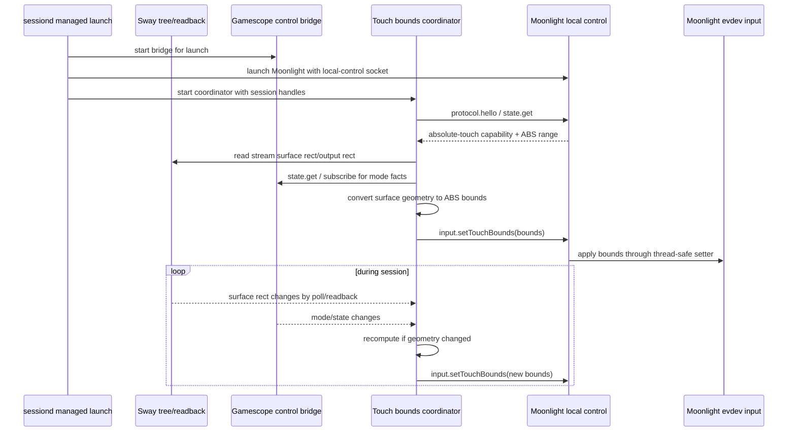

# fix: Make absolute touch geometry dynamic

## Summary

Replace the static absolute-touch bounds workaround with a runtime geometry loop: Moonlight exposes live touch calibration and accepts touch-bound updates over local control, Korri reads the current stream surface geometry from session-owned compositor state, and a coordinator recomputes bounds whenever the surface starts, moves, resizes, or changes presentation shape.

---

## Problem Frame

The current absolute-touch bounds path is launch-time configuration. It can guard a fixed dual-screen layout, but it cannot support a stream surface that is moved, resized, reshaped, tiled, or re-presented after Moonlight starts. That means it still encodes the full-screen/static-screen assumption the user rejected: if geometry changes during the session, touches from the wrong screen or region can be sent into the game.

---

## Requirements

- R1. Absolute touch must be bounded by the active stream surface at runtime, not by fixed launch-time bounds.
- R2. Bounds must update when the stream surface starts, moves, resizes, reshapes, or changes output/region during the session.
- R3. The runtime update path must not restart Moonlight or tear down the stream.
- R4. Geometry must be derived from authoritative readback: compositor/window geometry for where the stream is displayed and Moonlight/evdev calibration for the touch device ABS range.
- R5. Touch bounds must be expressed in the same raw ABS coordinate space as the existing Moonlight absolute-touch patch before they reach the C layer.
- R6. Failure to recompute or apply bounds must degrade safely: keep the previous known-good bounds and log/report the failure without crashing sessiond or killing the stream.
- R7. Static `KORRI_MOONLIGHT_ABSOLUTE_TOUCH_BOUNDS` / `-absolutetouchbounds` may remain only as a diagnostic or fallback seam, not as the supported product path for movable/resizable surfaces.
- R8. Tests and artifacts must prove dynamic behavior, not only launch argument composition.
- R9. After geometry has settled, updated touch bounds should be applied within a small interactive latency budget: target ≤250 ms, hard cap ≤500 ms unless hardware validation justifies a different bound.
- R10. Before the first valid dynamic bounds are applied in managed dynamic mode, absolute-touch events must be ignored or otherwise fail closed; they must not default to the full touch ABS range.

---

## Scope Boundaries

- This plan does not replace Moonlight Embedded, Sunshine, Gamescope, Sway, or the existing local-control protocols.
- This plan does not solve unrelated host-side Linux multi-monitor absolute-input bugs in Sunshine or inputtino; it addresses the local client touchscreen region before Moonlight sends input packets.
- This plan does not require per-touch compositor queries; geometry is tracked out-of-band and applied as cached bounds.
- This plan does not make static full-screen bounds the primary support story.

### Deferred to Follow-Up Work

- Sway event subscription optimization: the active plan can use session-scoped polling/readback to support move/resize; a later slice can replace or augment polling with a long-lived Sway IPC subscription if needed.
- Physical Bandai/dual-screen calibration capture: implementation should support measured layouts, but final device-specific values and acceptance captures can land in the hardware validation slice if not available during initial development.
- Host-side Sunshine multi-monitor fixes: upstream/Linux host monitor-offset defects remain separate from local client touch-region filtering.

---

## Context & Research

### Relevant Code and Patterns

- `packages/moonlight-embedded-korri/patches/0004-add-absolutetouch-flag-for-tap-to-click.patch` currently implements `-absolutetouch` and static `-absolutetouchbounds`; it filters raw evdev ABS coordinates before calling `LiSendMousePositionEvent()`.
- `packages/moonlight-embedded-korri/patches/0006-add-local-control-observability-ipc.patch`, `0007-wire-local-control-runtime-command-events.patch`, and `0008-add-runtime-set-resolution-on-local-control.patch` establish the Moonlight local-control C patch pattern.
- `korri/shared/stream/moonlight-control-protocol.ts` and `korri/shared/stream/moonlight-control-client.ts` are the TypeScript protocol/client contract for Moonlight local control.
- `tools/device/game-stream-fullscreen.ts` already reads Sway's tree for stream-surface discovery and repair; it should be extended to preserve compositor rect/output geometry rather than introducing a second geometry parser.
- `tools/device/sessiond.ts` owns foreground lifecycle and starts/stops the Gamescope control bridge for managed launches; it is the correct owner for a session-scoped dynamic-bounds coordinator.
- `korri/shared/gamescope-control/*` provides the typed Gamescope runtime-control surface and readback events for mode changes. Product code should use this contract rather than xrandr/X11 internals directly.
- `tools/cli/moonlight-runtime-watch.ts` and `@shared/stream/moonlight-runtime-watch-artifact` are the existing runtime validation/artifact surfaces for stream-control behavior.
- `nix/tests/korri-moonlight-control-protocol-patch-check.nix` enforces C patch invariants by reading the patch source; new local-control command symbols and safety checks should be added there.

### Institutional Learnings

- `docs/solutions/architecture-patterns/kiosk-foreground-app-policy-over-gamescope-overlay-2026-05-24.md`: foreground and geometry policy belong to the session/compositor layer; Moonlight presentation env flags are not geometry contracts.
- `docs/solutions/design-patterns/explicit-cascade-folded-policy-over-incidental-signal-heuristics-2026-05-27.md`: static env/argv sniffing is the wrong shape for runtime-changing policy. Dynamic touch geometry needs an explicit runtime seam, not more launch-time heuristics.
- `docs/solutions/architecture-patterns/gamescope-runtime-control-contract-2026-06-02.md`: Gamescope state must be read through the typed local protocol and trusted only after readback reports applied state.
- `docs/solutions/tooling-decisions/vendor-sdl2-mali-fbdev-for-moonlight-on-fbdev-only-handhelds-2026-05-28.md`: Korri's Moonlight patches are an inseparable closure; dynamic bounds must be added to the patched Moonlight package and validated as part of that package.
- `docs/solutions/architecture-patterns/physical-host-foreground-lifecycle-truth-is-sessiond-2026-05-29.md`: sessiond is the lifecycle source of truth; out-of-band control paths must not create split-brain session state.

### External References

- Sunshine upstream `src/input.cpp`: absolute mouse packets are converted from the client reference plane through Sunshine's `touch_port` mapping; client-side bounds must be resolved before packets are sent.
- Sunshine upstream `src/video.cpp` / `make_port`: Sunshine refreshes host-side touch-port state when stream dimensions change; the client still needs local surface-region filtering.
- Sunshine upstream `src/platform/common.h`: `touch_port_t` confirms the host-side monitor offset/viewport model is distinct from local client ABS filtering.
- Sunshine issue `LizardByte/Sunshine#3696`: Linux host multi-monitor absolute/touch input issues are real but separate from the local dual-screen client filtering problem.

---

## Key Technical Decisions

- Dynamic updates go through Moonlight local-control IPC, not Sunshine runtime settings. The bounds are a client-side evdev filter applied before Moonlight sends input packets, so Sunshine has no command to receive.
- Touch bounds use an input-command namespace, not the Sunshine runtime-settings command namespace. This keeps host-applied runtime-setting proof separate from local evdev input-filter proof.
- The input-command schema is parallel to the runtime command schema: `InputCommandMethod`, input accepted/result response types, and an `input.commandResult` event. `StateSnapshotResult.runtimeSettings.lastCommand` remains runtime-only; input state gets its own snapshot section.
- `input.setTouchBounds` accepts raw ABS coordinates. TypeScript converts compositor pixel geometry into ABS bounds using a reported or configured touch calibration range; C receives the same coordinate space as the existing `-absolutetouchbounds` flag.
- Moonlight local-control exposes current absolute-touch state and touch ABS range. The coordinator should not require hardcoded ABS max/min values in launch env to compute bounds.
- The C patch updates bounds through one thread-safe evdev setter. The local-control thread must not write four independent globals that the evdev input thread can partially read.
- Geometry comes from session-owned readback. Sway tree rects identify the outer displayed surface, Gamescope state identifies inner mode/scaling facts, and sessiond coordinates the two during a managed launch. If scaling policy cannot determine the active inner viewport, the coordinator must fail closed or require explicit stretch/fill configuration rather than silently treating black bars as game surface.
- The coordinator keeps the previous known-good bounds on failure. Dynamic bounds are safety enrichment; a failed update should not kill the stream or clear bounds to an unsafe region.
- Static launch bounds are demoted to fallback/diagnostic behavior. They remain useful for manual smoke tests and hardware bring-up, but support for dynamic surfaces depends on the runtime coordinator.

---

## Open Questions

### Resolved During Planning

- Should dynamic bounds be launch env or runtime state? Runtime state. Launch env cannot support movement/resizing after process start.
- Which process receives runtime touch-bound updates? Moonlight Embedded, via local-control IPC, because the filter runs before input packets leave the client.
- What coordinate space does the C command use? Raw evdev ABS coordinates, matching the existing static flag and keeping C simple.
- Who owns orchestration? sessiond owns lifecycle; `tools/device/touch-bounds-coordinator.ts` contains the coordinator implementation as a sessiond peer.
- What happens if absolute touch is disabled? `input.setTouchBounds` should be unsupported or disabled unless absolute-touch mode is active; it must not silently claim success while doing nothing.
- What covers the startup gap before first dynamic bounds? Managed dynamic mode fails closed: Moonlight ignores absolute-touch events until a valid static fallback or first runtime bounds update is active.

### Deferred to Implementation

- Exact Bandai/dual-screen ABS partitions: implementation should expose and consume calibration, but final values require hardware `evtest`/capture evidence.
- Exact polling interval and debounce timing: implementation should tune values to meet R9's target/hard-cap latency budget and verify on target hardware.
- Whether Sway subscription replaces polling: defer until the polling/readback path proves insufficient.
- Whether dynamic bounds are enabled by default on every platform: decide from platform capability/config once the runtime seam exists.

---

## High-Level Technical Design

> *This illustrates the intended approach and is directional guidance for review, not implementation specification. The implementing agent should treat it as context, not code to reproduce.*



---

## Implementation Units

### U1. Define Moonlight dynamic touch-bounds protocol

**Goal:** Add a first-class Moonlight local-control contract for absolute-touch bounds and calibration state, without tying it to Sunshine runtime settings.

**Requirements:** R1, R3, R4, R5, R6, R10

**Dependencies:** None

**Files:**
- Modify: `korri/shared/stream/moonlight-control-protocol.ts`
- Modify: `korri/shared/stream/moonlight-control-client.ts`
- Test: `korri/shared/stream/moonlight-control-protocol.test.ts`
- Test: `korri/shared/stream/moonlight-control-client.test.ts`

**Approach:**
- Add `input.setTouchBounds` to a Moonlight local-control input-command namespace, separate from Sunshine-relayed runtime-settings commands and proof classification.
- Define a parallel protocol shape: `InputCommandMethod`, input accepted/result response types, an `input.commandResult` event, and capability entries that can contain both runtime and input command methods.
- Input-command responses mirror the existing request-id envelope shape but use input-specific method/status types. `applied` means locally applied by Moonlight's evdev filter; `disabled`, `unsupported`, and `failed` are input-command results/errors, not Sunshine host-apply statuses.
- Keep runtime-setting status and `StateSnapshotResult.runtimeSettings.lastCommand` runtime-only; add a parallel `input` snapshot section for absolute-touch state, active bounds, last input command/result, and calibration.
- Increment the Moonlight local-control protocol minor constant in TypeScript and C to advertise the new capability, but do not add exact minor-version equality checks. The coordinator must gate on `capabilities.commands.includes("input.setTouchBounds")`.
- Add explicit `MOONLIGHT_CONTROL_PROTOCOL_LIMITS` entries for touch-bound command coordinate limits only. Hardware ABS ranges are device state and belong in snapshots, not compile-time limits.
- Define the first implementation as a single-primary-touchscreen model: the snapshot reports the ABS range for the primary recognized touchscreen, and `input.setTouchBounds` applies the existing global absolute-touch filter to all touchscreen devices. Document this as a constraint for dual-digitizer hardware.
- Add a client helper that sends the new command and preserves the local-control request-id/error ergonomics while keeping response/status classification distinct from existing Sunshine runtime commands.
- Treat this as a Moonlight-local input command, not as a Sunshine operation. It should not require a Sunshine runtime capability ack or use host-applied runtime-setting status semantics.

**Execution note:** Implement protocol tests first so the C patch and coordinator have a stable contract to target.

**Patterns to follow:**
- `runtime.setResolution` handling in `korri/shared/stream/moonlight-control-protocol.ts` for request envelope shape, not host-applied status semantics
- `setResolution()` in `korri/shared/stream/moonlight-control-client.ts` for client ergonomics, not command namespace
- Existing client socket tests in `korri/shared/stream/moonlight-control-client.test.ts`

**Test scenarios:**
- Happy path: decoding an input-command request with `{ x, y, w, h }` accepts non-negative coordinates and positive width/height.
- Happy path: `connectMoonlightControl().setTouchBounds()` writes `input.setTouchBounds` with the expected params and resolves the input-command accepted/complete response.
- Edge case: zero or negative width/height is rejected by schema decoding.
- Edge case: state snapshots preserve additive fields while exposing touch calibration, active bounds, and last input command without polluting `runtimeSettings.lastCommand`.
- Edge case: old Moonlight servers with protocol minor `0` but no `input.setTouchBounds` capability are treated as unsupported by capability checks, not rejected by exact minor mismatch.
- Error path: input-command error frames for `input.setTouchBounds` reject through a local-input error path without being classified as Sunshine host-apply failures.

**Verification:**
- Protocol and client tests prove the command and observable state are typed and backwards-compatible with additive fields.

---

### U2. Add runtime bounds mutation to Moonlight Embedded

**Goal:** Extend the patched Moonlight Embedded C layer so touch bounds can be updated safely while the stream is running.

**Requirements:** R1, R3, R5, R6, R7, R10

**Dependencies:** U1

**Files:**
- Create: `packages/moonlight-embedded-korri/patches/0012-add-runtime-touch-bounds-control.patch`
- Modify: `packages/moonlight-embedded-korri/package.nix`
- Modify: `packages/moonlight-embedded-korri/README.md`
- Modify: `nix/tests/korri-moonlight-control-protocol-patch-check.nix`

**Approach:**
- Add an evdev-level setter for active absolute-touch bounds and optional bound clearing/disabling.
- Replace independent global bounds fields with one coherent bounds snapshot. The local-control writer and evdev reader must copy/update the whole snapshot under the same synchronization primitive, such as a `pthread_mutex_t`, so the evdev loop never observes a partially-updated rectangle.
- Add managed dynamic mode fail-closed startup behavior, enabled by a launch flag such as `-absolutetouchrequirebounds`: until static fallback bounds or first valid runtime bounds are active, absolute-touch events are ignored rather than mapped against the full ABS range.
- Extend Moonlight local-control C dispatch to handle the new input command locally, update evdev bounds, emit input-command accepted/result events with local-apply semantics, and expose current state in snapshots.
- Mirror TypeScript command coordinate limits in C constants and add patch invariant checks for those constants, the new hello minor version, and input capability advertisement.
- Advertise the command only when the absolute-touch path is available/enabled, or return a clear `disabled`/`unsupported` result if called when not enabled.
- Keep `-absolutetouchbounds` as a startup fallback, but ensure runtime updates supersede startup bounds once applied.

**Execution note:** Characterize the current static-bounds patch before adding the runtime setter; then add the smallest patch that reuses local-control infrastructure.

**Patterns to follow:**
- `packages/moonlight-embedded-korri/patches/0008-add-runtime-set-resolution-on-local-control.patch` for local-control dispatch shape only; do not copy its Sunshine-forwarding state model for evdev mutation
- State/capability emission in `0006-add-local-control-observability-ipc.patch`
- Patch invariant checks in `nix/tests/korri-moonlight-control-protocol-patch-check.nix`

**Test scenarios:**
- Static invariant: Nix patch check finds the new command constant, evdev setter, capability advertisement, and state snapshot markers.
- Static invariant: Nix patch check confirms the patch introduces a single coherent bounds snapshot and routes both setter and `send_touch_position()` through synchronized snapshot helpers; the check is a wiring guard, not the sole proof of atomicity.
- Error path: in managed dynamic mode, a touch event before first valid bounds is dropped/ignored rather than sent as full-range absolute input.
- Happy path: patched package builds with the new patch ordered after existing local-control patches.
- Error path: patch text includes an explicit disabled/unsupported path for calls when absolute touch is not active.
- Regression: existing static `-absolutetouch` and `-absolutetouchbounds` CLI/config behavior remains documented and recognized.

**Verification:**
- The patched Moonlight package evaluates/builds through the existing Nix check, and the invariant check proves the runtime command is wired into the C patch stack. Atomicity still requires code review of the coherent snapshot read/write path, because text checks cannot prove lock correctness.

---

### U3. Preserve compositor surface geometry in stream-surface discovery

**Goal:** Make the existing Sway stream-surface helper return authoritative displayed rect/output geometry so dynamic touch bounds can be computed from real presentation state.

**Requirements:** R2, R4, R8, R9

**Dependencies:** None

**Files:**
- Modify: `tools/device/sessiond-sway.ts`
- Modify: `tools/device/game-stream-fullscreen.ts`
- Test: `tools/device/game-stream-fullscreen.test.ts`

**Approach:**
- Keep module responsibilities explicit: `tools/device/sessiond-sway.ts` owns Sway IPC execution/readback plumbing; `tools/device/game-stream-fullscreen.ts` owns parsing the Sway tree into stream-surface candidates and snapshots.
- Extend the Sway node model with the `rect` data already present in `swaymsg -t get_tree` output.
- Preserve the stream surface rect in `StreamSurfaceSnapshot` when present.
- Add helpers for selecting the output/container rect that contains the stream surface, or return an explicit missing-geometry result when the tree lacks enough information.
- Expose a read-current-geometry helper that U5 can poll after any trigger; U3 does not own event detection.
- Keep existing foreground repair behavior unchanged; geometry readback is additive.

**Patterns to follow:**
- `findStreamSurfaceWindows()` and `waitForStreamSurface()` in `tools/device/game-stream-fullscreen.ts`
- Existing Sway tree fixture style in `tools/device/game-stream-fullscreen.test.ts`

**Test scenarios:**
- Happy path: a Gamescope node with `rect` returns a `StreamSurfaceSnapshot` carrying that rect.
- Happy path: nested Sway tree output/container rects identify the output containing the stream surface.
- Edge case: a stream surface without a rect is still discoverable for foreground repair but reports geometry as unavailable to the bounds coordinator.
- Integration: repeated helper calls after fixture rect changes return the new rect, proving U5 can use U3's API for polling-based change detection.
- Edge case: multiple matching surfaces still choose the focused/new primary surface while preserving each candidate's rect.
- Regression: existing focus/fullscreen/border repair commands are unchanged.

**Verification:**
- Stream-surface tests show geometry is read from the existing Sway tree path without introducing a second compositor parser.

---

### U4. Implement pure geometry-to-ABS bounds conversion

**Goal:** Convert live compositor surface geometry into raw ABS bounds through a pure, directly-tested adapter.

**Requirements:** R2, R4, R5, R6, R8

**Dependencies:** U1, U3

**Files:**
- Create: `tools/device/touch-bounds-geometry.ts`
- Test: `tools/device/touch-bounds-geometry.test.ts`

**Approach:**
- Model the inputs explicitly: surface rect in compositor coordinates, containing output rect, touch ABS min/max range, Gamescope mode/aspect facts when available, explicit scaling policy, and rotation/layout metadata if available.
- Define the U4/U5 handoff as explicit ADTs: scaling policy is `stretchFill`, `fitLetterbox`, or `unknown`; Gamescope mode/aspect facts are the current inner mode dimensions/aspect derived from typed Gamescope state, primarily `xwaylandMode` when available.
- Compute raw ABS bounds by projecting the active game surface rectangle from output-relative pixel coordinates into the touch device ABS range.
- Determine the active inner viewport explicitly: if Korri-managed Gamescope stretch/fill policy guarantees the game fills the surface, use the full surface; if fit/letterbox policy is active, derive insets from surface aspect ratio and Gamescope `xwaylandMode`; if policy or dimensions are unknown, return invalid geometry rather than accepting black bars as game input.
- Clamp computed bounds to the device ABS min/max and reject zero/negative output or surface dimensions as invalid geometry.
- Handle fullscreen/full-output surfaces as a valid dynamic result, not as a static special case.
- Keep this in `tools/device` space so C remains a small runtime setter and hardware layouts can be tested without compiling Moonlight.

**Technical design:** *(directional guidance, not implementation specification)*

```text
(surface rect, output rect, touch ABS range, Gamescope mode, scaling policy)
  -> validate dimensions
  -> choose active presented game rect
  -> normalize active rect against output rect
  -> project normalized rect into ABS min/max range
  -> clamp and round to integer { x, y, w, h }
```

**Patterns to follow:**
- Pure adapter/test style in `korri/products/app/api/stream/compose-moonlight-launch-spec.ts`
- Explicit ADT/result style used by launch/input resolution helpers

**Test scenarios:**
- Happy path: fullscreen surface covering an output maps to the full ABS range.
- Happy path: a surface occupying half an output maps to the corresponding half of the ABS range.
- Happy path: moving the same surface from one output-relative position to another changes the ABS origin while preserving size.
- Edge case: surface rect partially outside the output clamps to the ABS range.
- Edge case: zero-size surface, zero-size output, or missing ABS max/min returns an invalid-geometry result rather than throwing unexpectedly.
- Edge case: aspect-ratio mismatch under fit/letterbox policy maps only the derived active inner game area.
- Edge case: aspect-ratio mismatch with unknown scaling policy returns invalid geometry instead of using the full surface.
- Regression: static fallback bounds can still be represented as a precomputed ABS rectangle for diagnostics.

**Verification:**
- Pure tests cover the coordinate transform independently of Moonlight, Sway, Gamescope, or hardware.

---

### U5. Build the session-scoped dynamic touch-bounds coordinator

**Goal:** Coordinate Moonlight local control, stream-surface geometry readback, and Gamescope state so touch bounds update during a live session.

**Requirements:** R1, R2, R3, R4, R6, R8, R9, R10

**Dependencies:** U1, U3, U4

**Files:**
- Create: `tools/device/touch-bounds-coordinator.ts`
- Test: `tools/device/touch-bounds-coordinator.test.ts`

**Approach:**
- Connect to Moonlight local control, verify the absolute-touch/touch-bounds capability, and read current touch calibration state.
- Accept the existing managed-launch Gamescope bridge socket path from sessiond when present; connect to that socket through the typed Gamescope control client instead of creating a second bridge.
- Read the current stream surface rect through the existing Sway runner/helper and current Gamescope state through the typed control client when available.
- On every trigger, re-read both geometry sources before recomputing. Sway and Gamescope reads are not atomic across IPC boundaries, so the coordinator should avoid recomputing from one fresh source and one stale cached source.
- Compute bounds using U4 and send `input.setTouchBounds` only when the computed bounds differ from the last applied bounds.
- React to three trigger classes: session start/streaming readiness, Gamescope mode/state changes, and compositor surface rect changes detected through bounded polling/readback.
- Use polling/readback with debounce so resize/move churn does not spam local control or apply transient zero-size geometry. Exact interval/debounce values are deferred to implementation, but they must meet R9's target/hard-cap latency budget after geometry settles.
- Preserve R10 fail-closed startup behavior by treating dynamic touch as inactive until the first valid bounds update succeeds, unless an explicit static fallback is active.
- On failures, keep last known-good bounds, record/log the failure, and keep the stream alive.
- Return a handle that sessiond can close during restore/terminate.

**Patterns to follow:**
- Local control client lifecycle in `tools/cli/moonlight-runtime-watch.ts`
- Gamescope control client subscribe/state patterns in `korri/shared/gamescope-control/gamescope-control-client.ts`
- Session-owned bridge handle lifecycle in `tools/device/sessiond.ts`

**Test scenarios:**
- Happy path: coordinator starts, reads calibration and surface geometry, computes bounds, and sends one `input.setTouchBounds` command.
- Happy path: when the surface rect changes, the coordinator recomputes and sends updated bounds without restarting Moonlight.
- Happy path: when Gamescope mode changes and the surface rect settles, the coordinator sends bounds after readback rather than at command dispatch time.
- Integration: a Sway-triggered change and a Gamescope-triggered change both cause the coordinator to re-read both sources before computing bounds.
- Latency: after simulated geometry settles, the coordinator applies updated bounds within the R9 hard-cap budget.
- Edge case: repeated identical geometry does not send duplicate bounds commands.
- Edge case: transient zero-size geometry is ignored until a valid rect appears or timeout is reached.
- Error path: before first valid dynamic bounds, absolute touch remains inactive/fail-closed rather than falling back to full range.
- Error path: Moonlight local-control connection failure disables the coordinator without failing the session launch.
- Error path: Gamescope control socket path is absent or connection fails; the coordinator falls back to Sway-only geometry when enough information exists, otherwise keeps previous bounds.
- Error path: `input.setTouchBounds` rejection is logged/reported and does not kill the managed launch.
- Integration: closing the coordinator handle unsubscribes/closes clients and stops polling.

**Verification:**
- Coordinator tests prove dynamic movement/resizing changes the emitted bounds and failure paths preserve session continuity.

---

### U6. Wire dynamic bounds into managed session lifecycle and launch policy

**Goal:** Make dynamic bounds the supported product path for managed Moonlight sessions while demoting static env bounds to fallback diagnostics.

**Requirements:** R1, R2, R3, R6, R7, R8, R10

**Dependencies:** U1, U2, U3, U4, U5

**Files:**
- Modify: `tools/device/sessiond.ts`
- Modify: `korri/products/app/stream/moonlight-launcher.ts`
- Modify: `korri/products/app/api/stream/compose-moonlight-launch-spec.ts`
- Test: `tools/device/sessiond.test.ts`
- Test: `tools/cli/moonlight-launcher.test.ts`
- Test: `korri/products/app/api/stream/compose-moonlight-launch-spec.test.ts`

**Approach:**
- Add a sessiond option/env/config seam for enabling the dynamic touch-bounds coordinator when a managed Moonlight launch provides a Moonlight local-control handle and a geometry source.
- Pass the existing `activeManagedLaunch.gamescopeControlBridge?.socketPath` or equivalent bridge socket handle into the coordinator; do not instantiate a second Gamescope bridge.
- Start the coordinator after the stream surface and local-control socket are ready; stop it during restore before Gamescope reaping and managed-launch cleanup.
- In managed dynamic mode, pass the Moonlight fail-closed/no-bounds startup flag, such as `-absolutetouchrequirebounds`, so the interval before first dynamic update cannot send full-range touch events.
- Ensure direct launch composers no longer present static bounds as the normal dynamic support mechanism. If static bounds remain, document and test them as explicit fallback/manual configuration.
- Define precedence explicitly: an explicit static fallback can provide initial bounds, but the first successful dynamic update replaces it for the remainder of the session; if dynamic updates fail, the last known-good bounds remain active.
- Preserve launch behavior on hosts with no absolute-touch capability, no local-control socket, or no Sway/Gamescope geometry source.
- Keep product/shared boundaries intact: product/session orchestration wires dynamic behavior; shared protocol/client code remains transport/contract only.

**Patterns to follow:**
- `startGamescopeControlBridgeForLaunch()` and cleanup paths in `tools/device/sessiond.ts`
- Moonlight local control launch handle handling in `korri/products/app/stream/moonlight-launcher.ts`
- Environment fallback style in `korri/products/app/api/stream/compose-moonlight-launch-spec.ts`

**Test scenarios:**
- Happy path: managed launch with dynamic touch enabled starts the coordinator after local-control and geometry prerequisites are available.
- Happy path: restore/terminate stops the coordinator before clearing the active launch record.
- Edge case: missing Moonlight local-control handle skips dynamic bounds and leaves launch success unaffected, but does not claim dynamic-touch support.
- Edge case: managed dynamic launch verifies the fail-closed startup option is present when no static fallback bounds are configured.
- Edge case: missing geometry source skips dynamic bounds and reports degraded capability rather than throwing.
- Regression: existing Moonlight launch args for platform, mapping file, input device, and Gamescope wrapping remain unchanged unless dynamic touch is explicitly enabled.
- Regression: static `KORRI_MOONLIGHT_ABSOLUTE_TOUCH_BOUNDS` is not described or tested as the primary dynamic path.

**Verification:**
- Sessiond and launch composition tests prove dynamic bounds are lifecycle-owned and static launch bounds are not required for supported dynamic behavior.

---

### U7. Add runtime validation and artifact visibility for dynamic bounds

**Goal:** Extend existing runtime watch/control tooling so dynamic bounds can be verified and debugged during resize/move scenarios.

**Requirements:** R2, R6, R8

**Dependencies:** U1, U4, U5, U6

**Files:**
- Modify: `tools/cli/moonlight-runtime-watch.ts`
- Modify: `korri/shared/stream/moonlight-runtime-watch-artifact.ts`
- Test: `tools/cli/moonlight-runtime-watch.test.ts`

**Approach:**
- Record touch calibration, computed bounds, command responses, and any geometry-settle failures in the runtime-watch artifact.
- Add a validation scenario or optional proof field that observes bounds after a resolution or geometry change.
- Treat touch bounds as local-control proof, not host-apply proof: the host is not expected to acknowledge a client-side input filter.
- Keep artifact schema additive so old artifacts still decode.

**Patterns to follow:**
- Existing bitrate/FPS/resolution command result classification in `tools/cli/moonlight-runtime-watch.ts`
- Additive artifact schema style in `korri/shared/stream/moonlight-runtime-watch-artifact.ts`

**Test scenarios:**
- Happy path: runtime-watch artifact records an applied touch-bounds update after a simulated geometry change.
- Edge case: missing touch-bounds capability records `not-collected` or degraded proof rather than failing unrelated runtime scenarios.
- Error path: `input.setTouchBounds` command rejection records the local-control failure distinctly from Sunshine host-apply failures.
- Regression: existing probe, bitrate, FPS, and resolution scenarios still classify the same terminal outcomes.

**Verification:**
- Runtime-watch tests prove artifacts can explain whether dynamic bounds were applied, skipped, or failed.

---

### U8. Document dynamic touch geometry contract and platform configuration

**Goal:** Make the supported contract clear so future work does not regress into static fullscreen assumptions.

**Requirements:** R1, R2, R4, R5, R6, R7, R8

**Dependencies:** U1, U2, U4, U5, U6, U7

**Files:**
- Create: `docs/acceptance/dynamic-touch-bounds-contract.md`
- Modify: `packages/moonlight-embedded-korri/README.md`
- Modify: `docs/deployment/korri-images.md`
- Modify: `docs/acceptance/runtime-settings-protocol-contract.md`

**Approach:**
- Document the coordinate spaces: compositor pixels, Gamescope inner/outer geometry, Moonlight raw ABS bounds, and Sunshine host touch-port mapping.
- Update the runtime-settings protocol contract to clarify that touch bounds are local input-control proof, not Sunshine host-apply runtime-setting proof.
- State that dynamic bounds are the supported product path for movable/resizable surfaces; static launch bounds are fallback/manual diagnostics.
- Document fail-safe behavior, including previous-bounds retention on geometry/readback/control failure.
- Add platform notes for where hardware calibration facts belong and how final device-specific values should be validated.

**Patterns to follow:**
- `docs/acceptance/runtime-settings-protocol-contract.md`
- Moonlight patch documentation in `packages/moonlight-embedded-korri/README.md`
- Deployment environment documentation in `docs/deployment/korri-images.md`

**Test scenarios:**
- Test expectation: no automated prose-only unit tests. Contract coverage is enforced by U1/U2/U7 tests and Nix patch invariant checks.
- Review expectation: documentation review verifies that static bounds are not described as the supported dynamic path, startup fail-closed behavior is documented, and runtime-settings proof remains separate from local input-command proof.

**Verification:**
- Documentation clearly separates supported dynamic behavior from static fallback behavior and gives operators/developers enough context to diagnose geometry failures.

---

## System-Wide Impact

- **Interaction graph:** sessiond owns coordinator lifecycle; the coordinator consumes Sway geometry, Gamescope control state, and Moonlight local-control state; Moonlight evdev applies bounds before input packets reach Sunshine.
- **Error propagation:** coordinator failures should be local/degraded status or warnings, not managed-launch failures. Moonlight input-command rejections should surface as local-control input failures, not Sunshine host failures.
- **State lifecycle risks:** bounds can become stale during resize/move transitions; the coordinator must debounce/read back geometry and keep the last known-good bounds on invalid readback. Before the first valid bounds in managed dynamic mode, absolute touch must fail closed rather than use full-range input.
- **API surface parity:** Moonlight local-control protocol, TypeScript client, C patch capabilities, runtime-watch artifacts, and Nix invariant checks must all agree on the new input-command namespace, state fields, capability advertisement, and protocol minor bump.
- **Integration coverage:** unit tests prove protocol and transform logic; runtime-watch artifacts and target-device captures are needed to prove physical touch mapping after resize/move.
- **Unchanged invariants:** Sunshine runtime settings remain bitrate/FPS/resolution only; Gamescope control remains the typed bridge for presentation state; static launch bounds remain available only as fallback/manual diagnostics.

---

## Risks & Dependencies

| Risk | Mitigation |
|------|------------|
| ABS range is hardware-specific and not equivalent to screen pixels | Expose/read touch calibration and convert in a pure TypeScript adapter before sending raw ABS bounds to C; document the first implementation's single-primary-touchscreen constraint. |
| Bounds update races with evdev input loop | Replace independent globals with one coherent synchronized bounds snapshot; use patch invariant checks as wiring guards and code review for lock/read correctness. |
| Surface geometry readback lags behind resize/move events | Use bounded debounce/readback and apply only valid settled geometry within R9's latency budget. |
| Startup gap sends full-range touches before first dynamic bounds | Enable fail-closed/no-bounds behavior in managed dynamic mode unless explicit static fallback bounds are active. |
| Scaling/letterbox policy is unknown | Derive inner viewport only from explicit stretch/fill or fit/letterbox facts; fail closed when policy is unknown rather than accepting black bars as game surface. |
| Dynamic coordinator becomes another lifecycle source of truth | Make sessiond own coordinator start/stop; do not let the coordinator launch or terminate sessions. |
| Static env fallback continues to look like supported dynamic behavior | Reword docs/tests so static bounds are fallback diagnostics, and require dynamic runtime tests for support claims. |
| Non-Gamescope/direct fullscreen paths lack enough geometry | Degrade to no dynamic update or explicit static fallback until those platforms expose authoritative geometry. |
| Physical dual-screen calibration is unknown during planning | Keep calibration injected/observable and defer final measured values to hardware validation. |

---

## Documentation / Operational Notes

- Operators should be able to inspect runtime-watch artifacts to see active calibration, computed bounds, and last touch-bounds command outcome.
- Dynamic touch support should be documented as requiring: patched Moonlight local control, absolute-touch mode, a readable stream surface geometry source, and touch ABS calibration.
- Hardware validation should include at least: initial stream on one region, moved stream to another region, resized/reshaped stream, touches in the active region accepted, touches outside ignored.

---

## Sources & References

- Related code: `packages/moonlight-embedded-korri/patches/0004-add-absolutetouch-flag-for-tap-to-click.patch`
- Related code: `packages/moonlight-embedded-korri/patches/0008-add-runtime-set-resolution-on-local-control.patch`
- Related code: `korri/shared/stream/moonlight-control-protocol.ts`
- Related code: `korri/shared/stream/moonlight-control-client.ts`
- Related code: `tools/device/game-stream-fullscreen.ts`
- Related code: `tools/device/sessiond.ts`
- Related code: `tools/cli/moonlight-runtime-watch.ts`
- Related contract: `docs/acceptance/runtime-settings-protocol-contract.md`
- Related docs: `docs/acceptance/runtime-settings-protocol-contract.md`
- Related learning: `docs/solutions/architecture-patterns/kiosk-foreground-app-policy-over-gamescope-overlay-2026-05-24.md`
- Related learning: `docs/solutions/design-patterns/explicit-cascade-folded-policy-over-incidental-signal-heuristics-2026-05-27.md`
- Related learning: `docs/solutions/architecture-patterns/gamescope-runtime-control-contract-2026-06-02.md`
- External reference: Sunshine `src/input.cpp` absolute input handling, https://raw.githubusercontent.com/LizardByte/Sunshine/master/src/input.cpp
- External reference: Sunshine multi-monitor touch issue, https://github.com/LizardByte/Sunshine/issues/3696
