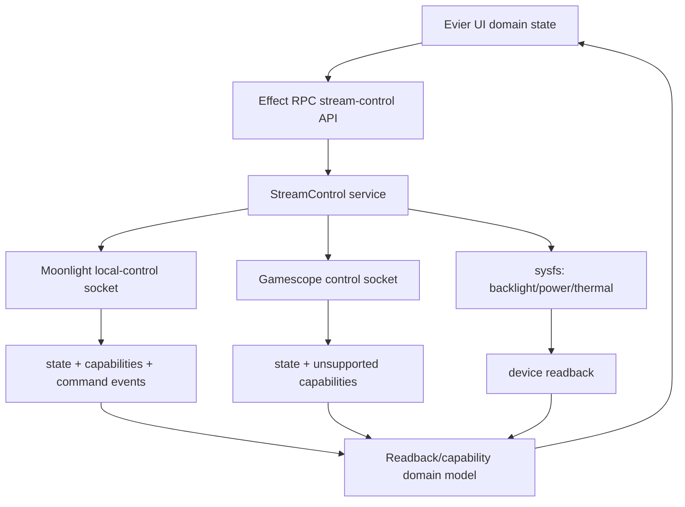

# Complete Evier Control Surface

## Summary

Complete Evier as the operator surface for every supported runtime and device control Korri can truthfully expose: Moonlight stream controls/status, Gamescope presentation controls/status, and hardware device state. The plan expands capability-gated RPCs and UI from authoritative readback only, so Evier never presents command acknowledgements or local cache as applied truth.

---

## Problem Frame

Evier has become the live control bench for Bandai/Sobo streaming experiments, but the current UI only covers a subset of the available control planes and still has gaps around capability discovery, accepted-vs-applied command lifecycle, and device telemetry. The user wants to reach “100%” of the supportable surface while preserving the hard product rule that controls must not misrepresent runtime truth.

---

## Requirements

- R1. Expose every Moonlight local-control capability that is implemented or can be confirmed implemented, including request-IDR, touch-bound controls/status, session lifecycle, stream quality, last-command state, and input route/absolute-touch status.
- R2. Expose every Gamescope control that can be backed by authoritative readback, and capability-gate declared-but-unimplemented commands rather than presenting them as working controls.
- R3. Extend device controls beyond brightness and battery to include power-source details, richer battery telemetry, friendly display labels, mixed brightness state, and discovery-gated thermal/performance readback.
- R4. Preserve independent control groups: stream/session controls remain separate from device controls; unified stream controls and unified display brightness are independent toggles.
- R5. Displayed values must come only from authoritative readback sources: Moonlight state/events, Gamescope xprop/xrandr/native state, and sysfs for device state. Command ACKs and ad-hoc React state must never become displayed truth.
- R6. Capability and authority must gate controls before mutation, with disabled/unsupported states shown explicitly and not discovered by trial-and-error command failures.
- R7. Moonlight `command.accepted` must be treated as pending, not terminal success; terminal applied/failed results must come from command-result events or later readback.
- R8. Linked/unified controls must explain divergence and partial failure instead of collapsing conflicting Moonlight/Gamescope readbacks to a generic unknown.
- R9. The Evier UI must maximize space for Moonlight/Gamescope/session controls by moving device state and diagnostics out of the main vertical flow.
- R10. Tests must cover protocol/schema contracts, service behavior, readback extraction, UI modes, capability gating, pending/applied lifecycle, and sysfs/device edge cases.

---

## Scope Boundaries

- This plan includes Evier, stream-control RPC, Moonlight local-control client wiring, Gamescope control bridge/backend expansion, and device sysfs readback surfaces.
- This plan does not require exposing a control when no authoritative readback or capability source exists; such controls must appear as unsupported/disabled or remain documented-only until implementation is real.
- This plan does not replace sessiond as foreground lifecycle authority; active-session binding must follow the existing sessiond-oriented architecture.
- This plan does not add network-exposed hardware or compositor APIs beyond the existing local Hono/RPC surface used by Evier.
- This plan does not treat runtime visual claims as proven by unit tests alone; any visual/perceptual claim still needs device acceptance evidence.

### Deferred to Follow-Up Work

- Writable thermal/performance controls are deferred until device-specific sysfs or service APIs are confirmed and documented. Read-only thermal/performance telemetry may be added only after Bandai sysfs paths are confirmed and captured as acceptance evidence; until then no thermal/performance display is added.
- Upstreaming Gamescope patches remains deferred to the existing Gamescope package track; this plan may depend on `gamescope-korri` patches but does not plan upstream contribution.
- Replacing all legacy stream-control bench REST routes is out of scope unless needed for Evier parity; Evier uses Effect RPC.

---

## Context & Research

### Relevant Code and Patterns

- `korri/shared/stream/moonlight-control-protocol.ts` defines Moonlight protocol metadata, capabilities, runtime command methods, input command methods, lifecycle state, stream quality, runtime settings, and input route status.
- `korri/shared/stream/moonlight-control-client.ts` exposes Moonlight socket calls for hello/state/subscribe/bitrate/FPS/resolution/touch bounds, but currently lacks `requestIdr()` despite the protocol command existing.
- `korri/shared/gamescope-control/gamescope-control-protocol.ts` declares the broader Gamescope command surface and state fields, including several currently unsupported commands.
- `korri/shared/gamescope-control/gamescope-control-bridge.ts` dispatches implemented commands and returns structured `unsupported` results for valid-but-unimplemented commands.
- `korri/shared/gamescope-control/x11-gamescope-control-backend.ts` currently implements/readbacks Gamescope mode, filter, sharpness, FSR feedback, and FPS cap using xrandr/xprop.
- `korri/products/app/api/stream-control/service.ts` is the central Effect service for Evier’s stream-control RPCs and already includes injectable filesystem/socket dependencies for tests.
- `korri/products/app/api/stream-control/*.rpc.ts` and `*.rpc-handler.ts` follow the per-action Effect RPC pair convention.
- `korri/products/app/features/evier/stream-control-rpc-client.ts` adapts Effect RPC into the `EvierStreamControlController` interface.
- `korri/shared/themes/evier/pages/EvierStreamControlPage.tsx` currently owns polling, readback extraction, command dispatch, unified stream controls, device controls, and diagnostics in one large component.
- `korri/shared/themes/evier/pages/EvierStreamControlPage.test.tsx` is the primary UI behavior test surface for mode/toggle/readback behavior.
- `tools/cli/gamescope-control.ts` and `tools/cli/gamescope-control-bridge.ts` provide operator and acceptance harness entry points for compositor controls.
- `docs/plans/2026-06-02-002-feat-gamescope-runtime-control-completion-plan.md` is the completed Gamescope-only runtime-control plan; this plan builds on it rather than reopening it.

### Institutional Learnings

- `docs/solutions/architecture-patterns/gamescope-runtime-control-contract-2026-06-02.md`: command success must require readback; unsupported, readback mismatch, timeout, backend absence, and abort states must remain distinct.
- `docs/solutions/design-patterns/explicit-cascade-folded-policy-over-incidental-signal-heuristics-2026-05-27.md`: runtime control intent and support must flow as explicit policy/capability, not incidental downstream heuristics.
- `docs/solutions/architecture-patterns/physical-host-foreground-lifecycle-truth-is-sessiond-2026-05-29.md`: active foreground session truth belongs to sessiond, not parallel in-process checks or Gamescope heuristics.
- `docs/solutions/architecture-patterns/kiosk-foreground-app-policy-over-gamescope-overlay-2026-05-24.md`: Gamescope is a presentation adapter, not lifecycle authority.
- `docs/solutions/best-practices/react-state-components-over-result-render-props-for-effect-atoms-2026-05-03.md`: complex UI state should be converted to domain ADTs and rendered by state-specific components rather than raw async/result branching.
- `docs/solutions/best-practices/electrobun-portal-via-localhost-bun-and-cage-input-passthrough-2026-05-27.md`: portal UI should be served from the local Bun/Hono app and keep relative `/api/rpc` behavior intact.

### External References

- External research was not used. Repository code, completed plans, and internal solution documents define the relevant contracts and risks.

---

## Key Technical Decisions

- **Define 100% support as capability-complete, not always-control-visible:** Evier should represent every known surface, but unsupported/unreadable controls must be disabled, hidden behind capability explanations, or documented as unavailable instead of pretending to work.
- **Keep readback truth as the core UI contract:** sliders, radios, buttons, and status badges derive displayed values from `state.get` and event readback, never from command ACKs or optimistic local state.
- **Use one coherent state snapshot for UI capability and readback:** `state.get` should include state plus capability/authority metadata so the UI renders from a single consistent source.
- **Refactor Evier state shape before piling on controls:** the current single-page component can carry small additions, but full capability gating and pending/applied states need a typed domain model, smaller render components, and an Effect Atom refresh seam instead of hand-rolled polling.
- **Treat Moonlight async commands differently from Gamescope synchronous readback commands:** Moonlight `command.accepted` means pending; Gamescope command results can be terminal when the backend has verified readback. Pending Moonlight state should be owned by a service/session command tracker, not by optimistic React component state.
- **Retain independent unified toggles:** unified stream/session controls and unified display brightness are separate UX concepts and must not imply each other.
- **Gate speculative device controls with discovery docs:** brightness and battery are already confirmed sysfs surfaces; thermals/perf need target-device discovery before writable controls.
- **Keep the broad Gamescope protocol honest:** commands already declared by the protocol should either gain backend/readback support or remain explicit `unsupported` capabilities with UI affordances explaining why.

---

## Open Questions

### Resolved During Planning

- **Should brightness belong to unified stream mode?** No. Brightness belongs to device controls with an independent unified-display toggle.
- **Should controls be initialized from defaults?** No. Displayed values must be readback-derived; otherwise controls show unknown/disabled.
- **Should `command.accepted` be displayed as success?** No. It is pending for Moonlight and must be distinguished from terminal applied/failed outcomes.
- **Should Gamescope declared-but-unsupported commands be shown as working controls?** No. They require capability-gated disabled states or real backend support.

### Deferred to Implementation

- **Exact Gamescope atoms/native APIs for unsupported commands:** Implementation must confirm available xprop/gamescopectl/native surfaces per command before promoting it from unsupported to supported.
- **Exact SM8550 thermal/performance paths:** Device discovery must confirm sysfs paths and semantics before controls are added beyond read-only telemetry.
- **Final UI density decisions:** The plan defines layout intent; implementation should tune exact responsive grid/sidebar behavior while preserving grouping and readback truth.
- **Event subscription mechanics:** The plan requires terminal Moonlight command lifecycle support, but implementation may choose persistent subscription, state invalidation, or a typed polling fallback if it preserves truthfulness.

---

## High-Level Technical Design

> *This illustrates the intended approach and is directional guidance for review, not implementation specification. The implementing agent should treat it as context, not code to reproduce.*



A single domain snapshot feeds Evier. Mutations request changes, then invalidate/refresh the authoritative snapshot. Controls render known, pending, unsupported, unavailable, mixed/diverged, failed, or unknown states from the snapshot; command responses are diagnostic context, not the source of displayed truth.

---

## Implementation Units

### U1. Establish typed stream-control snapshot and capability model

**Goal:** Replace the raw `unknown` state surface consumed by Evier with a typed snapshot that includes readback, capability, authority, and unsupported metadata for Moonlight, Gamescope, brightness, battery, and future device surfaces.

**Requirements:** R5, R6, R10

**Dependencies:** None

**Files:**
- Modify: `korri/products/app/api/stream-control/rpc-schemas.ts`
- Modify: `korri/products/app/api/stream-control/service.ts`
- Modify: `korri/products/app/api/stream-control/get-state.rpc.ts`
- Modify: `korri/products/app/api/stream-control/get-state.rpc-handler.ts`
- Modify: `korri/products/app/api/stream-control/get-config.rpc.ts`
- Modify: `korri/products/app/api/stream-control/get-config.rpc-handler.ts`
- Test: `korri/products/app/api/stream-control/stream-control.rpc-handler.test.ts`

**Approach:**
- Add typed schema fields for subsystem state instead of relying on `Schema.Unknown` at the API seam.
- Have state reads gather Moonlight `hello` capability/authority data alongside Moonlight state.
- Have state reads gather Gamescope `hello` unsupported/capability data alongside Gamescope state.
- Preserve subsystem error states instead of failing the whole Evier state call when one subsystem is unavailable.
- Keep raw protocol payloads available as diagnostic subfields only when useful; Evier’s primary render path should use typed fields.

**Execution note:** Start with characterization tests around today’s `state.get` shape, then tighten the schema so UI work has a stable contract.

**Patterns to follow:**
- `korri/products/app/api/stream-control/service.ts` dependency injection pattern.
- `korri/products/app/api/stream-control/rpc-schemas.ts` Effect Schema class/field conventions.
- `korri/shared/gamescope-control/gamescope-control-protocol.ts` hello/capability shapes.
- `korri/shared/stream/moonlight-control-protocol.ts` hello/state shapes.

**Test scenarios:**
- Happy path: Moonlight and Gamescope sockets both return hello/state; `state.get` includes readback and capability data for both.
- Happy path: sysfs brightness and battery are present; `state.get` includes display devices and power supplies.
- Error path: Moonlight socket unavailable; Moonlight state reports an error while Gamescope/device state still returns.
- Error path: Gamescope hello returns unsupported commands; unsupported command list is preserved for UI gating.
- Edge case: Moonlight authority is observer; mutating command capabilities are absent or disabled in the typed snapshot.
- Integration: `config.get` and `state.get` agree on enabled/capability status and do not force the UI to infer capabilities from env var presence.

**Verification:**
- Evier can render all control groups from typed state without walking arbitrary `unknown` objects.
- Capability and unsupported data are available to the UI before mutation controls render as enabled.

---

### U2. Refactor Evier to a readback/capability domain UI model

**Goal:** Split the Evier page into a domain-state adapter and focused render components so every control displays known, mixed, pending, unsupported, or unknown state from authoritative readback.

**Requirements:** R4, R5, R6, R8, R9, R10

**Dependencies:** U1

**Files:**
- Modify: `korri/shared/themes/evier/pages/EvierStreamControlPage.tsx`
- Modify: `korri/shared/themes/evier/pages/EvierStreamControlPage.test.tsx`
- Modify: `korri/shared/themes/evier/evier.css`
- Modify: `korri/products/app/features/evier/stream-control-rpc-client.ts`
- Create: `korri/products/app/features/evier/stream-control-page-state.ts`
- Test: `korri/products/app/features/evier/stream-control-api.test.ts` or nearest active Evier RPC-client test if present

**Approach:**
- Introduce a page/domain adapter that converts the typed RPC snapshot into render states for controls.
- Replace the hand-rolled `setInterval` polling loop with an Effect Atom refresh seam so normal polling and command-triggered invalidation share one state owner.
- Make control states explicit: known, unknown, unsupported, unavailable, pending, mixed/diverged, and failed.
- Keep unified stream controls and unified display brightness defaulted on, but independent.
- Show split Moonlight/Gamescope panels only when unified stream controls are off.
- Show device controls separately from stream controls, with battery/power state always visible and brightness mode independent.
- Collapse or de-emphasize raw JSON diagnostics so Moonlight/GameScope/session controls get primary space.

**Execution note:** Implement the adapter and component split test-first; this is the safety net for all later controls.

**Patterns to follow:**
- `docs/solutions/best-practices/react-state-components-over-result-render-props-for-effect-atoms-2026-05-03.md` for domain state at the seam.
- Existing `EvierSliderControl` readback-only behavior.
- Existing `BatteryStatus` and brightness device extraction patterns, but move them behind typed state.

**Test scenarios:**
- Happy path: unified stream controls default on and display values only when Moonlight/Gamescope readbacks agree.
- Edge case: Moonlight FPS and Gamescope FPS differ; unified FPS shows mixed/diverged explanation, while split controls show both values.
- Edge case: a control capability is absent; control is disabled with unsupported reason, not hidden as if absent by accident.
- Edge case: readback value is missing; control displays unknown and does not dispatch mutations.
- Happy path: unified display brightness defaults on independently of stream unified mode.
- Happy path: per-display brightness split renders from device readbacks and sends device-specific mutations.
- Integration: after a mutation, the displayed value updates only after a fresh state readback, not from command response.
- Error path: a subsystem socket is unavailable; controls for that subsystem render as unavailable with a reason, distinct from unknown readback.

**Verification:**
- UI no longer depends on hardcoded defaults for displayed values.
- The main page gives primary layout space to session controls while device controls and diagnostics remain available without crowding.

---

### U3. Add Moonlight request-IDR and status surfaces

**Goal:** Wire every confirmed Moonlight local-control feature that is already supported by the protocol or active state into the app service and Evier UI.

**Requirements:** R1, R5, R6, R7, R10

**Dependencies:** U1, U2, U7

**Files:**
- Modify: `korri/shared/stream/moonlight-control-client.ts`
- Modify: `korri/shared/stream/moonlight-control-client.test.ts`
- Modify: `korri/shared/stream/moonlight-control-protocol.test.ts`
- Create: `korri/products/app/api/stream-control/request-moonlight-idr.rpc.ts`
- Create: `korri/products/app/api/stream-control/request-moonlight-idr.rpc-handler.ts`
- Modify: `korri/products/app/api/stream-control/service.ts`
- Modify: `korri/products/app/api/app-rpc-group.ts`
- Modify: `korri/products/app/api/handlers.ts`
- Modify: `korri/products/app/features/evier/stream-control-rpc-client.ts`
- Modify: `korri/shared/themes/evier/pages/EvierStreamControlPage.tsx`
- Test: `korri/products/app/api/stream-control/stream-control.rpc-handler.test.ts`
- Test: `korri/shared/themes/evier/pages/EvierStreamControlPage.test.tsx`

**Approach:**
- Confirm and wire `runtime.requestIdr` as a command only if the Moonlight control protocol/backend advertises it.
- Add a UI action button for requesting a keyframe that is capability-gated and shows pending/terminal state honestly.
- Surface read-only Moonlight session state, connection quality, stream quality, runtime last command, input route status, and absolute-touch capability/status.
- Keep touch-bound mutation separate from automatic geometry management; expose it only as an advanced/capability-gated control if the active session advertises support and readback is available.

**Patterns to follow:**
- Existing Moonlight bitrate/FPS/resolution RPC pair and service method pattern.
- `MoonlightControlClient.setTouchBounds()` request helper pattern.
- Existing command-result and state snapshot status enums in `moonlight-control-protocol.ts`.

**Test scenarios:**
- Happy path: client sends `runtime.requestIdr` and decodes the accepted response.
- Happy path: service exposes `requestMoonlightIdr` only through a controller-capable active socket.
- Error path: request-IDR absent from capabilities; UI action is disabled and service returns unsupported/capability error when called directly.
- Happy path: state with session `streaming`, connection `good`, and last command `applied` renders concise status pills.
- Edge case: input route status is disabled/unavailable; UI renders read-only status without offering unsupported touch-bound mutation.
- Integration: a request-IDR action triggers a post-command state refresh but does not present accepted as applied.

**Verification:**
- Operators can request a keyframe from Evier when supported.
- Moonlight status and input details are visible without reading raw diagnostics JSON.

---

### U4. Model Moonlight pending/applied lifecycle and linked partial outcomes

**Goal:** Make Moonlight async command lifecycle and linked Moonlight+Gamescope partial failure explicit in the UI and service response model.

**Requirements:** R5, R7, R8, R10

**Dependencies:** U1, U2, U3, U7

**Files:**
- Modify: `korri/products/app/api/stream-control/service.ts`
- Create: `korri/products/app/api/stream-control/moonlight-command-tracker.ts`
- Create: `korri/products/app/api/stream-control/set-linked-fps.rpc.ts`
- Create: `korri/products/app/api/stream-control/set-linked-fps.rpc-handler.ts`
- Create: `korri/products/app/api/stream-control/set-linked-resolution.rpc.ts`
- Create: `korri/products/app/api/stream-control/set-linked-resolution.rpc-handler.ts`
- Modify: `korri/products/app/api/stream-control/rpc-schemas.ts`
- Modify: `korri/products/app/features/evier/stream-control-rpc-client.ts`
- Modify: `korri/shared/themes/evier/pages/EvierStreamControlPage.tsx`
- Test: `korri/products/app/api/stream-control/stream-control.rpc-handler.test.ts`
- Test: `korri/shared/themes/evier/pages/EvierStreamControlPage.test.tsx`

**Approach:**
- Represent Moonlight `command.accepted` as pending, not terminal.
- Add a server-side/session-scoped command tracker that owns pending Moonlight command records and clears them only when terminal command-result events or matching authoritative readback arrive.
- Move linked FPS/resolution orchestration out of React and into typed service/RPC methods so partial/pending/applied outcomes are server-owned.
- Use the U2 Atom refresh seam for both normal polling and command-triggered invalidation; avoid adding a second independent refresh loop.
- Model linked FPS/resolution outcomes as applied, partial, pending, failed, or diverged rather than generic unknown.
- Disable or mark in-flight sibling controls for the same command family while a mutation is pending, with the server’s conflict handling remaining the safety net.

**Technical design:**

> Directional guidance only: linked command state should be a tagged domain result, not a raw object containing two unrelated command responses.

```text
Linked mutation result:
- applied: both sources read back requested value
- pending: at least one source accepted but terminal readback has not arrived
- partial: one source applied and the other failed/unsupported/timed-out
- diverged: both readable, but values do not match
- failed: neither source applied
```

**Patterns to follow:**
- Gamescope command result statuses in `gamescope-control-protocol.ts`.
- Moonlight runtime command status taxonomy in `moonlight-control-protocol.ts`.
- Institutional learning: `command.accepted` vs `applied` must be explicit.

**Test scenarios:**
- Happy path: Moonlight accepted then later state readback matches; UI transitions pending to applied.
- Error path: Moonlight accepted but later command result is failed; UI shows failed and does not move displayed slider to requested value.
- Error path: Gamescope applies but Moonlight fails in linked FPS; service returns a partial linked result and UI identifies which side failed.
- Edge case: linked value diverges because one side is externally changed; unified control shows diverged/mixed with split-mode escape.
- Edge case: second command in same family is attempted while prior one pending; UI disables it or service returns conflict with clear display.

**Verification:**
- Accepted commands never appear as terminal success.
- Linked controls are actionable and explain divergence rather than silently disabling with unknown.

---

### U5. Complete device controls and telemetry

**Goal:** Finish the supportable device-control surface: friendly display labels, mixed brightness, power-source state, battery details, and discovery-gated thermal/performance readback.

**Requirements:** R3, R4, R5, R9, R10

**Dependencies:** U1, U2

**Files:**
- Modify: `korri/products/app/api/stream-control/service.ts`
- Modify: `korri/products/app/api/stream-control/rpc-schemas.ts`
- Modify: `korri/shared/themes/evier/pages/EvierStreamControlPage.tsx`
- Modify: `korri/shared/themes/evier/evier.css`
- Create: `docs/acceptance/evier-device-controls-bandai-2026-06-03.md`
- Create: `docs/acceptance/bandai-thermal-sysfs-discovery-2026-06-03.md`
- Test: `korri/products/app/api/stream-control/stream-control.rpc-handler.test.ts`
- Test: `korri/shared/themes/evier/pages/EvierStreamControlPage.test.tsx`

**Approach:**
- Add an optional display label mapping for backlight devices while preserving raw sysfs names as diagnostic identity.
- Change unified brightness from average-as-truth to mixed/known semantics: if display percentages differ, show mixed rather than a fake unified value.
- Surface power-source status from power supplies: on battery, USB online/offline, wireless online/offline, and charging/not-charging.
- Expand battery display to include available voltage/current/power/model details in a compact disclosure.
- Create the Bandai thermal/performance sysfs discovery document before adding any thermal/performance UI.
- Add read-only thermal/performance display only if confirmed paths and units are documented for Bandai; otherwise leave thermal/performance as documented unsupported/deferred.
- Do not add writable performance controls without a separate confirmed control API.

**Execution note:** Characterize current brightness and battery state tests before changing mixed/unified behavior.

**Patterns to follow:**
- Existing sysfs dependency injection in `createStreamControlService`.
- `docs/acceptance/` hardware proof format for Bandai-specific evidence.
- Readback-only UI rule from current Evier slider implementation.

**Test scenarios:**
- Happy path: two displays at the same percent show unified brightness as known.
- Edge case: two displays differ; unified brightness shows mixed and split sliders show each exact readback.
- Happy path: per-display friendly labels render while raw device names remain available in hints/diagnostics.
- Error path: one backlight device disappears; UI shows the remaining device and a subsystem warning instead of stale sliders.
- Happy path: battery state shows percent, status, and power-source online/offline details.
- Edge case: no battery capacity file; battery shows unknown while other power supplies still render.
- Integration: setting one display brightness refreshes state and updates only that display’s slider.

**Verification:**
- Device controls are fully separate from stream controls.
- Brightness and battery values react to sysfs changes on the next state refresh without local optimistic state.

---

### U6. Expand Gamescope backend/readback support and capability-gated UI

**Goal:** Move Gamescope declared commands from aspirational protocol entries to either real readback-backed controls or explicit disabled unsupported entries in Evier.

**Requirements:** R2, R5, R6, R9, R10

**Dependencies:** U1, U2

**Files:**
- Modify: `korri/shared/gamescope-control/gamescope-control-protocol.ts`
- Modify: `korri/shared/gamescope-control/gamescope-control-bridge.ts`
- Modify: `korri/shared/gamescope-control/gamescope-control-client.ts`
- Modify: `korri/shared/gamescope-control/x11-gamescope-control-backend.ts`
- Modify: `tools/cli/gamescope-control.ts`
- Modify: `tools/cli/gamescope-control-bridge.ts`
- Modify: `korri/products/app/api/stream-control/service.ts`
- Modify: `korri/shared/themes/evier/pages/EvierStreamControlPage.tsx`
- Test: `korri/shared/gamescope-control/gamescope-control-protocol.test.ts`
- Test: `korri/shared/gamescope-control/gamescope-control-bridge.test.ts`
- Test: `korri/shared/gamescope-control/x11-gamescope-control-backend.test.ts`
- Test: `tools/cli/gamescope-control.test.ts`
- Test: `korri/products/app/api/stream-control/stream-control.rpc-handler.test.ts`
- Test: `korri/shared/themes/evier/pages/EvierStreamControlPage.test.tsx`

**Approach:**
- Create a coverage matrix for each declared Gamescope command: implemented/readback-backed, implemented/fire-and-forget, unsupported, or requires `gamescope-korri` native patch.
- Add backend readback for state fields that are already available through xprop/xrandr/gamescopectl.
- Implement additional commands only when readback can prove success or the command is explicitly modeled as fire-and-forget with honest status.
- Preserve `unsupported` for valid commands without reliable backend support and surface that status in Evier.
- Add CLI coverage for any newly supported command so operator validation does not depend on the UI.

**Patterns to follow:**
- Existing `setFps` implementation using xprop write plus readback before applied.
- Existing bridge-wide command queue and unsupported fallback.
- Completed Gamescope plan `docs/plans/2026-06-02-002-feat-gamescope-runtime-control-completion-plan.md` for the broader contract rationale.

**Test scenarios:**
- Happy path: newly supported command writes through backend and returns applied only after matching readback.
- Error path: readback mismatch returns readback-mismatch and Evier does not show requested value as truth.
- Error path: declared command with no backend support returns unsupported and renders disabled in Evier.
- Edge case: backend state omits optional fields; UI shows unavailable rather than default values.
- Integration: CLI and Evier hit the same bridge command and observe the same state readback.

**Verification:**
- Every declared Gamescope command is accounted for as supported, fire-and-forget, unsupported, or native-patch-required.
- Evier no longer exposes a Gamescope control as actionable unless capabilities say it is actionable.

---

### U7. Bind Evier controls to active session lifecycle and baselines

**Goal:** Ensure Evier targets the active stream session, respects sessiond lifecycle truth, and restores to real launch/current baselines rather than hardcoded recovery values.

**Requirements:** R1, R5, R6, R7, R9, R10

**Dependencies:** U1

**Files:**
- Modify: `korri/products/app/stream/moonlight-launcher.ts`
- Modify: `korri/products/app/api/stream-control/service.ts`
- Modify: `korri/products/app/api/stream-control/rpc-schemas.ts`
- Modify: `korri/products/app/features/evier/stream-control-rpc-client.ts`
- Modify: `korri/shared/themes/evier/pages/EvierStreamControlPage.tsx`
- Test: `korri/products/app/stream/moonlight-launcher.test.ts`
- Test: `korri/products/app/api/stream-control/stream-control.rpc-handler.test.ts`
- Test: `korri/shared/themes/evier/pages/EvierStreamControlPage.test.tsx`

**Approach:**
- Ensure product launches create/advertise Moonlight and Gamescope control sockets in a session-scoped runtime directory.
- Have stream-control state report active/inactive/no-session conditions distinctly.
- Add launch baseline values to the typed state when Moonlight exposes them; if not exposed, show restore unavailable rather than hardcoding.
- Treat this unit as the implementation home for backlog `task-117` and `task-118`; U3/U4 should build on its session-bound socket model rather than static env-only sockets.
- Replace the hardcoded recovery button with baseline-aware restore that targets actual launch/current state.
- Treat stale socket paths as session errors, not disabled features.

**Patterns to follow:**
- Sessiond lifecycle learnings in `docs/solutions/architecture-patterns/physical-host-foreground-lifecycle-truth-is-sessiond-2026-05-29.md`.
- Existing runtime socket env patterns in `korri/products/app/stream/moonlight-launcher.ts`.
- Moonlight runtime settings baseline fields when available.

**Test scenarios:**
- Happy path: active session reports socket paths and Evier controls are enabled according to capabilities.
- Error path: no active session; Evier shows no-active-session state and disables session controls.
- Error path: stale socket path; service reports session/socket error distinctly from capability absence.
- Happy path: restore uses launch baseline values from readback rather than hardcoded 1080/60/12.
- Edge case: baseline missing; restore button is disabled with explanation.

**Verification:**
- Evier can be loaded during and outside a stream session without misleading controls.
- Recovery actions use real session state or are unavailable.

---

### U8. Re-layout Evier for maximum stream/session workspace

**Goal:** Reorganize Evier so Moonlight/GameScope/session controls occupy the primary workspace while device controls, status, and diagnostics stay compact and available.

**Requirements:** R4, R8, R9, R10

**Dependencies:** U2, U5, U6

**Files:**
- Modify: `korri/shared/themes/evier/pages/EvierStreamControlPage.tsx`
- Modify: `korri/shared/themes/evier/evier.css`
- Test: `korri/shared/themes/evier/pages/EvierStreamControlPage.test.tsx`

**Approach:**
- Treat this as a deliberate final layout pass over components introduced in U2/U5/U6; do not use it to invent new capabilities.
- Move global toggles, battery, refresh, and diagnostics entry into a compact toolbar/header.
- Make the main content area either one large Session Controls panel or side-by-side Moonlight/GameScope panels.
- Move device controls into a compact section or side rail so they do not consume prime stream-control space.
- Collapse raw diagnostics by default; show domain status and command lifecycle inline instead.
- Preserve keyboard/gamepad/touch usability for the Bandai operator screen.

**Patterns to follow:**
- Current Evier theme tokens in `korri/shared/themes/evier/evier.css`.
- Existing page tests for role/name accessibility.
- `docs/solutions/best-practices/electrobun-portal-via-localhost-bun-and-cage-input-passthrough-2026-05-27.md` for portal constraints.

**Test scenarios:**
- Happy path: default view shows session controls and compact device state without scrolling past device cards first.
- Happy path: split stream mode shows Moonlight and GameScope panels side-by-side on wide screens.
- Edge case: narrow screen stacks panels in an accessible order.
- Edge case: diagnostics collapsed by default but still reachable and reflects latest command/readback.
- Accessibility: toggles, sliders, radios, and buttons have stable accessible names.

**Verification:**
- The primary viewport is dedicated to stream/session controls in both unified and split modes.
- Device state remains visible but no longer dominates the main workflow.

---

### U9. Document and validate completion coverage

**Goal:** Produce durable acceptance and coverage evidence showing what Evier supports, what is intentionally unsupported, and which surfaces require hardware proof.

**Requirements:** R2, R3, R5, R6, R9, R10

**Dependencies:** U3, U4, U5, U6, U7, U8

**Files:**
- Create: `docs/acceptance/evier-control-surface-coverage-2026-06-03.md`
- Modify: `docs/acceptance/gamescope-control-bandai-2026-06-02.md`
- Modify: `docs/handoffs/live-runtime-resolution-journey.md`
- Test: `korri/products/app/api/stream-control/stream-control.rpc-handler.test.ts`
- Test: `korri/shared/themes/evier/pages/EvierStreamControlPage.test.tsx`

**Approach:**
- Create a coverage matrix listing each Moonlight command/status, Gamescope command/status, and device control/status.
- For each row, mark: supported, unsupported, read-only, fire-and-forget, native-patch-required, or deferred pending device discovery.
- Record readback source for every displayed value.
- Record hardware acceptance cases for brightness, battery/power, Gamescope visual controls, and Moonlight runtime controls.
- Capture deferred implementation notes for thermals/perf and Gamescope native gaps so future work does not rediscover them.

**Patterns to follow:**
- Existing `docs/acceptance/*bandai*.md` evidence style.
- Completed Gamescope plan’s API coverage framing.
- Institutional learning that visual/product claims require hardware proof.

**Test scenarios:**
- Test expectation: none for the documentation file itself; documentation should reference the automated tests and hardware validation evidence created by feature-bearing units.

**Verification:**
- A reviewer can tell exactly what “100% support” means, what remains unsupported, and what readback proves each UI value.

---

## System-Wide Impact

- **Interaction graph:** Evier UI → Effect RPC client → Hono/Effect RPC server → StreamControl service → Moonlight socket, Gamescope socket, sysfs. Gamescope also crosses CLI and bridge tooling.
- **Error propagation:** Subsystem errors must remain typed and local to that subsystem where possible; unsupported, unavailable, pending, failed, timeout, mismatch, mixed, and unknown should not collapse into generic errors.
- **State lifecycle risks:** Moonlight commands can be accepted before applied; session sockets can stale; sysfs devices can appear/disappear; unified controls can diverge when external actors change one side.
- **API surface parity:** Any new app RPC must update schema, handler, app RPC group, RPC client, UI controller interface, and tests. Any new Gamescope bridge command should also update CLI when operator validation is needed.
- **Integration coverage:** Unit tests prove schema and render behavior; hardware acceptance proves runtime visual/device claims on Bandai.
- **Unchanged invariants:** Evier remains local/dev/operator UI; stream/session controls remain separate from device controls; displayed values remain readback-only.

---

## Risks & Dependencies

| Risk | Mitigation |
|------|------------|
| UI presents an unsupported command as available | U1/U2 capability model and disabled unsupported states before new controls ship |
| Moonlight accepted response is mistaken for applied success | U4 pending/applied lifecycle model and event/readback invalidation |
| Linked controls hide partial failure | U4 linked result ADT and diverged/partial UI states |
| Gamescope broad protocol exceeds backend reality | U6 coverage matrix: supported vs unsupported vs native-patch-required per command |
| Device sysfs controls vary by target | U5 discovery and per-device error states; writable controls only after confirmed readback |
| Evier page becomes too complex | U2 refactor to typed domain model and U8 layout/component split |
| Active session socket changes underneath Evier | U7 session lifecycle binding and stale-socket errors |
| Hardware proof skipped for visual/device claims | U9 acceptance matrix and Bandai validation docs |

---

## Documentation / Operational Notes

- Update acceptance docs when a control is promoted from unsupported to supported, including readback source and hardware proof where applicable.
- If sysfs hardware learnings generalize, capture a new `docs/solutions/` learning for device controls after implementation ships.
- Keep Bandai deployment notes explicit: Evier server bundle, portal bundle, Gamescope bridge, Moonlight socket, and sysfs device paths are separate operational surfaces.
- The Evier UI should keep a diagnostics escape hatch, but normal operator state should be domain-rendered rather than raw JSON.

---

## Sources & References

- Related backlog: `task-117`, `task-118`, `task-119`, `task-120`, `task-121`
- Related plan: `docs/plans/2026-06-02-002-feat-gamescope-runtime-control-completion-plan.md`
- Related architecture: `docs/solutions/architecture-patterns/gamescope-runtime-control-contract-2026-06-02.md`
- Related architecture: `docs/solutions/architecture-patterns/physical-host-foreground-lifecycle-truth-is-sessiond-2026-05-29.md`
- Related design pattern: `docs/solutions/design-patterns/explicit-cascade-folded-policy-over-incidental-signal-heuristics-2026-05-27.md`
- Related UI/runtime pattern: `docs/solutions/best-practices/react-state-components-over-result-render-props-for-effect-atoms-2026-05-03.md`
- Related portal pattern: `docs/solutions/best-practices/electrobun-portal-via-localhost-bun-and-cage-input-passthrough-2026-05-27.md`
- Moonlight protocol/client: `korri/shared/stream/moonlight-control-protocol.ts`, `korri/shared/stream/moonlight-control-client.ts`
- Gamescope protocol/backend: `korri/shared/gamescope-control/gamescope-control-protocol.ts`, `korri/shared/gamescope-control/x11-gamescope-control-backend.ts`
- Stream-control service/RPC: `korri/products/app/api/stream-control/service.ts`, `korri/products/app/api/stream-control/rpc-schemas.ts`
- Evier UI: `korri/shared/themes/evier/pages/EvierStreamControlPage.tsx`
