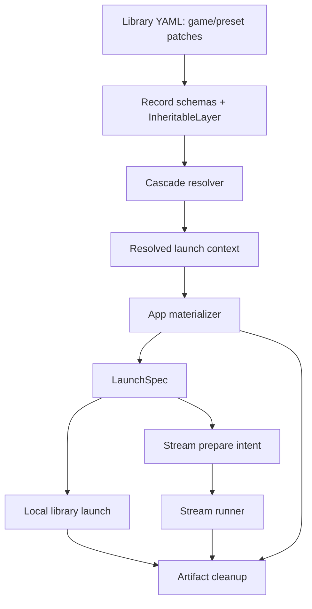
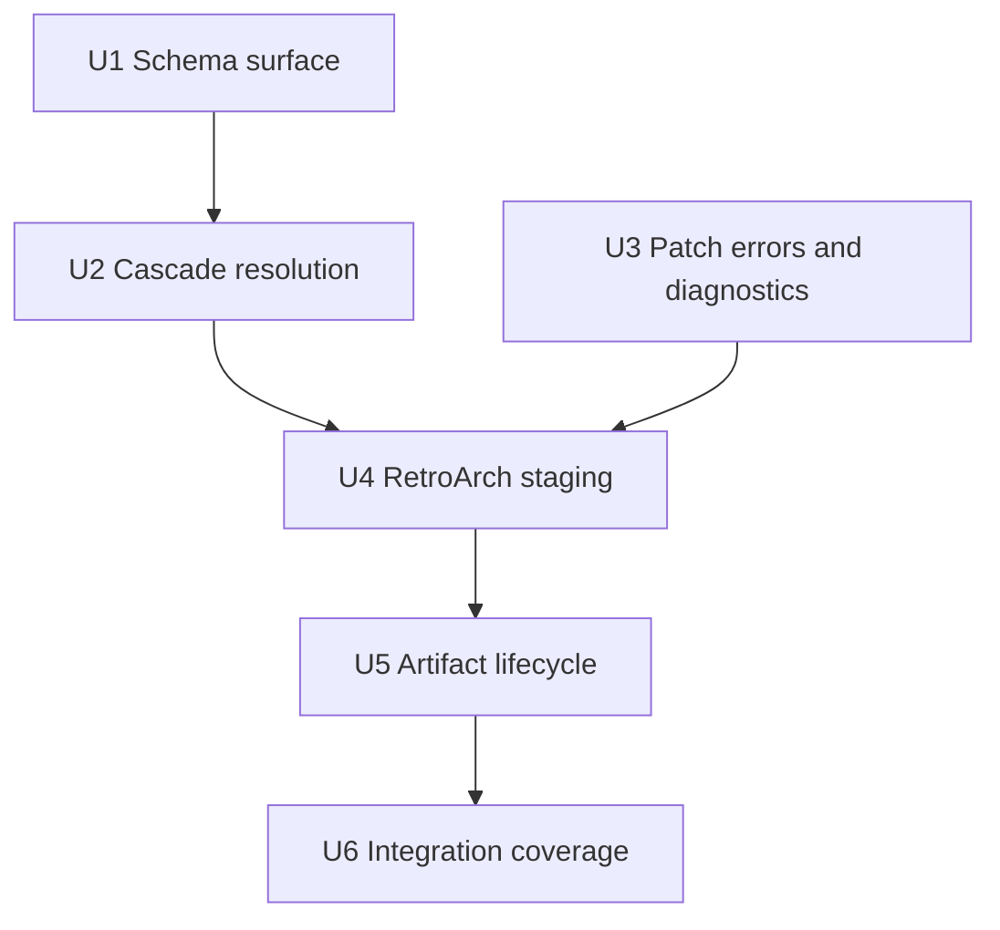

# feat: Add first-class game patches

## Summary

Add patches as a first-class inherited launch resource in Korri’s library config, following the existing cascade/materialization pipeline rather than introducing a parallel patch subsystem. The implementation will resolve ordered patch lists across games and presets, stage RetroArch-compatible launch artifacts, preserve stable save/state identity, and carry artifact cleanup/diagnostics through local and stream launch paths.

---

## Problem Frame

The origin requirements define the product problem: patch launches currently leak emulator-specific conventions into library entries, especially for ROM-hack/profile variants (see origin: `docs/brainstorms/2026-06-03-001-first-class-game-patches-requirements.md`). Planning needs to translate that product scope into the existing ProseQL library, cascade resolver, app materializer, and launch-intent lifecycle without inventing a broader patch catalog.

---

## Requirements

- R1. Games and presets can declare ordered patch files as first-class launch resources.
- R2. Patch entries accept generic file paths and infer format from file extension.
- R3. Existing presets remain the v1 profile/variant mechanism; no separate profile concept is introduced.
- R4. Patch declarations compose through the existing inheritance model: less-specific contributions before more-specific contributions, with `inherit: false` truncating inherited contributions.
- R5. Korri stages ordered patch launches so config authors do not encode RetroArch-style multi-patch filename conventions.
- R6. Staging is launch-scoped and cleaned up after terminal launch/session outcomes.
- R7. Staged patched launches preserve stable save/state identity for the base game/content, shared across presets for that game.
- R8. Source ROM/content files are never modified by Korri.
- R9. Patch resolution failures are visible as launch/config diagnostics rather than silent unpatched fallback.
- R10. Unsupported patch file extensions fail clearly before launch.
- R11. v1 proves the generic patch model through RetroArch-compatible softpatch formats.

**Origin actors:** A1 Config author, A2 Player, A3 Korri launch pipeline, A4 Emulator/app integration
**Origin flows:** F1 Game-level patch launch, F2 Preset patch variant launch, F3 End a staged patched launch
**Origin acceptance examples:** AE1 game with two patches, AE2 base + preset patch ordering with shared base-game save identity, AE3 `inherit: false`, AE4 cleanup after exit, AE5 missing/unsupported patch diagnostics

---

## Scope Boundaries

- No top-level reusable patch catalog in v1.
- No UI for browsing patch catalogs, creating patch sets, or converting patch sets into separate game entries.
- No automatic patch download, discovery, validation against remote sources, or patch metadata scraping.
- No hardpatching or durable modification of source ROM/content files.
- No requirement to model “patch creates a new game” identity in v1.
- No broad emulator-specific patch authoring surface beyond a generic ordered patch-list model.
- Relative patch paths are deferred; v1 patch paths are absolute so config authors do not inherit an ambiguous path-resolution root.
- Per-field inheritance controls are deferred; v1 uses the existing `inherit: false` truncation semantics, which clear all less-specific inherited launch fields, not only patches.

### Deferred to Follow-Up Work

- Patch catalog and UI flows: future product iteration after launch-time patch semantics are proven.
- Relative path resolution: future config usability improvement once the library source can provide a clear source-file or patch-root context.
- Additional emulator integrations beyond RetroArch: add after the generic field and materialization seam are stable.
- Device-side smoke for real RetroArch logs: useful operational proof, but not required for the initial TypeScript implementation plan.
- Existing RetroArch save migration: v1 may start patched launches in a new Korri-managed save/state location; importing or linking pre-existing RetroArch saves/states is deferred.

---

## Context & Research

### Relevant Code and Patterns

- `product/platform/library/config/inheritable-fields.ts` is the shared whitelist for cascade-folded behavior fields. `argsAppend` is the closest existing list-concat pattern to mirror.
- `product/platform/library/config/records/game.ts` and `product/platform/library/config/records/preset.ts` define game identity vs. variant behavior. Presets intentionally cannot set `contentPath`, so patch support must be behavioral rather than identity-changing.
- `product/platform/library/config/cascade-resolver.ts` owns the global → user → system → launcher → game → preset → override fold and the current `inherit: false` truncation behavior.
- `product/platform/library/config/resolved-launch-context.ts` is the boundary between resolved launch policy and later app-specific materialization/substitution.
- `product/platform/library/config/app-materializer.ts` already creates per-launch artifact directories, writes app configs, evicts stale artifacts, and exposes `cleanupLaunchArtifacts`.
- `product/platform/library/proseql/library-repository.ts`, `product/platform/library/library-source.ts`, and `product/platform/library/library-services.ts` are the seams that carry resolved launch output to local and stream launch callers.
- `product/services/device/game-stream-launch-intent.ts` and `product/services/device/game-stream-runner.ts` own stream-prepare intent persistence and source-machine process lifecycle.
- `product/apps/portal/api/library/launch.rpc-handler.ts`, `product/apps/portal/api/stream/prepare.rpc-handler.ts`, and `product/apps/cli/stream-launch.ts` are the user-facing launch/prepare surfaces where patch failures and artifacts must not disappear.

### Institutional Learnings

- `docs/solutions/design-patterns/explicit-cascade-folded-policy-over-incidental-signal-heuristics-2026-05-27.md`: make launch intent explicit in cascade-folded policy; do not infer behavior from argv/filesystem conventions at wrapper time.
- `docs/solutions/runtime-errors/retroarch-bare-passthru-wrapper-injects-l-coredir-2026-05-27.md`: RetroArch argv must remain explicit and unambiguous; avoid duplicate wrapper-injected flags.
- `docs/solutions/runtime-errors/retroarch-png-extension-routes-to-image-display-core-2026-05-27.md`: staged content filename/extension is part of the RetroArch contract; preserve content extension expectations when staging.
- `docs/solutions/best-practices/temporary-rocknix-sidecar-media-instead-of-es-gamelist-edits-2026-05-03.md`: temporary Korri-owned artifacts should live outside ROM/user-managed directories and be deletion-oriented.
- `docs/solutions/architecture-patterns/boot-scoped-control-plane-with-session-scoped-runner-2026-05-19.md`: runtime artifacts consumed by a session process need session-scoped lifetime, not request-scoped cleanup.

### External References

- Libretro softpatching docs: RetroArch supports IPS/BPS/UPS softpatching in the active packaged build, with documented multi-patch sidecars such as `.ips`, `.ips1`, `.ips2`.
- RetroArch 1.9.2 release notes: multi-softpatching applies numbered follow-up files in order and can mix supported patch formats by indexed extension suffix.
- RetroArch manpage/help: explicit CLI patch flags exist, but the plan avoids depending on repeated flags and instead stages sidecars around the content path.

---

## Key Technical Decisions

- Extend the existing cascade instead of adding a patch-specific resolver: patch lists are launch behavior, so they belong beside existing inherited fields such as `argsAppend`, `env`, and `gamescope`.
- Use ordered list concatenation: declaration order is preserved within a layer, and layers append in cascade order from least-specific to most-specific.
- Keep v1 patch paths absolute: this avoids inventing a source-file-relative path model that ProseQL records do not currently expose through the resolver.
- Stage RetroArch patches as sidecars, not CLI patch flags: this supports multiple patches without duplicate patch flags and hides RetroArch’s indexed naming convention from config authors.
- Support `.ips`, `.bps`, and `.ups` in v1 with case-insensitive extension inference; fail `.xdelta` clearly until RetroArch packaging enables XDelta support.
- Do not impose a Korri-side patch-count limit or warning in v1; if a resolved list exceeds RetroArch’s indexed sidecar search behavior, Korri leaves the final application behavior to RetroArch.
- Symlink staged content and patch files rather than copying, hardlinking, or hardpatching: this keeps source ROMs unmodified and makes cleanup cheap. v1 is symlink-only; symlink creation/following failures are visible materialization errors rather than falling back to hardlinks or copies.
- Inject stable RetroArch save/state targets when patches are staged: save and savestate identity use a frozen v1 path contract derived from `system` and `contentPath`, not the temporary staged content path or selected preset. The content component must be bounded with a readable basename prefix plus hash so long ROM paths do not exceed filesystem component limits.
- Carry artifact metadata through launch surfaces: local launch and stream runner need enough structured artifact information to clean up after terminal outcomes.
- Default the launch-artifacts root from `korriCachePath(env, "launch-artifacts")` when `KORRI_LAUNCH_ARTIFACTS_DIR` is unset, so patched launches work in server deployments that already provide `XDG_CACHE_HOME`.
- Treat patch validation failures as hard launch/config failures: missing paths, unsupported extensions, and patch declarations on unsupported app integrations should stop launch preparation rather than silently launching unpatched content.
- Avoid extracting a generic patch-staging module in v1 unless the implementation needs it for clarity; RetroArch is the only active materialized consumer, and broader abstraction should wait for a second integration.

---

## Open Questions

### Resolved During Planning

- Multi-patch staging model: v1 stages RetroArch-compatible sidecars around a staged content path; it does not pre-apply patches into a copied ROM.
- Supported v1 path contract: patch paths must be absolute.
- `inherit: false` semantics: use existing whole-layer truncation; do not introduce patch-only inheritance controls.
- Diagnostics posture: patch validation errors fail launch/prepare with visible config diagnostics; they are not warnings that allow unpatched fallback. Patch-count overflow is an explicit exception in v1: Korri does not validate or warn on long patch chains and lets RetroArch decide what applies.
- Stable save/state identity formula: patched RetroArch launches use a frozen v1 path pattern under the Korri data/state roots: `retroarch/v1/<encoded-system>/<encoded-basename-prefix>--<sha256-hex>`. `encoded-system` and `encoded-basename-prefix` use percent-encoding equivalent to `encodeURIComponent`; the basename prefix is derived from the declared content basename and truncated to a bounded length before appending the hash. The SHA-256 input is `system + "\0" + declared contentPath` exactly as configured, not `realpath(contentPath)`. Saves use the Korri data root; savestates use the Korri state root. Selected presets do not participate in this v1 identity, so presets for the same base game/content intentionally share saves and savestates. This formula is part of the v1 compatibility contract and must not use slash replacement alone or an unbounded encoded content path.

### Deferred to Implementation

- Exact naming helper shape: determine the simplest helper boundaries while adding tests against the documented `.ips`, `.ips1`, `.ups2` sidecar convention.
- XDelta support: defer to follow-up packaging work. The active `retroarch-bare` build exposes IPS/BPS/UPS but not `--xdelta`; enabling XDelta likely requires a Nix packaging override with `HAVE_XDELTA=1` and liblzma/xz available.
- Symlink fallback policy: v1 is symlink-only. Hardlink/copy fallback is deferred; if symlink staging or target-device validation fails, the launch fails clearly with a materialization diagnostic.

---

## High-Level Technical Design

> *This illustrates the intended approach and is directional guidance for review, not implementation specification. The implementing agent should treat it as context, not code to reproduce.*

Patch declarations enter as ordinary layer-bearing config, resolve into the same context as other launch policy, and are consumed by app materialization before placeholder substitution produces the final launch spec. Artifact metadata rides alongside the spec so cleanup happens at the lifecycle owner rather than at request time.

---

## Implementation Units

### U1. Add patch declarations to layer-bearing config

**Goal:** Make ordered patch paths a valid persisted config field on every layer that can currently contribute launch behavior.

**Requirements:** R1, R2, R3, R11

**Dependencies:** None

**Files:**
- Modify: `product/platform/library/config/inheritable-fields.ts`
- Modify: `product/platform/library/config/records/global.ts`
- Modify: `product/platform/library/config/records/user.ts`
- Modify: `product/platform/library/config/records/system.ts`
- Modify: `product/platform/library/config/records/launcher.ts`
- Modify: `product/platform/library/config/records/game.ts`
- Modify: `product/platform/library/config/records/preset.ts`
- Modify: `product/platform/library/config/ephemeral-override.ts`
- Test: `product/platform/library/config/inheritable-fields.test.ts`
- Test: `product/platform/library/config/records/game.test.ts`
- Test: `product/platform/library/config/records/preset.test.ts`

**Approach:**
- Add `patches` as an optional list field to the inherited launch-behavior whitelist.
- Inline the field in every layer-bearing schema, matching the existing strict-mode pattern used for `argsAppend`.
- Do not add patch identity fields to presets; game identity remains `system` + `contentPath`.
- Treat patch paths as strings at schema time. Existence and supported extension checks belong to launch materialization so games can still be listed even if a launch-time path is broken.

**Execution note:** Add schema tests first so every layer-bearing decode surface is updated atomically.

**Patterns to follow:**
- `argsAppend` in `product/platform/library/config/inheritable-fields.ts`
- Strict-mode decode tests in `product/platform/library/config/records/game.test.ts` and `product/platform/library/config/records/preset.test.ts`

**Test scenarios:**
- Happy path: decoding a game payload with `patches` preserves declaration order.
- Happy path: decoding a preset payload with `patches` preserves declaration order.
- Happy path: decoding a by-launcher contribution with `patches` succeeds.
- Edge case: decoding a game/preset without `patches` remains unchanged.
- Error path: unknown sibling keys still fail strict decode after `patches` is added.

**Verification:**
- Config payload schemas accept `patches` only where launch behavior fields are allowed.
- Existing strict decode behavior remains intact.

---

### U2. Fold patches through the launch cascade

**Goal:** Resolve patch lists across global/user/system/launcher/game/preset/override layers with deterministic ordering and existing `inherit: false` semantics.

**Requirements:** R1, R3, R4, AE2, AE3

**Dependencies:** U1

**Files:**
- Modify: `product/platform/library/config/cascade-resolver.ts`
- Modify: `product/platform/library/config/resolved-launch-context.ts`
- Test: `product/platform/library/config/cascade-resolver.test.ts`

**Approach:**
- Add patches to the internal inherited-view model and every layer extractor.
- Fold patches using list concatenation, matching `argsAppend` semantics: declaration order within a layer, cascade order across layers.
- Allow `byLauncher` entries to contribute patches automatically because they already carry inherited launch behavior.
- Carry enough base game identity into the resolved context for materialization to derive stable save/state paths from `system` + `contentPath`; the selected preset still affects patch ordering but not save/state identity in v1.
- Keep `inherit: false` as whole-layer truncation and document that it affects all inherited fields, including patches.

**Execution note:** Implement behavior test-first in the pure cascade test suite.

**Patterns to follow:**
- `argsAppend` fold and `mergeByLauncher` behavior in `product/platform/library/config/cascade-resolver.ts`
- Resolved context schema additions in `product/platform/library/config/resolved-launch-context.ts`

**Test scenarios:**
- Covers AE2. Happy path: game patches resolve before selected preset patches.
- Covers AE3. Edge case: selected preset with `inherit: false` truncates less-specific patch contributions.
- Happy path: global/system/game/preset patch lists append in least-to-most-specific order.
- Happy path: matching `byLauncher` patches are included when the resolved launcher matches.
- Edge case: non-matching `byLauncher` patches are ignored.
- Edge case: no declared patches leaves the resolved context without a patch list rather than inventing an empty list.
- Edge case: selected preset identity is present in resolved context only when a preset was selected.

**Verification:**
- Resolved launch context carries exactly the ordered patch list required by the origin requirements.
- No launch-spec composition behavior changes for games without patches.

---

### U3. Add typed patch validation failures and user-facing diagnostics

**Goal:** Define the typed patch failure vocabulary and library-source message mapping that downstream launch surfaces can propagate.

**Requirements:** R2, R9, R10, R11, AE5

**Dependencies:** U1

**Files:**
- Modify: `product/platform/library/config/errors.ts`
- Modify: `product/platform/library/library-source-layer-live.ts`
- Test: `product/platform/library/library-source-layer-live.test.ts`

**Approach:**
- Add typed resolution/materialization errors for missing patch files, unreadable/non-regular patch files, unsupported patch extensions, and patch declarations on unsupported app integrations. Extension inference normalizes the final suffix to lowercase before checking support.
- Map these typed errors to config-facing messages at the library source seam.
- Leave local launch, stream prepare, and CLI surface wiring to U5/U6 so this unit stays focused on the shared error vocabulary.
- Do not make patch failures diagnostics-only warnings. If a patch cannot be staged, launching unpatched content would violate the player’s selected variant.

**Execution note:** Start with tests that assert missing and unsupported patches do not silently fall through to an unpatched spec.

**Patterns to follow:**
- Existing `AppMaterializationFailed` and cascade error message mapping in `product/platform/library/config/errors.ts` and `product/platform/library/library-source-layer-live.ts`

**Test scenarios:**
- Covers AE5. Error path: missing patch path maps to a patch-specific library configuration message.
- Covers AE5. Error path: unsupported extension maps to a patch-specific library configuration message.
- Happy path: uppercase or mixed-case `.IPS`, `.BPS`, and `.UPS` source patch extensions are accepted.
- Error path: unreadable paths, directories, special files, and broken symlinks map to patch-specific library configuration messages.
- Happy path: symlinks that resolve to readable regular patch files are accepted.
- Error path: patches on an unsupported app integration map to a patch-specific library configuration message.
- Edge case: unrelated cascade/materialization errors keep their existing messages.

**Verification:**
- Shared patch errors have typed tags and library-source messages ready for U4/U5/U6 to propagate.
- No surface silently falls back to unpatched content once downstream units wire the errors through.

---

### U4. Stage RetroArch softpatch artifacts and stable save/state identity

**Goal:** Convert resolved patch lists into RetroArch-compatible staged launch artifacts while keeping source content unmodified and progress durable.

**Requirements:** R5, R7, R8, R11, AE1, AE2, AE4

**Dependencies:** U2, U3

**Files:**
- Modify: `product/platform/library/config/app-materializer.ts`
- Test: `product/platform/library/config/app-materializer.test.ts`

**Approach:**
- Treat RetroArch as the first materialized app integration for `patches`.
- When patches exist, require a launch artifact root, but resolve it from `KORRI_LAUNCH_ARTIFACTS_DIR` first and `korriCachePath(env, "launch-artifacts")` second. Use the existing XDG path helper rather than hard-coding `/tmp` or ROM-adjacent paths.
- Validate patched-launch content and all patch paths, readability, regular-file shape, and extensions before creating the per-launch artifact directory, so broken configs do not accumulate empty or partial artifact trees. Allow symlinks that resolve to readable regular files; reject directories, special files, broken symlinks, and unreadable files. Content validation is patched-launch-only so existing unpatched launch behavior stays unchanged.
- If staging fails after the per-launch artifact directory is created, clean that partial artifact root immediately rather than waiting for stale eviction.
- Stage a content symlink using the original content basename/extension, then create patch sidecar symlinks with the same content stem and RetroArch’s indexed extension suffix convention. Define the content stem as the basename with only the final extension suffix removed; extension-less content should fail clearly unless implementation proves RetroArch can softpatch it safely. Do not fallback to hardlinks or copies in v1.
- Preserve config declaration order when assigning sidecar indices. The index is global across the resolved patch list: the first patch uses the bare canonical lowercase extension, and patch at position N uses the same lowercase extension plus decimal N, regardless of source extension casing or format. For example, an IPS/BPS/UPS chain stages as `.ips`, `.bps1`, `.ups2`.
- Inject stable RetroArch save and savestate targets when a patched launch is staged. Use the frozen v1 identity formula from the Open Questions resolution: `retroarch/v1/<encoded-system>/<encoded-basename-prefix>--<sha256-hex>`, with percent-encoded readable components, a bounded basename prefix, SHA-256 over `system + "\0" + declared contentPath`, and no preset segment.
- Keep stable save/state roots outside the launch artifact root so artifact cleanup cannot delete progress, and treat existing unpatched save/state migration as a deferred follow-up rather than implicit behavior.
- Treat shared savestates across presets as an accepted v1 trade-off: continuity wins for cosmetic/QOL patch presets, while incompatible patch chains may need future save/state isolation configuration.

**Execution note:** Implement new materializer behavior test-first using real temporary files, matching the existing `withRoot` style.

**Patterns to follow:**
- Artifact directory creation, stale eviction, atomic config write, and cleanup in `product/platform/library/config/app-materializer.ts`
- XDG helpers in `product/platform/config/xdg-paths.ts`; the artifact-root default should be exactly `korriCachePath(env, "launch-artifacts")`, with `KORRI_LAUNCH_ARTIFACTS_DIR` remaining an override.

**Test scenarios:**
- Covers AE1. Happy path: a game with two IPS patches stages content plus `.ips` and `.ips1` sidecars in declaration order.
- Happy path: a mixed supported-format chain stages indexed sidecars in the order declared.
- Happy path: uppercase or mixed-case source patch extensions stage as canonical lowercase sidecars.
- Covers AE1 / AE4. Happy path: staged content and patches are symlinks to source files.
- Happy path: with `KORRI_LAUNCH_ARTIFACTS_DIR` unset and XDG cache configured, patched materialization creates artifacts under `korriCachePath(env, "launch-artifacts")`.
- Override path: when `KORRI_LAUNCH_ARTIFACTS_DIR` is set, it still wins over the XDG-cache default.
- Covers AE2. Happy path: selected presets contribute ordered patches while save/state targets remain shared for the same base `system` + `contentPath`.
- Covers AE2. Edge case: different selected presets for the same base game resolve to the same stable save/state identity even when their patch lists differ.
- Edge case: very long content paths still produce bounded save/state path components via basename-prefix plus SHA-256 identity.
- Edge case: if declared `contentPath` is a symlink, the save/state identity uses the declared path string, not the resolved target path.
- Covers AE4. Integration: cleanup removes staged artifacts but does not remove stable save/state directories.
- Data safety: repeated launch-cleanup cycles preserve a marker file in the stable save/state directory across every artifact cleanup.
- Edge case: multi-dot content basenames stage sidecars using only the final suffix as the content extension boundary.
- Error path: extension-less content or unsupported patch extensions fail clearly if they cannot be represented by RetroArch’s softpatch sidecar contract.
- Error path: missing, unreadable, directory, special-file, or broken-symlink content paths fail before the materializer creates a new artifact directory, but only when patches are present.
- Error path: a symlink/config-write failure after artifact directory creation removes the partial artifact root immediately.
- Error path: symlink creation failures fail clearly; v1 does not attempt hardlink or copy fallback.
- Error path: an IPS/BPS/UPS mixed-format chain stages as a single globally indexed sequence, not per-format counters.
- Error path: `.xdelta` fails clearly in v1 with a message that XDelta requires future RetroArch packaging support.
- Regression: equivalent content-path validation is not added to unpatched launches.
- Error path: missing patch file fails before the materializer creates a new artifact directory.
- Error path: directories, special files, broken symlinks, and unreadable patch files fail before the materializer creates a new artifact directory.
- Happy path: symlinked patch files that resolve to readable regular files stage successfully.
- Error path: unsupported extension fails before the materializer creates a new artifact directory.

**Verification:**
- The final launch spec points RetroArch at staged content when patches exist.
- Generated RetroArch config/argv contains stable save/state targets for patched launches.
- Source ROM and source patch files are never modified.

---

### U5. Carry artifact lifecycle through local and stream launches

**Goal:** Ensure staged artifact directories live long enough for the launched process and are cleaned up after terminal outcomes in local and stream paths.

**Requirements:** R6, R7, AE4

**Dependencies:** U4

**Files:**
- Modify: `product/platform/library/library-source.ts`
- Modify: `product/platform/library/library-services.ts`
- Modify: `product/platform/library/proseql/proseql-library-source.ts`
- Modify: `product/platform/library/proseql/library-repository.ts`
- Modify: `product/services/device/game-stream-launch-intent.ts`
- Modify: `product/services/device/game-stream-runner.ts`
- Modify: `product/apps/portal/api/library/launch.rpc-handler.ts`
- Modify: `product/apps/portal/api/stream/prepare.rpc-handler.ts`
- Modify: `product/apps/portal/api/source/list.rpc-handler.ts`
- Modify: `product/apps/cli/stream-launch.ts`
- Modify: `product/apps/cli/source-aware-play.ts`
- Modify: `product/platform/react/library/library-atoms.ts`
- Test: `product/services/device/game-stream-launch-intent.test.ts`
- Test: `product/services/device/game-stream-runner.test.ts`
- Test: `product/apps/portal/api/library/launch.rpc-handler.test.ts`
- Test: `product/apps/portal/api/stream/prepare.rpc-handler.test.ts`
- Test: `product/apps/cli/stream-launch.test.ts`

**Approach:**
- Add optional artifact metadata to the resolved launch surfaces rather than burying cleanup information in argv.
- Preserve artifact metadata when adapting repository output through the plain and Effect library-source seams.
- Migrate launch-capable paths that currently call spec-only `launchSpecFor` to `resolveLaunchForGame`, so patched launches do not drop cleanup metadata.
- Add or reuse a non-materializing launch-capability check for catalog/list streamability surfaces. Listing must not stage patch artifacts or stat/read patch files just to decide whether a game can launch or stream; missing/unreadable patch diagnostics belong to launch/prepare.
- Keep `launchSpecFor` as a back-compat/spec-only helper only where it cannot create launch artifacts, or route it through the non-materializing capability path for list-style callers.
- Include artifact metadata in stream launch intents so the source-machine runner owns cleanup after the emulator/session reaches a terminal outcome.
- Constrain artifact cleanup to the managed launch-artifacts root. Cleanup must refuse or no-op for an `artifacts.root` outside the resolved root from `KORRI_LAUNCH_ARTIFACTS_DIR`/`korriCachePath(env, "launch-artifacts")`, so serialized metadata never becomes arbitrary recursive-delete authority.
- In local launch, cover all cleanup points explicitly: foreground preflight rejection after materialization, spawn throws after materialization, child exits non-zero, child exits successfully, and stop-request mid-run outcomes.
- In stream prepare, clean newly staged artifacts if intent enqueue fails after successful launch resolution; the stream runner never sees that failed intent, so prepare owns this cleanup path.
- In stream runner, clean artifacts after intent completion or quarantine. Do not clean artifacts when an intent is requeued and still points at the staged path.
- Keep stale eviction as a safety net, not the primary cleanup mechanism.
- Preserve an invariant that artifact stale retention remains longer than launch-intent max age, so a retryable intent cannot outlive its staged artifact under normal cleanup policy.
- Decode absent artifact metadata as backward-compatible no-cleanup behavior; decode present metadata as optional cleanup data rather than part of the executable command contract.

**Execution note:** Add lifecycle tests around requeue vs completion before wiring cleanup into the runner.

**Patterns to follow:**
- `cleanupLaunchArtifacts` in `product/platform/library/config/app-materializer.ts`
- Intent claim/complete/requeue/quarantine lifecycle in `product/services/device/game-stream-launch-intent.ts`
- Stream runner terminal-state handling in `product/services/device/game-stream-runner.ts`
- Foreground launch owner lifecycle in `product/apps/portal/api/library/local-foreground-launch-adapter.ts`

**Test scenarios:**
- Covers AE4. Integration: local launch cleanup runs after a launched managed session completes.
- Covers AE4. Error path: local preflight rejection after materialization cleans staged artifacts.
- Covers AE4. Error path: local spawn failure after materialization cleans staged artifacts.
- Error path: local stop-request mid-run cleans staged artifacts after terminal classification.
- Integration: launch-capable legacy paths such as source-aware local play and React library launch use `resolveLaunchForGame` or an equivalent rich output before launching patched content.
- Integration: `app.source.list`/streamability checks for patched games do not create launch artifact directories and do not require patch files to exist/read at list time.
- Regression: `launchSpecFor` remains usable for spec-only/back-compat callers only when it cannot create orphaned artifacts; launch and list paths use richer or non-materializing APIs as appropriate.
- Integration: stream intent encoding/decoding preserves artifact metadata while old/no-artifact intents still decode.
- Error path: stream prepare enqueue failure cleans artifacts staged during resolution.
- Integration: stream runner removes artifacts after successful launch completion.
- Error path: stream runner removes artifacts after quarantine or terminal failure that will not be retried.
- Edge case: stream runner does not remove artifacts when it requeues an intent that still references staged content.
- Edge case: if an artifact root is externally removed before cleanup, cleanup is a no-op and the launch failure remains diagnostic rather than crashing cleanup.
- Edge case: artifact metadata with a root outside the managed launch-artifacts root is not recursively deleted; cleanup reports/no-ops safely.
- Edge case: stale eviction retention remains longer than launch intent max age.
- Edge case: stale eviction still removes old artifact directories if lifecycle cleanup never ran.

**Verification:**
- Staged artifacts are not request-scoped; they survive until the process/session lifecycle reaches a terminal state.
- Artifact cleanup does not break retry/requeue behavior.
- Artifact cleanup cannot delete outside the managed launch-artifacts root.

---

### U6. Add end-to-end repository and launch-surface coverage

**Goal:** Prove the feature works across persisted ProseQL config, launch resolution, materialization, and user-facing prepare/launch flows.

**Requirements:** R1, R2, R4, R5, R6, R7, R8, R9, R10, R11, AE1, AE2, AE3, AE4, AE5

**Dependencies:** U1, U2, U3, U4, U5

**Files:**
- Modify: `product/platform/library/proseql/library-repository.test.ts`
- Modify: `product/platform/library/proseql/proseql-library-source.test.ts`
- Modify: `product/apps/portal/api/library/launch.rpc-handler.test.ts`
- Modify: `product/apps/portal/api/stream/prepare.rpc-handler.test.ts`
- Modify: `product/apps/cli/stream-launch.test.ts`
- Modify: `tools/testing/library/with-temp-proseql-library.ts`

**Approach:**
- Add ProseQL fixture support for games/presets with patches.
- Test full resolve output for game-level patches, preset-appended patches, and `inherit: false` truncation.
- Verify final launch specs reference staged content when patches exist and original content when patches are absent.
- Verify patch failures are visible through the user-facing launch/prepare surfaces.
- Keep this as behavioral coverage rather than a demo or on-device smoke; real device validation can follow after implementation.

**Execution note:** Use characterization-style assertions for existing no-patch launches before adding patched-launch assertions, so regressions in current launch behavior are easy to spot.

**Patterns to follow:**
- `withLaunchArtifactsRoot` pattern in `product/platform/library/proseql/library-repository.test.ts`
- Temporary library helpers in `tools/testing/library/with-temp-proseql-library.ts`

**Test scenarios:**
- Covers AE1. Integration: persisted game patch list resolves to a staged multi-patch RetroArch launch.
- Covers AE2. Integration: persisted game + selected preset resolves to ordered base + preset patches and stable base-game save/state identity shared across presets.
- Covers AE3. Integration: persisted preset with `inherit: false` suppresses game-level patches.
- Covers AE5. Error path: persisted unsupported patch extension fails launch resolution clearly.
- Regression: persisted no-patch RetroArch game produces the same launch spec shape as before.
- Regression: non-RetroArch/generic-process launch without patches is unaffected.

**Verification:**
- The full library → launch pipeline satisfies all origin acceptance examples in unit/integration tests.
- Catalog/listing flows prove patched games can be reported without materializing launch artifacts or validating patch file paths.
- Test helpers can seed patch-bearing fixtures without bypassing the same decode paths used in production.

---

## System-Wide Impact

- **Interaction graph:** ProseQL decode, cascade resolution, app materialization, local launch RPC, stream prepare, CLI prepare, launch intents, and stream runner lifecycle all touch this feature.
- **Error propagation:** Patch validation failures originate during materialization and must remain typed/config-facing through library-source adapters and RPC/CLI failure wrappers.
- **State lifecycle risks:** Temporary artifact directories must not be deleted before a spawned process reads staged content, and stable save/state directories must never live under the temporary artifact root.
- **API surface parity:** Both plain `LibrarySource` and Effect `LibrarySourceService` need to expose optional artifact metadata; stream intent decode must remain backward-compatible for intents without artifacts.
- **Integration coverage:** Unit tests on schema/cascade/materializer are not enough; repository and launch-surface integration tests must prove patched launches survive through final spec generation and intent storage.
- **Unchanged invariants:** Game identity remains `system` + `contentPath`; presets remain behavior layers; source ROMs and patch files are read-only inputs; no UI feature is added in v1.

---

## Risks & Dependencies

| Risk | Mitigation |
|------|------------|
| Temporary staged path becomes save identity and progress is deleted on cleanup | Inject stable save/state targets for patched RetroArch launches, use a frozen bounded collision-safe v1 path formula based on `system` + `contentPath`, and test repeated cleanup cycles. |
| Patched launch fails because no explicit artifacts env var is set | Resolve the artifact root from `KORRI_LAUNCH_ARTIFACTS_DIR` first and `korriCachePath(env, "launch-artifacts")` second; test both paths. |
| Staging failure leaves a partial artifact tree | Clean the per-launch artifact root on any staging failure after directory creation; test symlink/write failure cleanup. |
| Symlink staging fails on a target filesystem/device | v1 fails clearly with a materialization diagnostic; hardlink/copy fallback is deferred. |
| Serialized artifact metadata points outside Korri-owned artifacts | Constrain cleanup to the managed launch-artifacts root and test outside-root metadata as a safe no-op/refusal. |
| Shared savestates are incompatible across some patch presets | Document shared save/state identity as an accepted v1 trade-off and leave per-preset isolation as future configuration if real patch sets need it. |
| Artifact metadata is dropped at an adapter seam | Add artifact metadata to repository, plain source, Effect source, intent, runner, and legacy launch-path migration tests. |
| Catalog listing creates orphaned patch artifacts or becomes flaky on missing patch media | Add a structural, non-materializing capability/streamability check and test that list surfaces do not create launch artifact directories or validate patch file paths. |
| Requeue cleanup deletes staged content needed by a retried stream intent | In runner tests, assert cleanup happens only on completion/quarantine/terminal non-retry paths, and keep artifact stale retention longer than launch-intent max age. |
| RetroArch sidecar naming is mis-staged | Test the documented indexed extension suffix convention and keep external docs linked in the plan. |
| Long patch chains exceed RetroArch’s indexed sidecar search | Accepted v1 limitation: Korri does not warn or fail on patch count and leaves final application behavior to RetroArch. |
| `inherit: false` surprises config authors by clearing more than patches | Document as a v1 limitation and keep per-field inheritance out of scope. |
| Relative paths are assumed by authors but unsupported | Fail absolute-path contract clearly in docs/diagnostics until a path-root model exists. |
| Patch declarations on unsupported app integrations silently do nothing | Add an unsupported-integration error and test generic-process/unsupported integrations before launch. |
| Stream prepare creates artifacts but fails before writing an intent | Add prepare-owned cleanup for enqueue failures because no runner will claim the intent. |
| XDelta requires RetroArch packaging support not present in the active build | Keep `.xdelta` out of v1 supported extensions and capture a follow-up packaging task if XDelta becomes necessary. |

---

## Documentation / Operational Notes

- Update author-facing library config examples when implementation lands, showing game-level patches and preset-contributed patches.
- Add a short note that patch paths are absolute in v1 and that `inherit: false` truncates all inherited launch fields.
- Device validation after implementation should launch a real RetroArch patched game with verbose logs and confirm patches apply exactly once, but that smoke belongs to execution evidence rather than plan scope.

---

## Sources & References

- **Origin document:** [docs/brainstorms/2026-06-03-001-first-class-game-patches-requirements.md](../brainstorms/2026-06-03-001-first-class-game-patches-requirements.md)
- Related code: `product/platform/library/config/inheritable-fields.ts`
- Related code: `product/platform/library/config/cascade-resolver.ts`
- Related code: `product/platform/library/config/app-materializer.ts`
- Related code: `product/services/device/game-stream-launch-intent.ts`
- Related code: `product/services/device/game-stream-runner.ts`
- Related learning: [docs/solutions/design-patterns/explicit-cascade-folded-policy-over-incidental-signal-heuristics-2026-05-27.md](../solutions/design-patterns/explicit-cascade-folded-policy-over-incidental-signal-heuristics-2026-05-27.md)
- Related learning: [docs/solutions/best-practices/temporary-rocknix-sidecar-media-instead-of-es-gamelist-edits-2026-05-03.md](../solutions/best-practices/temporary-rocknix-sidecar-media-instead-of-es-gamelist-edits-2026-05-03.md)
- External docs: [Libretro Softpatching ROMs](https://docs.libretro.com/guides/softpatching/)
- External docs: [RetroArch 1.9.2 release notes](https://www.libretro.com/index.php/retroarch-1-9-2-released/)
