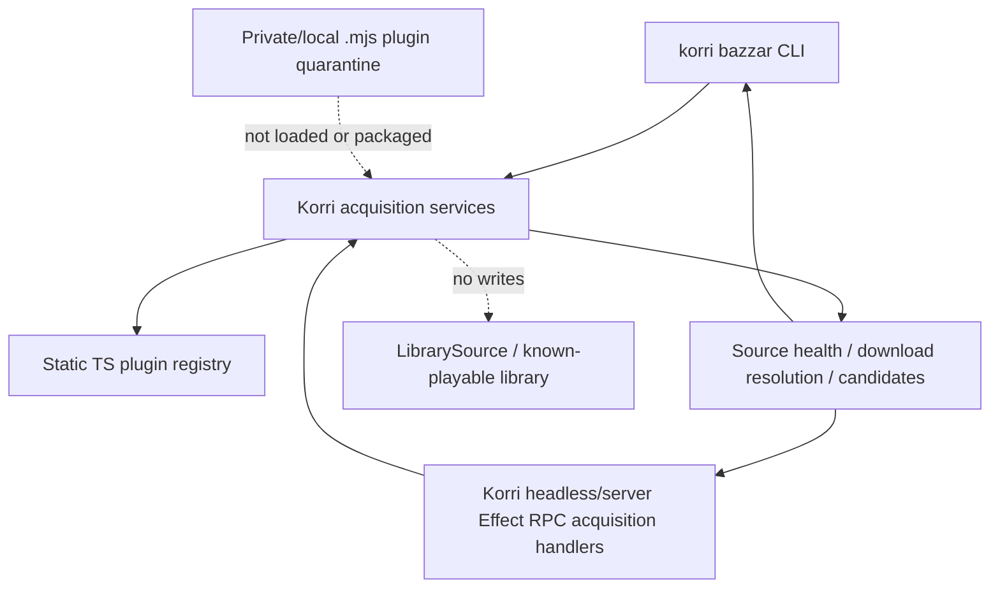

# feat: Migrate Bazzar acquisition into Korri

## Summary

Port Bazzar’s source-acquisition core, TypeScript plugins, CLI command family, and headless/server RPC seam into Korri behind `korri bazzar` and Korri Effect RPC. The Effect-family dependency upgrade lands first as a separate prerequisite PR. The migration then proceeds copy-first, inventories every Bazzar area, quarantines legally sensitive `.mjs` plugins outside Korri, keeps approved TypeScript plugins as platform acquisition internals, and keeps external candidates out of `LibrarySource`.

---

## Problem Frame

The origin requirements changed the earlier Bazzar/Korri boundary from “keep Bazzar separate and wrap it later” to “make source acquisition a Korri capability now.” The implementation risk is not the CLI command group alone; it is importing only the useful acquisition system while excluding Bazzar’s standalone product identity, UI, demo API, and runtime assumptions that depend on the old source tree.

This plan is written for three targets:

- **Korri repo:** this plan’s home and primary implementation target.
- **Bazzar source repo:** referenced as `Bazzar:<path>` for source material to import/adapt/delete.
- **Bazzar plugin quarantine:** referenced as `Bazzar plugin quarantine:<path>` for the private/local preservation checkout that receives legally sensitive `.mjs` plugin files. Korri must not package, load, document, or depend on this checkout.

All paths below are relative to the relevant target repo named by their prefix; unprefixed paths are Korri repo paths.

---

## Requirements

- R1. Classify Bazzar areas as import, adapt, defer, or delete before moving code.
- R2. Avoid wholesale Bazzar import; every Korri import must serve the `korri bazzar` CLI/API subset or acquisition invariants.
- R3. Retire standalone public `bazzar` only after Korri reaches strict CLI compatibility; expose the operator surface through `korri bazzar`.
- R4. Preserve the current command family and CLI compatibility: search, details, plugins, validate-sources, and resolve-download keep command names, important flags, exit behavior, and output shapes as closely as possible. The explicit exception is provider set compatibility: legally quarantined `.mjs` providers are excluded from active Korri results.
- R5. Provide repeatable source-health visibility through `korri bazzar validate-sources`.
- R6. Keep external source candidates distinct from Korri known-playable library records.
- R7. Keep download resolution separate from search/details and classify final artifacts explicitly.
- R8. Preserve stdout/stderr discipline for machine-readable contract commands.
- R9. Do not import Bazzar UI.
- R10. Do not import Bazzar’s tRPC/Fastify demo API; use Korri Effect RPC for API exposure.
- R11. Do not retain standalone package metadata, duplicate tooling, or compatibility shims merely because they exist.
- R12. Do not mask live source failures, credential failures, or source defects with fallback success.
- R13. Move Bazzar `.mjs` plugin files to a private/local quarantine checkout outside Korri because they carry legal/distribution concerns.
- R14. Migrate approved TypeScript acquisition plugins and source-specific helper modules into Korri when inventory classifies them as useful; keep them under `product/platform/acquisition/plugins/*` as platform acquisition internals, not a public platform API.
- R15. Do not load, package, advertise, or depend on quarantined external `.mjs` plugins from Korri.
- R16. Expose all five acquisition operations through Korri’s headless/server RPC/API group only.
- R17. Leave room for later Korri acquisition UI without building it now.
- R18. Defer artifact-to-library import until a later explicit acquisition/import flow.

**Plan-added security and trust requirements**

R19–R28 are plan-time additions from the confidence/security review. They are non-negotiable because migrating acquisition code creates outbound-network, credential, executable-plugin, and API exposure risks that the product brainstorm intentionally left to planning.

- R19. Outbound acquisition URLs must be validated before any request, including plugin-returned URLs used for follow-on requests: only HTTP(S), no embedded credentials, no private/loopback/link-local targets, per-hop redirect re-validation, no scheme downgrade, and bounded redirect depth.
- R20. Credentials, API keys, tokens, account identifiers, and credential-bearing URLs must not appear in logs, contract envelopes, RPC errors, or plugin-sourced payloads.
- R21. Any filesystem path supplied by acquisition output must pass a staging-root containment policy before I/O: reject NUL bytes, absolute paths, traversal, and paths escaping the configured root.
- R22. Acquisition RPCs ship under Korri’s existing local deployment and RPC middleware posture for this slice; the plan must document that posture and verify the new RPCs are behind the same middleware path as existing platform RPCs before broader exposure is considered.
- R23. Every plugin operation output must be validated at the harness boundary against the relevant Effect Schema; invalid output becomes a typed defective-source outcome.
- R24. Any future reconsideration of quarantined `.mjs` plugin loading requires explicit legal review plus a dedicated trust plan covering content addressing or signatures, capability grants, process isolation versus in-process loading, and operator-approved plugin manifests.
- R25. Contract-command stdout must be a single valid JSON line; plugin-sourced strings must not be able to create stdout/log injection or invalid JSON output.
- R26. Caller-supplied source names must be canonicalized and validated against the bounded source registry before they reach logs, file paths, metrics, plugin invocation, or RPC results.
- R27. RPC error messages must expose safe summaries only; internal paths, env var names, OS errors, and full upstream response bodies stay in server logs.
- R28. The migration inventory must record per-source legal/TOS risk, default-enablement recommendation, and credential posture.

**Origin actors:** A1 Korri maintainer/operator, A2 Korri CLI, A3 source acquisition core, A4 Korri headless/server API/RPC surface, A5 future Korri acquisition UI, A6 Korri library, A7 private/local plugin quarantine.

**Origin flows:** F1 migrate Bazzar capability into Korri, F2 run `korri bazzar` commands, F3 call acquisition through Korri RPC, F4 preserve library boundary.

**Origin acceptance examples:** AE1 inventory classification, AE2 command family under `korri bazzar`, AE3 health/credential failure stdout discipline, AE4 non-final resolution does not create library records, AE5 Korri RPC not Bazzar demo API, AE6 `.mjs` plugins outside Korri.

---

## Scope Boundaries

- Do not import Bazzar wholesale.
- Do not keep standalone `bazzar` as a public binary or product surface.
- Do not import Bazzar UI.
- Do not import Bazzar’s tRPC/Fastify demo API.
- Do not load, package, advertise, or depend on external `.mjs` plugins from Korri in this slice.
- Do not build the later acquisition UI.
- Do not build the later artifact-to-library import flow.
- Do not route external candidates or resolved artifacts into `LibrarySource` as known-playable records.
- Do not reorganize unrelated Korri product/platform/theme code.

### Deferred to Follow-Up Work

- Quarantined `.mjs` plugin loading: not supported by this plan. Any future support must first pass explicit legal review and then define the runtime trust, manifest, policy, and directory model for user/external plugins, including content addressing or signature verification, capability grants, process isolation versus in-process loading, and operator-approved manifests.
- Acquisition UI: build after CLI and RPC surfaces prove the migrated acquisition seam.
- Artifact import: define how a resolved artifact becomes a Korri library record only after storage, trust, and runtime rules exist.
- Contract-version rename: decide whether/when `bazzar.source-adapter.v1` becomes a Korri-named contract version after consumers are known.

---

## Context & Research

### Relevant Code and Patterns

- `product/apps/cli/korri-cli.ts` exports `korriCommand` and `runKorriCli(argv)` using Effect CLI and `BunServices.layer`.
- `product/apps/cli/korri-cli.test.ts` exercises CLI routing in-process with `Effect.runPromiseExit(runKorriCli([...]))`.
- `product/apps/cli/package.nix` bundles the CLI as a single Bun output, wraps it as `$out/bin/korri`, and install-checks `--version`.
- `product/apps/cli/source-aware-games.ts` models multi-source results as successful entries plus diagnostics, preserving partial failure information.
- `product/platform/library/library-services.ts` already contains `ContentItem`, `ContentSourceService`, `ContentSources`, `LibrarySource`, and `Launcher`; `LibrarySource` remains known-playable game content.
- `product/platform/library/library-services.test.ts` verifies that `ContentSources` can exist alongside `LibrarySource` without replacing it.
- `product/apps/portal/api/server/rpc-group.ts` and `product/apps/portal/api/server/rpc-server.ts` show the headless/server Effect RPC registration and server composition pattern that acquisition RPCs must use in this slice.
- `product/apps/portal/api/source/list.rpc.ts` and `product/apps/portal/api/source/list.rpc-handler.ts` show domain RPC contracts and handler mapping into platform services; use their shape, but register acquisition only in the server RPC group.
- `tools/testing/standards/product-reorg-boundaries.test.ts` enforces platform/import boundaries and shipped-runtime placement rules.
- Bazzar source files use Effect CLI and Effect v4 beta, not Commander or Effect v3. The migration is version alignment/adaptation rather than a CLI-framework rewrite.
- Bazzar’s green test posture was reported by flow analysis as 584 passing tests across 58 files; the old “58 failures” note should be treated as stale.

### Bazzar Source Material

- `Bazzar:apps/cli/src/bazzar.ts` — current Bazzar root CLI command definitions.
- `Bazzar:apps/cli/src/cli-commands.ts` — search/details/plugins command behavior.
- `Bazzar:apps/cli/src/source-contract-commands.ts` — validate-sources and resolve-download envelope creation.
- `Bazzar:apps/cli/src/source-contract-runner.ts` — machine-readable contract runner and stdout/stderr separation.
- `Bazzar:apps/cli/src/source-contract-services.ts` and `Bazzar:apps/cli/src/plugin-environment.ts` — CLI-side service composition.
- `Bazzar:shared/core/src/cli/output-contract.ts` — contract envelopes, exit categories, serialization, and validation.
- `Bazzar:shared/core/src/plugin-runtime.ts`, `Bazzar:shared/core/src/plugin-loader.ts`, `Bazzar:shared/core/src/plugin-operation-harness.ts`, `Bazzar:shared/core/src/plugin-contract-codecs.ts`, `Bazzar:shared/core/src/source-search.ts`, `Bazzar:shared/core/src/source-details.ts`, `Bazzar:shared/core/src/validation/source-validation.ts`, and `Bazzar:shared/core/src/download-resolution/download-resolution.ts` — acquisition core.
- `Bazzar:shared/core/src/types/*` — source candidate, source health, download resolution, and codec types.
- `Bazzar:shared/core/src/plugins/*.ts` and `Bazzar:shared/core/src/itchio/*` — TypeScript source adapters and source-specific helpers to inventory for Korri migration into `product/platform/acquisition/plugins/*` as platform acquisition internals.
- `Bazzar:shared/core/src/plugins/*.mjs` — legally sensitive plugin files to preserve in the private/local plugin quarantine, not Korri.

### Institutional Learnings

- `docs/solutions/architecture-patterns/korri-product-platform-theme-architecture-2026-06-03.md`: shipped operator CLI code belongs under `product/apps/cli`; shared runtime/platform code must not import product internals.
- `docs/solutions/architecture-patterns/korri-plugin-architecture-2026-06-02.md`: source acquisition maps toward content-source/plugin concepts, but plugins contribute data/actions rather than owning presentation or home-grid slots.
- `docs/research/plugin-architecture/synthesis-2026-05-31.md`: `ContentSource` should exist alongside `LibrarySource`; external candidates should not shortcut into the library model.
- `docs/research/bazzar-source-adapter-download-resolution/learnings.md`: source candidates and resolved artifacts are pre-library lifecycle data; a later import flow must write Korri-owned library data before `LibrarySource` sees content.
- `docs/solutions/design-patterns/explicit-cascade-folded-policy-over-incidental-signal-heuristics-2026-05-27.md`: source health and download resolution should be explicit discriminants, not inferred from incidental URL/format heuristics.

### External References

- No external web research was needed. The work is grounded in existing Korri/Bazzar source and local architecture docs. Implementation may need to check Effect release notes while performing the dependency upgrade, but the planning decision is to upgrade Effect-family packages together.

---

## Key Technical Decisions

- Land the Effect-family upgrade as a separate prerequisite PR: the migration should not start by adapting old and new Effect beta APIs piecemeal; the repo should first align `effect`, `@effect/platform-bun`, `@effect/atom-react`, and any other `@effect/*` dependencies to current latest versions and get green independently.
- Use copy-first migration: copy/adapt Bazzar source into Korri and keep the Bazzar source repo intact until strict `korri bazzar` compatibility and server RPC parity pass; retire/archive standalone Bazzar surfaces only after that gate.
- Split plugin implementation by file type and distribution posture: legally sensitive `.mjs` plugin files leave Korri for a private/local quarantine checkout; approved TypeScript plugins and source-specific helpers migrate with Korri acquisition core.
- Keep TypeScript plugins in `product/platform/acquisition/plugins/*`: for this slice they are platform acquisition internals and may be autoloaded/distributed with Korri, but they are not a stable public platform API.
- Do not load external `.mjs` plugins: the first Korri slice must not solve or ship trust, manifest, runtime directory, or Nix packaging for quarantined `.mjs` plugins.
- Use static first-party acquisition wiring for migrated TypeScript plugins: Korri-owned TypeScript plugins should compile with Korri rather than relying on source-tree-relative dynamic discovery at runtime.
- Preserve strict CLI compatibility, with a provider-set exception: command names, important flags, exit behavior, and output shapes stay as close to Bazzar as possible for all five commands, while quarantined `.mjs` providers are absent from active results.
- Keep the current CLI output split: search/details/plugins remain human/operator commands; validate-sources/resolve-download remain strict contract-envelope commands.
- Add Korri server RPC for all five operations now: the API surface follows Korri’s headless/server Effect RPC group/handler pattern and does not import Bazzar’s tRPC/Fastify demo API or register in the portal/app RPC group in this slice.
- Keep acquisition separate from `LibrarySource`: source candidates and resolution outcomes are acquisition data, not known-playable library records.
- Keep acquisition logging stdout-safe: contract commands need an injectable logging layer or CLI-specific stderr logger so parseable stdout is never contaminated. The platform acquisition core should not import a singleton logger that writes to stdout.
- Treat source access as an untrusted network boundary: URL policy, source-name validation, credential redaction, schema validation, and safe RPC error messages are part of the migration, not optional hardening follow-up.

---

## Open Questions

### Resolved During Planning

- Should the stale Bazzar hardening plan be updated in place? No — create a new migration plan and leave the old plan as historical context.
- Should Bazzar core/CLI be ported now or wrapped externally? Port core/CLI into Korri now.
- Should TypeScript plugins migrate? Yes — approved TypeScript plugins migrate into `product/platform/acquisition/plugins/*` as platform acquisition internals and are eligible for Korri autoloading/distribution.
- Should external plugin loading be solved now? No — legally sensitive `.mjs` plugins move to a private/local quarantine and remain unloaded, unpackaged, and unsupported.
- Should search/details/plugins become strict machine-readable contract commands? No — preserve the current human/operator versus contract command split.
- Should the aligned RPC adapter be migrated now? Yes — expose all five operations through Korri headless/server RPC/API only.
- Should the Effect-family upgrade land with the migration? No — land it first as a separate prerequisite PR.
- Should migration move/delete Bazzar code as it ports? No — use copy-first migration, then retire standalone Bazzar after parity.
- What counts as retirement parity? Strict CLI compatibility for command names, flags, exit behavior, and output shapes, with an explicit provider-set exception for quarantined `.mjs` providers.

### Deferred to Implementation

- Exact Effect latest versions: resolve through package manager during the dependency-upgrade unit, then adapt compile errors intentionally.
- Exact command flag parity: preserve the Bazzar command family, important flags, exit behavior, and output shapes; any intentional incompatibility other than the quarantined-provider-set exception requires explicit review before standalone Bazzar retirement.
- Exact TypeScript plugin registry shape: implementation may choose the smallest static registry that preserves behavior without reopening external plugin loading.
- Exact contract version naming: preserve parseability first; rename contract version only if planned as a deliberate compatibility decision.

---

## Output Structure

    product/platform/protocol/acquisition/
      candidate.ts
      download-resolution.ts
      plugin.ts
      source-health.ts
      schemas.ts
      errors.ts
    product/platform/acquisition/
      acquisition-config.ts
      acquisition-service.ts
      clock.ts
      errors.ts
      logger.ts
      plugin-loader.ts
      plugin-runtime.ts
      source-details.ts
      source-search.ts
      validation/
      download-resolution/
      plugins/
      itchio/
      types/
      utils/
    product/apps/cli/bazzar/
      bazzar-command.ts
      bazzar-cli-commands.ts
      source-contract-commands.ts
      source-contract-runner.ts
      source-contract-services.ts
      acquisition-logging.ts
      bazzar-command.test.ts
      source-contract-commands.test.ts
      source-contract-runner.test.ts
      bazzar-contract-subprocess.test.ts
    product/apps/portal/api/acquisition/
      search.rpc.ts
      search.rpc-handler.ts
      details.rpc.ts
      details.rpc-handler.ts
      plugins.rpc.ts
      plugins.rpc-handler.ts
      validate-sources.rpc.ts
      validate-sources.rpc-handler.ts
      resolve-download.rpc.ts
      resolve-download.rpc-handler.ts
    tools/testing/acquisition/
      acquisition-contract-harness.ts
    Bazzar plugin quarantine:
      coolrom.mjs
      retrostic.mjs
      romhustler.mjs
      steamgriddb.mjs
      wowroms.mjs

This tree is directional. The implementer may adjust module names to fit the migrated Bazzar code, but must preserve the separation between protocol schemas, acquisition core, CLI composition, headless/server RPC handlers, and private/local `.mjs` plugin quarantine.

---

## High-Level Technical Design

> *This illustrates the intended approach and is directional guidance for review, not implementation specification. The implementing agent should treat it as context, not code to reproduce.*

The initial runtime path uses Korri-owned TypeScript acquisition plugins through a static or bundled registry. The `.mjs` plugin quarantine is preservation output only: Korri does not load, package, advertise, or depend on it. Any future loading requires explicit legal review plus a separate trust, manifest, and runtime-directory plan.

---

## Implementation Units

### LLM Agent PR Chunking

Use these as review-sized PR boundaries. Each chunk should be assigned to an implementation agent with the listed scope, tests, and explicit non-goals. Later chunks may build on earlier merged PRs; do not ask one agent to land the full migration in a single branch.

| Chunk | PR theme | Units covered | Agent scope | Must not include | Merge gate |
|------|----------|---------------|-------------|------------------|------------|
| PR-0 | Effect prerequisite | U1 | Upgrade Effect-family packages, regenerate Bun/Nix dependency artifacts, and fix only upgrade-induced compile/test issues. | Bazzar file moves, acquisition modules, CLI/RPC migration. | Whole-repo typecheck, unit tests, lint, and dependency-generation checks pass independently. |
| PR-1 | Inventory and legal quarantine | U2 | Produce the Bazzar migration inventory, copy `.mjs` plugins into the private/local quarantine, and classify TypeScript plugins for Korri migration. | Korri runtime loading of `.mjs`, packaging quarantine files, broad Bazzar imports. | Inventory covers every Bazzar area once; quarantine contains all `.mjs` files; Korri product paths contain no `.mjs`. |
| PR-2 | Acquisition protocol and trust skeleton | U3 | Add protocol schemas, service interfaces, static registry shape, logging seam, safe error types, and URL/path/source-name/credential policy tests with in-memory fixtures. | Live source adapters, CLI command group, RPC registration. | Protocol/service tests and boundary checks pass; no product/app imports from platform acquisition. |
| PR-3 | Core implementation and approved TypeScript plugins | U4 | Copy/adapt Bazzar acquisition core and approved TypeScript plugins into `product/platform/acquisition/*`, using the static registry and trust policies from PR-2. | CLI/RPC public surfaces, `.mjs` loading, library writes. | Real implementation tests pass; active plugin metadata excludes quarantined providers; library boundary remains untouched. |
| PR-4 | `korri bazzar` CLI compatibility | U5 | Wire the CLI command group, preserve strict Bazzar CLI compatibility, and add golden/subprocess tests for all five commands with the provider-set exception. | RPC registration, Nix packaging cleanup beyond what CLI tests require, standalone `bazzar` binary. | CLI parity tests pass for command names, important flags, exit behavior, and output shapes; contract stdout remains one JSON line. |
| PR-5 | Headless/server acquisition RPC | U6 | Add all five acquisition RPC contracts/handlers to the headless/server RPC group and server composition only. | Portal/app RPC registration, UI routes/components, shelling out to CLI. | Server RPC exact-tag and handler tests pass; portal/app RPC group is unchanged for acquisition. |
| PR-6 | Packaging and dependency closure | U7 | Finalize Bun/Nix packaging, production dependency audit, CLI install checks, and server import closure for acquisition. | Standalone Bazzar package/app output, quarantined `.mjs` packaging/loading. | Packaged `korri bazzar --help` and safe contract-command smoke pass; forbidden dependency/package checks pass. |
| PR-7 | Boundary, parity, and retirement gate | U8 | Add final boundary/parity/lifecycle verification and document whether standalone Bazzar can be retired. | New feature behavior, UI, external plugin loading, artifact-to-library import. | Boundary tests, strict CLI compatibility tests, server API parity tests, and inventory traceability pass. |

**Chunking rules:**
- Keep each PR independently green and reviewable; if a chunk grows too large, split within the same dependency order rather than merging adjacent chunks.
- Each agent should start by reading this plan, the requirements doc, and the files named in its chunk before editing.
- Every PR description must state which chunk it implements, which chunks it depends on, and which explicit non-goals were preserved.
- Do not retire standalone Bazzar until PR-7 confirms strict CLI compatibility with the quarantined-provider-set exception.

### U1. Upgrade Effect-family dependencies

**Goal:** Land a separate prerequisite PR that aligns Korri’s Effect runtime packages before imported Bazzar code is compiled or wired.

**Requirements:** R2, R4, R16

**Dependencies:** None

**Files:**
- Modify: `package.json`
- Regenerate: `bun.lock`
- Regenerate: `tools/nix/generated/bun.nix`
- Regenerate: `tools/nix/generated/bun-production-package-names.nix`
- Test: existing Effect-dependent tests under `product/**/*.test.ts` and `tools/**/*.test.ts`

**Approach:**
- Upgrade all Effect-family dependencies in Korri together: `effect`, `@effect/platform-bun`, `@effect/atom-react`, and any other `@effect/*` packages present after dependency resolution.
- Keep this unit independent from Bazzar file moves and land it as its own PR so any repo-wide Effect API breakages are isolated and rollbackable.
- Regenerate Bun/Nix dependency artifacts after the package update; do not hand-edit generated Nix dependency files except through the project’s existing generation path.
- Treat any required Effect API changes in existing Korri code as compatibility fixes for the upgrade, not as an opportunity for unrelated refactors.

**Execution note:** Run this unit before any Bazzar source migration. It is a repo-wide dependency change and should be merged/green as a prerequisite PR before later units add more moving parts.

**Patterns to follow:**
- `package.json` dependency grouping.
- `tools/nix/bun-production-deps.ts` generated dependency pipeline.
- Existing Effect CLI/RPC usage in `product/apps/cli/korri-cli.ts` and `product/apps/portal/api/*`.

**Test scenarios:**
- Integration: Existing Korri CLI help tests still succeed after the Effect upgrade.
- Integration: Existing portal RPC handler tests still compile and pass after the Effect upgrade.
- Regression: Existing `@effect/atom-react` usage in portal/theme tests remains type-safe after the package upgrade.
- Dependency: Generated Bun/Nix dependency files reflect the upgraded Effect packages without adding unrelated dev-only packages to the production set.

**Verification:**
- Existing Korri TypeScript, unit, lint, and dependency-generation checks pass after the upgrade alone, and the prerequisite PR is green before Bazzar migration work begins.
- `just check-bun-deps` confirms generated Nix dependency files are consistent with the updated lockfile.
- New or upgraded production dependencies have a recorded vulnerability/capability audit result before this unit lands.

---

### U2. Inventory Bazzar and extract `.mjs` plugins

**Goal:** Create an explicit import/adapt/defer/delete record and move Bazzar `.mjs` plugin files to the private/local plugin quarantine because they carry legal/distribution concerns.

**Requirements:** R1, R2, R9, R10, R11, R13, R15, R24, R28; covers AE1 and AE6

**Dependencies:** None

**Files:**
- Create: `docs/research/bazzar-migration-inventory.md`
- Create: `Bazzar plugin quarantine:coolrom.mjs`
- Create: `Bazzar plugin quarantine:retrostic.mjs`
- Create: `Bazzar plugin quarantine:romhustler.mjs`
- Create: `Bazzar plugin quarantine:steamgriddb.mjs`
- Create: `Bazzar plugin quarantine:wowroms.mjs`
- Read/classify: `Bazzar:apps/cli/src/*`
- Read/classify: `Bazzar:shared/core/src/**/*`
- Read/classify: `Bazzar:apps/api/**/*`
- Read/classify: `Bazzar:apps/ui/**/*`
- Read/classify: `Bazzar:package.json`, `Bazzar:Justfile`, `Bazzar:flake.nix`, `Bazzar:nix/**/*`

**Approach:**
- Produce a durable inventory before moving code. Each Bazzar area must be marked:
  - **Import:** useful as-is or nearly as-is for Korri acquisition.
  - **Adapt:** useful but requires Korri naming, Effect/latest compatibility, runtime config, logger, static registry, or boundary changes.
  - **Defer:** useful later but not required for this slice.
  - **Delete:** standalone Bazzar identity, demo surfaces, duplicate tooling, or incompatible baggage.
- Move all `.mjs` plugin files to the private/local plugin quarantine. Include enough README or manifest notes for provenance and legal concern tracking, but do not make Korri load, package, advertise, or depend on them in this slice.
- Explicitly mark Bazzar UI and Bazzar tRPC/Fastify API as delete/exclude.
- Explicitly mark TypeScript plugins, source-specific helpers, source policies, and validation probes for Korri import/adaptation when they support the first CLI/API subset; approved TypeScript plugins migrate into `product/platform/acquisition/plugins/*` as autoloaded platform acquisition internals.
- Record source-specific legal/safety concerns as required inventory fields: risk level, basis, default-enablement recommendation, and credential posture. Sources with contested legal/TOS posture or credential requirements should be marked operator-opt-in rather than default-enabled.
- Add quarantine notes: external `.mjs` plugin loading is unsupported, and any future reconsideration requires explicit legal review plus a follow-up plan defining content addressing or signatures, capability grants, isolation posture, and operator-approved manifests.

**Patterns to follow:**
- Origin requirements inventory gate.
- `docs/solutions/architecture-patterns/korri-product-platform-theme-architecture-2026-06-03.md` for product/app/platform placement.
- `docs/solutions/architecture-patterns/korri-plugin-architecture-2026-06-02.md` for long-term plugin posture.

**Test scenarios:**
- Test expectation: none for the inventory document itself — it is a planning/control artifact.
- Verification script or manual check: every top-level Bazzar app/core/tooling area appears exactly once in the inventory classification.
- Verification script or manual check: every `.mjs` plugin file from Bazzar has a corresponding file in the private/local plugin quarantine.

**Verification:**
- `docs/research/bazzar-migration-inventory.md` exists and is complete enough for an implementer to justify each import/adapt/defer/delete decision.
- The private/local plugin quarantine contains the moved `.mjs` plugin files.
- No `.mjs` plugin file is added under Korri `product/`, packaged in Korri, or reported as an active Korri-loaded provider in this unit.

---

### U3. Define acquisition protocol, service interfaces, and trust policies

**Goal:** Establish Korri’s acquisition protocol schemas, service interfaces, static-registry shape, error schema, and trust policies before the full Bazzar implementation body is ported.

**Requirements:** R2, R5, R6, R7, R12, R14, R15, R18, R19, R20, R21, R23, R26, R27; covers AE3 and AE4

**Dependencies:** U1, U2

**Files:**
- Create: `product/platform/protocol/acquisition/candidate.ts`
- Create: `product/platform/protocol/acquisition/download-resolution.ts`
- Create: `product/platform/protocol/acquisition/plugin.ts`
- Create: `product/platform/protocol/acquisition/source-health.ts`
- Create: `product/platform/protocol/acquisition/schemas.ts`
- Create: `product/platform/protocol/acquisition/errors.ts`
- Create/modify: `product/platform/acquisition/acquisition-config.ts`
- Create/modify: `product/platform/acquisition/acquisition-service.ts`
- Create/modify: `product/platform/acquisition/plugins/registry.ts`
- Create/modify: `product/platform/acquisition/clock.ts`
- Create/modify: `product/platform/acquisition/errors.ts`
- Create/modify: `product/platform/acquisition/logger.ts`
- Create/modify: `product/platform/acquisition/download-resolution/url-policy.ts`
- Modify: `package.json` if acquisition core dependencies are required to compile service interfaces or trust-policy tests
- Regenerate: `bun.lock` when package dependencies change
- Test: `product/platform/acquisition/acquisition-service.test.ts`
- Test: `product/platform/acquisition/download-resolution/url-policy.test.ts`
- Test: `product/platform/protocol/acquisition/*.test.ts`

**Approach:**
- Split wire-safe schemas/types that the CLI and RPC both need into `product/platform/protocol/acquisition/` where they remain framework-neutral. This protocol layer contains schemas and tagged errors only; it must not define `Rpc.make()` calls or import `effect/unstable/rpc`.
- Define the acquisition service interface and in-memory/configurable test layer before porting the full implementation. This lets CLI and RPC units be drafted against a stable seam.
- Define a Korri-owned static first-party registry shape for migrated TypeScript plugins. The registry should use direct/bundled TypeScript plugin definitions and make external `.mjs` loading unnecessary for the first slice.
- Define an acquisition error schema for RPC definitions, distinct from source-health/download-resolution data outcomes. Expected source/caller/configuration outcomes travel as acquisition data; unexpected infrastructure failures map to safe typed RPC errors.
- Define an injectable logging seam for acquisition core modules. CLI commands provide a stdout-safe/stderr logger; API handlers can use the normal server logging path while keeping caller-facing messages safe.
- Define trust policies before porting runtime behavior: outbound URL validation, filesystem path containment, source-name validation, credential redaction, plugin output schema validation, and safe RPC error summaries.
- Keep source candidates and download-resolution outcomes separate from `ResolvedGameRecord`, `LibrarySource`, and launcher types.
- Adapt runtime configuration away from old standalone Bazzar defaults. Configuration may keep compatibility env names only when doing so prevents unnecessary churn, but Korri-owned names and source-independent defaults are preferred for new seams.
- Preserve explicit health and resolution discriminants. Do not convert resolution finality into URL/format heuristics.

**Execution note:** Interface-first. Keep this unit small enough that CLI and RPC units can compile against in-memory/configured acquisition services before the full implementation body lands.

**Patterns to follow:**
- `product/platform/library/library-services.ts` for Effect service declarations and tagged schema style.
- `product/platform/api/rpc/errors.ts` for Schema tagged errors.
- Bazzar `shared/core/src/cli/output-contract.ts` for contract-envelope validation.
- Bazzar tests colocated beside core modules.

**Test scenarios:**
- Happy path: In-memory/configured acquisition service can return search, details, plugins, validation, and resolution outcomes through the interface.
- Happy path: Protocol schemas decode representative source candidates, source-health outcomes, download-resolution outcomes, and RPC payload/response shapes.
- Edge case: Empty source registry returns a typed no-sources/caller-style outcome rather than throwing an unhandled exception.
- Edge case: Unknown source names are canonicalized or rejected consistently with the registry contract.
- Security: Caller-supplied and plugin-returned outbound URLs pointing at private, loopback, link-local, credential-bearing, or non-HTTP(S) destinations are rejected before any request is attempted.
- Security: Redirect chains are validated per hop; redirects to private targets, scheme downgrades, and excessive redirect depth are rejected before follow-on requests.
- Security: Credential-like values are redacted from logs, envelopes, RPC errors, and plugin error payloads under both success and failure paths.
- Security: Artifact paths containing NUL bytes, absolute paths, traversal, or paths escaping the staging root are rejected before I/O.
- Security: Schema-violating plugin outputs become typed defective-source outcomes.
- Security: Caller-supplied source names are canonicalized and validated against the registry before logs, paths, metrics, plugin invocation, or RPC results.
- Boundary: Acquisition modules do not import from `@product/*`, `product/apps/*`, `product/services/*`, or `@platform/library` known-playable types.
- Boundary: Protocol acquisition files do not import `effect/unstable/rpc`; actual `Rpc.make()` definitions live in app-layer RPC files.
- Boundary: Deleting `product/platform/acquisition/` would not require changes to existing `LibrarySource` or launcher code paths.

**Verification:**
- Protocol and service-interface tests pass under Korri’s test runner.
- Whole-repo typecheck confirms interfaces compile against upgraded Effect-family packages.
- Any dependency added for trust-policy or interface tests has a recorded vulnerability/capability audit result.
- Boundary tests or Fallow checks show platform/protocol acquisition code does not import product internals, RPC definitions, or library records.

---

### U4. Port acquisition implementation and TypeScript plugins

**Goal:** Copy/adapt Bazzar’s core implementation body, approved TypeScript plugins, source-specific helpers, and companion tests behind the protocol and service interfaces from U3 while leaving the origin Bazzar source intact until parity is proven.

**Requirements:** R2, R5, R6, R7, R12, R14, R18, R19, R20, R21, R23, R26, R28; covers AE3 and AE4

**Dependencies:** U1, U2, U3

**Files:**
- Create/modify: `product/platform/acquisition/plugin-loader.ts`
- Create/modify: `product/platform/acquisition/plugin-runtime.ts`
- Create/modify: `product/platform/acquisition/plugin-operation-harness.ts`
- Create/modify: `product/platform/acquisition/plugin-contract-codecs.ts`
- Create/modify: `product/platform/acquisition/source-search.ts`
- Create/modify: `product/platform/acquisition/source-details.ts`
- Create/modify: `product/platform/acquisition/source-identity.ts`
- Create/modify: `product/platform/acquisition/source-aliases.ts`
- Create/modify: `product/platform/acquisition/source-policy.ts`
- Create/modify: `product/platform/acquisition/source-validation-probes.ts`
- Create/modify: `product/platform/acquisition/validation/source-validation.ts`
- Create/modify: `product/platform/acquisition/download-resolution/download-resolution.ts`
- Create/modify: `product/platform/acquisition/plugins/*.ts`
- Create/modify: `product/platform/acquisition/itchio/*`
- Create/modify: `product/platform/acquisition/types/*`
- Create/modify: `product/platform/acquisition/utils/*`
- Modify: `package.json` for acquisition implementation dependencies not already added in U1/U3
- Regenerate: `bun.lock` when package dependencies change
- Test: `product/platform/acquisition/**/*.test.ts`

**Approach:**
- Port implementation modules behind the interfaces and trust policies defined in U3.
- Bring companion tests with each module and adapt them to Korri paths, dependency pins, and real-implementation test posture.
- Use the static TypeScript plugin registry rather than filesystem discovery for first-party TypeScript plugins.
- Keep approved TypeScript plugins under `product/platform/acquisition/plugins/*` as platform acquisition internals; do not present them as a stable public platform API.
- Keep `.mjs` plugins absent from Korri, absent from the runtime registry, absent from packaged outputs, and absent from active plugin results.
- Add only dependencies required by the acquisition core and TypeScript plugins; avoid Bazzar demo API/UI dependencies.

**Execution note:** Characterization-first. Port Bazzar companion tests before behavior changes, then adapt only where Korri boundary decisions intentionally differ.

**Patterns to follow:**
- Bazzar companion tests beside each migrated core module.
- `product/platform/library/library-services.test.ts` for in-memory Effect layer tests.

**Test scenarios:**
- Happy path: migrated TypeScript plugins return valid metadata, search candidates, and details through the acquisition service.
- Happy path: source validation reports a healthy outcome for a configured first-party TypeScript plugin with a safe probe.
- Happy path: download resolution reports `final_artifact` only when explicit evidence of a final artifact exists.
- Error path: plugin load/import failure becomes a defective source outcome and does not hide other source outcomes.
- Error path: missing or rejected credentials produce configuration/auth outcomes with redaction.
- Error path: interstitial, unsupported, blocked/unavailable, rate-limited, access-required, and license-ambiguous resolution outcomes remain distinct.
- Security: no outbound request is attempted for caller-supplied, plugin-returned, or redirect-chain URL-policy failures.
- Boundary: `.mjs` plugins are not present in the static TypeScript registry, and approved TypeScript plugins are the only autoloaded/distributed providers.

**Verification:**
- Migrated acquisition implementation tests pass.
- Whole-repo typecheck confirms implementation modules compile against upgraded Effect-family packages.
- Any dependency added for acquisition implementation has a recorded vulnerability/capability audit result.
- Acquisition dependencies are present before U5/U6 consume the live layer.

---

### U5. Add the `korri bazzar` CLI command group

**Goal:** Expose Bazzar’s current command family through Korri’s existing CLI without standalone Bazzar binary identity.

**Requirements:** R3, R4, R5, R6, R7, R8, R12; covers AE2, AE3, AE4

**Dependencies:** U1, U3, U4

**Files:**
- Modify: `product/apps/cli/korri-cli.ts`
- Create: `product/apps/cli/bazzar/bazzar-command.ts`
- Create: `product/apps/cli/bazzar/bazzar-cli-commands.ts`
- Create: `product/apps/cli/bazzar/source-contract-commands.ts`
- Create: `product/apps/cli/bazzar/source-contract-runner.ts`
- Create: `product/apps/cli/bazzar/source-contract-services.ts`
- Create: `product/apps/cli/bazzar/acquisition-logging.ts`
- Create: `product/apps/cli/bazzar/bazzar-command.test.ts`
- Create: `product/apps/cli/bazzar/source-contract-commands.test.ts`
- Create: `product/apps/cli/bazzar/source-contract-runner.test.ts`
- Create: `product/apps/cli/bazzar/bazzar-contract-subprocess.test.ts`
- Create: `tools/testing/acquisition/acquisition-contract-harness.ts`
- Reference/adapt: `Bazzar:apps/cli/src/bazzar.ts`
- Reference/adapt: `Bazzar:apps/cli/src/cli-commands.ts`
- Reference/adapt: `Bazzar:apps/cli/src/source-contract-commands.ts`
- Reference/adapt: `Bazzar:apps/cli/src/source-contract-runner.ts`

**Approach:**
- Add a `bazzar` subcommand to `korriCommand` using the same Effect CLI pattern as existing `play` and `stream` commands.
- Extend the CLI runtime layer in `korri-cli.ts` with acquisition service layer(s); handlers should not fail at runtime because a required acquisition service is missing from the Effect context.
- Preserve all five command names and their intent: search, details, plugins, validate-sources, resolve-download.
- Preserve Bazzar CLI compatibility as strictly as possible for flags, exit behavior, and output shapes across all five commands. The only planned compatibility exception is the active provider set: quarantined `.mjs` providers are absent from Korri results.
- Keep logging flags and runtime options at the leaf-command level unless implementation proves Effect CLI parent flag propagation is simpler and consistent with existing Korri style.
- Preserve the current output split:
  - Search/details/plugins are human/operator commands and may produce JSON/JSONL/TSV success output where Bazzar already supports it.
  - Validate-sources/resolve-download produce exactly one parseable envelope on stdout and put logs/diagnostics elsewhere.
- Adapt failure envelopes to Korri ownership where that does not break the published contract; keep contract-version changes explicit rather than accidental.
- Use a CLI-specific logging layer that guarantees contract-command stdout safety. Document why it must not be replaced by a stdout-writing platform logger.
- Serialize contract-command stdout as a single valid JSON line even when plugin-sourced strings include newlines, ANSI escapes, or other injection-prone content.

**Execution note:** Add CLI routing tests before wiring real handlers, then add contract-command tests that exercise the real acquisition services with deterministic first-party fixtures.

**Patterns to follow:**
- `product/apps/cli/korri-cli.ts` for command registration and runtime layering.
- `product/apps/cli/korri-cli.test.ts` for in-process CLI tests.
- Bazzar `source-contract-runner.ts` for envelope output behavior.
- Existing subprocess patterns such as `tools/testing/fake-game.test.ts` for `Bun.spawn` style child-process coverage. Use a real process boundary in source tests by spawning `bun product/apps/cli/korri-cli.ts bazzar ...`; packaged/Nix smoke coverage remains in `product/apps/cli/package.nix`.

**Test scenarios:**
- Happy path: `runKorriCli(["bazzar", "--help"])` succeeds.
- Happy path: `search`, `details`, `plugins`, `validate-sources`, and `resolve-download` help output succeeds under `korri bazzar`.
- Error path: Unknown `korri bazzar` subcommand fails through the CLI framework.
- Covers AE2. Happy path: each current Bazzar command has a corresponding `korri bazzar` workflow without invoking a standalone Bazzar binary.
- Parity: golden/subprocess tests compare flags, exit categories, and output shapes for all five commands against Bazzar behavior, excluding only quarantined `.mjs` providers from the active provider set.
- Covers AE3. Integration: `validate-sources` emits a valid validation envelope to stdout when a source succeeds and another source reports configuration failure.
- Covers AE4. Integration: `resolve-download` emits a non-final state for an interstitial/provisional candidate and does not touch library code.
- Error path: `resolve-download` with an unknown source emits a caller-error envelope and the expected exit category/code.
- Error path: a failed contract command still emits a failure envelope rather than throwing an unstructured process error.
- Stdout/stderr: subprocess test parses stdout as exactly one JSON line for contract commands while stderr may contain logs; stdout must contain no log lines.
- Stdout/stderr: plugin-sourced strings containing embedded newlines or ANSI escape sequences still produce parseable JSON stdout.
- Security: credential-like values do not appear in CLI stdout or stderr in both success and failure paths.

**Verification:**
- `korri bazzar --help` and all leaf command help paths work in-process.
- CLI parity tests cover command names, important flags, exit behavior, and output shapes for all five commands, with the provider-set exception documented.
- Contract-command subprocess tests validate stdout/stderr discipline and exit categories.
- Existing `play` and `stream` commands are unchanged.

---

### U6. Wire Korri RPC/API acquisition operations

**Goal:** Expose search, details, plugins, validate-sources, and resolve-download through Korri’s headless/server Effect RPC pattern without importing Bazzar’s demo API or registering portal/app RPCs in this slice.

**Requirements:** R10, R16, R17, R20, R22, R27; covers AE5

**Dependencies:** U1, U3, U4

**Files:**
- Create: `product/apps/portal/api/acquisition/search.rpc.ts`
- Create: `product/apps/portal/api/acquisition/search.rpc-handler.ts`
- Create: `product/apps/portal/api/acquisition/search.rpc-handler.test.ts`
- Create: `product/apps/portal/api/acquisition/details.rpc.ts`
- Create: `product/apps/portal/api/acquisition/details.rpc-handler.ts`
- Create: `product/apps/portal/api/acquisition/details.rpc-handler.test.ts`
- Create: `product/apps/portal/api/acquisition/plugins.rpc.ts`
- Create: `product/apps/portal/api/acquisition/plugins.rpc-handler.ts`
- Create: `product/apps/portal/api/acquisition/plugins.rpc-handler.test.ts`
- Create: `product/apps/portal/api/acquisition/validate-sources.rpc.ts`
- Create: `product/apps/portal/api/acquisition/validate-sources.rpc-handler.ts`
- Create: `product/apps/portal/api/acquisition/validate-sources.rpc-handler.test.ts`
- Create: `product/apps/portal/api/acquisition/resolve-download.rpc.ts`
- Create: `product/apps/portal/api/acquisition/resolve-download.rpc-handler.ts`
- Create: `product/apps/portal/api/acquisition/resolve-download.rpc-handler.test.ts`
- Modify: `product/apps/portal/api/server/rpc-group.ts`
- Modify: `product/apps/portal/api/server/rpc-server.ts`
- No change expected: `product/apps/portal/api/app-rpc-group.ts`, `product/apps/portal/api/handlers.ts`, or `product/apps/portal/api/rpc-server.ts` unless implementation first proves these files are part of the headless/server path.
- Test: `product/apps/portal/api/acquisition/acquisition-rpc-server.integration.test.ts`
- Test: `product/apps/portal/api/server/rpc-server.test.ts`

**Approach:**
- Define one RPC per acquisition operation using Korri’s domain-concept RPC file layout. Use these on-wire tags: `app.acquisition.search`, `app.acquisition.details`, `app.acquisition.plugins`, `app.acquisition.validate-sources`, and `app.acquisition.resolve-download`.
- Use `product/platform/protocol/acquisition/` schemas for payloads, successes, and typed acquisition errors wherever possible. `Rpc.make()` definitions live in app-layer `*.rpc.ts` files, not the protocol layer.
- Handler files call the migrated acquisition service layer; they do not shell out to the CLI.
- Map acquisition failures into typed API errors while preserving source-health/download-resolution discriminants in successful contract-shaped responses.
- Register all five RPCs in the headless/server RPC group and server handler/layer composition only.
- Add the acquisition service layer to the server RPC composition in the same place other platform services are provided. Do not register acquisition RPCs in the portal/app RPC group in this slice.
- State the authorization posture in the handler/API docs for this slice: acquisition RPCs use Korri’s existing local deployment and RPC middleware posture. Document why that is acceptable for this slice and what must change before broader exposure.
- Keep infrastructure details out of RPC error messages: log full diagnostic details server-side, but return safe summaries and typed discriminants to callers.
- Keep future UI rendering out of this unit; the API exists for machine/client access but no route or component consumes it yet.

**Execution note:** Start with handler tests using in-memory/configured acquisition services before wiring the live layer into `product/apps/portal/api/server/rpc-server.ts`.

**Patterns to follow:**
- `product/apps/portal/api/source/list.rpc.ts` and `list.rpc-handler.ts` for contract and handler style.
- `product/apps/portal/api/server/rpc-group.ts` for server RPC group registration.
- `product/apps/portal/api/server/rpc-server.ts` for live server layer composition.
- `product/platform/api/rpc/errors.ts` for tagged errors.

**Test scenarios:**
- Happy path: acquisition search RPC returns source candidates from a configured first-party TypeScript source.
- Happy path: details RPC returns candidate details for a URL matched by a migrated plugin.
- Happy path: plugins RPC returns plugin metadata without exposing deleted `.mjs` plugin files as loaded built-ins.
- Happy path: validate-sources RPC returns source-health outcomes matching the service result.
- Happy path: resolve-download RPC returns final and non-final resolution outcomes without changing library records.
- Error path: unknown source in validate-sources or resolve-download returns a typed caller/configuration-style outcome rather than an untyped server error when the acquisition contract defines it as data.
- Error path: unexpected acquisition service failure maps to a typed RPC error and logs safely.
- Security: plugin load failure returned through RPC does not include the plugin file path, env var names, OS error code details, or full upstream response bodies in caller-facing messages.
- Security: credential-like values do not appear in RPC successes, data outcomes, or error messages.
- Authorization: RPC exposure test confirms acquisition RPCs travel through the same middleware-enabled server RPC group path as existing server platform RPCs, and a review fixture/doc note records the local-deployment posture.
- Integration: the server RPC group includes all five acquisition tags in exact-tag coverage, and handler-layer tests prove each tag is registered; the portal/app RPC group remains unchanged for acquisition.
- Boundary: Handlers do not import Bazzar demo API code, Bazzar UI code, or CLI command modules.

**Verification:**
- Acquisition RPC handler tests pass.
- RPC group/server tests prove all five operations are registered and callable through Korri’s headless/server Effect RPC layer only.
- No portal route or UI component is introduced.

---

### U7. Update dependencies, Nix packaging, and runtime checks for acquisition

**Goal:** Make the migrated acquisition CLI/API build and run in Korri’s Bun/Nix packaging without shipping standalone Bazzar baggage or quarantined `.mjs` plugin loading.

**Requirements:** R2, R3, R8, R10, R11, R13, R15, R16

**Dependencies:** U1, U3, U4, U5, U6

**Files:**
- Modify: `package.json` for any remaining acquisition dependencies not already added earlier
- Regenerate: `bun.lock`
- Regenerate: `tools/nix/generated/bun.nix`
- Regenerate: `tools/nix/generated/bun-production-package-names.nix`
- Modify: `product/apps/cli/package.nix`
- No change expected: `product/services/server/package.nix` unless a new server binary or install-check is introduced
- No source-set change expected: `flake.nix` already includes `product/platform`, `product/apps/cli`, and `product/apps/portal`; modify only for package declarations, dependency guards, or forbidden production package patterns
- Test: `tools/nix/bun-production-deps.test.ts`
- Test: package-specific install/smoke checks where existing Nix test coverage applies

**Approach:**
- Add only dependencies needed by the migrated acquisition core and TypeScript plugins. Avoid Bazzar demo API/UI dependencies. Acquisition dependencies needed for U3/U4 compilation must be added before those units close; U7 handles final packaging checks and any remaining dependency/Nix cleanup.
- Regenerate Bun/Nix dependency artifacts after dependency changes.
- Ensure CLI and server bundles include acquisition modules without shipping `node_modules` trees.
- Add CLI package install checks for `korri bazzar --help` and at least one safe contract-command path that does not depend on external `.mjs` plugin loading.
- Confirm package source filters already include new product/platform/acquisition paths; do not change source sets unless implementation introduces paths outside the current product source roots.
- Do not add a standalone Bazzar Nix package or app output.
- Audit every new production dependency for known vulnerabilities and unexpected capabilities before landing; record the result in the migration inventory or companion note.

**Patterns to follow:**
- `product/apps/cli/package.nix` bundle and install-check pattern.
- `tools/nix/bun-production-deps.ts` dependency generation and production filtering.
- Existing `flake.nix` product source-set organization; new acquisition paths should already be covered.

**Test scenarios:**
- Dependency: production package generation includes acquisition deps but excludes Bazzar demo API/UI deps such as tRPC/Fastify-only packages unless already required elsewhere by Korri.
- Dependency: new production dependencies have a recorded vulnerability/capability audit result.
- Packaging: bundled CLI responds to `korri bazzar --help` from the wrapped Nix output.
- Packaging: bundled CLI contract-command smoke emits parseable stdout without requiring, loading, or packaging the private/local `.mjs` plugin quarantine.
- Packaging: server/API bundle resolves acquisition RPC handler imports.
- Packaging: Nix flake/package checks confirm `forbiddenProductionBunPackagePatterns` assertions still pass after acquisition dependencies are added.
- Regression: CLI output closure still does not contain a shipped `node_modules` tree.
- Regression: no standalone `bazzar` binary or Nix app is introduced.

**Verification:**
- Bun lockfile and generated Nix dependency files are current.
- CLI and server packaging checks pass with acquisition dependencies.
- Production dependency audit confirms excluded Bazzar surfaces did not enter the closure.

---

### U8. Add boundary and parity verification

**Goal:** Prove the migration preserves Korri boundaries, strict CLI compatibility, server API parity, and non-library acquisition lifecycle semantics before standalone Bazzar retirement.

**Requirements:** R1, R2, R6, R8, R9, R10, R11, R13, R15, R18, R19, R20, R21, R22, R23, R24, R25, R26, R27, R28; covers AE1 through AE6

**Dependencies:** U2, U3, U4, U5, U6, U7

**Files:**
- Modify: `tools/testing/standards/product-reorg-boundaries.test.ts`
- Create: `tools/testing/standards/acquisition-boundaries.test.ts`
- Create: `product/platform/acquisition/acquisition-service.test.ts` or extend service-level tests from U3
- Create: `product/apps/cli/bazzar/bazzar-parity.test.ts`
- Create: `product/apps/portal/api/acquisition/acquisition-rpc-parity.test.ts` or extend `product/apps/portal/api/server/rpc-server.test.ts`
- Test/reference: `docs/research/bazzar-migration-inventory.md`

**Approach:**
- Add boundary checks that prevent `product/platform/acquisition` from importing product app/service/theme internals.
- Add boundary checks that prevent existing `LibrarySource`/launcher code from importing acquisition modules.
- Add tests or assertions that `.mjs` plugins are absent from Korri product paths, absent from active plugin results, and documented in the private/local quarantine/inventory.
- Add strict CLI compatibility tests: all five commands preserve command names, important flags, exit behavior, and output shapes, with only the quarantined-provider-set exception.
- Add server API parity tests: all five operations exist in the headless/server RPC group; portal/app RPC registration is not required in this slice.
- Add a migration inventory completeness check if feasible; otherwise document a manual review gate in the inventory file.

**Execution note:** Keep this unit focused on boundary and parity checks. Do not use it as a dumping ground for unrelated cleanup discovered during migration.

**Patterns to follow:**
- `tools/testing/standards/product-reorg-boundaries.test.ts` for import-boundary scanning.
- `tools/testing/standards/import-boundaries.test.ts` for architectural guard style if additional import checks are needed.
- Existing CLI and RPC tests for strict CLI compatibility and server RPC parity checks.

**Test scenarios:**
- Boundary: platform acquisition code has no imports from `@product/apps`, `@product/services`, `@product/themes`, or relative equivalents.
- Boundary: `product/platform/library` and `product/apps/cli/source-aware-*` do not import acquisition modules.
- Boundary: `product/platform/protocol/acquisition/*.ts` files do not import `effect/unstable/rpc`.
- Boundary: Bazzar UI/API paths are not present under Korri product source roots.
- Boundary: `.mjs` plugin files are not added under Korri product source roots.
- Parity: CLI exposes search/details/plugins/validate-sources/resolve-download with Bazzar-compatible command names, flags, exit behavior, and output shapes, excluding only quarantined `.mjs` providers from the active provider set.
- Parity: server RPC exposes search/details/plugins/validate-sources/resolve-download in the headless/server RPC group only; portal/app RPC group remains unchanged.
- Lifecycle: resolving an external artifact leaves `LibrarySource` state untouched in tests.
- Security: URL policy, path containment, credential redaction, safe RPC messages, and source-name validation are enforced by tests rather than only documented.
- Inventory: every origin acceptance example is covered by at least one unit or test scenario.

**Verification:**
- Boundary tests pass.
- Strict CLI compatibility and server API parity tests pass.
- Reviewers can trace every origin requirement and acceptance example to implementation units or explicit deferrals.

---

## System-Wide Impact

- **Interaction graph:** New acquisition services sit under `product/platform/acquisition`; `product/apps/cli/bazzar` and `product/apps/portal/api/acquisition` consume them. Existing library, launcher, stream, and theme paths should not consume acquisition modules in this slice.
- **Error propagation:** Acquisition core preserves source-health and download-resolution discriminants. RPC handlers map unexpected infrastructure failures to typed API errors while preserving expected source/caller/configuration outcomes as data where the acquisition contract requires it. Caller-facing RPC messages are safe summaries; full paths, env vars, OS details, and upstream bodies remain server-side diagnostics.
- **State lifecycle risks:** This slice should be read-only with respect to the Korri library. Search, details, validation, and resolution may perform network/plugin operations but must not persist library entries. Any future artifact filesystem paths must pass containment checks before I/O.
- **API surface parity:** CLI and headless/server RPC both expose five acquisition operations. CLI contract envelopes remain only for validate-sources and resolve-download; RPC responses are schema-backed for all five operations. Portal/app RPC registration is deferred.
- **Integration coverage:** CLI subprocess/golden tests, server RPC tests, and boundary tests are required because unit tests alone will not prove strict CLI compatibility, stdout/stderr discipline, server RPC registration, or package/build closure behavior.
- **Unchanged invariants:** `LibrarySource` remains known-playable game content. `ContentSources` may coexist with acquisition concepts, but this plan does not convert acquisition candidates into `GameItem` values or launchable entries.

---

## Risks & Dependencies

| Risk | Mitigation |
|------|------------|
| Effect-family upgrade breaks unrelated Korri code | Isolate the upgrade in U1 and verify before moving Bazzar code. |
| Dependency bloat from Bazzar API/UI packages | Inventory gate and dependency audit exclude Bazzar demo API/UI dependencies. |
| Contract stdout contaminated by logs | Use a CLI-safe acquisition logging path and subprocess tests that parse stdout as JSON. |
| Quarantined `.mjs` plugins create legal/trust/runtime ambiguity | Move them to the private/local plugin quarantine; Korri must not load, package, advertise, or depend on them unless a future legal review and dedicated plugin-loading plan land. |
| TypeScript plugins assume source-tree dynamic loading | Replace dynamic first-party discovery with Korri-owned static/bundled registration. |
| API scope expands into UI work | Expose RPC handlers only; no routes, themes, or UI components in this plan. |
| Acquisition results leak into library model | Add boundary tests and lifecycle tests proving `LibrarySource` remains unchanged. |
| Acquisition RPCs become an SSRF or credential leak surface | Enforce URL policy, credential redaction, safe RPC messages, and explicit authorization posture before exposing handlers. |
| Plugin outputs bypass runtime validation | Validate every plugin operation output against Effect Schema at the harness boundary and map invalid output to defective-source outcomes. |
| Legal/TOS-sensitive sources appear default-enabled | Require per-source legal/TOS classification and default-enablement recommendation in the inventory. |
| Bazzar stale docs conflict with current source | Trust direct source/package inspection over stale prior learnings; record factual corrections in inventory/research. |

---

## Documentation / Operational Notes

- Update `docs/research/bazzar-migration-inventory.md` as the durable migration control artifact.
- If command help or API docs exist for Korri CLI/RPC surfaces, add `korri bazzar` only after the command group is wired and tested.
- Do not document external `.mjs` plugin loading as supported; the private/local quarantine is preservation/review-only unless a future legal review and plugin-loading plan land.
- If the contract version remains Bazzar-named temporarily, document that as compatibility naming rather than standalone product identity.

---

## Sources & References

- **Origin document:** [docs/brainstorms/2026-06-01-001-bazzar-source-adapter-download-resolution-requirements.md](../brainstorms/2026-06-01-001-bazzar-source-adapter-download-resolution-requirements.md)
- Historical plan: [docs/plans/2026-06-01-001-feat-bazzar-source-validation-plan.md](2026-06-01-001-feat-bazzar-source-validation-plan.md) when present in worktrees; treat as historical, not current direction.
- Korri CLI: `product/apps/cli/korri-cli.ts`
- Korri CLI tests: `product/apps/cli/korri-cli.test.ts`
- Korri CLI package: `product/apps/cli/package.nix`
- Korri server RPC group: `product/apps/portal/api/server/rpc-group.ts`
- Korri server RPC composition: `product/apps/portal/api/server/rpc-server.ts`
- Korri app/portal RPC group for non-target contrast: `product/apps/portal/api/app-rpc-group.ts`
- Library services boundary: `product/platform/library/library-services.ts`
- Product boundary tests: `tools/testing/standards/product-reorg-boundaries.test.ts`
- Product/platform architecture: `docs/solutions/architecture-patterns/korri-product-platform-theme-architecture-2026-06-03.md`
- Plugin architecture: `docs/solutions/architecture-patterns/korri-plugin-architecture-2026-06-02.md`
- Explicit outcome modeling: `docs/solutions/design-patterns/explicit-cascade-folded-policy-over-incidental-signal-heuristics-2026-05-27.md`
