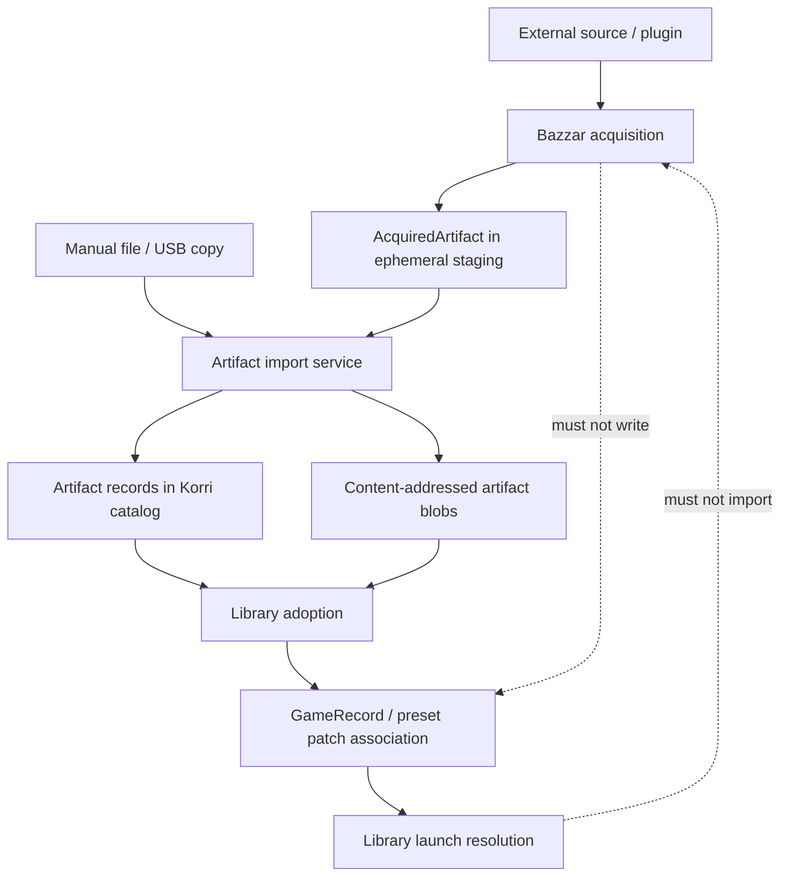

# feat: Add native artifact acquisition and import

## Summary

Add a native artifact layer between source acquisition and the playable library. Bazzar/acquisition will discover and acquire source-native artifacts into ephemeral staging, a separate artifact importer will adopt them into content-addressed durable storage, and library records will give those imported artifacts playable meaning without launch code depending on Bazzar.

---

## Problem Frame

Korri is gaining external source acquisition through `korri bazzar`, but the current acquisition contract stops at URL-shaped download resolution. That is not enough for sources such as Level Share Square, where the downloadable SMBR `.lvl` content is wrapped in source-specific API JSON, and it does not create a durable place for ROMs, patches, custom levels, manuals, and future source-native artifacts to converge before becoming library content.

The architectural risk is coupling discovery to launch. Bazzar must not decide how content launches, and the library/launcher must not know which source found a file. The missing seam is an artifact contract and import pipeline that can preserve provenance and arbitrary plugin metadata while standardizing only the fields Korri product behavior is allowed to consume.

---

## Requirements

- R1. Artifacts must have canonical content-addressed identity using `sha256:<hex64>` while preserving verified digests for verification and reconciliation. Source-claimed but unverified hashes must stay in expected/claimed metadata until Korri computes or verifies them.
- R2. Artifact `system` must represent the target platform/system, e.g. `snes`, `nes`, or `smbr`; SMBR `.lvl` content is normal `system: "smbr"` content, not an app-managed side channel.
- R3. Artifact semantic format must be separate from file extension: `format.id` describes what the bytes mean, while `file.extension` is only a filename hint.
- R4. Standardized facets are the only source metadata Korri product behavior may consume; arbitrary plugin/source metadata must be preserved under namespaced `sourceData` and remain non-semantic to the product.
- R5. Text-bearing standardized facets must support BCP-47 language tags when the source knows the language.
- R6. Media references must use general media asset records with `kind`, `role`, `url`, and optional language/media type rather than hard-coded fields such as `thumbnailUrl`.
- R7. Acquisition may search, resolve, fetch, transform, and stage source-native artifacts, but it must not write library records, choose launchers, or launch content.
- R8. Artifact import must adopt staged, manual, or USB-provided files into the same durable artifact model and content-addressed blob store.
- R9. Library records may give imported artifacts playable meaning, but library/launch code must never depend on Bazzar or acquisition plugins.
- R10. Imported content artifacts must support normal game/library records, including SNES ROM content and SMBR `.lvl` content.
- R11. Imported patch artifacts such as IPS/BPS/UPS must be representable as durable artifacts and attachable to game/preset patch declarations without acquisition involvement.
- R12. Third-party/community plugin output must be schema-validated at the acquisition boundary, cardinality-limited where needed, and safe to preserve without allowing unknown metadata to alter product behavior.
- R13. Level Share Square should become the first proving import source: it discovers SMBR levels, decodes wrapped `.lvl` bytes, stages them as `system: "smbr"` / `format.id: "smbr-level"`, and leaves import/library/launch to later layers.

---

## Scope Boundaries

- Bazzar/acquisition does not launch content.
- Bazzar/acquisition does not create or update `GameRecord` entries.
- Library and launch code do not import from `product/platform/acquisition` or Bazzar plugin modules.
- This plan does not build acquisition UI; active operator exposure is limited to CLI surfaces needed to exercise the contract.
- This plan does not load quarantined `.mjs` providers or reopen external executable plugin trust decisions.
- This plan does not hardpatch ROMs or mutate source files; imported bytes are copied/promoted into Korri-owned content-addressed storage.
- This plan does not require converting every existing path-based library record to artifact references immediately; existing `contentPath` records remain supported during transition.

### Deferred to Follow-Up Work

- Artifact import RPC: add server RPC import/adoption handlers after the CLI/service contract is proven.
- Rich acquisition UI: browse, compare, and bulk import artifacts after the CLI/service contract is proven.
- Update/reacquire workflow: use provenance and external IDs later to check for source updates or restore missing artifacts.
- External/community plugin loading: requires separate legal and trust planning before Korri loads non-bundled plugin code.
- SMBR launcher configuration: add normal library launcher/app config for `system: "smbr"` and `smb-remastered --level {contentPath}` after artifact import proves `.lvl` adoption.
- Full library migration from `contentPath` to artifact references: can follow once new imports prove the artifact path.
- Advanced metadata promotion workflow: decide later how repeated `sourceData` fields graduate into standardized facets.

---

## Context & Research

### Relevant Code and Patterns

- `product/platform/protocol/acquisition/download-resolution.ts` currently models download resolution as URL-shaped `FinalDownload`, `NonFinalDownload`, and `FailedDownload`; it has no artifact identity or staged-byte result.
- `product/platform/acquisition/download-resolution/download-resolution.ts` already keeps download resolution in acquisition and validates candidate URLs before plugin code runs.
- `product/platform/library/config/records/game-asset.ts` defines `GameAssetId` as `sha256:<hex64>`, strict decode, content-addressed storage strategy, and source/provenance-like metadata.
- `product/platform/library/game-assets/game-assets-service.ts` shows the atomic byte promotion pattern: read candidate bytes, compute SHA-256, derive deterministic blob paths, write temp file, then rename.
- `product/platform/library/proseql/library-db.ts` already supports ProseQL object-keyed collections and derived IDs; a new artifact collection can follow the `game-assets` pattern.
- `product/platform/library/config/records/game.ts` currently requires `system` and `contentPath`; imported artifact-backed content needs an additive transition path that preserves existing records.
- `product/platform/library/proseql/library-repository.ts` owns `upsertImportedGame` and launch resolution; it is the place where library records gain playable meaning, not acquisition.
- `product/platform/library/library-services.ts` already distinguishes `ContentSources` from `LibrarySource`, preserving the known-playable library boundary.
- `tools/testing/standards/acquisition-boundaries.test.ts` already enforces acquisition/library separation in several directions and should be extended to guard the new artifact seam.

### Institutional Learnings

- `docs/research/bazzar-source-adapter-download-resolution/learnings.md`: acquisition candidates and resolved artifacts are pre-library lifecycle data; only an explicit import/write flow should create known-playable library records.
- `docs/solutions/design-patterns/explicit-cascade-folded-policy-over-incidental-signal-heuristics-2026-05-27.md`: use explicit discriminants instead of incidental URL, extension, or filesystem heuristics; this supports the semantic `format.id` versus `file.extension` split.
- `docs/solutions/best-practices/proseql-canonical-library-with-derived-yaml-ids-2026-05-06.md`: persisted ProseQL records should use key-derived IDs and payload-only schemas; importers write Korri-owned records rather than treating external sources as live databases.
- `docs/solutions/architecture-patterns/korri-product-platform-theme-architecture-2026-06-03.md`: shared platform capabilities must not import app/service internals; shipped CLI code belongs under `product/apps/cli`.
- `docs/solutions/architecture-patterns/korri-plugin-architecture-2026-06-02.md`: source acquisition behaves like a content-source/plugin capability but must not shortcut into the home-grid/library model.
- `docs/brainstorms/2026-06-01-001-bazzar-source-adapter-download-resolution-requirements.md`: `korri bazzar` must keep external candidates separate from known-playable library records and defer artifact-to-library import until an explicit flow exists.
- `docs/brainstorms/2026-06-03-001-first-class-game-patches-requirements.md`: patch declarations are first-class launch resources, but automatic patch download/import was out of scope for that slice; this plan supplies the durable artifact side needed later.

### External References

- BCP 47 / RFC 5646 language tags: use standard web language identifiers such as `en`, `ja`, and `pt-BR` for localized text facets.
- OCI/SLSA-style digest maps: use canonical SHA-256 identity plus a map of additional digest algorithms rather than source IDs as identity.
- OCI annotation-style plugin metadata: standardized fields are host-actionable, while unknown namespaced metadata is preserved but display/debug-only.

---

## Key Technical Decisions

- Canonical identity is `sha256:<hex64>`: Source IDs, filenames, and URLs are mutable or source-scoped; SHA-256 identity lets manual, USB, and Bazzar acquisition converge to the same artifact.
- Store verified digests in `digests`: `id` uses SHA-256, while `digests` may also carry `sha1`, `md5`, `crc32`, or future algorithms only when Korri computed or verified them against the imported bytes. Plugin/source-claimed hashes remain expected or claimed metadata until verified.
- Split semantic format from extension: `format.id: "smbr-level"` and `file.extension: "lvl"` let two systems share an extension without sharing behavior.
- Use standardized facets plus opaque source data: plugins can populate known facets, but only Korri-owned facet schemas can affect product behavior. Everything else goes in `sourceData["namespace.vN"]`.
- Model SMBR as a system: `.lvl` files are content records with `system: "smbr"`; any SMBR launch behavior is expressed through normal library launcher configuration after import.
- Add an acquisition `acquireArtifact` operation rather than overloading `resolveDownload`: some sources produce artifact bytes through API transforms, not final raw URLs. Acquisition may stage bytes; import decides durable adoption.
- Keep artifact storage independent from acquisition and library: the artifact store owns hashes and blobs; acquisition feeds staged artifacts; library adoption references imported artifacts without importing source plugins.
- Preserve existing path-based games during transition: artifact references are additive so existing `contentPath` records, ROCKNIX imports, and manual configs keep working.
- Extend boundary tests before wiring examples: prevent accidental imports between acquisition, artifact storage, and library/launch while the new seams are being introduced.

---

## Open Questions

### Resolved During Planning

- Should Bazzar connect acquisition directly to launch? No. Bazzar/acquisition stops at discover/acquire/stage and never launches or writes game records.
- Should SMBR levels be app-managed extras? No for this architecture. Treat `.lvl` as normal content for `system: "smbr"`.
- Should `format` be a file extension? No. Use `format.id` for semantic format and `file.extension` for filename hints.
- Should plugins define arbitrary product-consumable metadata? No. Plugins may preserve arbitrary `sourceData`, but product behavior consumes only standardized facets.
- Should source IDs be required for identity? No. Source IDs are provenance/external IDs; the artifact identity is content-addressed.

### Deferred to Implementation

- Exact semantic format registry names: start with the plan examples (`sfc-rom`, `ips`, `smbr-level`) and adjust naming during implementation if a clearer namespace emerges.
- Exact artifact CLI command names: preserve `korri bazzar` compatibility while adding minimal import/acquire surfaces; final names can follow CLI parser constraints.
- Exact ProseQL collection layout for artifact records: follow the existing derived-key collection pattern, but implementation may choose singular/plural names that fit local conventions.
- Exact Level Share Square response quirks: fixture tests should lock the public shapes observed during research, but live endpoint drift remains an implementation-time discovery.

---

## Output Structure

    product/platform/protocol/artifact/
      artifact.ts
      artifact.test.ts
    product/platform/protocol/acquisition/
      artifact-acquisition.ts
    product/platform/artifacts/
      artifact-store.ts
      artifact-store.test.ts
      artifact-import-service.ts
      artifact-import-service.test.ts
    product/platform/acquisition/
      artifact-acquisition.ts
      artifact-acquisition.test.ts
      plugins/levelsharesquare.ts
      plugins/levelsharesquare.test.ts
      plugins/levelsharesquare.fixtures.ts
    product/platform/library/config/records/
      artifact.ts
      game.ts
    product/platform/library/proseql/
      library-db.ts
      library-repository.ts
      library-repository.test.ts
    product/apps/cli/bazzar/
      bazzar-command.ts
      bazzar-command.test.ts
    tools/testing/standards/
      acquisition-boundaries.test.ts
      artifact-boundaries.test.ts

This tree is directional. The implementer may adjust names, but the separation between acquisition, artifacts, and library adoption is scope-defining.

---

## High-Level Technical Design

> *This illustrates the intended approach and is directional guidance for review, not implementation specification. The implementing agent should treat it as context, not code to reproduce.*



Contract sketch:

```text
PluginAcquireOutput
  kind: content | patch
  system?: string
  format: { id: string, version?: string }
  file: { name, extension?, mediaType?, sizeBytes? }
  bytes or byte stream
  expectedDigests?: Record<algorithm, value>  # source claims pending verification
  facets?: standardized product-consumable fields
  provenance?: source trail
  externalIds?: source/global identifiers
  sourceData?: namespaced arbitrary plugin metadata

AcquiredArtifact
  service-owned staging result built from PluginAcquireOutput
  includes id, stagedPath, and verified/computed digests
  stagedPath is assigned by Korri's acquisition service

ArtifactRecord
  durable imported artifact
  kind: content | patch
  localPath or storage descriptor points at durable content-addressed blob
```

---

## Phased Delivery

### Phase 1 — Artifact contract and storage foundation

- U1 defines the schema contract.
- U2 adds durable artifact storage and catalog records.
- U8 adds boundary/trust enforcement that can be introduced before behavioral wiring.

This phase should remain green without changing acquisition, library launch, or CLI behavior.

### Phase 2 — Acquisition-side staging and Level Share Square proof

- U3 adds source-native `acquireArtifact` support without library writes.
- U4 proves the contract with Level Share Square SMBR `.lvl` acquisition.

This phase can ship with staged artifact output only; imported/library playable content remains out of acquisition.

### Phase 3 — Import, library adoption, and operator flow

- U5 teaches local library resolution to consume artifact-backed content.
- U6 converges staged/manual/USB files through artifact import and adoption.
- U7 exposes CLI acquire/import commands while keeping launch separate.

This phase is the first point where imported artifacts can become library records.

---

## Implementation Units

### U1. Define the artifact protocol contract

**Goal:** Add strict, wire-safe durable artifact schemas that encode the contract: canonical SHA-256 identity, multiple digests, system, semantic format, file hints, standardized facets, provenance, external IDs, and opaque namespaced source data.

**Requirements:** R1, R2, R3, R4, R5, R6, R12

**Dependencies:** None

**Files:**
- Create: `product/platform/protocol/artifact/artifact.ts`
- Create: `product/platform/protocol/artifact/artifact.test.ts`

**Approach:**
- Define `ArtifactId` using the existing `GameAssetId` pattern: `sha256:<hex64>`.
- Define `DigestSet` as a record keyed by algorithm id, requiring `sha256` for imported records and allowing additional algorithms.
- Define v1 `ArtifactKind` as a small bounded set with current consumers only: `content` and `patch`. Reserve future kinds until a unit gives them concrete behavior.
- Define `format` as a semantic object `{ id, version? }`, not an extension.
- Define `file` as filename/extension/media-type/size metadata.
- Define standardized facets for title, description, credits, compatibility, tags, community stats, and media assets.
- Define `LocalizedText` with optional BCP-47 language tag.
- Define `sourceData` as a record whose keys must be validated by schema against a namespaced version pattern such as `levelsharesquare.v1`; values remain `unknown`.
- Define safe file extension syntax for blob-path construction: no separators, traversal, NUL bytes, or shell/path metacharacters; normalize extension case before deriving paths.
- Define media asset URLs as outbound HTTP(S) URLs that pass the same safety policy as acquisition download URLs.
- Use strict decode options so unknown top-level artifact fields fail fast while unknown `sourceData` content is preserved inside its namespace.

**Execution note:** Implement schema tests first; the contract is the durable API for later units.

**Patterns to follow:**
- `product/platform/library/config/records/game-asset.ts`
- `product/platform/protocol/acquisition/candidate.ts`
- `product/platform/protocol/acquisition/download-resolution.ts`

**Test scenarios:**
- Happy path: decode an SNES content artifact with `id`, `system: "snes"`, `format.id: "sfc-rom"`, `file.extension: "sfc"`, SHA-256 digest, localized title, and provenance.
- Happy path: decode an IPS patch artifact with `kind: "patch"`, `format.id: "ips"`, and `facets.compatibility.expectedBaseDigests`.
- Happy path: decode an SMBR level artifact with `system: "smbr"`, `format.id: "smbr-level"`, `file.extension: "lvl"`, media asset role `thumbnail`, and Level Share Square `sourceData`.
- Edge case: two artifacts with the same `file.extension` but different `system` and `format.id` decode as distinct semantic formats.
- Error path: reject artifact IDs that are not canonical `sha256:<hex64>`.
- Error path: reject unknown top-level artifact fields while allowing unknown fields under `sourceData["namespace.vN"]`.
- Error path: reject `sourceData` keys that do not match the namespace/version pattern.
- Error path: reject unsafe file extensions containing path separators, traversal markers, NUL bytes, or unsupported characters.
- Error path: reject media asset URLs that fail outbound URL policy.
- Error path: reject malformed language tags when a text field declares `language`.

**Verification:**
- Artifact schemas distinguish stable product fields from opaque plugin metadata.
- The examples discussed in planning can be represented without source-specific top-level fields.

### U2. Add durable content-addressed artifact storage

**Goal:** Create a local artifact store that promotes bytes into durable content-addressed blobs and records imported artifact metadata without depending on acquisition or library launch code.

**Requirements:** R1, R8, R9, R10, R11

**Dependencies:** U1

**Files:**
- Create: `product/platform/artifacts/artifact-store.ts`
- Create: `product/platform/artifacts/artifact-store.test.ts`
- Create: `product/platform/artifacts/artifact-import-service.ts`
- Create: `product/platform/artifacts/artifact-import-service.test.ts`
- Modify: `product/platform/library/proseql/library-db.ts`
- Create or modify: `product/platform/library/config/records/artifact.ts`

**Approach:**
- Mirror the game-assets storage pattern: resolve an artifact root, compute SHA-256 from bytes, derive deterministic blob paths from digest and extension, write through a temp file, and rename atomically.
- Add a ProseQL artifact collection using derived keys, keeping persisted payloads free of duplicated `id` fields.
- Keep the artifact store independent from acquisition and library launch; it only stores bytes and metadata.
- Store `localPath` or a storage descriptor in the runtime artifact record while deriving blob path deterministically from `id` and file extension.
- Keep simple format confirmation inside `artifact-import-service.ts` until more than one caller needs a separate module; accept source hints but produce explicit `format.id` outcomes.
- Treat imports from staging, manual paths, and USB paths as the same operation: read bytes, compute and/or verify digests, validate metadata, promote bytes, upsert artifact record.

**Execution note:** Characterize `game-assets-service.ts` storage behavior before introducing the parallel artifact store.

**Patterns to follow:**
- `product/platform/library/game-assets/game-assets-service.ts`
- `product/platform/library/config/records/game-asset.ts`
- `product/platform/library/proseql/library-db.ts`

**Test scenarios:**
- Happy path: importing bytes for `game.sfc` writes a blob under the artifact root and returns `id: sha256:<digest>`.
- Happy path: importing the same bytes twice is idempotent and returns the same artifact ID without corrupting the blob.
- Happy path: importing with additional expected digests verifies matching values before copying them into `digests`; canonical identity remains SHA-256.
- Edge case: importing the same bytes first as `.sfc` and later as `.smc` returns the existing artifact record with the first successful extension/blob path unchanged.
- Edge case: importing bytes with `.lvl` extension and `format.id: "smbr-level"` keeps semantic format independent from extension.
- Error path: reject an import when a provided expected SHA-256 does not match computed bytes.
- Error path: clean up temp files when atomic promotion fails.
- Integration: artifact records round-trip through ProseQL derived-key storage and strict decode.

**Verification:**
- Artifact storage is durable, content-addressed, idempotent, and independent from acquisition/library modules.

### U3. Extend acquisition with source-native artifact acquisition

**Goal:** Let acquisition plugins produce staged artifact bytes and metadata without writing durable artifact records or touching the library.

**Requirements:** R4, R7, R8, R12, R13

**Dependencies:** U1

**Files:**
- Create: `product/platform/protocol/acquisition/artifact-acquisition.ts`
- Create: `product/platform/acquisition/artifact-acquisition.ts`
- Create: `product/platform/acquisition/artifact-acquisition.test.ts`
- Modify: `product/platform/acquisition/plugins/registry.ts`
- Modify: `product/platform/acquisition/acquisition-service.ts`
- Modify: `product/platform/acquisition/plugin-contract-codecs.ts`
- Modify: `product/platform/acquisition/acquisition-service.test.ts`
- Modify: `product/apps/portal/api/acquisition/acquisition-rpc-handlers.test.ts`
- Modify: `product/platform/acquisition/acquisition-live.test.ts`

**Approach:**
- Add an optional plugin operation such as `acquireArtifact` that accepts a source candidate/details identifier and returns `PluginAcquireOutput`: artifact bytes plus metadata, not a trusted filesystem path.
- Define `PluginAcquireOutput` under acquisition protocol so it structurally excludes `stagedPath`.
- Have the acquisition service assign the staged path after writing bytes into its own staging root; plugin output containing `stagedPath` should fail schema validation rather than being overwritten.
- Keep `resolveDownload` for URL-shaped compatibility, but do not force API-wrapped sources into `FinalDownload` when they need source-specific transforms.
- Do not modify the existing `SourceCandidate.thumbnailUrl` shape in this plan; general media facets live on `AcquiredArtifact` and imported `ArtifactRecord`. Existing search consumers keep their compatibility field until a separate migration removes it.
- Validate plugin output with strict schema decoders and convert invalid output to typed defective-source errors.
- Add a concrete search result cardinality limit of 200 candidates per plugin response so community plugins cannot return unbounded candidate lists.
- Ensure acquired artifacts are staged under acquisition's staging root; durable import remains a separate service call.
- Preserve stdout/stderr discipline for CLI surfaces that expose the new operation.

**Patterns to follow:**
- `product/platform/acquisition/plugin-operation-harness.ts`
- `product/platform/acquisition/plugin-contract-codecs.ts`
- `product/platform/acquisition/download-resolution/download-resolution.ts`
- `product/platform/acquisition/path-policy.ts`
- `tools/testing/standards/acquisition-boundaries.test.ts`

**Test scenarios:**
- Happy path: a fixture plugin returns a staged content artifact and the acquisition service validates and returns it without writing library records.
- Happy path: a plugin may return `sourceData` under its own namespace while product-consumable values must appear in standardized facets.
- Edge case: candidate artifact hints may omit system/format when unknown; `acquireArtifact` can fill them after fetching bytes.
- Error path: invalid plugin artifact output becomes a defective-source error with `sourceName` attached.
- Error path: plugin output includes `stagedPath` and `validatePluginAcquireOutput` rejects it before the service writes anything.
- Error path: plugin returns more than 200 candidates and the harness rejects or truncates according to the concrete 200-candidate policy.
- Integration: acquisition code remains read-only from `product/platform/library` and does not import library modules.

**Verification:**
- Acquisition can stage source-native artifact bytes while preserving the no-library/no-launch boundary.

### U4. Implement Level Share Square as the proving acquisition source

**Goal:** Add a Level Share Square TypeScript source plugin that searches SMBR levels, returns details, and acquires `.lvl` artifacts by decoding LSS's API-wrapped buffer payload.

**Requirements:** R2, R3, R4, R7, R12, R13

**Dependencies:** U1, U3

**Files:**
- Create: `product/platform/acquisition/plugins/levelsharesquare.ts`
- Create: `product/platform/acquisition/plugins/levelsharesquare.test.ts`
- Create: `product/platform/acquisition/plugins/levelsharesquare.fixtures.ts`
- Modify: `product/platform/acquisition/plugins/approved.ts`

**Approach:**
- Register `levelsharesquare` as an approved TypeScript plugin with credential-free metadata and an explicit legal/TOS risk note.
- Use the public games endpoint to validate that SMBR has `internalID: 5` and `fileExtension: ".lvl"`.
- Search with `GET /api/levels/filter/get?page=1&game=5&search=<query>` and map results to source candidates with artifact hints for `system: "smbr"` and `format.id: "smbr-level"`.
- Fetch details with `GET /api/levels/<id>?allAuthors=1` and map standardized facts into facets: title, description, credits, tags, community stats, and media assets.
- Acquire with `GET /api/levels/<id>/code?noDescription=1&play=1`; decode `levelData.data` into bytes, validate the decoded JSON has SMBR `.lvl` shape, and return `PluginAcquireOutput` for the acquisition service to stage as an `AcquiredArtifact`.
- Preserve LSS-specific values such as `difficulty`, `status`, `internalGameId`, feature dates, and source game version under `sourceData["levelsharesquare.v1"]` unless promoted to standardized facets.

**Execution note:** Use fixtures from the known `6a1797b85a07d826fd7a5bd0` level to avoid live-network unit tests.

**Patterns to follow:**
- `product/platform/acquisition/plugins/approved.ts`
- `product/platform/acquisition/acquisition-live.test.ts`
- `product/platform/acquisition/download-resolution/url-policy.ts`

**Test scenarios:**
- Happy path: search fixture for `tropical` returns a candidate with source name `levelsharesquare`, source ID `6a1797b85a07d826fd7a5bd0`, `system: "smbr"`, and `format.id: "smbr-level"` hints.
- Happy path: details fixture maps title, author, description, tags, rating, plays, favourites, and thumbnail media asset into standardized facets.
- Happy path: acquire fixture decodes `levelData.data` into `.lvl` bytes, validates `Info` and `Levels`, and returns an acquired content artifact for `system: "smbr"`.
- Edge case: fixture with unknown or missing author still produces a valid artifact without inventing a credit.
- Error path: malformed `levelData` buffer returns a typed defective-source outcome.
- Error path: endpoint reports a non-`.lvl` extension for SMBR and validation fails.
- Integration: LSS plugin does not return launch args, install paths, or library records.

**Verification:**
- LSS proves source-native artifact acquisition without coupling acquisition to SMBR launch behavior.

### U5. Add artifact references to library content resolution

**Goal:** Let library records give artifact-backed content playable meaning while preserving existing `contentPath` records and keeping launch independent from acquisition.

**Requirements:** R2, R8, R9, R10, R11

**Dependencies:** U1, U2

**Files:**
- Modify: `product/platform/library/config/records/game.ts`
- Modify: `product/platform/library/config/resolved-launch-context.ts`
- Modify: `product/platform/library/config/cascade-resolver.ts`
- Modify: `product/platform/library/proseql/library-repository.ts`
- Modify: `product/platform/library/config/records/game.test.ts`
- Modify: `product/platform/library/config/cascade-resolver.test.ts`
- Modify: `product/platform/library/proseql/library-repository.test.ts`

**Approach:**
- In plain English: a game can point either at an old-style local path or at an imported artifact, but not both.
- Make `contentPath` optional on game payloads, add `content: { artifactId }`, and add a validation rule that requires exactly one content source.
- Update the existing tests that currently say a game without `contentPath` is invalid; the new rule is "exactly one of contentPath or artifactId."
- Keep the cascade resolver pure: it may carry an unresolved artifact reference, but it must not perform artifact catalog I/O.
- Make the resolved launch context able to carry the unresolved artifact reference until the repository can resolve it.
- In `library-repository.ts`, after cascade resolution and before `composeLaunchSpec`, resolve `content.artifactId` through the local artifact catalog/blob helper to obtain the extension and durable blob path, then fill in `contentPath` for launch composition.
- Preserve the original artifact reference for diagnostics while `composeLaunchSpec` sees only the local blob path.
- Keep artifact resolution local: it reads Korri's artifact catalog/blob store, not acquisition.
- Ensure `system` remains on the game record, not inferred from the artifact unless an adoption helper explicitly creates the game from artifact facets.
- Preserve source/provenance metadata on the artifact record, not as launch inputs.

**Execution note:** Add characterization tests around existing `contentPath` resolution before introducing artifact-backed records.

**Patterns to follow:**
- `product/platform/library/config/records/game.ts`
- `product/platform/library/config/cascade-resolver.ts`
- `product/platform/library/proseql/library-repository.ts`
- `product/platform/library/proseql/proseql-library-source.test.ts`

**Test scenarios:**
- Happy path: existing game records with `contentPath` still decode and launch unchanged.
- Happy path: artifact-backed game records resolve `content.artifactId` to the artifact blob path before `composeLaunchSpec` runs.
- Happy path: SMBR game record with `system: "smbr"` and `.lvl` artifact reference resolves content path to the `.lvl` blob.
- Error path: reject a game payload that declares both `contentPath` and `content.artifactId`.
- Error path: reject or fail launch resolution clearly when a game references a missing artifact ID.
- Integration: launch resolution uses only local artifact records and never imports acquisition modules.

**Verification:**
- Artifact-backed content participates in the same library launch path as existing path-backed content.

### U6. Build the artifact adoption/import bridge

**Goal:** Provide one adoption path that converts acquired, manual, or USB-sourced artifact bytes into durable artifact records and optional library/preset records, without source-specific branching after import.

**Requirements:** R8, R9, R10, R11

**Dependencies:** U1, U2, U5

**Files:**
- Modify: `product/platform/library/proseql/library-repository.ts`
- Modify: `product/platform/library/proseql/library-repository.test.ts`

**Approach:**
- Define adoption inputs on the library repository/import seam for staged acquisition artifact, local/manual file, and USB/import path; all converge into the same artifact import service before library writes.
- For content artifacts, optionally create or update a `GameRecord` using artifact facets for initial title/metadata and the user's selected or artifact-declared `system`.
- For patch artifacts, import the blob and expose a stable artifact ID/blob path for later association with a game or preset patch declaration.
- Keep patch association separate from acquisition: attaching an IPS artifact to a preset is a library edit that references the artifact, not a source action.
- Extend `ImportedGameRecord` or add a sibling repository method so game creation can include artifact references and, once the patches plan lands, artifact-backed patch declarations.
- Preserve artifact provenance and source data on the artifact record; library records should reference artifact IDs rather than duplicating source metadata.

**Patterns to follow:**
- `product/platform/library/proseql/library-repository.ts` `upsertImportedGame`
- `product/platform/library/proseql/library-repository.test.ts`
- `docs/plans/2026-06-03-001-feat-first-class-game-patches-plan.md`

**Test scenarios:**
- Happy path: adopting an acquired SNES content artifact creates an artifact record and a game record with `system: "snes"` and `content.artifactId`.
- Happy path: adopting an SMBR `.lvl` artifact creates a normal game record with `system: "smbr"` and no source-specific launcher data.
- Happy path: adopting an IPS artifact creates a patch artifact record without creating a game record by default.
- Edge case: adopting an artifact whose SHA-256 already exists reuses the existing artifact record and avoids duplicate blobs.
- Error path: content adoption fails clearly when neither user input nor artifact facets provide a usable `system`.
- Error path: patch association fails clearly when expected base digest does not match the selected base game artifact, when that digest is known.
- Integration: manual file import and acquisition-staged import produce identical artifact records for identical bytes.

**Verification:**
- Manual, USB, and Bazzar acquisition paths converge at artifact import before library adoption.

### U7. Add operator surfaces for acquire/import without launch coupling

**Goal:** Expose acquisition and import operations through CLI surfaces that let operators fetch and adopt artifacts while keeping launch as a separate later user action.

**Requirements:** R7, R8, R9, R13

**Dependencies:** U3, U4, U6

**Files:**
- Modify: `product/apps/cli/bazzar/bazzar-command.ts`
- Modify: `product/apps/cli/bazzar/bazzar-command.test.ts`
- Create: `product/apps/cli/artifacts/artifact-import-command.ts`
- Create: `product/apps/cli/artifacts/artifact-import-command.test.ts`

**Approach:**
- Add an acquisition CLI operation that can acquire/stage an artifact from a source candidate and returns the `AcquiredArtifact` contract.
- Add a separate artifact import/adopt CLI operation that imports a staged artifact or local file into durable artifact storage.
- Do not add `acquire-and-play`, auto-launch, or launcher-selection behavior in this plan.
- Make command output explicit about lifecycle: staged acquisition output is ephemeral until imported; imported artifact output is durable and may be adopted into the library separately.
- Use existing stdout/stderr discipline from Bazzar contract commands for machine-readable outputs.

**Patterns to follow:**
- `product/apps/cli/bazzar/bazzar-command.ts`
- `product/apps/cli/bazzar/bazzar-command.test.ts`
- `product/apps/cli/korri-cli.test.ts`

**Test scenarios:**
- Happy path: `korri bazzar` acquire command returns a staged artifact JSON contract and does not create a library game.
- Happy path: artifact import command accepts a staged artifact reference and returns an imported artifact ID.
- Happy path: local-file import command produces the same artifact ID as staged import for identical bytes.
- Error path: attempting to launch from an acquisition command is unsupported because no such command exists.
- Error path: importing a missing staged file reports a typed, user-actionable failure.
- Integration: CLI import handler routes through artifact import service and returns schema-valid output.

**Verification:**
- Operators can acquire and import artifacts, but launching remains an explicit separate library operation.

### U8. Enforce artifact/acquisition/library boundaries and harden plugin output

**Goal:** Add standards tests and trust checks that keep the architecture from drifting back into acquisition-launch coupling or arbitrary plugin-defined product semantics.

**Requirements:** R4, R7, R9, R12

**Dependencies:** U1, U2, U3, U5

**Files:**
- Modify: `tools/testing/standards/acquisition-boundaries.test.ts`
- Create: `tools/testing/standards/artifact-boundaries.test.ts`
- Modify: `product/platform/acquisition/plugin-contract-codecs.ts`
- Modify: `product/platform/acquisition/trust-policies.test.ts`

**Approach:**
- Extend acquisition boundary tests to assert `product/platform/library/**` does not import `@platform/acquisition` or Bazzar plugin modules.
- Add artifact boundary tests: artifact storage must not import acquisition or app code; acquisition may import artifact protocol types but not artifact durable-store services unless explicitly needed for staging contracts; library may import artifact protocol/storage only for local artifact resolution, not acquisition.
- Harden plugin output decoders with strict excess-property behavior where feasible.
- Enforce the 200-candidate per-plugin response limit in codec/harness tests.
- Ensure credential redaction and URL safety still apply to new artifact acquisition errors, provenance fields, and media asset URLs.
- Add tests proving `sourceData` cannot affect format/system/library behavior without standardized facet promotion.

**Patterns to follow:**
- `tools/testing/standards/acquisition-boundaries.test.ts`
- `tools/testing/standards/import-boundaries.test.ts`
- `product/platform/acquisition/security.ts`
- `product/platform/acquisition/download-resolution/url-policy.ts`

**Test scenarios:**
- Happy path: boundary tests pass for allowed imports among protocol, artifact storage, acquisition, and library.
- Error path: a synthetic library file importing acquisition is detected as a violation by the import scanner helper.
- Error path: acquisition plugin output with unknown top-level fields is rejected or quarantined according to strict decode policy.
- Error path: source data containing product-looking fields does not alter standardized `system`, `format.id`, or facets.
- Error path: plugin error messages and provenance URLs with credentials are redacted before logging or contract output.

**Verification:**
- Architectural boundaries and trust policies are continuously testable.

---

## System-Wide Impact

- **Interaction graph:** Acquisition produces candidates/resolutions/staged artifacts; artifact import owns durable blobs/catalog records; library adoption creates game/preset meaning; launch consumes only library-resolved local content.
- **Error propagation:** Source defects stay in acquisition errors; byte/digest/storage failures become artifact import errors; missing artifact references become library config errors; launch errors never mention Bazzar unless a user manually named a Bazzar-derived artifact in provenance UI.
- **State lifecycle risks:** Staged acquisition artifacts are ephemeral and must not be written into durable library config. Imported artifact blobs are durable and idempotent by SHA-256.
- **API surface parity:** CLI acquire/import surfaces are active in this plan; artifact import RPC is deferred and must preserve the same acquire/import separation when added.
- **Integration coverage:** Tests must prove LSS `.lvl`, SNES content, and IPS patch artifacts can all be represented and imported without source-specific library coupling.
- **Unchanged invariants:** Existing path-backed `GameRecord.contentPath` records keep working; existing Bazzar search/details/resolve-download behavior remains distinct from artifact import; first-class patch launch behavior remains a library/launcher concern.

---

## Risks & Dependencies

| Risk | Mitigation |
|------|------------|
| Artifact references make launch resolution depend on a new local store | Keep dependency local to artifact catalog/blob store, never acquisition; retain path-backed records during transition. |
| Community plugin metadata becomes de facto product behavior | Enforce standardized facets vs opaque namespaced `sourceData`; tests prove unknown source data cannot drive system/format decisions. |
| LSS endpoint drift breaks acquisition | Use fixture-based tests for known shapes and surface live failures as source defects; keep LSS as one plugin, not core contract. |
| Duplicate paths/IDs across manual and Bazzar imports | Use SHA-256 identity and idempotent blob promotion so equal bytes converge. |
| Downloaded source URLs contain credentials or unsafe hosts | Reuse and extend acquisition URL policy and credential redaction for artifact acquisition/provenance. |
| Existing game-assets store and new artifact store diverge unnecessarily | Mirror the storage root, digest, blob-path, strict-schema, and atomic-promotion patterns from game assets. |
| Scope creep into launch/import UI | Keep active units limited to protocol, storage, acquisition plugin, import/adoption, and minimal CLI; defer RPC, rich UI, and acquire-and-play flows. |

---

## Documentation / Operational Notes

- Update operator-facing docs only after command names stabilize; the first docs should emphasize that acquisition, import, and launch are separate steps.
- Document the artifact contract near the protocol schemas so community/plugin authors know which fields are standardized and which must remain under `sourceData`.
- Document the SMBR system contract once the deferred launcher config exists: `system: "smbr"` content is `.lvl` content, and launcher behavior is normal library config.
- Add release notes when introducing artifact-backed library records because older configs remain path-backed but new imports may write `content.artifactId`.
- Keep artifact import RPC documentation deferred until the CLI/service seam is stable.

---

## Sources & References

- Related requirements: `docs/brainstorms/2026-06-01-001-bazzar-source-adapter-download-resolution-requirements.md`
- Related requirements: `docs/brainstorms/2026-06-03-001-first-class-game-patches-requirements.md`
- Related plan: `docs/plans/2026-06-04-001-feat-korri-bazzar-migration-plan.md`
- Related code: `product/platform/protocol/acquisition/download-resolution.ts`
- Related code: `product/platform/acquisition/download-resolution/download-resolution.ts`
- Related code: `product/platform/library/config/records/game-asset.ts`
- Related code: `product/platform/library/game-assets/game-assets-service.ts`
- Related code: `product/platform/library/config/records/game.ts`
- Related code: `product/platform/library/proseql/library-db.ts`
- Related code: `product/platform/library/proseql/library-repository.ts`
- Related code: `tools/testing/standards/acquisition-boundaries.test.ts`
