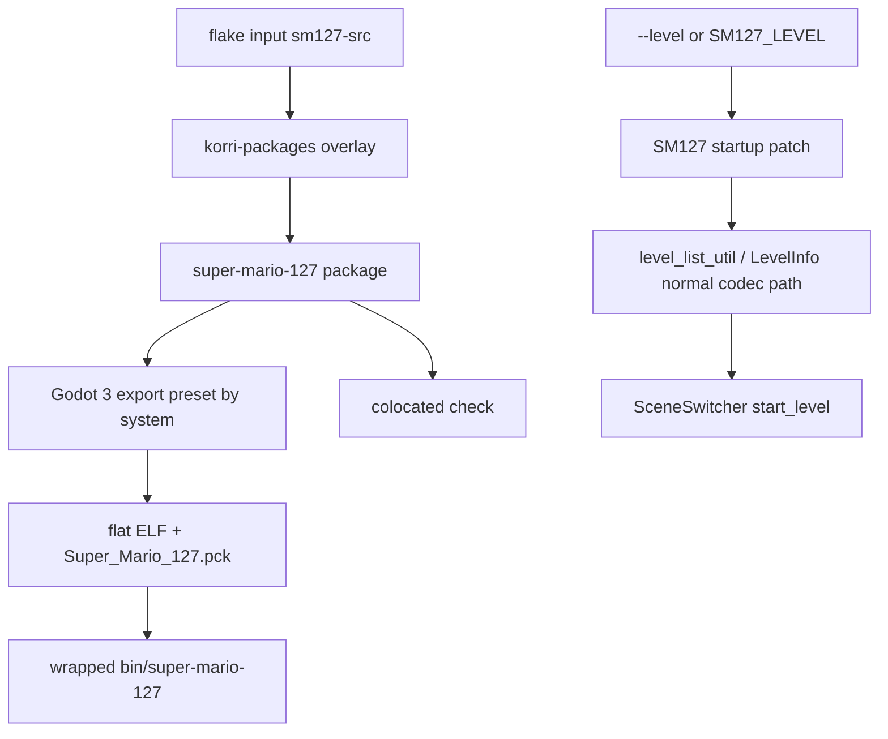

# feat: Add native Super Mario 127 support

## Summary

Add Super Mario 127 as a first-class native Korri vendor package by building the upstream Godot 3.6 project from source, exporting Linux x86_64/aarch64 artifacts, wrapping the runtime dependencies Godot discovers via `dlopen`, and carrying a Korri direct-level launch patch for `.127level` files. The slice mirrors the SMBR vendor-package pattern while staying additive: package, checks, patches, and README only.

---

## Problem Frame

Super Mario 127 is an LSS-supported Godot fan game with public source but no native aarch64 Linux release. Korri can now package SMBR natively for ARM direct LSS-level launch; Super Mario 127 needs the same kind of source-built package and launch contract, but its Godot 3.6 export pipeline, `.127level` codec, user-data path, and GDNative Discord addon differ enough that copying the SMBR implementation literally would be fragile.

---

## Requirements

- R1. Expose an additive `super-mario-127` Linux package output for x86_64-linux and aarch64-linux without replacing an upstream nixpkgs package.
- R2. Build from the pinned upstream SuperMario127 source using the Godot 3.6 export pipeline, not x86 emulation or prebuilt itch/GitHub release binaries.
- R3. Add or adapt Linux export presets so the selected preset produces the correct native ELF architecture for each supported system.
- R4. Install the exported Godot 3 binary and adjacent `.pck` in a stable flat layout and provide a `$out/bin/super-mario-127` wrapper.
- R5. Provide the same runtime library set to both `autoPatchelfHook` and the wrapper so Godot X11/OpenGL/audio `dlopen` calls resolve on NixOS devices.
- R6. Add a Korri direct launch contract for `--level` and `SM127_LEVEL` that resolves `.127level` files and enters the normal SM127 level-start flow.
- R7. Preserve normal upstream launch behavior when no direct-level launch input is present.
- R8. Handle platform-specific Discord GDNative behavior safely, especially on aarch64 where the upstream addon does not provide a usable native SDK.
- R9. Add colocated Nix checks proving artifact shape, ELF architecture, wrapper presence, provenance, PCK presence, format-version contract, and launch-patch strings.
- R10. Document engine selection, source pin policy, user-data/level paths, launch inputs, Discord/legal constraints, and explicit non-goals.

---

## Scope Boundaries

- Do not add kiosk launch-module wiring or make Super Mario 127 a runtime default in this slice.
- Do not build a Bazzar/acquisition plugin for downloading `.127level` files from LSS.
- Do not implement LSS account, favorites, rating, comments, or portal API surfaces.
- Do not add UI/library identity for Super Mario 127 levels or convert `.127level` files into Korri library records.
- Do not support Windows, macOS, HTML5, or Android exports.
- Do not build Linux Discord Game SDK support; only ensure the game starts safely when Discord is unavailable.
- Do not solve SM127 mod loading beyond preserving the upstream startup path.

### Deferred to Follow-Up Work

- Kiosk/session integration: add launch-module or game-session defaults only after the vendor package and direct launch contract are proven on-device.
- LSS acquisition integration: build a separate acquisition/download flow if Korri needs to fetch SM127 levels by LSS id rather than launching pre-seeded local files.
- Library identity and artwork: model Super Mario 127 levels or presets in the Korri library only after storage/import rules are designed.
- Formal licensing follow-up: request or track an explicit upstream license if Korri intends broad redistribution beyond internal/local use.

---

## Context & Research

### Relevant Code and Patterns

- `product/vendor/super-mario-bros-remastered/package.nix` is the canonical Godot-native vendor derivation: writable source staging, architecture-to-preset mapping, `autoPatchelfHook`, shared `runtimeLibs`, `makeWrapper`, `dontStrip`, passthru metadata, and provenance manifest.
- `product/vendor/super-mario-bros-remastered/check.nix` is the colocated artifact-shape check pattern: package passthru assertions, wrapper checks, ELF magic/machine validation, manifest checks, exported native-library layout, and PCK string greps for launch contracts.
- `product/vendor/super-mario-bros-remastered/patches/0001-add-linux-arm64-export-preset.patch` shows the export-preset patch style and ordering convention.
- `product/vendor/super-mario-bros-remastered/patches/0002-add-level-launch-flag.patch` shows Korri’s direct-launch-patch convention, but SM127 must use its own Godot 3 scene and level-loading seams.
- `product/systems/nixos/overlays/korri-packages.nix` documents additive package lanes: `libretro-fake-08`, `gamescope-korri`, and `smb-remastered` are added as package attributes rather than replacing existing nixpkgs packages.
- `flake.nix` wires vendor sources into the overlay, exposes Linux package outputs, registers colocated checks, and classifies package-output checks in the standard native owner matrix.
- Upstream `project.godot` sets `run/main_scene="res://scenes/menu/launcher/launcher.tscn"`, `config/custom_user_dir_name="dev"`, Godot 3 config format, and a Discord autoload.
- Upstream `export_presets.cfg` has `Linux/X11` for x86_64 but no Linux ARM64 preset.
- Upstream `util/new/levels_list/level_list_util.gd` defines `user://level_list` and `<id>.127level` paths.
- Upstream `level/Data.gd` defines `current_format_version := "0.5.1"` and the custom encoded level codec.

### Institutional Learnings

- `docs/solutions/tooling-decisions/align-flake-nixpkgs-to-downstream-pin-for-cache-coherence-2026-05-27.md`: avoid unnecessary nixpkgs channel splits because they look harmless on x86 caches but can force expensive aarch64 rebuilds. Start from the main nixpkgs Godot 3.6 packages and add a secondary pin only if implementation proves it is required.
- `docs/solutions/best-practices/electrobun-renderer-on-aarch64-handheld-via-cohesive-nix-closure-2026-05-27.md`: do not solve runtime library discovery with broad `/nix/store/*/lib` scans. Use a cohesive Nix closure and explicit wrapper library path derived from declared runtime libraries.
- `docs/solutions/runtime-errors/retroarch-bare-passthru-wrapper-injects-l-coredir-2026-05-27.md`: inspect wrappers and generated launch surfaces before debugging runtime behavior; shell wrappers may inject flags or environment that changes the real binary contract.
- `docs/solutions/architecture-patterns/kiosk-foreground-app-policy-over-gamescope-overlay-2026-05-24.md`: foreground app/session policy belongs in explicit runtime integration, not silently in a vendor package.
- `docs/solutions/architecture-patterns/gamescope-runtime-control-contract-2026-06-02.md`: runtime display/session concerns should stay separate from the package artifact contract.

### External References

- Upstream repository: https://github.com/Level-Share-Square/SuperMario127
- Godot 3.6 command-line documentation: https://docs.godotengine.org/en/3.6/tutorials/editor/command_line_tutorial.html
- Godot 3.6 Linux export documentation: https://docs.godotengine.org/en/3.6/tutorials/export/exporting_for_linux.html
- Godot 3.6 ARM export announcement: https://godotengine.org/article/dev-snapshot-godot-3-6-beta-4/
- LSS / SM127 public context: https://wiki.levelsharesquare.com/Super_Mario_127

---

## Key Technical Decisions

- Use `product/vendor/super-mario-127/` as the vendor package root: this keeps the shape parallel to SMBR while making the upstream title searchable and distinct.
- Pin upstream source as `sm127-src` with `flake = false`: the upstream repo has no flake and no required submodules; a pinned release commit keeps the package reproducible.
- Start with main `nixpkgs` Godot 3.6 packages: SM127 is Godot 3.6, which the repo’s `nixpkgs.nixos-25.11` pin is expected to provide. A separate engine pin is a fallback, not the default.
- Keep package output additive: expose `super-mario-127` through the existing overlay and package outputs without adding a launch module or default runtime dependency.
- Use a Godot 3-specific export pipeline: do not reuse SMBR’s Godot 4 `--headless --export-release` command shape; the implementation must use the Godot 3 headless/export semantics discovered during implementation.
- Preserve the Godot 3 flat binary-plus-PCK layout: the exported ELF and `Super_Mario_127.pck` must remain adjacent under `$out/share/super-mario-127/` so Godot can find the pack.
- Add direct launch through SM127’s own launcher/scene-switcher flow: consume launch input after startup initialization and hand off to the same level-start path normal level selection uses, rather than parsing `.127level` files as JSON or inventing a parallel player load.
- Resolve direct-launch identity from the file path: bare ids resolve under `user://level_list`, while explicit paths derive level id and working folder from the selected `.127level` file so saves remain stable for repeated launches.
- Treat Discord as optional runtime behavior: package checks and patches should keep the game startable when the Linux/aarch64 Discord NativeScript class is unavailable.
- Treat licensing conservatively: until upstream supplies a formal license, README and `meta.license` should avoid claiming an SPDX license that does not exist.

---

## Open Questions

### Resolved During Planning

- Is the existing first-class game-patches requirements document the origin for this work? No. That document covers ROM softpatch configuration and launch-scoped patch staging; Super Mario 127 native packaging is a separate vendor-package task.
- Should the initial slice include kiosk launch-module wiring? No. The package should land additively like SMBR, with runtime integration deferred.
- Should SM127 use the SMBR `nixpkgs-godot` input? No by default. SMBR needs Godot 4.6; SM127 needs Godot 3.6, which should come from the main nixpkgs pin unless implementation proves cache/export problems.
- Is a user-supplied ROM required? No. SM127 is self-contained; there is no ROM verifier or ROM allowlist check to carry forward.
- Should `.127level` validation use JSON parsing? No. Use SM127’s own level codec and `LevelInfo`/scene-switcher path.

### Deferred to Implementation

- Exact Godot 3 export/import command sequence: implementation must empirically verify whether `godot3-headless` exports cleanly in the Nix sandbox or needs a separate import/quit pass.
- Godot 3 ARM64 export template filename and architecture string: implementation must inspect the actual `godot3-export-templates` layout and add the minimal template symlink/preset string needed for aarch64 export.
- Discord GDNative failure mode: implementation must verify whether the missing Linux/aarch64 Discord NativeScript class is merely noisy or fatal; patch toward safe no-op if there is any uncertainty.
- Exact `LevelInfo` construction path: implementation must read the normal SM127 level-list play flow and use that flow’s level-info/save-identity semantics.
- Final license metadata: implementation should choose the conservative Nix license metadata after inspecting upstream release/source metadata at the pinned rev.

---

## Output Structure

    product/vendor/super-mario-127/
    ├── README.md
    ├── package.nix
    ├── check.nix
    └── patches/
        ├── 0001-add-linux-arm64-export-preset.patch
        ├── 0002-disable-unavailable-discord-native-runtime.patch
        └── 0003-add-level-launch-flag.patch

The tree shows the intended package layout. If implementation proves the Discord guard belongs in the same source patch as direct launch, the patch filenames may be adjusted, but export-preset changes should remain first and launch-contract changes should remain separately grep-able by the check.

---

## High-Level Technical Design

> *This illustrates the intended approach and is directional guidance for review, not implementation specification. The implementing agent should treat it as context, not code to reproduce.*

Direct-launch outcomes should be treated as a decision matrix:

| Input | Resolution | Expected behavior |
|------|------------|-------------------|
| no launch input | no direct launch pending | upstream launcher continues to main menu |
| bare id | `user://level_list/<id>.127level` | existing local level is launched if present |
| explicit `.127level` path | path-derived working folder and id | selected file launches with stable save identity |
| missing/invalid file | launch diagnostic plus non-zero exit for direct-launch requests | no silent fallback to a different level or ordinary menu launch |
| multi-shine level | normal SM127 scene-switcher routing | upstream shine-select behavior is preserved |

---

## Implementation Units

### U1. Wire the additive Super Mario 127 source and package lane

**Goal:** Add the pinned upstream source and overlay/package wiring needed for `super-mario-127` to exist as a Linux package output.

**Requirements:** R1, R2

**Dependencies:** None

**Files:**
- Modify: `flake.nix`
- Modify: `product/systems/nixos/overlays/korri-packages.nix`

**Approach:**
- Add `sm127-src` as a pinned non-flake input using the stable upstream release commit unless implementation discovers a stronger pin rationale.
- Thread `sm127-src` through every overlay instantiation site in `flake.nix`; this must stay consistent with the existing `smbr-src` threading pattern.
- Add `super-mario-127` as an additive overlay attribute and expose it in Linux package outputs.
- Do not add a new engine pin in this unit unless implementation proves the main nixpkgs Godot 3.6 packages are unusable.
- Leave colocated check import and owner-matrix registration to U4, after `check.nix` exists.

**Patterns to follow:**
- `flake.nix` wiring for `smbr-src`, `smb-remastered`, and `smb-remastered-check`.
- `product/systems/nixos/overlays/korri-packages.nix` additive lanes for `libretro-fake-08`, `gamescope-korri`, and `smb-remastered`.

**Test scenarios:**
- Integration: evaluating package outputs includes `super-mario-127` on Linux systems and does not include it on unsupported systems.
- Error path: an unsupported build system fails with a clear package-level message rather than accidentally choosing an x86 preset.

**Verification:**
- The new package is reachable through the same flake package surface as SMBR.
- Existing overlay consumers still evaluate because all overlay instantiation sites receive the new source argument.
- U4 adds the package-local check surface after the package path exists.

---

### U2. Build the Godot 3 native export package

**Goal:** Create the `super-mario-127` derivation that exports SM127 from source for x86_64/aarch64 and installs the runtime artifact in a NixOS-compatible shape.

**Requirements:** R2, R3, R4, R5, R8, R10

**Dependencies:** U1

**Files:**
- Create: `product/vendor/super-mario-127/package.nix`
- Create: `product/vendor/super-mario-127/patches/0001-add-linux-arm64-export-preset.patch`
- Test coverage (U4): `product/vendor/super-mario-127/check.nix`

**Approach:**
- Start from the SMBR package structure but adapt every engine-specific decision to Godot 3: package inputs, export-template directory, CLI flags, import behavior, and `.pck` handling.
- Stage upstream source into a writable `project/` directory before invoking Godot.
- Add or patch a Linux ARM64 export preset and map each supported Nix system to a preset and expected exported binary name.
- Symlink Godot 3 export templates into the Godot 3 location, `godot/templates/<version>.stable`, not SMBR's Godot 4 `godot/export_templates/<version>` location. The Godot 3 version directory should include the `.stable` suffix even when `godot3.version` is just `3.6`.
- If the aarch64 template is installed under a generic x11 filename, create the minimal architecture-name symlink during configuration.
- Keep package rationale comments in this creation pass so the engine/template/wrapper decisions are visible with the derivation.
- Use a shared `runtimeLibs` list for `buildInputs` and wrapper `LD_LIBRARY_PATH`; start from the SMBR runtime set, then remove or add only based on observed Godot 3/runtime needs.
- Install the exported binary and `Super_Mario_127.pck` adjacent under `$out/share/super-mario-127/`, and wrap the binary at `$out/bin/super-mario-127`.
- Record source, engine, preset, binary, and license posture in a provenance manifest.

**Execution note:** Characterize the Godot 3 export command on x86_64 before broadening the derivation, then validate aarch64 export separately because template naming is a known risk.

**Patterns to follow:**
- `product/vendor/super-mario-bros-remastered/package.nix` for writable staging, `runtimeLibs`, wrapper, passthru, and provenance manifest.
- `product/vendor/super-mario-bros-remastered/patches/0001-add-linux-arm64-export-preset.patch` for patch style.

**Test scenarios:**
- Happy path: x86_64 build exports the upstream Linux/X11 preset and installs a native x86_64 ELF plus `Super_Mario_127.pck`.
- Happy path: aarch64 build exports the ARM64 preset and installs a native aarch64 ELF plus `Super_Mario_127.pck`.
- Edge case: Godot 3 template directory differs from expectation; the derivation adapts via explicit template symlink rather than relying on an ambient editor install.
- Error path: missing or wrong export preset fails the build with a clear message instead of producing an x86 binary on aarch64.
- Integration: the wrapper exposes the same runtime library closure that `autoPatchelfHook` used to patch the exported ELF and native libraries.

**Verification:**
- The package output contains an executable wrapper, native exported ELF, adjacent `.pck`, and manifest.
- The package does not depend on x86 emulation or external prebuilt SM127 release zips.

---

### U3. Add safe runtime source patches for Discord and direct level launch

**Goal:** Carry Korri source patches that keep SM127 startable on aarch64 and add direct custom-level launch without bypassing SM127’s normal level codec and scene-switching behavior.

**Requirements:** R6, R7, R8, R10

**Dependencies:** U2

**Files:**
- Modify: `product/vendor/super-mario-127/package.nix`
- Create: `product/vendor/super-mario-127/patches/0002-disable-unavailable-discord-native-runtime.patch`
- Create: `product/vendor/super-mario-127/patches/0003-add-level-launch-flag.patch`
- Test coverage (U4): `product/vendor/super-mario-127/check.nix`

**Approach:**
- Patch Discord only as much as needed to avoid unavailable native-runtime failure on Linux/aarch64; preserve upstream Discord behavior where the platform support exists.
- Parse direct launch inputs from `SM127_LEVEL`, `--level <value>`, and `--level=<value>`.
- Resolve bare values as level ids under `user://level_list/<id>.127level`; treat paths and values ending in `.127level` as explicit files.
- Consume direct launch from the SM127 startup seam after user-data/level-list initialization is available, likely the launcher scene or a singleton it calls.
- Use SM127’s own level loading path: `level_list_util`, `LevelData`/`LevelInfo`, and `SceneSwitcher.start_level` semantics. Do not parse `.127level` as JSON and do not load the player scene directly.
- Derive save identity from the selected file’s id and working folder so repeated direct launches of the same file reuse the same save path.
- Register both source patches in `package.nix` so the exported PCK actually contains the Discord guard and launch contract.
- Preserve normal launcher-to-menu behavior when no direct launch input is present.
- For a requested direct launch with a missing or invalid `.127level`, print the diagnostic and exit non-zero so the session manager can surface the failure instead of silently falling through to the ordinary menu.

**Execution note:** Add characterization around the normal level-list play flow before patching direct launch so the patch mirrors existing behavior rather than inventing a parallel startup path.

**Patterns to follow:**
- `product/vendor/super-mario-bros-remastered/patches/0002-add-level-launch-flag.patch` for environment/CLI parsing, explicit log markers, and PCK-grep-able sentinel strings.
- Upstream `util/new/levels_list/level_list_util.gd`, `level/Data.gd`, `classes/LevelInfo.gd`, and `singletons/scene_switcher.gd` for the SM127-specific level load path.

**Test scenarios:**
- Happy path: no `--level` or `SM127_LEVEL` input starts the normal upstream launcher/menu flow.
- Happy path: `SM127_LEVEL=<id>` resolves to `user://level_list/<id>.127level` and enters the same play flow as selecting that local level.
- Happy path: `--level=/path/to/example.127level` derives id/folder from that path and launches the selected file.
- Edge case: multi-shine levels route through SM127’s normal shine-select path rather than forcing direct player scene load.
- Error path: missing `.127level` file logs a clear launch diagnostic and does not silently launch the menu as if the requested level succeeded.
- Error path: invalid or unsupported level code logs a clear diagnostic and avoids corrupting save/state identity.
- Integration: Discord unavailable on Linux/aarch64 does not prevent normal launch or direct-level launch.

**Verification:**
- Exported PCK contains the direct-launch marker strings and the package still launches normally without level input.
- Device validation can demonstrate `SM127_LEVEL` entering a seeded `.127level` and normal no-level launch reaching the menu.

---

### U4. Add colocated artifact, contract, and architecture checks

**Goal:** Create the package-local Nix check that proves the exported artifact is native, wrapped, provenance-bearing, and contains the Korri launch contract.

**Requirements:** R3, R4, R5, R6, R8, R9

**Dependencies:** U2, U3

**Files:**
- Create: `product/vendor/super-mario-127/check.nix`
- Modify: `flake.nix`

**Approach:**
- Port the SMBR colocated-check shape and remove ROM-specific assertions.
- Assert package metadata and passthru contract: main program, export preset, and binary name.
- Assert artifact shape: wrapper executable, native ELF, adjacent `Super_Mario_127.pck`, and provenance manifest.
- Assert wrapper content includes `LD_LIBRARY_PATH` and expected runtime library names that prove the wrapper is not a plain symlink.
- Assert ELF magic and architecture using a preset-to-machine mapping.
- Assert PCK string-table markers for `--level`, `SM127_LEVEL`, launch-consumption log strings, and `current_format_version`/`0.5.1`.
- Assert architecture-conditional GDNative layout only where it is a real export contract; do not require Linux Discord `.so`s on aarch64 if the safe behavior is absence/no-op.
- Register `super-mario-127-check` in Linux checks and classify it as `package-output` in the standard native owner matrix.
- Keep check rationale comments in this creation pass so future maintainers understand why ROM checks are absent and PCK string markers matter.

**Patterns to follow:**
- `product/vendor/super-mario-bros-remastered/check.nix` for Nix-level assertions plus `runCommand` artifact checks.
- `flake.nix` `smb-remastered-check` registration and owner-matrix classification.

**Test scenarios:**
- Happy path: a correct x86_64 package passes wrapper, ELF, PCK, manifest, format-version, and launch-contract assertions.
- Happy path: a correct aarch64 package passes the same assertions with the aarch64 machine type and arch-appropriate GDNative layout.
- Error path: wrong preset or wrong ELF architecture fails with an actionable message naming expected and actual architecture.
- Error path: missing wrapper `LD_LIBRARY_PATH` fails before a device run can rediscover Godot `dlopen` failures.
- Error path: missing launch marker strings in the PCK fails the check before the package ships without direct launch support.

**Verification:**
- `super-mario-127-check` is the single package-local gate an implementer can run to validate artifact shape and launch-contract survival.
- The standard native check recognizes the new package check as a package-output check.

---

### U5. Document source policy, runtime contract, and validation path

**Goal:** Add durable package documentation so future maintainers understand why SM127 differs from SMBR and how to validate or bump it safely.

**Requirements:** R2, R5, R6, R8, R10

**Dependencies:** U2, U3, U4

**Files:**
- Create: `product/vendor/super-mario-127/README.md`

**Approach:**
- Explain why Korri builds from source: upstream does not publish an aarch64 Linux artifact suitable for Korri devices.
- Document the Godot 3.6 export strategy and why it does not reuse SMBR’s Godot 4.6 engine pin.
- Document runtime layout: wrapper, exported binary, adjacent `Super_Mario_127.pck`, runtime libraries, and `dlopen` rationale.
- Document direct launch inputs and resolution rules for bare ids versus explicit `.127level` paths.
- Document Linux user-data expectations and note that exact `user://` filesystem mapping should be verified on device during implementation.
- Document Discord behavior and the conservative license posture.
- Document non-goals: kiosk module, LSS acquisition/download, portal/auth, mod support, non-Linux exports.
- Include a bump checklist that names source pin, Godot version, format version, export preset, and checks to revisit.

**Patterns to follow:**
- `product/vendor/super-mario-bros-remastered/README.md` for vendor-package rationale, launch flags, package shape, and out-of-scope sections.
- Inline rationale comments in `product/vendor/super-mario-bros-remastered/package.nix` for engine/source pin policy.

**Test scenarios:**
- Test expectation: none -- documentation unit. Coverage comes from `check.nix` assertions proving the documented artifact and launch contracts.

**Verification:**
- README describes every non-obvious package decision and does not claim a license, launch behavior, or runtime integration that the package/checks do not provide.
- Future maintainers can identify what to update when bumping upstream SM127 or Godot 3 packages.

---

## System-Wide Impact

- **Interaction graph:** `flake.nix` feeds `sm127-src` into `product/systems/nixos/overlays/korri-packages.nix`, which produces `pkgs.super-mario-127`; `flake.nix` exposes that package and imports `product/vendor/super-mario-127/check.nix` as the package-output gate. Runtime launch flows are changed only inside the exported SM127 source patch.
- **Error propagation:** build/export failures should fail the Nix derivation; artifact-shape regressions should fail `super-mario-127-check`; direct launch file/codec failures should surface as SM127 launch diagnostics rather than silently launching the wrong content.
- **State lifecycle risks:** direct launch must preserve stable save identity by using SM127’s existing level id and working-folder model. It must not create temporary throwaway paths that move saves on every launch.
- **API surface parity:** the only new public runtime contract in this slice is the package binary and its `--level`/`SM127_LEVEL` launch inputs. No Korri RPC, CLI command, library schema, or kiosk module surface is added.
- **Integration coverage:** Nix checks prove artifact and PCK contracts; device validation remains necessary for Godot 3 X11 startup, Discord no-op behavior, and direct `.127level` play on aarch64 hardware.
- **Unchanged invariants:** SMBR package behavior and checks remain unchanged; existing package outputs continue to use additive overlay lanes; no library/acquisition/kiosk behavior changes simply because the vendor package exists.

---

## Risks & Dependencies

| Risk | Mitigation |
|------|------------|
| Godot 3 ARM64 template naming differs from assumptions | Treat template name/architecture string as implementation discovery and assert final ELF architecture in `check.nix`. |
| Godot 3 export/import flags differ from Godot 4 | Use Godot 3 documentation and empirical export characterization before finalizing `buildPhase`; do not copy SMBR commands blindly. |
| Discord GDNative fails hard on aarch64 | Add a small source patch to no-op unsupported Discord runtime paths and validate on device. |
| Direct launch bypasses SM127 save or shine-select semantics | Use the existing `LevelInfo` and `SceneSwitcher.start_level` flow rather than loading scenes directly. |
| Upstream license is informal or absent | Set conservative package metadata, document the uncertainty, and defer formal redistribution posture to follow-up. |
| aarch64 Godot 3 packages are uncached or expensive | Start from the main nixpkgs pin for cache coherence; add a narrow secondary pin only if implementation proves cache/build pain is unacceptable. |
| Wrapper misses a runtime `dlopen` library | Use shared `runtimeLibs` for `autoPatchelfHook` and wrapper, assert wrapper content in `check.nix`, and validate on device. |
| README overstates scope | Keep kiosk, LSS acquisition, library identity, and Discord support explicitly out of scope. |

---

## Documentation / Operational Notes

- Package README is required in the initial slice because the legal, engine, direct-launch, and runtime-wrapper decisions are not obvious from the derivation alone.
- On-device validation should include both no-level normal startup and `SM127_LEVEL` direct launch against a seeded `.127level` file.
- Any later kiosk integration should consume `$out/bin/super-mario-127` rather than reaching into `$out/share/super-mario-127/` directly.
- If a later flow downloads levels from LSS, that should be an acquisition/library plan with network/API validation, not a vendor-package patch.

---

## Sources & References

- Related code: `product/vendor/super-mario-bros-remastered/package.nix`
- Related code: `product/vendor/super-mario-bros-remastered/check.nix`
- Related code: `product/vendor/super-mario-bros-remastered/README.md`
- Related code: `product/systems/nixos/overlays/korri-packages.nix`
- Related code: `flake.nix`
- Institutional learning: `docs/solutions/tooling-decisions/align-flake-nixpkgs-to-downstream-pin-for-cache-coherence-2026-05-27.md`
- Institutional learning: `docs/solutions/best-practices/electrobun-renderer-on-aarch64-handheld-via-cohesive-nix-closure-2026-05-27.md`
- Institutional learning: `docs/solutions/runtime-errors/retroarch-bare-passthru-wrapper-injects-l-coredir-2026-05-27.md`
- Institutional learning: `docs/solutions/architecture-patterns/kiosk-foreground-app-policy-over-gamescope-overlay-2026-05-24.md`
- External docs: https://github.com/Level-Share-Square/SuperMario127
- External docs: https://docs.godotengine.org/en/3.6/tutorials/editor/command_line_tutorial.html
- External docs: https://docs.godotengine.org/en/3.6/tutorials/export/exporting_for_linux.html
