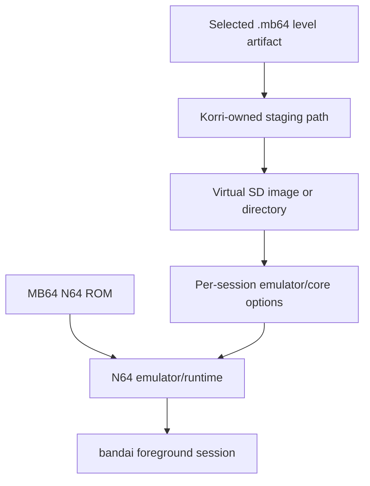
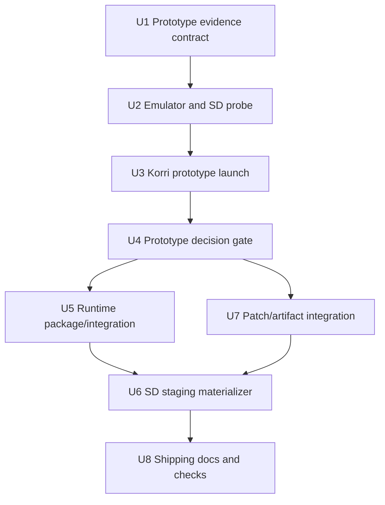

# feat: Prototype Mario Builder 64 support on bandai

## Summary

Prototype Mario Builder 64 on `bandai` first, proving the emulator and virtual SD-card mechanics that make `.mb64` custom levels work before productizing anything. Shipping follows only after the device prototype records the exact core, SD image format, save behavior, and launch contract that Korri can safely package.

---

## Problem Frame

Mario Builder 64 is not a native Linux game like SMBR or SM127. It is an N64 ROM hack: the playable artifact is a ROM loaded by an emulator, and custom levels are `.mb64` files exposed to the ROM through an emulated flashcart/SD-card interface. That SD-card detail is load-bearing: without a working virtual SD path, Korri may boot the ROM but still fail the actual custom-level workflow.

The user wants the first plan slice to prioritize a working prototype on `bandai` via `ssh -p 2222 root@bandai`, then use that evidence to design and ship the production integration.

---

## Requirements

- R1. Phase 1 must prove a working Mario Builder 64 prototype on `bandai` before shipping/productization begins.
- R2. The prototype must determine whether the required MB64 virtual/flashcart SD-card support works through a Korri-usable emulator path on Linux.
- R3. The prototype must prove `.mb64` custom-level loading, not only that the MB64 ROM boots.
- R4. The plan must preserve a conservative legal posture: Korri must not redistribute SM64-derived ROMs or unreviewed MB64 patch assets.
- R5. Phase 1 must record observed facts: emulator/core identity, SD-card mechanism, SD image format/path, `.mb64` placement, save locations, and failure modes.
- R6. Phase 2 must package only the path proven by Phase 1, with an explicit fallback if full custom-level I/O is not viable through the selected emulator.
- R7. Shipping work must keep `.mb64` level artifacts separate from the N64 ROM content argument; the emulator launches the ROM while the level is staged to the virtual SD interface.
- R8. Full Level Share Square account/API integration is not required for this plan; local/sample `.mb64` files are sufficient for the prototype.
- R9. Phase 2 must not begin until the Phase 1 acceptance document marks every prototype evidence gate as PASS or records an explicit blocker/fallback outcome.
- R10. Phase 1 must classify the virtual SD artifact lifecycle as either pure-input/disposable or read-write/durable before any shipping cleanup policy is designed.
- R11. Any player state discovered in RetroArch saves, emulator state, or virtual SD images must live outside launch-scoped cleanup artifacts in the shipping path.
- R12. Prototype and shipping paths must include visible diagnostics for wrong SSH target, missing SD support, invalid `.mb64` source files, insufficient device storage, and ROM/patch provenance mismatches.

---

## Scope Boundaries

- No implementation happens during this planning pass.
- No redistribution of ROM-derived `.z64` artifacts, Nintendo baseroms, or unreviewed MB64 patch downloads.
- No assumption that RetroArch/libretro works for MB64 custom levels until the `bandai` prototype proves the virtual SD path.
- No broad support for every N64 emulator/core before the Linux `bandai` path is proven.
- No full Level Share Square browser, account, rating, comments, or API workflow in the prototype slice.
- No host-side `.mb64` editor/parser beyond minimal staging/validation needed to launch.
- No ROM-level auto-start guarantee for a selected level unless Phase 1 finds a safe and maintainable boot seam.

### Deferred to Follow-Up Work

- Full LSS acquisition plugin for `.mb64` downloads: defer until local `.mb64` staging works and the artifact import path is ready.
- Multi-level library browsing inside Korri: defer until the single selected-level staging model is proven.
- ROM-level auto-start into a specific `.mb64` level: defer unless Phase 1 discovers a supported boot/config seam.
- Broad emulator/platform matrix: defer until `bandai` proves a viable reference path.

---

## Context & Research

### Relevant Code and Patterns

- `product/platform/library/config/app-integrations.ts` defines the built-in RetroArch integration shape: `retroarch --config {configPath} -L {modulePath} {contentPath}`. This is the likely Phase 2 path if MB64 works through a libretro N64 core.
- `product/platform/library/config/records/module.ts` currently allows only `module.kind = "libretro-core"`. If MB64 requires standalone Parallel Launcher rather than a libretro core, Phase 2 needs a deliberate schema/app-integration expansion.
- `product/systems/nixos/images/kiosk.nix` composes `retroarch-bare` with exactly one libretro core using `pkgs.symlinkJoin`; this is the canonical pattern to avoid wrapper-injected duplicate `-L` flags.
- `product/vendor/libretro-fake-08/` is the local vendor/check pattern for a libretro core package.
- `docs/plans/2026-06-03-001-feat-first-class-game-patches-plan.md` is the active plan for BPS/IPS/UPS softpatch staging. MB64 productization should reuse that model for the MB64 BPS patch when it lands, rather than inventing patch handling here.
- `docs/plans/2026-06-04-002-feat-native-artifact-import-plan.md` is the active plan for durable source-native artifacts. Phase 2 should route `.mb64` files through that artifact model once it exists.
- `docs/acceptance/gamescope-control-bandai-2026-06-02.md` shows the repo convention for recording device-specific acceptance evidence on `bandai`.

### Institutional Learnings

- `docs/solutions/runtime-errors/retroarch-bare-passthru-wrapper-injects-l-coredir-2026-05-27.md`: never use `retroarch-bare.passthru.wrapper` for explicit-core launches; use `symlinkJoin` and a stable core path.
- `docs/solutions/runtime-errors/retroarch-png-extension-routes-to-image-display-core-2026-05-27.md`: RetroArch content extension and `-L` ordering are part of the launch contract; `.mb64` is not the content path, the N64 ROM is.
- `docs/solutions/workflow-issues/rocknix-guest-only-nix-deploy-2026-05-27.md`: `ssh -p 2222 root@bandai` targets the NixOS guest; device prototype/deploy work must not accidentally target the ROCKNIX host path.
- `docs/solutions/architecture-patterns/kiosk-foreground-app-policy-over-gamescope-overlay-2026-05-24.md`: emulator foreground behavior belongs in explicit kiosk/session policy, not incidental window behavior.
- `docs/solutions/design-patterns/explicit-cascade-folded-policy-over-incidental-signal-heuristics-2026-05-27.md`: launch behavior should be explicit cascade policy, not inferred from argv/env/file paths.
- `docs/solutions/best-practices/temporary-rocknix-sidecar-media-instead-of-es-gamelist-edits-2026-05-03.md`: Phase 1 sidecar staging should use Korri-owned temporary paths outside EmulationStation-managed library directories.

### External References

- Mario Builder 64 repository: `https://github.com/arthurtilly/Mario-Builder-64`
- HackerSM64 upstream: `https://github.com/HackerN64/HackerSM64`
- Level Share Square MB64 context: `https://wiki.levelsharesquare.com/Mario_Builder_64`
- Community setup guide archive: `https://archive.ph/f4EGX`
- Libretro discussion of MB64 emulator behavior: `https://forums.libretro.com/t/mario-builder-64/45117`

---

## Key Technical Decisions

- Prototype before productizing: Phase 1 is an evidence gate because the virtual SD-card mechanism determines the implementation architecture. Phase 2 is blocked until all prototype gates are explicitly marked PASS or the plan is updated with a documented fallback.
- Treat MB64 as ROM + emulator + virtual SD, not native game package: the N64 ROM remains the emulator content path, while `.mb64` files are staged into the SD-card mechanism.
- Prefer a single selected `.mb64` level for the first shippable model: this matches Korri’s existing one-content launch semantics and avoids inventing all-level playlist/materialization behavior prematurely.
- Keep user-owned ROM and patch artifacts outside Korri distribution: prototype may use local user-provided artifacts on `bandai`; shipping must express requirements and verification without bundling ROM-derived bytes.
- Use libretro/RetroArch only if Phase 1 proves the SD-card mechanism works through a libretro core. If the only working path is standalone Parallel Launcher, Phase 2 must add a separate app integration instead of forcing the libretro module model.
- Use userspace FAT image tooling if an SD image must be generated: `mtools`-style staging is preferred over loop-device workflows because it does not require privileged loop mounts in sessiond.
- Keep Phase 1 staging Korri-owned and deletable: prototype `.mb64` and SD artifacts should live under an explicit Korri sidecar/staging root on device storage, not in EmulationStation-managed ROM directories.
- Split SD lifecycle before shipping: if Phase 1 proves the virtual SD image is pure input, it can be launch-scoped and deleted; if it carries player-created or modified state, the shipping path must store it under durable Korri data/state storage and keep launch artifacts disposable.
- Make log evidence part of the prototype contract: ROM boot, SD activation, `.mb64` visibility, and failure states must be backed by captured emulator/RetroArch logs or filesystem evidence, not operator memory.
- Use content hashes for path-based prototype levels: until `.mb64` files enter the artifact store, compute and record source-level SHA-256 at staging time so silent in-place substitution is visible.

---

## Open Questions

### Resolved During Planning

- Should the first phase be polished packaging or a device prototype? Prototype first on `bandai`; shipping is second phase.
- Does “direct launch” mean guaranteed ROM-level auto-start into the requested level? No for v1 planning. The first target is staging the selected `.mb64` so MB64 can see/load it through the virtual SD workflow; ROM-level auto-start is deferred unless a safe seam is discovered.
- Should `.mb64` be passed as RetroArch content? No. RetroArch content remains the N64 ROM. `.mb64` is level data staged to the emulated SD-card interface.
- Should Phase 1 depend on LSS API integration? No. A local/sample `.mb64` file is enough to prove the runtime path.

### Deferred to Implementation

- Exact emulator/core option keys: Phase 1 must discover these on `bandai`.
- Exact virtual SD image format and expected level directory: Phase 1 must discover and record them.
- Exact SM64 baserom digest expected by the MB64 patch: shipping must verify this against the chosen MB64 patch/source, but Phase 1 may use a known-good local artifact.
- Whether MB64 writes durable state into RetroArch save paths, the virtual SD image, or both: Phase 1 must observe filesystem changes across sessions.
- Whether the shippable path uses a vendored libretro core, a nixpkgs core, ROCKNIX’s existing core, or standalone Parallel Launcher: Phase 1 determines the viable runtime.

---

## Alternative Approaches Considered

| Approach | Why not primary |
|---|---|
| Package MB64 like SM127/SMBR as a native vendor game | MB64 is not a Godot/native Linux game; it is an N64 ROM hack and requires an emulator plus SD-card level I/O. |
| Ship a prebuilt `.z64` ROM | Legal and provenance risk; Korri must not redistribute ROM-derived artifacts. |
| Start with full LSS acquisition | Adds source/API scope before the runtime path is proven. Local `.mb64` files are enough to validate the core risk. |
| Build all-level SD images immediately | Breaks the single-content launch model and makes the first slice harder to verify. Single selected-level staging is the simpler first shippable model. |
| Assume RetroArch/mupen64plus-next is sufficient | External research suggests some cores can play MB64 while lacking the virtual SD support required for custom levels. Device proof is required. |

---

## Phased Delivery

### Phase 1 — Prototype and evidence on `bandai`

- Prove emulator/core availability and MB64 boot.
- Prove `.mb64` custom-level visibility/loading through the SD-card interface.
- Record exact observed core options, image format, paths, save behavior, and failures in an acceptance document.
- Use temporary Korri-owned sidecar paths; do not productize until the evidence gate passes.

### Phase 2 — Shipping/productization

- Package the proven emulator/runtime path.
- Add or extend launch materialization for MB64 SD-card staging.
- Integrate patch/artifact models once the active patch and artifact plans have landed.
- Add tests, Nix checks, docs, and device acceptance for the shippable path.

---

## Phase 1 Evidence Gates

Phase 2 must not begin until the acceptance document records each gate below as PASS, or records a named blocker/fallback outcome and this plan is updated accordingly. The gates are intentionally binary so “ROM boots” cannot be mistaken for “custom levels work.”

| Gate | Evidence to record | Pass condition |
|------|--------------------|----------------|
| G1. Guest target confirmed | SSH target, device identity, and guest/store context | Prototype work is confirmed on `root@bandai` using port `2222`, not the ROCKNIX host. |
| G2. N64 runtime available | Emulator/core name, version, path source, and launch log | A candidate N64 runtime starts on the guest and reports the expected core/runtime identity. |
| G3. Known-good N64 ROM boots | Emulator log and visual/process evidence | A non-MB64 N64 ROM reaches a stable render/session state without core crash. |
| G4. MB64 ROM boots | Emulator log and visual/process evidence | MB64 reaches title/editor/menu state, independent of custom-level SD support. |
| G5. Virtual SD mechanism identified | Exact option/config key, expected SD path/image shape, and active-log evidence | The emulator exposes a virtual/flashcart SD mechanism the MB64 ROM can see. |
| G6. `.mb64` visible to ROM | Staged level hash, staged location, and MB64/emulator evidence | MB64 can enumerate or otherwise detect the staged `.mb64` data. |
| G7. `.mb64` loads and plays | Visual/process/log evidence of selected level load | The staged level opens in MB64, not merely the ROM hub/menu. |
| G8. Save/state lifecycle classified | Filesystem diff before/after clean exit and one unclean termination probe | The plan knows whether SD artifacts are disposable input or durable read-write state. |
| G9. Session isolation proven | Second staged level hash and rerun evidence | Replacing the staged `.mb64` changes the next launch result without stale cached content. |

---

## Output Structure

    docs/acceptance/
      mario-builder-64-bandai-prototype-2026-06-04.md
    product/vendor/libretro-parallel-n64/            # if Phase 1 proves libretro path
      README.md
      package.nix
      check.nix
    product/platform/library/config/
      app-materializer.ts                            # if Phase 2 adds SD staging
      app-integrations.ts                            # if RetroArch args/core options need extension
      records/module.ts                              # only if standalone/non-libretro path is required
    product/systems/nixos/images/
      kiosk.nix                                      # if shipping adds N64 runtime opt-in
    tools/testing/nix/
      korri-rocknix-sm8550-config-check.nix          # closure-shape assertions when runtime ships

This structure is directional. The `product/vendor/libretro-parallel-n64/` path applies only if the working prototype proves a libretro core is the right shippable runtime. If the only viable path is standalone Parallel Launcher, Phase 2 should replace that branch with a new app-integration shape rather than forcing the libretro package layout.

---

## High-Level Technical Design

> *This illustrates the intended approach and is directional guidance for review, not implementation specification. The implementing agent should treat it as context, not code to reproduce.*

The ROM is the executable content for the emulator. The `.mb64` level is data that must be visible to the ROM through the emulator’s virtual SD-card support. Phase 1 discovers the exact SD/core-options path; Phase 2 encodes the proven path as Korri launch materialization.

---

## Implementation Units

### U1. Define prototype evidence contract

**Goal:** Establish the acceptance record and input inventory for the `bandai` prototype so the empirical work produces durable, reviewable facts rather than ad-hoc notes.

**Requirements:** R1, R4, R5

**Dependencies:** None

**Files:**
- Create: `docs/acceptance/mario-builder-64-bandai-prototype-2026-06-04.md`

**Approach:**
- Define the prototype evidence gates G1–G9 from `## Phase 1 Evidence Gates`: guest target confirmed, runtime available, base ROM boots, MB64 boots, virtual SD identified, `.mb64` visible, level loads/plays, save/state lifecycle classified, and session isolation proven.
- Record the local-artifact posture without checking in ROMs, patches, or `.mb64` samples. Include fields for source-level hashes and local provenance notes without embedding artifact paths that will not be portable.
- Capture the SD-card significance in operator language: `.mb64` is level data for the ROM, not the emulator content path. Include a rerun/capture section that tells the implementer what logs, filesystem diffs, and screenshots/process evidence must be saved.

**Execution note:** Characterization-first. Record the expected evidence questions before probing the device.

**Patterns to follow:**
- `docs/acceptance/gamescope-control-bandai-2026-06-02.md`
- `docs/solutions/workflow-issues/rocknix-guest-only-nix-deploy-2026-05-27.md`

**Test scenarios:**
- Test expectation: none — this unit creates an acceptance/evidence artifact, not runtime behavior.

**Verification:**
- The acceptance document names every prototype gate and leaves placeholders for observed core, SD, path, save, and failure facts.

---

### U2. Probe emulator and virtual SD support on bandai

**Goal:** Determine whether MB64 custom-level I/O works on `bandai` through a Korri-usable emulator path.

**Requirements:** R1, R2, R3, R5

**Dependencies:** U1

**Files:**
- Modify: `docs/acceptance/mario-builder-64-bandai-prototype-2026-06-04.md`

**Approach:**
- Discover and record the available N64 emulator/core candidates on the NixOS guest. All prototype probes target `root@bandai` on port `2222`; host-port checks are out of scope except for explicitly named ROCKNIX guest-generation helpers.
- Validate ROM boot separately from custom-level I/O so “ROM runs” is not mistaken for “MB64 works.”
- Probe virtual SD-card mechanisms and record whether they are exposed through RetroArch/libretro core options, standalone Parallel Launcher, or another path. Capture log evidence for both SD-active and SD-missing states so the difference is reproducible.
- Record observed filesystem changes after loading/exiting a level and after one unclean termination to determine which artifacts must be durable and whether FAT image crash recovery needs copy-on-write handling.

**Execution note:** Characterization-first. Do not add repo integration before this evidence proves the target runtime shape.

**Patterns to follow:**
- RetroArch explicit-core constraints from `docs/solutions/runtime-errors/retroarch-bare-passthru-wrapper-injects-l-coredir-2026-05-27.md`
- Device evidence style from `docs/acceptance/gamescope-control-bandai-2026-06-02.md`

**Test scenarios:**
- Happy path: candidate N64 runtime boots a known-good N64 ROM and records the runtime/core identity.
- Happy path: MB64 ROM boots and reaches its level/editor entry point.
- Happy path: a staged `.mb64` file is visible to MB64 through the virtual SD interface and can be loaded.
- Edge case: runtime boots MB64 but cannot expose virtual SD; acceptance notes classify this as partial success and blocks libretro productization.
- Error path: missing core, unsupported GPU/backend, or missing SD image support is captured with logs and a clear next decision.
- Integration: second prototype session can load a different `.mb64` without stale state from the first session masking the result.
- Integration: emulator is terminated during or immediately after a likely SD write, then the next probe records whether the SD image remains mountable/readable and whether MB64 detects corrupted state.

**Verification:**
- Acceptance evidence identifies the working runtime path or explicitly states that no usable custom-level path was found on `bandai`.
- Phase 2 remains blocked until G1–G9 are marked PASS or a blocker/fallback outcome is written into the acceptance document and this plan.

---

### U3. Prove a Korri-managed prototype launch path

**Goal:** After U2 identifies a viable runtime, prove that Korri can launch MB64 on `bandai` while keeping `.mb64` staging under Korri-owned control.

**Requirements:** R1, R3, R5, R7

**Dependencies:** U2

**Files:**
- Modify: `docs/acceptance/mario-builder-64-bandai-prototype-2026-06-04.md`
- Create: `docs/solutions/runtime-errors/mario-builder-64-virtual-sd-prototype-2026-06-04.md` *(only if the prototype uncovers a reusable failure mode or workaround worth preserving)*

**Approach:**
- Use the working runtime from U2 rather than trying to productize multiple candidates.
- Stage `.mb64` files under a named Korri-owned temporary staging root on device storage during the prototype, with a documented rollback/cleanup action for that root.
- Keep the N64 ROM as the emulator content path and connect the staged level through the discovered SD-card mechanism.
- Record whether the prototype is a direct Korri launch, a transient device command, or a manual bridge; do not hide manual steps as product behavior.

**Execution note:** Prototype-first. Keep device-local hacks visible and temporary; do not let them become product design without Phase 2 review.

**Patterns to follow:**
- `docs/solutions/best-practices/temporary-rocknix-sidecar-media-instead-of-es-gamelist-edits-2026-05-03.md`
- `product/platform/library/config/app-integrations.ts` for the eventual RetroArch command shape when applicable

**Test scenarios:**
- Happy path: Korri-owned staging makes the selected `.mb64` visible to the MB64 ROM at launch.
- Edge case: deleting/replacing the staged `.mb64` changes the next launch result, proving the prototype is not reading an unrelated global path.
- Error path: missing staged `.mb64` produces a visible prototype diagnostic or documented failure rather than silently launching with stale data.
- Error path: insufficient free device storage prevents SD artifact creation and is recorded as a staging failure rather than a partial launch.
- Integration: foreground session on `bandai` displays the emulator without hiding Korri or launching on the wrong SSH target.

**Verification:**
- Acceptance evidence includes the repeatable prototype launch shape and distinguishes temporary device-local setup from shippable Korri behavior.

---

### U4. Convert prototype evidence into a shipping decision gate

**Goal:** Turn Phase 1 results into an explicit go/no-go decision for Phase 2 architecture.

**Requirements:** R5, R6

**Dependencies:** U3

**Files:**
- Modify: `docs/acceptance/mario-builder-64-bandai-prototype-2026-06-04.md`
- Modify: `docs/plans/2026-06-04-003-feat-mario-builder-64-bandai-prototype-plan.md`

**Approach:**
- Classify the proven runtime into one of three outcomes: libretro/RetroArch shippable, standalone emulator required, or custom-level I/O not viable on `bandai` yet. This classification is valid only after G1–G9 are completed or an explicit blocker is recorded.
- If libretro works, Phase 2 follows existing RetroArch module/materializer patterns.
- If standalone is required, Phase 2 must add or extend app integration/module records before packaging.
- If no custom-level path works, shipping should stop at a documented MB64 ROM-only launcher or defer custom-level support.
- Output an SD lifecycle posture before U6 begins: pure-input/disposable SD artifacts may live under launch-scoped cleanup, while read-write/durable SD artifacts must live under durable Korri data/state storage and use launch-scoped copies or exclusive-session guards.
- Output a provisional save identity formula before U6 begins so later ROM digest enforcement does not orphan saves accumulated during early shipping iterations.

**Patterns to follow:**
- Decision separation in `docs/plans/2026-06-04-002-feat-native-super-mario-127-support-plan.md`
- Explicit runtime policy learnings in `docs/solutions/architecture-patterns/gamescope-runtime-control-contract-2026-06-02.md`

**Test scenarios:**
- Test expectation: none — this is a planning/evidence gate that revises the downstream route; behavioral tests belong to the selected Phase 2 units.

**Verification:**
- Phase 2 units reference a concrete observed runtime path rather than assumptions.
- Any unsupported path is explicitly deferred or blocked, not silently ignored.

---

### U5. Productize the proven emulator runtime

**Goal:** Add the shippable emulator/runtime surface that corresponds to the Phase 1 evidence.

**Requirements:** R2, R6, R7

**Dependencies:** U4

**Files:**
- Create: `product/vendor/libretro-parallel-n64/README.md` *(if libretro path is proven)*
- Create: `product/vendor/libretro-parallel-n64/package.nix` *(if libretro path is proven)*
- Create: `product/vendor/libretro-parallel-n64/check.nix` *(if libretro path is proven)*
- Modify: `flake.nix`
- Modify: `flake.lock`
- Modify: `product/systems/nixos/overlays/korri-packages.nix`
- Modify: `product/systems/nixos/images/kiosk.nix`
- Modify: `tools/testing/nix/korri-rocknix-sm8550-config-check.nix`
- Modify: `product/platform/library/config/app-integrations.ts` *(only if standalone/non-libretro path is required)*
- Modify: `product/platform/library/config/records/module.ts` *(only if standalone/non-libretro path is required)*
- Test: `product/platform/library/config/app-integrations.test.ts`
- Test: `product/platform/library/config/records/module.test.ts`
- Test: `tools/testing/nix/korri-rocknix-sm8550-config-check.nix`

**Approach:**
- For libretro, follow `product/vendor/libretro-fake-08/` and the `symlinkJoin` kiosk composition pattern rather than `retroarch-bare.passthru.wrapper`.
- Expose a stable core path under `/etc/korri/cores/` so YAML/config does not bake Nix store paths.
- Preserve the one-core-per-runtime invariant deliberately. If MB64 needs a separate kiosk runtime variant, make that explicit rather than appending cores to the existing fake-08 runtime.
- For standalone, add an app integration only after U4 proves libretro cannot supply the SD mechanism.

**Execution note:** Characterization-first for closure shape. Add Nix/config checks that lock the runtime shape before wiring user-facing launcher config.

**Patterns to follow:**
- `product/vendor/libretro-fake-08/package.nix`
- `product/vendor/libretro-fake-08/check.nix`
- `product/systems/nixos/images/kiosk.nix`
- `docs/solutions/runtime-errors/retroarch-bare-passthru-wrapper-injects-l-coredir-2026-05-27.md`

**Test scenarios:**
- Happy path: packaged runtime exposes exactly the expected N64 core path and manifest metadata.
- Happy path: kiosk composition exposes RetroArch plus the N64 core without wrapper-injected duplicate `-L` flags.
- Edge case: app/module compatibility rejects an unsupported module kind when the libretro path is selected.
- Error path: if standalone app integration is selected, module schema rejects ambiguous or missing runtime declarations.
- Integration: Nix configuration check proves the runtime closure includes the expected core and does not accidentally bloat the existing fake-08 runtime.

**Verification:**
- Shippable runtime is available through a stable Korri-owned path and passes colocated/package configuration checks.

---

### U6. Add MB64 virtual SD staging to launch materialization

**Goal:** Teach Korri’s launch materialization to stage a selected `.mb64` level into the proven virtual SD mechanism before launching the MB64 ROM.

**Requirements:** R3, R5, R6, R7

**Dependencies:** U4, U5

**Files:**
- Modify: `product/platform/library/config/app-materializer.ts`
- Modify: `product/platform/library/config/resolved-launch-context.ts`
- Modify: `product/platform/library/config/app-integrations.ts`
- Test: `product/platform/library/config/app-materializer.test.ts`
- Test: `product/platform/library/config/resolved-launch-context.test.ts`

**Approach:**
- Add a named MB64/N64 staging branch only after U4 identifies the runtime mechanism and expected SD image format.
- Prefer a per-session SD image or directory generated under the existing launch-artifacts root only when U4 classifies it as pure-input/disposable; if the SD image carries player state, place the durable source image outside launch-scoped cleanup and use per-launch copies or exclusive-session protection. Do not write global RetroArch core options unless Phase 1 proves no per-session option exists.
- Use the selected `.mb64` artifact/path to populate the virtual SD image, while preserving the MB64 ROM as `{contentPath}`.
- Keep cleanup tied to the launch artifact lifecycle for disposable artifacts only. For large disposable images, add size/free-space preflight diagnostics; for durable images, keep them out of stale launch-artifact eviction entirely.
- Surface SD staging failures as launch materialization diagnostics, not as silent ROM-only fallback.
- Validate `.mb64` input minimally before staging: non-empty, within a documented size bound, and hash-recorded for path-based prototype/shipping bridges.

**Technical design:** Directional only: `ResolvedLaunchContext` should identify the ROM content and the selected MB64 level data separately. The materializer turns the level data into the runtime-specific SD artifact and exposes the resulting path/config to the launcher.

**Patterns to follow:**
- Launch artifact lifecycle in `product/platform/library/config/app-materializer.ts`
- Patch staging shape in `docs/plans/2026-06-03-001-feat-first-class-game-patches-plan.md`
- Temporary sidecar staging learning in `docs/solutions/best-practices/temporary-rocknix-sidecar-media-instead-of-es-gamelist-edits-2026-05-03.md`

**Test scenarios:**
- Happy path: selected `.mb64` path produces a launch-scoped SD artifact and per-session config using the U4-proven mechanism.
- Happy path: generated launch spec still passes the MB64 ROM as the emulator content path.
- Edge case: level filename with spaces or unusual safe characters is staged into the SD artifact without changing semantic identity.
- Edge case: no selected `.mb64` falls back to ordinary MB64 ROM launch only when explicitly configured as ROM-only mode.
- Error path: missing `.mb64` source fails materialization with a visible diagnostic.
- Error path: SD image creation failure fails launch and leaves no partial global core-options state.
- Integration: launch artifact cleanup removes transient SD/config files after terminal session outcome without deleting durable saves or source level files.

**Verification:**
- Unit tests prove ROM content and `.mb64` level data remain separate launch concepts.
- Device acceptance rerun proves the generated staging path still loads on `bandai`.

---

### U7. Connect MB64 to patch and artifact models

**Goal:** Productize user-owned MB64 ROM/patch inputs and `.mb64` level artifacts without coupling acquisition to launch.

**Requirements:** R4, R6, R7, R8

**Dependencies:** U4, and the relevant parts of `docs/plans/2026-06-03-001-feat-first-class-game-patches-plan.md` / `docs/plans/2026-06-04-002-feat-native-artifact-import-plan.md`

**Files:**
- Modify: `product/platform/library/config/records/game.ts`
- Modify: `product/platform/library/config/cascade-resolver.ts`
- Modify: `product/platform/library/config/app-materializer.ts`
- Modify: `product/platform/protocol/artifact/artifact.ts` *(if artifact plan has landed)*
- Modify: `product/platform/artifacts/artifact-import-service.ts` *(if artifact plan has landed)*
- Test: `product/platform/library/config/cascade-resolver.test.ts`
- Test: `product/platform/library/config/app-materializer.test.ts`
- Test: `product/platform/protocol/artifact/artifact.test.ts` *(if artifact plan has landed)*
- Test: `product/platform/artifacts/artifact-import-service.test.ts` *(if artifact plan has landed)*

**Approach:**
- Use the first-class patches model for MB64’s BPS patch over a user-owned SM64 baserom when that model is available.
- Represent `.mb64` files as semantic level artifacts rather than launcher side channels when the artifact import model is available.
- Keep direct local path support for the prototype/shipping bridge if artifact import is not landed yet, but mark it as transitional.
- Record expected base ROM digest requirements as metadata/diagnostics rather than bundling the base ROM.

**Patterns to follow:**
- `docs/plans/2026-06-03-001-feat-first-class-game-patches-plan.md`
- `docs/plans/2026-06-04-002-feat-native-artifact-import-plan.md`
- `docs/solutions/design-patterns/explicit-cascade-folded-policy-over-incidental-signal-heuristics-2026-05-27.md`

**Test scenarios:**
- Happy path: MB64 game record can reference a user-owned base ROM plus MB64 patch without mutating source ROM files.
- Happy path: selected `.mb64` artifact/path is resolved as level data for SD staging, not as emulator content.
- Edge case: wrong or missing base ROM metadata produces a visible diagnostic before shipping path proceeds.
- Error path: missing level artifact fails with a level-staging diagnostic rather than launching stale SD contents.
- Integration: acquisition/artifact code can provide `.mb64` bytes, but library/launch code does not import acquisition plugins directly.

**Verification:**
- MB64 launch inputs are legally and architecturally separated: base ROM/patch as ROM content path, `.mb64` as level data, acquisition as optional upstream source.

---

### U8. Add shipping documentation, checks, and device acceptance

**Goal:** Make the proven MB64 path maintainable and reviewable after it ships.

**Requirements:** R5, R6, R7

**Dependencies:** U5, U6, U7

**Files:**
- Create: `product/vendor/libretro-parallel-n64/README.md` *(if libretro path is selected and not already created in U5)*
- Modify: `docs/deployment/korri-launch-config.md`
- Modify: `docs/acceptance/mario-builder-64-bandai-prototype-2026-06-04.md`
- Create: `docs/acceptance/mario-builder-64-bandai-shipping-2026-06-04.md`
- Test: `tools/testing/nix/korri-rocknix-sm8550-config-check.nix`
- Test: `product/platform/library/config/app-materializer.test.ts`

**Approach:**
- Document the MB64 model in operator terms: ROM content launches; `.mb64` data is staged to virtual SD.
- Include a bump/checklist for emulator/core version changes because SD-card support can regress independently of ROM boot.
- Add Nix/package checks for closure shape and stable core paths.
- Record final device acceptance evidence on `bandai`, including both ROM boot and `.mb64` load.

**Patterns to follow:**
- `product/vendor/super-mario-127/README.md`
- `product/vendor/super-mario-bros-remastered/README.md`
- `docs/deployment/korri-launch-config.md`
- `docs/acceptance/gamescope-control-bandai-2026-06-02.md`

**Test scenarios:**
- Happy path: docs describe the exact shippable launch shape proven on `bandai`.
- Edge case: docs warn that ROM boot without SD support is partial success, not a complete MB64 custom-level integration.
- Integration: acceptance rerun proves the packaged/shipping path still loads a `.mb64` level after the prototype path is replaced.

**Verification:**
- Maintainers can reproduce the shipped MB64 path from docs and checks without rediscovering the SD-card mechanism.

---

## System-Wide Impact

- **Interaction graph:** MB64 touches library config resolution, app materialization, RetroArch/libretro runtime composition, kiosk foreground/session policy, and optional artifact/patch import. The prototype phase intentionally confines most impact to device evidence before code changes.
- **Error propagation:** Missing base ROMs, unsupported patch inputs, absent core SD support, SD image creation failures, and missing `.mb64` files must become visible launch diagnostics rather than silent ROM-only fallback.
- **State lifecycle risks:** Virtual SD images may contain player-created or modified data. Phase 1 must identify whether SD images are disposable staging or durable save state before Phase 2 cleanup policy is finalized.
- **API surface parity:** If Phase 2 adds MB64 launch data beyond `contentPath`, local launch, stream preparation, CLI, and device session launch surfaces must preserve the same behavior.
- **Integration coverage:** Unit tests can prove staging logic, but only device acceptance can prove the emulator sees the virtual SD card and loads `.mb64` files.
- **Unchanged invariants:** Korri does not vendor Nintendo ROMs; acquisition does not launch content; `.mb64` is never passed as the RetroArch content path; existing non-MB64 RetroArch launches must keep their current core/config behavior.

---

## Risks & Dependencies

| Risk | Mitigation |
|------|------------|
| Virtual SD support may not work through a libretro core on `bandai` | Phase 1 explicitly gates productization on custom-level I/O, not ROM boot. If standalone is required, Phase 2 changes app integration strategy. |
| MB64 may boot but fail to load `.mb64` levels | Acceptance gates separate ROM boot from level visibility and load/play proof. |
| Wrong SM64 baserom or patch source may produce broken ROMs | Shipping path must record/verify expected base ROM digests and never bundle ROM-derived bytes. |
| RetroArch wrapper/core routing may silently select the wrong core | Follow the symlinkJoin pattern and add closure/config checks for stable explicit core paths. |
| Virtual SD images may carry durable save data and be deleted too aggressively | U4 must classify SD lifecycle as pure-input or read-write. Read-write images live outside launch-scoped cleanup and require save identity/exclusive-session policy. |
| Adding N64 core bloats kiosk closure or violates one-core invariant | Productization must choose a dedicated runtime/variant or update the invariant deliberately with checks. |
| Artifact/patch plans may not be landed when MB64 shipping starts | Keep Phase 1 path-based/prototype staging independent, and make Phase 2 dependencies explicit. |
| Device prototype may accidentally target ROCKNIX host instead of NixOS guest | Scope and evidence target `ssh -p 2222 root@bandai`; U2 records guest identity and port discipline before accepting any probe result. |
| Disposable SD images may fill device storage | Phase 2 staging must preflight free space, enforce a documented size bound, and fail materialization visibly before creating large artifacts. |
| Unclean emulator exit may corrupt a FAT SD image | Phase 1 includes an unclean-termination probe; Phase 2 chooses copy-on-write, durable image, or disposable staging based on that evidence. |
| Path-based `.mb64` files may be replaced silently before artifact import lands | U6 records source SHA-256 at staging time and surfaces changed content as a diagnostic until artifact identity is durable. |

---

## Documentation / Operational Notes

- Phase 1 should produce acceptance evidence before changing product code.
- Phase 2 should document the distinction between ROM content, BPS patch input, virtual SD artifact, and `.mb64` level data.
- Device operators need a clear statement that MB64 custom-level support requires emulator SD-card support; an N64 core that only boots the ROM is not enough.
- If Phase 1 discovers a reusable failure mode, capture it under `docs/solutions/` so future emulator work does not repeat the same investigation.

---

## Sources & References

- Research target: `https://github.com/arthurtilly/Mario-Builder-64`
- Related plan: `docs/plans/2026-06-03-001-feat-first-class-game-patches-plan.md`
- Related plan: `docs/plans/2026-06-04-002-feat-native-artifact-import-plan.md`
- Related code: `product/platform/library/config/app-integrations.ts`
- Related code: `product/platform/library/config/records/module.ts`
- Related code: `product/systems/nixos/images/kiosk.nix`
- Related pattern: `product/vendor/libretro-fake-08/package.nix`
- Related acceptance pattern: `docs/acceptance/gamescope-control-bandai-2026-06-02.md`
- Institutional learning: `docs/solutions/runtime-errors/retroarch-bare-passthru-wrapper-injects-l-coredir-2026-05-27.md`
- Institutional learning: `docs/solutions/runtime-errors/retroarch-png-extension-routes-to-image-display-core-2026-05-27.md`
- Institutional learning: `docs/solutions/workflow-issues/rocknix-guest-only-nix-deploy-2026-05-27.md`
