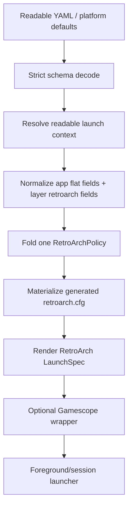

# feat: Add Minimal Typed RetroArch Policy

## Summary

Add a minimal typed `kind: retroarch` readable app contract that renders deterministic RetroArch launches through one Korri-owned path: generated `retroarch.cfg`, explicit `-c`, explicit `-L`, resolved content, process environment overlays, and permanent escape hatches. The implementation will ship the small v1 surface from the brainstorm, not the full 331-key RetroArch configuration mirror.

---

## Problem Frame

RetroArch launch behavior is currently split between built-in app args, raw `settings`, generic cascade fields, and legacy materialization code. That makes precedence hard to reason about: RetroArch can mutate or layer configuration after Korri resolves a launch, and Korri has no typed place to express the small set of RetroArch defaults it already depends on. The v1 goal is to make the current product launch path explicit and deterministic before expanding toward the full RetroArch surface.

---

## Requirements

- R1. Define a minimal typed RetroArch readable policy based on `docs/brainstorms/2026-06-08-004-retroarch-policy-minimal-v1.example.yaml`, using explicit `kind: retroarch` for custom RetroArch app records, inferring RetroArch kind for the built-in `apps.retroarch` app id, and avoiding `apps.retroarch.retroarch` nesting.
- R2. Keep RetroArch app fields flat on `apps.*` records whose `kind` is `retroarch`, while non-app cascade layers contribute namespaced `retroarch:` overrides.
- R3. Preserve a single Korri-owned precedence model: merge readable cascade layers first, then render one generated `retroarch.cfg` and minimal launch argv.
- R4. Emit safe generated-config defaults for generated mode when authors omit them: `config_save_on_exit = false`, `auto_overrides_enable = false`, `auto_remaps_enable = false`, `game_specific_options = false`, and `auto_shaders_enable = false`. Treat `extraSettings` as an explicit break-glass override that renders last.
- R5. Render stable display/audio/input settings through generated `retroarch.cfg`, not duplicate CLI flags. In particular, fullscreen is `video.fullscreen` -> `video_fullscreen`, not `retroarch -f`.
- R6. Render launch identity/control through argv: selected config file, selected libretro core, content path, logging flags, `configFile.append`, and `extraArgs`.
- R7. Keep NixOS-style escape hatches as permanent contract: `extraSettings` renders after typed config settings and wins on key collision; `extraArgs` renders after typed launch args and before content.
- R8. Support process environment overlays with explicit unset semantics for RetroArch process environment.
- R9. Wire the readable launch path so typed RetroArch launches materialize a per-launch config file, pass it with `-c`, and cleanly report materialization/config errors.
- R10. Keep v1 intentionally small; the full one-to-one RetroArch config/flag system remains future work.

---

## Scope Boundaries

- Do not implement the full upstream RetroArch `retroarch.cfg` surface in this plan.
- Do not implement netplay, achievements/secrets, full input binding maps, recording/replay automation, scan/import workflows, or runtime command APIs.
- Do not expose duplicate typed fields for settings already represented in v1; use the chosen field plus `extraSettings`/`extraArgs` for escape hatches.
- Do not rely on RetroArch's own auto override/remap/game-option/shader cascades for product launches in generated mode.
- Do not reintroduce the nixpkgs RetroArch wrapper that injects `-L` or `--appendconfig`; explicit Korri argv must remain unambiguous.
- Do not redesign unrelated app kinds such as MAME, Dolphin, Solarus, web apps, or generic processes beyond the shared `kind` discriminator needed for RetroArch.
- Do not make platform-default deployment for every device a required part of this v1; platform defaults can use the new policy once it exists.

### Deferred to Follow-Up Work

- Expand typed RetroArch coverage toward the full one-to-one file in `docs/brainstorms/2026-06-08-003-retroarch-policy-one-to-one.example.yaml`.
- Add typed surfaces for netplay, achievements, full input bindings, recording/replay, shader/HDR matrices, and runtime command/control workflows.
- Productize reusable platform/default RetroArch fragments for specific hardware classes after the v1 policy/rendering seam is stable.
- Support user-authored `configFile.mode: path` and `configFile.mode: default` only after their precedence and materialization contracts are deliberately designed; v1 rejects them rather than silently degrading.

---

## Context & Research

### Relevant Code and Patterns

- `docs/brainstorms/2026-06-08-004-retroarch-policy-minimal-v1.example.yaml` is the confirmed minimal v1 contract sketch.
- `docs/brainstorms/2026-06-08-003-retroarch-policy-one-to-one.example.yaml` is the broader future reference and should not be fully implemented in v1.
- `product/platform/library/config/inheritable-fields.ts` defines strict typed inheritable policies and is where `RetroArchPolicy` belongs.
- `product/platform/library/config/records/app.ts` is where `kind` and flat app-level RetroArch fields belong.
- `product/platform/library/config/records/system.ts`, `source.ts`, `runtime.ts`, `profile.ts`, `user.ts`, `host.ts`, `preset.ts`, and `library-item.ts` already opt into inheritable policy fields and need `retroarch:` support where the cascade accepts app-specific launch policy.
- `product/platform/library/config/cascade-resolver.ts` contains the readable cascade order and fold helpers to mirror for `foldRetroArch`.
- `product/platform/library/config/app-integrations.ts` currently resolves built-in app integration by id and seeds RetroArch through raw `settings`.
- `product/platform/library/config/app-materializer.ts` currently writes `retroarch.cfg` from flat `LaunchSettings`; v1 needs typed config rendering for readable RetroArch launches.
- `product/platform/library/config/compose-launch-spec.ts` currently renders readable launch specs from command/args placeholders and does not have a readable typed RetroArch `configPath` flow.
- `product/platform/library/proseql/library-repository.ts` is the readable launch-resolution seam that currently resolves context and composes specs without materializing generated app config.
- `product/platform/stream/gamescope-launch-spec.ts` and `product/platform/stream/moonlight-launch-spec.ts` are the closest renderer patterns for pure policy-to-launch-spec code.

### Institutional Learnings

- `docs/solutions/runtime-errors/retroarch-bare-passthru-wrapper-injects-l-coredir-2026-05-27.md`: avoid `retroarch-bare.passthru.wrapper`; wrapper-injected `-L` and `--appendconfig` destroyed explicit core selection.
- `docs/solutions/runtime-errors/retroarch-png-extension-routes-to-image-display-core-2026-05-27.md`: ambiguous RetroArch argv can fall back to content-extension routing; v1 must keep `-L` unambiguous.
- `docs/solutions/design-patterns/explicit-cascade-folded-policy-over-incidental-signal-heuristics-2026-05-27.md`: wrapper/renderer behavior should come from explicit cascade-folded policy, not env/argv sniffing.
- `docs/solutions/architecture-patterns/architectural-posture-as-nix-image-default-2026-05-27.md`: image-level defaults are the right place for product posture once the policy seam exists, but not every platform default needs to land in this v1.

### External References

- RetroArch upstream `retroarch.cfg` skeleton: source for broad config-key inventory and comments.
- RetroArch upstream `config.def.h`: source of defaults such as `config_save_on_exit`, `auto_overrides_enable`, `auto_remaps_enable`, `game_specific_options`, and `auto_shaders_enable`.
- RetroArch upstream `configuration.c`: source for config loading, appendconfig behavior, and key names.
- Libretro override guide: documents core/content/game override and remap load behavior.
- GitHub issue `libretro/RetroArch#17221`: multiple `--appendconfig` flags are not a safe composition model; one pipe-delimited flag is the supported shape.

---

## Key Technical Decisions

- **Use `kind`, not `integration`, as the readable discriminator.** `kind` describes the app contract authors are choosing; `integration` is internal plumbing. Built-in `apps.retroarch` can infer `kind: retroarch`, while custom ids such as `retroarch-nightly` must declare it.
- **Normalize flat app fields and namespaced layer fields into one internal policy.** App records with `kind: retroarch` carry `configFile`, `core`, `content`, `lifecycle`, `paths`, `video`, `audio`, `input`, `extraSettings`, and `extraArgs` directly. Non-app layers carry the same policy under `retroarch:`. Both forms must fold into one `RetroArchPolicy` before rendering.
- **Make generated mode the only supported v1 config-file mode.** The brainstorm shows `generated | path | default`, but v1 should accept/render `generated` only. Unsupported modes should fail clearly until their precedence contract is deliberately designed.
- **Treat lifecycle safety as the generated-mode default floor, not a hidden RetroArch default.** The renderer must emit safe lifecycle values when authors omit them so upstream RetroArch defaults cannot silently win. `extraSettings` remains the explicit break-glass override and renders last; if an operator overrides a safety key there, that is intentional advanced policy.
- **Use generated config for stable settings and argv for launch identity.** Display/audio/input settings render to `retroarch.cfg`. Argv renders `-c`, `-L`, content, logging, appendconfig, and `extraArgs` only.
- **Keep escape hatches first-class and intentionally winning.** `extraSettings` renders after typed settings and wins on duplicate config keys. `extraArgs` renders after typed launch flags and before content. This is a permanent NixOS-style escape hatch, not temporary compatibility.
- **Prefer standalone RetroArch rendering over generic placeholder expansion for typed launches.** A dedicated renderer/materializer can resolve the generated config path, core path, content path, environment overlays, and escape-hatch order without expanding the generic placeholder surface in ambiguous ways. When the typed RetroArch path is active, it must bypass generic `readableBuiltInArgs("retroarch")` so argv is not double-composed.
- **Reject or guard dangerous escape-hatch duplication where it would break launch identity.** `extraArgs` is permanent, but plan/test coverage should prevent accidental duplicate core-selection flags such as `-L`/`--libretro` from silently recreating the historical ambiguity trap.
- **Retire raw `settings` as a RetroArch product-authoring authority for typed apps.** `extraSettings` is the raw config escape hatch for `kind: retroarch`; old `settings` should not remain a second public path for the same generated cfg when typed policy is active.

---

## Open Questions

### Resolved During Planning

- Should v1 flatten `launch` and `config` groups? Yes. The app record is already the RetroArch contract, and the v1 shape is easier to author with direct groups. `configFile` is named distinctly to avoid confusing launch-time config-file selection with generated config settings.
- Should escape hatches be temporary? No. `extraSettings` and `extraArgs` are permanent NixOS-style escape hatches for newer upstream options and urgent platform fixes.
- Should v1 support the full RetroArch config file? No. The full one-to-one file remains the future expansion reference.
- Should fullscreen be rendered as `-f`? No. It should render as `video_fullscreen` in generated config to avoid duplicate authorities and RetroArch override quirks.
- Should v1 include `auto_shaders_enable = false` in generated configs? Yes. It is the same class of silent upstream auto-layer as overrides/remaps/game options.
- Are lifecycle safety keys non-overridable invariants? No. They are safe generated-mode defaults emitted when omitted, while `extraSettings` remains a deliberate break-glass override that renders last.
- Should typed RetroArch activate implicitly for the built-in `retroarch` app id? Yes, but custom app ids require explicit `kind: retroarch`; implementation must migrate fixtures/examples in the same slice that wires rendering so existing built-in launches do not straddle old and new argv paths.

### Deferred to Implementation

- Exact helper/module names for the typed RetroArch renderer and materializer can be chosen while editing the existing launch modules.
- Exact error wording for unsupported `configFile.mode`, dangerous `extraArgs`, missing artifact root, or invalid placeholder resolution can be chosen during implementation, but each failure must be explicit and test-covered.
- Exact enum breadth for `video.aspectRatio` and `input.menuToggleGamepadCombo` can start minimal. Values outside the typed set are supported through `extraSettings`.

---

## High-Level Technical Design

> *This illustrates the intended approach and is directional guidance for review, not implementation specification. The implementing agent should treat it as context, not code to reproduce.*

Decision matrix for v1 rendering:

| Readable field | Rendered surface | Precedence rule |
|---|---|---|
| `command` | `LaunchSpec.command` | app descriptor / cascade resolved |
| `environment` | process env overlay | map merge; null unsets |
| `configFile.mode: generated` | materialize cfg and emit `-c <generated-path>` | only supported mode in v1; generated path is not author-provided |
| `configFile.append` | one `--appendconfig=a|b` argument | list concat in cascade order; default empty |
| `core.path` | `-L <resolved core>` | optional author override; omitted uses selected `runtime.path` |
| `content.path` | final positional content arg | optional author override; omitted uses resolved release content path |
| `logging.verbose` | `-v` when true | scalar last-wins |
| `logging.logFile` | `--log-file=<path>` when set | scalar last-wins |
| `lifecycle` | generated `retroarch.cfg` safety/default keys | safe defaults supplied when omitted; explicit policy or `extraSettings` can override |
| `paths`, `video`, `audio`, `input` | generated `retroarch.cfg` keys | typed settings first |
| `extraSettings` | generated `retroarch.cfg` tail | map merge; renders last; wins on key collision, including break-glass lifecycle overrides |
| `extraArgs` | argv before content | list concat; guard launch-identity duplicates |

---

## Implementation Units

### U1. Define the minimal RetroArch policy schema and app kind

**Goal:** Add the readable schema surface for `kind: retroarch`, flat app-level RetroArch fields, namespaced non-app `retroarch:` overrides, and strict decode behavior.

**Requirements:** R1, R2, R7, R8, R10

**Dependencies:** None

**Files:**
- Modify: `product/platform/library/config/inheritable-fields.ts`
- Modify: `product/platform/library/config/records/app.ts`
- Modify: `product/platform/library/config/records/host.ts`
- Modify: `product/platform/library/config/records/user.ts`
- Modify: `product/platform/library/config/records/system.ts`
- Modify: `product/platform/library/config/records/source.ts`
- Modify: `product/platform/library/config/records/runtime.ts`
- Modify: `product/platform/library/config/records/profile.ts`
- Modify: `product/platform/library/config/records/preset.ts`
- Modify: `product/platform/library/config/records/library-item.ts`
- Modify: `product/platform/library/config/app-integrations.ts`
- Test: `product/platform/library/config/inheritable-fields.test.ts`
- Test: `product/platform/library/config/records/readable-schema.test.ts`

**Approach:**
- Add `RetroArchPolicy` and decode helpers beside existing typed policy schemas.
- Model v1 fields from the minimal YAML: nullable `environment`, `configFile`, optional `core`, optional `content`, `logging`, `lifecycle`, `paths`, `video`, `audio`, `input`, `extraSettings`, and `extraArgs`.
- Add an app `kind` discriminator with known values aligned to current app integration kinds plus future-friendly readable names where appropriate.
- Allow flat RetroArch fields directly on app records when `kind: retroarch` or the built-in app id implies RetroArch.
- Add namespaced `retroarch?: RetroArchPolicy` to non-app cascade-bearing records that can contribute launch policy.
- Keep strict unknown-key rejection for all typed policy objects.
- Limit `configFile.mode` to `generated` in v1 and do not expose `configFile.path`; the generated config path is a runtime materialization fact, not author input. Treat `core.path` and `content.path` as optional overrides; omitted values resolve from the selected runtime and release.
- Define small typed enums only where v1 needs them; use `extraSettings` for values outside the typed set.

**Execution note:** Start with schema tests that decode the minimal v1 example shape and reject misspellings/unsupported modes before wiring launch behavior.

**Patterns to follow:**
- `GamescopePolicy` and `MoonlightPolicy` schema patterns in `product/platform/library/config/inheritable-fields.ts`.
- Strict record decode tests in `product/platform/library/config/records/readable-schema.test.ts`.

**Test scenarios:**
- Happy path: app record with `kind: retroarch`, flat v1 fields, nullable environment, `extraSettings`, and `extraArgs` decodes successfully.
- Happy path: runtime/profile/release records accept namespaced `retroarch:` overrides with the same v1 field shape.
- Happy path: built-in app id `retroarch` can still resolve as RetroArch when `kind` is omitted.
- Happy path: custom app id with `kind: retroarch` resolves to the RetroArch integration instead of generic process.
- Edge case: `environment.FOO: null` is preserved as an explicit process unset.
- Error path: `configFile.mode: path`, `configFile.mode: default`, and user-authored `configFile.path` fail clearly in v1.
- Error path: unknown keys under `video`, `lifecycle`, or `retroarch:` fail strict decode instead of being ignored.
- Error path: legacy/raw `settings` on a `kind: retroarch` app is rejected or diagnosed as a retired duplicate authority in favor of `extraSettings`.

**Verification:**
- The minimal v1 brainstorm YAML shape is accepted by schema tests once adjusted to current record shapes.
- Unsupported future fields fail before launch rendering.

---

### U2. Implement RetroArch cascade normalization and merge semantics

**Goal:** Fold app-level flat RetroArch fields and namespaced layer overrides into one resolved `RetroArchPolicy` with deterministic precedence.

**Requirements:** R2, R3, R7, R8

**Dependencies:** U1

**Files:**
- Modify: `product/platform/library/config/cascade-resolver.ts`
- Modify: `product/platform/library/config/resolved-launch-context.ts`
- Modify: `product/platform/library/config/app-integrations.ts`
- Test: `product/platform/library/config/inheritable-fields.test.ts`
- Test: `product/platform/library/config/readable-cascade-resolver.test.ts`
- Test: `product/platform/library/config/cascade-resolver.test.ts`

**Approach:**
- Add `retroarch?: RetroArchPolicy` to readable/resolved launch context types.
- Normalize flat app-level RetroArch fields into the same internal policy object used by namespaced `retroarch:` layers.
- Fold policies in the existing readable cascade order.
- Use leaf-level deep merge for structured groups, scalar last-wins for scalar fields, map merge for `environment` and `extraSettings`, list concat for `extraArgs` and `configFile.append`.
- Seed safe built-in RetroArch defaults from a typed baseline instead of raw built-in `settings`.
- Explicitly retire `builtInApps.retroarch.args` from the typed readable path so it cannot double-compose with the new renderer; any remaining legacy/non-readable use must be documented as outside the typed path.
- Preserve nullable environment unsets through the cascade.
- Make `extraSettings` intentionally win over typed settings at render time, but merge it as a map during cascade resolution.

**Execution note:** Add direct fold tests before end-to-end launch tests so merge behavior is pinned independently of materialization.

**Patterns to follow:**
- `foldGamescope` / `foldMoonlight` in `product/platform/library/config/cascade-resolver.ts`.
- Existing readable cascade tests that exercise app/runtime/release/profile precedence.

**Test scenarios:**
- Happy path: app defaults for lifecycle/video/audio remain when a profile overrides only `video.fullscreen`.
- Happy path: runtime `retroarch.core.path` overrides app `core.path` without replacing unrelated app config fields.
- Happy path: release `retroarch.extraSettings.video_font_enable` overrides a less-specific profile value for the same key while preserving other keys.
- Happy path: `extraArgs` from app/profile/release concatenate in cascade order.
- Happy path: `environment` merges across layers and a more-specific `null` unsets a less-specific string.
- Edge case: an empty `retroarch:` object does not accidentally disable built-in deterministic defaults.
- Error path: an explicit non-RetroArch custom app without `kind: retroarch` does not receive RetroArch materialization.

**Verification:**
- Resolved launch contexts carry exactly one merged RetroArch policy for RetroArch apps.
- No second raw `settings` authority participates in typed RetroArch config generation.

---

### U3. Add pure RetroArch config and argv rendering

**Goal:** Create the deterministic renderer that turns a merged `RetroArchPolicy` plus resolved launch facts into generated `retroarch.cfg` content and RetroArch argv/env.

**Requirements:** R3, R4, R5, R6, R7, R8

**Dependencies:** U1, U2

**Files:**
- Create: `product/platform/stream/retroarch-launch-spec.ts`
- Create: `product/platform/stream/retroarch-launch-spec.test.ts`
- Modify: `product/platform/library/config/app-materializer.ts`
- Test: `product/platform/library/config/app-materializer.test.ts`

**Approach:**
- Add a pure renderer for typed RetroArch v1 that accepts resolved facts such as command, config path, runtime/core path, content path, and merged policy.
- Render generated `retroarch.cfg` in stable order: safe lifecycle defaults/typed lifecycle values, typed `paths`, typed `video`, typed `audio`, typed `input`, then `extraSettings`.
- Render `extraSettings` last and intentionally allow it to override typed keys in the final file, including break-glass lifecycle overrides.
- Render argv with one canonical order: logging, `-c`, optional single pipe-delimited `--appendconfig`, `-L`, `extraArgs`, content.
- Render process environment overlays with nullable unset semantics.
- Treat dangerous launch-identity duplication in `extraArgs` as a validation error or explicit guarded diagnostic; `-L`/`--libretro` should not silently reappear through the escape hatch.
- Reuse RetroArch value serialization conventions from the current materializer where possible.

**Execution note:** Implement renderer tests first with exact argv and config text expectations; then adapt materializer code to use the renderer.

**Patterns to follow:**
- Pure renderer shape in `product/platform/stream/gamescope-launch-spec.ts` and `product/platform/stream/moonlight-launch-spec.ts`.
- Existing `serializeRetroarchValue` behavior in `product/platform/library/config/app-materializer.ts`.

**Test scenarios:**
- Happy path: minimal policy renders `retroarch -c <config> -L <core> <content>` from resolved runtime/content facts and generated cfg includes safe lifecycle defaults even when author omitted lifecycle, `core`, and `content`.
- Happy path: `video.fullscreen`, `video.windowedFullscreen`, `video.vsync`, and `video.aspectRatio: core-provided` render to expected flat cfg keys/values.
- Happy path: `audio.latencyMs` and `input.menuToggleGamepadCombo: start-select` render to expected cfg key/value pairs.
- Happy path: `logging.verbose: true` and `logging.logFile` render argv flags before config/core/content args.
- Happy path: multiple `configFile.append` entries render as one pipe-delimited `--appendconfig` argument.
- Happy path: `extraSettings` renders after typed settings and wins when it repeats a typed key, including an explicitly tested break-glass lifecycle key.
- Happy path: `extraArgs` renders after typed launch args and before content.
- Edge case: `environment` with `FOO: null` yields an explicit unset operation for the spawned RetroArch process.
- Error path: unsupported `configFile.mode` cannot reach renderer as a silent default.
- Error path: `extraArgs` containing `-L` or `--libretro` fails or reports a guarded config error.

**Verification:**
- The renderer can reproduce the current product launch contract with deterministic generated config and without using `retroarch -f`.

---

### U4. Wire typed RetroArch materialization into readable launches

**Goal:** Make readable library launches for RetroArch generate a per-launch config file, pass it with `-c`, and surface failures through existing launch/config error paths.

**Requirements:** R3, R6, R8, R9

**Dependencies:** U2, U3

**Files:**
- Modify: `product/platform/library/proseql/library-repository.ts`
- Modify: `product/platform/library/config/compose-launch-spec.ts`
- Modify: `product/platform/library/config/app-materializer.ts`
- Modify: `product/platform/library/library-error-mapping.ts`
- Modify: `product/apps/portal/api/library/launch.rpc-handler.ts`
- Modify: `product/platform/library/launcher.ts`
- Test: `product/platform/library/proseql/library-repository.test.ts`
- Test: `product/platform/library/config/readable-cascade-resolver.test.ts`
- Test: `product/platform/library/config/app-materializer.test.ts`
- Test: `product/apps/portal/api/library/launch.rpc-handler.test.ts`
- Test: `product/platform/library/launcher.test.ts`

**Approach:**
- Add a readable launch materialization step for resolved RetroArch apps after context resolution and before final `LaunchSpec` composition. The dispatch predicate is the resolved app kind/integration, not argv inspection.
- Route typed RetroArch launches away from generic `readableBuiltInArgs("retroarch")`/placeholder composition so only the typed renderer builds `-c`, `-L`, `extraArgs`, and content argv.
- Thread the artifact root/environment needed to write generated configs through the readable repository launch path, using the same repository/options environment source that existing materialization/adoption code already receives.
- Treat the generated config path as a resolved fact passed directly to the RetroArch renderer instead of exposing `{configPath}` as a generic authoring placeholder.
- Ensure config materialization failures become explicit launch/config failures rather than unresolved placeholders or child-process failures.
- Keep generic-process launch composition unchanged for non-RetroArch apps.
- Preserve patch materialization behavior deliberately: v1 should not accidentally bypass existing patch staging, nor should it introduce a second patch authority.
- Ensure shell/device launchers honor environment unsets produced by typed RetroArch policy.

**Execution note:** Add an end-to-end repository/launch test that fails before the materialization seam exists, then wire the seam.

**Patterns to follow:**
- Existing artifact-root handling in `product/platform/library/config/app-materializer.ts`.
- Error mapping style in `product/platform/library/library-error-mapping.ts` and launch RPC handlers.
- Nullable env execution behavior already used by typed Gamescope policy work.

**Test scenarios:**
- Happy path: resolving/launching a readable GBA release with `kind: retroarch` produces a `LaunchSpec` with `-c <generated retroarch.cfg>`, `-L <runtime.path>`, and the resolved content path.
- Happy path: the generated cfg file exists under the launch artifacts root and contains safe lifecycle defaults plus typed settings.
- Happy path: custom app id with `kind: retroarch` and custom command still uses typed RetroArch materialization.
- Happy path: built-in `app: retroarch` launch uses the typed renderer once this unit lands and does not also apply generic built-in RetroArch args.
- Happy path: non-RetroArch generic app does not materialize a RetroArch config.
- Integration: portal launch RPC catches materialization/render validation errors and returns a config-shaped failure rather than spawning a broken command.
- Edge case: missing launch artifact root for a generated config fails before process spawn with a clear error.
- Edge case: environment unset survives repository -> launch spec -> launcher environment construction; existing shell launcher unset behavior remains unchanged.
- Error path: unresolved runtime/core path or missing content path fails during launch composition rather than producing literal placeholders.

**Verification:**
- A readable RetroArch launch no longer relies on raw `settings` or an unresolved `{configPath}` placeholder to pass generated config to RetroArch.

---

### U5. Update examples, fixtures, docs, and retired-vocabulary guards

**Goal:** Move checked-in readable examples and tests to the minimal typed RetroArch policy shape and document the v1/future boundary.

**Requirements:** R1, R5, R7, R10

**Dependencies:** U1, U2, U3, U4

**Files:**
- Modify: `docs/brainstorms/2026-06-08-004-retroarch-policy-minimal-v1.example.yaml`
- Modify: `docs/brainstorms/2026-06-08-003-retroarch-policy-one-to-one.example.yaml`
- Modify: `korri-catalog-display-metadata.example.yaml`
- Modify: `product/platform/library/config/authoring/examples.test.ts`
- Modify: `product/platform/library/proseql/library-db.test.ts`
- Modify: `product/apps/portal/api/source/list.rpc-handler.test.ts`
- Modify: `tools/library/launcher-config-cli.ts`

**Approach:**
- Update examples to use `kind: retroarch`, flat app-level fields, and namespaced `retroarch:` overrides on non-app layers.
- Replace raw RetroArch `settings` examples with typed fields or `extraSettings` where a setting is not typed.
- Add retired-vocabulary tests for duplicate/old authoring surfaces that would create a second authority for typed RetroArch apps.
- Keep the one-to-one brainstorm as future reference, but align its top-level naming direction with the v1 choices if it still shows `apps.retroarch.retroarch` or `integration`.
- Document escape-hatch precedence and the safe generated-mode lifecycle defaults in author-facing examples.

**Patterns to follow:**
- Example acceptance tests in `product/platform/library/config/authoring/examples.test.ts`.
- Readable schema/fixture migration style from the Gamescope and Moonlight typed policy work.

**Test scenarios:**
- Happy path: the minimal v1 brainstorm/example parses as YAML and is accepted by the readable schema once implementation lands.
- Happy path: `korri-catalog-display-metadata.example.yaml` uses typed RetroArch fields for current RetroArch launch behavior.
- Happy path: examples demonstrate `extraSettings` and `extraArgs` as explicit escape hatches without using them for fields already typed.
- Error path: examples/tests reject `apps.retroarch.retroarch`, `integration: retroarch`, unsupported `configFile.mode`, and raw `settings` as RetroArch typed app config.
- Regression: existing RockNix source tests should continue to resolve default RetroArch app/runtime choices without requiring parser changes; treat failures there as compatibility signals, not a reason to rewrite RockNix source parsing.

**Verification:**
- Checked-in examples express current RetroArch launch policy through the minimal typed contract and no longer teach duplicate raw config channels for typed RetroArch apps.

---

### U6. Add Nix/package regression checks for explicit RetroArch argv assumptions

**Goal:** Guard the runtime/package assumptions that make the typed RetroArch renderer safe: no wrapper-injected `-L`, no wrapper-injected `--appendconfig`, and availability of the patched RetroArch features already expected by Korri.

**Requirements:** R3, R6, R9

**Dependencies:** U3, U4

**Files:**
- Modify: `product/systems/nixos/images/kiosk.nix`
- Modify: `product/systems/nixos/overlays/korri-packages.nix`
- Modify: `tools/testing/nix/korri-retroarch-xdelta-check.nix`
- Modify: `product/systems/nixos/flake/checks.nix`
- Test: `tools/testing/nix/korri-retroarch-xdelta-check.nix`

**Approach:**
- Preserve the existing `symlinkJoin`/unwrapped RetroArch packaging posture and document why the nixpkgs wrapper remains off-limits for typed launches.
- Extend existing Nix checks where practical so regression to a wrapper-injected command shape is caught at evaluation/build-check time.
- Keep package checks focused on explicit argv assumptions; do not use this unit to deploy broad platform-default RetroArch policy fragments.

**Patterns to follow:**
- Existing RetroArch wrapper learning in `docs/solutions/runtime-errors/retroarch-bare-passthru-wrapper-injects-l-coredir-2026-05-27.md`.
- Existing check registration in `product/systems/nixos/flake/checks.nix`.

**Test scenarios:**
- Happy path: Nix check confirms the RetroArch command used by kiosk images is not the wrapper variant that injects `-L`/`--appendconfig`.
- Happy path: existing xdelta check still proves Korri's patched RetroArch package exposes the expected patch flag.
- Regression: a future change that reintroduces wrapper-injected core args fails the check.

**Verification:**
- Typed RetroArch launch tests and Nix checks agree that Korri owns `-c`, `-L`, `--appendconfig`, and content argv order.

---

## System-Wide Impact

- **Interaction graph:** Readable YAML decode, app descriptor resolution, cascade resolution, materialization, launch-spec rendering, RPC launch handling, shell/device execution, and Nix package checks are all touched.
- **Error propagation:** Schema errors should fail at decode; cascade/render errors should surface as configuration failures; materialization errors should fail before process spawn; child process errors remain launch/runtime failures.
- **State lifecycle risks:** Generated configs require a writable launch-artifacts root and stale-artifact cleanup. Config write failures must not leave partially successful launch specs.
- **API surface parity:** Local library launches, portal RPC launches, CLI launcher config output, and tests/fixtures should all see the same typed RetroArch policy behavior.
- **Integration coverage:** Unit tests for schema/fold/rendering are not enough; at least one repository/RPC path test must prove config materialization and launch-spec composition work together.
- **Unchanged invariants:** Runtime selection still comes from readable release/runtime resolution; content targets remain relative to source storage; Gamescope wrapping remains a separate sibling policy; full RetroArch one-to-one coverage remains out of v1.

---

## Risks & Dependencies

| Risk | Mitigation |
|------|------------|
| RetroArch's own override/remap/shader cascades silently beat Korri policy | Renderer emits safe generated-mode lifecycle defaults when authors omit them and tests that behavior. `extraSettings` can still intentionally override them as a break-glass escape hatch. |
| Escape hatches recreate ambiguous launch identity | Keep escape hatches permanent but guard `extraArgs` from duplicating `-L`/`--libretro`; document render order and add tests. |
| Flat app fields and namespaced layer fields become two authorities | Normalize both forms into one internal `RetroArchPolicy` before merge/render. |
| Generated config path is unavailable in the readable launch path | U4 explicitly wires materialization and the generated config path as a resolved fact before rendering the LaunchSpec, without exposing `{configPath}` as a generic authoring placeholder. |
| Legacy/raw `settings` remains a duplicate RetroArch config authority | Retire or reject `settings` for typed RetroArch apps; use `extraSettings` for raw config escape hatches. |
| Nix wrapper regression injects conflicting args | U6 extends/checks package shape and cites the existing solution doc. |
| Broad schema changes touch many record types | U1/U2 isolate schema/cascade work and require strict schema and cascade tests before launch wiring. |
| v1 enums are too narrow for real operators | Keep typed enum surface small but provide `extraSettings` for raw upstream values. |

---

## Alternative Approaches Considered

- **Keep `launch:` and `config:` nested groups:** Rejected for v1 authoring because the app record is already a RetroArch contract and the user explicitly preferred lifting. The plan keeps `configFile` distinct to avoid ambiguity.
- **Use `integration: retroarch`:** Rejected because it exposes internal plumbing. `kind: retroarch` is the readable discriminator.
- **Implement raw `settings` only:** Rejected because it preserves the current duplicate-authority problem and does not express v1 intent like deterministic generated-mode lifecycle policy.
- **Implement the full one-to-one RetroArch config now:** Rejected as too large for the first buildable slice. The one-to-one brainstorm remains the future expansion map.
- **Let RetroArch default config/override cascade participate:** Rejected because it makes Korri's readable cascade non-authoritative and can silently change launches based on prior interactive RetroArch state.

---

## Documentation / Operational Notes

- Update examples to state that `extraSettings` and `extraArgs` are permanent escape hatches, not deprecated compatibility paths.
- Document that generated mode is deterministic and disables RetroArch config mutation/auto layers by default.
- Call out that `configFile.append` is an escape hatch, not the normal composition mechanism.
- Mention that platform images can render `apps.retroarch` defaults once v1 exists, but broad platform-default rollout is follow-up work.

---

## Sources & References

- Brainstorm: `docs/brainstorms/2026-06-08-004-retroarch-policy-minimal-v1.example.yaml`
- Future reference brainstorm: `docs/brainstorms/2026-06-08-003-retroarch-policy-one-to-one.example.yaml`
- Related typed policy plan: `docs/plans/2026-06-08-001-feat-typed-gamescope-policy-api-plan.md`
- Related typed policy plan: `docs/plans/2026-06-08-002-feat-typed-moonlight-policy-api-plan.md`
- Schema: `product/platform/library/config/inheritable-fields.ts`
- Cascade: `product/platform/library/config/cascade-resolver.ts`
- App integration: `product/platform/library/config/app-integrations.ts`
- Materializer: `product/platform/library/config/app-materializer.ts`
- Launch composition: `product/platform/library/config/compose-launch-spec.ts`
- Repository launch seam: `product/platform/library/proseql/library-repository.ts`
- Learning: `docs/solutions/runtime-errors/retroarch-bare-passthru-wrapper-injects-l-coredir-2026-05-27.md`
- Learning: `docs/solutions/runtime-errors/retroarch-png-extension-routes-to-image-display-core-2026-05-27.md`
- Learning: `docs/solutions/design-patterns/explicit-cascade-folded-policy-over-incidental-signal-heuristics-2026-05-27.md`
- External docs: `https://docs.libretro.com/guides/overrides/`
- External source: `https://raw.githubusercontent.com/libretro/RetroArch/master/retroarch.cfg`
- External source: `https://raw.githubusercontent.com/libretro/RetroArch/master/config.def.h`
- External source: `https://raw.githubusercontent.com/libretro/RetroArch/master/configuration.c`
